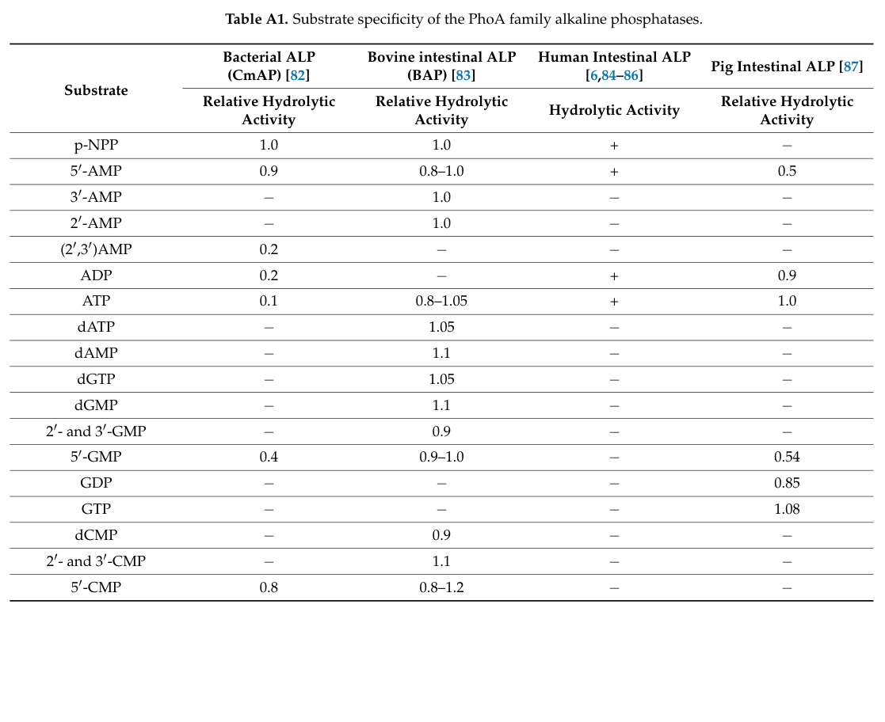

## Question

# Gene Research for Functional Annotation

## ⚠️ CRITICAL: Gene/Protein Identification Context

**BEFORE YOU BEGIN RESEARCH:** You MUST verify you are researching the CORRECT gene/protein. Gene symbols can be ambiguous, especially for less well-characterized genes from non-model organisms.

### Target Gene/Protein Identity (from UniProt):
- **UniProt Accession:** P15693
- **Protein Description:** RecName: Full=Intestinal-type alkaline phosphatase 1; Short=IAP-1; Short=Intestinal alkaline phosphatase 1; EC=3.1.3.1; AltName: Full=Intestinal alkaline phosphatase I; Short=IAP-I; Flags: Precursor;
- **Gene Information:** Name=Alpi;
- **Organism (full):** Rattus norvegicus (Rat).
- **Protein Family:** Belongs to the alkaline phosphatase family. .
- **Key Domains:** Alkaline_phosphatase. (IPR001952); Alkaline_phosphatase_AS. (IPR018299); Alkaline_phosphatase_core_sf. (IPR017850); Alk_phosphatase (PF00245)

### MANDATORY VERIFICATION STEPS:

1. **Check if the gene symbol "Alpi" matches the protein description above**
2. **Verify the organism is correct:** Rattus norvegicus (Rat).
3. **Check if protein family/domains align with what you find in literature**
4. **If you find literature for a DIFFERENT gene with the same or similar symbol, STOP**

### If Gene Symbol is Ambiguous or You Cannot Find Relevant Literature:

**DO NOT PROCEED WITH RESEARCH ON A DIFFERENT GENE.** Instead:
- State clearly: "The gene symbol 'Alpi' is ambiguous or literature is limited for this specific protein"
- Explain what you found (e.g., "Found extensive literature on a different gene with the same symbol in a different organism")
- Describe the protein based ONLY on the UniProt information provided above
- Suggest that the protein function can be inferred from domain/family information

### Research Target:

Please provide a comprehensive research report on the gene **Alpi** (gene ID: Alpi, UniProt: P15693) in rat.

The research report should be a detailed narrative explaining the function, biological processes, and localization of the gene product. Citations should be given for all claims.

You should prioritize authoritative reviews and primary scientific literature when conducting research. You can supplement
this with annotations you find in gene/protein databases, but these can be outdated or inaccurate.

We are specifically interested in the primary function of the gene - for enzymes, what reaction is catalyzed, and what is the substrate specificity? For transporters, what is the substrate? For structural proteins or adapters, what is the broader structural role? For signaling molecules, what is the role in the pathway.

We are interested in where in or outside the cell the gene product carries out its function.

We are also interested in the signaling or biochemical pathways in which the gene functions. We are less interested in broad pleiotropic effects, except where these elucidate the precise role.

Include evidence where possible. We are interested in both experimental evidence as well as inference from structure, evolution, or bioinformatic analysis. Precise studies should be prioritized over high-throughput, where available.

## Output

Question: You are an expert researcher providing comprehensive, well-cited information.

Provide detailed information focusing on:
1. Key concepts and definitions with current understanding
2. Recent developments and latest research (prioritize 2023-2024 sources)
3. Current applications and real-world implementations
4. Expert opinions and analysis from authoritative sources
5. Relevant statistics and data from recent studies

Format as a comprehensive research report with proper citations. Include URLs and publication dates where available.
Always prioritize recent, authoritative sources and provide specific citations for all major claims.

# Gene Research for Functional Annotation

## ⚠️ CRITICAL: Gene/Protein Identification Context

**BEFORE YOU BEGIN RESEARCH:** You MUST verify you are researching the CORRECT gene/protein. Gene symbols can be ambiguous, especially for less well-characterized genes from non-model organisms.

### Target Gene/Protein Identity (from UniProt):
- **UniProt Accession:** P15693
- **Protein Description:** RecName: Full=Intestinal-type alkaline phosphatase 1; Short=IAP-1; Short=Intestinal alkaline phosphatase 1; EC=3.1.3.1; AltName: Full=Intestinal alkaline phosphatase I; Short=IAP-I; Flags: Precursor;
- **Gene Information:** Name=Alpi;
- **Organism (full):** Rattus norvegicus (Rat).
- **Protein Family:** Belongs to the alkaline phosphatase family. .
- **Key Domains:** Alkaline_phosphatase. (IPR001952); Alkaline_phosphatase_AS. (IPR018299); Alkaline_phosphatase_core_sf. (IPR017850); Alk_phosphatase (PF00245)

### MANDATORY VERIFICATION STEPS:

1. **Check if the gene symbol "Alpi" matches the protein description above**
2. **Verify the organism is correct:** Rattus norvegicus (Rat).
3. **Check if protein family/domains align with what you find in literature**
4. **If you find literature for a DIFFERENT gene with the same or similar symbol, STOP**

### If Gene Symbol is Ambiguous or You Cannot Find Relevant Literature:

**DO NOT PROCEED WITH RESEARCH ON A DIFFERENT GENE.** Instead:
- State clearly: "The gene symbol 'Alpi' is ambiguous or literature is limited for this specific protein"
- Explain what you found (e.g., "Found extensive literature on a different gene with the same symbol in a different organism")
- Describe the protein based ONLY on the UniProt information provided above
- Suggest that the protein function can be inferred from domain/family information

### Research Target:

Please provide a comprehensive research report on the gene **Alpi** (gene ID: Alpi, UniProt: P15693) in rat.

The research report should be a detailed narrative explaining the function, biological processes, and localization of the gene product. Citations should be given for all claims.

You should prioritize authoritative reviews and primary scientific literature when conducting research. You can supplement
this with annotations you find in gene/protein databases, but these can be outdated or inaccurate.

We are specifically interested in the primary function of the gene - for enzymes, what reaction is catalyzed, and what is the substrate specificity? For transporters, what is the substrate? For structural proteins or adapters, what is the broader structural role? For signaling molecules, what is the role in the pathway.

We are interested in where in or outside the cell the gene product carries out its function.

We are also interested in the signaling or biochemical pathways in which the gene functions. We are less interested in broad pleiotropic effects, except where these elucidate the precise role.

Include evidence where possible. We are interested in both experimental evidence as well as inference from structure, evolution, or bioinformatic analysis. Precise studies should be prioritized over high-throughput, where available.

## Research report: Rat **Alpi** (UniProt **P15693**) — intestinal-type alkaline phosphatase 1 (IAP-1; EC 3.1.3.1)

### 1) Target verification (critical identity check)
The requested target (UniProt **P15693**) corresponds to **Rattus norvegicus** intestinal-type alkaline phosphatase (IAP), an intestinal brush-border alkaline phosphatase family ectoenzyme (EC 3.1.3.1), matching the alkaline phosphatase family functional profile and the expected apical/brush-border localization in enterocytes. (santos2022intestinalalkalinephosphatase pages 1-2, narisawa2007anovelphosphatase pages 9-10)

A key caveat for rat intestinal alkaline phosphatase literature is that rat intestine has been described as having **multiple intestinal IAP isozymes/genes**, including “IAP I” vs “IAP II” (and gene-level descriptions such as **Alpi1/Alpi2**), with different segmental expression and secretion behavior. This does not contradict UniProt P15693 being an intestinal IAP; rather, it means some older rat studies discuss intestinal IAP as isozyme I/II rather than by UniProt accession, so mapping to P15693 can be indirect. (narisawa2007anovelphosphatase pages 1-2, narisawa2007anovelphosphatase pages 9-10)

### 2) Key concepts and definitions (current understanding)

#### 2.1 Enzymatic definition and primary catalytic reaction
Intestinal alkaline phosphatase (IAP; including rat ALPI) is a **phosphomonoesterase** that hydrolyzes phosphate monoesters (optimal activity at alkaline pH), releasing **inorganic phosphate**. (santos2022intestinalalkalinephosphatase pages 1-2)

In the gut, the “canonical” functional reaction emphasized in modern mechanistic literature is **detoxification of bacterial lipopolysaccharide (LPS)** by **dephosphorylating lipid A phosphate groups**, which markedly reduces LPS inflammatory potency. (balabanova2024insightsintoalkaline pages 4-5, santos2022intestinalalkalinephosphatase pages 1-2)

#### 2.2 Substrate scope and substrate specificity
IAP is widely described as a **broad-specificity ectoenzyme**. A 2024 review compiled comparative substrate specificity across PhoA-family alkaline phosphatases, showing intestinal alkaline phosphatases hydrolyze multiple substrates including nucleotides and (detectably, for human/pig intestinal APs) LPS. (balabanova2024insightsintoalkaline pages 11-13, balabanova2024insightsintoalkaline media 22e93c48, balabanova2024insightsintoalkaline media 5809a0ae, balabanova2024insightsintoalkaline media 8450adc2)

Beyond LPS, a major mechanistic axis is **purinergic nucleotide dephosphorylation**: IAP can dephosphorylate extracellular **ATP, ADP, and AMP** to generate **adenosine**, an anti-inflammatory mediator that signals through adenosine receptors and suppresses inflammatory signaling pathways. (balabanova2024insightsintoalkaline pages 5-7, balabanova2024insightsintoalkaline pages 4-5)

The 2024 mechanistic synthesis also highlights that IAP/ALP can cleave a broad set of phosphorylated metabolites (e.g., PPi and other phosphate-containing molecules), underscoring that substrate breadth is integral to its physiological roles. (balabanova2024insightsintoalkaline pages 5-7, balabanova2024insightsintoalkaline pages 11-13)

#### 2.3 Localization and biochemical form (where ALPI acts)
IAP is a **brush-border ectoenzyme** expressed by enterocytes. It is described as **GPI-anchored** to the apical membrane/brush border and is also detected outside the cell because it can be released from the brush border. (balabanova2024insightsintoalkaline pages 4-5, narisawa2007anovelphosphatase pages 9-10)

Cross-species intestinal IAP biology indicates that “IAP is anchored via a glycosyl-phosphatidylinositol (GPI) anchor” in the apical brush border, yet IAP activity can be detected in **lymph/serum** and can associate with membrane/surfactant-like particles from enterocytes, supporting both membrane-bound and extracellular/luminal modes of action. (narisawa2007anovelphosphatase pages 9-10, narisawa2007anovelphosphatase pages 1-2)

### 3) Mechanistic pathways: how ALPI controls intestinal inflammation and barrier function

#### 3.1 LPS → TLR4/NF-κB axis (endotoxin detoxification)
A consistent modern model is that dephosphorylated LPS retains the ability to bind TLR4 but becomes much less inflammatory, functioning largely as a **TLR4 antagonist** and thereby suppressing downstream **NF-κB signaling** and pro-inflammatory mediators (e.g., cytokines and inflammatory enzymes). (balabanova2024insightsintoalkaline pages 4-5)

Recent expert synthesis also proposes a trafficking-based mechanism: IAP is lipid-raft-associated and can be released as aggregates/vesicles that bind LPS and may promote LPS endocytosis and endosomal dephosphorylation/detoxification, extending IAP action beyond simple “bulk lumen detoxification”. (balabanova2024insightsintoalkaline pages 8-9)

#### 3.2 Purinergic signaling axis (ATP/ADP/AMP → adenosine)
IAP participates in anti-inflammatory control by degrading extracellular ATP/ADP/AMP to **adenosine**, shifting signaling from pro-inflammatory P2 purinergic receptor pathways toward adenosine receptor signaling (often discussed via **A2A** receptor-dependent anti-inflammatory effects). (balabanova2024insightsintoalkaline pages 5-7, balabanova2024insightsintoalkaline pages 2-4)

This provides a mechanistic bridge between epithelial stress/inflammation (which increases extracellular ATP) and resolution pathways mediated by adenosine, and it is presented as a core IAP anti-inflammatory mechanism alongside LPS dephosphorylation. (balabanova2024insightsintoalkaline pages 5-7, balabanova2024insightsintoalkaline pages 4-5)

#### 3.3 Barrier integrity, permeability, and microbiome regulation
Intestinal alkaline phosphatase is repeatedly implicated in maintaining **intestinal barrier integrity** (tight junctions/mucus layer), limiting permeability and translocation of bacteria/endotoxin, and contributing to microbial homeostasis and microbiota composition. (balabanova2024insightsintoalkaline pages 1-2, santos2022intestinalalkalinephosphatase pages 1-2)

### 4) Recent developments and latest research (prioritizing 2023–2024)

#### 4.1 2024 human NEC tissue pilot: reduced IAP activity and apical co-localization with TLR4
A 2024 prospective pilot study (published **30 Apr 2024**, Frontiers in Pediatrics; https://doi.org/10.3389/fped.2024.1401090) quantified intestinal IAP in surgical necrotizing enterocolitis (NEC) specimens and controls. NEC resections showed significantly lower IAP activity by pNPP assay: median **49 U/g protein** vs **115 U/g protein** in controls (**P = 0.03**). (martins2024necrotizingenterocolitisa pages 1-2, martins2024necrotizingenterocolitisa pages 3-5)

Importantly, the study also assessed **LPS-dephosphorylating activity** (a closer functional readout of endotoxin detoxification). NEC specimens showed lower ileal LPS-dephosphorylation activity area per nucleus **0.06 (0–0.1)** vs **0.3 (0.2–0.7)** in controls (**P < 0.01**), and lower LPS-dephosphorylating staining area **1 (0.02–5)** vs **7 (3–11)** (**P = 0.01**). (martins2024necrotizingenterocolitisa pages 3-5)

Localization analysis reported IAP restricted to the **apical side** of enterocytes, and double immunofluorescence showed **IAP/TLR4 overlap (colocalization)** in both NEC and control tissue, supporting physical proximity of detoxification machinery to innate immune sensing at the epithelial surface. (martins2024necrotizingenterocolitisa pages 3-5, martins2024necrotizingenterocolitisa pages 5-7)

#### 4.2 2024 IAP supplementation study in murine colitis aggravated by obesity/exercise
A 2024 experimental colitis study (published **Jan 2024**, IJMS; https://doi.org/10.3390/ijms25020703) tested oral intestinal alkaline phosphatase supplementation in TNBS colitis under high-fat diet and forced treadmill stress. The study reports that IAP significantly reduced disease activity index (DAI) in obese exercising colitic mice (statistical significance reported as **p < 0.05**). (wojcikgrzybek2024alkalinephosphataserelieves pages 2-3)

The IAP regimen is explicitly reported: **oral IAP 200 U/day in drinking water for 2 weeks** prior to TNBS induction. (wojcikgrzybek2024alkalinephosphataserelieves pages 14-15)

The study also reported microbiota shifts with IAP treatment, including phylum-level changes (e.g., Verrucomicrobiota increase to **10.83%** with IAP vs **2.72%** without; and Firmicutes/Bacteroidetes proportions changing) and reductions in taxa linked to inflammation (e.g., Odoribacter enrichment without IAP). (wojcikgrzybek2024alkalinephosphataserelieves pages 6-9)

Barrier-relevant gene expression changes were also reported in the extracted text: high-fat diet downregulated tight-junction/mucus genes (ZO-1, Muc2, claudins), while IAP increased expression of ZO-1 and claudins (and had complex effects on Muc2). (wojcikgrzybek2024alkalinephosphataserelieves pages 6-9, wojcikgrzybek2024alkalinephosphataserelieves pages 11-12)

#### 4.3 2024 mechanistic synthesis: expanding models beyond “LPS detox only”
A 2024 mechanistic review (published **Nov 2024**, Biomedicines; https://doi.org/10.3390/biomedicines12112502) consolidates the view of alkaline phosphatases (including intestinal IAP) as anti-inflammatory ectoenzymes operating via at least two major modules: (i) **LPS dephosphorylation** with downstream TLR4/NF-κB suppression and (ii) **purine nucleotide degradation** to adenosine to modulate purinergic signaling and suppress inflammatory pathways (NF-κB, TNF, PI3K-Akt-mTOR). (balabanova2024insightsintoalkaline pages 4-5, balabanova2024insightsintoalkaline pages 2-4)

It additionally proposes further mechanistic links (e.g., CD36, PTEN, metabolic reprogramming) to explain anti-inflammatory effects even when LPS detoxification cannot fully account for outcomes, reflecting an active area of hypothesis-building in 2023–2024 literature. (balabanova2024insightsintoalkaline pages 8-9, balabanova2024insightsintoalkaline pages 2-4)

### 5) Current applications and real-world implementations

#### 5.1 Clinical development of exogenous intestinal alkaline phosphatase (bIAP)
Clinical translation has largely used **bovine intestinal alkaline phosphatase (bIAP)** as a biologic intervention (not rat ALPI itself) to exploit conserved IAP functions.

**Sepsis (Phase 2; NCT00430859)** — ClinicalTrials.gov record (study first posted 2004; https://clinicaltrials.gov/study/NCT00430859) describes IV alkaline phosphatase given over **24 hours** at a protocol dose of **200 U/kg**, delivered as a short “bolus-like” infusion followed by prolonged steady infusion, in a randomized double-blind placebo-controlled design (n=37). Primary endpoints were safety over 28 days; secondary endpoints included inflammatory markers (e.g., TNFα, IL-6) and clinical outcomes (SOFA, 28-day mortality, ICU length of stay). (NCT00430859 chunk 1)

**Ulcerative colitis (Phase 2 pilot; NCT00727324)** — ClinicalTrials.gov record (2006; https://clinicaltrials.gov/study/NCT00727324) describes open-label bIAP given **30,000 U per 24 h for 7 consecutive days via a duodenal catheter** (n=22). Primary endpoint: safety/tolerability; secondary endpoints: efficacy variables through ~63 days. (NCT00727324 chunk 1)

**Cardiac surgery systemic inflammation (Phase 3; NCT01144611)** — ClinicalTrials.gov record (2010; https://clinicaltrials.gov/study/NCT01144611) describes IV bIAP delivered as **1000 IU bolus pre-surgery plus 40 IU/kg infusion for 8 hours** postoperatively. Primary endpoint: TNF-α response over perioperative days; secondary endpoint included incidence of new organ dysfunction to 30 days. (NCT01144611 chunk 1)

These registry excerpts generally do not provide posted results; they establish real-world dosing, routes, and intended endpoints for IAP-based interventions. (NCT00430859 chunk 1, NCT00727324 chunk 1, NCT01144611 chunk 1)

#### 5.2 Biomarker concepts: fecal IAP activity
A 2022 review highlights the proposal of **fecal IAP activity** as a potential non-invasive biomarker of intestinal permeability/barrier function (with a note that additional validation is needed), supporting a growing “IAP as biomarker” translational theme. (santos2022intestinalalkalinephosphatase pages 10-11)

### 6) Expert opinions and interpretive analysis (authoritative synthesis)

Across modern reviews, the expert consensus framing is that intestinal alkaline phosphatase functions as an **innate immune ectoenzyme** at the host–microbe interface, where broad phosphomonoesterase activity is “re-purposed” to detoxify microbial pro-inflammatory molecules (notably LPS) and to control host danger signaling (extracellular nucleotides), thereby protecting barrier function and preventing downstream inflammation. (balabanova2024insightsintoalkaline pages 1-2, balabanova2024insightsintoalkaline pages 4-5)

A notable 2024 development is the explicit claim that anti-inflammatory effects of ALP/IAP are not fully explained by LPS detoxification alone, with authors proposing additional signaling nodes (e.g., metabolic reprogramming and phosphatase interactions) to explain LPS-independent observations—an area where mechanistic evidence is still being assembled. (balabanova2024insightsintoalkaline pages 2-4, balabanova2024insightsintoalkaline pages 8-9)

### 7) Relevant statistics and quantitative data (recent studies)

*Human NEC (Frontiers in Pediatrics, 30 Apr 2024)*
- IAP activity (pNPP assay): **49 U/g protein** in NEC vs **115 U/g protein** in controls (**P=0.03**). (martins2024necrotizingenterocolitisa pages 1-2, martins2024necrotizingenterocolitisa pages 3-5)
- Ileal IAP activity area per nucleus: **0.06 (0–0.1)** in NEC vs **0.3 (0.2–0.7)** in controls (**P < 0.01**). (martins2024necrotizingenterocolitisa pages 3-5)
- LPS-dephosphorylating staining area: **1 (0.02–5)** in NEC vs **7 (3–11)** in controls (**P = 0.01**). (martins2024necrotizingenterocolitisa pages 3-5)

*Murine colitis + obesity/exercise (IJMS, Jan 2024)*
- Oral IAP regimen: **200 U/day** in drinking water for **2 weeks** pre-colitis induction. (wojcikgrzybek2024alkalinephosphataserelieves pages 14-15)
- Microbiota example: Verrucomicrobiota increased to **10.83%** with IAP vs **2.72%** without IAP in the presented excerpt. (wojcikgrzybek2024alkalinephosphataserelieves pages 6-9)

### 8) Visual evidence (substrate breadth)
A compiled substrate-specificity table for PhoA-family alkaline phosphatases (including intestinal APs) visually summarizes activity across substrates such as nucleotides, PPi/glycerophosphates, and LPS, supporting the concept that intestinal alkaline phosphatases have broad substrate ranges relevant to both purinergic signaling and endotoxin detoxification. (balabanova2024insightsintoalkaline media 22e93c48, balabanova2024insightsintoalkaline media 5809a0ae, balabanova2024insightsintoalkaline media 8450adc2)

### 9) Consolidated functional annotation (rat ALPI; UniProt P15693)
The following evidence-linked summary table consolidates the above into a functional annotation suitable for gene-centric interpretation.

| Aspect | Key points | Evidence/citations |
|---|---|---|
| Reaction | - Ecto-alkaline phosphomonoesterase that hydrolyzes phosphate monoesters at alkaline pH, releasing inorganic phosphate - Dephosphorylates bacterial lipid A phosphates, reducing endotoxin activity - Degrades extracellular nucleotides stepwise toward adenosine | (balabanova2024insightsintoalkaline pages 4-5, balabanova2024insightsintoalkaline pages 5-7, santos2022intestinalalkalinephosphatase pages 1-2) |
| Substrates | - Broad substrate range includes LPS, ATP, ADP, AMP, PPi, glycerophosphates, phosphocholine/phosphoethanolamine, and phosphopeptides - Comparative substrate table shows intestinal AP activity against LPS and multiple phosphomonoesters, though rat-specific kinetics remain limited - LPS detoxification depends on LPS structure and is stronger for some forms than others | (balabanova2024insightsintoalkaline pages 4-5, balabanova2024insightsintoalkaline pages 11-13, balabanova2024insightsintoalkaline media 22e93c48, balabanova2024insightsintoalkaline media 5809a0ae, balabanova2024insightsintoalkaline media 8450adc2) |
| Localization | - Rat ALPI/IAP-1 is the intestinal brush-border alkaline phosphatase and belongs to the alkaline phosphatase family - GPI-anchored on the apical membrane of enterocytes/brush border - Rat IAP-I is associated with jejunal and duodenal mucosa and aligns with mammalian intestinal AP orthologs | (santos2022intestinalalkalinephosphatase pages 1-2, narisawa2007anovelphosphatase pages 4-5, narisawa2007anovelphosphatase pages 9-10, narisawa2007anovelphosphatase pages 1-2) |
| Release / soluble forms | - Although membrane-anchored, IAP is released from the brush border into the intestinal lumen and can appear in blood/lymph - Secreted forms can associate with vesicles, surfactant-like particles, or membrane aggregates - Release is linked to fat absorption and brush-border trafficking/endocytosis | (balabanova2024insightsintoalkaline pages 4-5, balabanova2024insightsintoalkaline pages 8-9, narisawa2007anovelphosphatase pages 9-10, narisawa2007anovelphosphatase pages 1-2) |
| Pathways | - Dampens TLR4-driven inflammatory signaling after LPS dephosphorylation, reducing NF-kB-linked cytokine outputs - Regulates purinergic signaling by converting extracellular ATP/ADP/AMP to adenosine, supporting A2A receptor-mediated anti-inflammatory effects - Proposed broader signaling links include PI3K-Akt-mTOR, AMPK/mitochondrial metabolism, CD36, ROS/MMP9, and barrier-protective programs | (balabanova2024insightsintoalkaline pages 4-5, balabanova2024insightsintoalkaline pages 5-7, balabanova2024insightsintoalkaline pages 2-4) |
| Physiological roles | - Maintains gut barrier integrity, limits permeability and bacterial/LPS translocation, and supports microbial homeostasis - Protective in experimental and clinical contexts linked to colitis, NEC, sepsis-associated inflammation, and metabolic stress - Recent studies show reduced intestinal IAP activity in NEC tissue and benefit of exogenous IAP in obese exercise-aggravated colitis models | (balabanova2024insightsintoalkaline pages 1-2, martins2024necrotizingenterocolitisa pages 3-5, martins2024necrotizingenterocolitisa pages 1-2, wojcikgrzybek2024alkalinephosphataserelieves pages 2-3, wojcikgrzybek2024alkalinephosphataserelieves pages 11-12) |

*Table: This table condenses the core functional annotation for rat ALPI/intestinal alkaline phosphatase 1 (UniProt P15693), covering reaction chemistry, substrates, localization, pathways, and physiological roles. It is useful as a concise evidence-linked overview for gene function interpretation.*

### 10) Limitations of the current evidence relative to the exact UniProt entry
Direct primary literature that explicitly cites **UniProt P15693** is limited in the retrieved corpus; most mechanistic and translational literature refers to “intestinal alkaline phosphatase (IAP/ALPI)” broadly or discusses rat IAP as isozyme I/II. Nevertheless, the enzymology (phosphomonoesterase with LPS and nucleotide dephosphorylation), brush-border GPI-anchored localization and luminal release, and barrier/inflammation functions align well with the expected function of rat **Alpi** as specified in UniProt. (santos2022intestinalalkalinephosphatase pages 1-2, narisawa2007anovelphosphatase pages 9-10, balabanova2024insightsintoalkaline pages 4-5)

References

1. (santos2022intestinalalkalinephosphatase pages 1-2): Gilberto Maia Santos, Shámila Ismael, Juliana Morais, João R. Araújo, Ana Faria, Conceição Calhau, and Cláudia Marques. Intestinal alkaline phosphatase: a review of this enzyme role in the intestinal barrier function. Microorganisms, 10:746, Mar 2022. URL: https://doi.org/10.3390/microorganisms10040746, doi:10.3390/microorganisms10040746. This article has 90 citations.

2. (narisawa2007anovelphosphatase pages 9-10): Sonoko Narisawa, Marc F. Hoylaerts, Kutbuddin S. Doctor, Michiko N. Fukuda, David H. Alpers, and José Luis Millán. A novel phosphatase upregulated in akp3 knockout mice. American journal of physiology. Gastrointestinal and liver physiology, 293 5:G1068-77, Nov 2007. URL: https://doi.org/10.1152/ajpgi.00073.2007, doi:10.1152/ajpgi.00073.2007. This article has 95 citations.

3. (narisawa2007anovelphosphatase pages 1-2): Sonoko Narisawa, Marc F. Hoylaerts, Kutbuddin S. Doctor, Michiko N. Fukuda, David H. Alpers, and José Luis Millán. A novel phosphatase upregulated in akp3 knockout mice. American journal of physiology. Gastrointestinal and liver physiology, 293 5:G1068-77, Nov 2007. URL: https://doi.org/10.1152/ajpgi.00073.2007, doi:10.1152/ajpgi.00073.2007. This article has 95 citations.

4. (balabanova2024insightsintoalkaline pages 4-5): Larissa Balabanova, Georgii Bondarev, Aleksandra Seitkalieva, Oksana Son, and Liudmila Tekutyeva. Insights into alkaline phosphatase anti-inflammatory mechanisms. Biomedicines, 12:2502, Nov 2024. URL: https://doi.org/10.3390/biomedicines12112502, doi:10.3390/biomedicines12112502. This article has 33 citations.

5. (balabanova2024insightsintoalkaline pages 11-13): Larissa Balabanova, Georgii Bondarev, Aleksandra Seitkalieva, Oksana Son, and Liudmila Tekutyeva. Insights into alkaline phosphatase anti-inflammatory mechanisms. Biomedicines, 12:2502, Nov 2024. URL: https://doi.org/10.3390/biomedicines12112502, doi:10.3390/biomedicines12112502. This article has 33 citations.

6. (balabanova2024insightsintoalkaline media 22e93c48): Larissa Balabanova, Georgii Bondarev, Aleksandra Seitkalieva, Oksana Son, and Liudmila Tekutyeva. Insights into alkaline phosphatase anti-inflammatory mechanisms. Biomedicines, 12:2502, Nov 2024. URL: https://doi.org/10.3390/biomedicines12112502, doi:10.3390/biomedicines12112502. This article has 33 citations.

7. (balabanova2024insightsintoalkaline media 5809a0ae): Larissa Balabanova, Georgii Bondarev, Aleksandra Seitkalieva, Oksana Son, and Liudmila Tekutyeva. Insights into alkaline phosphatase anti-inflammatory mechanisms. Biomedicines, 12:2502, Nov 2024. URL: https://doi.org/10.3390/biomedicines12112502, doi:10.3390/biomedicines12112502. This article has 33 citations.

8. (balabanova2024insightsintoalkaline media 8450adc2): Larissa Balabanova, Georgii Bondarev, Aleksandra Seitkalieva, Oksana Son, and Liudmila Tekutyeva. Insights into alkaline phosphatase anti-inflammatory mechanisms. Biomedicines, 12:2502, Nov 2024. URL: https://doi.org/10.3390/biomedicines12112502, doi:10.3390/biomedicines12112502. This article has 33 citations.

9. (balabanova2024insightsintoalkaline pages 5-7): Larissa Balabanova, Georgii Bondarev, Aleksandra Seitkalieva, Oksana Son, and Liudmila Tekutyeva. Insights into alkaline phosphatase anti-inflammatory mechanisms. Biomedicines, 12:2502, Nov 2024. URL: https://doi.org/10.3390/biomedicines12112502, doi:10.3390/biomedicines12112502. This article has 33 citations.

10. (balabanova2024insightsintoalkaline pages 8-9): Larissa Balabanova, Georgii Bondarev, Aleksandra Seitkalieva, Oksana Son, and Liudmila Tekutyeva. Insights into alkaline phosphatase anti-inflammatory mechanisms. Biomedicines, 12:2502, Nov 2024. URL: https://doi.org/10.3390/biomedicines12112502, doi:10.3390/biomedicines12112502. This article has 33 citations.

11. (balabanova2024insightsintoalkaline pages 2-4): Larissa Balabanova, Georgii Bondarev, Aleksandra Seitkalieva, Oksana Son, and Liudmila Tekutyeva. Insights into alkaline phosphatase anti-inflammatory mechanisms. Biomedicines, 12:2502, Nov 2024. URL: https://doi.org/10.3390/biomedicines12112502, doi:10.3390/biomedicines12112502. This article has 33 citations.

12. (balabanova2024insightsintoalkaline pages 1-2): Larissa Balabanova, Georgii Bondarev, Aleksandra Seitkalieva, Oksana Son, and Liudmila Tekutyeva. Insights into alkaline phosphatase anti-inflammatory mechanisms. Biomedicines, 12:2502, Nov 2024. URL: https://doi.org/10.3390/biomedicines12112502, doi:10.3390/biomedicines12112502. This article has 33 citations.

13. (martins2024necrotizingenterocolitisa pages 1-2): Raquel Dos Santos Martins, Jan B. F. Hulscher, Albert Timmer, Elisabeth M. W. Kooi, and Klaas Poelstra. Necrotizing enterocolitis: a potential protective role for intestinal alkaline phosphatase as lipopolysaccharide detoxifying enzyme. Frontiers in Pediatrics, Apr 2024. URL: https://doi.org/10.3389/fped.2024.1401090, doi:10.3389/fped.2024.1401090. This article has 4 citations.

14. (martins2024necrotizingenterocolitisa pages 3-5): Raquel Dos Santos Martins, Jan B. F. Hulscher, Albert Timmer, Elisabeth M. W. Kooi, and Klaas Poelstra. Necrotizing enterocolitis: a potential protective role for intestinal alkaline phosphatase as lipopolysaccharide detoxifying enzyme. Frontiers in Pediatrics, Apr 2024. URL: https://doi.org/10.3389/fped.2024.1401090, doi:10.3389/fped.2024.1401090. This article has 4 citations.

15. (martins2024necrotizingenterocolitisa pages 5-7): Raquel Dos Santos Martins, Jan B. F. Hulscher, Albert Timmer, Elisabeth M. W. Kooi, and Klaas Poelstra. Necrotizing enterocolitis: a potential protective role for intestinal alkaline phosphatase as lipopolysaccharide detoxifying enzyme. Frontiers in Pediatrics, Apr 2024. URL: https://doi.org/10.3389/fped.2024.1401090, doi:10.3389/fped.2024.1401090. This article has 4 citations.

16. (wojcikgrzybek2024alkalinephosphataserelieves pages 2-3): Dagmara Wojcik-Grzybek, Zbigniew Sliwowski, Slawomir Kwiecien, Grzegorz Ginter, Marcin Surmiak, Magdalena Hubalewska-Mazgaj, Anna Chmura, Adrianna Wojcik, Tomasz Kosciolek, Aleksandra Danielak, Aneta Targosz, Malgorzata Strzalka, Urszula Szczyrk, Agata Ptak-Belowska, Marcin Magierowski, Jan Bilski, and Tomasz Brzozowski. Alkaline phosphatase relieves colitis in obese mice subjected to forced exercise via its anti-inflammatory and intestinal microbiota-shaping properties. Jan 2024. URL: https://doi.org/10.3390/ijms25020703, doi:10.3390/ijms25020703. This article has 11 citations.

17. (wojcikgrzybek2024alkalinephosphataserelieves pages 14-15): Dagmara Wojcik-Grzybek, Zbigniew Sliwowski, Slawomir Kwiecien, Grzegorz Ginter, Marcin Surmiak, Magdalena Hubalewska-Mazgaj, Anna Chmura, Adrianna Wojcik, Tomasz Kosciolek, Aleksandra Danielak, Aneta Targosz, Malgorzata Strzalka, Urszula Szczyrk, Agata Ptak-Belowska, Marcin Magierowski, Jan Bilski, and Tomasz Brzozowski. Alkaline phosphatase relieves colitis in obese mice subjected to forced exercise via its anti-inflammatory and intestinal microbiota-shaping properties. Jan 2024. URL: https://doi.org/10.3390/ijms25020703, doi:10.3390/ijms25020703. This article has 11 citations.

18. (wojcikgrzybek2024alkalinephosphataserelieves pages 6-9): Dagmara Wojcik-Grzybek, Zbigniew Sliwowski, Slawomir Kwiecien, Grzegorz Ginter, Marcin Surmiak, Magdalena Hubalewska-Mazgaj, Anna Chmura, Adrianna Wojcik, Tomasz Kosciolek, Aleksandra Danielak, Aneta Targosz, Malgorzata Strzalka, Urszula Szczyrk, Agata Ptak-Belowska, Marcin Magierowski, Jan Bilski, and Tomasz Brzozowski. Alkaline phosphatase relieves colitis in obese mice subjected to forced exercise via its anti-inflammatory and intestinal microbiota-shaping properties. Jan 2024. URL: https://doi.org/10.3390/ijms25020703, doi:10.3390/ijms25020703. This article has 11 citations.

19. (wojcikgrzybek2024alkalinephosphataserelieves pages 11-12): Dagmara Wojcik-Grzybek, Zbigniew Sliwowski, Slawomir Kwiecien, Grzegorz Ginter, Marcin Surmiak, Magdalena Hubalewska-Mazgaj, Anna Chmura, Adrianna Wojcik, Tomasz Kosciolek, Aleksandra Danielak, Aneta Targosz, Malgorzata Strzalka, Urszula Szczyrk, Agata Ptak-Belowska, Marcin Magierowski, Jan Bilski, and Tomasz Brzozowski. Alkaline phosphatase relieves colitis in obese mice subjected to forced exercise via its anti-inflammatory and intestinal microbiota-shaping properties. Jan 2024. URL: https://doi.org/10.3390/ijms25020703, doi:10.3390/ijms25020703. This article has 11 citations.

20. (NCT00430859 chunk 1):  Bovine Intestinal Alkaline Phosphatase for the Treatment of Patients With Sepsis. AM-Pharma. 2004. ClinicalTrials.gov Identifier: NCT00430859

21. (NCT00727324 chunk 1):  Safety/Efficacy Study of Bovine Intestinal Alkaline Phosphatase in Patients With Moderate to Severe Ulcerative Colitis. AM-Pharma. 2006. ClinicalTrials.gov Identifier: NCT00727324

22. (NCT01144611 chunk 1):  Efficacy and Safety of Bovine Intestinal Alkaline Phosphatase (bIAP) During Heart Surgery. Alloksys Life Sciences B.V.. 2010. ClinicalTrials.gov Identifier: NCT01144611

23. (santos2022intestinalalkalinephosphatase pages 10-11): Gilberto Maia Santos, Shámila Ismael, Juliana Morais, João R. Araújo, Ana Faria, Conceição Calhau, and Cláudia Marques. Intestinal alkaline phosphatase: a review of this enzyme role in the intestinal barrier function. Microorganisms, 10:746, Mar 2022. URL: https://doi.org/10.3390/microorganisms10040746, doi:10.3390/microorganisms10040746. This article has 90 citations.

24. (narisawa2007anovelphosphatase pages 4-5): Sonoko Narisawa, Marc F. Hoylaerts, Kutbuddin S. Doctor, Michiko N. Fukuda, David H. Alpers, and José Luis Millán. A novel phosphatase upregulated in akp3 knockout mice. American journal of physiology. Gastrointestinal and liver physiology, 293 5:G1068-77, Nov 2007. URL: https://doi.org/10.1152/ajpgi.00073.2007, doi:10.1152/ajpgi.00073.2007. This article has 95 citations.

## Artifacts

- [Edison artifact artifact-00](Alpi-deep-research-falcon_artifacts/artifact-00.md)

## Citations

1. santos2022intestinalalkalinephosphatase pages 1-2
2. balabanova2024insightsintoalkaline pages 4-5
3. balabanova2024insightsintoalkaline pages 8-9
4. martins2024necrotizingenterocolitisa pages 3-5
5. wojcikgrzybek2024alkalinephosphataserelieves pages 2-3
6. wojcikgrzybek2024alkalinephosphataserelieves pages 14-15
7. wojcikgrzybek2024alkalinephosphataserelieves pages 6-9
8. santos2022intestinalalkalinephosphatase pages 10-11
9. narisawa2007anovelphosphatase pages 9-10
10. narisawa2007anovelphosphatase pages 1-2
11. balabanova2024insightsintoalkaline pages 11-13
12. balabanova2024insightsintoalkaline pages 5-7
13. balabanova2024insightsintoalkaline pages 2-4
14. balabanova2024insightsintoalkaline pages 1-2
15. martins2024necrotizingenterocolitisa pages 1-2
16. martins2024necrotizingenterocolitisa pages 5-7
17. wojcikgrzybek2024alkalinephosphataserelieves pages 11-12
18. narisawa2007anovelphosphatase pages 4-5
19. https://doi.org/10.3389/fped.2024.1401090
20. https://doi.org/10.3390/ijms25020703
21. https://doi.org/10.3390/biomedicines12112502
22. https://clinicaltrials.gov/study/NCT00430859
23. https://clinicaltrials.gov/study/NCT00727324
24. https://clinicaltrials.gov/study/NCT01144611
25. https://doi.org/10.3390/microorganisms10040746,
26. https://doi.org/10.1152/ajpgi.00073.2007,
27. https://doi.org/10.3390/biomedicines12112502,
28. https://doi.org/10.3389/fped.2024.1401090,
29. https://doi.org/10.3390/ijms25020703,