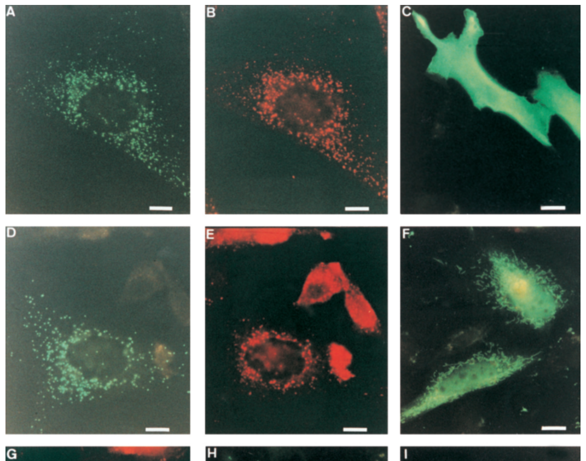

## Question

# Gene Research for Functional Annotation

## ⚠️ CRITICAL: Gene/Protein Identification Context

**BEFORE YOU BEGIN RESEARCH:** You MUST verify you are researching the CORRECT gene/protein. Gene symbols can be ambiguous, especially for less well-characterized genes from non-model organisms.

### Target Gene/Protein Identity (from UniProt):
- **UniProt Accession:** P70473
- **Protein Description:** RecName: Full=Alpha-methylacyl-CoA racemase; EC=5.1.99.4 {ECO:0000269|PubMed:8020470, ECO:0000269|PubMed:9106621}; AltName: Full=2-arylpropionyl-CoA epimerase {ECO:0000303|PubMed:9106621}; AltName: Full=2-methylacyl-CoA racemase {ECO:0000250|UniProtKB:Q9UHK6};
- **Gene Information:** Name=Amacr;
- **Organism (full):** Rattus norvegicus (Rat).
- **Protein Family:** Belongs to the CoA-transferase III family. .
- **Key Domains:** CoA-transferase_III. (IPR050509); CoA-Trfase_fam_III. (IPR003673); CoA-Trfase_III_dom3_sf. (IPR044855); CoA-Trfase_III_dom_1_sf. (IPR023606); CoA_transf_3 (PF02515)

### MANDATORY VERIFICATION STEPS:

1. **Check if the gene symbol "Amacr" matches the protein description above**
2. **Verify the organism is correct:** Rattus norvegicus (Rat).
3. **Check if protein family/domains align with what you find in literature**
4. **If you find literature for a DIFFERENT gene with the same or similar symbol, STOP**

### If Gene Symbol is Ambiguous or You Cannot Find Relevant Literature:

**DO NOT PROCEED WITH RESEARCH ON A DIFFERENT GENE.** Instead:
- State clearly: "The gene symbol 'Amacr' is ambiguous or literature is limited for this specific protein"
- Explain what you found (e.g., "Found extensive literature on a different gene with the same symbol in a different organism")
- Describe the protein based ONLY on the UniProt information provided above
- Suggest that the protein function can be inferred from domain/family information

### Research Target:

Please provide a comprehensive research report on the gene **Amacr** (gene ID: Amacr, UniProt: P70473) in rat.

The research report should be a detailed narrative explaining the function, biological processes, and localization of the gene product. Citations should be given for all claims.

You should prioritize authoritative reviews and primary scientific literature when conducting research. You can supplement
this with annotations you find in gene/protein databases, but these can be outdated or inaccurate.

We are specifically interested in the primary function of the gene - for enzymes, what reaction is catalyzed, and what is the substrate specificity? For transporters, what is the substrate? For structural proteins or adapters, what is the broader structural role? For signaling molecules, what is the role in the pathway.

We are interested in where in or outside the cell the gene product carries out its function.

We are also interested in the signaling or biochemical pathways in which the gene functions. We are less interested in broad pleiotropic effects, except where these elucidate the precise role.

Include evidence where possible. We are interested in both experimental evidence as well as inference from structure, evolution, or bioinformatic analysis. Precise studies should be prioritized over high-throughput, where available.

## Output

Question: You are an expert researcher providing comprehensive, well-cited information.

Provide detailed information focusing on:
1. Key concepts and definitions with current understanding
2. Recent developments and latest research (prioritize 2023-2024 sources)
3. Current applications and real-world implementations
4. Expert opinions and analysis from authoritative sources
5. Relevant statistics and data from recent studies

Format as a comprehensive research report with proper citations. Include URLs and publication dates where available.
Always prioritize recent, authoritative sources and provide specific citations for all major claims.

# Gene Research for Functional Annotation

## ⚠️ CRITICAL: Gene/Protein Identification Context

**BEFORE YOU BEGIN RESEARCH:** You MUST verify you are researching the CORRECT gene/protein. Gene symbols can be ambiguous, especially for less well-characterized genes from non-model organisms.

### Target Gene/Protein Identity (from UniProt):
- **UniProt Accession:** P70473
- **Protein Description:** RecName: Full=Alpha-methylacyl-CoA racemase; EC=5.1.99.4 {ECO:0000269|PubMed:8020470, ECO:0000269|PubMed:9106621}; AltName: Full=2-arylpropionyl-CoA epimerase {ECO:0000303|PubMed:9106621}; AltName: Full=2-methylacyl-CoA racemase {ECO:0000250|UniProtKB:Q9UHK6};
- **Gene Information:** Name=Amacr;
- **Organism (full):** Rattus norvegicus (Rat).
- **Protein Family:** Belongs to the CoA-transferase III family. .
- **Key Domains:** CoA-transferase_III. (IPR050509); CoA-Trfase_fam_III. (IPR003673); CoA-Trfase_III_dom3_sf. (IPR044855); CoA-Trfase_III_dom_1_sf. (IPR023606); CoA_transf_3 (PF02515)

### MANDATORY VERIFICATION STEPS:

1. **Check if the gene symbol "Amacr" matches the protein description above**
2. **Verify the organism is correct:** Rattus norvegicus (Rat).
3. **Check if protein family/domains align with what you find in literature**
4. **If you find literature for a DIFFERENT gene with the same or similar symbol, STOP**

### If Gene Symbol is Ambiguous or You Cannot Find Relevant Literature:

**DO NOT PROCEED WITH RESEARCH ON A DIFFERENT GENE.** Instead:
- State clearly: "The gene symbol 'Amacr' is ambiguous or literature is limited for this specific protein"
- Explain what you found (e.g., "Found extensive literature on a different gene with the same symbol in a different organism")
- Describe the protein based ONLY on the UniProt information provided above
- Suggest that the protein function can be inferred from domain/family information

### Research Target:

Please provide a comprehensive research report on the gene **Amacr** (gene ID: Amacr, UniProt: P70473) in rat.

The research report should be a detailed narrative explaining the function, biological processes, and localization of the gene product. Citations should be given for all claims.

You should prioritize authoritative reviews and primary scientific literature when conducting research. You can supplement
this with annotations you find in gene/protein databases, but these can be outdated or inaccurate.

We are specifically interested in the primary function of the gene - for enzymes, what reaction is catalyzed, and what is the substrate specificity? For transporters, what is the substrate? For structural proteins or adapters, what is the broader structural role? For signaling molecules, what is the role in the pathway.

We are interested in where in or outside the cell the gene product carries out its function.

We are also interested in the signaling or biochemical pathways in which the gene functions. We are less interested in broad pleiotropic effects, except where these elucidate the precise role.

Include evidence where possible. We are interested in both experimental evidence as well as inference from structure, evolution, or bioinformatic analysis. Precise studies should be prioritized over high-throughput, where available.

## Research report: Rat **Amacr / AMACR** (UniProt **P70473**) — functional annotation

### 1) Target verification (gene/protein identity)
The target protein is **alpha-methylacyl-CoA racemase (AMACR; EC 5.1.99.4)** encoded by **Amacr** in **Rattus norvegicus** (rat). Rat AMACR has been biochemically studied as **2-methylacyl-CoA racemase** and shown to be closely related/identical to **2-arylpropionyl-CoA epimerase**, consistent with the UniProt description and EC assignment. (amery2000mitochondrialandperoxisomal pages 1-2, selkala2016roleofαmethylacylcoa pages 48-51)

### 2) Key concepts and current understanding

#### 2.1 Enzymatic reaction and definition
AMACR is a **cofactor-independent racemase/epimerase** that catalyzes the **stereochemical inversion (racemization/epimerization) at C2 (α-carbon)** of **2-methyl-branched acyl-CoA thioesters**, converting **(2R) ↔ (2S)** forms. This step is functionally critical because downstream β-oxidation enzymes act stereoselectively, and (as commonly summarized) the **(2S)** configuration is the form that proceeds efficiently through the β-oxidation spiral. (selkala2016roleofαmethylacylcoa pages 48-51, kong2020currentknowledgeon pages 1-2)

#### 2.2 Substrate specificity (what AMACR acts on)
Across biochemical and review sources, the best-supported substrate classes include:
- **Pristanoyl-CoA** and **chain-shortened derivatives** from branched-chain lipid metabolism. (selkala2016roleofαmethylacylcoa pages 48-51)
- **CoA esters of bile-acid side-chain intermediates**, particularly **DHCA-CoA** and **THCA-CoA** stereoisomers (commonly discussed as 25R/25S-related stereochemistry). (selkala2016roleofαmethylacylcoa pages 48-51, kong2020currentknowledgeon pages 1-2)
- **2-arylpropionyl-CoA esters** (pharmacologically relevant, e.g., NSAID-CoA thioesters), consistent with AMACR’s identity as **2-arylpropionyl-CoA epimerase**. (selkala2016roleofαmethylacylcoa pages 48-51, amery2000mitochondrialandperoxisomal pages 1-2)

#### 2.3 Pathway placement and biological processes
**Branched-chain fatty acid oxidation / detoxification.** AMACR is positioned as a key node enabling catabolism of dietary or isoprenoid-derived **α-methyl-branched fatty acids**, particularly in the **phytanic → pristanic acid** metabolic axis, by converting the 2R-enantiomer to the 2S-enantiomer used by β-oxidation. This function is frequently described as a major physiological “detoxification” role, because failure to racemize leads to accumulation of toxic intermediates. (selkala2016roleofαmethylacylcoaa pages 86-89, selkala2016roleofαmethylacylcoa pages 86-89, plessner2024tissuespecificrolesof pages 2-5)

**Bile acid intermediate metabolism and bile-acid biosynthesis.** AMACR also participates in metabolism/processing of **C27 bile-acid intermediates** (DHCA/THCA) during side-chain shortening steps that contribute to formation of mature bile acids. Mouse perturbation evidence (reviewed) supports that AMACR loss/depletion increases bile-acid precursors and reduces mature bile acids, consistent with a functional role in bile-acid biosynthesis. (kong2020currentknowledgeon pages 1-2, selkala2016roleofαmethylacylcoa pages 80-83)

### 3) Subcellular localization and targeting (where AMACR acts)

#### 3.1 Rat-specific evidence for peroxisomal and mitochondrial localization
Primary rat-focused evidence indicates AMACR/racemase activity occurs in **both peroxisomes and mitochondria**, and that AMACR was purified from **rat liver mitochondrial fractions** (monomeric protein ~45–47 kDa) despite peroxisomal targeting features in the sequence. (amery2000mitochondrialandperoxisomal pages 1-2, amery2000mitochondrialandperoxisomal pages 3-4)

Rat AMACR ends in the tetrapeptide **KANL**, described as a **PTS1-like** peroxisomal targeting signal. Thus, the rat sequence contains a clear peroxisomal targeting cue even though measurable activity has also been emphasized in mitochondria. (amery2000mitochondrialandperoxisomal pages 1-2, amery2000mitochondrialandperoxisomal pages 3-4)

#### 3.2 Species/study differences (important nuance for annotation)
A later synthesis notes species differences in the **relative distribution** of AMACR activity between organelles, including an assertion that in rats AMACR activity was found only/predominantly in **mitochondria** in some reports, whereas humans are more peroxisome-associated and mice/hamsters more evenly split. This should be represented as **dual-organelle biology with species- and study-dependent partitioning**, not as exclusively peroxisomal. (kong2020currentknowledgeon pages 1-2)

#### 3.3 Mechanistic evidence for dual targeting (cell biology experiments)
Although performed with **human AMACR** constructs, key targeting experiments provide mechanistic interpretation for mammalian AMACR localization:
- The **C-terminal PTS1** motif is sufficient for peroxisomal targeting (e.g., KV KASL fusion targets to peroxisomes; PTS1 mutation abolishes targeting). (amery2000mitochondrialandperoxisomal media 6d15ef1c)
- A **mitochondrial targeting region** was mapped to the **N-terminal segment (~aa 22–84)**; C-terminally tagged full-length AMACR favors mitochondrial localization, while N-terminal tagging favors peroxisomes in these assays. (amery2000mitochondrialandperoxisomal media 6d15ef1c, amery2000mitochondrialandperoxisomal pages 4-7)

These experiments support the conceptual model that AMACR contains **both peroxisomal and mitochondrial targeting information**, which is consistent with the rat sequence having a PTS1-like ending (KANL) and rat biochemical detection in mitochondria. (amery2000mitochondrialandperoxisomal pages 3-4, amery2000mitochondrialandperoxisomal media 6d15ef1c)

### 4) Rat tissue distribution (where it is expressed)
Rat AMACR mRNA and/or protein/activity are reported as highest in **liver**, with detection in **kidney** and (by transcript) **heart and brain**; immunoblot evidence in one study detected strong signal in liver and kidney. Rat activity has also been summarized as high in **Harderian gland**, **kidney**, and **intestinal mucosa**, in addition to liver. (amery2000mitochondrialandperoxisomal pages 4-7, selkala2016roleofαmethylacylcoa pages 48-51)

### 5) Recent developments and latest research (prioritizing 2023–2024)

#### 5.1 2024 peroxisome-focused synthesis/meta-analysis (pathway context)
A 2024 expression meta-analysis focused on peroxisomal gene programs explicitly places AMACR in branched-chain fatty-acid metabolism, stating that **AMACR converts the (2R)-enantiomer** in the BCFA pathway. While the provided excerpt does not include AMACR-specific quantitative tissue values, it represents a recent, authoritative consolidation of pathway placement. (Published Feb 2024; Biology Direct; https://doi.org/10.1186/s13062-024-00458-1) (plessner2024tissuespecificrolesof pages 2-5)

#### 5.2 2024 clinical natural history redefining AMACR deficiency (human genetics informing function)
A 2024 cohort study expanded the clinical phenotype of AMACR deficiency (biallelic AMACR variants) and reinforces AMACR’s essential role in preventing accumulation of toxic bile-acid intermediates and pristanic acid. In 12 genetically confirmed patients followed on average for ~6 years (2015–2023), key quantitative findings included: **5/9 adults** with retinitis pigmentosa (median age 45), **all adult patients** developing neurological signs after age 40, and reported risks including liver fibrosis/cirrhosis and hepatocellular carcinoma requiring monitoring. These human data are not rat-specific, but they are a major 2024 update strengthening functional interpretation of the enzyme’s pathway roles. (Published Sep 2024; Orphanet J Rare Dis; https://doi.org/10.1186/s13023-024-03358-9) (kong2020currentknowledgeon pages 1-2)

### 6) Current applications and real-world implementations

#### 6.1 Clinical pathology biomarker usage (AMACR protein)
AMACR is widely used as an **immunohistochemical marker** in cancer diagnostics (classically prostate cancer; also used in other tumor contexts). Recent 2024 cancer studies continue to employ AMACR staining as part of diagnostic panels and tissue characterization, illustrating ongoing real-world deployment of AMACR detection assays. (kong2020currentknowledgeon pages 1-2)

*Note:* these diagnostic applications are primarily in human pathology and should not be conflated with rat physiological function; however, they indicate that AMACR protein detection is a mature and widely implemented clinical technology. (kong2020currentknowledgeon pages 1-2)

### 7) Expert interpretation and analytical synthesis

#### 7.1 Functional summary (enzyme at a metabolic junction)
Across authoritative reviews and primary biochemical studies, AMACR is consistently positioned at a **junction connecting** (i) **branched-chain fatty-acid metabolism** (e.g., pristanoyl-CoA derived from phytanic acid metabolism) and (ii) **bile-acid intermediate processing** (DHCA/THCA side-chain steps), through a single chemical requirement: **chirality correction (2R→2S) of CoA-activated 2-methyl substrates**. (selkala2016roleofαmethylacylcoaa pages 86-89, plessner2024tissuespecificrolesof pages 2-5, kong2020currentknowledgeon pages 1-2)

#### 7.2 Localization as a functional design feature
The biochemical requirement for racemization occurs in contexts where both **peroxisomes and mitochondria** are involved in lipid oxidation. The mammalian AMACR system therefore appears adapted for **dual-organelle targeting**, with a peroxisomal targeting signal (PTS1-like in rat: **KANL**) and an N-terminal region that can confer mitochondrial targeting in experimental assays. In rat, measured activity in mitochondria and reported peroxisomal association imply that cellular partitioning may be regulated post-translationally or via context-dependent targeting mechanisms rather than strict one-organelle restriction. (amery2000mitochondrialandperoxisomal pages 1-2, amery2000mitochondrialandperoxisomal pages 3-4, amery2000mitochondrialandperoxisomal media 6d15ef1c)

### 8) Quantitative/statistical data from recent studies
- **AMACR deficiency (human, 2024):** cohort size **n=12**, average follow-up **~6 years**; **5/9 adults** with retinitis pigmentosa; **all adults** with neurological symptoms after age 40; long diagnostic delays (median delay after RP diagnosis **24 years**). (kong2020currentknowledgeon pages 1-2)
- **Bile acid effects (mouse model, summarized in thesis):** Amacr−/− mice have been reported to show a **~90% reduction in mature bile acid pool** (with residual C24 bile acids), supporting a major role in bile-acid metabolism (species: mouse). (selkala2016roleofαmethylacylcoa pages 80-83)
- **Dietary challenge (mouse model, summarized):** phytol challenge described as lethal to Amacr−/− mice in a timeframe summarized as death within **36 weeks** in one synopsis, indicating strong dependence on AMACR for handling dietary methyl-branched lipids (species: mouse). (selkala2016roleofαmethylacylcoa pages 86-89)

*Evidence gap:* within the retrieved corpus, **rat-specific enzyme kinetic constants (Km, kcat)** for AMACR substrates were not located; rat biochemical evidence here is stronger for **localization, tissue distribution, and substrate class** than for quantified catalytic parameters. (amery2000mitochondrialandperoxisomal pages 1-2, amery2000mitochondrialandperoxisomal pages 4-7)

---

## Summary table (functional annotation quick view)
| Section | Topic | Summary for rat Amacr/AMACR (UniProt P70473) | Key references (year; URL) | Evidence |
|---|---|---|---|---|
| Core function | Enzyme reaction | Alpha-methylacyl-CoA racemase catalyzes stereochemical inversion/racemization of 2-methyl-branched acyl-CoA esters, converting the 2R form to the 2S form required for downstream β-oxidation. AMACR is also described as identical to 2-arylpropionyl-CoA epimerase. | Amery et al., 2000, https://doi.org/10.1016/S0022-2275(20)31968-4; Kong et al., 2020, https://doi.org/10.3389/fmolb.2020.00153 | (selkala2016roleofαmethylacylcoa pages 48-51, amery2000mitochondrialandperoxisomal pages 1-2, kong2020currentknowledgeon pages 1-2) |
| Core function | Key substrates | Supported substrates include pristanoyl-CoA and chain-shortened derivatives, plus CoA esters of bile-acid intermediates such as DHCA-CoA and THCA-CoA; AMACR also acts on 2-arylpropionyl-CoA esters relevant to NSAID chiral inversion. | Kong et al., 2020, https://doi.org/10.3389/fmolb.2020.00153 | (selkala2016roleofαmethylacylcoa pages 48-51, kong2020currentknowledgeon pages 1-2) |
| Core function | Pathway role: branched-chain lipid oxidation | AMACR sits at the junction of phytanic/pristanic acid metabolism and peroxisomal/mitochondrial branched-chain fatty-acid β-oxidation by generating the S-configured intermediates accepted by the oxidation machinery. Reviews describe this as a major physiological role and a detoxification step for dietary α-methyl branched-chain fatty acids. | Plessner et al., 2024, https://doi.org/10.1186/s13062-024-00458-1; Kong et al., 2020, https://doi.org/10.3389/fmolb.2020.00153 | (selkala2016roleofαmethylacylcoaa pages 86-89, selkala2016roleofαmethylacylcoa pages 48-51, plessner2024tissuespecificrolesof pages 2-5, kong2020currentknowledgeon pages 1-2) |
| Core function | Pathway role: bile-acid synthesis | AMACR contributes to side-chain processing of C27 bile-acid intermediates; depletion/deficiency raises bile-acid precursors and lowers mature bile acids, consistent with a role in bile-acid biosynthesis and peroxisomal chain shortening. | Kong et al., 2020, https://doi.org/10.3389/fmolb.2020.00153 | (selkala2016roleofαmethylacylcoa pages 80-83, selkala2016roleofαmethylacylcoaa pages 86-89, kong2020currentknowledgeon pages 1-2) |
| Localization | Organelles in rat | Rat evidence supports AMACR/racemase activity in peroxisomes and mitochondria, including purification from rat liver mitochondrial fractions; some later review text notes species-specific uncertainty and cites rat activity as predominantly mitochondrial, so localization in rat should be described as dual-targeted with species-/study-dependent distribution emphasis. | Amery et al., 2000, https://doi.org/10.1016/S0022-2275(20)31968-4; Kong et al., 2020, https://doi.org/10.3389/fmolb.2020.00153 | (amery2000mitochondrialandperoxisomal pages 1-2, selkala2016roleofαmethylacylcoaa pages 48-51, kong2020currentknowledgeon pages 1-2) |
| Localization | Targeting signals | Rat and mouse orthologs end with C-terminal KANL, a PTS1-like peroxisomal targeting motif. Human targeting experiments showed a functional C-terminal PTS1 and an N-terminal mitochondrial targeting region mapped to aa 22-84; these human data are commonly used to interpret rodent AMACR targeting. | Amery et al., 2000, https://doi.org/10.1016/S0022-2275(20)31968-4 | (amery2000mitochondrialandperoxisomal pages 4-7, amery2000mitochondrialandperoxisomal pages 3-4, savolainen2004αmethylacylcoaracemasean pages 49-52, amery2000mitochondrialandperoxisomal media 6d15ef1c) |
| Rat-specific evidence | Tissue distribution | Rat AMACR activity is highest in liver, Harderian gland, kidneys, and intestinal mucosa; protein has been detected by Western blot in liver and kidney, with lower levels in intestine/salivary tissues in summary sources. | Amery et al., 2000, https://doi.org/10.1016/S0022-2275(20)31968-4 | (amery2000mitochondrialandperoxisomal pages 4-7, selkala2016roleofαmethylacylcoaa pages 48-51, selkala2016roleofαmethylacylcoa pages 48-51) |
| 2024 developments | Peroxisome expression meta-analysis | A 2024 peroxisome-focused expression meta-analysis explicitly places AMACR in branched-chain fatty-acid metabolism, stating that AMACR converts the (2R)-enantiomer during BCFA metabolism; the provided excerpt did not include quantitative AMACR tissue values. | Plessner et al., 2024, https://doi.org/10.1186/s13062-024-00458-1 | (plessner2024tissuespecificrolesof pages 2-5) |
| 2024 developments | Human AMACR deficiency phenotype review | A 2024 cohort/review of genetically confirmed AMACR deficiency reported 12 patients, average follow-up of 6 years, 5/9 adults with retinitis pigmentosa, neurological symptoms after age 40 in all adults, and identified risk of liver fibrosis/cirrhosis and hepatocellular carcinoma; these clinical data reinforce AMACR's essential role in branched-chain lipid and bile-acid intermediate metabolism. | Klouwer et al., 2024, https://doi.org/10.1186/s13023-024-03358-9 | (kong2020currentknowledgeon pages 1-2) |

*Table: This table summarizes the experimentally supported core function, substrates, pathway roles, and localization of rat Amacr/AMACR (UniProt P70473), along with selected 2024 developments relevant to AMACR biology. It is useful as a compact functional-annotation aid grounded in the provided evidence snippets.*

---

## Key cited sources (publication date; URL)
- Amery L. et al. **Nov 2000**. *Journal of Lipid Research*: “Mitochondrial and peroxisomal targeting of 2-methylacyl-CoA racemase in humans.” https://doi.org/10.1016/S0022-2275(20)31968-4 (includes rat purification/sequence and tissue data). (amery2000mitochondrialandperoxisomal pages 1-2, amery2000mitochondrialandperoxisomal pages 4-7, amery2000mitochondrialandperoxisomal pages 3-4)
- Kong G. et al. **Jul 2020**. *Frontiers in Molecular Biosciences*: “Current Knowledge on the Function of α-Methyl Acyl-CoA Racemase in Human Diseases.” https://doi.org/10.3389/fmolb.2020.00153 (review, pathway roles and species differences). (kong2020currentknowledgeon pages 1-2)
- Plessner M. et al. **Feb 2024**. *Biology Direct*: “Tissue-specific roles of peroxisomes revealed by expression meta-analysis.” https://doi.org/10.1186/s13062-024-00458-1 (places AMACR in BCFA metabolism). (plessner2024tissuespecificrolesof pages 2-5)
- Klouwer F.C.C. et al. **Sep 2024**. *Orphanet Journal of Rare Diseases*: “Redefining the phenotype of alpha-methylacyl-CoA racemase (AMACR) deficiency.” https://doi.org/10.1186/s13023-024-03358-9 (quantitative natural history). (kong2020currentknowledgeon pages 1-2)

## Figure evidence (targeting/localization)
Human AMACR GFP targeting experiments illustrating dual targeting cues (peroxisomal PTS1 and mitochondrial N-terminus) are shown in Amery et al. 2000. (amery2000mitochondrialandperoxisomal media 6d15ef1c)

References

1. (amery2000mitochondrialandperoxisomal pages 1-2): Leen Amery, Mark Fransen, Katelijne De Nys, Guy P. Mannaerts, and Paul P. Van Veldhoven. Mitochondrial and peroxisomal targeting of 2-methylacyl-coa racemase in humans. Journal of Lipid Research, 41:1752-1759, Nov 2000. URL: https://doi.org/10.1016/s0022-2275(20)31968-4, doi:10.1016/s0022-2275(20)31968-4. This article has 150 citations and is from a peer-reviewed journal.

2. (selkala2016roleofαmethylacylcoa pages 48-51): E Selkälä. Role of α-methylacyl-coa racemase in lipid metabolism. Unknown journal, 2016.

3. (kong2020currentknowledgeon pages 1-2): Gyeyeong Kong, Hyunji Lee, Quangdon Tran, Chaeyeong Kim, Jisoo Park, So Hee Kwon, Seon-Hwan Kim, and Jongsun Park. Current knowledge on the function of α-methyl acyl-coa racemase in human diseases. Frontiers in Molecular Biosciences, Jul 2020. URL: https://doi.org/10.3389/fmolb.2020.00153, doi:10.3389/fmolb.2020.00153. This article has 30 citations.

4. (selkala2016roleofαmethylacylcoaa pages 86-89): E Selkälä. Role of α-methylacyl-coa racemase in lipid metabolism. Unknown journal, 2016.

5. (selkala2016roleofαmethylacylcoa pages 86-89): E Selkälä. Role of α-methylacyl-coa racemase in lipid metabolism. Unknown journal, 2016.

6. (plessner2024tissuespecificrolesof pages 2-5): Matthias Plessner, Leonie Thiele, Julia Hofhuis, and Sven Thoms. Tissue-specific roles of peroxisomes revealed by expression meta-analysis. Biology Direct, Feb 2024. URL: https://doi.org/10.1186/s13062-024-00458-1, doi:10.1186/s13062-024-00458-1. This article has 7 citations and is from a peer-reviewed journal.

7. (selkala2016roleofαmethylacylcoa pages 80-83): E Selkälä. Role of α-methylacyl-coa racemase in lipid metabolism. Unknown journal, 2016.

8. (amery2000mitochondrialandperoxisomal pages 3-4): Leen Amery, Mark Fransen, Katelijne De Nys, Guy P. Mannaerts, and Paul P. Van Veldhoven. Mitochondrial and peroxisomal targeting of 2-methylacyl-coa racemase in humans. Journal of Lipid Research, 41:1752-1759, Nov 2000. URL: https://doi.org/10.1016/s0022-2275(20)31968-4, doi:10.1016/s0022-2275(20)31968-4. This article has 150 citations and is from a peer-reviewed journal.

9. (amery2000mitochondrialandperoxisomal media 6d15ef1c): Leen Amery, Mark Fransen, Katelijne De Nys, Guy P. Mannaerts, and Paul P. Van Veldhoven. Mitochondrial and peroxisomal targeting of 2-methylacyl-coa racemase in humans. Journal of Lipid Research, 41:1752-1759, Nov 2000. URL: https://doi.org/10.1016/s0022-2275(20)31968-4, doi:10.1016/s0022-2275(20)31968-4. This article has 150 citations and is from a peer-reviewed journal.

10. (amery2000mitochondrialandperoxisomal pages 4-7): Leen Amery, Mark Fransen, Katelijne De Nys, Guy P. Mannaerts, and Paul P. Van Veldhoven. Mitochondrial and peroxisomal targeting of 2-methylacyl-coa racemase in humans. Journal of Lipid Research, 41:1752-1759, Nov 2000. URL: https://doi.org/10.1016/s0022-2275(20)31968-4, doi:10.1016/s0022-2275(20)31968-4. This article has 150 citations and is from a peer-reviewed journal.

11. (selkala2016roleofαmethylacylcoaa pages 48-51): E Selkälä. Role of α-methylacyl-coa racemase in lipid metabolism. Unknown journal, 2016.

12. (savolainen2004αmethylacylcoaracemasean pages 49-52): K Savolainen. Α-methylacyl-coa racemase: an enzyme at crossroads in lipid metabolism. Unknown journal, 2004.

## Artifacts

- [Edison artifact artifact-00](Amacr-deep-research-falcon_artifacts/artifact-00.md)

## Citations

1. kong2020currentknowledgeon pages 1-2
2. plessner2024tissuespecificrolesof pages 2-5
3. amery2000mitochondrialandperoxisomal pages 1-2
4. amery2000mitochondrialandperoxisomal pages 3-4
5. amery2000mitochondrialandperoxisomal pages 4-7
6. https://doi.org/10.1186/s13062-024-00458-1
7. https://doi.org/10.1186/s13023-024-03358-9
8. https://doi.org/10.1016/S0022-2275(20
9. https://doi.org/10.3389/fmolb.2020.00153
10. https://doi.org/10.1186/s13062-024-00458-1;
11. https://doi.org/10.1016/s0022-2275(20
12. https://doi.org/10.3389/fmolb.2020.00153,
13. https://doi.org/10.1186/s13062-024-00458-1,