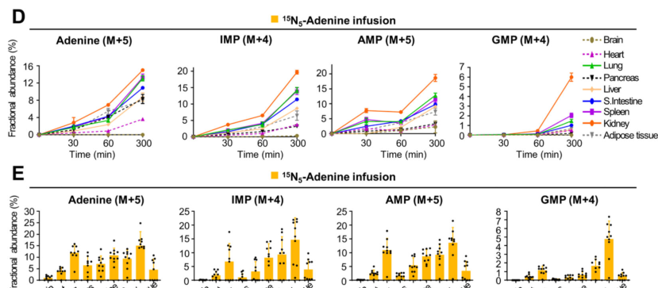

## Question

# Gene Research for Functional Annotation

## ⚠️ CRITICAL: Gene/Protein Identification Context

**BEFORE YOU BEGIN RESEARCH:** You MUST verify you are researching the CORRECT gene/protein. Gene symbols can be ambiguous, especially for less well-characterized genes from non-model organisms.

### Target Gene/Protein Identity (from UniProt):
- **UniProt Accession:** P36972
- **Protein Description:** RecName: Full=Adenine phosphoribosyltransferase {ECO:0000305}; Short=APRT; EC=2.4.2.7 {ECO:0000250|UniProtKB:P07741};
- **Gene Information:** Name=Aprt {ECO:0000312|RGD:1307758};
- **Organism (full):** Rattus norvegicus (Rat).
- **Protein Family:** Belongs to the purine/pyrimidine phosphoribosyltransferase
- **Key Domains:** Ade_phspho_trans. (IPR005764); PRTase-like. (IPR029057); PRTase_dom. (IPR000836); UPRTase/APRTase. (IPR050054); Pribosyltran (PF00156)

### MANDATORY VERIFICATION STEPS:

1. **Check if the gene symbol "Aprt" matches the protein description above**
2. **Verify the organism is correct:** Rattus norvegicus (Rat).
3. **Check if protein family/domains align with what you find in literature**
4. **If you find literature for a DIFFERENT gene with the same or similar symbol, STOP**

### If Gene Symbol is Ambiguous or You Cannot Find Relevant Literature:

**DO NOT PROCEED WITH RESEARCH ON A DIFFERENT GENE.** Instead:
- State clearly: "The gene symbol 'Aprt' is ambiguous or literature is limited for this specific protein"
- Explain what you found (e.g., "Found extensive literature on a different gene with the same symbol in a different organism")
- Describe the protein based ONLY on the UniProt information provided above
- Suggest that the protein function can be inferred from domain/family information

### Research Target:

Please provide a comprehensive research report on the gene **Aprt** (gene ID: Aprt, UniProt: P36972) in rat.

The research report should be a detailed narrative explaining the function, biological processes, and localization of the gene product. Citations should be given for all claims.

You should prioritize authoritative reviews and primary scientific literature when conducting research. You can supplement
this with annotations you find in gene/protein databases, but these can be outdated or inaccurate.

We are specifically interested in the primary function of the gene - for enzymes, what reaction is catalyzed, and what is the substrate specificity? For transporters, what is the substrate? For structural proteins or adapters, what is the broader structural role? For signaling molecules, what is the role in the pathway.

We are interested in where in or outside the cell the gene product carries out its function.

We are also interested in the signaling or biochemical pathways in which the gene functions. We are less interested in broad pleiotropic effects, except where these elucidate the precise role.

Include evidence where possible. We are interested in both experimental evidence as well as inference from structure, evolution, or bioinformatic analysis. Precise studies should be prioritized over high-throughput, where available.

## Output

Question: You are an expert researcher providing comprehensive, well-cited information.

Provide detailed information focusing on:
1. Key concepts and definitions with current understanding
2. Recent developments and latest research (prioritize 2023-2024 sources)
3. Current applications and real-world implementations
4. Expert opinions and analysis from authoritative sources
5. Relevant statistics and data from recent studies

Format as a comprehensive research report with proper citations. Include URLs and publication dates where available.
Always prioritize recent, authoritative sources and provide specific citations for all major claims.

# Gene Research for Functional Annotation

## ⚠️ CRITICAL: Gene/Protein Identification Context

**BEFORE YOU BEGIN RESEARCH:** You MUST verify you are researching the CORRECT gene/protein. Gene symbols can be ambiguous, especially for less well-characterized genes from non-model organisms.

### Target Gene/Protein Identity (from UniProt):
- **UniProt Accession:** P36972
- **Protein Description:** RecName: Full=Adenine phosphoribosyltransferase {ECO:0000305}; Short=APRT; EC=2.4.2.7 {ECO:0000250|UniProtKB:P07741};
- **Gene Information:** Name=Aprt {ECO:0000312|RGD:1307758};
- **Organism (full):** Rattus norvegicus (Rat).
- **Protein Family:** Belongs to the purine/pyrimidine phosphoribosyltransferase
- **Key Domains:** Ade_phspho_trans. (IPR005764); PRTase-like. (IPR029057); PRTase_dom. (IPR000836); UPRTase/APRTase. (IPR050054); Pribosyltran (PF00156)

### MANDATORY VERIFICATION STEPS:

1. **Check if the gene symbol "Aprt" matches the protein description above**
2. **Verify the organism is correct:** Rattus norvegicus (Rat).
3. **Check if protein family/domains align with what you find in literature**
4. **If you find literature for a DIFFERENT gene with the same or similar symbol, STOP**

### If Gene Symbol is Ambiguous or You Cannot Find Relevant Literature:

**DO NOT PROCEED WITH RESEARCH ON A DIFFERENT GENE.** Instead:
- State clearly: "The gene symbol 'Aprt' is ambiguous or literature is limited for this specific protein"
- Explain what you found (e.g., "Found extensive literature on a different gene with the same symbol in a different organism")
- Describe the protein based ONLY on the UniProt information provided above
- Suggest that the protein function can be inferred from domain/family information

### Research Target:

Please provide a comprehensive research report on the gene **Aprt** (gene ID: Aprt, UniProt: P36972) in rat.

The research report should be a detailed narrative explaining the function, biological processes, and localization of the gene product. Citations should be given for all claims.

You should prioritize authoritative reviews and primary scientific literature when conducting research. You can supplement
this with annotations you find in gene/protein databases, but these can be outdated or inaccurate.

We are specifically interested in the primary function of the gene - for enzymes, what reaction is catalyzed, and what is the substrate specificity? For transporters, what is the substrate? For structural proteins or adapters, what is the broader structural role? For signaling molecules, what is the role in the pathway.

We are interested in where in or outside the cell the gene product carries out its function.

We are also interested in the signaling or biochemical pathways in which the gene functions. We are less interested in broad pleiotropic effects, except where these elucidate the precise role.

Include evidence where possible. We are interested in both experimental evidence as well as inference from structure, evolution, or bioinformatic analysis. Precise studies should be prioritized over high-throughput, where available.

## Research report: Rat **Aprt** (UniProt **P36972**) — adenine phosphoribosyltransferase (APRT; EC 2.4.2.7)

### 0) Target verification (critical identity check)
The UniProt accession **P36972** corresponds to **adenine phosphoribosyltransferase (APRT)**, a member of the phosphoribosyltransferase (PRTase) family that catalyzes adenine salvage to **AMP** (EC **2.4.2.7**). The retrieved biochemical and mechanistic literature consistently defines APRT as the enzyme catalyzing **adenine + PRPP → AMP + PPi**, matching the UniProt record and excluding common symbol confusions with unrelated “APRT/apt” genes in microbes/parasites. (huyet2018structuralinsightsinto pages 1-3, alvarez2023productionpurificationand pages 10-14)

### 1) Key concepts and current understanding

#### 1.1 Core biochemical function (reaction, role, definitions)
**Adenine phosphoribosyltransferase (APRT)** is a purine salvage enzyme that transfers a phosphoribosyl group from **5-phosphoribosyl-1-pyrophosphate (PRPP)** to **adenine**, generating **adenosine monophosphate (AMP)** and releasing **pyrophosphate (PPi)**:

**Adenine + PRPP → AMP + PPi**. (huyet2018structuralinsightsinto pages 1-3, alvarez2023productionpurificationand pages 10-14)

Conceptually, this reaction “recycles” adenine arising from nucleic-acid turnover or extracellular sources into the cellular adenylate pool (AMP/ADP/ATP), conserving energy relative to de novo purine synthesis. (ford1998structurefunctionrelationships pages 23-28)

#### 1.2 Substrate specificity and cofactors
Mechanistic and structural work in mammals indicates APRT is **Mg2+-dependent** and uses an **ordered sequential (bi–bi)** mechanism in the forward direction, where **PRPP binds before adenine**. (huyet2018structuralinsightsinto pages 1-3)

Comparative mammalian literature synthesis reports **rat APRT** Michaelis constants on the order of low micromolar: **Km(adenine) ≈ 0.9 µM** and **Km(PRPP) ≈ 2.0–5.0 µM** (as summarized in a comparative structure–function analysis). (ford1998structurefunctionrelationships pages 28-34)

#### 1.3 Structural/enzymology insights (authoritative mechanistic evidence)
High-resolution structural analysis of **human** APRT (highly conserved across mammals) supports the ordered binding mechanism and identifies residues that tune catalytic-loop conformation (e.g., **Tyr105** in human APRT) to couple conformational change and catalysis. (huyet2018structuralinsightsinto pages 1-3)

### 2) Cellular location and where the enzyme acts
Direct rat imaging-based localization was not retrieved in the accessible corpus; however, multiple lines of evidence indicate APRT is an **intracellular soluble enzyme** assayed robustly in **cell lysates** (erythrocytes, fibroblasts), consistent with a primarily **cytosolic** role in purine salvage. (doppler2004characterizationofthe pages 5-6, baranowskabosiacka2009inhibitionoferythrocyte pages 1-2)

In practice, APRT activity assays are performed on **red blood cell lysates**, demonstrating functional enzyme in the cytosolic compartment of enucleated erythrocytes. (baranowskabosiacka2009inhibitionoferythrocyte pages 2-3)

### 3) Pathways and biological processes

#### 3.1 Purine salvage integration
APRT is a key node in **purine salvage**, supplying AMP from adenine and thereby supporting nucleotide pools for energy metabolism and nucleic-acid synthesis. (tran2024denovoand pages 3-5, ford1998structurefunctionrelationships pages 23-28)

A 2024 in vivo isotope tracing study (mouse; relevant mammalian physiology) used **15N5-adenine infusion** to show that adenine salvage contributes measurably to adenine/AMP/IMP pools in many tissues, with comparatively **low salvage labeling in brain** and higher labeling in tissues including **kidney** and **small intestine**. (tran2024denovoand pages 3-5, tran2024denovoand media a0109d55)

**Figure-based evidence (2024):** Tissue-specific adenine salvage labeling patterns are shown in panels D/E of Figure 2 in Tran et al., demonstrating time- and tissue-dependent incorporation of 15N5-adenine into AMP/IMP/GMP. (tran2024denovoand media a0109d55)

### 4) Rat-specific experimental evidence (expression/activity/phenotypes)

#### 4.1 Quantitative enzyme activity evidence in rat
A rat in vivo toxicology study measured **APRT activity in erythrocyte lysates** and demonstrated that APRT is enzymatically active and quantifiable in rat blood.

In **male Wistar rats** chronically exposed to **0.1% lead acetate** in drinking water for **9 months**, whole-blood lead increased from **0.32 to 7.01 µg/dL**, and erythrocyte APRT activity decreased by ~32%:
- Control: **0.747 ± 0.046 nmol/mg Hb/min**
- Lead-exposed: **0.521 ± 0.047 nmol/mg Hb/min**
with **p = 0.0002**.
APRT activity negatively correlated with blood lead (**Rs = −0.65, p = 0.001**). (baranowskabosiacka2009inhibitionoferythrocyte pages 2-3)

This provides direct rat evidence that APRT contributes to erythrocyte purine salvage and that its activity is sensitive to environmental/toxicant exposure. (baranowskabosiacka2009inhibitionoferythrocyte pages 2-3)

#### 4.2 Rat phenotypes from Aprt loss
No rat Aprt knockout/deficiency model evidence was retrieved in the accessible full-text set. Functional consequences of APRT loss are therefore inferred from human genetics and mouse models (below), and should be treated as **cross-species inference** for rat annotation. (edvardsson2026adeninephosphoribosyltransferasedeficiency pages 1-2, leow2023adeninephosphoribosyltransferase pages 1-2)

### 5) Human/mammalian phenotypes that illuminate APRT’s precise role (cross-species inference)

#### 5.1 APRT deficiency: mechanism tightly linked to enzyme function
Human APRT deficiency is an autosomal recessive inborn error of purine metabolism where failure to salvage adenine leads to diversion of adenine to **2,8-dihydroxyadenine (DHA)** (via xanthine oxidoreductase), causing **radiolucent kidney stones** and **crystal nephropathy** with AKI/CKD risk. (leow2023adeninephosphoribosyltransferase pages 1-2, edvardsson2026adeninephosphoribosyltransferasedeficiency pages 1-2)

A 2023 case report/review highlights diagnostic hallmarks (urinary DHA and characteristic crystals; absent/very low RBC APRT activity) and illustrates intrafamilial phenotypic variability even with shared causal variants. (leow2023adeninephosphoribosyltransferase pages 1-2, leow2023adeninephosphoribosyltransferase pages 3-3)

Biochemical characterization of complete APRT deficiency shows markedly reduced conversion of adenine to AMP in intact patient cells, demonstrating that APRT is essential for adenine utilization. (doppler2004characterizationofthe pages 3-3)

### 6) Recent developments and latest research (prioritizing 2023–2024)

#### 6.1 Systems-level quantification of purine salvage in vivo (2024)
A major 2024 advance is direct **in vivo** quantification of salvage contributions across tissues and tumors using isotope infusion. Tran et al. (Cell, **July 2024**) explicitly positions APRT-mediated adenine salvage as a quantitatively relevant source of AMP/IMP in multiple tissues, and links tissue differences in salvage flux to APRT expression patterns. (tran2024denovoand pages 3-5, tran2024denovoand media a0109d55)

URL/DOI: https://doi.org/10.1016/j.cell.2024.05.011 (published July 2024). (tran2024denovoand pages 3-5)

#### 6.2 Updated clinical recognition, prevalence bounds, and diagnostics (2023)
Leow et al. (Nephrology, **Aug 2023**) provides an updated literature review with prevalence bounds and clinical diagnostic workflows (urinary DHA testing; RBC APRT activity; confirmatory genetics), emphasizing that early diagnosis enables prevention of severe kidney outcomes. (leow2023adeninephosphoribosyltransferase pages 1-2, leow2023adeninephosphoribosyltransferase pages 3-4)

URL/DOI: https://doi.org/10.1111/nep.14232 (published Aug 2023). (leow2023adeninephosphoribosyltransferase pages 1-2)

### 7) Current applications and real-world implementations

#### 7.1 Diagnostic implementation (clinical biochemistry)
APRT deficiency diagnosis in practice relies on biochemical and genetic confirmation:
- Urine microscopy and **DHA quantification** (spot urine DHA correlating with 24h collections in pediatric use)
- **Red cell lysate APRT activity** assays
- Confirmatory **biallelic APRT variants** by sequencing. (leow2023adeninephosphoribosyltransferase pages 3-4, leow2023adeninephosphoribosyltransferase pages 2-2)

#### 7.2 Therapeutic implementation (mechanism-based treatment)
Because DHA is formed via xanthine oxidoreductase when adenine cannot be salvaged, treatment uses **xanthine oxidoreductase inhibitors** (e.g., **allopurinol** or **febuxostat**) to reduce DHA formation and prevent stone recurrence and kidney injury. (leow2023adeninephosphoribosyltransferase pages 1-2, edvardsson2026adeninephosphoribosyltransferasedeficiency pages 1-2)

### 8) Expert synthesis and analysis (authoritative interpretation)

1. **Primary function is unambiguous and mechanistically constrained:** APRT’s function is defined by a specific phosphoribosyltransferase reaction (adenine + PRPP → AMP + PPi). Mechanistic structural work indicates a conserved ordered binding mechanism and dependence on Mg2+, which strongly constrains plausible alternative functions for rat Aprt. (huyet2018structuralinsightsinto pages 1-3, alvarez2023productionpurificationand pages 10-14)

2. **Localization is best stated as “intracellular soluble (likely cytosolic)” for rat:** While cytosolic function is strongly implied by assay context (RBC lysates) and general mammalian biochemistry, rat-specific microscopy/localization evidence was not retrieved and should not be overstated. (baranowskabosiacka2009inhibitionoferythrocyte pages 2-3, baranowskabosiacka2009inhibitionoferythrocyte pages 1-2)

3. **Kidney relevance is supported by both disease mechanism and tissue-flux data:** The kidney is a key affected organ in APRT deficiency (DHA nephropathy) and shows high adenine salvage labeling in vivo in mammals, aligning functionally with the clinical phenotype. (edvardsson2026adeninephosphoribosyltransferasedeficiency pages 1-2, tran2024denovoand media a0109d55)

### 9) Key quantitative statistics (recent and/or primary)

- **Rat erythrocyte APRT activity**: 0.747 ± 0.046 (control) vs 0.521 ± 0.047 nmol/mg Hb/min after chronic lead exposure; blood lead 0.32 → 7.01 µg/dL; Rs = −0.65 correlation between blood lead and APRT activity. (baranowskabosiacka2009inhibitionoferythrocyte pages 2-3)
- **APRT deficiency prevalence estimates (human, population-dependent)**: ~1:6,840 in Iceland vs ~1:152,100 in Ireland (homozygote prevalence bounds reported). (leow2023adeninephosphoribosyltransferase pages 1-2)
- **Clinical enzyme activity range (human RBC lysate)**: ~16–32 nmol/h per mg hemoglobin. (edvardsson2026adeninephosphoribosyltransferasedeficiency pages 1-2)
- **Example residual APRT activity in a patient (2023)**: 0.03 nmol/min/mg with ~3% residual activity (illustrative of partial deficiency measurements). (leow2023adeninephosphoribosyltransferase pages 1-2)

### 10) Summary table (curated)
The following table consolidates the main functional-annotation points for rat Aprt (UniProt P36972), explicitly separating **rat evidence** from **human/mouse inference**.

| Topic | Key takeaway | Strongest supporting source(s) with publication year | URL / DOI | Species notes |
|---|---|---|---|---|
| Reaction / enzymatic function | Rat **Aprt** (UniProt **P36972**) matches **adenine phosphoribosyltransferase, EC 2.4.2.7**, a purine-salvage enzyme that converts **adenine + PRPP → AMP + PPi**; this is the canonical APRT reaction conserved in mammals. (alvarez2023productionpurificationand pages 10-14, huyet2018structuralinsightsinto pages 1-3, tran2024denovoand pages 3-5) | Huyet et al., 2018; Tran et al., 2024; Hove-Jensen et al., 2017 | https://doi.org/10.1016/j.chembiol.2018.02.011; https://doi.org/10.1016/j.cell.2024.05.011; https://doi.org/10.1128/mmbr.00040-16 | Rat target verified by UniProt P36972; direct mechanistic support is mainly human/general mammalian, with pathway evidence from mouse. |
| Substrates / cofactors | Primary substrates are **adenine** and **5-phosphoribosyl-1-pyrophosphate (PRPP)**; products are **AMP** and **PPi**. Catalysis is **divalent-metal dependent**, typically **Mg2+**. APRT belongs to class I PRTases that prefer **6-aminopurine bases** and some adenine analogs. (alvarez2023productionpurificationand pages 10-14, huyet2018structuralinsightsinto pages 1-3) | Huyet et al., 2018; Álvarez, 2023 | https://doi.org/10.1016/j.chembiol.2018.02.011 | Substrate preference data are strongest from human/biochemical APRT literature; broadly inferable to rat because the enzyme family and active-site features are conserved. |
| Mechanism | Mammalian APRT follows an **ordered sequential (bi-bi)** mechanism in which **PRPP binds before adenine** in the forward reaction; structural work identified conserved catalytic-loop control elements (including **Tyr105** in human APRT). Historical mammalian work also supports burst kinetics and strong PRPP dependence. (huyet2018structuralinsightsinto pages 1-3, ford1998structurefunctionrelationships pages 28-34) | Huyet et al., 2018; Ford, 1998 thesis synthesis of mammalian APRT literature | https://doi.org/10.1016/j.chembiol.2018.02.011 | Direct mechanistic structure is human; rat kinetic constants are cited in mammalian comparative literature summarized in the thesis evidence. |
| Pathways | APRT functions in the **purine salvage pathway**, recycling free adenine to AMP and thereby linking extracellular/base turnover adenine to cellular adenylate pools; AMP can feed broader purine interconversion (e.g., IMP via AMPD). Recent in vivo isotope tracing showed adenine salvage is active across many tissues and can substantially contribute to nucleotide pools. (tran2024denovoand pages 3-5, ford1998structurefunctionrelationships pages 23-28) | Tran et al., 2024; Ford, 1998 | https://doi.org/10.1016/j.cell.2024.05.011 | Tissue-flux data are from mouse; pathway assignment is directly relevant to rat Aprt annotation. |
| Subcellular location | Available mammalian evidence in the retrieved set supports APRT as an **intracellular soluble enzyme**, most consistently interpreted as **cytosolic** in purine salvage; no rat-specific organellar localization evidence was retrieved here. (baranowskabosiacka2009inhibitionoferythrocyte pages 1-2, doppler2004characterizationofthe pages 5-6) | Baranowska-Bosiacka et al., 2009; Doppler et al., 1981/2004 record | https://doi.org/10.1016/j.tox.2009.02.005; https://doi.org/10.1007/bf00281694 | Rat evidence is indirect via erythrocyte lysate activity; localization should be stated cautiously as inferred cytosolic/soluble rather than directly imaged in rat. |
| Tissue expression / activity | APRT activity is detectable in mammalian blood cells and fibroblasts, indicating broad cellular expression. In **rat erythrocytes**, APRT activity was measurable and quantifiable; chronic lead exposure reduced activity from **0.747 ± 0.046** to **0.521 ± 0.047 nmol/mg Hb/min** (~32% decrease, **p = 0.0002**). In mice, adenine-salvage labeling is especially prominent in **kidney, lung, spleen, and small intestine**, with lower salvage in heart/pancreas. (baranowskabosiacka2009inhibitionoferythrocyte pages 2-3, doppler2004characterizationofthe pages 5-6, tran2024denovoand media a0109d55) | Baranowska-Bosiacka et al., 2009; Doppler et al., 1981/2004 record; Tran et al., 2024 | https://doi.org/10.1016/j.tox.2009.02.005; https://doi.org/10.1016/j.cell.2024.05.011; https://doi.org/10.1007/bf00281694 | Rat-specific quantitative activity exists for erythrocytes; broader tissue flux patterns come from mouse and should be labeled as cross-species support. |
| Disease / phenotype relevance | Loss of APRT activity causes **adenine phosphoribosyltransferase deficiency**, diverting adenine to **2,8-dihydroxyadenine (DHA)** via xanthine oxidoreductase, leading to **radiolucent stones**, crystal nephropathy, AKI, CKD, and kidney failure. Although these are human/mouse data, they define the functional consequence of APRT loss. (edvardsson2026adeninephosphoribosyltransferasedeficiency pages 1-2, leow2023adeninephosphoribosyltransferase pages 1-2, doppler2004characterizationofthe pages 5-6) | Edvardsson et al., 2026; Leow et al., 2023; Doppler et al., 1981/2004 record | https://doi.org/10.1007/s00467-026-07187-9; https://doi.org/10.1111/nep.14232; https://doi.org/10.1007/bf00281694 | No rat Aprt-deficient phenotype was retrieved; disease interpretation relies on human clinical genetics and mammalian orthology. |
| Recent developments (2023–2024) | Key recent advances include: **(i)** systems-level mapping of de novo vs salvage purine synthesis across tissues/tumors showing substantial adenine salvage in vivo (2024); **(ii)** updated reviews/case literature emphasizing APRT deficiency recognition and phenotypic variability (2023); **(iii)** broader review of inborn purine salvage disorders and diagnostics (2023). (tran2024denovoand pages 3-5, leow2023adeninephosphoribosyltransferase pages 1-2, edvardsson2026adeninephosphoribosyltransferasedeficiency pages 1-2) | Tran et al., 2024; Leow et al., 2023; Camici et al., 2023 cited in search results via evidence summary | https://doi.org/10.1016/j.cell.2024.05.011; https://doi.org/10.1111/nep.14232 | Mostly human/mouse and general purine-metabolism literature; still highly relevant for rat functional annotation because they clarify APRT’s core biological role. |
| Real-world applications / diagnostics / therapy | APRT biology has direct translational use in diagnosing and treating APRT deficiency: diagnosis uses **urine microscopy/crystal analysis**, **urinary DHA**, **erythrocyte APRT activity**, and **APRT sequencing**; treatment with **allopurinol or febuxostat** reduces DHA production and improves renal outcomes. (edvardsson2026adeninephosphoribosyltransferasedeficiency pages 1-2, leow2023adeninephosphoribosyltransferase pages 1-2, doppler2004characterizationofthe pages 5-6) | Edvardsson et al., 2026; Leow et al., 2023; Doppler et al., 1981/2004 record | https://doi.org/10.1007/s00467-026-07187-9; https://doi.org/10.1111/nep.14232; https://doi.org/10.1007/bf00281694 | These are human clinical applications, not rat implementations; however, rat APRT activity assays in erythrocytes show the enzyme is experimentally tractable in this species. |

*Table: This table summarizes the best-supported functional annotation points for rat Aprt (UniProt P36972), distinguishing rat-specific evidence from mammalian inference. It highlights the canonical reaction, pathway role, localization confidence, experimental activity data, and clinically relevant developments tied to APRT biology.*

### 11) Evidence gaps specific to rat Aprt
Within the accessible full-text set used here, the following rat-specific items remain insufficiently evidenced and should be treated as open for further targeted retrieval:
- Direct **subcellular localization** experiments (e.g., immunofluorescence) in rat tissues/cells.
- Rat **loss-of-function** model phenotypes (knockout/knockdown) specifically attributable to Aprt.

Nonetheless, the biochemical function, pathway role, and disease mechanism are strongly supported by conserved mammalian literature and rat enzymatic activity measurements. (baranowskabosiacka2009inhibitionoferythrocyte pages 2-3, huyet2018structuralinsightsinto pages 1-3)

References

1. (huyet2018structuralinsightsinto pages 1-3): Jessica Huyet, Mohammad Ozeir, Marie-Claude Burgevin, Benoît Pinson, Françoise Chesney, Jean-Marc Remy, Abdul Rauf Siddiqi, Roland Lupoli, Gregory Pinon, Christelle Saint-Marc, Jean-Francois Gibert, Renaud Morales, Irène Ceballos-Picot, Robert Barouki, Bertrand Daignan-Fornier, Anne Olivier-Bandini, Franck Augé, and Pierre Nioche. Structural insights into the forward and reverse enzymatic reactions in human adenine phosphoribosyltransferase. Cell chemical biology, 25 6:666-676.e4, Jun 2018. URL: https://doi.org/10.1016/j.chembiol.2018.02.011, doi:10.1016/j.chembiol.2018.02.011. This article has 23 citations and is from a domain leading peer-reviewed journal.

2. (alvarez2023productionpurificationand pages 10-14): LP Saiz Álvarez. Production, purification and biochemical characterization of adenine phosphoribosyltransferase from escherichia coli. Unknown journal, 2023.

3. (ford1998structurefunctionrelationships pages 23-28): BN Ford. Structure function relationships in chinese hamster adenine phoshoribosyl transferase. Unknown journal, 1998.

4. (ford1998structurefunctionrelationships pages 28-34): BN Ford. Structure function relationships in chinese hamster adenine phoshoribosyl transferase. Unknown journal, 1998.

5. (doppler2004characterizationofthe pages 5-6): W. Doppler, Monica Hirsch-Kauffmann, F. Schabel, and M. Schweiger. Characterization of the biochemical basis of a complete deficiency of the adenine phosphoribosyl transferase (aprt). Human Genetics, 57:404-410, Jul 2004. URL: https://doi.org/10.1007/bf00281694, doi:10.1007/bf00281694. This article has 24 citations and is from a peer-reviewed journal.

6. (baranowskabosiacka2009inhibitionoferythrocyte pages 1-2): I. Baranowska-Bosiacka, V. Dziedziejko, K. Safranow, I. Gutowska, M. Marchlewicz, B. Dołęgowska, M.E. Rać, B. Wiszniewska, and D. Chlubek. Inhibition of erythrocyte phosphoribosyltransferases (aprt and hprt) by pb2+: a potential mechanism of lead toxicity. Toxicology, 259 1-2:77-83, May 2009. URL: https://doi.org/10.1016/j.tox.2009.02.005, doi:10.1016/j.tox.2009.02.005. This article has 34 citations and is from a peer-reviewed journal.

7. (baranowskabosiacka2009inhibitionoferythrocyte pages 2-3): I. Baranowska-Bosiacka, V. Dziedziejko, K. Safranow, I. Gutowska, M. Marchlewicz, B. Dołęgowska, M.E. Rać, B. Wiszniewska, and D. Chlubek. Inhibition of erythrocyte phosphoribosyltransferases (aprt and hprt) by pb2+: a potential mechanism of lead toxicity. Toxicology, 259 1-2:77-83, May 2009. URL: https://doi.org/10.1016/j.tox.2009.02.005, doi:10.1016/j.tox.2009.02.005. This article has 34 citations and is from a peer-reviewed journal.

8. (tran2024denovoand pages 3-5): Diem H. Tran, Dohun Kim, Rushendhiran Kesavan, Harrison Brown, Trishna Dey, Mona Hoseini Soflaee, Hieu S. Vu, Alpaslan Tasdogan, Jason Guo, Divya Bezwada, Houssam Al Saad, Feng Cai, Ashley Solmonson, Halie Rion, Rawand Chabatya, Salma Merchant, Nathan J. Manales, Vanina T. Tcheuyap, Megan Mulkey, Thomas P. Mathews, James Brugarolas, Sean J. Morrison, Hao Zhu, Ralph J. DeBerardinis, and Gerta Hoxhaj. De novo and salvage purine synthesis pathways across tissues and tumors. Cell, 187:3602-3618.e20, Jul 2024. URL: https://doi.org/10.1016/j.cell.2024.05.011, doi:10.1016/j.cell.2024.05.011. This article has 192 citations and is from a highest quality peer-reviewed journal.

9. (tran2024denovoand media a0109d55): Diem H. Tran, Dohun Kim, Rushendhiran Kesavan, Harrison Brown, Trishna Dey, Mona Hoseini Soflaee, Hieu S. Vu, Alpaslan Tasdogan, Jason Guo, Divya Bezwada, Houssam Al Saad, Feng Cai, Ashley Solmonson, Halie Rion, Rawand Chabatya, Salma Merchant, Nathan J. Manales, Vanina T. Tcheuyap, Megan Mulkey, Thomas P. Mathews, James Brugarolas, Sean J. Morrison, Hao Zhu, Ralph J. DeBerardinis, and Gerta Hoxhaj. De novo and salvage purine synthesis pathways across tissues and tumors. Cell, 187:3602-3618.e20, Jul 2024. URL: https://doi.org/10.1016/j.cell.2024.05.011, doi:10.1016/j.cell.2024.05.011. This article has 192 citations and is from a highest quality peer-reviewed journal.

10. (edvardsson2026adeninephosphoribosyltransferasedeficiency pages 1-2): Vidar O. Edvardsson, Hrafnhildur L. Runolfsdottir, and Runolfur Palsson. Adenine phosphoribosyltransferase deficiency and 2,8-dihydroxyadeninuria. Pediatric Nephrology, Mar 2026. URL: https://doi.org/10.1007/s00467-026-07187-9, doi:10.1007/s00467-026-07187-9. This article has 1 citations and is from a domain leading peer-reviewed journal.

11. (leow2023adeninephosphoribosyltransferase pages 1-2): Esther Huimin Leow, Siew Le Chong, Ee Shien Tan, Ai Ling Koh, Breana Wen Min Cham, Celeste Jia Ying Yap, and Yong Hong Ng. Adenine phosphoribosyl transferase (aprt) deficiency and a novel sequence variant in aprt with phenotypic diversity and a literature review. Nephrology, 28:649-654, Aug 2023. URL: https://doi.org/10.1111/nep.14232, doi:10.1111/nep.14232. This article has 4 citations and is from a peer-reviewed journal.

12. (leow2023adeninephosphoribosyltransferase pages 3-3): Esther Huimin Leow, Siew Le Chong, Ee Shien Tan, Ai Ling Koh, Breana Wen Min Cham, Celeste Jia Ying Yap, and Yong Hong Ng. Adenine phosphoribosyl transferase (aprt) deficiency and a novel sequence variant in aprt with phenotypic diversity and a literature review. Nephrology, 28:649-654, Aug 2023. URL: https://doi.org/10.1111/nep.14232, doi:10.1111/nep.14232. This article has 4 citations and is from a peer-reviewed journal.

13. (doppler2004characterizationofthe pages 3-3): W. Doppler, Monica Hirsch-Kauffmann, F. Schabel, and M. Schweiger. Characterization of the biochemical basis of a complete deficiency of the adenine phosphoribosyl transferase (aprt). Human Genetics, 57:404-410, Jul 2004. URL: https://doi.org/10.1007/bf00281694, doi:10.1007/bf00281694. This article has 24 citations and is from a peer-reviewed journal.

14. (leow2023adeninephosphoribosyltransferase pages 3-4): Esther Huimin Leow, Siew Le Chong, Ee Shien Tan, Ai Ling Koh, Breana Wen Min Cham, Celeste Jia Ying Yap, and Yong Hong Ng. Adenine phosphoribosyl transferase (aprt) deficiency and a novel sequence variant in aprt with phenotypic diversity and a literature review. Nephrology, 28:649-654, Aug 2023. URL: https://doi.org/10.1111/nep.14232, doi:10.1111/nep.14232. This article has 4 citations and is from a peer-reviewed journal.

15. (leow2023adeninephosphoribosyltransferase pages 2-2): Esther Huimin Leow, Siew Le Chong, Ee Shien Tan, Ai Ling Koh, Breana Wen Min Cham, Celeste Jia Ying Yap, and Yong Hong Ng. Adenine phosphoribosyl transferase (aprt) deficiency and a novel sequence variant in aprt with phenotypic diversity and a literature review. Nephrology, 28:649-654, Aug 2023. URL: https://doi.org/10.1111/nep.14232, doi:10.1111/nep.14232. This article has 4 citations and is from a peer-reviewed journal.

## Artifacts

- [Edison artifact artifact-00](Aprt-deep-research-falcon_artifacts/artifact-00.md)

## Citations

1. ford1998structurefunctionrelationships pages 23-28
2. huyet2018structuralinsightsinto pages 1-3
3. ford1998structurefunctionrelationships pages 28-34
4. baranowskabosiacka2009inhibitionoferythrocyte pages 2-3
5. doppler2004characterizationofthe pages 3-3
6. tran2024denovoand pages 3-5
7. leow2023adeninephosphoribosyltransferase pages 1-2
8. edvardsson2026adeninephosphoribosyltransferasedeficiency pages 1-2
9. alvarez2023productionpurificationand pages 10-14
10. doppler2004characterizationofthe pages 5-6
11. baranowskabosiacka2009inhibitionoferythrocyte pages 1-2
12. leow2023adeninephosphoribosyltransferase pages 3-3
13. leow2023adeninephosphoribosyltransferase pages 3-4
14. leow2023adeninephosphoribosyltransferase pages 2-2
15. https://doi.org/10.1016/j.cell.2024.05.011
16. https://doi.org/10.1111/nep.14232
17. https://doi.org/10.1016/j.chembiol.2018.02.011;
18. https://doi.org/10.1016/j.cell.2024.05.011;
19. https://doi.org/10.1128/mmbr.00040-16
20. https://doi.org/10.1016/j.chembiol.2018.02.011
21. https://doi.org/10.1016/j.tox.2009.02.005;
22. https://doi.org/10.1007/bf00281694
23. https://doi.org/10.1007/s00467-026-07187-9;
24. https://doi.org/10.1111/nep.14232;
25. https://doi.org/10.1016/j.chembiol.2018.02.011,
26. https://doi.org/10.1007/bf00281694,
27. https://doi.org/10.1016/j.tox.2009.02.005,
28. https://doi.org/10.1016/j.cell.2024.05.011,
29. https://doi.org/10.1007/s00467-026-07187-9,
30. https://doi.org/10.1111/nep.14232,