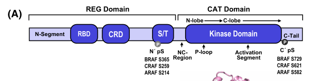

## Question

# Gene Research for Functional Annotation

## ⚠️ CRITICAL: Gene/Protein Identification Context

**BEFORE YOU BEGIN RESEARCH:** You MUST verify you are researching the CORRECT gene/protein. Gene symbols can be ambiguous, especially for less well-characterized genes from non-model organisms.

### Target Gene/Protein Identity (from UniProt):
- **UniProt Accession:** P14056
- **Protein Description:** RecName: Full=Serine/threonine-protein kinase A-Raf; EC=2.7.11.1; AltName: Full=Proto-oncogene A-Raf; AltName: Full=Proto-oncogene A-Raf-1;
- **Gene Information:** Name=Araf; Synonyms=A-raf, Araf1;
- **Organism (full):** Rattus norvegicus (Rat).
- **Protein Family:** Belongs to the protein kinase superfamily. TKL Ser/Thr
- **Key Domains:** C1-like_sf. (IPR046349); DAG/PE-bd. (IPR020454); Kinase-like_dom_sf. (IPR011009); PKC_DAG/PE. (IPR002219); Prot_kinase_dom. (IPR000719)

### MANDATORY VERIFICATION STEPS:

1. **Check if the gene symbol "Araf" matches the protein description above**
2. **Verify the organism is correct:** Rattus norvegicus (Rat).
3. **Check if protein family/domains align with what you find in literature**
4. **If you find literature for a DIFFERENT gene with the same or similar symbol, STOP**

### If Gene Symbol is Ambiguous or You Cannot Find Relevant Literature:

**DO NOT PROCEED WITH RESEARCH ON A DIFFERENT GENE.** Instead:
- State clearly: "The gene symbol 'Araf' is ambiguous or literature is limited for this specific protein"
- Explain what you found (e.g., "Found extensive literature on a different gene with the same symbol in a different organism")
- Describe the protein based ONLY on the UniProt information provided above
- Suggest that the protein function can be inferred from domain/family information

### Research Target:

Please provide a comprehensive research report on the gene **Araf** (gene ID: Araf, UniProt: P14056) in rat.

The research report should be a detailed narrative explaining the function, biological processes, and localization of the gene product. Citations should be given for all claims.

You should prioritize authoritative reviews and primary scientific literature when conducting research. You can supplement
this with annotations you find in gene/protein databases, but these can be outdated or inaccurate.

We are specifically interested in the primary function of the gene - for enzymes, what reaction is catalyzed, and what is the substrate specificity? For transporters, what is the substrate? For structural proteins or adapters, what is the broader structural role? For signaling molecules, what is the role in the pathway.

We are interested in where in or outside the cell the gene product carries out its function.

We are also interested in the signaling or biochemical pathways in which the gene functions. We are less interested in broad pleiotropic effects, except where these elucidate the precise role.

Include evidence where possible. We are interested in both experimental evidence as well as inference from structure, evolution, or bioinformatic analysis. Precise studies should be prioritized over high-throughput, where available.

## Output

Question: You are an expert researcher providing comprehensive, well-cited information.

Provide detailed information focusing on:
1. Key concepts and definitions with current understanding
2. Recent developments and latest research (prioritize 2023-2024 sources)
3. Current applications and real-world implementations
4. Expert opinions and analysis from authoritative sources
5. Relevant statistics and data from recent studies

Format as a comprehensive research report with proper citations. Include URLs and publication dates where available.
Always prioritize recent, authoritative sources and provide specific citations for all major claims.

# Gene Research for Functional Annotation

## ⚠️ CRITICAL: Gene/Protein Identification Context

**BEFORE YOU BEGIN RESEARCH:** You MUST verify you are researching the CORRECT gene/protein. Gene symbols can be ambiguous, especially for less well-characterized genes from non-model organisms.

### Target Gene/Protein Identity (from UniProt):
- **UniProt Accession:** P14056
- **Protein Description:** RecName: Full=Serine/threonine-protein kinase A-Raf; EC=2.7.11.1; AltName: Full=Proto-oncogene A-Raf; AltName: Full=Proto-oncogene A-Raf-1;
- **Gene Information:** Name=Araf; Synonyms=A-raf, Araf1;
- **Organism (full):** Rattus norvegicus (Rat).
- **Protein Family:** Belongs to the protein kinase superfamily. TKL Ser/Thr
- **Key Domains:** C1-like_sf. (IPR046349); DAG/PE-bd. (IPR020454); Kinase-like_dom_sf. (IPR011009); PKC_DAG/PE. (IPR002219); Prot_kinase_dom. (IPR000719)

### MANDATORY VERIFICATION STEPS:

1. **Check if the gene symbol "Araf" matches the protein description above**
2. **Verify the organism is correct:** Rattus norvegicus (Rat).
3. **Check if protein family/domains align with what you find in literature**
4. **If you find literature for a DIFFERENT gene with the same or similar symbol, STOP**

### If Gene Symbol is Ambiguous or You Cannot Find Relevant Literature:

**DO NOT PROCEED WITH RESEARCH ON A DIFFERENT GENE.** Instead:
- State clearly: "The gene symbol 'Araf' is ambiguous or literature is limited for this specific protein"
- Explain what you found (e.g., "Found extensive literature on a different gene with the same symbol in a different organism")
- Describe the protein based ONLY on the UniProt information provided above
- Suggest that the protein function can be inferred from domain/family information

### Research Target:

Please provide a comprehensive research report on the gene **Araf** (gene ID: Araf, UniProt: P14056) in rat.

The research report should be a detailed narrative explaining the function, biological processes, and localization of the gene product. Citations should be given for all claims.

You should prioritize authoritative reviews and primary scientific literature when conducting research. You can supplement
this with annotations you find in gene/protein databases, but these can be outdated or inaccurate.

We are specifically interested in the primary function of the gene - for enzymes, what reaction is catalyzed, and what is the substrate specificity? For transporters, what is the substrate? For structural proteins or adapters, what is the broader structural role? For signaling molecules, what is the role in the pathway.

We are interested in where in or outside the cell the gene product carries out its function.

We are also interested in the signaling or biochemical pathways in which the gene functions. We are less interested in broad pleiotropic effects, except where these elucidate the precise role.

Include evidence where possible. We are interested in both experimental evidence as well as inference from structure, evolution, or bioinformatic analysis. Precise studies should be prioritized over high-throughput, where available.

## Research report: Rat **Araf** (A‑Raf proto-oncogene, serine/threonine-protein kinase), UniProt **P14056**

### 1) Target identity verification (mandatory)
The rat protein quantified as “Serine/threonine-protein kinase A‑Raf (A‑Raf)” in a rat retinal proteomics dataset is explicitly annotated with **UniProt accession P14056**, confirming that **P14056 corresponds to rat Araf/A‑Raf** (Rattus norvegicus). (kwong2021differentialretinalprotein pages 9-11)

### 2) Key concepts, definitions, and current understanding

#### 2.1 RAF kinases and pathway role
Araf encodes a RAF-family serine/threonine kinase that functions as an upstream node in the canonical **RAS→RAF→MEK→ERK** MAPK cascade. In this pathway, activated RAS (RAS‑GTP) engages RAF kinases (ARAF/BRAF/CRAF/RAF1), enabling RAF activation and downstream MEK and ERK phosphorylation. (spencersmith2024regulationofraf pages 1-3, bahar2023targetingtherasrafmapk pages 1-2)

A recent RAF regulation review (2024) describes RAFs as composed of an **N‑terminal regulatory (REG) region** and a **C‑terminal catalytic (CAT) region**. The REG region includes a **RAS-binding domain (RBD)** and a **cysteine-rich domain (CRD; zinc-finger)** that supports membrane interactions and contributes to autoinhibition; the CAT region contains the kinase domain and tail. (spencersmith2024regulationofraf pages 1-3)

#### 2.2 Activation mechanism (RAS binding, membrane recruitment, dimerization, 14‑3‑3)
A core feature of RAF activation is a regulated transition from an autoinhibited monomeric state to an active dimeric state. In resting cells, RAFs are commonly described as **inactive cytosolic monomers**; upon RAS activation they become recruited to membranes and form active dimers. (spencersmith2024regulationofraf pages 1-3)

A defining regulatory element is **14‑3‑3 binding**: RAFs have two high-affinity phosphoserine docking sites (N0 in the REG/S/T-rich region and C0 in the C‑terminal tail) that engage obligate dimeric 14‑3‑3 proteins; this interaction can help stabilize autoinhibition and, in activated states, stabilize active dimers (bridge C0 sites). (spencersmith2024regulationofraf pages 1-3)

The domain organization and an activation-cycle schematic are shown in cropped figures from Spencer‑Smith & Morrison (2024). (spencersmith2024regulationofraf media 4220244e, spencersmith2024regulationofraf media 1fe62c33)

#### 2.3 Catalytic function and substrate specificity
At the pathway level, RAF kinases act as **MEK kinases**, phosphorylating/activating MEK1/2, which then phosphorylates ERK to drive transcriptional programs. (adamopoulos2024rafandmek pages 2-4)

However, multiple sources emphasize that **A‑Raf has comparatively low MEK kinase activity** relative to B‑Raf; e.g., A‑Raf is described as a poor MEK kinase (partly attributed to N‑region sequence divergence) and weakly activated by certain oncogenic stimuli in some contexts. (rauch2016differentiallocalizationof pages 1-2, su2022arafproteinkinase pages 3-5)

#### 2.4 Kinase-independent functions and scaffolding
A‑Raf can also act through **non-catalytic mechanisms**. In epithelial differentiation contexts, A‑Raf is described as binding **MST2** and suppressing MST2-mediated apoptosis, indicating kinase-independent pathway crosstalk. (rauch2016differentiallocalizationof pages 1-2)

A more recent mechanistic study demonstrates another kinase-independent function: **ARAF can increase RAS‑GTP by antagonizing NF1 (a RasGAP) binding to RAS**, thereby reducing NF1-stimulated GTP hydrolysis. (su2022arafproteinkinase pages 7-8)

### 3) Subcellular localization (where A‑Raf acts)

#### 3.1 Canonical RAF localization model
RAF family members are described as cytosolic in the inactive state and recruited to the **plasma membrane** upon RAS‑GTP engagement as part of activation. (spencersmith2024regulationofraf pages 1-3)

#### 3.2 Context-dependent A‑Raf localization and mitochondria
Beyond the canonical cytosol↔plasma membrane cycle, A‑Raf has been reported to localize to **mitochondria** (together with MST2) in tumor contexts; conversely, in proliferating normal basal epithelial cells, A‑Raf is described as **cytosolic** and redistributed to the **plasma membrane during differentiation**, with KSR2 implicated in redistribution. (rauch2016differentiallocalizationof pages 1-2)

**Important limitation for rat functional annotation:** none of the rat-specific expression/proteomics studies retrieved here provide direct rat tissue subcellular localization for A‑Raf; thus mitochondrial/plasma-membrane localization is best treated as **inference for the rat ortholog** based on conserved RAF biology and ARAF studies in other vertebrate systems. (rauch2016differentiallocalizationof pages 1-2, spencersmith2024regulationofraf pages 1-3, kwong2021differentialretinalprotein pages 9-11)

### 4) Rat-specific evidence: expression and regulation (primary functional annotation evidence)

#### 4.1 Liver regeneration (mRNA induction after partial hepatectomy)
In a rat partial hepatectomy model, **A‑raf‑1 mRNA** is transiently induced during liver regeneration. Northern blot quantification reported ~2.5‑fold induction at 12 h and a **peak around 18–24 h**, with one reported 24 h value of **4.7‑fold** for A‑raf‑1 (whole liver) and return to basal by ~72 h. In isolated hepatocytes at 24 h, A‑raf‑1 mRNA increased **~3.9‑fold**. (silverman1989expressionofc‐raf‐1 pages 1-2, silverman1989expressionofc‐raf‐1 pages 2-3)

These data support a role for Araf in early regenerative programs that are temporally correlated with growth signaling and cell-cycle entry in hepatocytes, although the work does not directly establish a causal mechanism. (silverman1989expressionofc‐raf‐1 pages 1-2)

#### 4.2 Brain proteomics in a chronic phenobarbital addiction model
A rat brain LC‑MS/MS study analyzing insulin-signaling related proteomic changes reported that **ARAF (P14056)** abundance was **downregulated at day 60** of phenobarbital treatment with fold change **0.760885** versus control (and was not emphasized as altered at day 90). (wang2020alterationsofglucose pages 6-7)

This provides rat in vivo evidence that A‑Raf protein abundance is regulated in brain under chronic pharmacologic stress, though the pathway linkage (insulin/MAPK crosstalk) is not mechanistically resolved in the excerpt. (wang2020alterationsofglucose pages 6-7)

#### 4.3 Retina proteomics after optic nerve injury
In rat retina two weeks after partial optic nerve transection, integrated SWATH and targeted MRM proteomics quantified **A‑Raf (P14056)** as **upregulated** in the temporal quadrant with **ratio 1.55**, **log2FC ~0.63**, **p = 0.04**. (kwong2021differentialretinalprotein pages 9-11)

This implicates A‑Raf protein regulation in retinal responses to injury/degeneration, consistent with broad RAF/MAPK roles in survival and stress signaling, though it does not specify the causal pathway node (e.g., MEK/ERK vs non-catalytic functions). (kwong2021differentialretinalprotein pages 9-11)

### 5) Recent developments and latest research (prioritizing 2023–2024)

#### 5.1 Structural/regulatory cycle insights (expert review)
A 2024 expert review highlights that recent cryo‑EM/structural studies have provided “snapshots” of RAF regulatory states (e.g., autoinhibited BRAF monomer; active BRAF/CRAF dimers; HSP90/CDC37 complexes) and emphasizes central roles for **CRD-mediated autoinhibition**, **14‑3‑3 dimers**, and phosphatase/chaperone systems (PP5; HSP90/CDC37) in RAF regulation. The review explicitly notes the current lack of solved structures for **ARAF** and calls for additional structural and live-cell studies. (spencersmith2024regulationofraf pages 1-3, spencersmith2024regulationofraf pages 6-7)

#### 5.2 Therapeutic and pharmacologic evolution (review synthesis)
A 2023 high-impact review summarizes the therapeutic landscape of RAF/MAPK targeting, emphasizing that RAF inhibitor (RAFi) + MEK inhibitor combinations are clinically validated but commonly limited by pathway reactivation and resistance, with **autophagy** discussed as a contributor to RAFi resistance and a potential combinatorial target. (bahar2023targetingtherasrafmapk pages 1-2)

A 2024 NSCLC-focused review further delineates RAF inhibitor classes, including monomer-selective RAF inhibitors that can yield **paradoxical MAPK activation** in BRAF-wild-type settings, and discusses the development of next-generation dimer/equipotent RAF inhibitors and combination regimens. (adamopoulos2024rafandmek pages 2-4)

#### 5.3 ARAF-specific mechanistic advances (still highly relevant)
Although not 2023–2024, a mechanistic Molecular Cell paper (2022) provides a major shift in how ARAF can function: it shows ARAF can **promote RAS activation (RAS‑GTP accumulation) by competing with NF1**, requiring ARAF’s RAS-binding capacity and unique N-terminus but **not** dimerization or kinase activity. This supports the view that ARAF may act as a **regulator of the RAS node** in addition to acting downstream of RAS as a MEK kinase. (su2022arafproteinkinase pages 7-8)

### 6) Current applications and real-world implementations

#### 6.1 Approved targeted therapy (pathway-level relevance)
In clinical oncology, RAF/MEK inhibitors primarily target oncogenic activation of the RAS–RAF–MEK–ERK axis (most often via BRAF alterations). In BRAFV600E NSCLC, FDA approvals include **dabrafenib + trametinib (2017)** and **encorafenib + binimetinib (2023)**. (adamopoulos2024rafandmek pages 1-2)

Because these applications are driven largely by BRAF-mutant disease biology, they are directly relevant to **RAF pathway pharmacology** but only indirectly informative about rat Araf (P14056) physiological roles. (adamopoulos2024rafandmek pages 1-2, bahar2023targetingtherasrafmapk pages 1-2)

#### 6.2 Examples of ongoing clinical implementations (ClinicalTrials.gov)
Current real-world use of RAF/MEK combinations is illustrated by multiple recruiting trials and surveillance studies, including:

* **NCT06362694** (2024; Phase 2; Recruiting): dabrafenib 150 mg BID + trametinib 2 mg QD “rechallenge” in **BRAF-positive anaplastic thyroid cancer** after progression. (NCT06362694 chunk 1)
* **NCT05525273** (start 2023-09-01; Phase 2; Recruiting): dabrafenib + trametinib in **BRAF V600E papillary craniopharyngioma** (neoadjuvant/postoperative). (NCT05525273 chunk 1)
* **NCT04324112** (2020; Phase 2; Recruiting): encorafenib 450 mg QD + binimetinib 45 mg BID in **BRAF V600 relapsed/refractory hairy cell leukemia**. (NCT04324112 chunk 1)
* **NCT04903119** (2022; Phase 1; Recruiting): nilotinib added to dabrafenib+trametinib or encorafenib+binimetinib in **BRAF V600 metastatic/unresectable melanoma**. (NCT04903119 chunk 1)
* **NCT06262919** (2024; Observational; Recruiting): post-marketing surveillance of dabrafenib + trametinib (Tafinlar/Mekinist) in **BRAF V600E-positive unresectable advanced/recurrent solid tumors** (Japan). (NCT06262919 chunk 1)

### 7) Expert interpretation and synthesis (functional annotation perspective)

#### 7.1 Primary biochemical function (annotation summary)
For functional annotation of rat Araf (P14056), the strongest cross-source consensus is:

1. **Signal transduction kinase in MAPK signaling:** A‑Raf is a RAF-family Ser/Thr kinase upstream of MEK/ERK, participating in growth-factor/RAS-driven signaling. (spencersmith2024regulationofraf pages 1-3, adamopoulos2024rafandmek pages 2-4)
2. **Distinct isoform properties vs B‑Raf:** A‑Raf is repeatedly characterized as having **lower basal kinase activity** and, in some contexts, low catalytic activity toward MEK, implying its physiological roles may be more context- and scaffolding-dependent than B‑Raf. (spencersmith2024regulationofraf pages 1-3, rauch2016differentiallocalizationof pages 1-2, su2022arafproteinkinase pages 3-5)
3. **Kinase-independent roles likely matter:** A‑Raf can participate through **kinase-independent interactions** (e.g., MST2 binding to modulate apoptosis) and can, notably, modulate the **RAS activation state** by opposing NF1-mediated GTP hydrolysis. (rauch2016differentiallocalizationof pages 1-2, su2022arafproteinkinase pages 7-8)

#### 7.2 Where it likely functions in rat cells
Given conserved RAF regulation, rat A‑Raf is expected to cycle between **cytosol** and **plasma membrane** depending on RAS activation status, with possible context-dependent mitochondrial localization inferred from non-rat studies. (spencersmith2024regulationofraf pages 1-3, rauch2016differentiallocalizationof pages 1-2)

#### 7.3 What the rat data uniquely add
The rat studies provide concrete tissue and perturbation contexts where A‑Raf expression/abundance changes:

* **Liver regeneration:** transient induction of A‑raf‑1 mRNA during early regenerative signaling (12–24 h). (silverman1989expressionofc‐raf‐1 pages 1-2)
* **Brain (phenobarbital model):** downregulation of A‑Raf protein abundance at an intermediate chronic-exposure time point (day 60). (wang2020alterationsofglucose pages 6-7)
* **Retina injury/degeneration:** upregulation of A‑Raf protein (P14056) after optic nerve injury. (kwong2021differentialretinalprotein pages 9-11)

These collectively support that rat Araf is dynamically regulated in vivo across proliferative, stress, and injury contexts, aligning with MAPK pathway biology. (kwong2021differentialretinalprotein pages 9-11, silverman1989expressionofc‐raf‐1 pages 1-2)

### 8) Relevant statistics and data (recent studies prioritized)

#### 8.1 Rat quantitative statistics (directly about Araf/P14056)
* Retina (2 weeks post-injury): A‑Raf (P14056) ratio **1.55**, **p = 0.04**. (kwong2021differentialretinalprotein pages 9-11)
* Brain (day 60 phenobarbital): A‑Raf (P14056) fold change **0.760885**. (wang2020alterationsofglucose pages 6-7)
* Liver regeneration (24 h post-hepatectomy): A‑raf‑1 mRNA up to **4.7-fold** (whole liver) and **~3.9-fold** (isolated hepatocytes). (silverman1989expressionofc‐raf‐1 pages 1-2, silverman1989expressionofc‐raf‐1 pages 2-3)

#### 8.2 Human clinical/epidemiologic statistics (pathway context)
* NSCLC epidemiology: **BRAF V600E ~4%** of NSCLC; NSCLC ~**85%** of lung cancers; lung cancer ~**18%** of cancer deaths worldwide; **125,070 US deaths in 2024** (as cited in the review). (adamopoulos2024rafandmek pages 1-2)
* Pathway alteration prevalence: oncogenic alterations in RTK/RAS/RAF/MAPK axis implicated in **~30% of cancers** (review statement). (adamopoulos2024rafandmek pages 2-4)
* Response/resistance: dabrafenib-induced tumor shrinkage reported in **>90%** of patients with **~50% partial/complete responses** in cited contexts; resistance to RAF inhibitors often emerges around **6–7 months** (review synthesis). (bahar2023targetingtherasrafmapk pages 16-17)

### 9) Structured evidence summary table
The following table consolidates rat-specific evidence plus mechanistic and clinical context (with publication dates and URLs).

| Evidence type | System/tissue/model | Key finding (include quantitative values) | Method | Species | Citation context ID | Publication year | URL |
|---|---|---|---|---|---|---|---|
| mRNA | Regenerating liver after 70% partial hepatectomy; isolated hepatocytes | **A-raf-1 mRNA increased transiently during rat liver regeneration**: ~2.5-fold at 12 h, maximal ~18–24 h; reported 24 h values include **4.7-fold** increase for A-raf-1 in whole liver, with return to basal by 72 h. In isolated hepatocytes at 24 h, A-raf-1 mRNA increased **~3.9-fold**. Transcript size reported as **2.4 kb**. | Northern blot autoradiography of total/cytoplasmic RNA, probe hybridization, densitometry normalized to albumin | Rat (*Rattus norvegicus*) | (silverman1989expressionofc‐raf‐1 pages 2-3, silverman1989expressionofc‐raf‐1 pages 1-2) | 1989 | https://doi.org/10.1002/mc.2940020203 |
| protein | Brain tissue from phenobarbital-addictive rats | **ARAF protein (UniProt P14056) was downregulated at day 60** after chronic phenobarbital treatment with reported **fold change 0.760885** vs control; not highlighted as significantly altered at day 90. | LC-MS/MS proteomics | Rat (*Rattus norvegicus*) | (wang2020alterationsofglucose pages 6-7) | 2020 | https://doi.org/10.1021/acs.jproteome.0c00703 |
| protein | Retina, temporal quadrant, 2 weeks after partial optic nerve transection (pONT) | **A-Raf protein (accession P14056) was upregulated** with **ratio 1.55**, **log2FC ~0.63**, **p = 0.04** in the temporal quadrant. Quantification was supported by SWATH-MS and targeted MRM-MS; temporal quadrant platform concordance **R² = 0.965**. | SWATH-MS discovery proteomics with MRM-MS validation | Rat (*Rattus norvegicus*) | (kwong2021differentialretinalprotein pages 9-11) | 2021 | https://doi.org/10.3390/ijms22168592 |
| mechanism | RAF family signaling context relevant to rat Araf/P14056 | RAFs (ARAF, BRAF, CRAF) are **RAS effectors** that phosphorylate **MEK**, initiating the **MEK→ERK** cascade. In resting cells RAFs are **cytosolic inactive monomers**; after **RAS-GTP binding** they are recruited to membrane and form active dimers. ARAF/CRAF have **lower basal kinase activity** than BRAF. Domain organization includes **RBD, CRD, S/T-rich region, kinase domain**, with **N0/C0 14-3-3 docking sites**. | Structural/biochemical review | Vertebrate RAF family (not rat-specific experiment) | (spencersmith2024regulationofraf pages 1-3, spencersmith2024regulationofraf pages 6-7) | 2024 | https://doi.org/10.1042/bst20230552 |
| mechanism | ARAF-specific signaling mechanism | ARAF can **increase RAS-GTP by antagonizing NF1 binding to RAS**. NF1 catalytic fragment stimulated RAS GTP hydrolysis with **EC50 ~2 μg/ml** for H-/N-RAS and **~20 μg/ml** for KRAS; GAP domains increased intrinsic hydrolysis by **~105-fold**. ARAF overexpression reduced NF1-RAS association by **~50%** and increased RAS-GTP; similar effects with BRAF/CRAF required much higher overexpression (**15–30-fold** vs **4–6-fold** for ARAF). This effect required **RAS binding** and ARAF’s **unique N-terminus**, but **not dimerization or kinase activity**. | In vitro GTPase-Glo biochemistry; cell-based overexpression/knockdown | Human/mouse systems (mechanistic inference for rat ortholog) | (su2022arafproteinkinase pages 7-8, su2022arafproteinkinase pages 3-5) | 2022 | https://doi.org/10.1016/j.molcel.2022.04.034 |
| review/localization | Epithelial differentiation and apoptosis studies | A-Raf is a **weak MEK kinase** and also has **kinase-independent functions**, including binding **MST2** to suppress apoptosis. Localization is dynamic: A-Raf/MST2 localize to **mitochondria** in tumor cell lines and primary tumors; in proliferating normal basal epithelial cells A-Raf is **cytosolic** and moves to the **plasma membrane during differentiation**. | Cell biology/mechanistic study | Mainly human cell/tumor systems | (rauch2016differentiallocalizationof pages 1-2) | 2016 | https://doi.org/10.1038/cdd.2016.2 |
| review | Cancer signaling and therapeutic landscape | The **RAS/RAF/MAPK** pathway is a major oncogenic signaling axis; RAF inhibitors combined with MEK inhibitors are approved for RAF-mutant cancers. Reported efficacy/resistance figures include **tumor shrinkage in >90%** of patients with dabrafenib in cited settings, with **~50% partial/complete responses**, and clinical resistance to RAF inhibitors emerging in about **6–7 months**. | Narrative review of mechanistic and clinical literature | Human clinical oncology | (bahar2023targetingtherasrafmapk pages 1-2, bahar2023targetingtherasrafmapk pages 16-17) | 2023 | https://doi.org/10.1038/s41392-023-01705-z |
| review/clinical | NSCLC and RAF/MEK inhibitor implementation | In NSCLC, **BRAF V600E occurs in ~4%** of cases; **NSCLC accounts for ~85%** of lung cancers. Epidemiology cited includes **18% of cancer deaths worldwide** attributed to lung cancer and **125,070 US deaths in 2024**. Approved BRAF–MEK combinations for BRAFV600E-mutant NSCLC include **dabrafenib + trametinib (2017)** and **encorafenib + binimetinib (2023)**. Pathway alterations overall drive **~30% of cancers**; NSCLC mutation prevalences cited include **KRAS 25%** and **BRAF 3–5%**. | Clinical/translational review | Human clinical oncology | (adamopoulos2024rafandmek pages 1-2, adamopoulos2024rafandmek pages 2-4, adamopoulos2024rafandmek pages 4-5) | 2024 | https://doi.org/10.3390/ijms25094633 |
| DB | Disease-target association database | Open Targets lists ARAF associations with **cancer** (score **0.6619**), **hypertrophic cardiomyopathy** (**0.5845**), **Costello syndrome** (**0.5409**), **Noonan syndrome** (**0.5409**), and **low grade glioma** (**0.4973**). These are disease-association data for **human ARAF**, useful for translational context but **not rat-specific functional evidence**. | Open Targets integrated evidence | Human target-disease associations | (OpenTargets Search: -ARAF) | 2024 access | https://platform.opentargets.org/ |

*Table: This table summarizes the most relevant evidence gathered for rat Araf (UniProt P14056), integrating rat-specific mRNA/protein studies with mechanistic and clinical-context sources needed for functional annotation. It highlights where direct rat evidence exists and where inference comes from broader ARAF/RAF-family literature.*

### 10) Database/translational associations (contextual)
Open Targets lists ARAF associations with multiple human diseases (e.g., cancer; cardiomyopathy; RASopathies), which is useful for translational context but should not be treated as rat-specific functional evidence. (OpenTargets Search: -ARAF)

### 11) Key limitations and open gaps for rat Araf annotation
* **Direct rat subcellular localization evidence** (e.g., microscopy/biochemical fractionation for rat tissues) was not found in the retrieved set; localization statements here are largely inferred from vertebrate ARAF/RAF biology. (rauch2016differentiallocalizationof pages 1-2, spencersmith2024regulationofraf pages 1-3)
* **Direct rat enzymology** (kinetic parameters for MEK phosphorylation by rat A‑Raf) was not retrieved; catalytic function is supported primarily by RAF family knowledge and non-rat A‑Raf studies. (adamopoulos2024rafandmek pages 2-4, rauch2016differentiallocalizationof pages 1-2)
* The **relative contribution of kinase-dependent vs kinase-independent functions** for A‑Raf likely varies by cell type and stimulus; ARAF-specific mechanistic work underscores noncanonical regulation at the RAS node (NF1 competition), but rat tissue validation remains an important direction. (su2022arafproteinkinase pages 7-8)

---

## Key sources (with dates/URLs)
* Spencer‑Smith R, Morrison DK. *Biochemical Society Transactions* (May 2024). https://doi.org/10.1042/bst20230552 (spencersmith2024regulationofraf pages 1-3)
* Bahar ME et al. *Signal Transduction and Targeted Therapy* (Dec 2023). https://doi.org/10.1038/s41392-023-01705-z (bahar2023targetingtherasrafmapk pages 1-2)
* Adamopoulos C et al. *International Journal of Molecular Sciences* (Apr 2024). https://doi.org/10.3390/ijms25094633 (adamopoulos2024rafandmek pages 1-2)
* Kwong JMK et al. *International Journal of Molecular Sciences* (Aug 2021). https://doi.org/10.3390/ijms22168592 (kwong2021differentialretinalprotein pages 9-11)
* Wang M et al. *Journal of Proteome Research* (Oct 2020). https://doi.org/10.1021/acs.jproteome.0c00703 (wang2020alterationsofglucose pages 6-7)
* Silverman JA et al. *Molecular Carcinogenesis* (Jan 1989). https://doi.org/10.1002/mc.2940020203 (silverman1989expressionofc‐raf‐1 pages 1-2)
* Rauch J et al. *Cell Death & Differentiation* (Feb 2016). https://doi.org/10.1038/cdd.2016.2 (rauch2016differentiallocalizationof pages 1-2)
* Su W et al. *Molecular Cell* (Jul 2022). https://doi.org/10.1016/j.molcel.2022.04.034 (su2022arafproteinkinase pages 7-8)
* ClinicalTrials.gov (records accessed from retrieved chunks): NCT06362694 (2024), NCT05525273 (2023), NCT04324112 (2020), NCT04903119 (2022), NCT06262919 (2024). (NCT04903119 chunk 1, NCT05525273 chunk 1, NCT06362694 chunk 1, NCT04324112 chunk 1, NCT06262919 chunk 1)

References

1. (kwong2021differentialretinalprotein pages 9-11): Jacky M. K. Kwong, Joseph Caprioli, Ying H. Sze, Feng J. Yu, King K. Li, Chi H. To, and Thomas C. Lam. Differential retinal protein expression in primary and secondary retinal ganglion cell degeneration identified by integrated swath and target-based proteomics. International Journal of Molecular Sciences, 22:8592, Aug 2021. URL: https://doi.org/10.3390/ijms22168592, doi:10.3390/ijms22168592. This article has 9 citations.

2. (spencersmith2024regulationofraf pages 1-3): Russell Spencer-Smith and Deborah K. Morrison. Regulation of raf family kinases: new insights from recent structural and biochemical studies. Biochemical Society Transactions, 52:1061-1069, May 2024. URL: https://doi.org/10.1042/bst20230552, doi:10.1042/bst20230552. This article has 19 citations and is from a peer-reviewed journal.

3. (bahar2023targetingtherasrafmapk pages 1-2): Md Entaz Bahar, Hyun Joon Kim, and D. Kim. Targeting the ras/raf/mapk pathway for cancer therapy: from mechanism to clinical studies. Signal Transduction and Targeted Therapy, Dec 2023. URL: https://doi.org/10.1038/s41392-023-01705-z, doi:10.1038/s41392-023-01705-z. This article has 976 citations and is from a peer-reviewed journal.

4. (spencersmith2024regulationofraf media 4220244e): Russell Spencer-Smith and Deborah K. Morrison. Regulation of raf family kinases: new insights from recent structural and biochemical studies. Biochemical Society Transactions, 52:1061-1069, May 2024. URL: https://doi.org/10.1042/bst20230552, doi:10.1042/bst20230552. This article has 19 citations and is from a peer-reviewed journal.

5. (spencersmith2024regulationofraf media 1fe62c33): Russell Spencer-Smith and Deborah K. Morrison. Regulation of raf family kinases: new insights from recent structural and biochemical studies. Biochemical Society Transactions, 52:1061-1069, May 2024. URL: https://doi.org/10.1042/bst20230552, doi:10.1042/bst20230552. This article has 19 citations and is from a peer-reviewed journal.

6. (adamopoulos2024rafandmek pages 2-4): Christos Adamopoulos, Kostas A. Papavassiliou, Poulikos I. Poulikakos, and Athanasios G. Papavassiliou. Raf and mek inhibitors in non-small cell lung cancer. International Journal of Molecular Sciences, 25:4633, Apr 2024. URL: https://doi.org/10.3390/ijms25094633, doi:10.3390/ijms25094633. This article has 18 citations.

7. (rauch2016differentiallocalizationof pages 1-2): J. Rauch, D. Vandamme, B. Mack, B. McCann, N. Volinsky, A. Blanco, O. Gires, and W. Kolch. Differential localization of a-raf regulates mst2-mediated apoptosis during epithelial differentiation. Cell Death & Differentiation, 23:1283-1295, Feb 2016. URL: https://doi.org/10.1038/cdd.2016.2, doi:10.1038/cdd.2016.2. This article has 32 citations and is from a domain leading peer-reviewed journal.

8. (su2022arafproteinkinase pages 3-5): Wenjing Su, Radha Mukherjee, Rona Yaeger, Jieun Son, Jianing Xu, Na Na, Neilawattie Merna Timaul, Jaclyn Hechtman, Viktoriya Paroder, Mika Lin, Marissa Mattar, Juan Qiu, Qing Chang, Huiyong Zhao, Jonathan Zhang, Megan Little, Yuta Adachi, Sae-Won Han, Barry S. Taylor, Hiromichi Ebi, Omar Abdel-Wahab, Elisa de Stanchina, Charles M. Rudin, Pasi A. Jänne, Frank McCormick, Zhan Yao, and Neal Rosen. Araf protein kinase activates ras by antagonizing its binding to rasgap nf1. Molecular Cell, 82:2443-2457.e7, Jul 2022. URL: https://doi.org/10.1016/j.molcel.2022.04.034, doi:10.1016/j.molcel.2022.04.034. This article has 28 citations and is from a highest quality peer-reviewed journal.

9. (su2022arafproteinkinase pages 7-8): Wenjing Su, Radha Mukherjee, Rona Yaeger, Jieun Son, Jianing Xu, Na Na, Neilawattie Merna Timaul, Jaclyn Hechtman, Viktoriya Paroder, Mika Lin, Marissa Mattar, Juan Qiu, Qing Chang, Huiyong Zhao, Jonathan Zhang, Megan Little, Yuta Adachi, Sae-Won Han, Barry S. Taylor, Hiromichi Ebi, Omar Abdel-Wahab, Elisa de Stanchina, Charles M. Rudin, Pasi A. Jänne, Frank McCormick, Zhan Yao, and Neal Rosen. Araf protein kinase activates ras by antagonizing its binding to rasgap nf1. Molecular Cell, 82:2443-2457.e7, Jul 2022. URL: https://doi.org/10.1016/j.molcel.2022.04.034, doi:10.1016/j.molcel.2022.04.034. This article has 28 citations and is from a highest quality peer-reviewed journal.

10. (silverman1989expressionofc‐raf‐1 pages 1-2): Jeffrey A. Silverman, Joanne Zurlo, Michael A. Watson, and James D. Yager. Expression of c‐raf‐1 and a‐raf‐1 during regeneration of rat liver following surgical partial hepatectomy. Molecular Carcinogenesis, 2:63-67, Jan 1989. URL: https://doi.org/10.1002/mc.2940020203, doi:10.1002/mc.2940020203. This article has 14 citations and is from a peer-reviewed journal.

11. (silverman1989expressionofc‐raf‐1 pages 2-3): Jeffrey A. Silverman, Joanne Zurlo, Michael A. Watson, and James D. Yager. Expression of c‐raf‐1 and a‐raf‐1 during regeneration of rat liver following surgical partial hepatectomy. Molecular Carcinogenesis, 2:63-67, Jan 1989. URL: https://doi.org/10.1002/mc.2940020203, doi:10.1002/mc.2940020203. This article has 14 citations and is from a peer-reviewed journal.

12. (wang2020alterationsofglucose pages 6-7): Maolin Wang, Xiaofeng Pu, Bimin Feng, Qingze Fan, Yan Dai, Yue Chen, Ying Li, Liang Liu, Shousong Cao, and Guojun Wang. Alterations of glucose uptake and protein expression related to the insulin signaling pathway in the brain of phenobarbital-addictive rats by 18f-fdg pet/ct and proteomic analysis. Oct 2020. URL: https://doi.org/10.1021/acs.jproteome.0c00703, doi:10.1021/acs.jproteome.0c00703. This article has 5 citations and is from a peer-reviewed journal.

13. (spencersmith2024regulationofraf pages 6-7): Russell Spencer-Smith and Deborah K. Morrison. Regulation of raf family kinases: new insights from recent structural and biochemical studies. Biochemical Society Transactions, 52:1061-1069, May 2024. URL: https://doi.org/10.1042/bst20230552, doi:10.1042/bst20230552. This article has 19 citations and is from a peer-reviewed journal.

14. (adamopoulos2024rafandmek pages 1-2): Christos Adamopoulos, Kostas A. Papavassiliou, Poulikos I. Poulikakos, and Athanasios G. Papavassiliou. Raf and mek inhibitors in non-small cell lung cancer. International Journal of Molecular Sciences, 25:4633, Apr 2024. URL: https://doi.org/10.3390/ijms25094633, doi:10.3390/ijms25094633. This article has 18 citations.

15. (NCT06362694 chunk 1): Ernest Dzhelialov. Study of the Rechallenge Concept in Patients With BRAF-positive Anaplastic Thyroid Cancer After Progression on Anti-BRAF Therapy. Saint Petersburg State University, Russia. 2024. ClinicalTrials.gov Identifier: NCT06362694

16. (NCT05525273 chunk 1): Eva Marie Erfurth, MD, PhD. Treatment of BRAF ( B-Rapidly Accelerated Fibrosarcoma) Mutated Papillary Craniopharyngioma. Eva Marie Erfurth, MD, PhD. 2023. ClinicalTrials.gov Identifier: NCT05525273

17. (NCT04324112 chunk 1):  Encorafenib Plus Binimetinib for People With BRAF V600 Mutated Relapsed/Refractory HCL. National Cancer Institute (NCI). 2020. ClinicalTrials.gov Identifier: NCT04324112

18. (NCT04903119 chunk 1): Rina Plattner. Nilotinib Plus Dabrafenib/Trametinib or Encorafenib/Binimetinib in Metastatic Melanoma. Rina Plattner. 2022. ClinicalTrials.gov Identifier: NCT04903119

19. (NCT06262919 chunk 1):  Special Drug Use-results Surveillance of Tafinlar/Mekinist. Novartis Pharmaceuticals. 2024. ClinicalTrials.gov Identifier: NCT06262919

20. (bahar2023targetingtherasrafmapk pages 16-17): Md Entaz Bahar, Hyun Joon Kim, and D. Kim. Targeting the ras/raf/mapk pathway for cancer therapy: from mechanism to clinical studies. Signal Transduction and Targeted Therapy, Dec 2023. URL: https://doi.org/10.1038/s41392-023-01705-z, doi:10.1038/s41392-023-01705-z. This article has 976 citations and is from a peer-reviewed journal.

21. (adamopoulos2024rafandmek pages 4-5): Christos Adamopoulos, Kostas A. Papavassiliou, Poulikos I. Poulikakos, and Athanasios G. Papavassiliou. Raf and mek inhibitors in non-small cell lung cancer. International Journal of Molecular Sciences, 25:4633, Apr 2024. URL: https://doi.org/10.3390/ijms25094633, doi:10.3390/ijms25094633. This article has 18 citations.

22. (OpenTargets Search: -ARAF): Open Targets Query (-ARAF, 6 results). Buniello, A. et al. (2025). Open Targets Platform: facilitating therapeutic hypotheses building in drug discovery. Nucleic Acids Research.

## Artifacts

- [Edison artifact artifact-00](Araf-deep-research-falcon_artifacts/artifact-00.md)

## Citations

1. kwong2021differentialretinalprotein pages 9-11
2. spencersmith2024regulationofraf pages 1-3
3. adamopoulos2024rafandmek pages 2-4
4. rauch2016differentiallocalizationof pages 1-2
5. su2022arafproteinkinase pages 7-8
6. wang2020alterationsofglucose pages 6-7
7. bahar2023targetingtherasrafmapk pages 1-2
8. adamopoulos2024rafandmek pages 1-2
9. bahar2023targetingtherasrafmapk pages 16-17
10. su2022arafproteinkinase pages 3-5
11. spencersmith2024regulationofraf pages 6-7
12. adamopoulos2024rafandmek pages 4-5
13. https://doi.org/10.1002/mc.2940020203
14. https://doi.org/10.1021/acs.jproteome.0c00703
15. https://doi.org/10.3390/ijms22168592
16. https://doi.org/10.1042/bst20230552
17. https://doi.org/10.1016/j.molcel.2022.04.034
18. https://doi.org/10.1038/cdd.2016.2
19. https://doi.org/10.1038/s41392-023-01705-z
20. https://doi.org/10.3390/ijms25094633
21. https://platform.opentargets.org/
22. https://doi.org/10.3390/ijms22168592,
23. https://doi.org/10.1042/bst20230552,
24. https://doi.org/10.1038/s41392-023-01705-z,
25. https://doi.org/10.3390/ijms25094633,
26. https://doi.org/10.1038/cdd.2016.2,
27. https://doi.org/10.1016/j.molcel.2022.04.034,
28. https://doi.org/10.1002/mc.2940020203,
29. https://doi.org/10.1021/acs.jproteome.0c00703,