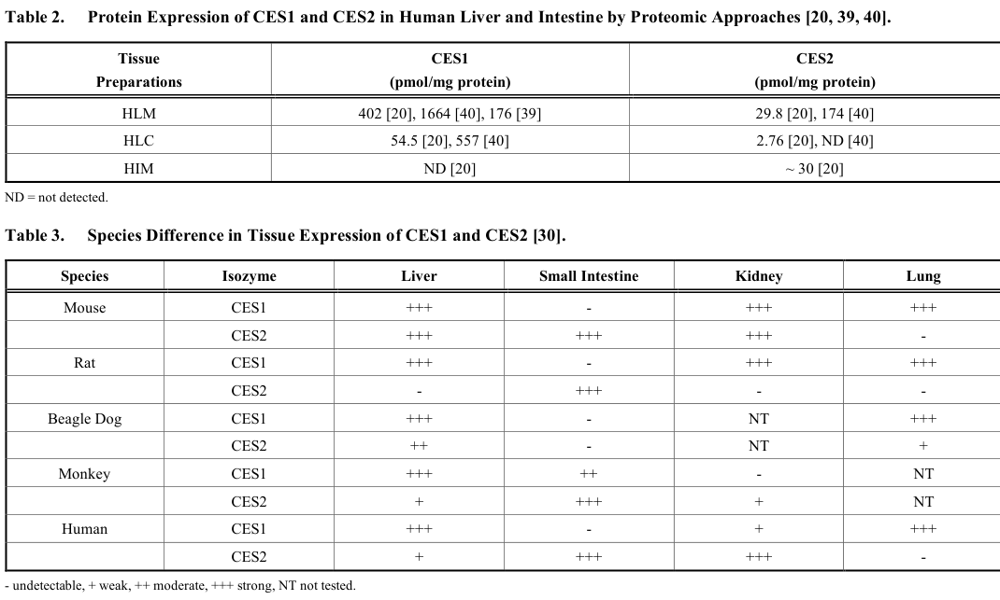

## Question

# Gene Research for Functional Annotation

## ⚠️ CRITICAL: Gene/Protein Identification Context

**BEFORE YOU BEGIN RESEARCH:** You MUST verify you are researching the CORRECT gene/protein. Gene symbols can be ambiguous, especially for less well-characterized genes from non-model organisms.

### Target Gene/Protein Identity (from UniProt):
- **UniProt Accession:** O70631
- **Protein Description:** RecName: Full=Acylcarnitine hydrolase; Short=ACH M1; EC=3.1.1.28; AltName: Full=Carboxylic ester hydrolase {ECO:0000255|RuleBase:RU361235}; EC=3.1.1.- {ECO:0000255|RuleBase:RU361235}; Flags: Precursor;
- **Gene Information:** Name=Ces2c {ECO:0000312|RGD:621510}; Synonyms=Ces2 {ECO:0000312|RGD:621510}, Ces2l {ECO:0000312|RGD:621510};
- **Organism (full):** Rattus norvegicus (Rat).
- **Protein Family:** Belongs to the type-B carboxylesterase/lipase family.
- **Key Domains:** AB_hydrolase_fold. (IPR029058); CarbesteraseB. (IPR002018); Carboxylesterase_B_AS. (IPR019826); Carboxylesterase_B_CS. (IPR019819); Type-B_Carboxylest/Lipase. (IPR050309)

### MANDATORY VERIFICATION STEPS:

1. **Check if the gene symbol "Ces2c" matches the protein description above**
2. **Verify the organism is correct:** Rattus norvegicus (Rat).
3. **Check if protein family/domains align with what you find in literature**
4. **If you find literature for a DIFFERENT gene with the same or similar symbol, STOP**

### If Gene Symbol is Ambiguous or You Cannot Find Relevant Literature:

**DO NOT PROCEED WITH RESEARCH ON A DIFFERENT GENE.** Instead:
- State clearly: "The gene symbol 'Ces2c' is ambiguous or literature is limited for this specific protein"
- Explain what you found (e.g., "Found extensive literature on a different gene with the same symbol in a different organism")
- Describe the protein based ONLY on the UniProt information provided above
- Suggest that the protein function can be inferred from domain/family information

### Research Target:

Please provide a comprehensive research report on the gene **Ces2c** (gene ID: Ces2c, UniProt: O70631) in rat.

The research report should be a detailed narrative explaining the function, biological processes, and localization of the gene product. Citations should be given for all claims.

You should prioritize authoritative reviews and primary scientific literature when conducting research. You can supplement
this with annotations you find in gene/protein databases, but these can be outdated or inaccurate.

We are specifically interested in the primary function of the gene - for enzymes, what reaction is catalyzed, and what is the substrate specificity? For transporters, what is the substrate? For structural proteins or adapters, what is the broader structural role? For signaling molecules, what is the role in the pathway.

We are interested in where in or outside the cell the gene product carries out its function.

We are also interested in the signaling or biochemical pathways in which the gene functions. We are less interested in broad pleiotropic effects, except where these elucidate the precise role.

Include evidence where possible. We are interested in both experimental evidence as well as inference from structure, evolution, or bioinformatic analysis. Precise studies should be prioritized over high-throughput, where available.

## Output

Question: You are an expert researcher providing comprehensive, well-cited information.

Provide detailed information focusing on:
1. Key concepts and definitions with current understanding
2. Recent developments and latest research (prioritize 2023-2024 sources)
3. Current applications and real-world implementations
4. Expert opinions and analysis from authoritative sources
5. Relevant statistics and data from recent studies

Format as a comprehensive research report with proper citations. Include URLs and publication dates where available.
Always prioritize recent, authoritative sources and provide specific citations for all major claims.

# Gene Research for Functional Annotation

## ⚠️ CRITICAL: Gene/Protein Identification Context

**BEFORE YOU BEGIN RESEARCH:** You MUST verify you are researching the CORRECT gene/protein. Gene symbols can be ambiguous, especially for less well-characterized genes from non-model organisms.

### Target Gene/Protein Identity (from UniProt):
- **UniProt Accession:** O70631
- **Protein Description:** RecName: Full=Acylcarnitine hydrolase; Short=ACH M1; EC=3.1.1.28; AltName: Full=Carboxylic ester hydrolase {ECO:0000255|RuleBase:RU361235}; EC=3.1.1.- {ECO:0000255|RuleBase:RU361235}; Flags: Precursor;
- **Gene Information:** Name=Ces2c {ECO:0000312|RGD:621510}; Synonyms=Ces2 {ECO:0000312|RGD:621510}, Ces2l {ECO:0000312|RGD:621510};
- **Organism (full):** Rattus norvegicus (Rat).
- **Protein Family:** Belongs to the type-B carboxylesterase/lipase family.
- **Key Domains:** AB_hydrolase_fold. (IPR029058); CarbesteraseB. (IPR002018); Carboxylesterase_B_AS. (IPR019826); Carboxylesterase_B_CS. (IPR019819); Type-B_Carboxylest/Lipase. (IPR050309)

### MANDATORY VERIFICATION STEPS:

1. **Check if the gene symbol "Ces2c" matches the protein description above**
2. **Verify the organism is correct:** Rattus norvegicus (Rat).
3. **Check if protein family/domains align with what you find in literature**
4. **If you find literature for a DIFFERENT gene with the same or similar symbol, STOP**

### If Gene Symbol is Ambiguous or You Cannot Find Relevant Literature:

**DO NOT PROCEED WITH RESEARCH ON A DIFFERENT GENE.** Instead:
- State clearly: "The gene symbol 'Ces2c' is ambiguous or literature is limited for this specific protein"
- Explain what you found (e.g., "Found extensive literature on a different gene with the same symbol in a different organism")
- Describe the protein based ONLY on the UniProt information provided above
- Suggest that the protein function can be inferred from domain/family information

### Research Target:

Please provide a comprehensive research report on the gene **Ces2c** (gene ID: Ces2c, UniProt: O70631) in rat.

The research report should be a detailed narrative explaining the function, biological processes, and localization of the gene product. Citations should be given for all claims.

You should prioritize authoritative reviews and primary scientific literature when conducting research. You can supplement
this with annotations you find in gene/protein databases, but these can be outdated or inaccurate.

We are specifically interested in the primary function of the gene - for enzymes, what reaction is catalyzed, and what is the substrate specificity? For transporters, what is the substrate? For structural proteins or adapters, what is the broader structural role? For signaling molecules, what is the role in the pathway.

We are interested in where in or outside the cell the gene product carries out its function.

We are also interested in the signaling or biochemical pathways in which the gene functions. We are less interested in broad pleiotropic effects, except where these elucidate the precise role.

Include evidence where possible. We are interested in both experimental evidence as well as inference from structure, evolution, or bioinformatic analysis. Precise studies should be prioritized over high-throughput, where available.

## Research report: Rat **Ces2c** (UniProt **O70631**) — functional annotation (acylcarnitine/carboxylesterase hydrolase)

### Executive summary (scope and evidence limitations)
Rat **Ces2c** (UniProt O70631) is annotated as an **acylcarnitine hydrolase** and a **type‑B carboxylesterase/lipase**. In the accessible literature retrieved here, direct biochemical characterization explicitly naming *rat Ces2c/O70631* (e.g., purified enzyme kinetics on defined acylcarnitines) was limited; therefore, several conclusions rely on **(i)** authoritative CES-family mechanistic reviews, **(ii)** **rat-specific CES2 tissue-distribution** comparisons, and **(iii)** historical rat “carboxylic ester hydrolase” physiology context. Where evidence is family-level or mouse/human-specific, it is labeled as such to avoid misannotation across species/paralogs. (di2019theimpactof pages 3-4, di2019theimpactof pages 6-8, di2019theimpactof pages 1-3, leinweber1987possiblephysiologicalroles pages 4-6)

### 1) Key concepts and definitions (current understanding)

#### 1.1 What CES2-family/type‑B carboxylesterases are
Carboxylesterases (CES) are **serine hydrolases** (α/β-hydrolase fold) that catalyze hydrolysis of **ester, thioester, amide, and carbamate** bonds in endogenous lipids and xenobiotics, contributing to detoxification and prodrug activation. (di2019theimpactof pages 6-8, di2019theimpactof pages 1-3)

Mechanistically, CES enzymes use a **Ser–His–Glu catalytic triad** and an **oxyanion hole** (stabilized by conserved glycine residues) to form and resolve a tetrahedral intermediate during hydrolysis. (di2019theimpactof pages 1-3)

CES2 (the family context relevant to rat Ces2c) is described as **monomeric in the ER** (endoplasmic reticulum), and CES enzymes are commonly studied in **microsomal** fractions (reflecting ER association), although some preparations show both microsomal and cytosolic activity. (di2019theimpactof pages 1-3)

#### 1.2 CES1 vs CES2 substrate “rules of thumb” (substrate specificity concept)
A frequently used working model is that **CES1** prefers substrates with **small alcohol / large acyl** groups, while **CES2** prefers substrates with **large alcohol / small acyl** groups; more broadly, CES2 tends to accommodate **very large/complex molecules** due to a more flexible active site, whereas CES1 tends to prefer smaller planar substrates. (di2019theimpactof pages 6-8, lian2018carboxylesterasesinlipid pages 6-7)

This distinction is important for functional inference when direct rat Ces2c kinetic panels are not available: Ces2c is classified within the CES2/type‑B carboxylesterase family, so CES2-like substrate preferences are a plausible starting point, subject to validation. (di2019theimpactof pages 6-8)

#### 1.3 “Acylcarnitine hydrolase” (EC 3.1.1.28) in context
Historical rat esterase literature recognizes **acylcarnitine hydrolase activity (EC 3.1.1.28)** as part of the broader hepatic carboxylesterase/ester hydrolase system (with multiple isoenzymes). This is consistent with UniProt O70631 being annotated as “acylcarnitine hydrolase.” However, the primary rat biochemical papers that directly purify/assign specific isoenzymes could not be retrieved in full text within this run, so **rat Ces2c-specific** kinetic parameters for acylcarnitines cannot be asserted from the retrieved evidence alone. (leinweber1987possiblephysiologicalroles pages 4-6)

### 2) Rat Ces2c: inferred molecular function, reaction class, and likely substrates

#### 2.1 Catalyzed reaction class (supported)
Given its CES-family placement, rat Ces2c is best supported (from retrieved sources) as a **NADPH-independent hydrolase** catalyzing hydrolysis of carboxylic esters (and often thioesters/amides) via the canonical CES catalytic triad mechanism. (di2019theimpactof pages 1-3)

#### 2.2 Substrate specificity (what can and cannot be concluded)
**Supported at family level:** CES enzymes collectively hydrolyze diverse lipid esters and xenobiotic esters (e.g., retinyl esters, phorbol diesters, platelet-activating factor, phthalate diesters, and multiple drugs), with major activity in liver and also in extrahepatic tissues depending on isoform. (leinweber1987possiblephysiologicalroles pages 4-6)

**CES2-family inference:** CES2-type enzymes preferentially hydrolyze substrates with relatively **large alcohol** moieties and can process bulky drug-like esters; this property underlies CES2 roles in prodrug activation in humans. (di2019theimpactof pages 6-8, liu2024regulationofcarboxylesterases pages 13-14)

**Not supported for rat Ces2c specifically in retrieved texts:** definitive **acylcarnitine chain-length preference**, catalytic efficiency against specific acylcarnitines, or a curated substrate panel for *rat Ces2c/O70631*. This remains an evidence gap requiring direct rat Ces2c biochemical studies. (leinweber1987possiblephysiologicalroles pages 4-6)

### 3) Expression and localization (rat-specific evidence emphasized)

#### 3.1 Tissue distribution in rat (most direct rat-relevant evidence retrieved)
A comparative species/tissue distribution table reports that **rat CES2** is strongly expressed in **small intestine** and is essentially **undetectable in rat liver, kidney, and lung**, in contrast to humans (CES2 strongly intestinal but detectable in liver) and mice (broader CES2 expression including liver). (di2019theimpactof pages 3-4, di2019theimpactof media 132d7c9f)

This indicates that, at least for the CES2 family in rat, **intestinal localization** is the dominant site of expression and likely function, which is critical for interpreting rat models of CES2-mediated xenobiotic metabolism. (di2019theimpactof pages 3-4)

#### 3.2 Subcellular localization (ER/microsomes; rodent vs human retention/secretability)
CES enzymes are synthesized into the **ER lumen** and are often recovered in **microsomal** preparations, consistent with ER association. (di2019theimpactof pages 1-3, leinweber1987possiblephysiologicalroles pages 4-6)

A key cross-species concept is that human CES proteins often have C-terminal **HXEL** ER retention motifs (KDEL-receptor mediated), whereas rodent Ces proteins may carry different C-termini (e.g., **HTEHK**) that do not bind the KDEL receptor efficiently; this helps explain why some rodent CES proteins can be secreted into blood, unlike human CESs. This is important when interpreting localization/biomarker data across species. (di2019theimpactof pages 1-3, lian2018carboxylesterasesinlipid pages 6-7)

### 4) Pathways and biological roles (what is supported and how it maps to rat Ces2c)

#### 4.1 Xenobiotic/drug metabolism and prodrug activation (strong human/translation evidence; rat caution)
CES2 is a major enzyme class in **prodrug activation** and drug ester hydrolysis; a 2024 expert review emphasizes that tissue-specific CES2 expression shapes where prodrug activation occurs, and that CES2 can be highly relevant for activation of certain anticancer prodrugs (notably irinotecan/CPT-11), though common CES2 variants have shown limited clinical PK/PD impact in some contexts (e.g., 830C>G not associated with irinotecan AUC/response). (liu2024regulationofcarboxylesterases pages 13-14)

For rat Ces2c, the same conceptual framework applies (CES2-family ester hydrolysis), but species differences in **where CES2 is expressed** (rat intestine-dominant) must be respected when translating hepatic vs intestinal contributions. (di2019theimpactof pages 3-4, di2019theimpactof media 132d7c9f)

#### 4.2 Lipid metabolism and energy homeostasis (rodent evidence; not rat Ces2c-specific here)
CES-family enzymes have established roles in lipid ester hydrolysis (e.g., TG and DG hydrolase activities are discussed for CES1/2 families). (lian2018carboxylesterasesinlipid pages 6-7)

Mouse Ces2c has been discussed in the context of hepatic lipid metabolism and responsiveness to nuclear receptor agonists; however, these data are **mouse** and not direct evidence for rat Ces2c. They suggest plausible pathway involvement (lipolysis/FA oxidation) for Ces2c-family enzymes, pending rat validation. (lian2018carboxylesterasesinlipid pages 11-12)

### 5) Regulation: expert views and mechanistic models (2024 focus)

#### 5.1 Multi-layer regulation of CES2 (2024 expert review)
A 2024 “up-to-date” review reports that human **CES2** has **three promoters (P1, P2, P3)**, with P3 supporting low basal expression and P1/P2 contributing to tissue-specific transcription. (liu2024regulationofcarboxylesterases pages 4-6)

The review highlights that CES2 regulation involves multiple transcription factors/nuclear receptors (e.g., **PXR, CAR, GR, Nrf2, NR1H3/LXR**), and that drug- and disease-mediated regulation can be ligand-, concentration-, isoform-, and species-dependent; inflammation/injury models in rodents can suppress CES2 levels and alter CES-dependent prodrug activation. (liu2024regulationofcarboxylesterases pages 6-8)

#### 5.2 CAR/PXR regulation and rodent Ces2c (mouse-focused direct evidence in retrieved set)
A nuclear receptor-focused review notes that the rodent CAR agonist **TCPOBOP** can induce mouse **Ces2c** more strongly than the rodent PXR agonist PCN, supporting a model in which CAR signaling can be a potent upstream regulator of Ces2c-family expression (in mouse). Rat-specific fold-change values for Ces2c were not captured in the retrieved excerpt. (shen2019carboxylesterasespharmacologicalinhibition pages 7-8)

### 6) Current applications and real-world implementations

#### 6.1 Drug development/ADME (applications relevant to rat Ces2c context)
Because CES2 expression is highly tissue- and species-dependent, CES2-family biology is used to (i) anticipate **first-pass intestinal hydrolysis**, (ii) design **prodrugs** whose activation is targeted to tissues with high CES activity, and (iii) manage species selection for preclinical translation. These concepts are emphasized in expert reviews discussing CES2’s importance in PK/PD variability and prodrug design. (di2019theimpactof pages 3-4, liu2024regulationofcarboxylesterases pages 16-18, liu2024regulationofcarboxylesterases pages 13-14)

Practical experimental implications include the need for appropriate in vitro systems (e.g., avoiding confounding expression differences in common cell lines) and careful sample handling because CES-mediated hydrolysis can continue ex vivo. (di2019theimpactof pages 6-8)

#### 6.2 Biomarkers and measurement technologies (2024 development)
The 2024 expert review identifies biomarker development for CES2 as an emerging area but explicitly notes that “the relationship between plasma CES2 and in vivo CES2 function has not been explored,” and that extracellular-vesicle CES quantification may require **ultrasensitive proteomics** due to very low abundance. (liu2024regulationofcarboxylesterases pages 16-18)

### 7) Relevant statistics and data points (from retrieved studies)

#### 7.1 Quantitative protein abundance (human; useful benchmark)
Quantitative proteomics values reported for human microsomes include CES2 at approximately **30–174 pmol/mg** protein in human liver microsomes and ~**30 pmol/mg** in intestinal microsomes; CES1 is substantially higher in liver (approximately **176–1,664 pmol/mg**, depending on laboratory). (di2019theimpactof pages 4-5, di2019theimpactof media 132d7c9f)

#### 7.2 Rat vs human vs mouse tissue distribution (qualitative but directly relevant to translation)
A comparative table indicates qualitative tissue distribution (e.g., “+++” vs “-”) showing **rat CES2** is “+++” in **small intestine** and “-” in **liver, kidney, lung**, while human CES2 includes “+” liver and “+++” small intestine and mouse CES2 is “+++” in liver and small intestine. (di2019theimpactof pages 3-4, di2019theimpactof media 132d7c9f)

### 8) Consolidated evidence map
The following table consolidates the strongest available evidence and flags where inferences are family-level vs rat-specific.

| Evidence area | Key findings for rat Ces2c (UniProt O70631) | Species/context caveat | Supporting citation IDs |
|---|---|---|---|
| Evidence summary for rat Ces2c (UniProt O70631): Gene/protein identity | Rat Ces2c is a CES2-family/type-B carboxylesterase in the serine hydrolase superfamily; CES enzymes have an α/β-hydrolase fold, a Ser-His-Glu catalytic triad, and glycine-based oxyanion-hole residues. CES2 is described as monomeric. Rodent CES proteins differ from human CES proteins in ER-retention sequence usage: human CES proteins commonly carry C-terminal HXEL motifs that support KDEL-receptor-mediated ER retention, whereas rodent CES proteins can carry HTEHK-like tails that do not bind KDEL receptor efficiently, helping explain why some rodent CES proteins are secreted. | Mechanistic and motif evidence is family-level or rodent-comparative; retrieved evidence did not provide a rat Ces2c-specific sequence validation beyond its placement in the rat CES2 group. | (di2019theimpactof pages 1-3, di2019theimpactof pages 3-4, di2019theimpactof pages 6-8) |
| Evidence summary for rat Ces2c (UniProt O70631): Enzymatic reaction class and substrate preferences | CES enzymes catalyze hydrolysis of ester, thioester, amide, and carbamate bonds and can also support transesterification. CES2-family enzymes generally prefer substrates with a large alcohol group and relatively small acyl moiety, whereas CES1-family enzymes tend to prefer smaller alcohol groups and larger acyl groups. Historical rat liver literature recognizes acylcarnitine hydrolase activity (EC 3.1.1.28) within the broader carboxylesterase system, consistent with the UniProt annotation of O70631 as an acylcarnitine hydrolase; however, direct Ces2c-specific kinetic constants or purified-enzyme substrate panels were not retrieved here. | The acylcarnitine hydrolase assignment is supported by historical carboxylesterase context and UniProt target definition, but direct rat Ces2c kinetics were not available in retrieved full-text evidence. | (di2019theimpactof pages 6-8, di2019theimpactof pages 1-3, lian2018carboxylesterasesinlipid pages 6-7, leinweber1987possiblephysiologicalroles pages 4-6) |
| Evidence summary for rat Ces2c (UniProt O70631): Tissue distribution in rat vs human vs mouse | Comparative distribution data indicate rat CES2 expression is concentrated in small intestine and is essentially undetectable in rat liver, kidney, and lung in the cited comparative table. In contrast, human CES2 is strongest in small intestine with detectable liver expression, while mouse CES2-family expression is broader and includes strong liver and small-intestine expression. | These data refer to species-level CES2 distribution patterns and not uniquely to rat Ces2c transcript/protein quantification. They are still useful for avoiding direct human/mouse-to-rat extrapolation. | (di2019theimpactof pages 3-4, di2019theimpactof media 132d7c9f, di2019theimpactof pages 4-5) |
| Evidence summary for rat Ces2c (UniProt O70631): Subcellular localization | CES enzymes are synthesized into the ER lumen and are commonly recovered in microsomal fractions; CES1 and CES2 can also be detected in both microsomal and cytosolic liver fractions in some preparations. CES2 is described as a monomer in the ER. General localization rules indicate proteins with ER retrieval motifs remain luminal ER residents, whereas those lacking effective motifs can be secreted. | Direct rat Ces2c subcellular localization experiments were not retrieved; localization is inferred from CES-family cell biology and rodent-vs-human motif behavior. | (di2019theimpactof pages 1-3, lian2018carboxylesterasesinlipid pages 6-7, leinweber1987possiblephysiologicalroles pages 4-6) |
| Evidence summary for rat Ces2c (UniProt O70631): Regulation and pathway links | CES genes are regulated by nuclear receptors/transcription factors including PXR, CAR, GR, Nrf2, NR1H3/LXR, and PPARα, linking them to xenobiotic response and lipid-metabolic pathways. Inflammation and injury suppress CES expression/function in rodent models. Mouse Ces2c is especially inducible by the rodent CAR agonist TCPOBOP, more strongly than by the PXR agonist PCN; PPARα and other nuclear-receptor agonists can also increase hepatic Ces2c-family expression in mouse studies. | Retrieved regulation data are mostly human general CES2 or mouse Ces2c, not rat Ces2c-specific induction studies. Applicability to rat should be treated as plausible but unconfirmed. | (liu2024regulationofcarboxylesterases pages 6-8, shen2019carboxylesterasespharmacologicalinhibition pages 7-8, lian2018carboxylesterasesinlipid pages 11-12, di2019theimpactof pages 4-5, liu2024regulationofcarboxylesterases pages 4-6) |
| Evidence summary for rat Ces2c (UniProt O70631): Recent 2024 developments | A 2024 expert review reports that CES2 has three promoters (P1, P2, P3), with P3 supporting low basal expression and P1/P2 contributing to tissue specificity. CES2 regulation is affected by drugs, inflammation, and coding/splice variants; some variants can preserve protein abundance yet abolish catalytic activity. The review highlights growing interest in plasma/extracellular-vesicle proteomics and endogenous metabolite signatures as future CES biomarkers, while noting that CES2 biomarker development remains immature. The same review emphasizes that tissue-specific CES2 expression has practical value for prodrug design and that CES2 has high catalytic relevance for irinotecan activation. | These are human-focused 2024 developments and should not be over-interpreted as rat Ces2c-specific biology. They are most useful for translational context and application framing. | (liu2024regulationofcarboxylesterases pages 4-6, liu2024regulationofcarboxylesterases pages 16-18, liu2024regulationofcarboxylesterases pages 6-8, liu2024regulationofcarboxylesterases pages 13-14) |
| Evidence summary for rat Ces2c (UniProt O70631): Quantitative statistics and recent data points | Human quantitative proteomics reported CES2 at about 30-174 pmol/mg protein in human liver microsomes and about 30 pmol/mg protein in intestinal microsomes; CES1 in human liver was much higher, about 176-1,664 pmol/mg protein. Comparative qualitative scoring showed rat CES2 as “+++” in small intestine and “-” in liver, kidney, and lung; human CES2 as “+++” in small intestine and “+” in liver; mouse CES2 as “+++” in both liver and small intestine. A 2024 review notes that the CES2 promoter SNP 830C>G was not associated with irinotecan AUC/response, and that some variants such as R34W and V142M can abolish catalytic activity despite increased protein. | Quantitative values are mainly human or comparative species-level measurements; rat Ces2c-specific enzyme kinetics, expression copy numbers, or fold-changes were not retrieved. | (di2019theimpactof media 132d7c9f, di2019theimpactof pages 4-5, liu2024regulationofcarboxylesterases pages 4-6, liu2024regulationofcarboxylesterases pages 13-14) |

*Table: This table summarizes the strongest available evidence for rat Ces2c (UniProt O70631), emphasizing where the evidence is rat-specific versus family-level or cross-species. It is useful for functional annotation because it separates well-supported CES-family biology from remaining gaps in direct rat Ces2c characterization.*

### 9) Conclusions for functional annotation of rat Ces2c (UniProt O70631)
1. **Molecular function (supported/inferred):** Ces2c is a CES2-family serine hydrolase likely catalyzing hydrolysis of carboxylic esters (and possibly thioesters/amides) using a Ser–His–Glu catalytic triad; this is strongly supported at the CES-family level. (di2019theimpactof pages 1-3)
2. **Acylcarnitine hydrolase assignment:** Historical rat esterase literature recognizes acylcarnitine hydrolase activity (EC 3.1.1.28) within the rat carboxylesterase system, consistent with UniProt’s “acylcarnitine hydrolase” description for O70631; however, direct rat Ces2c/O70631 kinetics were not retrieved, so substrate specificity for acylcarnitines should be treated as an annotation requiring targeted biochemical validation. (leinweber1987possiblephysiologicalroles pages 4-6)
3. **Likely anatomical site in rat:** Rat CES2-family expression is most strongly associated with **small intestine**, with little/no detected liver expression in the retrieved comparative dataset, implying primary roles in **intestinal lumen/enterocyte ER-associated hydrolysis** (xenobiotics and possibly dietary lipid esters). (di2019theimpactof pages 3-4, di2019theimpactof media 132d7c9f)
4. **Regulation and pathways:** CES2-family genes are regulated by xenobiotic-sensing and metabolic nuclear receptors (PXR/CAR/GR/Nrf2/LXR/PPARα), and can be suppressed by inflammatory states; this is a plausible framework for rat Ces2c regulation, with direct rodent Ces2c induction evidence in mouse by CAR agonists. (liu2024regulationofcarboxylesterases pages 6-8, shen2019carboxylesterasespharmacologicalinhibition pages 7-8)

### 10) Priority gaps and recommended next evidence to resolve rat Ces2c-specific function
Within the retrieved corpus, the major missing items for high-confidence annotation of rat Ces2c/O70631 are: (i) purified or recombinant rat Ces2c enzyme kinetics with **defined acylcarnitine substrates** (chain-length specificity, Km/Vmax), (ii) direct subcellular localization experiments for rat Ces2c (ER lumen vs secreted), and (iii) rat tissue transcript/protein quantification distinguishing **Ces2c** from other Ces2 paralogs. These likely exist in older rat biochemical literature and rat genome annotation resources but were not available as full texts in this run. (leinweber1987possiblephysiologicalroles pages 4-6, di2019theimpactof pages 6-8)

---

## Source list (retrieved and cited)
- **Liu Y, Li J, Zhu H‑J.** *Regulation of carboxylesterases and its impact on pharmacokinetics and pharmacodynamics: an up-to-date review.* **Expert Opinion on Drug Metabolism & Toxicology**. **May 2024**. https://doi.org/10.1080/17425255.2024.2348491 (liu2024regulationofcarboxylesterases pages 4-6, liu2024regulationofcarboxylesterases pages 16-18, liu2024regulationofcarboxylesterases pages 6-8, liu2024regulationofcarboxylesterases pages 13-14)
- **Di L.** *The Impact of Carboxylesterases in Drug Metabolism and Pharmacokinetics.* **Current Drug Metabolism**. **Apr 2019**. https://doi.org/10.2174/1389200219666180821094502 (di2019theimpactof pages 3-4, di2019theimpactof pages 6-8, di2019theimpactof pages 4-5, di2019theimpactof pages 1-3, di2019theimpactof media 132d7c9f)
- **Lian J, Nelson R, Lehner R.** *Carboxylesterases in lipid metabolism: from mouse to human.* **Protein & Cell**. **Jul 2018**. https://doi.org/10.1007/s13238-017-0437-z (lian2018carboxylesterasesinlipid pages 11-12, lian2018carboxylesterasesinlipid pages 6-7)
- **Shen Y, Shi Z, Yan B.** *Carboxylesterases: Pharmacological Inhibition Regulated Expression and Transcriptional Involvement of Nuclear Receptors and other Transcription Factors.* **Nuclear Receptor Research**. **Nov 2019**. https://doi.org/10.32527/2019/101435 (shen2019carboxylesterasespharmacologicalinhibition pages 7-8)
- **Leinweber F‑J.** *Possible physiological roles of carboxylic ester hydrolases.* **Drug Metabolism Reviews**. **1987**. https://doi.org/10.3109/03602538708994129 (leinweber1987possiblephysiologicalroles pages 4-6)

References

1. (di2019theimpactof pages 3-4): Li Di. The impact of carboxylesterases in drug metabolism and pharmacokinetics. Current Drug Metabolism, 20:91-102, Apr 2019. URL: https://doi.org/10.2174/1389200219666180821094502, doi:10.2174/1389200219666180821094502. This article has 219 citations and is from a peer-reviewed journal.

2. (di2019theimpactof pages 6-8): Li Di. The impact of carboxylesterases in drug metabolism and pharmacokinetics. Current Drug Metabolism, 20:91-102, Apr 2019. URL: https://doi.org/10.2174/1389200219666180821094502, doi:10.2174/1389200219666180821094502. This article has 219 citations and is from a peer-reviewed journal.

3. (di2019theimpactof pages 1-3): Li Di. The impact of carboxylesterases in drug metabolism and pharmacokinetics. Current Drug Metabolism, 20:91-102, Apr 2019. URL: https://doi.org/10.2174/1389200219666180821094502, doi:10.2174/1389200219666180821094502. This article has 219 citations and is from a peer-reviewed journal.

4. (leinweber1987possiblephysiologicalroles pages 4-6): Franz-Josef Leinweber. Possible physiological roles of carboxylic ester hydrolases. Drug metabolism reviews, 18 4:379-439, Jan 1987. URL: https://doi.org/10.3109/03602538708994129, doi:10.3109/03602538708994129. This article has 158 citations and is from a peer-reviewed journal.

5. (lian2018carboxylesterasesinlipid pages 6-7): Jihong Lian, Randal Nelson, and Richard Lehner. Carboxylesterases in lipid metabolism: from mouse to human. Protein & Cell, 9:178-195, Jul 2018. URL: https://doi.org/10.1007/s13238-017-0437-z, doi:10.1007/s13238-017-0437-z. This article has 336 citations and is from a peer-reviewed journal.

6. (liu2024regulationofcarboxylesterases pages 13-14): Yaping Liu, Jiapeng Li, and Hao-Jie Zhu. Regulation of carboxylesterases and its impact on pharmacokinetics and pharmacodynamics: an up-to-date review. Expert Opinion on Drug Metabolism & Toxicology, 20:377-397, May 2024. URL: https://doi.org/10.1080/17425255.2024.2348491, doi:10.1080/17425255.2024.2348491. This article has 29 citations and is from a peer-reviewed journal.

7. (di2019theimpactof media 132d7c9f): Li Di. The impact of carboxylesterases in drug metabolism and pharmacokinetics. Current Drug Metabolism, 20:91-102, Apr 2019. URL: https://doi.org/10.2174/1389200219666180821094502, doi:10.2174/1389200219666180821094502. This article has 219 citations and is from a peer-reviewed journal.

8. (lian2018carboxylesterasesinlipid pages 11-12): Jihong Lian, Randal Nelson, and Richard Lehner. Carboxylesterases in lipid metabolism: from mouse to human. Protein & Cell, 9:178-195, Jul 2018. URL: https://doi.org/10.1007/s13238-017-0437-z, doi:10.1007/s13238-017-0437-z. This article has 336 citations and is from a peer-reviewed journal.

9. (liu2024regulationofcarboxylesterases pages 4-6): Yaping Liu, Jiapeng Li, and Hao-Jie Zhu. Regulation of carboxylesterases and its impact on pharmacokinetics and pharmacodynamics: an up-to-date review. Expert Opinion on Drug Metabolism & Toxicology, 20:377-397, May 2024. URL: https://doi.org/10.1080/17425255.2024.2348491, doi:10.1080/17425255.2024.2348491. This article has 29 citations and is from a peer-reviewed journal.

10. (liu2024regulationofcarboxylesterases pages 6-8): Yaping Liu, Jiapeng Li, and Hao-Jie Zhu. Regulation of carboxylesterases and its impact on pharmacokinetics and pharmacodynamics: an up-to-date review. Expert Opinion on Drug Metabolism & Toxicology, 20:377-397, May 2024. URL: https://doi.org/10.1080/17425255.2024.2348491, doi:10.1080/17425255.2024.2348491. This article has 29 citations and is from a peer-reviewed journal.

11. (shen2019carboxylesterasespharmacologicalinhibition pages 7-8): Yuanjun Shen, Zhanquan Shi, and Bingfang Yan. Carboxylesterases: pharmacological inhibition regulated expression and transcriptional involvement of nuclear receptors and other transcription factors. Nuclear Receptor Research, Nov 2019. URL: https://doi.org/10.32527/2019/101435, doi:10.32527/2019/101435. This article has 14 citations and is from a peer-reviewed journal.

12. (liu2024regulationofcarboxylesterases pages 16-18): Yaping Liu, Jiapeng Li, and Hao-Jie Zhu. Regulation of carboxylesterases and its impact on pharmacokinetics and pharmacodynamics: an up-to-date review. Expert Opinion on Drug Metabolism & Toxicology, 20:377-397, May 2024. URL: https://doi.org/10.1080/17425255.2024.2348491, doi:10.1080/17425255.2024.2348491. This article has 29 citations and is from a peer-reviewed journal.

13. (di2019theimpactof pages 4-5): Li Di. The impact of carboxylesterases in drug metabolism and pharmacokinetics. Current Drug Metabolism, 20:91-102, Apr 2019. URL: https://doi.org/10.2174/1389200219666180821094502, doi:10.2174/1389200219666180821094502. This article has 219 citations and is from a peer-reviewed journal.

## Artifacts

- [Edison artifact artifact-00](Ces2c-deep-research-falcon_artifacts/artifact-00.md)

## Citations

1. di2019theimpactof pages 1-3
2. di2019theimpactof pages 6-8
3. leinweber1987possiblephysiologicalroles pages 4-6
4. di2019theimpactof pages 3-4
5. liu2024regulationofcarboxylesterases pages 13-14
6. lian2018carboxylesterasesinlipid pages 6-7
7. lian2018carboxylesterasesinlipid pages 11-12
8. liu2024regulationofcarboxylesterases pages 4-6
9. liu2024regulationofcarboxylesterases pages 6-8
10. shen2019carboxylesterasespharmacologicalinhibition pages 7-8
11. liu2024regulationofcarboxylesterases pages 16-18
12. di2019theimpactof pages 4-5
13. https://doi.org/10.1080/17425255.2024.2348491
14. https://doi.org/10.2174/1389200219666180821094502
15. https://doi.org/10.1007/s13238-017-0437-z
16. https://doi.org/10.32527/2019/101435
17. https://doi.org/10.3109/03602538708994129
18. https://doi.org/10.2174/1389200219666180821094502,
19. https://doi.org/10.3109/03602538708994129,
20. https://doi.org/10.1007/s13238-017-0437-z,
21. https://doi.org/10.1080/17425255.2024.2348491,
22. https://doi.org/10.32527/2019/101435,