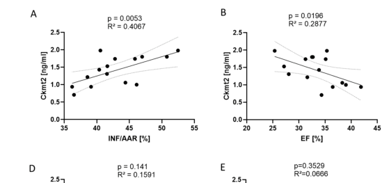

## Question

# Gene Research for Functional Annotation

## ⚠️ CRITICAL: Gene/Protein Identification Context

**BEFORE YOU BEGIN RESEARCH:** You MUST verify you are researching the CORRECT gene/protein. Gene symbols can be ambiguous, especially for less well-characterized genes from non-model organisms.

### Target Gene/Protein Identity (from UniProt):
- **UniProt Accession:** P09605
- **Protein Description:** RecName: Full=Creatine kinase S-type, mitochondrial; EC=2.7.3.2; AltName: Full=Basic-type mitochondrial creatine kinase; Short=Mib-CK; AltName: Full=Sarcomeric mitochondrial creatine kinase; Short=S-MtCK; Flags: Precursor;
- **Gene Information:** Name=Ckmt2;
- **Organism (full):** Rattus norvegicus (Rat).
- **Protein Family:** Belongs to the ATP:guanido phosphotransferase family.
- **Key Domains:** ATP-guanido_PTrfase. (IPR000749); ATP-guanido_PTrfase_AS. (IPR022415); ATP-guanido_PTrfase_cat. (IPR022414); ATP-guanido_PTrfase_N. (IPR022413); ATP-guanido_PTrfase_N_sf. (IPR036802)

### MANDATORY VERIFICATION STEPS:

1. **Check if the gene symbol "Ckmt2" matches the protein description above**
2. **Verify the organism is correct:** Rattus norvegicus (Rat).
3. **Check if protein family/domains align with what you find in literature**
4. **If you find literature for a DIFFERENT gene with the same or similar symbol, STOP**

### If Gene Symbol is Ambiguous or You Cannot Find Relevant Literature:

**DO NOT PROCEED WITH RESEARCH ON A DIFFERENT GENE.** Instead:
- State clearly: "The gene symbol 'Ckmt2' is ambiguous or literature is limited for this specific protein"
- Explain what you found (e.g., "Found extensive literature on a different gene with the same symbol in a different organism")
- Describe the protein based ONLY on the UniProt information provided above
- Suggest that the protein function can be inferred from domain/family information

### Research Target:

Please provide a comprehensive research report on the gene **Ckmt2** (gene ID: Ckmt2, UniProt: P09605) in rat.

The research report should be a detailed narrative explaining the function, biological processes, and localization of the gene product. Citations should be given for all claims.

You should prioritize authoritative reviews and primary scientific literature when conducting research. You can supplement
this with annotations you find in gene/protein databases, but these can be outdated or inaccurate.

We are specifically interested in the primary function of the gene - for enzymes, what reaction is catalyzed, and what is the substrate specificity? For transporters, what is the substrate? For structural proteins or adapters, what is the broader structural role? For signaling molecules, what is the role in the pathway.

We are interested in where in or outside the cell the gene product carries out its function.

We are also interested in the signaling or biochemical pathways in which the gene functions. We are less interested in broad pleiotropic effects, except where these elucidate the precise role.

Include evidence where possible. We are interested in both experimental evidence as well as inference from structure, evolution, or bioinformatic analysis. Precise studies should be prioritized over high-throughput, where available.

## Output

Question: You are an expert researcher providing comprehensive, well-cited information.

Provide detailed information focusing on:
1. Key concepts and definitions with current understanding
2. Recent developments and latest research (prioritize 2023-2024 sources)
3. Current applications and real-world implementations
4. Expert opinions and analysis from authoritative sources
5. Relevant statistics and data from recent studies

Format as a comprehensive research report with proper citations. Include URLs and publication dates where available.
Always prioritize recent, authoritative sources and provide specific citations for all major claims.

# Gene Research for Functional Annotation

## ⚠️ CRITICAL: Gene/Protein Identification Context

**BEFORE YOU BEGIN RESEARCH:** You MUST verify you are researching the CORRECT gene/protein. Gene symbols can be ambiguous, especially for less well-characterized genes from non-model organisms.

### Target Gene/Protein Identity (from UniProt):
- **UniProt Accession:** P09605
- **Protein Description:** RecName: Full=Creatine kinase S-type, mitochondrial; EC=2.7.3.2; AltName: Full=Basic-type mitochondrial creatine kinase; Short=Mib-CK; AltName: Full=Sarcomeric mitochondrial creatine kinase; Short=S-MtCK; Flags: Precursor;
- **Gene Information:** Name=Ckmt2;
- **Organism (full):** Rattus norvegicus (Rat).
- **Protein Family:** Belongs to the ATP:guanido phosphotransferase family.
- **Key Domains:** ATP-guanido_PTrfase. (IPR000749); ATP-guanido_PTrfase_AS. (IPR022415); ATP-guanido_PTrfase_cat. (IPR022414); ATP-guanido_PTrfase_N. (IPR022413); ATP-guanido_PTrfase_N_sf. (IPR036802)

### MANDATORY VERIFICATION STEPS:

1. **Check if the gene symbol "Ckmt2" matches the protein description above**
2. **Verify the organism is correct:** Rattus norvegicus (Rat).
3. **Check if protein family/domains align with what you find in literature**
4. **If you find literature for a DIFFERENT gene with the same or similar symbol, STOP**

### If Gene Symbol is Ambiguous or You Cannot Find Relevant Literature:

**DO NOT PROCEED WITH RESEARCH ON A DIFFERENT GENE.** Instead:
- State clearly: "The gene symbol 'Ckmt2' is ambiguous or literature is limited for this specific protein"
- Explain what you found (e.g., "Found extensive literature on a different gene with the same symbol in a different organism")
- Describe the protein based ONLY on the UniProt information provided above
- Suggest that the protein function can be inferred from domain/family information

### Research Target:

Please provide a comprehensive research report on the gene **Ckmt2** (gene ID: Ckmt2, UniProt: P09605) in rat.

The research report should be a detailed narrative explaining the function, biological processes, and localization of the gene product. Citations should be given for all claims.

You should prioritize authoritative reviews and primary scientific literature when conducting research. You can supplement
this with annotations you find in gene/protein databases, but these can be outdated or inaccurate.

We are specifically interested in the primary function of the gene - for enzymes, what reaction is catalyzed, and what is the substrate specificity? For transporters, what is the substrate? For structural proteins or adapters, what is the broader structural role? For signaling molecules, what is the role in the pathway.

We are interested in where in or outside the cell the gene product carries out its function.

We are also interested in the signaling or biochemical pathways in which the gene functions. We are less interested in broad pleiotropic effects, except where these elucidate the precise role.

Include evidence where possible. We are interested in both experimental evidence as well as inference from structure, evolution, or bioinformatic analysis. Precise studies should be prioritized over high-throughput, where available.

## Research report: Rat **Ckmt2** / mitochondrial creatine kinase S-type (UniProt **P09605**)

### 0) Target verification (critical identity check)
The requested target (UniProt P09605) is the **sarcomeric/basic mitochondrial creatine kinase** isoform, commonly termed **sMtCK** and also referred to as **MibCK/CKMT2**, encoded by the nuclear gene **Ckmt2** and distinct from the ubiquitous mitochondrial isoform **CKMT1 (Ckmt1)**. An authoritative structural/biochemical review explicitly maps these names and distinguishes the isoforms and their tissue associations (muscle vs non-muscle). (schlattner2018mitochondrialproteolipidcomplexes pages 1-4)

### 1) Key concepts and definitions (current understanding)

#### 1.1 Creatine kinase (CK) phosphagen system
The creatine kinase system buffers and transfers high-energy phosphoryl groups using the creatine/phosphocreatine (Cr/PCr) pair to maintain cellular energy homeostasis, particularly in large or highly energy-demanding cells such as cardiomyocytes and skeletal myofibers. (schlattner2018mitochondrialproteolipidcomplexes pages 1-4, lygate2024maintainingenergyprovision pages 1-2)

**Core reaction (EC 2.7.3.2):**
\[\text{Creatine} + \text{ATP} \rightleftharpoons \text{Phosphocreatine} + \text{ADP} + \text{H}^+\]
This equation is explicitly stated in a recent cardiac CK review and is consistent with the mechanistic descriptions in structural reviews. (lygate2024maintainingenergyprovision pages 1-2, schlattner2018mitochondrialproteolipidcomplexes pages 1-4)

**Why phosphocreatine matters:** PCr is described as metabolically inert except for the CK reaction and can accumulate to high intracellular levels (up to ~15–20 mM), enabling rapid temporal buffering and spatial energy transfer (“CK/PCr shuttle”). (schlattner2018mitochondrialproteolipidcomplexes pages 1-4)

#### 1.2 CK isoform compartmentation and functional logic
CK isoforms are compartmentalized: mitochondrial isoforms (CKMT1/CKMT2) are proximal to mitochondrial ATP production, while cytosolic isoforms (CKM/CKB) are positioned near ATP-consuming processes to regenerate ATP locally during high demand. This division of labor underpins the “phosphocreatine shuttle” model. (schlattner2018mitochondrialproteolipidcomplexes pages 1-4, darabedian2023depletionofcreatine pages 1-2)

### 2) Molecular function: catalytic activity and substrate specificity
CKMT2 is a **phosphotransferase** transferring the γ-phosphoryl group of ATP to creatine. (schlattner2018mitochondrialproteolipidcomplexes pages 1-4, lygate2024maintainingenergyprovision pages 1-2)

**Substrates/products:** ATP, ADP, creatine, phosphocreatine; mitochondrial CKs also show selectivity for creatine analogues relative to cytosolic CKs, based on active-site/structural studies summarized in a structural review. (schlattner2018mitochondrialproteolipidcomplexes pages 7-10)

### 3) Subcellular localization and macromolecular complexes (where CKMT2 acts)

#### 3.1 Mitochondrial localization
Mitochondrial CK is localized to the **mitochondrial intermembrane and cristae space** and assembles into **cuboidal homooctamers** that are peripherally membrane-associated. (schlattner2018mitochondrialproteolipidcomplexes pages 1-4)

#### 3.2 Proteolipid complexes and “contact sites” with VDAC and ANT
A key mechanistic concept is that mtCK forms **proteolipid complexes** via direct interaction with **cardiolipin** and with the outer membrane **VDAC** channel; **ANT** can be recruited into the same complexes, promoting inner–outer membrane “contact sites”. These assemblies are described as supporting energy transfer and stimulation of oxidative phosphorylation and as restraining ROS formation and apoptosis. (schlattner2018mitochondrialproteolipidcomplexes pages 1-4)

A classic mechanistic review of VDAC–ANT regulation further states that the **octamer of mitochondrial creatine kinase binds to VDAC from the inner surface of the outer membrane**, which restrains VDAC–ANT interactions and shifts VDAC properties (including reduced affinity for hexokinase and Bax); dissociation of the octamer (e.g., by free radicals) promotes VDAC–ANT interaction, Bax-dependent cytochrome c access/release, and increased risk of permeability transition. (vyssokikh2003thefunctionof pages 1-3)

#### 3.3 Systems-bioenergetics view (“mitochondrial interactosome”)
Systems bioenergetics work synthesizes evidence that MtCK functionally couples to ANT and outer membrane components (VDAC) in a mitochondrial “interactosome”, influencing oxidative phosphorylation control and high-energy phosphate flux distribution. This literature also reports historical coupling of PCr production to oxygen consumption with PCr/O2 ratios on the order of ~5–6 in early functional work. (guzun2011systemsbioenergeticsof pages 1-2)

### 4) Physiological roles and pathways

#### 4.1 Primary pathway role: phosphocreatine shuttle and ATP/ADP microcompartmentation
In heart, CKMT2 is positioned to convert mitochondrial ATP into PCr, which diffuses to ATPases; cytosolic CK isoforms regenerate ATP locally, thereby maintaining a favorable ATP/ADP ratio and supporting the Gibbs free energy of ATP hydrolysis at sites such as ion pumps and myofilaments. (lygate2024maintainingenergyprovision pages 1-2, schlattner2018mitochondrialproteolipidcomplexes pages 1-4)

A 2024 authoritative review provides quantitative context for the heart’s dependence on rapid phosphotransfer: ATP is ~10 mM and PCr ~20 mM in healthy human myocardium; cytosolic CK can regenerate ATP at ~10 mM/s; and in an isoenzyme breakdown described in that review, MM-CK constitutes ~67% of activity and Mt-CK ~35% (with others ~1%). (lygate2024maintainingenergyprovision pages 1-2)

#### 4.2 Ischaemia–reperfusion injury and heart failure energetics
During acute ischaemia, PCr falls within seconds while ATP declines more slowly, consistent with PCr buffering ATP early in the crisis; during reperfusion, mitochondrial ROS can damage enzymes including Mt-CK, potentially impairing recovery. (lygate2024maintainingenergyprovision pages 2-5)

In chronic heart failure, a recent review summarizes consistent reductions in total creatine and CK activity in large-animal HF models (e.g., ~26% creatine and ~48% CK activity reduction in a pig pressure-overload model; ~39% and ~25% respectively in a dog pacing model), with ATP potentially declining by up to ~30% in end-stage HF. It further notes that adenylate kinase compensation can rise (e.g., reported to ~21% of ATP turnover in dog), with implications for AMP/AMPK signaling and nucleotide loss. (lygate2024maintainingenergyprovision pages 9-10)

### 5) Recent developments and latest research (prioritizing 2023–2024)

#### 5.1 2024: plasma Ckmt2 as a reperfusion-injury biomarker after myocardial infarction (mouse)
A 2024 study in male C57BL/6J mice used untargeted plasma proteomics (n=5/group) and ELISA-based validation (correlation analyses n=15) 24 h after procedures and reported that plasma **Ckmt2** is specifically elevated after **reperfused** AMI (vs non-reperfused AMI, sham, untreated). (lang2024mitochondrialcreatinekinase pages 5-8, lang2024mitochondrialcreatinekinasea pages 6-9)

In Figure-based ELISA correlations, plasma Ckmt2 showed:
- **Positive correlation with infarct size (INF/AAR):** p = 0.0053; R² = 0.4067 (lang2024mitochondrialcreatinekinase media 0552c039)
- **Negative correlation with ejection fraction (EF):** p = 0.0196; R² = 0.2877 (lang2024mitochondrialcreatinekinase media 0552c039)

These results position Ckmt2 as a putative marker of mitochondrial injury/energetic stress in reperfused infarction rather than necrosis alone, while the authors also note the need for further clinical validation. (lang2024mitochondrialcreatinekinase pages 8-9, lang2024mitochondrialcreatinekinase media 0552c039)

#### 5.2 2024: rat HFpEF omics implicating downregulation of Ckmt2
A 2024 preprint applying integrated metabolomics/RNA-seq in the ZSF1-obese **rat HFpEF** model reports transcriptional **downregulation of creatine kinase isoforms including Ckmt2 and Ckm**, alongside broad downregulation of mitochondrial structure/function gene programs and reduced energetic state (reduced ATP/ADP; altered PCr/ATP). (gibb2024integratedsystemsbiology pages 19-23)

#### 5.3 2023: pharmacologic tractability of creatine-kinase energetics
A 2023 Nature Chemical Biology study developed a covalent creatine kinase inhibitor (CKi) that engages a conserved active-site cysteine present in CK isoforms. The paper frames mitochondrial CK isoforms (CKMT1 and CKMT2) as proximal to ATP production and cytosolic CKs as enabling rapid ATP replenishment elsewhere, and demonstrates that covalent inhibition prevents bidirectional phosphotransfer and can deplete phosphocreatine in cells—supporting the concept that CK activity can be targeted pharmacologically in CK-dependent contexts. (darabedian2023depletionofcreatine pages 1-2)

### 6) Current applications and real-world implementations

1. **Clinical/translation-facing measurement of the CK system:** The 2024 review emphasizes that cardiac high-energy phosphate metabolism and CK flux can be assessed noninvasively using **31P magnetic resonance spectroscopy (MRS)** (including saturation transfer approaches), and that metrics such as PCr/ATP and CK flux have been used as prognostic indicators in cardiomyopathy/heart failure research. (lygate2024maintainingenergyprovision pages 20-21)

2. **Biomarker discovery:** Plasma Ckmt2 as a candidate marker for reperfusion injury after AMI is an applied, near-term translational direction (preclinical stage). (lang2024mitochondrialcreatinekinase pages 5-8, lang2024mitochondrialcreatinekinase media 0552c039)

3. **Drug discovery:** Covalent inhibition of CK activity (including CKMT isoforms) provides a chemical biology route to interrogate and potentially target creatine phosphagen energetics in disease settings (demonstrated in cancer-focused models). (darabedian2023depletionofcreatine pages 1-2)

### 7) Expert opinions and authoritative analysis

- The 2024 Clinical Science review concludes that correlative evidence linking impaired energetics (PCr/ATP, CK flux) to cardiac dysfunction is compelling, and that proof-of-principle studies suggest augmentation of CK activity is a therapeutic target, but that translation to clinic requires deeper understanding of CK regulation in disease. (lygate2024maintainingenergyprovision pages 7-9)

- Structural/biochemical syntheses emphasize that mtCK’s functional significance is not only its catalytic activity but also **its assembly into membrane-linked complexes** (cardiolipin/VDAC/ANT) that create “contact sites” and can influence oxidative phosphorylation efficiency, ROS, and apoptosis susceptibility. (schlattner2018mitochondrialproteolipidcomplexes pages 1-4, vyssokikh2003thefunctionof pages 1-3)

### 8) Disease associations (curated resources)
OpenTargets reports disease associations for **human CKMT2** with neurodegenerative disease, Alzheimer’s disease, Parkinson disease, multiple sclerosis, and Peyronie disease, supported by listed evidence items/literature IDs in that resource. These associations should be interpreted as cross-species/cross-context pointers rather than direct functional evidence for rat Ckmt2. (OpenTargets Search: -CKMT2)

### 9) Summary table (functional annotation at-a-glance)
The table below consolidates identity, reaction, localization, complexes, pathways, regulation, and key 2023–2024 developments with quantitative values.

| Aspect | Key details | Evidence/source (include DOI URL and year) |
|---|---|---|
| Identity | Rat **Ckmt2 / CKMT2** corresponds to the **sarcomeric/basic mitochondrial creatine kinase** isoform, also called **sMtCK, MibCK**; distinct from **CKMT1/uMtCK**. It is the muscle mitochondrial CK isoform co-expressed with cytosolic muscle CK. (schlattner2018mitochondrialproteolipidcomplexes pages 1-4) | Schlattner et al., 2018, *Mitochondrial Proteolipid Complexes of Creatine Kinase*, https://doi.org/10.1007/978-981-10-7757-9_13 |
| Reaction | CKMT2 catalyzes the reversible phosphotransfer reaction **Creatine + ATP ↔ Phosphocreatine + ADP + H+**; in mitochondria it typically supports ATP export as diffusible phosphocreatine. (schlattner2018mitochondrialproteolipidcomplexes pages 1-4, lygate2024maintainingenergyprovision pages 1-2) | Schlattner et al., 2018, https://doi.org/10.1007/978-981-10-7757-9_13; Lygate, 2024, https://doi.org/10.1042/cs20230616 |
| Substrates | Core substrates are **creatine, ATP, phosphocreatine, ADP**. PCr is metabolically inert except for the CK reaction and can accumulate to **~15–20 mM** intracellularly, supporting energy buffering/transfer. mtCK also shows selectivity for creatine analogues. (schlattner2018mitochondrialproteolipidcomplexes pages 1-4, schlattner2018mitochondrialproteolipidcomplexes pages 7-10) | Schlattner et al., 2018, https://doi.org/10.1007/978-981-10-7757-9_13 |
| Localization | mtCK localizes to the **mitochondrial intermembrane and cristae space** as a peripheral membrane-associated enzyme positioned near mitochondrial ATP production. In the broader CK system, mitochondrial CK isoforms (CKMT1/CKMT2) are proximal to the major ATP-producing site, whereas CKM/CKB are cytosolic. (schlattner2018mitochondrialproteolipidcomplexes pages 1-4, darabedian2023depletionofcreatine pages 1-2) | Schlattner et al., 2018, https://doi.org/10.1007/978-981-10-7757-9_13; Darabedian et al., 2023, https://doi.org/10.1038/s41589-023-01273-x |
| Structural state/complexes | mtCK assembles as large **cuboidal homooctamers** that bind **cardiolipin** and interact with **VDAC**; **ANT** can be recruited into the same proteolipid complexes/contact sites. The mtCK octamer binding to VDAC restrains VDAC-ANT interaction, favors ANT antiporter function, and is linked to reduced Bax access/cytochrome c release risk. ROS/free radicals can dissociate octamers, increasing permeability-transition susceptibility. (schlattner2018mitochondrialproteolipidcomplexes pages 1-4, vyssokikh2003thefunctionof pages 1-3) | Schlattner et al., 2018, https://doi.org/10.1007/978-981-10-7757-9_13; Vyssokikh and Brdiczka, 2003, https://doi.org/10.18388/abp.2003_3693 |
| Physiological role | CKMT2 is a core component of the **CK/phosphocreatine shuttle**, coupling mitochondrial ATP generation to cytosolic ATP demand in heart/skeletal muscle. Through coupling with ANT/VDAC within the mitochondrial interactosome, it supports oxidative phosphorylation, buffers local ATP/ADP, and facilitates high-energy phosphate transfer to ATPases. (schlattner2018mitochondrialproteolipidcomplexes pages 1-4, guzun2011systemsbioenergeticsof pages 1-2, lygate2024maintainingenergyprovision pages 1-2) | Schlattner et al., 2018, https://doi.org/10.1007/978-981-10-7757-9_13; Guzun et al., 2011, https://doi.org/10.1007/s00726-011-0854-x; Lygate, 2024, https://doi.org/10.1042/cs20230616 |
| Regulation/PTMs | CK system activity is regulated by compartmentation, substrate availability, membrane complex formation, and post-translational control. Recent review evidence notes CK is vulnerable to **ROS/peroxynitrite**, Mt-CK octamers can convert to dimers under oxidative stress, and CK regulation may involve **phosphorylation, acetylation, ubiquitination**. A 2023 chemical biology study identified a conserved **active-site cysteine** in CK isoforms and developed a covalent inhibitor that blocks bidirectional phosphotransfer. (lygate2024maintainingenergyprovision pages 7-9, darabedian2023depletionofcreatine pages 1-2) | Lygate, 2024, https://doi.org/10.1042/cs20230616; Darabedian et al., 2023, https://doi.org/10.1038/s41589-023-01273-x |
| Recent 2023–2024 findings | **2024 murine AMI**: plasma **Ckmt2** was specifically elevated after **reperfused**, but not non-reperfused, myocardial infarction; untargeted proteomics used **n=5/group**, and ELISA/correlation analyses used **n=15**. Higher plasma Ckmt2 correlated **positively with infarct size**, **negatively with ejection fraction**, and **positively with end-systolic volume**. **2024 rat HFpEF**: in **ZSF1-obese rats**, cardiac **Ckmt2** and **Ckm** were transcriptionally downregulated together with broader mitochondrial/metabolic dysfunction and reduced energetic state. (lang2024mitochondrialcreatinekinase pages 5-8, lang2024mitochondrialcreatinekinasea pages 6-9, gibb2024integratedsystemsbiology pages 19-23) | Lang et al., 2024, https://doi.org/10.3390/biomedicines12102368; Gibb et al., 2024 preprint, https://doi.org/10.1101/2024.10.25.619450 |
| Applications/biomarkers | CKMT2 has emerging translational relevance as a **plasma biomarker candidate for reperfusion injury** after AMI and as an indicator of mitochondrial energetic integrity. More broadly, CK augmentation is discussed as a therapeutic strategy in ischemia–reperfusion injury and chronic heart failure, although clinical translation remains incomplete. (lang2024mitochondrialcreatinekinase pages 5-8, lang2024mitochondrialcreatinekinase pages 8-9, lygate2024maintainingenergyprovision pages 7-9) | Lang et al., 2024, https://doi.org/10.3390/biomedicines12102368; Lygate, 2024, https://doi.org/10.1042/cs20230616 |
| Quantitative data points | Healthy heart energetics: **ATP ~10 mM**, **PCr ~20 mM**, whole-heart ATP turnover about **every 10 s**, daily ATP requirement about **6 kg**; cytosolic CK can regenerate ATP at about **10 mM/s**. Isoenzyme contribution in heart review: **MM-CK ~67%**, **Mt-CK ~35%**, others ~**1%** activity; adenylate kinase contributes ~**15%** of phosphotransfer. During coupled respiration, historical **PCr/O2 ~5–6** was reported. In chronic HF models, total creatine and CK activity decline substantially (e.g., **-26% creatine / -48% CK activity** in pig pressure overload; **-39% / -25%** in dog pacing), and ATP may fall by up to **~30%** in end-stage HF. (lygate2024maintainingenergyprovision pages 1-2, lygate2024maintainingenergyprovision pages 2-5, lygate2024maintainingenergyprovision pages 9-10, guzun2011systemsbioenergeticsof pages 1-2) | Lygate, 2024, https://doi.org/10.1042/cs20230616; Guzun et al., 2011, https://doi.org/10.1007/s00726-011-0854-x |

*Table: This table summarizes the validated identity, biochemical function, localization, complexes, regulation, and recent disease-linked findings for rat Ckmt2/CKMT2 using only the cited evidence gathered in the session. It is useful as a compact functional-annotation reference that distinguishes CKMT2 from other creatine kinase isoforms while highlighting current translational relevance.*

### 10) Evidence gaps and rat-specific note
Direct rat-specific mechanistic biochemistry for UniProt P09605 was not newly retrieved in this session; however, the core enzymology, mitochondrial localization (intermembrane/cristae), and VDAC/ANT/cardiolipin complex biology are described in authoritative sources that explicitly map CKMT2 as the sarcomeric mitochondrial isoform and are widely conserved across mammals. Rat-specific recent omics evidence was captured via the 2024 HFpEF ZSF1-obese rat preprint. (schlattner2018mitochondrialproteolipidcomplexes pages 1-4, gibb2024integratedsystemsbiology pages 19-23)

### Key cited sources (with publication dates and URLs)
- Schlattner U, Kay L, Tokarska-Schlattner M. *Mitochondrial Proteolipid Complexes of Creatine Kinase.* 2018-01. https://doi.org/10.1007/978-981-10-7757-9_13 (schlattner2018mitochondrialproteolipidcomplexes pages 1-4)
- Lygate CA. *Maintaining energy provision in the heart: the creatine kinase system in ischaemia–reperfusion injury and chronic heart failure.* 2024-04. https://doi.org/10.1042/cs20230616 (lygate2024maintainingenergyprovision pages 1-2)
- Lang A et al. *Mitochondrial Creatine Kinase 2 (Ckmt2) as a Plasma-Based Biomarker for Evaluating Reperfusion Injury in Acute Myocardial Infarction.* 2024-10-16. https://doi.org/10.3390/biomedicines12102368 (lang2024mitochondrialcreatinekinase pages 1-2)
- Darabedian N et al. *Depletion of creatine phosphagen energetics with a covalent creatine kinase inhibitor.* 2023-02 (online); Nat Chem Biol 19:815–824. https://doi.org/10.1038/s41589-023-01273-x (darabedian2023depletionofcreatine pages 1-2)
- Gibb AA et al. *Integrated systems biology identifies disruptions in mitochondrial function and metabolism as key contributors to HFpEF.* 2024-10-25 (preprint). https://doi.org/10.1101/2024.10.25.619450 (gibb2024integratedsystemsbiology pages 19-23)
- OpenTargets CKMT2 disease associations (database view; evidence items listed therein). Accessed in-session. (OpenTargets Search: -CKMT2)

References

1. (schlattner2018mitochondrialproteolipidcomplexes pages 1-4): Uwe Schlattner, Laurence Kay, and Malgorzata Tokarska-Schlattner. Mitochondrial proteolipid complexes of creatine kinase. Sub-cellular biochemistry, 87:365-408, Jan 2018. URL: https://doi.org/10.1007/978-981-10-7757-9\_13, doi:10.1007/978-981-10-7757-9\_13. This article has 61 citations.

2. (lygate2024maintainingenergyprovision pages 1-2): Craig A. Lygate. Maintaining energy provision in the heart: the creatine kinase system in ischaemia–reperfusion injury and chronic heart failure. Clinical Science (London, England : 1979), 138:491-514, Apr 2024. URL: https://doi.org/10.1042/cs20230616, doi:10.1042/cs20230616. This article has 21 citations.

3. (darabedian2023depletionofcreatine pages 1-2): Narek Darabedian, Wenzhi Ji, Mengyang Fan, Shan Lin, Hyuk-Soo Seo, Ekaterina V. Vinogradova, Tomer M. Yaron, Evanna L. Mills, Haopeng Xiao, Kristine Senkane, Emily M. Huntsman, Jared L. Johnson, Jianwei Che, Lewis C. Cantley, Benjamin F. Cravatt, Sirano Dhe-Paganon, Kimberly Stegmaier, Tinghu Zhang, Nathanael S. Gray, and Edward T. Chouchani. Depletion of creatine phosphagen energetics with a covalent creatine kinase inhibitor. Nature Chemical Biology, 19:815-824, Feb 2023. URL: https://doi.org/10.1038/s41589-023-01273-x, doi:10.1038/s41589-023-01273-x. This article has 52 citations and is from a highest quality peer-reviewed journal.

4. (schlattner2018mitochondrialproteolipidcomplexes pages 7-10): Uwe Schlattner, Laurence Kay, and Malgorzata Tokarska-Schlattner. Mitochondrial proteolipid complexes of creatine kinase. Sub-cellular biochemistry, 87:365-408, Jan 2018. URL: https://doi.org/10.1007/978-981-10-7757-9\_13, doi:10.1007/978-981-10-7757-9\_13. This article has 61 citations.

5. (vyssokikh2003thefunctionof pages 1-3): Mikhail Y Vyssokikh and Dieter Brdiczka. The function of complexes between the outer mitochondrial membrane pore (vdac) and the adenine nucleotide translocase in regulation of energy metabolism and apoptosis. Acta Biochimica Polonica, 50:389-404, Jun 2003. URL: https://doi.org/10.18388/abp.2003\_3693, doi:10.18388/abp.2003\_3693. This article has 277 citations.

6. (guzun2011systemsbioenergeticsof pages 1-2): R. Guzun, N. Timohhina, K. Tepp, M. Gonzalez-Granillo, I. Shevchuk, V. Chekulayev, A. V. Kuznetsov, T. Kaambre, and V. A. Saks. Systems bioenergetics of creatine kinase networks: physiological roles of creatine and phosphocreatine in regulation of cardiac cell function. Amino Acids, 40:1333-1348, Mar 2011. URL: https://doi.org/10.1007/s00726-011-0854-x, doi:10.1007/s00726-011-0854-x. This article has 129 citations and is from a peer-reviewed journal.

7. (lygate2024maintainingenergyprovision pages 2-5): Craig A. Lygate. Maintaining energy provision in the heart: the creatine kinase system in ischaemia–reperfusion injury and chronic heart failure. Clinical Science (London, England : 1979), 138:491-514, Apr 2024. URL: https://doi.org/10.1042/cs20230616, doi:10.1042/cs20230616. This article has 21 citations.

8. (lygate2024maintainingenergyprovision pages 9-10): Craig A. Lygate. Maintaining energy provision in the heart: the creatine kinase system in ischaemia–reperfusion injury and chronic heart failure. Clinical Science (London, England : 1979), 138:491-514, Apr 2024. URL: https://doi.org/10.1042/cs20230616, doi:10.1042/cs20230616. This article has 21 citations.

9. (lang2024mitochondrialcreatinekinase pages 5-8): Alexander Lang, Daniel Oehler, Marcel Benkhoff, Yvonne Reinders, Maike Barcik, Khatereh Shahrjerdi, Madlen Kaldirim, Albert Sickmann, Lisa Dannenberg, Amin Polzin, Susanne Pfeiler, Malte Kelm, Maria Grandoch, Christian Jung, and Norbert Gerdes. Mitochondrial creatine kinase 2 (ckmt2) as a plasma-based biomarker for evaluating reperfusion injury in acute myocardial infarction. Biomedicines, 12:2368, Oct 2024. URL: https://doi.org/10.3390/biomedicines12102368, doi:10.3390/biomedicines12102368. This article has 3 citations.

10. (lang2024mitochondrialcreatinekinasea pages 6-9): A Lang, D Oehler, M Benkhoff, Y Reinders, and M Barcik. Mitochondrial creatine kinase 2 (ckmt2) as a plasma-based biomarker for evaluating reperfusion injury in acute myocardial infarction. biomedicines 2024, 12 …. Unknown journal, 2024.

11. (lang2024mitochondrialcreatinekinase media 0552c039): Alexander Lang, Daniel Oehler, Marcel Benkhoff, Yvonne Reinders, Maike Barcik, Khatereh Shahrjerdi, Madlen Kaldirim, Albert Sickmann, Lisa Dannenberg, Amin Polzin, Susanne Pfeiler, Malte Kelm, Maria Grandoch, Christian Jung, and Norbert Gerdes. Mitochondrial creatine kinase 2 (ckmt2) as a plasma-based biomarker for evaluating reperfusion injury in acute myocardial infarction. Biomedicines, 12:2368, Oct 2024. URL: https://doi.org/10.3390/biomedicines12102368, doi:10.3390/biomedicines12102368. This article has 3 citations.

12. (lang2024mitochondrialcreatinekinase pages 8-9): Alexander Lang, Daniel Oehler, Marcel Benkhoff, Yvonne Reinders, Maike Barcik, Khatereh Shahrjerdi, Madlen Kaldirim, Albert Sickmann, Lisa Dannenberg, Amin Polzin, Susanne Pfeiler, Malte Kelm, Maria Grandoch, Christian Jung, and Norbert Gerdes. Mitochondrial creatine kinase 2 (ckmt2) as a plasma-based biomarker for evaluating reperfusion injury in acute myocardial infarction. Biomedicines, 12:2368, Oct 2024. URL: https://doi.org/10.3390/biomedicines12102368, doi:10.3390/biomedicines12102368. This article has 3 citations.

13. (gibb2024integratedsystemsbiology pages 19-23): Andrew A. Gibb, Kyle B. LaPenna, Ryan B. Gaspar, Nadina R. Latchman, Yinfei Tan, Carmen Choya-Foces, Jake E. Doiron, Zhen Li, Huijing Xia, Michael P. Lazaropoulos, Mariell Conwell, Thomas E. Sharp, Traci T. Goodchild, David J. Lefer, and John W. Elrod. Integrated systems biology identifies disruptions in mitochondrial function and metabolism as key contributors to heart failure with preserved ejection fraction (hfpef). BioRxiv, Oct 2024. URL: https://doi.org/10.1101/2024.10.25.619450, doi:10.1101/2024.10.25.619450. This article has 3 citations.

14. (lygate2024maintainingenergyprovision pages 20-21): Craig A. Lygate. Maintaining energy provision in the heart: the creatine kinase system in ischaemia–reperfusion injury and chronic heart failure. Clinical Science (London, England : 1979), 138:491-514, Apr 2024. URL: https://doi.org/10.1042/cs20230616, doi:10.1042/cs20230616. This article has 21 citations.

15. (lygate2024maintainingenergyprovision pages 7-9): Craig A. Lygate. Maintaining energy provision in the heart: the creatine kinase system in ischaemia–reperfusion injury and chronic heart failure. Clinical Science (London, England : 1979), 138:491-514, Apr 2024. URL: https://doi.org/10.1042/cs20230616, doi:10.1042/cs20230616. This article has 21 citations.

16. (OpenTargets Search: -CKMT2): Open Targets Query (-CKMT2, 5 results). Buniello, A. et al. (2025). Open Targets Platform: facilitating therapeutic hypotheses building in drug discovery. Nucleic Acids Research.

17. (lang2024mitochondrialcreatinekinase pages 1-2): Alexander Lang, Daniel Oehler, Marcel Benkhoff, Yvonne Reinders, Maike Barcik, Khatereh Shahrjerdi, Madlen Kaldirim, Albert Sickmann, Lisa Dannenberg, Amin Polzin, Susanne Pfeiler, Malte Kelm, Maria Grandoch, Christian Jung, and Norbert Gerdes. Mitochondrial creatine kinase 2 (ckmt2) as a plasma-based biomarker for evaluating reperfusion injury in acute myocardial infarction. Biomedicines, 12:2368, Oct 2024. URL: https://doi.org/10.3390/biomedicines12102368, doi:10.3390/biomedicines12102368. This article has 3 citations.

## Artifacts

- [Edison artifact artifact-00](Ckmt2-deep-research-falcon_artifacts/artifact-00.md)

## Citations

1. schlattner2018mitochondrialproteolipidcomplexes pages 1-4
2. schlattner2018mitochondrialproteolipidcomplexes pages 7-10
3. vyssokikh2003thefunctionof pages 1-3
4. guzun2011systemsbioenergeticsof pages 1-2
5. lygate2024maintainingenergyprovision pages 1-2
6. lygate2024maintainingenergyprovision pages 2-5
7. lygate2024maintainingenergyprovision pages 9-10
8. gibb2024integratedsystemsbiology pages 19-23
9. darabedian2023depletionofcreatine pages 1-2
10. lygate2024maintainingenergyprovision pages 20-21
11. lygate2024maintainingenergyprovision pages 7-9
12. lang2024mitochondrialcreatinekinase pages 1-2
13. lang2024mitochondrialcreatinekinase pages 5-8
14. lang2024mitochondrialcreatinekinasea pages 6-9
15. lang2024mitochondrialcreatinekinase pages 8-9
16. \text{Creatine} + \text{ATP} \rightleftharpoons \text{Phosphocreatine} + \text{ADP} + \text{H}^+\
17. https://doi.org/10.1007/978-981-10-7757-9_13
18. https://doi.org/10.1007/978-981-10-7757-9_13;
19. https://doi.org/10.1042/cs20230616
20. https://doi.org/10.1038/s41589-023-01273-x
21. https://doi.org/10.18388/abp.2003_3693
22. https://doi.org/10.1007/s00726-011-0854-x;
23. https://doi.org/10.1042/cs20230616;
24. https://doi.org/10.3390/biomedicines12102368;
25. https://doi.org/10.1101/2024.10.25.619450
26. https://doi.org/10.1007/s00726-011-0854-x
27. https://doi.org/10.3390/biomedicines12102368
28. https://doi.org/10.1007/978-981-10-7757-9\_13,
29. https://doi.org/10.1042/cs20230616,
30. https://doi.org/10.1038/s41589-023-01273-x,
31. https://doi.org/10.18388/abp.2003\_3693,
32. https://doi.org/10.1007/s00726-011-0854-x,
33. https://doi.org/10.3390/biomedicines12102368,
34. https://doi.org/10.1101/2024.10.25.619450,