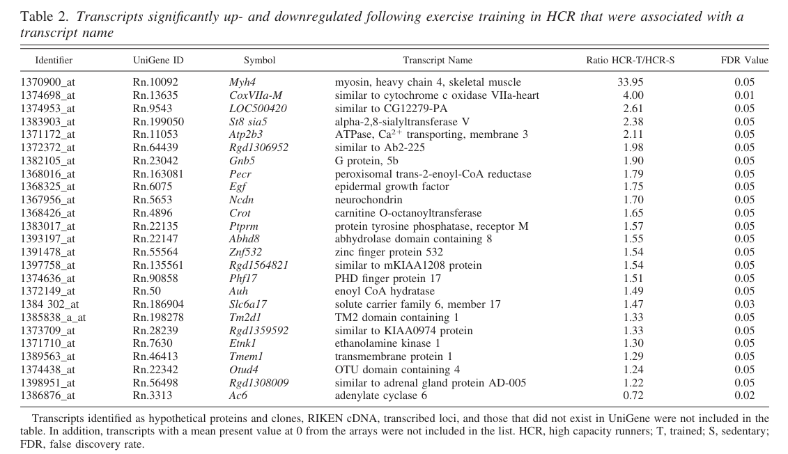

## Question

# Gene Research for Functional Annotation

## ⚠️ CRITICAL: Gene/Protein Identification Context

**BEFORE YOU BEGIN RESEARCH:** You MUST verify you are researching the CORRECT gene/protein. Gene symbols can be ambiguous, especially for less well-characterized genes from non-model organisms.

### Target Gene/Protein Identity (from UniProt):
- **UniProt Accession:** P11466
- **Protein Description:** RecName: Full=Peroxisomal carnitine O-octanoyltransferase; Short=COT; EC=2.3.1.137 {ECO:0000250|UniProtKB:Q9UKG9};
- **Gene Information:** Name=Crot; Synonyms=Cot;
- **Organism (full):** Rattus norvegicus (Rat).
- **Protein Family:** Belongs to the carnitine/choline acetyltransferase family.
- **Key Domains:** Carn_acyl_trans. (IPR000542); Carn_acyl_trans_N. (IPR042572); CAT-like_dom_sf. (IPR023213); Cho/carn_acyl_trans. (IPR039551); Cho/carn_acyl_trans_2. (IPR042231)

### MANDATORY VERIFICATION STEPS:

1. **Check if the gene symbol "Crot" matches the protein description above**
2. **Verify the organism is correct:** Rattus norvegicus (Rat).
3. **Check if protein family/domains align with what you find in literature**
4. **If you find literature for a DIFFERENT gene with the same or similar symbol, STOP**

### If Gene Symbol is Ambiguous or You Cannot Find Relevant Literature:

**DO NOT PROCEED WITH RESEARCH ON A DIFFERENT GENE.** Instead:
- State clearly: "The gene symbol 'Crot' is ambiguous or literature is limited for this specific protein"
- Explain what you found (e.g., "Found extensive literature on a different gene with the same symbol in a different organism")
- Describe the protein based ONLY on the UniProt information provided above
- Suggest that the protein function can be inferred from domain/family information

### Research Target:

Please provide a comprehensive research report on the gene **Crot** (gene ID: Crot, UniProt: P11466) in rat.

The research report should be a detailed narrative explaining the function, biological processes, and localization of the gene product. Citations should be given for all claims.

You should prioritize authoritative reviews and primary scientific literature when conducting research. You can supplement
this with annotations you find in gene/protein databases, but these can be outdated or inaccurate.

We are specifically interested in the primary function of the gene - for enzymes, what reaction is catalyzed, and what is the substrate specificity? For transporters, what is the substrate? For structural proteins or adapters, what is the broader structural role? For signaling molecules, what is the role in the pathway.

We are interested in where in or outside the cell the gene product carries out its function.

We are also interested in the signaling or biochemical pathways in which the gene functions. We are less interested in broad pleiotropic effects, except where these elucidate the precise role.

Include evidence where possible. We are interested in both experimental evidence as well as inference from structure, evolution, or bioinformatic analysis. Precise studies should be prioritized over high-throughput, where available.

## Output

Question: You are an expert researcher providing comprehensive, well-cited information.

Provide detailed information focusing on:
1. Key concepts and definitions with current understanding
2. Recent developments and latest research (prioritize 2023-2024 sources)
3. Current applications and real-world implementations
4. Expert opinions and analysis from authoritative sources
5. Relevant statistics and data from recent studies

Format as a comprehensive research report with proper citations. Include URLs and publication dates where available.
Always prioritize recent, authoritative sources and provide specific citations for all major claims.

# Gene Research for Functional Annotation

## ⚠️ CRITICAL: Gene/Protein Identification Context

**BEFORE YOU BEGIN RESEARCH:** You MUST verify you are researching the CORRECT gene/protein. Gene symbols can be ambiguous, especially for less well-characterized genes from non-model organisms.

### Target Gene/Protein Identity (from UniProt):
- **UniProt Accession:** P11466
- **Protein Description:** RecName: Full=Peroxisomal carnitine O-octanoyltransferase; Short=COT; EC=2.3.1.137 {ECO:0000250|UniProtKB:Q9UKG9};
- **Gene Information:** Name=Crot; Synonyms=Cot;
- **Organism (full):** Rattus norvegicus (Rat).
- **Protein Family:** Belongs to the carnitine/choline acetyltransferase family.
- **Key Domains:** Carn_acyl_trans. (IPR000542); Carn_acyl_trans_N. (IPR042572); CAT-like_dom_sf. (IPR023213); Cho/carn_acyl_trans. (IPR039551); Cho/carn_acyl_trans_2. (IPR042231)

### MANDATORY VERIFICATION STEPS:

1. **Check if the gene symbol "Crot" matches the protein description above**
2. **Verify the organism is correct:** Rattus norvegicus (Rat).
3. **Check if protein family/domains align with what you find in literature**
4. **If you find literature for a DIFFERENT gene with the same or similar symbol, STOP**

### If Gene Symbol is Ambiguous or You Cannot Find Relevant Literature:

**DO NOT PROCEED WITH RESEARCH ON A DIFFERENT GENE.** Instead:
- State clearly: "The gene symbol 'Crot' is ambiguous or literature is limited for this specific protein"
- Explain what you found (e.g., "Found extensive literature on a different gene with the same symbol in a different organism")
- Describe the protein based ONLY on the UniProt information provided above
- Suggest that the protein function can be inferred from domain/family information

### Research Target:

Please provide a comprehensive research report on the gene **Crot** (gene ID: Crot, UniProt: P11466) in rat.

The research report should be a detailed narrative explaining the function, biological processes, and localization of the gene product. Citations should be given for all claims.

You should prioritize authoritative reviews and primary scientific literature when conducting research. You can supplement
this with annotations you find in gene/protein databases, but these can be outdated or inaccurate.

We are specifically interested in the primary function of the gene - for enzymes, what reaction is catalyzed, and what is the substrate specificity? For transporters, what is the substrate? For structural proteins or adapters, what is the broader structural role? For signaling molecules, what is the role in the pathway.

We are interested in where in or outside the cell the gene product carries out its function.

We are also interested in the signaling or biochemical pathways in which the gene functions. We are less interested in broad pleiotropic effects, except where these elucidate the precise role.

Include evidence where possible. We are interested in both experimental evidence as well as inference from structure, evolution, or bioinformatic analysis. Precise studies should be prioritized over high-throughput, where available.

## Research report: Rat **Crot** (UniProt **P11466**) — peroxisomal carnitine O‑octanoyltransferase (COT/CROT; EC 2.3.1.137)

### 0) Identity verification (mandatory)
The target rat gene **Crot** (UniProt **P11466**) corresponds to **peroxisomal carnitine O‑octanoyltransferase (CROT/COT)**, a member of the carnitine/choline acyltransferase family. Across mechanistic and omics literature, “CROT/Crot” is consistently used for a **peroxisomal enzyme that exchanges CoA and carnitine on medium‑chain acyl groups**, matching the UniProt description and expected domain/family context. No alternative, conflicting rat “Crot” identity emerged in the retrieved sources. (westin2008shortandmediumchain pages 6-8, okui2024carnitineooctanoyltransferase(crot) pages 1-2, westin2008shortandmediumchain pages 1-3)

### 1) Key concepts and definitions (current understanding)

#### 1.1 What CROT is
CROT is a **peroxisomal carnitine acyltransferase** that catalyzes a reversible acyl‑transfer reaction:

**L‑carnitine + acyl‑CoA ⇄ acyl‑L‑carnitine + CoASH**. (okui2024carnitineooctanoyltransferase(crot) pages 1-2, okui2024carnitineooctanoyltransferase(crot) pages 2-3)

This chemistry is central to **acylcarnitine formation**, which is widely used by cells to move (or buffer) acyl groups across compartment boundaries where **acyl‑CoAs themselves are poorly membrane‑permeable**. (okui2024carnitineooctanoyltransferase(crot) pages 1-2)

#### 1.2 Substrate specificity (chain length and substrate types)
Across sources, CROT is described as preferring **medium‑chain acyl‑CoAs**, with slightly different reported ranges depending on experimental system and framing:
- **C6–C10** medium‑chain acyl‑CoAs (including branched medium‑chain species). (westin2008shortandmediumchain pages 6-8, westin2008shortandmediumchain pages 1-3)
- **C8–C14** chain‑length preference in a mechanistic study describing MCFA exchange of CoA for carnitine. (sanford2023carnitineooctanoyltransferaseis pages 1-2)

CROT has also been implicated in handling **branched‑chain β‑oxidation products**, including conversion of **4,8‑dimethylnonanoyl‑CoA (DMN‑CoA)** to a carnitine ester for downstream oxidation. (westin2008shortandmediumchain pages 8-9, westin2008shortandmediumchain pages 6-8)

Kinetic detail in the retrieved text is limited; one review‑style discussion reports Km values for these enzymes (CROT/CRAT and related thioesterases) in the **low millimolar range** under certain conditions, but the exact numeric Km/Vmax values for CROT are not present in the extracted snippets. (westin2008shortandmediumchain pages 6-8)

#### 1.3 Subcellular localization
CROT is described as **peroxisomal** and, in one mechanistic discussion, as **entirely peroxisomal**. (westin2008shortandmediumchain pages 6-8, okui2024carnitineooctanoyltransferase(crot) pages 1-2)

#### 1.4 Pathway placement: peroxisome–mitochondria metabolic crosstalk
A widely supported model is that peroxisomes perform **partial β‑oxidation** of substrates such as very‑long‑chain fatty acids (VLCFAs) and certain branched lipids, generating **medium‑chain acyl‑CoAs** that must be exported for complete oxidation. CROT contributes by converting these medium‑chain acyl‑CoAs to **acylcarnitines**, which can be transported out of peroxisomes and then further metabolized (including by mitochondria). (westin2008shortandmediumchain pages 6-8, okui2024carnitineooctanoyltransferase(crot) pages 1-2, westin2008shortandmediumchain pages 1-3)

### 2) Recent developments and latest research (prioritizing 2023–2024)

#### 2.1 2023: CROT links peroxisomal lipid handling to p53‑dependent survival under nutrient stress
A 2023 mechanistic study in *Journal of Biological Chemistry* reported that **CROT is a p53 target gene** and that CROT activity supports **oxidative metabolism and cell survival during nutrient starvation**. The authors describe CROT as a peroxisomal enzyme exchanging CoA for carnitine on medium‑chain fatty acids, enabling export of peroxisomal products and supporting mitochondrial respiration; loss/downregulation is associated with **VLCFA accumulation** and impaired mitochondrial oxidative respiration, whereas overexpression of active CROT enhances oxygen consumption. (sanford2023carnitineooctanoyltransferaseis pages 1-2, sanford2023carnitineooctanoyltransferaseis pages 2-3)

**Interpretation:** this positions CROT not only as a “plumbing” enzyme for metabolite traffic but also as a node where stress‑responsive transcriptional programs (p53) can modulate peroxisome→mitochondria carbon flow. (sanford2023carnitineooctanoyltransferaseis pages 1-2, sanford2023carnitineooctanoyltransferaseis pages 2-3)

**Source details:** Sanford et al., 2023-07, *J Biol Chem*; https://doi.org/10.1016/j.jbc.2023.104908. (sanford2023carnitineooctanoyltransferaseis pages 1-2)

#### 2.2 2024: System-level metabolomic consequences of CROT deficiency (mouse genetics; mechanistic relevance to mammalian CROT biology)
Okui et al. (2024, *Frontiers in Molecular Biosciences*) performed LC‑MS metabolomics on **liver and plasma** from **Crot−/−, Crot+/−, and Crot+/+** mice (n=5 per genotype per tissue). They report that omega‑3 fatty acids were higher in the liver of CROT-deficient mice; the paper also emphasizes CROT’s canonical peroxisomal reaction and role in enabling peroxisome-generated medium-chain acyl groups to be used by mitochondria. (okui2024carnitineooctanoyltransferase(crot) pages 1-2, okui2024carnitineooctanoyltransferase(crot) pages 2-3)

Key quantitative liver metabolomics examples from Table 1 include increased:
- **EPA** (e.g., p = 1.65E−08, log2FC = 1.19; cis‑5,8,11,14,17‑EPA p = 1.80E−08, log2FC = 1.18)
- **EPA methyl ester** (p = 1.07E−06, log2FC = 2.45)
- **DPA** (p = 8.61E−05, log2FC = 1.07; another entry p = 2.05E−04, log2FC = 1.14)
- **DHA** and **DHA methyl ester** (DHA methyl ester p = 5.65E−05, log2FC = 1.38; a DHA entry p = 4.97E−03, log2FC = 0.64). (okui2024carnitineooctanoyltransferase(crot) pages 6-9)

They further report increased plasma **dicarboxylic acids** (tetradecanedioic acid and azelaic acid) with CROT deficiency, and note data processing thresholds of p < 0.05 and q < 0.30, with 21 metabolites increased and 48 decreased across analytical conditions; liver **L‑carnitine** decreased (p < 0.002; q < 0.025). (okui2024carnitineooctanoyltransferase(crot) pages 4-6, okui2024carnitineooctanoyltransferase(crot) pages 11-12)

**Source details:** Okui et al., 2024-07, *Front Mol Biosci*; https://doi.org/10.3389/fmolb.2024.1374316. (okui2024carnitineooctanoyltransferase(crot) pages 1-2)

#### 2.3 2024: Rat brain transcriptomics after finasteride includes Crot as a differentially expressed gene
Giatti et al. (2024, *Journal of Endocrinological Investigation*) performed RNA‑seq in adult male rat hypothalamus and hippocampus after finasteride dosing (1 mg/rat/day for 20 days; n=4 per group/timepoint). They report **CROT among differentially expressed genes** after treatment. At 24h post-treatment, they observed **186 DE genes** in hypothalamus (171 up, 15 down) and **19 DE genes** in hippocampus (17 up, 2 down), with **no DE genes** detected 1 month after withdrawal. (giatti2024analysisofthe pages 1-2)

**Source details:** Giatti et al., 2024-03, *J Endocrinol Invest*; https://doi.org/10.1007/s40618-024-02345-y. (giatti2024analysisofthe pages 1-2)

### 3) Current applications and real-world implementations

#### 3.1 Crot as a readout of peroxisome proliferator responses in rat toxicology and metabolism
Rat liver expression profiling with **peroxisome proliferators** uses Crot as part of the transcriptional response in liver/hepatocytes. In a rat study comparing conditions in vivo and in vitro, Tamura et al. reported induction values for two Crot probes of **2.8/3.1/2.0** and **6.4/6.4/3.6** across treatment conditions (table includes Vivo/Vitro and Single/Repeated structure). (tamura2006profilingofgene pages 8-9)

Practical use: Crot expression can serve as a **marker of peroxisomal lipid metabolism engagement** in pharmacology/toxicology contexts where peroxisome proliferators/PPAR-related pathways are interrogated. (tamura2006profilingofgene pages 8-9)

#### 3.2 Crot in rat exercise physiology: association with oxidative/peroxisomal programs
In rat skeletal muscle microarray profiling of high‑ and low‑intrinsic aerobic capacity lines, Bye et al. reported that after exercise training, **Crot increased ~1.65-fold** in high-capacity runner (HCR) soleus (HCR‑T/HCR‑S = 1.65; FDR=0.05). (bye2008geneexpressionprofiling pages 3-4, bye2008geneexpressionprofiling media 2f953ebc)

This supports real‑world implementation of Crot as part of **oxidative metabolism gene panels** in preclinical exercise and metabolic health research. (bye2008geneexpressionprofiling pages 3-4)

### 4) Expert opinions and analysis (authoritative interpretations)

#### 4.1 CROT as a peroxisomal “export valve” for medium-chain β-oxidation products
A detailed mechanistic synthesis (Westin et al., 2008) frames peroxisomal fatty acid oxidation as generating medium‑chain CoA products that must be further handled either by **CROT (acylcarnitine formation)** or **acyl‑CoA thioesterases (free fatty acid release)** in a tissue-dependent manner. CROT is explicitly presented as a key component of a **carnitine-dependent transport mechanism** exporting β-oxidation products to mitochondria for further metabolism. (westin2008shortandmediumchain pages 6-8, westin2008shortandmediumchain pages 1-3)

This “export” framing is consistent with the 2023 and 2024 literature connecting CROT abundance/activity to downstream mitochondrial oxidative respiration and systemic lipid remodeling. (sanford2023carnitineooctanoyltransferaseis pages 1-2, okui2024carnitineooctanoyltransferase(crot) pages 1-2, okui2024carnitineooctanoyltransferase(crot) pages 11-12)

#### 4.2 Systems view: CROT perturbation can shift lipid partitioning
Okui et al. interpret CROT deficiency as potentially shifting some fatty‑acid substrates away from carnitine-dependent catabolic fate toward altered lipid pools, including increased omega‑3 fatty acids and elevated dicarboxylic acids in plasma (potential biomarkers). While mechanistic causality remains under active investigation, their data support the idea that manipulating CROT function can have measurable effects on lipid composition. (okui2024carnitineooctanoyltransferase(crot) pages 4-6, okui2024carnitineooctanoyltransferase(crot) pages 11-12)

### 5) Relevant statistics and data from recent studies
Key quantitative observations directly supported by retrieved evidence include:

1) **Rat liver/hepatocyte induction by peroxisome proliferators (Tamura 2006):** Crot probe-associated induction values of **2.8/3.1/2.0** and **6.4/6.4/3.6** across in vivo/in vitro, single/repeated conditions. (tamura2006profilingofgene pages 8-9)

2) **Rat soleus exercise training (Bye 2008):** Crot **HCR‑T/HCR‑S = 1.65**, **FDR = 0.05** (Table 2). (bye2008geneexpressionprofiling pages 3-4, bye2008geneexpressionprofiling media 2f953ebc)

3) **Rat brain RNA‑seq after finasteride (Giatti 2024):** **186 DE genes** (hypothalamus) and **19 DE genes** (hippocampus) after treatment; **0 DE genes** after 1‑month withdrawal; **n=4** per group/timepoint. (giatti2024analysisofthe pages 1-2)

4) **Mammalian genetics/metabolomics (Okui 2024; mouse):** liver omega‑3 fatty acids increased with very low p-values and positive log2 fold changes (examples: EPA p=1.65E−08 log2FC=1.19; DPA p=8.61E−05 log2FC=1.07; DHA methyl ester p=5.65E−05 log2FC=1.38). (okui2024carnitineooctanoyltransferase(crot) pages 6-9)

### Evidence summary table
The following table consolidates the functional annotation and key quantitative evidence for Crot/CROT.

| Aspect | Key points | Evidence/citation IDs | Source details (first author year, journal, URL, pub month/year) |
|---|---|---|---|
| Reaction | Rat **Crot** (UniProt P11466) matches mammalian **carnitine O-octanoyltransferase/CROT/COT**, a **peroxisomal** enzyme in the carnitine/choline acyltransferase family. It catalyzes the **reversible transfer** between **L-carnitine + acyl-CoA ⇄ acyl-L-carnitine + CoASH**. | (okui2024carnitineooctanoyltransferase(crot) pages 1-2, okui2024carnitineooctanoyltransferase(crot) pages 2-3) | Okui 2024, *Frontiers in Molecular Biosciences*, https://doi.org/10.3389/fmolb.2024.1374316, Jul 2024 |
| Substrate specificity | Evidence supports preference for **medium-chain acyl-CoAs**. Reported ranges include **C6-C10** and **C8-C14** depending on source/context; representative substrates include **octanoyl-CoA**, and CROT can also act on branched substrates such as **4,8-dimethylnonanoyl-CoA (DMN-CoA)**. A broader review notes preference for **C4-C10** acyl groups. | (westin2008shortandmediumchain pages 8-9, sanford2023carnitineooctanoyltransferaseis pages 1-2, westin2008shortandmediumchain pages 6-8, volpicella2025carnitineoacetyltransferaseas pages 8-9, westin2008shortandmediumchain pages 1-3) | Westin 2008, *Cellular and Molecular Life Sciences*, https://doi.org/10.1007/s00018-008-7576-6, Feb 2008; Sanford 2023, *Journal of Biological Chemistry*, https://doi.org/10.1016/j.jbc.2023.104908, Jul 2023; Volpicella 2025, *Biomolecules*, https://doi.org/10.3390/biom15020216, Feb 2025 |
| Localization | CROT is described as **entirely peroxisomal** in mechanistic literature; UniProt P11466 annotation as a peroxisomal enzyme is therefore consistent with the literature used here. | (westin2008shortandmediumchain pages 6-8, okui2024carnitineooctanoyltransferase(crot) pages 1-2, volpicella2025carnitineoacetyltransferaseas pages 2-5, westin2008shortandmediumchain pages 1-3) | Westin 2008, *Cellular and Molecular Life Sciences*, https://doi.org/10.1007/s00018-008-7576-6, Feb 2008; Okui 2024, *Frontiers in Molecular Biosciences*, https://doi.org/10.3389/fmolb.2024.1374316, Jul 2024; Volpicella 2025, *Biomolecules*, https://doi.org/10.3390/biom15020216, Feb 2025 |
| Pathway role | Core pathway role is export of **peroxisomal β-oxidation products** as **acylcarnitines** for downstream mitochondrial oxidation. CROT converts medium-chain acyl-CoAs produced during peroxisomal shortening of VLCFAs into acylcarnitines that can leave peroxisomes and feed mitochondrial β-oxidation/oxidative phosphorylation. It is also implicated in branched-chain fatty acid handling (DMN-CoA → DMN-carnitine). | (westin2008shortandmediumchain pages 8-9, sanford2023carnitineooctanoyltransferaseis pages 1-2, westin2008shortandmediumchain pages 6-8, okui2024carnitineooctanoyltransferase(crot) pages 1-2, volpicella2025carnitineoacetyltransferaseas pages 2-5, westin2008shortandmediumchain pages 1-3, sanford2023carnitineooctanoyltransferaseis pages 2-3) | Westin 2008, *Cellular and Molecular Life Sciences*, https://doi.org/10.1007/s00018-008-7576-6, Feb 2008; Sanford 2023, *Journal of Biological Chemistry*, https://doi.org/10.1016/j.jbc.2023.104908, Jul 2023; Okui 2024, *Frontiers in Molecular Biosciences*, https://doi.org/10.3389/fmolb.2024.1374316, Jul 2024 |
| Regulation/expression in rat | In rat liver, **peroxisome proliferators** induce **Crot** expression. Tamura et al. reported two rat Crot probes with induction values **2.8, 3.1, 2.0** and **6.4, 6.4, 3.6** across in vivo/in vitro treatment conditions. In rat soleus, **exercise-trained high-capacity runners (HCR-T)** showed **Crot ratio 1.65** vs HCR sedentary (FDR **0.05**). In rat brain after **finasteride 1 mg/rat/day for 20 days**, **CROT** was among DE genes; the study found **186 DE genes in hypothalamus (171 up, 15 down)** and **19 in hippocampus (17 up, 2 down)**, with **no DE genes** 1 month after withdrawal. | (bye2008geneexpressionprofiling pages 3-4, tamura2006profilingofgene pages 8-9, giatti2024analysisofthe pages 1-2, bye2008geneexpressionprofiling media 2f953ebc) | Tamura 2006, *Journal of Toxicological Sciences*, https://doi.org/10.2131/jts.31.471, Dec 2006; Bye 2008, *Physiological Genomics*, https://doi.org/10.1152/physiolgenomics.90282.2008, Nov 2008; Giatti 2024, *Journal of Endocrinological Investigation*, https://doi.org/10.1007/s40618-024-02345-y, Mar 2024 |
| Recent developments 2023-2024 | **Sanford 2023** identified **CROT as a p53 target** that promotes oxidative metabolism and cell survival under nutrient starvation; loss/downregulation causes VLCFA accumulation and reduced mitochondrial respiration, while wild-type overexpression raises OCR. **Okui 2024** showed that **Crot deficiency in mice** elevates liver omega-3 fatty acids and plasma anti-inflammatory dicarboxylic acids, suggesting CROT modulation can remodel systemic lipid metabolism and may have biomarker relevance. | (sanford2023carnitineooctanoyltransferaseis pages 1-2, sanford2023carnitineooctanoyltransferaseis pages 2-3, okui2024carnitineooctanoyltransferase(crot) pages 4-6, okui2024carnitineooctanoyltransferase(crot) pages 1-2, okui2024carnitineooctanoyltransferase(crot) pages 11-12) | Sanford 2023, *Journal of Biological Chemistry*, https://doi.org/10.1016/j.jbc.2023.104908, Jul 2023; Okui 2024, *Frontiers in Molecular Biosciences*, https://doi.org/10.3389/fmolb.2024.1374316, Jul 2024 |
| Quantitative data | **Rat expression data:** Tamura 2006 Crot probe values **2.8/3.1/2.0** and **6.4/6.4/3.6** under peroxisome-proliferator conditions; Bye 2008 **HCR-T/HCR-S = 1.65**, **FDR = 0.05** for Crot; ~**28,000 transcripts** screened, **58 transcripts** altered in HCR after training, **116 transcripts** differed in HCR-T vs LCR-T. Giatti 2024: **n = 4/group/timepoint**; hypothalamus **186 DE genes**, hippocampus **19 DE genes**, **0 DE genes** at withdrawal. **Recent metabolomics:** Okui 2024 used **n = 5 mice/genotype/tissue** and identified **79-453 annotated liver metabolites** and **117-424 plasma metabolites**; in liver, **EPA p = 1.65E-08, log2FC = 1.19**; **cis-5,8,11,14,17-EPA p = 1.80E-08, log2FC = 1.18**; **EPA methyl ester p = 1.07E-06, log2FC = 2.45**; **DPA p = 8.61E-05, log2FC = 1.07** and **p = 2.05E-04, log2FC = 1.14**; **DHA methyl ester p = 5.65E-05, log2FC = 1.38**; **DHA p = 4.97E-03, log2FC = 0.64**; **O-adipoylcarnitine p = 7.18E-06, log2FC = -1.87**. Across analytical conditions, **21 metabolites increased** and **48 decreased** in CROT deficiency; significance thresholds were **p < 0.05, q < 0.30**. L-carnitine decreased in liver (**p < 0.002; q < 0.025**). Plasma tetradecanedioic acid entries included **p = 1.65E-03, log2FC = 1.31**; **p = 1.32E-02, log2FC = -4.15**; **p = 1.16E-03, log2FC = 0.81** in different modes/entries. | (bye2008geneexpressionprofiling pages 3-4, tamura2006profilingofgene pages 8-9, giatti2024analysisofthe pages 1-2, okui2024carnitineooctanoyltransferase(crot) pages 4-6, okui2024carnitineooctanoyltransferase(crot) pages 9-11, okui2024carnitineooctanoyltransferase(crot) pages 1-2, okui2024carnitineooctanoyltransferase(crot) pages 6-9, okui2024carnitineooctanoyltransferase(crot) pages 2-3) | Tamura 2006, *Journal of Toxicological Sciences*, https://doi.org/10.2131/jts.31.471, Dec 2006; Bye 2008, *Physiological Genomics*, https://doi.org/10.1152/physiolgenomics.90282.2008, Nov 2008; Giatti 2024, *Journal of Endocrinological Investigation*, https://doi.org/10.1007/s40618-024-02345-y, Mar 2024; Okui 2024, *Frontiers in Molecular Biosciences*, https://doi.org/10.3389/fmolb.2024.1374316, Jul 2024 |

*Table: This table summarizes evidence-based functional annotation for rat Crot/CROT (UniProt P11466), including catalytic role, substrate range, localization, pathway function, rat expression/regulation, and key quantitative findings from recent and foundational studies.*

### Figure/table evidence (visual)
Bye et al. Table 2 (cropped) contains the quantitative rat muscle training-associated change in **Crot** (ratio 1.65; FDR 0.05) and is included as visual evidence. (bye2008geneexpressionprofiling media 2f953ebc)

### Limitations of this report (evidence-driven)
- **Direct biochemical kinetics in rat** (purified enzyme Km/Vmax, detailed substrate panel) were not available in the extracted text; only qualitative chain-length ranges and a general note about “low mM” Km values were present. (westin2008shortandmediumchain pages 6-8)
- Several high-value reviews/primary studies relevant to peroxisomal physiology and some disease contexts were not retrievable in full text within this tool run; therefore, the report emphasizes the strongest accessible primary data (Sanford 2023; Okui 2024; rat transcriptomics studies). (sanford2023carnitineooctanoyltransferaseis pages 1-2, okui2024carnitineooctanoyltransferase(crot) pages 1-2)

### Key takeaways for functional annotation of rat Crot (UniProt P11466)
1) **Molecular function:** peroxisomal carnitine O‑octanoyltransferase catalyzing reversible acyl transfer between acyl‑CoAs and carnitine. (okui2024carnitineooctanoyltransferase(crot) pages 1-2)
2) **Substrate preference:** medium‑chain acyl groups (reported C6–C10 and C8–C14); includes branched substrates such as DMN‑CoA in peroxisomal metabolism contexts. (sanford2023carnitineooctanoyltransferaseis pages 1-2, westin2008shortandmediumchain pages 6-8)
3) **Cellular component:** peroxisome. (westin2008shortandmediumchain pages 6-8)
4) **Biological process:** supports peroxisomal β‑oxidation by enabling export of medium‑chain products as acylcarnitines and coupling to mitochondrial oxidation; ties into cellular starvation responses via p53 regulation. (sanford2023carnitineooctanoyltransferaseis pages 1-2, westin2008shortandmediumchain pages 1-3)
5) **Rat biology:** responsive to peroxisome proliferators in liver and modulated in muscle training and brain transcriptomic perturbation contexts. (tamura2006profilingofgene pages 8-9, giatti2024analysisofthe pages 1-2, bye2008geneexpressionprofiling media 2f953ebc)

References

1. (westin2008shortandmediumchain pages 6-8): M. A. K. Westin, M. C. Hunt, and S. E. H. Alexson. Short- and medium-chain carnitine acyltransferases and acyl-coa thioesterases in mouse provide complementary systems for transport of β-oxidation products out of peroxisomes. Cellular and Molecular Life Sciences, 65:982-990, Feb 2008. URL: https://doi.org/10.1007/s00018-008-7576-6, doi:10.1007/s00018-008-7576-6. This article has 100 citations and is from a domain leading peer-reviewed journal.

2. (okui2024carnitineooctanoyltransferase(crot) pages 1-2): Takehito Okui, Shiori Kuraoka, Masaya Iwashita, Rei Itagawa, Taku Kasai, Masanori Aikawa, Sasha A. Singh, and Elena Aikawa. Carnitine o-octanoyltransferase (crot) deficiency in mice leads to an increase of omega-3 fatty acids. Frontiers in Molecular Biosciences, Jul 2024. URL: https://doi.org/10.3389/fmolb.2024.1374316, doi:10.3389/fmolb.2024.1374316. This article has 4 citations.

3. (westin2008shortandmediumchain pages 1-3): M. A. K. Westin, M. C. Hunt, and S. E. H. Alexson. Short- and medium-chain carnitine acyltransferases and acyl-coa thioesterases in mouse provide complementary systems for transport of β-oxidation products out of peroxisomes. Cellular and Molecular Life Sciences, 65:982-990, Feb 2008. URL: https://doi.org/10.1007/s00018-008-7576-6, doi:10.1007/s00018-008-7576-6. This article has 100 citations and is from a domain leading peer-reviewed journal.

4. (okui2024carnitineooctanoyltransferase(crot) pages 2-3): Takehito Okui, Shiori Kuraoka, Masaya Iwashita, Rei Itagawa, Taku Kasai, Masanori Aikawa, Sasha A. Singh, and Elena Aikawa. Carnitine o-octanoyltransferase (crot) deficiency in mice leads to an increase of omega-3 fatty acids. Frontiers in Molecular Biosciences, Jul 2024. URL: https://doi.org/10.3389/fmolb.2024.1374316, doi:10.3389/fmolb.2024.1374316. This article has 4 citations.

5. (sanford2023carnitineooctanoyltransferaseis pages 1-2): Jack D. Sanford, Derek Franklin, Gabriella A. Grois, Aiwen Jin, and Yanping Zhang. Carnitine o-octanoyltransferase is a p53 target that promotes oxidative metabolism and cell survival following nutrient starvation. Journal of Biological Chemistry, 299:104908, Jul 2023. URL: https://doi.org/10.1016/j.jbc.2023.104908, doi:10.1016/j.jbc.2023.104908. This article has 16 citations and is from a domain leading peer-reviewed journal.

6. (westin2008shortandmediumchain pages 8-9): M. A. K. Westin, M. C. Hunt, and S. E. H. Alexson. Short- and medium-chain carnitine acyltransferases and acyl-coa thioesterases in mouse provide complementary systems for transport of β-oxidation products out of peroxisomes. Cellular and Molecular Life Sciences, 65:982-990, Feb 2008. URL: https://doi.org/10.1007/s00018-008-7576-6, doi:10.1007/s00018-008-7576-6. This article has 100 citations and is from a domain leading peer-reviewed journal.

7. (sanford2023carnitineooctanoyltransferaseis pages 2-3): Jack D. Sanford, Derek Franklin, Gabriella A. Grois, Aiwen Jin, and Yanping Zhang. Carnitine o-octanoyltransferase is a p53 target that promotes oxidative metabolism and cell survival following nutrient starvation. Journal of Biological Chemistry, 299:104908, Jul 2023. URL: https://doi.org/10.1016/j.jbc.2023.104908, doi:10.1016/j.jbc.2023.104908. This article has 16 citations and is from a domain leading peer-reviewed journal.

8. (okui2024carnitineooctanoyltransferase(crot) pages 6-9): Takehito Okui, Shiori Kuraoka, Masaya Iwashita, Rei Itagawa, Taku Kasai, Masanori Aikawa, Sasha A. Singh, and Elena Aikawa. Carnitine o-octanoyltransferase (crot) deficiency in mice leads to an increase of omega-3 fatty acids. Frontiers in Molecular Biosciences, Jul 2024. URL: https://doi.org/10.3389/fmolb.2024.1374316, doi:10.3389/fmolb.2024.1374316. This article has 4 citations.

9. (okui2024carnitineooctanoyltransferase(crot) pages 4-6): Takehito Okui, Shiori Kuraoka, Masaya Iwashita, Rei Itagawa, Taku Kasai, Masanori Aikawa, Sasha A. Singh, and Elena Aikawa. Carnitine o-octanoyltransferase (crot) deficiency in mice leads to an increase of omega-3 fatty acids. Frontiers in Molecular Biosciences, Jul 2024. URL: https://doi.org/10.3389/fmolb.2024.1374316, doi:10.3389/fmolb.2024.1374316. This article has 4 citations.

10. (okui2024carnitineooctanoyltransferase(crot) pages 11-12): Takehito Okui, Shiori Kuraoka, Masaya Iwashita, Rei Itagawa, Taku Kasai, Masanori Aikawa, Sasha A. Singh, and Elena Aikawa. Carnitine o-octanoyltransferase (crot) deficiency in mice leads to an increase of omega-3 fatty acids. Frontiers in Molecular Biosciences, Jul 2024. URL: https://doi.org/10.3389/fmolb.2024.1374316, doi:10.3389/fmolb.2024.1374316. This article has 4 citations.

11. (giatti2024analysisofthe pages 1-2): S. Giatti, L. Cioffi, S. Diviccaro, R. Piazza, and R. C. Melcangi. Analysis of the finasteride treatment and its withdrawal in the rat hypothalamus and hippocampus at whole-transcriptome level. Journal of Endocrinological Investigation, 47:2565-2574, Mar 2024. URL: https://doi.org/10.1007/s40618-024-02345-y, doi:10.1007/s40618-024-02345-y. This article has 11 citations and is from a peer-reviewed journal.

12. (tamura2006profilingofgene pages 8-9): Kotaro TAMURA, Atsushi ONO, Toshikazu MIYAGISHIMA, Taku NAGAO, and Tetsuro URUSHIDANI. Profiling of gene expression in rat liver and rat primary cultured hepatocytes treated with peroxisome proliferators. The Journal of toxicological sciences, 31 5:471-90, Dec 2006. URL: https://doi.org/10.2131/jts.31.471, doi:10.2131/jts.31.471. This article has 80 citations.

13. (bye2008geneexpressionprofiling pages 3-4): Anja Bye, Morten A. Høydal, Daniele Catalucci, Mette Langaas, Ole Johan Kemi, Vidar Beisvag, Lauren G. Koch, Steven L. Britton, Øyvind Ellingsen, and Ulrik Wisløff. Gene expression profiling of skeletal muscle in exercise-trained and sedentary rats with inborn high and low vo2max. Physiological genomics, 35 3:213-21, Nov 2008. URL: https://doi.org/10.1152/physiolgenomics.90282.2008, doi:10.1152/physiolgenomics.90282.2008. This article has 49 citations and is from a peer-reviewed journal.

14. (bye2008geneexpressionprofiling media 2f953ebc): Anja Bye, Morten A. Høydal, Daniele Catalucci, Mette Langaas, Ole Johan Kemi, Vidar Beisvag, Lauren G. Koch, Steven L. Britton, Øyvind Ellingsen, and Ulrik Wisløff. Gene expression profiling of skeletal muscle in exercise-trained and sedentary rats with inborn high and low vo2max. Physiological genomics, 35 3:213-21, Nov 2008. URL: https://doi.org/10.1152/physiolgenomics.90282.2008, doi:10.1152/physiolgenomics.90282.2008. This article has 49 citations and is from a peer-reviewed journal.

15. (volpicella2025carnitineoacetyltransferaseas pages 8-9): Mariateresa Volpicella, Maria Noemi Sgobba, Luna Laera, Anna Lucia Francavilla, Danila Imperia De Luca, Lorenzo Guerra, Ciro Leonardo Pierri, and Anna De Grassi. Carnitine o-acetyltransferase as a central player in lipid and branched-chain amino acid metabolism, epigenetics, cell plasticity, and organelle function. Biomolecules, 15:216, Feb 2025. URL: https://doi.org/10.3390/biom15020216, doi:10.3390/biom15020216. This article has 21 citations.

16. (volpicella2025carnitineoacetyltransferaseas pages 2-5): Mariateresa Volpicella, Maria Noemi Sgobba, Luna Laera, Anna Lucia Francavilla, Danila Imperia De Luca, Lorenzo Guerra, Ciro Leonardo Pierri, and Anna De Grassi. Carnitine o-acetyltransferase as a central player in lipid and branched-chain amino acid metabolism, epigenetics, cell plasticity, and organelle function. Biomolecules, 15:216, Feb 2025. URL: https://doi.org/10.3390/biom15020216, doi:10.3390/biom15020216. This article has 21 citations.

17. (okui2024carnitineooctanoyltransferase(crot) pages 9-11): Takehito Okui, Shiori Kuraoka, Masaya Iwashita, Rei Itagawa, Taku Kasai, Masanori Aikawa, Sasha A. Singh, and Elena Aikawa. Carnitine o-octanoyltransferase (crot) deficiency in mice leads to an increase of omega-3 fatty acids. Frontiers in Molecular Biosciences, Jul 2024. URL: https://doi.org/10.3389/fmolb.2024.1374316, doi:10.3389/fmolb.2024.1374316. This article has 4 citations.

## Artifacts

- [Edison artifact artifact-00](Crot-deep-research-falcon_artifacts/artifact-00.md)

## Citations

1. sanford2023carnitineooctanoyltransferaseis pages 1-2
2. westin2008shortandmediumchain pages 6-8
3. giatti2024analysisofthe pages 1-2
4. tamura2006profilingofgene pages 8-9
5. bye2008geneexpressionprofiling pages 3-4
6. westin2008shortandmediumchain pages 1-3
7. westin2008shortandmediumchain pages 8-9
8. sanford2023carnitineooctanoyltransferaseis pages 2-3
9. volpicella2025carnitineoacetyltransferaseas pages 8-9
10. volpicella2025carnitineoacetyltransferaseas pages 2-5
11. https://doi.org/10.1016/j.jbc.2023.104908.
12. https://doi.org/10.3389/fmolb.2024.1374316.
13. https://doi.org/10.1007/s40618-024-02345-y.
14. https://doi.org/10.3389/fmolb.2024.1374316,
15. https://doi.org/10.1007/s00018-008-7576-6,
16. https://doi.org/10.1016/j.jbc.2023.104908,
17. https://doi.org/10.3390/biom15020216,
18. https://doi.org/10.2131/jts.31.471,
19. https://doi.org/10.1152/physiolgenomics.90282.2008,
20. https://doi.org/10.1007/s40618-024-02345-y,