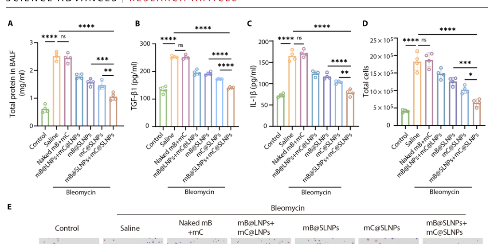

## Question

# Gene Research for Functional Annotation

## ⚠️ CRITICAL: Gene/Protein Identification Context

**BEFORE YOU BEGIN RESEARCH:** You MUST verify you are researching the CORRECT gene/protein. Gene symbols can be ambiguous, especially for less well-characterized genes from non-model organisms.

### Target Gene/Protein Identity (from UniProt):
- **UniProt Accession:** P20070
- **Protein Description:** RecName: Full=NADH-cytochrome b5 reductase 3 {ECO:0000305}; Short=B5R; Short=Cytochrome b5 reductase; EC=1.6.2.2 {ECO:0000269|PubMed:11695905, ECO:0000269|PubMed:8812833, ECO:0000269|PubMed:8978818}; AltName: Full=Diaphorase-1 {ECO:0000250|UniProtKB:P00387};
- **Gene Information:** Name=Cyb5r3 {ECO:0000312|RGD:2502}; Synonyms=Dia1;
- **Organism (full):** Rattus norvegicus (Rat).
- **Protein Family:** Belongs to the flavoprotein pyridine nucleotide cytochrome
- **Key Domains:** CBR-like. (IPR001834); Cbr1-like_FAD-bd_dom. (IPR008333); FAD-bd_FR_type. (IPR017927); Flavoprot_Pyr_Nucl_cyt_Rdtase. (IPR001709); FNR_nucleotide-bd. (IPR039261)

### MANDATORY VERIFICATION STEPS:

1. **Check if the gene symbol "Cyb5r3" matches the protein description above**
2. **Verify the organism is correct:** Rattus norvegicus (Rat).
3. **Check if protein family/domains align with what you find in literature**
4. **If you find literature for a DIFFERENT gene with the same or similar symbol, STOP**

### If Gene Symbol is Ambiguous or You Cannot Find Relevant Literature:

**DO NOT PROCEED WITH RESEARCH ON A DIFFERENT GENE.** Instead:
- State clearly: "The gene symbol 'Cyb5r3' is ambiguous or literature is limited for this specific protein"
- Explain what you found (e.g., "Found extensive literature on a different gene with the same symbol in a different organism")
- Describe the protein based ONLY on the UniProt information provided above
- Suggest that the protein function can be inferred from domain/family information

### Research Target:

Please provide a comprehensive research report on the gene **Cyb5r3** (gene ID: Cyb5r3, UniProt: P20070) in rat.

The research report should be a detailed narrative explaining the function, biological processes, and localization of the gene product. Citations should be given for all claims.

You should prioritize authoritative reviews and primary scientific literature when conducting research. You can supplement
this with annotations you find in gene/protein databases, but these can be outdated or inaccurate.

We are specifically interested in the primary function of the gene - for enzymes, what reaction is catalyzed, and what is the substrate specificity? For transporters, what is the substrate? For structural proteins or adapters, what is the broader structural role? For signaling molecules, what is the role in the pathway.

We are interested in where in or outside the cell the gene product carries out its function.

We are also interested in the signaling or biochemical pathways in which the gene functions. We are less interested in broad pleiotropic effects, except where these elucidate the precise role.

Include evidence where possible. We are interested in both experimental evidence as well as inference from structure, evolution, or bioinformatic analysis. Precise studies should be prioritized over high-throughput, where available.

## Output

Question: You are an expert researcher providing comprehensive, well-cited information.

Provide detailed information focusing on:
1. Key concepts and definitions with current understanding
2. Recent developments and latest research (prioritize 2023-2024 sources)
3. Current applications and real-world implementations
4. Expert opinions and analysis from authoritative sources
5. Relevant statistics and data from recent studies

Format as a comprehensive research report with proper citations. Include URLs and publication dates where available.
Always prioritize recent, authoritative sources and provide specific citations for all major claims.

# Gene Research for Functional Annotation

## ⚠️ CRITICAL: Gene/Protein Identification Context

**BEFORE YOU BEGIN RESEARCH:** You MUST verify you are researching the CORRECT gene/protein. Gene symbols can be ambiguous, especially for less well-characterized genes from non-model organisms.

### Target Gene/Protein Identity (from UniProt):
- **UniProt Accession:** P20070
- **Protein Description:** RecName: Full=NADH-cytochrome b5 reductase 3 {ECO:0000305}; Short=B5R; Short=Cytochrome b5 reductase; EC=1.6.2.2 {ECO:0000269|PubMed:11695905, ECO:0000269|PubMed:8812833, ECO:0000269|PubMed:8978818}; AltName: Full=Diaphorase-1 {ECO:0000250|UniProtKB:P00387};
- **Gene Information:** Name=Cyb5r3 {ECO:0000312|RGD:2502}; Synonyms=Dia1;
- **Organism (full):** Rattus norvegicus (Rat).
- **Protein Family:** Belongs to the flavoprotein pyridine nucleotide cytochrome
- **Key Domains:** CBR-like. (IPR001834); Cbr1-like_FAD-bd_dom. (IPR008333); FAD-bd_FR_type. (IPR017927); Flavoprot_Pyr_Nucl_cyt_Rdtase. (IPR001709); FNR_nucleotide-bd. (IPR039261)

### MANDATORY VERIFICATION STEPS:

1. **Check if the gene symbol "Cyb5r3" matches the protein description above**
2. **Verify the organism is correct:** Rattus norvegicus (Rat).
3. **Check if protein family/domains align with what you find in literature**
4. **If you find literature for a DIFFERENT gene with the same or similar symbol, STOP**

### If Gene Symbol is Ambiguous or You Cannot Find Relevant Literature:

**DO NOT PROCEED WITH RESEARCH ON A DIFFERENT GENE.** Instead:
- State clearly: "The gene symbol 'Cyb5r3' is ambiguous or literature is limited for this specific protein"
- Explain what you found (e.g., "Found extensive literature on a different gene with the same symbol in a different organism")
- Describe the protein based ONLY on the UniProt information provided above
- Suggest that the protein function can be inferred from domain/family information

### Research Target:

Please provide a comprehensive research report on the gene **Cyb5r3** (gene ID: Cyb5r3, UniProt: P20070) in rat.

The research report should be a detailed narrative explaining the function, biological processes, and localization of the gene product. Citations should be given for all claims.

You should prioritize authoritative reviews and primary scientific literature when conducting research. You can supplement
this with annotations you find in gene/protein databases, but these can be outdated or inaccurate.

We are specifically interested in the primary function of the gene - for enzymes, what reaction is catalyzed, and what is the substrate specificity? For transporters, what is the substrate? For structural proteins or adapters, what is the broader structural role? For signaling molecules, what is the role in the pathway.

We are interested in where in or outside the cell the gene product carries out its function.

We are also interested in the signaling or biochemical pathways in which the gene functions. We are less interested in broad pleiotropic effects, except where these elucidate the precise role.

Include evidence where possible. We are interested in both experimental evidence as well as inference from structure, evolution, or bioinformatic analysis. Precise studies should be prioritized over high-throughput, where available.

## Research report: Rat **Cyb5r3** (UniProt **P20070**) – functional annotation and current understanding

### 1) Identity verification (critical disambiguation)
The rat gene symbol **Cyb5r3** corresponds to **NADH–cytochrome b5 reductase 3** (EC **1.6.2.2**), historically termed **diaphorase-1 (DIA1)** in the methemoglobin reductase literature. The methemoglobinemia review explicitly states that cytochrome b5 reductase is encoded by **CYB5R3 (previously DIA1)** and is NADH–cytochrome b5 reductase (cb5r; EC 1.6.2.2). Publication date: **May 2008**; URL: https://doi.org/10.1111/j.1365-2141.2008.07017.x (percy2008recessivecongenitalmethaemoglobinaemia pages 1-2).  
Modern mechanistic/functional papers and reviews consistently use **CYB5R3** to denote an **NADH-dependent FAD flavoprotein** with soluble erythrocyte and membrane-bound forms localized to ER/mitochondria/plasma membrane, matching UniProt P20070’s protein description and domain family expectations. Publication date: **Jan 2024**; URL: https://doi.org/10.1038/s12276-024-01155-9 (im2024cyb5r3functionsas pages 1-2).

### 2) Key concepts and definitions (current understanding)

#### 2.1 Enzyme class and canonical biochemical role
**CYB5R3/Cyb5r3** encodes a **flavoprotein oxidoreductase** that uses **NADH** as electron donor to reduce various acceptors. In erythrocytes, its soluble form is the principal enzymatic system responsible for **recycling methemoglobin** (ferric heme) back toward functional heme, hence “methemoglobin reductase.” Publication date: **May 2008**; URL: https://doi.org/10.1111/j.1365-2141.2008.07017.x (percy2008recessivecongenitalmethaemoglobinaemia pages 1-2).  
A recent 2024 study summarizes the core redox chemistry as **electron transfer from NADH to acceptors such as cytochrome b5 or coenzyme Q (CoQ)**, resulting in **NAD+** production. Publication date: **Jan 2024**; URL: https://doi.org/10.1038/s12276-024-01155-9 (im2024cyb5r3functionsas pages 1-2).

#### 2.2 Domain architecture and mechanistic electron transfer (structure → function)
A detailed structural review describes cytochrome b5 reductase (Cb5R/CYB5R3) as ~**300 aa** for the membrane isoform, consisting of a **~275-residue cytosolic catalytic domain** plus an **N-terminal ~24-residue membrane-anchoring tail**. Publication date: **Dec 2021**; URL: https://doi.org/10.3390/ijms23010118 (gutierrezmerino2021structuralfeaturesof pages 2-3).  
The enzyme contains an **FAD-binding domain** (reviewed as approximately residues **33–147**) and motifs/residues that govern FAD/NADH binding and hydride transfer efficiency (e.g., loop 110–125 contacting FAD; conserved motifs contributing to flavin coordination and NADH recognition). Publication date: **Dec 2021**; URL: https://doi.org/10.3390/ijms23010118 (gutierrezmerino2021structuralfeaturesof pages 5-7).  
Mechanistically, CYB5R3 performs **two-electron (hydride) transfer** from NADH to FAD to form a reduced flavin state, but then typically delivers electrons to downstream acceptors via **sequential one-electron steps**, involving **semiquinone** intermediates; the one-electron pathway is central for reduction of partners like cytochrome b5 and quinones. Publication date: **Dec 2021**; URL: https://doi.org/10.3390/ijms23010118 (gutierrezmerino2021structuralfeaturesof pages 1-2, gutierrezmerino2021structuralfeaturesof pages 7-9).  
A key contemporary framing is that CYB5R3 is a prominent **one-electron CoQ reductase**, contrasted with **NQO1**, which reduces CoQ by a **two-electron** mechanism (avoiding semiquinone formation). Publication date: **Dec 2021**; URL: https://doi.org/10.3390/ijms23010118 (gutierrezmerino2021structuralfeaturesof pages 3-5).

#### 2.3 Isoforms and subcellular localization
Multiple sources emphasize two biologically important isoform classes:
- **Soluble erythrocyte isoform** (N-terminally truncated), critical for methemoglobin reduction. (gutierrezmerino2021structuralfeaturesof pages 2-3, percy2008recessivecongenitalmethaemoglobinaemia pages 1-2)
- **Membrane-bound isoform** that localizes to **endoplasmic reticulum (ER)**, **mitochondrial outer membrane (MOM)**, and **plasma membrane**. (gutierrezmerino2021structuralfeaturesof pages 2-3)

Membrane targeting includes regulation by **N-terminal myristoylation**, which influences targeting (e.g., MOM vs ER). Publication date: **Dec 2021**; URL: https://doi.org/10.3390/ijms23010118 (gutierrezmerino2021structuralfeaturesof pages 2-3).  
A 2024 review of “free radical reductases” similarly describes CYB5R3 as **membrane-tethered** on **MOM (cytosolic face), ER, and plasma membrane**, positioning it to reduce ferric heme and oxidized CoQ species. Publication date: **Feb 2024**; URL: https://doi.org/10.1089/ars.2022.0154 (kagan2024vitaminecoenzymeqdependent pages 2-4).

#### 2.4 Substrate / acceptor spectrum (functional specificity)
Across the mechanistic and disease-model literature in this evidence set, CYB5R3 is supported to donate electrons to:
- **Cytochrome b5** (canonical partner) (gutierrezmerino2021structuralfeaturesof pages 1-2, im2024cyb5r3functionsas pages 1-2)
- **Coenzyme Q (ubiquinone; CoQ)** (one-electron reduction to semiquinone/ubiquinol pool) (gutierrezmerino2021structuralfeaturesof pages 3-5, kagan2024vitaminecoenzymeqdependent pages 2-4)
- **Ferric heme substrates** (methemoglobin; and in some contexts heme-dependent sensors such as sGC) (percy2008recessivecongenitalmethaemoglobinaemia pages 1-2, bueno2023cyb5r3intype pages 1-2)
- **Ascorbate radical** (reported as NADH:ascorbate radical reductase activity in Cb5R literature) (gutierrezmerino2021structuralfeaturesof pages 5-7)

A notable system-level implication is that one-electron CoQ chemistry can be **protective** (antioxidant recycling) or can contribute to **ROS** via semiquinone reaction with O2 when coupling is inefficient. (gutierrezmerino2021structuralfeaturesof pages 3-5, gutierrezmerino2021structuralfeaturesof pages 5-7).

### 3) Biological processes and pathways (with emphasis on “primary function”)

#### 3.1 ER redox metabolism and lipid/drug metabolism coupling
At the **ER**, membrane-bound Cb5R/CYB5R3 transfers electrons to pathways including **fatty-acid desaturation/elongation** and works in detoxification alongside **cytochrome b5 and cytochrome P450** systems. Publication date: **Dec 2021**; URL: https://doi.org/10.3390/ijms23010118 (gutierrezmerino2021structuralfeaturesof pages 2-3).  
A 2024 cancer-focused study reiterates participation of membrane CYB5R3 in lipid/cholesterol metabolism and drug metabolism, while emphasizing its broad metabolic involvement. Publication date: **Jan 2024**; URL: https://doi.org/10.1038/s12276-024-01155-9 (im2024cyb5r3functionsas pages 1-2).

#### 3.2 CoQ/vitamin E antioxidant recycling and ferroptosis-relevant redox control (expert synthesis)
A 2024 expert review proposes that membrane oxidoreductases, including **CYB5R3**, form a network of **“free radical reductases”** that maintain **reduced CoQ** pools; reduced CoQ can regenerate **tocopherol (vitamin E)** by reducing tocopheroxyl radicals, thereby suppressing lipid peroxidation—an organizing concept relevant to ferroptosis sensitivity. Publication date: **Feb 2024**; URL: https://doi.org/10.1089/ars.2022.0154 (kagan2024vitaminecoenzymeqdependent pages 2-4, kagan2024vitaminecoenzymeqdependent pages 1-2).  
Mechanistically, CYB5R3 is described as an NADH-dependent, membrane-anchored enzyme capable of one-electron transfer to oxidized CoQ species (including semiquinone radicals) and ferric heme, supporting antioxidant recycling in the appropriate membrane compartments. Publication date: **Feb 2024**; URL: https://doi.org/10.1089/ars.2022.0154 (kagan2024vitaminecoenzymeqdependent pages 2-4).

#### 3.3 Nitric oxide sensing: sGC heme redox and downstream cGMP signaling
A central recent theme is CYB5R3 as a **heme redox regulator** for **soluble guanylate cyclase (sGC)**, the NO receptor. In a 2023 pulmonary fibrosis model, CYB5R3 is described as maintaining **sGC heme iron redox state**, enabling NO responsiveness and downstream **cGMP/PKG** signaling. Publication date: **Mar 2023**; URL: https://doi.org/10.1172/jci.insight.161487 (bueno2023cyb5r3intype pages 1-2).  
Mechanistically, loss of CYB5R3 increases reliance on **sGC activators** (which act on oxidized or heme-free sGC), consistent with CYB5R3 protecting against sGC oxidation and preserving NO-stimulated cGMP signaling. (bueno2023cyb5r3intype pages 11-12).  
The same study links sGC/cGMP signaling to **suppression of profibrotic TGF-β1 signaling**: CYB5R3 deficiency prolonged **Smad2/3 phosphorylation** kinetics and blunted ERK1/2 phosphorylation in epithelial cells; these pathway changes could be ameliorated by cGMP analogs or sGC modulators. Publication date: **Mar 2023**; URL: https://doi.org/10.1172/jci.insight.161487 (bueno2023cyb5r3intype pages 9-11).

### 4) Rat-specific evidence (Rattus norvegicus) within accessible literature
While many mechanistic and translational studies in 2023–2024 are mouse/human-focused, rat-specific evidence exists in the mechanistic literature summarized by the 2021 structural review:
- Evidence for **rat erythrocyte** cytochrome b5 reductase function and mechanistic residue mapping (supporting conserved FAD/NADH-binding architecture). (gutierrezmerino2021structuralfeaturesof pages 5-7)
- Evidence for **rat brain synaptosome/plasma membrane vesicle** electron transport activities involving Cb5R, consistent with plasma membrane localization and roles in membrane redox. (gutierrezmerino2021structuralfeaturesof pages 3-5, gutierrezmerino2021structuralfeaturesof pages 13-14)

Additionally, vascular literature indicates CytB5R3 participates in heme redox control affecting NO diffusion; the review describes that pharmacologic inhibition (e.g., PTU) altered NO diffusion and **reduced blood pressure in rats**, linking CYB5R3 activity to vascular tone regulation in vivo. Publication date: **Aug 2014**; URL: https://doi.org/10.1016/j.freeradbiomed.2014.04.019 (butcher2014hemoglobinαin pages 4-4).

### 5) Recent developments (2023–2024) prioritized

#### 5.1 2023: CYB5R3 protects against lung fibrosis by suppressing TGF-β1 signaling
In a 2023 **JCI Insight** study (mouse model; AECII-specific manipulation), CYB5R3 deficiency increased fibrosis susceptibility and altered epithelial signaling: canonical **Smad2/3 phosphorylation** was prolonged, and noncanonical **ERK1/2 phosphorylation** was essentially absent in CYB5R3-depleted cells. Publication date: **Mar 2023**; URL: https://doi.org/10.1172/jci.insight.161487 (bueno2023cyb5r3intype pages 9-11).  
Quantitative outcomes include a bleomycin cohort where survival was **reduced to 50% by day 15** with **median survival of 13 days** (n = 23–24). Publication date: **Mar 2023**; URL: https://doi.org/10.1172/jci.insight.161487 (bueno2023cyb5r3intype pages 3-5).  
Importantly, rescue was achieved by **sGC agonists** and cGMP pathway interventions, indicating a specific, actionable biochemical link between CYB5R3 → sGC redox → cGMP/PKG → ERK/TGF-β signaling. (bueno2023cyb5r3intype pages 11-12, bueno2023cyb5r3intype pages 9-11).

#### 5.2 2024: CYB5R3 as a CoQ/vitamin E “free radical reductase” relevant to ferroptosis
A 2024 **Antioxidants & Redox Signaling** review integrates historical and contemporary evidence to argue that CYB5R3’s membrane positioning and NADH-dependent one-electron chemistry make it a candidate **CoQ/semiquinone reductase** supporting **vitamin E recycling**, thereby shaping lipid peroxidation control networks relevant to ferroptosis. Publication date: **Feb 2024**; URL: https://doi.org/10.1089/ars.2022.0154 (kagan2024vitaminecoenzymeqdependent pages 2-4, kagan2024vitaminecoenzymeqdependent pages 1-2).  
This places CYB5R3 in a mechanistic framework alongside other antioxidant “recharging stations” that maintain lipid-soluble antioxidant systems. (kagan2024vitaminecoenzymeqdependent pages 8-9).

#### 5.3 2024: ER-localized CYB5R3 and ER-stress apoptosis programs in cancer models
A 2024 **Experimental & Molecular Medicine** study reports that ectopic CYB5R3 is mainly localized to the **ER** and can activate ER stress pathways (**PERK–ATF4** and **IRE1α–JNK**), with associated changes such as increased **NAD+** and oxidized glutathione (**GSSG**) and induction of ROS and caspase-9-dependent apoptosis. Publication date: **Jan 2024**; URL: https://doi.org/10.1038/s12276-024-01155-9 (im2024cyb5r3functionsas pages 1-2).  
While not rat-specific, this study is informative for functional annotation because it reiterates enzyme chemistry, isoforms, and ER localization in a defined experimental setting. (im2024cyb5r3functionsas pages 1-2).

#### 5.4 2024: Aging kidney mitochondria—CYB5R3 overexpression and nicotinamide riboside
A 2024 **Aging Cell** study used CYB5R3 overexpression (transgenic mice) and dietary nicotinamide riboside to probe distal convoluted tubule mitochondrial ultrastructure; combined intervention mitigated age-related mitochondrial changes with sex dependence. Publication date: **Jul 2024**; URL: https://doi.org/10.1111/acel.14273 (perez‐rodriguez2024cytochromeb5 pages 1-2).

### 6) Current applications and real-world implementations

#### 6.1 Preclinical therapeutic delivery: inhalable CYB5R3 mRNA-LNPs for pulmonary fibrosis (2024)
A 2024 **Science Advances** study implemented an inhalable mucus-penetrating lipid nanoparticle platform delivering **CYB5R3 mRNA** plus **BMP4 mRNA** to treat bleomycin-induced fibrosis in mice. Publication date: **Jun 2024**; URL: https://doi.org/10.1126/sciadv.ado4791 (wang2024realveolarizationwithinhalable pages 1-2).  
Formulation statistics: nebulized particles remained ~**80.60 ± 18.41 nm** before and **96.08 ± 19.15 nm** after nebulization and were stable at 4°C for 8 days. (wang2024realveolarizationwithinhalable pages 1-2).  
Efficacy is supported by biomarker and histology quantification shown in figure panels: dual BMP4+CYB5R3 therapy reduced BALF **total protein**, **TGF-β1**, **IL-1β**, and inflammatory cell composition, and reduced fibrosis outcomes (e.g., Ashcroft score/collagen fraction and fibrosis marker staining), consistent with anti-inflammatory and anti-fibrotic benefit. (wang2024realveolarizationwithinhalable media 0fd6aa95, wang2024realveolarizationwithinhalable media 3cbf3b10, wang2024realveolarizationwithinhalable media 7d188961, wang2024realveolarizationwithinhalable media 051ee6e6).

#### 6.2 Pharmacologic pathway targeting: sGC modulators in CYB5R3-deficient fibrotic stress (2023)
In the AECII CYB5R3-deficiency context, **sGC agonists** reduced pulmonary fibrotic outcomes and decreased mortality in vivo, consistent with a therapeutic strategy that bypasses the heme redox limitation introduced by CYB5R3 loss. Publication date: **Mar 2023**; URL: https://doi.org/10.1172/jci.insight.161487 (bueno2023cyb5r3intype pages 11-12, bueno2023cyb5r3intype pages 3-5).

#### 6.3 Gene delivery/overexpression implementations (2024)
- **Adenoviral CYB5R3** overexpression in lung cancer models: infection MOI **100** in vitro; intratumoral dosing **1 × 10^9 pfu per mouse** every 3 days for three treatments in xenografts. Publication date: **Jan 2024**; URL: https://doi.org/10.1038/s12276-024-01155-9 (im2024cyb5r3functionsas pages 2-2).
- **Transgenic overexpression** in aging kidney mitochondrial studies. Publication date: **Jul 2024**; URL: https://doi.org/10.1111/acel.14273 (perez‐rodriguez2024cytochromeb5 pages 1-2).

#### 6.4 Clinical genetics and diagnostics (foundational, still current)
The clinically established application is diagnosing **recessive congenital methemoglobinemia** due to CYB5R3 deficiency. The disease is classically divided into **type I** (erythrocyte-limited deficiency) versus **type II** (generalized deficiency, often with neurologic impairment). Publication date: **May 2008**; URL: https://doi.org/10.1111/j.1365-2141.2008.07017.x (percy2008recessivecongenitalmethaemoglobinaemia pages 1-2).

### 7) Expert opinion and authoritative synthesis (interpretive analysis grounded in sources)

1. **CYB5R3 is best annotated as a membrane redox “hub” enzyme**: Its conserved FAD/NADH-binding architecture supports broad acceptor usage, with compartment-specific roles determined by its N-terminal targeting (ER/MOM/plasma membrane) and access to partners (cytochrome b5, CoQ pools, heme proteins). This is a consistent message across structural and systems-level reviews and is supported mechanistically by defined domain/motif architecture and known one-electron acceptor chemistry. (gutierrezmerino2021structuralfeaturesof pages 2-3, gutierrezmerino2021structuralfeaturesof pages 5-7, kagan2024vitaminecoenzymeqdependent pages 2-4).

2. **A unifying modern theme is redox-state control of signaling receptors** (e.g., sGC heme), connecting classic enzymology to disease pathways (fibrosis, vascular tone). The 2023 AECII study provides a strong pathway-level chain: CYB5R3 → sGC heme redox → cGMP/PKG → ERK/TGF-β1 signaling → fibrosis susceptibility, with pharmacologic rescue. (bueno2023cyb5r3intype pages 1-2, bueno2023cyb5r3intype pages 9-11, bueno2023cyb5r3intype pages 11-12).

3. **One-electron quinone chemistry is mechanistically double-edged**, providing antioxidant recycling capacity but with potential ROS generation via semiquinone/O2 reactions when coupling fails. This nuance is emphasized by the structural review and is important for functional annotation: CYB5R3 can both mitigate and generate ROS depending on partner availability and microenvironment. (gutierrezmerino2021structuralfeaturesof pages 3-5, gutierrezmerino2021structuralfeaturesof pages 5-7).

### 8) Recent statistics and quantitative data (examples from accessible studies)
- **Bleomycin fibrosis survival** in CYB5R3-deficiency context: survival reduced to **50% by day 15**, **median survival 13 days** (n = 23–24). Publication date: **Mar 2023**; URL: https://doi.org/10.1172/jci.insight.161487 (bueno2023cyb5r3intype pages 3-5).  
- **mRNA-LNP physicochemical stability**: particle size **80.60 ± 18.41 nm** pre-nebulization vs **96.08 ± 19.15 nm** post-nebulization; stability at 4°C for 8 days. Publication date: **Jun 2024**; URL: https://doi.org/10.1126/sciadv.ado4791 (wang2024realveolarizationwithinhalable pages 1-2).  
- **Figure-based quantifications**: dual CYB5R3+BMP4 mRNA treatment reduces BALF total protein, TGF-β1, IL-1β and inflammatory cells; and reduces multiple fibrosis markers (Ashcroft score, collagen fraction, collagen I, α-SMA) as shown in the paper’s figure panels. Publication date: **Jun 2024**; URL: https://doi.org/10.1126/sciadv.ado4791 (wang2024realveolarizationwithinhalable media 0fd6aa95, wang2024realveolarizationwithinhalable media 3cbf3b10, wang2024realveolarizationwithinhalable media 7d188961, wang2024realveolarizationwithinhalable media 051ee6e6).

### 9) Consolidated functional-annotation table
The following table summarizes substrates, reactions, localization, pathways, and recent applications relevant to rat **Cyb5r3 (UniProt P20070)**, clearly distinguishing direct rat evidence from broader mammalian evidence.

| Topic | Key points | Species/context (rat vs mouse vs human; in vitro/in vivo) | Representative recent sources (2023-2024 prioritized) with year and URL | Evidence IDs for citations |
|---|---|---|---|---|
| Enzyme function | Cyb5r3 encodes NADH-cytochrome b5 reductase 3, an FAD-dependent oxidoreductase also known historically as diaphorase-1/DIA1; it transfers electrons from NADH to membrane or heme acceptors and is the canonical erythrocyte methemoglobin-reducing system. This matches UniProt P20070 annotation for rat. | Rat protein identity supported by mammalian literature; foundational biochemical/clinical evidence largely human and comparative mammalian, with rat enzyme/mechanistic studies in classic biochemistry. | Im et al., 2024, Exp Mol Med, https://doi.org/10.1038/s12276-024-01155-9; Percy & Lappin, 2008, Br J Haematol, https://doi.org/10.1111/j.1365-2141.2008.07017.x | (im2024cyb5r3functionsas pages 1-2, percy2008recessivecongenitalmethaemoglobinaemia pages 1-2) |
| Substrates / electron acceptors | Primary donor is NADH. Acceptors include cytochrome b5, ferric heme/methemoglobin, soluble guanylate cyclase heme, and coenzyme Q/ubiquinone; ascorbate radical reduction activity is also reported in Cb5R literature. | Rat-specific support exists for Cb5R structural/enzymatic studies and plasma membrane activities; mammalian cell studies support CoQ and sGC/heme biology. | Kagan et al., 2024, Antioxid Redox Signal, https://doi.org/10.1089/ars.2022.0154; Bueno et al., 2023, JCI Insight, https://doi.org/10.1172/jci.insight.161487; Gutiérrez-Merino et al., 2021, Int J Mol Sci, https://doi.org/10.3390/ijms23010118 | (kagan2024vitaminecoenzymeqdependent pages 2-4, bueno2023cyb5r3intype pages 1-2, gutierrezmerino2021structuralfeaturesof pages 5-7, gutierrezmerino2021structuralfeaturesof pages 2-3) |
| Reaction | Canonical chemistry is one-electron transfer from NADH via bound FAD to electron acceptors such as cytochrome b5 or CoQ, producing NAD+. In erythrocytes this supports reduction of methemoglobin back toward functional ferrous heme; in membranes, one-electron CoQ reduction can generate semiquinone intermediates with antioxidant or ROS-related consequences depending on context. | Mechanistic evidence from mammalian enzymology and structural review; cancer-cell study explicitly states NADH → cytochrome b5/CoQ with NAD+ production. | Im et al., 2024, https://doi.org/10.1038/s12276-024-01155-9; Kagan et al., 2024, https://doi.org/10.1089/ars.2022.0154; Gutiérrez-Merino et al., 2021, https://doi.org/10.3390/ijms23010118 | (im2024cyb5r3functionsas pages 1-2, kagan2024vitaminecoenzymeqdependent pages 2-4, gutierrezmerino2021structuralfeaturesof pages 3-5) |
| Isoforms | Two functionally important isoform classes are emphasized: a soluble N-terminally truncated erythrocyte isoform and a membrane-bound isoform bearing an N-terminal membrane anchor/myristoylation-dependent targeting determinant. | Mammalian consensus; relevant to rat annotation because UniProt P20070 belongs to same conserved enzyme family and rat studies are included in structural review. | Im et al., 2024, https://doi.org/10.1038/s12276-024-01155-9; Gutiérrez-Merino et al., 2021, https://doi.org/10.3390/ijms23010118 | (im2024cyb5r3functionsas pages 1-2, gutierrezmerino2021structuralfeaturesof pages 2-3, kagan2024vitaminecoenzymeqdependent pages 8-9) |
| Localization | Membrane-bound CYB5R3 localizes to ER, mitochondrial outer membrane, and plasma membrane; soluble form is abundant in erythrocytes. Rat-specific literature cited in reviews supports plasma membrane/synaptosomal and erythrocyte-associated Cb5R activities. | Rat: brain synaptosome/plasma membrane and erythrocyte evidence. Mouse/human: ER- and mitochondrial/plasma-membrane-localized CYB5R3 in disease models and cultured cells. | Bueno et al., 2023, https://doi.org/10.1172/jci.insight.161487; Im et al., 2024, https://doi.org/10.1038/s12276-024-01155-9; Gutiérrez-Merino et al., 2021, https://doi.org/10.3390/ijms23010118 | (bueno2023cyb5r3intype pages 1-2, im2024cyb5r3functionsas pages 1-2, gutierrezmerino2021structuralfeaturesof pages 13-14, gutierrezmerino2021structuralfeaturesof pages 2-3) |
| Core biochemical pathways | CYB5R3 supports fatty acid elongation/desaturation, cholesterol biosynthesis, drug/xenobiotic metabolism with cytochrome b5/P450 systems, CoQ redox cycling, antioxidant recycling, and regulation of membrane redox balance. It can also influence ROS generation when electrons are uncoupled from physiological acceptors. | Broad mammalian evidence, with rat biochemical studies contributing to structural and plasma membrane redox understanding. | Im et al., 2024, https://doi.org/10.1038/s12276-024-01155-9; Gutiérrez-Merino et al., 2021, https://doi.org/10.3390/ijms23010118; Kagan et al., 2024, https://doi.org/10.1089/ars.2022.0154 | (im2024cyb5r3functionsas pages 1-2, gutierrezmerino2021structuralfeaturesof pages 3-5, gutierrezmerino2021structuralfeaturesof pages 2-3, kagan2024vitaminecoenzymeqdependent pages 11-12) |
| NO / sGC signaling | CYB5R3 maintains soluble guanylate cyclase heme in the reduced NO-responsive ferrous state, thereby sustaining NO-stimulated cGMP/PKG signaling. Loss of CYB5R3 shifts dependence toward sGC activators that work on oxidized/heme-free sGC and amplifies profibrotic TGF-β signaling. | Strong mouse in vivo and cell-culture evidence in alveolar epithelial cells; vascular/endothelial literature supports analogous heme-redox control. | Bueno et al., 2023, https://doi.org/10.1172/jci.insight.161487; Mazuryk et al., 2024, Antioxidants, https://doi.org/10.3390/antiox13101213 | (bueno2023cyb5r3intype pages 1-2, bueno2023cyb5r3intype pages 9-11, bueno2023cyb5r3intype pages 11-12, butcher2014hemoglobinαin pages 4-4) |
| CoQ / vitamin E / ferroptosis-related redox biology | CYB5R3 is positioned as a membrane “free radical reductase” that reduces CoQ and helps maintain antioxidant competence of CoQ/vitamin E systems, thereby limiting lipid peroxidation. Its one-electron chemistry can create semiquinone intermediates, so outcome depends on compartment and coupling efficiency. | Review-level evidence across mammalian systems; relevant but less directly resolved than sGC/methemoglobin biology. | Kagan et al., 2024, https://doi.org/10.1089/ars.2022.0154; Gutiérrez-Merino et al., 2021, https://doi.org/10.3390/ijms23010118 | (kagan2024vitaminecoenzymeqdependent pages 2-4, gutierrezmerino2021structuralfeaturesof pages 3-5, kagan2024vitaminecoenzymeqdependent pages 4-5, kagan2024vitaminecoenzymeqdependent pages 9-11, kagan2024vitaminecoenzymeqdependent pages 1-2, gutierrezmerino2021structuralfeaturesof pages 2-3) |
| Rat-specific functional annotation support | Rat evidence in the reviewed literature includes erythrocyte NADH-cytochrome b5 reductase studies, FAD/NADH-binding and catalytic-residue analyses, and plasma membrane/synaptosomal redox activities. These support localization to erythrocytes and neuronal plasma membranes and confirm conserved catalytic architecture/domains expected for UniProt P20070. | Rat biochemical and membrane studies; mostly mechanistic rather than modern genetics. | Gutiérrez-Merino et al., 2021, https://doi.org/10.3390/ijms23010118 | (gutierrezmerino2021structuralfeaturesof pages 13-14, gutierrezmerino2021structuralfeaturesof pages 3-5, gutierrezmerino2021structuralfeaturesof pages 5-7) |
| Phenotypes / disease links | Loss-of-function in CYB5R3 causes recessive congenital methemoglobinemia: type I is erythrocyte-restricted; type II is generalized and neurologically severe. Beyond blood disease, reduced CYB5R3 is linked to fibrotic susceptibility, altered redox homeostasis, and context-dependent cancer phenotypes. | Human clinical genetics for methemoglobinemia; mouse disease models for fibrosis/tumor biology. | Percy & Lappin, 2008, https://doi.org/10.1111/j.1365-2141.2008.07017.x; Bueno et al., 2023, https://doi.org/10.1172/jci.insight.161487; Im et al., 2024, https://doi.org/10.1038/s12276-024-01155-9 | (percy2008recessivecongenitalmethaemoglobinaemia pages 1-2, bueno2023cyb5r3intype pages 3-5, im2024cyb5r3functionsas pages 1-2) |
| 2023-2024 development: lung fibrosis | In AECII-specific Cyb5r3-deficient mice, fibrotic responses are enhanced; bleomycin reduced survival to 50% by day 15 with median survival 13 days in one cohort, and pharmacologic sGC pathway rescue ameliorated fibrosis and mortality. CYB5R3 loss prolonged Smad2/3 phosphorylation and blunted ERK1/2 responses. | Mouse in vivo and epithelial cell studies. | Bueno et al., 2023, https://doi.org/10.1172/jci.insight.161487 | (bueno2023cyb5r3intype pages 3-5, bueno2023cyb5r3intype pages 9-11, bueno2023cyb5r3intype pages 11-12) |
| 2024 application: inhalable mRNA therapy | A Science Advances study used inhalable mucus-penetrating lipid nanoparticles delivering CYB5R3 mRNA with BMP4 mRNA to fibrotic mouse lungs. Nebulized particles remained ~80.60 ± 18.41 nm before and 96.08 ± 19.15 nm after nebulization; dual therapy reduced BALF total protein, TGF-β1, IL-1β, inflammatory cells, Ashcroft score, collagen fraction, Collagen I, and α-SMA, and prolonged survival versus controls/single agents. | Mouse preclinical therapeutic implementation; direct translational relevance. | Wang et al., 2024, Sci Adv, https://doi.org/10.1126/sciadv.ado4791 | (wang2024realveolarizationwithinhalable pages 1-2, wang2024realveolarizationwithinhalable pages 8-11, wang2024realveolarizationwithinhalable media 0fd6aa95) |
| 2024 application: transgenic overexpression / aging | CYB5R3 overexpression in transgenic mice, alone or with nicotinamide riboside supplementation, altered distal convoluted tubule mitochondrial morphology and mitigated age-related mitochondrial changes in a sex-dependent manner. | Mouse aging model, in vivo ultrastructural analysis. | Pérez-Rodríguez et al., 2024, Aging Cell, https://doi.org/10.1111/acel.14273 | (perez‐rodriguez2024cytochromeb5 pages 1-2) |
| 2024 application: cancer gene delivery | Adenoviral CYB5R3 overexpression suppressed lung cancer growth in vitro and in vivo; cells were infected at MOI 100 and xenografts treated intratumorally with 1 × 10^9 pfu per mouse every 3 days for three doses. Mechanistically linked to ER localization, increased NAD+ and GSSG, PARP16 activation, PERK/IRE1α signaling, ROS, and caspase-9 apoptosis. | Human lung cancer cells and mouse xenografts. | Im et al., 2024, https://doi.org/10.1038/s12276-024-01155-9 | (im2024cyb5r3functionsas pages 2-2, im2024cyb5r3functionsas pages 1-2) |

*Table: This table summarizes the functional annotation of rat Cyb5r3 (UniProt P20070) and the closest supported mammalian CYB5R3 evidence. It highlights enzyme function, substrates, localization, pathways, disease links, and recent translational applications with traceable evidence IDs.*

### Notes on scope and evidence limits
- Direct **rat** genetic/physiology studies of Cyb5r3 in 2023–2024 were not present in the accessible corpus; therefore, recent mechanistic and translational updates are primarily drawn from **mouse/human** systems, while rat support is strongest for biochemical/membrane evidence (erythrocyte and synaptosomal/plasma membrane contexts) and vascular pharmacology discussion. (gutierrezmerino2021structuralfeaturesof pages 13-14, gutierrezmerino2021structuralfeaturesof pages 3-5, gutierrezmerino2021structuralfeaturesof pages 5-7, butcher2014hemoglobinαin pages 4-4).

References

1. (percy2008recessivecongenitalmethaemoglobinaemia pages 1-2): Melanie J. Percy and Terry R. Lappin. Recessive congenital methaemoglobinaemia: cytochrome b5 reductase deficiency. British Journal of Haematology, 141:298-308, May 2008. URL: https://doi.org/10.1111/j.1365-2141.2008.07017.x, doi:10.1111/j.1365-2141.2008.07017.x. This article has 212 citations and is from a domain leading peer-reviewed journal.

2. (im2024cyb5r3functionsas pages 1-2): Joo-Young Im, Soo Jin Kim, Jong-Lyul Park, Tae-Hee Han, Woo-il Kim, Inhyub Kim, Bomin Ko, So-Young Chun, Mi-Jung Kang, Bo-Kyung Kim, Sol A. Jeon, Seon-Kyu Kim, Incheol Ryu, Seon-Young Kim, Ki-Hoan Nam, Inah Hwang, Hyun Seung Ban, and Misun Won. Cyb5r3 functions as a tumor suppressor by inducing er stress-mediated apoptosis in lung cancer cells via the perk-atf4 and ire1α-jnk pathways. Experimental &amp; Molecular Medicine, 56:235-249, Jan 2024. URL: https://doi.org/10.1038/s12276-024-01155-9, doi:10.1038/s12276-024-01155-9. This article has 26 citations and is from a peer-reviewed journal.

3. (gutierrezmerino2021structuralfeaturesof pages 2-3): Carlos Gutiérrez-Merino, Oscar H. Martínez-Costa, Maria Monsalve, and Alejandro K. Samhan-Arias. Structural features of cytochrome b5–cytochrome b5 reductase complex formation and implications for the intramolecular dynamics of cytochrome b5 reductase. International Journal of Molecular Sciences, 23:118, Dec 2021. URL: https://doi.org/10.3390/ijms23010118, doi:10.3390/ijms23010118. This article has 15 citations.

4. (gutierrezmerino2021structuralfeaturesof pages 5-7): Carlos Gutiérrez-Merino, Oscar H. Martínez-Costa, Maria Monsalve, and Alejandro K. Samhan-Arias. Structural features of cytochrome b5–cytochrome b5 reductase complex formation and implications for the intramolecular dynamics of cytochrome b5 reductase. International Journal of Molecular Sciences, 23:118, Dec 2021. URL: https://doi.org/10.3390/ijms23010118, doi:10.3390/ijms23010118. This article has 15 citations.

5. (gutierrezmerino2021structuralfeaturesof pages 1-2): Carlos Gutiérrez-Merino, Oscar H. Martínez-Costa, Maria Monsalve, and Alejandro K. Samhan-Arias. Structural features of cytochrome b5–cytochrome b5 reductase complex formation and implications for the intramolecular dynamics of cytochrome b5 reductase. International Journal of Molecular Sciences, 23:118, Dec 2021. URL: https://doi.org/10.3390/ijms23010118, doi:10.3390/ijms23010118. This article has 15 citations.

6. (gutierrezmerino2021structuralfeaturesof pages 7-9): Carlos Gutiérrez-Merino, Oscar H. Martínez-Costa, Maria Monsalve, and Alejandro K. Samhan-Arias. Structural features of cytochrome b5–cytochrome b5 reductase complex formation and implications for the intramolecular dynamics of cytochrome b5 reductase. International Journal of Molecular Sciences, 23:118, Dec 2021. URL: https://doi.org/10.3390/ijms23010118, doi:10.3390/ijms23010118. This article has 15 citations.

7. (gutierrezmerino2021structuralfeaturesof pages 3-5): Carlos Gutiérrez-Merino, Oscar H. Martínez-Costa, Maria Monsalve, and Alejandro K. Samhan-Arias. Structural features of cytochrome b5–cytochrome b5 reductase complex formation and implications for the intramolecular dynamics of cytochrome b5 reductase. International Journal of Molecular Sciences, 23:118, Dec 2021. URL: https://doi.org/10.3390/ijms23010118, doi:10.3390/ijms23010118. This article has 15 citations.

8. (kagan2024vitaminecoenzymeqdependent pages 2-4): Valerian E. Kagan, Adam C. Straub, Yulia Y. Tyurina, Alexandr A. Kapralov, Robert Hall, Sally E. Wenzel, Rama K. Mallampalli, and Hülya Bayir. Vitamin e/coenzyme q-dependent “free radical reductases”: redox regulators in ferroptosis. Antioxidants &amp; Redox Signaling, 40:317-328, Feb 2024. URL: https://doi.org/10.1089/ars.2022.0154, doi:10.1089/ars.2022.0154. This article has 29 citations and is from a domain leading peer-reviewed journal.

9. (bueno2023cyb5r3intype pages 1-2): Marta Bueno, Jazmin Calyeca, Timur Khaliullin, Megan P. Miller, Diana Alvarez, Lorena Rosas, Judith Brands, Christian Baker, Amro Nasser, Stephanie Shulkowski, August Mathien, Nneoma Uzoukwu, John Sembrat, Brenton G. Mays, Kaitlin Fiedler, Scott A. Hahn, Sonia R. Salvatore, Francisco J. Schopfer, Mauricio Rojas, Peter Sandner, Adam C. Straub, and Ana L. Mora. Cyb5r3 in type ii alveolar epithelial cells protects against lung fibrosis by suppressing tgf-β1 signaling. JCI Insight, Mar 2023. URL: https://doi.org/10.1172/jci.insight.161487, doi:10.1172/jci.insight.161487. This article has 14 citations and is from a domain leading peer-reviewed journal.

10. (kagan2024vitaminecoenzymeqdependent pages 1-2): Valerian E. Kagan, Adam C. Straub, Yulia Y. Tyurina, Alexandr A. Kapralov, Robert Hall, Sally E. Wenzel, Rama K. Mallampalli, and Hülya Bayir. Vitamin e/coenzyme q-dependent “free radical reductases”: redox regulators in ferroptosis. Antioxidants &amp; Redox Signaling, 40:317-328, Feb 2024. URL: https://doi.org/10.1089/ars.2022.0154, doi:10.1089/ars.2022.0154. This article has 29 citations and is from a domain leading peer-reviewed journal.

11. (bueno2023cyb5r3intype pages 11-12): Marta Bueno, Jazmin Calyeca, Timur Khaliullin, Megan P. Miller, Diana Alvarez, Lorena Rosas, Judith Brands, Christian Baker, Amro Nasser, Stephanie Shulkowski, August Mathien, Nneoma Uzoukwu, John Sembrat, Brenton G. Mays, Kaitlin Fiedler, Scott A. Hahn, Sonia R. Salvatore, Francisco J. Schopfer, Mauricio Rojas, Peter Sandner, Adam C. Straub, and Ana L. Mora. Cyb5r3 in type ii alveolar epithelial cells protects against lung fibrosis by suppressing tgf-β1 signaling. JCI Insight, Mar 2023. URL: https://doi.org/10.1172/jci.insight.161487, doi:10.1172/jci.insight.161487. This article has 14 citations and is from a domain leading peer-reviewed journal.

12. (bueno2023cyb5r3intype pages 9-11): Marta Bueno, Jazmin Calyeca, Timur Khaliullin, Megan P. Miller, Diana Alvarez, Lorena Rosas, Judith Brands, Christian Baker, Amro Nasser, Stephanie Shulkowski, August Mathien, Nneoma Uzoukwu, John Sembrat, Brenton G. Mays, Kaitlin Fiedler, Scott A. Hahn, Sonia R. Salvatore, Francisco J. Schopfer, Mauricio Rojas, Peter Sandner, Adam C. Straub, and Ana L. Mora. Cyb5r3 in type ii alveolar epithelial cells protects against lung fibrosis by suppressing tgf-β1 signaling. JCI Insight, Mar 2023. URL: https://doi.org/10.1172/jci.insight.161487, doi:10.1172/jci.insight.161487. This article has 14 citations and is from a domain leading peer-reviewed journal.

13. (gutierrezmerino2021structuralfeaturesof pages 13-14): Carlos Gutiérrez-Merino, Oscar H. Martínez-Costa, Maria Monsalve, and Alejandro K. Samhan-Arias. Structural features of cytochrome b5–cytochrome b5 reductase complex formation and implications for the intramolecular dynamics of cytochrome b5 reductase. International Journal of Molecular Sciences, 23:118, Dec 2021. URL: https://doi.org/10.3390/ijms23010118, doi:10.3390/ijms23010118. This article has 15 citations.

14. (butcher2014hemoglobinαin pages 4-4): Joshua T. Butcher, Tyler Johnson, Jody Beers, Linda Columbus, and Brant E. Isakson. Hemoglobin α in the blood vessel wall. Free radical biology & medicine, 73:136-42, Aug 2014. URL: https://doi.org/10.1016/j.freeradbiomed.2014.04.019, doi:10.1016/j.freeradbiomed.2014.04.019. This article has 61 citations and is from a peer-reviewed journal.

15. (bueno2023cyb5r3intype pages 3-5): Marta Bueno, Jazmin Calyeca, Timur Khaliullin, Megan P. Miller, Diana Alvarez, Lorena Rosas, Judith Brands, Christian Baker, Amro Nasser, Stephanie Shulkowski, August Mathien, Nneoma Uzoukwu, John Sembrat, Brenton G. Mays, Kaitlin Fiedler, Scott A. Hahn, Sonia R. Salvatore, Francisco J. Schopfer, Mauricio Rojas, Peter Sandner, Adam C. Straub, and Ana L. Mora. Cyb5r3 in type ii alveolar epithelial cells protects against lung fibrosis by suppressing tgf-β1 signaling. JCI Insight, Mar 2023. URL: https://doi.org/10.1172/jci.insight.161487, doi:10.1172/jci.insight.161487. This article has 14 citations and is from a domain leading peer-reviewed journal.

16. (kagan2024vitaminecoenzymeqdependent pages 8-9): Valerian E. Kagan, Adam C. Straub, Yulia Y. Tyurina, Alexandr A. Kapralov, Robert Hall, Sally E. Wenzel, Rama K. Mallampalli, and Hülya Bayir. Vitamin e/coenzyme q-dependent “free radical reductases”: redox regulators in ferroptosis. Antioxidants &amp; Redox Signaling, 40:317-328, Feb 2024. URL: https://doi.org/10.1089/ars.2022.0154, doi:10.1089/ars.2022.0154. This article has 29 citations and is from a domain leading peer-reviewed journal.

17. (perez‐rodriguez2024cytochromeb5 pages 1-2): M. Pérez‐Rodríguez, A. García‐Verdugo, L. M. Sánchez‐Mendoza, A. Muñoz‐Martín, N. Bolaños, C. Pérez‐Sánchez, J. A. Moreno, M. I. Burón, R. de Cabo, J. A. González‐Reyes, and J. M. Villalba. Cytochrome b 5 reductase 3 overexpression and dietary nicotinamide riboside supplementation promote distinctive mitochondrial alterations in distal convoluted tubules of mouse kidneys during aging. Aging Cell, Jul 2024. URL: https://doi.org/10.1111/acel.14273, doi:10.1111/acel.14273. This article has 8 citations and is from a domain leading peer-reviewed journal.

18. (wang2024realveolarizationwithinhalable pages 1-2): Yan Wang, Jing Zhang, Ying Liu, Xiao Yue, Kun Han, Zhichao Kong, Yuanmin Dong, Zhenmei Yang, Zhipeng Fu, Chunwei Tang, Chongdeng Shi, Xiaotian Zhao, Maosen Han, Zhibin Wang, Yulin Zhang, Chen Chen, Anning Li, Peng Sun, Danqing Zhu, Kun Zhao, and Xinyi Jiang. Realveolarization with inhalable mucus-penetrating lipid nanoparticles for the treatment of pulmonary fibrosis in mice. Science Advances, Jun 2024. URL: https://doi.org/10.1126/sciadv.ado4791, doi:10.1126/sciadv.ado4791. This article has 66 citations and is from a highest quality peer-reviewed journal.

19. (wang2024realveolarizationwithinhalable media 0fd6aa95): Yan Wang, Jing Zhang, Ying Liu, Xiao Yue, Kun Han, Zhichao Kong, Yuanmin Dong, Zhenmei Yang, Zhipeng Fu, Chunwei Tang, Chongdeng Shi, Xiaotian Zhao, Maosen Han, Zhibin Wang, Yulin Zhang, Chen Chen, Anning Li, Peng Sun, Danqing Zhu, Kun Zhao, and Xinyi Jiang. Realveolarization with inhalable mucus-penetrating lipid nanoparticles for the treatment of pulmonary fibrosis in mice. Science Advances, Jun 2024. URL: https://doi.org/10.1126/sciadv.ado4791, doi:10.1126/sciadv.ado4791. This article has 66 citations and is from a highest quality peer-reviewed journal.

20. (wang2024realveolarizationwithinhalable media 3cbf3b10): Yan Wang, Jing Zhang, Ying Liu, Xiao Yue, Kun Han, Zhichao Kong, Yuanmin Dong, Zhenmei Yang, Zhipeng Fu, Chunwei Tang, Chongdeng Shi, Xiaotian Zhao, Maosen Han, Zhibin Wang, Yulin Zhang, Chen Chen, Anning Li, Peng Sun, Danqing Zhu, Kun Zhao, and Xinyi Jiang. Realveolarization with inhalable mucus-penetrating lipid nanoparticles for the treatment of pulmonary fibrosis in mice. Science Advances, Jun 2024. URL: https://doi.org/10.1126/sciadv.ado4791, doi:10.1126/sciadv.ado4791. This article has 66 citations and is from a highest quality peer-reviewed journal.

21. (wang2024realveolarizationwithinhalable media 7d188961): Yan Wang, Jing Zhang, Ying Liu, Xiao Yue, Kun Han, Zhichao Kong, Yuanmin Dong, Zhenmei Yang, Zhipeng Fu, Chunwei Tang, Chongdeng Shi, Xiaotian Zhao, Maosen Han, Zhibin Wang, Yulin Zhang, Chen Chen, Anning Li, Peng Sun, Danqing Zhu, Kun Zhao, and Xinyi Jiang. Realveolarization with inhalable mucus-penetrating lipid nanoparticles for the treatment of pulmonary fibrosis in mice. Science Advances, Jun 2024. URL: https://doi.org/10.1126/sciadv.ado4791, doi:10.1126/sciadv.ado4791. This article has 66 citations and is from a highest quality peer-reviewed journal.

22. (wang2024realveolarizationwithinhalable media 051ee6e6): Yan Wang, Jing Zhang, Ying Liu, Xiao Yue, Kun Han, Zhichao Kong, Yuanmin Dong, Zhenmei Yang, Zhipeng Fu, Chunwei Tang, Chongdeng Shi, Xiaotian Zhao, Maosen Han, Zhibin Wang, Yulin Zhang, Chen Chen, Anning Li, Peng Sun, Danqing Zhu, Kun Zhao, and Xinyi Jiang. Realveolarization with inhalable mucus-penetrating lipid nanoparticles for the treatment of pulmonary fibrosis in mice. Science Advances, Jun 2024. URL: https://doi.org/10.1126/sciadv.ado4791, doi:10.1126/sciadv.ado4791. This article has 66 citations and is from a highest quality peer-reviewed journal.

23. (im2024cyb5r3functionsas pages 2-2): Joo-Young Im, Soo Jin Kim, Jong-Lyul Park, Tae-Hee Han, Woo-il Kim, Inhyub Kim, Bomin Ko, So-Young Chun, Mi-Jung Kang, Bo-Kyung Kim, Sol A. Jeon, Seon-Kyu Kim, Incheol Ryu, Seon-Young Kim, Ki-Hoan Nam, Inah Hwang, Hyun Seung Ban, and Misun Won. Cyb5r3 functions as a tumor suppressor by inducing er stress-mediated apoptosis in lung cancer cells via the perk-atf4 and ire1α-jnk pathways. Experimental &amp; Molecular Medicine, 56:235-249, Jan 2024. URL: https://doi.org/10.1038/s12276-024-01155-9, doi:10.1038/s12276-024-01155-9. This article has 26 citations and is from a peer-reviewed journal.

24. (kagan2024vitaminecoenzymeqdependent pages 11-12): Valerian E. Kagan, Adam C. Straub, Yulia Y. Tyurina, Alexandr A. Kapralov, Robert Hall, Sally E. Wenzel, Rama K. Mallampalli, and Hülya Bayir. Vitamin e/coenzyme q-dependent “free radical reductases”: redox regulators in ferroptosis. Antioxidants &amp; Redox Signaling, 40:317-328, Feb 2024. URL: https://doi.org/10.1089/ars.2022.0154, doi:10.1089/ars.2022.0154. This article has 29 citations and is from a domain leading peer-reviewed journal.

25. (kagan2024vitaminecoenzymeqdependent pages 4-5): Valerian E. Kagan, Adam C. Straub, Yulia Y. Tyurina, Alexandr A. Kapralov, Robert Hall, Sally E. Wenzel, Rama K. Mallampalli, and Hülya Bayir. Vitamin e/coenzyme q-dependent “free radical reductases”: redox regulators in ferroptosis. Antioxidants &amp; Redox Signaling, 40:317-328, Feb 2024. URL: https://doi.org/10.1089/ars.2022.0154, doi:10.1089/ars.2022.0154. This article has 29 citations and is from a domain leading peer-reviewed journal.

26. (kagan2024vitaminecoenzymeqdependent pages 9-11): Valerian E. Kagan, Adam C. Straub, Yulia Y. Tyurina, Alexandr A. Kapralov, Robert Hall, Sally E. Wenzel, Rama K. Mallampalli, and Hülya Bayir. Vitamin e/coenzyme q-dependent “free radical reductases”: redox regulators in ferroptosis. Antioxidants &amp; Redox Signaling, 40:317-328, Feb 2024. URL: https://doi.org/10.1089/ars.2022.0154, doi:10.1089/ars.2022.0154. This article has 29 citations and is from a domain leading peer-reviewed journal.

27. (wang2024realveolarizationwithinhalable pages 8-11): Yan Wang, Jing Zhang, Ying Liu, Xiao Yue, Kun Han, Zhichao Kong, Yuanmin Dong, Zhenmei Yang, Zhipeng Fu, Chunwei Tang, Chongdeng Shi, Xiaotian Zhao, Maosen Han, Zhibin Wang, Yulin Zhang, Chen Chen, Anning Li, Peng Sun, Danqing Zhu, Kun Zhao, and Xinyi Jiang. Realveolarization with inhalable mucus-penetrating lipid nanoparticles for the treatment of pulmonary fibrosis in mice. Science Advances, Jun 2024. URL: https://doi.org/10.1126/sciadv.ado4791, doi:10.1126/sciadv.ado4791. This article has 66 citations and is from a highest quality peer-reviewed journal.

## Artifacts

- [Edison artifact artifact-00](Cyb5r3-deep-research-falcon_artifacts/artifact-00.md)

## Citations

1. percy2008recessivecongenitalmethaemoglobinaemia pages 1-2
2. gutierrezmerino2021structuralfeaturesof pages 2-3
3. gutierrezmerino2021structuralfeaturesof pages 5-7
4. gutierrezmerino2021structuralfeaturesof pages 3-5
5. kagan2024vitaminecoenzymeqdependent pages 2-4
6. kagan2024vitaminecoenzymeqdependent pages 8-9
7. wang2024realveolarizationwithinhalable pages 1-2
8. gutierrezmerino2021structuralfeaturesof pages 1-2
9. gutierrezmerino2021structuralfeaturesof pages 7-9
10. kagan2024vitaminecoenzymeqdependent pages 1-2
11. gutierrezmerino2021structuralfeaturesof pages 13-14
12. kagan2024vitaminecoenzymeqdependent pages 11-12
13. kagan2024vitaminecoenzymeqdependent pages 4-5
14. kagan2024vitaminecoenzymeqdependent pages 9-11
15. wang2024realveolarizationwithinhalable pages 8-11
16. https://doi.org/10.1111/j.1365-2141.2008.07017.x
17. https://doi.org/10.1038/s12276-024-01155-9
18. https://doi.org/10.3390/ijms23010118
19. https://doi.org/10.1089/ars.2022.0154
20. https://doi.org/10.1172/jci.insight.161487
21. https://doi.org/10.1016/j.freeradbiomed.2014.04.019
22. https://doi.org/10.1111/acel.14273
23. https://doi.org/10.1126/sciadv.ado4791
24. https://doi.org/10.1038/s12276-024-01155-9;
25. https://doi.org/10.1089/ars.2022.0154;
26. https://doi.org/10.1172/jci.insight.161487;
27. https://doi.org/10.3390/ijms23010118;
28. https://doi.org/10.3390/antiox13101213
29. https://doi.org/10.1111/j.1365-2141.2008.07017.x;
30. https://doi.org/10.1111/j.1365-2141.2008.07017.x,
31. https://doi.org/10.1038/s12276-024-01155-9,
32. https://doi.org/10.3390/ijms23010118,
33. https://doi.org/10.1089/ars.2022.0154,
34. https://doi.org/10.1172/jci.insight.161487,
35. https://doi.org/10.1016/j.freeradbiomed.2014.04.019,
36. https://doi.org/10.1111/acel.14273,
37. https://doi.org/10.1126/sciadv.ado4791,