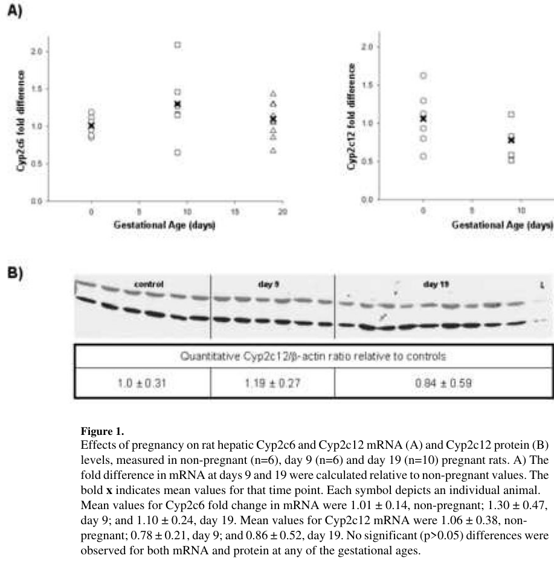

## Question

# Gene Research for Functional Annotation

## ⚠️ CRITICAL: Gene/Protein Identification Context

**BEFORE YOU BEGIN RESEARCH:** You MUST verify you are researching the CORRECT gene/protein. Gene symbols can be ambiguous, especially for less well-characterized genes from non-model organisms.

### Target Gene/Protein Identity (from UniProt):
- **UniProt Accession:** P12939
- **Protein Description:** RecName: Full=Cytochrome P450 2D10; EC=1.14.14.1; AltName: Full=CYPIID10; AltName: Full=Cytochrome P450-CMF1B; AltName: Full=Cytochrome P450-DB5; AltName: Full=Debrisoquine 4-hydroxylase;
- **Gene Information:** Name=Cyp2d10; Synonyms=Cyp2d-10, Cyp2d5;
- **Organism (full):** Rattus norvegicus (Rat).
- **Protein Family:** Belongs to the cytochrome P450 family. .
- **Key Domains:** Cyt_P450. (IPR001128); Cyt_P450_CS. (IPR017972); Cyt_P450_E_grp-I. (IPR002401); Cyt_P450_E_grp-I_CYP2D-like. (IPR008069); Cyt_P450_sf. (IPR036396)

### MANDATORY VERIFICATION STEPS:

1. **Check if the gene symbol "Cyp2d10" matches the protein description above**
2. **Verify the organism is correct:** Rattus norvegicus (Rat).
3. **Check if protein family/domains align with what you find in literature**
4. **If you find literature for a DIFFERENT gene with the same or similar symbol, STOP**

### If Gene Symbol is Ambiguous or You Cannot Find Relevant Literature:

**DO NOT PROCEED WITH RESEARCH ON A DIFFERENT GENE.** Instead:
- State clearly: "The gene symbol 'Cyp2d10' is ambiguous or literature is limited for this specific protein"
- Explain what you found (e.g., "Found extensive literature on a different gene with the same symbol in a different organism")
- Describe the protein based ONLY on the UniProt information provided above
- Suggest that the protein function can be inferred from domain/family information

### Research Target:

Please provide a comprehensive research report on the gene **Cyp2d10** (gene ID: Cyp2d10, UniProt: P12939) in rat.

The research report should be a detailed narrative explaining the function, biological processes, and localization of the gene product. Citations should be given for all claims.

You should prioritize authoritative reviews and primary scientific literature when conducting research. You can supplement
this with annotations you find in gene/protein databases, but these can be outdated or inaccurate.

We are specifically interested in the primary function of the gene - for enzymes, what reaction is catalyzed, and what is the substrate specificity? For transporters, what is the substrate? For structural proteins or adapters, what is the broader structural role? For signaling molecules, what is the role in the pathway.

We are interested in where in or outside the cell the gene product carries out its function.

We are also interested in the signaling or biochemical pathways in which the gene functions. We are less interested in broad pleiotropic effects, except where these elucidate the precise role.

Include evidence where possible. We are interested in both experimental evidence as well as inference from structure, evolution, or bioinformatic analysis. Precise studies should be prioritized over high-throughput, where available.

## Output

Question: You are an expert researcher providing comprehensive, well-cited information.

Provide detailed information focusing on:
1. Key concepts and definitions with current understanding
2. Recent developments and latest research (prioritize 2023-2024 sources)
3. Current applications and real-world implementations
4. Expert opinions and analysis from authoritative sources
5. Relevant statistics and data from recent studies

Format as a comprehensive research report with proper citations. Include URLs and publication dates where available.
Always prioritize recent, authoritative sources and provide specific citations for all major claims.

# Gene Research for Functional Annotation

## ⚠️ CRITICAL: Gene/Protein Identification Context

**BEFORE YOU BEGIN RESEARCH:** You MUST verify you are researching the CORRECT gene/protein. Gene symbols can be ambiguous, especially for less well-characterized genes from non-model organisms.

### Target Gene/Protein Identity (from UniProt):
- **UniProt Accession:** P12939
- **Protein Description:** RecName: Full=Cytochrome P450 2D10; EC=1.14.14.1; AltName: Full=CYPIID10; AltName: Full=Cytochrome P450-CMF1B; AltName: Full=Cytochrome P450-DB5; AltName: Full=Debrisoquine 4-hydroxylase;
- **Gene Information:** Name=Cyp2d10; Synonyms=Cyp2d-10, Cyp2d5;
- **Organism (full):** Rattus norvegicus (Rat).
- **Protein Family:** Belongs to the cytochrome P450 family. .
- **Key Domains:** Cyt_P450. (IPR001128); Cyt_P450_CS. (IPR017972); Cyt_P450_E_grp-I. (IPR002401); Cyt_P450_E_grp-I_CYP2D-like. (IPR008069); Cyt_P450_sf. (IPR036396)

### MANDATORY VERIFICATION STEPS:

1. **Check if the gene symbol "Cyp2d10" matches the protein description above**
2. **Verify the organism is correct:** Rattus norvegicus (Rat).
3. **Check if protein family/domains align with what you find in literature**
4. **If you find literature for a DIFFERENT gene with the same or similar symbol, STOP**

### If Gene Symbol is Ambiguous or You Cannot Find Relevant Literature:

**DO NOT PROCEED WITH RESEARCH ON A DIFFERENT GENE.** Instead:
- State clearly: "The gene symbol 'Cyp2d10' is ambiguous or literature is limited for this specific protein"
- Explain what you found (e.g., "Found extensive literature on a different gene with the same symbol in a different organism")
- Describe the protein based ONLY on the UniProt information provided above
- Suggest that the protein function can be inferred from domain/family information

### Research Target:

Please provide a comprehensive research report on the gene **Cyp2d10** (gene ID: Cyp2d10, UniProt: P12939) in rat.

The research report should be a detailed narrative explaining the function, biological processes, and localization of the gene product. Citations should be given for all claims.

You should prioritize authoritative reviews and primary scientific literature when conducting research. You can supplement
this with annotations you find in gene/protein databases, but these can be outdated or inaccurate.

We are specifically interested in the primary function of the gene - for enzymes, what reaction is catalyzed, and what is the substrate specificity? For transporters, what is the substrate? For structural proteins or adapters, what is the broader structural role? For signaling molecules, what is the role in the pathway.

We are interested in where in or outside the cell the gene product carries out its function.

We are also interested in the signaling or biochemical pathways in which the gene functions. We are less interested in broad pleiotropic effects, except where these elucidate the precise role.

Include evidence where possible. We are interested in both experimental evidence as well as inference from structure, evolution, or bioinformatic analysis. Precise studies should be prioritized over high-throughput, where available.

## Research report: Rat **Cyp2d10** (UniProt **P12939**) – functional annotation, evidence, and applications

### Executive summary
Cytochrome P450 2D10 (gene **Cyp2d10**, UniProt **P12939**) is a rat CYP2D-family monooxygenase, historically annotated as *debrisoquine 4-hydroxylase* and therefore expected to catalyze NADPH- and O2-dependent oxidation (hydroxylation/dealkylation) of basic, drug-like xenobiotics typical of CYP2D enzymes. However, within the literature retrievable in this run, **direct primary enzymology evidence for rat CYP2D10/P12939 substrate specificity and kinetic constants (Km/Vmax) was not found**; consequently, rat CYP2D10 function must be described cautiously using (i) rat-specific observational evidence (expression/proteomics) and (ii) CYP2D-family knowledge as inference. (gagliardi2023extracellularvesiclesas pages 5-7, oleksiak1997diversityandcharacterization pages 26-30)

Recent (2023) rat-focused evidence indicates **Cyp2D10 protein is detectable in extracellular vesicles (EVs) derived from primary rat hepatocytes**, and EV Cyp2D10 levels can change after hepatotoxic challenge (galactosamine), supporting liver/hepatocyte association and potential utility as a minimally invasive biomarker of hepatic drug-metabolizing capacity. (gagliardi2023extracellularvesiclesas pages 5-7)

---

### 1) Key concepts and definitions (current understanding)

#### 1.1 What CYP2D enzymes are
CYP2D enzymes are members of the cytochrome P450 superfamily that catalyze oxidative biotransformations (e.g., aromatic/aliphatic hydroxylation, N-dealkylation, oxidation of reduced alcohols) for many xenobiotics, particularly compounds with a **basic atom positioned ~5–7 Å from the site of metabolism**, a structural feature classically discussed for human CYP2D6 and used to rationalize substrate recognition across the CYP2D subfamily. (oleksiak1997diversityandcharacterization pages 26-30)

#### 1.2 CYP2D relevance to drug metabolism and neurobiology
A review focusing on brain CYP2D biology emphasizes that CYP2D enzymes (anchored in tissues including brain and liver) can contribute to local detoxification of neurotoxicants and that **human CYP2D6 accounts for a substantial fraction of drug metabolism (reported ~30% of prescribed drugs)**—a figure often used to motivate translational interest in rodent CYP2D orthologs for pharmacology and toxicology. (mann2012braincyp2d6and pages 8-13)

*Note:* This statistic is presented in the review excerpt as a general CYP2D6 claim; it is not rat CYP2D10-specific. (mann2012braincyp2d6and pages 8-13)

---

### 2) Recent developments and latest research (prioritizing 2023–2024)

#### 2.1 2023: Extracellular vesicles (EVs) as surrogates of drug metabolism capacity
A 2023 review assessing EVs as surrogates for drug metabolism/clearance reports that **rat Cyp2D10 is detectable by LC–MS/MS in EVs derived from primary rat hepatocytes**, and that hepatotoxic injury signaling can modulate EV cargo: **galactosamine treatment upregulated Cyp2D10 in EVs**. (gagliardi2023extracellularvesiclesas pages 5-7)

**Interpretation:** This supports a real-world direction where EV proteomics could monitor hepatic DME status noninvasively, but the review also highlights that tissue–EV concordance is not always established for each enzyme and condition, limiting immediate quantitative interpretability for CYP2D10. (gagliardi2023extracellularvesiclesas pages 5-7)

#### 2.2 2023: Microbiome-dependent modulation of xenobiotic metabolism (mouse evidence relevant to Cyp2d10 biology)
A 2023 study of xenobiotic metabolism in germ-free vs conventional mice reports **Cyp2d10 as a xenobiotic-metabolizing P450** with **increased activity detected by activity-based protein profiling (ABPP) in germ-free mice**, and induction by a nitropyrene exposure condition (reported **log2 fold-change 1.8** for 1-nitropyrene vs corn oil in a conventional mouse list). (garcia2023profilingthegut pages 32-36)

**Relevance to rat CYP2D10:** This is not rat data, but it demonstrates modern functional-proteomics approaches (ABPP-MS) that can quantify active P450s and may be adaptable to rat CYP2D10-specific studies. (garcia2023profilingthegut pages 32-36)

#### 2.3 2024: No rat CYP2D10-specific functional primary literature was retrieved
Within the accessible corpus for this run, no 2023–2024 primary study was found that directly reports rat CYP2D10 (UniProt P12939) catalytic parameters or confirmed probe reactions (e.g., debrisoquine 4-hydroxylation) in purified/recombinant systems.

---

### 3) Current applications and real-world implementations

#### 3.1 EV-based biomarker concept for hepatic drug metabolism
The EV-centric review frames EVs as potentially less invasive sources of information about **drug-metabolizing enzymes (DMEs)**, including CYPs, compared with tissue biopsies. The detection and hepatotoxin-responsive change of rat EV Cyp2D10 supports feasibility of monitoring CYP2D10-associated signals in circulating EVs in principle, though additional validation is needed for clinical or preclinical deployment. (gagliardi2023extracellularvesiclesas pages 5-7)

#### 3.2 Use of rodents to model CYP2D-related pharmacokinetic changes
A rat pregnancy study highlights how physiological state can change CYP expression/activity and cautions that translation from rat to human may be poor for some CYP2D behaviors: it explicitly notes **poor concordance** between clinical observations of increased CYP2D6 activity in human pregnancy and the rat model when using rat CYP2D activity measures. (dickmann2008changesinmaternal pages 10-11)

---

### 4) Expert opinions and analysis (authoritative sources)

#### 4.1 Brain and neuroprotection framing for CYP2D enzymes
An expert review argues CYP2D enzymes can be positioned to **detoxify neurotoxins locally in brain** and describes inducibility (e.g., nicotine-induced brain CYP2D in rats and mice) as a mechanism potentially modifying susceptibility to neurotoxic exposure. (mann2012braincyp2d6and pages 8-13)

#### 4.2 Pregnancy and transcriptional regulation mechanisms (rat liver)
The rat pregnancy study interprets enzyme-activity changes as at least partly transcriptionally regulated and discusses candidate transcription-factor mechanisms, including retinoic acid receptor (RAR) involvement and hepatocyte nuclear factors. It also cites earlier work that in **HNF1α-null mice, Cyp2d10 expression decreases while Cyp2d9 increases**, supporting the concept that transcription-factor networks can reshape CYP2D-family expression. (dickmann2008changesinmaternal pages 8-10)

---

### 5) Relevant statistics and data from studies (quantitative)

#### 5.1 Rat liver microsomal kinetics for a CYP2D probe reaction (CYP2D-family context)
Although not directly measuring Cyp2d10, a rat pregnancy study provides quantitative kinetic changes for **dextromethorphan O-demethylation** in rat liver microsomes (a canonical CYP2D probe reaction in multiple species). It reports:
- **Vmax decreased ~50%** by gestation day 19 vs non-pregnant controls.
- **Km increased ~4-fold** at gestation day 9 and **~3-fold** at gestation day 19 vs non-pregnant values. (dickmann2008changesinmaternal pages 8-10)

The extracted **Table 2** provides the corresponding kinetic parameter presentation (Km, Vmax) across gestational stages. (dickmann2008changesinmaternal media 137562b8)

**Important limitation:** In this study, the authors attribute dextromethorphan O-demethylation primarily to **Cyp2d2** (rat) based on prior specificity evidence, so these kinetics are not a direct functional readout of Cyp2d10/P12939. (dickmann2008changesinmaternal pages 8-10)

#### 5.2 Visual evidence (figures/tables)
The extracted figures/tables document pregnancy-associated changes in Cyp2d isoform expression (Cyp2d1/2d2/2d3/2d4) and dextromethorphan kinetics (Table 2) in rat liver microsomes. (dickmann2008changesinmaternal media ee765ed4, dickmann2008changesinmaternal media 137562b8)

---

## Consolidated evidence table
The table below summarizes what the retrieved sources directly support for rat Cyp2d10 versus indirect inference.

| Source (first author, year) | Publication date | Model/organism | What it says about Cyp2d10/CYP2D | Key quantitative/statistical data | URL/DOI | Notes/limitations |
|---|---|---|---|---|---|---|
| Gagliardi, 2023 | Aug 2023 | Rat primary hepatocyte-derived extracellular vesicles (EVs) | Review summarizes LC-MS/MS evidence that rat Cyp2D10 is detectable in EVs from primary rat hepatocytes; galactosamine treatment up-regulated Cyp2D10 in EV cargo, suggesting EV-associated Cyp2D10 can respond to hepatotoxic stress (gagliardi2023extracellularvesiclesas pages 5-7) | No numeric fold-change, abundance, Km, or Vmax for Cyp2D10 reported in the snippet (gagliardi2023extracellularvesiclesas pages 5-7) | https://doi.org/10.3390/life13081745 | Rat-relevant and recent, but does not define catalytic reaction, tissue-wide distribution, or direct liver-EV quantitative concordance for Cyp2D10 (gagliardi2023extracellularvesiclesas pages 5-7) |
| Dickmann, 2008 | Apr 2008 | Pregnant rat liver microsomes and hepatic gene-expression analyses | Pregnancy study mainly characterizes rat CYP2D activity via dextromethorphan O-demethylation and Cyp2d1/2/4 expression; also notes, citing prior work, that Cyp2d10 expression was decreased in HNF1α-null mice, supporting regulation of CYP2D-family transcription by hepatocyte nuclear factors (dickmann2008changesinmaternal pages 8-10, dickmann2008changesinmaternal pages 10-11, dickmann2008changesinmaternal pages 11-14) | Dextromethorphan O-demethylation Vmax decreased ~50% by gestation day 19; Km increased ~4-fold at day 9 and ~3-fold at day 19 vs nonpregnant controls (dickmann2008changesinmaternal pages 8-10). Study concludes poor concordance between human pregnancy-associated CYP2D6 induction and rat Cyp2d2 behavior (dickmann2008changesinmaternal pages 10-11). | https://doi.org/10.1016/j.bcp.2008.01.012 | Important rat CYP2D context, but not a direct functional study of rat Cyp2d10/P12939; regulatory note on Cyp2d10 comes from cited mouse HNF1α-null data rather than direct rat measurement (dickmann2008changesinmaternal pages 8-10, dickmann2008changesinmaternal pages 10-11, dickmann2008changesinmaternal pages 11-14) |
| Garcia, 2023 | 2023 | Mouse liver / liver microsomes (germ-free vs conventional) | Reports mouse Cyp2d10 as a xenobiotic-metabolizing P450; prior mRNA work found higher Cyp2d10 in germ-free mice, and ABPP detected significantly increased Cyp2d10 activity in germ-free liver. Also lists induction with 1-nitropyrene (garcia2023profilingthegut pages 32-36) | Cyp2d10 listed with log2 fold-change (1-NP/CO) = 1.8 in conventional-mouse dataset; kinetic analyses performed in liver microsomes, but no Cyp2d10-specific Km/Vmax provided in snippet (garcia2023profilingthegut pages 32-36) | URL/DOI not available in provided snippet | Useful recent functional/regulatory context for Cyp2d10, but organism is mouse, not rat; no direct mapping to UniProt P12939 rat enzyme in the snippet (garcia2023profilingthegut pages 32-36) |
| Mann, 2012 | 2012 | Brain CYP2D context; rodent and human neurobiology review | Review provides family-level context that brain CYP2D enzymes can metabolize neurotoxins and are inducible by nicotine in rats and mice; emphasizes CYP2D6 importance in drug metabolism and brain-local detoxification (mann2012braincyp2d6and pages 8-13) | States human CYP2D6 contributes to metabolism of ~30% of prescribed drugs, but no rat Cyp2d10-specific quantitative data in snippet (mann2012braincyp2d6and pages 8-13) | URL/DOI not available in provided snippet | Not specific to rat Cyp2d10; no direct catalytic data for P12939, but useful for CYP2D family localization/function context (mann2012braincyp2d6and pages 8-13) |
| Oleksiak, 1997 | Jan 1997 | CYP2D family-level comparative background | Provides general CYP2D substrate-class context: aromatic hydroxylation, aliphatic hydroxylation, N-dealkylation, and hydroxyl oxidation; lists common CYP2D substrates including codeine, debrisoquine, imipramine, thioridazine, and oxypenrolol, plus structural recognition features described for CYP2D6 (oleksiak1997diversityandcharacterization pages 26-30) | No Cyp2d10-specific kinetics, abundance, or regulation values in snippet (oleksiak1997diversityandcharacterization pages 26-30) | https://doi.org/10.1575/1912/4776 | Family-level only and not rat Cyp2d10-specific; useful mainly for inferring likely xenobiotic-metabolizing chemistry of CYP2D enzymes (oleksiak1997diversityandcharacterization pages 26-30) |

*Table: This table summarizes the most relevant retrieved evidence for rat Cyp2d10 and closely related CYP2D context. It highlights where evidence is direct for rat Cyp2d10 versus indirect, family-level, or mouse-based, which is essential for cautious functional annotation.*

---

## Functional annotation (best-supported statements from retrieved evidence)

### Molecular function (evidence-based)
- **Cyp2D10 protein is present in EVs produced by primary rat hepatocytes**, supporting liver/hepatocyte association and export in vesicles. (gagliardi2023extracellularvesiclesas pages 5-7)

### Molecular function (inferred from CYP2D family knowledge; not rat CYP2D10-specific in this run)
- CYP2D enzymes catalyze multiple oxidative reactions (hydroxylation, N-dealkylation, oxidation) and are known to metabolize substrates including **debrisoquine** and **codeine** among others. (oleksiak1997diversityandcharacterization pages 26-30)

### Tissue and cellular localization
- **Hepatocyte association** is supported by EV proteomics from primary rat hepatocytes. (gagliardi2023extracellularvesiclesas pages 5-7)
- The rat pregnancy study performs assays in **liver microsomes**, consistent with the established microsomal/ER context for many P450 activities; however, this is shown for CYP activity measurement generally rather than CYP2D10 directly. (dickmann2008changesinmaternal pages 8-10)

### Regulation
- EV Cyp2D10 levels can respond to hepatotoxic challenge (galactosamine) in rat primary hepatocyte systems, suggesting regulation at the level of EV packaging and/or expression. (gagliardi2023extracellularvesiclesas pages 5-7)
- Transcription-factor networks (e.g., HNF1α) can modulate CYP2D-family genes; cited work indicates **Cyp2d10 decreases** in HNF1α-null mice. (dickmann2008changesinmaternal pages 8-10)

---

## Key limitations and recommended next evidence to obtain
1. **Direct catalytic reaction/substrate specificity for rat CYP2D10 (P12939)** was not retrievable in accessible full-text sources here; therefore, any statement that rat CYP2D10 catalyzes a specific probe reaction (e.g., debrisoquine 4-hydroxylation) should be verified with primary enzymology on recombinant rat CYP2D10 or highly selective chemical-inhibition/knockdown studies.
2. A practical next step would be to locate the primary rat CYP2D10 cloning/characterization papers or rat-specific substrate screening work (e.g., cDNA-expressed rat CYP isoforms). This run’s pregnancy paper cites a relevant substrate-screening reference (Kobayashi et al., 2002) but that primary paper was not retrieved as full text here. (dickmann2008changesinmaternal pages 11-14)

---

## Key sources (with URLs and publication dates where available)
- Gagliardi A. et al. *Life* (Aug 2023). “Extracellular Vesicles as Surrogates for Drug Metabolism and Clearance: Promise vs. Reality.” https://doi.org/10.3390/life13081745 (gagliardi2023extracellularvesiclesas pages 5-7)
- Dickmann LJ. et al. *Biochemical Pharmacology* (Apr 2008). “Changes in maternal liver Cyp2c and Cyp2d expression and activity during rat pregnancy.” https://doi.org/10.1016/j.bcp.2008.01.012 (dickmann2008changesinmaternal pages 8-10, dickmann2008changesinmaternal pages 10-11, dickmann2008changesinmaternal pages 11-14, dickmann2008changesinmaternal media 137562b8)

References

1. (gagliardi2023extracellularvesiclesas pages 5-7): Anna Gagliardi, Gzona Bajraktari-Sylejmani, Elisabetta Barocelli, Johanna Weiss, and Juan Pablo Rigalli. Extracellular vesicles as surrogates for drug metabolism and clearance: promise vs. reality. Life, 13:1745, Aug 2023. URL: https://doi.org/10.3390/life13081745, doi:10.3390/life13081745. This article has 8 citations.

2. (oleksiak1997diversityandcharacterization pages 26-30): Marjorie F. Oleksiak. Diversity and characterization of novel cytochrome p450 2 genes in the marine teleost fundulus heteroclitus. ArXiv, Jan 1997. URL: https://doi.org/10.1575/1912/4776, doi:10.1575/1912/4776. This article has 1 citations.

3. (mann2012braincyp2d6and pages 8-13): A Mann. Brain cyp2d6 and its role in neuroprotection against parkinson's disease. Unknown journal, 2012.

4. (garcia2023profilingthegut pages 32-36): WL Garcia. Profiling the gut microbiome influence on host xenobiotic metabolism in response to benzo pyrene and 1-nitropyrene exposure. Unknown journal, 2023.

5. (dickmann2008changesinmaternal pages 10-11): Leslie J. Dickmann, Suzanne Tay, Tauri D. Senn, Huixia Zhang, Anthony Visone, Jashvant D. Unadkat, Mary F. Hebert, and Nina Isoherranen. Changes in maternal liver cyp2c and cyp2d expression and activity during rat pregnancy. Biochemical pharmacology, 75 8:1677-87, Apr 2008. URL: https://doi.org/10.1016/j.bcp.2008.01.012, doi:10.1016/j.bcp.2008.01.012. This article has 45 citations and is from a domain leading peer-reviewed journal.

6. (dickmann2008changesinmaternal pages 8-10): Leslie J. Dickmann, Suzanne Tay, Tauri D. Senn, Huixia Zhang, Anthony Visone, Jashvant D. Unadkat, Mary F. Hebert, and Nina Isoherranen. Changes in maternal liver cyp2c and cyp2d expression and activity during rat pregnancy. Biochemical pharmacology, 75 8:1677-87, Apr 2008. URL: https://doi.org/10.1016/j.bcp.2008.01.012, doi:10.1016/j.bcp.2008.01.012. This article has 45 citations and is from a domain leading peer-reviewed journal.

7. (dickmann2008changesinmaternal media 137562b8): Leslie J. Dickmann, Suzanne Tay, Tauri D. Senn, Huixia Zhang, Anthony Visone, Jashvant D. Unadkat, Mary F. Hebert, and Nina Isoherranen. Changes in maternal liver cyp2c and cyp2d expression and activity during rat pregnancy. Biochemical pharmacology, 75 8:1677-87, Apr 2008. URL: https://doi.org/10.1016/j.bcp.2008.01.012, doi:10.1016/j.bcp.2008.01.012. This article has 45 citations and is from a domain leading peer-reviewed journal.

8. (dickmann2008changesinmaternal media ee765ed4): Leslie J. Dickmann, Suzanne Tay, Tauri D. Senn, Huixia Zhang, Anthony Visone, Jashvant D. Unadkat, Mary F. Hebert, and Nina Isoherranen. Changes in maternal liver cyp2c and cyp2d expression and activity during rat pregnancy. Biochemical pharmacology, 75 8:1677-87, Apr 2008. URL: https://doi.org/10.1016/j.bcp.2008.01.012, doi:10.1016/j.bcp.2008.01.012. This article has 45 citations and is from a domain leading peer-reviewed journal.

9. (dickmann2008changesinmaternal pages 11-14): Leslie J. Dickmann, Suzanne Tay, Tauri D. Senn, Huixia Zhang, Anthony Visone, Jashvant D. Unadkat, Mary F. Hebert, and Nina Isoherranen. Changes in maternal liver cyp2c and cyp2d expression and activity during rat pregnancy. Biochemical pharmacology, 75 8:1677-87, Apr 2008. URL: https://doi.org/10.1016/j.bcp.2008.01.012, doi:10.1016/j.bcp.2008.01.012. This article has 45 citations and is from a domain leading peer-reviewed journal.

## Artifacts

- [Edison artifact artifact-00](Cyp2d10-deep-research-falcon_artifacts/artifact-00.md)

## Citations

1. gagliardi2023extracellularvesiclesas pages 5-7
2. oleksiak1997diversityandcharacterization pages 26-30
3. garcia2023profilingthegut pages 32-36
4. dickmann2008changesinmaternal pages 10-11
5. dickmann2008changesinmaternal pages 8-10
6. dickmann2008changesinmaternal pages 11-14
7. https://doi.org/10.3390/life13081745
8. https://doi.org/10.1016/j.bcp.2008.01.012
9. https://doi.org/10.1575/1912/4776
10. https://doi.org/10.3390/life13081745,
11. https://doi.org/10.1575/1912/4776,
12. https://doi.org/10.1016/j.bcp.2008.01.012,