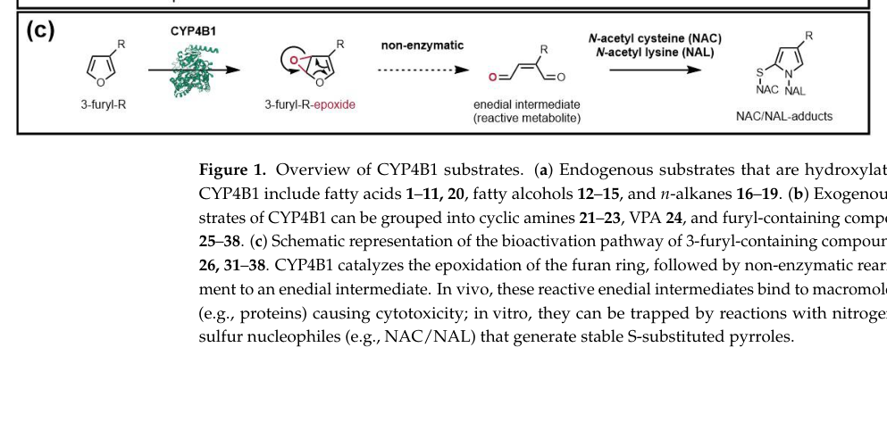

## Question

# Gene Research for Functional Annotation

## ⚠️ CRITICAL: Gene/Protein Identification Context

**BEFORE YOU BEGIN RESEARCH:** You MUST verify you are researching the CORRECT gene/protein. Gene symbols can be ambiguous, especially for less well-characterized genes from non-model organisms.

### Target Gene/Protein Identity (from UniProt):
- **UniProt Accession:** P15129
- **Protein Description:** RecName: Full=Cytochrome P450 4B1; EC=1.14.14.1; AltName: Full=CYPIVB1; AltName: Full=Cytochrome P450 L-2; AltName: Full=Cytochrome P450 isozyme 5;
- **Gene Information:** Name=Cyp4b1; Synonyms=Cyp4b-1;
- **Organism (full):** Rattus norvegicus (Rat).
- **Protein Family:** Belongs to the cytochrome P450 family. .
- **Key Domains:** Cyt_P450. (IPR001128); Cyt_P450_CS. (IPR017972); Cyt_P450_E_grp-I. (IPR002401); Cyt_P450_sf. (IPR036396); Cytochrome_P450_Monoox. (IPR050196)

### MANDATORY VERIFICATION STEPS:

1. **Check if the gene symbol "Cyp4b1" matches the protein description above**
2. **Verify the organism is correct:** Rattus norvegicus (Rat).
3. **Check if protein family/domains align with what you find in literature**
4. **If you find literature for a DIFFERENT gene with the same or similar symbol, STOP**

### If Gene Symbol is Ambiguous or You Cannot Find Relevant Literature:

**DO NOT PROCEED WITH RESEARCH ON A DIFFERENT GENE.** Instead:
- State clearly: "The gene symbol 'Cyp4b1' is ambiguous or literature is limited for this specific protein"
- Explain what you found (e.g., "Found extensive literature on a different gene with the same symbol in a different organism")
- Describe the protein based ONLY on the UniProt information provided above
- Suggest that the protein function can be inferred from domain/family information

### Research Target:

Please provide a comprehensive research report on the gene **Cyp4b1** (gene ID: Cyp4b1, UniProt: P15129) in rat.

The research report should be a detailed narrative explaining the function, biological processes, and localization of the gene product. Citations should be given for all claims.

You should prioritize authoritative reviews and primary scientific literature when conducting research. You can supplement
this with annotations you find in gene/protein databases, but these can be outdated or inaccurate.

We are specifically interested in the primary function of the gene - for enzymes, what reaction is catalyzed, and what is the substrate specificity? For transporters, what is the substrate? For structural proteins or adapters, what is the broader structural role? For signaling molecules, what is the role in the pathway.

We are interested in where in or outside the cell the gene product carries out its function.

We are also interested in the signaling or biochemical pathways in which the gene functions. We are less interested in broad pleiotropic effects, except where these elucidate the precise role.

Include evidence where possible. We are interested in both experimental evidence as well as inference from structure, evolution, or bioinformatic analysis. Precise studies should be prioritized over high-throughput, where available.

## Output

Question: You are an expert researcher providing comprehensive, well-cited information.

Provide detailed information focusing on:
1. Key concepts and definitions with current understanding
2. Recent developments and latest research (prioritize 2023-2024 sources)
3. Current applications and real-world implementations
4. Expert opinions and analysis from authoritative sources
5. Relevant statistics and data from recent studies

Format as a comprehensive research report with proper citations. Include URLs and publication dates where available.
Always prioritize recent, authoritative sources and provide specific citations for all major claims.

# Gene Research for Functional Annotation

## ⚠️ CRITICAL: Gene/Protein Identification Context

**BEFORE YOU BEGIN RESEARCH:** You MUST verify you are researching the CORRECT gene/protein. Gene symbols can be ambiguous, especially for less well-characterized genes from non-model organisms.

### Target Gene/Protein Identity (from UniProt):
- **UniProt Accession:** P15129
- **Protein Description:** RecName: Full=Cytochrome P450 4B1; EC=1.14.14.1; AltName: Full=CYPIVB1; AltName: Full=Cytochrome P450 L-2; AltName: Full=Cytochrome P450 isozyme 5;
- **Gene Information:** Name=Cyp4b1; Synonyms=Cyp4b-1;
- **Organism (full):** Rattus norvegicus (Rat).
- **Protein Family:** Belongs to the cytochrome P450 family. .
- **Key Domains:** Cyt_P450. (IPR001128); Cyt_P450_CS. (IPR017972); Cyt_P450_E_grp-I. (IPR002401); Cyt_P450_sf. (IPR036396); Cytochrome_P450_Monoox. (IPR050196)

### MANDATORY VERIFICATION STEPS:

1. **Check if the gene symbol "Cyp4b1" matches the protein description above**
2. **Verify the organism is correct:** Rattus norvegicus (Rat).
3. **Check if protein family/domains align with what you find in literature**
4. **If you find literature for a DIFFERENT gene with the same or similar symbol, STOP**

### If Gene Symbol is Ambiguous or You Cannot Find Relevant Literature:

**DO NOT PROCEED WITH RESEARCH ON A DIFFERENT GENE.** Instead:
- State clearly: "The gene symbol 'Cyp4b1' is ambiguous or literature is limited for this specific protein"
- Explain what you found (e.g., "Found extensive literature on a different gene with the same symbol in a different organism")
- Describe the protein based ONLY on the UniProt information provided above
- Suggest that the protein function can be inferred from domain/family information

### Research Target:

Please provide a comprehensive research report on the gene **Cyp4b1** (gene ID: Cyp4b1, UniProt: P15129) in rat.

The research report should be a detailed narrative explaining the function, biological processes, and localization of the gene product. Citations should be given for all claims.

You should prioritize authoritative reviews and primary scientific literature when conducting research. You can supplement
this with annotations you find in gene/protein databases, but these can be outdated or inaccurate.

We are specifically interested in the primary function of the gene - for enzymes, what reaction is catalyzed, and what is the substrate specificity? For transporters, what is the substrate? For structural proteins or adapters, what is the broader structural role? For signaling molecules, what is the role in the pathway.

We are interested in where in or outside the cell the gene product carries out its function.

We are also interested in the signaling or biochemical pathways in which the gene functions. We are less interested in broad pleiotropic effects, except where these elucidate the precise role.

Include evidence where possible. We are interested in both experimental evidence as well as inference from structure, evolution, or bioinformatic analysis. Precise studies should be prioritized over high-throughput, where available.

## Research report: Rat **Cyp4b1** (UniProt **P15129**) — Cytochrome P450 4B1 (EC 1.14.14.1)

### 0) Target verification (mandatory)
The requested target is **Cyp4b1** from **Rattus norvegicus (rat)** encoding **Cytochrome P450 4B1 (CYP4B1)**, a member of the mammalian **CYP4** family with hallmark activity in **xenobiotic bioactivation** (notably 4‑ipomeanol) and reported ability to **hydroxylate lipophilic endobiotics** (fatty acids/fatty alcohols). The most up-to-date, synthesis-style source retrieved here is the 2023 focused review “Spotlight on CYP4B1,” which explicitly discusses rat CYP4B1 expression/regulation and rat toxicology evidence while also integrating mechanistic/structural data from other species (rabbit/mouse/human). (roder2023spotlightoncyp4b1 pages 17-19, roder2023spotlightoncyp4b1 pages 9-10)

**Important limitation:** within the retrieved full-text set, **direct rat-specific biochemical kinetics (Km/kcat) and comprehensive tissue quantitation are sparse**, and many mechanistic details come from rabbit CYP4B1 or engineered human variants; these can inform annotation but should be clearly treated as **cross-species inference** unless a rat experiment is explicitly stated. (roder2023spotlightoncyp4b1 pages 6-8, roder2023spotlightoncyp4b1 pages 5-6, roder2023spotlightoncyp4b1 pages 10-12)

| Claim category | Specific claim | Species (rat vs other; note when evidence is non-rat) | Evidence source (paper + year) | Key extracted details/quantitative values | URL/DOI |
|---|---|---|---|---|---|
| identity/domain | Cyp4b1 corresponds to cytochrome P450 family 4 subfamily B member 1, an extrahepatic P450 monooxygenase with canonical CYP4B1 functions; direct rat domain architecture is inferred from the cross-species CYP4B1 review, not quantitatively re-measured in rat in the retrieved snippets. | Rat inferred within mammalian CYP4B1; review includes rat among species discussed | Röder et al., 2023 | Review describes CYP4B1 as a mammalian cytochrome P450 monooxygenase acting in both xenobiotic and endobiotic metabolism; rat is explicitly included among species with lung expression/regulation data. Limitation: retrieved snippets do not provide a rat-specific domain experiment or sequence validation, so UniProt/InterPro assignment should be used for domain-level annotation (roder2023spotlightoncyp4b1 pages 17-19, roder2023spotlightoncyp4b1 pages 9-10) | https://doi.org/10.3390/ijms24032038 |
| reaction/substrates | Rat CYP4B1 is implicated in metabolic activation of the pulmonary protoxin 4-ipomeanol (4-IPO). | Rat-specific | Parkinson et al., 2013 (summarizing earlier rat studies) | In rat lung and liver microsomes, production of an alkylating 4-IPO metabolite was NADPH- and oxygen-dependent and inhibited by carbon monoxide; chemical inhibition with p-xylene protected rats from 4-IPO-induced lung damage, supporting CYP4B1 involvement (parkinson2013generationandcharacterization pages 1-2, parkinson2013generationandcharacterization pages 7-8) | https://doi.org/10.1093/toxsci/kft123 |
| reaction/substrates | The core CYP4B1 reaction for 4-IPO is oxygenation/epoxidation of the furan ring to a reactive enedial-type alkylating intermediate. | Mechanism established mainly in rabbit/human-engineered systems; applied cautiously to rat CYP4B1 | Röder et al., 2023; Wiek et al., 2015 | CYP4B1 transfers an oxygen atom to the furan ring of 4-IPO, generating a reactive metabolite that causes DNA–protein cross-links, strand breaks, and apoptosis. Limitation: mechanistic chemistry is strongly supported, but the retrieved detailed catalytic demonstrations are not rat-specific (wiek2015identificationofamino pages 1-3, roder2023spotlightoncyp4b1 pages 8-9, roder2023spotlightoncyp4b1 media d6c005d5) | https://doi.org/10.3390/ijms24032038; https://doi.org/10.1042/BJ20140813 |
| reaction/substrates | CYP4B1 also has endogenous substrate potential as a fatty-acid/fatty-alcohol hydroxylase. | Mostly non-rat evidence | Röder et al., 2023; Röder et al., 2025 | Rabbit CYP4B1 hydroxylates medium-chain fatty acids, n-alkanes, and fatty alcohols; review states CYP4B1 family enzymes can act on saturated fatty acids, fatty alcohols, and hydrocarbons. Limitation: retrieved snippets do not provide rat-specific substrate kinetics for endogenous lipids (roder2025explorationofcyp4b1 pages 1-2, roder2023spotlightoncyp4b1 pages 6-8, roder2023spotlightoncyp4b1 pages 5-6) | https://doi.org/10.3390/ijms24032038; https://doi.org/10.3390/catal15050454 |
| localization/tissue | Cyp4b1 is predominantly extrahepatic and expressed in rat lung. | Rat-specific for presence in lung; extrahepatic framing from cross-species review | Röder et al., 2023 | Review states CYP4B1 is an extrahepatic enzyme predominantly expressed in whole-lung tissues and has been detected in lung tissue from several species including rat. Limitation: no rat-specific percentage abundance provided in retrieved snippets (roder2023spotlightoncyp4b1 pages 9-10) | https://doi.org/10.3390/ijms24032038 |
| localization/tissue | Rat CYP4B1 activity is detectable in lung and liver microsomal preparations. | Rat-specific | Parkinson et al., 2013 (citing rat microsome studies) | Rat lung and liver microsomes metabolically activate 4-IPO; use of microsomes implies localization in the microsomal/endoplasmic-reticulum fraction, consistent with P450 biology (parkinson2013generationandcharacterization pages 1-2, parkinson2013generationandcharacterization pages 7-8) | https://doi.org/10.1093/toxsci/kft123 |
| localization/tissue | Rat bladder mucosa expresses CYP4B1, with sex- and age-dependent protein differences. | Rat-specific | Röder et al., 2023 | CYP4B1 is reported in rat bladder mucosa; protein levels increased with development in male rats, while females showed no detectable age-related variation. Limitation: no absolute abundance values were extracted (roder2023spotlightoncyp4b1 pages 10-12) | https://doi.org/10.3390/ijms24032038 |
| localization/tissue | Club/Clara-cell localization is central to pulmonary CYP4B1 biology, but direct retrieved evidence here is largely non-rat. | Mainly non-rat | Röder et al., 2023; Wiek et al., 2015 | Reviews state pulmonary microsomes of bronchiolar Clara (club) cells bioactivate 4-IPO and localize CYP4B1 strongly to nonciliated bronchiolar epithelium; however, retrieved detailed cell-type localization evidence is mainly from rabbit/mouse literature rather than direct rat experiments (roder2023spotlightoncyp4b1 pages 6-8, wiek2015identificationofamino pages 1-3) | https://doi.org/10.3390/ijms24032038; https://doi.org/10.1042/BJ20140813 |
| regulation | Rat Cyp4b1 transcription is androgen responsive. | Rat-specific | Röder et al., 2023 | Castration of male rats decreased CYP4B1 transcription, and testosterone partially restored expression, supporting androgen-induced activation and sex-specific transcriptional control in rat (roder2023spotlightoncyp4b1 pages 9-10) | https://doi.org/10.3390/ijms24032038 |
| regulation | Sex differences in rat bladder CYP4B1 expression are consistent with androgen influence. | Rat-specific | Röder et al., 2023 | In rat bladder mucosa, male protein expression increased during development, whereas females showed no detectable age-related variation; authors suggested androgen influence (roder2023spotlightoncyp4b1 pages 10-12) | https://doi.org/10.3390/ijms24032038 |
| regulation | Other regulatory inputs proposed for CYP4B1 include hypoxia, HIF-1, PPAR/clofibrate, RXR/RAR, and Sp1, but rat-specific direct evidence in the retrieved snippets is limited. | Mostly non-rat or cross-species | Röder et al., 2023 | Review notes hypoxia involvement, HIF-1 regulatory site, clofibrate/PPAR-associated increases in CYP4B1 and 12-HETE/12-HETrE synthesis in corneal tissue, and promoter motifs including RXR/RAR and Sp1. Limitation: these mechanisms were not directly demonstrated for rat in the retrieved excerpts (roder2023spotlightoncyp4b1 pages 9-10) | https://doi.org/10.3390/ijms24032038 |
| quantitative data | Direct rat quantitative enzymology is sparse in the retrieved material. | Rat-specific limitation | Parkinson et al., 2013; Röder et al., 2023 | Retrieved rat-specific snippets did not provide catalytic turnover numbers, Km values, or tissue percentages for rat CYP4B1. Available quantitative values in nearby evidence are mostly from mouse or rabbit systems, so functional annotation for rat remains partly inferential (parkinson2013generationandcharacterization pages 1-2, roder2023spotlightoncyp4b1 pages 9-10, roder2023spotlightoncyp4b1 pages 10-12) | https://doi.org/10.1093/toxsci/kft123; https://doi.org/10.3390/ijms24032038 |
| quantitative data | Useful non-rat quantitative context: recombinant rabbit CYP4B1 shows measurable fatty-acid/hydrocarbon oxidation and strong 4-IPO activity. | Non-rat | Röder et al., 2023 | Example values: n-alkane turnover from ~11 min−1 (C10) to ~33 min−1 (C7); ω/ω-1 ratio 23 for C7 and 1.6 for C10; native human CYP4B1 has <1% of rabbit 4-IPO activity. These data support family function but should not be over-ascribed to rat (roder2023spotlightoncyp4b1 pages 6-8, roder2023spotlightoncyp4b1 pages 8-9, roder2023spotlightoncyp4b1 pages 5-6) | https://doi.org/10.3390/ijms24032038 |
| applications | CYP4B1 biology underpins toxicology models of lung-selective xenobiotic activation and has been explored for suicide-gene therapy concepts. | Rat relevance for toxicology; therapy work mainly non-rat/non-clinical | Röder et al., 2023; Wiek et al., 2015 | Rat evidence supports CYP4B1-mediated pulmonary toxicant activation (4-IPO), making Cyp4b1 relevant to inhalation/lung toxicology. Reviews also discuss engineered CYP4B1 for targeted cancer suicide-gene approaches, but those applications are not rat functional annotation per se (roder2023spotlightoncyp4b1 pages 17-19, wiek2015identificationofamino pages 1-3) | https://doi.org/10.3390/ijms24032038; https://doi.org/10.1042/BJ20140813 |

*Table: This table summarizes the strongest available evidence gathered for rat Cyp4b1/CYP4B1 (UniProt P15129), separating rat-specific findings from cross-species inference. It is useful for functional annotation because the literature is richer for rabbit/mouse CYP4B1 than for direct rat biochemical characterization.*

### 1) Key concepts and definitions (current understanding)

#### 1.1 Cytochrome P450 (CYP) monooxygenases and CYP4 enzymes
CYP enzymes are heme-thiolate monooxygenases that generally catalyze **NADPH- and O2-dependent** oxygen insertion into substrates, frequently generating hydroxylated metabolites. In the CYP4 family, a common role is **terminal (ω) hydroxylation** of lipids/hydrocarbons, positioning these enzymes at the interface of **lipid homeostasis** and **xenobiotic clearance/toxicity**. (wiek2015identificationofamino pages 1-3, roder2023spotlightoncyp4b1 pages 5-6)

#### 1.2 What makes CYP4B1 distinctive
CYP4B1 is described as an “enigmatic” CYP4 enzyme because it appears to support both:
- **Endobiotic-like oxidations** (e.g., hydroxylations of fatty-acid/fatty-alcohol type substrates), and
- **Bioactivation of structurally diverse xenobiotics**, including furan-containing compounds that form reactive electrophiles. (wiek2015identificationofamino pages 1-3, roder2023spotlightoncyp4b1 pages 8-9)

### 2) Molecular function: reactions and substrate specificity

#### 2.1 Primary, well-supported rat-relevant function: bioactivation of 4‑ipomeanol (4‑IPO)
A central functional annotation for rat **Cyp4b1** is participation in **metabolic activation of the pulmonary protoxin 4‑ipomeanol (4‑IPO)**. Rat evidence summarized in a later in vivo-focused study indicates:
- In **rat lung and liver microsomes**, production of an **alkylating 4‑IPO metabolite** is **NADPH- and oxygen-dependent**, and **inhibited by carbon monoxide**, consistent with a P450-catalyzed reaction. (parkinson2013generationandcharacterization pages 1-2)
- Chemical inhibition linked specifically to CYP4B1 can be protective in rat: **p‑xylene** (reported as a CYP4B1 inhibitor) **protected rats from 4‑IPO-induced lung damage**, supporting a causal role of CYP4B1-like activity in rat pulmonary toxicity. (parkinson2013generationandcharacterization pages 1-2)

Mechanistically, CYP4B1 oxygenates the **furan ring** of 4‑IPO. This is commonly described as furan **epoxidation** followed by **non-enzymatic rearrangement** to a **reactive enedial** intermediate that can alkylate macromolecules (DNA/protein), producing genotoxic stress and cell death. While this mechanistic scheme is articulated most explicitly via cross-species biochemical work and synthesis in reviews, it is the accepted model used to interpret rat toxicology observations. (roder2023spotlightoncyp4b1 pages 8-9, roder2023spotlightoncyp4b1 media d6c005d5)

**Visual evidence:** Figure showing CYP4B1-mediated bioactivation of 3‑furyl compounds (including 4‑IPO) via epoxidation → enedial intermediate. (roder2023spotlightoncyp4b1 media d6c005d5)

#### 2.2 Additional xenobiotic substrates (context; rat specificity varies)
Beyond 4‑IPO, CYP4B1 is discussed as bioactivating or oxidizing multiple xenobiotics (species-dependent), including **3‑methylindole** and aromatic amines such as **2‑aminoanthracene** and **2‑aminofluorene** to DNA-binding/reactive metabolites. These broaden the plausible substrate scope for rat CYP4B1 but should be annotated as **reported for CYP4B1 generally** unless rat-specific experiments are identified. (roder2023spotlightoncyp4b1 pages 8-9)

#### 2.3 Endogenous-like substrates: fatty acids and fatty alcohols (mainly cross-species biochemical evidence)
The 2023 CYP4B1 review emphasizes that—similar to other CYP4 family members—CYP4B1 is able to hydroxylate fatty acids/fatty alcohols. Quantitative examples in the retrieved texts are dominated by **rabbit CYP4B1**, including turnover and ω-regioselectivity trends for medium-chain fatty acids and n-alkanes (e.g., turnover values on the order of **~11–33 min−1** across certain chain lengths and ω/ω-1 ratios varying by substrate). These numbers **should not be transferred to rat** without direct rat enzymology, but they support the **family-consistent catalytic capacity** relevant to rat annotation. (roder2023spotlightoncyp4b1 pages 6-8, roder2023spotlightoncyp4b1 pages 5-6)

### 3) Biological processes, localization, and sites of action

#### 3.1 Tissue distribution in rat (supported evidence)
- **Lung**: CYP4B1 is characterized as an **extrahepatic enzyme predominantly expressed in whole-lung tissues**, and the review explicitly notes lung detection across species including **rat**. (roder2023spotlightoncyp4b1 pages 9-10)
- **Bladder mucosa**: rat bladder mucosa expression is specifically described, with **sex- and age-dependent differences** in protein levels (see regulation section). (roder2023spotlightoncyp4b1 pages 10-12)

#### 3.2 Cellular/subcellular localization
The rat toxicology evidence specifically cites **lung and liver microsomes** as active preparations that form reactive 4‑IPO metabolites, implicating **microsomal (endoplasmic reticulum–associated)** localization typical of many drug-metabolizing P450s. (parkinson2013generationandcharacterization pages 1-2, parkinson2013generationandcharacterization pages 7-8)

Cell-type localization in the lung is frequently discussed for CYP4B1 as being prominent in **nonciliated bronchiolar epithelial Clara/club cells**, which are a major site of P450 activity and pulmonary xenobiotic bioactivation. In the retrieved text set, these cell-type statements are presented in reviews and are strongly supported for certain species (notably rabbit/mouse), but **direct rat cell-type localization evidence was not captured in the retrieved snippets**, so for rat this should be treated as likely but not definitively demonstrated here. (roder2023spotlightoncyp4b1 pages 6-8, wiek2015identificationofamino pages 1-3)

### 4) Pathway context and regulation (rat-focused where possible)

#### 4.1 Androgen/sex-dependent regulation in rat
The 2023 review summarizes explicit rat regulatory evidence:
- **Castration of male rats** decreased **CYP4B1 transcription**, and **testosterone treatment** partially restored expression, supporting **androgen-induced activation** and sex-linked differences in transcriptional control in rats. (roder2023spotlightoncyp4b1 pages 9-10)

Additionally, rat bladder mucosa shows a sex/age pattern consistent with androgen influence:
- CYP4B1 protein levels increased with development in **male rats**, while **female rats** showed no detectable age-related variation; authors suggested androgen effects on expression. (roder2023spotlightoncyp4b1 pages 10-12)

#### 4.2 Hypoxia and nuclear receptor signaling (context; rat specificity limited in retrieved set)
The review discusses broader regulatory motifs/mechanisms for CYP4B1 (e.g., hypoxia/HIF-1 elements and nuclear receptor pathways such as PPAR-associated induction), but in the retrieved excerpts this is **not consistently anchored to rat experimental data**, so it should be annotated as **proposed/general CYP4B1 regulation** pending rat-specific confirmation. (roder2023spotlightoncyp4b1 pages 9-10)

### 5) Recent developments and latest research (prioritizing 2023–2024)

#### 5.1 2023 synthesis review consolidating mechanistic, structural, and translational viewpoints
“**Spotlight on CYP4B1**” (Röder et al., **Jan 2023**, Int J Mol Sci; https://doi.org/10.3390/ijms24032038) is a comprehensive recent review that:
- Reinforces **4‑IPO** as a hallmark CYP4B1 substrate and frames CYP4B1 as primarily **extrahepatic/pulmonary**, aligning with rat lung toxicology relevance. (roder2023spotlightoncyp4b1 pages 17-19, roder2023spotlightoncyp4b1 pages 9-10)
- Highlights strong **species differences**, including the observation that **native human CYP4B1** has **<1%** of rabbit CYP4B1 activity toward 4‑IPO, informing cross-species extrapolation caveats for toxicity and translational modeling. (roder2023spotlightoncyp4b1 pages 8-9)

#### 5.2 2024 sources in the retrieved set
Within the retrieved, analyzable texts, no 2024 primary paper directly characterizing **rat** CYP4B1 enzymology was obtained. The most relevant 2024 content in the current library pertains to other contexts (e.g., general xenobiotic metabolism or unrelated proteomic studies) rather than direct rat Cyp4b1 functional annotation. Therefore, the **best “recent” authoritative synthesis available here remains the 2023 review**, supplemented by well-cited mechanistic work. (roder2023spotlightoncyp4b1 pages 17-19, parkinson2013generationandcharacterization pages 1-2)

### 6) Current applications and real-world implementations

#### 6.1 Pulmonary toxicology and species-specific risk assessment
Rat CYP4B1-relevant evidence supports a classic real-world application: using CYP4B1-mediated **bioactivation** to explain **lung-selective toxicity** of compounds like 4‑IPO and to interpret why interventions that inhibit CYP4B1-like activity (e.g., chemical inhibition) mitigate pulmonary injury in vivo. This positions rat Cyp4b1 as an important variable in **inhalation toxicology**, **pulmonary safety pharmacology**, and **species-translation** assessments for furan-containing xenobiotics. (parkinson2013generationandcharacterization pages 1-2)

#### 6.2 Engineered CYP4B1 for prodrug/suicide gene approaches (research-to-application pipeline)
The CYP4B1 field also explores CYP4B1 variants in **suicide gene therapy** concepts—using CYP4B1-mediated bioactivation of specific pro-toxins to target defined cells/tissues. While this is not rat-specific functional annotation, it is a downstream application of the CYP4B1 catalytic property of generating cytotoxic electrophiles from suitable substrates. (roder2023spotlightoncyp4b1 pages 17-19, wiek2015identificationofamino pages 1-3)

### 7) Expert opinions and analysis (authoritative synthesis)
A consistent expert-level interpretation in recent synthesis is that CYP4B1 sits “at the interface between xenobiotic and endobiotic metabolism,” with biological significance driven largely by **extrahepatic expression** (especially lung) and by its capacity to convert certain xenobiotics into **highly reactive intermediates** that cause tissue-selective toxicity. The 2023 review explicitly emphasizes that CYP4B1 is not a major contributor to **hepatic** phase I drug metabolism due to its **predominantly extrahepatic expression**, which is directly relevant to how rat CYP4B1 should be treated in pharmacology/toxicology models. (roder2023spotlightoncyp4b1 pages 17-19)

### 8) Statistics and quantitative data (what is available; and gaps)

#### 8.1 Rat-specific quantitative data captured in the retrieved set
- The retrieved evidence **does not** provide rat-specific **Km/kcat**, absolute tissue abundance, or transcript-percentage breakdown for rat CYP4B1. This is a concrete evidence gap for detailed functional annotation from the current corpus. (roder2023spotlightoncyp4b1 pages 10-12, parkinson2013generationandcharacterization pages 7-8)

#### 8.2 Quantitative context (non-rat; useful for mechanistic intuition, not direct rat parameterization)
- Native human CYP4B1 activity toward 4‑IPO is described as **<1%** of rabbit CYP4B1, underscoring strong species effects. (roder2023spotlightoncyp4b1 pages 8-9)
- A furan-lung toxicant example binding parameter: perilla ketone (discussed as a CYP4B1-related toxicant context) is reported with **KD ≈ 0.25 µM** (species context in the review). (roder2023spotlightoncyp4b1 pages 8-9)
- Rabbit CYP4B1 catalytic turnover and regioselectivity numbers for fatty-acid/hydrocarbon substrates (e.g., **~11–33 min−1** and ω/ω‑1 ratios varying by chain length) demonstrate plausible endobiotic-like activity but remain **non-rat**. (roder2023spotlightoncyp4b1 pages 6-8, roder2023spotlightoncyp4b1 pages 5-6)

### 9) Practical functional annotation summary (rat Cyp4b1; evidence-weighted)
**Most defensible primary function for rat annotation (based on direct rat-linked evidence):**
- **Monooxygenase involved in bioactivation of 4‑ipomeanol and related xenobiotics**, yielding reactive electrophilic intermediates that drive **pulmonary toxicity**, with activity detectable in **rat lung microsomes** and modulated by inhibitors and P450 constraints (NADPH/O2 dependence; CO inhibition). (parkinson2013generationandcharacterization pages 1-2, parkinson2013generationandcharacterization pages 7-8)

**Likely additional roles (supported strongly for CYP4B1 across species; rat-specific confirmation limited in current corpus):**
- **Hydroxylation of fatty acids/fatty alcohols/hydrocarbons** consistent with CYP4 family chemistry. (roder2025explorationofcyp4b1 pages 1-2, roder2023spotlightoncyp4b1 pages 5-6)

**Localization:**
- Predominantly **extrahepatic**, especially **lung**; also present in **bladder mucosa**. Subcellular evidence (microsomes) supports **ER-associated** localization. (roder2023spotlightoncyp4b1 pages 9-10, roder2023spotlightoncyp4b1 pages 10-12, parkinson2013generationandcharacterization pages 7-8)

**Regulation:**
- **Androgen-responsive transcription** in rat (castration decreases transcription; testosterone partially restores). (roder2023spotlightoncyp4b1 pages 9-10)

### 10) References (retrieved core sources)
- Röder A. et al. **“Spotlight on CYP4B1.”** *International Journal of Molecular Sciences* (Publication date: **Jan 2023**). https://doi.org/10.3390/ijms24032038 (roder2023spotlightoncyp4b1 pages 17-19, roder2023spotlightoncyp4b1 pages 9-10)
- Parkinson O.T. et al. **“Generation and characterization of a Cyp4b1 null mouse and the role of CYP4B1 in the activation and toxicity of Ipomeanol.”** *Toxicological Sciences* (Publication date: **Aug 2013**). https://doi.org/10.1093/toxsci/kft123 (parkinson2013generationandcharacterization pages 1-2, parkinson2013generationandcharacterization pages 7-8)
- Wiek C. et al. **“Identification of amino acid determinants in CYP4B1 for optimal catalytic processing of 4-ipomeanol.”** *Biochemical Journal* (Publication date: **Dec 2015**). https://doi.org/10.1042/BJ20140813 (wiek2015identificationofamino pages 1-3)

References

1. (roder2023spotlightoncyp4b1 pages 17-19): Annika Röder, Saskia Hüsken, Michael C. Hutter, Allan E. Rettie, Helmut Hanenberg, Constanze Wiek, and Marco Girhard. Spotlight on cyp4b1. International Journal of Molecular Sciences, 24:2038, Jan 2023. URL: https://doi.org/10.3390/ijms24032038, doi:10.3390/ijms24032038. This article has 24 citations.

2. (roder2023spotlightoncyp4b1 pages 9-10): Annika Röder, Saskia Hüsken, Michael C. Hutter, Allan E. Rettie, Helmut Hanenberg, Constanze Wiek, and Marco Girhard. Spotlight on cyp4b1. International Journal of Molecular Sciences, 24:2038, Jan 2023. URL: https://doi.org/10.3390/ijms24032038, doi:10.3390/ijms24032038. This article has 24 citations.

3. (roder2023spotlightoncyp4b1 pages 6-8): Annika Röder, Saskia Hüsken, Michael C. Hutter, Allan E. Rettie, Helmut Hanenberg, Constanze Wiek, and Marco Girhard. Spotlight on cyp4b1. International Journal of Molecular Sciences, 24:2038, Jan 2023. URL: https://doi.org/10.3390/ijms24032038, doi:10.3390/ijms24032038. This article has 24 citations.

4. (roder2023spotlightoncyp4b1 pages 5-6): Annika Röder, Saskia Hüsken, Michael C. Hutter, Allan E. Rettie, Helmut Hanenberg, Constanze Wiek, and Marco Girhard. Spotlight on cyp4b1. International Journal of Molecular Sciences, 24:2038, Jan 2023. URL: https://doi.org/10.3390/ijms24032038, doi:10.3390/ijms24032038. This article has 24 citations.

5. (roder2023spotlightoncyp4b1 pages 10-12): Annika Röder, Saskia Hüsken, Michael C. Hutter, Allan E. Rettie, Helmut Hanenberg, Constanze Wiek, and Marco Girhard. Spotlight on cyp4b1. International Journal of Molecular Sciences, 24:2038, Jan 2023. URL: https://doi.org/10.3390/ijms24032038, doi:10.3390/ijms24032038. This article has 24 citations.

6. (parkinson2013generationandcharacterization pages 1-2): Oliver T. Parkinson, H. Denny Liggitt, Allan E. Rettie, and Edward J. Kelly. Generation and characterization of a cyp4b1 null mouse and the role of cyp4b1 in the activation and toxicity of ipomeanol. Toxicological sciences : an official journal of the Society of Toxicology, 134 2:243-50, Aug 2013. URL: https://doi.org/10.1093/toxsci/kft123, doi:10.1093/toxsci/kft123. This article has 20 citations.

7. (parkinson2013generationandcharacterization pages 7-8): Oliver T. Parkinson, H. Denny Liggitt, Allan E. Rettie, and Edward J. Kelly. Generation and characterization of a cyp4b1 null mouse and the role of cyp4b1 in the activation and toxicity of ipomeanol. Toxicological sciences : an official journal of the Society of Toxicology, 134 2:243-50, Aug 2013. URL: https://doi.org/10.1093/toxsci/kft123, doi:10.1093/toxsci/kft123. This article has 20 citations.

8. (wiek2015identificationofamino pages 1-3): Constanze Wiek, Eva M. Schmidt, Katharina Roellecke, Marcel Freund, Mariko Nakano, Edward J. Kelly, Wolfgang Kaisers, Vladimir Yarov-Yarovoy, Christof M. Kramm, Allan E. Rettie, and Helmut Hanenberg. Identification of amino acid determinants in cyp4b1 for optimal catalytic processing of 4-ipomeanol. The Biochemical journal, 465 1:103-14, Dec 2015. URL: https://doi.org/10.1042/bj20140813, doi:10.1042/bj20140813. This article has 69 citations.

9. (roder2023spotlightoncyp4b1 pages 8-9): Annika Röder, Saskia Hüsken, Michael C. Hutter, Allan E. Rettie, Helmut Hanenberg, Constanze Wiek, and Marco Girhard. Spotlight on cyp4b1. International Journal of Molecular Sciences, 24:2038, Jan 2023. URL: https://doi.org/10.3390/ijms24032038, doi:10.3390/ijms24032038. This article has 24 citations.

10. (roder2023spotlightoncyp4b1 media d6c005d5): Annika Röder, Saskia Hüsken, Michael C. Hutter, Allan E. Rettie, Helmut Hanenberg, Constanze Wiek, and Marco Girhard. Spotlight on cyp4b1. International Journal of Molecular Sciences, 24:2038, Jan 2023. URL: https://doi.org/10.3390/ijms24032038, doi:10.3390/ijms24032038. This article has 24 citations.

11. (roder2025explorationofcyp4b1 pages 1-2): Annika Röder, Michael C. Hutter, Eva Heitzer, Pia Josephine Franz, Saskia Hüsken, Constanze Wiek, and Marco Girhard. Exploration of cyp4b1 substrate promiscuity across three species. Catalysts, 15:454, May 2025. URL: https://doi.org/10.3390/catal15050454, doi:10.3390/catal15050454. This article has 1 citations.

## Artifacts

- [Edison artifact artifact-00](Cyp4b1-deep-research-falcon_artifacts/artifact-00.md)

## Citations

1. parkinson2013generationandcharacterization pages 1-2
2. wiek2015identificationofamino pages 1-3
3. parkinson2013generationandcharacterization pages 7-8
4. https://doi.org/10.3390/ijms24032038
5. https://doi.org/10.1093/toxsci/kft123
6. https://doi.org/10.3390/ijms24032038;
7. https://doi.org/10.1042/BJ20140813
8. https://doi.org/10.3390/catal15050454
9. https://doi.org/10.1093/toxsci/kft123;
10. https://doi.org/10.3390/ijms24032038,
11. https://doi.org/10.1093/toxsci/kft123,
12. https://doi.org/10.1042/bj20140813,
13. https://doi.org/10.3390/catal15050454,