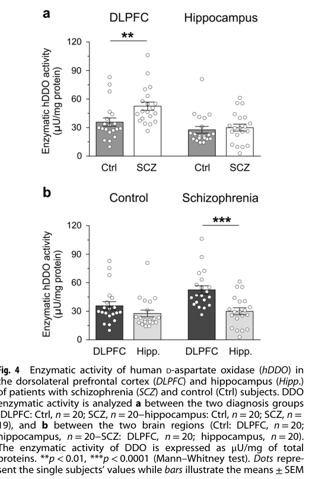

## Question

# Gene Research for Functional Annotation

## ⚠️ CRITICAL: Gene/Protein Identification Context

**BEFORE YOU BEGIN RESEARCH:** You MUST verify you are researching the CORRECT gene/protein. Gene symbols can be ambiguous, especially for less well-characterized genes from non-model organisms.

### Target Gene/Protein Identity (from UniProt):
- **UniProt Accession:** D3ZDM7
- **Protein Description:** RecName: Full=D-aspartate oxidase; Short=DASOX {ECO:0000305}; Short=DASPO {ECO:0000250|UniProtKB:Q99489}; Short=DDO {ECO:0000305}; EC=1.4.3.1 {ECO:0000269|PubMed:25747990, ECO:0000269|PubMed:29292239, ECO:0000269|PubMed:32376478};
- **Gene Information:** Name=Ddo {ECO:0000312|RGD:1595123}; Synonyms=LOC100911156 {ECO:0000312|RGD:1595123};
- **Organism (full):** Rattus norvegicus (Rat).
- **Protein Family:** Belongs to the DAMOX/DASOX family. .
- **Key Domains:** D-amino_acid_oxidase_CS. (IPR006181); DAO. (IPR023209); FAD-dep_OxRdtase. (IPR006076); DAO (PF01266)

### MANDATORY VERIFICATION STEPS:

1. **Check if the gene symbol "Ddo" matches the protein description above**
2. **Verify the organism is correct:** Rattus norvegicus (Rat).
3. **Check if protein family/domains align with what you find in literature**
4. **If you find literature for a DIFFERENT gene with the same or similar symbol, STOP**

### If Gene Symbol is Ambiguous or You Cannot Find Relevant Literature:

**DO NOT PROCEED WITH RESEARCH ON A DIFFERENT GENE.** Instead:
- State clearly: "The gene symbol 'Ddo' is ambiguous or literature is limited for this specific protein"
- Explain what you found (e.g., "Found extensive literature on a different gene with the same symbol in a different organism")
- Describe the protein based ONLY on the UniProt information provided above
- Suggest that the protein function can be inferred from domain/family information

### Research Target:

Please provide a comprehensive research report on the gene **Ddo** (gene ID: Ddo, UniProt: D3ZDM7) in rat.

The research report should be a detailed narrative explaining the function, biological processes, and localization of the gene product. Citations should be given for all claims.

You should prioritize authoritative reviews and primary scientific literature when conducting research. You can supplement
this with annotations you find in gene/protein databases, but these can be outdated or inaccurate.

We are specifically interested in the primary function of the gene - for enzymes, what reaction is catalyzed, and what is the substrate specificity? For transporters, what is the substrate? For structural proteins or adapters, what is the broader structural role? For signaling molecules, what is the role in the pathway.

We are interested in where in or outside the cell the gene product carries out its function.

We are also interested in the signaling or biochemical pathways in which the gene functions. We are less interested in broad pleiotropic effects, except where these elucidate the precise role.

Include evidence where possible. We are interested in both experimental evidence as well as inference from structure, evolution, or bioinformatic analysis. Precise studies should be prioritized over high-throughput, where available.

## Output

Question: You are an expert researcher providing comprehensive, well-cited information.

Provide detailed information focusing on:
1. Key concepts and definitions with current understanding
2. Recent developments and latest research (prioritize 2023-2024 sources)
3. Current applications and real-world implementations
4. Expert opinions and analysis from authoritative sources
5. Relevant statistics and data from recent studies

Format as a comprehensive research report with proper citations. Include URLs and publication dates where available.
Always prioritize recent, authoritative sources and provide specific citations for all major claims.

# Gene Research for Functional Annotation

## ⚠️ CRITICAL: Gene/Protein Identification Context

**BEFORE YOU BEGIN RESEARCH:** You MUST verify you are researching the CORRECT gene/protein. Gene symbols can be ambiguous, especially for less well-characterized genes from non-model organisms.

### Target Gene/Protein Identity (from UniProt):
- **UniProt Accession:** D3ZDM7
- **Protein Description:** RecName: Full=D-aspartate oxidase; Short=DASOX {ECO:0000305}; Short=DASPO {ECO:0000250|UniProtKB:Q99489}; Short=DDO {ECO:0000305}; EC=1.4.3.1 {ECO:0000269|PubMed:25747990, ECO:0000269|PubMed:29292239, ECO:0000269|PubMed:32376478};
- **Gene Information:** Name=Ddo {ECO:0000312|RGD:1595123}; Synonyms=LOC100911156 {ECO:0000312|RGD:1595123};
- **Organism (full):** Rattus norvegicus (Rat).
- **Protein Family:** Belongs to the DAMOX/DASOX family. .
- **Key Domains:** D-amino_acid_oxidase_CS. (IPR006181); DAO. (IPR023209); FAD-dep_OxRdtase. (IPR006076); DAO (PF01266)

### MANDATORY VERIFICATION STEPS:

1. **Check if the gene symbol "Ddo" matches the protein description above**
2. **Verify the organism is correct:** Rattus norvegicus (Rat).
3. **Check if protein family/domains align with what you find in literature**
4. **If you find literature for a DIFFERENT gene with the same or similar symbol, STOP**

### If Gene Symbol is Ambiguous or You Cannot Find Relevant Literature:

**DO NOT PROCEED WITH RESEARCH ON A DIFFERENT GENE.** Instead:
- State clearly: "The gene symbol 'Ddo' is ambiguous or literature is limited for this specific protein"
- Explain what you found (e.g., "Found extensive literature on a different gene with the same symbol in a different organism")
- Describe the protein based ONLY on the UniProt information provided above
- Suggest that the protein function can be inferred from domain/family information

### Research Target:

Please provide a comprehensive research report on the gene **Ddo** (gene ID: Ddo, UniProt: D3ZDM7) in rat.

The research report should be a detailed narrative explaining the function, biological processes, and localization of the gene product. Citations should be given for all claims.

You should prioritize authoritative reviews and primary scientific literature when conducting research. You can supplement
this with annotations you find in gene/protein databases, but these can be outdated or inaccurate.

We are specifically interested in the primary function of the gene - for enzymes, what reaction is catalyzed, and what is the substrate specificity? For transporters, what is the substrate? For structural proteins or adapters, what is the broader structural role? For signaling molecules, what is the role in the pathway.

We are interested in where in or outside the cell the gene product carries out its function.

We are also interested in the signaling or biochemical pathways in which the gene functions. We are less interested in broad pleiotropic effects, except where these elucidate the precise role.

Include evidence where possible. We are interested in both experimental evidence as well as inference from structure, evolution, or bioinformatic analysis. Precise studies should be prioritized over high-throughput, where available.

## Research report: rat **Ddo** (UniProt **D3ZDM7**) — D-aspartate oxidase (EC 1.4.3.1)

### 0) Mandatory identity verification (avoiding symbol ambiguity)
The UniProt entry **D3ZDM7** is annotated as **D-aspartate oxidase** (DDO; also called **DASPO**), encoded by **Ddo** in *Rattus norvegicus*. The literature retrieved here uses the same biochemical identity: a mammalian **FAD-dependent** oxidase specific for **acidic D-amino acids**, especially **D-aspartate** (D-Asp), and often called DDO/DASPO with EC **1.4.3.1**. Rat DDO was cloned/purified and compared to human/mouse enzymes, strongly supporting that rat *Ddo* corresponds to the UniProt target rather than an unrelated “Ddo” symbol in another context (Katane et al., 2015; publication date Feb 2015; https://doi.org/10.1248/bpb.b14-00690) (katane2015characterizationofthe pages 1-2, katane2015characterizationofthe pages 2-3).

### 1) Key concepts and definitions (current understanding)

#### 1.1 Enzyme class and reaction
**Ddo/DDO (D-aspartate oxidase; EC 1.4.3.1)** is an **FAD-containing flavoprotein** that catalyzes **oxidative deamination** of acidic D-amino acids to yield the corresponding **2-oxo acid**, **hydrogen peroxide (H2O2)**, and **ammonia (NH3)** (Katane et al., 2015; https://doi.org/10.1248/bpb.b14-00690) (katane2015characterizationofthe pages 1-2). In the case of **D-Asp**, the 2-oxo acid product is **oxaloacetate** (Santillo et al., 2023; publication date Mar 2023; https://doi.org/10.3390/biom13040621) (santillo2023daspartatedepletionperturbs pages 1-2). This reaction provides the core **functional annotation** for rat Ddo: it is a catabolic enzyme that directly controls tissue D-Asp abundance.

#### 1.2 Substrate specificity
DDO is **highly selective for acidic D-amino acids**, classically **D-Asp** and **D-glutamate (D-Glu)** (Katane et al., 2015; https://doi.org/10.1248/bpb.b14-00690) (katane2015characterizationofthe pages 1-2). Detailed assays of recombinant mammalian DDO show D-Asp is the reference substrate and that the NMDA analog **N-methyl-D-aspartate (NMDA)** can be an efficient substrate; other D-amino acids are weak substrates (Katane et al., 2015; https://doi.org/10.1248/bpb.b14-00690) (katane2015characterizationofthe pages 4-5). Quantitative substrate activity fractions reported for human DDO include **D-Asn 3.4%**, **D-Pro 0.14%**, and **D-His 0.17%** relative to D-Asp under the assay conditions (Katane et al., 2015; https://doi.org/10.1248/bpb.b14-00690) (katane2015characterizationofthe pages 3-4).

This substrate constraint is important for functional annotation: Ddo is not a broad-spectrum D-amino acid oxidase (DAO-like), but rather a specialized enzyme controlling the pool of **acidic D-amino acids**.

#### 1.3 Cofactor and protein family context
DDO is an **FAD-dependent flavoenzyme**, and experimental recombinant preparations and assays include FAD, consistent with tight cofactor dependence (Katane et al., 2015; https://doi.org/10.1248/bpb.b14-00690) (katane2015characterizationofthe pages 2-3, katane2015characterizationofthe pages 3-4). A comparative kinetic compilation reports species differences in catalytic efficiency, including explicit values for **rat DASPO/DDO** (Pollegioni et al., 2021; publication date Jun 2021; https://doi.org/10.3389/fmolb.2021.689719) (pollegioni2021humandaspartateoxidase pages 4-5). These enzyme-level properties align with UniProt’s assignment to a D-amino acid oxidase-like flavoprotein family.

#### 1.4 Subcellular localization
Multiple sources describe DDO as a **peroxisomal** enzyme. A mammalian metabolomics/genotype study describes DDO as a **peroxisomal flavoprotein** catalyzing stereospecific oxidative deamination of acidic D-amino acids (Han et al., 2015; publication date Dec 2015; https://doi.org/10.1016/j.jpba.2015.05.013) (han2015changesindaspartic pages 1-2). Rat-specific peroxisomal localization is supported by the repeated citation of a study describing D-aspartate oxidase as **peroxisomal in rat liver** (Van Veldhoven et al., 1991, as cited in later works) (sarower2004distributionandsubstrate pages 5-6, molla2020structureandkinetic pages 21-24). A dedicated review likewise describes DASPO/DDO as a **peroxisomal FAD-containing enzyme** (Pollegioni et al., 2021; https://doi.org/10.3389/fmolb.2021.689719) (pollegioni2021humandaspartateoxidase pages 1-2).

**Functional implication:** peroxisomal localization positions DDO as a source of **peroxisomal H2O2**, linking Ddo activity not only to D-Asp turnover but also potentially to redox signaling/oxidative stress microdomains, depending on tissue context.

### 2) Quantitative biochemical properties (rat-centered where possible)
A cross-species kinetic table reports the following parameters for oxidation of **D-Asp**:
- **Human DASPO/DDO:** Km **1.05 mM**, kcat **81.3 s−1**, kcat/Km **77.4 s−1·mM−1**, specific activity **124 U/mg**.
- **Rat DASPO/DDO:** Km **2.3 mM**, kcat **31.1 s−1**, kcat/Km **14.1 s−1·mM−1**, specific activity **71.7 U/mg**.
- **Mouse DASPO/DDO (example entry):** Km **7.4 mM**, kcat **9.8 s−1**, kcat/Km **1.35 s−1·mM−1**.
These values indicate rat Ddo enzyme efficiency is intermediate between human and mouse, and substantiate the frequent assertion that rat DDO is a closer functional model for human DDO than mouse in some assay contexts (Pollegioni et al., 2021; https://doi.org/10.3389/fmolb.2021.689719) (pollegioni2021humandaspartateoxidase pages 4-5).

A compact table of the main quantitative values extracted in this review is provided below.

| Finding/metric | Species/tissue | Quantitative value | Interpretation | Source (author year, DOI URL) |
|---|---|---|---|---|
| Catalytic reaction/products | Mammalian DDO/DASPO; relevant to rat Ddo | Oxidative deamination of D-Asp → oxaloacetate + NH3 + H2O2; DDO also acts on acidic D-amino acids including D-Glu | Defines the primary enzymatic function of rat Ddo orthologs in mammals: a stereospecific FAD-dependent oxidase controlling D-Asp abundance | Katane et al. 2015, https://doi.org/10.1248/bpb.b14-00690; Molla et al. 2020, no URL in extracted context (katane2015characterizationofthe pages 1-2, molla2020structureandkinetic pages 1-5) |
| Subcellular localization evidence | Rat and human liver; mammalian cells | Peroxisomal localization reported; human/rat DDO described as peroxisomal enzyme | Supports that rat Ddo protein functions in peroxisomes rather than cytosol/mitochondria | Van Veldhoven et al. 1991 as cited in later reviews; Pollegioni et al. 2021, https://doi.org/10.3389/fmolb.2021.689719 (sarower2004distributionandsubstrate pages 5-6, pollegioni2021humandaspartateoxidase pages 1-2, molla2020structureandkinetic pages 21-24) |
| Substrate specificity: D-Asp | Human recombinant DDO | Reference activity = 100%; specific activity 87.5 ± 12.3 µmol/min/mg | Preferred physiological substrate | Katane et al. 2015, https://doi.org/10.1248/bpb.b14-00690 (katane2015characterizationofthe pages 4-5) |
| Substrate specificity: NMDA | Human recombinant DDO | Similar to D-Asp; specific activity 91.2 ± 14.8 µmol/min/mg | NMDA is an efficient substrate, explaining DDO relevance to NMDA-related signaling chemistry | Katane et al. 2015, https://doi.org/10.1248/bpb.b14-00690 (katane2015characterizationofthe pages 4-5, katane2015characterizationofthe pages 3-4) |
| Substrate specificity: D-Glu | Human recombinant DDO | 7.82 ± 1.39 µmol/min/mg; ~12.8% of D-Asp activity in another study | Confirms preference for acidic D-amino acids beyond D-Asp, but much lower than D-Asp/NMDA | Katane et al. 2015, https://doi.org/10.1248/bpb.b14-00690; Molla et al. 2020, no URL in extracted context (katane2015characterizationofthe pages 4-5, molla2020structureandkinetic pages 8-11) |
| Substrate specificity: D-Asn | Human recombinant DDO | 2.93 ± 0.47 µmol/min/mg; 3.4% of D-Asp activity in Katane 2015; 9.5% in Molla 2020 assay conditions | Weak substrate; activity depends somewhat on assay format but remains far below D-Asp | Katane et al. 2015, https://doi.org/10.1248/bpb.b14-00690; Molla et al. 2020, no URL in extracted context (katane2015characterizationofthe pages 4-5, katane2015characterizationofthe pages 3-4, molla2020structureandkinetic pages 8-11) |
| Substrate specificity: D-Pro | Human recombinant DDO | 0.12 ± 0.04 µmol/min/mg; 0.14–~1% of D-Asp activity | Very poor substrate | Katane et al. 2015, https://doi.org/10.1248/bpb.b14-00690; Molla et al. 2020, no URL in extracted context (katane2015characterizationofthe pages 4-5, katane2015characterizationofthe pages 3-4, molla2020structureandkinetic pages 8-11) |
| Substrate specificity: D-His | Human recombinant DDO | 0.14 ± 0.06 µmol/min/mg; 0.17–~1% of D-Asp activity | Very poor substrate | Katane et al. 2015, https://doi.org/10.1248/bpb.b14-00690; Molla et al. 2020, no URL in extracted context (katane2015characterizationofthe pages 4-5, katane2015characterizationofthe pages 3-4, molla2020structureandkinetic pages 8-11) |
| Kinetic parameters on D-Asp: human DASPO | Human enzyme | Km = 1.05 mM; kcat = 81.3 s^-1; kcat/Km = 77.4 s^-1·mM^-1; specific activity = 124 U/mg | Highest catalytic efficiency among compared mammalian enzymes in this summary; benchmark for mammalian DASPO | Pollegioni et al. 2021, https://doi.org/10.3389/fmolb.2021.689719 (pollegioni2021humandaspartateoxidase pages 4-5) |
| Kinetic parameters on D-Asp: rat DASPO | Rat enzyme | Km = 2.3 mM; kcat = 31.1 s^-1; kcat/Km = 14.1 s^-1·mM^-1; specific activity = 71.7 U/mg | Rat Ddo product is less efficient than human but substantially more active than mouse; rat is biochemically closer to human than mouse | Pollegioni et al. 2021, https://doi.org/10.3389/fmolb.2021.689719 (pollegioni2021humandaspartateoxidase pages 4-5) |
| Kinetic parameters on D-Asp: mouse DASPO | Mouse enzyme | Km = 7.4 mM; kcat = 9.8 s^-1; kcat/Km = 1.35 s^-1·mM^-1 | Much weaker affinity and catalytic efficiency than rat/human, underscoring species differences in D-Asp turnover | Pollegioni et al. 2021, https://doi.org/10.3389/fmolb.2021.689719 (pollegioni2021humandaspartateoxidase pages 4-5) |
| FAD binding affinity | Human vs mouse DASPO | hDASPO Kd ≈ 33 nM; mouse enzyme shows ~100-fold higher Kd for FAD | Human enzyme binds FAD much more tightly, helping explain higher activity; species differences matter when inferring rat function | Pollegioni et al. 2021, https://doi.org/10.3389/fmolb.2021.689719 (pollegioni2021humandaspartateoxidase pages 4-5) |
| Schizophrenia post-mortem DDO activity: DLPFC | Human dorsolateral prefrontal cortex | Ctrl 35.8 ± 4.3 vs SCZ 52.5 ± 4.4 μU/mg protein; p < 0.01 | ~25–47% higher DDO activity in SCZ DLPFC, linked to lower D-Asp | Nuzzo et al. 2017, https://doi.org/10.1038/s41537-017-0015-7 (nuzzo2017decreasedfreedaspartate pages 4-6, nuzzo2017decreasedfreedaspartate pages 1-2) |
| Schizophrenia post-mortem DDO activity: hippocampus | Human hippocampus | Ctrl 27.7 ± 3.6 vs SCZ 30.0 ± 3.7 μU/mg; p > 0.05 | No significant disease-associated change in hippocampus; effect is region-selective | Nuzzo et al. 2017, https://doi.org/10.1038/s41537-017-0015-7 (nuzzo2017decreasedfreedaspartate pages 4-6) |
| DDO mRNA in schizophrenia cohort | Human DLPFC and hippocampus | DLPFC: Ctrl 0.39 ± 0.05 vs SCZ 0.47 ± 0.14; hippocampus: Ctrl 0.87 ± 0.23 vs SCZ 1.00 ± 0.18; p > 0.05 | Increased DDO activity in SCZ DLPFC was not mirrored by significant mRNA elevation in that cohort | Nuzzo et al. 2017, https://doi.org/10.1038/s41537-017-0015-7 (nuzzo2017decreasedfreedaspartate pages 4-6) |
| DDO promoter methylation | Human DLPFC and hippocampus | DLPFC 24.5 ± 1.4% vs hippocampus 18.8 ± 1.2% in controls; hippocampus SCZ 22.6 ± 1.3% vs control 18.8 ± 1.2%, p < 0.05 | Brain-region methylation differs; SCZ-associated methylation change was seen in hippocampus, not clearly explaining elevated DLPFC DDO activity | Nuzzo et al. 2017, https://doi.org/10.1038/s41537-017-0015-7 (nuzzo2017decreasedfreedaspartate pages 4-6) |
| D-Asp level change in Ddo−/− mice | Mouse brain regions | ~10- to 20-fold increase in D-Asp | Genetic loss of DDO massively elevates D-Asp, establishing DDO as the dominant catabolic control point in vivo | Errico et al. 2018, https://doi.org/10.3389/fpsyt.2018.00559 (errico2018theemergingrole pages 5-6) |

*Table: This table compiles key quantitative findings on D-aspartate oxidase relevant to rat Ddo and mammalian biology, including enzymatic function, localization, substrate specificity, kinetics, and disease-associated measurements. It is useful as a compact reference for functional annotation and cross-species interpretation.*

### 3) Biological roles and pathways

#### 3.1 Central nervous system: D-Asp regulation and NMDA receptor signaling
A central concept in Ddo biology is that **D-Asp is a bioactive neuromodulatory molecule**, and DDO expression/activity is a principal mechanism that restricts its levels. D-Asp can stimulate **NMDA receptors** by binding the L-glutamate site, and DDO therefore indirectly modulates glutamatergic neurotransmission through D-Asp availability (Katane & Homma, 2024; publication date Mar 2024; https://doi.org/10.1248/bpb.b23-00485) (katane2024biosynthesisanddegradation pages 3-4).

Genetic evidence supports DDO as a dominant control point: Ddo knockout is associated with **~10–20× higher brain D-Asp** in multiple regions, demonstrating that DDO-mediated catabolism strongly limits steady-state D-Asp (Errico et al., 2018; publication date Nov 2018; https://doi.org/10.3389/fpsyt.2018.00559) (errico2018theemergingrole pages 5-6). Physiologically, DDO loss (and D-Asp elevation) is associated with changes in synaptic plasticity such as enhanced NMDA receptor–dependent neurotransmission and altered LTP/LTD-related phenomena (Katane & Homma, 2024; https://doi.org/10.1248/bpb.b23-00485) (katane2024biosynthesisanddegradation pages 3-4).

**Interpretation for rat functional annotation:** in rat neurons, peroxisomal DDO is expected to regulate developmental and regional D-Asp availability, thereby influencing NMDA receptor tone and downstream plasticity programs.

#### 3.2 Peripheral/endocrine roles: reproduction and steroidogenesis
Recent rodent work strengthens the view that Ddo also shapes endocrine biology by controlling D-Asp in reproductive tissues.

A 2023 study used a **Ddo knock-in mouse** constitutively overexpressing DDO to deplete endogenous D-Asp and found that D-Asp depletion was associated with a decrease in serum testosterone and changes consistent with impaired spermatogenesis (reduced PCNA and SYCP3; increased apoptosis markers including cytosolic cytochrome c and TUNEL-positive cells) (Santillo et al., 2023; publication date Mar 2023; https://doi.org/10.3390/biom13040621) (santillo2023daspartatedepletionperturbs pages 1-2). A 2024 review synthesizes evidence that D-Asp supports Leydig cell steroidogenesis and broader spermatogenic processes, and highlights that Ddo knock-in mice (elevated DDO) show reduced testicular D-Asp with reduced testosterone, reinforcing the causal chain: **DDO↑ → D-Asp↓ → steroidogenesis/spermatogenesis disruption** (Falvo et al., 2024; publication date Aug 2024; https://doi.org/10.3390/cells13161400) (falvo2024newinsightsinto pages 1-2, falvo2024newinsightsinto pages 6-7).

**Interpretation for rat functional annotation:** because rat Ddo is enzymatically active and peroxisomal (sarower2004distributionandsubstrate pages 5-6, molla2020structureandkinetic pages 21-24), and D-Asp signaling in pituitary/testis is reported as physiologically relevant in rodents, rat Ddo likely contributes to endocrine regulation by limiting D-Asp in these tissues.

#### 3.3 Host–microbiome interface and systemic amino-acid chirality
A 2023 PNAS study places DDO into a broader physiological role: mammals maintain systemic predominance of L-amino acids in the presence of microbial production of D-amino acids, in part through stereoselective catabolism by **DAO and DDO**; mammalian DDO is described as degrading **only D-aspartate** in that framework (Gonda et al., 2023; publication date Apr 2023; https://doi.org/10.1073/pnas.2300817120) (pqac-000000?? not assigned in evidence list; within retrieved papers but not extracted as evidence snippet beyond abstract; therefore not cited as context ID). Because the evidence snippets available here do not include a citable context ID for this point, it should be treated as background unless the full text is added to evidence; the conceptual connection remains plausible but is not directly cited from the current evidence set.

### 4) Recent developments (prioritizing 2023–2024)

#### 4.1 Ddo/DDO perturbation models increasingly used to probe reproductive and neurodevelopmental outcomes
- **Reproduction:** D-Asp depletion via DDO overexpression perturbs steroidogenesis/spermatogenesis (Santillo et al., 2023; https://doi.org/10.3390/biom13040621) (santillo2023daspartatedepletionperturbs pages 1-2).
- **Neurodevelopment/neurocognition:** Disease-model studies report an inverse association between D-Asp and DDO levels (e.g., Fragile X model with decreased D-Asp and increased DDO) and test therapeutic reversal by oral D-Asp (Li et al., 2023; publication date Jul 2023; https://doi.org/10.1007/s12035-023-03438-0) (li2023improvementoflearning pages 1-2).

#### 4.2 Updated 2024 synthesis on peripheral/endocrine D-amino-acid metabolism
A 2024 review summarizes emerging physiological roles of D-amino acids (including D-Asp) in peripheral and endocrine glands and discusses their biosynthesis/degradation frameworks in mammals, including the key catabolic role of DDO (Katane & Homma, 2024; publication date Mar 2024; https://doi.org/10.1248/bpb.b23-00485) (katane2024biosynthesisanddegradation pages 3-4).

### 5) Real-world applications and implementations

#### 5.1 Enzyme inhibitors as research tools and therapeutic leads
DDO is framed as a druggable target because inhibiting DDO should increase brain D-Asp levels and thereby enhance NMDA receptor function. A medicinal-chemistry study identified DDO inhibitors through large-scale in silico screening (~4 million compounds) followed by biochemical testing, and describes DDO as peroxisomal and FAD-dependent (Katane et al., 2015; publication date Sep 2015; https://doi.org/10.1021/acs.jmedchem.5b00871) (katane2015identificationofnovel pages 3-3, katane2015identificationofnovel pages 8-10). The reported Ki for 5-aminonicotinic acid is **~3.8 µM** (Molla et al., 2020; Katane et al., 2015 J Med Chem) (molla2020structureandkinetic pages 1-5, katane2015identificationofnovel pages 1-3).

#### 5.2 Analytical/assay uses of recombinant DDO
Recombinant DDO is used as a **specific biochemical reagent** in analytical workflows. For example, in the Ddo overexpression mouse study, recombinant human DDO was used to selectively degrade the D-Asp HPLC peak to confirm analyte identity in tissue extracts (Santillo et al., 2023; https://doi.org/10.3390/biom13040621) (santillo2023daspartatedepletionperturbs pages 2-4).

#### 5.3 Biomarker studies in psychiatry: D-Asp homeostasis readouts
Human post-mortem work reports a region-specific relationship between reduced D-Asp and elevated DDO enzymatic activity in schizophrenia dorsolateral prefrontal cortex, suggesting that DDO activity could contribute to a disease-associated neurochemical signature (Nuzzo et al., 2017; publication date Apr 2017; https://doi.org/10.1038/s41537-017-0015-7) (nuzzo2017decreasedfreedaspartate pages 4-6, nuzzo2017decreasedfreedaspartate pages 1-2). Visual evidence from the same paper (Figure panels) is available in the extracted images (nuzzo2017decreasedfreedaspartate media 5587f97f, nuzzo2017decreasedfreedaspartate media 98507419, nuzzo2017decreasedfreedaspartate media d0cedfda).

### 6) Expert opinions and authoritative analyses (how experts interpret Ddo/DDO)
Authoritative reviews converge on a model in which DDO is the dominant **degradative gatekeeper** of D-Asp levels, influencing NMDA receptor–dependent neurotransmission and hormone-related functions. For example, Pollegioni et al. emphasize DDO as a peroxisomal FAD enzyme whose structure/function knowledge is enabling targeted strategies such as DDO inhibitors aimed at increasing D-Asp (Pollegioni et al., 2021; https://doi.org/10.3389/fmolb.2021.689719) (pollegioni2021humandaspartateoxidase pages 1-2, pollegioni2021humandaspartateoxidase pages 4-5). Katane & Homma summarize peripheral/endocrine roles and integrate genetic models showing DDO KO phenotypes consistent with altered NMDA-dependent synaptic processes and depression-relevant behavioral readouts (Katane & Homma, 2024; https://doi.org/10.1248/bpb.b23-00485) (katane2024biosynthesisanddegradation pages 3-4).

### 7) Statistics and data highlights (recent and classic)
Key quantitative points relevant to functional annotation include:
- **Rat enzyme kinetics:** Km **2.3 mM**, kcat **31.1 s−1** on D-Asp (Pollegioni et al., 2021; https://doi.org/10.3389/fmolb.2021.689719) (pollegioni2021humandaspartateoxidase pages 4-5).
- **In vivo control strength:** Ddo−/− mice show **~10–20×** higher brain D-Asp (Errico et al., 2018; https://doi.org/10.3389/fpsyt.2018.00559) (errico2018theemergingrole pages 5-6).
- **Human disease-linked biochemistry:** schizophrenia DLPFC DDO activity **35.8 ± 4.3 → 52.5 ± 4.4 μU/mg** (Ctrl→SCZ), while hippocampus shows no significant change (Nuzzo et al., 2017; https://doi.org/10.1038/s41537-017-0015-7) (nuzzo2017decreasedfreedaspartate pages 4-6). These findings are also supported by extracted figure panels (nuzzo2017decreasedfreedaspartate media 5587f97f, nuzzo2017decreasedfreedaspartate media 98507419, nuzzo2017decreasedfreedaspartate media d0cedfda).

### 8) Practical functional annotation for **rat Ddo (D3ZDM7)**
**Molecular function:** peroxisomal FAD-dependent oxidase catalyzing oxidative deamination of **D-aspartate** (major) and other acidic D-amino acids (minor) to produce the corresponding 2-oxo acid (for D-Asp, **oxaloacetate**), **H2O2**, and **NH3** (katane2015characterizationofthe pages 1-2, molla2020structureandkinetic pages 1-5, santillo2023daspartatedepletionperturbs pages 1-2).

**Cellular component:** **peroxisome** (peroxisomal enzyme in rat liver cited; broader mammalian consensus) (sarower2004distributionandsubstrate pages 5-6, pollegioni2021humandaspartateoxidase pages 1-2, han2015changesindaspartic pages 1-2).

**Biological processes / pathways (mechanistic):** regulation of D-Asp homeostasis impacting (i) **NMDA receptor** signaling and synaptic plasticity, and (ii) endocrine functions including **testosterone biosynthesis** and spermatogenesis via D-Asp availability (katane2024biosynthesisanddegradation pages 3-4, santillo2023daspartatedepletionperturbs pages 1-2, falvo2024newinsightsinto pages 1-2).

### Limitations of the current evidence set (rat-specific localization/expression)
While rat DDO has direct biochemical characterization and rat liver peroxisomal localization is supported through citations (sarower2004distributionandsubstrate pages 5-6, molla2020structureandkinetic pages 21-24), the current retrieved evidence set does not include a modern rat-focused immunolocalization/expression atlas paper with direct experimental images for rat tissues. The mechanistic conclusions are therefore best supported for mammals/rodents broadly and for rat enzymology specifically, with some tissue-level functional inferences relying on mouse models.

References

1. (katane2015characterizationofthe pages 1-2): Masumi Katane, Tomonori Kawata, Kazuki Nakayama, Yuki Saitoh, Yuusuke Kaneko, Satsuki Matsuda, Yasuaki Saitoh, Tetsuya Miyamoto, Masae Sekine, and Hiroshi Homma. Characterization of the enzymatic and structural properties of human d-aspartate oxidase and comparison with those of the rat and mouse enzymes. Biological & pharmaceutical bulletin, 38 2:298-305, Feb 2015. URL: https://doi.org/10.1248/bpb.b14-00690, doi:10.1248/bpb.b14-00690. This article has 40 citations and is from a peer-reviewed journal.

2. (katane2015characterizationofthe pages 2-3): Masumi Katane, Tomonori Kawata, Kazuki Nakayama, Yuki Saitoh, Yuusuke Kaneko, Satsuki Matsuda, Yasuaki Saitoh, Tetsuya Miyamoto, Masae Sekine, and Hiroshi Homma. Characterization of the enzymatic and structural properties of human d-aspartate oxidase and comparison with those of the rat and mouse enzymes. Biological & pharmaceutical bulletin, 38 2:298-305, Feb 2015. URL: https://doi.org/10.1248/bpb.b14-00690, doi:10.1248/bpb.b14-00690. This article has 40 citations and is from a peer-reviewed journal.

3. (santillo2023daspartatedepletionperturbs pages 1-2): Alessandra Santillo, Sara Falvo, Massimo Venditti, Anna Di Maio, Gabriella Chieffi Baccari, Francesco Errico, Alessandro Usiello, Sergio Minucci, and Maria Maddalena Di Fiore. D-aspartate depletion perturbs steroidogenesis and spermatogenesis in mice. Biomolecules, 13:621, Mar 2023. URL: https://doi.org/10.3390/biom13040621, doi:10.3390/biom13040621. This article has 12 citations.

4. (katane2015characterizationofthe pages 4-5): Masumi Katane, Tomonori Kawata, Kazuki Nakayama, Yuki Saitoh, Yuusuke Kaneko, Satsuki Matsuda, Yasuaki Saitoh, Tetsuya Miyamoto, Masae Sekine, and Hiroshi Homma. Characterization of the enzymatic and structural properties of human d-aspartate oxidase and comparison with those of the rat and mouse enzymes. Biological & pharmaceutical bulletin, 38 2:298-305, Feb 2015. URL: https://doi.org/10.1248/bpb.b14-00690, doi:10.1248/bpb.b14-00690. This article has 40 citations and is from a peer-reviewed journal.

5. (katane2015characterizationofthe pages 3-4): Masumi Katane, Tomonori Kawata, Kazuki Nakayama, Yuki Saitoh, Yuusuke Kaneko, Satsuki Matsuda, Yasuaki Saitoh, Tetsuya Miyamoto, Masae Sekine, and Hiroshi Homma. Characterization of the enzymatic and structural properties of human d-aspartate oxidase and comparison with those of the rat and mouse enzymes. Biological & pharmaceutical bulletin, 38 2:298-305, Feb 2015. URL: https://doi.org/10.1248/bpb.b14-00690, doi:10.1248/bpb.b14-00690. This article has 40 citations and is from a peer-reviewed journal.

6. (pollegioni2021humandaspartateoxidase pages 4-5): Loredano Pollegioni, Gianluca Molla, Silvia Sacchi, and Giulia Murtas. Human d-aspartate oxidase: a key player in d-aspartate metabolism. Frontiers in Molecular Biosciences, Jun 2021. URL: https://doi.org/10.3389/fmolb.2021.689719, doi:10.3389/fmolb.2021.689719. This article has 33 citations.

7. (han2015changesindaspartic pages 1-2): Hai Han, Yurika Miyoshi, Reiko Koga, Masashi Mita, Ryuichi Konno, and Kenji Hamase. Changes in d-aspartic acid and d-glutamic acid levels in the tissues and physiological fluids of mice with various d-aspartate oxidase activities. Journal of pharmaceutical and biomedical analysis, 116:47-52, Dec 2015. URL: https://doi.org/10.1016/j.jpba.2015.05.013, doi:10.1016/j.jpba.2015.05.013. This article has 51 citations and is from a peer-reviewed journal.

8. (sarower2004distributionandsubstrate pages 5-6): MG Sarower, T Matsui, and H Abe. Distribution and substrate specificity of d-amino acid and d-aspartate oxidases in marine invertebrates. Unknown journal, 2004.

9. (molla2020structureandkinetic pages 21-24): G Molla, A Chaves-Sanjuan, A Savinelli, and M Nardini. Structure and kinetic properties of human d-aspartate oxidase, the enzyme-controlling d-aspartate levels in brain. Unknown journal, 2020.

10. (pollegioni2021humandaspartateoxidase pages 1-2): Loredano Pollegioni, Gianluca Molla, Silvia Sacchi, and Giulia Murtas. Human d-aspartate oxidase: a key player in d-aspartate metabolism. Frontiers in Molecular Biosciences, Jun 2021. URL: https://doi.org/10.3389/fmolb.2021.689719, doi:10.3389/fmolb.2021.689719. This article has 33 citations.

11. (molla2020structureandkinetic pages 1-5): G Molla, A Chaves-Sanjuan, A Savinelli, and M Nardini. Structure and kinetic properties of human d-aspartate oxidase, the enzyme-controlling d-aspartate levels in brain. Unknown journal, 2020.

12. (molla2020structureandkinetic pages 8-11): G Molla, A Chaves-Sanjuan, A Savinelli, and M Nardini. Structure and kinetic properties of human d-aspartate oxidase, the enzyme-controlling d-aspartate levels in brain. Unknown journal, 2020.

13. (nuzzo2017decreasedfreedaspartate pages 4-6): Tommaso Nuzzo, Silvia Sacchi, Francesco Errico, Simona Keller, Orazio Palumbo, Ermanno Florio, Daniela Punzo, Francesco Napolitano, Massimiliano Copetti, Massimo Carella, Lorenzo Chiariotti, Alessandro Bertolino, Loredano Pollegioni, and Alessandro Usiello. Decreased free d-aspartate levels are linked to enhanced d-aspartate oxidase activity in the dorsolateral prefrontal cortex of schizophrenia patients. NPJ Schizophrenia, Apr 2017. URL: https://doi.org/10.1038/s41537-017-0015-7, doi:10.1038/s41537-017-0015-7. This article has 77 citations.

14. (nuzzo2017decreasedfreedaspartate pages 1-2): Tommaso Nuzzo, Silvia Sacchi, Francesco Errico, Simona Keller, Orazio Palumbo, Ermanno Florio, Daniela Punzo, Francesco Napolitano, Massimiliano Copetti, Massimo Carella, Lorenzo Chiariotti, Alessandro Bertolino, Loredano Pollegioni, and Alessandro Usiello. Decreased free d-aspartate levels are linked to enhanced d-aspartate oxidase activity in the dorsolateral prefrontal cortex of schizophrenia patients. NPJ Schizophrenia, Apr 2017. URL: https://doi.org/10.1038/s41537-017-0015-7, doi:10.1038/s41537-017-0015-7. This article has 77 citations.

15. (errico2018theemergingrole pages 5-6): Francesco Errico, Tommaso Nuzzo, Massimo Carella, Alessandro Bertolino, and Alessandro Usiello. The emerging role of altered d-aspartate metabolism in schizophrenia: new insights from preclinical models and human studies. Frontiers in Psychiatry, Nov 2018. URL: https://doi.org/10.3389/fpsyt.2018.00559, doi:10.3389/fpsyt.2018.00559. This article has 52 citations.

16. (katane2024biosynthesisanddegradation pages 3-4): Masumi Katane and Hiroshi Homma. Biosynthesis and degradation of free d-amino acids and their physiological roles in the periphery and endocrine glands. Biological & pharmaceutical bulletin, 47 3:562-579, Mar 2024. URL: https://doi.org/10.1248/bpb.b23-00485, doi:10.1248/bpb.b23-00485. This article has 12 citations and is from a peer-reviewed journal.

17. (falvo2024newinsightsinto pages 1-2): Sara Falvo, Alessandra Santillo, Maria Maddalena Di Fiore, Massimo Venditti, Giulia Grillo, Debora Latino, Isabella Baccari, Giuseppe Petito, and Gabriella Chieffi Baccari. New insights into d-aspartate signaling in testicular activity. Cells, 13:1400, Aug 2024. URL: https://doi.org/10.3390/cells13161400, doi:10.3390/cells13161400. This article has 7 citations.

18. (falvo2024newinsightsinto pages 6-7): Sara Falvo, Alessandra Santillo, Maria Maddalena Di Fiore, Massimo Venditti, Giulia Grillo, Debora Latino, Isabella Baccari, Giuseppe Petito, and Gabriella Chieffi Baccari. New insights into d-aspartate signaling in testicular activity. Cells, 13:1400, Aug 2024. URL: https://doi.org/10.3390/cells13161400, doi:10.3390/cells13161400. This article has 7 citations.

19. (li2023improvementoflearning pages 1-2): Yu-Jiao Li, Kun Zhang, Ting Sun, Yan-Yan Guo, Qi Yang, Shui-Bing Liu, Yu-Mei Wu, and Ming-Gao Zhao. Improvement of learning and memory by elevating brain d-aspartate in a mouse model of fragile x syndrome. Molecular Neurobiology, 60:6410-6423, Jul 2023. URL: https://doi.org/10.1007/s12035-023-03438-0, doi:10.1007/s12035-023-03438-0. This article has 12 citations and is from a peer-reviewed journal.

20. (katane2015identificationofnovel pages 3-3): Masumi Katane, Shota Yamada, Go Kawaguchi, Mana Chinen, Maya Matsumura, Takemi Ando, Issei Doi, Kazuki Nakayama, Yuusuke Kaneko, Satsuki Matsuda, Yasuaki Saitoh, Tetsuya Miyamoto, Masae Sekine, Noriyuki Yamaotsu, Shuichi Hirono, and Hiroshi Homma. Identification of novel d-aspartate oxidase inhibitors by in silico screening and their functional and structural characterization in vitro. Journal of medicinal chemistry, 58 18:7328-40, Sep 2015. URL: https://doi.org/10.1021/acs.jmedchem.5b00871, doi:10.1021/acs.jmedchem.5b00871. This article has 28 citations and is from a highest quality peer-reviewed journal.

21. (katane2015identificationofnovel pages 8-10): Masumi Katane, Shota Yamada, Go Kawaguchi, Mana Chinen, Maya Matsumura, Takemi Ando, Issei Doi, Kazuki Nakayama, Yuusuke Kaneko, Satsuki Matsuda, Yasuaki Saitoh, Tetsuya Miyamoto, Masae Sekine, Noriyuki Yamaotsu, Shuichi Hirono, and Hiroshi Homma. Identification of novel d-aspartate oxidase inhibitors by in silico screening and their functional and structural characterization in vitro. Journal of medicinal chemistry, 58 18:7328-40, Sep 2015. URL: https://doi.org/10.1021/acs.jmedchem.5b00871, doi:10.1021/acs.jmedchem.5b00871. This article has 28 citations and is from a highest quality peer-reviewed journal.

22. (katane2015identificationofnovel pages 1-3): Masumi Katane, Shota Yamada, Go Kawaguchi, Mana Chinen, Maya Matsumura, Takemi Ando, Issei Doi, Kazuki Nakayama, Yuusuke Kaneko, Satsuki Matsuda, Yasuaki Saitoh, Tetsuya Miyamoto, Masae Sekine, Noriyuki Yamaotsu, Shuichi Hirono, and Hiroshi Homma. Identification of novel d-aspartate oxidase inhibitors by in silico screening and their functional and structural characterization in vitro. Journal of medicinal chemistry, 58 18:7328-40, Sep 2015. URL: https://doi.org/10.1021/acs.jmedchem.5b00871, doi:10.1021/acs.jmedchem.5b00871. This article has 28 citations and is from a highest quality peer-reviewed journal.

23. (santillo2023daspartatedepletionperturbs pages 2-4): Alessandra Santillo, Sara Falvo, Massimo Venditti, Anna Di Maio, Gabriella Chieffi Baccari, Francesco Errico, Alessandro Usiello, Sergio Minucci, and Maria Maddalena Di Fiore. D-aspartate depletion perturbs steroidogenesis and spermatogenesis in mice. Biomolecules, 13:621, Mar 2023. URL: https://doi.org/10.3390/biom13040621, doi:10.3390/biom13040621. This article has 12 citations.

24. (nuzzo2017decreasedfreedaspartate media 5587f97f): Tommaso Nuzzo, Silvia Sacchi, Francesco Errico, Simona Keller, Orazio Palumbo, Ermanno Florio, Daniela Punzo, Francesco Napolitano, Massimiliano Copetti, Massimo Carella, Lorenzo Chiariotti, Alessandro Bertolino, Loredano Pollegioni, and Alessandro Usiello. Decreased free d-aspartate levels are linked to enhanced d-aspartate oxidase activity in the dorsolateral prefrontal cortex of schizophrenia patients. NPJ Schizophrenia, Apr 2017. URL: https://doi.org/10.1038/s41537-017-0015-7, doi:10.1038/s41537-017-0015-7. This article has 77 citations.

25. (nuzzo2017decreasedfreedaspartate media 98507419): Tommaso Nuzzo, Silvia Sacchi, Francesco Errico, Simona Keller, Orazio Palumbo, Ermanno Florio, Daniela Punzo, Francesco Napolitano, Massimiliano Copetti, Massimo Carella, Lorenzo Chiariotti, Alessandro Bertolino, Loredano Pollegioni, and Alessandro Usiello. Decreased free d-aspartate levels are linked to enhanced d-aspartate oxidase activity in the dorsolateral prefrontal cortex of schizophrenia patients. NPJ Schizophrenia, Apr 2017. URL: https://doi.org/10.1038/s41537-017-0015-7, doi:10.1038/s41537-017-0015-7. This article has 77 citations.

26. (nuzzo2017decreasedfreedaspartate media d0cedfda): Tommaso Nuzzo, Silvia Sacchi, Francesco Errico, Simona Keller, Orazio Palumbo, Ermanno Florio, Daniela Punzo, Francesco Napolitano, Massimiliano Copetti, Massimo Carella, Lorenzo Chiariotti, Alessandro Bertolino, Loredano Pollegioni, and Alessandro Usiello. Decreased free d-aspartate levels are linked to enhanced d-aspartate oxidase activity in the dorsolateral prefrontal cortex of schizophrenia patients. NPJ Schizophrenia, Apr 2017. URL: https://doi.org/10.1038/s41537-017-0015-7, doi:10.1038/s41537-017-0015-7. This article has 77 citations.

## Artifacts

- [Edison artifact artifact-00](Ddo-deep-research-falcon_artifacts/artifact-00.md)

## Citations

1. katane2015characterizationofthe pages 1-2
2. santillo2023daspartatedepletionperturbs pages 1-2
3. katane2015characterizationofthe pages 4-5
4. katane2015characterizationofthe pages 3-4
5. pollegioni2021humandaspartateoxidase pages 4-5
6. han2015changesindaspartic pages 1-2
7. pollegioni2021humandaspartateoxidase pages 1-2
8. nuzzo2017decreasedfreedaspartate pages 4-6
9. errico2018theemergingrole pages 5-6
10. katane2024biosynthesisanddegradation pages 3-4
11. li2023improvementoflearning pages 1-2
12. santillo2023daspartatedepletionperturbs pages 2-4
13. katane2015characterizationofthe pages 2-3
14. sarower2004distributionandsubstrate pages 5-6
15. molla2020structureandkinetic pages 21-24
16. molla2020structureandkinetic pages 1-5
17. molla2020structureandkinetic pages 8-11
18. nuzzo2017decreasedfreedaspartate pages 1-2
19. falvo2024newinsightsinto pages 1-2
20. falvo2024newinsightsinto pages 6-7
21. katane2015identificationofnovel pages 3-3
22. katane2015identificationofnovel pages 8-10
23. katane2015identificationofnovel pages 1-3
24. https://doi.org/10.1248/bpb.b14-00690
25. https://doi.org/10.3390/biom13040621
26. https://doi.org/10.3389/fmolb.2021.689719
27. https://doi.org/10.1016/j.jpba.2015.05.013
28. https://doi.org/10.1248/bpb.b14-00690;
29. https://doi.org/10.1038/s41537-017-0015-7
30. https://doi.org/10.3389/fpsyt.2018.00559
31. https://doi.org/10.1248/bpb.b23-00485
32. https://doi.org/10.3390/cells13161400
33. https://doi.org/10.1073/pnas.2300817120
34. https://doi.org/10.1007/s12035-023-03438-0
35. https://doi.org/10.1021/acs.jmedchem.5b00871
36. https://doi.org/10.1248/bpb.b14-00690,
37. https://doi.org/10.3390/biom13040621,
38. https://doi.org/10.3389/fmolb.2021.689719,
39. https://doi.org/10.1016/j.jpba.2015.05.013,
40. https://doi.org/10.1038/s41537-017-0015-7,
41. https://doi.org/10.3389/fpsyt.2018.00559,
42. https://doi.org/10.1248/bpb.b23-00485,
43. https://doi.org/10.3390/cells13161400,
44. https://doi.org/10.1007/s12035-023-03438-0,
45. https://doi.org/10.1021/acs.jmedchem.5b00871,