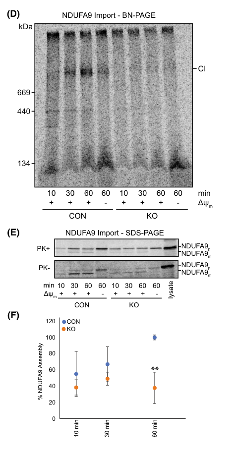

## Question

# Gene Research for Functional Annotation

## ⚠️ CRITICAL: Gene/Protein Identification Context

**BEFORE YOU BEGIN RESEARCH:** You MUST verify you are researching the CORRECT gene/protein. Gene symbols can be ambiguous, especially for less well-characterized genes from non-model organisms.

### Target Gene/Protein Identity (from UniProt):
- **UniProt Accession:** P14604
- **Protein Description:** RecName: Full=Enoyl-CoA hydratase, mitochondrial {ECO:0000305}; Short=mECH {ECO:0000303|PubMed:7883013}; Short=mECH1 {ECO:0000303|PubMed:7883013}; EC=4.2.1.17 {ECO:0000269|PubMed:10074351, ECO:0000269|PubMed:7883013}; EC=5.3.3.8 {ECO:0000269|PubMed:10074351}; AltName: Full=Enoyl-CoA hydratase 1; Short=ECHS1; AltName: Full=Short-chain enoyl-CoA hydratase; Short=SCEH; Flags: Precursor;
- **Gene Information:** Name=Echs1 {ECO:0000312|RGD:69330};
- **Organism (full):** Rattus norvegicus (Rat).
- **Protein Family:** Belongs to the enoyl-CoA hydratase/isomerase family.
- **Key Domains:** ClpP/crotonase-like_dom_sf. (IPR029045); Enoyl-CoA_hyd/isom_CS. (IPR018376); Enoyl-CoA_hydra/iso. (IPR001753); Enoyl-CoA_hydra_C. (IPR014748); ECH_1 (PF00378)

### MANDATORY VERIFICATION STEPS:

1. **Check if the gene symbol "Echs1" matches the protein description above**
2. **Verify the organism is correct:** Rattus norvegicus (Rat).
3. **Check if protein family/domains align with what you find in literature**
4. **If you find literature for a DIFFERENT gene with the same or similar symbol, STOP**

### If Gene Symbol is Ambiguous or You Cannot Find Relevant Literature:

**DO NOT PROCEED WITH RESEARCH ON A DIFFERENT GENE.** Instead:
- State clearly: "The gene symbol 'Echs1' is ambiguous or literature is limited for this specific protein"
- Explain what you found (e.g., "Found extensive literature on a different gene with the same symbol in a different organism")
- Describe the protein based ONLY on the UniProt information provided above
- Suggest that the protein function can be inferred from domain/family information

### Research Target:

Please provide a comprehensive research report on the gene **Echs1** (gene ID: Echs1, UniProt: P14604) in rat.

The research report should be a detailed narrative explaining the function, biological processes, and localization of the gene product. Citations should be given for all claims.

You should prioritize authoritative reviews and primary scientific literature when conducting research. You can supplement
this with annotations you find in gene/protein databases, but these can be outdated or inaccurate.

We are specifically interested in the primary function of the gene - for enzymes, what reaction is catalyzed, and what is the substrate specificity? For transporters, what is the substrate? For structural proteins or adapters, what is the broader structural role? For signaling molecules, what is the role in the pathway.

We are interested in where in or outside the cell the gene product carries out its function.

We are also interested in the signaling or biochemical pathways in which the gene functions. We are less interested in broad pleiotropic effects, except where these elucidate the precise role.

Include evidence where possible. We are interested in both experimental evidence as well as inference from structure, evolution, or bioinformatic analysis. Precise studies should be prioritized over high-throughput, where available.

## Output

Question: You are an expert researcher providing comprehensive, well-cited information.

Provide detailed information focusing on:
1. Key concepts and definitions with current understanding
2. Recent developments and latest research (prioritize 2023-2024 sources)
3. Current applications and real-world implementations
4. Expert opinions and analysis from authoritative sources
5. Relevant statistics and data from recent studies

Format as a comprehensive research report with proper citations. Include URLs and publication dates where available.
Always prioritize recent, authoritative sources and provide specific citations for all major claims.

# Gene Research for Functional Annotation

## ⚠️ CRITICAL: Gene/Protein Identification Context

**BEFORE YOU BEGIN RESEARCH:** You MUST verify you are researching the CORRECT gene/protein. Gene symbols can be ambiguous, especially for less well-characterized genes from non-model organisms.

### Target Gene/Protein Identity (from UniProt):
- **UniProt Accession:** P14604
- **Protein Description:** RecName: Full=Enoyl-CoA hydratase, mitochondrial {ECO:0000305}; Short=mECH {ECO:0000303|PubMed:7883013}; Short=mECH1 {ECO:0000303|PubMed:7883013}; EC=4.2.1.17 {ECO:0000269|PubMed:10074351, ECO:0000269|PubMed:7883013}; EC=5.3.3.8 {ECO:0000269|PubMed:10074351}; AltName: Full=Enoyl-CoA hydratase 1; Short=ECHS1; AltName: Full=Short-chain enoyl-CoA hydratase; Short=SCEH; Flags: Precursor;
- **Gene Information:** Name=Echs1 {ECO:0000312|RGD:69330};
- **Organism (full):** Rattus norvegicus (Rat).
- **Protein Family:** Belongs to the enoyl-CoA hydratase/isomerase family.
- **Key Domains:** ClpP/crotonase-like_dom_sf. (IPR029045); Enoyl-CoA_hyd/isom_CS. (IPR018376); Enoyl-CoA_hydra/iso. (IPR001753); Enoyl-CoA_hydra_C. (IPR014748); ECH_1 (PF00378)

### MANDATORY VERIFICATION STEPS:

1. **Check if the gene symbol "Echs1" matches the protein description above**
2. **Verify the organism is correct:** Rattus norvegicus (Rat).
3. **Check if protein family/domains align with what you find in literature**
4. **If you find literature for a DIFFERENT gene with the same or similar symbol, STOP**

### If Gene Symbol is Ambiguous or You Cannot Find Relevant Literature:

**DO NOT PROCEED WITH RESEARCH ON A DIFFERENT GENE.** Instead:
- State clearly: "The gene symbol 'Echs1' is ambiguous or literature is limited for this specific protein"
- Explain what you found (e.g., "Found extensive literature on a different gene with the same symbol in a different organism")
- Describe the protein based ONLY on the UniProt information provided above
- Suggest that the protein function can be inferred from domain/family information

### Research Target:

Please provide a comprehensive research report on the gene **Echs1** (gene ID: Echs1, UniProt: P14604) in rat.

The research report should be a detailed narrative explaining the function, biological processes, and localization of the gene product. Citations should be given for all claims.

You should prioritize authoritative reviews and primary scientific literature when conducting research. You can supplement
this with annotations you find in gene/protein databases, but these can be outdated or inaccurate.

We are specifically interested in the primary function of the gene - for enzymes, what reaction is catalyzed, and what is the substrate specificity? For transporters, what is the substrate? For structural proteins or adapters, what is the broader structural role? For signaling molecules, what is the role in the pathway.

We are interested in where in or outside the cell the gene product carries out its function.

We are also interested in the signaling or biochemical pathways in which the gene functions. We are less interested in broad pleiotropic effects, except where these elucidate the precise role.

Include evidence where possible. We are interested in both experimental evidence as well as inference from structure, evolution, or bioinformatic analysis. Precise studies should be prioritized over high-throughput, where available.

## Research Report: Functional Annotation of rat **Echs1** (UniProt **P14604**) — mitochondrial enoyl‑CoA hydratase (ECHS1/SCEH)

### 0) Target verification (critical identity check)
The UniProt accession **P14604** (Rattus norvegicus) corresponds to **mitochondrial enoyl‑CoA hydratase, short chain 1**, also called **ECHS1**, **SCEH**, or **crotonase**—a mitochondrial matrix enzyme in the enoyl‑CoA hydratase/isomerase (crotonase) family. The retrieved primary and review literature consistently defines ECHS1/SCEH as a mitochondrial short‑chain enoyl‑CoA hydratase catalyzing hydration of trans‑2‑enoyl‑CoAs and participating in **mitochondrial fatty‑acid β‑oxidation** and **branched‑chain amino acid (especially valine) catabolism**, aligning with the UniProt description provided. Rat‑specific biochemical/structural characterization is explicitly referenced in the literature (rat liver purified enzyme activity; rat liver mitochondrial structure). (ferdinandusse2015clinicalandbiochemical pages 1-3, haack2015deficiencyofechs1 pages 1-2, su2025structuralandbiochemical pages 1-2)

### 1) Key concepts and definitions (current understanding)

#### 1.1 Enzymatic function (primary catalytic activity)
ECHS1/SCEH catalyzes the **reversible hydration of trans‑2‑enoyl‑CoA thioesters to 3‑hydroxyacyl‑CoA (3(S)‑hydroxyacyl‑CoA)**—the canonical short‑chain enoyl‑CoA hydratase reaction (EC **4.2.1.17**). This hydration is the **second step of mitochondrial fatty‑acid β‑oxidation** for short‑chain enoyl‑CoA intermediates. (ferdinandusse2015clinicalandbiochemical pages 1-3, sharpe2018mitochondrialfattyacid pages 1-3)

#### 1.2 Substrate specificity (what substrates does it act on?)
ECHS1 has **broad short‑chain substrate specificity**, with highest activity commonly reported toward **crotonyl‑CoA** (C4:1‑CoA). It also acts on **branched‑chain and reactive intermediates** in amino‑acid catabolism, notably in the **valine pathway**: hydration of **methacrylyl‑CoA** and conversion of **acryloyl‑CoA** to 3‑hydroxypropionyl‑CoA are highlighted in mechanistic summaries. Importantly for *rat* identity, rat‑liver purified enzyme activity on **methacrylyl‑CoA** is specifically cited in clinical/biochemical work interpreting valine‑pathway defects. (ferdinandusse2015clinicalandbiochemical pages 1-3, su2025structuralandbiochemical pages 1-2)

#### 1.3 Pathway placement
- **Mitochondrial fatty‑acid β‑oxidation (FAO):** ECHS1 performs the hydration step in the β‑oxidation spiral within mitochondria, contributing to generation of acetyl‑CoA and reduced cofactors that feed the TCA cycle and OXPHOS. (sharpe2018mitochondrialfattyacid pages 1-3)
- **Valine catabolism (and other BCAA pathways):** Multiple lines of evidence suggest ECHS1 is particularly critical for **valine degradation**, where failure to process methacrylyl‑CoA/acryloyl‑CoA leads to accumulation of reactive metabolites and downstream cellular injury. (ferdinandusse2015clinicalandbiochemical pages 1-3, haack2015deficiencyofechs1 pages 1-2)

#### 1.4 Subcellular localization and protein maturation
ECHS1 is described as a **mitochondrial matrix enzyme**. It is synthesized as a **precursor** and processed upon mitochondrial import to the mature enzyme. (haack2015deficiencyofechs1 pages 1-2, burginUnknownyearlossofmitochondriala pages 2-3)

#### 1.5 Structure and catalytic mechanism (family/domain‑based inference with modern structural data)
ECHS1 forms a **homohexamer** (six identical subunits), a hallmark of crotonase‑family enzymes. Structural work explicitly references a **rat liver mitochondrial ECHS1** structure (with acetoacetyl‑CoA) showing hexameric assembly, and identifies catalytic residues (e.g., glutamates) important for proton transfer/water activation during hydration. (su2025structuralandbiochemical pages 1-2)

| Aspect | Current understanding | Key evidence (include study, year, and what it shows) | Notes/Applications |
|---|---|---|---|
| Target identity / verification | Rat **Echs1** corresponding to UniProt **P14604** matches **mitochondrial enoyl-CoA hydratase / short-chain enoyl-CoA hydratase (ECHS1, SCEH, crotonase)**, a member of the enoyl-CoA hydratase/isomerase family. The literature on ECHS1 in mammals is concordant with this annotation. | **Ferdinandusse et al., 2015** describe ECHS1/SCEH/crotonase as the enzyme catalyzing hydration of 2-trans-enoyl-CoAs in mitochondria and cite prior **rat liver** enzymology for substrate activity; **Haack et al., 2015** define ECHS1 as a mitochondrial matrix enzyme involved in fatty-acid and valine oxidation; **Sharpe & McKenzie, 2018** review ECHS1 as the mitochondrial FAO hydratase. (ferdinandusse2015clinicalandbiochemical pages 1-3, haack2015deficiencyofechs1 pages 1-2, sharpe2018mitochondrialfattyacid pages 1-3) | Supports that rat P14604 is the same functional ortholog discussed across mammalian biochemical and disease literature. |
| Enzymatic reaction | Primary reaction: **hydration of 2-trans-enoyl-CoA to 3(S)-hydroxyacyl-CoA**; this is the canonical **EC 4.2.1.17** activity in mitochondrial β-oxidation. UniProt also lists **EC 5.3.3.8**; the broader literature retrieved here mainly supports the hydratase reaction, with isomerase-related annotation not directly emphasized in the cited texts. | **Ferdinandusse et al., 2015** explicitly state that SCEH/ECHS1 catalyzes hydration of 2-trans-enoyl-CoAs to 3(S)-hydroxy-acyl-CoAs; **Su et al., 2025** describe the reversible hydration of trans-2-enoyl-CoA to 3-hydroxyacyl-CoA and define catalytic residues. (ferdinandusse2015clinicalandbiochemical pages 1-3, su2025structuralandbiochemical pages 1-2) | Core reaction for functional annotation; EC 5.3.3.8 can be noted as UniProt-supported, but direct support in the gathered literature is stronger for EC 4.2.1.17. |
| Substrate range / specificity | ECHS1 has **broad short-chain substrate specificity**, with strongest activity reported for **crotonyl-CoA** and activity on **short-chain enoyl-CoAs (about C4–C6; broader up to C10 in some reports)**. It also acts on branched-chain intermediates including **methacrylyl-CoA** and **acryloyl-CoA** in amino-acid catabolism. | **Ferdinandusse et al., 2015** report broad specificity with greatest activity toward **crotonyl-CoA** and cite direct rat liver activity on **methacrylyl-CoA**; **Su et al., 2025** note highest activity toward crotonyl-CoA and activity on **methacrylyl-CoA** and **acryloyl-CoA**; **Burgin et al., 2023/unknown-year excerpt** describe hydration of short-chain **C4–C6** enoyl-CoA esters. (ferdinandusse2015clinicalandbiochemical pages 1-3, su2025structuralandbiochemical pages 1-2, burginUnknownyearlossofmitochondriala pages 2-3) | Important for distinguishing ECHS1 from long-chain hydratases and for explaining why valine-derived metabolites accumulate in deficiency. |
| Pathway role: mitochondrial fatty-acid β-oxidation | ECHS1 functions in the **second step of mitochondrial FAO**, hydrating short-chain enoyl-CoA intermediates and linking FAO flux to acetyl-CoA production, TCA cycle input, and respiratory metabolism. | **Sharpe & McKenzie, 2018** place ECHS1 in the hydration step of mitochondrial FAO; **Haack et al., 2015** and **Ferdinandusse et al., 2015** support a defect in short-chain fatty-acid oxidation when ECHS1 is deficient; **Burgin et al., 2023** show FAO pathway disruption in ECHS1 knockout cells. (sharpe2018mitochondrialfattyacid pages 1-3, haack2015deficiencyofechs1 pages 1-2, ferdinandusse2015clinicalandbiochemical pages 1-3, burgin2023lossofmitochondrial pages 1-1) | Relevant to liver, heart, muscle, and other tissues dependent on mitochondrial fatty-acid oxidation. |
| Pathway role: valine catabolism | ECHS1 is particularly important in **valine degradation**, where it detoxifies/reacts with reactive intermediates such as **methacrylyl-CoA** and **acryloyl-CoA**. Current disease-oriented literature suggests this valine pathway role is especially important to pathogenesis. | **Ferdinandusse et al., 2015** conclude ECHS1 appears especially crucial in **valine metabolism** and document deficient hydratase activity toward valine-pathway substrates; **Haack et al., 2015** report elevated urinary **2-methyl-2,3-dihydroxybutyrate** indicating impaired valine oxidation; **Su et al., 2025** also describes activity on methacrylyl-CoA and acryloyl-CoA. (ferdinandusse2015clinicalandbiochemical pages 1-3, haack2015deficiencyofechs1 pages 1-2, su2025structuralandbiochemical pages 1-2) | Explains why ECHS1 deficiency clinically resembles a mitochondrial encephalopathy more than a classic isolated FAO defect. |
| Subcellular localization / maturation | ECHS1 is a **mitochondrial matrix** enzyme synthesized as a **precursor** that undergoes mitochondrial import/processing to a mature enzyme. | **Haack et al., 2015** explicitly describe ECHS1 as a **mitochondrial matrix enzyme**; **Burgin excerpt** reports a ~290 aa precursor processed to a mature ~28.3 kDa mitochondrial form; nutrient-regulation work also links acetylation to altered mitochondrial translocation. (haack2015deficiencyofechs1 pages 1-2, burginUnknownyearlossofmitochondriala pages 2-3) | Matches UniProt “precursor” annotation for rat P14604 and supports matrix localization in annotation pipelines. |
| Structure / catalytic mechanism | ECHS1 forms a **homohexamer** (often described as a dimer of trimers). Structural work on **rat liver mitochondrial ECHS1** supports this quaternary organization and identifies active-site residues involved in catalysis/substrate recognition. | **Su et al., 2025** cite the **rat liver mitochondrial ECHS1** structure with acetoacetyl-CoA and describe a **hexameric assembly** of six identical subunits; the same study identifies catalytic residues including **E144** and **E164** important for proton transfer/water activation. (su2025structuralandbiochemical pages 1-2) | Structural insight helps interpret pathogenic variants and substrate preference. |
| 2023 OXPHOS link | Beyond its direct metabolic role, ECHS1 loss can destabilize respiratory-chain organization, especially **complex I** and higher-order supercomplexes. In a 2023 model, **complex I assembly was reduced to 37.9 ± 19.3% of control at 60 min**. | **Burgin et al., 2023** show reduced OXPHOS complex steady-state levels and supercomplex defects in ECHS1 knockout cells/patient fibroblasts; Figure 6 quantification reports **NDUFA9 assembly into mature complex I at 37.9 ± 19.3% of control after 60 min** in ECHS1 KO mitochondria. (burgin2023lossofmitochondrial pages 1-1, burgin2023lossofmitochondrial pages 10-11, burgin2023lossofmitochondrial pages 12-13, burgin2023lossofmitochondrial media 35d24d8c) | Important for interpreting Leigh-like disease mechanisms and for understanding why some ECHS1-deficient cells show secondary respiratory-chain defects. |
| Disease association | Loss of ECHS1 causes **ECHS1 deficiency**, a mitochondrial encephalopathy often presenting with **Leigh or Leigh-like syndrome**, lactic acidosis, neurologic dysfunction, and sometimes cardiomyopathy/cardiac involvement. | **Haack et al., 2015** define ECHS1 deficiency as a mitochondrial encephalopathy with cardiac involvement; **Ferdinandusse et al., 2015** and **Sharpe & McKenzie, 2018** summarize severe neuro-metabolic disease linked to biallelic ECHS1 mutations. (haack2015deficiencyofechs1 pages 1-2, ferdinandusse2015clinicalandbiochemical pages 1-3, sharpe2018mitochondrialfattyacid pages 1-3) | Real-world relevance: genetic diagnosis, metabolic workup, and mechanistic interpretation of Leigh-like presentations. |
| Biomarkers / metabolic signatures | Useful diagnostic clues include elevated urinary **2-methyl-2,3-dihydroxybutyrate**, **N-acetyl-S-(2-carboxypropyl)cysteine**, and related methacrylyl/acryloyl-derived conjugates; routine acylcarnitines may be relatively unremarkable. | **Haack et al., 2015** report significantly increased urinary **2-methyl-2,3-dihydroxybutyrate**; **Yamada et al., 2015** identify **N-acetyl-S-(2-carboxypropyl)cysteine** as a candidate diagnostic metabolite and note ~**7% residual ECHS1 activity** in a mild form; **Fitzsimons et al., 2018** reinforce urine metabolite signatures in patients. (haack2015deficiencyofechs1 pages 1-2, ferdinandusse2015clinicalandbiochemical pages 1-3) | Clinical application: targeted urine metabolomics can improve diagnosis beyond standard newborn screening panels. |
| 2024 developments / models | Recent work is refining pathogenesis beyond simple ATP failure. A 2024 mouse model links **valine load and inflammation** to epilepsy/regression; case imaging suggests **ketone peaks on MR spectroscopy** during acute exacerbation may be informative. | **Eller et al., 2024** report increased epileptiform activity and **60% mortality after seizure induction** in ECHS1D mice, with valine and inflammation exacerbating disease; **Murofushi et al., 2024** highlight increased ketone levels on MRS during acute ECHS1-related Leigh syndrome exacerbation. (eller2024valineandinflammation pages 1-4) | Emerging applications include diet-based stress testing, anti-inflammatory hypotheses, and imaging/metabolomic monitoring. |
| Regulatory links | ECHS1 appears subject to **nutrient-sensitive post-translational regulation**. Acetylation can reduce enzyme activity, impair mitochondrial translocation, and connect ECHS1 status to **mTOR signaling** and apoptosis resistance in overnutrition/cancer contexts. | **Zhang et al., 2017** show nutrient-promoted acetylation of **K101** impairs enoyl-CoA binding, promotes degradation, and blocks mitochondrial translocation, linking ECHS1 to **mTOR** signaling; **Burgin et al., 2023** additionally suggest interaction with OXPHOS assembly/stability pathways. (burginUnknownyearlossofmitochondrial pages 14-15) | Regulatory findings are mostly from human/cancer systems rather than rat-specific studies, but they may explain context-dependent variation in ECHS1 activity and expression. |

*Table: This table summarizes the verified identity, enzymatic function, pathway roles, localization, structure, disease relevance, and recent mechanistic findings for rat Echs1/ECHS1 (UniProt P14604). It is useful as a compact evidence-based annotation aid with direct links to primary findings and recent mechanistic work.*

### 2) Recent developments and latest research (prioritizing 2023–2024)

#### 2.1 2023: Linking ECHS1 loss to OXPHOS complex instability (mechanistic expansion)
A 2023 FEBS Journal study used **CRISPR/Cas9 ECHS1 knockout human cells** and **patient fibroblasts** to show that ECHS1 deficiency can produce **secondary OXPHOS defects**, notably **complex I assembly impairment** and reductions in multiple complexes/supercomplexes. Functionally, the work reports reduced oxygen consumption and decreased complex I and complex IV activities in the knockout model, supporting a mechanistic bridge between FAO/BCAA metabolism and respiratory chain integrity. (burgin2023lossofmitochondrial pages 1-1)

Quantitatively, complex I assembly (tracked via NDUFA9 incorporation) was markedly reduced: **37.9 ± 19.3% of control after 60 minutes** in ECHS1‑KO mitochondria (**P < 0.01**, n = 3). (burgin2023lossofmitochondrial pages 10-11, burgin2023lossofmitochondrial media 35d24d8c)

Patient fibroblasts also showed variable depletion of ECHS1 protein (examples reported: **3.9 ± 6.8%** and **20.8 ± 13.2%** of control in two patient lines, **P < 0.05**). (burgin2023lossofmitochondrial pages 10-11)

#### 2.2 2024: Brain MR spectroscopy (MRS) detects ketone accumulation during acute ECHS1‑related Leigh exacerbation
A 2024 Radiology Case Reports case report proposed **intracerebral ketone peaks on MRS** as a practical diagnostic clue during acute exacerbation of **ECHS1‑related Leigh syndrome**, including situations where serum ketones later normalize. The report provides detailed quantitative neurochemical readouts:
- Severe initial metabolic derangement: **blood pH 6.9** and **total ketone bodies 15,200 μmol/L**. (murofushi2024increasedketonelevels pages 1-2)
- White‑matter MRS ketone peak at **2.2 ppm** quantified at **1.37 mM** (controls: nil). (murofushi2024increasedketonelevels pages 1-2)
- Basal ganglia MRS: ketone bodies/Cr **1.25** (controls: nil), lactate/Cr **2.26** (controls: nil), NAA/Cr **0.33** (control 1.06 ± 0.07), and glutamine **5.53 mM** (control 2.10 ± 0.28). (murofushi2024increasedketonelevels pages 2-4)
- Functional bioenergetics: fibroblast maximal respiration was **58% (glucose)** and **65% (galactose)** of controls by Seahorse assay. (murofushi2024increasedketonelevels pages 2-4)

The authors frame MRS ketone detection as a noninvasive biomarker to support diagnosis and potentially monitor metabolic status and treatment response. (murofushi2024increasedketonelevels pages 2-4)

#### 2.3 2024: New animal-model evidence implicating valine load and inflammation in epilepsy pathogenesis
A 2024 bioRxiv preprint generated a new **ECHS1 deficiency mouse model** and reports neurological phenotypes (epileptiform discharges; seizure susceptibility). A key quantitative finding is that seizure induction caused death in **60%** of ECHS1D mice. The study also provides experimental support for a disease mechanism wherein **dietary valine loading** and **acute inflammatory challenge** exacerbate neurological outcomes, strengthening the concept that impaired valine catabolism yields toxic/metabolic signaling consequences beyond simple ATP deficiency. (eller2024valineandinflammation pages 1-4)

### 3) Current applications and real-world implementations

#### 3.1 Clinical diagnostics and biomarkers (human translational evidence informing functional annotation)
Although the user’s target is *rat* Echs1, the most clinically mature applications come from human ECHS1 deficiency literature and are mechanistically tied to the same enzyme function:
- **Functional assays:** patient fibroblast studies measuring ECHS1 protein and **2‑enoyl‑CoA hydratase activity**; palmitate‑loading can reveal short‑chain FAO disturbances (e.g., increased butyrylcarnitine) even when routine acylcarnitines are otherwise unremarkable. (haack2015deficiencyofechs1 pages 1-2)
- **Metabolite biomarkers:** urinary **2‑methyl‑2,3‑dihydroxybutyrate** increases are proposed as a valine‑pathway marker; the 2015 cohort paper reports this as “significantly increased” in association with impaired valine oxidation. (haack2015deficiencyofechs1 pages 1-2)
- **MR spectroscopy:** 2024 work highlights MRS‑detectable ketone signatures (e.g., ketone/Cr 1.25) as an acute‑exacerbation diagnostic clue and monitoring biomarker. (murofushi2024increasedketonelevels pages 2-4)

#### 3.2 Diet-based and supportive interventions (current practice; evidence still limited)
Clinical case literature reports metabolic management strategies including vitamin/cofactor supplementation and protein/BCAA modulation. In the 2024 case report, acute therapy included vitamins (B1, C, E), biotin, carnitine, and CoQ10, with later **low‑protein diet** and subsequent **valine restriction**. The authors explicitly note valine‑restricted diets are reported to be beneficial and that early diagnosis is desirable. (murofushi2024increasedketonelevels pages 1-2, murofushi2024increasedketonelevels pages 2-4)

In parallel, the 2024 mouse model suggests a mechanistic basis for targeting dietary valine and inflammation, as increased valine worsened outcomes. (eller2024valineandinflammation pages 1-4)

#### 3.3 Research and industrial/biomedical implementations
- **Cell models:** The 2023 CRISPR knockout system provides a tractable platform for mechanistic work, OXPHOS/FAO interaction studies, and therapeutic screening using readouts like complex I assembly and oxygen consumption. (burgin2023lossofmitochondrial pages 1-1, burgin2023lossofmitochondrial media 35d24d8c)
- **Animal models:** The 2024 ECHS1D mouse model is positioned for mechanistic testing (valine, immune triggers) and preclinical evaluation of interventions. (eller2024valineandinflammation pages 1-4)

### 4) Expert opinions and analysis (authoritative interpretations)

1. **Valine catabolism may be the dominant disease-relevant axis.** Despite ECHS1’s biochemical role in FAO, patient biochemical phenotypes can appear inconsistent with a classic FAO disorder; one interpretation is that ECHS1 is “only crucial in valine metabolism” while being of more limited importance for bulk mitochondrial FAO in some contexts. This viewpoint is grounded in substrate‑specific enzyme studies and patient phenotyping. (ferdinandusse2015clinicalandbiochemical pages 1-3)

2. **Secondary OXPHOS dysfunction is a key emerging mechanism.** The 2023 mechanistic work emphasizes that ECHS1 loss destabilizes OXPHOS complexes/supercomplexes, especially complex I assembly, providing a plausible explanation for Leigh‑like presentations usually associated with primary OXPHOS gene defects. (burgin2023lossofmitochondrial pages 1-1, burgin2023lossofmitochondrial pages 10-11, burgin2023lossofmitochondrial media 35d24d8c)

3. **Brain-specific metabolic signatures may not mirror blood markers.** The 2024 MRS case report demonstrates intracerebral ketone signatures detectable even after serum ketone normalization, supporting the idea that brain metabolic state can diverge from blood markers and that neuroimaging spectroscopy can add diagnostic value. (murofushi2024increasedketonelevels pages 2-4)

### 5) Key statistics and quantitative data (selected)

- **Complex I assembly defect in ECHS1 knockout mitochondria (2023):** NDUFA9 assembly into complex I at 60 min = **37.9 ± 19.3%** of control (**P < 0.01**, n = 3). (burgin2023lossofmitochondrial pages 10-11, burgin2023lossofmitochondrial media 35d24d8c)
- **ECHS1 protein depletion in patient fibroblasts (2023 study dataset):** examples include **3.9 ± 6.8%** and **20.8 ± 13.2%** of control. (burgin2023lossofmitochondrial pages 10-11)
- **Seizure-induced lethality in ECHS1D mouse model (2024):** **60%** mortality after seizure induction. (eller2024valineandinflammation pages 1-4)
- **Acute ketosis and MRS ketone signature in ECHS1-related Leigh (2024):** serum total ketone bodies **15,200 μmol/L**, pH **6.9**; brain ketone peak **1.37 mM** in white matter; basal ganglia ketone/Cr **1.25**, lactate/Cr **2.26**, NAA/Cr **0.33**. (murofushi2024increasedketonelevels pages 1-2, murofushi2024increasedketonelevels pages 2-4)
- **Bioenergetic impairment in patient fibroblasts (2024 case):** maximal respiration **58%** (glucose) and **65%** (galactose) of controls. (murofushi2024increasedketonelevels pages 2-4)
- **Clinical feature frequencies in a 10‑patient ECHS1 deficiency cohort (2015):** encephalopathy **10/10**, deafness **9/9**, epilepsy **6/9**, optic atrophy **6/10**, cardiomyopathy **4/10**. (haack2015deficiencyofechs1 pages 1-2)

### 6) Rat-specific notes and limitations
Direct *rat* (Rattus norvegicus) functional annotation is supported mainly by (i) strong orthology/biochemical concordance and (ii) explicit references to rat liver enzyme/structure in mechanistic literature, rather than abundant rat‑genetics studies in the 2023–2024 period. Rat‑specific structural evidence (rat liver mitochondrial ECHS1 in complex with acetoacetyl‑CoA) is cited as establishing hexameric organization consistent with UniProt family annotation. (su2025structuralandbiochemical pages 1-2)

### Key references (URLs and publication dates)
- Burgin H. et al. **The FEBS Journal** (Aug **2023**). https://doi.org/10.1111/febs.16595 (burgin2023lossofmitochondrial pages 1-1, burgin2023lossofmitochondrial pages 10-11, burgin2023lossofmitochondrial media 35d24d8c)
- Murofushi Y. et al. **Radiology Case Reports** (Dec **2024**). https://doi.org/10.1016/j.radcr.2024.08.164 (murofushi2024increasedketonelevels pages 1-2, murofushi2024increasedketonelevels pages 2-4)
- Eller M.M. et al. **bioRxiv** (Jun **2024**). https://doi.org/10.1101/2024.06.13.598697 (eller2024valineandinflammation pages 1-4)
- Ferdinandusse S. et al. **Orphanet Journal of Rare Diseases** (Jun **2015**). https://doi.org/10.1186/s13023-015-0290-1 (ferdinandusse2015clinicalandbiochemical pages 1-3, ferdinandusse2015clinicalandbiochemical pages 4-5)
- Haack T.B. et al. **Annals of Clinical and Translational Neurology** (Mar **2015**). https://doi.org/10.1002/acn3.189 (haack2015deficiencyofechs1 pages 1-2)
- Sharpe A.J., McKenzie M. **Cells** (May **2018**). https://doi.org/10.3390/cells7060046 (sharpe2018mitochondrialfattyacid pages 1-3)

References

1. (ferdinandusse2015clinicalandbiochemical pages 1-3): Sacha Ferdinandusse, Marisa W. Friederich, Alberto Burlina, Jos P. N. Ruiter, Curtis R. Coughlin, Megan K. Dishop, Renata C. Gallagher, Jirair K. Bedoyan, Frédéric M. Vaz, Hans R. Waterham, Katherine Gowan, Kathryn Chatfield, Kaitlyn Bloom, Michael J. Bennett, Orly Elpeleg, Johan L. K. Van Hove, and Ronald J. A. Wanders. Clinical and biochemical characterization of four patients with mutations in echs1. Orphanet Journal of Rare Diseases, Jun 2015. URL: https://doi.org/10.1186/s13023-015-0290-1, doi:10.1186/s13023-015-0290-1. This article has 92 citations and is from a peer-reviewed journal.

2. (haack2015deficiencyofechs1 pages 1-2): Tobias B. Haack, Christopher B. Jackson, Kei Murayama, Laura S. Kremer, André Schaller, Urania Kotzaeridou, Maaike C. de Vries, Gudrun Schottmann, Saikat Santra, Boriana Büchner, Thomas Wieland, Elisabeth Graf, Peter Freisinger, Sandra Eggimann, Akira Ohtake, Yasushi Okazaki, Masakazu Kohda, Yoshihito Kishita, Yoshimi Tokuzawa, Sascha Sauer, Yasin Memari, Anja Kolb‐Kokocinski, Richard Durbin, Oswald Hasselmann, Kirsten Cremer, Beate Albrecht, Dagmar Wieczorek, Hartmut Engels, Dagmar Hahn, Alexander M. Zink, Charlotte L. Alston, Robert W. Taylor, Richard J. Rodenburg, Regina Trollmann, Wolfgang Sperl, Tim M. Strom, Georg F. Hoffmann, Johannes A. Mayr, Thomas Meitinger, Ramona Bolognini, Markus Schuelke, Jean‐Marc Nuoffer, Stefan Kölker, Holger Prokisch, and Thomas Klopstock. Deficiency of <scp>echs</scp>1 causes mitochondrial encephalopathy with cardiac involvement. Annals of Clinical and Translational Neurology, 2:492-509, Mar 2015. URL: https://doi.org/10.1002/acn3.189, doi:10.1002/acn3.189. This article has 113 citations and is from a peer-reviewed journal.

3. (su2025structuralandbiochemical pages 1-2): Gengchen Su, Youwei Xu, Binxian Chen, Kaide Ju, Ye Jin, Houzao Chen, Shuyang Zhang, and Xiaodong Luan. Structural and biochemical mechanism of short-chain enoyl-coa hydratase (echs1) substrate recognition. Communications Biology, Apr 2025. URL: https://doi.org/10.1038/s42003-025-07924-0, doi:10.1038/s42003-025-07924-0. This article has 3 citations and is from a peer-reviewed journal.

4. (sharpe2018mitochondrialfattyacid pages 1-3): Alice J. Sharpe and Matthew McKenzie. Mitochondrial fatty acid oxidation disorders associated with short-chain enoyl-coa hydratase (echs1) deficiency. Cells, 7:46, May 2018. URL: https://doi.org/10.3390/cells7060046, doi:10.3390/cells7060046. This article has 110 citations.

5. (burginUnknownyearlossofmitochondriala pages 2-3): H Burgin, AJ Sharpe, S Nie, M Ziemann, and JJ Crameri. Loss of mitochondrial fatty acid b-oxidation protein short-chain enoyl-coa hydratase disrupts oxidative phosphorylation protein complex stability and function. Unknown journal, Unknown year.

6. (burgin2023lossofmitochondrial pages 1-1): Harrison Burgin, Alice J. Sharpe, Shuai Nie, Mark Ziemann, Jordan J. Crameri, Diana Stojanovski, James Pitt, Akira Ohtake, Kei Murayama, and Matthew McKenzie. Loss of mitochondrial fatty acid <scp>β‐oxidation</scp> protein short‐chain <scp>enoyl‐coa</scp> hydratase disrupts oxidative phosphorylation protein complex stability and function. Aug 2023. URL: https://doi.org/10.1111/febs.16595, doi:10.1111/febs.16595. This article has 27 citations.

7. (burgin2023lossofmitochondrial pages 10-11): Harrison Burgin, Alice J. Sharpe, Shuai Nie, Mark Ziemann, Jordan J. Crameri, Diana Stojanovski, James Pitt, Akira Ohtake, Kei Murayama, and Matthew McKenzie. Loss of mitochondrial fatty acid <scp>β‐oxidation</scp> protein short‐chain <scp>enoyl‐coa</scp> hydratase disrupts oxidative phosphorylation protein complex stability and function. Aug 2023. URL: https://doi.org/10.1111/febs.16595, doi:10.1111/febs.16595. This article has 27 citations.

8. (burgin2023lossofmitochondrial pages 12-13): Harrison Burgin, Alice J. Sharpe, Shuai Nie, Mark Ziemann, Jordan J. Crameri, Diana Stojanovski, James Pitt, Akira Ohtake, Kei Murayama, and Matthew McKenzie. Loss of mitochondrial fatty acid <scp>β‐oxidation</scp> protein short‐chain <scp>enoyl‐coa</scp> hydratase disrupts oxidative phosphorylation protein complex stability and function. Aug 2023. URL: https://doi.org/10.1111/febs.16595, doi:10.1111/febs.16595. This article has 27 citations.

9. (burgin2023lossofmitochondrial media 35d24d8c): Harrison Burgin, Alice J. Sharpe, Shuai Nie, Mark Ziemann, Jordan J. Crameri, Diana Stojanovski, James Pitt, Akira Ohtake, Kei Murayama, and Matthew McKenzie. Loss of mitochondrial fatty acid <scp>β‐oxidation</scp> protein short‐chain <scp>enoyl‐coa</scp> hydratase disrupts oxidative phosphorylation protein complex stability and function. Aug 2023. URL: https://doi.org/10.1111/febs.16595, doi:10.1111/febs.16595. This article has 27 citations.

10. (eller2024valineandinflammation pages 1-4): Meghan M. Eller, Aamir R. Zuberi, Xiaorong Fu, Shawn C. Burgess, Cathleen M. Lutz, and Rachel M. Bailey. Valine and inflammation drive epilepsy in a mouse model of echs1 deficiency. bioRxiv, Jun 2024. URL: https://doi.org/10.1101/2024.06.13.598697, doi:10.1101/2024.06.13.598697. This article has 4 citations.

11. (burginUnknownyearlossofmitochondrial pages 14-15): H Burgin, AJ Sharpe, S Nie, M Ziemann, and JJ Crameri. Loss of mitochondrial fatty acid b-oxidation protein short-chain enoyl-coa hydratase disrupts oxidative phosphorylation protein complex stability and function. Unknown journal, Unknown year.

12. (murofushi2024increasedketonelevels pages 1-2): Yuka Murofushi, Kenta Ochiai, Madoka Yasukochi, Kentaro Sano, Keiko Ichimoto, Kei Murayama, Yasushi Okazaki, Taku Omata, and Jun-ichi Takanashi. Increased ketone levels as a key magnetic resonance spectroscopic findings during acute exacerbation in echs1-related leigh syndrome. Dec 2024. URL: https://doi.org/10.1016/j.radcr.2024.08.164, doi:10.1016/j.radcr.2024.08.164. This article has 2 citations.

13. (murofushi2024increasedketonelevels pages 2-4): Yuka Murofushi, Kenta Ochiai, Madoka Yasukochi, Kentaro Sano, Keiko Ichimoto, Kei Murayama, Yasushi Okazaki, Taku Omata, and Jun-ichi Takanashi. Increased ketone levels as a key magnetic resonance spectroscopic findings during acute exacerbation in echs1-related leigh syndrome. Dec 2024. URL: https://doi.org/10.1016/j.radcr.2024.08.164, doi:10.1016/j.radcr.2024.08.164. This article has 2 citations.

14. (ferdinandusse2015clinicalandbiochemical pages 4-5): Sacha Ferdinandusse, Marisa W. Friederich, Alberto Burlina, Jos P. N. Ruiter, Curtis R. Coughlin, Megan K. Dishop, Renata C. Gallagher, Jirair K. Bedoyan, Frédéric M. Vaz, Hans R. Waterham, Katherine Gowan, Kathryn Chatfield, Kaitlyn Bloom, Michael J. Bennett, Orly Elpeleg, Johan L. K. Van Hove, and Ronald J. A. Wanders. Clinical and biochemical characterization of four patients with mutations in echs1. Orphanet Journal of Rare Diseases, Jun 2015. URL: https://doi.org/10.1186/s13023-015-0290-1, doi:10.1186/s13023-015-0290-1. This article has 92 citations and is from a peer-reviewed journal.

## Artifacts

- [Edison artifact artifact-00](Echs1-deep-research-falcon_artifacts/artifact-00.md)

## Citations

1. sharpe2018mitochondrialfattyacid pages 1-3
2. su2025structuralandbiochemical pages 1-2
3. eller2024valineandinflammation pages 1-4
4. burgin2023lossofmitochondrial pages 1-1
5. burgin2023lossofmitochondrial pages 10-11
6. murofushi2024increasedketonelevels pages 1-2
7. murofushi2024increasedketonelevels pages 2-4
8. ferdinandusse2015clinicalandbiochemical pages 1-3
9. burgin2023lossofmitochondrial pages 12-13
10. ferdinandusse2015clinicalandbiochemical pages 4-5
11. https://doi.org/10.1111/febs.16595
12. https://doi.org/10.1016/j.radcr.2024.08.164
13. https://doi.org/10.1101/2024.06.13.598697
14. https://doi.org/10.1186/s13023-015-0290-1
15. https://doi.org/10.1002/acn3.189
16. https://doi.org/10.3390/cells7060046
17. https://doi.org/10.1186/s13023-015-0290-1,
18. https://doi.org/10.1002/acn3.189,
19. https://doi.org/10.1038/s42003-025-07924-0,
20. https://doi.org/10.3390/cells7060046,
21. https://doi.org/10.1111/febs.16595,
22. https://doi.org/10.1101/2024.06.13.598697,
23. https://doi.org/10.1016/j.radcr.2024.08.164,