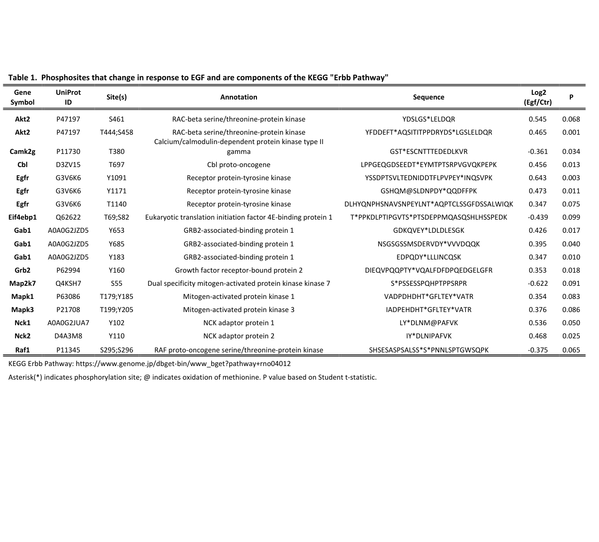

## Question

# Gene Research for Functional Annotation

## ⚠️ CRITICAL: Gene/Protein Identification Context

**BEFORE YOU BEGIN RESEARCH:** You MUST verify you are researching the CORRECT gene/protein. Gene symbols can be ambiguous, especially for less well-characterized genes from non-model organisms.

### Target Gene/Protein Identity (from UniProt):
- **UniProt Accession:** G3V6K6
- **Protein Description:** RecName: Full=Receptor protein-tyrosine kinase {ECO:0000256|ARBA:ARBA00011902, ECO:0000256|PIRNR:PIRNR000619}; EC=2.7.10.1 {ECO:0000256|ARBA:ARBA00011902, ECO:0000256|PIRNR:PIRNR000619};
- **Gene Information:** Name=Egfr {ECO:0000313|Ensembl:ENSRNOP00000006087.4, ECO:0000313|RGD:2543};
- **Organism (full):** Rattus norvegicus (Rat).
- **Protein Family:** Belongs to the protein kinase superfamily. Tyr protein
- **Key Domains:** Egfr_JX_dom. (IPR044912); Furin-like_Cys-rich_dom. (IPR006211); Furin_repeat. (IPR006212); GF_recep_IV. (IPR032778); Growth_fac_rcpt_cys_sf. (IPR009030)

### MANDATORY VERIFICATION STEPS:

1. **Check if the gene symbol "Egfr" matches the protein description above**
2. **Verify the organism is correct:** Rattus norvegicus (Rat).
3. **Check if protein family/domains align with what you find in literature**
4. **If you find literature for a DIFFERENT gene with the same or similar symbol, STOP**

### If Gene Symbol is Ambiguous or You Cannot Find Relevant Literature:

**DO NOT PROCEED WITH RESEARCH ON A DIFFERENT GENE.** Instead:
- State clearly: "The gene symbol 'Egfr' is ambiguous or literature is limited for this specific protein"
- Explain what you found (e.g., "Found extensive literature on a different gene with the same symbol in a different organism")
- Describe the protein based ONLY on the UniProt information provided above
- Suggest that the protein function can be inferred from domain/family information

### Research Target:

Please provide a comprehensive research report on the gene **Egfr** (gene ID: Egfr, UniProt: G3V6K6) in rat.

The research report should be a detailed narrative explaining the function, biological processes, and localization of the gene product. Citations should be given for all claims.

You should prioritize authoritative reviews and primary scientific literature when conducting research. You can supplement
this with annotations you find in gene/protein databases, but these can be outdated or inaccurate.

We are specifically interested in the primary function of the gene - for enzymes, what reaction is catalyzed, and what is the substrate specificity? For transporters, what is the substrate? For structural proteins or adapters, what is the broader structural role? For signaling molecules, what is the role in the pathway.

We are interested in where in or outside the cell the gene product carries out its function.

We are also interested in the signaling or biochemical pathways in which the gene functions. We are less interested in broad pleiotropic effects, except where these elucidate the precise role.

Include evidence where possible. We are interested in both experimental evidence as well as inference from structure, evolution, or bioinformatic analysis. Precise studies should be prioritized over high-throughput, where available.

## Output

Question: You are an expert researcher providing comprehensive, well-cited information.

Provide detailed information focusing on:
1. Key concepts and definitions with current understanding
2. Recent developments and latest research (prioritize 2023-2024 sources)
3. Current applications and real-world implementations
4. Expert opinions and analysis from authoritative sources
5. Relevant statistics and data from recent studies

Format as a comprehensive research report with proper citations. Include URLs and publication dates where available.
Always prioritize recent, authoritative sources and provide specific citations for all major claims.

# Gene Research for Functional Annotation

## ⚠️ CRITICAL: Gene/Protein Identification Context

**BEFORE YOU BEGIN RESEARCH:** You MUST verify you are researching the CORRECT gene/protein. Gene symbols can be ambiguous, especially for less well-characterized genes from non-model organisms.

### Target Gene/Protein Identity (from UniProt):
- **UniProt Accession:** G3V6K6
- **Protein Description:** RecName: Full=Receptor protein-tyrosine kinase {ECO:0000256|ARBA:ARBA00011902, ECO:0000256|PIRNR:PIRNR000619}; EC=2.7.10.1 {ECO:0000256|ARBA:ARBA00011902, ECO:0000256|PIRNR:PIRNR000619};
- **Gene Information:** Name=Egfr {ECO:0000313|Ensembl:ENSRNOP00000006087.4, ECO:0000313|RGD:2543};
- **Organism (full):** Rattus norvegicus (Rat).
- **Protein Family:** Belongs to the protein kinase superfamily. Tyr protein
- **Key Domains:** Egfr_JX_dom. (IPR044912); Furin-like_Cys-rich_dom. (IPR006211); Furin_repeat. (IPR006212); GF_recep_IV. (IPR032778); Growth_fac_rcpt_cys_sf. (IPR009030)

### MANDATORY VERIFICATION STEPS:

1. **Check if the gene symbol "Egfr" matches the protein description above**
2. **Verify the organism is correct:** Rattus norvegicus (Rat).
3. **Check if protein family/domains align with what you find in literature**
4. **If you find literature for a DIFFERENT gene with the same or similar symbol, STOP**

### If Gene Symbol is Ambiguous or You Cannot Find Relevant Literature:

**DO NOT PROCEED WITH RESEARCH ON A DIFFERENT GENE.** Instead:
- State clearly: "The gene symbol 'Egfr' is ambiguous or literature is limited for this specific protein"
- Explain what you found (e.g., "Found extensive literature on a different gene with the same symbol in a different organism")
- Describe the protein based ONLY on the UniProt information provided above
- Suggest that the protein function can be inferred from domain/family information

### Research Target:

Please provide a comprehensive research report on the gene **Egfr** (gene ID: Egfr, UniProt: G3V6K6) in rat.

The research report should be a detailed narrative explaining the function, biological processes, and localization of the gene product. Citations should be given for all claims.

You should prioritize authoritative reviews and primary scientific literature when conducting research. You can supplement
this with annotations you find in gene/protein databases, but these can be outdated or inaccurate.

We are specifically interested in the primary function of the gene - for enzymes, what reaction is catalyzed, and what is the substrate specificity? For transporters, what is the substrate? For structural proteins or adapters, what is the broader structural role? For signaling molecules, what is the role in the pathway.

We are interested in where in or outside the cell the gene product carries out its function.

We are also interested in the signaling or biochemical pathways in which the gene functions. We are less interested in broad pleiotropic effects, except where these elucidate the precise role.

Include evidence where possible. We are interested in both experimental evidence as well as inference from structure, evolution, or bioinformatic analysis. Precise studies should be prioritized over high-throughput, where available.

## Research report: Rat **Egfr** (UniProt **G3V6K6**) functional annotation (EGFR/ErbB1 receptor tyrosine kinase)

### 1) Target identity verification (mandatory)
The UniProt target (**G3V6K6**) is annotated as rat **Egfr**, and the literature retrieved here consistently uses **EGFR/ErbB1** to denote a **single-pass transmembrane receptor tyrosine kinase** whose extracellular region contains **cysteine-rich subdomains** and whose intracellular region contains an **ATP-dependent tyrosine kinase domain** that autophosphorylates a C-terminal tail to create docking sites for SH2/PTB adaptors. These structural/functional hallmarks match the UniProt description and expected domain architecture for EGFR-family receptors. (kozlova2024celladhesionmolecules pages 4-6, shaban2023targetedinhibitorsof pages 1-4)

In rat native inner medullary collecting duct (IMCD) preparations, EGFR is explicitly treated as the epidermal growth factor receptor (ErbB1) localized to the **basolateral plasma membrane**, and EGF stimulation increases EGFR tyrosine phosphorylation and downstream signaling, supporting that the rat gene/protein being studied is the same receptor tyrosine kinase entity as in canonical EGFR biology. (chou2025phosphoproteomicresponseto pages 1-5, chou2025phosphoproteomicresponseto pages 43-45)

### 2) Key concepts and definitions (current understanding)

#### EGFR as a receptor tyrosine kinase (RTK)
EGFR is activated by binding EGF-family ligands, which stabilizes an active extracellular conformation, exposes a dimerization interface, and promotes receptor dimerization. Dimerization enables **asymmetric kinase-domain interactions**, kinase activation, and **autophosphorylation** of multiple C-terminal tyrosines, which then function as docking sites for downstream signaling proteins. (kozlova2024celladhesionmolecules pages 4-6)

#### Downstream signaling pathways
Autophosphorylation enables recruitment of adaptor/effector proteins (e.g., GRB2, GAB1, PLCγ), coupling EGFR to major signaling routes including **RAS–RAF–MEK–ERK (MAPK)** and **PI3K–AKT–mTOR**, among others. These pathways govern proliferation, growth, survival, motility, and context-dependent transcriptional programs. (kozlova2024celladhesionmolecules pages 4-6, chou2025phosphoproteomicresponseto pages 1-5, shaban2023targetedinhibitorsof pages 1-4)

#### Trafficking, endocytosis, and signaling-from-endosomes
A key modern concept is that EGFR signaling is not restricted to the plasma membrane: ligand-activated EGFR undergoes **clathrin-mediated endocytosis (CME)** and can remain signaling-competent in **early endosomes**, with downstream signaling outputs shaped by whether receptors are recycled versus targeted to lysosomal degradation. (kozlova2024celladhesionmolecules pages 4-6, chastel2024recentadvancesin pages 6-9)

### 3) Molecular function: what reaction is catalyzed and what are the substrates?
EGFR catalyzes **protein tyrosine phosphorylation** on its own cytoplasmic tail (autophosphorylation) after ligand-induced activation. In rat IMCD, EGF increases phosphorylation on EGFR tyrosines (e.g., Y1091/Y1171 in rat phosphoproteomics), consistent with enhanced kinase activity and generation of SH2-binding motifs that recruit adaptors such as Shc1 and Grb2 to couple EGFR to Ras and downstream MAPK signaling. (chou2025phosphoproteomicresponseto pages 43-45, chou2025phosphoproteomicresponseto pages 34-40)

Although many downstream events are serine/threonine phosphorylations (e.g., ERK/MAPK sites), these are mediated by kinases downstream of EGFR rather than by EGFR itself; in rat IMCD phosphoproteomics, regulated sites map strongly to ErbB, PI3K-AKT, and MAPK pathway components. (chou2025phosphoproteomicresponseto pages 40-43, chou2025phosphoproteomicresponseto pages 18-21)

### 4) Subcellular localization: where EGFR carries out its function
EGFR is primarily a **plasma-membrane** receptor (ligand binding outside the cell; kinase signaling inside), and it is internalized after activation. Internalized EGFR can continue signaling from **endosomes**, after which it can be recycled back to the membrane or sorted toward lysosomal degradation, modulating signal duration and pathway selectivity. (kozlova2024celladhesionmolecules pages 4-6, chastel2024recentadvancesin pages 6-9)

In native rat IMCD, EGFR is reported at the **basolateral plasma membrane**, consistent with epithelial polarity and paracrine signaling in the collecting duct. (chou2025phosphoproteomicresponseto pages 1-5)

Broader EGFR literature also supports additional intracellular routes (e.g., trafficking to ER/nuclear membranes and nuclear import) where EGFR can function as a transcriptional co-activator; while this evidence is not rat-specific in our retrieved texts, it provides a plausible conserved mechanism that may be evaluated in rat contexts. (escoto2024investigatingtherole pages 23-28)

### 5) Pathways and processes in which rat Egfr participates

#### Canonical pathway engagement in rat tissue
In native rat IMCD, EGF stimulation produces phosphoproteomic signatures consistent with canonical ErbB signaling (Raf/MEK/ERK; PI3K-Akt; mTOR; endocytosis-associated networks), indicating that rat Egfr is embedded in the conserved EGFR signaling architecture in intact epithelial tissue. (chou2025phosphoproteomicresponseto pages 1-5, chou2025phosphoproteomicresponseto pages 40-43)

#### Renal physiology and disease-relevant processes (rat evidence)
A rat 5/6 nephrectomy (remnant kidney) model demonstrates that pharmacological EGFR inhibition can influence fibrosis/inflammation-associated processes and renal function outcomes. In this model, oral **erlotinib** (20 mg/kg/day for 8 weeks) reduced proteinuria and serum creatinine and improved histologic injury measures (glomerulosclerosis and tubulointerstitial damage), with associated reductions in fibrosis and inflammatory readouts and decreased renal cortical phospho-Akt. (yamamoto2018erlotinibattenuatesthe pages 2-4, yamamoto2018erlotinibattenuatesthe pages 4-5)

### 6) Recent developments and latest research (prioritizing 2023–2024)

#### (i) Trafficking regulation by ubiquitination: Cbl/Cbl-b are distinct, not redundant (2023)
A key 2023 mechanistic advance is refined understanding of how **Cbl-family E3 ubiquitin ligases** regulate EGFR downregulation. Pinilla-Macua & Sorkin (2023) show that Cbl and Cbl-b can act **independently via distinct interaction modes**: Cbl-b preferentially engages EGFR via **pY1045**, whereas Cbl relies more strongly on a **GRB2-dependent** mechanism. Perturbing these interactions alters EGFR ubiquitination, endosomal trafficking, degradation kinetics, and functional outputs such as EGF-guided chemotaxis/migration in a cell-context–dependent manner. (pinillamacua2023cblandcblb pages 1-2, pinillamacua2023cblandcblb pages 8-9)

A notable quantitative/functional point from this work is that the **Y1045F** EGFR mutation substantially reduces receptor ubiquitination while **not changing** the rate of clathrin-mediated internalization, supporting the idea that ubiquitination more strongly governs **post-endocytic sorting** (e.g., toward intraluminal vesicles and lysosomes) than initial uptake. (pinillamacua2023cblandcblb pages 8-9)

#### (ii) Ubiquitylation as a system-level switch for internalization and signaling (2024)
A 2024 synthesis emphasizes ubiquitylation as an organizing principle for EGFR internalization and signaling, with evidence that CME predominates at lower/physiologic ligand levels, and that ubiquitylation affects both assembly of endocytic machinery and (especially) endosomal sorting decisions that determine signaling duration and receptor fate. (chastel2024recentadvancesin pages 1-4, chastel2024recentadvancesin pages 9-11)

#### (iii) Ligand bias and compartment-specific signaling quantification (2024)
Gross et al. (2024) provide a contemporary quantitative view of EGFR signaling using BRET biosensors that can resolve effector recruitment at both plasma membrane and early endosomes. This work highlights ligand bias (epiregulin at least ~100-fold less potent than EGF for SH2-effector recruitment in the described system) and provides real-time kinetic and pharmacologic measurements (e.g., gefitinib reversal kinetics on the order of minutes and a reported IC50 of ~20 nM for one endosomal/plasma membrane SHIP1 readout). (gross2024egfrsignalingand pages 1-2, gross2024egfrsignalingand pages 4-5)

### 7) Current applications and real-world implementations

#### Preclinical rat pharmacology (disease-modifying EGFR inhibition)
In a rat CKD model (5/6 nephrectomy), erlotinib administration represents a real-world, in vivo implementation of EGFR pathway manipulation. Reported quantitative improvements include reduced glomerulosclerosis score (2.18 ± 0.20 to 1.63 ± 0.09) and reduced tubulointerstitial damage score (3.28 ± 0.30 to 2.71 ± 0.16), alongside decreases in inflammatory infiltration and profibrotic markers, supporting that rat Egfr signaling can be leveraged pharmacologically in organ-level pathophysiology models. (yamamoto2018erlotinibattenuatesthe pages 4-5)

#### Systems-level resources for functional annotation in rat tissue (phosphoproteomics)
Chou et al. (2025; accepted 2024; AJP Renal Physiology) provide a quantitative phosphoproteomics resource in native rat IMCD including web-accessible datasets/network maps, offering a practical implementation for pathway modeling, hypothesis generation, and identifying candidate downstream effectors of EGFR signaling in a physiologically intact rat epithelial context. (chou2025phosphoproteomicresponseto pages 1-5)

### 8) Expert opinions and authoritative analysis (from reviews)
Two 2024 reviews provide expert synthesis relevant to functional annotation: 
* Kozlova & Sytnyk (Cells, 2024) integrate structural activation models with trafficking and modulation by cell-adhesion molecules, emphasizing that receptor internalization, recycling, and ubiquitin-dependent degradation tune signaling amplitude and duration, and that different ligands can bias receptor fate (recycling vs degradation). (kozlova2024celladhesionmolecules pages 4-6, kozlova2024celladhesionmolecules pages 6-7)
* Chastel & Angers (Physiology/IntechOpen, 2024) emphasize ubiquitylation as essential for receptor internalization/trafficking networks, highlighting how perturbations in ubiquitin ligases and deubiquitinases can shift EGFR fate and signaling, and summarizing emerging mechanistic ideas (e.g., ubiquitylation-supported assemblies/condensates at endocytic sites). (chastel2024recentadvancesin pages 1-4, chastel2024recentadvancesin pages 6-9)

### 9) Recent statistics and data highlights (with primary sources)

#### Rat IMCD quantitative phosphoproteomics (2025; rat tissue)
In native rat IMCD, EGF stimulation produced:
* **29,881** unique phosphosites quantified across **5,457** proteins; **254** regulated sites total (**135 increased**, **119 decreased**). (chou2025phosphoproteomicresponseto pages 1-5, chou2025phosphoproteomicresponseto pages 30-34)
* Strong pathway enrichment for **ErbB signaling** (reported p = 8×10⁻⁷; fold enrichment 5.48), with additional enrichment in PI3K-Akt, MAPK signaling, mTOR, and endocytosis. (chou2025phosphoproteomicresponseto pages 40-43)
* EGFR phosphorylation increases including **Y1091 log2(EGF/control) = +0.643 (p=0.003)** and **Y1171 = +0.473 (p=0.011)** in the ErbB pathway table. (chou2025phosphoproteomicresponseto pages 34-40)
* An immunoblot increase in EGFR **pY1091** from ~100 ± 15 to ~183 ± 13 after EGF stimulation. (chou2025phosphoproteomicresponseto pages 30-34, chou2025phosphoproteomicresponseto media 8fe8c363)

#### Live-cell quantitative pharmacology (2024)
Using BRET biosensors, gefitinib reversed an EGFR SHIP1 recruitment readout with **IC50 ≈ 20 nM**, and some recruitment/reversal events occurred within minutes (e.g., Grb2 recruitment within ~4 min; reversal within ~3 min after gefitinib addition in the described assay). (gross2024egfrsignalingand pages 4-5)

#### Rat in vivo EGFR inhibition in kidney disease (2018; still directly rat-relevant)
In the 5/6 nephrectomy rat model, erlotinib reduced macrophage infiltration scores (ED-1 score ~2.06 ± 0.28 to 1.39 ± 0.16; P < 0.05) and reduced multiple pathology measures including fibrosis/inflammation-associated markers and phospho-Akt in renal cortex. (yamamoto2018erlotinibattenuatesthe pages 5-7, yamamoto2018erlotinibattenuatesthe pages 4-5)

### 10) Evidence summary table
The following table compiles the key functional annotation points for rat Egfr/EGFR, with evidence-linked statements.

| Aspect | Summary |
|---|---|
| Identity/domains | Rat **Egfr** (UniProt **G3V6K6**) matches the canonical epidermal growth factor receptor/ErbB1 receptor tyrosine kinase. EGFR is a single-pass transmembrane receptor with an extracellular ligand-binding region containing cysteine-rich subdomains, a transmembrane helix, and an intracellular tyrosine kinase domain with a C-terminal phosphotyrosine tail for adaptor docking. (kozlova2024celladhesionmolecules pages 4-6, shaban2023targetedinhibitorsof pages 1-4) |
| Enzymatic activity | EGFR is a **receptor protein-tyrosine kinase** that increases intrinsic kinase activity upon ligand-induced dimerization and catalyzes autophosphorylation on cytoplasmic tyrosines, generating SH2/PTB docking sites for signaling proteins such as GRB2, GAB1, and PLCγ. Key tail phosphosites discussed in recent literature include Y1045, Y1068, Y1086, Y1148, and Y1173; rat phosphoproteomics detected regulated EGFR Y1091 and Y1171. (chou2025phosphoproteomicresponseto pages 1-5, laudadio2024chemicalscaffoldsfor pages 4-7, chou2025phosphoproteomicresponseto pages 34-40) |
| Activation mechanism | Ligand binding to the extracellular domain induces a conformational change that exposes the dimerization arm, promotes receptor dimerization, and enables asymmetric kinase-domain activation followed by tail autophosphorylation. Recent live-cell studies also show ligand bias: EGF and epiregulin trigger distinct potency/efficacy patterns, with epiregulin at least ~100-fold less potent than EGF for SH2-effector recruitment in one biosensor system. (kozlova2024celladhesionmolecules pages 4-6, gross2024egfrsignalingand pages 1-2) |
| Key downstream pathways | Core downstream outputs are **RAS-RAF-MEK-ERK**, **PI3K-AKT-mTOR**, and **PLCγ/IP3-Ca2+** signaling. In native rat IMCD, EGF-responsive phosphoproteomics strongly enriched ErbB, PI3K-Akt, mTOR, endocytosis, and MAPK pathways, supporting conserved pathway usage in rat tissue. (chou2025phosphoproteomicresponseto pages 1-5, chou2025phosphoproteomicresponseto pages 40-43, chou2025phosphoproteomicresponseto pages 18-21) |
| Trafficking regulation | EGFR signaling is shaped by endocytosis and ubiquitin-dependent sorting. **Cbl** and **Cbl-b** are principal E3 ligases for EGFR, but are not fully redundant: Cbl-b preferentially engages pY1045, while Cbl relies more on a GRB2-dependent route; altered ubiquitination affects degradation and endosomal sorting more strongly than initial clathrin-mediated internalization. Ligands also bias fate, with HB-EGF/BTC favoring lysosomal degradation and AREG/TGFα/EPGN favoring recycling. (chastel2024recentadvancesin pages 1-4, pinillamacua2023cblandcblb pages 1-2, pinillamacua2023cblandcblb pages 8-9, kozlova2024celladhesionmolecules pages 6-7) |
| Subcellular localization | EGFR functions primarily at the **plasma membrane** and remains signaling-competent in **early endosomes**; receptors can then recycle or progress to lysosomal degradation. In rat collecting duct, EGFR is reported at the **basolateral plasma membrane**; additional noncanonical trafficking to ER/nuclear membranes and the nucleus has been described in broader EGFR literature. (chou2025phosphoproteomicresponseto pages 1-5, kozlova2024celladhesionmolecules pages 4-6, escoto2024investigatingtherole pages 23-28) |
| Rat-specific evidence | In ex vivo native rat IMCD, EGF treatment activated canonical EGFR signaling and altered 254 phosphosites, consistent with a physiological signaling role in epithelial transport regulation. In an in vivo rat 5/6 nephrectomy CKD model, EGFR inhibition with erlotinib reduced proteinuria, serum creatinine, glomerulosclerosis, tubulointerstitial injury, inflammation, and phospho-Akt, supporting functional importance of rat Egfr in renal pathophysiology. (chou2025phosphoproteomicresponseto pages 1-5, yamamoto2018erlotinibattenuatesthe pages 4-5, yamamoto2018erlotinibattenuatesthe pages 1-2) |
| Quantitative data points 2024-2025 | Rat IMCD phosphoproteomics quantified **29,881** phosphosites across **5,457** proteins, with **135 increased** and **119 decreased** after EGF; ErbB signaling showed **p = 8×10^-7** and **5.48-fold enrichment**. EGFR pY1091 increased from about **100 ± 15** to **183 ± 13** by immunoblot, and phosphoproteomics measured EGFR **Y1091 log2 +0.643 (p=0.003)** and **Y1171 log2 +0.473 (p=0.011)**. In 2024 biosensor assays, gefitinib reversed one EGFR SHIP1 readout with **IC50 ~20 nM**, and SH2(Grb2) recruitment occurred within ~4 min and reversed within ~3 min after inhibitor addition. (chou2025phosphoproteomicresponseto pages 30-34, chou2025phosphoproteomicresponseto pages 40-43, chou2025phosphoproteomicresponseto pages 34-40, chou2025phosphoproteomicresponseto pages 18-21, gross2024egfrsignalingand pages 4-5, chou2025phosphoproteomicresponseto media e18dc9b0) |
| Applications | Rat Egfr biology is already used in **preclinical pharmacology** and **functional phosphoproteomics**. Erlotinib treatment in rats improved CKD-associated phenotypes, while recent phosphoproteomic/network resources in native rat IMCD provide actionable datasets for pathway modeling, biomarker discovery, and interpreting EGFR-targeted interventions. More broadly, current EGFR research is informing next-generation inhibitors and degraders for resistance biology. (yamamoto2018erlotinibattenuatesthe pages 2-4, chou2025phosphoproteomicresponseto pages 1-5, laudadio2024chemicalscaffoldsfor pages 4-7) |

*Table: This table summarizes core functional annotation for rat Egfr/EGFR, integrating identity, mechanism, signaling, trafficking, localization, and rat-specific evidence. It is useful as a compact evidence-backed reference for narrative gene-function reporting.*

### 11) Visual evidence (figure/table)
The rat IMCD phosphoproteomics paper includes (i) a table listing ErbB-pathway phosphosite changes (including EGFR Y1091/Y1171) and (ii) an immunoblot showing EGF-induced EGFR pY1091 increases, supporting direct activation of rat EGFR signaling in native tissue. (chou2025phosphoproteomicresponseto media e18dc9b0, chou2025phosphoproteomicresponseto media 8fe8c363)

### 12) Limitations of this evidence set (scope control)
* The most detailed mechanistic trafficking/ubiquitination evidence retrieved here is primarily from human-cell studies (e.g., Cbl/Cbl-b regulation), but these mechanisms are widely treated as conserved and are consistent with rat tissue signaling outputs (ErbB/MAPK/PI3K enrichment in rat IMCD). (pinillamacua2023cblandcblb pages 1-2, chou2025phosphoproteomicresponseto pages 1-5)
* For strict enzyme commission (EC) labeling (e.g., EC 2.7.10.1) and full domain names as listed by UniProt/InterPro, the evidence set here supports the receptor tyrosine kinase identity and cysteine-rich extracellular architecture, but EC labeling per se is not explicitly stated in the retrieved articles’ excerpts. (kozlova2024celladhesionmolecules pages 4-6, chou2025phosphoproteomicresponseto pages 1-5)

### Key source URLs and publication dates (selection)
* Kozlova I, Sytnyk V. **Cells** (Nov **2024**). https://doi.org/10.3390/cells13221919 (kozlova2024celladhesionmolecules pages 4-6, kozlova2024celladhesionmolecules pages 6-7)
* Chastel J, Angers A. **Physiology/IntechOpen** (Nov **2024**). https://doi.org/10.5772/intechopen.114990 (chastel2024recentadvancesin pages 1-4, chastel2024recentadvancesin pages 6-9)
* Pinilla-Macua I, Sorkin A. **Molecular Biology of the Cell** (Dec **2023**). https://doi.org/10.1091/mbc.e23-02-0058 (pinillamacua2023cblandcblb pages 1-2, pinillamacua2023cblandcblb pages 8-9)
* Gross F et al. **Communications Biology** (Mar **2024**). https://doi.org/10.1038/s42003-024-05965-5 (gross2024egfrsignalingand pages 4-5, gross2024egfrsignalingand pages 1-2)
* Chou C-L et al. **AJP Renal Physiology** (Jan **2025**; doi indicates 2024 acceptance). https://doi.org/10.1152/ajprenal.00182.2024 (chou2025phosphoproteomicresponseto pages 1-5, chou2025phosphoproteomicresponseto pages 34-40)
* Yamamoto Y et al. **Nephrology Dialysis Transplantation** (Apr **2018**). https://doi.org/10.1093/ndt/gfx264 (yamamoto2018erlotinibattenuatesthe pages 2-4, yamamoto2018erlotinibattenuatesthe pages 4-5)

References

1. (kozlova2024celladhesionmolecules pages 4-6): Irina Kozlova and Vladimir Sytnyk. Cell adhesion molecules as modulators of the epidermal growth factor receptor. Cells, 13:1919, Nov 2024. URL: https://doi.org/10.3390/cells13221919, doi:10.3390/cells13221919. This article has 17 citations.

2. (shaban2023targetedinhibitorsof pages 1-4): Nina Shaban, Dmitri Kamashev, Aleksandra Emelianova, and Anton Buzdin. Targeted inhibitors of egfr: structure, biology, biomarkers, and clinical applications. Cells, 13:47, Dec 2023. URL: https://doi.org/10.3390/cells13010047, doi:10.3390/cells13010047. This article has 68 citations.

3. (chou2025phosphoproteomicresponseto pages 1-5): Chung-Lin Chou, Nipun U. Jayatissa, Elena T. Kichula, Shuo-Ming Ou, Kavee Limbutara, and Mark A. Knepper. Phosphoproteomic response to epidermal growth factor in native rat inner medullary collecting duct. Jan 2025. URL: https://doi.org/10.1152/ajprenal.00182.2024, doi:10.1152/ajprenal.00182.2024. This article has 0 citations and is from a peer-reviewed journal.

4. (chou2025phosphoproteomicresponseto pages 43-45): Chung-Lin Chou, Nipun U. Jayatissa, Elena T. Kichula, Shuo-Ming Ou, Kavee Limbutara, and Mark A. Knepper. Phosphoproteomic response to epidermal growth factor in native rat inner medullary collecting duct. Jan 2025. URL: https://doi.org/10.1152/ajprenal.00182.2024, doi:10.1152/ajprenal.00182.2024. This article has 0 citations and is from a peer-reviewed journal.

5. (chastel2024recentadvancesin pages 6-9): Julia Chastel and Annie Angers. Recent advances in the importance of ubiquitylation for receptor internalization and signaling. Physiology, Nov 2024. URL: https://doi.org/10.5772/intechopen.114990, doi:10.5772/intechopen.114990. This article has 0 citations and is from a peer-reviewed journal.

6. (chou2025phosphoproteomicresponseto pages 34-40): Chung-Lin Chou, Nipun U. Jayatissa, Elena T. Kichula, Shuo-Ming Ou, Kavee Limbutara, and Mark A. Knepper. Phosphoproteomic response to epidermal growth factor in native rat inner medullary collecting duct. Jan 2025. URL: https://doi.org/10.1152/ajprenal.00182.2024, doi:10.1152/ajprenal.00182.2024. This article has 0 citations and is from a peer-reviewed journal.

7. (chou2025phosphoproteomicresponseto pages 40-43): Chung-Lin Chou, Nipun U. Jayatissa, Elena T. Kichula, Shuo-Ming Ou, Kavee Limbutara, and Mark A. Knepper. Phosphoproteomic response to epidermal growth factor in native rat inner medullary collecting duct. Jan 2025. URL: https://doi.org/10.1152/ajprenal.00182.2024, doi:10.1152/ajprenal.00182.2024. This article has 0 citations and is from a peer-reviewed journal.

8. (chou2025phosphoproteomicresponseto pages 18-21): Chung-Lin Chou, Nipun U. Jayatissa, Elena T. Kichula, Shuo-Ming Ou, Kavee Limbutara, and Mark A. Knepper. Phosphoproteomic response to epidermal growth factor in native rat inner medullary collecting duct. Jan 2025. URL: https://doi.org/10.1152/ajprenal.00182.2024, doi:10.1152/ajprenal.00182.2024. This article has 0 citations and is from a peer-reviewed journal.

9. (escoto2024investigatingtherole pages 23-28): A Escoto. Investigating the role of nuclear egfr in regulating the tumor immune microenvironment in breast cancer. Unknown journal, 2024.

10. (yamamoto2018erlotinibattenuatesthe pages 2-4): Yasutaka Yamamoto, Masayuki Iyoda, Shohei Tachibana, Kei Matsumoto, Yukihiro Wada, Taihei Suzuki, Ken Iseri, Tomohiro Saito, Kei Fukuda-Hihara, and Takanori Shibata. Erlotinib attenuates the progression of chronic kidney disease in rats with remnant kidney. Nephrology Dialysis Transplantation, 33:598–606, Apr 2018. URL: https://doi.org/10.1093/ndt/gfx264, doi:10.1093/ndt/gfx264. This article has 20 citations and is from a domain leading peer-reviewed journal.

11. (yamamoto2018erlotinibattenuatesthe pages 4-5): Yasutaka Yamamoto, Masayuki Iyoda, Shohei Tachibana, Kei Matsumoto, Yukihiro Wada, Taihei Suzuki, Ken Iseri, Tomohiro Saito, Kei Fukuda-Hihara, and Takanori Shibata. Erlotinib attenuates the progression of chronic kidney disease in rats with remnant kidney. Nephrology Dialysis Transplantation, 33:598–606, Apr 2018. URL: https://doi.org/10.1093/ndt/gfx264, doi:10.1093/ndt/gfx264. This article has 20 citations and is from a domain leading peer-reviewed journal.

12. (pinillamacua2023cblandcblb pages 1-2): Itziar Pinilla-Macua and Alexander Sorkin. Cbl and cbl-b independently regulate egfr through distinct receptor interaction modes. Molecular Biology of the Cell, Dec 2023. URL: https://doi.org/10.1091/mbc.e23-02-0058, doi:10.1091/mbc.e23-02-0058. This article has 28 citations and is from a domain leading peer-reviewed journal.

13. (pinillamacua2023cblandcblb pages 8-9): Itziar Pinilla-Macua and Alexander Sorkin. Cbl and cbl-b independently regulate egfr through distinct receptor interaction modes. Molecular Biology of the Cell, Dec 2023. URL: https://doi.org/10.1091/mbc.e23-02-0058, doi:10.1091/mbc.e23-02-0058. This article has 28 citations and is from a domain leading peer-reviewed journal.

14. (chastel2024recentadvancesin pages 1-4): Julia Chastel and Annie Angers. Recent advances in the importance of ubiquitylation for receptor internalization and signaling. Physiology, Nov 2024. URL: https://doi.org/10.5772/intechopen.114990, doi:10.5772/intechopen.114990. This article has 0 citations and is from a peer-reviewed journal.

15. (chastel2024recentadvancesin pages 9-11): Julia Chastel and Annie Angers. Recent advances in the importance of ubiquitylation for receptor internalization and signaling. Physiology, Nov 2024. URL: https://doi.org/10.5772/intechopen.114990, doi:10.5772/intechopen.114990. This article has 0 citations and is from a peer-reviewed journal.

16. (gross2024egfrsignalingand pages 1-2): Florence Gross, Arturo Mancini, Billy Breton, Hiroyuki Kobayashi, Pedro Henrique Scarpelli Pereira, Christian Le Gouill, Michel Bouvier, Stephan Schann, Xavier Leroy, and Laurent Sabbagh. Egfr signaling and pharmacology in oncology revealed with innovative bret-based biosensors. Communications Biology, Mar 2024. URL: https://doi.org/10.1038/s42003-024-05965-5, doi:10.1038/s42003-024-05965-5. This article has 11 citations and is from a peer-reviewed journal.

17. (gross2024egfrsignalingand pages 4-5): Florence Gross, Arturo Mancini, Billy Breton, Hiroyuki Kobayashi, Pedro Henrique Scarpelli Pereira, Christian Le Gouill, Michel Bouvier, Stephan Schann, Xavier Leroy, and Laurent Sabbagh. Egfr signaling and pharmacology in oncology revealed with innovative bret-based biosensors. Communications Biology, Mar 2024. URL: https://doi.org/10.1038/s42003-024-05965-5, doi:10.1038/s42003-024-05965-5. This article has 11 citations and is from a peer-reviewed journal.

18. (kozlova2024celladhesionmolecules pages 6-7): Irina Kozlova and Vladimir Sytnyk. Cell adhesion molecules as modulators of the epidermal growth factor receptor. Cells, 13:1919, Nov 2024. URL: https://doi.org/10.3390/cells13221919, doi:10.3390/cells13221919. This article has 17 citations.

19. (chou2025phosphoproteomicresponseto pages 30-34): Chung-Lin Chou, Nipun U. Jayatissa, Elena T. Kichula, Shuo-Ming Ou, Kavee Limbutara, and Mark A. Knepper. Phosphoproteomic response to epidermal growth factor in native rat inner medullary collecting duct. Jan 2025. URL: https://doi.org/10.1152/ajprenal.00182.2024, doi:10.1152/ajprenal.00182.2024. This article has 0 citations and is from a peer-reviewed journal.

20. (chou2025phosphoproteomicresponseto media 8fe8c363): Chung-Lin Chou, Nipun U. Jayatissa, Elena T. Kichula, Shuo-Ming Ou, Kavee Limbutara, and Mark A. Knepper. Phosphoproteomic response to epidermal growth factor in native rat inner medullary collecting duct. Jan 2025. URL: https://doi.org/10.1152/ajprenal.00182.2024, doi:10.1152/ajprenal.00182.2024. This article has 0 citations and is from a peer-reviewed journal.

21. (yamamoto2018erlotinibattenuatesthe pages 5-7): Yasutaka Yamamoto, Masayuki Iyoda, Shohei Tachibana, Kei Matsumoto, Yukihiro Wada, Taihei Suzuki, Ken Iseri, Tomohiro Saito, Kei Fukuda-Hihara, and Takanori Shibata. Erlotinib attenuates the progression of chronic kidney disease in rats with remnant kidney. Nephrology Dialysis Transplantation, 33:598–606, Apr 2018. URL: https://doi.org/10.1093/ndt/gfx264, doi:10.1093/ndt/gfx264. This article has 20 citations and is from a domain leading peer-reviewed journal.

22. (laudadio2024chemicalscaffoldsfor pages 4-7): Emiliano Laudadio, Luca Mangano, and Cristina Minnelli. Chemical scaffolds for the clinical development of mutant-selective and reversible fourth-generation egfr-tkis in nsclc. ACS chemical biology, 19:839-854, Mar 2024. URL: https://doi.org/10.1021/acschembio.4c00028, doi:10.1021/acschembio.4c00028. This article has 28 citations and is from a domain leading peer-reviewed journal.

23. (yamamoto2018erlotinibattenuatesthe pages 1-2): Yasutaka Yamamoto, Masayuki Iyoda, Shohei Tachibana, Kei Matsumoto, Yukihiro Wada, Taihei Suzuki, Ken Iseri, Tomohiro Saito, Kei Fukuda-Hihara, and Takanori Shibata. Erlotinib attenuates the progression of chronic kidney disease in rats with remnant kidney. Nephrology Dialysis Transplantation, 33:598–606, Apr 2018. URL: https://doi.org/10.1093/ndt/gfx264, doi:10.1093/ndt/gfx264. This article has 20 citations and is from a domain leading peer-reviewed journal.

24. (chou2025phosphoproteomicresponseto media e18dc9b0): Chung-Lin Chou, Nipun U. Jayatissa, Elena T. Kichula, Shuo-Ming Ou, Kavee Limbutara, and Mark A. Knepper. Phosphoproteomic response to epidermal growth factor in native rat inner medullary collecting duct. Jan 2025. URL: https://doi.org/10.1152/ajprenal.00182.2024, doi:10.1152/ajprenal.00182.2024. This article has 0 citations and is from a peer-reviewed journal.

## Artifacts

- [Edison artifact artifact-00](Egfr-deep-research-falcon_artifacts/artifact-00.md)

## Citations

1. kozlova2024celladhesionmolecules pages 4-6
2. chou2025phosphoproteomicresponseto pages 1-5
3. escoto2024investigatingtherole pages 23-28
4. pinillamacua2023cblandcblb pages 8-9
5. yamamoto2018erlotinibattenuatesthe pages 4-5
6. chou2025phosphoproteomicresponseto pages 40-43
7. chou2025phosphoproteomicresponseto pages 34-40
8. gross2024egfrsignalingand pages 4-5
9. shaban2023targetedinhibitorsof pages 1-4
10. chou2025phosphoproteomicresponseto pages 43-45
11. chastel2024recentadvancesin pages 6-9
12. chou2025phosphoproteomicresponseto pages 18-21
13. yamamoto2018erlotinibattenuatesthe pages 2-4
14. pinillamacua2023cblandcblb pages 1-2
15. chastel2024recentadvancesin pages 1-4
16. chastel2024recentadvancesin pages 9-11
17. gross2024egfrsignalingand pages 1-2
18. kozlova2024celladhesionmolecules pages 6-7
19. chou2025phosphoproteomicresponseto pages 30-34
20. yamamoto2018erlotinibattenuatesthe pages 5-7
21. laudadio2024chemicalscaffoldsfor pages 4-7
22. yamamoto2018erlotinibattenuatesthe pages 1-2
23. https://doi.org/10.3390/cells13221919
24. https://doi.org/10.5772/intechopen.114990
25. https://doi.org/10.1091/mbc.e23-02-0058
26. https://doi.org/10.1038/s42003-024-05965-5
27. https://doi.org/10.1152/ajprenal.00182.2024
28. https://doi.org/10.1093/ndt/gfx264
29. https://doi.org/10.3390/cells13221919,
30. https://doi.org/10.3390/cells13010047,
31. https://doi.org/10.1152/ajprenal.00182.2024,
32. https://doi.org/10.5772/intechopen.114990,
33. https://doi.org/10.1093/ndt/gfx264,
34. https://doi.org/10.1091/mbc.e23-02-0058,
35. https://doi.org/10.1038/s42003-024-05965-5,
36. https://doi.org/10.1021/acschembio.4c00028,