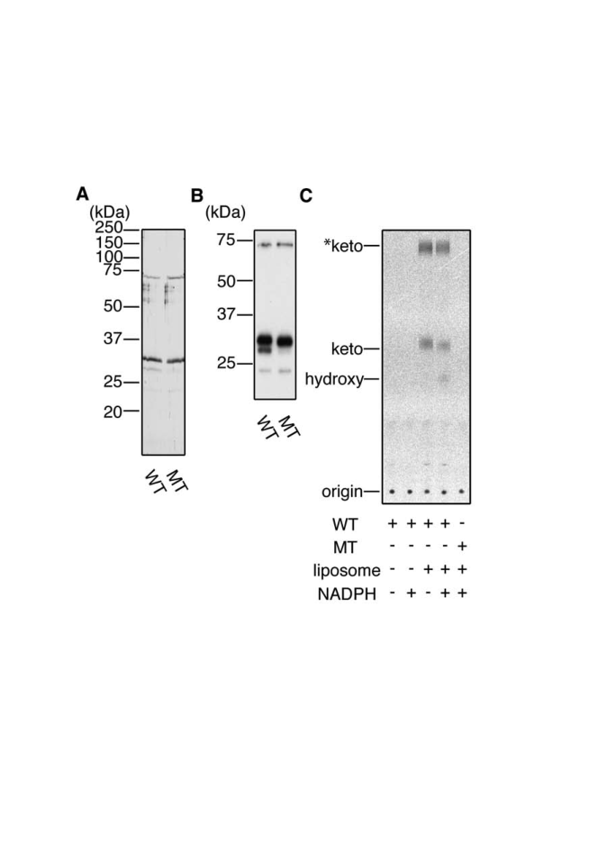

## Question

# Gene Research for Functional Annotation

## ⚠️ CRITICAL: Gene/Protein Identification Context

**BEFORE YOU BEGIN RESEARCH:** You MUST verify you are researching the CORRECT gene/protein. Gene symbols can be ambiguous, especially for less well-characterized genes from non-model organisms.

### Target Gene/Protein Identity (from UniProt):
- **UniProt Accession:** D4ADY9
- **Protein Description:** RecName: Full=Very long chain fatty acid elongase 7 {ECO:0000255|HAMAP-Rule:MF_03207}; EC=2.3.1.199 {ECO:0000250|UniProtKB:A1L3X0, ECO:0000255|HAMAP-Rule:MF_03207}; AltName: Full=3-keto acyl-CoA synthase Elovl7 {ECO:0000255|HAMAP-Rule:MF_03207}; AltName: Full=ELOVL fatty acid elongase 7 {ECO:0000255|HAMAP-Rule:MF_03207}; Short=ELOVL FA elongase 7 {ECO:0000255|HAMAP-Rule:MF_03207}; AltName: Full=Elongation of very long chain fatty acids protein 7 {ECO:0000255|HAMAP-Rule:MF_03207}; AltName: Full=Very long chain 3-ketoacyl-CoA synthase 7 {ECO:0000255|HAMAP-Rule:MF_03207}; AltName: Full=Very long chain 3-oxoacyl-CoA synthase 7 {ECO:0000255|HAMAP-Rule:MF_03207};
- **Gene Information:** Name=Elovl7 {ECO:0000255|HAMAP-Rule:MF_03207};
- **Organism (full):** Rattus norvegicus (Rat).
- **Protein Family:** Belongs to the ELO family. ELOVL7 subfamily.
- **Key Domains:** ELO_CS. (IPR030457); ELO_fam. (IPR002076); ELOVL7. (IPR033670); ELO (PF01151)

### MANDATORY VERIFICATION STEPS:

1. **Check if the gene symbol "Elovl7" matches the protein description above**
2. **Verify the organism is correct:** Rattus norvegicus (Rat).
3. **Check if protein family/domains align with what you find in literature**
4. **If you find literature for a DIFFERENT gene with the same or similar symbol, STOP**

### If Gene Symbol is Ambiguous or You Cannot Find Relevant Literature:

**DO NOT PROCEED WITH RESEARCH ON A DIFFERENT GENE.** Instead:
- State clearly: "The gene symbol 'Elovl7' is ambiguous or literature is limited for this specific protein"
- Explain what you found (e.g., "Found extensive literature on a different gene with the same symbol in a different organism")
- Describe the protein based ONLY on the UniProt information provided above
- Suggest that the protein function can be inferred from domain/family information

### Research Target:

Please provide a comprehensive research report on the gene **Elovl7** (gene ID: Elovl7, UniProt: D4ADY9) in rat.

The research report should be a detailed narrative explaining the function, biological processes, and localization of the gene product. Citations should be given for all claims.

You should prioritize authoritative reviews and primary scientific literature when conducting research. You can supplement
this with annotations you find in gene/protein databases, but these can be outdated or inaccurate.

We are specifically interested in the primary function of the gene - for enzymes, what reaction is catalyzed, and what is the substrate specificity? For transporters, what is the substrate? For structural proteins or adapters, what is the broader structural role? For signaling molecules, what is the role in the pathway.

We are interested in where in or outside the cell the gene product carries out its function.

We are also interested in the signaling or biochemical pathways in which the gene functions. We are less interested in broad pleiotropic effects, except where these elucidate the precise role.

Include evidence where possible. We are interested in both experimental evidence as well as inference from structure, evolution, or bioinformatic analysis. Precise studies should be prioritized over high-throughput, where available.

## Output

Question: You are an expert researcher providing comprehensive, well-cited information.

Provide detailed information focusing on:
1. Key concepts and definitions with current understanding
2. Recent developments and latest research (prioritize 2023-2024 sources)
3. Current applications and real-world implementations
4. Expert opinions and analysis from authoritative sources
5. Relevant statistics and data from recent studies

Format as a comprehensive research report with proper citations. Include URLs and publication dates where available.
Always prioritize recent, authoritative sources and provide specific citations for all major claims.

# Gene Research for Functional Annotation

## ⚠️ CRITICAL: Gene/Protein Identification Context

**BEFORE YOU BEGIN RESEARCH:** You MUST verify you are researching the CORRECT gene/protein. Gene symbols can be ambiguous, especially for less well-characterized genes from non-model organisms.

### Target Gene/Protein Identity (from UniProt):
- **UniProt Accession:** D4ADY9
- **Protein Description:** RecName: Full=Very long chain fatty acid elongase 7 {ECO:0000255|HAMAP-Rule:MF_03207}; EC=2.3.1.199 {ECO:0000250|UniProtKB:A1L3X0, ECO:0000255|HAMAP-Rule:MF_03207}; AltName: Full=3-keto acyl-CoA synthase Elovl7 {ECO:0000255|HAMAP-Rule:MF_03207}; AltName: Full=ELOVL fatty acid elongase 7 {ECO:0000255|HAMAP-Rule:MF_03207}; Short=ELOVL FA elongase 7 {ECO:0000255|HAMAP-Rule:MF_03207}; AltName: Full=Elongation of very long chain fatty acids protein 7 {ECO:0000255|HAMAP-Rule:MF_03207}; AltName: Full=Very long chain 3-ketoacyl-CoA synthase 7 {ECO:0000255|HAMAP-Rule:MF_03207}; AltName: Full=Very long chain 3-oxoacyl-CoA synthase 7 {ECO:0000255|HAMAP-Rule:MF_03207};
- **Gene Information:** Name=Elovl7 {ECO:0000255|HAMAP-Rule:MF_03207};
- **Organism (full):** Rattus norvegicus (Rat).
- **Protein Family:** Belongs to the ELO family. ELOVL7 subfamily.
- **Key Domains:** ELO_CS. (IPR030457); ELO_fam. (IPR002076); ELOVL7. (IPR033670); ELO (PF01151)

### MANDATORY VERIFICATION STEPS:

1. **Check if the gene symbol "Elovl7" matches the protein description above**
2. **Verify the organism is correct:** Rattus norvegicus (Rat).
3. **Check if protein family/domains align with what you find in literature**
4. **If you find literature for a DIFFERENT gene with the same or similar symbol, STOP**

### If Gene Symbol is Ambiguous or You Cannot Find Relevant Literature:

**DO NOT PROCEED WITH RESEARCH ON A DIFFERENT GENE.** Instead:
- State clearly: "The gene symbol 'Elovl7' is ambiguous or literature is limited for this specific protein"
- Explain what you found (e.g., "Found extensive literature on a different gene with the same symbol in a different organism")
- Describe the protein based ONLY on the UniProt information provided above
- Suggest that the protein function can be inferred from domain/family information

### Research Target:

Please provide a comprehensive research report on the gene **Elovl7** (gene ID: Elovl7, UniProt: D4ADY9) in rat.

The research report should be a detailed narrative explaining the function, biological processes, and localization of the gene product. Citations should be given for all claims.

You should prioritize authoritative reviews and primary scientific literature when conducting research. You can supplement
this with annotations you find in gene/protein databases, but these can be outdated or inaccurate.

We are specifically interested in the primary function of the gene - for enzymes, what reaction is catalyzed, and what is the substrate specificity? For transporters, what is the substrate? For structural proteins or adapters, what is the broader structural role? For signaling molecules, what is the role in the pathway.

We are interested in where in or outside the cell the gene product carries out its function.

We are also interested in the signaling or biochemical pathways in which the gene functions. We are less interested in broad pleiotropic effects, except where these elucidate the precise role.

Include evidence where possible. We are interested in both experimental evidence as well as inference from structure, evolution, or bioinformatic analysis. Precise studies should be prioritized over high-throughput, where available.

## Research report: **Elovl7** (UniProt **D4ADY9**) — functional annotation in *Rattus norvegicus*

### 0. Target verification (critical identity check)
The UniProt target **D4ADY9** is annotated as **very long chain fatty acid elongase 7 (ELOVL7)** from *Rattus norvegicus*. Available primary and structural literature consistently describes mammalian **ELOVL7** as a multi-pass membrane **3‑ketoacyl‑CoA synthase** (condensing enzyme) in the ELOVL family, defined by an essential **HxxHH** catalytic motif and membrane-embedded active site. These defining features align with the UniProt description provided for rat Elovl7 and distinguish it from other paralogs (ELOVL1–6) and from non-ELOVL elongases. (naganuma2011biochemicalcharacterizationof pages 8-13, nie2021thestructuralbasis pages 2-4, nie2021thestructuralbasis pages 6-7)

### 1. Key concepts and definitions (current understanding)

#### 1.1 What ELOVL7 is
ELOVL7 belongs to the mammalian **ELOVL (elongation of very long-chain fatty acids)** family, which catalyzes the *rate-limiting first step* of microsomal fatty-acid elongation. In this pathway, fatty acids are elongated in **two-carbon increments** to generate long-chain and very-long-chain fatty acids that are subsequently incorporated into complex lipids (e.g., phospholipids, sphingolipids/ceramides). (nie2021thestructuralbasis pages 1-2, kihara2012verylongchainfatty pages 2-3)

#### 1.2 Reaction catalyzed (primary enzymatic function; EC 2.3.1.199)
Biochemical characterization of mammalian ELOVL7 demonstrates that it catalyzes the **condensation** of an **acyl‑CoA** (fatty acyl donor) with **malonyl‑CoA** (two-carbon donor) to yield a **3‑ketoacyl‑CoA**, which is then further processed by downstream elongation enzymes (reduction, dehydration, reduction) to produce an elongated acyl‑CoA. Importantly, ELOVL7 itself **does not require NADPH** for the condensation chemistry, whereas downstream steps in the elongation cycle use NADPH. (naganuma2011biochemicalcharacterizationof pages 8-13, naganuma2011biochemicalcharacterizationof pages 13-20, nie2021thestructuralbasis pages 1-2, wang2023acomprehensivereview pages 2-4)

#### 1.3 Substrate specificity (chain-length and unsaturation preference)
In purified-enzyme assays (reconstituted into proteoliposomes), mammalian ELOVL7 shows activity toward **C16–C20** acyl‑CoA substrates, with the **highest activity toward C18 substrates**, and comparatively little/no activity toward longer saturated substrates (e.g., **C22–C26** saturated acyl‑CoAs) under the tested conditions. A particularly high activity was reported for **C18:3(n‑3)** and **C18:3(n‑6)** acyl‑CoAs. (naganuma2011biochemicalcharacterizationof pages 8-13, naganuma2011biochemicalcharacterizationof pages 13-20, kihara2012verylongchainfatty pages 2-3, naganuma2011biochemicalcharacterizationof media 0c8c973d)

#### 1.4 Enzyme kinetics (quantitative parameters)
For purified and reconstituted mammalian ELOVL7, kinetic analysis reported micromolar substrate affinities:
- **C18:3(n‑3)-CoA:** *Km* = **2.6 μM**, *Vmax* = **0.33 pmol/min/μg** protein
- **Malonyl-CoA:** *Km* = **11.7 μM**, *Vmax* = **0.31 pmol/min/μg** protein
The Lineweaver–Burk plots were linear under assay conditions, supporting Michaelis–Menten behavior without evidence for homotropic/allosteric regulation in these assays. (naganuma2011biochemicalcharacterizationof pages 8-13, naganuma2011biochemicalcharacterizationof pages 13-20, naganuma2011biochemicalcharacterizationof media 52074e66)

#### 1.5 Conserved motifs and domain features (mechanistic essentials)
A hallmark of ELOVL family condensing enzymes is the conserved **HxxHH** motif. In mammalian ELOVL7, this motif is reported as **HVFHH**, and mutation to **HVFAA** abolishes activity, demonstrating that these histidines are essential for catalysis. (naganuma2011biochemicalcharacterizationof pages 8-13, nie2021thestructuralbasis pages 6-7)

### 2. Cellular localization and mechanistic model

#### 2.1 Membrane dependence and ER localization
Mammalian ELOVL7 is a **membrane-embedded elongase** associated with the **endoplasmic reticulum (ER)**. Experimentally, activity is **lost upon detergent solubilization** (e.g., Triton X‑100) and **restored upon reconstitution into phosphatidylcholine proteoliposomes**, indicating that correct membrane embedding/lipid bilayer context is required for functional catalysis. (naganuma2011biochemicalcharacterizationof pages 8-13, naganuma2011biochemicalcharacterizationof pages 1-8)

#### 2.2 Structural basis of catalysis and substrate accommodation
A high-resolution structural study of human ELOVL7 (highly relevant mechanistically to mammalian/rat orthologs) revealed:
- **Seven transmembrane helices** forming an inverted barrel architecture.
- A **~35 Å tunnel** open to the cytoplasmic side and sealed toward the luminal side, consistent with an ER membrane-embedded active site.
- Evidence for a **ping-pong (double displacement)** mechanism with an **acyl‑enzyme (acyl‑imidazole)** intermediate involving catalytic histidines.
These structural and mass-spectrometry data support a mechanism in which the fatty acyl group is first transferred to the enzyme (histidine nucleophile), followed by malonyl‑CoA binding and decarboxylative condensation to yield the **3‑ketoacyl‑CoA** product (elongated by two carbons). (nie2021thestructuralbasis pages 2-4, nie2021thestructuralbasis pages 6-7, nie2021thestructuralbasis pages 1-2)

### 3. Pathway context: fatty-acid elongation and lipid biology
ELOVL7 participates in the **microsomal fatty-acid elongation cycle**, which is a four-step process: (1) condensation (ELOVL enzymes), (2) reduction, (3) dehydration, and (4) reduction. Review-level synthesis indicates that **ELOVL3 and ELOVL7** can elongate **saturated and unsaturated C16–C22 acyl‑CoAs**, with highest activities toward **C18-CoAs**, supporting the idea that ELOVL7 helps shape the pool of long-chain fatty acids that feed into complex lipid synthesis. (kihara2012verylongchainfatty pages 2-3)

### 4. Recent developments (prioritizing 2023–2024)

#### 4.1 2023: ELOVL7 as an immunometabolic regulator in inflammatory macrophages
A 2023 study in THP‑1-derived macrophages reported that **ELOVL7 mRNA is induced during M1-like polarization** (LPS + IFN‑γ), with induction largely **NF‑κB-dependent** (blocked by an NF‑κB inhibitor) and not prevented by STAT1 inhibition in their pharmacologic tests. Functionally, **siRNA knockdown of ELOVL7 reduced IL‑6 and IL‑12/IL‑23 p40 production** (ELISA) and reduced the M1 marker **CD80**, supporting a role for ELOVL7 in pro-inflammatory cytokine output and M1 programming. (inoue2023increasedexpressionof pages 3-4, inoue2023increasedexpressionof pages 5-6, inoue2023increasedexpressionof pages 2-3, inoue2023increasedexpressionof pages 6-8)

#### 4.2 2023: ELOVL7 as a biomarker candidate for advanced liver fibrosis (clinical/bioinformatics)
A 2023 study of chronic hepatitis B-associated liver fibrosis (human cohort **n=124**) reported that ELOVL7 upregulation was independently associated with fibrosis stage **S≥2** (multivariate logistic regression **OR 11.8**, 95% CI **2.0–69.2**, *p* = 0.006). ROC analysis for predicting S≥2 reported **AUC 0.90** (95% CI **0.85–0.95**), with **specificity 0.87** and **sensitivity 0.79** at a stated cutoff. The study also reported higher ELOVL7 expression in hepatic stellate cells and with stellate-cell activation, linking ELOVL7 to fibrogenic biology and positioning it as a potential diagnostic/predictive marker. (wang2023elovlfattyacid pages 2-4, wang2023elovlfattyacid pages 1-2)

#### 4.3 2023: Updated synthesis on tissue-expression patterns of ELOVL7
A 2023 review summarized that ELOVL7 mRNA is detectable in **most tissues except heart and skeletal muscle**, with relatively **high expression** in **pancreas, kidney, prostate, and colon**, and comparatively **lower expression** in lung, ovary, spleen, and thymus. While this is not rat-specific, it provides a current, curated summary of mammalian expression patterns useful for functional inference and experimental planning in rodents. (wang2023acomprehensivereview pages 2-4, wang2023acomprehensivereview pages 4-5)

### 5. Current applications and real-world implementations

#### 5.1 Disease biomarker development: liver fibrosis risk stratification
The strongest “real-world” style application in the retrieved 2023–2024 literature is use of ELOVL7 expression as a **predictive biomarker** for clinically relevant liver fibrosis staging (S≥2) in chronic hepatitis B, with reported effect sizes and diagnostic performance (OR and AUC). (wang2023elovlfattyacid pages 2-4, wang2023elovlfattyacid pages 1-2)

#### 5.2 Therapeutic targeting: prostate cancer lipid metabolism dependency (preclinical)
A 2024 review of periprostatic adipose tissue and prostate cancer metabolism reports that **inhibition of ELOVL7 leads to ablation of castration-resistant prostate cancer (CRPC) xenograft tumors in mice** (citing its reference [114]). This positions ELOVL7 among metabolic enzymes whose perturbation can severely impair tumor growth in vivo, although details of inhibitor modality and specificity are not provided in the extracted passage. (cao2024periprostaticadiposetissue pages 8-9)

#### 5.3 Inflammation modulation (emerging application)
Given the 2023 macrophage study linking ELOVL7 to cytokine output and NF‑κB-associated inflammatory programs, ELOVL7 is being discussed as a potential **immunometabolic target** conceptually. However, current evidence in the retrieved set reflects cell-model studies and does not yet establish clinically validated ELOVL7-targeted interventions. (inoue2023increasedexpressionof pages 3-4, inoue2023increasedexpressionof pages 6-8)

### 6. Expert opinions and analysis (authoritative sources)

#### 6.1 Consensus biochemical role
Authoritative review and primary enzymology agree that ELOVL7’s defining role is as the **condensing enzyme** of the elongation cycle, shaping long/very-long-chain fatty-acyl pools that are incorporated into cellular lipids. (kihara2012verylongchainfatty pages 2-3, naganuma2011biochemicalcharacterizationof pages 8-13)

#### 6.2 Mechanism-informed drug discovery outlook
Structural work on ELOVL7 provides a concrete molecular framework (tunnel architecture; acyl-enzyme intermediate) that, in principle, enables **structure-guided inhibitor design** for isoform-specific elongase modulation. This is frequently highlighted as important because elongases are implicated in disease contexts where very-long-chain fatty acids accumulate or lipid composition is altered. (nie2021thestructuralbasis pages 2-4, nie2021thestructuralbasis pages 6-7, nie2021thestructuralbasis pages 1-2)

### 7. Relevant statistics and data highlights (recent and foundational)
- **Enzyme kinetics (purified ELOVL7):** Km 2.6 μM for C18:3(n‑3)-CoA; Km 11.7 μM for malonyl‑CoA; Vmax ~0.31–0.33 pmol/min/μg. (naganuma2011biochemicalcharacterizationof pages 13-20, naganuma2011biochemicalcharacterizationof media 52074e66)
- **Clinical association (fibrosis, 2023):** OR 11.8 (95% CI 2.0–69.2) for fibrosis stage S≥2; ROC AUC 0.90 (95% CI 0.85–0.95) with specificity 0.87 and sensitivity 0.79. (wang2023elovlfattyacid pages 2-4)

### 8. Visual evidence (figures/tables)
Figure crops retrieved from the primary enzymology paper provide visual confirmation of (i) substrate specificity across chain lengths and (ii) the kinetic plots used to derive Km and Vmax values. (naganuma2011biochemicalcharacterizationof media 0c8c973d, naganuma2011biochemicalcharacterizationof media 52074e66)

### 9. Summary for functional annotation (rat Elovl7; D4ADY9)
In rat, **Elovl7** most parsimoniously annotates as an ER membrane elongase-condensing enzyme catalyzing **acyl‑CoA + malonyl‑CoA → 3‑ketoacyl‑CoA**, with preference for **C18** substrates within an overall **C16–C20** substrate range, powered by the essential **HxxHH** catalytic motif. Its products feed into lipid biosynthesis and can influence membrane composition and signaling, with recent literature linking ELOVL7-regulated lipid remodeling to inflammatory macrophage outputs and to disease-associated tissue remodeling (e.g., liver fibrosis) and metabolic dependencies in cancer models. (naganuma2011biochemicalcharacterizationof pages 8-13, kihara2012verylongchainfatty pages 2-3, inoue2023increasedexpressionof pages 3-4, wang2023elovlfattyacid pages 2-4, cao2024periprostaticadiposetissue pages 8-9)

---

### Evidence summary table
The following table consolidates the strongest evidence for ELOVL7 function, mechanism, expression, and recent translational associations.

| Topic | Key findings | Evidence type | Key quantitative data | Source (short citation with year) | URL | PaperQA citation id(s) |
|---|---|---|---|---|---|---|
| Reaction | Mammalian ELOVL7 catalyzes the first, rate-limiting fatty-acid elongation step: condensation of acyl-CoA with malonyl-CoA to form 3-ketoacyl-CoA; this is the ELOVL-family 3-ketoacyl-CoA synthase activity consistent with EC 2.3.1.199. | Biochemical assay; structure; review | Product identified as 3-ketoacyl-CoA; +2 carbon elongation per cycle | Naganuma et al., 2011; Nie et al., 2021; Kihara, 2012 | https://doi.org/10.1016/j.febslet.2011.09.024 ; https://doi.org/10.1101/2020.11.11.378570 ; https://doi.org/10.1093/jb/mvs105 | (naganuma2011biochemicalcharacterizationof pages 8-13, nie2021thestructuralbasis pages 1-2, kihara2012verylongchainfatty pages 2-3) |
| Substrates | ELOVL7 elongates C16-C20 acyl-CoAs with strongest activity toward C18 substrates; active on saturated and unsaturated substrates, with highest activity reported for C18:3(n-3)-CoA and C18:3(n-6)-CoA in purified-enzyme assays; little or no activity toward C22-C26 saturated acyl-CoAs. | Biochemical assay; review | Preferred range C16-C20; highest toward C18:3(n-3) and C18:3(n-6); weak or none for C22-C26 saturated substrates | Naganuma et al., 2011; Kihara, 2012 | https://doi.org/10.1016/j.febslet.2011.09.024 ; https://doi.org/10.1093/jb/mvs105 | (naganuma2011biochemicalcharacterizationof pages 8-13, naganuma2011biochemicalcharacterizationof pages 13-20, kihara2012verylongchainfatty pages 2-3, naganuma2011biochemicalcharacterizationof media 0c8c973d) |
| Kinetics | Purified, reconstituted mammalian ELOVL7 shows micromolar affinity for both fatty acyl-CoA substrate and malonyl-CoA; kinetic plots were linear, arguing against homotropic or allosteric regulation under assay conditions. | Biochemical assay | For C18:3(n-3)-CoA: Km 2.6 μM, Vmax 0.33 pmol/min/μg; for malonyl-CoA: Km 11.7 μM, Vmax 0.31 pmol/min/μg | Naganuma et al., 2011 | https://doi.org/10.1016/j.febslet.2011.09.024 | (naganuma2011biochemicalcharacterizationof pages 8-13, naganuma2011biochemicalcharacterizationof pages 13-20, naganuma2011biochemicalcharacterizationof media 52074e66) |
| Essential motif | The conserved HxxHH motif is essential for catalysis; in mammalian ELOVL7 the motif is HVFHH, and mutation of this motif abolishes activity. | Biochemical mutagenesis; structural mechanism | HVFHH to HVFAA abolished activity | Naganuma et al., 2011; Nie et al., 2021 | https://doi.org/10.1016/j.febslet.2011.09.024 ; https://doi.org/10.1101/2020.11.11.378570 | (naganuma2011biochemicalcharacterizationof pages 8-13, nie2021thestructuralbasis pages 6-7) |
| Membrane requirement/localization | ELOVL7 is a membrane-embedded elongase of the ER. Activity is lost upon detergent solubilization and restored by reconstitution into phosphatidylcholine proteoliposomes, indicating a requirement for membrane embedding and lipid bilayer context. | Biochemical reconstitution; structure; review | Activity lost with Triton X-100 solubilization; restored after proteoliposome reconstitution | Naganuma et al., 2011; Nie et al., 2021; Wang et al., 2023 review | https://doi.org/10.1016/j.febslet.2011.09.024 ; https://doi.org/10.1101/2020.11.11.378570 ; https://doi.org/10.1186/s40001-023-01523-7 | (naganuma2011biochemicalcharacterizationof pages 8-13, nie2021thestructuralbasis pages 2-4, naganuma2011biochemicalcharacterizationof pages 1-8, wang2023acomprehensivereview pages 2-4) |
| Structural mechanism | Human ELOVL7 structure shows seven TM helices forming an inverted transmembrane barrel with a ~35 Å tunnel and active site deep in the membrane. Catalysis proceeds by a ping-pong mechanism involving an acyl-imidazole intermediate; H150 is the main nucleophile and H181 also participates in the covalent adduct seen structurally. | X-ray structure; intact-protein MS; mutagenesis | 2.6 Å structure; greater than 90 percent of purified protein carried a ~1073.66 Da covalent adduct; tunnel accommodates ~C20 with room up to ~C22 | Nie et al., 2021 | https://doi.org/10.1101/2020.11.11.378570 | (nie2021thestructuralbasis pages 2-4, nie2021thestructuralbasis pages 6-7) |
| Tissue expression pattern | Review evidence indicates ELOVL7 mRNA is present in most tissues except heart and skeletal muscle; relatively high expression in pancreas, kidney, prostate, and colon; lower in lung, ovary, spleen, and thymus. | Review | Qualitative tissue pattern; no single numeric expression value reported in extracted text | Wang et al., 2023 review | https://doi.org/10.1186/s40001-023-01523-7 | (wang2023acomprehensivereview pages 2-4, wang2023acomprehensivereview pages 4-5) |
| Inflammation role (2023) | In THP-1-derived M1-like macrophages, ELOVL7 is induced by LPS and IFN-γ, mainly through NF-κB-dependent signaling rather than STAT1-dependent regulation. siRNA knockdown reduces IL-6 and IL-12/IL-23 p40 production and lowers the M1 marker CD80, linking ELOVL7 to pro-inflammatory macrophage programming. | Cell biology; RNA-seq correlation; siRNA knockdown; inhibitor study | LPS and IFN-γ at 100 ng/ml each; siRNA 20 nM; BAY 20 μM blocked induction whereas fludarabine 100 μM did not; significance reported at p<0.05 or p<0.01 | Inoue et al., 2023 | https://doi.org/10.3164/jcbn.22-69 | (inoue2023increasedexpressionof pages 8-9, inoue2023increasedexpressionof pages 3-4, inoue2023increasedexpressionof pages 5-6, inoue2023increasedexpressionof pages 2-3, inoue2023increasedexpressionof pages 6-8) |
| Liver fibrosis biomarker (2023) | In chronic hepatitis B-associated fibrosis, ELOVL7 expression predicted advanced fibrosis and was independently associated with fibrosis stage at or above S2. The study also linked ELOVL7 to activated hepatic stellate cells and fatty-acid and TGFβ-related fibrogenic programs. | Clinical bioinformatics; logistic regression; ROC analysis; cross-species expression | Cohort n=124; OR 11.8 with 95 percent CI 2.0-69.2, p=0.006; ROC cutoff 3.92; AUC 0.90 with 95 percent CI 0.85-0.95; specificity 0.87; sensitivity 0.79; PPV 0.81; NPV 0.86 | Wang et al., 2023 | https://doi.org/10.26355/eurrev_202303_31560 | (wang2023elovlfattyacid pages 2-4, wang2023elovlfattyacid pages 1-2) |

*Table: This table summarizes the strongest rat and mammalian ELOVL7 functional annotation evidence across enzymology, structure, tissue expression, and recent disease-linked studies. It highlights experimentally supported reaction chemistry, substrate preference, localization, and 2023 translational findings relevant to inflammation and liver fibrosis.*

References

1. (naganuma2011biochemicalcharacterizationof pages 8-13): Tatsuro Naganuma, Yuichiro Sato, Takayuki Sassa, Yusuke Ohno, and Akio Kihara. Biochemical characterization of the very long‐chain fatty acid elongase elovl7. FEBS Letters, 585:3337-3341, Oct 2011. URL: https://doi.org/10.1016/j.febslet.2011.09.024, doi:10.1016/j.febslet.2011.09.024. This article has 134 citations and is from a peer-reviewed journal.

2. (nie2021thestructuralbasis pages 2-4): Laiyin Nie, Ashley C. W. Pike, Tomas C. Pascoa, Simon R. Bushell, Andrew Quigley, Gian Filippo Ruda, Amy Chu, Victoria Cole, David Speedman, Tiago Moreira, Leela Shrestha, Shubhashish M.M. Mukhopadhyay, Nicola A. Burgess-Brown, James D. Love, Paul E. Brennan, and Elisabeth P. Carpenter. The structural basis of fatty acid elongation by the elovl elongases. BioRxiv, Nov 2021. URL: https://doi.org/10.1101/2020.11.11.378570, doi:10.1101/2020.11.11.378570. This article has 92 citations.

3. (nie2021thestructuralbasis pages 6-7): Laiyin Nie, Ashley C. W. Pike, Tomas C. Pascoa, Simon R. Bushell, Andrew Quigley, Gian Filippo Ruda, Amy Chu, Victoria Cole, David Speedman, Tiago Moreira, Leela Shrestha, Shubhashish M.M. Mukhopadhyay, Nicola A. Burgess-Brown, James D. Love, Paul E. Brennan, and Elisabeth P. Carpenter. The structural basis of fatty acid elongation by the elovl elongases. BioRxiv, Nov 2021. URL: https://doi.org/10.1101/2020.11.11.378570, doi:10.1101/2020.11.11.378570. This article has 92 citations.

4. (nie2021thestructuralbasis pages 1-2): Laiyin Nie, Ashley C. W. Pike, Tomas C. Pascoa, Simon R. Bushell, Andrew Quigley, Gian Filippo Ruda, Amy Chu, Victoria Cole, David Speedman, Tiago Moreira, Leela Shrestha, Shubhashish M.M. Mukhopadhyay, Nicola A. Burgess-Brown, James D. Love, Paul E. Brennan, and Elisabeth P. Carpenter. The structural basis of fatty acid elongation by the elovl elongases. BioRxiv, Nov 2021. URL: https://doi.org/10.1101/2020.11.11.378570, doi:10.1101/2020.11.11.378570. This article has 92 citations.

5. (kihara2012verylongchainfatty pages 2-3): A. Kihara. Very long-chain fatty acids: elongation, physiology and related disorders. Journal of biochemistry, 152 5:387-95, Nov 2012. URL: https://doi.org/10.1093/jb/mvs105, doi:10.1093/jb/mvs105. This article has 550 citations and is from a peer-reviewed journal.

6. (naganuma2011biochemicalcharacterizationof pages 13-20): Tatsuro Naganuma, Yuichiro Sato, Takayuki Sassa, Yusuke Ohno, and Akio Kihara. Biochemical characterization of the very long‐chain fatty acid elongase elovl7. FEBS Letters, 585:3337-3341, Oct 2011. URL: https://doi.org/10.1016/j.febslet.2011.09.024, doi:10.1016/j.febslet.2011.09.024. This article has 134 citations and is from a peer-reviewed journal.

7. (wang2023acomprehensivereview pages 2-4): Xiangyu Wang, Hao Yu, Rong Gao, Ming Liu, and Wenli Xie. A comprehensive review of the family of very-long-chain fatty acid elongases: structure, function, and implications in physiology and pathology. European Journal of Medical Research, Nov 2023. URL: https://doi.org/10.1186/s40001-023-01523-7, doi:10.1186/s40001-023-01523-7. This article has 93 citations and is from a peer-reviewed journal.

8. (naganuma2011biochemicalcharacterizationof media 0c8c973d): Tatsuro Naganuma, Yuichiro Sato, Takayuki Sassa, Yusuke Ohno, and Akio Kihara. Biochemical characterization of the very long‐chain fatty acid elongase elovl7. FEBS Letters, 585:3337-3341, Oct 2011. URL: https://doi.org/10.1016/j.febslet.2011.09.024, doi:10.1016/j.febslet.2011.09.024. This article has 134 citations and is from a peer-reviewed journal.

9. (naganuma2011biochemicalcharacterizationof media 52074e66): Tatsuro Naganuma, Yuichiro Sato, Takayuki Sassa, Yusuke Ohno, and Akio Kihara. Biochemical characterization of the very long‐chain fatty acid elongase elovl7. FEBS Letters, 585:3337-3341, Oct 2011. URL: https://doi.org/10.1016/j.febslet.2011.09.024, doi:10.1016/j.febslet.2011.09.024. This article has 134 citations and is from a peer-reviewed journal.

10. (naganuma2011biochemicalcharacterizationof pages 1-8): Tatsuro Naganuma, Yuichiro Sato, Takayuki Sassa, Yusuke Ohno, and Akio Kihara. Biochemical characterization of the very long‐chain fatty acid elongase elovl7. FEBS Letters, 585:3337-3341, Oct 2011. URL: https://doi.org/10.1016/j.febslet.2011.09.024, doi:10.1016/j.febslet.2011.09.024. This article has 134 citations and is from a peer-reviewed journal.

11. (inoue2023increasedexpressionof pages 3-4): Yuki Inoue, Tetsuro Kamiya, and Hirokazu Hara. Increased expression of elovl7 contributes to production of inflammatory cytokines in thp-1 cell-derived m1-like macrophages. Journal of Clinical Biochemistry and Nutrition, 72:215-224, Feb 2023. URL: https://doi.org/10.3164/jcbn.22-69, doi:10.3164/jcbn.22-69. This article has 9 citations and is from a peer-reviewed journal.

12. (inoue2023increasedexpressionof pages 5-6): Yuki Inoue, Tetsuro Kamiya, and Hirokazu Hara. Increased expression of elovl7 contributes to production of inflammatory cytokines in thp-1 cell-derived m1-like macrophages. Journal of Clinical Biochemistry and Nutrition, 72:215-224, Feb 2023. URL: https://doi.org/10.3164/jcbn.22-69, doi:10.3164/jcbn.22-69. This article has 9 citations and is from a peer-reviewed journal.

13. (inoue2023increasedexpressionof pages 2-3): Yuki Inoue, Tetsuro Kamiya, and Hirokazu Hara. Increased expression of elovl7 contributes to production of inflammatory cytokines in thp-1 cell-derived m1-like macrophages. Journal of Clinical Biochemistry and Nutrition, 72:215-224, Feb 2023. URL: https://doi.org/10.3164/jcbn.22-69, doi:10.3164/jcbn.22-69. This article has 9 citations and is from a peer-reviewed journal.

14. (inoue2023increasedexpressionof pages 6-8): Yuki Inoue, Tetsuro Kamiya, and Hirokazu Hara. Increased expression of elovl7 contributes to production of inflammatory cytokines in thp-1 cell-derived m1-like macrophages. Journal of Clinical Biochemistry and Nutrition, 72:215-224, Feb 2023. URL: https://doi.org/10.3164/jcbn.22-69, doi:10.3164/jcbn.22-69. This article has 9 citations and is from a peer-reviewed journal.

15. (wang2023elovlfattyacid pages 2-4): W.M. Wang, Z. Yang, C. Liu, and Q. Dong. Elovl fatty acid elongase 7 (elovl7), upregulated by mdr2-knockout, predicts advanced liver fibrosis in patients with chronic hepatitis b. European review for medical and pharmacological sciences, 27 5:1954-1970, Mar 2023. URL: https://doi.org/10.26355/eurrev\_202303\_31560, doi:10.26355/eurrev\_202303\_31560. This article has 2 citations.

16. (wang2023elovlfattyacid pages 1-2): W.M. Wang, Z. Yang, C. Liu, and Q. Dong. Elovl fatty acid elongase 7 (elovl7), upregulated by mdr2-knockout, predicts advanced liver fibrosis in patients with chronic hepatitis b. European review for medical and pharmacological sciences, 27 5:1954-1970, Mar 2023. URL: https://doi.org/10.26355/eurrev\_202303\_31560, doi:10.26355/eurrev\_202303\_31560. This article has 2 citations.

17. (wang2023acomprehensivereview pages 4-5): Xiangyu Wang, Hao Yu, Rong Gao, Ming Liu, and Wenli Xie. A comprehensive review of the family of very-long-chain fatty acid elongases: structure, function, and implications in physiology and pathology. European Journal of Medical Research, Nov 2023. URL: https://doi.org/10.1186/s40001-023-01523-7, doi:10.1186/s40001-023-01523-7. This article has 93 citations and is from a peer-reviewed journal.

18. (cao2024periprostaticadiposetissue pages 8-9): Hongliang Cao, Yishu Wang, Difei Zhang, Bin Liu, Honglan Zhou, and Song Wang. Periprostatic adipose tissue: a new perspective for diagnosing and treating prostate cancer. Journal of Cancer, 15:204-217, Jan 2024. URL: https://doi.org/10.7150/jca.89750, doi:10.7150/jca.89750. This article has 18 citations and is from a peer-reviewed journal.

19. (inoue2023increasedexpressionof pages 8-9): Yuki Inoue, Tetsuro Kamiya, and Hirokazu Hara. Increased expression of elovl7 contributes to production of inflammatory cytokines in thp-1 cell-derived m1-like macrophages. Journal of Clinical Biochemistry and Nutrition, 72:215-224, Feb 2023. URL: https://doi.org/10.3164/jcbn.22-69, doi:10.3164/jcbn.22-69. This article has 9 citations and is from a peer-reviewed journal.

## Artifacts

- [Edison artifact artifact-00](Elovl7-deep-research-falcon_artifacts/artifact-00.md)

## Citations

1. kihara2012verylongchainfatty pages 2-3
2. cao2024periprostaticadiposetissue pages 8-9
3. wang2023elovlfattyacid pages 2-4
4. naganuma2011biochemicalcharacterizationof pages 8-13
5. nie2021thestructuralbasis pages 2-4
6. nie2021thestructuralbasis pages 6-7
7. nie2021thestructuralbasis pages 1-2
8. naganuma2011biochemicalcharacterizationof pages 13-20
9. wang2023acomprehensivereview pages 2-4
10. naganuma2011biochemicalcharacterizationof pages 1-8
11. inoue2023increasedexpressionof pages 3-4
12. inoue2023increasedexpressionof pages 5-6
13. inoue2023increasedexpressionof pages 2-3
14. inoue2023increasedexpressionof pages 6-8
15. wang2023elovlfattyacid pages 1-2
16. wang2023acomprehensivereview pages 4-5
17. inoue2023increasedexpressionof pages 8-9
18. 114
19. https://doi.org/10.1016/j.febslet.2011.09.024
20. https://doi.org/10.1101/2020.11.11.378570
21. https://doi.org/10.1093/jb/mvs105
22. https://doi.org/10.1186/s40001-023-01523-7
23. https://doi.org/10.3164/jcbn.22-69
24. https://doi.org/10.26355/eurrev_202303_31560
25. https://doi.org/10.1016/j.febslet.2011.09.024,
26. https://doi.org/10.1101/2020.11.11.378570,
27. https://doi.org/10.1093/jb/mvs105,
28. https://doi.org/10.1186/s40001-023-01523-7,
29. https://doi.org/10.3164/jcbn.22-69,
30. https://doi.org/10.26355/eurrev\_202303\_31560,
31. https://doi.org/10.7150/jca.89750,