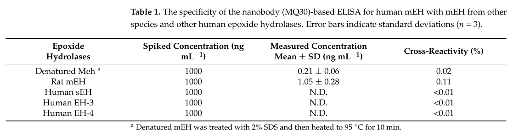

## Question

# Gene Research for Functional Annotation

## ⚠️ CRITICAL: Gene/Protein Identification Context

**BEFORE YOU BEGIN RESEARCH:** You MUST verify you are researching the CORRECT gene/protein. Gene symbols can be ambiguous, especially for less well-characterized genes from non-model organisms.

### Target Gene/Protein Identity (from UniProt):
- **UniProt Accession:** P07687
- **Protein Description:** RecName: Full=Epoxide hydrolase 1 {ECO:0000305}; EC=3.3.2.9 {ECO:0000269|PubMed:9854022}; AltName: Full=Epoxide hydratase; AltName: Full=Microsomal epoxide hydrolase; Short=mEH {ECO:0000305};
- **Gene Information:** Name=Ephx1 {ECO:0000312|RGD:2557}; Synonyms=Eph-1;
- **Organism (full):** Rattus norvegicus (Rat).
- **Protein Family:** Belongs to the peptidase S33 family. .
- **Key Domains:** AB_hydrolase_fold. (IPR029058); Epox_hydrolase-like. (IPR000639); Epoxide_hydro_N. (IPR010497); Epoxide_hydrolase. (IPR016292); EHN (PF06441)

### MANDATORY VERIFICATION STEPS:

1. **Check if the gene symbol "Ephx1" matches the protein description above**
2. **Verify the organism is correct:** Rattus norvegicus (Rat).
3. **Check if protein family/domains align with what you find in literature**
4. **If you find literature for a DIFFERENT gene with the same or similar symbol, STOP**

### If Gene Symbol is Ambiguous or You Cannot Find Relevant Literature:

**DO NOT PROCEED WITH RESEARCH ON A DIFFERENT GENE.** Instead:
- State clearly: "The gene symbol 'Ephx1' is ambiguous or literature is limited for this specific protein"
- Explain what you found (e.g., "Found extensive literature on a different gene with the same symbol in a different organism")
- Describe the protein based ONLY on the UniProt information provided above
- Suggest that the protein function can be inferred from domain/family information

### Research Target:

Please provide a comprehensive research report on the gene **Ephx1** (gene ID: Ephx1, UniProt: P07687) in rat.

The research report should be a detailed narrative explaining the function, biological processes, and localization of the gene product. Citations should be given for all claims.

You should prioritize authoritative reviews and primary scientific literature when conducting research. You can supplement
this with annotations you find in gene/protein databases, but these can be outdated or inaccurate.

We are specifically interested in the primary function of the gene - for enzymes, what reaction is catalyzed, and what is the substrate specificity? For transporters, what is the substrate? For structural proteins or adapters, what is the broader structural role? For signaling molecules, what is the role in the pathway.

We are interested in where in or outside the cell the gene product carries out its function.

We are also interested in the signaling or biochemical pathways in which the gene functions. We are less interested in broad pleiotropic effects, except where these elucidate the precise role.

Include evidence where possible. We are interested in both experimental evidence as well as inference from structure, evolution, or bioinformatic analysis. Precise studies should be prioritized over high-throughput, where available.

## Output

Question: You are an expert researcher providing comprehensive, well-cited information.

Provide detailed information focusing on:
1. Key concepts and definitions with current understanding
2. Recent developments and latest research (prioritize 2023-2024 sources)
3. Current applications and real-world implementations
4. Expert opinions and analysis from authoritative sources
5. Relevant statistics and data from recent studies

Format as a comprehensive research report with proper citations. Include URLs and publication dates where available.
Always prioritize recent, authoritative sources and provide specific citations for all major claims.

# Gene Research for Functional Annotation

## ⚠️ CRITICAL: Gene/Protein Identification Context

**BEFORE YOU BEGIN RESEARCH:** You MUST verify you are researching the CORRECT gene/protein. Gene symbols can be ambiguous, especially for less well-characterized genes from non-model organisms.

### Target Gene/Protein Identity (from UniProt):
- **UniProt Accession:** P07687
- **Protein Description:** RecName: Full=Epoxide hydrolase 1 {ECO:0000305}; EC=3.3.2.9 {ECO:0000269|PubMed:9854022}; AltName: Full=Epoxide hydratase; AltName: Full=Microsomal epoxide hydrolase; Short=mEH {ECO:0000305};
- **Gene Information:** Name=Ephx1 {ECO:0000312|RGD:2557}; Synonyms=Eph-1;
- **Organism (full):** Rattus norvegicus (Rat).
- **Protein Family:** Belongs to the peptidase S33 family. .
- **Key Domains:** AB_hydrolase_fold. (IPR029058); Epox_hydrolase-like. (IPR000639); Epoxide_hydro_N. (IPR010497); Epoxide_hydrolase. (IPR016292); EHN (PF06441)

### MANDATORY VERIFICATION STEPS:

1. **Check if the gene symbol "Ephx1" matches the protein description above**
2. **Verify the organism is correct:** Rattus norvegicus (Rat).
3. **Check if protein family/domains align with what you find in literature**
4. **If you find literature for a DIFFERENT gene with the same or similar symbol, STOP**

### If Gene Symbol is Ambiguous or You Cannot Find Relevant Literature:

**DO NOT PROCEED WITH RESEARCH ON A DIFFERENT GENE.** Instead:
- State clearly: "The gene symbol 'Ephx1' is ambiguous or literature is limited for this specific protein"
- Explain what you found (e.g., "Found extensive literature on a different gene with the same symbol in a different organism")
- Describe the protein based ONLY on the UniProt information provided above
- Suggest that the protein function can be inferred from domain/family information

### Research Target:

Please provide a comprehensive research report on the gene **Ephx1** (gene ID: Ephx1, UniProt: P07687) in rat.

The research report should be a detailed narrative explaining the function, biological processes, and localization of the gene product. Citations should be given for all claims.

You should prioritize authoritative reviews and primary scientific literature when conducting research. You can supplement
this with annotations you find in gene/protein databases, but these can be outdated or inaccurate.

We are specifically interested in the primary function of the gene - for enzymes, what reaction is catalyzed, and what is the substrate specificity? For transporters, what is the substrate? For structural proteins or adapters, what is the broader structural role? For signaling molecules, what is the role in the pathway.

We are interested in where in or outside the cell the gene product carries out its function.

We are also interested in the signaling or biochemical pathways in which the gene functions. We are less interested in broad pleiotropic effects, except where these elucidate the precise role.

Include evidence where possible. We are interested in both experimental evidence as well as inference from structure, evolution, or bioinformatic analysis. Precise studies should be prioritized over high-throughput, where available.

# Research report: Rat **Ephx1** (UniProt **P07687**) — microsomal epoxide hydrolase 1 (mEH; **EC 3.3.2.9**)

## Executive summary
Rat **Ephx1** encodes **microsomal epoxide hydrolase 1 (EPHX1/mEH)**, a membrane-anchored **α/β-hydrolase-fold** enzyme best known for catalyzing the **hydrolysis of epoxides to the corresponding vicinal diols**. This reaction is central to **xenobiotic detoxification** (and in some cases **bioactivation**) because many epoxides are reactive intermediates generated by cytochrome P450s. EPHX1 is primarily localized to the **endoplasmic reticulum (microsomes)** with a single **N-terminal membrane anchor**, and it is also reported at the **hepatocyte sinusoidal/plasma membrane**. Catalysis proceeds by a **two-step covalent mechanism** requiring a conserved catalytic triad **Asp226–Glu404–His431**, with Tyr residues contributing to epoxide activation/positioning. Recent research (2023) has produced **high-sensitivity nanobody-based ELISAs** for mEH with **pg/mL detection** and explicit testing against **rat mEH** for cross-reactivity, enabling translational quantification and biomarker-oriented studies.

## 1. Target verification (mandatory identity check)
### 1.1. Gene/protein identity and distinction from related enzymes
The target **Ephx1 (rat)** is the gene encoding **microsomal epoxide hydrolase (mEH; EPHX1; EC 3.3.2.9)**, a **membrane-associated** member of the mammalian epoxide hydrolase family. It must be distinguished from **EPHX2**, the **soluble epoxide hydrolase (sEH)**, which is cytosolic/peroxisomal and has a different physiological emphasis in lipid-epoxide signaling. Authoritative reviews explicitly separate **EPHX1 (microsomal)** from **EPHX2 (soluble)** and describe EPHX1 as the earlier-characterized membrane-anchored detoxification enzyme. (https://doi.org/10.3390/ijms22010013; published Dec 2020) (gautheron2020themultifacetedrole pages 1-2)

### 1.2. Alignment with UniProt-provided family/domain expectations
EPHX1 is consistently described as an **α/β-hydrolase-fold** enzyme with a short **N-terminal transmembrane signal/anchor** that retains the protein in microsomal membranes, matching the UniProt-provided domain/family expectations (AB_hydrolase_fold; epoxide hydrolase-like). (https://doi.org/10.1007/s00204-009-0416-0; published Apr 2009) (decker2009mammalianepoxidehydrolases pages 5-7)

## 2. Key concepts and definitions (current understanding)
### 2.1. Core enzymatic function and reaction chemistry
**Epoxide hydrolases** catalyze **addition of water to epoxides** to form **1,2-diols** (often called dihydrodiols for aromatic systems). For EPHX1, this is the defining biochemical activity and explains its role in xenobiotic metabolism because many drugs and pollutants are oxidized to epoxides by CYP enzymes. (https://doi.org/10.1016/j.gene.2015.07.071; published Oct 2015) (vaclavikova2015microsomalepoxidehydrolase pages 3-4)

### 2.2. Catalytic mechanism (two-step covalent catalysis)
Mammalian EPHX1/mEH uses a classic **two-step α/β-hydrolase mechanism**: (i) a **nucleophilic attack** opens the epoxide to form an **enzyme–substrate ester intermediate**, then (ii) **water activated by a charge-relay system** hydrolyzes the ester, releasing the diol. (https://doi.org/10.3390/ijms22010013; published Dec 2020) (gautheron2020themultifacetedrole pages 2-4)

### 2.3. Catalytic residues and active-site features
Site-directed mutagenesis work summarized in authoritative reviews identifies the **catalytic triad** as **Asp226, Glu404, and His431**. Two Tyr residues (**Tyr299 and Tyr374**) hydrogen-bond to the epoxide oxygen to help position/activate substrate for catalysis. (https://doi.org/10.1007/s00204-009-0416-0; published Apr 2009) (decker2009mammalianepoxidehydrolases pages 5-7)

A later review reiterates a closely aligned residue set and explicitly describes **Asp226** as the nucleophile, **His431–Glu404** as a charge-relay system, and **Tyr374** as contributing to substrate activation. (https://doi.org/10.1016/j.gene.2015.07.071; published Oct 2015) (vaclavikova2015microsomalepoxidehydrolase pages 3-4)

### 2.4. Subcellular localization and topology
EPHX1/mEH is primarily an **ER/microsomal** enzyme, with a single **N-terminal membrane anchor (~20 aa)** and the catalytic C-terminal domain facing the **cytosol**. (https://doi.org/10.1007/s00204-009-0416-0; published Apr 2009) (decker2009mammalianepoxidehydrolases pages 5-7)

EPHX1 has also been detected at the **hepatocyte sinusoidal/plasma membrane**, where it has been linked to **sodium-dependent bile acid transport** phenomena in hepatocytes (reported in reviews as an additional function/association beyond epoxide hydrolysis). (https://doi.org/10.1016/j.gene.2015.07.071; published Oct 2015) (vaclavikova2015microsomalepoxidehydrolase pages 3-4)

## 3. Functional annotation: substrates, specificity, and pathways
### 3.1. Xenobiotic substrates and roles in detoxification vs bioactivation
Reviews list a broad range of **xenobiotic epoxides** as EPHX1 substrates, including epoxides derived from **styrene**, **ethylene**, **cis-stilbene**, and various aromatic/industrial chemicals. (https://doi.org/10.1016/j.gene.2015.07.071; published Oct 2015) (vaclavikova2015microsomalepoxidehydrolase pages 3-4)

EPHX1 is also implicated in metabolism of epoxide intermediates from major toxicants and carcinogens, including **aflatoxin B1-8,9-epoxide** and **polycyclic aromatic hydrocarbon (PAH) epoxides** (e.g., benzo[a]pyrene epoxides), with the critical caveat that EPHX1 can contribute to either **detoxification** or **bioactivation** depending on the substrate and downstream pathways. (https://doi.org/10.1007/s00204-009-0416-0; published Apr 2009) (decker2009mammalianepoxidehydrolases pages 5-7)

### 3.2. Endogenous substrates and signaling-relevant metabolism
Although historically viewed as a xenobiotic-detoxification enzyme, EPHX1 is also reported to act on **endogenous epoxides**, including:

* **Epoxy-fatty acids**: arachidonic-acid-derived **epoxyeicosatrienoic acids (EETs)** and linoleic-acid-derived **EpOMEs**, which are hydrolyzed to corresponding diols (**DHETs** and **DiHOMEs**). (https://doi.org/10.3390/ijms22010013; published Dec 2020) (gautheron2020themultifacetedrole pages 2-4)
* **Epoxysteroids**: e.g., **androstene oxide** and estrogen-related epoxides, consistent with EPHX1’s ability to act on steroid epoxides in addition to xenobiotics. (https://doi.org/10.1016/j.gene.2015.07.071; published Oct 2015) (vaclavikova2015microsomalepoxidehydrolase pages 3-4)

A notable non-canonical activity discussed in reviews is metabolism of the endocannabinoid **2-arachidonoylglycerol (2-AG)** to **arachidonic acid + glycerol**, expanding EPHX1’s potential relevance to lipid mediator networks. (https://doi.org/10.1016/j.gene.2015.07.071; published Oct 2015) (vaclavikova2015microsomalepoxidehydrolase pages 3-4)

### 3.3. Pathway context: coupling with CYP epoxygenases and overlap with EPHX2
EPHX1’s ER localization places it in proximity to **CYP epoxygenases**, enabling coupled generation and hydrolysis of epoxides in microsomal membranes. Reviews emphasize that EPHX1 and EPHX2 can have **overlapping substrate selectivity**, particularly for lipid epoxides, but EPHX1 remains especially associated with xenobiotic epoxide turnover. (https://doi.org/10.3390/ijms22010013; published Dec 2020) (gautheron2020themultifacetedrole pages 10-12)

## 4. Expression and regulation with rat-specific evidence
### 4.1. Rat hepatocyte hormonal regulation
A key rat-specific finding repeatedly cited in reviews is that **EPHX1 protein levels in cultured primary rat hepatocytes are positively regulated by insulin and negatively regulated by glucagon**. (https://doi.org/10.3390/ijms22010013; published Dec 2020) (gautheron2020themultifacetedrole pages 2-4)

### 4.2. Inducibility in rat liver (xenobiotic and substrate-linked)
Reviews cite older primary studies documenting **transcriptional regulation/induction** of **rat liver** microsomal epoxide hydrolase by xenobiotics such as **phenobarbital** and chemical exposures, indicating EPHX1 is part of inducible hepatic biotransformation programs. (https://doi.org/10.1016/j.gene.2015.07.071; published Oct 2015) (vaclavikova2015microsomalepoxidehydrolase pages 11-12)

### 4.3. Tissue distribution (evidence limits)
Across mammals, EPHX1 is described as **widely expressed**, with particularly high expression in **liver** and additional expression in other organs (e.g., lung, kidney, intestine, brain). However, within the retrieved full-text evidence here, **rat-specific quantitative tissue distribution values** (e.g., absolute protein levels across rat organs) were not available; therefore, tissue distribution is reported at a general mammalian level with rat-specific regulation emphasized where explicitly supported. (https://doi.org/10.1007/s00204-009-0416-0; published Apr 2009) (decker2009mammalianepoxidehydrolases pages 5-7)

## 5. Recent developments and latest research (prioritizing 2023–2024)
### 5.1. 2023 nanobody-based ELISA for microsomal epoxide hydrolase (mEH/EPHX1)
A major 2023 methodological advance is development of **nanobody-based sandwich ELISAs** for human mEH/EPHX1, designed to enable sensitive and standardized protein quantification in tissues and potentially plasma. The strongest amplified format (SA-PolyHRP) achieved a reported **limit of detection (LOD) of 0.012 ng/mL** and **sensitivity of 3.130 OD·mL/ng**, representing ~**22-fold** lower LOD and ~**28-fold** higher sensitivity relative to the conventional format. (https://doi.org/10.3390/ijms241914698; published Sep 2023) (he2023thegenerationof pages 4-5)

The same study reports minimal cross-reactivity to related epoxide hydrolases and includes explicit cross-reactivity testing against **rat mEH**, reporting **0.11%** cross-reactivity (with <0.01% for human sEH/EH-3/EH-4). (https://doi.org/10.3390/ijms241914698; published Sep 2023) (he2023thegenerationof pages 4-5)

The ELISA measurements in tissues were reported to correlate strongly with activity assays (R² > 0.95). (https://doi.org/10.3390/ijms241914698; published Sep 2023) (he2023thegenerationof pages 1-2)

**Visual evidence (tables/figures)** supporting these 2023 assay metrics and cross-reactivity is available from the paper’s **Table 1** (cross-reactivity) and an inset table in **Figure 2** (LOD/sensitivity), plus a schematic assay overview. (he2023thegenerationof media 7adc8f19, he2023thegenerationof media 41860dae, he2023thegenerationof media da255d4a)

### 5.2. 2024: relative scarcity of EPHX1-specific advances in retrieved corpus
Within the retrieved 2024 literature set in this run, most newly retrieved review activity focused on **EPHX2/sEH** rather than EPHX1. In parallel, reviews continued to note that a complete **3D structure for human EPHX1** was not yet available (limiting structure-guided advances for EPHX1 relative to some other family members). (https://doi.org/10.3390/ijms22010013; published Dec 2020) (gautheron2020themultifacetedrole pages 1-2)

## 6. Current applications and real-world implementations
### 6.1. Drug metabolism and chemical safety/toxicology
In drug metabolism and toxicology practice, microsomal epoxide hydrolase activity is a key component of **microsomal clearance and bioactivation/detoxification** for compounds that form epoxide intermediates. Reviews emphasize EPHX1’s centrality to detoxifying CYP-generated epoxides from drugs, pollutants, and toxins, while also highlighting cases where EPHX1 contributes to formation of reactive or carcinogenic products (substrate-dependent bioactivation). (https://doi.org/10.3390/ijms22010013; published Dec 2020) (gautheron2020themultifacetedrole pages 1-2)

### 6.2. Biomarker/diagnostic assay development
mEH has been discussed as a candidate biomarker/antigen in certain diseases, motivating the 2023 development of sensitive nanobody ELISAs. The authors argue these reagents could enable standardized quantification and potentially a **bedside assay**, though this remains translational/developmental. (https://doi.org/10.3390/ijms241914698; published Sep 2023) (he2023thegenerationof pages 1-2)

## 7. Expert opinion and authoritative synthesis (interpretation)
Across authoritative reviews, a consistent expert view is that **EPHX1’s “primary job” is epoxide-to-diol conversion at microsomal membranes**, positioning it as a frontline defense against reactive epoxide intermediates in the ER. At the same time, the field recognizes an expanding set of **endogenous substrates** (epoxy-fatty acids, epoxysteroids; and evidence for 2-AG hydrolysis), suggesting EPHX1 contributes to **lipid mediator homeostasis** alongside EPHX2, but typically with different subcellular context and (often) lower catalytic prominence for classic EET turnover compared with sEH. (gautheron2020themultifacetedrole pages 2-4, gautheron2020themultifacetedrole pages 10-12)

## 8. Relevant statistics and quantitative data (from recent studies)
### 8.1. 2023 ELISA analytical performance (quantitative)
From He et al. 2023 (Int. J. Mol. Sci.; Sep 2023; https://doi.org/10.3390/ijms241914698):

* **LOD**: 0.012 ng/mL (best amplified format). (he2023thegenerationof pages 4-5)
* **Sensitivity**: 3.130 OD·mL/ng (best amplified format). (he2023thegenerationof pages 4-5)
* **Cross-reactivity**: **rat mEH 0.11%**; denatured mEH 0.02%; human sEH/EH-3/EH-4 <0.01%. (he2023thegenerationof pages 4-5)
* **Correlation with enzyme activity**: ELISA vs tissue activity assay **R² > 0.95**. (he2023thegenerationof pages 1-2)

These metrics are supported by extracted table/figure images from the publication. (he2023thegenerationof media 7adc8f19, he2023thegenerationof media 41860dae, he2023thegenerationof media da255d4a)

### 8.2. Data gaps (explicit)
In the retrieved evidence for this run, **rat-specific kinetic constants (kcat, KM)** for defined EPHX1 substrates and **quantitative organ-by-organ expression** (e.g., pmol/mg microsomal protein in specific rat tissues) were not present in the available excerpts. Consequently, the report emphasizes: (i) residue-level catalytic mechanism (strongly supported), (ii) substrate examples (strongly supported), and (iii) a recent quantitative assay platform (strongly supported). (vaclavikova2015microsomalepoxidehydrolase pages 3-4, decker2009mammalianepoxidehydrolases pages 5-7, he2023thegenerationof pages 1-2, he2023thegenerationof pages 4-5)

## Evidence-backed functional annotation summary
| Category | Summary |
|---|---|
| identity | Rat **Ephx1** (UniProt **P07687**) corresponds to **microsomal epoxide hydrolase 1** (**EPHX1/mEH; EC 3.3.2.9**), a membrane-anchored **α/β-hydrolase-fold** enzyme distinct from **EPHX2/sEH**, which is the soluble epoxide hydrolase. Conserved mammalian descriptions match the UniProt family/domain assignment and explicitly distinguish EPHX1 as the microsomal isoform. (gautheron2020themultifacetedrole pages 2-4, vaclavikova2015microsomalepoxidehydrolase pages 3-4, decker2009mammalianepoxidehydrolases pages 5-7) |
| reaction | The primary reaction is **hydrolysis of epoxides to vicinal diols/dihydrodiols**. In current understanding, EPHX1 acts mainly in detoxification of reactive xenobiotic epoxides but also contributes to metabolism of selected endogenous lipid and steroid epoxides. (gautheron2020themultifacetedrole pages 2-4, vaclavikova2015microsomalepoxidehydrolase pages 3-4, gautheron2020themultifacetedrole pages 1-2) |
| mechanism/residues | Catalysis proceeds through a **two-step mechanism**: nucleophilic attack on the epoxide to form a **covalent ester intermediate**, followed by hydrolysis by activated water. Key conserved residues are **Asp226, Glu404, His431** (catalytic triad) with **Tyr299 and Tyr374** helping orient/activate the epoxide oxygen. (vaclavikova2015microsomalepoxidehydrolase pages 3-4, decker2009mammalianepoxidehydrolases pages 5-7) |
| localization/topology | EPHX1 is primarily a **microsomal/endoplasmic reticulum** protein with a short **N-terminal transmembrane anchor** and a catalytic domain exposed on the **cytosolic face**. It has also been detected at the **hepatocyte sinusoidal/plasma membrane**, consistent with reported bile-acid transport-associated functions. (gautheron2020themultifacetedrole pages 2-4, vaclavikova2015microsomalepoxidehydrolase pages 3-4, decker2009mammalianepoxidehydrolases pages 5-7, morisseau2013roleofepoxide pages 2-3) |
| xenobiotic substrates/examples | Reported xenobiotic substrates include **styrene oxide, cis-stilbene oxide, cyclohexene oxide, indene 1,2-oxide, ethylene oxide**, anticonvulsant-derived epoxides, and epoxides from **polycyclic aromatic hydrocarbons** and **aflatoxin B1**. Depending on substrate context, EPHX1 can contribute to **detoxification** or to **bioactivation** pathways that generate carcinogenic metabolites. (gautheron2020themultifacetedrole pages 2-4, vaclavikova2015microsomalepoxidehydrolase pages 3-4, decker2009mammalianepoxidehydrolases pages 5-7, gautheron2020themultifacetedrole pages 4-6, gautheron2020themultifacetedrole pages 13-15) |
| endogenous substrates/examples | Endogenous substrates/processes include **epoxy-fatty acids** such as **EETs** and **EpOMEs** (to **DHETs** and **DiHOMEs**), **epoxysteroids** such as androstene oxide/estroxide, and a reported non-canonical hydrolytic activity toward **2-arachidonoylglycerol (2-AG)** yielding **arachidonic acid + glycerol**. Reviews note overlap with EPHX2 for some lipid epoxides, but EPHX1 is especially linked to xenobiotic metabolism. (gautheron2020themultifacetedrole pages 2-4, vaclavikova2015microsomalepoxidehydrolase pages 3-4, gautheron2020themultifacetedrole pages 4-6, gautheron2020themultifacetedrole pages 13-15, gautheron2020themultifacetedrole pages 10-12, morisseau2013roleofepoxide pages 2-3) |
| regulation/expression in rat | Rat-specific evidence shows **insulin positively** and **glucagon negatively** regulate EPHX1 in **primary cultured rat hepatocytes**. Additional rat hepatic studies cited in reviews report **xenobiotic/transcriptional induction** of mEH in liver, supporting a regulated role in hepatic biotransformation. (gautheron2020themultifacetedrole pages 2-4, gautheron2020themultifacetedrole pages 12-13, vaclavikova2015microsomalepoxidehydrolase pages 1-3, vaclavikova2015microsomalepoxidehydrolase pages 3-4, gautheron2020themultifacetedrole pages 13-15, vaclavikova2015microsomalepoxidehydrolase pages 11-12) |
| recent 2023-2024 developments/applications | A notable recent development is a **2023 nanobody-based ELISA** for human mEH/EPHX1, relevant to translational biomarker work and potentially adaptable for comparative mammalian studies. The assay supports applications in **tissue quantification**, disease biomarker research, and standardized detection of mEH, while cross-reactivity testing included **rat mEH**. (he2023thegenerationof pages 1-2, he2023thegenerationof pages 4-5, he2023thegenerationof pages 10-11, he2023thegenerationof pages 5-7) |
| quantitative data | In the 2023 ELISA study, the best amplified format achieved **LOD 0.012 ng/mL** and **sensitivity 3.130 OD·mL/ng**, with about **22-fold lower LOD** and **~28-fold higher sensitivity** than the conventional format; correlation with enzyme activity in tissues was **R² > 0.95**. Reported cross-reactivity was **0.11% for rat mEH**, **0.02% for denatured mEH**, and **<0.01%** for human sEH/EH-3/EH-4; spike recoveries were approximately **73–126%** in plasma and extended to roughly **72–141%** in tissue matrices depending on format/dilution. (he2023thegenerationof pages 1-2, he2023thegenerationof pages 4-5, he2023thegenerationof pages 10-11, he2023thegenerationof pages 5-7, he2023thegenerationof media 7adc8f19, he2023thegenerationof media 41860dae, he2023thegenerationof media da255d4a) |

*Table: This table summarizes the core functional annotation of rat Ephx1/EPHX1 (microsomal epoxide hydrolase), including identity, reaction chemistry, localization, substrates, rat-specific regulation, and recent assay developments. It is useful as a compact evidence-backed overview for gene/protein annotation and literature synthesis.*

## References (URLs and publication dates)
* Decker M, Arand M, Cronin A. **Mammalian epoxide hydrolases in xenobiotic metabolism and signalling**. *Archives of Toxicology* (Apr 2009). https://doi.org/10.1007/s00204-009-0416-0 (decker2009mammalianepoxidehydrolases pages 5-7)
* Václavíková R, Hughes DJ, Souček P. **Microsomal epoxide hydrolase 1 (EPHX1): Gene, structure, function, and role in human disease**. *Gene* (Oct 2015). https://doi.org/10.1016/j.gene.2015.07.071 (vaclavikova2015microsomalepoxidehydrolase pages 3-4)
* Gautheron J, Jéru I. **The Multifaceted Role of Epoxide Hydrolases in Human Health and Disease**. *International Journal of Molecular Sciences* (Dec 2020). https://doi.org/10.3390/ijms22010013 (gautheron2020themultifacetedrole pages 1-2)
* Morisseau C. **Role of epoxide hydrolases in lipid metabolism**. *Biochimie* (Jan 2013). https://doi.org/10.1016/j.biochi.2012.06.011 (morisseau2013roleofepoxide pages 2-3)
* He Q, McCoy MR, Qi M, et al. **The Generation of a Nanobody-Based ELISA for Human Microsomal Epoxide Hydrolase**. *International Journal of Molecular Sciences* (Sep 2023). https://doi.org/10.3390/ijms241914698 (he2023thegenerationof pages 1-2)

References

1. (gautheron2020themultifacetedrole pages 1-2): Jérémie Gautheron and Isabelle Jéru. The multifaceted role of epoxide hydrolases in human health and disease. International Journal of Molecular Sciences, 22:13, Dec 2020. URL: https://doi.org/10.3390/ijms22010013, doi:10.3390/ijms22010013. This article has 122 citations.

2. (decker2009mammalianepoxidehydrolases pages 5-7): Martina Decker, Michael Arand, and Annette Cronin. Mammalian epoxide hydrolases in xenobiotic metabolism and signalling. Archives of Toxicology, 83:297-318, Apr 2009. URL: https://doi.org/10.1007/s00204-009-0416-0, doi:10.1007/s00204-009-0416-0. This article has 274 citations and is from a highest quality peer-reviewed journal.

3. (vaclavikova2015microsomalepoxidehydrolase pages 3-4): Radka Václavíková, David J. Hughes, and Pavel Souček. Microsomal epoxide hydrolase 1 (ephx1): gene, structure, function, and role in human disease. Gene, 571 1:1-8, Oct 2015. URL: https://doi.org/10.1016/j.gene.2015.07.071, doi:10.1016/j.gene.2015.07.071. This article has 127 citations and is from a peer-reviewed journal.

4. (gautheron2020themultifacetedrole pages 2-4): Jérémie Gautheron and Isabelle Jéru. The multifaceted role of epoxide hydrolases in human health and disease. International Journal of Molecular Sciences, 22:13, Dec 2020. URL: https://doi.org/10.3390/ijms22010013, doi:10.3390/ijms22010013. This article has 122 citations.

5. (gautheron2020themultifacetedrole pages 10-12): Jérémie Gautheron and Isabelle Jéru. The multifaceted role of epoxide hydrolases in human health and disease. International Journal of Molecular Sciences, 22:13, Dec 2020. URL: https://doi.org/10.3390/ijms22010013, doi:10.3390/ijms22010013. This article has 122 citations.

6. (vaclavikova2015microsomalepoxidehydrolase pages 11-12): Radka Václavíková, David J. Hughes, and Pavel Souček. Microsomal epoxide hydrolase 1 (ephx1): gene, structure, function, and role in human disease. Gene, 571 1:1-8, Oct 2015. URL: https://doi.org/10.1016/j.gene.2015.07.071, doi:10.1016/j.gene.2015.07.071. This article has 127 citations and is from a peer-reviewed journal.

7. (he2023thegenerationof pages 4-5): Qiyi He, Mark R. McCoy, Meng Qi, Christophe Morisseau, Huiyi Yang, Chengpeng Xu, Rachel Shey, Michael C. Goodman, Suqing Zhao, and Bruce D. Hammock. The generation of a nanobody-based elisa for human microsomal epoxide hydrolase. International Journal of Molecular Sciences, 24:14698, Sep 2023. URL: https://doi.org/10.3390/ijms241914698, doi:10.3390/ijms241914698. This article has 5 citations.

8. (he2023thegenerationof pages 1-2): Qiyi He, Mark R. McCoy, Meng Qi, Christophe Morisseau, Huiyi Yang, Chengpeng Xu, Rachel Shey, Michael C. Goodman, Suqing Zhao, and Bruce D. Hammock. The generation of a nanobody-based elisa for human microsomal epoxide hydrolase. International Journal of Molecular Sciences, 24:14698, Sep 2023. URL: https://doi.org/10.3390/ijms241914698, doi:10.3390/ijms241914698. This article has 5 citations.

9. (he2023thegenerationof media 7adc8f19): Qiyi He, Mark R. McCoy, Meng Qi, Christophe Morisseau, Huiyi Yang, Chengpeng Xu, Rachel Shey, Michael C. Goodman, Suqing Zhao, and Bruce D. Hammock. The generation of a nanobody-based elisa for human microsomal epoxide hydrolase. International Journal of Molecular Sciences, 24:14698, Sep 2023. URL: https://doi.org/10.3390/ijms241914698, doi:10.3390/ijms241914698. This article has 5 citations.

10. (he2023thegenerationof media 41860dae): Qiyi He, Mark R. McCoy, Meng Qi, Christophe Morisseau, Huiyi Yang, Chengpeng Xu, Rachel Shey, Michael C. Goodman, Suqing Zhao, and Bruce D. Hammock. The generation of a nanobody-based elisa for human microsomal epoxide hydrolase. International Journal of Molecular Sciences, 24:14698, Sep 2023. URL: https://doi.org/10.3390/ijms241914698, doi:10.3390/ijms241914698. This article has 5 citations.

11. (he2023thegenerationof media da255d4a): Qiyi He, Mark R. McCoy, Meng Qi, Christophe Morisseau, Huiyi Yang, Chengpeng Xu, Rachel Shey, Michael C. Goodman, Suqing Zhao, and Bruce D. Hammock. The generation of a nanobody-based elisa for human microsomal epoxide hydrolase. International Journal of Molecular Sciences, 24:14698, Sep 2023. URL: https://doi.org/10.3390/ijms241914698, doi:10.3390/ijms241914698. This article has 5 citations.

12. (morisseau2013roleofepoxide pages 2-3): Christophe Morisseau. Role of epoxide hydrolases in lipid metabolism. Biochimie, 95 1:91-5, Jan 2013. URL: https://doi.org/10.1016/j.biochi.2012.06.011, doi:10.1016/j.biochi.2012.06.011. This article has 114 citations and is from a peer-reviewed journal.

13. (gautheron2020themultifacetedrole pages 4-6): Jérémie Gautheron and Isabelle Jéru. The multifaceted role of epoxide hydrolases in human health and disease. International Journal of Molecular Sciences, 22:13, Dec 2020. URL: https://doi.org/10.3390/ijms22010013, doi:10.3390/ijms22010013. This article has 122 citations.

14. (gautheron2020themultifacetedrole pages 13-15): Jérémie Gautheron and Isabelle Jéru. The multifaceted role of epoxide hydrolases in human health and disease. International Journal of Molecular Sciences, 22:13, Dec 2020. URL: https://doi.org/10.3390/ijms22010013, doi:10.3390/ijms22010013. This article has 122 citations.

15. (gautheron2020themultifacetedrole pages 12-13): Jérémie Gautheron and Isabelle Jéru. The multifaceted role of epoxide hydrolases in human health and disease. International Journal of Molecular Sciences, 22:13, Dec 2020. URL: https://doi.org/10.3390/ijms22010013, doi:10.3390/ijms22010013. This article has 122 citations.

16. (vaclavikova2015microsomalepoxidehydrolase pages 1-3): Radka Václavíková, David J. Hughes, and Pavel Souček. Microsomal epoxide hydrolase 1 (ephx1): gene, structure, function, and role in human disease. Gene, 571 1:1-8, Oct 2015. URL: https://doi.org/10.1016/j.gene.2015.07.071, doi:10.1016/j.gene.2015.07.071. This article has 127 citations and is from a peer-reviewed journal.

17. (he2023thegenerationof pages 10-11): Qiyi He, Mark R. McCoy, Meng Qi, Christophe Morisseau, Huiyi Yang, Chengpeng Xu, Rachel Shey, Michael C. Goodman, Suqing Zhao, and Bruce D. Hammock. The generation of a nanobody-based elisa for human microsomal epoxide hydrolase. International Journal of Molecular Sciences, 24:14698, Sep 2023. URL: https://doi.org/10.3390/ijms241914698, doi:10.3390/ijms241914698. This article has 5 citations.

18. (he2023thegenerationof pages 5-7): Qiyi He, Mark R. McCoy, Meng Qi, Christophe Morisseau, Huiyi Yang, Chengpeng Xu, Rachel Shey, Michael C. Goodman, Suqing Zhao, and Bruce D. Hammock. The generation of a nanobody-based elisa for human microsomal epoxide hydrolase. International Journal of Molecular Sciences, 24:14698, Sep 2023. URL: https://doi.org/10.3390/ijms241914698, doi:10.3390/ijms241914698. This article has 5 citations.

## Artifacts

- [Edison artifact artifact-00](Ephx1-deep-research-falcon_artifacts/artifact-00.md)

## Citations

1. gautheron2020themultifacetedrole pages 1-2
2. decker2009mammalianepoxidehydrolases pages 5-7
3. vaclavikova2015microsomalepoxidehydrolase pages 3-4
4. gautheron2020themultifacetedrole pages 2-4
5. gautheron2020themultifacetedrole pages 10-12
6. vaclavikova2015microsomalepoxidehydrolase pages 11-12
7. he2023thegenerationof pages 4-5
8. he2023thegenerationof pages 1-2
9. morisseau2013roleofepoxide pages 2-3
10. gautheron2020themultifacetedrole pages 4-6
11. gautheron2020themultifacetedrole pages 13-15
12. gautheron2020themultifacetedrole pages 12-13
13. vaclavikova2015microsomalepoxidehydrolase pages 1-3
14. he2023thegenerationof pages 10-11
15. he2023thegenerationof pages 5-7
16. a
17. https://doi.org/10.3390/ijms22010013;
18. https://doi.org/10.1007/s00204-009-0416-0;
19. https://doi.org/10.1016/j.gene.2015.07.071;
20. https://doi.org/10.3390/ijms241914698;
21. https://doi.org/10.3390/ijms241914698
22. https://doi.org/10.1007/s00204-009-0416-0
23. https://doi.org/10.1016/j.gene.2015.07.071
24. https://doi.org/10.3390/ijms22010013
25. https://doi.org/10.1016/j.biochi.2012.06.011
26. https://doi.org/10.3390/ijms22010013,
27. https://doi.org/10.1007/s00204-009-0416-0,
28. https://doi.org/10.1016/j.gene.2015.07.071,
29. https://doi.org/10.3390/ijms241914698,
30. https://doi.org/10.1016/j.biochi.2012.06.011,