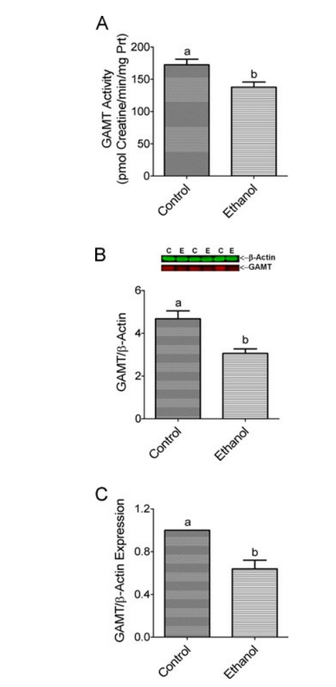

## Question

# Gene Research for Functional Annotation

## ⚠️ CRITICAL: Gene/Protein Identification Context

**BEFORE YOU BEGIN RESEARCH:** You MUST verify you are researching the CORRECT gene/protein. Gene symbols can be ambiguous, especially for less well-characterized genes from non-model organisms.

### Target Gene/Protein Identity (from UniProt):
- **UniProt Accession:** P10868
- **Protein Description:** RecName: Full=Guanidinoacetate N-methyltransferase; EC=2.1.1.2;
- **Gene Information:** Name=Gamt;
- **Organism (full):** Rattus norvegicus (Rat).
- **Protein Family:** Belongs to the class I-like SAM-binding methyltransferase
- **Key Domains:** GuanidinoAc_N-MeTrfase. (IPR016550); RMT2/GAMT_Mtase. (IPR051038); RMT2_dom. (IPR026480); SAM-dependent_MTases_sf. (IPR029063)

### MANDATORY VERIFICATION STEPS:

1. **Check if the gene symbol "Gamt" matches the protein description above**
2. **Verify the organism is correct:** Rattus norvegicus (Rat).
3. **Check if protein family/domains align with what you find in literature**
4. **If you find literature for a DIFFERENT gene with the same or similar symbol, STOP**

### If Gene Symbol is Ambiguous or You Cannot Find Relevant Literature:

**DO NOT PROCEED WITH RESEARCH ON A DIFFERENT GENE.** Instead:
- State clearly: "The gene symbol 'Gamt' is ambiguous or literature is limited for this specific protein"
- Explain what you found (e.g., "Found extensive literature on a different gene with the same symbol in a different organism")
- Describe the protein based ONLY on the UniProt information provided above
- Suggest that the protein function can be inferred from domain/family information

### Research Target:

Please provide a comprehensive research report on the gene **Gamt** (gene ID: Gamt, UniProt: P10868) in rat.

The research report should be a detailed narrative explaining the function, biological processes, and localization of the gene product. Citations should be given for all claims.

You should prioritize authoritative reviews and primary scientific literature when conducting research. You can supplement
this with annotations you find in gene/protein databases, but these can be outdated or inaccurate.

We are specifically interested in the primary function of the gene - for enzymes, what reaction is catalyzed, and what is the substrate specificity? For transporters, what is the substrate? For structural proteins or adapters, what is the broader structural role? For signaling molecules, what is the role in the pathway.

We are interested in where in or outside the cell the gene product carries out its function.

We are also interested in the signaling or biochemical pathways in which the gene functions. We are less interested in broad pleiotropic effects, except where these elucidate the precise role.

Include evidence where possible. We are interested in both experimental evidence as well as inference from structure, evolution, or bioinformatic analysis. Precise studies should be prioritized over high-throughput, where available.

## Output

Question: You are an expert researcher providing comprehensive, well-cited information.

Provide detailed information focusing on:
1. Key concepts and definitions with current understanding
2. Recent developments and latest research (prioritize 2023-2024 sources)
3. Current applications and real-world implementations
4. Expert opinions and analysis from authoritative sources
5. Relevant statistics and data from recent studies

Format as a comprehensive research report with proper citations. Include URLs and publication dates where available.
Always prioritize recent, authoritative sources and provide specific citations for all major claims.

# Gene Research for Functional Annotation

## ⚠️ CRITICAL: Gene/Protein Identification Context

**BEFORE YOU BEGIN RESEARCH:** You MUST verify you are researching the CORRECT gene/protein. Gene symbols can be ambiguous, especially for less well-characterized genes from non-model organisms.

### Target Gene/Protein Identity (from UniProt):
- **UniProt Accession:** P10868
- **Protein Description:** RecName: Full=Guanidinoacetate N-methyltransferase; EC=2.1.1.2;
- **Gene Information:** Name=Gamt;
- **Organism (full):** Rattus norvegicus (Rat).
- **Protein Family:** Belongs to the class I-like SAM-binding methyltransferase
- **Key Domains:** GuanidinoAc_N-MeTrfase. (IPR016550); RMT2/GAMT_Mtase. (IPR051038); RMT2_dom. (IPR026480); SAM-dependent_MTases_sf. (IPR029063)

### MANDATORY VERIFICATION STEPS:

1. **Check if the gene symbol "Gamt" matches the protein description above**
2. **Verify the organism is correct:** Rattus norvegicus (Rat).
3. **Check if protein family/domains align with what you find in literature**
4. **If you find literature for a DIFFERENT gene with the same or similar symbol, STOP**

### If Gene Symbol is Ambiguous or You Cannot Find Relevant Literature:

**DO NOT PROCEED WITH RESEARCH ON A DIFFERENT GENE.** Instead:
- State clearly: "The gene symbol 'Gamt' is ambiguous or literature is limited for this specific protein"
- Explain what you found (e.g., "Found extensive literature on a different gene with the same symbol in a different organism")
- Describe the protein based ONLY on the UniProt information provided above
- Suggest that the protein function can be inferred from domain/family information

### Research Target:

Please provide a comprehensive research report on the gene **Gamt** (gene ID: Gamt, UniProt: P10868) in rat.

The research report should be a detailed narrative explaining the function, biological processes, and localization of the gene product. Citations should be given for all claims.

You should prioritize authoritative reviews and primary scientific literature when conducting research. You can supplement
this with annotations you find in gene/protein databases, but these can be outdated or inaccurate.

We are specifically interested in the primary function of the gene - for enzymes, what reaction is catalyzed, and what is the substrate specificity? For transporters, what is the substrate? For structural proteins or adapters, what is the broader structural role? For signaling molecules, what is the role in the pathway.

We are interested in where in or outside the cell the gene product carries out its function.

We are also interested in the signaling or biochemical pathways in which the gene functions. We are less interested in broad pleiotropic effects, except where these elucidate the precise role.

Include evidence where possible. We are interested in both experimental evidence as well as inference from structure, evolution, or bioinformatic analysis. Precise studies should be prioritized over high-throughput, where available.

## Comprehensive Research Report: Rat **Gamt** (UniProt **P10868**) — Guanidinoacetate N‑methyltransferase (GAMT; EC 2.1.1.2)

### 1) Target verification (critical identity check)
The UniProt accession **P10868** corresponds to **guanidinoacetate N‑methyltransferase (GAMT)** encoded by **Gamt** in **Rattus norvegicus (rat)**, the canonical terminal enzyme of endogenous creatine biosynthesis. Rat primary literature explicitly describes **S‑adenosyl‑L‑methionine:N‑guanidinoacetate methyltransferase** converting **guanidinoacetate (GAA)** to **creatine**. (braissant2001endogenoussynthesisand pages 1-6, silva2009creatinesynthesishepatic pages 1-2)

### 2) Key concepts and definitions (current understanding)

#### 2.1 Creatine biosynthesis and the GAMT reaction
Creatine biosynthesis in mammals is a **two‑step pathway**: (i) **AGAT/GATM** synthesizes **guanidinoacetate (GAA)** from arginine and glycine; (ii) **GAMT/Gamt** methylates GAA to creatine. (silva2009creatinesynthesishepatic pages 1-2, mulik2023creatinedeficiencydisorders pages 1-2)

**GAMT catalyzed reaction (biochemical definition):**
- **Substrates:** guanidinoacetate (GAA) + **S‑adenosylmethionine (SAM/AdoMet)**
- **Products:** **creatine** + **S‑adenosylhomocysteine (SAH/AdoHcy)**
This reaction is explicitly described in rat studies and in situ pathway schematics. (braissant2001endogenoussynthesisand pages 1-6, silva2009creatinesynthesishepatic pages 1-2)

#### 2.2 Pathway partitioning and “inter‑organ creatine synthesis”
In rats, creatine biosynthesis is strongly **compartmentalized across organs**: **kidney** has high **AGAT** activity (GAA synthesis), while **liver** has high **GAMT** activity (GAA methylation to creatine). This supports an **inter‑organ pathway** in which renal GAA is transported to the liver for conversion into creatine. (silva2009creatinesynthesishepatic pages 1-2)

#### 2.3 Creatine homeostasis and feedback regulation
Whole‑body creatine is continuously lost by spontaneous conversion to creatinine (a turnover concept that creates a constant demand for synthesis or dietary intake). (silva2013aminoacidmetabolism pages 32-38)

A key regulatory principle is that **feedback control primarily occurs upstream**: dietary creatine strongly downregulates **renal AGAT**, decreasing circulating GAA supply, whereas **GAMT is comparatively less feedback‑regulated by creatine**. (silva2009creatinesynthesishepatic pages 1-2, silva2013aminoacidmetabolism pages 91-99, silva2013aminoacidmetabolism pages 38-45)

### 3) Molecular function and enzymology of rat GAMT

#### 3.1 Reaction chemistry, substrates, and assay conditions (rat evidence)
Rat liver GAMT activity has been directly assayed in liver homogenate supernatants using SAM and GAA substrates with creatine measured by HPLC (providing experimentally grounded support for function). (silva2009creatinesynthesishepatic pages 2-3)

#### 3.2 Substrate specificity and kinetic constants (what is known vs. not captured here)
From the retrieved rat full texts, the **substrate/product identity** and **SAM dependence** are clearly supported, but **explicit rat Km/Vmax values for GAMT itself** were not present in the accessible excerpts (in contrast to transporter kinetics and some pathway flux proxies). (silva2009creatinesynthesishepatic pages 2-3, silva2009creatinesynthesishepatic pages 1-2)

**Transport‑linked kinetics (relevant to effective substrate delivery):** in rats, hepatic uptake of GAA is a key control point for GAMT substrate availability; hepatocyte GAA uptake has been reported as saturable with **Km ~134 µM**, consistent with a transporter mechanism (see below). (silva2013aminoacidmetabolism pages 91-99)

### 4) Biological processes, pathways, and cellular/tissue localization

#### 4.1 Tissue distribution in rat: liver and pancreas as major GAMT sites
Rat liver exhibits high GAMT activity and readily converts GAA to creatine in isolated hepatocytes, supporting liver as a central organ of creatine synthesis. (silva2009creatinesynthesishepatic pages 1-2)

A rat metabolism chapter excerpt reports that **GAMT activity is present in liver and pancreas**, and that pancreatic acini have measurable AGAT and GAMT activities (supporting some local creatine synthesis capacity). (silva2013aminoacidmetabolism pages 91-99)

#### 4.2 CNS expression in rat (cell types and regions)
A rat in situ hybridization study mapped Gamt mRNA in the CNS and found **GAMT mRNA in neurons, astrocytes, and oligodendrocytes**, supporting **local creatine biosynthesis within brain tissue**. (braissant2001endogenoussynthesisand pages 23-27, braissant2001endogenoussynthesisand pages 1-6)

Regional/cellular detail included strong signal in **cerebellar granule cells**, with low expression in some other cerebellar cell types, and broader expression across multiple nuclei/regions; expression scoring was **semi‑quantitative** by ISH (+/++/++++). (braissant2001endogenoussynthesisand pages 23-27, braissant2001endogenoussynthesisand pages 6-11)

#### 4.3 Subcellular localization: cytosolic GAMT in rat liver
Rat liver GAMT activity in an ethanol-feeding model was measured specifically in **liver cytosolic fractions**, and the authors report that GAMT is **primarily localized to the cytosolic fraction** in rat liver. (kharbanda2014alcoholconsumptiondecreases pages 3-4)

### 5) Regulation and network context (methylation potential; transport coupling)

#### 5.1 SAM:SAH “methylation potential” as a key biochemical regulator
GAMT is a SAM‑dependent methyltransferase; a central regulatory principle is that **higher SAM supports methylation**, while **SAH inhibits methyltransferases**, and rat liver GAMT is described as **competitively inhibited by SAH**. (silva2009creatinesynthesishepatic pages 1-2)

In a rat chronic ethanol model, experimentally manipulating SAM:SAH in vitro showed that **GAMT activity decreases as SAM:SAH falls**; at **SAM:SAH ≈ 2.5**, GAMT activity was **~56% lower** than at a ratio of 5. (kharbanda2014alcoholconsumptiondecreases pages 3-4)

These relationships are also visible in the extracted figures from the ethanol study (Figures 3–4). (kharbanda2014alcoholconsumptiondecreases media e6b3ff30, kharbanda2014alcoholconsumptiondecreases media 1153d525)

#### 5.2 Transport and pathway wiring: hepatic GAA uptake aligns with GAMT distribution
A rat study identified **GAT2 (SLC6A13)** as a major transporter mediating **Na+/Cl−‑dependent hepatic GAA uptake**. This work localized GAT2 to the **sinusoidal membrane** of hepatocytes, predominantly in the **periportal region**, and noted that this distribution pattern was consistent with the distribution of the creatine biosynthetic enzyme **GAMT** (supporting anatomical coupling of substrate uptake and enzymatic conversion). (silva2013aminoacidmetabolism pages 91-99)

Quantitative transport statistics from that study include:
- Hepatocyte GAA uptake **Km = 134 µM**
- GAT2-mediated GAA transport **Km = 78.9 µM**
- GABA inhibition **IC50 = 8.81 µM**
(silva2013aminoacidmetabolism pages 91-99)

### 6) Recent developments (prioritizing 2023–2024)
Although the target gene is rat Gamt, the most active 2023–2024 literature relates to **human disease and translational biology** of the same pathway.

#### 6.1 2024 ClinGen expert standards and newborn-screening relevance
A 2024 ClinGen Variant Curation Expert Panel (VCEP) produced **gene‑specific ACMG/AMP variant classification recommendations** for the cerebral creatine deficiency syndrome (CCDS) genes **GAMT, GATM, and SLC6A8**, and curated **181 variants total**, including **72 GAMT variants**, with submissions to ClinVar and resolution of conflicting interpretations. (goldstein2024clingenvariantcuration pages 1-3)

The same paper summarizes key diagnostic biochemical signatures: **GAMT deficiency** is characterized by **elevated GAA with low/low‑normal creatine**, and brain MRS shows absent/markedly reduced creatine. Early identification and early treatment can yield markedly improved outcomes. (goldstein2024clingenvariantcuration pages 3-4)

#### 6.2 2024 longitudinal outcomes and monitoring biomarkers
A 2024 long-term follow‑up study (14‑year) of GAMT deficiency emphasizes that **elevated GAA in urine, plasma, and CSF is pathognomonic**, and notes that **plasma GAA** may be preferred because urine can be unreliable; brain proton MRS is used for quantitative monitoring and creatine can increase under therapy but may not normalize to control ranges. (marten2024longtermfollowup pages 1-2)

#### 6.3 2023 review synthesis: prevalence and treatment statistics (authoritative summary)
A 2023 review characterizes creatine deficiency disorders as **ultrarare**, with **<150 GAMT cases** reported at the time; it summarizes that GAMT deficiency commonly presents with neurodevelopmental impairment, seizures, movement/behavioral issues, and that treatment includes creatine supplementation plus measures to lower GAA (e.g., ornithine; arginine/protein restriction). (mulik2023creatinedeficiencydisorders pages 1-2)

Quantitative clinical statistics compiled in that review include:
- ~66–70% of patients with GAMT deficiency have seizures (reviewed across cohorts) (mulik2023creatinedeficiencydisorders pages 3-4, mulik2023creatinedeficiencydisorders pages 2-3)
- ~75% have behavioral disorders and ~33% have movement disorders (mulik2023creatinedeficiencydisorders pages 3-4)
- Treatment outcomes depend strongly on age at initiation: cognitive function can be restored if started <2 years, while initiation after 10 years showed no improvement in that review summary. (mulik2023creatinedeficiencydisorders pages 3-4, mulik2023creatinedeficiencydisorders pages 2-3)

### 7) Current applications and real‑world implementations

#### 7.1 Clinical diagnostics and monitoring (application of pathway knowledge)
Current real-world clinical implementation of GAMT pathway biology includes:
- **Biochemical screening** for elevated GAA and low creatine patterns (goldstein2024clingenvariantcuration pages 3-4, mulik2023creatinedeficiencydisorders pages 1-2)
- **Brain 1H‑MRS** to demonstrate absent/low creatine peak and to monitor therapy (marten2024longtermfollowup pages 1-2)
- **Genetic testing (NGS/exome/genome)** followed by biochemical/enzyme confirmation; ClinGen gene-specific rules now standardize variant interpretation. (goldstein2024clingenvariantcuration pages 1-3)

#### 7.2 Nutritional/metabolic management of GAMT deficiency
For GAMT deficiency (human), standard-of-care metabolic management includes:
- high-dose creatine replacement (reviewed) (mulik2023creatinedeficiencydisorders pages 2-3)
- ornithine supplementation and arginine/protein restriction to reduce GAA production via AGAT inhibition and precursor limitation (mulik2023creatinedeficiencydisorders pages 3-4, mulik2023creatinedeficiencydisorders pages 2-3)
These practices are downstream applications of the same enzymatic step catalyzed by rat Gamt/GAMT. (mulik2023creatinedeficiencydisorders pages 1-2)

#### 7.3 Translational relevance in liver disease and alcohol exposure (rat model application)
In rats, chronic ethanol feeding provides a real-world disease model linking methylation metabolism to creatine biosynthesis. Ethanol decreased hepatic SAM:SAH, reduced hepatic GAA uptake, and reduced cytosolic GAMT activity/protein, coinciding with large decreases in creatine pools in liver and other compartments. (kharbanda2014alcoholconsumptiondecreases pages 3-4, kharbanda2014alcoholconsumptiondecreases pages 1-2)

### 8) Expert opinions and authoritative interpretations (evidence-based synthesis)

#### 8.1 Consensus on pathway control points
Multiple sources converge on the idea that **GAMT catalyzes the terminal creatine synthesis step** and that **flux control is often upstream** through substrate supply (GAA availability) and regulation of AGAT rather than strong inhibition of GAMT by creatine. (silva2009creatinesynthesishepatic pages 1-2, silva2013aminoacidmetabolism pages 91-99, silva2013aminoacidmetabolism pages 38-45)

#### 8.2 Consensus on clinical importance of early detection
The 2023 review and the 2024 ClinGen/longitudinal follow-up literature emphasize that **early diagnosis and treatment** can prevent severe neurodevelopmental outcomes in GAMT deficiency, motivating newborn screening and standardized variant interpretation. (goldstein2024clingenvariantcuration pages 3-4, mulik2023creatinedeficiencydisorders pages 3-4, marten2024longtermfollowup pages 1-2)

### 9) Key quantitative statistics and data points (rat-focused where possible)

**Rat biochemical/physiology and regulation (selected):**
- Rat liver GAMT assay conditions reported with **SAM (50 µM)** and **GAA (0.2 mM)** and creatine measured by HPLC. (silva2009creatinesynthesishepatic pages 2-3)
- Rat chapter summary: **hepatic creatine ~0.25 µmol/g**, plasma GAA ~**5 µM** (dropping to ~**2 µM** with creatine feeding), and half‑maximal hepatocyte creatine synthesis at **~13 µM GAA**. (silva2013aminoacidmetabolism pages 91-99)
- Ethanol-fed rats: hepatic **SAM:SAH 4.88 ± 0.59 (control) vs 2.39 ± 0.37 (EtOH)**; in vitro SAM:SAH ≈2.5 produced **~56% lower** GAMT activity vs ratio 5; ethanol associated with **~20% lower** cytosolic GAMT activity and **~20–30% lower** GAMT protein plus **~60% lower** creatine in liver/plasma/heart; hepatocyte GAA uptake **~30% decreased** (kidney AGAT unchanged). (kharbanda2014alcoholconsumptiondecreases pages 3-4)
- Hepatic GAA transport kinetics (rat): hepatocyte uptake **Km 134 µM**; GAT2-mediated transport **Km 78.9 µM**; GABA inhibition **IC50 8.81 µM**. (silva2013aminoacidmetabolism pages 91-99)

**Human clinical statistics from recent reviews/consensus (contextual relevance):**
- GAMT deficiency case count and disorder rarity: <150 reported GAMT cases in 2023 review; CCDS total <500 reported. (mulik2023creatinedeficiencydisorders pages 1-2, goldstein2024clingenvariantcuration pages 1-3)
- Symptom frequencies: seizures ~66–70%, behavioral disorders ~75%, movement disorders ~33% (reviewed). (mulik2023creatinedeficiencydisorders pages 3-4, mulik2023creatinedeficiencydisorders pages 2-3)

### 10) Functional annotation summary (curated, evidence-backed)
A consolidated functional-annotation table is provided below for rapid reuse in gene annotation pipelines.

| Annotation aspect | Rat Gamt/GAMT finding | Key quantitative/statistical detail | Source (year; URL) | Citation IDs |
|---|---|---|---|---|
| Verified target identity | Gamt in rat corresponds to guanidinoacetate N-methyltransferase (GAMT; EC 2.1.1.2), the SAM-dependent enzyme of creatine biosynthesis that methylates guanidinoacetate to creatine. | Reaction consistently described across rat liver and rat brain studies. | da Silva et al., 2009; https://doi.org/10.1152/ajpendo.90547.2008 ; Braissant et al., 2001; https://doi.org/10.1016/S0169-328X(00)00269-2 | (braissant2001endogenoussynthesisand pages 1-6, silva2009creatinesynthesishepatic pages 1-2) |
| Catalyzed reaction | GAMT transfers a methyl group from S-adenosylmethionine (SAM/AdoMet) to guanidinoacetate (GAA), yielding creatine. | Coproduct is S-adenosylhomocysteine (SAH/AdoHcy). | da Silva et al., 2009; https://doi.org/10.1152/ajpendo.90547.2008 ; Braissant et al., 2001; https://doi.org/10.1016/S0169-328X(00)00269-2 | (braissant2001endogenoussynthesisand pages 1-6, silva2009creatinesynthesishepatic pages 1-2) |
| Substrates/cofactor | Required methyl donor/cofactor: SAM; acceptor substrate: guanidinoacetate. | Rat liver GAMT assay used 50 µM SAM and 0.2 mM GAA in cytosolic supernatant at 37°C. | da Silva et al., 2009; https://doi.org/10.1152/ajpendo.90547.2008 | (silva2009creatinesynthesishepatic pages 2-3) |
| Product specificity | Main product is creatine, the precursor for phosphocreatine-based energy buffering in muscle and brain. | GAMT is the second/terminal enzyme in the 2-step endogenous creatine pathway. | Mulik & Mercimek-Andrews, 2023; https://doi.org/10.5152/turkarchpediatr.2023.23022 ; da Silva, 2013 chapter (URL not available in gathered evidence) | (silva2013aminoacidmetabolism pages 32-38, mulik2023creatinedeficiencydisorders pages 1-2) |
| Pathway context | In mammals/rat, creatine biosynthesis is partitioned between organs: AGAT in kidney makes GAA from arginine + glycine; liver GAMT converts imported GAA to creatine. | In creatine-free rats, renal GAA output matches renal creatinine loss; GAA accounts for only ~20% of daily creatinine loss, implying broader tissue contribution to homeostasis. | da Silva et al., 2009; https://doi.org/10.1152/ajpendo.90547.2008 | (silva2009creatinesynthesishepatic pages 1-2) |
| Liver function in rat | Rat hepatocytes show brisk conversion of GAA to creatine, confirming hepatic GAMT activity. Hepatocytes do not perform the full pathway from methionine/arginine/glycine because rat liver lacks meaningful AGAT activity. | Hepatic creatine ~0.25 µmol/g; plasma GAA ~5 µM, falling to ~2 µM with creatine feeding; half-maximal hepatocyte creatine synthesis at ~13 µM GAA. | da Silva, 2013 chapter (URL not available in gathered evidence) | (silva2013aminoacidmetabolism pages 91-99) |
| Pancreas expression/function | Rat pancreas also contains measurable GAMT activity and can synthesize a small amount of creatine, although kidney-liver partitioning remains dominant. | Pancreatic acini have measurable AGAT and GAMT activities; no explicit GAMT kinetic constants provided in gathered evidence. | da Silva, 2013 chapter (URL not available in gathered evidence) | (silva2013aminoacidmetabolism pages 91-99) |
| Brain cell-type expression | Rat brain expresses Gamt mRNA in neurons, astrocytes, and oligodendrocytes, supporting local creatine synthesis within the CNS. | Semi-quantitative ISH: neurons +, astrocytes +, oligodendrocytes +; cerebellar granule cells show strong GAMT signal (reported as ++ to ++++ depending on summary granularity). | Braissant et al., 2001; https://doi.org/10.1016/S0169-328X(00)00269-2 | (braissant2001endogenoussynthesisand pages 23-27) |
| Brain regional/cellular detail | Rat brain Gamt transcripts are widespread; particularly noted in cerebellar granular neurons, several brainstem nuclei, and astrocytes contacting capillaries/BBB. Astrocytic expression is present but relatively low. | ISH signal is semi-quantitative and non-linear; GAMT mRNA shows mainly perinuclear localization with weaker diffuse signal in processes. | Braissant et al., 2001; https://doi.org/10.1016/S0169-328X(00)00269-2 | (braissant2001endogenoussynthesisand pages 23-27, braissant2001endogenoussynthesisand pages 6-11) |
| Subcellular localization | In rat liver, GAMT is primarily localized to the cytosolic fraction. | Activity assays in liver cytosol captured the major enzymatic pool. | Kharbanda et al., 2014; https://doi.org/10.1111/acer.12306 | (kharbanda2014alcoholconsumptiondecreases pages 3-4) |
| Immediate biochemical regulation | GAMT activity follows methylation potential: higher SAM favors activity, while higher SAH inhibits it. SAH is a competitive inhibitor of rat liver GAMT. | At SAM:SAH ~2.5 (ethanol-like ratio), GAMT activity was ~56% lower than at a ratio of 5. | da Silva et al., 2009; https://doi.org/10.1152/ajpendo.90547.2008 ; Kharbanda et al., 2014; https://doi.org/10.1111/acer.12306 | (silva2009creatinesynthesishepatic pages 1-2, kharbanda2014alcoholconsumptiondecreases pages 3-4) |
| Creatine feedback regulation | GAMT itself is not strongly downregulated by creatine; instead, feedback control of pathway flux primarily occurs upstream through suppression of renal AGAT, lowering GAA supply to hepatic GAMT. | Dietary creatine caused ~86% reduction in renal AGAT activity and ~70% lower plasma GAA; excess creatine up to ~5 mM did not inhibit GAMT in chapter summary. | da Silva et al., 2009; https://doi.org/10.1152/ajpendo.90547.2008 ; da Silva, 2013 chapter (URL not available in gathered evidence) | (silva2013aminoacidmetabolism pages 38-45, silva2009creatinesynthesishepatic pages 1-2, silva2013aminoacidmetabolism pages 91-99) |
| Methionine/SAM dependence | Methionine stimulates rat hepatocyte creatine synthesis indirectly by increasing SAM availability for GAMT. | Stimulation observed without enabling complete de novo synthesis from methionine/arginine/glycine. | da Silva et al., 2009; https://doi.org/10.1152/ajpendo.90547.2008 | (silva2009creatinesynthesishepatic pages 2-3, silva2009creatinesynthesishepatic pages 1-2) |
| Transport coupling to pathway | Hepatic creatine synthesis depends on uptake of circulating GAA into periportal hepatocytes; GAT2 mediates major Na+/Cl−-dependent hepatic GAA uptake and colocalizes with periportal GAMT distribution. | Hepatocyte GAA uptake Km 134 µM; GAT2-mediated transport Km 78.9 µM; GABA inhibits uptake with IC50 8.81 µM. | Tachikawa et al., 2012; https://doi.org/10.1371/journal.pone.0032557 | (silva2013aminoacidmetabolism pages 91-99) |
| Pathophysiologic modulation in rat | Chronic ethanol feeding lowers hepatic methylation potential and impairs GAMT-dependent creatine synthesis in rat liver. | Hepatic SAM:SAH 4.88 ± 0.59 (control) vs 2.39 ± 0.37 (EtOH); liver cytosolic GAMT activity ~20% lower; GAMT protein ~20–30% lower; liver/plasma/heart creatine ~60% lower; hepatocyte GAA uptake ~30% lower. | Kharbanda et al., 2014; https://doi.org/10.1111/acer.12306 | (kharbanda2014alcoholconsumptiondecreases pages 3-4, kharbanda2014alcoholconsumptiondecreases pages 1-2) |
| Functional significance | GAMT helps maintain creatine supply and also prevents accumulation of GAA, a metabolite whose excess is neurotoxic and diagnostic in GAMT deficiency. | GAMT deficiency biomarkers: elevated GAA with low creatine; brain 1H-MRS shows absent/markedly reduced creatine. | da Silva et al., 2009; https://doi.org/10.1152/ajpendo.90547.2008 ; Mulik & Mercimek-Andrews, 2023; https://doi.org/10.5152/turkarchpediatr.2023.23022 | (silva2009creatinesynthesishepatic pages 1-2, mulik2023creatinedeficiencydisorders pages 1-2, mulik2023creatinedeficiencydisorders pages 2-3) |
| Recent clinical/research relevance (2023–2024) | GAMT is a core gene in cerebral creatine deficiency syndromes; recent work emphasizes newborn screening, ClinGen variant curation, long-term follow-up, and early treatment. | <150 GAMT cases reported in review; ~66–70% seizures, ~75% behavioral disorders, ~33% movement disorders; treatment before age 2 can restore cognition better than treatment after age 10; ClinGen curated 181 CCDS variants total, including 72 GAMT variants. | Mulik & Mercimek-Andrews, 2023; https://doi.org/10.5152/turkarchpediatr.2023.23022 ; Goldstein et al., 2024; https://doi.org/10.1016/j.ymgme.2024.108362 ; Marten et al., 2024; https://doi.org/10.1016/j.ymgmr.2024.101053 | (goldstein2024clingenvariantcuration pages 3-4, mulik2023creatinedeficiencydisorders pages 3-4, goldstein2024clingenvariantcuration pages 1-3, marten2024longtermfollowup pages 1-2, mulik2023creatinedeficiencydisorders pages 2-3) |

*Table: This table compiles functional-annotation evidence for rat Gamt/GAMT (UniProt P10868), including reaction chemistry, pathway role, localization, expression, regulation, and quantitative findings. It is useful as a citation-ready summary of the strongest rat-focused and recent clinically relevant evidence gathered.*

### 11) Figure evidence (key visual results)
The relationship between methylation potential (SAM:SAH) and GAMT activity and ethanol-associated changes in hepatic GAMT are shown in extracted figures from Kharbanda et al. 2014. (kharbanda2014alcoholconsumptiondecreases media e6b3ff30, kharbanda2014alcoholconsumptiondecreases media 1153d525)

### 12) Limitations of this evidence set (what remains uncertain here)
- **Direct rat GAMT kinetic parameters (Km/Vmax for GAA and SAM)** and detailed **substrate specificity** are not present in the retrieved excerpts; these likely exist in specialized enzymology or structural papers (e.g., rat liver GAMT crystallography/ternary complex studies), but those full texts were not available in this tool run. (silva2009creatinesynthesishepatic pages 2-3, silva2009creatinesynthesishepatic pages 1-2)
- Brain localization evidence here is primarily **mRNA (ISH)** rather than quantitative proteomics or enzyme activity by cell type, so protein-level localization may differ from transcript patterns. (braissant2001endogenoussynthesisand pages 23-27, braissant2001endogenoussynthesisand pages 6-11)

### References (URLs and publication dates)
- Braissant O. et al. *Endogenous synthesis and transport of creatine in the rat brain: an in situ hybridization study.* **Jan 2001**. https://doi.org/10.1016/S0169-328X(00)00269-2 (braissant2001endogenoussynthesisand pages 1-6)
- da Silva R.P. et al. *Creatine synthesis: hepatic metabolism of guanidinoacetate and creatine in the rat in vitro and in vivo.* **Feb 2009**. https://doi.org/10.1152/ajpendo.90547.2008 (silva2009creatinesynthesishepatic pages 1-2)
- Kharbanda K.K. et al. *Alcohol consumption decreases rat hepatic creatine biosynthesis via altered guanidinoacetate methyltransferase activity.* **Mar 2014**. https://doi.org/10.1111/acer.12306 (kharbanda2014alcoholconsumptiondecreases pages 3-4)
- Mulik C., Mercimek-Andrews S. *Creatine Deficiency Disorders: Phenotypes, Genotypes, Diagnosis, and Treatment Outcomes.* **Mar 2023**. https://doi.org/10.5152/turkarchpediatr.2023.23022 (mulik2023creatinedeficiencydisorders pages 1-2)
- Goldstein J. et al. *ClinGen variant curation expert panel recommendations…* **May 2024**. https://doi.org/10.1016/j.ymgme.2024.108362 (goldstein2024clingenvariantcuration pages 1-3)
- Marten L.M. et al. *Long term follow-up in GAMT deficiency…* **Mar 2024**. https://doi.org/10.1016/j.ymgmr.2024.101053 (marten2024longtermfollowup pages 1-2)

References

1. (braissant2001endogenoussynthesisand pages 1-6): Olivier Braissant, Hugues Henry, Marc Loup, Barbara Eilers, and Claude Bachmann. Endogenous synthesis and transport of creatine in the rat brain: an in situ hybridization study. Brain research. Molecular brain research, 86 1-2:193-201, Jan 2001. URL: https://doi.org/10.1016/s0169-328x(00)00269-2, doi:10.1016/s0169-328x(00)00269-2. This article has 291 citations.

2. (silva2009creatinesynthesishepatic pages 1-2): Robin P. da Silva, Itzhak Nissim, Margaret E. Brosnan, and John T. Brosnan. Creatine synthesis: hepatic metabolism of guanidinoacetate and creatine in the rat in vitro and in vivo. American journal of physiology. Endocrinology and metabolism, 296 2:E256-61, Feb 2009. URL: https://doi.org/10.1152/ajpendo.90547.2008, doi:10.1152/ajpendo.90547.2008. This article has 231 citations.

3. (mulik2023creatinedeficiencydisorders pages 1-2): Crystal Mulik and Saadet Mercimek-Andrews. Creatine deficiency disorders: phenotypes, genotypes, diagnosis, and treatment outcomes. Turkish Archives of Pediatrics, 58:129-135, Mar 2023. URL: https://doi.org/10.5152/turkarchpediatr.2023.23022, doi:10.5152/turkarchpediatr.2023.23022. This article has 13 citations.

4. (silva2013aminoacidmetabolism pages 32-38): R Da Silva. Amino acid metabolism in the liver and pancreas. Unknown journal, 2013.

5. (silva2013aminoacidmetabolism pages 91-99): R Da Silva. Amino acid metabolism in the liver and pancreas. Unknown journal, 2013.

6. (silva2013aminoacidmetabolism pages 38-45): R Da Silva. Amino acid metabolism in the liver and pancreas. Unknown journal, 2013.

7. (silva2009creatinesynthesishepatic pages 2-3): Robin P. da Silva, Itzhak Nissim, Margaret E. Brosnan, and John T. Brosnan. Creatine synthesis: hepatic metabolism of guanidinoacetate and creatine in the rat in vitro and in vivo. American journal of physiology. Endocrinology and metabolism, 296 2:E256-61, Feb 2009. URL: https://doi.org/10.1152/ajpendo.90547.2008, doi:10.1152/ajpendo.90547.2008. This article has 231 citations.

8. (braissant2001endogenoussynthesisand pages 23-27): Olivier Braissant, Hugues Henry, Marc Loup, Barbara Eilers, and Claude Bachmann. Endogenous synthesis and transport of creatine in the rat brain: an in situ hybridization study. Brain research. Molecular brain research, 86 1-2:193-201, Jan 2001. URL: https://doi.org/10.1016/s0169-328x(00)00269-2, doi:10.1016/s0169-328x(00)00269-2. This article has 291 citations.

9. (braissant2001endogenoussynthesisand pages 6-11): Olivier Braissant, Hugues Henry, Marc Loup, Barbara Eilers, and Claude Bachmann. Endogenous synthesis and transport of creatine in the rat brain: an in situ hybridization study. Brain research. Molecular brain research, 86 1-2:193-201, Jan 2001. URL: https://doi.org/10.1016/s0169-328x(00)00269-2, doi:10.1016/s0169-328x(00)00269-2. This article has 291 citations.

10. (kharbanda2014alcoholconsumptiondecreases pages 3-4): Kusum K. Kharbanda, Sandra L. Todero, Jordan C. Moats, Ryan M. Harris, Natalia A. Osna, Paul G. Thomes, and Dean J. Tuma. Alcohol consumption decreases rat hepatic creatine biosynthesis via altered guanidinoacetate methyltransferase activity. Alcoholism, clinical and experimental research, 38 3:641-8, Mar 2014. URL: https://doi.org/10.1111/acer.12306, doi:10.1111/acer.12306. This article has 26 citations.

11. (kharbanda2014alcoholconsumptiondecreases media e6b3ff30): Kusum K. Kharbanda, Sandra L. Todero, Jordan C. Moats, Ryan M. Harris, Natalia A. Osna, Paul G. Thomes, and Dean J. Tuma. Alcohol consumption decreases rat hepatic creatine biosynthesis via altered guanidinoacetate methyltransferase activity. Alcoholism, clinical and experimental research, 38 3:641-8, Mar 2014. URL: https://doi.org/10.1111/acer.12306, doi:10.1111/acer.12306. This article has 26 citations.

12. (kharbanda2014alcoholconsumptiondecreases media 1153d525): Kusum K. Kharbanda, Sandra L. Todero, Jordan C. Moats, Ryan M. Harris, Natalia A. Osna, Paul G. Thomes, and Dean J. Tuma. Alcohol consumption decreases rat hepatic creatine biosynthesis via altered guanidinoacetate methyltransferase activity. Alcoholism, clinical and experimental research, 38 3:641-8, Mar 2014. URL: https://doi.org/10.1111/acer.12306, doi:10.1111/acer.12306. This article has 26 citations.

13. (goldstein2024clingenvariantcuration pages 1-3): Jennifer Goldstein, Amanda Thomas-Wilson, Emily Groopman, Vimla Aggarwal, Simona Bianconi, Raquel Fernandez, Kim Hart, Nicola Longo, Nicole Liang, Daniel Reich, Heidi Wallis, Meredith Weaver, Sarah Young, and Saadet Mercimek-Andrews. Clingen variant curation expert panel recommendations for classification of variants in gamt, gatm and slc6a8 for cerebral creatine deficiency syndromes. Molecular Genetics and Metabolism, 142:108362, May 2024. URL: https://doi.org/10.1016/j.ymgme.2024.108362, doi:10.1016/j.ymgme.2024.108362. This article has 12 citations and is from a peer-reviewed journal.

14. (goldstein2024clingenvariantcuration pages 3-4): Jennifer Goldstein, Amanda Thomas-Wilson, Emily Groopman, Vimla Aggarwal, Simona Bianconi, Raquel Fernandez, Kim Hart, Nicola Longo, Nicole Liang, Daniel Reich, Heidi Wallis, Meredith Weaver, Sarah Young, and Saadet Mercimek-Andrews. Clingen variant curation expert panel recommendations for classification of variants in gamt, gatm and slc6a8 for cerebral creatine deficiency syndromes. Molecular Genetics and Metabolism, 142:108362, May 2024. URL: https://doi.org/10.1016/j.ymgme.2024.108362, doi:10.1016/j.ymgme.2024.108362. This article has 12 citations and is from a peer-reviewed journal.

15. (marten2024longtermfollowup pages 1-2): Lara M. Marten, Ralph Krätzner, Gajja S. Salomons, Matilde Fernandez Ojeda, Peter Dechent, Jutta Gärtner, Peter Huppke, and Steffi Dreha-Kulaczewski. Long term follow-up in gamt deficiency – correlation of therapy regimen, biochemical and in vivo brain proton mr spectroscopy data. Molecular Genetics and Metabolism Reports, 38:101053, Mar 2024. URL: https://doi.org/10.1016/j.ymgmr.2024.101053, doi:10.1016/j.ymgmr.2024.101053. This article has 7 citations.

16. (mulik2023creatinedeficiencydisorders pages 3-4): Crystal Mulik and Saadet Mercimek-Andrews. Creatine deficiency disorders: phenotypes, genotypes, diagnosis, and treatment outcomes. Turkish Archives of Pediatrics, 58:129-135, Mar 2023. URL: https://doi.org/10.5152/turkarchpediatr.2023.23022, doi:10.5152/turkarchpediatr.2023.23022. This article has 13 citations.

17. (mulik2023creatinedeficiencydisorders pages 2-3): Crystal Mulik and Saadet Mercimek-Andrews. Creatine deficiency disorders: phenotypes, genotypes, diagnosis, and treatment outcomes. Turkish Archives of Pediatrics, 58:129-135, Mar 2023. URL: https://doi.org/10.5152/turkarchpediatr.2023.23022, doi:10.5152/turkarchpediatr.2023.23022. This article has 13 citations.

18. (kharbanda2014alcoholconsumptiondecreases pages 1-2): Kusum K. Kharbanda, Sandra L. Todero, Jordan C. Moats, Ryan M. Harris, Natalia A. Osna, Paul G. Thomes, and Dean J. Tuma. Alcohol consumption decreases rat hepatic creatine biosynthesis via altered guanidinoacetate methyltransferase activity. Alcoholism, clinical and experimental research, 38 3:641-8, Mar 2014. URL: https://doi.org/10.1111/acer.12306, doi:10.1111/acer.12306. This article has 26 citations.

## Artifacts

- [Edison artifact artifact-00](Gamt-deep-research-falcon_artifacts/artifact-00.md)

## Citations

1. silva2009creatinesynthesishepatic pages 1-2
2. silva2013aminoacidmetabolism pages 32-38
3. silva2009creatinesynthesishepatic pages 2-3
4. silva2013aminoacidmetabolism pages 91-99
5. kharbanda2014alcoholconsumptiondecreases pages 3-4
6. goldstein2024clingenvariantcuration pages 1-3
7. goldstein2024clingenvariantcuration pages 3-4
8. marten2024longtermfollowup pages 1-2
9. mulik2023creatinedeficiencydisorders pages 1-2
10. mulik2023creatinedeficiencydisorders pages 3-4
11. mulik2023creatinedeficiencydisorders pages 2-3
12. braissant2001endogenoussynthesisand pages 23-27
13. braissant2001endogenoussynthesisand pages 1-6
14. silva2013aminoacidmetabolism pages 38-45
15. braissant2001endogenoussynthesisand pages 6-11
16. kharbanda2014alcoholconsumptiondecreases pages 1-2
17. https://doi.org/10.1152/ajpendo.90547.2008
18. https://doi.org/10.1016/S0169-328X(00
19. https://doi.org/10.5152/turkarchpediatr.2023.23022
20. https://doi.org/10.1111/acer.12306
21. https://doi.org/10.1371/journal.pone.0032557
22. https://doi.org/10.1016/j.ymgme.2024.108362
23. https://doi.org/10.1016/j.ymgmr.2024.101053
24. https://doi.org/10.1016/s0169-328x(00
25. https://doi.org/10.1152/ajpendo.90547.2008,
26. https://doi.org/10.5152/turkarchpediatr.2023.23022,
27. https://doi.org/10.1111/acer.12306,
28. https://doi.org/10.1016/j.ymgme.2024.108362,
29. https://doi.org/10.1016/j.ymgmr.2024.101053,