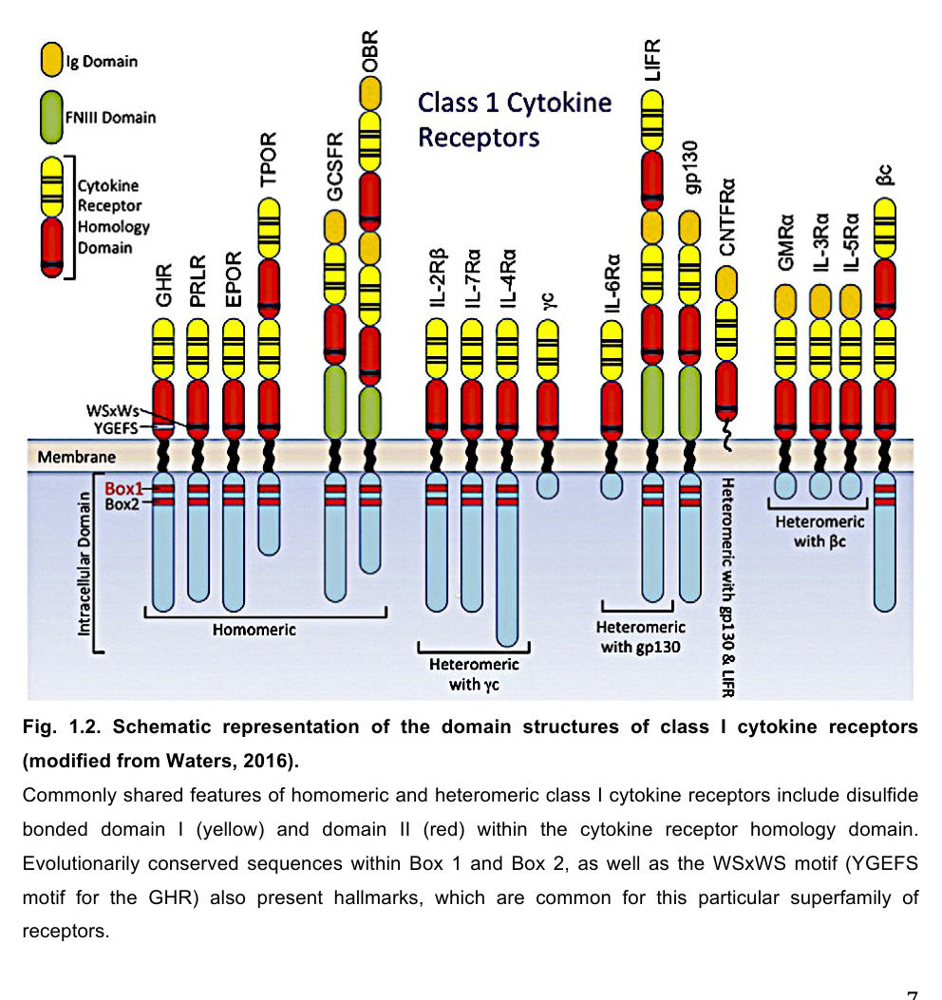

## Question

# Gene Research for Functional Annotation

## ⚠️ CRITICAL: Gene/Protein Identification Context

**BEFORE YOU BEGIN RESEARCH:** You MUST verify you are researching the CORRECT gene/protein. Gene symbols can be ambiguous, especially for less well-characterized genes from non-model organisms.

### Target Gene/Protein Identity (from UniProt):
- **UniProt Accession:** P16310
- **Protein Description:** RecName: Full=Growth hormone receptor {ECO:0000303|PubMed:2722883}; Short=GH receptor; AltName: Full=Somatotropin receptor; Contains: RecName: Full=Growth hormone-binding protein; Short=GH-binding protein; Short=GHBP; AltName: Full=Serum-binding protein; Flags: Precursor;
- **Gene Information:** Name=Ghr;
- **Organism (full):** Rattus norvegicus (Rat).
- **Protein Family:** Belongs to the type I cytokine receptor family. Type 1
- **Key Domains:** FN3_dom. (IPR003961); FN3_sf. (IPR036116); GHBP. (IPR025871); Growth/epo_recpt_lig-bind. (IPR015152); Ig-like_fold. (IPR013783)

### MANDATORY VERIFICATION STEPS:

1. **Check if the gene symbol "Ghr" matches the protein description above**
2. **Verify the organism is correct:** Rattus norvegicus (Rat).
3. **Check if protein family/domains align with what you find in literature**
4. **If you find literature for a DIFFERENT gene with the same or similar symbol, STOP**

### If Gene Symbol is Ambiguous or You Cannot Find Relevant Literature:

**DO NOT PROCEED WITH RESEARCH ON A DIFFERENT GENE.** Instead:
- State clearly: "The gene symbol 'Ghr' is ambiguous or literature is limited for this specific protein"
- Explain what you found (e.g., "Found extensive literature on a different gene with the same symbol in a different organism")
- Describe the protein based ONLY on the UniProt information provided above
- Suggest that the protein function can be inferred from domain/family information

### Research Target:

Please provide a comprehensive research report on the gene **Ghr** (gene ID: Ghr, UniProt: P16310) in rat.

The research report should be a detailed narrative explaining the function, biological processes, and localization of the gene product. Citations should be given for all claims.

You should prioritize authoritative reviews and primary scientific literature when conducting research. You can supplement
this with annotations you find in gene/protein databases, but these can be outdated or inaccurate.

We are specifically interested in the primary function of the gene - for enzymes, what reaction is catalyzed, and what is the substrate specificity? For transporters, what is the substrate? For structural proteins or adapters, what is the broader structural role? For signaling molecules, what is the role in the pathway.

We are interested in where in or outside the cell the gene product carries out its function.

We are also interested in the signaling or biochemical pathways in which the gene functions. We are less interested in broad pleiotropic effects, except where these elucidate the precise role.

Include evidence where possible. We are interested in both experimental evidence as well as inference from structure, evolution, or bioinformatic analysis. Precise studies should be prioritized over high-throughput, where available.

## Output

Question: You are an expert researcher providing comprehensive, well-cited information.

Provide detailed information focusing on:
1. Key concepts and definitions with current understanding
2. Recent developments and latest research (prioritize 2023-2024 sources)
3. Current applications and real-world implementations
4. Expert opinions and analysis from authoritative sources
5. Relevant statistics and data from recent studies

Format as a comprehensive research report with proper citations. Include URLs and publication dates where available.
Always prioritize recent, authoritative sources and provide specific citations for all major claims.

# Gene Research for Functional Annotation

## ⚠️ CRITICAL: Gene/Protein Identification Context

**BEFORE YOU BEGIN RESEARCH:** You MUST verify you are researching the CORRECT gene/protein. Gene symbols can be ambiguous, especially for less well-characterized genes from non-model organisms.

### Target Gene/Protein Identity (from UniProt):
- **UniProt Accession:** P16310
- **Protein Description:** RecName: Full=Growth hormone receptor {ECO:0000303|PubMed:2722883}; Short=GH receptor; AltName: Full=Somatotropin receptor; Contains: RecName: Full=Growth hormone-binding protein; Short=GH-binding protein; Short=GHBP; AltName: Full=Serum-binding protein; Flags: Precursor;
- **Gene Information:** Name=Ghr;
- **Organism (full):** Rattus norvegicus (Rat).
- **Protein Family:** Belongs to the type I cytokine receptor family. Type 1
- **Key Domains:** FN3_dom. (IPR003961); FN3_sf. (IPR036116); GHBP. (IPR025871); Growth/epo_recpt_lig-bind. (IPR015152); Ig-like_fold. (IPR013783)

### MANDATORY VERIFICATION STEPS:

1. **Check if the gene symbol "Ghr" matches the protein description above**
2. **Verify the organism is correct:** Rattus norvegicus (Rat).
3. **Check if protein family/domains align with what you find in literature**
4. **If you find literature for a DIFFERENT gene with the same or similar symbol, STOP**

### If Gene Symbol is Ambiguous or You Cannot Find Relevant Literature:

**DO NOT PROCEED WITH RESEARCH ON A DIFFERENT GENE.** Instead:
- State clearly: "The gene symbol 'Ghr' is ambiguous or literature is limited for this specific protein"
- Explain what you found (e.g., "Found extensive literature on a different gene with the same symbol in a different organism")
- Describe the protein based ONLY on the UniProt information provided above
- Suggest that the protein function can be inferred from domain/family information

### Research Target:

Please provide a comprehensive research report on the gene **Ghr** (gene ID: Ghr, UniProt: P16310) in rat.

The research report should be a detailed narrative explaining the function, biological processes, and localization of the gene product. Citations should be given for all claims.

You should prioritize authoritative reviews and primary scientific literature when conducting research. You can supplement
this with annotations you find in gene/protein databases, but these can be outdated or inaccurate.

We are specifically interested in the primary function of the gene - for enzymes, what reaction is catalyzed, and what is the substrate specificity? For transporters, what is the substrate? For structural proteins or adapters, what is the broader structural role? For signaling molecules, what is the role in the pathway.

We are interested in where in or outside the cell the gene product carries out its function.

We are also interested in the signaling or biochemical pathways in which the gene functions. We are less interested in broad pleiotropic effects, except where these elucidate the precise role.

Include evidence where possible. We are interested in both experimental evidence as well as inference from structure, evolution, or bioinformatic analysis. Precise studies should be prioritized over high-throughput, where available.

## Research report: Rat **Ghr** (Growth hormone receptor; UniProt **P16310**) functional annotation

### Scope and identity verification (mandatory)
The target gene symbol **Ghr** in *Rattus norvegicus* corresponds to the canonical **growth hormone receptor (GHR)**, a **class I/type I cytokine receptor family** single-pass transmembrane receptor. Structural descriptions match UniProt P16310 expectations: an extracellular GH-binding domain built from **two fibronectin type III (FNIII)-like modules**, a **single transmembrane helix**, and an intracellular region containing **Box1** and **Box2** motifs that couple to cytoplasmic kinases (gun2022investigationofmonoclonal pages 5-9, gun2022investigationofmonoclonal media b3c4ed24, gun2022investigationofmonoclonal media 19db3114). The same receptor system also yields a soluble **growth hormone-binding protein (GHBP)** corresponding to the receptor extracellular domain (gun2022investigationofmonoclonal pages 9-13, list2001growthhormonereceptorbinding pages 1-3).

### 1) Key concepts and definitions (current understanding)

#### 1.1 What GHR is (molecular function)
GHR is a cell-surface receptor whose primary function is **to bind circulating growth hormone (GH) and transduce that extracellular hormonal signal into intracellular phosphorylation cascades and gene regulation**, notably including induction of hepatic **IGF-1** and many other GH-responsive genes (cartersu2016growthhormonesignaling pages 1-5, dehkhoda2018thegrowthhormone pages 1-2).

#### 1.2 Domain architecture and conserved motifs
A widely used structural model partitions GHR into an extracellular domain (ECD), a transmembrane domain (TMD), and an intracellular domain (ICD). One detailed schematic assigns approximate boundaries ECD **~19–262**, TMD **~263–288**, and ICD **~289–638**, and highlights the intracellular **Box1** motif (proximal, proline-rich) and **Box2** region (gun2022investigationofmonoclonal pages 5-9, gun2022investigationofmonoclonal media 19db3114). The ECD can also be represented as a soluble GHBP form (gun2022investigationofmonoclonal pages 9-13, gun2022investigationofmonoclonal media 19db3114).

#### 1.3 GH-binding protein (GHBP)
**GHBP** is a soluble binding partner for GH in circulation that corresponds to the receptor ECD. It binds GH with receptor-like affinity and is treated genetically as a product of the same GHR/GHBP gene system in rodent knockout studies (gun2022investigationofmonoclonal pages 9-13, list2001growthhormonereceptorbinding pages 1-3). Functionally, GHBP is described as influencing GH bioavailability and transport in blood (ortiz2014…impactof pages 46-51, gun2022investigationofmonoclonal pages 9-13).

### 2) Mechanism of receptor activation and signaling pathways

#### 2.1 Preformed dimers and 1:2 ligand:receptor stoichiometry
Modern mechanistic models emphasize that GHR exists as a **preformed homodimer** at the cell surface (and can assemble in the ER) rather than relying primarily on ligand-induced dimerization (dehkhoda2018thegrowthhormone pages 1-2, dehkhoda2018thegrowthhormone pages 2-5). GH engages the receptor with **1 GH : 2 GHR** stoichiometry (equivalently 2:1 receptor:ligand), binding “site 1” and “site 2” across the two receptor chains (wojcik2018postreceptorinhibitorsof pages 1-3, dehkhoda2018thegrowthhormone pages 2-5).

#### 2.2 JAK2 coupling and activation (core biochemical mechanism)
GHR lacks intrinsic kinase activity; instead its intracellular **Box1** (and Box2) region is central for recruiting/coupling to **JAK2**, which is the principal JAK associated with GHR (gun2022investigationofmonoclonal pages 5-9, dehkhoda2018thegrowthhormone pages 1-2). Upon GH binding and receptor conformational rearrangement, the two receptor-associated JAK2 molecules undergo **trans-phosphorylation**, which initiates downstream signaling (dehkhoda2018thegrowthhormone pages 2-5, ortiz2014…impactof pages 46-51).

#### 2.3 Major downstream pathways
Evidence from mechanistic reviews supports three major branches:
- **JAK2 → STAT pathway**: JAK2 phosphorylates receptor tyrosines and activates **STAT5a/STAT5b** (dominant), as well as **STAT1** and **STAT3**, which dimerize and translocate to the nucleus to regulate transcription (cartersu2016growthhormonesignaling pages 5-8, cartersu2016growthhormonesignaling pages 1-5, dehkhoda2018thegrowthhormone pages 1-2).
- **MAPK/ERK pathway**: GH/GHR signaling can activate ERK1/2 through Shc/Grb2/SOS/Ras/Raf/MEK signaling (cartersu2016growthhormonesignaling pages 5-8, cartersu2016growthhormonesignaling pages 1-5, ortiz2014…impactof pages 46-51).
- **PI3K/Akt pathway**: GH can drive IRS1/2 phosphorylation and PI3K/Akt activation, providing metabolic signaling outputs (cartersu2016growthhormonesignaling pages 5-8, cartersu2016growthhormonesignaling pages 1-5, ortiz2014…impactof pages 46-51).

#### 2.4 Alternative signaling branch (LYN/ERK) and pathway modularity
Recent rodent genetic work emphasizes that the receptor can engage **distinct signaling branches**. In particular, GHR signaling can be partitioned into canonical **JAK2–STAT5** versus an alternative **LYN–ERK1/2** pathway; mutations in Box1 can prevent JAK2 activation while preserving LYN activity (chhabra2024therolesof pages 1-2, chhabra2024therolesofa pages 1-2). This supports a view of GHR as a modular signaling platform whose outputs depend on intracellular motif integrity and cellular context (chhabra2024therolesof pages 1-2, chhabra2024therolesofa pages 1-2).

### 3) Subcellular localization and trafficking
GHR is a **single-pass plasma-membrane receptor** (gun2022investigationofmonoclonal pages 5-9, gun2022investigationofmonoclonal media b3c4ed24). Dimer formation can occur during biosynthesis (ER) before surface delivery (dehkhoda2018thegrowthhormone pages 2-5). Following activation, receptor complexes can internalize; one review notes evidence consistent with continued **JAK2 association after internalization**, supporting the possibility of endosomal signaling (wojcik2018postreceptorinhibitorsof pages 1-3). 

A 2023 bioRxiv/2024-indexed preprint used super-resolution microscopy to quantify plasma-membrane dynamics of GHR and prolactin receptor (PRLR) in breast cancer cells, reporting ligand-dependent **loss of surface GHR** and implicating **Box1/JAK2 coupling** in cross-receptor regulation of surface availability (chen2024arolefor pages 1-3). Although not a rat study, this represents a recent mechanistic advance relevant to GHR trafficking concepts.

### 4) Negative regulation and homeostatic control (expert synthesis)
Multiple authoritative sources converge on the view that GH signaling must be tightly constrained to avoid pathological outcomes. Negative regulation occurs at several levels:

- **SOCS/CIS feedback**: STAT5 induces SOCS2 expression, and **SOCS2** can bind phosphorylated GHR tyrosines (e.g., Tyr487, Tyr595 noted in one review) and recruit an E3 ubiquitin ligase complex that promotes GHR ubiquitination, internalization, and lysosomal degradation (fernandezperez2016growthhormonereceptor pages 4-7). SOCS1/3 and CIS can also inhibit signaling (fernandezperez2016growthhormonereceptor pages 4-7, wojcik2018postreceptorinhibitorsof pages 1-3).
- **PIAS proteins**: PIAS family proteins are listed as post-receptor inhibitors of JAK/STAT outputs (wojcik2018postreceptorinhibitorsof pages 1-3).
- **Protein tyrosine phosphatases (PTPs)**: PTP1B and other phosphatases (e.g., SHP1/2) dephosphorylate pathway components and restrict signal duration (fernandezperez2016growthhormonereceptor pages 4-7, wojcik2018postreceptorinhibitorsof pages 1-3).

Kinetic measurements summarized in one review indicate that GH-induced JAK2–STAT5b activation can be **transient (maximal within ~30 minutes)** followed by a refractory period of **~3–4 hours** unless GH is removed, consistent with strong negative feedback and receptor downregulation processes (fernandezperez2016growthhormonereceptor pages 4-7).

### 5) Recent developments and latest research (prioritizing 2023–2024)

#### 5.1 2024: Genetic uncoupling of signaling branches links JAK2/STAT5 to lifespan and cancer
A 2024 Endocrinology paper (advance access) used a panel of GHR mutant mice to separate signaling outputs (STAT5-deficient mutants, Box1 mutants, and full knockouts) and related them to lifespan and cancer incidence. In the reported results, **Box1 mutant males** (retaining Lyn activation) had a **median lifespan of 1016 days** compared with **890 days** for Ghr−/− males; in females, GhrBox1−/− had **median lifespan 970 days** vs **911 days** in knockouts (chhabra2024therolesofa pages 1-2). This work provides updated evidence that different intracellular signaling arms downstream of GHR can have separable organismal consequences (chhabra2024therolesofa pages 1-2).

#### 5.2 2023–2024 preprint: Nanoscale membrane organization and receptor crosstalk (GHR–PRLR)
A bioRxiv preprint (posted Sept 5, 2023; indexed here as 2024) applied dSTORM to quantify GHR and PRLR clustering and colocalization on the plasma membrane after GH or PRL exposure. It reports that PRL can induce **loss of surface GHR** in cells co-expressing PRLR, and concludes Box1/JAK2 coupling is crucial for one receptor’s ligand activation affecting the other’s surface availability (chen2024arolefor pages 1-3). While focused on human cancer cells, this is a recent methodological and mechanistic development relevant to receptor trafficking and signaling integration.

### 6) Current applications and real-world implementations

#### 6.1 Endocrine physiology and clinical parallels inferred from rodent genetics
Rodent GHR/GHBP knockout models remain central real-world implementations for functional annotation because they create a defined loss-of-function state. A detailed 3-year update reports strong growth impairment and endocrine changes in GHR/BP knockout mice: body weight ~**45% of wild type at 4 weeks** and ~**40% of wild-type maximum weight**, with **undetectable serum IGF-I**, plus reproductive and hormonal alterations (list2001growthhormonereceptorbinding pages 1-3). These phenotypes parallel the conceptual framework of GH insensitivity syndromes and demonstrate the centrality of the GH→GHR→IGF axis in growth and metabolism (list2001growthhormonereceptorbinding pages 1-3).

#### 6.2 Metabolic and hepatic disease modeling via tissue-specific disruption
A mechanistic review compiles tissue-specific mouse models indicating that hepatic disruption of GH/GHR/IGF signaling can produce large decreases in circulating IGF-1 (e.g., **~80% reduction** with hepatocyte-specific igf1 deficiency, and **>90% reduction** in an Alb-cre liver-specific GHR deletion context) together with metabolic phenotypes such as liver steatosis and insulin resistance (dehkhoda2018thegrowthhormone pages 14-15). These models are widely used to dissect endocrine versus local GH actions and to model fatty liver and insulin resistance mechanisms downstream of altered GH signaling (dehkhoda2018thegrowthhormone pages 14-15).

#### 6.3 Developmental endocrinology in rat: GH insensitivity early in life
A rat in vivo study (Sprague–Dawley pups) administered **rat GH 2 mg/kg** intravenously and measured signaling responses in liver. Despite JAK2 and STAT5 protein expression, **JAK2/STAT5 phosphorylation was absent** at postnatal day 1 and 4 after GH stimulation; STAT3/STAT1 activation was also not detected in newborn stages, and ERK1/2 activation emerged later (4 days onward) (ruonan2018growthhormonedid pages 1-2). This provides a rat-specific implementation illustrating how Ghr signaling output depends on developmental stage and hepatocyte competence (ruonan2018growthhormonedid pages 1-2).

### 7) Relevant statistics and data (selected quantitative highlights)
- **GHR/BP knockout mouse growth**: ~45% of WT weight at 4 weeks; ~40% of WT maximum weight; **serum IGF-I undetectable** (list2001growthhormonereceptorbinding pages 1-3).
- **Reproductive metrics (mouse GHR/BP knockout)**: pregnancy rate **88% (control matings) vs 53%** when males are knockout (P < 0.001); vaginal opening **35.7 ± 0.2 days vs 28.6 ± 0.6 days** (P < 0.001) (list2001growthhormonereceptorbinding pages 1-3).
- **Hepatic IGF axis perturbation (mouse)**: circulating IGF-1 reduced **~80%** in hepatocyte-specific igf1 deficiency; **>90% reduction** (context: circulating IGF-1) with liver-specific GHR deletion (Alb-cre), with metabolic sequelae (dehkhoda2018thegrowthhormone pages 14-15).
- **Negative regulation phenotype**: **SOCS2−/− mice ~40% larger** (fernandezperez2016growthhormonereceptor pages 4-7).
- **Signal kinetics**: GH-induced STAT5b activation maximal within **~30 min**, refractory **~3–4 h** (fernandezperez2016growthhormonereceptor pages 4-7).
- **2024 lifespan medians (mouse GHR mutants)**: Box1 mutant males **1016 days** vs Ghr−/− males **890 days**; Box1 mutant females **970 days** vs Ghr−/− females **911 days** (chhabra2024therolesofa pages 1-2).

### 8) Expert interpretation (authoritative synthesis)
Collectively, high-citation mechanistic reviews and targeted genetic studies support a consistent model: **rat Ghr encodes a non-enzymatic cytokine receptor whose central biochemical role is to organize and activate JAK2 at the plasma membrane in response to GH binding**, driving transcriptional programs via STAT5 and complementary metabolic and proliferative programs via ERK and PI3K/Akt (cartersu2016growthhormonesignaling pages 1-5, dehkhoda2018thegrowthhormone pages 1-2, dehkhoda2018thegrowthhormone pages 2-5). The field’s “current understanding” has shifted away from simple ligand-induced dimerization toward **preformed dimers activated by conformational rearrangement**, with transmembrane and intracellular geometry changes mediating JAK2 activation (dehkhoda2018thegrowthhormone pages 2-5, ortiz2014…impactof pages 46-51). 

More recent (2023–2024) work emphasizes that **GHR outputs are branch-specific and context dependent**: Box1/JAK2/STAT5 signaling can be separated from Src-family-kinase signaling with distinct organismal consequences, and receptor trafficking/availability can be dynamically regulated and integrated with related cytokine receptors (chhabra2024therolesofa pages 1-2, chen2024arolefor pages 1-3). For rat-specific annotation, developmental data indicate that the presence of GHR pathway proteins alone is not sufficient—newborn hepatocytes can show functional GH insensitivity at the level of phosphorylation activation (ruonan2018growthhormonedid pages 1-2).

### Visual evidence (domain architecture)
A representative schematic of GHR/class I cytokine receptor domain architecture—highlighting FNIII extracellular modules, single transmembrane region, and intracellular Box motifs, plus annotation related to GHBP generation—was retrieved from a GHR-focused source (gun2022investigationofmonoclonal media b3c4ed24, gun2022investigationofmonoclonal media 19db3114).

### Summary table
| Aspect | Key points | Best supporting citations | Source details |
|---|---|---|---|
| Identity / domains | Rat **Ghr** (UniProt **P16310**) matches the canonical **growth hormone receptor (GHR)**, a **class I/type I cytokine receptor**. Architecture includes an **extracellular ligand-binding region with two FNIII-like modules**, a **single transmembrane helix**, and an **intracellular domain** with **Box1** and **Box2** motifs important for JAK coupling. A domain schematic also identifies ECD ~19–262, TMD ~263–288, ICD ~289–638 in a conserved GHR framework. | (gun2022investigationofmonoclonal pages 5-9, gun2022investigationofmonoclonal media b3c4ed24, gun2022investigationofmonoclonal media 19db3114) | Gün, 2022, DOI: https://doi.org/10.17185/duepublico/46490 |
| Ligand / stoichiometry | The ligand is **growth hormone (GH)**. Structural and mechanistic sources support **1 GH : 2 GHR** binding, with **site 1** binding one receptor first and **site 2** engaging the second receptor. Reviews also describe the receptor:ligand complex as **2:1 GHR:GH**. | (gun2022investigationofmonoclonal pages 13-18, wojcik2018postreceptorinhibitorsof pages 1-3, dehkhoda2018thegrowthhormone pages 2-5) | Dehkhoda, 2018, DOI: https://doi.org/10.3389/fendo.2018.00035; Wójcik, 2018, DOI: https://doi.org/10.3390/ijms19071843 |
| Activation mechanism | Older models proposed ligand-induced dimerization, but current understanding favors **preformed GHR homodimers** at the cell surface and even in the ER. GH binding induces a **conformational rearrangement** of the dimer rather than creating the dimer de novo. This reorientation separates/releases intracellular restraints so **JAK2 molecules trans-phosphorylate** and initiate signaling. | (dehkhoda2018thegrowthhormone pages 1-2, dehkhoda2018thegrowthhormone pages 2-5, ortiz2014…impactof pages 46-51) | Dehkhoda, 2018, DOI: https://doi.org/10.3389/fendo.2018.00035; Ortiz, 2014, no DOI in evidence |
| Key pathways | The dominant signaling output is **JAK2 → STAT5a/STAT5b**, with additional activation of **STAT1** and **STAT3**. GHR also signals through **MAPK/ERK** via Shc/Grb2/SOS/Ras/Raf/MEK and through **IRS-PI3K-Akt** pathways. These pathways link GHR to growth, metabolism, and transcriptional regulation including **IGF-1** production. | (cartersu2016growthhormonesignaling pages 5-8, cartersu2016growthhormonesignaling pages 1-5, dehkhoda2018thegrowthhormone pages 1-2, ortiz2014…impactof pages 46-51) | Carter-Su, 2016, DOI: https://doi.org/10.1016/j.ghir.2015.09.002; Dehkhoda, 2018, DOI: https://doi.org/10.3389/fendo.2018.00035 |
| Negative regulation | Multiple post-receptor brakes constrain signaling: **SOCS2**, **SOCS1**, **SOCS3**, **CIS**, **PIAS**, **PTP1B**, **PTP-H1**, **SHP1**, **SHP2**, and **SIRPα1**. **SOCS2** is especially important: it binds phosphorylated GHR, helps recruit an E3 ubiquitin ligase complex, and promotes **GHR internalization/degradation**. Signaling is transient, with maximal activation around **~30 min** and a refractory period of **~3–4 h** in one review. | (fernandezperez2016growthhormonereceptor pages 4-7, wojcik2018postreceptorinhibitorsof pages 1-3) | Fernández-Pérez, 2016, DOI: https://doi.org/10.5772/64606; Wójcik, 2018, DOI: https://doi.org/10.3390/ijms19071843 |
| GH-binding protein (GHBP) | A **soluble GH-binding protein (GHBP)** corresponds to the **extracellular domain** of GHR and binds GH with receptor-like affinity. Literature and knockout genetics treat **GHR and GHBP as products of the same gene system**. GHBP modulates GH bioavailability in circulation, and schematic work highlights extracellular-domain shedding / soluble release. | (gun2022investigationofmonoclonal pages 9-13, list2001growthhormonereceptorbinding pages 1-3, gun2022investigationofmonoclonal pages 5-9) | List, 2001, DOI: https://doi.org/10.1006/mgme.2001.3164; Gün, 2022, DOI: https://doi.org/10.17185/duepublico/46490 |
| Localization / trafficking | GHR is primarily a **plasma-membrane single-pass receptor**, but preformed dimers are reported to assemble in the **endoplasmic reticulum** before surface expression. JAK2 can remain associated during **internalization**, suggesting some **endosomal signaling**. 2024 work also indicates ligand-dependent changes in **surface availability** and crosstalk with **PRLR**, with Box1/JAK2 coupling affecting receptor trafficking behavior. | (dehkhoda2018thegrowthhormone pages 2-5, wojcik2018postreceptorinhibitorsof pages 1-3, chhabra2024therolesof pages 1-2) | Wójcik, 2018, DOI: https://doi.org/10.3390/ijms19071843; Chen, 2024, DOI: https://doi.org/10.1101/2023.09.01.555812 |
| Rodent phenotypes / quantitative data | Rodent genetics show that loss of **JAK2/STAT5** signaling strongly impairs postnatal growth. Liver-focused disruption of GH-GHR signaling can reduce circulating **IGF-1 by ~80%** or **>90%** depending on model, with metabolic effects including steatosis and insulin resistance. **SOCS2 knockout mice are ~40% larger**, underscoring negative regulation. GHR/BP knockout models also show **undetectable serum IGF-I** and elevated GH. | (dehkhoda2018thegrowthhormone pages 14-15, fernandezperez2016growthhormonereceptor pages 4-7, list2001growthhormonereceptorbinding pages 1-3) | Dehkhoda, 2018, DOI: https://doi.org/10.3389/fendo.2018.00035; Fernández-Pérez, 2016, DOI: https://doi.org/10.5772/64606; List, 2001, DOI: https://doi.org/10.1006/mgme.2001.3164 |
| Rat-specific / rodent signaling observations | In rat liver hepatocytes during early life, one study reported GH did **not** activate expected intracellular mediators, highlighting developmental context dependence of GHR responsiveness. Reviews also note that **male rat GH secretion is pulsatile**, shaping **STAT5b** activation differently from more continuous female patterns. Thus, rat Ghr function is conserved, but pathway output is strongly conditioned by age and endocrine context. | (fernandezperez2016growthhormonereceptor pages 4-7) | Fernández-Pérez, 2016, DOI: https://doi.org/10.5772/64606 |
| Recent 2024 developments | 2024 work refines GHR biology in two ways: (1) **branch-specific signaling** studies indicate **Box1/JAK2/STAT5** and **LYN/ERK** outputs can be genetically uncoupled, with STAT5 being the key growth-driving branch; (2) super-resolution / membrane studies suggest **JAK2 and Box1 are important for reciprocal surface regulation of GHR and PRLR**. These studies update trafficking/crosstalk and pathway specificity rather than overturning the core GHR model. | (chhabra2024therolesof pages 1-2, chhabra2024therolesof pages 2-3) | Chhabra, 2024, DOI unavailable in evidence; Chen, 2024, DOI: https://doi.org/10.1101/2023.09.01.555812 |

*Table: This table summarizes the verified identity, structure, signaling, regulation, localization, and phenotype evidence for rat Ghr/GHR. It is useful as a compact functional-annotation reference with direct context-ID support for each major claim.*

### Source URLs and publication dates (where available in retrieved texts)
- Carter-Su et al., “Growth hormone signaling pathways,” *Growth Hormone & IGF Research*, **Jun 2016**. https://doi.org/10.1016/j.ghir.2015.09.002 (cartersu2016growthhormonesignaling pages 1-5)
- Dehkhoda et al., “The growth hormone receptor: mechanism of receptor activation, cell signaling, and physiological aspects,” *Frontiers in Endocrinology*, **Feb 2018**. https://doi.org/10.3389/fendo.2018.00035 (dehkhoda2018thegrowthhormone pages 1-2)
- Wójcik et al., “Post-receptor inhibitors of the GHR-JAK2-STAT pathway…,” *Int. J. Mol. Sci.*, **Jun 2018**. https://doi.org/10.3390/ijms19071843 (wojcik2018postreceptorinhibitorsof pages 1-3)
- Li et al., “Growth Hormone Did Not Activate… in Rats’ Liver… Early Life Period,” *Int. J. Endocrinol. Metab.*, Published online **Jun 23, 2018**. https://doi.org/10.5812/ijem.61385 (ruonan2018growthhormonedid pages 1-2)
- List et al., “GHR/BP knockout mice: a 3-year update,” *Molecular Genetics and Metabolism*, **May 2001**. https://doi.org/10.1006/mgme.2001.3164 (list2001growthhormonereceptorbinding pages 1-3)
- Chhabra et al., “Roles of growth hormone–dependent JAK-STAT5 and Lyn kinase signaling…,” *Endocrinology* (advance access), **Oct 2024**. (URL shown in text) https://academic.oup.com/endo/advance-article/doi/10.1210/endocr/bqae136/7815814 (chhabra2024therolesofa pages 1-2)
- Chen et al., “A role for JAK2 in mediating cell surface GHR-PRLR interaction,” bioRxiv preprint posted **Sep 5, 2023**. https://doi.org/10.1101/2023.09.01.555812 (chen2024arolefor pages 1-3)

References

1. (gun2022investigationofmonoclonal pages 5-9): Investigation of monoclonal antibodies generated against the growth hormone receptor on growth hormone signaling This article has 0 citations and is from a peer-reviewed journal.

2. (gun2022investigationofmonoclonal media b3c4ed24): Investigation of monoclonal antibodies generated against the growth hormone receptor on growth hormone signaling This article has 0 citations and is from a peer-reviewed journal.

3. (gun2022investigationofmonoclonal media 19db3114): Investigation of monoclonal antibodies generated against the growth hormone receptor on growth hormone signaling This article has 0 citations and is from a peer-reviewed journal.

4. (gun2022investigationofmonoclonal pages 9-13): Investigation of monoclonal antibodies generated against the growth hormone receptor on growth hormone signaling This article has 0 citations and is from a peer-reviewed journal.

5. (list2001growthhormonereceptorbinding pages 1-3): Edward O. List, Karen T. Coschigano, and John J. Kopchick. Growth hormone receptor/binding protein (ghr/bp) knockout mice: a 3-year update. Molecular genetics and metabolism, 73 1:1-10, May 2001. URL: https://doi.org/10.1006/mgme.2001.3164, doi:10.1006/mgme.2001.3164. This article has 34 citations and is from a peer-reviewed journal.

6. (cartersu2016growthhormonesignaling pages 1-5): Christin Carter-Su, Jessica Schwartz, and Lawrence S. Argetsinger. Growth hormone signaling pathways. Growth hormone & IGF research : official journal of the Growth Hormone Research Society and the International IGF Research Society, 28:11-5, Jun 2016. URL: https://doi.org/10.1016/j.ghir.2015.09.002, doi:10.1016/j.ghir.2015.09.002. This article has 168 citations.

7. (dehkhoda2018thegrowthhormone pages 1-2): Farhad Dehkhoda, Christine M. M. Lee, Johan Medina, and Andrew J. Brooks. The growth hormone receptor: mechanism of receptor activation, cell signaling, and physiological aspects. Frontiers in Endocrinology, Feb 2018. URL: https://doi.org/10.3389/fendo.2018.00035, doi:10.3389/fendo.2018.00035. This article has 379 citations.

8. (ortiz2014…impactof pages 46-51): S Duran Ortiz. … impact of growth hormone on angiogenesis and other cellular pathways in subcutaneous and epididymal adipose tissue from wild type and bovine growth hormone …. Unknown journal, 2014.

9. (dehkhoda2018thegrowthhormone pages 2-5): Farhad Dehkhoda, Christine M. M. Lee, Johan Medina, and Andrew J. Brooks. The growth hormone receptor: mechanism of receptor activation, cell signaling, and physiological aspects. Frontiers in Endocrinology, Feb 2018. URL: https://doi.org/10.3389/fendo.2018.00035, doi:10.3389/fendo.2018.00035. This article has 379 citations.

10. (wojcik2018postreceptorinhibitorsof pages 1-3): Maciej Wójcik, Agata Krawczyńska, Hanna Antushevich, and Andrzej Przemysław Herman. Post-receptor inhibitors of the ghr-jak2-stat pathway in the growth hormone signal transduction. International Journal of Molecular Sciences, 19:1843, Jun 2018. URL: https://doi.org/10.3390/ijms19071843, doi:10.3390/ijms19071843. This article has 41 citations.

11. (cartersu2016growthhormonesignaling pages 5-8): Christin Carter-Su, Jessica Schwartz, and Lawrence S. Argetsinger. Growth hormone signaling pathways. Growth hormone & IGF research : official journal of the Growth Hormone Research Society and the International IGF Research Society, 28:11-5, Jun 2016. URL: https://doi.org/10.1016/j.ghir.2015.09.002, doi:10.1016/j.ghir.2015.09.002. This article has 168 citations.

12. (chhabra2024therolesof pages 1-2): Y Chhabra, H Bielefeldt-Ohmann, and TL Brooks. The roles of growth hormone dependent jak-stat5 and lyn kinase signalling in 1. Unknown journal, 2024.

13. (chhabra2024therolesofa pages 1-2): Y Chhabra, H Bielefeldt-Ohmann, and TL Brooks. The roles of growth hormone dependent jak-stat5 and lyn kinase signalling in 1. Unknown journal, 2024.

14. (chen2024arolefor pages 1-3): Chen Chen, Jing Jiang, Tejeshwar C. Rao, Ying Liu, Tatiana T. Marquez Lago, Stuart J. Frank, and André Leier. A role for jak2 in mediating cell surface ghr-prlr interaction. bioRxiv, Dec 2024. URL: https://doi.org/10.1101/2023.09.01.555812, doi:10.1101/2023.09.01.555812. This article has 0 citations.

15. (fernandezperez2016growthhormonereceptor pages 4-7): Leandro Fernández-Pérez, Amilcar Flores-Morales, Borja Guerra, Juan C. Díaz-Chico, and Diego Iglesias-Gato. Growth hormone receptor signaling pathways and its negative regulation by socs2. Restricted Growth - Clinical, Genetic and Molecular Aspects, Oct 2016. URL: https://doi.org/10.5772/64606, doi:10.5772/64606. This article has 5 citations.

16. (dehkhoda2018thegrowthhormone pages 14-15): Farhad Dehkhoda, Christine M. M. Lee, Johan Medina, and Andrew J. Brooks. The growth hormone receptor: mechanism of receptor activation, cell signaling, and physiological aspects. Frontiers in Endocrinology, Feb 2018. URL: https://doi.org/10.3389/fendo.2018.00035, doi:10.3389/fendo.2018.00035. This article has 379 citations.

17. (ruonan2018growthhormonedid pages 1-2): LRN Li RuoNan, HP Hong Pan, and LHN Lan HaiNan. Growth hormone did not activate its intracellular signaling molecules in rats’ liver hepatocytes during early life period. International Journal of Endocrinology and Metabolism, Jun 2018. URL: https://doi.org/10.5812/ijem.61385, doi:10.5812/ijem.61385. This article has 0 citations.

18. (gun2022investigationofmonoclonal pages 13-18): Investigation of monoclonal antibodies generated against the growth hormone receptor on growth hormone signaling This article has 0 citations and is from a peer-reviewed journal.

19. (chhabra2024therolesof pages 2-3): Y Chhabra, H Bielefeldt-Ohmann, and TL Brooks. The roles of growth hormone dependent jak-stat5 and lyn kinase signalling in 1. Unknown journal, 2024.

## Artifacts

- [Edison artifact artifact-00](Ghr-deep-research-falcon_artifacts/artifact-00.md)

## Citations

1. dehkhoda2018thegrowthhormone pages 2-5
2. wojcik2018postreceptorinhibitorsof pages 1-3
3. chen2024arolefor pages 1-3
4. fernandezperez2016growthhormonereceptor pages 4-7
5. chhabra2024therolesofa pages 1-2
6. list2001growthhormonereceptorbinding pages 1-3
7. dehkhoda2018thegrowthhormone pages 14-15
8. ruonan2018growthhormonedid pages 1-2
9. cartersu2016growthhormonesignaling pages 1-5
10. dehkhoda2018thegrowthhormone pages 1-2
11. gun2022investigationofmonoclonal pages 5-9
12. gun2022investigationofmonoclonal pages 9-13
13. cartersu2016growthhormonesignaling pages 5-8
14. chhabra2024therolesof pages 1-2
15. gun2022investigationofmonoclonal pages 13-18
16. chhabra2024therolesof pages 2-3
17. https://doi.org/10.17185/duepublico/46490
18. https://doi.org/10.3389/fendo.2018.00035;
19. https://doi.org/10.3390/ijms19071843
20. https://doi.org/10.1016/j.ghir.2015.09.002;
21. https://doi.org/10.3389/fendo.2018.00035
22. https://doi.org/10.5772/64606;
23. https://doi.org/10.1006/mgme.2001.3164;
24. https://doi.org/10.3390/ijms19071843;
25. https://doi.org/10.1101/2023.09.01.555812
26. https://doi.org/10.1006/mgme.2001.3164
27. https://doi.org/10.5772/64606
28. https://doi.org/10.1016/j.ghir.2015.09.002
29. https://doi.org/10.5812/ijem.61385
30. https://academic.oup.com/endo/advance-article/doi/10.1210/endocr/bqae136/7815814
31. https://doi.org/10.1006/mgme.2001.3164,
32. https://doi.org/10.1016/j.ghir.2015.09.002,
33. https://doi.org/10.3389/fendo.2018.00035,
34. https://doi.org/10.3390/ijms19071843,
35. https://doi.org/10.1101/2023.09.01.555812,
36. https://doi.org/10.5772/64606,
37. https://doi.org/10.5812/ijem.61385,