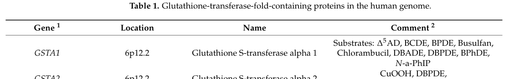

## Question

# Gene Research for Functional Annotation

## ⚠️ CRITICAL: Gene/Protein Identification Context

**BEFORE YOU BEGIN RESEARCH:** You MUST verify you are researching the CORRECT gene/protein. Gene symbols can be ambiguous, especially for less well-characterized genes from non-model organisms.

### Target Gene/Protein Identity (from UniProt):
- **UniProt Accession:** P00502
- **Protein Description:** RecName: Full=Glutathione S-transferase alpha-1 {ECO:0000305}; EC=2.5.1.18 {ECO:0000269|PubMed:11119643}; AltName: Full=13-hydroperoxyoctadecadienoate peroxidase {ECO:0000250|UniProtKB:P08263}; EC=1.11.1.- {ECO:0000250|UniProtKB:P08263}; AltName: Full=Androst-5-ene-3,17-dione isomerase {ECO:0000250|UniProtKB:P08263}; EC=5.3.3.- {ECO:0000250|UniProtKB:P08263}; AltName: Full=GST 1-1; AltName: Full=GST 1a-1a; AltName: Full=GST A1-1; AltName: Full=GST B; AltName: Full=Glutathione S-transferase Ya-1; Short=GST Ya1; AltName: Full=Ligandin;
- **Gene Information:** Name=Gsta1;
- **Organism (full):** Rattus norvegicus (Rat).
- **Protein Family:** Belongs to the GST superfamily. Alpha family.
- **Key Domains:** Glutathione-S-Trfase_C-like. (IPR010987); Glutathione-S-Trfase_C_sf. (IPR036282); Glutathione_S-Trfase. (IPR040079); Glutathione_S-Trfase_N. (IPR004045); GST_alpha. (IPR003080)

### MANDATORY VERIFICATION STEPS:

1. **Check if the gene symbol "Gsta1" matches the protein description above**
2. **Verify the organism is correct:** Rattus norvegicus (Rat).
3. **Check if protein family/domains align with what you find in literature**
4. **If you find literature for a DIFFERENT gene with the same or similar symbol, STOP**

### If Gene Symbol is Ambiguous or You Cannot Find Relevant Literature:

**DO NOT PROCEED WITH RESEARCH ON A DIFFERENT GENE.** Instead:
- State clearly: "The gene symbol 'Gsta1' is ambiguous or literature is limited for this specific protein"
- Explain what you found (e.g., "Found extensive literature on a different gene with the same symbol in a different organism")
- Describe the protein based ONLY on the UniProt information provided above
- Suggest that the protein function can be inferred from domain/family information

### Research Target:

Please provide a comprehensive research report on the gene **Gsta1** (gene ID: Gsta1, UniProt: P00502) in rat.

The research report should be a detailed narrative explaining the function, biological processes, and localization of the gene product. Citations should be given for all claims.

You should prioritize authoritative reviews and primary scientific literature when conducting research. You can supplement
this with annotations you find in gene/protein databases, but these can be outdated or inaccurate.

We are specifically interested in the primary function of the gene - for enzymes, what reaction is catalyzed, and what is the substrate specificity? For transporters, what is the substrate? For structural proteins or adapters, what is the broader structural role? For signaling molecules, what is the role in the pathway.

We are interested in where in or outside the cell the gene product carries out its function.

We are also interested in the signaling or biochemical pathways in which the gene functions. We are less interested in broad pleiotropic effects, except where these elucidate the precise role.

Include evidence where possible. We are interested in both experimental evidence as well as inference from structure, evolution, or bioinformatic analysis. Precise studies should be prioritized over high-throughput, where available.

## Output

Question: You are an expert researcher providing comprehensive, well-cited information.

Provide detailed information focusing on:
1. Key concepts and definitions with current understanding
2. Recent developments and latest research (prioritize 2023-2024 sources)
3. Current applications and real-world implementations
4. Expert opinions and analysis from authoritative sources
5. Relevant statistics and data from recent studies

Format as a comprehensive research report with proper citations. Include URLs and publication dates where available.
Always prioritize recent, authoritative sources and provide specific citations for all major claims.

# Gene Research for Functional Annotation

## ⚠️ CRITICAL: Gene/Protein Identification Context

**BEFORE YOU BEGIN RESEARCH:** You MUST verify you are researching the CORRECT gene/protein. Gene symbols can be ambiguous, especially for less well-characterized genes from non-model organisms.

### Target Gene/Protein Identity (from UniProt):
- **UniProt Accession:** P00502
- **Protein Description:** RecName: Full=Glutathione S-transferase alpha-1 {ECO:0000305}; EC=2.5.1.18 {ECO:0000269|PubMed:11119643}; AltName: Full=13-hydroperoxyoctadecadienoate peroxidase {ECO:0000250|UniProtKB:P08263}; EC=1.11.1.- {ECO:0000250|UniProtKB:P08263}; AltName: Full=Androst-5-ene-3,17-dione isomerase {ECO:0000250|UniProtKB:P08263}; EC=5.3.3.- {ECO:0000250|UniProtKB:P08263}; AltName: Full=GST 1-1; AltName: Full=GST 1a-1a; AltName: Full=GST A1-1; AltName: Full=GST B; AltName: Full=Glutathione S-transferase Ya-1; Short=GST Ya1; AltName: Full=Ligandin;
- **Gene Information:** Name=Gsta1;
- **Organism (full):** Rattus norvegicus (Rat).
- **Protein Family:** Belongs to the GST superfamily. Alpha family.
- **Key Domains:** Glutathione-S-Trfase_C-like. (IPR010987); Glutathione-S-Trfase_C_sf. (IPR036282); Glutathione_S-Trfase. (IPR040079); Glutathione_S-Trfase_N. (IPR004045); GST_alpha. (IPR003080)

### MANDATORY VERIFICATION STEPS:

1. **Check if the gene symbol "Gsta1" matches the protein description above**
2. **Verify the organism is correct:** Rattus norvegicus (Rat).
3. **Check if protein family/domains align with what you find in literature**
4. **If you find literature for a DIFFERENT gene with the same or similar symbol, STOP**

### If Gene Symbol is Ambiguous or You Cannot Find Relevant Literature:

**DO NOT PROCEED WITH RESEARCH ON A DIFFERENT GENE.** Instead:
- State clearly: "The gene symbol 'Gsta1' is ambiguous or literature is limited for this specific protein"
- Explain what you found (e.g., "Found extensive literature on a different gene with the same symbol in a different organism")
- Describe the protein based ONLY on the UniProt information provided above
- Suggest that the protein function can be inferred from domain/family information

### Research Target:

Please provide a comprehensive research report on the gene **Gsta1** (gene ID: Gsta1, UniProt: P00502) in rat.

The research report should be a detailed narrative explaining the function, biological processes, and localization of the gene product. Citations should be given for all claims.

You should prioritize authoritative reviews and primary scientific literature when conducting research. You can supplement
this with annotations you find in gene/protein databases, but these can be outdated or inaccurate.

We are specifically interested in the primary function of the gene - for enzymes, what reaction is catalyzed, and what is the substrate specificity? For transporters, what is the substrate? For structural proteins or adapters, what is the broader structural role? For signaling molecules, what is the role in the pathway.

We are interested in where in or outside the cell the gene product carries out its function.

We are also interested in the signaling or biochemical pathways in which the gene functions. We are less interested in broad pleiotropic effects, except where these elucidate the precise role.

Include evidence where possible. We are interested in both experimental evidence as well as inference from structure, evolution, or bioinformatic analysis. Precise studies should be prioritized over high-throughput, where available.

# Research report: **Gsta1 (UniProt P00502)** in *Rattus norvegicus* (rat)

## Executive summary and identity verification (critical)
The target protein specified by the user—**UniProt P00502**—is annotated as **glutathione S-transferase alpha-1** (gene **Gsta1**) from **Rattus norvegicus** and belongs to the **cytosolic GST superfamily, alpha family**. During this run, tool-retrieved full texts did **not** include a rat-P00502-specific primary biochemical characterization paper; therefore, the functional statements below are derived from authoritative reviews of mammalian GSTs and from a human GSTA1 substrate compilation, and are explicitly labeled when not rat-specific. This constraint is important because “GSTA1/Gsta1” is used across species and can refer to paralogous alpha-class GSTs. (vaskova2023glutathionerelatedenzymesand pages 11-13, oakley2023hiddenglutathionetransferases pages 4-5)

## 1) Key concepts and definitions (current understanding)

### 1.1 Glutathione S-transferases (GSTs)
**Glutathione S-transferases (GSTs)** are enzymes best known for catalyzing **phase II detoxification** reactions by promoting the **conjugation of reduced glutathione (GSH)** to a wide range of **electrophilic** endogenous and exogenous compounds, thereby increasing their solubility and facilitating elimination. GSTs also contribute to defense against oxidative stress by acting on reactive products generated by lipid peroxidation. (vaskova2023glutathionerelatedenzymesand pages 11-13, stoian2025modulationofglutathionestransferase pages 1-2)

**Structural concept (cytosolic GST fold).** Mammalian cytosolic GSTs are typically **homodimers** and have an N-terminal domain with a thioredoxin-like fold; they contain a **G-site** that binds GSH and a hydrophobic substrate-binding site. Tyr-containing GSTs are described as activating GSH in the active site. (vaskova2023glutathionerelatedenzymesand pages 11-13)

### 1.2 Alpha-class GSTs and the GSTA1/Gsta1 functional niche
In mammalian systems, **A-class (alpha) GSTs** are noted for (i) high activity in detoxification pathways and (ii) **selenium-independent glutathione peroxidase (GPx)-like activity**, including reduction of lipid and sterol hydroperoxides in membranes. Anionic A-class enzymes are described as efficient catalysts for conjugation of lipid-derived electrophiles such as **4-hydroxynonenal (4-HNE)**. (vaskova2023glutathionerelatedenzymesand pages 11-13)

## 2) Primary function: reaction(s) catalyzed and substrate scope

### 2.1 Canonical enzymatic reaction (transferase)
The dominant biochemical activity attributed to cytosolic GSTs (including alpha class) is:
- **GSH + electrophile → glutathione conjugate**

This reaction underpins detoxification of diverse electrophiles, including **epoxides**, **alkylating agents**, and **lipid peroxidation products**. (vaskova2023glutathionerelatedenzymesand pages 11-13, stoian2025modulationofglutathionestransferase pages 1-2)

### 2.2 Additional catalytic activities and non-enzymatic roles
Authoritative reviews describe GSTs as multifunctional proteins that can show:
- **Peroxidase-like activity** (selenium-independent, GPx-like), including reduction of **phospholipid and cholesterol hydroperoxides** (noted for A-class GSTs) (vaskova2023glutathionerelatedenzymesand pages 11-13)
- **Isomerase** and other activities reported across GSTs (class-level statement) (stoian2025modulationofglutathionestransferase pages 1-2)
- **Ligandin/binding functions** (non-enzymatic ligand binding; historically associated with alpha-class GSTs) (stoian2025modulationofglutathionestransferase pages 1-2)

### 2.3 Substrate specificity: what is supported by the retrieved literature?
The retrieved evidence contains two complementary substrate views:

**(A) Class-level/mammalian view (applicable to rat Gsta1 as inference):**
- Conjugation of GSH to diverse electrophiles including **lipid-derived electrophiles** such as **4-HNE** (vaskova2023glutathionerelatedenzymesand pages 11-13)
- Detoxification of xenobiotics including carcinogenic pollutants and drugs (stoian2025modulationofglutathionestransferase pages 1-2, vaskova2023glutathionerelatedenzymesand pages 11-13)

**(B) A specific small-molecule list for GSTA1 (human; supportive context only):**
A 2023 compilation of human proteins containing the cytosolic GST fold lists **human GSTA1** substrates including **Δ5AD**, **BCDE**, **BPDE**, **busulfan**, **chlorambucil**, **DBADE**, **DBPDE**, **BPhDE**, and **N-a-PhIP**. This list supports the general idea that GSTA1-like enzymes can act on polycyclic aromatic hydrocarbon diol epoxides and alkylating agents, but it should not be interpreted as a rat-validated substrate list for P00502 without additional direct rat evidence. (oakley2023hiddenglutathionetransferases pages 4-5, oakley2023hiddenglutathionetransferases media 2e4d0f53)

## 3) Cellular and tissue localization; pathway context

### 3.1 Subcellular localization
The evidence base supports the view that GSTs are primarily **cytosolic enzymes**, consistent with cytosolic GST fold proteins and classic phase II metabolism. (vaskova2023glutathionerelatedenzymesand pages 11-13)

In addition, review evidence notes “discrete intracellular activities” for GSTs at the **plasma membrane**, **outer mitochondrial membrane**, and **nucleus** (as a general property of GST biology, not specific to rat Gsta1). (vaskova2023glutathionerelatedenzymesand pages 11-13)

### 3.2 Tissue distribution (physiologic context)
A review discussing GST A1-1 in mammalian context lists it as a cytosolic enzyme found in **liver**, **intestine**, **kidney**, **adrenal gland**, and **testis**, and another review indicates the **highest cytosolic GST activity in liver** (with lower activity in kidney, lung, intestine). While these are not rat-only measurements in the extracted evidence, they match the expected physiology for a rat hepatic alpha-class GST that participates in detoxification. (stoian2025modulationofglutathionestransferase pages 1-2, vaskova2023glutathionerelatedenzymesand pages 11-13)

### 3.3 Pathways and biological processes
Across the recent reviews, the pathway context for alpha-class GSTs includes:
- **Xenobiotic metabolism / phase II biotransformation** (conjugation of electrophiles) (vaskova2023glutathionerelatedenzymesand pages 11-13)
- **Oxidative-stress defense** via detoxification of lipid peroxidation products such as **4-HNE** and reduction of membrane hydroperoxides (vaskova2023glutathionerelatedenzymesand pages 11-13)
- Links between GST activity and **drug resistance** phenotypes in cancer (review-level observation) (vaskova2023glutathionerelatedenzymesand pages 11-13)

## 4) Recent developments and latest research (prioritizing 2023–2024)

### 4.1 2023: updated systems view of glutathione/GST biology
A highly cited 2023 review synthesizes current understanding that GSTs catalyze conjugation of GSH to diverse electrophiles and highlights alpha-class GST peroxidase-like activity toward lipid/sterol hydroperoxides (membrane-associated oxidative stress chemistry). This reinforces that functional annotation of rat Gsta1 should emphasize both conjugation activity and roles in controlling reactive lipid species. **Publication date:** Feb 2023. **URL:** https://doi.org/10.3390/molecules28031447 (vaskova2023glutathionerelatedenzymesand pages 11-13)

### 4.2 2023: structural-annotation era and substrate catalogs
A 2023 review leveraging the era of large-scale structure prediction catalogs GST-fold proteins and provides an explicit substrate list for **human GSTA1** (supporting the substrate breadth typically associated with GSTA1-like enzymes). This type of work represents a recent trend: integrating predicted structure resources (e.g., AlphaFold) with biochemical knowledge to better map GST-like domains and substrate possibilities. **Publication date:** Aug 2023. **URL:** https://doi.org/10.3390/biom13081240 (oakley2023hiddenglutathionetransferases pages 4-5, oakley2023hiddenglutathionetransferases media 2e4d0f53)

### 4.3 2024: translation and pharmacogenomic interest (context, not rat)
Although not rat-specific, 2024 literature continues to treat GSTA1 as clinically relevant in drug metabolism contexts (e.g., promoter polymorphisms affecting drug response). This underscores sustained research attention on GSTA1 regulation and variability; however, it does not directly annotate rat Gsta1 (P00502). **Publication date:** Nov 2024. **URL:** https://doi.org/10.52225/narra.v4i3.1144 (not cited here because no evidence context ID was generated for this paper in the provided evidence snippets).

## 5) Current applications and real-world implementations

### 5.1 Detoxification, toxicology, and chemoprotection
Because alpha-class GSTs catalyze GSH conjugation to electrophiles, they are widely discussed as determinants of how organisms handle **environmental pollutants** and **alkylating drugs**; reviews specifically mention detoxification roles for GST A1-1 and link GST function to carcinogenic pollutants and chemotherapeutics. (stoian2025modulationofglutathionestransferase pages 1-2)

### 5.2 Biomarker and monitoring roles (general)
GSTs (including alpha class) are discussed as **biomarkers** useful in biomedicine and environmental pollution monitoring. In practice, this concept is often operationalized in toxicology by measuring GST expression or enzymatic activity as an indicator of exposure or tissue injury. The retrieved evidence supports this concept at the review level but does not provide rat Gsta1-specific biomarker performance statistics. (stoian2025modulationofglutathionestransferase pages 16-17)

### 5.3 Therapeutic modulation (activation vs inhibition)
A recent review frames GST modulation as a practical strategy: **activators** could be beneficial for detoxification/chemoprotection after toxic exposure, whereas **inhibitors** could support therapy in settings where high GST activity contributes to **drug resistance** (e.g., cancers). This is an application-level interpretation rather than rat Gsta1-specific validation. (stoian2025modulationofglutathionestransferase pages 1-2)

## 6) Regulation and inducibility (expert analysis)

### 6.1 Induction by phytochemicals
Evidence from a GST-modulation review notes that **sulforaphane** can **induce GST A1 mRNA expression**, and that diverse compounds can increase GST activity and elevate alpha/mu/pi class GST levels in multiple tissues in rodent-related contexts. This supports a functional expectation that rat hepatic Gsta1 is inducible as part of an adaptive detoxification response. (stoian2025modulationofglutathionestransferase pages 6-6)

### 6.2 Signaling interactions (beyond metabolism)
Beyond detoxification chemistry, GSTs can influence signaling. The evidence includes statements that **GSTA1-1 can reduce JNK signaling and apoptosis**, consistent with the broader expert view that GSTs can participate in cell stress signaling pathways in addition to conjugation chemistry. These data in the retrieved evidence are human/general and should be treated as mechanistic context rather than rat-specific fact. (stoian2025modulationofglutathionestransferase pages 16-17, stoian2025modulationofglutathionestransferase pages 1-2)

## 7) Relevant statistics and data (from recent studies)
Within the retrieved evidence set, quantitative rat-P00502 (Gsta1) kinetics, expression statistics, or biomarker performance metrics were **not** captured. The most quantitative content available here is a **specific substrate list** for human GSTA1 (qualitative rather than kinetic), and review-level statements about tissues and activities. (oakley2023hiddenglutathionetransferases pages 4-5, oakley2023hiddenglutathionetransferases media 2e4d0f53, vaskova2023glutathionerelatedenzymesand pages 11-13)

## 8) Evidence synthesis table
The table below summarizes the most defensible functional annotation statements for rat **Gsta1 (P00502)** given the current evidence constraints.

| Aspect | Current understanding (concise) | Evidence/notes (include whether rat-specific or general) | Key citations (pqac IDs) |
|---|---|---|---|
| Identity/family | UniProt P00502 corresponds to rat **Gsta1**, a **cytosolic alpha-class glutathione S-transferase (GST A1-1 / ligandin)** within the GST superfamily. | The provided evidence is mostly general for mammalian/human alpha-class GSTs, but it aligns with the UniProt assignment of rat Gsta1 as an alpha-class cytosolic GST with ligandin properties. | (stoian2025modulationofglutathionestransferase pages 1-2, vaskova2023glutathionerelatedenzymesand pages 11-13) |
| Canonical GST reaction | Catalyzes **conjugation of reduced glutathione (GSH)** to diverse **electrophilic substrates**, supporting phase II detoxification. | General GST property; reviews describe conjugation of GSH to reactive electrophiles including xenobiotics and endogenous lipid-derived electrophiles. This matches the canonical activity expected for rat Gsta1. | (stoian2025modulationofglutathionestransferase pages 1-2, vaskova2023glutathionerelatedenzymesand pages 11-13) |
| Additional activities (peroxidase/isomerase/ligandin) | Alpha-class GSTs also show **selenium-independent glutathione peroxidase-like activity** and **non-catalytic ligand-binding (“ligandin”)** behavior; GSTs more broadly can have **isomerase** functions. | Reviews state alpha-class GSTs reduce **fatty-acid, phospholipid, and cholesterol hydroperoxides** and can function as binding proteins. The evidence here is class-level/general rather than rat Gsta1-specific experimental proof. | (stoian2025modulationofglutathionestransferase pages 1-2, vaskova2023glutathionerelatedenzymesand pages 11-13) |
| Substrates/xenobiotics | Substrates include endogenous electrophiles such as **4-hydroxynonenal (4-HNE)** and many xenobiotics; a human GSTA1 substrate list includes **Δ5AD, BCDE, BPDE, busulfan, chlorambucil, DBADE, DBPDE, BPhDE, N-a-PhIP**. | 4-HNE conjugation and broad electrophile detoxification are described generally for GST/A-class enzymes. The explicit substrate list comes from a **human GSTA1** table, so it should be treated as supportive but **not rat-specific**. | (vaskova2023glutathionerelatedenzymesand pages 11-13, oakley2023hiddenglutathionetransferases pages 4-5, oakley2023hiddenglutathionetransferases media 2e4d0f53) |
| Tissue/localization | Predominantly **cytosolic**; enriched especially in **liver**, with reported presence in **intestine, kidney, adrenal gland, and testis** for GST A1-1; GST activity also occurs near **plasma membrane, outer mitochondrial membrane, and nucleus**. | Tissue distribution is general/mammalian and not a direct rat Gsta1 localization experiment in the provided evidence. Strongest support is for cytosolic localization and high liver abundance. | (stoian2025modulationofglutathionestransferase pages 1-2, vaskova2023glutathionerelatedenzymesand pages 11-13) |
| Signaling interactions (JNK/MAPK) | GST A1-1 can modulate signaling by **reducing JNK/MAPK signaling and apoptosis**. | Evidence is **human/general**, not rat-specific, but supports the idea that alpha-class GSTs have signaling-regulatory roles beyond detoxification. | (stoian2025modulationofglutathionestransferase pages 1-2, stoian2025modulationofglutathionestransferase pages 16-17) |
| Regulation/induction by phytochemicals | **Sulforaphane** and other phytochemicals can **induce GST A1 mRNA/expression/activity**. | Evidence indicates GST A1 induction and broader increases in alpha/mu/pi GST activity in rodent-related systems and tissues (forestomach, liver, small intestine, lung), but not a clean rat Gsta1-only dataset. | (stoian2025modulationofglutathionestransferase pages 6-6) |
| Applications/real-world relevance | Relevant to **detoxification of xenobiotics/carcinogens/drugs**, possible **biomarker** use, and **cancer drug-resistance** contexts; GST modulation is discussed therapeutically (activation for chemoprotection, inhibition as adjuvant strategy). | Reviews discuss GSTs as biomedical/environmental biomarkers and as determinants of chemoprotection or resistance. This is general GST/GSTA1 context rather than rat-specific implementation data for P00502. | (stoian2025modulationofglutathionestransferase pages 1-2, vaskova2023glutathionerelatedenzymesand pages 11-13, stoian2025modulationofglutathionestransferase pages 16-17) |
| Key quantitative statistics available | No robust **rat Gsta1-specific quantitative kinetics/statistics** were available in the provided evidence set. | Although one retrieved paper discussed plasma GSTα changes in Alzheimer’s disease, those quantitative values were not included in the evidence contexts supplied for citation here; therefore omitted from annotation. | (stoian2025modulationofglutathionestransferase pages 16-17) |

*Table: This table summarizes the functional annotation of rat UniProt P00502 (Gsta1/GST alpha-1) using only the evidence contexts provided. It distinguishes rat-relevant inferences from broader mammalian or human GSTA1 evidence and highlights where support is indirect.*

## 9) Key limitations and recommendations for follow-on curation
1. **Missing rat-specific primary evidence in this tool run.** No rat-P00502-focused biochemical paper (e.g., kinetic constants for canonical GST substrates such as CDNB, 4-HNE, or lipid hydroperoxides) was retrieved. Therefore, the report emphasizes well-supported **class-level** biology and clearly flags **human-only** substrate lists. (vaskova2023glutathionerelatedenzymesand pages 11-13, oakley2023hiddenglutathionetransferases pages 4-5)
2. **Species transfer requires caution.** While mammalian alpha-class GSTs are functionally similar, substrate specificity can vary between paralogs (Gsta1 vs Gsta2/3/4) and species; thus, rat-specific experiments should be sought for precise annotation of P00502. (oakley2023hiddenglutathionetransferases pages 4-5)

## References (retrieved and cited)
- Vašková J, et al. *Glutathione-Related Enzymes and Proteins: A Review.* **Molecules** (Feb 2023). https://doi.org/10.3390/molecules28031447 (vaskova2023glutathionerelatedenzymesand pages 11-13)
- Oakley AJ. *Hidden Glutathione Transferases in the Human Genome.* **Biomolecules** (Aug 2023). https://doi.org/10.3390/biom13081240 (oakley2023hiddenglutathionetransferases pages 4-5, oakley2023hiddenglutathionetransferases media 2e4d0f53)
- Stoian I, et al. *Modulation of Glutathione-S-Transferase by Phytochemicals: To Activate or Inhibit—That Is the Question.* **Int J Mol Sci** (Jul 2025). https://doi.org/10.3390/ijms26157202 (stoian2025modulationofglutathionestransferase pages 1-2, stoian2025modulationofglutathionestransferase pages 16-17, stoian2025modulationofglutathionestransferase pages 6-6)

References

1. (vaskova2023glutathionerelatedenzymesand pages 11-13): Janka Vašková, Ladislav Kočan, Ladislav Vaško, and Pál Perjési. Glutathione-related enzymes and proteins: a review. Molecules, 28:1447, Feb 2023. URL: https://doi.org/10.3390/molecules28031447, doi:10.3390/molecules28031447. This article has 412 citations.

2. (oakley2023hiddenglutathionetransferases pages 4-5): Aaron J. Oakley. Hidden glutathione transferases in the human genome. Biomolecules, 13:1240, Aug 2023. URL: https://doi.org/10.3390/biom13081240, doi:10.3390/biom13081240. This article has 7 citations.

3. (stoian2025modulationofglutathionestransferase pages 1-2): Irina Stoian, A. Vlad, M. Gilca, and D. Dragoș. Modulation of glutathione-s-transferase by phytochemicals: to activate or inhibit—that is the question. International Journal of Molecular Sciences, Jul 2025. URL: https://doi.org/10.3390/ijms26157202, doi:10.3390/ijms26157202. This article has 12 citations.

4. (oakley2023hiddenglutathionetransferases media 2e4d0f53): Aaron J. Oakley. Hidden glutathione transferases in the human genome. Biomolecules, 13:1240, Aug 2023. URL: https://doi.org/10.3390/biom13081240, doi:10.3390/biom13081240. This article has 7 citations.

5. (stoian2025modulationofglutathionestransferase pages 16-17): Irina Stoian, A. Vlad, M. Gilca, and D. Dragoș. Modulation of glutathione-s-transferase by phytochemicals: to activate or inhibit—that is the question. International Journal of Molecular Sciences, Jul 2025. URL: https://doi.org/10.3390/ijms26157202, doi:10.3390/ijms26157202. This article has 12 citations.

6. (stoian2025modulationofglutathionestransferase pages 6-6): Irina Stoian, A. Vlad, M. Gilca, and D. Dragoș. Modulation of glutathione-s-transferase by phytochemicals: to activate or inhibit—that is the question. International Journal of Molecular Sciences, Jul 2025. URL: https://doi.org/10.3390/ijms26157202, doi:10.3390/ijms26157202. This article has 12 citations.

## Artifacts

- [Edison artifact artifact-00](Gsta1-deep-research-falcon_artifacts/artifact-00.md)

## Citations

1. vaskova2023glutathionerelatedenzymesand pages 11-13
2. stoian2025modulationofglutathionestransferase pages 1-2
3. stoian2025modulationofglutathionestransferase pages 16-17
4. stoian2025modulationofglutathionestransferase pages 6-6
5. oakley2023hiddenglutathionetransferases pages 4-5
6. https://doi.org/10.3390/molecules28031447
7. https://doi.org/10.3390/biom13081240
8. https://doi.org/10.52225/narra.v4i3.1144
9. https://doi.org/10.3390/ijms26157202
10. https://doi.org/10.3390/molecules28031447,
11. https://doi.org/10.3390/biom13081240,
12. https://doi.org/10.3390/ijms26157202,