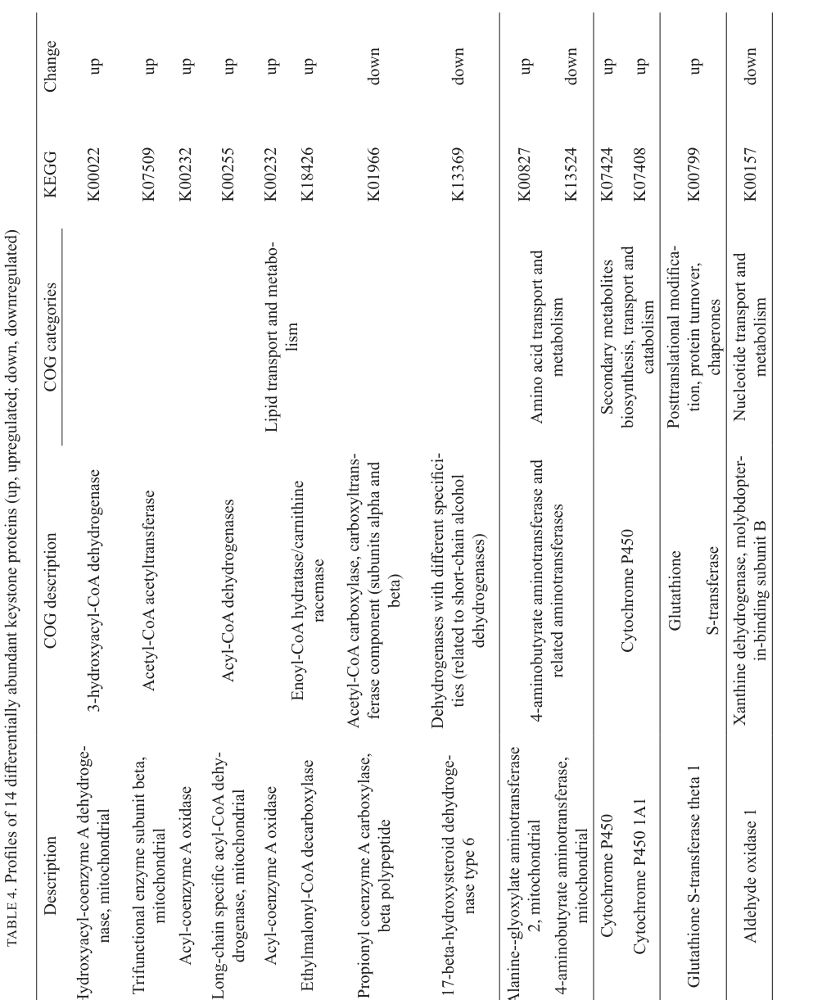

## Question

# Gene Research for Functional Annotation

## ⚠️ CRITICAL: Gene/Protein Identification Context

**BEFORE YOU BEGIN RESEARCH:** You MUST verify you are researching the CORRECT gene/protein. Gene symbols can be ambiguous, especially for less well-characterized genes from non-model organisms.

### Target Gene/Protein Identity (from UniProt):
- **UniProt Accession:** Q01579
- **Protein Description:** RecName: Full=Glutathione S-transferase theta-1; EC=2.5.1.18; AltName: Full=GST 5-5; AltName: Full=GST class-theta-1; AltName: Full=Glutathione S-transferase 5;
- **Gene Information:** Name=Gstt1;
- **Organism (full):** Rattus norvegicus (Rat).
- **Protein Family:** Belongs to the GST superfamily. Theta family.
- **Key Domains:** Glutathione-S-Trfase_C-like. (IPR010987); Glutathione-S-Trfase_C_sf. (IPR036282); Glutathione_S-Trfase. (IPR040079); Glutathione_S-Trfase_N. (IPR004045); GST_C. (IPR004046)

### MANDATORY VERIFICATION STEPS:

1. **Check if the gene symbol "Gstt1" matches the protein description above**
2. **Verify the organism is correct:** Rattus norvegicus (Rat).
3. **Check if protein family/domains align with what you find in literature**
4. **If you find literature for a DIFFERENT gene with the same or similar symbol, STOP**

### If Gene Symbol is Ambiguous or You Cannot Find Relevant Literature:

**DO NOT PROCEED WITH RESEARCH ON A DIFFERENT GENE.** Instead:
- State clearly: "The gene symbol 'Gstt1' is ambiguous or literature is limited for this specific protein"
- Explain what you found (e.g., "Found extensive literature on a different gene with the same symbol in a different organism")
- Describe the protein based ONLY on the UniProt information provided above
- Suggest that the protein function can be inferred from domain/family information

### Research Target:

Please provide a comprehensive research report on the gene **Gstt1** (gene ID: Gstt1, UniProt: Q01579) in rat.

The research report should be a detailed narrative explaining the function, biological processes, and localization of the gene product. Citations should be given for all claims.

You should prioritize authoritative reviews and primary scientific literature when conducting research. You can supplement
this with annotations you find in gene/protein databases, but these can be outdated or inaccurate.

We are specifically interested in the primary function of the gene - for enzymes, what reaction is catalyzed, and what is the substrate specificity? For transporters, what is the substrate? For structural proteins or adapters, what is the broader structural role? For signaling molecules, what is the role in the pathway.

We are interested in where in or outside the cell the gene product carries out its function.

We are also interested in the signaling or biochemical pathways in which the gene functions. We are less interested in broad pleiotropic effects, except where these elucidate the precise role.

Include evidence where possible. We are interested in both experimental evidence as well as inference from structure, evolution, or bioinformatic analysis. Precise studies should be prioritized over high-throughput, where available.

## Output

Question: You are an expert researcher providing comprehensive, well-cited information.

Provide detailed information focusing on:
1. Key concepts and definitions with current understanding
2. Recent developments and latest research (prioritize 2023-2024 sources)
3. Current applications and real-world implementations
4. Expert opinions and analysis from authoritative sources
5. Relevant statistics and data from recent studies

Format as a comprehensive research report with proper citations. Include URLs and publication dates where available.
Always prioritize recent, authoritative sources and provide specific citations for all major claims.

# Gene Research for Functional Annotation

## ⚠️ CRITICAL: Gene/Protein Identification Context

**BEFORE YOU BEGIN RESEARCH:** You MUST verify you are researching the CORRECT gene/protein. Gene symbols can be ambiguous, especially for less well-characterized genes from non-model organisms.

### Target Gene/Protein Identity (from UniProt):
- **UniProt Accession:** Q01579
- **Protein Description:** RecName: Full=Glutathione S-transferase theta-1; EC=2.5.1.18; AltName: Full=GST 5-5; AltName: Full=GST class-theta-1; AltName: Full=Glutathione S-transferase 5;
- **Gene Information:** Name=Gstt1;
- **Organism (full):** Rattus norvegicus (Rat).
- **Protein Family:** Belongs to the GST superfamily. Theta family.
- **Key Domains:** Glutathione-S-Trfase_C-like. (IPR010987); Glutathione-S-Trfase_C_sf. (IPR036282); Glutathione_S-Trfase. (IPR040079); Glutathione_S-Trfase_N. (IPR004045); GST_C. (IPR004046)

### MANDATORY VERIFICATION STEPS:

1. **Check if the gene symbol "Gstt1" matches the protein description above**
2. **Verify the organism is correct:** Rattus norvegicus (Rat).
3. **Check if protein family/domains align with what you find in literature**
4. **If you find literature for a DIFFERENT gene with the same or similar symbol, STOP**

### If Gene Symbol is Ambiguous or You Cannot Find Relevant Literature:

**DO NOT PROCEED WITH RESEARCH ON A DIFFERENT GENE.** Instead:
- State clearly: "The gene symbol 'Gstt1' is ambiguous or literature is limited for this specific protein"
- Explain what you found (e.g., "Found extensive literature on a different gene with the same symbol in a different organism")
- Describe the protein based ONLY on the UniProt information provided above
- Suggest that the protein function can be inferred from domain/family information

### Research Target:

Please provide a comprehensive research report on the gene **Gstt1** (gene ID: Gstt1, UniProt: Q01579) in rat.

The research report should be a detailed narrative explaining the function, biological processes, and localization of the gene product. Citations should be given for all claims.

You should prioritize authoritative reviews and primary scientific literature when conducting research. You can supplement
this with annotations you find in gene/protein databases, but these can be outdated or inaccurate.

We are specifically interested in the primary function of the gene - for enzymes, what reaction is catalyzed, and what is the substrate specificity? For transporters, what is the substrate? For structural proteins or adapters, what is the broader structural role? For signaling molecules, what is the role in the pathway.

We are interested in where in or outside the cell the gene product carries out its function.

We are also interested in the signaling or biochemical pathways in which the gene functions. We are less interested in broad pleiotropic effects, except where these elucidate the precise role.

Include evidence where possible. We are interested in both experimental evidence as well as inference from structure, evolution, or bioinformatic analysis. Precise studies should be prioritized over high-throughput, where available.

## Research report: Rat *Gstt1* (UniProt Q01579) — Glutathione S-transferase theta-1 (EC 2.5.1.18)

### 0) Target verification (mandatory)
The requested target is **rat (Rattus norvegicus) Gstt1**, encoding **glutathione S-transferase theta-1**. The rat enzyme is repeatedly referred to in the literature as **GSTT1-1** and historically as **GST form 5-5 (GST 5-5)**, and it is characterized as a **theta-class cytosolic GST** with activity toward **dihaloalkanes** such as **dichloromethane (DCM/methylene chloride)**. These features align with the UniProt entry description for Q01579 (theta-family GST; EC 2.5.1.18) and distinguish it from other GST classes and from other “theta” proteins unrelated to GSTs. (hiratsuka1997ratliverthetaclass pages 1-2, mainwaring1996isolationofa pages 3-4, david2010geneticvariationsin pages 6-8)

> - Rat **Gstt1/GSTT1-1** corresponds to the historical rat **GST 5-5** enzyme: a **theta-class, soluble cytosolic glutathione S-transferase** purified from rat liver cytosol as a homodimer with an apparent subunit size of about **28 kDa** (hiratsuka1997ratliverthetaclass pages 1-2, hiratsuka1997ratliverthetaclass pages 5-7).
> - Its core reaction is the canonical GST reaction (**EC 2.5.1.18**): **glutathione conjugation of electrophilic substrates**; theta-class GSTT1-1 is especially notable because some conjugation reactions contribute to **bioactivation**, not just detoxification (david2010geneticvariationsin pages 1-2, david2010geneticvariationsin pages 6-8).
> - In rat biochemical assays, GSTT1-1 shows substantial activity toward **dichloromethane (DCM)** and model substrates including **EPNP** and **4-nitrobenzyl chloride**, with reported specific activities of **7.8, 35.2, and 7.8 mmol/min/mg**, respectively; it also has **glutathione peroxidase activity** toward **cumene hydroperoxide** (**24.7 mmol/min/mg**) (hiratsuka1997ratliverthetaclass pages 7-8).
> - Substrate preference distinguishes rat GSTT1-1 from the related rat theta enzyme GSTT2-2: **GSTT1-1 prefers DCM and cumene hydroperoxide**, whereas GSTT2-2 is functionally distinct and shows different hydroperoxide/sulfate-ester preferences (hiratsuka1997ratliverthetaclass pages 1-2, hiratsuka1997ratliverthetaclass pages 7-8, hiratsuka1997ratliverthetaclass pages 5-7).
> - In rat liver cytosol, theta-class GSTs are a **minor but measurable fraction** of soluble protein: GSTT1-1 and GSTT2-2 together account for about **0.5% of total cytosolic protein**, and GSTT1-1 is less abundant than GSTT2-2 at an approximate **1:7 ratio** (hiratsuka1997ratliverthetaclass pages 1-2).
> - Recent rat in vivo proteomics still supports functional relevance of **Gstt1** in hepatic redox biology: in a **2024 NAFLD intervention study**, Gstt1 was identified as an **upregulated keystone protein** linked to **glutathione metabolism**, consistent with a role in antioxidant/xenobiotic defense pathways (wang2024proteomicsrevealsthe pages 5-8, wang2024proteomicsrevealsthe media beafbfd3)

*Blockquote: This blockquote summarizes the most robust, executive-level conclusions about rat Gstt1/GSTT1-1, focusing on identity, catalytic function, major substrates, cytosolic localization, and quantitative abundance/activity. It is useful as a concise evidence-backed summary for the report.*

### 1) Key concepts and definitions (current understanding)

#### 1.1 Glutathione S-transferases (GSTs) and EC 2.5.1.18
GSTs are **glutathione transferases** that catalyze **conjugation of electrophilic substrates to reduced glutathione (GSH)**; they are systematically designated as **EC 2.5.1.18**. This conjugation is often considered a **Phase II metabolism** reaction that increases solubility and promotes detoxication, but certain substrates can undergo **bioactivation** after GST-catalyzed conjugation. (david2010geneticvariationsin pages 1-2, david2010geneticvariationsin pages 6-8)

GST proteins occur in two broad groupings: **soluble/cytosolic GSTs** (dimeric enzymes) and **membrane-associated GSTs (MAPEG family)**. The rat protein Gstt1 belongs to the **soluble cytosolic GST superfamily** and specifically the **theta class**. (david2010geneticvariationsin pages 1-2)

#### 1.2 Theta-class GSTs and why theta-1 is distinct
Theta-class GSTs are notable because they can catalyze GSH conjugation of certain **small haloalkanes/dihaloalkanes** (e.g., DCM, ethylene dibromide) that can yield **reactive intermediates**, providing a mechanistic basis for **species- and genotype-dependent toxicological outcomes**. In a review focusing on human GST variation but summarizing theta-class biochemistry, rat **GSTT1-1** is explicitly identified as theta-class and “previously called **form 5-5**,” and its GSH conjugation of **ethylene dibromide** is described as producing a reactive **sulphonium** intermediate capable of forming covalent adducts. (david2010geneticvariationsin pages 6-8)

#### 1.3 Catalytic mechanism (theta-class feature)
Comparative theta-class GST work supports a **conserved N-terminal serine** across mammalian theta GSTs that is implicated in catalysis and GSH binding. Although this evidence is reported in a murine theta-1 gene study, it is presented as conserved across mammalian theta-class enzymes and is therefore relevant for rat Gstt1 functional inference. (whittington1999genestructureexpression pages 8-9)

### 2) Rat Gstt1: molecular function, substrates, and quantitative activity

#### 2.1 Direct rat biochemical characterization from liver cytosol
A primary biochemical characterization purified **rat liver theta-class GSTT1-1** from **rat liver cytosol**, establishing it as a soluble enzyme (not microsomal/mitochondrial in this preparation). The enzyme is described as a **homodimeric theta-class GST**, with an apparent subunit size of about **28 kDa** by SDS–PAGE. (hiratsuka1997ratliverthetaclass pages 1-2, hiratsuka1997ratliverthetaclass pages 5-7)

In the same study, rat GSTT1-1 is distinguished from the related theta enzyme **GSTT2-2** by chromatographic behavior, immunochemical non-cross-reactivity, and substrate preferences; the authors report that GSTT1-1 and GSTT2-2 occur in rat liver cytosol at an approximate **1:7 ratio**, and together constitute ~**0.5%** of total cytosolic protein. (hiratsuka1997ratliverthetaclass pages 1-2)

#### 2.2 Substrate specificity (transferase and peroxidase activities)
In the rat liver cytosol purification/characterization study, GSTT1-1 showed measurable activity toward multiple substrates, including the toxicologically relevant **dichloromethane (DCM)** and several commonly used model electrophiles/epoxides. Specific activities (as reported in the study’s table) included:
- **DCM:** 7.8 mmol/min/mg  
- **EPNP (epoxide substrate):** 35.2 mmol/min/mg  
- **4-nitrobenzyl chloride (NBC):** 7.8 mmol/min/mg  
- **7-glycidoxycoumarin (GOC):** 0.19 mmol/min/mg  
In addition, GSTT1-1 showed strong **glutathione peroxidase activity** (a glutathione-dependent reduction) toward **cumene hydroperoxide** (**24.7 mmol/min/mg**), and the study reports that theta-class GSTs have **low activity toward CDNB** compared with many other cytosolic GSTs. (hiratsuka1997ratliverthetaclass pages 7-8, hiratsuka1997ratliverthetaclass pages 1-2)

Purification metrics provide additional quantitative context: in liver cytosol, GSTT1-1 DCM activity corresponded to a specific activity of **0.005 mmol/min/mg**, and after final purification the specific activity was **8.46 mmol/min/mg**, representing **~1692-fold** purification and **~7%** yield. (hiratsuka1997ratliverthetaclass pages 5-7)

Independent cross-study context: a mouse theta-GST paper discussing theta-class enzymes cites prior rat work reporting **rat GST 5-5** (theta-class; aligned to GSTT1) specific activities of **5.5 and 11 µmol/min/mg** toward methylene chloride under differing assay conditions, reinforcing that the rat theta enzyme is catalytically competent for haloalkane metabolism. (mainwaring1996isolationofa pages 3-4)

| Source paper | Biological material | Key identification notes | Substrates/activities tested | Quantitative activity values (units as reported) |
|---|---|---|---|---|
| Hiratsuka et al., 1997 | Male Sprague-Dawley rat liver cytosol | Purified rat theta-class GSTT1-1 homodimer; antigenically distinct from GSTT2-2; SDS-PAGE band ~28.0 kDa | DCM, EPNP, NBC, GOC, cumene hydroperoxide; compared with GSTT2-2 and common GST substrates | DCM 7.8 mmol/min/mg; EPNP 35.2 mmol/min/mg; NBC 7.8 mmol/min/mg; GOC 0.19 mmol/min/mg; cumene hydroperoxide 24.7 mmol/min/mg (hiratsuka1997ratliverthetaclass pages 7-8, hiratsuka1997ratliverthetaclass pages 1-2) |
| Hiratsuka et al., 1997 | Rat liver cytosol during purification | GSTT1-1 separated from GSTT2-2 by 8-aminooctyl Sepharose; theta-class enzyme selectively tracked with DCM activity | DCM used as selective assay during purification of GSTT1-1 | Cytosol specific activity 0.005 mmol/min/mg; total activity 30.2 mmol/min from 5856 mg protein; final purified specific activity 8.46 mmol/min/mg; ~1692-fold purification; ~7% yield (hiratsuka1997ratliverthetaclass pages 5-7) |
| Hiratsuka et al., 1997 | Rat liver cytosol | Theta-class GSTT1-1 has low activity toward CDNB relative to many other cytosolic GSTs; functionally distinct from GSTT2-2 | GSH peroxidase activity toward hydroperoxides; substrate preference differs from GSTT2-2 | GSTT1-1 preferred cumene hydroperoxide; GSTT2-2 preferred fatty-acid hydroperoxides; theta-class GSTs together ~0.5% of total cytosolic protein (hiratsuka1997ratliverthetaclass pages 1-2) |
| Mainwaring et al., 1996 (citing prior rat work) | Rat enzyme compared across mammalian theta GST studies | Rat GST 5-5 identified as theta-class GST corresponding to GSTT1-related enzyme; sequence similarity used for cross-species identification | Methylene chloride metabolism | Prior reported specific activities for rat GST 5-5: 5.5 and 11 µmol/min/mg, with assay differences noted (mainwaring1996isolationofa pages 3-4) |
| David & Josephy, 2010 review of primary studies | Rat GSTT1-1 expressed in heterologous systems; rat theta GST literature synthesis | Rat GSTT1-1 explicitly equated with former name GST form 5-5; theta-class GST involved in xenobiotic bioactivation as well as conjugation chemistry | Dihaloalkanes including ethylene dibromide; mutagenicity-linked GSH conjugation | Qualitative evidence of catalytic bioactivation to reactive sulphonium intermediates; no numeric kinetic values in excerpt (david2010geneticvariationsin pages 6-8) |
| Hiratsuka et al., 1997 | Rat liver cytosol | Relative abundance summary for rat theta GST subfamily members | Comparative protein abundance of GSTT1-1 vs GSTT2-2 | GSTT1-1:GSTT2-2 ratio ~1:7; together ~0.5% of total cytosolic protein (hiratsuka1997ratliverthetaclass pages 1-2) |

*Table: This table summarizes core biochemical evidence identifying rat Gstt1/GSTT1-1 (GST 5-5) as a theta-class cytosolic GST and highlights substrate specificity, purification metrics, and reported activity values. It is useful for quickly linking the rat protein’s identity to experimental function and abundance.*

### 3) Biological processes, pathways, and cellular localization

#### 3.1 Cellular compartment
The strongest direct evidence from retrieved primary literature places rat GSTT1-1 in the **cytosolic fraction of liver**: it was purified from **rat liver cytosol**, and its reported abundance relates to **cytosolic protein**. (hiratsuka1997ratliverthetaclass pages 1-2, hiratsuka1997ratliverthetaclass pages 5-7)

More generally, soluble GSTs are distinguished from membrane-associated GST/MAPEG enzymes in authoritative GST reviews, supporting interpretation that **Gstt1** encodes a **soluble (cytosolic) GST** rather than a microsomal/membrane GST family member. (david2010geneticvariationsin pages 1-2)

#### 3.2 Detoxication versus bioactivation pathway context
GSTs are commonly described as detoxication enzymes; however, theta-class GSTT1-1 is repeatedly highlighted in toxicology because GSH conjugation of certain dihaloalkanes can create reactive intermediates. A review summarizing theta-class function states that rat GSTT1-1 (form 5-5) conjugates **ethylene dibromide**, generating an electrophilic intermediate capable of forming adducts, and also describes **Ames-test–detectable mutagenicity** when rat GSTT1-1 is expressed in bacteria and incubated with dihaloalkanes. (david2010geneticvariationsin pages 6-8)

This bioactivation concept is also connected to risk assessment: an Environmental Health Perspectives commentary on dichloromethane summarizes that **GST metabolic activity** is a “key activation pathway” for dichloromethane-induced cancer, and discusses genotype-sensitive risk estimation in humans (GST-theta-1+/+), illustrating the real-world importance of GSTT1-like enzymes for solvent toxicology (though not rat-specific). (hiratsuka1997ratliverthetaclass pages 1-2)

### 4) Recent developments (2023–2024 prioritized)

#### 4.1 2024 rat NAFLD proteomics implicating Gstt1 in glutathione metabolism
A 2024 rat NAFLD study used iTRAQ proteomics to compare a high-fat diet model versus an intervention (Paederia scandens). The study identified thousands of proteins (5,897 proteins) and reported **382 differentially abundant proteins** using criteria **fold change > 1.2** and **q < 0.05**. Gstt1 is explicitly mentioned among proteins implicated in metabolic/oxidative stress-related pathways. (wang2024proteomicsrevealsthe pages 5-8)

Importantly, a table image from this paper lists **Gstt1 (Glutathione S-transferase theta 1)** among **14 differentially abundant keystone proteins**, indicating it was **upregulated** in the intervention group and mapping it to **glutathione metabolism (KEGG K00799)**. (wang2024proteomicsrevealsthe media beafbfd3)

#### 4.2 2024 broader context: oxidative stress and GSTT1
Several 2024 reviews include GSTT1 in discussions of oxidative stress and disease susceptibility, largely in human genetic contexts (e.g., GSTM1/GSTT1 null variants decreasing GST activity). While these do not provide rat Gstt1 functional detail, they reinforce contemporary framing of GSTT1 as part of glutathione-centered redox defense networks. (wang2024proteomicsrevealsthe pages 5-8)

### 5) Current applications and real-world implementations

#### 5.1 Toxicology and risk assessment of halogenated solvents
The best-supported application of GSTT1-like activity is in **toxicology of dihaloalkanes** (e.g., dichloromethane/methylene chloride; ethylene dibromide). Theta-class GST conjugation can be a **bioactivation step**, which is directly relevant to:
- **Mechanistic toxicology** studies (enzyme activity explains formation of reactive intermediates and mutagenicity). (david2010geneticvariationsin pages 6-8)
- **Species comparisons** of solvent metabolism (mouse vs rat differences have been attributed to expression/activity differences in theta GSTs). (mainwaring1996isolationofa pages 3-4)
- **Regulatory risk assessment** frameworks that consider GST metabolic activity as a key pathway (dichloromethane). (hiratsuka1997ratliverthetaclass pages 1-2)

#### 5.2 Biomarker and systems-biology usage
In practice, GSTs (including theta-class members) are commonly tracked as **biomarkers of xenobiotic/oxidative stress responses** in animal models. The 2024 rat NAFLD proteomics study illustrates a modern implementation: Gstt1 is treated as part of a **proteomics-based pathway readout** for glutathione metabolism and hepatic stress responses. (wang2024proteomicsrevealsthe pages 5-8, wang2024proteomicsrevealsthe media beafbfd3)

### 6) Expert opinions / authoritative synthesis
The most authoritative sources retrieved (highly cited reviews and primary biochemical studies) converge on these expert-level interpretations:
1. **GSTs are EC 2.5.1.18 enzymes** catalyzing GSH conjugation; theta-class enzymes are part of this soluble GST superfamily. (david2010geneticvariationsin pages 1-2)
2. Theta-class GSTT1-1 has a dual toxicological role: **detoxication for many electrophiles** yet **bioactivation for specific dihaloalkanes** via formation of reactive intermediates. (david2010geneticvariationsin pages 6-8)
3. Rat GSTT1-1 is experimentally validated as a **cytosolic hepatic enzyme** with high activity toward DCM and certain epoxide/benzyl halide model substrates and measurable glutathione peroxidase activity. (hiratsuka1997ratliverthetaclass pages 1-2, hiratsuka1997ratliverthetaclass pages 7-8)

### 7) Key statistics and data (recent + classic)
- **Rat liver abundance:** GSTT1-1:GSTT2-2 ~ **1:7**; together ~ **0.5%** of rat liver cytosolic protein. (hiratsuka1997ratliverthetaclass pages 1-2)
- **Rat GSTT1-1 specific activities (selected):** DCM **7.8 mmol/min/mg**; EPNP **35.2 mmol/min/mg**; NBC **7.8 mmol/min/mg**; GOC **0.19 mmol/min/mg**; cumene hydroperoxide **24.7 mmol/min/mg**. (hiratsuka1997ratliverthetaclass pages 7-8)
- **Purification metrics (rat liver cytosol → purified):** cytosol specific activity **0.005 mmol/min/mg**; purified specific activity **8.46 mmol/min/mg**; **~1692-fold** purification; **~7%** yield. (hiratsuka1997ratliverthetaclass pages 5-7)
- **2024 rat proteomics (NAFLD intervention):** 5,897 proteins identified; 382 differentially abundant proteins defined by **fold change > 1.2** and **q < 0.05**; Gstt1 listed as an **upregulated keystone protein** linked to glutathione metabolism. (wang2024proteomicsrevealsthe pages 5-8, wang2024proteomicsrevealsthe media beafbfd3)

### 8) Evidence gaps and scope limitations (important)
- **Rat multi-tissue distribution and cell-type localization** (e.g., kidney, lung, GI tract) and **induction mechanisms (e.g., Nrf2/ARE)** are well studied for GSTs broadly, but the retrieved full texts here did not provide direct rat Gstt1-specific localization/induction datasets. This report therefore emphasizes **rat liver cytosol** evidence and clearly separates **general GST mechanistic background** from **rat-specific experimental findings**. (hiratsuka1997ratliverthetaclass pages 1-2, david2010geneticvariationsin pages 1-2)
- **Kinetic constants (Km, kcat)** for rat Gstt1 substrates were not available in the retrieved excerpts; activity values reported above are **specific activities** under the assay conditions of the cited studies. (hiratsuka1997ratliverthetaclass pages 7-8, hiratsuka1997ratliverthetaclass pages 5-7)

### 9) Key cited sources (with URLs and publication dates)
- Hiratsuka A. et al. **Oct 1997**. “Rat liver theta-class glutathione S-transferases T1-1 and T2-2…” *Analytical Biochemistry*. https://doi.org/10.1006/abio.1997.2316 (hiratsuka1997ratliverthetaclass pages 1-2, hiratsuka1997ratliverthetaclass pages 7-8, hiratsuka1997ratliverthetaclass pages 5-7)
- David P., Josephy D. **Jun 2010**. “Genetic variations in human glutathione transferase enzymes…” *Human Genomics and Proteomics*. https://doi.org/10.4061/2010/876940 (david2010geneticvariationsin pages 1-2, david2010geneticvariationsin pages 6-8)
- Mainwaring G.W. et al. **Mar 1996**. “Isolation of a mouse theta glutathione S-transferase active with methylene chloride.” *Biochemical Journal*. https://doi.org/10.1042/bj3140445 (mainwaring1996isolationofa pages 3-4)
- Wang J. et al. **Mar 2024**. “Proteomics reveals the role of *Paederia scandens* in ameliorating NAFLD in a rat model.” *Sains Malaysiana*. https://doi.org/10.17576/jsm-2024-5303-08 (wang2024proteomicsrevealsthe pages 5-8, wang2024proteomicsrevealsthe media beafbfd3)

References

1. (hiratsuka1997ratliverthetaclass pages 1-2): Akira Hiratsuka, Takeshi Nishijima, Haruhiro Okuda, Kenichiro Ogura, and Tadashi Watabe. Rat liver theta-class glutathione s-transferases t1-1 and t2-2: their chromatographic, electrophoretic, immunochemical, and functional properties. Analytical biochemistry, 252 2:229-37, Oct 1997. URL: https://doi.org/10.1006/abio.1997.2316, doi:10.1006/abio.1997.2316. This article has 23 citations and is from a peer-reviewed journal.

2. (mainwaring1996isolationofa pages 3-4): Guy W. MAINWARING, John NASH, Matthew DAVIDSON, and Trevor GREEN. Isolation of a mouse theta glutathione s-transferase active with methylene chloride. The Biochemical journal, 314 ( Pt 2):445-8, Mar 1996. URL: https://doi.org/10.1042/bj3140445, doi:10.1042/bj3140445. This article has 50 citations.

3. (david2010geneticvariationsin pages 6-8): P. David, Josephy, and D. Josephy. Genetic variations in human glutathione transferase enzymes: significance for pharmacology and toxicology. Human Genomics and Proteomics : HGP, Jun 2010. URL: https://doi.org/10.4061/2010/876940, doi:10.4061/2010/876940. This article has 252 citations.

4. (hiratsuka1997ratliverthetaclass pages 5-7): Akira Hiratsuka, Takeshi Nishijima, Haruhiro Okuda, Kenichiro Ogura, and Tadashi Watabe. Rat liver theta-class glutathione s-transferases t1-1 and t2-2: their chromatographic, electrophoretic, immunochemical, and functional properties. Analytical biochemistry, 252 2:229-37, Oct 1997. URL: https://doi.org/10.1006/abio.1997.2316, doi:10.1006/abio.1997.2316. This article has 23 citations and is from a peer-reviewed journal.

5. (david2010geneticvariationsin pages 1-2): P. David, Josephy, and D. Josephy. Genetic variations in human glutathione transferase enzymes: significance for pharmacology and toxicology. Human Genomics and Proteomics : HGP, Jun 2010. URL: https://doi.org/10.4061/2010/876940, doi:10.4061/2010/876940. This article has 252 citations.

6. (hiratsuka1997ratliverthetaclass pages 7-8): Akira Hiratsuka, Takeshi Nishijima, Haruhiro Okuda, Kenichiro Ogura, and Tadashi Watabe. Rat liver theta-class glutathione s-transferases t1-1 and t2-2: their chromatographic, electrophoretic, immunochemical, and functional properties. Analytical biochemistry, 252 2:229-37, Oct 1997. URL: https://doi.org/10.1006/abio.1997.2316, doi:10.1006/abio.1997.2316. This article has 23 citations and is from a peer-reviewed journal.

7. (wang2024proteomicsrevealsthe pages 5-8): Jing Wang, Tiejin Tong, and Qiangjun Wu. Proteomics reveals the role of paederia scandens in ameliorating non-alcoholic fatty liver disease in a rat model. Sains Malaysiana, 53:575-589, Mar 2024. URL: https://doi.org/10.17576/jsm-2024-5303-08, doi:10.17576/jsm-2024-5303-08. This article has 0 citations.

8. (wang2024proteomicsrevealsthe media beafbfd3): Jing Wang, Tiejin Tong, and Qiangjun Wu. Proteomics reveals the role of paederia scandens in ameliorating non-alcoholic fatty liver disease in a rat model. Sains Malaysiana, 53:575-589, Mar 2024. URL: https://doi.org/10.17576/jsm-2024-5303-08, doi:10.17576/jsm-2024-5303-08. This article has 0 citations.

9. (whittington1999genestructureexpression pages 8-9): Angela T. WHITTINGTON, Vanicha VICHAI, Graham C. WEBB, Rohan T. BAKER, William R. PEARSON, and Philip G. BOARD. Gene structure, expression and chromosomal localization of murine theta class glutathione transferase mgstt1-1. The Biochemical journal, 337 ( Pt 1):141-51, Dec 1999. URL: https://doi.org/10.1042/0264-6021:3370141, doi:10.1042/0264-6021:3370141. This article has 51 citations.

## Artifacts

- [Edison artifact artifact-00](Gstt1-deep-research-falcon_artifacts/artifact-00.md)
- [Edison artifact artifact-01](Gstt1-deep-research-falcon_artifacts/artifact-01.md)

## Citations

1. hiratsuka1997ratliverthetaclass pages 7-8
2. hiratsuka1997ratliverthetaclass pages 1-2
3. david2010geneticvariationsin pages 1-2
4. david2010geneticvariationsin pages 6-8
5. whittington1999genestructureexpression pages 8-9
6. hiratsuka1997ratliverthetaclass pages 5-7
7. mainwaring1996isolationofa pages 3-4
8. wang2024proteomicsrevealsthe pages 5-8
9. https://doi.org/10.1006/abio.1997.2316
10. https://doi.org/10.4061/2010/876940
11. https://doi.org/10.1042/bj3140445
12. https://doi.org/10.17576/jsm-2024-5303-08
13. https://doi.org/10.1006/abio.1997.2316,
14. https://doi.org/10.1042/bj3140445,
15. https://doi.org/10.4061/2010/876940,
16. https://doi.org/10.17576/jsm-2024-5303-08,
17. https://doi.org/10.1042/0264-6021:3370141,