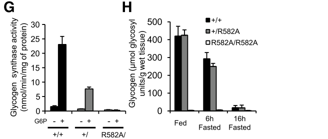

## Question

# Gene Research for Functional Annotation

## ⚠️ CRITICAL: Gene/Protein Identification Context

**BEFORE YOU BEGIN RESEARCH:** You MUST verify you are researching the CORRECT gene/protein. Gene symbols can be ambiguous, especially for less well-characterized genes from non-model organisms.

### Target Gene/Protein Identity (from UniProt):
- **UniProt Accession:** P17625
- **Protein Description:** RecName: Full=Glycogen [starch] synthase, liver {ECO:0000305|PubMed:2110561}; EC=2.4.1.11 {ECO:0000269|PubMed:1731614}; AltName: Full=Glycogen synthase 2 {ECO:0000312|RGD:2773};
- **Gene Information:** Name=Gys2 {ECO:0000312|RGD:2773};
- **Organism (full):** Rattus norvegicus (Rat).
- **Protein Family:** Belongs to the glycosyltransferase 3 family. .
- **Key Domains:** Glycogen_synth. (IPR008631); Glycogen_syn (PF05693)

### MANDATORY VERIFICATION STEPS:

1. **Check if the gene symbol "Gys2" matches the protein description above**
2. **Verify the organism is correct:** Rattus norvegicus (Rat).
3. **Check if protein family/domains align with what you find in literature**
4. **If you find literature for a DIFFERENT gene with the same or similar symbol, STOP**

### If Gene Symbol is Ambiguous or You Cannot Find Relevant Literature:

**DO NOT PROCEED WITH RESEARCH ON A DIFFERENT GENE.** Instead:
- State clearly: "The gene symbol 'Gys2' is ambiguous or literature is limited for this specific protein"
- Explain what you found (e.g., "Found extensive literature on a different gene with the same symbol in a different organism")
- Describe the protein based ONLY on the UniProt information provided above
- Suggest that the protein function can be inferred from domain/family information

### Research Target:

Please provide a comprehensive research report on the gene **Gys2** (gene ID: Gys2, UniProt: P17625) in rat.

The research report should be a detailed narrative explaining the function, biological processes, and localization of the gene product. Citations should be given for all claims.

You should prioritize authoritative reviews and primary scientific literature when conducting research. You can supplement
this with annotations you find in gene/protein databases, but these can be outdated or inaccurate.

We are specifically interested in the primary function of the gene - for enzymes, what reaction is catalyzed, and what is the substrate specificity? For transporters, what is the substrate? For structural proteins or adapters, what is the broader structural role? For signaling molecules, what is the role in the pathway.

We are interested in where in or outside the cell the gene product carries out its function.

We are also interested in the signaling or biochemical pathways in which the gene functions. We are less interested in broad pleiotropic effects, except where these elucidate the precise role.

Include evidence where possible. We are interested in both experimental evidence as well as inference from structure, evolution, or bioinformatic analysis. Precise studies should be prioritized over high-throughput, where available.

## Output

Question: You are an expert researcher providing comprehensive, well-cited information.

Provide detailed information focusing on:
1. Key concepts and definitions with current understanding
2. Recent developments and latest research (prioritize 2023-2024 sources)
3. Current applications and real-world implementations
4. Expert opinions and analysis from authoritative sources
5. Relevant statistics and data from recent studies

Format as a comprehensive research report with proper citations. Include URLs and publication dates where available.
Always prioritize recent, authoritative sources and provide specific citations for all major claims.

# Gene Research for Functional Annotation

## ⚠️ CRITICAL: Gene/Protein Identification Context

**BEFORE YOU BEGIN RESEARCH:** You MUST verify you are researching the CORRECT gene/protein. Gene symbols can be ambiguous, especially for less well-characterized genes from non-model organisms.

### Target Gene/Protein Identity (from UniProt):
- **UniProt Accession:** P17625
- **Protein Description:** RecName: Full=Glycogen [starch] synthase, liver {ECO:0000305|PubMed:2110561}; EC=2.4.1.11 {ECO:0000269|PubMed:1731614}; AltName: Full=Glycogen synthase 2 {ECO:0000312|RGD:2773};
- **Gene Information:** Name=Gys2 {ECO:0000312|RGD:2773};
- **Organism (full):** Rattus norvegicus (Rat).
- **Protein Family:** Belongs to the glycosyltransferase 3 family. .
- **Key Domains:** Glycogen_synth. (IPR008631); Glycogen_syn (PF05693)

### MANDATORY VERIFICATION STEPS:

1. **Check if the gene symbol "Gys2" matches the protein description above**
2. **Verify the organism is correct:** Rattus norvegicus (Rat).
3. **Check if protein family/domains align with what you find in literature**
4. **If you find literature for a DIFFERENT gene with the same or similar symbol, STOP**

### If Gene Symbol is Ambiguous or You Cannot Find Relevant Literature:

**DO NOT PROCEED WITH RESEARCH ON A DIFFERENT GENE.** Instead:
- State clearly: "The gene symbol 'Gys2' is ambiguous or literature is limited for this specific protein"
- Explain what you found (e.g., "Found extensive literature on a different gene with the same symbol in a different organism")
- Describe the protein based ONLY on the UniProt information provided above
- Suggest that the protein function can be inferred from domain/family information

### Research Target:

Please provide a comprehensive research report on the gene **Gys2** (gene ID: Gys2, UniProt: P17625) in rat.

The research report should be a detailed narrative explaining the function, biological processes, and localization of the gene product. Citations should be given for all claims.

You should prioritize authoritative reviews and primary scientific literature when conducting research. You can supplement
this with annotations you find in gene/protein databases, but these can be outdated or inaccurate.

We are specifically interested in the primary function of the gene - for enzymes, what reaction is catalyzed, and what is the substrate specificity? For transporters, what is the substrate? For structural proteins or adapters, what is the broader structural role? For signaling molecules, what is the role in the pathway.

We are interested in where in or outside the cell the gene product carries out its function.

We are also interested in the signaling or biochemical pathways in which the gene functions. We are less interested in broad pleiotropic effects, except where these elucidate the precise role.

Include evidence where possible. We are interested in both experimental evidence as well as inference from structure, evolution, or bioinformatic analysis. Precise studies should be prioritized over high-throughput, where available.

## Research report: rat **Gys2** (UniProt **P17625**) — glycogen [starch] synthase, liver (EC 2.4.1.11)

### 0) Target verification (critical disambiguation)
The UniProt accession **P17625** corresponds to **rat (Rattus norvegicus) Gys2**, the **liver-restricted glycogen synthase isoform** (**GYS2**), which is distinct from **GYS1** (muscle/broadly expressed glycogen synthase). Multiple authoritative sources explicitly describe **GYS2 as the liver glycogen synthase** and place it in hepatic glycogen synthesis under dual regulation by phosphorylation and glucose-6-phosphate (G6P) allosteric activation, matching the UniProt description (wilamowitzmoellendorff2013glucose6phosphate–mediatedactivationof pages 1-2, tang2020discoverycharacterizationand pages 24-29, garin2018glycogenregulatescellular pages 16-19).

### 1) Key concepts and definitions (current understanding)

#### 1.1 Enzymatic function and reaction
**GYS2 catalyzes the rate-limiting chain-elongation step of glycogen synthesis in liver**, transferring a glucosyl unit from **UDP-glucose** to the non-reducing end of an existing glucan chain (glycogen or glycogenin-primed chain), creating an **α-1,4 glycosidic linkage** and releasing **UDP**:

- **UDP-glucose + (glycogen)n → (glycogen)n+1 + UDP** (semiz2009effectsofdiabetes pages 38-42, wilamowitzmoellendorff2013glucose6phosphate–mediatedactivationof pages 1-2).

Glycogen synthesis is initiated by **glycogenin**, which self-glycosylates to a short primer (~8 glucose residues) before glycogen synthase extends the chain (garin2018glycogenregulatescellular pages 16-19). The immediate donor substrate is UDP-glucose; upstream pathways generate UDP-glucose from phosphorylated glucose intermediates (tang2020discoverycharacterizationand pages 19-24, garin2018glycogenregulatescellular pages 16-19).

#### 1.2 Substrate specificity
The **donor substrate** is **UDP-glucose** and the **acceptor substrate** is a **pre-existing glucan** (glycogen chain) on a glycogen particle (wilamowitzmoellendorff2013glucose6phosphate–mediatedactivationof pages 1-2, tang2020discoverycharacterizationand pages 19-24). A frequent source of confusion is the role of **glucose-6-phosphate (G6P)**: G6P is a **major allosteric activator** of glycogen synthase in liver, but it is not the glucosyl donor for chain elongation (wilamowitzmoellendorff2013glucose6phosphate–mediatedactivationof pages 1-2, wilamowitzmoellendorff2013glucose6phosphate–mediatedactivationof pages 3-6, petersen2017regulationofhepatic pages 30-34).

#### 1.3 Tissue specificity and cellular localization
GYS2 is consistently described as the **liver-specific/liver-restricted** glycogen synthase isoform (wilamowitzmoellendorff2013glucose6phosphate–mediatedactivationof pages 1-2, tang2020discoverycharacterizationand pages 24-29, garin2018glycogenregulatescellular pages 16-19). Functionally, glycogen synthesis occurs in the **cytosol** on **glycogen particles/granules**; GYS2 can be recruited to discrete glycogenic structures through glycogen-targeted PP1 complexes (e.g., PTG/PPP1R3 family) (wilamowitzmoellendorff2013glucose6phosphate–mediatedactivationof pages 3-6, tang2020discoverycharacterizationand pages 24-29).

### 2) Molecular regulation and pathway context
Hepatic glycogen synthesis is controlled by a coordinated system in which **insulin primarily stimulates glycogen synthesis flux**, while **glucose suppresses glycogen breakdown (glycogenolysis)**; maximal net glycogen deposition requires **both hyperinsulinaemia and hyperglycaemia** (petersen2017regulationofhepatic pages 9-10, petersen2017regulationofhepatic pages 12-14).

#### 2.1 Covalent regulation: multisite phosphorylation (inactivation) and PP1-mediated dephosphorylation (activation)
GYS2 activity is inhibited by multisite serine phosphorylation and activated by dephosphorylation (semiz2009effectsofdiabetes pages 38-42, wilamowitzmoellendorff2013glucose6phosphate–mediatedactivationof pages 1-2). A synthesis of classical biochemical findings reports that phosphorylation involves **≥6 kinases acting across ~9 serine residues**, with GSK3 being a major kinase for regulatory sites (notably sites 3a/3b in canonical numbering), and insulin favoring dephosphorylation via phosphatase activation and kinase inhibition (semiz2009effectsofdiabetes pages 38-42).

A key mechanistic and quantitative example comes from HepG2 liver-derived cells, where insulin increased net glycogen synthesis **1.83–3.30-fold** and increased glycogen synthase activity by **~110% within 5 minutes**; insulin also activated PKB/Akt (**1.9-fold**), decreased GSK-3β activity (**30–50% decrease**), and activated particulate PP1 (**>4-fold**). These insulin effects were blocked by PI3K inhibition (wortmannin) and by PP1 inhibitors, placing **PI3K→Akt→(GSK3 inhibition + PP1 activation)** at the center of hepatic glycogen synthase control (syed2000reciprocalregulationof pages 1-2).

Authoritative review synthesis further emphasizes the importance of PP1 targeting: active glycogen phosphorylase can inhibit PP1-GL complexes, preventing GYS2 activation and avoiding futile cycling, while glucose allosterically inhibits glycogen phosphorylase to promote net deposition (petersen2017regulationofhepatic pages 12-14).

#### 2.2 Allosteric regulation: activation by glucose-6-phosphate (G6P)
G6P is a potent allosteric activator of liver glycogen synthase. In biochemical assays, saturating G6P can strongly activate GYS2—even when the enzyme is phosphorylated/hyperphosphorylated—indicating that phosphorylation and G6P control act in concert rather than as strictly redundant switches (wilamowitzmoellendorff2013glucose6phosphate–mediatedactivationof pages 1-2).

A mechanistic study (Diabetes, 2013; DOI: https://doi.org/10.2337/db13-0880; published Nov 2013) identified **Arg582** as a key residue required for G6P-mediated activation. In wild-type lysates, saturating G6P produced ~**30-fold** activation, whereas an **Arg582Ala** knockin caused a **~60–70% impairment** of G6P-dependent activation while preserving phosphorylation-dependent regulation (wilamowitzmoellendorff2013glucose6phosphate–mediatedactivationof pages 1-2). In hepatocytes, a glucokinase activator (CpdA), which elevates intracellular G6P, robustly increased glycogen synthesis in WT cells but only **3.5-fold** in GYS2+/R582A, and absolute synthesis rates remained **~71% lower than WT**; homozygous R582A hepatocytes failed to accumulate detectable glycogen even with CpdA (wilamowitzmoellendorff2013glucose6phosphate–mediatedactivationof pages 3-6).

These data support a current model in which **G6P acts as a key metabolic signal coupling glucose phosphorylation (via glucokinase) to glycogen synthase activation**, providing a sensitive postprandial control point (petersen2017regulationofhepatic pages 10-12, wilamowitzmoellendorff2013glucose6phosphate–mediatedactivationof pages 1-2).

### 3) Recent developments and latest research (prioritizing 2023–2024)
Direct rat-specific mechanistic studies of Gys2 regulation were limited in the retrieved 2023–2024 literature; however, 2024 publications reinforce how Gys2 is used as a liver metabolic readout and how GYS2 deficiency is conceptualized clinically.

#### 3.1 2024: rat diabetes models as real-world implementations for hepatic glycogen-pathway perturbation
A 2024 study profiled liver gene expression in two rat diabetes models: (i) HFD (60% fat) + STZ (35 mg/kg) and (ii) STZ-only (65 mg/kg). The work provides quantitative metabolic context relevant for interpreting hepatic glycogen metabolism in vivo: HFD+STZ animals exhibited stable hyperglycemia **350–450 mg/dL**, whereas STZ-only showed **270–510 mg/dL**; insulin tolerance test AUC was **33,687 ± 1,706 mg/dL/min** for HFD+STZ (reported as **6.2-fold** higher than controls at **5,469 ± 268**) and **19,059 ± 3,037 mg/dL/min** for STZ-only (~**2.5-fold** higher than controls), supporting the interpretation that HFD+STZ induces insulin resistance more strongly than STZ-only (guerraavila2024comparativescreeningof pages 1-2, guerraavila2024comparativescreeningof pages 2-4). (The excerpted pages reviewed here did not include a specific Gys2 differential-expression result, so no claim is made about the direction/magnitude of Gys2 expression change in this dataset.) (guerraavila2024comparativescreeningof pages 1-2, guerraavila2024comparativescreeningof pages 2-4).

#### 3.2 2024: GYS2 deficiency and glycogen storage disease type 0a (GSD 0a)
A 2024 review on gene therapy for glycogen storage diseases (Journal of Inherited Metabolic Disease; Jul 2024; DOI: https://doi.org/10.1002/jimd.12654) summarizes **GSD 0a** as caused by **deficiency of glycogen synthase 2 (GYS2)**, impairing hepatic glycogen synthesis and producing a characteristic metabolic phenotype that includes **fasting ketotic hypoglycemia**, **postprandial hyperglycemia**, **lactic acidosis**, **hyperalaninemia**, and **short stature**, often with **normal insulin levels**. The review emphasizes that management is currently **dietary** to prevent fasting hypoglycemia and notes that long-term sequelae remain unclear due to limited published adult cohorts (koeberl2024genetherapyfor pages 3-4).

### 4) Current applications and real-world implementations

1. **Metabolic physiology research:** Gys2/GYS2 sits at a core node (hepatic glycogen deposition) that is frequently interrogated using **clamp studies** and **in vivo glycogen synthesis measurements**; authoritative reviews recommend hyperinsulinaemic–hyperglycaemic clamps and net hepatic glycogen synthesis as direct readouts of hepatic insulin action (petersen2017regulationofhepatic pages 10-12, petersen2017regulationofhepatic pages 9-10).

2. **Experimental models of dysglycemia/insulin resistance:** Rat HFD+STZ and STZ-only models quantify hyperglycemia and insulin resistance at scales relevant for liver metabolism studies (guerraavila2024comparativescreeningof pages 1-2, guerraavila2024comparativescreeningof pages 2-4).

3. **Clinical genetics and metabolic disease management:** For GSD 0a (GYS2 deficiency), current real-world management is dietary intervention to avoid fasting hypoglycemia, with phenotyping anchored to fasting/postprandial biochemical instability (koeberl2024genetherapyfor pages 3-4).

### 5) Expert opinions and authoritative synthesis (mechanistic interpretation)
The 2017 Nature Reviews Endocrinology review (Petersen, Vatner, Shulman; Jul 2017; https://doi.org/10.1038/nrendo.2017.80) provides an expert consensus view that hepatic glycogen synthesis is jointly controlled by **glucokinase (GCK) activity** and **GYS2**, with **G6P as a key allosteric activator** and with phosphorylation state and subcellular distribution regulating enzyme activity (petersen2017regulationofhepatic pages 10-12, petersen2017regulationofhepatic pages 24-25). The review also stresses that **hyperglycaemia alone** can suppress glycogenolysis but is **insufficient to stimulate net glycogen synthesis** in vivo, reinforcing the concept that insulin has essential additional actions on the synthetic arm (petersen2017regulationofhepatic pages 12-14, petersen2017regulationofhepatic pages 9-10).

### 6) Quantitative statistics and data highlights (from recent and high-authority studies)

- **Insulin-regulated signaling and enzyme control (cell system):** insulin-stimulated net glycogen synthesis **1.83–3.30×**, GS activity **+110% within 5 min**, PKB/Akt **1.9×**, GSK-3β activity **−30–50%**, particulate PP1 **>4×**; insulin effects detectable at **0.5 nM** and maximal at **100 nM** (syed2000reciprocalregulationof pages 1-2).

- **Allosteric activation by G6P and the Arg582 mechanism (mechanistic mammalian evidence):** WT lysates ~**30×** activation by saturating G6P; Arg582Ala impairs G6P-mediated activation by **~60–70%**; heterozygous hepatocytes show **~67%** reduced G6P-dependent GS activity and CpdA-stimulated glycogen synthesis **71% lower** than WT in absolute terms (wilamowitzmoellendorff2013glucose6phosphate–mediatedactivationof pages 1-2, wilamowitzmoellendorff2013glucose6phosphate–mediatedactivationof pages 3-6).

- **Protein-level consequences of impaired activation (in vivo):** liver GYS2 protein reduced **93%** in R582A/R582A and **27%** in +/R582A, with unchanged mRNA, suggesting a coupling between allosteric competence and protein abundance/stability (wilamowitzmoellendorff2013glucose6phosphate–mediatedactivationof pages 3-6).

- **Physiology and whole-body glucose handling:** in a human 13C MRS paradigm, **10 mM glucose** and **400 pM insulin** together produced maximal glycogen synthesis; hyperinsulinaemia alone stimulated synthesis but did not suppress glycogenolysis, whereas hyperglycaemia was required to suppress glycogenolysis (petersen2017regulationofhepatic pages 9-10).

- **Recent rat diabetes-model quantitative metrics (2024):** HFD+STZ glycemia **350–450 mg/dL**, STZ-only **270–510 mg/dL**; ITT AUC: **33,687 ± 1,706** vs control **5,469 ± 268** mg/dL/min (**6.2×**), and STZ-only **19,059 ± 3,037** mg/dL/min (~**2.5×**) (guerraavila2024comparativescreeningof pages 1-2, guerraavila2024comparativescreeningof pages 2-4).

### 7) Visual evidence
A key mechanistic visualization (Figure 3G/H) shows that **G6P robustly activates WT liver glycogen synthase activity**, but this activation is markedly impaired in Arg582Ala knockin animals, with corresponding reduction in hepatic glycogen content, supporting the central role of G6P allosteric activation in vivo (wilamowitzmoellendorff2013glucose6phosphate–mediatedactivationof media b0280355).

### 8) Concise functional annotation for rat Gys2 (UniProt P17625)
- **Molecular function:** UDP-glucose:glycogen 4-α-D-glucosyltransferase; catalyzes α-1,4-glucosyl unit transfer from UDP-glucose to glycogen (UDP released). (semiz2009effectsofdiabetes pages 38-42, wilamowitzmoellendorff2013glucose6phosphate–mediatedactivationof pages 1-2)
- **Biological process:** hepatic glycogen biosynthesis and postprandial glucose homeostasis; integrates hormonal (insulin/glucagon) and metabolite (G6P, glucose) control of net hepatic glycogen deposition. (petersen2017regulationofhepatic pages 10-12, petersen2017regulationofhepatic pages 12-14, petersen2017regulationofhepatic pages 9-10)
- **Cellular component:** cytosolic enzyme associated with glycogen particles; recruitment and activity tuned by glycogen-targeted PP1 complexes (e.g., PTG/PPP1R3-family targeting subunits). (wilamowitzmoellendorff2013glucose6phosphate–mediatedactivationof pages 3-6, tang2020discoverycharacterizationand pages 24-29)

### Summary table
| Category | Summary | Quantitative data points | Key sources with year+URL |
|---|---|---|---|
| Identity | Target verified as **rat Gys2 / glycogen [starch] synthase, liver** (UniProt P17625), a **glycosyltransferase family 3 (GT3)** enzyme and the liver-restricted mammalian glycogen synthase isoform, distinct from broadly expressed/muscle-predominant **GYS1**; mammalian GYS proteins are ~70% identical between liver and muscle isoforms. (wilamowitzmoellendorff2013glucose6phosphate–mediatedactivationof pages 1-2, tang2020discoverycharacterizationand pages 24-29, garin2018glycogenregulatescellular pages 16-19) | Liver isoform specificity; ~70% sequence identity between mammalian liver and muscle GS isoforms. (tang2020discoverycharacterizationand pages 24-29, garin2018glycogenregulatescellular pages 16-19) | von Wilamowitz-Moellendorff et al., 2013, https://doi.org/10.2337/db13-0880; Tang, 2020, https://doi.org/10.7912/c2/1917; Garin, 2018, URL in source metadata unavailable in excerpt |
| Reaction | GYS2 catalyzes glycogen chain elongation by transferring glucose from **UDP-glucose** to the **non-reducing end** of a glycogen primer/polymer, creating an **α-1,4 glycosidic bond** and releasing **UDP**: UDP-glucose + (glycogen)n → (glycogen)n+1 + UDP. Initiation depends on glycogenin priming before GS-driven elongation. (semiz2009effectsofdiabetes pages 38-42, wilamowitzmoellendorff2013glucose6phosphate–mediatedactivationof pages 1-2, garin2018glycogenregulatescellular pages 16-19) | GS protein reported as ~85 kDa; glycogenin primer ~8 glucose residues before GS elongation. (semiz2009effectsofdiabetes pages 38-42, garin2018glycogenregulatescellular pages 16-19) | Semiz, 2009, https://doi.org/10.14288/1.0103833; von Wilamowitz-Moellendorff et al., 2013, https://doi.org/10.2337/db13-0880; Garin, 2018, URL in source metadata unavailable in excerpt |
| Substrate specificity | Immediate donor substrate is **UDP-glucose**; acceptor is a **pre-existing glycogen/glycogenin-linked glucan chain**. Liver glycogen synthesis depends upstream on generation of **glucose-6-phosphate (G6P)** and UDP-glucose, but G6P is primarily an **allosteric activator**, not the glucosyl donor. (wilamowitzmoellendorff2013glucose6phosphate–mediatedactivationof pages 1-2, tang2020discoverycharacterizationand pages 19-24, petersen2017regulationofhepatic pages 30-34) | Direct pathway emphasized: glucose → G6P → glycogen; both direct and indirect pathways can contribute to hepatic glycogen synthesis. (petersen2017regulationofhepatic pages 30-34, petersen2017regulationofhepatic pages 9-10) | von Wilamowitz-Moellendorff et al., 2013, https://doi.org/10.2337/db13-0880; Tang, 2020, https://doi.org/10.7912/c2/1917; Petersen et al., 2017, https://doi.org/10.1038/nrendo.2017.80 |
| Localization & tissue expression | GYS2 is described as **liver-specific/liver-restricted** and functions in the **cytoplasm on glycogen particles/granules** in hepatocytes; recruitment to discrete glycogen-synthesis structures can be promoted by PP1 glycogen-targeting proteins such as **PTG/PPP1R3C**. In primary hepatocytes, WT GYS2 can be recruited into glycogenic structures, whereas R582A mutant protein is more diffuse unless PTG is coexpressed. (wilamowitzmoellendorff2013glucose6phosphate–mediatedactivationof pages 1-2, wilamowitzmoellendorff2013glucose6phosphate–mediatedactivationof pages 3-6, tang2020discoverycharacterizationand pages 24-29) | Cytoplasmic localization to glycogen-synthesis structures observed experimentally; diffuse localization for R582A mutant unless PTG recruited it. (wilamowitzmoellendorff2013glucose6phosphate–mediatedactivationof pages 3-6) | von Wilamowitz-Moellendorff et al., 2013, https://doi.org/10.2337/db13-0880; Tang, 2020, https://doi.org/10.7912/c2/1917 |
| Regulation—phosphorylation | GYS2 is inhibited by **multisite serine phosphorylation** and activated by **dephosphorylation**. **GSK3** is a major inhibitory kinase; insulin signals through **PI3K → PDK/PKB(AKT)** to inhibit GSK3 and favor GS activation. **PP1**, particularly glycogen-targeted PP1/GL complexes, dephosphorylates and activates GYS2; glucagon/cAMP/PKA oppose this state and favor glycogen breakdown. (semiz2009effectsofdiabetes pages 38-42, wilamowitzmoellendorff2013glucose6phosphate–mediatedactivationof pages 1-2, syed2000reciprocalregulationof pages 1-2, petersen2017regulationofhepatic pages 12-14) | At least **6 kinases** act on **9 serine residues**; insulin reduced GSK3 activity by ~**40%** in one summary; in HepG2 cells insulin increased PKB **1.9-fold**, decreased GSK3β activity **30–50%**, and increased particulate PP1 **>4-fold**; insulin-stimulated net glycogen synthesis **1.83–3.30-fold** and GS activity **110% within 5 min**. Effects detectable at **0.5 nM** insulin, maximal at **100 nM**. (semiz2009effectsofdiabetes pages 38-42, syed2000reciprocalregulationof pages 1-2) | Semiz, 2009, https://doi.org/10.14288/1.0103833; Syed & Khandelwal, 2000, https://doi.org/10.1023/A:1007159422667; von Wilamowitz-Moellendorff et al., 2013, https://doi.org/10.2337/db13-0880; Petersen et al., 2017, https://doi.org/10.1038/nrendo.2017.80 |
| Regulation—allosteric G6P | **G6P is a potent allosteric activator** of liver GYS2 and is physiologically essential for robust hepatic glycogen synthesis. Saturating G6P can fully activate even phosphorylated/hyperphosphorylated GS in cell-free assays. **Arg582** is a key residue for G6P activation; Arg582Ala markedly impairs allosteric activation and reduces glycogen synthesis in hepatocytes and knockin mice. (wilamowitzmoellendorff2013glucose6phosphate–mediatedactivationof pages 1-2, wilamowitzmoellendorff2013glucose6phosphate–mediatedactivationof pages 3-6, petersen2017regulationofhepatic pages 10-12) | WT lysates showed ~**30-fold** activation by saturating G6P; G6P-mediated activation impaired by **60–70%** in R582A systems; heterozygous knockin hepatocytes had **~67%** lower G6P-dependent GS activity, and CpdA-stimulated glycogen synthesis was **3.5-fold** but absolute rates remained **71%** lower than WT. (wilamowitzmoellendorff2013glucose6phosphate–mediatedactivationof pages 1-2, wilamowitzmoellendorff2013glucose6phosphate–mediatedactivationof pages 3-6) | von Wilamowitz-Moellendorff et al., 2013, https://doi.org/10.2337/db13-0880; Petersen et al., 2017, https://doi.org/10.1038/nrendo.2017.80 |
| Pathway context | GYS2 is the rate-limiting glycogenesis enzyme in the **hepatic glycogen synthesis arm of glucose homeostasis**. Maximal hepatic glycogen deposition requires **hyperinsulinaemia plus hyperglycaemia**: insulin activates glycogen synthesis, whereas glucose suppresses glycogenolysis. GYS2 works in concert with **glucokinase (GCK)**, **glycogen phosphorylase**, **PP1/GL**, **GSK3**, **AKT**, and cAMP/PKA signaling. (petersen2017regulationofhepatic pages 10-12, petersen2017regulationofhepatic pages 12-14, petersen2017regulationofhepatic pages 1-2, petersen2017regulationofhepatic pages 9-10) | Portal insulin is normally ~**3-fold** higher than systemic insulin; hepatic glucose uptake is roughly **one-third** of a moderate enteral glucose load; in a human study, **10 mM glucose** and **400 pM insulin** together gave maximal glycogen synthesis, whereas hyperglycaemia alone suppressed glycogenolysis but did not stimulate synthesis. Extra Gck copy caused **>3-fold** greater hepatic glycogen deposition. (petersen2017regulationofhepatic pages 10-12, petersen2017regulationofhepatic pages 1-2, petersen2017regulationofhepatic pages 9-10) | Petersen et al., 2017, https://doi.org/10.1038/nrendo.2017.80 |
| Recent rat-model or disease links | Rat-specific recent evidence is limited but supports Gys2 as a hepatic metabolic readout in diabetes models. A 2024 rat liver transcriptomics study characterized T1D and T2D-like models with major glycemic and insulin-resistance differences, though the excerpted pages did **not** provide a direct Gys2 expression result. In humans, **GYS2 deficiency causes GSD type 0a**, with impaired hepatic glycogen synthesis and characteristic fasting/postprandial metabolic instability. (guerraavila2024comparativescreeningof pages 1-2, guerraavila2024comparativescreeningof pages 2-4, koeberl2024genetherapyfor pages 3-4) | Rat models: HFD+STZ used **60% fat diet + STZ 35 mg/kg**, STZ-only used **65 mg/kg**; HFD+STZ glycemia **350–450 mg/dL**, STZ **270–510 mg/dL**; ITT AUC **33,687.0 ± 1705.7** vs control **5469.0 ± 267.6** mg/dL/min (**6.2-fold** higher), STZ **19,059.0 ± 3037.4** (~**2.5-fold** higher). GSD0a features include fasting ketotic hypoglycemia, postprandial hyperglycemia, lactic acidosis, hyperalaninemia, and short stature. (guerraavila2024comparativescreeningof pages 1-2, guerraavila2024comparativescreeningof pages 2-4, koeberl2024genetherapyfor pages 3-4) | Guerra-Ávila et al., 2024, https://doi.org/10.3390/ijms25084151; Koeberl et al., 2024, https://doi.org/10.1002/jimd.12654 |
| Quantitative data points | Functional mammalian knockin evidence shows that impaired G6P sensing strongly compromises GYS2-dependent liver glycogenesis and alters whole-body metabolism. In GYS2 R582A models, liver protein abundance and glycogen synthesis fall sharply despite unchanged mRNA, indicating important post-transcriptional/protein-stability effects tied to impaired activation. (wilamowitzmoellendorff2013glucose6phosphate–mediatedactivationof pages 3-6, wilamowitzmoellendorff2013glucose6phosphate–mediatedactivationof pages 9-11, wilamowitzmoellendorff2013glucose6phosphate–mediatedactivationof media b0280355) | Liver GYS2 protein reduced **93%** in R582A/R582A and **27%** in +/R582A, with unchanged mRNA; hepatocyte protein only **10–20%** lower in heterozygotes; insulin increased glycogen labeling **2.2-fold** in WT and **1.5-fold** in +/R582A, but not homozygotes; homozygous mutants had **~20%** lower whole-body Rd in clamp studies; fasting muscle glycogen decreased **~30%**. Figure 3G/H visually summarizes impaired G6P activation and reduced hepatic glycogen in knockin mice. (wilamowitzmoellendorff2013glucose6phosphate–mediatedactivationof pages 3-6, wilamowitzmoellendorff2013glucose6phosphate–mediatedactivationof pages 9-11, wilamowitzmoellendorff2013glucose6phosphate–mediatedactivationof media b0280355) | von Wilamowitz-Moellendorff et al., 2013, https://doi.org/10.2337/db13-0880 |
| Key sources with year+URL | Core functional annotation is supported by a high-quality mechanistic study of liver GYS2 allosteric regulation, authoritative hepatic glucose metabolism reviews, and rat disease-model data. These sources consistently place GYS2 in liver cytosolic glycogen synthesis under dual control by phosphorylation and G6P. (wilamowitzmoellendorff2013glucose6phosphate–mediatedactivationof pages 1-2, syed2000reciprocalregulationof pages 1-2, petersen2017regulationofhepatic pages 10-12, guerraavila2024comparativescreeningof pages 1-2, koeberl2024genetherapyfor pages 3-4) | 2013 mechanistic mouse/hepatocyte study; 2017 expert review with human flux data; 2024 rat transcriptomics and 2024 GSD review add recent disease/research context. (wilamowitzmoellendorff2013glucose6phosphate–mediatedactivationof pages 1-2, guerraavila2024comparativescreeningof pages 1-2, koeberl2024genetherapyfor pages 3-4, petersen2017regulationofhepatic pages 10-12) | von Wilamowitz-Moellendorff et al., 2013, https://doi.org/10.2337/db13-0880; Petersen et al., 2017, https://doi.org/10.1038/nrendo.2017.80; Guerra-Ávila et al., 2024, https://doi.org/10.3390/ijms25084151; Koeberl et al., 2024, https://doi.org/10.1002/jimd.12654; Syed & Khandelwal, 2000, https://doi.org/10.1023/A:1007159422667 |

*Table: This table summarizes the verified identity, biochemical function, regulation, localization, pathway role, and disease relevance of rat Gys2 (UniProt P17625) using rat-specific and closely related mammalian evidence. It is useful as a compact functional-annotation reference with quantitative values and source URLs.*

### Source URLs and publication dates (selected high-authority / recent)
- von Wilamowitz-Moellendorff A. et al. *Diabetes* (Nov 2013). “Glucose-6-Phosphate–Mediated Activation of Liver Glycogen Synthase Plays a Key Role in Hepatic Glycogen Synthesis.” https://doi.org/10.2337/db13-0880 (wilamowitzmoellendorff2013glucose6phosphate–mediatedactivationof pages 1-2)
- Petersen MC, Vatner DF, Shulman GI. *Nature Reviews Endocrinology* (Jul 2017). “Regulation of hepatic glucose metabolism in health and disease.” https://doi.org/10.1038/nrendo.2017.80 (petersen2017regulationofhepatic pages 10-12)
- Guerra-Ávila PL. et al. *International Journal of Molecular Sciences* (Apr 2024). “Comparative Screening of the Liver Gene Expression Profiles from Type 1 and Type 2 Diabetes Rat Models.” https://doi.org/10.3390/ijms25084151 (guerraavila2024comparativescreeningof pages 1-2)
- Koeberl DD. et al. *Journal of Inherited Metabolic Disease* (Jul 2024). “Gene therapy for glycogen storage diseases.” https://doi.org/10.1002/jimd.12654 (koeberl2024genetherapyfor pages 3-4)
- Syed NA, Khandelwal RL. *Molecular and Cellular Biochemistry* (Aug 2000). “Reciprocal regulation of glycogen phosphorylase and glycogen synthase by insulin…” https://doi.org/10.1023/A:1007159422667 (syed2000reciprocalregulationof pages 1-2)

References

1. (wilamowitzmoellendorff2013glucose6phosphate–mediatedactivationof pages 1-2): Alexander von Wilamowitz-Moellendorff, Roger W. Hunter, Mar García-Rocha, Li Kang, Iliana López-Soldado, Louise Lantier, Kashyap Patel, Mark W. Peggie, Carlos Martínez-Pons, Martin Voss, Joaquim Calbó, Patricia T.W. Cohen, David H. Wasserman, Joan J. Guinovart, and Kei Sakamoto. Glucose-6-phosphate–mediated activation of liver glycogen synthase plays a key role in hepatic glycogen synthesis. Diabetes, 62:4070-4082, Nov 2013. URL: https://doi.org/10.2337/db13-0880, doi:10.2337/db13-0880. This article has 130 citations and is from a highest quality peer-reviewed journal.

2. (tang2020discoverycharacterizationand pages 24-29): Buyun Tang. Discovery, characterization, and development of small molecule inhibitors of glycogen synthase. 2020. URL: https://doi.org/10.7912/c2/1917, doi:10.7912/c2/1917. This article has 0 citations.

3. (garin2018glycogenregulatescellular pages 16-19): CA Zapata Garin. Glycogen regulates cellular proliferation in the context of aging, tumorigenesis, and hepatic regeneration. Unknown journal, 2018.

4. (semiz2009effectsofdiabetes pages 38-42): Sabina Semiz. Effects of diabetes, insulin, and vanadium on regulation of glycogen synthesis : roles of glycogen synthase kinase-3 and protein phosphatase-1. ArXiv, Jan 2009. URL: https://doi.org/10.14288/1.0103833, doi:10.14288/1.0103833. This article has 1 citations.

5. (tang2020discoverycharacterizationand pages 19-24): Buyun Tang. Discovery, characterization, and development of small molecule inhibitors of glycogen synthase. 2020. URL: https://doi.org/10.7912/c2/1917, doi:10.7912/c2/1917. This article has 0 citations.

6. (wilamowitzmoellendorff2013glucose6phosphate–mediatedactivationof pages 3-6): Alexander von Wilamowitz-Moellendorff, Roger W. Hunter, Mar García-Rocha, Li Kang, Iliana López-Soldado, Louise Lantier, Kashyap Patel, Mark W. Peggie, Carlos Martínez-Pons, Martin Voss, Joaquim Calbó, Patricia T.W. Cohen, David H. Wasserman, Joan J. Guinovart, and Kei Sakamoto. Glucose-6-phosphate–mediated activation of liver glycogen synthase plays a key role in hepatic glycogen synthesis. Diabetes, 62:4070-4082, Nov 2013. URL: https://doi.org/10.2337/db13-0880, doi:10.2337/db13-0880. This article has 130 citations and is from a highest quality peer-reviewed journal.

7. (petersen2017regulationofhepatic pages 30-34): Max C. Petersen, Daniel F. Vatner, and Gerald I. Shulman. Regulation of hepatic glucose metabolism in health and disease. Nature Reviews Endocrinology, 13:572-587, Jul 2017. URL: https://doi.org/10.1038/nrendo.2017.80, doi:10.1038/nrendo.2017.80. This article has 1407 citations and is from a domain leading peer-reviewed journal.

8. (petersen2017regulationofhepatic pages 9-10): Max C. Petersen, Daniel F. Vatner, and Gerald I. Shulman. Regulation of hepatic glucose metabolism in health and disease. Nature Reviews Endocrinology, 13:572-587, Jul 2017. URL: https://doi.org/10.1038/nrendo.2017.80, doi:10.1038/nrendo.2017.80. This article has 1407 citations and is from a domain leading peer-reviewed journal.

9. (petersen2017regulationofhepatic pages 12-14): Max C. Petersen, Daniel F. Vatner, and Gerald I. Shulman. Regulation of hepatic glucose metabolism in health and disease. Nature Reviews Endocrinology, 13:572-587, Jul 2017. URL: https://doi.org/10.1038/nrendo.2017.80, doi:10.1038/nrendo.2017.80. This article has 1407 citations and is from a domain leading peer-reviewed journal.

10. (syed2000reciprocalregulationof pages 1-2): Noor A. Syed and Ramji L. Khandelwal. Reciprocal regulation of glycogen phosphorylase and glycogen synthase by insulin involving phosphatidylinositol-3 kinase and protein phosphatase-1 in hepg2 cells. Molecular and Cellular Biochemistry, 211:123-136, Aug 2000. URL: https://doi.org/10.1023/a:1007159422667, doi:10.1023/a:1007159422667. This article has 79 citations and is from a peer-reviewed journal.

11. (petersen2017regulationofhepatic pages 10-12): Max C. Petersen, Daniel F. Vatner, and Gerald I. Shulman. Regulation of hepatic glucose metabolism in health and disease. Nature Reviews Endocrinology, 13:572-587, Jul 2017. URL: https://doi.org/10.1038/nrendo.2017.80, doi:10.1038/nrendo.2017.80. This article has 1407 citations and is from a domain leading peer-reviewed journal.

12. (guerraavila2024comparativescreeningof pages 1-2): Paloma Lucía Guerra-Ávila, Tereso J. Guzmán, Belinda Vargas-Guerrero, José Alfredo Domínguez-Rosales, Alejandra Beatriz Cervantes-Garduño, Adriana María Salazar-Montes, Laura Verónica Sánchez-Orozco, and Carmen Magdalena Gurrola-Díaz. Comparative screening of the liver gene expression profiles from type 1 and type 2 diabetes rat models. International Journal of Molecular Sciences, 25:4151, Apr 2024. URL: https://doi.org/10.3390/ijms25084151, doi:10.3390/ijms25084151. This article has 5 citations.

13. (guerraavila2024comparativescreeningof pages 2-4): Paloma Lucía Guerra-Ávila, Tereso J. Guzmán, Belinda Vargas-Guerrero, José Alfredo Domínguez-Rosales, Alejandra Beatriz Cervantes-Garduño, Adriana María Salazar-Montes, Laura Verónica Sánchez-Orozco, and Carmen Magdalena Gurrola-Díaz. Comparative screening of the liver gene expression profiles from type 1 and type 2 diabetes rat models. International Journal of Molecular Sciences, 25:4151, Apr 2024. URL: https://doi.org/10.3390/ijms25084151, doi:10.3390/ijms25084151. This article has 5 citations.

14. (koeberl2024genetherapyfor pages 3-4): Dwight D. Koeberl, Rebecca L. Koch, Jeong‐A. Lim, Elizabeth D. Brooks, Benjamin D. Arnson, Baodong Sun, and Priya S. Kishnani. Gene therapy for glycogen storage diseases. Journal of Inherited Metabolic Disease, 47:93-118, Jul 2024. URL: https://doi.org/10.1002/jimd.12654, doi:10.1002/jimd.12654. This article has 32 citations and is from a peer-reviewed journal.

15. (petersen2017regulationofhepatic pages 24-25): Max C. Petersen, Daniel F. Vatner, and Gerald I. Shulman. Regulation of hepatic glucose metabolism in health and disease. Nature Reviews Endocrinology, 13:572-587, Jul 2017. URL: https://doi.org/10.1038/nrendo.2017.80, doi:10.1038/nrendo.2017.80. This article has 1407 citations and is from a domain leading peer-reviewed journal.

16. (wilamowitzmoellendorff2013glucose6phosphate–mediatedactivationof media b0280355): Alexander von Wilamowitz-Moellendorff, Roger W. Hunter, Mar García-Rocha, Li Kang, Iliana López-Soldado, Louise Lantier, Kashyap Patel, Mark W. Peggie, Carlos Martínez-Pons, Martin Voss, Joaquim Calbó, Patricia T.W. Cohen, David H. Wasserman, Joan J. Guinovart, and Kei Sakamoto. Glucose-6-phosphate–mediated activation of liver glycogen synthase plays a key role in hepatic glycogen synthesis. Diabetes, 62:4070-4082, Nov 2013. URL: https://doi.org/10.2337/db13-0880, doi:10.2337/db13-0880. This article has 130 citations and is from a highest quality peer-reviewed journal.

17. (petersen2017regulationofhepatic pages 1-2): Max C. Petersen, Daniel F. Vatner, and Gerald I. Shulman. Regulation of hepatic glucose metabolism in health and disease. Nature Reviews Endocrinology, 13:572-587, Jul 2017. URL: https://doi.org/10.1038/nrendo.2017.80, doi:10.1038/nrendo.2017.80. This article has 1407 citations and is from a domain leading peer-reviewed journal.

18. (wilamowitzmoellendorff2013glucose6phosphate–mediatedactivationof pages 9-11): Alexander von Wilamowitz-Moellendorff, Roger W. Hunter, Mar García-Rocha, Li Kang, Iliana López-Soldado, Louise Lantier, Kashyap Patel, Mark W. Peggie, Carlos Martínez-Pons, Martin Voss, Joaquim Calbó, Patricia T.W. Cohen, David H. Wasserman, Joan J. Guinovart, and Kei Sakamoto. Glucose-6-phosphate–mediated activation of liver glycogen synthase plays a key role in hepatic glycogen synthesis. Diabetes, 62:4070-4082, Nov 2013. URL: https://doi.org/10.2337/db13-0880, doi:10.2337/db13-0880. This article has 130 citations and is from a highest quality peer-reviewed journal.

## Artifacts

- [Edison artifact artifact-00](Gys2-deep-research-falcon_artifacts/artifact-00.md)

## Citations

1. garin2018glycogenregulatescellular pages 16-19
2. semiz2009effectsofdiabetes pages 38-42
3. syed2000reciprocalregulationof pages 1-2
4. petersen2017regulationofhepatic pages 12-14
5. koeberl2024genetherapyfor pages 3-4
6. petersen2017regulationofhepatic pages 9-10
7. petersen2017regulationofhepatic pages 10-12
8. guerraavila2024comparativescreeningof pages 1-2
9. tang2020discoverycharacterizationand pages 24-29
10. tang2020discoverycharacterizationand pages 19-24
11. petersen2017regulationofhepatic pages 30-34
12. guerraavila2024comparativescreeningof pages 2-4
13. petersen2017regulationofhepatic pages 24-25
14. petersen2017regulationofhepatic pages 1-2
15. starch
16. https://doi.org/10.2337/db13-0880;
17. https://doi.org/10.1002/jimd.12654
18. https://doi.org/10.1038/nrendo.2017.80
19. https://doi.org/10.7912/c2/1917;
20. https://doi.org/10.14288/1.0103833;
21. https://doi.org/10.7912/c2/1917
22. https://doi.org/10.1023/A:1007159422667;
23. https://doi.org/10.3390/ijms25084151;
24. https://doi.org/10.2337/db13-0880
25. https://doi.org/10.1038/nrendo.2017.80;
26. https://doi.org/10.1002/jimd.12654;
27. https://doi.org/10.1023/A:1007159422667
28. https://doi.org/10.3390/ijms25084151
29. https://doi.org/10.2337/db13-0880,
30. https://doi.org/10.7912/c2/1917,
31. https://doi.org/10.14288/1.0103833,
32. https://doi.org/10.1038/nrendo.2017.80,
33. https://doi.org/10.1023/a:1007159422667,
34. https://doi.org/10.3390/ijms25084151,
35. https://doi.org/10.1002/jimd.12654,