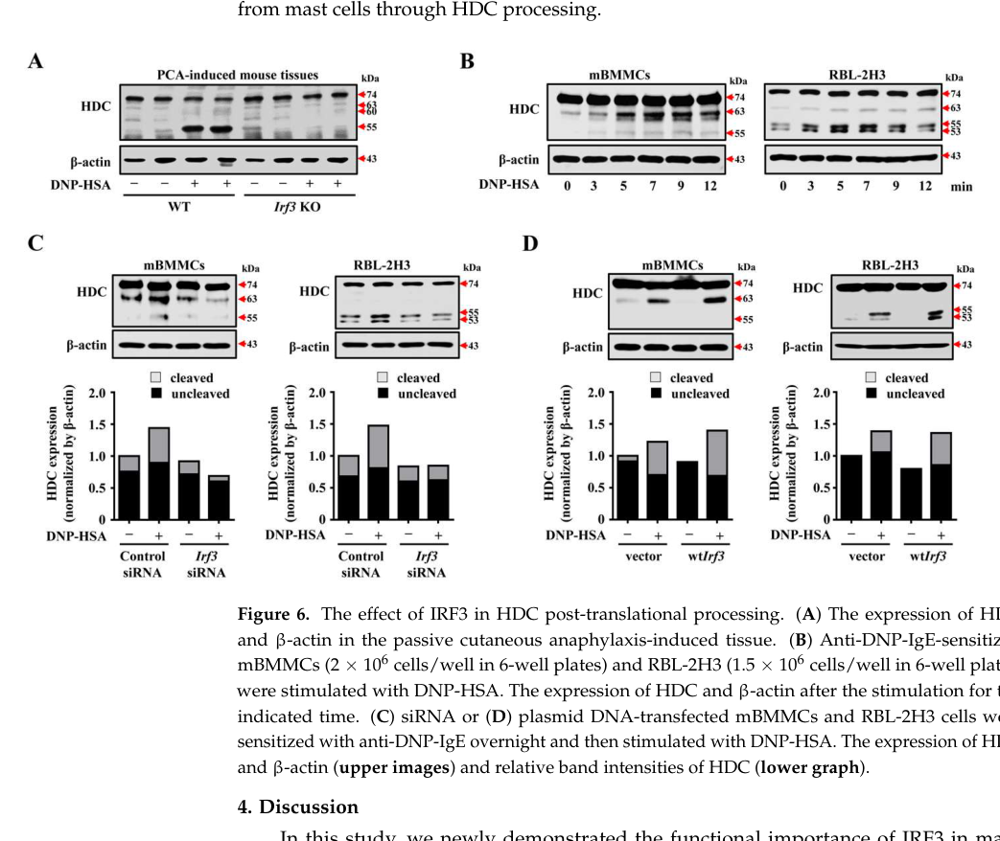

## Question

# Gene Research for Functional Annotation

## ⚠️ CRITICAL: Gene/Protein Identification Context

**BEFORE YOU BEGIN RESEARCH:** You MUST verify you are researching the CORRECT gene/protein. Gene symbols can be ambiguous, especially for less well-characterized genes from non-model organisms.

### Target Gene/Protein Identity (from UniProt):
- **UniProt Accession:** P16453
- **Protein Description:** RecName: Full=Histidine decarboxylase; Short=HDC; EC=4.1.1.22;
- **Gene Information:** Name=Hdc;
- **Organism (full):** Rattus norvegicus (Rat).
- **Protein Family:** Belongs to the group II decarboxylase family.
- **Key Domains:** Aromatic_deC. (IPR010977); PyrdxlP-dep_de-COase. (IPR002129); PyrdxlP-dep_Trfase. (IPR015424); PyrdxlP-dep_Trfase_major. (IPR015421); PyrdxlP-dep_Trfase_small. (IPR015422)

### MANDATORY VERIFICATION STEPS:

1. **Check if the gene symbol "Hdc" matches the protein description above**
2. **Verify the organism is correct:** Rattus norvegicus (Rat).
3. **Check if protein family/domains align with what you find in literature**
4. **If you find literature for a DIFFERENT gene with the same or similar symbol, STOP**

### If Gene Symbol is Ambiguous or You Cannot Find Relevant Literature:

**DO NOT PROCEED WITH RESEARCH ON A DIFFERENT GENE.** Instead:
- State clearly: "The gene symbol 'Hdc' is ambiguous or literature is limited for this specific protein"
- Explain what you found (e.g., "Found extensive literature on a different gene with the same symbol in a different organism")
- Describe the protein based ONLY on the UniProt information provided above
- Suggest that the protein function can be inferred from domain/family information

### Research Target:

Please provide a comprehensive research report on the gene **Hdc** (gene ID: Hdc, UniProt: P16453) in rat.

The research report should be a detailed narrative explaining the function, biological processes, and localization of the gene product. Citations should be given for all claims.

You should prioritize authoritative reviews and primary scientific literature when conducting research. You can supplement
this with annotations you find in gene/protein databases, but these can be outdated or inaccurate.

We are specifically interested in the primary function of the gene - for enzymes, what reaction is catalyzed, and what is the substrate specificity? For transporters, what is the substrate? For structural proteins or adapters, what is the broader structural role? For signaling molecules, what is the role in the pathway.

We are interested in where in or outside the cell the gene product carries out its function.

We are also interested in the signaling or biochemical pathways in which the gene functions. We are less interested in broad pleiotropic effects, except where these elucidate the precise role.

Include evidence where possible. We are interested in both experimental evidence as well as inference from structure, evolution, or bioinformatic analysis. Precise studies should be prioritized over high-throughput, where available.

## Output

Question: You are an expert researcher providing comprehensive, well-cited information.

Provide detailed information focusing on:
1. Key concepts and definitions with current understanding
2. Recent developments and latest research (prioritize 2023-2024 sources)
3. Current applications and real-world implementations
4. Expert opinions and analysis from authoritative sources
5. Relevant statistics and data from recent studies

Format as a comprehensive research report with proper citations. Include URLs and publication dates where available.
Always prioritize recent, authoritative sources and provide specific citations for all major claims.

# Gene Research for Functional Annotation

## ⚠️ CRITICAL: Gene/Protein Identification Context

**BEFORE YOU BEGIN RESEARCH:** You MUST verify you are researching the CORRECT gene/protein. Gene symbols can be ambiguous, especially for less well-characterized genes from non-model organisms.

### Target Gene/Protein Identity (from UniProt):
- **UniProt Accession:** P16453
- **Protein Description:** RecName: Full=Histidine decarboxylase; Short=HDC; EC=4.1.1.22;
- **Gene Information:** Name=Hdc;
- **Organism (full):** Rattus norvegicus (Rat).
- **Protein Family:** Belongs to the group II decarboxylase family.
- **Key Domains:** Aromatic_deC. (IPR010977); PyrdxlP-dep_de-COase. (IPR002129); PyrdxlP-dep_Trfase. (IPR015424); PyrdxlP-dep_Trfase_major. (IPR015421); PyrdxlP-dep_Trfase_small. (IPR015422)

### MANDATORY VERIFICATION STEPS:

1. **Check if the gene symbol "Hdc" matches the protein description above**
2. **Verify the organism is correct:** Rattus norvegicus (Rat).
3. **Check if protein family/domains align with what you find in literature**
4. **If you find literature for a DIFFERENT gene with the same or similar symbol, STOP**

### If Gene Symbol is Ambiguous or You Cannot Find Relevant Literature:

**DO NOT PROCEED WITH RESEARCH ON A DIFFERENT GENE.** Instead:
- State clearly: "The gene symbol 'Hdc' is ambiguous or literature is limited for this specific protein"
- Explain what you found (e.g., "Found extensive literature on a different gene with the same symbol in a different organism")
- Describe the protein based ONLY on the UniProt information provided above
- Suggest that the protein function can be inferred from domain/family information

### Research Target:

Please provide a comprehensive research report on the gene **Hdc** (gene ID: Hdc, UniProt: P16453) in rat.

The research report should be a detailed narrative explaining the function, biological processes, and localization of the gene product. Citations should be given for all claims.

You should prioritize authoritative reviews and primary scientific literature when conducting research. You can supplement
this with annotations you find in gene/protein databases, but these can be outdated or inaccurate.

We are specifically interested in the primary function of the gene - for enzymes, what reaction is catalyzed, and what is the substrate specificity? For transporters, what is the substrate? For structural proteins or adapters, what is the broader structural role? For signaling molecules, what is the role in the pathway.

We are interested in where in or outside the cell the gene product carries out its function.

We are also interested in the signaling or biochemical pathways in which the gene functions. We are less interested in broad pleiotropic effects, except where these elucidate the precise role.

Include evidence where possible. We are interested in both experimental evidence as well as inference from structure, evolution, or bioinformatic analysis. Precise studies should be prioritized over high-throughput, where available.

## Comprehensive Research Report: Rat **Hdc** (Histidine Decarboxylase; UniProt **P16453**) — Functional Annotation

### 0) Target verification (mandatory identity check)
The UniProt accession **P16453** corresponds to **histidine decarboxylase (HDC; EC 4.1.1.22)** from **Rattus norvegicus** and is annotated as the enzyme responsible for histamine production from histidine; this matches the rat gene symbol **Hdc** and the expected **group II PLP-dependent decarboxylase** family context. (okigamiUnknownyearhistidinedecarboxylase(hdc) pages 1-3, rossignoli2019aromaticaminoacids pages 217-218)

### 1) Key concepts and definitions (current understanding)

#### 1.1 Enzymatic function and reaction
**Histidine decarboxylase (HDC)** catalyzes the **single-step decarboxylation of L-histidine to histamine**, which is the committed biosynthetic step generating histamine for immune, gastric, and neuronal signaling. (okigamiUnknownyearhistidinedecarboxylase(hdc) pages 1-3, fernandes2017thecatalyticmechanism pages 1-2, dvornikova2023inflammatoryboweldisease pages 1-2)

- **Enzyme Commission (EC):** **EC 4.1.1.22** is explicitly assigned to L-histidine decarboxylase in recent reviews. (dvornikova2023inflammatoryboweldisease pages 1-2, szukiewicz2024histaminergicsystemactivity pages 1-3)
- **Cofactor:** Mammalian HDC is **pyridoxal-5′-phosphate (PLP)-dependent**. (fernandes2017thecatalyticmechanism pages 1-2, rossignoli2019aromaticaminoacids pages 29-32, rossignoli2019aromaticaminoacids pages 217-218)

#### 1.2 Protein family/domain context
Mammalian HDC is a **group II PLP-dependent decarboxylase** (fold type I-related), consistent with aromatic amino-acid decarboxylase-like enzymes. This family assignment is central to interpreting conserved motifs (e.g., PLP-binding Lys) and dimeric architecture. (fernandes2017thecatalyticmechanism pages 1-2, rossignoli2019aromaticaminoacids pages 29-32, rossignoli2019aromaticaminoacids pages 217-218)

#### 1.3 Cellular role of the product (histamine)
Histamine is a bioactive amine used as:
- an **immunomodulatory mediator** (especially in mast cells/basophils), and
- a **neurotransmitter/neuromodulator** in the CNS histaminergic system. (moriguchi2020histamineandhistidine pages 1-2, szukiewicz2024histaminergicsystemactivity pages 1-3)

A key organizing principle for Hdc functional annotation is that **HDC controls the capacity for histamine synthesis**, while regulated storage/release and receptor signaling determine downstream effects.

### 2) Molecular mechanism and substrate specificity

#### 2.1 Core PLP chemistry and active-site organization
Computational/mechanistic modeling of PLP-dependent HDC describes:
- **PLP covalently bound to an active-site lysine (Lys305)** as an internal aldimine in the resting state; substrate binding forms an external aldimine. (fernandes2017thecatalyticmechanism pages 1-2)
- A functional **homodimer**, with each active site involving residues contributed by the partner subunit. (fernandes2017thecatalyticmechanism pages 1-2)
- Key residues implicated for catalysis/positioning include **Asp273, Tyr334, Ser354, and Lys305** (numbering per the modeled structure). (fernandes2017thecatalyticmechanism pages 1-2)

#### 2.2 Reaction steps (high-level)
The catalytic sequence is described as **decarboxylation of L-histidine**, generating an intermediate that is then **protonated to yield histamine**. (fernandes2017thecatalyticmechanism pages 1-2)

#### 2.3 Quantitative enzymology (representative values)
In one mechanistic study, representative catalytic parameters reported/used for HDC include **kcat ≈ 1.73 s−1** and **kcat/KM ≈ 17.3 s−1 mM−1** (context: mechanistic modeling consistent with PLP decarboxylase chemistry). (fernandes2017thecatalyticmechanism pages 1-2)

### 3) Protein maturation, isoforms, and intracellular localization

#### 3.1 Precursor processing is a defining feature of mammalian HDC
Mammalian HDC is commonly described as being translated as an approximately **~74 kDa precursor** that undergoes **C-terminal proteolytic processing** into smaller, catalytically competent forms (often **~53–55 kDa**), with multiple processed molecular forms reported across tissues and preparations. (rossignoli2019aromaticaminoacids pages 191-192, rossignoli2019aromaticaminoacids pages 29-32, rossignoli2019aromaticaminoacids pages 217-218)

#### 3.2 Compartmentalization and maturation-linked localization
Evidence indicates that HDC’s C-terminus can influence trafficking/compartmental association and stability:
- Specific C-terminal residues (e.g., **588–607**) have been reported to mediate **endoplasmic reticulum (ER) association** of the precursor, while processed forms are more cytosolic. (rossignoli2019aromaticaminoacids pages 29-32)
- In mast/basophilic contexts, processed HDC has been linked to granule-associated localization and function, while the precursor form can be unstable and targeted for degradation. (rossignoli2019aromaticaminoacids pages 29-32)

#### 3.3 Stability and post-translational regulation
HDC is described as relatively scarce/unstable in multiple contexts, and several layers of regulation have been reported:
- **Proteasome-linked degradation** of the precursor form in a rat basophilic/mast cell line context. (rossignoli2019aromaticaminoacids pages 29-32)
- Evidence for **phosphorylation/dephosphorylation-dependent effects** on HDC heterogeneity and activity in rat gastric mucosal preparations has been described (with phosphatase treatment reported to inactivate gastric mucosal HDC in cited work). (rossignoli2019aromaticaminoacids pages 215-217)

### 4) Expression patterns and physiological localization (rat-relevant contexts)

#### 4.1 Canonical histamine-producing cell types
Authoritative reviews describe constitutive Hdc/HDC expression in:
- **mast cells** and **basophils** (immune histamine stores),
- **gastric enterochromaffin-like (ECL) cells** (gastric axis), and
- **histaminergic neurons** (CNS histaminergic system). (moriguchi2020histamineandhistidine pages 1-2)

Hdc can also be **induced in other myeloid-lineage cells** under inflammatory/pathogenic stimuli. (moriguchi2020histamineandhistidine pages 1-2, moriguchi2020histamineandhistidine pages 4-6, moriguchi2020histamineandhistidine pages 2-4)

#### 4.2 Storage and release context for histamine
Histamine is primarily stored in **intracellular/secretory granules** (notably in mast cells and basophils), with packaging through the Golgi and release through regulated degranulation. (dvornikova2023inflammatoryboweldisease pages 1-2, moriguchi2020histamineandhistidine pages 1-2)

#### 4.3 CNS anatomical localization (histaminergic neurons)
In the CNS, histamine-producing neurons are localized to the **tuberomammillary nucleus (TMN)** of the posterior hypothalamus and project widely throughout the brain, consistent with a diffuse neuromodulatory system. (szukiewicz2024histaminergicsystemactivity pages 7-8, szukiewicz2024histaminergicsystemactivity pages 1-3, rossignoli2019aromaticaminoacids pages 49-53)

A quantitative estimate provided in a 2024 review suggests **~60,000–125,000 TMN histaminergic neurons in humans** (noting variability across conditions), illustrating the scale of this system. (szukiewicz2024histaminergicsystemactivity pages 7-8)

### 5) Pathways and regulatory biology (how Hdc is controlled)

#### 5.1 Epigenetic and promoter-level control
Hdc/HDC expression is regulated by **promoter CpG methylation**, which contributes to transcriptional repression and cell-type specificity. (moriguchi2020histamineandhistidine pages 1-2, moriguchi2020histamineandhistidine pages 6-6, moriguchi2020histamineandhistidine pages 6-7)

#### 5.2 Transcription-factor mechanisms (immune and gastric axes)
A mechanistic model highlighted in an authoritative review includes:
- **SP1** binding to a GC box as a positive regulator in inflammatory induction,
- **KLF4** as a negative regulator that competes with SP1 at a composite site, and
- **gastrin** signaling (gastric context) that can displace KLF4 and permit SP1-driven activation. (moriguchi2020histamineandhistidine pages 1-2, moriguchi2020histamineandhistidine pages 6-6)

In mast cells, a regulatory element approximately **−8.8 kb upstream** of the Hdc locus is described as responsive to **GATA2** and **MITF** for mast-cell expression. (moriguchi2020histamineandhistidine pages 2-4, moriguchi2020histamineandhistidine pages 6-7)

#### 5.3 Inflammatory induction in myeloid lineages
Inflammatory stimuli such as **LPS** and cytokines (e.g., **IL-1**, **TNF-α**) can induce Hdc expression and expand HDC-expressing myeloid populations (e.g., neutrophils in sepsis-related contexts). (moriguchi2020histamineandhistidine pages 1-2, moriguchi2020histamineandhistidine pages 4-6)

### 6) Recent developments (prioritizing 2023–2024)

#### 6.1 2023: FcεRI-driven mast-cell signaling connects to **post-translational HDC processing** (IRF3)
A 2023 primary study reported that **IRF3** regulates **post-translational cleavage/processing of HDC** downstream of IgE/FcεRI stimulation.
- In **mouse bone marrow-derived mast cells (mBMMCs)**, a **~63 kDa** cleaved HDC form was observed after antigen stimulation.
- In **rat RBL-2H3** cells, **~55 kDa and ~53 kDa** HDC cleavage products were observed.
- **IRF3 knockdown** suppressed cleaved HDC species, while **IRF3 overexpression** increased them, supporting an upstream role for IRF3 in HDC processing and mast-cell granule mediator output. (choi2023irf3activationin pages 11-12, choi2023irf3activationin pages 8-11, choi2023irf3activationin media 331c4478)

#### 6.2 2023: Transcriptional control of HDC by **FLI1** and actionable inhibitor concepts
A 2023 study in leukemic models demonstrated that:
- **FLI1** directly binds the **HDC promoter**, with a reported binding motif at **−485 to −493**, and FLI1 knockdown caused about **~95% downregulation of HDC** in the cited system. (hu2023fli1regulateshistamine pages 4-7)
- HDC/HDC-regulated outputs included inflammatory genes (e.g., **IL1B**, **CXCR2**, **CPA3**) linked to microenvironmental signaling in vivo. (hu2023fli1regulateshistamine pages 1-2, hu2023fli1regulateshistamine pages 10-11)
- Pharmacologic angles were highlighted: an epigallocatechin derivative (**EGC**) inhibited HDC transcription, and **tetrandrine** was reported to suppress HDC transcription via targeting FLI1; molecular docking predicted tetrandrine binding to FLI1 with an affinity of **−7.9** (model-based statistic). (hu2023fli1regulateshistamine pages 1-2, hu2023fli1regulateshistamine pages 7-10)

Although these data are not rat-specific, they are recent mechanistic evidence for how HDC can be controlled at the transcriptional level and illustrate a translational strategy (targeting the HDC axis through upstream TFs). (hu2023fli1regulateshistamine pages 1-2, hu2023fli1regulateshistamine pages 4-7)

#### 6.3 2024: CNS histaminergic system synthesis/localization framing
A 2024 review reiterates that brain histamine is synthesized in a **single HDC-catalyzed step** and that histaminergic neuron cell bodies are localized to **TMN** with wide projections, emphasizing receptor-level feedback where **H3 autoreceptors** reduce histamine synthesis/release (negative feedback that includes effects on HDC-mediated synthesis). (szukiewicz2024histaminergicsystemactivity pages 7-8, szukiewicz2024histaminergicsystemactivity pages 1-3)

### 7) Current applications and real-world implementations

#### 7.1 Experimental models and tools
- **Genetic loss of Hdc/HDC** (HDC−/−) is used to test causal roles of histamine biosynthesis in immune/neuroinflammatory phenotypes (e.g., EAE worsening is discussed in reviewed literature), providing a direct functional link to Hdc activity. (rossignoli2019aromaticaminoacids pages 53-57)
- **Histaminergic cell reporter tools** (e.g., **Hdc-BAC-GFP**) are described as enabling identification/monitoring of histamine-producing cells and upstream regulatory signals in vivo. (moriguchi2020histamineandhistidine pages 1-2)

#### 7.2 Pharmacologic modulation of histamine synthesis capacity
- **HDC inhibitors and inhibitor design** are discussed in the context of PLP-dependent active-site chemistry and inhibitor–PLP adduct formation (oxime-type chemistry) and rational targeting enabled by structural insight into group II decarboxylases. (rossignoli2019aromaticaminoacids pages 29-32)
- Recent work also highlights upstream transcriptional targeting (e.g., FLI1→HDC axis) as an indirect route to suppress histamine biosynthesis capacity in selected contexts. (hu2023fli1regulateshistamine pages 1-2, hu2023fli1regulateshistamine pages 4-7)

### 8) Summary of key quantitative/statistical data (from the retrieved evidence)
- **HDC reaction:** L-histidine → histamine (single-step decarboxylation). (fernandes2017thecatalyticmechanism pages 1-2, dvornikova2023inflammatoryboweldisease pages 1-2)
- **EC number:** 4.1.1.22. (dvornikova2023inflammatoryboweldisease pages 1-2, szukiewicz2024histaminergicsystemactivity pages 1-3)
- **Cofactor:** PLP dependence. (fernandes2017thecatalyticmechanism pages 1-2, rossignoli2019aromaticaminoacids pages 217-218)
- **Catalysis (representative):** kcat ≈ 1.73 s−1; kcat/KM ≈ 17.3 s−1 mM−1. (fernandes2017thecatalyticmechanism pages 1-2)
- **Maturation sizes:** precursor ~74 kDa; processed active forms typically ~53–55 kDa. (rossignoli2019aromaticaminoacids pages 29-32, rossignoli2019aromaticaminoacids pages 191-192)
- **2023 IRF3-linked cleavage bands:** 63 kDa (mBMMCs), 55/53 kDa (RBL-2H3). (choi2023irf3activationin pages 11-12, choi2023irf3activationin media 331c4478)
- **TMN neuron estimate (human, for system scale):** ~60,000–125,000 HDC+ histaminergic neurons. (szukiewicz2024histaminergicsystemactivity pages 7-8)
- **FLI1 perturbation statistic (model system):** ~95% downregulation of HDC upon FLI1 knockdown. (hu2023fli1regulateshistamine pages 4-7)
- **Docking statistic (model-based):** tetrandrine predicted affinity −7.9 to the FLI1 ETS DNA-binding domain. (hu2023fli1regulateshistamine pages 7-10)

### 9) Consolidated functional annotation (rat Hdc; UniProt P16453)
**Primary molecular function:** PLP-dependent decarboxylation of **L-histidine** to produce **histamine** (EC 4.1.1.22), acting as the biosynthetic gatekeeper of histamine signaling capacity. (okigamiUnknownyearhistidinedecarboxylase(hdc) pages 1-3, fernandes2017thecatalyticmechanism pages 1-2, dvornikova2023inflammatoryboweldisease pages 1-2)

**Biological processes (most direct):** histamine biosynthesis supporting mast/basophil effector function (granule mediator availability), gastric axis histamine signaling, and CNS histaminergic neurotransmission from TMN neurons. (dvornikova2023inflammatoryboweldisease pages 1-2, moriguchi2020histamineandhistidine pages 1-2, szukiewicz2024histaminergicsystemactivity pages 7-8)

**Where the gene product acts (localization):**
- **Cell-type level:** mast cells, basophils, gastric ECL cells, histaminergic neurons; inducible in other myeloid cells under inflammatory conditions. (moriguchi2020histamineandhistidine pages 1-2, moriguchi2020histamineandhistidine pages 2-4)
- **Subcellular level:** HDC undergoes maturation from a ~74 kDa precursor to smaller active forms; C-terminal sequence contributes to ER association, while processed forms are more cytosolic and functionally coupled to granule maturation and histamine storage/release in secretory granules. (rossignoli2019aromaticaminoacids pages 29-32, choi2023irf3activationin pages 11-12)

---

## Evidence Summary Table
The following table consolidates core annotation elements and recent advances.

| Section | Topic | Summary | Evidence |
|---|---|---|---|
| Core annotation | Identity | Rat **Hdc/HDC** corresponds to **UniProt P16453**; literature/evidence matches **histidine decarboxylase** from *Rattus norvegicus*. | (okigamiUnknownyearhistidinedecarboxylase(hdc) pages 1-3) |
| Core annotation | Reaction | HDC catalyzes the **single-step decarboxylation of L-histidine to histamine**. | (okigamiUnknownyearhistidinedecarboxylase(hdc) pages 1-3, fernandes2017thecatalyticmechanism pages 1-2, dvornikova2023inflammatoryboweldisease pages 1-2) |
| Core annotation | EC number | Classified as **EC 4.1.1.22**. | (dvornikova2023inflammatoryboweldisease pages 1-2, szukiewicz2024histaminergicsystemactivity pages 1-3) |
| Core annotation | Cofactor | HDC is **PLP-dependent**, using **pyridoxal 5′-phosphate (PLP)**. | (fernandes2017thecatalyticmechanism pages 1-2, rossignoli2019aromaticaminoacids pages 29-32, rossignoli2019aromaticaminoacids pages 217-218) |
| Core annotation | Enzyme family / domains | Member of the **group II PLP-dependent decarboxylase** family (fold type I / aromatic amino acid decarboxylase-related family), consistent with UniProt Aromatic_deC / PLP_deC annotations. | (fernandes2017thecatalyticmechanism pages 1-2, rossignoli2019aromaticaminoacids pages 29-32, rossignoli2019aromaticaminoacids pages 217-218) |
| Core annotation | Catalytic / structural features | Active as a **homodimer**; PLP forms an internal aldimine with **Lys305**; key catalytic residues include **Asp273, Tyr334, Ser354, Lys305**; decarboxylation is followed by protonation to yield histamine. | (fernandes2017thecatalyticmechanism pages 1-2) |
| Core annotation | Processing / isoforms | Mammalian HDC is synthesized as an approximately **74 kDa precursor** and undergoes tissue-specific **C-terminal proteolytic processing** to active forms; active processed species are commonly **~53–55 kDa**, with reported processed forms spanning ~53–70 kDa. | (rossignoli2019aromaticaminoacids pages 191-192, rossignoli2019aromaticaminoacids pages 29-32, rossignoli2019aromaticaminoacids pages 217-218) |
| Core annotation | Stability / turnover | The 74-kDa form is relatively unstable; in a rat basophilic/mast cell line it is degraded through the **ubiquitin–proteasome pathway**. | (rossignoli2019aromaticaminoacids pages 29-32) |
| Core annotation | Subcellular localization | HDC is largely **cytosolic** after processing; residues **588–607** in the C-terminus mediate **ER association** of the precursor, and processed 54-kDa HDC can localize to **granules** in mast/basophilic cells. | (rossignoli2019aromaticaminoacids pages 29-32, rossignoli2019aromaticaminoacids pages 191-192) |
| Core annotation | Major expressing cell types | Constitutive expression is reported in **mast cells, basophils, gastric enterochromaffin-like (ECL) cells, and histaminergic neurons**; inducible expression also occurs in other myeloid cells. | (moriguchi2020histamineandhistidine pages 1-2, moriguchi2020histamineandhistidine pages 2-4) |
| Core annotation | Tissue / system localization | In brain, histamine-producing neurons are concentrated in the **tuberomammillary nucleus (TMN)** of the posterior hypothalamus and project broadly throughout the CNS. | (szukiewicz2024histaminergicsystemactivity pages 7-8, szukiewicz2024histaminergicsystemactivity pages 1-3, rossignoli2019aromaticaminoacids pages 49-53) |
| Regulation | Epigenetic regulation | **Promoter CpG methylation** represses Hdc/HDC transcription and contributes to cell-type specificity. | (moriguchi2020histamineandhistidine pages 1-2, moriguchi2020histamineandhistidine pages 6-6, moriguchi2020histamineandhistidine pages 6-7) |
| Regulation | SP1 / KLF4 / gastrin axis | **SP1** activates Hdc at a GC box; **KLF4** represses by competing with SP1; **gastrin** can evict KLF4 and promote SP1-dependent activation, especially relevant to gastric regulation. | (moriguchi2020histamineandhistidine pages 1-2, moriguchi2020histamineandhistidine pages 6-6) |
| Regulation | Mast-cell lineage TFs | In mast cells, **GATA2** and **MITF** activate Hdc via an upstream **−8.8 kb regulatory element**; KLF4 can suppress Hdc in bone marrow-derived mast cells. | (moriguchi2020histamineandhistidine pages 6-7, moriguchi2020histamineandhistidine pages 2-4) |
| Regulation | Inflammatory induction | **LPS**, **IL-1**, and **TNF-α** induce Hdc expression; inflammatory states expand HDC-expressing myeloid populations including neutrophils. | (moriguchi2020histamineandhistidine pages 1-2, moriguchi2020histamineandhistidine pages 4-6) |
| Regulation | Post-translational control | HDC activity/abundance is additionally shaped by **proteolytic maturation**, **proteasomal degradation**, and reported **phosphorylation/dephosphorylation** effects in rat gastric mucosa. | (rossignoli2019aromaticaminoacids pages 29-32, rossignoli2019aromaticaminoacids pages 215-217) |
| 2023–2024 advances | Choi et al. 2023 | **System:** mBMMCs, rat **RBL-2H3**, PCA/ASA mouse models. **Finding:** **IRF3** promotes mast-cell allergic responses by regulating **post-translational cleavage of HDC**; cleaved forms observed included **63 kDa** in mBMMCs and **55/53 kDa** in RBL-2H3, with reduced cleavage after IRF3 knockdown. | (choi2023irf3activationin pages 11-12, choi2023irf3activationin pages 8-11, choi2023irf3activationin pages 1-2) |
| 2023–2024 advances | Hu et al. 2023 | **System:** HEL/K562 leukemia models, mouse erythroleukemia model. **Finding:** **FLI1 directly binds the HDC promoter** (site at **−485 to −493**) and strongly regulates HDC; shFLI1 caused about **95% downregulation** of HDC, linking HDC to inflammatory genes such as **IL1B, CXCR2, CPA3**. | (hu2023fli1regulateshistamine pages 1-2, hu2023fli1regulateshistamine pages 4-7, hu2023fli1regulateshistamine pages 10-11) |
| 2023–2024 advances | Hu et al. 2023 inhibitors | **EGC** strongly inhibited HDC transcription; **tetrandrine** suppressed FLI1/HDC, docked to the FLI1 DNA-binding domain with predicted affinity **−7.9**, and inhibited leukemia progression in vivo; **diacerein** blocked Fli-1-induced leukemia via inflammatory signaling. | (hu2023fli1regulateshistamine pages 1-2, hu2023fli1regulateshistamine pages 7-10, hu2023fli1regulateshistamine pages 10-11) |
| 2023–2024 advances | Szukiewicz 2024 | **System:** CNS histaminergic review. **Finding:** Brain histamine is synthesized in one step by **HDC** in TMN neurons; estimated human TMN histaminergic neuron number is **~60,000–125,000**, and **H3 autoreceptors** reduce HDC-mediated histamine synthesis/release via negative feedback. | (szukiewicz2024histaminergicsystemactivity pages 7-8, szukiewicz2024histaminergicsystemactivity pages 1-3) |
| 2023–2024 advances | Dvornikova et al. 2023 | **System:** IBD/histamine review. **Finding:** Reiterates HDC as **EC 4.1.1.22** and emphasizes histamine storage in **intracellular granules** of mast cells/basophils and packaging into secretory granules before degranulation. | (dvornikova2023inflammatoryboweldisease pages 1-2) |

*Table: This table compiles the key functional annotation, regulatory mechanisms, and recent 2023–2024 advances relevant to rat Hdc/HDC (UniProt P16453). It is designed to support a concise, citeable narrative about enzyme function, localization, processing, and current biological insights.*

### Key source URLs (with publication dates)
- Dvornikova et al., *Int. J. Mol. Sci.* **2023-06**. https://doi.org/10.3390/ijms24129937 (dvornikova2023inflammatoryboweldisease pages 1-2)
- Choi et al., *Cells* **2023-05**. https://doi.org/10.3390/cells12111493 (choi2023irf3activationin pages 11-12)
- Hu et al., *Journal of Inflammation Research* **2023-05**. https://doi.org/10.2147/JIR.S401566 (hu2023fli1regulateshistamine pages 1-2)
- Szukiewicz, *Int. J. Mol. Sci.* **2024-09**. https://doi.org/10.3390/ijms25189859 (szukiewicz2024histaminergicsystemactivity pages 7-8)
- Moriguchi & Takai, *Genes to Cells* **2020-05**. https://doi.org/10.1111/gtc.12774 (moriguchi2020histamineandhistidine pages 1-2)
- Fernandes et al., *Chemistry – A European Journal* **2017-07**. https://doi.org/10.1002/chem.201701375 (fernandes2017thecatalyticmechanism pages 1-2)

### Notes on scope and organism specificity
Several mechanistic and regulatory findings are from mammalian systems not exclusively rat (e.g., human CNS neuron counts; leukemia models). These are used to inform functional annotation because HDC is a conserved mammalian enzyme with shared PLP-dependent group II decarboxylase mechanisms; rat-specific evidence is incorporated where available (e.g., rat UniProt mapping; rat basophilic RBL-2H3 processing bands and degradation/localization statements). (okigamiUnknownyearhistidinedecarboxylase(hdc) pages 1-3, rossignoli2019aromaticaminoacids pages 29-32, choi2023irf3activationin pages 11-12)

References

1. (okigamiUnknownyearhistidinedecarboxylase(hdc) pages 1-3): H Okigami and H Ueno. Histidine decarboxylase (hdc) is an enzyme responsible for histamine production in living cells. it is of our aim to understand structure-function relationship of …. Unknown journal, Unknown year.

2. (rossignoli2019aromaticaminoacids pages 217-218): G Rossignoli. Aromatic amino acids decarboxylase and histidine decarboxylase: deep functional investigations give insights into pathophysiological mechanisms with possible …. Unknown journal, 2019.

3. (fernandes2017thecatalyticmechanism pages 1-2): Henrique Silva Fernandes, Maria João Ramos, and Nuno M. F. S. A. Cerqueira. The catalytic mechanism of the pyridoxal-5'-phosphate-dependent enzyme, histidine decarboxylase: a computational study. Chemistry, 23 38:9162-9173, Jul 2017. URL: https://doi.org/10.1002/chem.201701375, doi:10.1002/chem.201701375. This article has 48 citations.

4. (dvornikova2023inflammatoryboweldisease pages 1-2): Kristina A. Dvornikova, Olga N. Platonova, and Elena Y. Bystrova. Inflammatory bowel disease: crosstalk between histamine, immunity, and disease. International Journal of Molecular Sciences, 24:9937, Jun 2023. URL: https://doi.org/10.3390/ijms24129937, doi:10.3390/ijms24129937. This article has 48 citations.

5. (szukiewicz2024histaminergicsystemactivity pages 1-3): Dariusz Szukiewicz. Histaminergic system activity in the central nervous system: the role in neurodevelopmental and neurodegenerative disorders. International Journal of Molecular Sciences, 25:9859, Sep 2024. URL: https://doi.org/10.3390/ijms25189859, doi:10.3390/ijms25189859. This article has 27 citations.

6. (rossignoli2019aromaticaminoacids pages 29-32): G Rossignoli. Aromatic amino acids decarboxylase and histidine decarboxylase: deep functional investigations give insights into pathophysiological mechanisms with possible …. Unknown journal, 2019.

7. (moriguchi2020histamineandhistidine pages 1-2): Takashi Moriguchi and Jun Takai. Histamine and histidine decarboxylase: immunomodulatory functions and regulatory mechanisms. Genes to Cells, 25:443-449, May 2020. URL: https://doi.org/10.1111/gtc.12774, doi:10.1111/gtc.12774. This article has 90 citations and is from a peer-reviewed journal.

8. (rossignoli2019aromaticaminoacids pages 191-192): G Rossignoli. Aromatic amino acids decarboxylase and histidine decarboxylase: deep functional investigations give insights into pathophysiological mechanisms with possible …. Unknown journal, 2019.

9. (rossignoli2019aromaticaminoacids pages 215-217): G Rossignoli. Aromatic amino acids decarboxylase and histidine decarboxylase: deep functional investigations give insights into pathophysiological mechanisms with possible …. Unknown journal, 2019.

10. (moriguchi2020histamineandhistidine pages 4-6): Takashi Moriguchi and Jun Takai. Histamine and histidine decarboxylase: immunomodulatory functions and regulatory mechanisms. Genes to Cells, 25:443-449, May 2020. URL: https://doi.org/10.1111/gtc.12774, doi:10.1111/gtc.12774. This article has 90 citations and is from a peer-reviewed journal.

11. (moriguchi2020histamineandhistidine pages 2-4): Takashi Moriguchi and Jun Takai. Histamine and histidine decarboxylase: immunomodulatory functions and regulatory mechanisms. Genes to Cells, 25:443-449, May 2020. URL: https://doi.org/10.1111/gtc.12774, doi:10.1111/gtc.12774. This article has 90 citations and is from a peer-reviewed journal.

12. (szukiewicz2024histaminergicsystemactivity pages 7-8): Dariusz Szukiewicz. Histaminergic system activity in the central nervous system: the role in neurodevelopmental and neurodegenerative disorders. International Journal of Molecular Sciences, 25:9859, Sep 2024. URL: https://doi.org/10.3390/ijms25189859, doi:10.3390/ijms25189859. This article has 27 citations.

13. (rossignoli2019aromaticaminoacids pages 49-53): G Rossignoli. Aromatic amino acids decarboxylase and histidine decarboxylase: deep functional investigations give insights into pathophysiological mechanisms with possible …. Unknown journal, 2019.

14. (moriguchi2020histamineandhistidine pages 6-6): Takashi Moriguchi and Jun Takai. Histamine and histidine decarboxylase: immunomodulatory functions and regulatory mechanisms. Genes to Cells, 25:443-449, May 2020. URL: https://doi.org/10.1111/gtc.12774, doi:10.1111/gtc.12774. This article has 90 citations and is from a peer-reviewed journal.

15. (moriguchi2020histamineandhistidine pages 6-7): Takashi Moriguchi and Jun Takai. Histamine and histidine decarboxylase: immunomodulatory functions and regulatory mechanisms. Genes to Cells, 25:443-449, May 2020. URL: https://doi.org/10.1111/gtc.12774, doi:10.1111/gtc.12774. This article has 90 citations and is from a peer-reviewed journal.

16. (choi2023irf3activationin pages 11-12): Young-Ae Choi, Hima Dhakal, Soyoung Lee, Namkyung Kim, Byungheon Lee, Taeg Kyu Kwon, Dongwoo Khang, and Sang-Hyun Kim. Irf3 activation in mast cells promotes fcεri-mediated allergic inflammation. Cells, 12:1493, May 2023. URL: https://doi.org/10.3390/cells12111493, doi:10.3390/cells12111493. This article has 4 citations.

17. (choi2023irf3activationin pages 8-11): Young-Ae Choi, Hima Dhakal, Soyoung Lee, Namkyung Kim, Byungheon Lee, Taeg Kyu Kwon, Dongwoo Khang, and Sang-Hyun Kim. Irf3 activation in mast cells promotes fcεri-mediated allergic inflammation. Cells, 12:1493, May 2023. URL: https://doi.org/10.3390/cells12111493, doi:10.3390/cells12111493. This article has 4 citations.

18. (choi2023irf3activationin media 331c4478): Young-Ae Choi, Hima Dhakal, Soyoung Lee, Namkyung Kim, Byungheon Lee, Taeg Kyu Kwon, Dongwoo Khang, and Sang-Hyun Kim. Irf3 activation in mast cells promotes fcεri-mediated allergic inflammation. Cells, 12:1493, May 2023. URL: https://doi.org/10.3390/cells12111493, doi:10.3390/cells12111493. This article has 4 citations.

19. (hu2023fli1regulateshistamine pages 4-7): Jifen Hu, Jian-ping Gao, Chunlin Wang, Wuling Liu, Anling Hu, Xiao Xiao, Yicheng Kuang, Kunling Yu, Babu Gajendran, E. Zacksenhaus, Weidong Pan, and Y. Ben-David. Fli1 regulates histamine decarboxylase expression to control inflammation signaling and leukemia progression. Journal of Inflammation Research, 16:2007-2020, May 2023. URL: https://doi.org/10.2147/jir.s401566, doi:10.2147/jir.s401566. This article has 12 citations and is from a peer-reviewed journal.

20. (hu2023fli1regulateshistamine pages 1-2): Jifen Hu, Jian-ping Gao, Chunlin Wang, Wuling Liu, Anling Hu, Xiao Xiao, Yicheng Kuang, Kunling Yu, Babu Gajendran, E. Zacksenhaus, Weidong Pan, and Y. Ben-David. Fli1 regulates histamine decarboxylase expression to control inflammation signaling and leukemia progression. Journal of Inflammation Research, 16:2007-2020, May 2023. URL: https://doi.org/10.2147/jir.s401566, doi:10.2147/jir.s401566. This article has 12 citations and is from a peer-reviewed journal.

21. (hu2023fli1regulateshistamine pages 10-11): Jifen Hu, Jian-ping Gao, Chunlin Wang, Wuling Liu, Anling Hu, Xiao Xiao, Yicheng Kuang, Kunling Yu, Babu Gajendran, E. Zacksenhaus, Weidong Pan, and Y. Ben-David. Fli1 regulates histamine decarboxylase expression to control inflammation signaling and leukemia progression. Journal of Inflammation Research, 16:2007-2020, May 2023. URL: https://doi.org/10.2147/jir.s401566, doi:10.2147/jir.s401566. This article has 12 citations and is from a peer-reviewed journal.

22. (hu2023fli1regulateshistamine pages 7-10): Jifen Hu, Jian-ping Gao, Chunlin Wang, Wuling Liu, Anling Hu, Xiao Xiao, Yicheng Kuang, Kunling Yu, Babu Gajendran, E. Zacksenhaus, Weidong Pan, and Y. Ben-David. Fli1 regulates histamine decarboxylase expression to control inflammation signaling and leukemia progression. Journal of Inflammation Research, 16:2007-2020, May 2023. URL: https://doi.org/10.2147/jir.s401566, doi:10.2147/jir.s401566. This article has 12 citations and is from a peer-reviewed journal.

23. (rossignoli2019aromaticaminoacids pages 53-57): G Rossignoli. Aromatic amino acids decarboxylase and histidine decarboxylase: deep functional investigations give insights into pathophysiological mechanisms with possible …. Unknown journal, 2019.

24. (choi2023irf3activationin pages 1-2): Young-Ae Choi, Hima Dhakal, Soyoung Lee, Namkyung Kim, Byungheon Lee, Taeg Kyu Kwon, Dongwoo Khang, and Sang-Hyun Kim. Irf3 activation in mast cells promotes fcεri-mediated allergic inflammation. Cells, 12:1493, May 2023. URL: https://doi.org/10.3390/cells12111493, doi:10.3390/cells12111493. This article has 4 citations.

## Artifacts

- [Edison artifact artifact-00](Hdc-deep-research-falcon_artifacts/artifact-00.md)

## Citations

1. fernandes2017thecatalyticmechanism pages 1-2
2. rossignoli2019aromaticaminoacids pages 29-32
3. rossignoli2019aromaticaminoacids pages 215-217
4. moriguchi2020histamineandhistidine pages 1-2
5. szukiewicz2024histaminergicsystemactivity pages 7-8
6. rossignoli2019aromaticaminoacids pages 53-57
7. dvornikova2023inflammatoryboweldisease pages 1-2
8. rossignoli2019aromaticaminoacids pages 217-218
9. szukiewicz2024histaminergicsystemactivity pages 1-3
10. rossignoli2019aromaticaminoacids pages 191-192
11. moriguchi2020histamineandhistidine pages 4-6
12. moriguchi2020histamineandhistidine pages 2-4
13. rossignoli2019aromaticaminoacids pages 49-53
14. moriguchi2020histamineandhistidine pages 6-6
15. moriguchi2020histamineandhistidine pages 6-7
16. https://doi.org/10.3390/ijms24129937
17. https://doi.org/10.3390/cells12111493
18. https://doi.org/10.2147/JIR.S401566
19. https://doi.org/10.3390/ijms25189859
20. https://doi.org/10.1111/gtc.12774
21. https://doi.org/10.1002/chem.201701375
22. https://doi.org/10.1002/chem.201701375,
23. https://doi.org/10.3390/ijms24129937,
24. https://doi.org/10.3390/ijms25189859,
25. https://doi.org/10.1111/gtc.12774,
26. https://doi.org/10.3390/cells12111493,
27. https://doi.org/10.2147/jir.s401566,