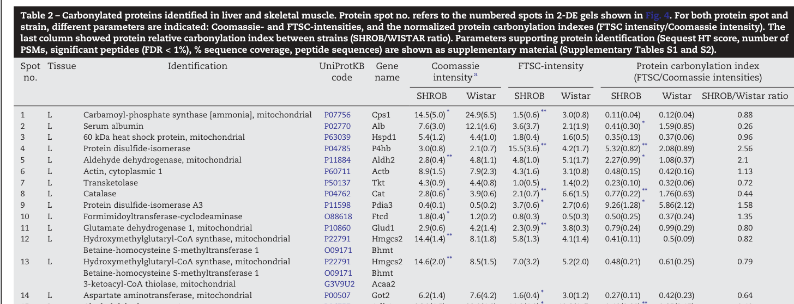

## Question

# Gene Research for Functional Annotation

## ⚠️ CRITICAL: Gene/Protein Identification Context

**BEFORE YOU BEGIN RESEARCH:** You MUST verify you are researching the CORRECT gene/protein. Gene symbols can be ambiguous, especially for less well-characterized genes from non-model organisms.

### Target Gene/Protein Identity (from UniProt):
- **UniProt Accession:** P22791
- **Protein Description:** RecName: Full=Hydroxymethylglutaryl-CoA synthase, mitochondrial; Short=HMG-CoA synthase; EC=2.3.3.10 {ECO:0000250|UniProtKB:P54868}; AltName: Full=3-hydroxy-3-methylglutaryl coenzyme A synthase; Flags: Precursor;
- **Gene Information:** Name=Hmgcs2;
- **Organism (full):** Rattus norvegicus (Rat).
- **Protein Family:** Belongs to the thiolase-like superfamily. HMG-CoA synthase
- **Key Domains:** HMG_CoA_synt_AS. (IPR000590); HMG_CoA_synt_C_dom. (IPR013746); HMG_CoA_synth_N. (IPR013528); HMG_CoA_synthase_euk. (IPR010122); Thiolase-like. (IPR016039)

### MANDATORY VERIFICATION STEPS:

1. **Check if the gene symbol "Hmgcs2" matches the protein description above**
2. **Verify the organism is correct:** Rattus norvegicus (Rat).
3. **Check if protein family/domains align with what you find in literature**
4. **If you find literature for a DIFFERENT gene with the same or similar symbol, STOP**

### If Gene Symbol is Ambiguous or You Cannot Find Relevant Literature:

**DO NOT PROCEED WITH RESEARCH ON A DIFFERENT GENE.** Instead:
- State clearly: "The gene symbol 'Hmgcs2' is ambiguous or literature is limited for this specific protein"
- Explain what you found (e.g., "Found extensive literature on a different gene with the same symbol in a different organism")
- Describe the protein based ONLY on the UniProt information provided above
- Suggest that the protein function can be inferred from domain/family information

### Research Target:

Please provide a comprehensive research report on the gene **Hmgcs2** (gene ID: Hmgcs2, UniProt: P22791) in rat.

The research report should be a detailed narrative explaining the function, biological processes, and localization of the gene product. Citations should be given for all claims.

You should prioritize authoritative reviews and primary scientific literature when conducting research. You can supplement
this with annotations you find in gene/protein databases, but these can be outdated or inaccurate.

We are specifically interested in the primary function of the gene - for enzymes, what reaction is catalyzed, and what is the substrate specificity? For transporters, what is the substrate? For structural proteins or adapters, what is the broader structural role? For signaling molecules, what is the role in the pathway.

We are interested in where in or outside the cell the gene product carries out its function.

We are also interested in the signaling or biochemical pathways in which the gene functions. We are less interested in broad pleiotropic effects, except where these elucidate the precise role.

Include evidence where possible. We are interested in both experimental evidence as well as inference from structure, evolution, or bioinformatic analysis. Precise studies should be prioritized over high-throughput, where available.

## Output

Question: You are an expert researcher providing comprehensive, well-cited information.

Provide detailed information focusing on:
1. Key concepts and definitions with current understanding
2. Recent developments and latest research (prioritize 2023-2024 sources)
3. Current applications and real-world implementations
4. Expert opinions and analysis from authoritative sources
5. Relevant statistics and data from recent studies

Format as a comprehensive research report with proper citations. Include URLs and publication dates where available.
Always prioritize recent, authoritative sources and provide specific citations for all major claims.

# Gene Research for Functional Annotation

## ⚠️ CRITICAL: Gene/Protein Identification Context

**BEFORE YOU BEGIN RESEARCH:** You MUST verify you are researching the CORRECT gene/protein. Gene symbols can be ambiguous, especially for less well-characterized genes from non-model organisms.

### Target Gene/Protein Identity (from UniProt):
- **UniProt Accession:** P22791
- **Protein Description:** RecName: Full=Hydroxymethylglutaryl-CoA synthase, mitochondrial; Short=HMG-CoA synthase; EC=2.3.3.10 {ECO:0000250|UniProtKB:P54868}; AltName: Full=3-hydroxy-3-methylglutaryl coenzyme A synthase; Flags: Precursor;
- **Gene Information:** Name=Hmgcs2;
- **Organism (full):** Rattus norvegicus (Rat).
- **Protein Family:** Belongs to the thiolase-like superfamily. HMG-CoA synthase
- **Key Domains:** HMG_CoA_synt_AS. (IPR000590); HMG_CoA_synt_C_dom. (IPR013746); HMG_CoA_synth_N. (IPR013528); HMG_CoA_synthase_euk. (IPR010122); Thiolase-like. (IPR016039)

### MANDATORY VERIFICATION STEPS:

1. **Check if the gene symbol "Hmgcs2" matches the protein description above**
2. **Verify the organism is correct:** Rattus norvegicus (Rat).
3. **Check if protein family/domains align with what you find in literature**
4. **If you find literature for a DIFFERENT gene with the same or similar symbol, STOP**

### If Gene Symbol is Ambiguous or You Cannot Find Relevant Literature:

**DO NOT PROCEED WITH RESEARCH ON A DIFFERENT GENE.** Instead:
- State clearly: "The gene symbol 'Hmgcs2' is ambiguous or literature is limited for this specific protein"
- Explain what you found (e.g., "Found extensive literature on a different gene with the same symbol in a different organism")
- Describe the protein based ONLY on the UniProt information provided above
- Suggest that the protein function can be inferred from domain/family information

### Research Target:

Please provide a comprehensive research report on the gene **Hmgcs2** (gene ID: Hmgcs2, UniProt: P22791) in rat.

The research report should be a detailed narrative explaining the function, biological processes, and localization of the gene product. Citations should be given for all claims.

You should prioritize authoritative reviews and primary scientific literature when conducting research. You can supplement
this with annotations you find in gene/protein databases, but these can be outdated or inaccurate.

We are specifically interested in the primary function of the gene - for enzymes, what reaction is catalyzed, and what is the substrate specificity? For transporters, what is the substrate? For structural proteins or adapters, what is the broader structural role? For signaling molecules, what is the role in the pathway.

We are interested in where in or outside the cell the gene product carries out its function.

We are also interested in the signaling or biochemical pathways in which the gene functions. We are less interested in broad pleiotropic effects, except where these elucidate the precise role.

Include evidence where possible. We are interested in both experimental evidence as well as inference from structure, evolution, or bioinformatic analysis. Precise studies should be prioritized over high-throughput, where available.

## Research report: Rat **Hmgcs2** (UniProt **P22791**) — functional annotation of mitochondrial HMG‑CoA synthase 2

### 0) Mandatory target verification (identity, organism, and domain/function consistency)

**Target confirmed:** Rat (**Rattus norvegicus**) gene **Hmgcs2** encodes **mitochondrial hydroxymethylglutaryl‑CoA synthase** (HMGCS2). A rat proteomics table explicitly maps **Hmgcs2 → UniProtKB accession P22791** and annotates the protein as mitochondrial hydroxymethylglutaryl‑CoA synthase, validating that the accession/gene/organism match the requested target (mendez2014targetsofprotein media 0029b5b6, mendez2014targetsofprotein pages 10-10).

**Not the cytosolic isoenzyme:** The literature distinguishes mitochondrial **HMGCS2** (ketogenesis) from **HMGCS1** (cytosolic HMG‑CoA synthase used in cholesterol biosynthesis), which is essential to avoid cross‑annotation errors (suresh2025notjustan pages 13-15).

### 1) Key concepts, definitions, and current understanding

#### 1.1 Enzyme name and canonical biochemical function
**HMGCS2** is the **mitochondrial** HMG‑CoA synthase (EC 2.3.3.10 per UniProt context; reaction chemistry supported here by literature) that catalyzes the condensation of **acetyl‑CoA** with **acetoacetyl‑CoA** to form **3‑hydroxy‑3‑methylglutaryl‑CoA (HMG‑CoA)** and free CoA (with H2O), representing the committed/irreversible step in mitochondrial ketogenesis (asif2022theroleof pages 21-25, suresh2025notjustan pages 13-15, braga2016aplicaçãodeferramentas pages 183-186).

**Reaction (as described in sources):** acetyl‑CoA + acetoacetyl‑CoA (+ H2O) → HMG‑CoA + CoA (braga2016aplicaçãodeferramentas pages 183-186).

**Substrate specificity (immediate substrates):** acetyl‑CoA and acetoacetyl‑CoA (also referenced as AcAc‑CoA) (asif2022theroleof pages 21-25, suresh2025notjustan pages 13-15).

#### 1.2 Pathway role: ketogenesis and downstream products
HMGCS2 produces mitochondrial HMG‑CoA, which is subsequently cleaved by **HMG‑CoA lyase (HMGCL)** to yield **acetoacetate**, enabling production of the circulating ketone bodies **β‑hydroxybutyrate** and **acetone** (asif2022theroleof pages 21-25, suresh2025notjustan pages 13-15).

**Compartmentation principle:** Reviews emphasize that mitochondrial HMG‑CoA does not freely cross the inner mitochondrial membrane; therefore mitochondrial HMGCS2 is functionally separated from cytosolic HMGCS1, reinforcing the need for precise isoenzyme annotation (suresh2025notjustan pages 13-15).

#### 1.3 Subcellular localization and protein processing
HMGCS2 is a **mitochondrial** enzyme; one mechanistic description notes it is synthesized as an immature cytosolic protein bearing a **mitochondrial targeting peptide** that is cleaved after import into the mitochondrial matrix, consistent with matrix localization for ketogenesis (asif2022theroleof pages 21-25). Rat proteomics additionally annotates the P22791‑linked protein as mitochondrial, supporting localization in the rat system (mendez2014targetsofprotein media 0029b5b6).

#### 1.4 Physiologic context: when ketogenesis is active
Ketogenesis is activated in energy‑stress states such as **fasting**, **exercise**, **ketogenic diets**, and **diabetes**, and can also be increased during **SGLT2 inhibitor therapy** (suresh2025notjustan pages 1-2). Reported circulating ketone concentrations are ~**0.05–0.4 mM** baseline, **1–2 mM** with fasting/exercise, and **6–8 mM** with prolonged fasting (suresh2025notjustan pages 1-2).

### 2) Recent developments and latest research (prioritizing 2023–2024)

#### 2.1 2023: Hepatic HMGCS2 is required for fasting adaptation and liver lipid homeostasis
A 2023 rapid communication reports that liver‑specific Hmgcs2 knockout mice fail to mount fasting‑induced hyperketonemia: **wild‑type mice increased blood β‑hydroxybutyrate ~2‑fold after 24 h fasting, whereas LKO did not** (zhou2023liverhmgcs2is pages 1-3). This study links impaired hepatic ketogenesis to altered lipid handling and liver injury markers under fasting, supporting the concept that HMGCS2 protects liver lipid homeostasis during nutrient deprivation (zhou2023liverhmgcs2is pages 1-3).

#### 2.2 2024: Intestinal/colonic Hmgcs2 contributes to circulating ketones and mucosal protection; microbiota regulation
A 2024 study expands functional roles beyond liver by showing **colonic/intestinal Hmgcs2** contributes to circulating ketones and protects against experimental colitis; conditional intestinal Hmgcs2 knockout mice show **lower fasting blood ketones**, and loss of colonic Hmgcs2 associates with barrier dysfunction and increased susceptibility to colitis (bass2024colonicketogenesisa pages 1-2). The same work reports human inflammatory bowel disease datasets with **>75% reduction of HMGCS2 mRNA in inflamed colon (P < 0.001)** and notes microbiota dependence (reduced expression in germ‑free/antibiotic‑treated mice) (bass2024colonicketogenesisa pages 2-4, bass2024colonicketogenesisa pages 1-2).

#### 2.3 2024: Drug-induced dysregulation—tacrolimus suppresses HMGCS2/ketogenesis; HMGCS2 restoration rescues lipid disorder
A 2024 mechanistic study reports that tacrolimus suppresses HMGCS2 expression and ketogenesis and links this to hepatic lipid accumulation and mitochondrial dysfunction. In mice, tacrolimus dosing (**2.5 mg·kg⁻¹·day⁻¹ for 10 weeks**) induced dyslipidemia and hepatic lipid deposition; restoration of hepatic HMGCS2 via **AAV8‑TBG‑HMGCS2** reversed lipid deposition and improved mitochondrial parameters (li2024restorationofhmgcs2mediated pages 1-2). Mechanistically, tacrolimus increased **FoxO1 Ser256 phosphorylation** and impaired FoxO1 promoter binding, consistent with transcriptional suppression of Hmgcs2 (li2024restorationofhmgcs2mediated pages 5-8).

#### 2.4 2023 review synthesis (mitochondria, cardiovascular disease, metabolic liver disease)
A 2023 review reiterates HMGCS2 as the **mitochondrial, rate‑limiting ketogenesis enzyme** and emphasizes how loss of ketogenesis can cause **mitochondrial acetyl‑CoA accumulation** and **excess protein acetylation**, potentially impairing mitochondrial function and promoting ectopic lipid deposition (arima2023theimpactof pages 3-4). The same review frames ketone metabolism as translationally relevant to **cardiovascular disease** and metabolic disorders, with mitochondria as the central context for both synthesis and utilization pathways (arima2023theimpactof pages 1-3, arima2023theimpactof pages 4-5).

### 3) Current applications and real‑world implementations

#### 3.1 Clinical pharmacology: SGLT2 inhibitors, ketone signaling, and safety
Reviews emphasize that ketogenesis (and HMGCS2 transcriptional control via AMPK/PPARα pathways) is relevant during **SGLT2 inhibitor therapy**, which elevates ketones and can increase risk of ketoacidosis, underscoring the clinical need to monitor ketone status in susceptible settings (suresh2025notjustan pages 19-20, suresh2025notjustan pages 17-19).

#### 3.2 Cardiovascular disease: exogenous ketones and heart failure physiology
A 2023 review notes a translational implementation where **intravenous β‑hydroxybutyrate** produced short‑term improvements in cardiac output in patients with heart failure with reduced ejection fraction, supporting clinical investigation of ketone elevation as therapy, while emphasizing risk/benefit and context dependence (arima2023theimpactof pages 5-7).

#### 3.3 Transplant medicine/metabolic side effects: tacrolimus dyslipidemia
The 2024 tacrolimus study directly addresses a real‑world problem (transplant immunosuppression–associated dyslipidemia), proposing that suppression of HMGCS2‑mediated ketogenesis contributes mechanistically and that restoring HMGCS2 can reverse lipid deposition in vivo (mouse liver gene delivery), suggesting a potential therapeutic axis to mitigate drug‑induced metabolic injury (li2024restorationofhmgcs2mediated pages 1-2, li2024restorationofhmgcs2mediated pages 5-8).

#### 3.4 Gastroenterology/IBD: microbiota–ketogenesis axis
The 2024 colonic ketogenesis study provides a mechanistic basis for considering **microbiota‑targeted strategies** to support colonic Hmgcs2 expression/ketogenesis as a protective factor in colitis models, consistent with observations that HMGCS2 is downregulated in human IBD datasets (bass2024colonicketogenesisa pages 2-4, bass2024colonicketogenesisa pages 1-2).

### 4) Expert opinions and analysis (authoritative sources)

**Consensus view:** Authoritative reviews describe HMGCS2 as the mitochondrial, rate‑limiting ketogenesis enzyme whose output (ketone bodies) functions both as an alternative fuel and as a signaling/epigenetic input (arima2023theimpactof pages 1-3, suresh2025notjustan pages 1-2). These reviews emphasize layered regulation—hormonal (insulin vs glucagon), transcriptional (PPARα/FOXA2/CREB), and post‑translational modifications (phosphorylation, acetylation, succinylation)—as central to interpreting physiological versus pathological ketone production (suresh2025notjustan pages 19-20, suresh2025notjustan pages 17-19).

**Cautionary framing:** Reviews highlight context dependence of ketogenic interventions (dietary, pharmacologic, exogenous ketones), noting benefits in some settings (organ protection, heart failure physiology) and harm in others (e.g., certain atherosclerosis models), supporting careful mechanistic and clinical stratification rather than uniform “ketone elevation” recommendations (arima2023theimpactof pages 5-7).

### 5) Key statistics and data points (recent and/or high‑value)

The following evidence-based statistics summarize the strongest quantitative signals currently available in the retrieved sources:

- **Rat identity mapping:** Rat proteomics table links **Hmgcs2** to **UniProt P22791** (mendez2014targetsofprotein media 0029b5b6).
- **Fasting phenotype (2023):** WT mice show ~**2×** rise in β‑hydroxybutyrate after **24 h fasting**, but liver‑specific Hmgcs2 KO fails to develop hyperketonemia (zhou2023liverhmgcs2is pages 1-3).
- **Human IBD association (2024):** Inflamed colon shows **>75% decrease** in **HMGCS2 mRNA** (**P < 0.001**) in transcriptomic datasets (bass2024colonicketogenesisa pages 2-4).
- **Global KO severity (2024):** Global Hmgcs2 deletion shows **50–60% postnatal mortality by day 30** and **3–4× increased liver weight** (bass2024colonicketogenesisa pages 2-4).
- **Tacrolimus dosing (2024):** Tacrolimus **2.5 mg·kg⁻¹·day⁻¹ for 10 weeks** in mice; hepatocyte experiments with tacrolimus **10–20 ng/mL** and **250 μM palmitate (48 h)**; HMGCS2 restoration by **AAV8‑TBG‑HMGCS2** reverses lipid deposition and mitochondrial dysfunction (li2024restorationofhmgcs2mediated pages 1-2, li2024restorationofhmgcs2mediated pages 5-8).
- **Physiologic ketone ranges:** ~**0.05–0.4 mM** baseline; **1–2 mM** fasting/exercise; **6–8 mM** prolonged fasting (suresh2025notjustan pages 1-2).

### 6) Rat-specific evidence and limitations

**Direct rat evidence in this corpus is strongest for identity verification** (Hmgcs2 ↔ P22791) and mitochondrial annotation (mendez2014targetsofprotein media 0029b5b6), and rat tissue proteomics context (mendez2014targetsofprotein media 0029b5b6, braga2016aplicaçãodeferramentas pages 183-186). Recent (2023–2024) mechanistic/phenotypic studies retrieved here are predominantly in mice and hepatocyte lines, which are biologically consistent with rat HMGCS2 function but not strictly rat-only functional genetics (zhou2023liverhmgcs2is pages 1-3, li2024restorationofhmgcs2mediated pages 5-8). A rat primary cell study (neonatal rat cardiomyocytes) demonstrates that Hmgcs2 expression is inducible by fatty-acid metabolism through PPARδ signaling, supporting conservation of regulatory logic in rat cells, though quantitative fold-changes were not present in the excerpted pages (tanaka2025fattyacidmetabolism pages 2-4).

### Summary (functional annotation statement)
Rat **Hmgcs2** (UniProt **P22791**) encodes **mitochondrial HMG‑CoA synthase 2**, a mitochondrial matrix enzyme that catalyzes **acetyl‑CoA + acetoacetyl‑CoA → HMG‑CoA + CoA**, performing the committed/rate‑limiting step of **ketogenesis**. Its activity supports systemic fasting adaptation by enabling ketone body production and contributes to liver lipid homeostasis; recent studies also support roles for extrahepatic (intestinal/colonic) Hmgcs2 in maintaining barrier function and limiting colitis susceptibility. HMGCS2 is clinically relevant because ketogenesis is modulated by fasting/exercise/diet, diabetes, and therapies such as SGLT2 inhibitors, and drug-induced suppression (e.g., tacrolimus) can contribute to hepatic lipid dysregulation that may be reversible by restoring HMGCS2-mediated ketogenesis (mendez2014targetsofprotein media 0029b5b6, asif2022theroleof pages 21-25, suresh2025notjustan pages 13-15, zhou2023liverhmgcs2is pages 1-3, bass2024colonicketogenesisa pages 2-4, li2024restorationofhmgcs2mediated pages 5-8, suresh2025notjustan pages 1-2).

---

### Evidence tables

| Fact | Details | Evidence (citation id) | Source URL (if available) |
|---|---|---|---|
| Verified target identity | In rat liver proteomics, **Hmgcs2** is explicitly linked to **UniProtKB P22791** and identified as **mitochondrial hydroxymethylglutaryl-CoA synthase**; this matches the requested target **Rattus norvegicus Hmgcs2 / HMGCS2**. | (mendez2014targetsofprotein media 0029b5b6, mendez2014targetsofprotein pages 10-10) | https://doi.org/10.1016/j.jprot.2014.04.036 |
| Subcellular localization | HMGCS2 is a **mitochondrial** enzyme. It is synthesized with a **mitochondrial targeting peptide** and processed after import into the **mitochondrial matrix**, consistent with matrix-localized ketogenesis. | (asif2022theroleof pages 21-25, suresh2025notjustan pages 13-15, braga2016aplicaçãodeferramentas pages 183-186) | https://doi.org/10.20381/ruor-27363; https://doi.org/10.3390/biom15040580 |
| Enzymatic reaction | HMGCS2 catalyzes formation of **3-hydroxy-3-methylglutaryl-CoA (HMG-CoA)** from **acetyl-CoA + acetoacetyl-CoA** with release of **CoA**; one source gives the full reaction as **acetyl-CoA + acetoacetyl-CoA + H2O -> HMG-CoA + CoA**. | (asif2022theroleof pages 21-25, suresh2025notjustan pages 13-15, braga2016aplicaçãodeferramentas pages 183-186) | https://doi.org/10.20381/ruor-27363; https://doi.org/10.3390/biom15040580 |
| Substrate specificity | The immediate substrates reported are **acetyl-CoA** and **acetoacetyl-CoA (AcAc-CoA)**; the direct product is **HMG-CoA**, which is then passed to downstream ketogenesis enzymes. | (asif2022theroleof pages 21-25, suresh2025notjustan pages 13-15) | https://doi.org/10.20381/ruor-27363; https://doi.org/10.3390/biom15040580 |
| Primary pathway role | HMGCS2 performs the **rate-limiting / first irreversible step of mitochondrial ketogenesis**, generating the precursor used for ketone body production. | (asif2022theroleof pages 21-25, suresh2025notjustan pages 13-15, bass2024colonicketogenesisa pages 1-2) | https://doi.org/10.20381/ruor-27363; https://doi.org/10.3390/biom15040580; https://doi.org/10.1042/bcj20230403 |
| Downstream biochemical context | The **mitochondrial HMG-CoA** produced by HMGCS2 is subsequently cleaved by **HMG-CoA lyase (HMGCL)** to yield **acetoacetate**, feeding production of **beta-hydroxybutyrate** and **acetone**. | (asif2022theroleof pages 21-25, suresh2025notjustan pages 13-15) | https://doi.org/10.20381/ruor-27363; https://doi.org/10.3390/biom15040580 |
| Distinction from HMGCS1 | HMGCS2 is the **mitochondrial** isoenzyme dedicated to **ketogenesis**, whereas **HMGCS1** is the **cytosolic** HMG-CoA synthase associated with **cholesterol biosynthesis**. The separation is functionally important because mitochondrial HMG-CoA does not freely cross the inner mitochondrial membrane. | (suresh2025notjustan pages 13-15) | https://doi.org/10.3390/biom15040580 |
| Tissue/function context relevant to rat annotation | HMGCS2 was first cloned from **rat liver**, supporting the rat gene/protein identity and its canonical hepatic ketogenic role; reviews also note expression in kidney and some extrahepatic tissues. | (suresh2025notjustan pages 13-15, asif2022theroleof pages 21-25) | https://doi.org/10.3390/biom15040580; https://doi.org/10.20381/ruor-27363 |
| Functional evidence from recent models | Recent rodent studies show that loss of hepatic HMGCS2 impairs fasting-induced **hyperketonemia** and promotes **hepatic triglyceride/FFA accumulation**, reinforcing that its core annotated function is mitochondrial ketogenesis required for liver lipid homeostasis during fasting. | (zhou2023liverhmgcs2is pages 1-3, li2024restorationofhmgcs2mediated pages 1-2) | https://doi.org/10.1016/j.gendis.2022.08.004; https://doi.org/10.1038/s41401-024-01300-0 |

*Table: This table summarizes the core functional annotation for rat HMGCS2 (UniProt P22791), including identity verification, mitochondrial localization, catalytic reaction, pathway role in ketogenesis, and distinction from HMGCS1. It is useful as a compact evidence-backed reference for the gene’s primary biochemical function.*

| Study (year) | Model/system | Perturbation/condition | Key quantitative results (include numeric values, fold changes, doses, time) | Interpretation for HMGCS2 function | URL/DOI |
|---|---|---|---|---|---|
| Zhou et al. (2023) | Liver-specific Hmgcs2 knockout (LKO) mice; WT controls; BRL hepatocyte cells | 24 h fasting; hepatocyte Hmgcs2 deletion | WT mice showed an approximately **2-fold increase** in blood **β-hydroxybutyrate** after **24 h fasting**, whereas LKO mice **failed to develop hyperketonemia**. Hepatic **CD36** was **~4-fold higher** in LKO versus WT. In fasted animals, circulating triglyceride and free fatty acid increases seen in WT were **nearly abolished** in LKO, while hepatic triglyceride/FFA accumulation and serum ALT/AST were markedly increased in LKO. In BRL cells, starvation medium increased **HMGCS2** and **CD36** protein with increased lipid accumulation. (zhou2023liverhmgcs2is pages 1-3) | Hepatic HMGCS2 is required for fasting-induced ketogenesis and protects liver lipid homeostasis; loss of HMGCS2 diverts fatty-acid carbon toward hepatic lipid accumulation/injury rather than ketone production. | https://doi.org/10.1016/j.gendis.2022.08.004 |
| Bass et al. (2024) | Global and intestinal-conditional Hmgcs2 knockout mice; DSS colitis model; human IBD transcriptomic datasets | Basal vs fasting ketones; intestinal/colonic Hmgcs2 deletion; inflammatory bowel disease context | In inflamed human colonic tissues, **HMGCS2 mRNA decreased by >75%** (**P < 0.001**). CRISPR global Hmgcs2 deletion caused **50–60% postnatal mortality by 30 days**, with **3–4-fold increased liver weight** and markedly reduced fasting-induced blood ketones. Conditional intestinal Hmgcs2 knockout mice had **lower fasting blood ketones** than controls. The paper also notes physiologic circulating ketone ranges of **~0.1 mM fed** and up to **6–8 mM** with prolonged fasting/diabetes. (bass2024colonicketogenesisa pages 2-4, bass2024colonicketogenesisa pages 1-2) | Hmgcs2 is not only hepatic but also functionally important in colon/cecum; intestinal ketogenesis contributes to circulating ketones and mucosal protection, while loss of Hmgcs2 predisposes to colitis and systemic inflammation. | https://doi.org/10.1042/bcj20230403 |
| Li et al. (2024) | AML12 hepatocytes; primary mouse hepatocytes; C57BL/6J mice; transplant patients | Tacrolimus exposure; hepatic HMGCS2 rescue by AAV8-TBG-HMGCS2 | Tacrolimus was given at **10 ng/mL** in vitro (with **0/10/20 ng/mL** dose groups), with **250 μM palmitic acid for 48 h** in hepatocyte experiments; mice received tacrolimus **2.5 mg·kg⁻¹·day⁻¹ for 10 weeks**. Tacrolimus markedly decreased **HMGCS2** expression and ketogenesis, increased acetyl-CoA accumulation and mitochondrial protein acetylation, and reduced mitochondrial membrane potential/OCR. Liver-directed **AAV8-TBG-HMGCS2** restored HMGCS2 protein, ketone production, FAO-linked mitochondrial function, and reversed hepatic lipid deposition. Tacrolimus also increased **FoxO1 Ser256 phosphorylation** and reduced FoxO1 occupancy at the Hmgcs2 promoter. (li2024restorationofhmgcs2mediated pages 5-8, li2024restorationofhmgcs2mediated pages 1-2) | Drug-induced suppression of HMGCS2 is sufficient to impair ketogenesis and promote hepatic steatosis; restoring HMGCS2 function can reverse tacrolimus-associated lipid dysregulation, supporting HMGCS2 as a therapeutic node. | https://doi.org/10.1038/s41401-024-01300-0 |
| Asif (2022) | Chow-fed vs high-fat-diet NAFLD mice | 24 h fasting in healthy vs NAFLD mice after chronic HFD | In healthy mice, plasma **β-hydroxybutyrate reached 1.3 ± 0.06 mmol/L** after **24 h fasting**; NAFLD mice failed to raise ketones beyond **0.8 ± 0.03 mmol/L**. Fasting induced hepatic **Hmgcs2 mRNA 2.1-fold** (**P < 0.001**) and protein **2.3-fold** (**P = 0.015**) in healthy mice, but only a **1.6-fold** mRNA response in NAFLD with no comparable protein increase. (asif2022theroleof pages 42-48) | Impaired HMGCS2 induction is a measurable feature of diet-induced NAFLD and likely contributes to defective fasting ketogenesis and hepatic metabolic inflexibility. | https://doi.org/10.20381/ruor-27363 |
| Asif (2022) | Hmgcs2-KO, Hmgcs2-HET, HMGCS2-overexpressing mice; HepG2 cells | Loss- or gain-of-function of HMGCS2; HFD or developmental high-fat exposure | HMGCS2 overexpression caused a **<1 mM** rise in plasma ketones yet significantly reduced plasma glucose and hepatic fat; early weaning at **postnatal day 14 (p14)** versus normal **~p21** reduced neonatal liver fat in models where Hmgcs2 loss predisposed to steatosis. Long-term HFD (**32 weeks**) reduced fasting ketone output and hepatic Hmgcs2 expression. (asif2022theroleof pages 79-84, asif2022theroleof pages 84-87) | Even modest augmentation of HMGCS2-driven ketogenesis can improve hepatic metabolic phenotypes; conversely, partial or complete Hmgcs2 deficiency increases susceptibility to fatty liver. | https://doi.org/10.20381/ruor-27363 |
| Suresh et al. (2025 review summarizing quantitative physiology) | Human/animal ketone physiology and HMGCS2-regulated states | Baseline, fasting, exercise, prolonged fasting; diabetes/SGLT2i context | Typical circulating ketone concentrations are reported as **0.05–0.4 mM** at baseline, **1–2 mM** with fasting/exercise, and **6–8 mM** after prolonged fasting; these ranges contextualize HMGCS2-controlled ketogenesis in health and disease. The review also notes hymeglusin as a potent HMGCS inhibitor with **IC50 ~0.1 μM**. (suresh2025notjustan pages 1-2, suresh2025notjustan pages 15-17) | These quantitative ranges help interpret when HMGCS2 activity is physiologic versus potentially pathologic, and underscore the enzyme’s tractability for pharmacologic modulation. | https://doi.org/10.3390/biom15040580 |

*Table: This table summarizes numeric findings from recent and foundational studies relevant to HMGCS2/Hmgcs2 function, regulation, and phenotype. It highlights effect sizes, doses, and time courses that are most useful for functional annotation and translational interpretation.*

References

1. (mendez2014targetsofprotein media 0029b5b6): Lucía Méndez, Manuel Pazos, Montserrat Giralt, M. Rosa Nogués, Jara Pérez-Jiménez, Josep L. Torres, J.M. Gallardo, and Isabel Medina. Targets of protein carbonylation in spontaneously hypertensive obese koletsky rats and healthy wistar counterparts: a potential role on metabolic disorders. Journal of proteomics, 106:246-59, Jun 2014. URL: https://doi.org/10.1016/j.jprot.2014.04.036, doi:10.1016/j.jprot.2014.04.036. This article has 21 citations and is from a peer-reviewed journal.

2. (mendez2014targetsofprotein pages 10-10): Lucía Méndez, Manuel Pazos, Montserrat Giralt, M. Rosa Nogués, Jara Pérez-Jiménez, Josep L. Torres, J.M. Gallardo, and Isabel Medina. Targets of protein carbonylation in spontaneously hypertensive obese koletsky rats and healthy wistar counterparts: a potential role on metabolic disorders. Journal of proteomics, 106:246-59, Jun 2014. URL: https://doi.org/10.1016/j.jprot.2014.04.036, doi:10.1016/j.jprot.2014.04.036. This article has 21 citations and is from a peer-reviewed journal.

3. (suresh2025notjustan pages 13-15): Varshini V. Suresh, Sathish Sivaprakasam, Yangzom D. Bhutia, Puttur D. Prasad, Muthusamy Thangaraju, and Vadivel Ganapathy. Not just an alternative energy source: diverse biological functions of ketone bodies and relevance of hmgcs2 to health and disease. Biomolecules, 15:580, Apr 2025. URL: https://doi.org/10.3390/biom15040580, doi:10.3390/biom15040580. This article has 17 citations.

4. (asif2022theroleof pages 21-25): Shaza Asif. The role of hmgcs2-mediated ketogenesis in non-alcoholic fatty liver disease development and treatment. Text, Jan 2022. URL: https://doi.org/10.20381/ruor-27363, doi:10.20381/ruor-27363. This article has 0 citations and is from a peer-reviewed journal.

5. (braga2016aplicaçãodeferramentas pages 183-186): CP Braga. Aplicação de ferramentas proteômicas e metaloproteômicas na caracterização de biomarcadores plasmáticos e hepáticos de ratos submetidos ao diabetes tipo 1. Unknown journal, 2016.

6. (suresh2025notjustan pages 1-2): Varshini V. Suresh, Sathish Sivaprakasam, Yangzom D. Bhutia, Puttur D. Prasad, Muthusamy Thangaraju, and Vadivel Ganapathy. Not just an alternative energy source: diverse biological functions of ketone bodies and relevance of hmgcs2 to health and disease. Biomolecules, 15:580, Apr 2025. URL: https://doi.org/10.3390/biom15040580, doi:10.3390/biom15040580. This article has 17 citations.

7. (zhou2023liverhmgcs2is pages 1-3): Yunfeng Zhou, Tingting Gu, Shuyuan Hu, Zhaokang Luo, Ling Huang, Cong Yu, Jie Wang, Baohua Liu, Xiaoyan Zhang, and Youfei Guan. Liver hmgcs2 is critical in the maintenance of liver lipid homeostasis during fasting. May 2023. URL: https://doi.org/10.1016/j.gendis.2022.08.004, doi:10.1016/j.gendis.2022.08.004. This article has 11 citations.

8. (bass2024colonicketogenesisa pages 1-2): Kevin Bass, Sathish Sivaprakasam, Gunadharini Dharmalingam-Nandagopal, Muthusamy Thangaraju, and Vadivel Ganapathy. Colonic ketogenesis, a microbiota-regulated process, contributes to blood ketones and protects against colitis in mice. Biochemical Journal, 481:295-312, Feb 2024. URL: https://doi.org/10.1042/bcj20230403, doi:10.1042/bcj20230403. This article has 12 citations and is from a domain leading peer-reviewed journal.

9. (bass2024colonicketogenesisa pages 2-4): Kevin Bass, Sathish Sivaprakasam, Gunadharini Dharmalingam-Nandagopal, Muthusamy Thangaraju, and Vadivel Ganapathy. Colonic ketogenesis, a microbiota-regulated process, contributes to blood ketones and protects against colitis in mice. Biochemical Journal, 481:295-312, Feb 2024. URL: https://doi.org/10.1042/bcj20230403, doi:10.1042/bcj20230403. This article has 12 citations and is from a domain leading peer-reviewed journal.

10. (li2024restorationofhmgcs2mediated pages 1-2): Sen-lin Li, Hong Zhou, Jia Liu, Jian Yang, Li Jiang, Hui-min Yuan, Meng-heng Wang, Ke-shan Yang, and Ming Xiang. Restoration of hmgcs2-mediated ketogenesis alleviates tacrolimus-induced hepatic lipid metabolism disorder. Acta pharmacologica Sinica, 45:1898-1911, May 2024. URL: https://doi.org/10.1038/s41401-024-01300-0, doi:10.1038/s41401-024-01300-0. This article has 8 citations and is from a peer-reviewed journal.

11. (li2024restorationofhmgcs2mediated pages 5-8): Sen-lin Li, Hong Zhou, Jia Liu, Jian Yang, Li Jiang, Hui-min Yuan, Meng-heng Wang, Ke-shan Yang, and Ming Xiang. Restoration of hmgcs2-mediated ketogenesis alleviates tacrolimus-induced hepatic lipid metabolism disorder. Acta pharmacologica Sinica, 45:1898-1911, May 2024. URL: https://doi.org/10.1038/s41401-024-01300-0, doi:10.1038/s41401-024-01300-0. This article has 8 citations and is from a peer-reviewed journal.

12. (arima2023theimpactof pages 3-4): Yuichiro Arima. The impact of ketone body metabolism on mitochondrial function and cardiovascular diseases. Journal of Atherosclerosis and Thrombosis, 30:1751-1758, Dec 2023. URL: https://doi.org/10.5551/jat.rv22011, doi:10.5551/jat.rv22011. This article has 19 citations and is from a peer-reviewed journal.

13. (arima2023theimpactof pages 1-3): Yuichiro Arima. The impact of ketone body metabolism on mitochondrial function and cardiovascular diseases. Journal of Atherosclerosis and Thrombosis, 30:1751-1758, Dec 2023. URL: https://doi.org/10.5551/jat.rv22011, doi:10.5551/jat.rv22011. This article has 19 citations and is from a peer-reviewed journal.

14. (arima2023theimpactof pages 4-5): Yuichiro Arima. The impact of ketone body metabolism on mitochondrial function and cardiovascular diseases. Journal of Atherosclerosis and Thrombosis, 30:1751-1758, Dec 2023. URL: https://doi.org/10.5551/jat.rv22011, doi:10.5551/jat.rv22011. This article has 19 citations and is from a peer-reviewed journal.

15. (suresh2025notjustan pages 19-20): Varshini V. Suresh, Sathish Sivaprakasam, Yangzom D. Bhutia, Puttur D. Prasad, Muthusamy Thangaraju, and Vadivel Ganapathy. Not just an alternative energy source: diverse biological functions of ketone bodies and relevance of hmgcs2 to health and disease. Biomolecules, 15:580, Apr 2025. URL: https://doi.org/10.3390/biom15040580, doi:10.3390/biom15040580. This article has 17 citations.

16. (suresh2025notjustan pages 17-19): Varshini V. Suresh, Sathish Sivaprakasam, Yangzom D. Bhutia, Puttur D. Prasad, Muthusamy Thangaraju, and Vadivel Ganapathy. Not just an alternative energy source: diverse biological functions of ketone bodies and relevance of hmgcs2 to health and disease. Biomolecules, 15:580, Apr 2025. URL: https://doi.org/10.3390/biom15040580, doi:10.3390/biom15040580. This article has 17 citations.

17. (arima2023theimpactof pages 5-7): Yuichiro Arima. The impact of ketone body metabolism on mitochondrial function and cardiovascular diseases. Journal of Atherosclerosis and Thrombosis, 30:1751-1758, Dec 2023. URL: https://doi.org/10.5551/jat.rv22011, doi:10.5551/jat.rv22011. This article has 19 citations and is from a peer-reviewed journal.

18. (tanaka2025fattyacidmetabolism pages 2-4): Shota Tanaka, Akane Hirota, Yoshiaki Okada, Masanori Obana, and Yasushi Fujio. Fatty acid metabolism suppresses neonatal cardiomyocyte proliferation by increasing pdk4 and hmgcs2 expression through pparδ. PLOS One, 20:e0318178, May 2025. URL: https://doi.org/10.1371/journal.pone.0318178, doi:10.1371/journal.pone.0318178. This article has 4 citations and is from a peer-reviewed journal.

19. (asif2022theroleof pages 42-48): Shaza Asif. The role of hmgcs2-mediated ketogenesis in non-alcoholic fatty liver disease development and treatment. Text, Jan 2022. URL: https://doi.org/10.20381/ruor-27363, doi:10.20381/ruor-27363. This article has 0 citations and is from a peer-reviewed journal.

20. (asif2022theroleof pages 79-84): Shaza Asif. The role of hmgcs2-mediated ketogenesis in non-alcoholic fatty liver disease development and treatment. Text, Jan 2022. URL: https://doi.org/10.20381/ruor-27363, doi:10.20381/ruor-27363. This article has 0 citations and is from a peer-reviewed journal.

21. (asif2022theroleof pages 84-87): Shaza Asif. The role of hmgcs2-mediated ketogenesis in non-alcoholic fatty liver disease development and treatment. Text, Jan 2022. URL: https://doi.org/10.20381/ruor-27363, doi:10.20381/ruor-27363. This article has 0 citations and is from a peer-reviewed journal.

22. (suresh2025notjustan pages 15-17): Varshini V. Suresh, Sathish Sivaprakasam, Yangzom D. Bhutia, Puttur D. Prasad, Muthusamy Thangaraju, and Vadivel Ganapathy. Not just an alternative energy source: diverse biological functions of ketone bodies and relevance of hmgcs2 to health and disease. Biomolecules, 15:580, Apr 2025. URL: https://doi.org/10.3390/biom15040580, doi:10.3390/biom15040580. This article has 17 citations.

## Artifacts

- [Edison artifact artifact-00](Hmgcs2-deep-research-falcon_artifacts/artifact-00.md)
- [Edison artifact artifact-01](Hmgcs2-deep-research-falcon_artifacts/artifact-01.md)

## Citations

1. suresh2025notjustan pages 13-15
2. asif2022theroleof pages 21-25
3. suresh2025notjustan pages 1-2
4. bass2024colonicketogenesisa pages 1-2
5. arima2023theimpactof pages 3-4
6. arima2023theimpactof pages 5-7
7. bass2024colonicketogenesisa pages 2-4
8. tanaka2025fattyacidmetabolism pages 2-4
9. asif2022theroleof pages 42-48
10. mendez2014targetsofprotein pages 10-10
11. arima2023theimpactof pages 1-3
12. arima2023theimpactof pages 4-5
13. suresh2025notjustan pages 19-20
14. suresh2025notjustan pages 17-19
15. asif2022theroleof pages 79-84
16. asif2022theroleof pages 84-87
17. suresh2025notjustan pages 15-17
18. https://doi.org/10.1016/j.jprot.2014.04.036
19. https://doi.org/10.20381/ruor-27363;
20. https://doi.org/10.3390/biom15040580
21. https://doi.org/10.3390/biom15040580;
22. https://doi.org/10.1042/bcj20230403
23. https://doi.org/10.20381/ruor-27363
24. https://doi.org/10.1016/j.gendis.2022.08.004;
25. https://doi.org/10.1038/s41401-024-01300-0
26. https://doi.org/10.1016/j.gendis.2022.08.004
27. https://doi.org/10.1016/j.jprot.2014.04.036,
28. https://doi.org/10.3390/biom15040580,
29. https://doi.org/10.20381/ruor-27363,
30. https://doi.org/10.1016/j.gendis.2022.08.004,
31. https://doi.org/10.1042/bcj20230403,
32. https://doi.org/10.1038/s41401-024-01300-0,
33. https://doi.org/10.5551/jat.rv22011,
34. https://doi.org/10.1371/journal.pone.0318178,