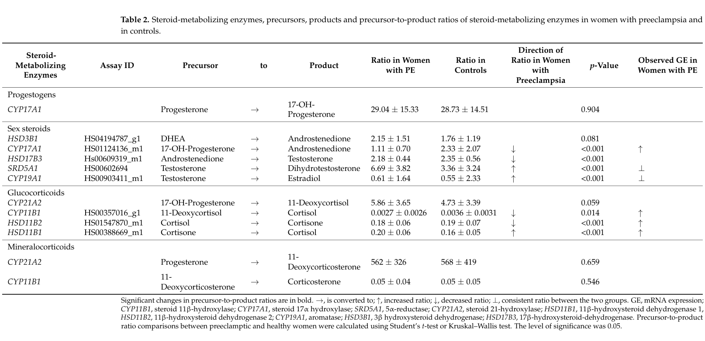

## Question

# Gene Research for Functional Annotation

## ⚠️ CRITICAL: Gene/Protein Identification Context

**BEFORE YOU BEGIN RESEARCH:** You MUST verify you are researching the CORRECT gene/protein. Gene symbols can be ambiguous, especially for less well-characterized genes from non-model organisms.

### Target Gene/Protein Identity (from UniProt):
- **UniProt Accession:** P50233
- **Protein Description:** RecName: Full=11-beta-hydroxysteroid dehydrogenase type 2; Short=11-DH2; Short=11-beta-HSD2; EC=1.1.1.- {ECO:0000269|PubMed:7649078}; AltName: Full=Corticosteroid 11-beta-dehydrogenase isozyme 2; AltName: Full=NAD-dependent 11-beta-hydroxysteroid dehydrogenase;
- **Gene Information:** Name=Hsd11b2; Synonyms=Hsd11k;
- **Organism (full):** Rattus norvegicus (Rat).
- **Protein Family:** Belongs to the short-chain dehydrogenases/reductases (SDR)
- **Key Domains:** NAD(P)-bd_dom_sf. (IPR036291); Sc_DH/Rdtase_CS. (IPR020904); SDR_fam. (IPR002347); adh_short (PF00106)

### MANDATORY VERIFICATION STEPS:

1. **Check if the gene symbol "Hsd11b2" matches the protein description above**
2. **Verify the organism is correct:** Rattus norvegicus (Rat).
3. **Check if protein family/domains align with what you find in literature**
4. **If you find literature for a DIFFERENT gene with the same or similar symbol, STOP**

### If Gene Symbol is Ambiguous or You Cannot Find Relevant Literature:

**DO NOT PROCEED WITH RESEARCH ON A DIFFERENT GENE.** Instead:
- State clearly: "The gene symbol 'Hsd11b2' is ambiguous or literature is limited for this specific protein"
- Explain what you found (e.g., "Found extensive literature on a different gene with the same symbol in a different organism")
- Describe the protein based ONLY on the UniProt information provided above
- Suggest that the protein function can be inferred from domain/family information

### Research Target:

Please provide a comprehensive research report on the gene **Hsd11b2** (gene ID: Hsd11b2, UniProt: P50233) in rat.

The research report should be a detailed narrative explaining the function, biological processes, and localization of the gene product. Citations should be given for all claims.

You should prioritize authoritative reviews and primary scientific literature when conducting research. You can supplement
this with annotations you find in gene/protein databases, but these can be outdated or inaccurate.

We are specifically interested in the primary function of the gene - for enzymes, what reaction is catalyzed, and what is the substrate specificity? For transporters, what is the substrate? For structural proteins or adapters, what is the broader structural role? For signaling molecules, what is the role in the pathway.

We are interested in where in or outside the cell the gene product carries out its function.

We are also interested in the signaling or biochemical pathways in which the gene functions. We are less interested in broad pleiotropic effects, except where these elucidate the precise role.

Include evidence where possible. We are interested in both experimental evidence as well as inference from structure, evolution, or bioinformatic analysis. Precise studies should be prioritized over high-throughput, where available.

## Output

Question: You are an expert researcher providing comprehensive, well-cited information.

Provide detailed information focusing on:
1. Key concepts and definitions with current understanding
2. Recent developments and latest research (prioritize 2023-2024 sources)
3. Current applications and real-world implementations
4. Expert opinions and analysis from authoritative sources
5. Relevant statistics and data from recent studies

Format as a comprehensive research report with proper citations. Include URLs and publication dates where available.
Always prioritize recent, authoritative sources and provide specific citations for all major claims.

# Gene Research for Functional Annotation

## ⚠️ CRITICAL: Gene/Protein Identification Context

**BEFORE YOU BEGIN RESEARCH:** You MUST verify you are researching the CORRECT gene/protein. Gene symbols can be ambiguous, especially for less well-characterized genes from non-model organisms.

### Target Gene/Protein Identity (from UniProt):
- **UniProt Accession:** P50233
- **Protein Description:** RecName: Full=11-beta-hydroxysteroid dehydrogenase type 2; Short=11-DH2; Short=11-beta-HSD2; EC=1.1.1.- {ECO:0000269|PubMed:7649078}; AltName: Full=Corticosteroid 11-beta-dehydrogenase isozyme 2; AltName: Full=NAD-dependent 11-beta-hydroxysteroid dehydrogenase;
- **Gene Information:** Name=Hsd11b2; Synonyms=Hsd11k;
- **Organism (full):** Rattus norvegicus (Rat).
- **Protein Family:** Belongs to the short-chain dehydrogenases/reductases (SDR)
- **Key Domains:** NAD(P)-bd_dom_sf. (IPR036291); Sc_DH/Rdtase_CS. (IPR020904); SDR_fam. (IPR002347); adh_short (PF00106)

### MANDATORY VERIFICATION STEPS:

1. **Check if the gene symbol "Hsd11b2" matches the protein description above**
2. **Verify the organism is correct:** Rattus norvegicus (Rat).
3. **Check if protein family/domains align with what you find in literature**
4. **If you find literature for a DIFFERENT gene with the same or similar symbol, STOP**

### If Gene Symbol is Ambiguous or You Cannot Find Relevant Literature:

**DO NOT PROCEED WITH RESEARCH ON A DIFFERENT GENE.** Instead:
- State clearly: "The gene symbol 'Hsd11b2' is ambiguous or literature is limited for this specific protein"
- Explain what you found (e.g., "Found extensive literature on a different gene with the same symbol in a different organism")
- Describe the protein based ONLY on the UniProt information provided above
- Suggest that the protein function can be inferred from domain/family information

### Research Target:

Please provide a comprehensive research report on the gene **Hsd11b2** (gene ID: Hsd11b2, UniProt: P50233) in rat.

The research report should be a detailed narrative explaining the function, biological processes, and localization of the gene product. Citations should be given for all claims.

You should prioritize authoritative reviews and primary scientific literature when conducting research. You can supplement
this with annotations you find in gene/protein databases, but these can be outdated or inaccurate.

We are specifically interested in the primary function of the gene - for enzymes, what reaction is catalyzed, and what is the substrate specificity? For transporters, what is the substrate? For structural proteins or adapters, what is the broader structural role? For signaling molecules, what is the role in the pathway.

We are interested in where in or outside the cell the gene product carries out its function.

We are also interested in the signaling or biochemical pathways in which the gene functions. We are less interested in broad pleiotropic effects, except where these elucidate the precise role.

Include evidence where possible. We are interested in both experimental evidence as well as inference from structure, evolution, or bioinformatic analysis. Precise studies should be prioritized over high-throughput, where available.

## Research Report: Rat **Hsd11b2** (UniProt **P50233**) — Functional Annotation of 11β-Hydroxysteroid Dehydrogenase Type 2 (11β-HSD2)

### Executive summary
The rat gene **Hsd11b2** encodes **11β-hydroxysteroid dehydrogenase type 2 (11β‑HSD2)**, an **NAD-dependent short-chain dehydrogenase/reductase (SDR)** enzyme that **inactivates glucocorticoids** by oxidizing **cortisol→cortisone** and **corticosterone→11‑dehydrocorticosterone**. Its primary physiological role is **pre-receptor control of mineralocorticoid receptor (MR) signaling**, most prominently in **aldosterone-sensitive epithelia (distal nephron)**, by preventing abundant glucocorticoids from occupying and activating the MR. In placenta/fetus, 11β‑HSD2 functions as a **barrier limiting fetal exposure to maternal glucocorticoids**. Recent (2023–2024) work emphasizes that **epigenetic and microRNA regulation of HSD11B2** is mechanistically linked to salt-sensitive hypertension and that **altered glucocorticoid metabolite ratios** are detectable in pregnancy complications such as preeclampsia. (seckl202411β‐hydroxysteroiddehydrogenaseand pages 2-2, seckl202411β‐hydroxysteroiddehydrogenaseand pages 1-2, takeda2024epigeneticregulationof pages 9-11)

### Identity verification and gene/protein disambiguation
The requested target identity (UniProt **P50233**, *Rattus norvegicus*, gene **Hsd11b2/Hsd11k**, protein “11‑beta‑hydroxysteroid dehydrogenase type 2”) aligns with authoritative literature definitions of **HSD11B2/11β‑HSD2** as the **glucocorticoid-inactivating (dehydrogenase) isoenzyme**, explicitly contrasted with **HSD11B1/11β‑HSD1** as the glucocorticoid-regenerating (reductase) isoenzyme. (seckl202411β‐hydroxysteroiddehydrogenaseand pages 1-2)

*Note on UniProt mapping:* the retrieved peer-reviewed papers did not explicitly list the UniProt accession **P50233**, so this report uses the user-provided UniProt identity and ensures all cited biology refers specifically to **HSD11B2/11β‑HSD2** (not HSD11B1). (seckl202411β‐hydroxysteroiddehydrogenaseand pages 1-2)

### 1) Key concepts and definitions (current understanding)

#### 1.1 Pre-receptor steroid metabolism (“glucocorticoid gatekeeping”)
11β‑HSD enzymes control local steroid action by interconverting active 11‑hydroxy glucocorticoids and inert 11‑keto forms. In this system, **11β‑HSD2 is the inactivating dehydrogenase**, while **11β‑HSD1 is predominantly the activating reductase** in metabolic tissues and many CNS regions. (seckl202411β‐hydroxysteroiddehydrogenaseand pages 3-3, seckl202411β‐hydroxysteroiddehydrogenaseand pages 1-2)

#### 1.2 Enzymatic function: reaction and cofactor
**Reaction:** 11β‑HSD2 catalyzes oxidation/inactivation of glucocorticoids: **cortisol→cortisone** and **corticosterone→11‑dehydrocorticosterone**. (seckl202411β‐hydroxysteroiddehydrogenaseand pages 1-2, seckl202411β‐hydroxysteroiddehydrogenaseand pages 3-3)

**Cofactor:** 11β‑HSD2 is described as **NAD-dependent/NAD+-dependent**, consistent with SDR-family dehydrogenase directionality in epithelia. (seckl202411β‐hydroxysteroiddehydrogenaseand pages 1-2, sagmeister2024evaluationof11βhydroxysteroid pages 52-57)

#### 1.3 Substrate specificity and physiological selectivity
A central concept is that the **MR is intrinsically non-selective**, and glucocorticoids are present in circulation at large excess over aldosterone; therefore, **11β‑HSD2 enables aldosterone-specific MR signaling** in target cells by locally removing active glucocorticoids. (seckl202411β‐hydroxysteroiddehydrogenaseand pages 2-2, seckl202411β‐hydroxysteroiddehydrogenaseand pages 1-2)

### 2) Biological function, pathways, and localization

#### 2.1 Mineralocorticoid receptor specificity in aldosterone-sensitive epithelia
**Mechanism:** In aldosterone-sensitive tissues (especially **distal nephron**), 11β‑HSD2 **rapidly inactivates cortisol** so it cannot occupy MR; aldosterone is not a substrate and can therefore signal through MR. This provides **aldosterone specificity despite ~100–1000× higher circulating glucocorticoid concentrations**. (seckl202411β‐hydroxysteroiddehydrogenaseand pages 1-2, seckl202411β‐hydroxysteroiddehydrogenaseand pages 2-2)

**Canonical tissues:** distal nephron/kidney, colon, salivary and sweat glands. (seckl202411β‐hydroxysteroiddehydrogenaseand pages 2-2, seckl202411β‐hydroxysteroiddehydrogenaseand pages 1-2)

#### 2.2 Placenta/fetal barrier function
11β‑HSD2 is highly expressed in **placenta and fetal tissues** where it **minimizes fetal exposure to maternal glucocorticoids**, helping maintain a low-glucocorticoid fetal environment. (seckl202411β‐hydroxysteroiddehydrogenaseand pages 2-2, cao2023expressionofkey pages 6-7)

Recent human placental data show **HSD11B2 protein localization mainly in fetal syncytiotrophoblast**, consistent with a fetal-side barrier. (trummer2024steroidprofilesand media 87cb528a)

#### 2.3 CNS localization and function (rodent-relevant)
In adult rodents, 11β‑HSD2 is **restricted to discrete hindbrain regions**, including the **nucleus tractus solitarius (NTS)** and **subcommissural organ (SCO)**, where it supports aldosterone-specific MR signaling to regulate **salt appetite** and potentially blood pressure. (seckl202411β‐hydroxysteroiddehydrogenaseand pages 4-5, seckl202411β‐hydroxysteroiddehydrogenaseand pages 5-5)

### 3) Recent developments and latest research (prioritizing 2023–2024)

#### 3.1 2024 expert synthesis: 11β‑HSD2 and aldosterone specificity
A 2024 authoritative review (Seckl, *Journal of Internal Medicine*, **Nov 2024**) synthesizes decades of work and reiterates 11β‑HSD2 as a potent glucocorticoid-inactivating dehydrogenase essential for **MR specificity in kidney epithelia**, and highlights its restricted CNS distribution and developmental barrier roles. URL: https://doi.org/10.1111/joim.13741 (seckl202411β‐hydroxysteroiddehydrogenaseand pages 1-2, seckl202411β‐hydroxysteroiddehydrogenaseand pages 2-2)

#### 3.2 2024 epigenetic/miRNA regulation linked to hypertension
A 2024 review on RAAS epigenetics (Takeda et al., *IJMS*, **Jul 2024**) highlights HSD11B2 as a key salt-sensitive hypertension gene under **DNA methylation** and **microRNA** control in renal and vascular tissues; it summarizes evidence that miRNAs (e.g., miR‑20a) can reduce 11β‑HSD2 activity and that dietary exposures can alter offspring Hsd11b2 expression/activity via miRNA pathways. URL: https://doi.org/10.3390/ijms25158099 (takeda2024epigeneticregulationof pages 9-11, takeda2024epigeneticregulationof pages 15-16)

#### 3.3 2024 pregnancy steroid profiling: metabolite ratios implicating 11β‑HSD2
A 2024 primary study (Trummer et al., *IJMS*, **Nov 2024**) measured 14 steroids longitudinally and inferred enzyme activities from precursor-to-product ratios, reporting that ratios consistent with **11β‑HSD2 activity were decreased** in preeclampsia (with broader steroid imbalance). The study also reports compartmentalized placental localization, with **HSD11B2 predominantly in syncytiotrophoblast**. URL: https://doi.org/10.3390/ijms252312704 (trummer2024steroidprofilesand pages 1-2, trummer2024steroidprofilesand media 87cb528a)

### 4) Current applications and real-world implementations

#### 4.1 Apparent mineralocorticoid excess (AME): diagnosis and treatment logic
Loss of 11β‑HSD2 function causes **AME**, in which suppressed aldosterone is accompanied by MR activation driven by glucocorticoids; a hallmark is **elevated urinary cortisol:cortisone metabolites** indicating deficient 11β‑dehydrogenase activity. (seckl202411β‐hydroxysteroiddehydrogenaseand pages 2-2)

A 2025 clinical case series (Ding et al., *Frontiers in Endocrinology*, **Jan 2025**) reports **three genetically confirmed pediatric AME cases** managed with **spironolactone plus potassium chloride**, which normalized blood pressure and potassium; the paper also emphasizes genetic testing as a practical diagnostic implementation for suspected AME. URL: https://doi.org/10.3389/fendo.2024.1491825 (ding2025casereportclinical pages 1-2)

#### 4.2 Drug/herbal inhibition: licorice/glycyrrhizin pseudoaldosteronism
A widely implemented real-world scenario is **11β‑HSD2 inhibition by licorice constituents**, producing an AME-like phenotype (“pseudoaldosteronism”); review evidence describes **potent inhibition with low-nanomolar Ki** for licorice-derived inhibitors. (seckl202411β‐hydroxysteroiddehydrogenaseand pages 2-2)

A 2024 pharmacovigilance analysis (Uneda et al., *PLOS ONE*, **Jan 2024**) used a national adverse event database (Japan) to identify pseudoaldosteronism associated with glycyrrhiza-containing Kampo formulas and quantified risk factors (see statistics below). URL: https://doi.org/10.1371/journal.pone.0296450 (uneda2024analysisofclinical pages 1-2)

### 5) Expert opinions and analysis (authoritative sources)

**Consensus mechanism (expert synthesis):** The central expert view is that 11β‑HSD2 is a “pre-receptor” determinant of steroid signaling specificity, and in kidney it is the mechanistic reason MR can function as an aldosterone receptor despite glucocorticoid excess. This conceptualization is explicitly emphasized in the 2024 Seckl review and used to interpret AME and licorice effects. (seckl202411β‐hydroxysteroiddehydrogenaseand pages 2-2, seckl202411β‐hydroxysteroiddehydrogenaseand pages 1-2)

**Emerging emphasis (2024):** Contemporary reviews increasingly frame HSD11B2 as a **regulatable node** (via methylation/miRNAs and environmental inputs) within salt-sensitive hypertension mechanisms, broadening its role from a “fixed barrier enzyme” to a dynamically regulated determinant of cardio-renal phenotype. (takeda2024epigeneticregulationof pages 9-11, takeda2024epigeneticregulationof pages 1-2)

### 6) Relevant statistics and quantitative data (recent studies)

#### 6.1 Real-world adverse event statistics (2024)
In the 2024 JADER database study (Apr 2004–Nov 2022):
- **6334** Kampo-related adverse events were reported; **2471** had complete clinical data; **210** involved pseudoaldosteronism. (uneda2024analysisofclinical pages 1-2)
- Strong associations were observed for specific formulas: **Shakuyaku-kanzoto ROR 18.3 [13.0–25.9]**, **Yokukansan ROR 8.1 [5.4–12.0]**, **Ryokeijutsukanto ROR 5.5 [1.4–21.9]**. (uneda2024analysisofclinical pages 1-2)
- Logistic regression risk factors included female sex (**OR 1.7 [1.2–2.6]**), age ≥70 (**OR 5.0 [3.2–7.8]**), low body weight <50 kg (**OR 2.2 [1.5–3.2]**), diuretics (**OR 2.1 [1.3–4.8]**), hypertension (**OR 1.6 [1.1–2.4]**), dementia (**OR 7.0 [4.2–11.6]**), higher glycyrrhiza dose (**OR 2.1 [1.9–2.3]**), and duration >14 days (**OR 2.8 [1.7–4.5]**). (uneda2024analysisofclinical pages 1-2)

#### 6.2 Quantitative context for steroid availability relevant to HSD11B2 function
A 2024 synthesis on glucocorticoid metabolism notes that ~**90%** of circulating cortisol is bound to corticosteroid-binding globulin and ~**5%** to albumin, leaving ~**5% free;** it further notes cortisone levels are ~**10-fold lower** than cortisol but have lower binding affinity, leading to comparable free levels—supporting the need for local enzymatic control in MR target tissues. (sagmeister2024evaluationof11βhydroxysteroid pages 52-57)

#### 6.3 Pregnancy steroid ratio signal (2024)
In Trummer et al. 2024, serum-based enzyme activity inference indicated **decreased precursor-to-product ratios consistent with reduced 11β‑HSD2 activity** in preeclampsia, alongside altered cortisol:cortisone handling across gestation. (trummer2024steroidprofilesand pages 1-2)

### Visual evidence (from 2024 primary research)
Trummer et al. 2024 provide a directly relevant table/figure showing (i) precursor-to-product ratios used to infer enzyme activities and (ii) placental immunohistochemical localization of HSD11B2 to syncytiotrophoblast. (trummer2024steroidprofilesand media 87cb528a, trummer2024steroidprofilesand media 4e1233dd, trummer2024steroidprofilesand media f8b6c41d)

### Functional-annotation summary table
| Annotation category | Concise statement | Key supporting citations |
|---|---|---|
| Enzyme identity | Rat **Hsd11b2** (UniProt **P50233**) corresponds to **11β-hydroxysteroid dehydrogenase type 2 (11β-HSD2)**, the oxidative/inactivating member of the 11β-HSD pair; literature consistently distinguishes it from reductive 11β-HSD1. | (seckl202411β‐hydroxysteroiddehydrogenaseand pages 1-2) |
| Enzyme reaction | 11β-HSD2 catalyzes **oxidation/inactivation of active glucocorticoids**: **cortisol → cortisone** and **corticosterone → 11-dehydrocorticosterone**. | (seckl202411β‐hydroxysteroiddehydrogenaseand pages 1-2, seckl202411β‐hydroxysteroiddehydrogenaseand pages 3-3) |
| Cofactor | 11β-HSD2 is described as an **NAD+-dependent / NAD-dependent dehydrogenase**, consistent with the SDR-family oxidative direction in epithelia. | (seckl202411β‐hydroxysteroiddehydrogenaseand pages 1-2, sagmeister2024evaluationof11βhydroxysteroid pages 52-57) |
| Substrates/products | Principal substrates are **cortisol** and **corticosterone**; products are the corresponding inactive 11-keto steroids **cortisone** and **11-dehydrocorticosterone**. | (seckl202411β‐hydroxysteroiddehydrogenaseand pages 1-2, seckl202411β‐hydroxysteroiddehydrogenaseand pages 3-3) |
| Primary pathway role | The core biological role is **pre-receptor glucocorticoid metabolism** that protects **mineralocorticoid receptor (MR)** signaling from glucocorticoid excess. By removing cortisol/corticosterone locally, the enzyme enables aldosterone-selective MR activation. | (seckl202411β‐hydroxysteroiddehydrogenaseand pages 2-2, seckl202411β‐hydroxysteroiddehydrogenaseand pages 1-2, seckl202411β‐hydroxysteroiddehydrogenaseand pages 5-5) |
| MR specificity mechanism | In MR target epithelia, glucocorticoids circulate at roughly **100–1000-fold** higher concentrations than aldosterone; 11β-HSD2 prevents these glucocorticoids from occupying MR, thereby conferring aldosterone specificity. | (seckl202411β‐hydroxysteroiddehydrogenaseand pages 1-2, seckl202411β‐hydroxysteroiddehydrogenaseand pages 2-2) |
| Tissue/cell localization | Canonical sites include **distal nephron/kidney**, **colon**, **salivary glands**, and **sweat glands**; these are classic aldosterone-sensitive epithelia. | (seckl202411β‐hydroxysteroiddehydrogenaseand pages 2-2, seckl202411β‐hydroxysteroiddehydrogenaseand pages 1-2, seckl202411β‐hydroxysteroiddehydrogenaseand pages 3-3) |
| Placental/fetal localization | 11β-HSD2 is highly expressed in **placenta/fetal tissues** and functions as a **barrier to maternal glucocorticoids**, limiting fetal cortisol exposure. In placenta, recent human data localize it mainly to **syncytiotrophoblast**. | (seckl202411β‐hydroxysteroiddehydrogenaseand pages 2-2, cao2023expressionofkey pages 6-7, cao2023expressionofkey pages 5-6, trummer2024steroidprofilesand media 87cb528a) |
| CNS localization/function | In adult rodents, CNS expression is restricted largely to hindbrain regions including the **nucleus of the solitary tract** and **subcommissural organ**, where 11β-HSD2 supports aldosterone-specific control of **salt appetite** and influences **blood pressure**. | (seckl202411β‐hydroxysteroiddehydrogenaseand pages 4-5, seckl202411β‐hydroxysteroiddehydrogenaseand pages 5-5) |
| Protein family/domain inference | Functional behavior matches the UniProt annotation placing rat Hsd11b2 in the **short-chain dehydrogenase/reductase (SDR)** family, with oxidative steroid dehydrogenase activity. | (seckl202411β‐hydroxysteroiddehydrogenaseand pages 1-2) |
| Regulation mechanisms | Recent reviews highlight **epigenetic regulation** of HSD11B2 by **DNA methylation** and **microRNAs** in renal/vascular tissues as an important mechanism in salt-sensitive hypertension. | (takeda2024epigeneticregulationof pages 9-11, takeda2024epigeneticregulationof pages 1-2) |
| Specific regulatory miRNAs | Reported regulators include **miR-20a** (reduced 11β-HSD2 activity when overexpressed) and **miR-27a-5p** in diet-programmed offspring models; these link environmental inputs to HSD11B2 suppression. | (takeda2024epigeneticregulationof pages 9-11, takeda2024epigeneticregulationof pages 15-16) |
| Dietary/environmental regulation | Maternal **high-fructose** exposure has been linked to reduced offspring renal Hsd11b2 via miRNA-mediated mechanisms; placental HSD11B2 can also be altered by nicotine, LPS, cadmium/GR signaling, and melatonin-responsive pathways. | (takeda2024epigeneticregulationof pages 15-16, cao2023expressionofkey pages 6-7) |
| Phenotypes/models | Loss of 11β-HSD2 function causes **apparent mineralocorticoid excess (AME)** with hypertension, hypokalemia, metabolic alkalosis, and elevated urinary cortisol:cortisone metabolite ratios; brain-selective loss increases salt appetite and can raise blood pressure. | (seckl202411β‐hydroxysteroiddehydrogenaseand pages 2-2, seckl202411β‐hydroxysteroiddehydrogenaseand pages 4-5) |
| Rat-relevant functional inference | Although much recent literature is cross-species, rat-relevant annotation is strongly supported because rodent hindbrain, kidney, and placental functions described in reviews align with classic Hsd11b2 biology and with the rat UniProt entry’s enzyme/family assignment. | (seckl202411β‐hydroxysteroiddehydrogenaseand pages 1-2, seckl202411β‐hydroxysteroiddehydrogenaseand pages 4-5, cao2023expressionofkey pages 5-6) |
| Pregnancy/preeclampsia relevance | In 2024 longitudinal steroid profiling, women with preeclampsia showed altered glucocorticoid handling consistent with disturbed **HSD11B2-associated metabolism**; the inferred **11β-HSD2 precursor-to-product ratio was decreased**, and HSD11B2 localized to syncytiotrophoblast. | (trummer2024steroidprofilesand pages 10-12, trummer2024steroidprofilesand pages 9-10, trummer2024steroidprofilesand pages 1-2, trummer2024steroidprofilesand media 87cb528a) |
| Clinical/real-world relevance: AME | 2025 case-series data show HSD11B2 deficiency remains clinically actionable: **3 Chinese children** with biallelic variants had low-renin hypertension, hypokalemia, nephrocalcinosis, and growth issues; diagnosis used sequencing and treatment with **spironolactone plus potassium** normalized BP and potassium. | (ding2025casereportclinical pages 6-7, ding2025casereportclinical pages 5-6, ding2025casereportclinical pages 1-2) |
| Clinical/real-world relevance: pseudoaldosteronism | Pharmacologic inhibition of 11β-HSD2 by **licorice/glycyrrhizin/glycyrrhetinic acid** causes pseudoaldosteronism/AME-like physiology; inhibitors are reported as potent, with **low-nanomolar Ki** in review-cited work. | (seckl202411β‐hydroxysteroiddehydrogenaseand pages 2-2, uneda2024analysisofclinical pages 1-2) |
| Real-world pharmacovigilance data | In a 2024 Japanese adverse-event analysis, **210 pseudoaldosteronism reports** were identified among **2471** complete Kampo AE reports; risk factors included female sex (**OR 1.7**), age ≥70 (**OR 5.0**), low body weight (**OR 2.2**), diuretic use (**OR 2.1**), hypertension (**OR 1.6**), dementia (**OR 7.0**), higher Glycyrrhiza dose (**OR 2.1**), and treatment duration >14 days (**OR 2.8**). | (uneda2024analysisofclinical pages 1-2) |
| Exposure-associated formulations | In the same 2024 database study, formulas with highest reporting odds for pseudoaldosteronism included **Shakuyaku-kanzoto ROR 18.3 [13.0–25.9]**, **Yokukansan ROR 8.1 [5.4–12.0]**, and **Ryokeijutsukanto ROR 5.5 [1.4–21.9]**. | (uneda2024analysisofclinical pages 1-2) |
| Quantitative data: steroid binding context | Review data note that ~**90%** of circulating cortisol is CBG-bound and ~**5%** albumin-bound, leaving ~**5% free**; cortisone concentrations are about **10-fold lower** than cortisol but have lower binding affinity, helping explain why local HSD11B2 activity is crucial for receptor selectivity. | (sagmeister2024evaluationof11βhydroxysteroid pages 52-57) |
| Quantitative data: AME rarity | Recent clinical review/case-series context indicates **fewer than 100 AME cases** have been reported worldwide, while **>40 pathogenic HSD11B2 variants** are known, many in exons 3–5. | (ding2025casereportclinical pages 5-6, ding2025casereportclinical pages 4-5) |

*Table: This table summarizes the core functional annotation of rat Hsd11b2/11β-HSD2, including its enzymatic role, localization, regulatory mechanisms, disease relevance, and recent quantitative findings. It integrates key recent review and application-focused sources to support narrative annotation with traceable citations.*

### References (key sources with dates and URLs)
- Seckl J. *11β‑Hydroxysteroid dehydrogenase and the brain: Not (yet) lost in translation.* **Journal of Internal Medicine**. **Nov 2024**. https://doi.org/10.1111/joim.13741 (seckl202411β‐hydroxysteroiddehydrogenaseand pages 1-2)
- Takeda Y, Demura M, Yoneda T, Takeda Y. *Epigenetic Regulation of the Renin–Angiotensin–Aldosterone System in Hypertension.* **International Journal of Molecular Sciences**. **Jul 2024**. https://doi.org/10.3390/ijms25158099 (takeda2024epigeneticregulationof pages 1-2)
- Trummer O et al. *Steroid Profiles and Precursor-to-Product Ratios Are Altered in Pregnant Women with Preeclampsia.* **International Journal of Molecular Sciences**. **Nov 2024**. https://doi.org/10.3390/ijms252312704 (trummer2024steroidprofilesand pages 1-2)
- Uneda K et al. *Analysis of clinical factors associated with Kampo formula-induced pseudoaldosteronism…* **PLOS ONE**. **Jan 2024**. https://doi.org/10.1371/journal.pone.0296450 (uneda2024analysisofclinical pages 1-2)
- Cao J et al. *Expression of Key Steroidogenic Enzymes in Human Placenta and Associated Adverse Pregnancy Outcomes.* **Maternal-Fetal Medicine**. **Sep 2023**. https://doi.org/10.1097/fm9.0000000000000167 (cao2023expressionofkey pages 6-7)
- Ding Y et al. *Case report: … HSD11B2 … apparent mineralocorticoid excess.* **Frontiers in Endocrinology**. **Jan 2025**. https://doi.org/10.3389/fendo.2024.1491825 (ding2025casereportclinical pages 1-2)

References

1. (seckl202411β‐hydroxysteroiddehydrogenaseand pages 2-2): Jonathan Seckl. 11β‐hydroxysteroid dehydrogenase and the brain: not (yet) lost in translation. Journal of Internal Medicine, 295:20-37, Nov 2024. URL: https://doi.org/10.1111/joim.13741, doi:10.1111/joim.13741. This article has 41 citations and is from a domain leading peer-reviewed journal.

2. (seckl202411β‐hydroxysteroiddehydrogenaseand pages 1-2): Jonathan Seckl. 11β‐hydroxysteroid dehydrogenase and the brain: not (yet) lost in translation. Journal of Internal Medicine, 295:20-37, Nov 2024. URL: https://doi.org/10.1111/joim.13741, doi:10.1111/joim.13741. This article has 41 citations and is from a domain leading peer-reviewed journal.

3. (takeda2024epigeneticregulationof pages 9-11): Yoshimichi Takeda, Masashi Demura, Takashi Yoneda, and Yoshiyu Takeda. Epigenetic regulation of the renin–angiotensin–aldosterone system in hypertension. International Journal of Molecular Sciences, 25:8099, Jul 2024. URL: https://doi.org/10.3390/ijms25158099, doi:10.3390/ijms25158099. This article has 26 citations.

4. (seckl202411β‐hydroxysteroiddehydrogenaseand pages 3-3): Jonathan Seckl. 11β‐hydroxysteroid dehydrogenase and the brain: not (yet) lost in translation. Journal of Internal Medicine, 295:20-37, Nov 2024. URL: https://doi.org/10.1111/joim.13741, doi:10.1111/joim.13741. This article has 41 citations and is from a domain leading peer-reviewed journal.

5. (sagmeister2024evaluationof11βhydroxysteroid pages 52-57): MS Sagmeister. Evaluation of 11β-hydroxysteroid dehydrogenase type 1 as a therapeutic target to treat sarcopenia in chronic kidney disease. Unknown journal, 2024.

6. (cao2023expressionofkey pages 6-7): Jiasong Cao, Y. Wang, Shuqi Wang, Yongmei Shen, Wen Li, Zhuo Wei, Shanshan Li, Qimei Lin, and Ying-Jie Chang. Expression of key steroidogenic enzymes in human placenta and associated adverse pregnancy outcomes. Maternal-Fetal Medicine, 5:163-172, Sep 2023. URL: https://doi.org/10.1097/fm9.0000000000000167, doi:10.1097/fm9.0000000000000167. This article has 8 citations.

7. (trummer2024steroidprofilesand media 87cb528a): Olivia Trummer, Christina Stern, Sharmaine Reintar, Karoline Mayer-Pickel, Mila Cervar-Zivkovic, Ulrich Dischinger, Max Kurlbaum, Berthold Huppertz, Herbert Fluhr, and Barbara Obermayer-Pietsch. Steroid profiles and precursor-to-product ratios are altered in pregnant women with preeclampsia. International Journal of Molecular Sciences, 25:12704, Nov 2024. URL: https://doi.org/10.3390/ijms252312704, doi:10.3390/ijms252312704. This article has 2 citations.

8. (seckl202411β‐hydroxysteroiddehydrogenaseand pages 4-5): Jonathan Seckl. 11β‐hydroxysteroid dehydrogenase and the brain: not (yet) lost in translation. Journal of Internal Medicine, 295:20-37, Nov 2024. URL: https://doi.org/10.1111/joim.13741, doi:10.1111/joim.13741. This article has 41 citations and is from a domain leading peer-reviewed journal.

9. (seckl202411β‐hydroxysteroiddehydrogenaseand pages 5-5): Jonathan Seckl. 11β‐hydroxysteroid dehydrogenase and the brain: not (yet) lost in translation. Journal of Internal Medicine, 295:20-37, Nov 2024. URL: https://doi.org/10.1111/joim.13741, doi:10.1111/joim.13741. This article has 41 citations and is from a domain leading peer-reviewed journal.

10. (takeda2024epigeneticregulationof pages 15-16): Yoshimichi Takeda, Masashi Demura, Takashi Yoneda, and Yoshiyu Takeda. Epigenetic regulation of the renin–angiotensin–aldosterone system in hypertension. International Journal of Molecular Sciences, 25:8099, Jul 2024. URL: https://doi.org/10.3390/ijms25158099, doi:10.3390/ijms25158099. This article has 26 citations.

11. (trummer2024steroidprofilesand pages 1-2): Olivia Trummer, Christina Stern, Sharmaine Reintar, Karoline Mayer-Pickel, Mila Cervar-Zivkovic, Ulrich Dischinger, Max Kurlbaum, Berthold Huppertz, Herbert Fluhr, and Barbara Obermayer-Pietsch. Steroid profiles and precursor-to-product ratios are altered in pregnant women with preeclampsia. International Journal of Molecular Sciences, 25:12704, Nov 2024. URL: https://doi.org/10.3390/ijms252312704, doi:10.3390/ijms252312704. This article has 2 citations.

12. (ding2025casereportclinical pages 1-2): Yuan Ding, Ming Cheng, Bingyan Cao, Min Liu, Xuyun Hu, and Di Wu. Case report: clinical characteristics and genetical analysis of hsd11b2 in three chinese children with apparent mineralocorticoid excess: a case series. Frontiers in Endocrinology, Jan 2025. URL: https://doi.org/10.3389/fendo.2024.1491825, doi:10.3389/fendo.2024.1491825. This article has 2 citations.

13. (uneda2024analysisofclinical pages 1-2): Kazushi Uneda, Yuki Kawai, Akira Kaneko, Takumi Kayo, Shuichiro Akiba, Tomoaki Ishigami, Hiromi Yoshida-Komiya, Masao Suzuki, and Tadamichi Mitsuma. Analysis of clinical factors associated with kampo formula-induced pseudoaldosteronism based on self-reported information from the japanese adverse drug event report database. PLOS ONE, 19:e0296450, Jan 2024. URL: https://doi.org/10.1371/journal.pone.0296450, doi:10.1371/journal.pone.0296450. This article has 9 citations and is from a peer-reviewed journal.

14. (takeda2024epigeneticregulationof pages 1-2): Yoshimichi Takeda, Masashi Demura, Takashi Yoneda, and Yoshiyu Takeda. Epigenetic regulation of the renin–angiotensin–aldosterone system in hypertension. International Journal of Molecular Sciences, 25:8099, Jul 2024. URL: https://doi.org/10.3390/ijms25158099, doi:10.3390/ijms25158099. This article has 26 citations.

15. (trummer2024steroidprofilesand media 4e1233dd): Olivia Trummer, Christina Stern, Sharmaine Reintar, Karoline Mayer-Pickel, Mila Cervar-Zivkovic, Ulrich Dischinger, Max Kurlbaum, Berthold Huppertz, Herbert Fluhr, and Barbara Obermayer-Pietsch. Steroid profiles and precursor-to-product ratios are altered in pregnant women with preeclampsia. International Journal of Molecular Sciences, 25:12704, Nov 2024. URL: https://doi.org/10.3390/ijms252312704, doi:10.3390/ijms252312704. This article has 2 citations.

16. (trummer2024steroidprofilesand media f8b6c41d): Olivia Trummer, Christina Stern, Sharmaine Reintar, Karoline Mayer-Pickel, Mila Cervar-Zivkovic, Ulrich Dischinger, Max Kurlbaum, Berthold Huppertz, Herbert Fluhr, and Barbara Obermayer-Pietsch. Steroid profiles and precursor-to-product ratios are altered in pregnant women with preeclampsia. International Journal of Molecular Sciences, 25:12704, Nov 2024. URL: https://doi.org/10.3390/ijms252312704, doi:10.3390/ijms252312704. This article has 2 citations.

17. (cao2023expressionofkey pages 5-6): Jiasong Cao, Y. Wang, Shuqi Wang, Yongmei Shen, Wen Li, Zhuo Wei, Shanshan Li, Qimei Lin, and Ying-Jie Chang. Expression of key steroidogenic enzymes in human placenta and associated adverse pregnancy outcomes. Maternal-Fetal Medicine, 5:163-172, Sep 2023. URL: https://doi.org/10.1097/fm9.0000000000000167, doi:10.1097/fm9.0000000000000167. This article has 8 citations.

18. (trummer2024steroidprofilesand pages 10-12): Olivia Trummer, Christina Stern, Sharmaine Reintar, Karoline Mayer-Pickel, Mila Cervar-Zivkovic, Ulrich Dischinger, Max Kurlbaum, Berthold Huppertz, Herbert Fluhr, and Barbara Obermayer-Pietsch. Steroid profiles and precursor-to-product ratios are altered in pregnant women with preeclampsia. International Journal of Molecular Sciences, 25:12704, Nov 2024. URL: https://doi.org/10.3390/ijms252312704, doi:10.3390/ijms252312704. This article has 2 citations.

19. (trummer2024steroidprofilesand pages 9-10): Olivia Trummer, Christina Stern, Sharmaine Reintar, Karoline Mayer-Pickel, Mila Cervar-Zivkovic, Ulrich Dischinger, Max Kurlbaum, Berthold Huppertz, Herbert Fluhr, and Barbara Obermayer-Pietsch. Steroid profiles and precursor-to-product ratios are altered in pregnant women with preeclampsia. International Journal of Molecular Sciences, 25:12704, Nov 2024. URL: https://doi.org/10.3390/ijms252312704, doi:10.3390/ijms252312704. This article has 2 citations.

20. (ding2025casereportclinical pages 6-7): Yuan Ding, Ming Cheng, Bingyan Cao, Min Liu, Xuyun Hu, and Di Wu. Case report: clinical characteristics and genetical analysis of hsd11b2 in three chinese children with apparent mineralocorticoid excess: a case series. Frontiers in Endocrinology, Jan 2025. URL: https://doi.org/10.3389/fendo.2024.1491825, doi:10.3389/fendo.2024.1491825. This article has 2 citations.

21. (ding2025casereportclinical pages 5-6): Yuan Ding, Ming Cheng, Bingyan Cao, Min Liu, Xuyun Hu, and Di Wu. Case report: clinical characteristics and genetical analysis of hsd11b2 in three chinese children with apparent mineralocorticoid excess: a case series. Frontiers in Endocrinology, Jan 2025. URL: https://doi.org/10.3389/fendo.2024.1491825, doi:10.3389/fendo.2024.1491825. This article has 2 citations.

22. (ding2025casereportclinical pages 4-5): Yuan Ding, Ming Cheng, Bingyan Cao, Min Liu, Xuyun Hu, and Di Wu. Case report: clinical characteristics and genetical analysis of hsd11b2 in three chinese children with apparent mineralocorticoid excess: a case series. Frontiers in Endocrinology, Jan 2025. URL: https://doi.org/10.3389/fendo.2024.1491825, doi:10.3389/fendo.2024.1491825. This article has 2 citations.

## Artifacts

- [Edison artifact artifact-00](Hsd11b2-deep-research-falcon_artifacts/artifact-00.md)

## Citations

1. ding2025casereportclinical pages 1-2
2. uneda2024analysisofclinical pages 1-2
3. trummer2024steroidprofilesand pages 1-2
4. takeda2024epigeneticregulationof pages 1-2
5. cao2023expressionofkey pages 6-7
6. takeda2024epigeneticregulationof pages 9-11
7. takeda2024epigeneticregulationof pages 15-16
8. cao2023expressionofkey pages 5-6
9. trummer2024steroidprofilesand pages 10-12
10. trummer2024steroidprofilesand pages 9-10
11. ding2025casereportclinical pages 6-7
12. ding2025casereportclinical pages 5-6
13. ding2025casereportclinical pages 4-5
14. 13.0–25.9
15. 5.4–12.0
16. 1.4–21.9
17. 1.2–2.6
18. 3.2–7.8
19. 1.5–3.2
20. 1.3–4.8
21. 1.1–2.4
22. 4.2–11.6
23. 1.9–2.3
24. 1.7–4.5
25. https://doi.org/10.1111/joim.13741
26. https://doi.org/10.3390/ijms25158099
27. https://doi.org/10.3390/ijms252312704
28. https://doi.org/10.3389/fendo.2024.1491825
29. https://doi.org/10.1371/journal.pone.0296450
30. https://doi.org/10.1097/fm9.0000000000000167
31. https://doi.org/10.1111/joim.13741,
32. https://doi.org/10.3390/ijms25158099,
33. https://doi.org/10.1097/fm9.0000000000000167,
34. https://doi.org/10.3390/ijms252312704,
35. https://doi.org/10.3389/fendo.2024.1491825,
36. https://doi.org/10.1371/journal.pone.0296450,