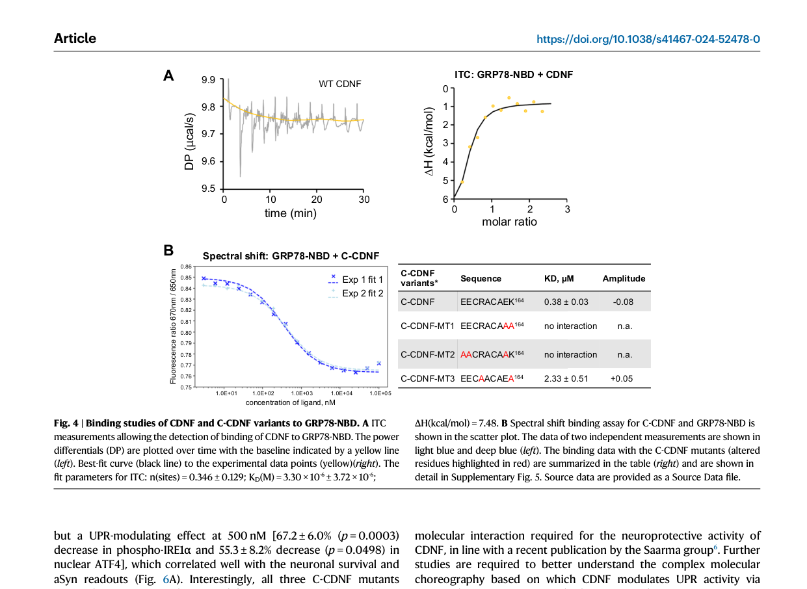

## Question

# Gene Research for Functional Annotation

## ⚠️ CRITICAL: Gene/Protein Identification Context

**BEFORE YOU BEGIN RESEARCH:** You MUST verify you are researching the CORRECT gene/protein. Gene symbols can be ambiguous, especially for less well-characterized genes from non-model organisms.

### Target Gene/Protein Identity (from UniProt):
- **UniProt Accession:** P06761
- **Protein Description:** RecName: Full=Endoplasmic reticulum chaperone BiP {ECO:0000250|UniProtKB:P11021}; EC=3.6.4.10 {ECO:0000250|UniProtKB:P11021}; AltName: Full=78 kDa glucose-regulated protein {ECO:0000250|UniProtKB:P11021}; Short=GRP-78 {ECO:0000250|UniProtKB:P11021}; AltName: Full=Binding-immunoglobulin protein {ECO:0000250|UniProtKB:P11021}; Short=BiP {ECO:0000250|UniProtKB:P11021}; AltName: Full=Heat shock protein 70 family protein 5 {ECO:0000250|UniProtKB:P11021}; Short=HSP70 family protein 5 {ECO:0000250|UniProtKB:P11021}; AltName: Full=Heat shock protein family A member 5 {ECO:0000250|UniProtKB:P11021}; AltName: Full=Immunoglobulin heavy chain-binding protein {ECO:0000250|UniProtKB:P11021}; AltName: Full=Steroidogenesis-activator polypeptide {ECO:0000303|PubMed:3563495}; Flags: Precursor;
- **Gene Information:** Name=Hspa5 {ECO:0000312|RGD:2843}; Synonyms=Grp78 {ECO:0000250|UniProtKB:P11021};
- **Organism (full):** Rattus norvegicus (Rat).
- **Protein Family:** Belongs to the heat shock protein 70 family. .
- **Key Domains:** ATPase_NBD. (IPR043129); BIP_NBD. (IPR042050); Heat_shock_70_CS. (IPR018181); HSP70_C_sf. (IPR029048); HSP70_peptide-bd_sf. (IPR029047)

### MANDATORY VERIFICATION STEPS:

1. **Check if the gene symbol "Hspa5" matches the protein description above**
2. **Verify the organism is correct:** Rattus norvegicus (Rat).
3. **Check if protein family/domains align with what you find in literature**
4. **If you find literature for a DIFFERENT gene with the same or similar symbol, STOP**

### If Gene Symbol is Ambiguous or You Cannot Find Relevant Literature:

**DO NOT PROCEED WITH RESEARCH ON A DIFFERENT GENE.** Instead:
- State clearly: "The gene symbol 'Hspa5' is ambiguous or literature is limited for this specific protein"
- Explain what you found (e.g., "Found extensive literature on a different gene with the same symbol in a different organism")
- Describe the protein based ONLY on the UniProt information provided above
- Suggest that the protein function can be inferred from domain/family information

### Research Target:

Please provide a comprehensive research report on the gene **Hspa5** (gene ID: Hspa5, UniProt: P06761) in rat.

The research report should be a detailed narrative explaining the function, biological processes, and localization of the gene product. Citations should be given for all claims.

You should prioritize authoritative reviews and primary scientific literature when conducting research. You can supplement
this with annotations you find in gene/protein databases, but these can be outdated or inaccurate.

We are specifically interested in the primary function of the gene - for enzymes, what reaction is catalyzed, and what is the substrate specificity? For transporters, what is the substrate? For structural proteins or adapters, what is the broader structural role? For signaling molecules, what is the role in the pathway.

We are interested in where in or outside the cell the gene product carries out its function.

We are also interested in the signaling or biochemical pathways in which the gene functions. We are less interested in broad pleiotropic effects, except where these elucidate the precise role.

Include evidence where possible. We are interested in both experimental evidence as well as inference from structure, evolution, or bioinformatic analysis. Precise studies should be prioritized over high-throughput, where available.

## Output

Question: You are an expert researcher providing comprehensive, well-cited information.

Provide detailed information focusing on:
1. Key concepts and definitions with current understanding
2. Recent developments and latest research (prioritize 2023-2024 sources)
3. Current applications and real-world implementations
4. Expert opinions and analysis from authoritative sources
5. Relevant statistics and data from recent studies

Format as a comprehensive research report with proper citations. Include URLs and publication dates where available.
Always prioritize recent, authoritative sources and provide specific citations for all major claims.

# Gene Research for Functional Annotation

## ⚠️ CRITICAL: Gene/Protein Identification Context

**BEFORE YOU BEGIN RESEARCH:** You MUST verify you are researching the CORRECT gene/protein. Gene symbols can be ambiguous, especially for less well-characterized genes from non-model organisms.

### Target Gene/Protein Identity (from UniProt):
- **UniProt Accession:** P06761
- **Protein Description:** RecName: Full=Endoplasmic reticulum chaperone BiP {ECO:0000250|UniProtKB:P11021}; EC=3.6.4.10 {ECO:0000250|UniProtKB:P11021}; AltName: Full=78 kDa glucose-regulated protein {ECO:0000250|UniProtKB:P11021}; Short=GRP-78 {ECO:0000250|UniProtKB:P11021}; AltName: Full=Binding-immunoglobulin protein {ECO:0000250|UniProtKB:P11021}; Short=BiP {ECO:0000250|UniProtKB:P11021}; AltName: Full=Heat shock protein 70 family protein 5 {ECO:0000250|UniProtKB:P11021}; Short=HSP70 family protein 5 {ECO:0000250|UniProtKB:P11021}; AltName: Full=Heat shock protein family A member 5 {ECO:0000250|UniProtKB:P11021}; AltName: Full=Immunoglobulin heavy chain-binding protein {ECO:0000250|UniProtKB:P11021}; AltName: Full=Steroidogenesis-activator polypeptide {ECO:0000303|PubMed:3563495}; Flags: Precursor;
- **Gene Information:** Name=Hspa5 {ECO:0000312|RGD:2843}; Synonyms=Grp78 {ECO:0000250|UniProtKB:P11021};
- **Organism (full):** Rattus norvegicus (Rat).
- **Protein Family:** Belongs to the heat shock protein 70 family. .
- **Key Domains:** ATPase_NBD. (IPR043129); BIP_NBD. (IPR042050); Heat_shock_70_CS. (IPR018181); HSP70_C_sf. (IPR029048); HSP70_peptide-bd_sf. (IPR029047)

### MANDATORY VERIFICATION STEPS:

1. **Check if the gene symbol "Hspa5" matches the protein description above**
2. **Verify the organism is correct:** Rattus norvegicus (Rat).
3. **Check if protein family/domains align with what you find in literature**
4. **If you find literature for a DIFFERENT gene with the same or similar symbol, STOP**

### If Gene Symbol is Ambiguous or You Cannot Find Relevant Literature:

**DO NOT PROCEED WITH RESEARCH ON A DIFFERENT GENE.** Instead:
- State clearly: "The gene symbol 'Hspa5' is ambiguous or literature is limited for this specific protein"
- Explain what you found (e.g., "Found extensive literature on a different gene with the same symbol in a different organism")
- Describe the protein based ONLY on the UniProt information provided above
- Suggest that the protein function can be inferred from domain/family information

### Research Target:

Please provide a comprehensive research report on the gene **Hspa5** (gene ID: Hspa5, UniProt: P06761) in rat.

The research report should be a detailed narrative explaining the function, biological processes, and localization of the gene product. Citations should be given for all claims.

You should prioritize authoritative reviews and primary scientific literature when conducting research. You can supplement
this with annotations you find in gene/protein databases, but these can be outdated or inaccurate.

We are specifically interested in the primary function of the gene - for enzymes, what reaction is catalyzed, and what is the substrate specificity? For transporters, what is the substrate? For structural proteins or adapters, what is the broader structural role? For signaling molecules, what is the role in the pathway.

We are interested in where in or outside the cell the gene product carries out its function.

We are also interested in the signaling or biochemical pathways in which the gene functions. We are less interested in broad pleiotropic effects, except where these elucidate the precise role.

Include evidence where possible. We are interested in both experimental evidence as well as inference from structure, evolution, or bioinformatic analysis. Precise studies should be prioritized over high-throughput, where available.

# Research Report: Rat **Hspa5** (UniProt **P06761**) — ER chaperone **BiP/GRP78** functional annotation

## 0) Target verification (critical)
The UniProt accession **P06761** corresponds to **Rattus norvegicus Hspa5**, encoding the ER chaperone **BiP/GRP78** (also referred to as **HSPA5** in human literature), a canonical **HSP70-family** ER-luminal chaperone that regulates the unfolded protein response (UPR). (wu2024endoplasmicreticulumstress pages 5-7, voronin2023chaperonedependentmechanismsas pages 2-3, peng2020epitopetaggingofthe pages 1-4)

Because Hspa5/BiP/GRP78 is highly conserved across mammals, much mechanistic evidence is derived from human and mouse systems but directly supports functional annotation for rat Hspa5; additionally, recent primary data include **rat primary neuron** experiments directly testing GRP78-dependent mechanisms. (graewert2024structuralbasisof pages 4-6, graewert2024structuralbasisof pages 6-6)

## 1) Key concepts and definitions (current understanding)

### 1.1 What is Hspa5/BiP/GRP78?
**BiP/GRP78 (Hspa5/HSPA5)** is the major **ER-resident HSP70-family chaperone** that binds nascent/unfolded proteins in the ER lumen, maintaining them in a folding-competent state and supporting folding, oligomerization, and post-translational maturation. (wu2024endoplasmicreticulumstress pages 5-7, voronin2023chaperonedependentmechanismsas pages 2-3)

### 1.2 Domain architecture and ATP-dependent chaperone mechanism
BiP is an **ATP-dependent** chaperone whose substrate binding and release are controlled by a **nucleotide/ATPase cycle**, with an N-terminal **nucleotide-binding (ATPase) domain** functionally coupled to a C-terminal **substrate-binding domain**. (voronin2023chaperonedependentmechanismsas pages 2-3, peng2020epitopetaggingofthe pages 1-4)

A recent synthesis of domain-level structure describes GRP78 as a ~654 aa protein with an N-terminal ATPase/NBD and a C-terminal substrate-binding region, and highlights regulation via an interdomain linker and oligomer–monomer transitions that can act as an activity reservoir in stress contexts. (hilan2024novelpeptidenanoparticles pages 11-14)

### 1.3 Subcellular localization: ER lumen retention and trafficking
BiP is primarily localized to the **ER lumen**, and ER retention depends on the **C-terminal KDEL** retrieval motif and KDEL receptor (KDELR)-mediated retrieval between ER and Golgi. (akinyemi2023unveilingthedark pages 1-2, amaresan2023cellsurfacegrp78 pages 1-2, peng2020epitopetaggingofthe pages 1-4)

In vivo tagging of murine BiP immediately upstream of the **essential KDEL** signal preserved BiP localization and function, underscoring that the KDEL motif is critical for ER localization (a conserved feature directly relevant to rat Hspa5). (peng2020epitopetaggingofthe pages 1-4)

### 1.4 BiP as a master regulator of the unfolded protein response (UPR)
The **UPR** is classically controlled by three ER stress sensors/transducers: **IRE1**, **PERK**, and **ATF6**. (wu2024endoplasmicreticulumstress pages 5-7, voronin2023chaperonedependentmechanismsas pages 2-3)

Under basal conditions, BiP binds the luminal domains of these sensors to keep them inactive; when unfolded/misfolded proteins accumulate, BiP is titrated away to bind client proteins, enabling activation of IRE1/PERK (via dimerization/autophosphorylation) and trafficking/activation of ATF6. (wu2024endoplasmicreticulumstress pages 5-7, voronin2023chaperonedependentmechanismsas pages 2-3, capolupo2024exploringendocannabinoidsystem pages 6-7)

A key in vivo interactome study provides direct evidence that BiP binds **IRE1α and PERK** under basal conditions and is released upon pharmacologic ER stress (tunicamycin), consistent with the canonical activation model. (peng2020epitopetaggingofthe pages 1-4)

### 1.5 BiP in ER proteostasis and ER-associated degradation (ERAD)
BiP-client binding is widely used as a **surrogate readout of ER misfolding/proteostasis disruption**, and misfolded client proteins can be routed to clearance pathways including proteasome-linked degradation and macroautophagy. (peng2020epitopetaggingofthe pages 1-4)

Recent review evidence also places BiP among ER chaperones that recognize/bind ERAD substrates, connecting BiP function to ER quality control beyond folding assistance. (capolupo2024exploringendocannabinoidsystem pages 6-7)

## 2) Recent developments (prioritizing 2023–2024)

### 2.1 2024: Structural and functional dissection of a GRP78-binding neuroprotective factor in a rat neuron model
A major 2024 advance is the structural/biophysical definition of a direct interaction between **GRP78 nucleotide-binding domain (NBD)** and the neurotrophic factor **CDNF** (and C-terminal CDNF-derived peptides), with functional validation in a **rat mesencephalic primary neuron** injury model. (graewert2024structuralbasisof pages 1-2, graewert2024structuralbasisof pages 6-6)

Quantitative binding measurements included:
- **ITC** for full-length CDNF binding GRP78-NBD: **KD ≈ 3.30×10⁻⁶ M (3.3 µM)**. (graewert2024structuralbasisof pages 6-6)
- Spectral shift assay for the CDNF C-terminal peptide (EECRACAEK164): **KD = 0.38 ± 0.03 µM**, while a binding-impaired mutant showed **KD = 2.33 ± 0.51 µM**; certain mutants abolished detectable binding. (graewert2024structuralbasisof pages 6-6)

Functionally (rat primary neuron MPP+ injury model), wild-type C-CDNF **increased dopamine neuron survival by 52.3%** and **reduced α-synuclein aggregation by 64.7%**, while GRP78-binding–deficient mutants lacked neuroprotective activity. (graewert2024structuralbasisof pages 4-6)

Mechanistically, GRP78-binding was required for modulation of UPR markers: wild-type C-CDNF reduced **IRE1α phosphorylation (~63%)**, **ATF4 (~58%)**, and **ATF6 (~92%)**, with loss of these effects in binding-deficient mutants. (graewert2024structuralbasisof pages 4-6)

These results support an emerging concept: **HSPA5/GRP78 is not only a folding chaperone but also a druggable hub for extracellular or peptide therapeutics that modulate ER stress signaling in neurons**, with direct translational implications. (graewert2024structuralbasisof pages 4-6, graewert2024structuralbasisof pages 6-6)

(graewert2024structuralbasisof media 2564bae2, graewert2024structuralbasisof media 633a5b6d)

### 2.2 2024: BiP/GRP78 as a broad pro-viral host factor and antiviral target
A 2024 PLOS Pathogens study reports that BiP/GRP78 (HSPA5) acts as a **pro-viral factor for diverse dsDNA viruses** and that genetic/pharmacologic inhibition of BiP can halt **KSHV** replication and limit spread of other dsDNA viruses (HSV-1, HCMV) and Vaccinia, with minimal toxicity to normal cells in their tested systems. (najarro2024bipgrp78isa pages 1-2)

This positions BiP as a candidate for **host-directed broad-spectrum antiviral strategies**, extending beyond its classic ER folding annotation. (najarro2024bipgrp78isa pages 1-2)

### 2.3 2023–2024: Cell-surface GRP78 (csGRP78) — trafficking, signaling, and druggability in cancer and infection
A 2023 systematic review emphasizes that GRP78 is normally ER luminal (KDEL-dependent) but can **translocate to the cell surface** under stress, where it engages diverse ligands and is associated with pro-survival/pro-growth signaling and malignant traits. (akinyemi2023unveilingthedark pages 1-2)

A focused 2023 review on **cell-surface GRP78** highlights multiple mechanisms proposed for surface localization (including escape from KDEL retention and Golgi passage, and interactions with accessory proteins), and frames csGRP78 as a key factor in **therapy resistance**, with preclinical evidence that monoclonal antibodies against csGRP78 can suppress PI3K/AKT-linked tumor phenotypes. (amaresan2023cellsurfacegrp78 pages 1-2)

A 2023 Frontiers in Immunology review further consolidates evidence that cell-surface HSPA5/GRP78 is targetable in cancer and discussed in the context of viral infection (including COVID-19 hypotheses), reflecting a rapid expansion of interest in non-canonical GRP78 localization. (li2023newprogresseson pages 7-8)

### 2.4 2023: Small-molecule targeting of GRP78 to amplify ER stress-based cancer therapy
A 2023 Heliyon primary study tested the GRP78 inhibitor **HA15** as a combination strategy with the proteasome inhibitor **bortezomib (BTZ)** in multiple myeloma models.

Key quantitative details reported:
- In vitro: **BTZ 4 nM** with **HA15 1 µM** enhanced cytotoxicity and apoptosis versus BTZ alone in NCI–H929 and U266 cells; HA15 at 1 µM alone had little/no cytotoxicity in these assays. (chen2023grp78inhibitorha15 pages 1-2, chen2023grp78inhibitorha15 pages 2-5)
- In vivo xenograft dosing: **BTZ 1 mg/kg twice weekly** and **HA15 0.5 mg/kg twice weekly**; the PERK inhibitor **GSK2606414** (50 mg/kg daily) reduced the combination’s anti-tumor effects, supporting dependence on UPR/ER stress signaling. (chen2023grp78inhibitorha15 pages 5-8)

Mechanistically, the combination increased ER stress/UPR markers (**GRP78, ATF4, CHOP, XBP1**) beyond BTZ alone. (chen2023grp78inhibitorha15 pages 5-8, chen2023grp78inhibitorha15 pages 1-2)

## 3) Current applications and real-world implementations

### 3.1 Experimental and translational neuroprotection via GRP78-targeting peptides
The 2024 CDNF–GRP78 work provides a concrete translational route: designing neuroprotective agents (including CDNF-derived peptides) that require **direct binding to GRP78-NBD** to achieve protective effects and UPR modulation in stressed neurons. (graewert2024structuralbasisof pages 4-6, graewert2024structuralbasisof pages 6-6)

### 3.2 Oncology: csGRP78 as a biomarker and therapeutic target for resistant tumors
Recent cancer-focused reviews converge on csGRP78 as a **druggable surface receptor** enriched under tumor stress states and linked to resistance to chemotherapy/radiotherapy/targeted therapy, motivating antibody-based and ligand-disruption strategies. (akinyemi2023unveilingthedark pages 1-2, amaresan2023cellsurfacegrp78 pages 1-2, li2023newprogresseson pages 7-8)

### 3.3 Host-directed antivirals by inhibiting BiP/GRP78
BiP inhibition was shown to block dsDNA virus replication/spread in 2024 work, suggesting an application as a host-directed antiviral target with potential breadth across viral families. (najarro2024bipgrp78isa pages 1-2)

### 3.4 Viral attachment factor (cell-surface GRP78) in infection biology
A 2023 study demonstrated that GRP78 can be present on the **cell surface** and directly bind a viral attachment protein (NDV HN), where masking surface GRP78 with polyclonal antibodies reduced viral attachment/replication readouts, supporting csGRP78 as a functional entry/attachment cofactor in at least some virus systems. (han2023directinteractionof pages 10-12, han2023directinteractionof pages 1-2)

## 4) Expert opinions and analysis (authoritative synthesis)

### 4.1 Functional “core” annotation is stable; “context-specific” annotation is expanding
Across recent reviews, BiP/GRP78 remains consistently defined as the ER-lumen HSP70 chaperone coupling ATP hydrolysis to client binding/release and acting as a negative regulator of IRE1/PERK/ATF6. (wu2024endoplasmicreticulumstress pages 5-7, voronin2023chaperonedependentmechanismsas pages 2-3)

The major shift in 2023–2024 literature is not a change in core mechanism, but an expansion in **context-specific roles**:
- **Non-canonical localization** (cell surface, secreted pools) and its implications for signaling, therapy resistance, and viral attachment. (akinyemi2023unveilingthedark pages 1-2, amaresan2023cellsurfacegrp78 pages 1-2)
- **Therapeutic targeting logic** where forcing ER stress (e.g., HA15 combinations) is used to kill tumors, while in other contexts (neuronal stress) GRP78 binding is leveraged to reduce maladaptive UPR outputs. (graewert2024structuralbasisof pages 4-6, chen2023grp78inhibitorha15 pages 5-8)

### 4.2 Rat-specific implications
The strongest rat-specific mechanistic evidence in the retrieved 2023–2024 set is the demonstration that GRP78 binding is required for CDNF-derived peptide neuroprotection in **rat primary mesencephalic neuron cultures**, tying Hspa5 function directly to measurable neuronal survival and UPR marker modulation. (graewert2024structuralbasisof pages 4-6, graewert2024structuralbasisof pages 6-6)

## 5) Relevant statistics and recent data highlights

### 5.1 Quantitative interaction and functional effects (2024)
- CDNF–GRP78-NBD binding (ITC): **KD ~ 3.3 µM**. (graewert2024structuralbasisof pages 6-6)
- CDNF C-terminal peptide–GRP78-NBD binding: **KD 0.38 ± 0.03 µM** (wild type) vs **2.33 ± 0.51 µM** (binding-impaired mutant). (graewert2024structuralbasisof pages 6-6)
- Rat primary neuron outcomes: **+52.3% TH+ neuron survival**, **−64.7% α-synuclein aggregation**, and reductions in UPR markers (**~63% p-IRE1α**, **~58% ATF4**, **~92% ATF6**) with wild-type peptide, but not with GRP78-binding–deficient mutants. (graewert2024structuralbasisof pages 4-6)

(graewert2024structuralbasisof media 2564bae2, graewert2024structuralbasisof media 633a5b6d)

### 5.2 Quantitative dosing/implementation in an ER-stress–based therapy strategy (2023)
- Myeloma combination strategy: **BTZ 4 nM + HA15 1 µM** in vitro; **BTZ 1 mg/kg twice weekly + HA15 0.5 mg/kg twice weekly** in vivo; PERK inhibitor **GSK2606414** attenuated combination efficacy, supporting a PERK-dependent ER stress mechanism. (chen2023grp78inhibitorha15 pages 5-8, chen2023grp78inhibitorha15 pages 1-2)

### 5.3 Viral attachment and inhibition (2023–2024)
- Viral attachment role: interaction domain mapping indicates viral-binding via the **N-terminal 1–326 aa** region of GRP78 for NDV HN, and antibody masking of surface GRP78 reduced viral attachment/replication readouts. (han2023directinteractionof pages 10-12, han2023directinteractionof pages 6-8)
- Broad antiviral targeting: BiP inhibition reduced replication/spread of multiple dsDNA viruses in 2024 study systems. (najarro2024bipgrp78isa pages 1-2)

## 6) Functional annotation summary (for database curation)

| Category | Key points | Key evidence (short) | Key citations (pqac IDs) |
|---|---|---|---|
| Identity | Rat **Hspa5** (UniProt **P06761**) corresponds to **BiP/GRP78**, the major **ER-resident HSP70-family chaperone**; evidence from mammalian BiP/GRP78 literature aligns with UniProt family/domain annotation. | Reviews and mechanistic studies consistently define HSPA5/BiP/GRP78 as the principal ER-lumen HSP70 chaperone and UPR regulator. | (wu2024endoplasmicreticulumstress pages 5-7, voronin2023chaperonedependentmechanismsas pages 2-3, peng2020epitopetaggingofthe pages 1-4) |
| Localization | Primary localization is the **ER lumen**; retention depends on the **C-terminal KDEL motif** and KDELR-mediated retrieval. | BiP-FLAG inserted upstream of the essential KDEL signal preserved ER localization/function; reviews describe KDEL-based ER retention and retrieval. | (peng2020epitopetaggingofthe pages 1-4, akinyemi2023unveilingthedark pages 1-2, amaresan2023cellsurfacegrp78 pages 1-2, hilan2024novelpeptidenanoparticles pages 14-19) |
| Molecular function | BiP is an **ATP-dependent molecular chaperone** with an **N-terminal nucleotide/ATPase-binding domain** and **C-terminal substrate-binding domain** that binds unfolded polypeptides, maintains folding competence, and prevents aggregation. | Review/mechanistic evidence describes peptide-dependent ATPase cycle; residue/domain-level summaries place ATPase/NBD in the N-terminus and substrate-binding activity in the C-terminus/interdomain linker-regulated cycle. | (voronin2023chaperonedependentmechanismsas pages 2-3, peng2020epitopetaggingofthe pages 1-4, hilan2024novelpeptidenanoparticles pages 11-14) |
| UPR regulation | BiP negatively regulates the three canonical UPR sensors **IRE1, PERK, and ATF6** under basal conditions; ER stress sequesters BiP onto misfolded proteins, allowing sensor activation. | Reviews describe dissociation from sensors during stress; in vivo AP-MS showed basal binding to IRE1α and PERK with release after tunicamycin. | (wu2024endoplasmicreticulumstress pages 5-7, voronin2023chaperonedependentmechanismsas pages 2-3, capolupo2024exploringendocannabinoidsystem pages 6-7, peng2020epitopetaggingofthe pages 1-4, hilan2024novelpeptidenanoparticles pages 14-19) |
| ERAD & proteostasis | BiP is central to **ER proteostasis**, recognizing unfolded/misfolded proteins and contributing to **ERAD-linked quality control** and broader degradation routing. | ER chaperones including BiP recognize ERAD substrates; BiP-client binding is a surrogate for ER misfolding, with misfolded proteins routed to proteasome/macroautophagy pathways. | (capolupo2024exploringendocannabinoidsystem pages 6-7, peng2020epitopetaggingofthe pages 1-4, hilan2024novelpeptidenanoparticles pages 14-19) |
| Non-canonical localization | Under stress, HSPA5/GRP78 can relocalize beyond the ER, including **cell surface**, and some reviews note presence in mitochondria/nucleus/secreted pools depending on context. | 2023 reviews summarize stress-induced relocalization and loss/saturation of ER retrieval control as one route to non-ER localization. | (akinyemi2023unveilingthedark pages 1-2, amaresan2023cellsurfacegrp78 pages 1-2, li2023newprogresseson pages 7-8, hilan2024novelpeptidenanoparticles pages 14-19) |
| Cell-surface roles | **Cell-surface GRP78 (csGRP78)** acts as a signaling/attachment factor linked to cancer survival/therapy resistance and can serve as a **viral attachment/pro-viral factor**. It is being explored as a therapeutic target. | csGRP78 promotes PI3K/AKT-associated tumor phenotypes; antibody targeting suppresses tumor traits in preclinical models. Viral studies show GRP78 supports NDV attachment and that BiP inhibition blocks replication/spread of multiple dsDNA viruses. | (amaresan2023cellsurfacegrp78 pages 1-2, najarro2024bipgrp78isa pages 1-2, han2023directinteractionof pages 10-12, han2023directinteractionof pages 8-10, han2023directinteractionof pages 1-2) |

*Table: This table summarizes the core functional annotation of rat Hspa5/BiP/GRP78 (UniProt P06761), including identity, localization, molecular role, UPR regulation, proteostasis functions, and non-canonical cell-surface activities. It uses only claims supported by gathered evidence IDs for direct traceability.*

## 7) Key sources (URLs and publication dates)
- Graewert et al. **Nature Communications** (Published **Sep 2024**): “Structural basis of CDNF interaction with the UPR regulator GRP78” https://doi.org/10.1038/s41467-024-52478-0 (graewert2024structuralbasisof pages 1-2, graewert2024structuralbasisof pages 6-6)
- Najarro et al. **PLOS Pathogens** (Published **Oct 2024**): “BiP/GRP78 is a pro-viral factor…” https://doi.org/10.1371/journal.ppat.1012660 (najarro2024bipgrp78isa pages 1-2)
- Chen et al. **Heliyon** (Published **Sep 2023**): “GRP78 inhibitor HA15 increases the effect of Bortezomib…” https://doi.org/10.1016/j.heliyon.2023.e19806 (chen2023grp78inhibitorha15 pages 5-8)
- Amaresan & Gopal **Cancer Cell International** (Published **May 2023**): “Cell surface GRP78…” https://doi.org/10.1186/s12935-023-02931-9 (amaresan2023cellsurfacegrp78 pages 1-2)
- Akinyemi et al. **Molecular Medicine** (Published **Aug 2023**): “Unveiling the dark side of GRP78…” https://doi.org/10.1186/s10020-023-00706-6 (akinyemi2023unveilingthedark pages 1-2)
- Li et al. **Frontiers in Immunology** (Published **May 2023**): “New progresses on cell surface protein HSPA5…” https://doi.org/10.3389/fimmu.2023.1166680 (li2023newprogresseson pages 7-8)
- Wu et al. **Cells** (Published **Oct 2024**): “Endoplasmic reticulum stress in bronchopulmonary dysplasia…” https://doi.org/10.3390/cells13211774 (wu2024endoplasmicreticulumstress pages 5-7)
- Voronin et al. **International Journal of Molecular Sciences** (Published **Jan 2023**): “Chaperone-dependent mechanisms as a pharmacological target…” https://doi.org/10.3390/ijms24010823 (voronin2023chaperonedependentmechanismsas pages 2-3)

References

1. (wu2024endoplasmicreticulumstress pages 5-7): Tzong-Jin Wu, Michelle Teng, Xigang Jing, Kirkwood A. Pritchard, Billy W. Day, Stephen Naylor, and Ru-Jeng Teng. Endoplasmic reticulum stress in bronchopulmonary dysplasia: contributor or consequence? Cells, 13:1774, Oct 2024. URL: https://doi.org/10.3390/cells13211774, doi:10.3390/cells13211774. This article has 8 citations.

2. (voronin2023chaperonedependentmechanismsas pages 2-3): M. Voronin, E. Abramova, Ekaterina R Verbovaya, Y. Vakhitova, and S. Seredenin. Chaperone-dependent mechanisms as a pharmacological target for neuroprotection. International Journal of Molecular Sciences, Jan 2023. URL: https://doi.org/10.3390/ijms24010823, doi:10.3390/ijms24010823. This article has 29 citations.

3. (peng2020epitopetaggingofthe pages 1-4): Yunqian Peng, Zhouji Chen, Insook Jang, Peter Arvan, and Randal J. Kaufman. Epitope-tagging of the endogenous murine bip/grp78/hspa5 locus allows direct analysis of the bip interactome and protein misfolding in vivo. bioRxiv, Jan 2020. URL: https://doi.org/10.1101/2020.01.01.892539, doi:10.1101/2020.01.01.892539. This article has 4 citations.

4. (graewert2024structuralbasisof pages 4-6): Melissa A. Graewert, Maria Volkova, Klara Jonasson, Juha A. E. Määttä, Tobias Gräwert, Samara Mamidi, Natalia Kulesskaya, Johan Evenäs, Richard E. Johnsson, Dmitri Svergun, Arnab Bhattacharjee, and Henri J. Huttunen. Structural basis of cdnf interaction with the upr regulator grp78. Nature Communications, Sep 2024. URL: https://doi.org/10.1038/s41467-024-52478-0, doi:10.1038/s41467-024-52478-0. This article has 15 citations and is from a highest quality peer-reviewed journal.

5. (graewert2024structuralbasisof pages 6-6): Melissa A. Graewert, Maria Volkova, Klara Jonasson, Juha A. E. Määttä, Tobias Gräwert, Samara Mamidi, Natalia Kulesskaya, Johan Evenäs, Richard E. Johnsson, Dmitri Svergun, Arnab Bhattacharjee, and Henri J. Huttunen. Structural basis of cdnf interaction with the upr regulator grp78. Nature Communications, Sep 2024. URL: https://doi.org/10.1038/s41467-024-52478-0, doi:10.1038/s41467-024-52478-0. This article has 15 citations and is from a highest quality peer-reviewed journal.

6. (hilan2024novelpeptidenanoparticles pages 11-14): George Hilan. Novel peptide nanoparticles designed for tumour cell entry via glucose regulated protein 78 dependent targeting. ArXiv, 2024. URL: https://doi.org/10.22215/etd/2024-16184, doi:10.22215/etd/2024-16184. This article has 0 citations.

7. (akinyemi2023unveilingthedark pages 1-2): Amos Olalekan Akinyemi, Kendall Elizabeth Simpson, Sunday Faith Oyelere, Maria Nur, Chrispus Mutuku Ngule, Bolaji Charles Dayo Owoyemi, Vivian Adiila Ayarick, Felix Femi Oyelami, Oluwafunminiyi Obaleye, Dave-Preston Esoe, Xiaoqi Liu, and Zhiguo Li. Unveiling the dark side of glucose-regulated protein 78 (grp78) in cancers and other human pathology: a systematic review. Molecular Medicine, Aug 2023. URL: https://doi.org/10.1186/s10020-023-00706-6, doi:10.1186/s10020-023-00706-6. This article has 83 citations and is from a peer-reviewed journal.

8. (amaresan2023cellsurfacegrp78 pages 1-2): Rajalakshmi Amaresan and Udhayakumar Gopal. Cell surface grp78: a potential mechanism of therapeutic resistant tumors. Cancer Cell International, May 2023. URL: https://doi.org/10.1186/s12935-023-02931-9, doi:10.1186/s12935-023-02931-9. This article has 48 citations and is from a peer-reviewed journal.

9. (capolupo2024exploringendocannabinoidsystem pages 6-7): Ilaria Capolupo, Maria Rosaria Miranda, Simona Musella, Veronica Di Sarno, Michele Manfra, Carmine Ostacolo, Alessia Bertamino, Pietro Campiglia, and Tania Ciaglia. Exploring endocannabinoid system: unveiling new roles in modulating er stress. Antioxidants, 13:1284, Oct 2024. URL: https://doi.org/10.3390/antiox13111284, doi:10.3390/antiox13111284. This article has 5 citations.

10. (graewert2024structuralbasisof pages 1-2): Melissa A. Graewert, Maria Volkova, Klara Jonasson, Juha A. E. Määttä, Tobias Gräwert, Samara Mamidi, Natalia Kulesskaya, Johan Evenäs, Richard E. Johnsson, Dmitri Svergun, Arnab Bhattacharjee, and Henri J. Huttunen. Structural basis of cdnf interaction with the upr regulator grp78. Nature Communications, Sep 2024. URL: https://doi.org/10.1038/s41467-024-52478-0, doi:10.1038/s41467-024-52478-0. This article has 15 citations and is from a highest quality peer-reviewed journal.

11. (graewert2024structuralbasisof media 2564bae2): Melissa A. Graewert, Maria Volkova, Klara Jonasson, Juha A. E. Määttä, Tobias Gräwert, Samara Mamidi, Natalia Kulesskaya, Johan Evenäs, Richard E. Johnsson, Dmitri Svergun, Arnab Bhattacharjee, and Henri J. Huttunen. Structural basis of cdnf interaction with the upr regulator grp78. Nature Communications, Sep 2024. URL: https://doi.org/10.1038/s41467-024-52478-0, doi:10.1038/s41467-024-52478-0. This article has 15 citations and is from a highest quality peer-reviewed journal.

12. (graewert2024structuralbasisof media 633a5b6d): Melissa A. Graewert, Maria Volkova, Klara Jonasson, Juha A. E. Määttä, Tobias Gräwert, Samara Mamidi, Natalia Kulesskaya, Johan Evenäs, Richard E. Johnsson, Dmitri Svergun, Arnab Bhattacharjee, and Henri J. Huttunen. Structural basis of cdnf interaction with the upr regulator grp78. Nature Communications, Sep 2024. URL: https://doi.org/10.1038/s41467-024-52478-0, doi:10.1038/s41467-024-52478-0. This article has 15 citations and is from a highest quality peer-reviewed journal.

13. (najarro2024bipgrp78isa pages 1-2): Guillermo Najarro, Kevin Brackett, Hunter Woosley, Leah C Dorman, Vincent Turon-Lagot, Sudip Khadka, Catya Faeldonea, Osvaldo Kevin Moreno, Adriana Ramirez Negron, Christina Love, Ryan Ward, C. Langelier, Frank McCarthy, Carlos Gonzalez, Joshua E. Elias, Brooke M Gardner, and Carolina Arias. Bip/grp78 is a pro-viral factor for diverse dsdna viruses that promotes the survival and proliferation of cells upon kshv infection. PLOS Pathogens, Oct 2024. URL: https://doi.org/10.1371/journal.ppat.1012660, doi:10.1371/journal.ppat.1012660. This article has 6 citations and is from a highest quality peer-reviewed journal.

14. (li2023newprogresseson pages 7-8): Ting Li, Jiewen Fu, Jingliang Cheng, Abdo A. Elfiky, Chunli Wei, and Junjiang Fu. New progresses on cell surface protein hspa5/bip/grp78 in cancers and covid-19. Frontiers in Immunology, May 2023. URL: https://doi.org/10.3389/fimmu.2023.1166680, doi:10.3389/fimmu.2023.1166680. This article has 55 citations and is from a peer-reviewed journal.

15. (chen2023grp78inhibitorha15 pages 1-2): Yirong Chen, Yuchen Tao, Kexin Hu, and Jiahui Lu. Grp78 inhibitor ha15 increases the effect of bortezomib on eradicating multiple myeloma cells through triggering endoplasmic reticulum stress. Heliyon, 9:e19806, Sep 2023. URL: https://doi.org/10.1016/j.heliyon.2023.e19806, doi:10.1016/j.heliyon.2023.e19806. This article has 11 citations.

16. (chen2023grp78inhibitorha15 pages 2-5): Yirong Chen, Yuchen Tao, Kexin Hu, and Jiahui Lu. Grp78 inhibitor ha15 increases the effect of bortezomib on eradicating multiple myeloma cells through triggering endoplasmic reticulum stress. Heliyon, 9:e19806, Sep 2023. URL: https://doi.org/10.1016/j.heliyon.2023.e19806, doi:10.1016/j.heliyon.2023.e19806. This article has 11 citations.

17. (chen2023grp78inhibitorha15 pages 5-8): Yirong Chen, Yuchen Tao, Kexin Hu, and Jiahui Lu. Grp78 inhibitor ha15 increases the effect of bortezomib on eradicating multiple myeloma cells through triggering endoplasmic reticulum stress. Heliyon, 9:e19806, Sep 2023. URL: https://doi.org/10.1016/j.heliyon.2023.e19806, doi:10.1016/j.heliyon.2023.e19806. This article has 11 citations.

18. (han2023directinteractionof pages 10-12): Chenxin Han, Ziwei Xie, Yadi Lv, Dingxiang Liu, and Ruiai Chen. Direct interaction of the molecular chaperone grp78/bip with the newcastle disease virus hemagglutinin-neuraminidase protein plays a vital role in viral attachment to and infection of culture cells. Frontiers in Immunology, Oct 2023. URL: https://doi.org/10.3389/fimmu.2023.1259237, doi:10.3389/fimmu.2023.1259237. This article has 8 citations and is from a peer-reviewed journal.

19. (han2023directinteractionof pages 1-2): Chenxin Han, Ziwei Xie, Yadi Lv, Dingxiang Liu, and Ruiai Chen. Direct interaction of the molecular chaperone grp78/bip with the newcastle disease virus hemagglutinin-neuraminidase protein plays a vital role in viral attachment to and infection of culture cells. Frontiers in Immunology, Oct 2023. URL: https://doi.org/10.3389/fimmu.2023.1259237, doi:10.3389/fimmu.2023.1259237. This article has 8 citations and is from a peer-reviewed journal.

20. (han2023directinteractionof pages 6-8): Chenxin Han, Ziwei Xie, Yadi Lv, Dingxiang Liu, and Ruiai Chen. Direct interaction of the molecular chaperone grp78/bip with the newcastle disease virus hemagglutinin-neuraminidase protein plays a vital role in viral attachment to and infection of culture cells. Frontiers in Immunology, Oct 2023. URL: https://doi.org/10.3389/fimmu.2023.1259237, doi:10.3389/fimmu.2023.1259237. This article has 8 citations and is from a peer-reviewed journal.

21. (hilan2024novelpeptidenanoparticles pages 14-19): George Hilan. Novel peptide nanoparticles designed for tumour cell entry via glucose regulated protein 78 dependent targeting. ArXiv, 2024. URL: https://doi.org/10.22215/etd/2024-16184, doi:10.22215/etd/2024-16184. This article has 0 citations.

22. (han2023directinteractionof pages 8-10): Chenxin Han, Ziwei Xie, Yadi Lv, Dingxiang Liu, and Ruiai Chen. Direct interaction of the molecular chaperone grp78/bip with the newcastle disease virus hemagglutinin-neuraminidase protein plays a vital role in viral attachment to and infection of culture cells. Frontiers in Immunology, Oct 2023. URL: https://doi.org/10.3389/fimmu.2023.1259237, doi:10.3389/fimmu.2023.1259237. This article has 8 citations and is from a peer-reviewed journal.

## Artifacts

- [Edison artifact artifact-00](Hspa5-deep-research-falcon_artifacts/artifact-00.md)

## Citations

1. hilan2024novelpeptidenanoparticles pages 11-14
2. peng2020epitopetaggingofthe pages 1-4
3. capolupo2024exploringendocannabinoidsystem pages 6-7
4. graewert2024structuralbasisof pages 6-6
5. graewert2024structuralbasisof pages 4-6
6. akinyemi2023unveilingthedark pages 1-2
7. li2023newprogresseson pages 7-8
8. wu2024endoplasmicreticulumstress pages 5-7
9. voronin2023chaperonedependentmechanismsas pages 2-3
10. graewert2024structuralbasisof pages 1-2
11. han2023directinteractionof pages 10-12
12. han2023directinteractionof pages 1-2
13. han2023directinteractionof pages 6-8
14. hilan2024novelpeptidenanoparticles pages 14-19
15. han2023directinteractionof pages 8-10
16. https://doi.org/10.1038/s41467-024-52478-0
17. https://doi.org/10.1371/journal.ppat.1012660
18. https://doi.org/10.1016/j.heliyon.2023.e19806
19. https://doi.org/10.1186/s12935-023-02931-9
20. https://doi.org/10.1186/s10020-023-00706-6
21. https://doi.org/10.3389/fimmu.2023.1166680
22. https://doi.org/10.3390/cells13211774
23. https://doi.org/10.3390/ijms24010823
24. https://doi.org/10.3390/cells13211774,
25. https://doi.org/10.3390/ijms24010823,
26. https://doi.org/10.1101/2020.01.01.892539,
27. https://doi.org/10.1038/s41467-024-52478-0,
28. https://doi.org/10.22215/etd/2024-16184,
29. https://doi.org/10.1186/s10020-023-00706-6,
30. https://doi.org/10.1186/s12935-023-02931-9,
31. https://doi.org/10.3390/antiox13111284,
32. https://doi.org/10.1371/journal.ppat.1012660,
33. https://doi.org/10.3389/fimmu.2023.1166680,
34. https://doi.org/10.1016/j.heliyon.2023.e19806,
35. https://doi.org/10.3389/fimmu.2023.1259237,