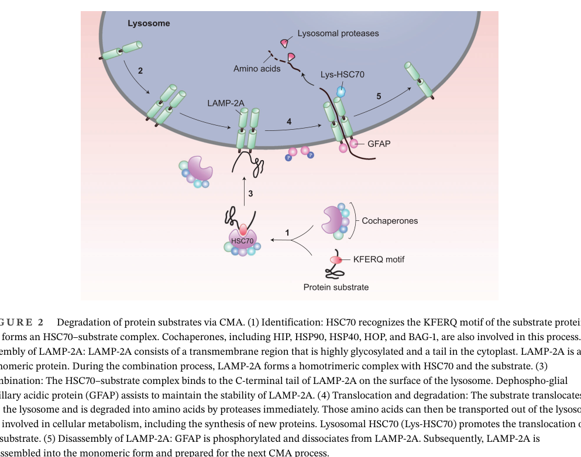

## Question

# Gene Research for Functional Annotation

## ⚠️ CRITICAL: Gene/Protein Identification Context

**BEFORE YOU BEGIN RESEARCH:** You MUST verify you are researching the CORRECT gene/protein. Gene symbols can be ambiguous, especially for less well-characterized genes from non-model organisms.

### Target Gene/Protein Identity (from UniProt):
- **UniProt Accession:** P63018
- **Protein Description:** RecName: Full=Heat shock cognate 71 kDa protein {ECO:0000305}; EC=3.6.4.10 {ECO:0000250|UniProtKB:P11142}; AltName: Full=Heat shock 70 kDa protein 8;
- **Gene Information:** Name=Hspa8 {ECO:0000312|RGD:621725}; Synonyms=Hsc70 {ECO:0000303|PubMed:10373374}, Hsc73 {ECO:0000303|PubMed:3595567};
- **Organism (full):** Rattus norvegicus (Rat).
- **Protein Family:** Belongs to the heat shock protein 70 family. .
- **Key Domains:** ATPase_NBD. (IPR043129); Heat_shock_70_CS. (IPR018181); HSP70_C_sf. (IPR029048); HSP70_peptide-bd_sf. (IPR029047); Hsp_70_fam. (IPR013126)

### MANDATORY VERIFICATION STEPS:

1. **Check if the gene symbol "Hspa8" matches the protein description above**
2. **Verify the organism is correct:** Rattus norvegicus (Rat).
3. **Check if protein family/domains align with what you find in literature**
4. **If you find literature for a DIFFERENT gene with the same or similar symbol, STOP**

### If Gene Symbol is Ambiguous or You Cannot Find Relevant Literature:

**DO NOT PROCEED WITH RESEARCH ON A DIFFERENT GENE.** Instead:
- State clearly: "The gene symbol 'Hspa8' is ambiguous or literature is limited for this specific protein"
- Explain what you found (e.g., "Found extensive literature on a different gene with the same symbol in a different organism")
- Describe the protein based ONLY on the UniProt information provided above
- Suggest that the protein function can be inferred from domain/family information

### Research Target:

Please provide a comprehensive research report on the gene **Hspa8** (gene ID: Hspa8, UniProt: P63018) in rat.

The research report should be a detailed narrative explaining the function, biological processes, and localization of the gene product. Citations should be given for all claims.

You should prioritize authoritative reviews and primary scientific literature when conducting research. You can supplement
this with annotations you find in gene/protein databases, but these can be outdated or inaccurate.

We are specifically interested in the primary function of the gene - for enzymes, what reaction is catalyzed, and what is the substrate specificity? For transporters, what is the substrate? For structural proteins or adapters, what is the broader structural role? For signaling molecules, what is the role in the pathway.

We are interested in where in or outside the cell the gene product carries out its function.

We are also interested in the signaling or biochemical pathways in which the gene functions. We are less interested in broad pleiotropic effects, except where these elucidate the precise role.

Include evidence where possible. We are interested in both experimental evidence as well as inference from structure, evolution, or bioinformatic analysis. Precise studies should be prioritized over high-throughput, where available.

## Output

Question: You are an expert researcher providing comprehensive, well-cited information.

Provide detailed information focusing on:
1. Key concepts and definitions with current understanding
2. Recent developments and latest research (prioritize 2023-2024 sources)
3. Current applications and real-world implementations
4. Expert opinions and analysis from authoritative sources
5. Relevant statistics and data from recent studies

Format as a comprehensive research report with proper citations. Include URLs and publication dates where available.
Always prioritize recent, authoritative sources and provide specific citations for all major claims.

# Gene Research for Functional Annotation

## ⚠️ CRITICAL: Gene/Protein Identification Context

**BEFORE YOU BEGIN RESEARCH:** You MUST verify you are researching the CORRECT gene/protein. Gene symbols can be ambiguous, especially for less well-characterized genes from non-model organisms.

### Target Gene/Protein Identity (from UniProt):
- **UniProt Accession:** P63018
- **Protein Description:** RecName: Full=Heat shock cognate 71 kDa protein {ECO:0000305}; EC=3.6.4.10 {ECO:0000250|UniProtKB:P11142}; AltName: Full=Heat shock 70 kDa protein 8;
- **Gene Information:** Name=Hspa8 {ECO:0000312|RGD:621725}; Synonyms=Hsc70 {ECO:0000303|PubMed:10373374}, Hsc73 {ECO:0000303|PubMed:3595567};
- **Organism (full):** Rattus norvegicus (Rat).
- **Protein Family:** Belongs to the heat shock protein 70 family. .
- **Key Domains:** ATPase_NBD. (IPR043129); Heat_shock_70_CS. (IPR018181); HSP70_C_sf. (IPR029048); HSP70_peptide-bd_sf. (IPR029047); Hsp_70_fam. (IPR013126)

### MANDATORY VERIFICATION STEPS:

1. **Check if the gene symbol "Hspa8" matches the protein description above**
2. **Verify the organism is correct:** Rattus norvegicus (Rat).
3. **Check if protein family/domains align with what you find in literature**
4. **If you find literature for a DIFFERENT gene with the same or similar symbol, STOP**

### If Gene Symbol is Ambiguous or You Cannot Find Relevant Literature:

**DO NOT PROCEED WITH RESEARCH ON A DIFFERENT GENE.** Instead:
- State clearly: "The gene symbol 'Hspa8' is ambiguous or literature is limited for this specific protein"
- Explain what you found (e.g., "Found extensive literature on a different gene with the same symbol in a different organism")
- Describe the protein based ONLY on the UniProt information provided above
- Suggest that the protein function can be inferred from domain/family information

### Research Target:

Please provide a comprehensive research report on the gene **Hspa8** (gene ID: Hspa8, UniProt: P63018) in rat.

The research report should be a detailed narrative explaining the function, biological processes, and localization of the gene product. Citations should be given for all claims.

You should prioritize authoritative reviews and primary scientific literature when conducting research. You can supplement
this with annotations you find in gene/protein databases, but these can be outdated or inaccurate.

We are specifically interested in the primary function of the gene - for enzymes, what reaction is catalyzed, and what is the substrate specificity? For transporters, what is the substrate? For structural proteins or adapters, what is the broader structural role? For signaling molecules, what is the role in the pathway.

We are interested in where in or outside the cell the gene product carries out its function.

We are also interested in the signaling or biochemical pathways in which the gene functions. We are less interested in broad pleiotropic effects, except where these elucidate the precise role.

Include evidence where possible. We are interested in both experimental evidence as well as inference from structure, evolution, or bioinformatic analysis. Precise studies should be prioritized over high-throughput, where available.

## Comprehensive Research Report: Rat **Hspa8** (Heat shock cognate 71 kDa protein; HSC70/HSC73)

### 1) Target verification (identity, organism, domains)
The UniProt accession **P63018** corresponds to **Rattus norvegicus Hspa8**, encoding the constitutively expressed HSP70-family chaperone commonly referred to as **HSC70/HSC73 (HSPA8)**. Recent literature consistently uses **HSPA8 ≡ HSC70/HSC73** and describes the canonical HSP70 architecture and ATP-dependent cycle, supporting that the retrieved sources refer to the same protein family/function as UniProt P63018. Structurally, HSC70/HSPA8 is described as having an **N‑terminal nucleotide-binding/ATPase domain** plus a **substrate-binding domain** with a **C‑terminal lid**, whose nucleotide state controls substrate affinity (ATP-bound low affinity/fast exchange; ADP-bound high affinity/slow exchange). (chen2024mechanismandcomplex pages 1-2, adoff2024dnajc13localizationto pages 9-11)

### 2) Key concepts and definitions (current understanding)

#### 2.1 Core molecular function: ATP-dependent chaperone (EC 3.6.4.10)
Hspa8/HSC70 is a **constitutive** HSP70-family **ATPase chaperone** that supports proteostasis by assisting **protein folding/refolding**, **unfolding**, and **disassembly of protein complexes**, and can triage clients toward degradation pathways. The ATP/ADP cycle is regulated by co-chaperones: **J-domain proteins (HSP40/DNAJ)** stimulate ATP hydrolysis through engagement of the nucleotide-binding domain, and nucleotide exchange factors reset the cycle by promoting ADP→ATP exchange. (chen2024mechanismandcomplex pages 1-2, adoff2024dnajc13localizationto pages 9-11)

#### 2.2 Substrate selection and specificity in selective autophagy: KFERQ-like motifs
A major substrate-selectivity concept relevant to Hspa8 is **recognition of KFERQ-like pentapeptide motifs** in client proteins targeted for **chaperone-mediated autophagy (CMA)**. This motif-based recognition is central to HSPA8’s role as a *cargo selector* for CMA. (yao2023chaperone‐mediatedautophagymolecular pages 3-5, yao2023chaperone‐mediatedautophagymolecular pages 1-3, endicott2024chaperonemediatedautophagyas pages 1-2)

#### 2.3 Chaperone-mediated autophagy (CMA): definition and steps
**CMA** is a **selective lysosomal protein degradation pathway** (distinct from macroautophagy and microautophagy) in which individual soluble cytosolic proteins are chosen by motif recognition and delivered to the lysosome for translocation and degradation. Current mechanistic understanding emphasizes:
- **Cytosolic HSC70/HSPA8 recognizes KFERQ-like motifs** and forms a substrate–chaperone complex.
- The complex binds **LAMP‑2A** at the lysosomal membrane; HSC70 helps **assemble the translocation complex**.
- **Lysosomal HSC70 (Lys‑HSC70)** facilitates **substrate translocation** into the lysosome lumen.
- Substrates are degraded by lysosomal proteases; the chaperone is released for further cycles.
These steps are summarized in contemporary CMA reviews and schematics. (yao2023chaperone‐mediatedautophagymolecular pages 3-5, yao2023chaperone‐mediatedautophagymolecular pages 1-3, yao2023chaperone‐mediatedautophagymolecular media 2b520f72)

#### 2.4 Clathrin-mediated endocytosis and clathrin-coated vesicle uncoating
A second primary, well-defined functional axis for Hspa8/HSC70 is **clathrin-coated vesicle (CCV) uncoating** in **clathrin-mediated endocytosis** (including synaptic vesicle recycling). Mechanistically, the **J-domain co-chaperone auxilin (DNAJC6)** recruits HSC70 to CCVs and **stimulates HSC70 ATPase activity** to disassemble clathrin coats, regulating the pool of free clathrin available for trafficking. (chiu2024downregulationofprotease pages 2-3, chiu2024downregulationofprotease pages 1-2)

### 3) Subcellular localization (where Hspa8 acts)
Across the 2023–2024 sources reviewed, Hspa8/HSC70 is functionally positioned in multiple compartments:
- **Cytosol**: the predominant pool performing general chaperoning and recognizing CMA substrates (KFERQ-like motifs). (yao2023chaperone‐mediatedautophagymolecular pages 3-5, yao2023chaperone‐mediatedautophagymolecular pages 1-3, endicott2024chaperonemediatedautophagyas pages 1-2)
- **Lysosomal membrane/lumen interface**: CMA requires delivery to **LAMP‑2A** and involves **lysosomal HSC70** to support substrate translocation. (yao2023chaperone‐mediatedautophagymolecular pages 3-5, yao2023chaperone‐mediatedautophagymolecular media 2b520f72)
- **Endocytic trafficking structures**: association with **clathrin-coated vesicles** and AP2-regulated endocytosis; recent work highlights regulation of CCV lifetime by HSC70 phosphorylation/calmodulin in cited 2024 literature. (chen2024mechanismandcomplex pages 7-8, chen2024mechanismandcomplex pages 8-8)
- **Cell surface/endocytosis entry sites in infection contexts**: in viral entry literature, HSC70/HSPA8 is discussed at the interface of attachment and internalization pathways. (chen2024mechanismandcomplex pages 7-8, chen2024mechanismandcomplex pages 8-8)

### 4) Pathways and biological processes most directly supported by 2023–2024 literature

#### 4.1 CMA in physiology and disease (metabolism, aging, immunity)
Recent reviews emphasize CMA as a vertebrate proteostasis pathway with broad physiological implications, including metabolism and immunity, with **HSPA8 as the cargo-recognizing chaperone** and **LAMP‑2A as the essential receptor/translocation component**. (yao2023chaperone‐mediatedautophagymolecular pages 1-3, endicott2024chaperonemediatedautophagyas pages 1-2)

**Expert synthesis / current debate (aging):** CMA decline with age has been a frequent model, but a 2023 primary study in genetically heterogeneous UM‑HET3 mice found **no evidence** for age-related changes in **LAMP2A levels, CMA substrate uptake, or whole liver levels of CMA targets**, while noting sex differences—highlighting that CMA aging trajectories may be **strain- and context-dependent**. The same paper contrasts prior findings in more restricted genetic backgrounds, including reduced CMA substrate uptake in **liver lysosomes from 22‑month-old male Fisher‑344 rats** reported in earlier work. (zhang2023lamp2aandother pages 1-2)

#### 4.2 Clathrin uncoating, neuronal maintenance, and lysosome/autophagy coupling
A 2024 mechanistic neuron-focused study (DNAJC6/auxilin knockdown model) provides a pathway-level view linking **auxilin–HSC70 uncoating dysfunction** to broader homeostatic defects: reduced free clathrin, impaired autophagic lysosome reformation/lysosome number, downregulation of lysosomal cathepsin D, impaired macroautophagy/CMA clearance of pathological α-synuclein species, and downstream stress responses leading to neuronal degeneration. While HSPA8 itself was not knocked down in this experiment, the work reinforces that HSC70’s clathrin-uncoating activity (through its J-domain partner) is causally tied to lysosome/autophagy competence in dopaminergic neurons. (chiu2024downregulationofprotease pages 2-3, chiu2024downregulationofprotease pages 1-2)

#### 4.3 Viral entry (host factor roles; therapeutic interest)
A 2024 review synthesizes evidence that HSC70/HSPA8 contributes to viral entry by participating in endocytic uptake/trafficking pathways (including clathrin-mediated routes) and that post-translational regulation of HSC70 (e.g., phosphorylation patterns) may modulate clathrin-coated vesicle dynamics in relevant trafficking contexts, pointing to HSC70 as a candidate host factor in infection biology. (chen2024mechanismandcomplex pages 7-8, chen2024mechanismandcomplex pages 8-8)

### 5) Recent developments (prioritizing 2023–2024)

#### 5.1 Mechanistic refinement of CMA and its regulation
A 2023 CMA review consolidates modern mechanistic steps (substrate recognition by HSC70, LAMP‑2A engagement, requirement for lysosomal HSC70 for translocation) and emphasizes the regulatory role of co-chaperones in tuning the HSC70 ATPase cycle during CMA. (yao2023chaperone‐mediatedautophagymolecular pages 3-5)
A 2024 aging-focused CMA review frames CMA as a modulator of aging and longevity, highlighting the centrality of **HSPA8** recognition of **KFERQ-like motifs** and discussing CMA’s intersection with lysosomal dynamics and age-related proteostasis collapse models. (endicott2024chaperonemediatedautophagyas pages 1-2)

#### 5.2 Clathrin-coated vesicle dynamics: regulatory concepts
Recent (cited) 2024 work discussed in a 2024 review connects **HSC70 phosphorylation patterns and calmodulin** to **AP2 clathrin-coated vesicle life span**, pointing toward a signaling-regulated “tunable” dimension of HSC70-mediated trafficking beyond the classical uncoating step. (chen2024mechanismandcomplex pages 7-8, chen2024mechanismandcomplex pages 8-8)

#### 5.3 Rat-relevant disease biology: post-translational regulation in Huntington’s disease
A 2024 rat brain proteomics study (Huntington’s model) quantified **site-specific ubiquitination changes** on HSPA8/HSC70 in **rat cortex and striatum**, identifying altered ubiquitinated lysines **K56, K507, K539**. A key quantitative result: ubiquitination at **K56 decreased ~16% in cortex and ~73% in striatum** in the mutant HTT condition (significant in striatum), with K507 and K539 also decreased in diseased striatum but only minimally changed in cortex. This supports a model in which Hspa8 function in disease may be modulated by **tissue-specific PTM remodeling**, particularly in the striatum, rather than solely by expression changes. (panda2024elucidationofsitespecific pages 5-7)

### 6) Current applications and real-world implementations

#### 6.1 Human genetic risk markers (translational genetics)
A 2023 pilot human genetics study evaluated **HSPA8 SNPs** as ischemic stroke risk markers in **2,139** individuals (888 cases, 1,251 controls). Reported associations included:
- **rs10892958 (G)**: higher ischemic stroke risk in smokers (**OR 1.37**, 95% CI 1.07–1.77, **p=0.01**) and in low fruit/vegetable intake (**OR 1.36**, 95% CI 1.14–1.63, Pbonf=0.002). (kobzeva2023associationbetweenhspa8 pages 1-2, kobzeva2023associationbetweenhspa8 pages 8-9)
- **rs1136141 (A)**: higher risk in smokers (**OR 1.68**, 95% CI 1.23–2.28, **p=7.0×10−4**) and low fruit/vegetable intake (**OR 1.29**, 95% CI 1.05–1.60, Pbonf=0.04). (kobzeva2023associationbetweenhspa8 pages 1-2, kobzeva2023associationbetweenhspa8 pages 8-9)
The same study reports functional annotation/eQTL evidence for rs10892958‑G associated with decreased HSPA8 expression in **Brain–Hippocampus** (beta −0.44; p=1.9×10−7; FDR 5.8×10−5), supporting a plausible gene-regulatory mechanism. (kobzeva2023associationbetweenhspa8 pages 8-9)

Although this is not rat-specific, it represents real-world movement toward using HSPA8-related variation as a clinical risk-modifier and illustrates why Hspa8 biology is actively studied in mammalian disease contexts. (kobzeva2023associationbetweenhspa8 pages 1-2, kobzeva2023associationbetweenhspa8 pages 8-9)

#### 6.2 Therapeutic targeting concepts (host-factor modulation)
A 2024 in silico study explored disrupting a SARS-CoV-2 spike–HSPA8 interaction and reported docking metrics for candidate compounds, including **NSC36398** with docking score **−7.934 kcal/mol** (binding free energy **−39.52 kcal/mol**) against spike and **−8.029 kcal/mol** (−38.61 kcal/mol) against the spike–HSPA8 complex. While purely computational, it exemplifies a therapeutic strategy in which HSPA8-related interactions are targeted to modulate disease processes. (navhaya2024insilicodiscovery pages 1-2)

### 7) Relevant statistics and data highlights (2023–2024)
- **Rat Huntington’s disease PTM remodeling:** HSPA8 ubiquitination at K56 decreased ~16% (cortex) and ~73% (striatum) in mutant HTT conditions; additional striatum-specific decreases at K507 and K539. (panda2024elucidationofsitespecific pages 5-7)
- **CMA aging heterogeneity:** UM‑HET3 mice showed no age-related decline in LAMP2A, CMA substrate uptake, or CMA target abundance; the same paper contrasts earlier reports of reduced CMA substrate uptake in **22‑month** male **Fisher‑344 rat** liver lysosomes. (zhang2023lamp2aandother pages 1-2)
- **Ischemic stroke genetics (human):** rs10892958‑G and rs1136141‑A show ORs ~1.29–1.68 depending on subgroup, with multiple significant p-values and Bonferroni-corrected results; rs10892958‑G linked to reduced HSPA8 expression in hippocampus (beta −0.44). (kobzeva2023associationbetweenhspa8 pages 1-2, kobzeva2023associationbetweenhspa8 pages 8-9)

### 8) Mechanism schematic (visual evidence)
The following figure schematizes the CMA pathway centered on HSC70/HSPA8 and LAMP‑2A, including recognition of KFERQ-like substrates, receptor engagement, translocation, and lysosomal degradation. (yao2023chaperone‐mediatedautophagymolecular media 2b520f72)

### 9) Evidence-grounded functional annotation summary (rat Hspa8)
Rat **Hspa8 (UniProt P63018)** encodes a ubiquitous HSP70-family **ATP-dependent chaperone** whose most directly supported mechanistic roles in recent literature are:
1. **ATPase-driven chaperone cycling** governing client binding/release and co-chaperone-regulated proteostasis decisions. (chen2024mechanismandcomplex pages 1-2, adoff2024dnajc13localizationto pages 9-11)
2. **CMA substrate selection and delivery** via KFERQ-like motif recognition and cooperation with **LAMP‑2A** and **lysosomal HSC70** to achieve translocation and lysosomal degradation. (yao2023chaperone‐mediatedautophagymolecular pages 3-5, yao2023chaperone‐mediatedautophagymolecular pages 1-3, yao2023chaperone‐mediatedautophagymolecular media 2b520f72)
3. **Clathrin-coated vesicle uncoating** through J-domain cochaperones (notably **auxilin/DNAJC6**) that stimulate HSC70 ATPase to disassemble clathrin coats; this trafficking role is coupled to lysosome/autophagy maintenance in neuronal systems. (chiu2024downregulationofprotease pages 2-3, chiu2024downregulationofprotease pages 1-2)

Direct rat-specific primary evidence in the retrieved 2023–2024 set is strongest for **post-translational regulation in rat brain (Huntington’s model)** via site-specific ubiquitination changes, and indirect rat-specific context appears in CMA aging assays performed historically in rat liver lysosomes (contrasted against newer genetically heterogeneous mouse findings). (zhang2023lamp2aandother pages 1-2, panda2024elucidationofsitespecific pages 5-7)

---

## Source list (URLs and publication dates as available in evidence)
- Yao R, Shen J. *Chaperone-mediated autophagy: Molecular mechanisms, biological functions, and diseases.* **MedComm**, Aug 2023. https://doi.org/10.1002/mco2.347 (yao2023chaperone‐mediatedautophagymolecular pages 3-5, yao2023chaperone‐mediatedautophagymolecular pages 1-3)
- Zhang KK et al. *LAMP2A, and other chaperone-mediated autophagy related proteins, do not decline with age in genetically heterogeneous UM-HET3 mice.* **Aging (Albany NY)**, Jun 2023. https://doi.org/10.18632/aging.204796 (zhang2023lamp2aandother pages 1-2)
- Endicott SJ. *Chaperone-mediated autophagy as a modulator of aging and longevity.* **Frontiers in Aging**, Dec 2024. https://doi.org/10.3389/fragi.2024.1509400 (endicott2024chaperonemediatedautophagyas pages 1-2)
- Chen Q et al. *Mechanism and complex roles of HSC70/HSPA8 in viral entry.* **Virus Research**, Sep 2024. https://doi.org/10.1016/j.virusres.2024.199433 (chen2024mechanismandcomplex pages 1-2, chen2024mechanismandcomplex pages 7-8)
- Chiu C-C et al. *Downregulation of Protease Cathepsin D and Upregulation of Pathologic α-Synuclein Mediate Paucity of DNAJC6-Induced Degeneration of Dopaminergic Neurons.* **Int J Mol Sci**, Jun 2024. https://doi.org/10.3390/ijms25126711 (chiu2024downregulationofprotease pages 2-3, chiu2024downregulationofprotease pages 1-2)
- Panda P et al. *Elucidation of site-specific ubiquitination on chaperones in response to mutant huntingtin.* **Cellular and Molecular Neurobiology**, Dec 2024. https://doi.org/10.1007/s10571-023-01446-1 (panda2024elucidationofsitespecific pages 5-7)
- Kobzeva KA et al. *Association between HSPA8 Gene Variants and Ischemic Stroke: A Pilot Study…* **Genes**, May 2023. https://doi.org/10.3390/genes14061171 (kobzeva2023associationbetweenhspa8 pages 1-2, kobzeva2023associationbetweenhspa8 pages 8-9)
- Navhaya LT et al. *In Silico Discovery and Evaluation of Inhibitors of the SARS-CoV-2 Spike Protein–HSPA8 Complex…* **Viruses**, Oct 2024. https://doi.org/10.3390/v16111726 (navhaya2024insilicodiscovery pages 1-2)
- Adoff H et al. *DNAJC13 localization to endosomes is opposed by its J domain…* **bioRxiv**, Dec 2024. https://doi.org/10.1101/2024.12.19.629517 (adoff2024dnajc13localizationto pages 9-11)

References

1. (chen2024mechanismandcomplex pages 1-2): Qiaoqiao Chen, Yiwen Chen, Chenxuan Bao, Huayuan Xiang, Qing Gao, and Lingxiang Mao. Mechanism and complex roles of hsc70/hspa8 in viral entry. Sep 2024. URL: https://doi.org/10.1016/j.virusres.2024.199433, doi:10.1016/j.virusres.2024.199433. This article has 8 citations and is from a peer-reviewed journal.

2. (adoff2024dnajc13localizationto pages 9-11): Hayden Adoff, Brandon Novy, Emily Holland, and Braden T Lobingier. Dnajc13 localization to endosomes is opposed by its j domain and its disordered c-terminal tail. bioRxiv, Dec 2024. URL: https://doi.org/10.1101/2024.12.19.629517, doi:10.1101/2024.12.19.629517. This article has 0 citations.

3. (yao2023chaperone‐mediatedautophagymolecular pages 3-5): Ruchen Yao and Jun Shen. Chaperone‐mediated autophagy: molecular mechanisms, biological functions, and diseases. MedComm, Aug 2023. URL: https://doi.org/10.1002/mco2.347, doi:10.1002/mco2.347. This article has 101 citations.

4. (yao2023chaperone‐mediatedautophagymolecular pages 1-3): Ruchen Yao and Jun Shen. Chaperone‐mediated autophagy: molecular mechanisms, biological functions, and diseases. MedComm, Aug 2023. URL: https://doi.org/10.1002/mco2.347, doi:10.1002/mco2.347. This article has 101 citations.

5. (endicott2024chaperonemediatedautophagyas pages 1-2): S. Joseph Endicott. Chaperone-mediated autophagy as a modulator of aging and longevity. Frontiers in Aging, Dec 2024. URL: https://doi.org/10.3389/fragi.2024.1509400, doi:10.3389/fragi.2024.1509400. This article has 10 citations.

6. (yao2023chaperone‐mediatedautophagymolecular media 2b520f72): Ruchen Yao and Jun Shen. Chaperone‐mediated autophagy: molecular mechanisms, biological functions, and diseases. MedComm, Aug 2023. URL: https://doi.org/10.1002/mco2.347, doi:10.1002/mco2.347. This article has 101 citations.

7. (chiu2024downregulationofprotease pages 2-3): Ching-Chi Chiu, Ying-ling Chen, Yi-Hsin Weng, Shu-Yu Liu, Hon-Lun Li, Tu-Hsueh Yeh, and Hung-Li Wang. Downregulation of protease cathepsin d and upregulation of pathologic α-synuclein mediate paucity of dnajc6-induced degeneration of dopaminergic neurons. International Journal of Molecular Sciences, 25:6711, Jun 2024. URL: https://doi.org/10.3390/ijms25126711, doi:10.3390/ijms25126711. This article has 10 citations.

8. (chiu2024downregulationofprotease pages 1-2): Ching-Chi Chiu, Ying-ling Chen, Yi-Hsin Weng, Shu-Yu Liu, Hon-Lun Li, Tu-Hsueh Yeh, and Hung-Li Wang. Downregulation of protease cathepsin d and upregulation of pathologic α-synuclein mediate paucity of dnajc6-induced degeneration of dopaminergic neurons. International Journal of Molecular Sciences, 25:6711, Jun 2024. URL: https://doi.org/10.3390/ijms25126711, doi:10.3390/ijms25126711. This article has 10 citations.

9. (chen2024mechanismandcomplex pages 7-8): Qiaoqiao Chen, Yiwen Chen, Chenxuan Bao, Huayuan Xiang, Qing Gao, and Lingxiang Mao. Mechanism and complex roles of hsc70/hspa8 in viral entry. Sep 2024. URL: https://doi.org/10.1016/j.virusres.2024.199433, doi:10.1016/j.virusres.2024.199433. This article has 8 citations and is from a peer-reviewed journal.

10. (chen2024mechanismandcomplex pages 8-8): Qiaoqiao Chen, Yiwen Chen, Chenxuan Bao, Huayuan Xiang, Qing Gao, and Lingxiang Mao. Mechanism and complex roles of hsc70/hspa8 in viral entry. Sep 2024. URL: https://doi.org/10.1016/j.virusres.2024.199433, doi:10.1016/j.virusres.2024.199433. This article has 8 citations and is from a peer-reviewed journal.

11. (zhang2023lamp2aandother pages 1-2): Katherine K. Zhang, Peichuan Zhang, Anagha Kodur, Ilkim Erturk, Calvin M. Burns, Cynthia Kenyon, Richard A. Miller, and S. Joseph Endicott. Lamp2a, and other chaperone-mediated autophagy related proteins, do not decline with age in genetically heterogeneous um-het3 mice. Aging (Albany NY), 15:4685-4698, Jun 2023. URL: https://doi.org/10.18632/aging.204796, doi:10.18632/aging.204796. This article has 8 citations.

12. (panda2024elucidationofsitespecific pages 5-7): Prajnadipta Panda, Vivek Sarohi, Trayambak Basak, and Prasad Kasturi. Elucidation of site-specific ubiquitination on chaperones in response to mutant huntingtin. Cellular and molecular neurobiology, 44 1:3, Dec 2024. URL: https://doi.org/10.1007/s10571-023-01446-1, doi:10.1007/s10571-023-01446-1. This article has 8 citations and is from a peer-reviewed journal.

13. (kobzeva2023associationbetweenhspa8 pages 1-2): Ksenia A. Kobzeva, Maria O. Soldatova, Tatiana A. Stetskaya, Vladislav O. Soldatov, Alexey V. Deykin, Maxim B. Freidin, Marina A. Bykanova, Mikhail I. Churnosov, Alexey V. Polonikov, and Olga Y. Bushueva. Association between hspa8 gene variants and ischemic stroke: a pilot study providing additional evidence for the role of heat shock proteins in disease pathogenesis. Genes, 14:1171, May 2023. URL: https://doi.org/10.3390/genes14061171, doi:10.3390/genes14061171. This article has 16 citations.

14. (kobzeva2023associationbetweenhspa8 pages 8-9): Ksenia A. Kobzeva, Maria O. Soldatova, Tatiana A. Stetskaya, Vladislav O. Soldatov, Alexey V. Deykin, Maxim B. Freidin, Marina A. Bykanova, Mikhail I. Churnosov, Alexey V. Polonikov, and Olga Y. Bushueva. Association between hspa8 gene variants and ischemic stroke: a pilot study providing additional evidence for the role of heat shock proteins in disease pathogenesis. Genes, 14:1171, May 2023. URL: https://doi.org/10.3390/genes14061171, doi:10.3390/genes14061171. This article has 16 citations.

15. (navhaya2024insilicodiscovery pages 1-2): Liberty T. Navhaya, Thabe M. Matsebatlela, Mokgerwa Z. Monama, and Xolani H. Makhoba. In silico discovery and evaluation of inhibitors of the sars-cov-2 spike protein–hspa8 complex towards developing covid-19 therapeutic drugs. Viruses, 16:1726, Oct 2024. URL: https://doi.org/10.3390/v16111726, doi:10.3390/v16111726. This article has 9 citations.

## Artifacts

- [Edison artifact artifact-00](Hspa8-deep-research-falcon_artifacts/artifact-00.md)

## Citations

1. endicott2024chaperonemediatedautophagyas pages 1-2
2. panda2024elucidationofsitespecific pages 5-7
3. navhaya2024insilicodiscovery pages 1-2
4. chen2024mechanismandcomplex pages 1-2
5. chiu2024downregulationofprotease pages 2-3
6. chiu2024downregulationofprotease pages 1-2
7. chen2024mechanismandcomplex pages 7-8
8. chen2024mechanismandcomplex pages 8-8
9. https://doi.org/10.1002/mco2.347
10. https://doi.org/10.18632/aging.204796
11. https://doi.org/10.3389/fragi.2024.1509400
12. https://doi.org/10.1016/j.virusres.2024.199433
13. https://doi.org/10.3390/ijms25126711
14. https://doi.org/10.1007/s10571-023-01446-1
15. https://doi.org/10.3390/genes14061171
16. https://doi.org/10.3390/v16111726
17. https://doi.org/10.1101/2024.12.19.629517
18. https://doi.org/10.1016/j.virusres.2024.199433,
19. https://doi.org/10.1101/2024.12.19.629517,
20. https://doi.org/10.1002/mco2.347,
21. https://doi.org/10.3389/fragi.2024.1509400,
22. https://doi.org/10.3390/ijms25126711,
23. https://doi.org/10.18632/aging.204796,
24. https://doi.org/10.1007/s10571-023-01446-1,
25. https://doi.org/10.3390/genes14061171,
26. https://doi.org/10.3390/v16111726,