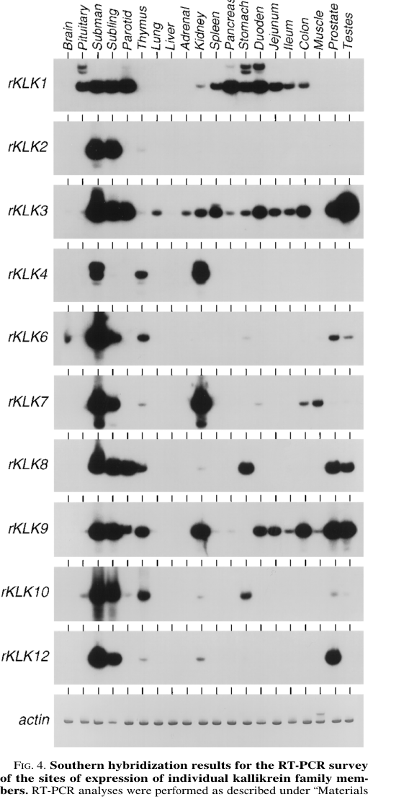

## Question

# Gene Research for Functional Annotation

## ⚠️ CRITICAL: Gene/Protein Identification Context

**BEFORE YOU BEGIN RESEARCH:** You MUST verify you are researching the CORRECT gene/protein. Gene symbols can be ambiguous, especially for less well-characterized genes from non-model organisms.

### Target Gene/Protein Identity (from UniProt):
- **UniProt Accession:** P07647
- **Protein Description:** RecName: Full=Submandibular glandular kallikrein-9; Short=rGK-9; EC=3.4.21.35; AltName: Full=KLK-S3; AltName: Full=S3 kallikrein; AltName: Full=Submandibular enzymatic vasoconstrictor; Short=SEV; AltName: Full=Tissue kallikrein; Contains: RecName: Full=Submandibular glandular kallikrein-9 light chain; Contains: RecName: Full=Submandibular glandular kallikrein-9 heavy chain; Flags: Precursor;
- **Gene Information:** Name=Klk9; Synonyms=Klk-9, Klks3;
- **Organism (full):** Rattus norvegicus (Rat).
- **Protein Family:** Belongs to the peptidase S1 family. Kallikrein subfamily.
- **Key Domains:** Peptidase_S1_PA. (IPR009003); Peptidase_S1_PA_chymotrypsin. (IPR043504); Peptidase_S1A. (IPR001314); Trypsin_dom. (IPR001254); TRYPSIN_HIS. (IPR018114)

### MANDATORY VERIFICATION STEPS:

1. **Check if the gene symbol "Klk9" matches the protein description above**
2. **Verify the organism is correct:** Rattus norvegicus (Rat).
3. **Check if protein family/domains align with what you find in literature**
4. **If you find literature for a DIFFERENT gene with the same or similar symbol, STOP**

### If Gene Symbol is Ambiguous or You Cannot Find Relevant Literature:

**DO NOT PROCEED WITH RESEARCH ON A DIFFERENT GENE.** Instead:
- State clearly: "The gene symbol 'Klk9' is ambiguous or literature is limited for this specific protein"
- Explain what you found (e.g., "Found extensive literature on a different gene with the same symbol in a different organism")
- Describe the protein based ONLY on the UniProt information provided above
- Suggest that the protein function can be inferred from domain/family information

### Research Target:

Please provide a comprehensive research report on the gene **Klk9** (gene ID: Klk9, UniProt: P07647) in rat.

The research report should be a detailed narrative explaining the function, biological processes, and localization of the gene product. Citations should be given for all claims.

You should prioritize authoritative reviews and primary scientific literature when conducting research. You can supplement
this with annotations you find in gene/protein databases, but these can be outdated or inaccurate.

We are specifically interested in the primary function of the gene - for enzymes, what reaction is catalyzed, and what is the substrate specificity? For transporters, what is the substrate? For structural proteins or adapters, what is the broader structural role? For signaling molecules, what is the role in the pathway.

We are interested in where in or outside the cell the gene product carries out its function.

We are also interested in the signaling or biochemical pathways in which the gene functions. We are less interested in broad pleiotropic effects, except where these elucidate the precise role.

Include evidence where possible. We are interested in both experimental evidence as well as inference from structure, evolution, or bioinformatic analysis. Precise studies should be prioritized over high-throughput, where available.

## Output

Question: You are an expert researcher providing comprehensive, well-cited information.

Provide detailed information focusing on:
1. Key concepts and definitions with current understanding
2. Recent developments and latest research (prioritize 2023-2024 sources)
3. Current applications and real-world implementations
4. Expert opinions and analysis from authoritative sources
5. Relevant statistics and data from recent studies

Format as a comprehensive research report with proper citations. Include URLs and publication dates where available.
Always prioritize recent, authoritative sources and provide specific citations for all major claims.

# Gene Research for Functional Annotation

## ⚠️ CRITICAL: Gene/Protein Identification Context

**BEFORE YOU BEGIN RESEARCH:** You MUST verify you are researching the CORRECT gene/protein. Gene symbols can be ambiguous, especially for less well-characterized genes from non-model organisms.

### Target Gene/Protein Identity (from UniProt):
- **UniProt Accession:** P07647
- **Protein Description:** RecName: Full=Submandibular glandular kallikrein-9; Short=rGK-9; EC=3.4.21.35; AltName: Full=KLK-S3; AltName: Full=S3 kallikrein; AltName: Full=Submandibular enzymatic vasoconstrictor; Short=SEV; AltName: Full=Tissue kallikrein; Contains: RecName: Full=Submandibular glandular kallikrein-9 light chain; Contains: RecName: Full=Submandibular glandular kallikrein-9 heavy chain; Flags: Precursor;
- **Gene Information:** Name=Klk9; Synonyms=Klk-9, Klks3;
- **Organism (full):** Rattus norvegicus (Rat).
- **Protein Family:** Belongs to the peptidase S1 family. Kallikrein subfamily.
- **Key Domains:** Peptidase_S1_PA. (IPR009003); Peptidase_S1_PA_chymotrypsin. (IPR043504); Peptidase_S1A. (IPR001314); Trypsin_dom. (IPR001254); TRYPSIN_HIS. (IPR018114)

### MANDATORY VERIFICATION STEPS:

1. **Check if the gene symbol "Klk9" matches the protein description above**
2. **Verify the organism is correct:** Rattus norvegicus (Rat).
3. **Check if protein family/domains align with what you find in literature**
4. **If you find literature for a DIFFERENT gene with the same or similar symbol, STOP**

### If Gene Symbol is Ambiguous or You Cannot Find Relevant Literature:

**DO NOT PROCEED WITH RESEARCH ON A DIFFERENT GENE.** Instead:
- State clearly: "The gene symbol 'Klk9' is ambiguous or literature is limited for this specific protein"
- Explain what you found (e.g., "Found extensive literature on a different gene with the same symbol in a different organism")
- Describe the protein based ONLY on the UniProt information provided above
- Suggest that the protein function can be inferred from domain/family information

### Research Target:

Please provide a comprehensive research report on the gene **Klk9** (gene ID: Klk9, UniProt: P07647) in rat.

The research report should be a detailed narrative explaining the function, biological processes, and localization of the gene product. Citations should be given for all claims.

You should prioritize authoritative reviews and primary scientific literature when conducting research. You can supplement
this with annotations you find in gene/protein databases, but these can be outdated or inaccurate.

We are specifically interested in the primary function of the gene - for enzymes, what reaction is catalyzed, and what is the substrate specificity? For transporters, what is the substrate? For structural proteins or adapters, what is the broader structural role? For signaling molecules, what is the role in the pathway.

We are interested in where in or outside the cell the gene product carries out its function.

We are also interested in the signaling or biochemical pathways in which the gene functions. We are less interested in broad pleiotropic effects, except where these elucidate the precise role.

Include evidence where possible. We are interested in both experimental evidence as well as inference from structure, evolution, or bioinformatic analysis. Precise studies should be prioritized over high-throughput, where available.

## Research report: Rat **Klk9** (UniProt **P07647**) — submandibular glandular kallikrein-9 (rKLK9/SEV/KLK-S3)

### 0) Scope and mandatory identity verification
The requested target is **rat (Rattus norvegicus) Klk9**, UniProt **P07647**, annotated as **submandibular glandular kallikrein-9** and historically referred to as **rKLK9** and **SEV (submandibular enzymatic vasoconstrictor)**. The available rat literature retrieved here explicitly equates **rKLK9 with SEV** and places it within the **rat tissue (glandular) kallikrein multigene family** of secreted serine proteases (EC **3.4.21.35**), matching the UniProt description and the peptidase S1 family context. (eldahr1993molecularaspectsof pages 2-3, macdonald1996disparatetissuespecificexpression pages 6-7)

A common ambiguity is confusion with **human KLK9** (a member of the human chromosome 19 KLK cluster). Human KLK9 literature is not directly transferable to rat Klk9 functional claims; it is used here only for limited conceptual context where explicitly labeled. (memari2008rolesofhuman pages 127-131)

### 1) Key concepts and definitions (current understanding)

#### 1.1 Tissue kallikreins and the kallikrein–kinin system (KKS)
Tissue (glandular) kallikreins are **serine proteases (EC 3.4.21.35)** and are core enzymatic components of the **kallikrein–kinin system (KKS)**, which comprises **kallikreins (plasma and tissue), kininogens, kininases, and bradykinin receptors**. In canonical KKS biology, tissue kallikreins cleave kininogens to liberate kinins that signal through bradykinin receptors, supporting paracrine/autocrine regulation of vascular tone and renal function. (eldahr1993molecularaspectsof pages 1-2, eldahr1993molecularaspectsof pages 5-5)

At the gene-family level in rat, tissue kallikreins are described as **acidic glycoproteins (~24–45 kDa)** encoded by similarly structured genes (commonly **5 exons/4 introns**) with substantial sequence homology but functionally meaningful **differences in substrate specificity** across family members. (eldahr1993molecularaspectsof pages 2-3, eldahr1993molecularaspectsof pages 1-2)

#### 1.2 Where rat Klk9/SEV fits in the kallikrein family
Rat **Klk9 (rKLK9/SEV)** is one member of a large rat kallikrein multigene family (reviewed as ~20 genes), and it is notable in the retrieved literature because it is repeatedly described as having **potent/direct vasoconstrictor activity**, contrasting with the vasodilatory/vasodepressor framing often emphasized for kinin-generating kallikreins in kidney physiology reviews. (eldahr1993molecularaspectsof pages 2-3, macdonald1996disparatetissuespecificexpression pages 6-7, clements1998currentperspectiveson pages 9-10)

### 2) Molecular function and enzymology

#### 2.1 Enzymatic class and reaction type
Rat Klk9/SEV is classified within tissue kallikreins as a **serine endopeptidase (EC 3.4.21.35)**. (eldahr1993molecularaspectsof pages 2-3, eldahr1993molecularaspectsof pages 1-2)

#### 2.2 Substrate specificity and physiological substrates — evidence status
Within the accessible full text retrieved in this run, **direct biochemical characterization of purified rat rKLK9/SEV (e.g., cleavage-site preference, defined physiological substrates, Km/kcat, inhibitor constants, or processing into light/heavy chains)** was **not available**. Multiple sources point to older primary biochemistry papers for kallikrein-family substrate specificity and for the kallikrein gene **S3** product (linked to SEV), but those primary papers were not obtainable here. (eldahr1993molecularaspectsof pages 5-6, clements1998currentperspectiveson pages 9-10)

Accordingly, any claim beyond “serine protease in the tissue kallikrein family (EC 3.4.21.35)” and “vasoconstrictor activity attributed to SEV” would be speculative based on this evidence set, and is not asserted as rat Klk9-specific fact in this report. (macdonald1996disparatetissuespecificexpression pages 6-7, clements1998currentperspectiveson pages 9-10)

### 3) Expression patterns and localization

#### 3.1 Tissue distribution (organ-level expression)
A key rat primary study surveying expression of **10 active kallikrein genes** across **20 major organs** using gene-specific RT-PCR/Southern hybridization found that:
* **rKLK9 (SEV) mRNA was detected in 16 organs**, with four organs showing only “barely detectable” levels. (macdonald1996disparatetissuespecificexpression pages 6-7)
* **Submandibular gland (SMG)** is the only organ expressing all 10 active kallikrein genes in that survey, underscoring SMG as a kallikrein-rich secretory tissue. (macdonald1996disparatetissuespecificexpression pages 1-2)

Figure-based summary evidence from that study defines expression scoring criteria:
* “+” indicates significant expression at **≥0.1 mRNA/cell** (assay sensitivity benchmark corresponding to **~1 mRNA/10 cells**); “±” indicates detectable but below that threshold; “−” indicates no detectable signal. (macdonald1996disparatetissuespecificexpression media 54f4156b, macdonald1996disparatetissuespecificexpression pages 4-5)

The same study notes that Northern hybridization had primarily detected rKLK9 in **SMG and prostate**, whereas RT-PCR revealed additional lower-level sites (including **kidney**). (macdonald1996disparatetissuespecificexpression pages 6-7)

#### 3.2 Kidney localization and relative abundance
A renal-development review reports that SEV (rKLK9) transcripts were localized to **nonglomerular kidney fractions** (in addition to SMG and prostate) and provides a relative abundance estimate: **SEV mRNA ~10-fold less abundant than PS mRNA** (PS = “true tissue kallikrein” in that review’s terminology). (eldahr1993molecularaspectsof pages 2-3)

#### 3.3 Quantitative expression ranges in the rat kallikrein family (context for Klk9)
Across the kallikrein family expression survey, the dynamic range of kallikrein-gene mRNA abundance among organs was reported as **>10^5-fold**, spanning from **slightly less than 1 mRNA molecule/10 cells** up to **>10,000 mRNA molecules/cell** (family-level values; not Klk9-specific absolute quantities). (macdonald1996disparatetissuespecificexpression pages 1-2)

### 4) Physiological roles and pathways

#### 4.1 Vasoconstrictor function (SEV)
Rat rKLK9 encodes SEV, described in a primary expression paper as having **direct vasoconstrictor activity** (attributed to earlier biochemical/physiology work). (macdonald1996disparatetissuespecificexpression pages 6-7)

A kallikrein gene-family review cites work describing “a novel serine protease with vasoconstrictor activity coded by the kallikrein gene S3,” supporting the linkage between the **S3 kallikrein** and a vasoconstrictor phenotype consistent with SEV nomenclature. (clements1998currentperspectiveson pages 9-10)

#### 4.2 Relationship to canonical KKS signaling
The retrieved kidney-focused review frames kallikreins primarily as **kinin-generating enzymes** in the KKS, with kinins acting via bradykinin receptors and influencing renal hemodynamics and natriuresis; however, it separately highlights SEV as a potent vasoconstrictor described from SMG/prostate and detectable in kidney RNA fractions, implying functional diversification within the rat kallikrein family. (eldahr1993molecularaspectsof pages 2-3, eldahr1993molecularaspectsof pages 1-2)

### 5) Recent developments (prioritizing 2023–2024)
Direct 2023–2024 **rat Klk9 (P07647)-focused** mechanistic literature was not recovered with accessible full text in this run. The most relevant 2024 development retrieved was broader kallikrein-related protease biology pointing to expanding roles of KLKs as extracellular regulators of inflammatory cytokines:

* In a 2024 **Communications Biology** study integrating transcriptomics/proteomics in Netherton syndrome patient samples and a Spink5 conditional knockout mouse model, the authors reported enrichment of extracellular/membrane proteins previously identified as **putative KLK substrates**, including a statement that **NUCB1** had been previously identified as a putative substrate of **KLK9** and **KLK14** (cited to prior work). They also performed in vitro digestion assays showing **KLK14 efficiently degrades recombinant full-length IL-36A**, and discussed possible proteolytic regulation of IL-36A by epidermal KLKs. While this is not rat Klk9-specific, it reflects current KLK research emphasizing KLK-mediated cytokine processing axes in inflammatory disease. (petrova2024comparativeanalysesof pages 15-16, petrova2024comparativeanalysesof pages 11-12)

### 6) Current applications and real-world implementations

#### 6.1 Functional annotation use: marker of kallikrein gene-family regulation and secretory tissue biology
In practice, rat kallikrein genes (including rKLK9/SEV) are commonly used as:
* **Readouts of tissue-specific gene regulation** (especially in SMG and prostate) due to their complex, hormone- and tissue-dependent expression patterns. The organ survey demonstrates that kallikrein genes can vary from detection in **3 to 18 organs** (depending on the family member), with rKLK9 detected broadly (16 organs). (macdonald1996disparatetissuespecificexpression pages 6-7, macdonald1996disparatetissuespecificexpression pages 4-5)

#### 6.2 Translational context: kallikreins as drug targets and pathway modulators
Although not rat Klk9-specific, modern KLK research is increasingly framed in terms of:
* Protease–substrate networks in inflammation, barrier function, and cytokine activation (e.g., KLK-mediated IL-36 processing). (petrova2024comparativeanalysesof pages 15-16, petrova2024comparativeanalysesof pages 11-12)

For rat Klk9/SEV, an applied interpretation supported by the retrieved evidence is that it represents a **secreted protease with vascular activity** whose expression across multiple organs makes it a candidate node for studying kallikrein-family diversification and vasoactive protease biology. (macdonald1996disparatetissuespecificexpression pages 6-7)

### 7) Expert opinion and authoritative analysis (from retrieved sources)

* **Gene-family diversification and functional specialization:** The JBC expression survey emphasizes that despite close linkage and high sequence conservation, kallikrein family members show “very different and complex patterns” of tissue expression, consistent with functional specialization rather than redundancy. This supports interpreting rKLK9/SEV as a distinct functional kallikrein rather than a generic kallikrein-like transcript. (macdonald1996disparatetissuespecificexpression pages 1-2)

* **Kidney developmental/physiology framing:** The pediatric nephrology review positions kallikreins within renal developmental physiology and KKS signaling, but highlights SEV as a potent vasoconstrictor and notes SEV mRNA in kidney fractions at lower abundance than canonical kallikrein transcripts, suggesting a specialized, potentially context-dependent role rather than being the dominant renal kallikrein. (eldahr1993molecularaspectsof pages 2-3)

### 8) Key statistics and data points (from recent and classic studies)

* **Organ distribution:** rKLK9/SEV detected in **16 of 20** rat organs (RT-PCR/Southern). (macdonald1996disparatetissuespecificexpression pages 6-7)
* **Assay threshold used for “significant” expression:** **≥0.1 mRNA/cell**, corresponding to **~1 mRNA/10 cells** detection capability. (macdonald1996disparatetissuespecificexpression media 54f4156b, macdonald1996disparatetissuespecificexpression pages 4-5)
* **Family-wide expression range:** >**10^5-fold** variation among organs; from **<1 mRNA/10 cells** to **>10,000 mRNA molecules/cell** (family-level range). (macdonald1996disparatetissuespecificexpression pages 1-2)
* **Relative renal abundance comparison (reviewed):** SEV mRNA **~10-fold less abundant** than PS mRNA (kidney context). (eldahr1993molecularaspectsof pages 2-3)

### 9) Evidence gaps and recommendations for completing functional annotation
The main missing elements for a high-confidence functional annotation of **rat Klk9 (P07647)** in this run are **direct enzymology and maturation/processing data**, including:
* experimentally defined **substrate specificity** (P1 preference, cleavage motif),
* **physiological substrate(s)** responsible for “direct vasoconstrictor activity,”
* kinetic parameters (Km/kcat), inhibitor sensitivities,
* biochemical evidence for **precursor processing** (signal peptide/propeptide activation; any light/heavy chain processing) beyond the UniProt description.

The retrieved reviews and expression studies explicitly point toward older primary biochemical papers for those specifics (e.g., the kallikrein gene S3/SEV characterization and submandibular kallikrein substrate specificity studies), but they were not accessible in full text here. (eldahr1993molecularaspectsof pages 5-6, clements1998currentperspectiveson pages 9-10)

### 10) Source list (URLs and publication dates)
* MacDonald RJ, Southard-Smith EM, Kroon E. **Disparate tissue-specific expression of members of the tissue kallikrein multigene family of the rat**. *J Biol Chem*. **1996-06**. https://doi.org/10.1074/jbc.271.23.13684 (macdonald1996disparatetissuespecificexpression pages 6-7, macdonald1996disparatetissuespecificexpression pages 1-2, macdonald1996disparatetissuespecificexpression pages 4-5, macdonald1996disparatetissuespecificexpression media 5a702b2f, macdonald1996disparatetissuespecificexpression media 54f4156b)
* El-Dahr SS, Dipp S. **Molecular aspects of kallikrein and kininogen in the maturing kidney**. *Pediatric Nephrology*. **1993-10**. https://doi.org/10.1007/BF00852573 (eldahr1993molecularaspectsof pages 2-3, eldahr1993molecularaspectsof pages 1-2)
* Clements JA. **Current perspectives on the molecular biology of the renal tissue kallikrein gene and the related tissue kallikrein gene family**. **1998** (venue not fully resolved in retrieved metadata). (clements1998currentperspectiveson pages 9-10)
* Petrova E, López-Gay JM, Fahrner M, et al. **Comparative analyses of Netherton syndrome patients and Spink5 conditional knock-out mice uncover disease-relevant pathways**. *Communications Biology*. **2024-02**. https://doi.org/10.1038/s42003-024-05780-y (petrova2024comparativeanalysesof pages 15-16, petrova2024comparativeanalysesof pages 11-12)
* Memari N. **Roles of human kallikrein-related peptidases 9 and 12 in cancer**. **2008** (used only to flag human KLK9 vs rat Klk9 ambiguity and as limited KLK context). (memari2008rolesofhuman pages 127-131)

| Claim/Topic | Key details | Evidence type (review/primary) | Source (authors, year, venue) | URL/DOI | Citation ID(s) |
|---|---|---|---|---|---|
| Kallikrein family definition and enzyme class | Rat Klk9/P07647 belongs to the tissue (glandular) kallikrein multigene family of serine proteases; family members are acidic glycoproteins (~24–45 kDa), typically encoded by similarly structured genes with 5 exons/4 introns and substantial sequence homology, but distinct substrate specificities. Tissue kallikreins are classified as EC 3.4.21.35. | Review | El-Dahr & Dipp, 1993, *Pediatric Nephrology* | https://doi.org/10.1007/BF00852573 | (eldahr1993molecularaspectsof pages 2-3, eldahr1993molecularaspectsof pages 1-2) |
| SEV identity and origin | rKLK9 corresponds to SEV (submandibular enzymatic vasoconstrictor), originally described in rat submandibular gland (SMG) and prostate; the cited literature characterizes it as a kallikrein-family serine protease with potent/direct vasoconstrictor activity. | Review summarizing primary studies; primary expression survey | El-Dahr & Dipp, 1993, *Pediatric Nephrology*; MacDonald et al., 1996, *J. Biol. Chem.* | https://doi.org/10.1007/BF00852573; https://doi.org/10.1074/jbc.271.23.13684 | (eldahr1993molecularaspectsof pages 2-3, macdonald1996disparatetissuespecificexpression pages 6-7) |
| SEV/Klk9 mRNA in kidney and abundance relative to PS | SEV transcripts were reported in nonglomerular kidney fractions as well as SMG/prostate; SEV mRNA was reported to be ~10-fold less abundant than PS (true tissue kallikrein) mRNA. The review also notes circulating tissue kallikrein sources in rat include SMG and arteries. | Review | El-Dahr & Dipp, 1993, *Pediatric Nephrology* | https://doi.org/10.1007/BF00852573 | (eldahr1993molecularaspectsof pages 2-3) |
| Broad tissue expression of rKLK9 | In a gene-specific RT-PCR/Southern survey across 20 major rat organs, rKLK9 mRNA was detected in 16 organs; four organs showed only barely detectable levels. Northern hybridization had previously identified expression mainly in submandibular gland and prostate, while RT-PCR revealed additional lower-level expression in parotid, kidney, duodenum, colon, and testes. | Primary | MacDonald et al., 1996, *J. Biol. Chem.* | https://doi.org/10.1074/jbc.271.23.13684 | (macdonald1996disparatetissuespecificexpression pages 6-7) |
| Figure 5 expression threshold and high vs low detection | Figure 5 summarized rKLK9 expression using a threshold where “+” denotes significant expression at >=0.1 mRNA/cell, “±” denotes detectable but lower expression, and “−” denotes undetectable signal. For rKLK9, significant expression was highlighted in submandibular gland and prostate, with lower-level detection across multiple additional organs, supporting broad but uneven tissue distribution. | Primary, figure-based | MacDonald et al., 1996, *J. Biol. Chem.* | https://doi.org/10.1074/jbc.271.23.13684 | (macdonald1996disparatetissuespecificexpression media 5a702b2f, macdonald1996disparatetissuespecificexpression media 54f4156b) |
| Functional pathway context | Family-level context indicates tissue kallikreins participate in the kallikrein–kinin system (KKS), generating kinins from kininogen and acting in vasoactive signaling; however, SEV/rKLK9 is notable because literature summarized here emphasizes vasoconstrictor activity rather than the canonical vasodilatory/kinin-liberating role usually associated with tissue kallikrein. | Review | El-Dahr & Dipp, 1993, *Pediatric Nephrology* | https://doi.org/10.1007/BF00852573 | (eldahr1993molecularaspectsof pages 2-3, eldahr1993molecularaspectsof pages 1-2, eldahr1993molecularaspectsof pages 5-5, eldahr1993molecularaspectsof pages 6-6) |
| Evidence gap: direct enzymology for rat Klk9 | In this session, no full-text primary paper was retrieved that directly reported purified rat rKLK9/SEV kinetic constants, cleavage-site preferences, physiological substrates, or detailed maturation/chain-processing data. Available sources repeatedly point to older primary papers (e.g., Yamaguchi et al. 1991; Berg et al. 1992; Moreau et al. 1992) for substrate specificity and biochemical characterization, but those data were not accessible here. | Evidence gap based on retrieved sources | El-Dahr & Dipp, 1993, *Pediatric Nephrology* and session retrieval record | https://doi.org/10.1007/BF00852573 | (eldahr1993molecularaspectsof pages 5-6, eldahr1993molecularaspectsof pages 6-6) |

*Table: This table compiles the rat Klk9/rKLK9/SEV evidence available in this session, including gene-family context, tissue distribution, vasoconstrictor function, and key evidence gaps. It is useful as a concise source map for functional annotation of UniProt P07647.*

References

1. (eldahr1993molecularaspectsof pages 2-3): Samir S. El-Dahr and Susana Dipp. Molecular aspects of kallikrein and kininogen in the maturing kidney. Pediatric Nephrology, 7:646-651, Oct 1993. URL: https://doi.org/10.1007/bf00852573, doi:10.1007/bf00852573. This article has 5 citations and is from a domain leading peer-reviewed journal.

2. (macdonald1996disparatetissuespecificexpression pages 6-7): Raymond J. MacDonald, E. Michelle Southard-Smith, and Evert Kroon. Disparate tissue-specific expression of members of the tissue kallikrein multigene family of the rat*. The Journal of Biological Chemistry, 271:13684-13690, Jun 1996. URL: https://doi.org/10.1074/jbc.271.23.13684, doi:10.1074/jbc.271.23.13684. This article has 50 citations.

3. (memari2008rolesofhuman pages 127-131): N Memari. Roles of human kallikrein-related peptidases 9 and 12 in cancer. Unknown journal, 2008.

4. (eldahr1993molecularaspectsof pages 1-2): Samir S. El-Dahr and Susana Dipp. Molecular aspects of kallikrein and kininogen in the maturing kidney. Pediatric Nephrology, 7:646-651, Oct 1993. URL: https://doi.org/10.1007/bf00852573, doi:10.1007/bf00852573. This article has 5 citations and is from a domain leading peer-reviewed journal.

5. (eldahr1993molecularaspectsof pages 5-5): Samir S. El-Dahr and Susana Dipp. Molecular aspects of kallikrein and kininogen in the maturing kidney. Pediatric Nephrology, 7:646-651, Oct 1993. URL: https://doi.org/10.1007/bf00852573, doi:10.1007/bf00852573. This article has 5 citations and is from a domain leading peer-reviewed journal.

6. (clements1998currentperspectiveson pages 9-10): JA Clements. Current perspectives on the molecular biology of the renal tissue kallikrein gene and the related tissue kallikrein gene family. Unknown journal, 1998.

7. (eldahr1993molecularaspectsof pages 5-6): Samir S. El-Dahr and Susana Dipp. Molecular aspects of kallikrein and kininogen in the maturing kidney. Pediatric Nephrology, 7:646-651, Oct 1993. URL: https://doi.org/10.1007/bf00852573, doi:10.1007/bf00852573. This article has 5 citations and is from a domain leading peer-reviewed journal.

8. (macdonald1996disparatetissuespecificexpression pages 1-2): Raymond J. MacDonald, E. Michelle Southard-Smith, and Evert Kroon. Disparate tissue-specific expression of members of the tissue kallikrein multigene family of the rat*. The Journal of Biological Chemistry, 271:13684-13690, Jun 1996. URL: https://doi.org/10.1074/jbc.271.23.13684, doi:10.1074/jbc.271.23.13684. This article has 50 citations.

9. (macdonald1996disparatetissuespecificexpression media 54f4156b): Raymond J. MacDonald, E. Michelle Southard-Smith, and Evert Kroon. Disparate tissue-specific expression of members of the tissue kallikrein multigene family of the rat*. The Journal of Biological Chemistry, 271:13684-13690, Jun 1996. URL: https://doi.org/10.1074/jbc.271.23.13684, doi:10.1074/jbc.271.23.13684. This article has 50 citations.

10. (macdonald1996disparatetissuespecificexpression pages 4-5): Raymond J. MacDonald, E. Michelle Southard-Smith, and Evert Kroon. Disparate tissue-specific expression of members of the tissue kallikrein multigene family of the rat*. The Journal of Biological Chemistry, 271:13684-13690, Jun 1996. URL: https://doi.org/10.1074/jbc.271.23.13684, doi:10.1074/jbc.271.23.13684. This article has 50 citations.

11. (petrova2024comparativeanalysesof pages 15-16): Evgeniya Petrova, Jesús María López-Gay, Matthias Fahrner, Florent Leturcq, Jean-Pierre de Villartay, Claire Barbieux, Patrick Gonschorek, Lam C. Tsoi, Johann E. Gudjonsson, Oliver Schilling, and Alain Hovnanian. Comparative analyses of netherton syndrome patients and spink5 conditional knock-out mice uncover disease-relevant pathways. Communications Biology, Feb 2024. URL: https://doi.org/10.1038/s42003-024-05780-y, doi:10.1038/s42003-024-05780-y. This article has 17 citations and is from a peer-reviewed journal.

12. (petrova2024comparativeanalysesof pages 11-12): Evgeniya Petrova, Jesús María López-Gay, Matthias Fahrner, Florent Leturcq, Jean-Pierre de Villartay, Claire Barbieux, Patrick Gonschorek, Lam C. Tsoi, Johann E. Gudjonsson, Oliver Schilling, and Alain Hovnanian. Comparative analyses of netherton syndrome patients and spink5 conditional knock-out mice uncover disease-relevant pathways. Communications Biology, Feb 2024. URL: https://doi.org/10.1038/s42003-024-05780-y, doi:10.1038/s42003-024-05780-y. This article has 17 citations and is from a peer-reviewed journal.

13. (macdonald1996disparatetissuespecificexpression media 5a702b2f): Raymond J. MacDonald, E. Michelle Southard-Smith, and Evert Kroon. Disparate tissue-specific expression of members of the tissue kallikrein multigene family of the rat*. The Journal of Biological Chemistry, 271:13684-13690, Jun 1996. URL: https://doi.org/10.1074/jbc.271.23.13684, doi:10.1074/jbc.271.23.13684. This article has 50 citations.

14. (eldahr1993molecularaspectsof pages 6-6): Samir S. El-Dahr and Susana Dipp. Molecular aspects of kallikrein and kininogen in the maturing kidney. Pediatric Nephrology, 7:646-651, Oct 1993. URL: https://doi.org/10.1007/bf00852573, doi:10.1007/bf00852573. This article has 5 citations and is from a domain leading peer-reviewed journal.

## Artifacts

- [Edison artifact artifact-00](Klk9-deep-research-falcon_artifacts/artifact-00.md)

## Citations

1. memari2008rolesofhuman pages 127-131
2. macdonald1996disparatetissuespecificexpression pages 6-7
3. macdonald1996disparatetissuespecificexpression pages 1-2
4. eldahr1993molecularaspectsof pages 2-3
5. clements1998currentperspectiveson pages 9-10
6. eldahr1993molecularaspectsof pages 1-2
7. eldahr1993molecularaspectsof pages 5-5
8. eldahr1993molecularaspectsof pages 5-6
9. macdonald1996disparatetissuespecificexpression pages 4-5
10. petrova2024comparativeanalysesof pages 15-16
11. petrova2024comparativeanalysesof pages 11-12
12. eldahr1993molecularaspectsof pages 6-6
13. https://doi.org/10.1074/jbc.271.23.13684
14. https://doi.org/10.1007/BF00852573
15. https://doi.org/10.1038/s42003-024-05780-y
16. https://doi.org/10.1007/BF00852573;
17. https://doi.org/10.1007/bf00852573,
18. https://doi.org/10.1074/jbc.271.23.13684,
19. https://doi.org/10.1038/s42003-024-05780-y,