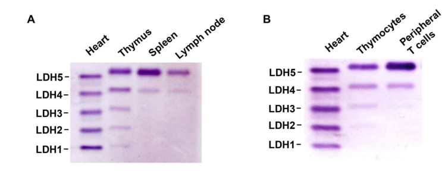

## Question

# Gene Research for Functional Annotation

## ⚠️ CRITICAL: Gene/Protein Identification Context

**BEFORE YOU BEGIN RESEARCH:** You MUST verify you are researching the CORRECT gene/protein. Gene symbols can be ambiguous, especially for less well-characterized genes from non-model organisms.

### Target Gene/Protein Identity (from UniProt):
- **UniProt Accession:** P42123
- **Protein Description:** RecName: Full=L-lactate dehydrogenase B chain; Short=LDH-B; EC=1.1.1.27 {ECO:0000250|UniProtKB:P07195}; AltName: Full=LDH heart subunit; Short=LDH-H;
- **Gene Information:** Name=Ldhb; Synonyms=Ldh-2, Ldh2;
- **Organism (full):** Rattus norvegicus (Rat).
- **Protein Family:** Belongs to the LDH/MDH superfamily. LDH family.
- **Key Domains:** L-lactate/malate_DH. (IPR001557); L-lactate_DH. (IPR011304); L-lactate_DH_AS. (IPR018177); Lactate/malate_DH_C. (IPR022383); Lactate/malate_DH_N. (IPR001236)

### MANDATORY VERIFICATION STEPS:

1. **Check if the gene symbol "Ldhb" matches the protein description above**
2. **Verify the organism is correct:** Rattus norvegicus (Rat).
3. **Check if protein family/domains align with what you find in literature**
4. **If you find literature for a DIFFERENT gene with the same or similar symbol, STOP**

### If Gene Symbol is Ambiguous or You Cannot Find Relevant Literature:

**DO NOT PROCEED WITH RESEARCH ON A DIFFERENT GENE.** Instead:
- State clearly: "The gene symbol 'Ldhb' is ambiguous or literature is limited for this specific protein"
- Explain what you found (e.g., "Found extensive literature on a different gene with the same symbol in a different organism")
- Describe the protein based ONLY on the UniProt information provided above
- Suggest that the protein function can be inferred from domain/family information

### Research Target:

Please provide a comprehensive research report on the gene **Ldhb** (gene ID: Ldhb, UniProt: P42123) in rat.

The research report should be a detailed narrative explaining the function, biological processes, and localization of the gene product. Citations should be given for all claims.

You should prioritize authoritative reviews and primary scientific literature when conducting research. You can supplement
this with annotations you find in gene/protein databases, but these can be outdated or inaccurate.

We are specifically interested in the primary function of the gene - for enzymes, what reaction is catalyzed, and what is the substrate specificity? For transporters, what is the substrate? For structural proteins or adapters, what is the broader structural role? For signaling molecules, what is the role in the pathway.

We are interested in where in or outside the cell the gene product carries out its function.

We are also interested in the signaling or biochemical pathways in which the gene functions. We are less interested in broad pleiotropic effects, except where these elucidate the precise role.

Include evidence where possible. We are interested in both experimental evidence as well as inference from structure, evolution, or bioinformatic analysis. Precise studies should be prioritized over high-throughput, where available.

## Output

Question: You are an expert researcher providing comprehensive, well-cited information.

Provide detailed information focusing on:
1. Key concepts and definitions with current understanding
2. Recent developments and latest research (prioritize 2023-2024 sources)
3. Current applications and real-world implementations
4. Expert opinions and analysis from authoritative sources
5. Relevant statistics and data from recent studies

Format as a comprehensive research report with proper citations. Include URLs and publication dates where available.
Always prioritize recent, authoritative sources and provide specific citations for all major claims.

# Gene Research for Functional Annotation

## ⚠️ CRITICAL: Gene/Protein Identification Context

**BEFORE YOU BEGIN RESEARCH:** You MUST verify you are researching the CORRECT gene/protein. Gene symbols can be ambiguous, especially for less well-characterized genes from non-model organisms.

### Target Gene/Protein Identity (from UniProt):
- **UniProt Accession:** P42123
- **Protein Description:** RecName: Full=L-lactate dehydrogenase B chain; Short=LDH-B; EC=1.1.1.27 {ECO:0000250|UniProtKB:P07195}; AltName: Full=LDH heart subunit; Short=LDH-H;
- **Gene Information:** Name=Ldhb; Synonyms=Ldh-2, Ldh2;
- **Organism (full):** Rattus norvegicus (Rat).
- **Protein Family:** Belongs to the LDH/MDH superfamily. LDH family.
- **Key Domains:** L-lactate/malate_DH. (IPR001557); L-lactate_DH. (IPR011304); L-lactate_DH_AS. (IPR018177); Lactate/malate_DH_C. (IPR022383); Lactate/malate_DH_N. (IPR001236)

### MANDATORY VERIFICATION STEPS:

1. **Check if the gene symbol "Ldhb" matches the protein description above**
2. **Verify the organism is correct:** Rattus norvegicus (Rat).
3. **Check if protein family/domains align with what you find in literature**
4. **If you find literature for a DIFFERENT gene with the same or similar symbol, STOP**

### If Gene Symbol is Ambiguous or You Cannot Find Relevant Literature:

**DO NOT PROCEED WITH RESEARCH ON A DIFFERENT GENE.** Instead:
- State clearly: "The gene symbol 'Ldhb' is ambiguous or literature is limited for this specific protein"
- Explain what you found (e.g., "Found extensive literature on a different gene with the same symbol in a different organism")
- Describe the protein based ONLY on the UniProt information provided above
- Suggest that the protein function can be inferred from domain/family information

### Research Target:

Please provide a comprehensive research report on the gene **Ldhb** (gene ID: Ldhb, UniProt: P42123) in rat.

The research report should be a detailed narrative explaining the function, biological processes, and localization of the gene product. Citations should be given for all claims.

You should prioritize authoritative reviews and primary scientific literature when conducting research. You can supplement
this with annotations you find in gene/protein databases, but these can be outdated or inaccurate.

We are specifically interested in the primary function of the gene - for enzymes, what reaction is catalyzed, and what is the substrate specificity? For transporters, what is the substrate? For structural proteins or adapters, what is the broader structural role? For signaling molecules, what is the role in the pathway.

We are interested in where in or outside the cell the gene product carries out its function.

We are also interested in the signaling or biochemical pathways in which the gene functions. We are less interested in broad pleiotropic effects, except where these elucidate the precise role.

Include evidence where possible. We are interested in both experimental evidence as well as inference from structure, evolution, or bioinformatic analysis. Precise studies should be prioritized over high-throughput, where available.

## Research report: Functional annotation of rat **Ldhb** (UniProt **P42123**) — L-lactate dehydrogenase B chain (LDH-B; LDH-H)

### 0) Target verification (critical identity checks)
The research target is **rat (Rattus norvegicus) Ldhb**, encoding **L-lactate dehydrogenase B chain** (LDHB; “heart subunit”, LDH-H), matching the UniProt accession **P42123**. A rat mitochondrial proteomics workflow explicitly identifies **“L-lactate dehydrogenase B chain (P42123)”** from the *Rattus norvegicus* UniProt database, confirming that P42123 corresponds to the intended rat LDHB protein rather than an unrelated homolog or different organism’s gene symbol. (araujo2019proteomicanalysisof pages 1-13)

### 1) Key concepts and definitions (current understanding)

#### 1.1 Enzyme class and core reaction (EC 1.1.1.27)
Ldhb encodes a subunit of **lactate dehydrogenase (LDH; EC 1.1.1.27)**, a **NAD(H)-dependent oxidoreductase** that catalyzes the reversible interconversion:

- **Pyruvate + NADH ↔ L-lactate + NAD+**

This coupled reaction is central to maintaining the cytosolic **NADH/NAD+** balance, particularly under conditions where glycolytic flux requires rapid NAD+ regeneration. A 2023 primary study (focused on LDH isoenzyme biology) describes LDH as catalyzing the coupled interconversion of **pyruvate→lactate** with **NADH→NAD+** as the terminal step of glycolysis. (chen2023thelactatedehydrogenase pages 1-2)

A recent inhibitor-modeling study likewise describes LDH as a tetrameric enzyme catalyzing reversible pyruvate↔lactate interconversion, and explicitly states the **LDHB-associated direction** as lactate→pyruvate with **NAD+ reduced to NADH** (while noting LDHA is commonly discussed as catalyzing the reverse direction). (damavandi2023astudyof pages 1-2)

#### 1.2 Isoenzymes: LDHA/LDHB tetramers and the “LDH spectrum”
Mammalian LDH is a **tetramer** built from the two principal subunits **LDHA** (muscle-type; historically “M”) and **LDHB** (heart-type; historically “H”), producing a set of major isoenzymes that differ in catalytic properties and tissue distribution. (chen2023thelactatedehydrogenase pages 1-2, gallo2015lacticdehydrogenaseand pages 2-3)

A recent mechanistic immunometabolism study emphasizes that LDH isoenzymes form **homotetramers and heterotetramers** from LDHA and LDHB, and that the distribution (“spectrum”) of these tetramers contributes to tuning cellular glycolysis and redox balance. (chen2023thelactatedehydrogenase pages 1-2)

### 2) Enzymology: substrate specificity and kinetic characteristics

#### 2.1 Substrate/cofactor specificity
The LDHB-containing LDH complex uses **L-lactate/pyruvate** as substrates and **NAD+/NADH** as the redox cofactor pair. The subunit-specific “directionality” framing in recent literature describes LDHB as supporting **lactate oxidation to pyruvate** with concomitant **NAD+ → NADH**, consistent with its canonical role in oxidative tissues that consume lactate. (damavandi2023astudyof pages 1-2)

#### 2.2 Quantitative kinetic context (LDHB-rich vs LDHA-rich isoenzymes)
A 2024 review focusing on the importance of enzyme Michaelis constants for redox balance summarizes that the **LDH-1 isoenzyme (LDHB-rich; heart-type)** has **lower KM values** for key reactants than LDH-5 (LDHA-rich). Specifically:
- **LDH-1/LDHB**: KM(pyruvate) ≈ **0.1 mM**; KM(NADH) ≈ **0.04 mM**
- **LDH-5/LDHA**: KM(pyruvate) ≈ **0.29 mM**; KM(NADH) ≈ **0.17 mM**

These differences are used to argue that isoenzyme composition can prioritize fluxes and support cytosolic redox control under different metabolic regimes. (niepmann2024importanceofmichaelis pages 7-8)

### 3) Tissue distribution and biological processes in rat and mammals

#### 3.1 Heart-type enrichment and tissue specificity (conceptual + experimental patterns)
Classical and modern sources converge on the principle that the **heart** is enriched for **LDHB-rich (“H”)** isoenzymes, while more glycolytic tissues show stronger LDHA-rich isoenzymes. A comprehensive overview of LDH in disease describes LDH-1 (H4) as corresponding to **LDHB** and highlights tissue- and kinetic-differences among isoforms. (gallo2015lacticdehydrogenaseand pages 2-3)

Direct experimental visualization of isoenzyme distributions is illustrated by LDH zymography images (Figure 1A/1B) from a 2023 *Science Advances* study: **heart and thymus show nearly all five isoenzyme bands**, whereas **spleen/lymph node are dominated by LDH-5 with minor LDH-4/3**. Although this specific dataset is in mouse tissues/T cells, it provides authoritative primary evidence for the mammalian principle of tissue-specific LDH isoenzyme spectra that is directly relevant when annotating rat LDHB as the “heart-type” subunit. (chen2023thelactatedehydrogenase pages 1-2, chen2023thelactatedehydrogenase media d6eb8209)

#### 3.2 Rat in vivo evidence of LDH isozyme remodeling (physiological intervention)
A rat study using **male Wistar rats** administered taurine (40 or 100 mg/kg, 28 days) measured **total LDH activity** and **isozyme composition** via electrophoresis in multiple tissues (whole blood, liver, thigh muscle, brain, testes). It reports tissue- and dose-dependent redistribution: e.g., liver and whole blood (at 100 mg/kg) shifting toward **LDH1+LDH2**, while brain (40 mg/kg) and testes shifting toward **LDH4+LDH5**. The paper also frames LDH activity in plasma as a **marker of plasma membrane integrity**, linking LDH measurements to tissue injury/physiology interpretation—an important real-world use case in rat experiments. (ostapiv2015activityandisozyme pages 1-2)

### 4) Subcellular localization: cytosol-dominant with specialized minor pools

#### 4.1 Cytosolic function and the NADH/NAD+ pool
LDH is classically treated as a cytosolic enzyme positioned at the end of glycolysis to regenerate NAD+ and interconvert lactate/pyruvate, thereby shaping cytosolic redox balance. This is explicitly stated in the 2023 isoenzyme study’s description of LDH as controlling the last step of glycolysis via pyruvate↔lactate and NADH↔NAD+. (chen2023thelactatedehydrogenase pages 1-2)

#### 4.2 Peroxisomal LDHB via translational readthrough (LDHBx)
A major mechanistic advance in subcellular targeting is the discovery that **a low-abundance peroxisomal LDHB isoform (LDHBx)** is generated through **translational readthrough**, adding a hidden **PTS1 peroxisome targeting signal**. This work reports that **at least ~1.6%** of total cellular LDHB is targeted to peroxisomes, and that LDHBx can **co-import LDHA** into peroxisomes—supporting a role in **peroxisomal redox-equivalent regeneration**. This finding is conserved across mammals and is therefore directly relevant to rat LDHB annotation even though the mechanism was demonstrated in a broader mammalian context. (schueren2014peroxisomallactatedehydrogenase pages 1-2)

#### 4.3 Mitochondrial association: evidence and controversy, including rat skeletal muscle data
There is longstanding debate about whether LDH operates within mitochondria as part of an “intracellular lactate shuttle.” A biochemical study on heart- vs muscle-type LDH interactions with acidic phospholipids cites literature for LDH presence on/in the **mitochondrial inner membrane**, including in **rat heart and skeletal muscle**, and proposes cardiolipin-mediated binding influenced by pH and nucleotide/cofactor environment. (terlecki2007ultracentrifugationstudiesof pages 13-16)

However, a direct rat mitochondrial preparation study in **soleus muscle** found LDH activity in the mitochondrial fraction to be only **0.7% of total activity** and reported **no detectable mitochondrial respiration on lactate alone**. Respiration increased only when **external LDH plus NAD+** were provided to convert lactate to pyruvate outside mitochondria. Quantitatively, state 3 respiration was **154 nmol O2 mg protein−1 min−1** for pyruvate+malate, ~**15.8** for lactate+malate, and **~64.0 ± 5.2** for lactate+malate+NAD+. These data argue against robust direct mitochondrial lactate oxidation in this rat skeletal muscle context, emphasizing that mitochondrial LDH claims can be tissue- and preparation-dependent. (sahlin2002noevidenceof pages 1-2)

### 5) Pathways and physiological roles

#### 5.1 Central role at the pyruvate–lactate redox junction
LDHB function is best understood as positioning the LDH complex at the **pyruvate–lactate junction**, where flux direction reflects redox needs and substrate availability. The isoenzyme spectrum concept supports that subunit composition (LDHA vs LDHB content) tunes redox constraints and glycolytic output; experimentally, LDH isoenzyme composition was shown to influence **NAD+/NADH pool balance** and “Goldilocks” glycolytic levels in an immune-cell model. (chen2023thelactatedehydrogenase pages 1-2)

#### 5.2 Cardiac metabolism and disease context (expert synthesis)
A 2024 state-of-the-art review on heart failure metabolism integrates LDH into broader cardiac substrate utilization, linking lactate/pyruvate handling with transport (e.g., MCT1) and mitochondrial fuel metabolism. While this review is not rat-specific, it provides authoritative expert framing for interpreting why LDHB-rich isoenzymes are characteristic of highly oxidative tissues such as heart and why altered substrate utilization is important in heart failure. (ng2024leveragingmetabolismfor pages 1-3)

### 6) Recent developments (2023–2024 priority)
Key 2023–2024 developments most relevant to functional annotation of rat Ldhb include:
1. **Isoenzyme spectrum as a regulatory mechanism** (not merely a biomarker): a 2023 study provides mechanistic evidence that LDHA/LDHB tetramer composition can tune glycolysis and redox balance in T cells. (chen2023thelactatedehydrogenase pages 1-2)
2. **Quantitative kinetic framing of isoenzymes**: a 2024 review highlights that differences in KM among LDH isoenzymes can rationalize metabolic priorities at the pyruvate junction and redox balancing. (niepmann2024importanceofmichaelis pages 7-8)
3. **Renewed interest in lactate oxidation pathways in the heart**: a 2024 cardiovascular metabolism review underscores modern metabolomics/fluxomics approaches and revisits long-held assumptions about cardiac fuel selection, providing context in which LDH/LDHB biology is being reinterpreted. (ng2024leveragingmetabolismfor pages 1-3)
4. **Drug discovery attention broadening from LDHA to LDHB**: a 2023 paper demonstrates growing interest in **LDHB-selective inhibition** and highlights assay considerations specific to LDH enzymology. (vlasiou2023targetinglactatedehydrogenaseb pages 1-2, vlasiou2023targetinglactatedehydrogenaseb pages 15-16)

### 7) Current applications and real-world implementations

#### 7.1 LDH/isoenzymes as biomarkers in rat experiments and clinical chemistry
LDH activity in blood/plasma is widely used as a tissue damage marker; a rat intervention study explicitly states that **plasma LDH activity is a marker of plasma membrane integrity** and interprets isoenzyme shifts (e.g., LDH5 increase in liver as degenerative processes). The same work demonstrates the practical laboratory implementation of **spectrophotometric LDH activity measurement** and **PAGE isoenzyme electrophoresis** with densitometry to quantify band fractions—methods directly transferable to rat LDHB-related phenotyping. (ostapiv2015activityandisozyme pages 1-2)

#### 7.2 LDHB as an emerging drug target and assay development
A 2023 Pharmaceutics study positions LDHB as a drug target, identifying marketed kinase inhibitors **tucatinib** and **capmatinib** as **uncompetitive LDHB inhibitors** in vitro and discussing practical LDH assay modalities. It highlights common readouts (NADH absorbance at 340 nm and NADH fluorescence) and notes high-throughput alternatives, including an NBT/PMS-based colorimetric 96-well assay with Z′ = **0.84** and RF-MS approaches to monitor NADH→NAD+. (vlasiou2023targetinglactatedehydrogenaseb pages 1-2, vlasiou2023targetinglactatedehydrogenaseb pages 15-16)

### 8) Statistics and data highlights (selected)

- **Kinetic summary (isoenzyme-specific KM)**: LDH-1/LDHB KM(pyruvate) ~0.1 mM; KM(NADH) ~0.04 mM; LDH-5/LDHA KM(pyruvate) ~0.29 mM; KM(NADH) ~0.17 mM. (Niepmann, 2024-06; https://doi.org/10.3390/cancers16132290) (niepmann2024importanceofmichaelis pages 7-8)
- **Peroxisomal targeting via readthrough**: ≥ **1.6%** of total cellular LDHB targeted to peroxisomes (LDHBx). (Schueren, 2014-09-23; https://doi.org/10.7554/eLife.03640) (schueren2014peroxisomallactatedehydrogenase pages 1-2)
- **Rat soleus mitochondria**: LDH activity in mitochondrial fraction **0.7%** of total; state 3 respiration (nmol O2 mg protein−1 min−1): **154** for pyruvate+malate vs **~15.8** for lactate+malate vs **~64.0 ± 5.2** for lactate+malate+NAD+. (Sahlin, 2002-06; https://doi.org/10.1113/jphysiol.2002.016683) (sahlin2002noevidenceof pages 1-2)

### 9) Evidence map (compact)
The following table links major annotation claims to evidence and quantitative support.

| Topic | Key finding | Quantitative/statistic (if any) | Species/context (rat vs other mammal) | Source (first author year, journal) | URL/DOI | Evidence citation ID(s) |
|---|---|---|---|---|---|---|
| Reaction | LDHB is one of the two major LDH subunits in a tetrameric enzyme system and is described as catalyzing the reversible conversion of lactate to pyruvate with reduction of NAD+ to NADH; LDHA preferentially catalyzes the reverse direction. | Reaction is reversible; NAD+/NADH-coupled, but no kinetic values in this source. | General mammalian LDHB/LDHA overview; useful for annotating rat LDHB because the chemistry matches EC 1.1.1.27. | Damavandi 2023, *BMC Chemistry* | https://doi.org/10.1186/s13065-023-00991-6 | (damavandi2023astudyof pages 1-2) |
| Isoenzymes | LDH exists as homotetramers and heterotetramers of LDHA and LDHB. Zymography showed heart and thymus with nearly all five isoenzymes, whereas spleen and lymph node were dominated by LDH-5 with minor LDH-4/3. Figure 1A/1B provides direct visual support. | Qualitative spectrum: heart/thymus ≈ five bands; spleen/lymph node mainly LDH-5 plus weaker LDH-4/3. | Mouse tissues/T cells, but directly relevant to mammalian LDHB isoenzyme biology and consistent with heart-type LDHB enrichment. | Chen 2023, *Science Advances* | https://doi.org/10.1126/sciadv.add9554 | (chen2023thelactatedehydrogenase pages 1-2, chen2023thelactatedehydrogenase media d6eb8209) |
| Localization | A low-abundance peroxisomal LDHB isoform (LDHBx) is generated by translational readthrough, adding a hidden PTS1 signal; LDHBx can also co-import LDHA into peroxisomes, implying a peroxisomal redox role. | At least ~1.6% of total cellular LDHB targeted to peroxisomes. | Mammals broadly; not rat-specific, but establishes a conserved minor peroxisomal pool relevant to rat LDHB annotation. | Schueren 2014, *eLife* | https://doi.org/10.7554/eLife.03640 | (schueren2014peroxisomallactatedehydrogenase pages 1-2) |
| Localization/data | In isolated rat soleus mitochondria, mitochondrial LDH activity was minimal, arguing against robust direct mitochondrial lactate oxidation in this preparation. Lactate alone did not support respiration; respiration increased only when external LDH and NAD+ were supplied to convert lactate to pyruvate outside mitochondria. | Mitochondrial fraction LDH activity = 0.7% of total; state 3 respiration: pyruvate+malate 154 nmol O2 mg protein^-1 min^-1, lactate+malate ~15.8, lactate+malate+NAD+ ~64.0 ± 5.2. | Rat skeletal muscle mitochondria; important rat-specific caution against overcalling mitochondrial LDHB activity. | Sahlin 2002, *The Journal of Physiology* | https://doi.org/10.1113/jphysiol.2002.016683 | (sahlin2002noevidenceof pages 1-2) |
| Localization | Although LDH has classically been considered cytosolic, mammalian studies cited in this paper report LDH presence on/in the mitochondrial inner membrane, including in rat heart and skeletal muscle; association may involve cardiolipin and be modulated by pH and adenine/nicotinamide nucleotides. | Conceptual/localization model; no rat quantitative value given here. | Pig heart experimental system with cited rat heart/skeletal muscle mitochondrial localization literature. | Terlecki 2007, *Cellular & Molecular Biology Letters* | https://doi.org/10.2478/s11658-007-0010-5 | (terlecki2007ultracentrifugationstudiesof pages 13-16) |
| Data/kinetics | Recent review summarizes that LDH-1 (the LDHB-rich/heart-type isoenzyme) has lower KM values than LDH-5, supporting efficient handling of pyruvate/NADH in oxidative tissues. | LDH-1/LDHB: KM for pyruvate ~0.1 mM; KM for NADH ~0.04 mM. LDH-5/LDHA: pyruvate ~0.29 mM; NADH ~0.17 mM. | Review synthesis across mammals; useful comparative kinetic context for rat heart-type LDHB annotation. | Niepmann 2024, *Cancers* | https://doi.org/10.3390/cancers16132290 | (niepmann2024importanceofmichaelis pages 7-8) |
| Regulation/data | In rats given taurine for 28 days, total LDH activity increased across multiple tissues, with tissue-specific isozyme redistribution. Brain and testes shifted toward glycolytic LDH4+LDH5 in some conditions, whereas liver and whole blood shifted toward LDH1+LDH2 in others. | Male Wistar rats, 28 days, 40 or 100 mg/kg taurine; increased total LDH activity in whole blood, liver, thigh muscle, brain, testes; liver and whole blood (100 mg/kg) increased LDH1+LDH2; brain (40 mg/kg) and testes increased LDH4+LDH5. | Rat in vivo study; indirect but useful for understanding context-dependent Ldhb-containing isoenzyme shifts. | Ostapiv 2015, *Ukrainian Biochemical Journal* | https://doi.org/10.15407/ubj87.04.054 | (ostapiv2015activityandisozyme pages 1-2) |
| Application/pathway | Cardiac metabolism review places LDH in the pathway converting glycolytic pyruvate and lactate, integrated with MCT1 transport, mitochondrial pyruvate handling, and failing-heart substrate inflexibility. This supports annotating LDHB as part of cardiac lactate/pyruvate-redox metabolism rather than a standalone marker only. | Review includes pathway-level framing; no LDHB-specific numeric value on these pages. | Human/cardiac systems review with broad mammalian relevance; useful for physiological interpretation of rat Ldhb in heart. | Ng 2024, *Cardiovascular Research* | https://doi.org/10.1093/cvr/cvae216 | (ng2024leveragingmetabolismfor pages 1-3) |
| Verification/identity | Rat mitochondrial proteomics explicitly matched the protein as “L-lactate dehydrogenase B chain (P42123)” in *Rattus norvegicus*, supporting that UniProt P42123 corresponds to the intended rat Ldhb target. | UniProt accession P42123 identified in rat liver mitochondrial proteomics workflow. | Rat-specific identity confirmation. | Araújo 2019, University of São Paulo dissertation/proteomics | https://doi.org/10.11606/d.25.2019.tde-25112019-222647 | (araujo2019proteomicanalysisof pages 1-13) |

*Table: This table summarizes the most relevant functional annotation evidence for rat Ldhb/LDHB (UniProt P42123), spanning catalytic chemistry, isoenzyme biology, localization, regulation, and pathway context. It is useful as a compact evidence map linking each major annotation claim to recent or foundational sources and citation IDs.*

### 10) Conclusions for functional annotation of rat Ldhb (P42123)
**Primary molecular function:** Rat **LDHB** is the “heart-type” subunit of LDH (EC 1.1.1.27), participating in a tetrameric enzyme that catalyzes **pyruvate↔L-lactate** interconversion coupled to **NADH↔NAD+**, thereby regulating carbon flux at the pyruvate junction and maintaining cytosolic redox balance. (chen2023thelactatedehydrogenase pages 1-2, damavandi2023astudyof pages 1-2)

**Substrate specificity:** L-lactate/pyruvate with NAD+/NADH cofactors. Isoenzyme-specific kinetics suggest LDHB-rich isoenzymes have **higher apparent affinity (lower KM)** for pyruvate and NADH than LDHA-rich isoenzymes, consistent with oxidative-tissue specialization. (niepmann2024importanceofmichaelis pages 7-8)

**Cellular location:** LDHB is predominantly discussed as a cytosolic enzyme in glycolytic/redox control, with evidence for (i) a **minor peroxisomal pool** via translational readthrough (LDHBx; ~1.6%) supporting peroxisomal redox regeneration, and (ii) ongoing debate about **mitochondrial association**, with rat skeletal muscle mitochondria data arguing against strong direct lactate oxidation in that context. (chen2023thelactatedehydrogenase pages 1-2, schueren2014peroxisomallactatedehydrogenase pages 1-2, sahlin2002noevidenceof pages 1-2)

**Biological processes/pathways:** LDHB contributes to lactate utilization/production control through LDH isoenzyme spectra, influencing glycolytic output and NAD+/NADH homeostasis; it is embedded in broader tissue-specific metabolic programs (notably cardiac fuel utilization) and is routinely measured in physiology and pathology studies. (chen2023thelactatedehydrogenase pages 1-2, ng2024leveragingmetabolismfor pages 1-3, ostapiv2015activityandisozyme pages 1-2)

### Limitations of the retrieved corpus
Within the accessible documents retrieved here, **direct rat-specific purified-enzyme kinetic measurements for LDHB (P42123) were not obtained**; kinetic values were drawn from authoritative 2024 review synthesis of isoenzyme kinetics. Future curation would benefit from targeted retrieval of classic rat LDH-1/LDHB purification and steady-state kinetics papers (heart cytosol preparations) to confirm species- and tissue-specific KM/Vmax under standardized assay conditions. (niepmann2024importanceofmichaelis pages 7-8)

References

1. (araujo2019proteomicanalysisof pages 1-13): Tamara Teodoro Araújo. Proteomic analysis of mitochondria from rat liver exposed to chronic fluoride exposure in two experimental periods. ArXiv, Apr 2019. URL: https://doi.org/10.11606/d.25.2019.tde-25112019-222647, doi:10.11606/d.25.2019.tde-25112019-222647. This article has 0 citations.

2. (chen2023thelactatedehydrogenase pages 1-2): Xuyong Chen, Lingling Liu, Siwen Kang, JN Rashida Gnanaprakasam, and Ruoning Wang. The lactate dehydrogenase (ldh) isoenzyme spectrum enables optimally controlling t cell glycolysis and differentiation. Science Advances, Mar 2023. URL: https://doi.org/10.1126/sciadv.add9554, doi:10.1126/sciadv.add9554. This article has 52 citations and is from a highest quality peer-reviewed journal.

3. (damavandi2023astudyof pages 1-2): Sedigheh Damavandi, Fereshteh Shiri, Abbasali Emamjomeh, Somayeh Pirhadi, and Hamid Beyzaei. A study of the interaction space of two lactate dehydrogenase isoforms (ldha and ldhb) and some of their inhibitors using proteochemometrics modeling. BMC Chemistry, Jul 2023. URL: https://doi.org/10.1186/s13065-023-00991-6, doi:10.1186/s13065-023-00991-6. This article has 8 citations and is from a peer-reviewed journal.

4. (gallo2015lacticdehydrogenaseand pages 2-3): M. Gallo, Luigi Sapio, A. Spina, D. Naviglio, A. Calogero, and S. Naviglio. Lactic dehydrogenase and cancer: an overview. Frontiers in bioscience, 20:1234-49, Jun 2015. URL: https://doi.org/10.2741/4368, doi:10.2741/4368. This article has 165 citations and is from a peer-reviewed journal.

5. (niepmann2024importanceofmichaelis pages 7-8): Michael Niepmann. Importance of michaelis constants for cancer cell redox balance and lactate secretion—revisiting the warburg effect. Cancers, 16:2290, Jun 2024. URL: https://doi.org/10.3390/cancers16132290, doi:10.3390/cancers16132290. This article has 12 citations.

6. (chen2023thelactatedehydrogenase media d6eb8209): Xuyong Chen, Lingling Liu, Siwen Kang, JN Rashida Gnanaprakasam, and Ruoning Wang. The lactate dehydrogenase (ldh) isoenzyme spectrum enables optimally controlling t cell glycolysis and differentiation. Science Advances, Mar 2023. URL: https://doi.org/10.1126/sciadv.add9554, doi:10.1126/sciadv.add9554. This article has 52 citations and is from a highest quality peer-reviewed journal.

7. (ostapiv2015activityandisozyme pages 1-2): R. D. Ostapiv, S. L. Humenyuk, and V. V. Manko. Activity and isozyme content of lactate dehydrogenase under long-term oral taurine administration to rats. Ukrainian biochemical journal, 87 4:54-62, Aug 2015. URL: https://doi.org/10.15407/ubj87.04.054, doi:10.15407/ubj87.04.054. This article has 9 citations.

8. (schueren2014peroxisomallactatedehydrogenase pages 1-2): Fabian Schueren, Thomas Lingner, Rosemol George, Julia Hofhuis, Corinna Dickel, Jutta Gärtner, and Sven Thoms. Peroxisomal lactate dehydrogenase is generated by translational readthrough in mammals. eLife, Sep 2014. URL: https://doi.org/10.7554/elife.03640, doi:10.7554/elife.03640. This article has 232 citations and is from a domain leading peer-reviewed journal.

9. (terlecki2007ultracentrifugationstudiesof pages 13-16): Grzegorz Terlecki, Elżbieta Czapińska, and Katarzyna Hotowy. Ultracentrifugation studies of the location of the site involved in the interaction of pig heart lactate dehydrogenase with acidic phospholipids at low ph. a comparison with the muscle form of the enzyme. Cellular & Molecular Biology Letters, 12:378-395, Mar 2007. URL: https://doi.org/10.2478/s11658-007-0010-5, doi:10.2478/s11658-007-0010-5. This article has 7 citations and is from a peer-reviewed journal.

10. (sahlin2002noevidenceof pages 1-2): Kent Sahlin, Maria Fernström, Michael Svensson, and Michail Tonkonogi. No evidence of an intracellular lactate shuttle in rat skeletal muscle. The Journal of Physiology, 541:569-574, Jun 2002. URL: https://doi.org/10.1113/jphysiol.2002.016683, doi:10.1113/jphysiol.2002.016683. This article has 126 citations.

11. (ng2024leveragingmetabolismfor pages 1-3): Yann Huey Ng, Yen Chin Koay, Francine Z Marques, David M Kaye, and John F O’Sullivan. Leveraging metabolism for better outcomes in heart failure. Cardiovascular Research, 120:1835-1850, Oct 2024. URL: https://doi.org/10.1093/cvr/cvae216, doi:10.1093/cvr/cvae216. This article has 16 citations and is from a domain leading peer-reviewed journal.

12. (vlasiou2023targetinglactatedehydrogenaseb pages 1-2): Manos Vlasiou, Vicky Nicolaidou, and Christos Papaneophytou. Targeting lactate dehydrogenase-b as a strategy to fight cancer: identification of potential inhibitors by in silico analysis and in vitro screening. Pharmaceutics, 15:2411, Oct 2023. URL: https://doi.org/10.3390/pharmaceutics15102411, doi:10.3390/pharmaceutics15102411. This article has 20 citations.

13. (vlasiou2023targetinglactatedehydrogenaseb pages 15-16): Manos Vlasiou, Vicky Nicolaidou, and Christos Papaneophytou. Targeting lactate dehydrogenase-b as a strategy to fight cancer: identification of potential inhibitors by in silico analysis and in vitro screening. Pharmaceutics, 15:2411, Oct 2023. URL: https://doi.org/10.3390/pharmaceutics15102411, doi:10.3390/pharmaceutics15102411. This article has 20 citations.

## Artifacts

- [Edison artifact artifact-00](Ldhb-deep-research-falcon_artifacts/artifact-00.md)

## Citations

1. araujo2019proteomicanalysisof pages 1-13
2. chen2023thelactatedehydrogenase pages 1-2
3. damavandi2023astudyof pages 1-2
4. niepmann2024importanceofmichaelis pages 7-8
5. gallo2015lacticdehydrogenaseand pages 2-3
6. ostapiv2015activityandisozyme pages 1-2
7. schueren2014peroxisomallactatedehydrogenase pages 1-2
8. terlecki2007ultracentrifugationstudiesof pages 13-16
9. sahlin2002noevidenceof pages 1-2
10. ng2024leveragingmetabolismfor pages 1-3
11. vlasiou2023targetinglactatedehydrogenaseb pages 1-2
12. vlasiou2023targetinglactatedehydrogenaseb pages 15-16
13. https://doi.org/10.3390/cancers16132290
14. https://doi.org/10.7554/eLife.03640
15. https://doi.org/10.1113/jphysiol.2002.016683
16. https://doi.org/10.1186/s13065-023-00991-6
17. https://doi.org/10.1126/sciadv.add9554
18. https://doi.org/10.2478/s11658-007-0010-5
19. https://doi.org/10.15407/ubj87.04.054
20. https://doi.org/10.1093/cvr/cvae216
21. https://doi.org/10.11606/d.25.2019.tde-25112019-222647
22. https://doi.org/10.11606/d.25.2019.tde-25112019-222647,
23. https://doi.org/10.1126/sciadv.add9554,
24. https://doi.org/10.1186/s13065-023-00991-6,
25. https://doi.org/10.2741/4368,
26. https://doi.org/10.3390/cancers16132290,
27. https://doi.org/10.15407/ubj87.04.054,
28. https://doi.org/10.7554/elife.03640,
29. https://doi.org/10.2478/s11658-007-0010-5,
30. https://doi.org/10.1113/jphysiol.2002.016683,
31. https://doi.org/10.1093/cvr/cvae216,
32. https://doi.org/10.3390/pharmaceutics15102411,