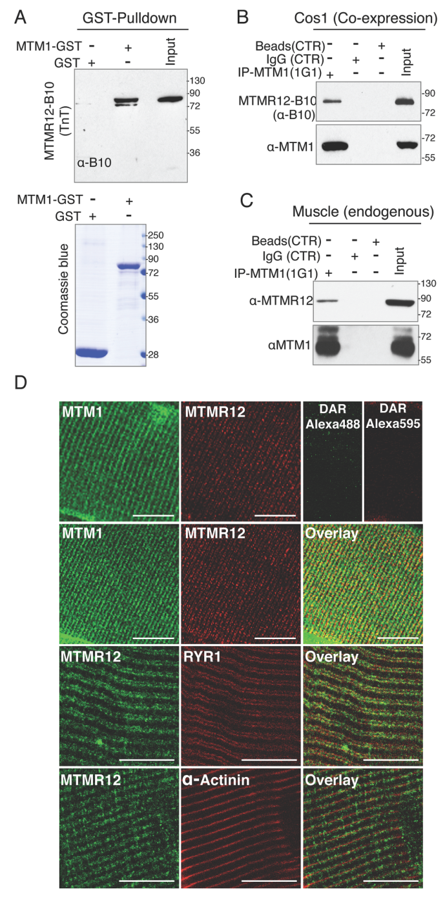

## Question

# Gene Research for Functional Annotation

## ⚠️ CRITICAL: Gene/Protein Identification Context

**BEFORE YOU BEGIN RESEARCH:** You MUST verify you are researching the CORRECT gene/protein. Gene symbols can be ambiguous, especially for less well-characterized genes from non-model organisms.

### Target Gene/Protein Identity (from UniProt):
- **UniProt Accession:** A0A8I5ZMD5
- **Protein Description:** RecName: Full=Myotubularin-related protein 12 {ECO:0000256|ARBA:ARBA00018495}; AltName: Full=Inactive phosphatidylinositol 3-phosphatase 12 {ECO:0000256|ARBA:ARBA00033343};
- **Gene Information:** Name=Mtmr12 {ECO:0000313|Ensembl:ENSRNOP00000078948.1, ECO:0000313|RGD:1307902};
- **Organism (full):** Rattus norvegicus (Rat).
- **Protein Family:** Belongs to the protein-tyrosine phosphatase family. Non-
- **Key Domains:** MTMR12-like_C. (IPR022587); MTMR12_PTP. (IPR030576); Myotubularin. (IPR030564); Myotubularin-like_Pase_dom. (IPR010569); PH-like_dom_sf. (IPR011993)

### MANDATORY VERIFICATION STEPS:

1. **Check if the gene symbol "Mtmr12" matches the protein description above**
2. **Verify the organism is correct:** Rattus norvegicus (Rat).
3. **Check if protein family/domains align with what you find in literature**
4. **If you find literature for a DIFFERENT gene with the same or similar symbol, STOP**

### If Gene Symbol is Ambiguous or You Cannot Find Relevant Literature:

**DO NOT PROCEED WITH RESEARCH ON A DIFFERENT GENE.** Instead:
- State clearly: "The gene symbol 'Mtmr12' is ambiguous or literature is limited for this specific protein"
- Explain what you found (e.g., "Found extensive literature on a different gene with the same symbol in a different organism")
- Describe the protein based ONLY on the UniProt information provided above
- Suggest that the protein function can be inferred from domain/family information

### Research Target:

Please provide a comprehensive research report on the gene **Mtmr12** (gene ID: Mtmr12, UniProt: A0A8I5ZMD5) in rat.

The research report should be a detailed narrative explaining the function, biological processes, and localization of the gene product. Citations should be given for all claims.

You should prioritize authoritative reviews and primary scientific literature when conducting research. You can supplement
this with annotations you find in gene/protein databases, but these can be outdated or inaccurate.

We are specifically interested in the primary function of the gene - for enzymes, what reaction is catalyzed, and what is the substrate specificity? For transporters, what is the substrate? For structural proteins or adapters, what is the broader structural role? For signaling molecules, what is the role in the pathway.

We are interested in where in or outside the cell the gene product carries out its function.

We are also interested in the signaling or biochemical pathways in which the gene functions. We are less interested in broad pleiotropic effects, except where these elucidate the precise role.

Include evidence where possible. We are interested in both experimental evidence as well as inference from structure, evolution, or bioinformatic analysis. Precise studies should be prioritized over high-throughput, where available.

## Output

Question: You are an expert researcher providing comprehensive, well-cited information.

Provide detailed information focusing on:
1. Key concepts and definitions with current understanding
2. Recent developments and latest research (prioritize 2023-2024 sources)
3. Current applications and real-world implementations
4. Expert opinions and analysis from authoritative sources
5. Relevant statistics and data from recent studies

Format as a comprehensive research report with proper citations. Include URLs and publication dates where available.
Always prioritize recent, authoritative sources and provide specific citations for all major claims.

# Gene Research for Functional Annotation

## ⚠️ CRITICAL: Gene/Protein Identification Context

**BEFORE YOU BEGIN RESEARCH:** You MUST verify you are researching the CORRECT gene/protein. Gene symbols can be ambiguous, especially for less well-characterized genes from non-model organisms.

### Target Gene/Protein Identity (from UniProt):
- **UniProt Accession:** A0A8I5ZMD5
- **Protein Description:** RecName: Full=Myotubularin-related protein 12 {ECO:0000256|ARBA:ARBA00018495}; AltName: Full=Inactive phosphatidylinositol 3-phosphatase 12 {ECO:0000256|ARBA:ARBA00033343};
- **Gene Information:** Name=Mtmr12 {ECO:0000313|Ensembl:ENSRNOP00000078948.1, ECO:0000313|RGD:1307902};
- **Organism (full):** Rattus norvegicus (Rat).
- **Protein Family:** Belongs to the protein-tyrosine phosphatase family. Non-
- **Key Domains:** MTMR12-like_C. (IPR022587); MTMR12_PTP. (IPR030576); Myotubularin. (IPR030564); Myotubularin-like_Pase_dom. (IPR010569); PH-like_dom_sf. (IPR011993)

### MANDATORY VERIFICATION STEPS:

1. **Check if the gene symbol "Mtmr12" matches the protein description above**
2. **Verify the organism is correct:** Rattus norvegicus (Rat).
3. **Check if protein family/domains align with what you find in literature**
4. **If you find literature for a DIFFERENT gene with the same or similar symbol, STOP**

### If Gene Symbol is Ambiguous or You Cannot Find Relevant Literature:

**DO NOT PROCEED WITH RESEARCH ON A DIFFERENT GENE.** Instead:
- State clearly: "The gene symbol 'Mtmr12' is ambiguous or literature is limited for this specific protein"
- Explain what you found (e.g., "Found extensive literature on a different gene with the same symbol in a different organism")
- Describe the protein based ONLY on the UniProt information provided above
- Suggest that the protein function can be inferred from domain/family information

### Research Target:

Please provide a comprehensive research report on the gene **Mtmr12** (gene ID: Mtmr12, UniProt: A0A8I5ZMD5) in rat.

The research report should be a detailed narrative explaining the function, biological processes, and localization of the gene product. Citations should be given for all claims.

You should prioritize authoritative reviews and primary scientific literature when conducting research. You can supplement
this with annotations you find in gene/protein databases, but these can be outdated or inaccurate.

We are specifically interested in the primary function of the gene - for enzymes, what reaction is catalyzed, and what is the substrate specificity? For transporters, what is the substrate? For structural proteins or adapters, what is the broader structural role? For signaling molecules, what is the role in the pathway.

We are interested in where in or outside the cell the gene product carries out its function.

We are also interested in the signaling or biochemical pathways in which the gene functions. We are less interested in broad pleiotropic effects, except where these elucidate the precise role.

Include evidence where possible. We are interested in both experimental evidence as well as inference from structure, evolution, or bioinformatic analysis. Precise studies should be prioritized over high-throughput, where available.

# Functional annotation report: rat **Mtmr12** (UniProt A0A8I5ZMD5)

## Executive summary

The requested protein identity is internally consistent: **Mtmr12** in *Rattus norvegicus* corresponds to **myotubularin-related protein 12**, also called **3-phosphatase-associated protein (3-PAP)** or inactive phosphatidylinositol 3-phosphatase 12. Its myotubularin-like inactive phosphatase and PH-like domain annotations agree with the established MTMR12 family architecture. No conflicting same-symbol protein was encountered.

The most defensible primary annotation is **not “lipid phosphatase enzyme,” but noncatalytic phosphoinositide-phosphatase regulator/pseudophosphatase**. MTMR12 binds active myotubularins—most importantly MTM1—and stabilizes and spatially organizes the complex. Consequently, it indirectly supports phosphatidylinositol-3-phosphate (PI3P) homeostasis and membrane organization. In skeletal muscle, mouse evidence places the MTM1–MTMR12 complex at the **triad**, where transverse tubules meet the sarcoplasmic reticulum. Loss of MTMR12 destabilizes MTM1 and produces abnormalities of triad architecture, myofiber organization, and motor function in zebrafish and mouse-derived cells. However, direct functional experiments on the precise rat protein A0A8I5ZMD5 remain very limited; most mechanistic conclusions are orthology-based.

## 1. Identity verification and nomenclature

### 1.1 Required checks

- **Gene/protein match:** The symbol **Mtmr12** matches “myotubularin-related protein 12.” The established alias **3-PAP** reflects its role as a phosphatase-associated protein rather than an active phosphatase.
- **Organism:** The target is specifically *Rattus norvegicus*. The supplied accession A0A8I5ZMD5 and Ensembl/RGD evidence identify a rat protein. The literature retrieved concerns the same conserved MTMR12 ortholog but relies mainly on mouse, zebrafish, human proteins, and mammalian cell lines.
- **Family/domain consistency:** Human MTMR12 is represented with an N-terminal PH-GRAM region, a catalytically inactive PTP/DSP/myotubularin domain, and a coiled-coil region. This agrees with the supplied MTMR12_PTP, myotubularin-like phosphatase-domain, MTMR12-like_C, and PH-like-superfamily annotations for A0A8I5ZMD5 (davies2012theptenand pages 28-31).
- **Ambiguity assessment:** No different gene with the same symbol was found. Nevertheless, detailed functional claims below are labeled by species because experimental evidence directly involving rat A0A8I5ZMD5 is sparse.

| Claim | Evidence/model species | Evidence type | Confidence | Key limitation |
|---|---|---|---|---|
| A0A8I5ZMD5 is rat **Mtmr12**, encoding myotubularin-related protein 12/3-PAP; its MTMR12-like inactive PTP/myotubularin and PH-like domains agree with the established MTMR12 architecture. | **Rat** database annotation; human family/domain comparison | Sequence/domain annotation and orthology | **High for identity; moderate for detailed architecture** | The rat UniProt record is computationally annotated; the supplied record does not establish a rat protein-level experiment. Human MTMR12 schematics additionally identify PH-GRAM, inactive PTP/DSP, and coiled-coil regions (davies2012theptenand pages 28-31). |
| MTMR12 is a **catalytically inactive pseudophosphatase** and therefore has no demonstrated intrinsic phosphoinositide reaction or substrate specificity. | Rat inference from conserved annotation; human/vertebrate MTMR12 literature | Conserved catalytic-site degeneration plus family classification | **High** | General MTMR reactions—PI3P → PI and PI(3,5)P2 → PI5P—belong to active partners and must not be assigned directly to MTMR12 (gupta2013lossofcatalytically pages 2-4, davies2012theptenand pages 28-31). |
| MTMR12 directly binds MTM1 and helps maintain MTM1 protein abundance/stability. | Human recombinant proteins and patient myotubes; COS-1/COS-7 cells; mouse C2C12 cells and muscle; zebrafish | GST pull-down, co-immunoprecipitation, RNA knockdown, immunoblotting, rescue | **High for conserved vertebrate function; moderate for rat specifically** | No direct rat loss-of-function experiment was identified. Mtmr12 knockdown reduced MTM1 in three C2C12 experiments and three zebrafish clutches of 50–75 embryos each (gupta2013lossofcatalytically pages 2-4, gupta2013lossofcatalytically pages 9-10). |
| In skeletal muscle, the MTM1–MTMR12 complex localizes to **triads**, partly overlapping RyR1-positive sarcoplasmic-reticulum structures but not α-actinin-positive Z-lines. | **Mouse** tibialis-anterior muscle | Endogenous co-immunoprecipitation and confocal immunofluorescence | **High in mouse; moderate by orthology for rat** | Localization has not been demonstrated directly for A0A8I5ZMD5 in rat tissue (gupta2013lossofcatalytically pages 2-4, gupta2013lossofcatalytically media a8e7b663). |
| MTMR12 indirectly supports phosphoinositide homeostasis: its loss increases PI3P, plausibly through destabilization/dysregulation of active MTM1 and possibly other PI3P phosphatases. | Zebrafish; mechanistic support from mouse cells | Knockdown with lipid-level and protein-level analyses | **Moderate** | The evidence does not show MTMR12 catalyzing PI3P hydrolysis or define an MTMR12-specific substrate; double mtm1/mtmr12 depletion raised PI3P beyond mtm1 depletion alone (gupta2013lossofcatalytically pages 9-10). |
| Loss of mtmr12 causes a centronuclear-myopathy-like phenotype: impaired movement, central nuclei, myofiber hypotrophy, disorganized triads, and abnormal whorled membranes. | **Zebrafish** morphants; mouse C2C12 supportive evidence | Two morpholinos, histology/electron microscopy, birefringence and rescue assays | **High in zebrafish; moderate for mammalian physiological relevance** | Morpholino results are not equivalent to a stable rat knockout. Human MTM1 nearly restored birefringence, although rescued embryos remained about 75 ± 5.4% of control length (gupta2013lossofcatalytically pages 10-12, gupta2013lossofcatalytically pages 9-10, gupta2013lossofcatalytically pages 1-2). |
| Patient-specific MTMR12 variation may modify α1-antitrypsin-Z proteotoxic liver disease through autophagy/proteostasis, jointly with FAM134A variation. | **Human** family/cohorts and patient-derived iPSC hepatocyte-like cells | Genomic sequencing and cell-based variant testing (2024) | **Preliminary/moderate** | A putative polygenic modifier association, not proof that common MTMR12 dysfunction causes liver disease; applicability to rat A0A8I5ZMD5 or normal MTMR12 physiology is uncertain. DOI: [10.1097/HEP.0000000000000865](https://doi.org/10.1097/HEP.0000000000000865). |
| MTMR12 currently has **no validated direct therapeutic application or MTMR12-targeted clinical trial**; complex stabilization and modulation of proteostasis remain research hypotheses. | Cross-species preclinical literature and clinical-target databases | Literature/trial landscape assessment | **High for current status** | XLMTM trials target the MTM1 disease pathway rather than MTMR12 itself. Open Targets associations largely derive from screening-level evidence and do not establish causal disease links (OpenTargets Search: -MTMR12, gupta2013lossofcatalytically pages 2-4). |

*Table: Evidence supporting rat Mtmr12 annotation is separated from mouse, zebrafish, and human ortholog findings. The table highlights the strong conserved MTM1-regulatory model while exposing the lack of direct rat functional experiments and clinical validation.*

## 2. Molecular function

### 2.1 MTMR12 is a pseudophosphatase, not a demonstrated enzyme

MTMR12 belongs structurally to the protein-tyrosine-phosphatase/myotubularin superfamily but is classified as **catalytically inactive**, owing to degeneration of the catalytic site found in active family members. Therefore, no intrinsic reaction or substrate specificity should be assigned to rat MTMR12. In particular, the canonical active-myotubularin reactions—

- PI3P + H₂O → phosphatidylinositol + phosphate, and
- PI(3,5)P₂ + H₂O → PI5P + phosphate—

are properties of active MTM/MTMR partners, not demonstrated reactions of MTMR12 itself. The literature consistently describes MTMR12/3-PAP as an inactive MTMR-family protein (gupta2013lossofcatalytically pages 2-4, gupta2013lossofcatalytically pages 1-2, davies2012theptenand pages 28-31).

This distinction is important for annotation: **“inactive phosphatidylinositol 3-phosphatase” means a homologous pseudophosphatase, not an enzyme with weakly proven activity.** Its retained phosphatase-like and lipid-binding architecture is instead interpreted as supporting molecular recognition, membrane targeting, and complex assembly.

### 2.2 Primary role: binding and stabilization of MTM1

The strongest experimentally supported function is formation of a complex with **MTM1/myotubularin**. A GST pull-down using recombinant human MTM1 and in-vitro-synthesized MTMR12 demonstrated direct protein–protein binding. Co-immunoprecipitation reproduced the association in COS-1 cells, and endogenous MTMR12 co-immunoprecipitated with MTM1 from mouse tibialis-anterior muscle (gupta2013lossofcatalytically pages 2-4, gupta2013lossofcatalytically media a8e7b663, gupta2013lossofcatalytically media c460b86b).

Loss-of-function evidence indicates that MTMR12 maintains MTM1 abundance or stability:

- Zebrafish mtmr12 knockdown strongly reduced myotubularin protein at 3 days post-fertilization; the analysis used three independently injected clutches containing **50–75 embryos each**, with **P≤0.01** (gupta2013lossofcatalytically pages 9-10).
- Mtmr12 siRNA reduced MTM1 in mouse C2C12 myoblasts and differentiated myotubes across three independent experiments (**P<0.05**) (gupta2013lossofcatalytically pages 9-10).
- Conversely, skeletal muscle from Mtm1-knockout mice had markedly reduced MTMR12 at both presymptomatic two-week and symptomatic five-week stages. The reciprocal effect was context dependent, because acute Mtm1 siRNA in C2C12 cells did not reduce MTMR12 (gupta2013lossofcatalytically pages 9-10).
- Human XLMTM patient myotubes carrying destabilizing MTM1 variants showed reductions of both MTM1 and MTMR12. MTM1 missense variants in its GRAM or RID regions also abolished MTM1–MTMR12 association in transfected cells (gupta2013lossofcatalytically pages 12-13, gupta2013lossofcatalytically pages 9-10).

Collectively, these data support a model in which MTMR12 behaves as a **noncatalytic partner or scaffold that stabilizes a functional MTM1 complex**. MTMR12 can also associate with active MTMR2 and self-associate, suggesting that its regulatory role may extend beyond MTM1, although the physiological importance of these additional complexes is less well established (gupta2013lossofcatalytically pages 10-12, katharina2012structuralandfunctional pages 18-21).

### 2.3 Indirect control of phosphoinositide metabolism

MTM1 normally removes the D3 phosphate from PI3P and PI(3,5)P₂. These lipids regulate endosomal identity, membrane trafficking, autophagy-related membrane dynamics, and organelle homeostasis. MTMR12 can therefore affect phosphoinositide signaling indirectly by controlling the abundance, localization, or activity of active MTMR partners.

In zebrafish, absence of MTMR12 increased PI3P. Combined mtm1/mtmr12 depletion increased PI3P beyond that observed after mtm1 depletion alone, leading the investigators to suggest that MTMR12 may regulate additional PI3P phosphatases as well as MTM1 (gupta2013lossofcatalytically pages 9-10). This is meaningful pathway evidence, but it does **not** demonstrate direct PI3P hydrolysis by MTMR12 or establish an MTMR12-specific lipid substrate.

Earlier family-level studies proposed that inactive MTMR partners can increase catalytic activity, alter substrate preference, and relocalize active partners. For the MTM1–MTMR12 pair, however, the most robust in-vivo result is **protein stabilization and localization**, not a purified-enzyme demonstration that MTMR12 changes MTM1 substrate specificity (katharina2012structuralandfunctional pages 18-21, gupta2013lossofcatalytically pages 2-4).

## 3. Cellular and tissue localization

### 3.1 Skeletal-muscle triads

The best localization evidence comes from mouse tibialis-anterior muscle. MTM1 and MTMR12 displayed matching striated distributions and colocalized at **triads**. MTMR12 partly overlapped RyR1, a sarcoplasmic-reticulum marker, but did not overlap α-actinin-positive Z-lines (gupta2013lossofcatalytically pages 2-4, gupta2013lossofcatalytically media a8e7b663).

The triad comprises a transverse tubule flanked by two terminal cisternae of the sarcoplasmic reticulum and is the core membrane junction for excitation–contraction coupling. Thus, MTMR12 is most plausibly a **cytoplasmic, peripheral membrane-associated component of the MTM1 regulatory complex at specialized muscle membranes**, rather than a transmembrane protein, extracellular protein, or secreted enzyme. Its PH-GRAM-like region likely contributes to lipid/membrane association, while protein-interaction regions support oligomerization; this architectural interpretation is inferred rather than experimentally mapped in the rat protein.

### 3.2 Expression context

Zebrafish mtmr12 transcripts were reported in brain, eye, heart, and skeletal muscle during early development, with maternal transcripts at the one-cell stage and zygotic expression from approximately 8 hours post-fertilization through five days. Mtmr12 protein/expression also increased during differentiation of mouse C2C12 muscle cells (gupta2013lossofcatalytically pages 4-5). These observations suggest broad expression but do not establish that MTMR12 performs the same specialized function in every tissue.

## 4. Biological processes and pathway placement

### 4.1 Muscle membrane organization and excitation–contraction infrastructure

The MTM1–MTMR12 complex is required for normal skeletal-muscle architecture. Zebrafish mtmr12 knockdown caused reduced muscle birefringence, impaired movement, centralized nuclei, myofiber hypotrophy, disorganized triads, and whorled membrane structures resembling X-linked myotubular/centronuclear myopathy (gupta2013lossofcatalytically pages 10-12, gupta2013lossofcatalytically pages 1-2).

Human MTM1 mRNA almost normalized muscle birefringence and improved ultrastructure in mtmr12-deficient zebrafish, supporting MTM1 destabilization as a major causal mechanism. Rescue was incomplete outside muscle architecture: treated embryos remained approximately **75±5.4% of control length**. Conversely, human MTMR12 only partly rescued mtm1-deficient fish, improving relative length from **64±3.68% to 71±4.9%** without significantly correcting disorganized triads (gupta2013lossofcatalytically pages 10-12, gupta2013lossofcatalytically pages 9-10). These asymmetric rescue results imply that active MTM1 supplies indispensable catalytic function, whereas MTMR12 chiefly supports MTM1 and may also have MTM1-independent roles.

### 4.2 Cytoskeletal proteostasis

Mtmr12 depletion in C2C12 cells caused abnormal accumulation of the intermediate-filament protein desmin and increased desmin abundance, while myogenin levels and the gross efficiency of myotube formation were not significantly altered. Myotube differentiation was assessed at days 2, 4, 6, and 9, with at least **100 cells per condition** in two experiments (gupta2013lossofcatalytically pages 9-10). MTMR12 therefore appears more important for mature structural organization/protein homeostasis than for commitment to myogenic differentiation.

### 4.3 Vesicle trafficking, endolysosomal signaling, and autophagy

Because PI3P and PI(3,5)P₂ specify endosomal and lysosomal membrane states, altered MTM1-complex function is expected to affect vesicle trafficking and autophagy-associated membrane dynamics. This pathway placement is mechanistically reasonable and supported by increased PI3P following MTMR12 loss, but direct rat experiments tracking endosomal flux, autophagosome maturation, or lysosomal function were not found. A 2024 review emphasizes that MTMR-family effects on autophagy are highly member- and context-dependent, cautioning against transferring findings from MTMR6, MTMR8/9, or MTMR14 directly to MTMR12 (wang2024recentadvancesof pages 3-4, wang2024recentadvancesof pages 7-8).

## 5. Recent developments, 2023–2024

### 5.1 Human α1-antitrypsin-deficiency modifier study

A 2024 *Hepatology* study reported patient-specific variants in **MTMR12** and the ER-phagy gene **FAM134A** as putative modifiers of hepatic disease in homozygous α1-antitrypsin deficiency. Investigators compared an unusually affected family—an index patient with liver failure and two homozygous siblings with little or no liver disease—with additional characterized cohorts, then tested variant effects in patient-derived iPSC hepatocyte-like cells. The variants altered the degradation kinetics of misfolded α1-antitrypsin Z, and the authors concluded that both variants were required to reproduce the protected sibling’s slower degradation phenotype. This supports a polygenic proteostasis-modifier model rather than monogenic disease causation by MTMR12. Publication: Tafaleng et al., online April 2024, DOI/URL: https://doi.org/10.1097/HEP.0000000000000865.

This result expands MTMR12 interest from muscle biology to ER proteotoxicity/autophagy. Nevertheless, it remains a human variant study in a particular disease context; it does not establish the normal molecular function of rat A0A8I5ZMD5, and the available retrieved text did not permit reliable extraction of additional numerical effect sizes.

### 5.2 Current state of the field

Recent MTMR-family reviews continue to treat inactive MTMRs as regulatory partners whose physiological consequences depend on the associated active enzyme and cellular compartment. For MTMR12 specifically, the 2013 MTM1-stability study remains the central mechanistic primary source; the 2023–2024 literature has not yet supplied a rat knockout, a high-resolution MTMR12 structure, or a definitive purified-complex analysis of substrate specificity. The 2024 review concludes more generally that mechanistic understanding of MTMR-dependent regulation remains insufficient for therapeutic targeting (wang2024recentadvancesof pages 3-4, wang2024recentadvancesof pages 7-8).

## 6. Disease relevance, applications, and translational status

MTMR12 itself is not established as a monogenic human disease gene in the way that MTM1 causes X-linked myotubular myopathy. Its strongest disease relevance is as a **modifier or obligate functional partner**:

1. **Centronuclear/myotubular-myopathy pathway:** destabilization of MTM1–MTMR12 complexes may worsen the consequences of pathogenic MTM1 variants. Stabilizing the complex or increasing functional MTM1 was proposed as a therapeutic strategy, but this remains preclinical (gupta2013lossofcatalytically pages 2-4, gupta2013lossofcatalytically pages 9-10).
2. **Proteotoxic liver disease:** patient-specific MTMR12 variation may modify α1-antitrypsin-Z handling together with other autophagy genes, but the evidence does not justify MTMR12-directed treatment.
3. **Neurodegenerative/lysosomal screening:** Open Targets lists associations with lysosomal-storage and neurodegenerative disease categories, but these entries derive from a shared iAstrocyte LysoTracker CRISPRi screen. They should be interpreted as functional-screen hypotheses, not validated causal disease associations (OpenTargets Search: -MTMR12).

No MTMR12-directed clinical trial or approved MTMR12-targeting drug was identified. Trials in X-linked myotubular myopathy concern the MTM1 disease pathway rather than MTMR12 itself. Accordingly, the present real-world application is primarily **research use**: interpreting MTM1-complex stability, modeling triad pathology, and investigating genetic modifiers of proteostasis.

## 7. Recommended functional annotation

A conservative annotation for rat A0A8I5ZMD5 is:

> **Catalytically inactive myotubularin-family pseudophosphatase and phosphoinositide-phosphatase-associated regulatory protein. Forms complexes with active myotubularins, particularly MTM1, supporting partner stability and localization. In skeletal muscle, ortholog evidence places the MTM1–MTMR12 complex at triad membranes, where it contributes to PI3P homeostasis, membrane organization, and normal myofiber/triad structure.**

Suggested process terms, with evidence qualifiers, are:

- protein stabilization and protein-complex assembly—strong vertebrate experimental evidence;
- regulation of phosphatidylinositol-3-phosphate metabolism—indirect experimental evidence;
- skeletal-muscle triad organization—mouse localization and zebrafish loss-of-function evidence;
- regulation of membrane trafficking/autophagy—plausible pathway-level inference, currently weaker for MTMR12 itself;
- phosphatidylinositol phosphatase activity—**should not be assigned as intrinsic catalytic activity**.

## 8. Evidence limitations and research priorities

The major limitation is the absence of direct experiments on rat A0A8I5ZMD5. Priority studies would include rat tissue proteomics and immunolocalization, CRISPR loss-of-function in rat myotubes or an in-vivo rat model, quantitative measurement of MTM1 half-life, lipidomics for PI3P/PI(3,5)P₂/PI5P, and reconstitution of purified rat MTM1–MTMR12 complexes. Structural work should determine how the inactive PTP domain, PH-GRAM-like region, and C-terminal interaction region bind MTM1 and membranes. Such experiments are required before assigning rat-specific localization outside muscle, autophagy directionality, or additional active-MTMR partners.

References

1. (davies2012theptenand pages 28-31): E. M. Davies, D. A. Sheffield, Priyanka Tibarewal, C. Fedele, C. Mitchell, and N. Leslie. The pten and myotubularin phosphoinositide 3-phosphatases: linking lipid signalling to human disease. Sub-cellular biochemistry, 58:281-336, 2012. URL: https://doi.org/10.1007/978-94-007-3012-0\_8, doi:10.1007/978-94-007-3012-0\_8. This article has 26 citations.

2. (gupta2013lossofcatalytically pages 2-4): Vandana A. Gupta, Karim Hnia, Laura L. Smith, Stacey R. Gundry, Jessica E. McIntire, Junko Shimazu, Jessica R. Bass, Ethan A. Talbot, Leonela Amoasii, Nathaniel E. Goldman, Jocelyn Laporte, and Alan H. Beggs. Loss of catalytically inactive lipid phosphatase myotubularin-related protein 12 impairs myotubularin stability and promotes centronuclear myopathy in zebrafish. Jun 2013. URL: https://doi.org/10.1371/journal.pgen.1003583, doi:10.1371/journal.pgen.1003583. This article has 41 citations and is from a domain leading peer-reviewed journal.

3. (gupta2013lossofcatalytically pages 9-10): Vandana A. Gupta, Karim Hnia, Laura L. Smith, Stacey R. Gundry, Jessica E. McIntire, Junko Shimazu, Jessica R. Bass, Ethan A. Talbot, Leonela Amoasii, Nathaniel E. Goldman, Jocelyn Laporte, and Alan H. Beggs. Loss of catalytically inactive lipid phosphatase myotubularin-related protein 12 impairs myotubularin stability and promotes centronuclear myopathy in zebrafish. Jun 2013. URL: https://doi.org/10.1371/journal.pgen.1003583, doi:10.1371/journal.pgen.1003583. This article has 41 citations and is from a domain leading peer-reviewed journal.

4. (gupta2013lossofcatalytically media a8e7b663): Vandana A. Gupta, Karim Hnia, Laura L. Smith, Stacey R. Gundry, Jessica E. McIntire, Junko Shimazu, Jessica R. Bass, Ethan A. Talbot, Leonela Amoasii, Nathaniel E. Goldman, Jocelyn Laporte, and Alan H. Beggs. Loss of catalytically inactive lipid phosphatase myotubularin-related protein 12 impairs myotubularin stability and promotes centronuclear myopathy in zebrafish. Jun 2013. URL: https://doi.org/10.1371/journal.pgen.1003583, doi:10.1371/journal.pgen.1003583. This article has 41 citations and is from a domain leading peer-reviewed journal.

5. (gupta2013lossofcatalytically pages 10-12): Vandana A. Gupta, Karim Hnia, Laura L. Smith, Stacey R. Gundry, Jessica E. McIntire, Junko Shimazu, Jessica R. Bass, Ethan A. Talbot, Leonela Amoasii, Nathaniel E. Goldman, Jocelyn Laporte, and Alan H. Beggs. Loss of catalytically inactive lipid phosphatase myotubularin-related protein 12 impairs myotubularin stability and promotes centronuclear myopathy in zebrafish. Jun 2013. URL: https://doi.org/10.1371/journal.pgen.1003583, doi:10.1371/journal.pgen.1003583. This article has 41 citations and is from a domain leading peer-reviewed journal.

6. (gupta2013lossofcatalytically pages 1-2): Vandana A. Gupta, Karim Hnia, Laura L. Smith, Stacey R. Gundry, Jessica E. McIntire, Junko Shimazu, Jessica R. Bass, Ethan A. Talbot, Leonela Amoasii, Nathaniel E. Goldman, Jocelyn Laporte, and Alan H. Beggs. Loss of catalytically inactive lipid phosphatase myotubularin-related protein 12 impairs myotubularin stability and promotes centronuclear myopathy in zebrafish. Jun 2013. URL: https://doi.org/10.1371/journal.pgen.1003583, doi:10.1371/journal.pgen.1003583. This article has 41 citations and is from a domain leading peer-reviewed journal.

7. (OpenTargets Search: -MTMR12): Open Targets Query (-MTMR12, 5 results). Buniello, A. et al. (2025). Open Targets Platform: facilitating therapeutic hypotheses building in drug discovery. Nucleic Acids Research.

8. (gupta2013lossofcatalytically media c460b86b): Vandana A. Gupta, Karim Hnia, Laura L. Smith, Stacey R. Gundry, Jessica E. McIntire, Junko Shimazu, Jessica R. Bass, Ethan A. Talbot, Leonela Amoasii, Nathaniel E. Goldman, Jocelyn Laporte, and Alan H. Beggs. Loss of catalytically inactive lipid phosphatase myotubularin-related protein 12 impairs myotubularin stability and promotes centronuclear myopathy in zebrafish. Jun 2013. URL: https://doi.org/10.1371/journal.pgen.1003583, doi:10.1371/journal.pgen.1003583. This article has 41 citations and is from a domain leading peer-reviewed journal.

9. (gupta2013lossofcatalytically pages 12-13): Vandana A. Gupta, Karim Hnia, Laura L. Smith, Stacey R. Gundry, Jessica E. McIntire, Junko Shimazu, Jessica R. Bass, Ethan A. Talbot, Leonela Amoasii, Nathaniel E. Goldman, Jocelyn Laporte, and Alan H. Beggs. Loss of catalytically inactive lipid phosphatase myotubularin-related protein 12 impairs myotubularin stability and promotes centronuclear myopathy in zebrafish. Jun 2013. URL: https://doi.org/10.1371/journal.pgen.1003583, doi:10.1371/journal.pgen.1003583. This article has 41 citations and is from a domain leading peer-reviewed journal.

10. (katharina2012structuralandfunctional pages 18-21): Katharina Gegenschatz-Schmid. Structural and functional characterization of interactions of myotubularin-related proteins. ArXiv, 2012. URL: https://doi.org/10.3929/ethz-a-007313479, doi:10.3929/ethz-a-007313479. This article has 0 citations.

11. (gupta2013lossofcatalytically pages 4-5): Vandana A. Gupta, Karim Hnia, Laura L. Smith, Stacey R. Gundry, Jessica E. McIntire, Junko Shimazu, Jessica R. Bass, Ethan A. Talbot, Leonela Amoasii, Nathaniel E. Goldman, Jocelyn Laporte, and Alan H. Beggs. Loss of catalytically inactive lipid phosphatase myotubularin-related protein 12 impairs myotubularin stability and promotes centronuclear myopathy in zebrafish. Jun 2013. URL: https://doi.org/10.1371/journal.pgen.1003583, doi:10.1371/journal.pgen.1003583. This article has 41 citations and is from a domain leading peer-reviewed journal.

12. (wang2024recentadvancesof pages 3-4): Jia Wang, Wei Guo, Qiang Wang, Yongjian Yang, and Xiongshan Sun. Recent advances of myotubularin-related (mtmr) protein family in cardiovascular diseases. Frontiers in Cardiovascular Medicine, Mar 2024. URL: https://doi.org/10.3389/fcvm.2024.1364604, doi:10.3389/fcvm.2024.1364604. This article has 16 citations and is from a peer-reviewed journal.

13. (wang2024recentadvancesof pages 7-8): Jia Wang, Wei Guo, Qiang Wang, Yongjian Yang, and Xiongshan Sun. Recent advances of myotubularin-related (mtmr) protein family in cardiovascular diseases. Frontiers in Cardiovascular Medicine, Mar 2024. URL: https://doi.org/10.3389/fcvm.2024.1364604, doi:10.3389/fcvm.2024.1364604. This article has 16 citations and is from a peer-reviewed journal.

## Artifacts

- [Edison artifact artifact-00](Mtmr12-deep-research-falcon_artifacts/artifact-00.md)

## Citations

1. davies2012theptenand pages 28-31
2. gupta2013lossofcatalytically pages 9-10
3. gupta2013lossofcatalytically pages 4-5
4. gupta2013lossofcatalytically pages 2-4
5. gupta2013lossofcatalytically pages 10-12
6. gupta2013lossofcatalytically pages 1-2
7. gupta2013lossofcatalytically pages 12-13
8. katharina2012structuralandfunctional pages 18-21
9. wang2024recentadvancesof pages 3-4
10. wang2024recentadvancesof pages 7-8
11. 10.1097/HEP.0000000000000865
12. https://doi.org/10.1097/HEP.0000000000000865
13. https://doi.org/10.1097/HEP.0000000000000865.
14. https://doi.org/10.1007/978-94-007-3012-0\_8,
15. https://doi.org/10.1371/journal.pgen.1003583,
16. https://doi.org/10.3929/ethz-a-007313479,
17. https://doi.org/10.3389/fcvm.2024.1364604,