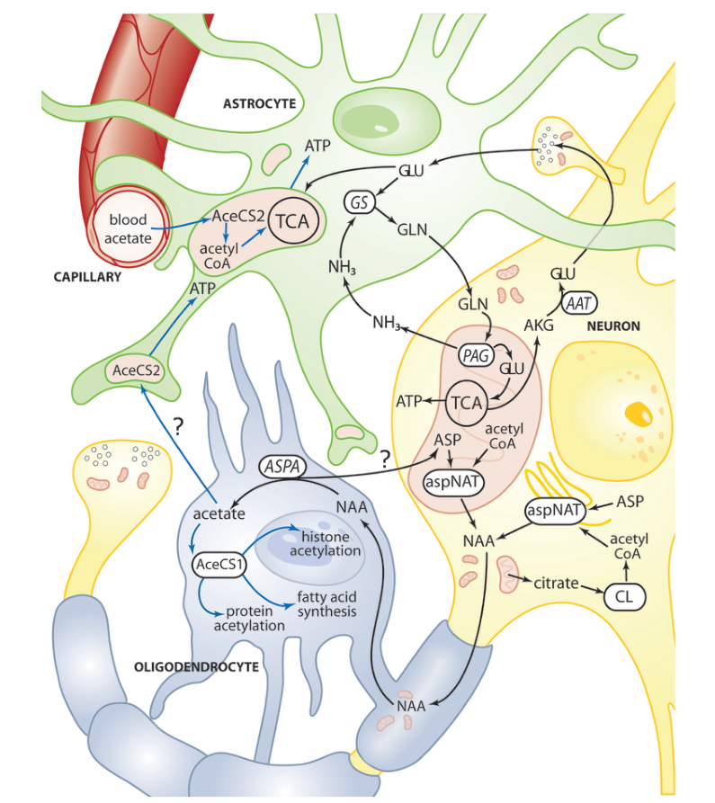

## Question

# Gene Research for Functional Annotation

## ⚠️ CRITICAL: Gene/Protein Identification Context

**BEFORE YOU BEGIN RESEARCH:** You MUST verify you are researching the CORRECT gene/protein. Gene symbols can be ambiguous, especially for less well-characterized genes from non-model organisms.

### Target Gene/Protein Identity (from UniProt):
- **UniProt Accession:** D3ZVU9
- **Protein Description:** RecName: Full=N-acetylaspartate synthetase; Short=NAA synthetase; AltName: Full=N-acetyltransferase 8-like protein; EC=2.3.1.17 {ECO:0000269|PubMed:18621030};
- **Gene Information:** Name=Nat8l;
- **Organism (full):** Rattus norvegicus (Rat).
- **Protein Family:** Belongs to the NAT8 family. .
- **Key Domains:** Acyl_CoA_acyltransferase. (IPR016181); GNAT_dom. (IPR000182); NAT_camello-type. (IPR050769); Acetyltransf_1 (PF00583)

### MANDATORY VERIFICATION STEPS:

1. **Check if the gene symbol "Nat8l" matches the protein description above**
2. **Verify the organism is correct:** Rattus norvegicus (Rat).
3. **Check if protein family/domains align with what you find in literature**
4. **If you find literature for a DIFFERENT gene with the same or similar symbol, STOP**

### If Gene Symbol is Ambiguous or You Cannot Find Relevant Literature:

**DO NOT PROCEED WITH RESEARCH ON A DIFFERENT GENE.** Instead:
- State clearly: "The gene symbol 'Nat8l' is ambiguous or literature is limited for this specific protein"
- Explain what you found (e.g., "Found extensive literature on a different gene with the same symbol in a different organism")
- Describe the protein based ONLY on the UniProt information provided above
- Suggest that the protein function can be inferred from domain/family information

### Research Target:

Please provide a comprehensive research report on the gene **Nat8l** (gene ID: Nat8l, UniProt: D3ZVU9) in rat.

The research report should be a detailed narrative explaining the function, biological processes, and localization of the gene product. Citations should be given for all claims.

You should prioritize authoritative reviews and primary scientific literature when conducting research. You can supplement
this with annotations you find in gene/protein databases, but these can be outdated or inaccurate.

We are specifically interested in the primary function of the gene - for enzymes, what reaction is catalyzed, and what is the substrate specificity? For transporters, what is the substrate? For structural proteins or adapters, what is the broader structural role? For signaling molecules, what is the role in the pathway.

We are interested in where in or outside the cell the gene product carries out its function.

We are also interested in the signaling or biochemical pathways in which the gene functions. We are less interested in broad pleiotropic effects, except where these elucidate the precise role.

Include evidence where possible. We are interested in both experimental evidence as well as inference from structure, evolution, or bioinformatic analysis. Precise studies should be prioritized over high-throughput, where available.

## Output

Question: You are an expert researcher providing comprehensive, well-cited information.

Provide detailed information focusing on:
1. Key concepts and definitions with current understanding
2. Recent developments and latest research (prioritize 2023-2024 sources)
3. Current applications and real-world implementations
4. Expert opinions and analysis from authoritative sources
5. Relevant statistics and data from recent studies

Format as a comprehensive research report with proper citations. Include URLs and publication dates where available.
Always prioritize recent, authoritative sources and provide specific citations for all major claims.

# Gene Research for Functional Annotation

## ⚠️ CRITICAL: Gene/Protein Identification Context

**BEFORE YOU BEGIN RESEARCH:** You MUST verify you are researching the CORRECT gene/protein. Gene symbols can be ambiguous, especially for less well-characterized genes from non-model organisms.

### Target Gene/Protein Identity (from UniProt):
- **UniProt Accession:** D3ZVU9
- **Protein Description:** RecName: Full=N-acetylaspartate synthetase; Short=NAA synthetase; AltName: Full=N-acetyltransferase 8-like protein; EC=2.3.1.17 {ECO:0000269|PubMed:18621030};
- **Gene Information:** Name=Nat8l;
- **Organism (full):** Rattus norvegicus (Rat).
- **Protein Family:** Belongs to the NAT8 family. .
- **Key Domains:** Acyl_CoA_acyltransferase. (IPR016181); GNAT_dom. (IPR000182); NAT_camello-type. (IPR050769); Acetyltransf_1 (PF00583)

### MANDATORY VERIFICATION STEPS:

1. **Check if the gene symbol "Nat8l" matches the protein description above**
2. **Verify the organism is correct:** Rattus norvegicus (Rat).
3. **Check if protein family/domains align with what you find in literature**
4. **If you find literature for a DIFFERENT gene with the same or similar symbol, STOP**

### If Gene Symbol is Ambiguous or You Cannot Find Relevant Literature:

**DO NOT PROCEED WITH RESEARCH ON A DIFFERENT GENE.** Instead:
- State clearly: "The gene symbol 'Nat8l' is ambiguous or literature is limited for this specific protein"
- Explain what you found (e.g., "Found extensive literature on a different gene with the same symbol in a different organism")
- Describe the protein based ONLY on the UniProt information provided above
- Suggest that the protein function can be inferred from domain/family information

### Research Target:

Please provide a comprehensive research report on the gene **Nat8l** (gene ID: Nat8l, UniProt: D3ZVU9) in rat.

The research report should be a detailed narrative explaining the function, biological processes, and localization of the gene product. Citations should be given for all claims.

You should prioritize authoritative reviews and primary scientific literature when conducting research. You can supplement
this with annotations you find in gene/protein databases, but these can be outdated or inaccurate.

We are specifically interested in the primary function of the gene - for enzymes, what reaction is catalyzed, and what is the substrate specificity? For transporters, what is the substrate? For structural proteins or adapters, what is the broader structural role? For signaling molecules, what is the role in the pathway.

We are interested in where in or outside the cell the gene product carries out its function.

We are also interested in the signaling or biochemical pathways in which the gene functions. We are less interested in broad pleiotropic effects, except where these elucidate the precise role.

Include evidence where possible. We are interested in both experimental evidence as well as inference from structure, evolution, or bioinformatic analysis. Precise studies should be prioritized over high-throughput, where available.

## Research report: **Nat8l** (UniProt D3ZVU9) in *Rattus norvegicus* — functional annotation of N-acetylaspartate synthetase (EC 2.3.1.17)

### Executive summary
*Rattus norvegicus* **Nat8l** encodes **N-acetylaspartate synthetase / aspartate N-acetyltransferase (NAT8L; Asp-NAT; EC 2.3.1.17)**, the enzyme that synthesizes **N-acetylaspartate (NAA)** from **acetyl‑CoA** and **L‑aspartate**. NAT8L is primarily associated with **neuronal NAA production**; NAA is subsequently catabolized mainly in **oligodendrocytes** by **aspartoacylase (ASPA)** to liberate **acetate** for **acetyl‑CoA-dependent lipid (myelin) synthesis** and **acetylation reactions**. NAA is also a major **in vivo biomarker** measured by **proton magnetic resonance spectroscopy (\u00b9H‑MRS)**. Recent 2024 literature expands NAA pathway relevance beyond the CNS, implicating NAA catabolism in peripheral metabolic remodeling and inflammatory regulation, while maintaining the canonical neuron–glia compartmentation model for brain NAA metabolism. (moffett2013nacetylaspartatereductionsin pages 1-2, castelli2024nacetylaspartatepromotesglycolytictooxidative pages 1-2)

### 1) Target verification (gene/protein identity)
The literature sources retrieved consistently use **Nat8l/NAT8L** to denote the **NAA biosynthetic enzyme** also named **Asp-NAT**, **aspartate N-acetyltransferase**, or **N-acetylaspartate synthetase**, with **EC 2.3.1.17**, matching the user-provided UniProt description for **D3ZVU9**. (moffett2013nacetylaspartatereductionsin pages 2-3, moffett2013nacetylaspartatereductionsin pages 1-2)

Frequently cited synonyms in rodent neurobiology include **Shati/Nat8l** (a name used in addiction/neuroplasticity literature), which is still explicitly linked to the same NAA synthetic activity. (wijayasinghe2014molecularinsightsinto pages 82-87, wijayasinghe2014molecularinsightsinto pages 108-112)

### 2) Key concepts and definitions (current understanding)
**N-acetylaspartate (NAA):** A highly abundant, neuron-enriched metabolite in the vertebrate brain; it produces the largest peak in \u00b9H‑MRS scans of healthy brain and is often interpreted as a marker of neuronal integrity or mitochondrial function. (moffett2013nacetylaspartatereductionsin pages 1-2)

**NAT8L/Asp-NAT:** The enzyme catalyzing NAA synthesis from acetyl-CoA and aspartate. This places NAT8L at the intersection of mitochondrial acetyl-CoA availability, aspartate metabolism, and intercellular acetate trafficking hypotheses relevant to myelination and acetylation homeostasis. (moffett2013nacetylaspartatereductionsin pages 1-2, castelli2024nacetylaspartatepromotesglycolytictooxidative pages 1-2)

**ASPA (aspartoacylase):** The principal NAA catabolic enzyme in the CNS (especially oligodendrocytes), hydrolyzing NAA to **acetate + aspartate**, thereby providing acetate for acetyl-CoA formation and lipid synthesis. (rae2025aspartateinthe pages 12-12, castelli2024nacetylaspartatepromotesglycolytictooxidative pages 1-2)

**Neuron–oligodendrocyte compartmentation model:** NAT8L-driven NAA synthesis is mainly neuronal, while NAA catabolism by ASPA is mainly oligodendroglial, implying intercellular transfer of NAA-derived acetate (or acetate equivalents) to support myelin lipid synthesis and other acetyl-CoA-dependent functions. (moffett2013nacetylaspartatereductionsin pages 1-2, castelli2024nacetylaspartatepromotesglycolytictooxidative pages 1-2)

A pathway schematic illustrating this compartmentation and flux logic is available from Moffett et al. (2013) (moffett2013nacetylaspartatereductionsin media afea6f8e).

### 3) Molecular function: enzymatic reaction and substrate specificity
**Reaction (primary function):** NAT8L catalyzes:

- **acetyl‑CoA + L‑aspartate → CoA + N‑acetyl‑L‑aspartate (NAA)** (moffett2013nacetylaspartatereductionsin pages 1-2, castelli2024nacetylaspartatepromotesglycolytictooxidative pages 1-2)

**Substrate specificity:** NAT8L/Asp-NAT is reported to be highly selective for **aspartate**. Enzymology summarized by Moffett et al. indicates **<3% activity** with glutamate/asparagine/glutamine compared with aspartate (stringent specificity), and also notes an approximately **~10-fold preference** for aspartate over glutamate in other reports. (moffett2013nacetylaspartatereductionsin pages 1-2, moffett2013nacetylaspartatereductionsin pages 2-3)

**Kinetics and inhibition (representative values):** Reported estimates (noting inter-study variability) include:
- **Km ~580 \u00b5M for aspartate** and **Km ~58 \u00b5M for acetyl‑CoA** (moffett2013nacetylaspartatereductionsin pages 1-2)
- End-product inhibition: **IC ~850 \u00b5M (NAA)** and **IC ~420 \u00b5M (CoA)** (moffett2013nacetylaspartatereductionsin pages 1-2)
These data support a model in which NAT8L activity can be sensitive to acetyl‑CoA supply and product accumulation. (moffett2013nacetylaspartatereductionsin pages 1-2)

### 4) Subcellular localization and molecular organization
**Localization remains somewhat mixed across experimental approaches**, but NAT8L is consistently described as a membrane-associated enzyme with **microsomal/ER-associated and mitochondrial-associated pools**. A foundational synthesis reports biochemical fractionation placing activity in **microsomal, mitochondrial, synaptosomal, and myelin fractions**, with microsomes often containing the largest proportion; other work indicates partial mitochondrial colocalization, and metabolic inhibitor evidence suggests a substantive mitochondrial contribution to NAA synthesis. (moffett2013nacetylaspartatereductionsin pages 2-3)

NAT8L may also participate in higher-order complexes: both foundational and later discussion describe apparent complex sizes around **~650–670 kDa**. (moffett2013nacetylaspartatereductionsin pages 2-3, kowalski2021thecampinducers pages 17-18)

A figure comparing NAA synthesis from acetyl-CoA/aspartate with alternative acetyl group handling (including depiction of dual synthesis sites) is available in Moffett et al. (2013) (moffett2013nacetylaspartatereductionsin media 4ec6268d).

### 5) Expression patterns and cellular context (rat-centered, with cross-mammal context where relevant)
**CNS cell-type expression:** NAT8L is widely framed as a **neuronal enzyme** responsible for NAA production, whereas ASPA is enriched in **oligodendrocytes** responsible for NAA breakdown and acetate utilization for lipid synthesis. (moffett2013nacetylaspartatereductionsin pages 1-2, castelli2024nacetylaspartatepromotesglycolytictooxidative pages 1-2)

**Rat brain regional/developmental activity:** Reported patterns include highest Asp-NAT activity in **brainstem and spinal cord**, low in retina, and absent in some peripheral tissues; activity and NAA rise during development (postnatal day **3–35** in cited developmental studies). (moffett2013nacetylaspartatereductionsin pages 2-3)

**Neuron–glia interactions in culture:** Rat primary neurons without glia can accumulate NAA, whereas glia-containing cultures stabilize NAA levels, supporting the concept that non-neuronal cells materially influence NAA handling/clearance. (kowalski2021thecampinducers pages 17-18)

**Extra-neural expression (recent emphasis):** A 2024 study/review on peripheral NAA biology notes that **brown adipocytes** can express NAT8L (and ASPA) at levels described as comparable to neurons, suggesting a broader physiological role for NAA cycling in energy expenditure and lipid metabolism. (castelli2024nacetylaspartatepromotesglycolytictooxidative pages 1-2)

### 6) Pathways and biological processes involving Nat8l/NAT8L
#### 6.1 Canonical NAA metabolic network
NAT8L synthesizes NAA in neurons, which can be:
1) hydrolyzed by ASPA to acetate + aspartate (supporting acetyl-CoA pools and lipid synthesis), and/or
2) used in production of the neuropeptide-related metabolite **NAAG** (N-acetylaspartylglutamate) via NAAG synthetase. (rae2025aspartateinthe pages 12-12, moffett2013nacetylaspartatereductionsin pages 1-2)

#### 6.2 Myelination and acetyl group economy
The neuron–oligodendrocyte metabolic relationship is frequently interpreted as an **acetate/acetyl group transfer system** supporting oligodendrocyte acetyl‑CoA-dependent processes (notably myelin lipid synthesis and protein acetylation). (moffett2013nacetylaspartatereductionsin pages 1-2, castelli2024nacetylaspartatepromotesglycolytictooxidative pages 1-2)

Independent genetic-metabolic evidence consistent with this model includes the link between **AGC1 (SLC25A12)** dysfunction, reduced NAA, and **hypomyelination**; AGC1 is part of the malate-aspartate shuttle and supports aspartate availability relevant to NAA production. (balboni2024transcriptionalandmetabolic pages 1-2)

### 7) Recent developments (prioritizing 2023–2024)
Although many mechanistic details of NAT8L enzymology and localization still rely on foundational studies, 2024 literature provides notable expansions in **where** and **how** NAA biology is interpreted:

1) **Peripheral metabolic remodeling via NAA catabolism:** In C2C12 myotubes, exogenous NAA promotes a shift toward oxidative metabolism (lipid turnover, mitochondrial biogenesis), and these effects require NAA catabolism via ASPA (i.e., an intact NAA→acetate pathway). This supports an emerging view that the NAA axis can influence acetyl‑CoA availability and acetylation states outside the CNS. (castelli2024nacetylaspartatepromotesglycolytictooxidative pages 1-2, castelli2024nacetylaspartatepromotesglycolytictooxidative pages 2-3)

2) **NAA effects on inflammatory phenotypes:** NAA has been reported to mitigate pro-inflammatory responses in microglial models through intersecting lipid metabolism and acetylation processes, supporting a hypothesis that altered NAA in neurodegeneration could contribute to chronic neuroinflammation. (castelli2024nacetylaspartatepromotesglycolytictooxidative pages 1-2)

3) **Systems-level framing in brain metabolic partitioning (review context):** Recent review literature increasingly positions NAA as a metabolite “straddling” lipid, amino-acid, and intercellular metabolic exchange in the brain, consistent with NAT8L\u2192NAA\u2192ASPA pathway relevance to compartmentalized brain metabolism. (castelli2024nacetylaspartatepromotesglycolytictooxidative pages 1-2)

### 8) Applications and real-world implementations
#### 8.1 NAA as an imaging biomarker (clinical/translation-facing)
NAA is widely used as a **non-invasive marker** in **\u00b9H‑MRS**, enabled by its high concentration and dominant resonance peak in healthy brain. (moffett2013nacetylaspartatereductionsin pages 1-2)

In experimental models, NAA is sensitive to acute injury and energetic status; for example, a rat traumatic brain injury study summarized in Moffett et al. reports NAA reductions **\u226520% within 1 minute**, paralleling ATP reductions—supporting its use as a metabolic/energetic indicator rather than a purely structural marker. (moffett2013nacetylaspartatereductionsin pages 1-2)

#### 8.2 Disease models and therapeutic concepts
In Canavan disease (ASPA deficiency), excessive NAA is implicated in leukodystrophy pathogenesis; the therapeutic logic includes **reducing NAA synthesis** upstream (i.e., targeting NAT8L/Nat8l) to compensate for impaired NAA breakdown. This is supported by disease-model work cited in the retrieved literature showing that **brain Nat8l knockdown suppresses spongiform leukodystrophy** in ASPA-deficient Canavan disease mouse models. (kowalski2021thecampinducers pages 21-22)

### 9) Expert interpretation and points of uncertainty
**Consensus points (high confidence):** NAT8L is the enzyme that synthesizes NAA from acetyl‑CoA and L‑aspartate; NAA is abundant and a major MRS biomarker; brain NAA metabolism is compartmentalized with neuronal synthesis and oligodendrocyte-enriched catabolism via ASPA. (moffett2013nacetylaspartatereductionsin pages 1-2, castelli2024nacetylaspartatepromotesglycolytictooxidative pages 1-2)

**Active/ongoing uncertainty (important for annotation):** NAT8L’s **precise subcellular localization** (ER/microsome vs mitochondria, or dual) and **native complex organization** remain debated, with evidence supporting multiple fractions and large complexes; interpretation depends on tagging, fractionation, and metabolic-inhibitor paradigms. This uncertainty should be preserved in functional annotation rather than collapsed into a single-compartment statement. (moffett2013nacetylaspartatereductionsin pages 2-3)

### Summary table
| Aspect | Current understanding | Key evidence (include key quantitative values) | Key citations (pqac IDs) | Representative recent sources (2024/2023) with URL + month/year when available |
|---|---|---|---|---|
| Identity / synonyms | Rat **Nat8l** (UniProt **D3ZVU9**) matches the literature entity **NAT8L**, also called **aspartate N-acetyltransferase (Asp-NAT)**, **AspNAT**, **N-acetylaspartate synthetase**, **ANAT**, EC **2.3.1.17**; member of the NAT8/GNAT-like acyltransferase family. | Reviews explicitly state the **2010-identified Nat8l gene encodes Asp-NAT** responsible for NAA synthesis; literature also uses **Shati/Nat8l** in rodent brain contexts. Protein reported as ~**302 aa** and ~**36 kDa** monomer on WB. | (moffett2013nacetylaspartatereductionsin pages 2-3, wijayasinghe2014molecularinsightsinto pages 82-87, kowalski2021thecampinducers pages 21-22) | Castelli et al., *Cell Death & Disease* (Sep 2024), https://doi.org/10.1038/s41419-024-07047-0; de Ruiter Swain et al., *Genes & Development* (Aug 2023), https://doi.org/10.1101/gad.350693.123 |
| Catalytic reaction and specificity | NAT8L catalyzes **acetyl-CoA + L-aspartate → N-acetylaspartate (NAA) + CoA**. It is highly selective for **aspartate** over related amino acids. | Foundational enzymology reports **<3% activity** with glutamate/asparagine/glutamine; another summary reports about **10-fold preference for aspartate over glutamate**. This matches the canonical NAA-synthesis reaction described in recent reviews. | (moffett2013nacetylaspartatereductionsin pages 1-2, moffett2013nacetylaspartatereductionsin pages 2-3, castelli2024nacetylaspartatepromotesglycolytictooxidative pages 1-2) | Castelli et al. (Sep 2024), https://doi.org/10.1038/s41419-024-07047-0; de Ruiter Swain et al. (Aug 2023), https://doi.org/10.1101/gad.350693.123 |
| Kinetic parameters and inhibition | NAT8L shows micromolar substrate affinities but published values vary by preparation/study; the enzyme is product-inhibited by **NAA** and **CoA**. | Reported **Km** values include **580 μM (aspartate)** and **58 μM (acetyl-CoA)**; other studies summarized values around **910 μM** and **169 μM**. End-product inhibition: **IC ~850 μM for NAA** and **~420 μM for CoA**. | (moffett2013nacetylaspartatereductionsin pages 1-2, moffett2013nacetylaspartatereductionsin pages 2-3) | Recent papers mostly cite older enzymology rather than re-measuring kinetics; current pathway framing in Castelli et al. (Sep 2024), https://doi.org/10.1038/s41419-024-07047-0 |
| Subcellular localization | Localization is still not fully resolved; evidence supports **membrane-associated** NAT8L with **microsomal/ER and mitochondrial-associated** pools, potentially in large complexes. | Fractionation/localization studies summarized as **microsomal, mitochondrial, synaptosomal, and myelin fractions** with microsomes often highest; some reports show **ER/microsomal localization**, others **partial mitochondrial colocalization**. Large complex size estimated at **~650–670 kDa**. Recent peripheral review language refers to NAT8L as a **mitochondrial enzyme**. | (moffett2013nacetylaspartatereductionsin pages 2-3, wijayasinghe2014molecularinsightsinto pages 82-87, wijayasinghe2014molecularinsightsinto pages 108-112, castelli2024nacetylaspartatepromotesglycolytictooxidative pages 1-2) | Castelli et al. (Sep 2024), https://doi.org/10.1038/s41419-024-07047-0; pathway schematic context in Moffett et al. (Dec 2013), https://doi.org/10.3389/fnene.2013.00011 |
| Cell-type / tissue expression | In CNS, NAT8L is **predominantly neuronal**; **ASPA** catabolism is mainly **oligodendroglial**, creating metabolic compartmentation. Rat studies also support neuronal expression with activity varying across brain regions; recent work indicates extra-neural expression in **brown adipocytes**. | Brain regional activity reported highest in **brainstem/spinal cord**, low in **retina**, absent in some peripheral tissues; developmental rise from postnatal day **3–35**. Primary-neuron cultures accumulate NAA, while glia-containing cultures stabilize it. Brown adipocytes express NAT8L and ASPA at levels described as comparable to neurons in recent review/primary synthesis. | (moffett2013nacetylaspartatereductionsin pages 2-3, kowalski2021thecampinducers pages 17-18, castelli2024nacetylaspartatepromotesglycolytictooxidative pages 1-2) | Castelli et al. (Sep 2024), https://doi.org/10.1038/s41419-024-07047-0; Balboni et al., *Cellular & Molecular Biology Letters* (Mar 2024), https://doi.org/10.1186/s11658-024-00563-z |
| Pathway role: neuron–oligodendrocyte acetate/myelin; NAAG | NAT8L initiates the **NAA pathway** in neurons. NAA is transferred to oligodendrocytes, where **ASPA hydrolyzes NAA → acetate + aspartate**; acetate supports **acetyl-CoA**, **lipid/myelin synthesis**, and acetylation reactions. NAA also feeds **NAAG** biosynthesis. | NAA concentration in brain is commonly cited around **~10 mM** and can reach **34.5 nmol/mg protein** in neurons; CSF NAA in healthy humans reported around **0.51 μmol/L**. AGC1 deficiency lowers NAA and is linked to **hypomyelination**, supporting the acetate-transfer model. | (moffett2013nacetylaspartatereductionsin pages 1-2, rae2025aspartateinthe pages 12-12, castelli2024nacetylaspartatepromotesglycolytictooxidative pages 1-2, balboni2024transcriptionalandmetabolic pages 1-2) | Balboni et al. (Mar 2024), https://doi.org/10.1186/s11658-024-00563-z; de Ruiter Swain et al. (Aug 2023), https://doi.org/10.1101/gad.350693.123 |
| Recent developments (2024 peripheral roles, immune/muscle) | 2024 studies broaden NAA/NAT8L biology beyond classical neuron–oligodendrocyte metabolism: NAA/ASPA supports **muscle oxidative remodeling** and modulates **microglial inflammatory state**; NAT8L is increasingly discussed as part of systemic metabolic signaling. | In C2C12 myotubes, exogenous NAA increased lipid turnover, mitochondrial biogenesis, and oxidative metabolism; effects required **ASPA** and were associated with increased **acetyl-lysine** signal. In microglia, NAA promoted a more surveillant/less pro-inflammatory phenotype and reduced LPS/IFNγ-induced activation via acetylation/HDAC-linked mechanisms. | (castelli2024nacetylaspartatepromotesglycolytictooxidative pages 1-2, castelli2024nacetylaspartatepromotesglycolytictooxidative pages 2-3) | Castelli et al. (Sep 2024), https://doi.org/10.1038/s41419-024-07047-0; Felice et al., *Cell Communication and Signaling* (Nov 2024), https://doi.org/10.1186/s12964-024-01947-6 |
| Applications: biomarker, disease models, therapeutic lowering of NAA | NAA is a major **1H-MRS biomarker** of neuronal integrity/mitochondrial status. NAT8L/NAA pathway manipulation is relevant in **Canavan disease** and experimental neurobiology; lowering NAA production via **Nat8l knockdown** has shown benefit in ASPA-deficient models. | NAA is among the most concentrated brain metabolites and yields the **largest healthy-brain proton MRS peak**. After rat traumatic brain injury, NAA can fall by **≥20% within 1 min**, paralleling ATP decline. Foundational disease-model work cited in reviews shows **brain Nat8l knockdown suppresses leukodystrophy** in ASPA-deficient mice. | (moffett2013nacetylaspartatereductionsin pages 1-2, kowalski2021thecampinducers pages 21-22, grønbækthygesen2024cellularandmolecular pages 27-28) | de Ruiter Swain et al. (Aug 2023), https://doi.org/10.1101/gad.350693.123; Grønbæk-Thygesen & Hartmann-Petersen, *Cell & Bioscience* (Apr 2024), https://doi.org/10.1186/s13578-024-01224-6 |

*Table: This table condenses the main functional annotation for rat Nat8l/NAT8L (UniProt D3ZVU9), including reaction chemistry, localization, pathway role, and recent 2023-2024 developments. It is useful as a high-density reference linking foundational enzymology to current applications and emerging biology.*

### Key visual evidence
A neuron–glia NAA pathway schematic showing NAT8L/Asp-NAT synthesis of NAA in neurons and ASPA-mediated catabolism in oligodendrocytes is available from Moffett et al. (2013). (moffett2013nacetylaspartatereductionsin media afea6f8e)

### References (URLs and publication dates)
- Moffett JR et al. *Frontiers in Neuroenergetics* (Dec 2013). “N-Acetylaspartate reductions in brain injury: impact on post-injury neuroenergetics, lipid synthesis, and protein acetylation.” https://doi.org/10.3389/fnene.2013.00011 (moffett2013nacetylaspartatereductionsin pages 1-2)
- Castelli S et al. *Cell Death & Disease* (Sep 2024). “N-acetylaspartate promotes glycolytic-to-oxidative fiber-type switch and resistance to atrophic stimuli in myotubes.” https://doi.org/10.1038/s41419-024-07047-0 (castelli2024nacetylaspartatepromotesglycolytictooxidative pages 1-2)
- Balboni N et al. *Cellular & Molecular Biology Letters* (Mar 2024). “Transcriptional and metabolic effects of AGC1 downregulation in mouse OPCs.” https://doi.org/10.1186/s11658-024-00563-z (balboni2024transcriptionalandmetabolic pages 1-2)
- Felice F et al. *Cell Communication and Signaling* (Nov 2024). “N-acetylaspartate mitigates pro-inflammatory responses in microglial cells…” https://doi.org/10.1186/s12964-024-01947-6 (castelli2024nacetylaspartatepromotesglycolytictooxidative pages 1-2)
- Kowalski R et al. *Antioxidants* (Sep 2021). “The cAMP Inducers Modify N-Acetylaspartate Metabolism in Wistar Rat Brain.” https://doi.org/10.3390/antiox10091404 (kowalski2021thecampinducers pages 14-17)
- Rae CD et al. *Neurochemical Research* (Jun 2025). “Aspartate in the Brain: A Review.” https://doi.org/10.1007/s11064-025-04454-3 (rae2025aspartateinthe pages 12-12)

References

1. (moffett2013nacetylaspartatereductionsin pages 1-2): John R. Moffett, Peethambaran Arun, Prasanth S. Ariyannur, and Aryan M. A. Namboodiri. N-acetylaspartate reductions in brain injury: impact on post-injury neuroenergetics, lipid synthesis, and protein acetylation. Frontiers in Neuroenergetics, Dec 2013. URL: https://doi.org/10.3389/fnene.2013.00011, doi:10.3389/fnene.2013.00011. This article has 253 citations.

2. (castelli2024nacetylaspartatepromotesglycolytictooxidative pages 1-2): Serena Castelli, Enrico Desideri, Leonardo Laureti, Federica Felice, Angela De Cristofaro, Silvia Scaricamazza, Giacomo Lazzarino, Maria Rosa Ciriolo, and Fabio Ciccarone. N-acetylaspartate promotes glycolytic-to-oxidative fiber-type switch and resistance to atrophic stimuli in myotubes. Cell Death &amp; Disease, Sep 2024. URL: https://doi.org/10.1038/s41419-024-07047-0, doi:10.1038/s41419-024-07047-0. This article has 12 citations and is from a peer-reviewed journal.

3. (moffett2013nacetylaspartatereductionsin pages 2-3): John R. Moffett, Peethambaran Arun, Prasanth S. Ariyannur, and Aryan M. A. Namboodiri. N-acetylaspartate reductions in brain injury: impact on post-injury neuroenergetics, lipid synthesis, and protein acetylation. Frontiers in Neuroenergetics, Dec 2013. URL: https://doi.org/10.3389/fnene.2013.00011, doi:10.3389/fnene.2013.00011. This article has 253 citations.

4. (wijayasinghe2014molecularinsightsinto pages 82-87): YS Wijayasinghe. Molecular insights into n-acetylaspartate metabolism in canavan disease. Unknown journal, 2014.

5. (wijayasinghe2014molecularinsightsinto pages 108-112): YS Wijayasinghe. Molecular insights into n-acetylaspartate metabolism in canavan disease. Unknown journal, 2014.

6. (rae2025aspartateinthe pages 12-12): Caroline D. Rae, Benjamin D. Rowlands, and Vladimir J Balcar. Aspartate in the brain: a review. Neurochemical Research, Jun 2025. URL: https://doi.org/10.1007/s11064-025-04454-3, doi:10.1007/s11064-025-04454-3. This article has 11 citations and is from a peer-reviewed journal.

7. (moffett2013nacetylaspartatereductionsin media afea6f8e): John R. Moffett, Peethambaran Arun, Prasanth S. Ariyannur, and Aryan M. A. Namboodiri. N-acetylaspartate reductions in brain injury: impact on post-injury neuroenergetics, lipid synthesis, and protein acetylation. Frontiers in Neuroenergetics, Dec 2013. URL: https://doi.org/10.3389/fnene.2013.00011, doi:10.3389/fnene.2013.00011. This article has 253 citations.

8. (kowalski2021thecampinducers pages 17-18): Robert Kowalski, Piotr Pikul, Krzysztof Lewandowski, Monika Sakowicz-Burkiewicz, Tadeusz Pawełczyk, and Marlena Zyśk. The camp inducers modify n-acetylaspartate metabolism in wistar rat brain. Antioxidants, 10:1404, Sep 2021. URL: https://doi.org/10.3390/antiox10091404, doi:10.3390/antiox10091404. This article has 2 citations.

9. (moffett2013nacetylaspartatereductionsin media 4ec6268d): John R. Moffett, Peethambaran Arun, Prasanth S. Ariyannur, and Aryan M. A. Namboodiri. N-acetylaspartate reductions in brain injury: impact on post-injury neuroenergetics, lipid synthesis, and protein acetylation. Frontiers in Neuroenergetics, Dec 2013. URL: https://doi.org/10.3389/fnene.2013.00011, doi:10.3389/fnene.2013.00011. This article has 253 citations.

10. (balboni2024transcriptionalandmetabolic pages 1-2): Nicola Balboni, Giorgia Babini, Eleonora Poeta, Michele Protti, Laura Mercolini, Maria Chiara Magnifico, Simona Nicole Barile, Francesca Massenzio, Antonella Pignataro, Federico M. Giorgi, Francesco Massimo Lasorsa, and Barbara Monti. Transcriptional and metabolic effects of aspartate-glutamate carrier isoform 1 (agc1) downregulation in mouse oligodendrocyte precursor cells (opcs). Cellular & Molecular Biology Letters, Mar 2024. URL: https://doi.org/10.1186/s11658-024-00563-z, doi:10.1186/s11658-024-00563-z. This article has 5 citations and is from a peer-reviewed journal.

11. (castelli2024nacetylaspartatepromotesglycolytictooxidative pages 2-3): Serena Castelli, Enrico Desideri, Leonardo Laureti, Federica Felice, Angela De Cristofaro, Silvia Scaricamazza, Giacomo Lazzarino, Maria Rosa Ciriolo, and Fabio Ciccarone. N-acetylaspartate promotes glycolytic-to-oxidative fiber-type switch and resistance to atrophic stimuli in myotubes. Cell Death &amp; Disease, Sep 2024. URL: https://doi.org/10.1038/s41419-024-07047-0, doi:10.1038/s41419-024-07047-0. This article has 12 citations and is from a peer-reviewed journal.

12. (kowalski2021thecampinducers pages 21-22): Robert Kowalski, Piotr Pikul, Krzysztof Lewandowski, Monika Sakowicz-Burkiewicz, Tadeusz Pawełczyk, and Marlena Zyśk. The camp inducers modify n-acetylaspartate metabolism in wistar rat brain. Antioxidants, 10:1404, Sep 2021. URL: https://doi.org/10.3390/antiox10091404, doi:10.3390/antiox10091404. This article has 2 citations.

13. (grønbækthygesen2024cellularandmolecular pages 27-28): Martin Grønbæk-Thygesen and Rasmus Hartmann-Petersen. Cellular and molecular mechanisms of aspartoacylase and its role in canavan disease. Cell &amp; Bioscience, Apr 2024. URL: https://doi.org/10.1186/s13578-024-01224-6, doi:10.1186/s13578-024-01224-6. This article has 13 citations and is from a peer-reviewed journal.

14. (kowalski2021thecampinducers pages 14-17): Robert Kowalski, Piotr Pikul, Krzysztof Lewandowski, Monika Sakowicz-Burkiewicz, Tadeusz Pawełczyk, and Marlena Zyśk. The camp inducers modify n-acetylaspartate metabolism in wistar rat brain. Antioxidants, 10:1404, Sep 2021. URL: https://doi.org/10.3390/antiox10091404, doi:10.3390/antiox10091404. This article has 2 citations.

## Artifacts

- [Edison artifact artifact-00](Nat8l-deep-research-falcon_artifacts/artifact-00.md)

## Citations

1. moffett2013nacetylaspartatereductionsin pages 1-2
2. moffett2013nacetylaspartatereductionsin pages 2-3
3. kowalski2021thecampinducers pages 17-18
4. castelli2024nacetylaspartatepromotesglycolytictooxidative pages 1-2
5. balboni2024transcriptionalandmetabolic pages 1-2
6. kowalski2021thecampinducers pages 21-22
7. kowalski2021thecampinducers pages 14-17
8. rae2025aspartateinthe pages 12-12
9. wijayasinghe2014molecularinsightsinto pages 82-87
10. wijayasinghe2014molecularinsightsinto pages 108-112
11. castelli2024nacetylaspartatepromotesglycolytictooxidative pages 2-3
12. https://doi.org/10.1038/s41419-024-07047-0;
13. https://doi.org/10.1101/gad.350693.123
14. https://doi.org/10.1038/s41419-024-07047-0
15. https://doi.org/10.3389/fnene.2013.00011
16. https://doi.org/10.1186/s11658-024-00563-z
17. https://doi.org/10.1186/s11658-024-00563-z;
18. https://doi.org/10.1186/s12964-024-01947-6
19. https://doi.org/10.1101/gad.350693.123;
20. https://doi.org/10.1186/s13578-024-01224-6
21. https://doi.org/10.3390/antiox10091404
22. https://doi.org/10.1007/s11064-025-04454-3
23. https://doi.org/10.3389/fnene.2013.00011,
24. https://doi.org/10.1038/s41419-024-07047-0,
25. https://doi.org/10.1007/s11064-025-04454-3,
26. https://doi.org/10.3390/antiox10091404,
27. https://doi.org/10.1186/s11658-024-00563-z,
28. https://doi.org/10.1186/s13578-024-01224-6,