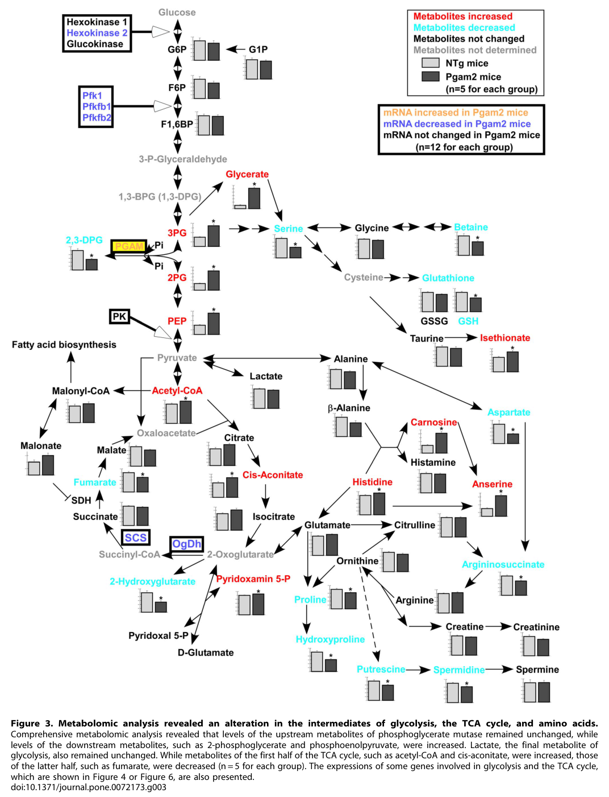

## Question

# Gene Research for Functional Annotation

## ⚠️ CRITICAL: Gene/Protein Identification Context

**BEFORE YOU BEGIN RESEARCH:** You MUST verify you are researching the CORRECT gene/protein. Gene symbols can be ambiguous, especially for less well-characterized genes from non-model organisms.

### Target Gene/Protein Identity (from UniProt):
- **UniProt Accession:** P16290
- **Protein Description:** RecName: Full=Phosphoglycerate mutase 2; EC=5.4.2.11 {ECO:0000250|UniProtKB:P18669}; EC=5.4.2.4 {ECO:0000250|UniProtKB:P18669}; AltName: Full=BPG-dependent PGAM 2; AltName: Full=Muscle-specific phosphoglycerate mutase; AltName: Full=Phosphoglycerate mutase isozyme M; Short=PGAM-M;
- **Gene Information:** Name=Pgam2 {ECO:0000312|RGD:3313};
- **Organism (full):** Rattus norvegicus (Rat).
- **Protein Family:** Belongs to the phosphoglycerate mutase family. BPG-
- **Key Domains:** His_Pase_superF_clade-1. (IPR013078); His_PPase_superfam. (IPR029033); PG/BPGM_mutase_AS. (IPR001345); Phosphogly_mut1. (IPR005952); His_Phos_1 (PF00300)

### MANDATORY VERIFICATION STEPS:

1. **Check if the gene symbol "Pgam2" matches the protein description above**
2. **Verify the organism is correct:** Rattus norvegicus (Rat).
3. **Check if protein family/domains align with what you find in literature**
4. **If you find literature for a DIFFERENT gene with the same or similar symbol, STOP**

### If Gene Symbol is Ambiguous or You Cannot Find Relevant Literature:

**DO NOT PROCEED WITH RESEARCH ON A DIFFERENT GENE.** Instead:
- State clearly: "The gene symbol 'Pgam2' is ambiguous or literature is limited for this specific protein"
- Explain what you found (e.g., "Found extensive literature on a different gene with the same symbol in a different organism")
- Describe the protein based ONLY on the UniProt information provided above
- Suggest that the protein function can be inferred from domain/family information

### Research Target:

Please provide a comprehensive research report on the gene **Pgam2** (gene ID: Pgam2, UniProt: P16290) in rat.

The research report should be a detailed narrative explaining the function, biological processes, and localization of the gene product. Citations should be given for all claims.

You should prioritize authoritative reviews and primary scientific literature when conducting research. You can supplement
this with annotations you find in gene/protein databases, but these can be outdated or inaccurate.

We are specifically interested in the primary function of the gene - for enzymes, what reaction is catalyzed, and what is the substrate specificity? For transporters, what is the substrate? For structural proteins or adapters, what is the broader structural role? For signaling molecules, what is the role in the pathway.

We are interested in where in or outside the cell the gene product carries out its function.

We are also interested in the signaling or biochemical pathways in which the gene functions. We are less interested in broad pleiotropic effects, except where these elucidate the precise role.

Include evidence where possible. We are interested in both experimental evidence as well as inference from structure, evolution, or bioinformatic analysis. Precise studies should be prioritized over high-throughput, where available.

## Output

Question: You are an expert researcher providing comprehensive, well-cited information.

Provide detailed information focusing on:
1. Key concepts and definitions with current understanding
2. Recent developments and latest research (prioritize 2023-2024 sources)
3. Current applications and real-world implementations
4. Expert opinions and analysis from authoritative sources
5. Relevant statistics and data from recent studies

Format as a comprehensive research report with proper citations. Include URLs and publication dates where available.
Always prioritize recent, authoritative sources and provide specific citations for all major claims.

# Gene Research for Functional Annotation

## ⚠️ CRITICAL: Gene/Protein Identification Context

**BEFORE YOU BEGIN RESEARCH:** You MUST verify you are researching the CORRECT gene/protein. Gene symbols can be ambiguous, especially for less well-characterized genes from non-model organisms.

### Target Gene/Protein Identity (from UniProt):
- **UniProt Accession:** P16290
- **Protein Description:** RecName: Full=Phosphoglycerate mutase 2; EC=5.4.2.11 {ECO:0000250|UniProtKB:P18669}; EC=5.4.2.4 {ECO:0000250|UniProtKB:P18669}; AltName: Full=BPG-dependent PGAM 2; AltName: Full=Muscle-specific phosphoglycerate mutase; AltName: Full=Phosphoglycerate mutase isozyme M; Short=PGAM-M;
- **Gene Information:** Name=Pgam2 {ECO:0000312|RGD:3313};
- **Organism (full):** Rattus norvegicus (Rat).
- **Protein Family:** Belongs to the phosphoglycerate mutase family. BPG-
- **Key Domains:** His_Pase_superF_clade-1. (IPR013078); His_PPase_superfam. (IPR029033); PG/BPGM_mutase_AS. (IPR001345); Phosphogly_mut1. (IPR005952); His_Phos_1 (PF00300)

### MANDATORY VERIFICATION STEPS:

1. **Check if the gene symbol "Pgam2" matches the protein description above**
2. **Verify the organism is correct:** Rattus norvegicus (Rat).
3. **Check if protein family/domains align with what you find in literature**
4. **If you find literature for a DIFFERENT gene with the same or similar symbol, STOP**

### If Gene Symbol is Ambiguous or You Cannot Find Relevant Literature:

**DO NOT PROCEED WITH RESEARCH ON A DIFFERENT GENE.** Instead:
- State clearly: "The gene symbol 'Pgam2' is ambiguous or literature is limited for this specific protein"
- Explain what you found (e.g., "Found extensive literature on a different gene with the same symbol in a different organism")
- Describe the protein based ONLY on the UniProt information provided above
- Suggest that the protein function can be inferred from domain/family information

### Research Target:

Please provide a comprehensive research report on the gene **Pgam2** (gene ID: Pgam2, UniProt: P16290) in rat.

The research report should be a detailed narrative explaining the function, biological processes, and localization of the gene product. Citations should be given for all claims.

You should prioritize authoritative reviews and primary scientific literature when conducting research. You can supplement
this with annotations you find in gene/protein databases, but these can be outdated or inaccurate.

We are specifically interested in the primary function of the gene - for enzymes, what reaction is catalyzed, and what is the substrate specificity? For transporters, what is the substrate? For structural proteins or adapters, what is the broader structural role? For signaling molecules, what is the role in the pathway.

We are interested in where in or outside the cell the gene product carries out its function.

We are also interested in the signaling or biochemical pathways in which the gene functions. We are less interested in broad pleiotropic effects, except where these elucidate the precise role.

Include evidence where possible. We are interested in both experimental evidence as well as inference from structure, evolution, or bioinformatic analysis. Precise studies should be prioritized over high-throughput, where available.

## Research report: Rat **Pgam2** (UniProt **P16290**) — functional annotation

### 0) Identity verification (critical)
The target protein is **phosphoglycerate mutase 2 (PGAM2; “PGAM-M”, muscle isoform)** encoded by **Pgam2** and is distinct from **PGAM1 (PGAM-B; brain/other tissues)**, with PGAM2 expressed mainly in **muscle and heart**. This isoform distinction and tissue bias are consistently described in the literature (kohno2025rb1controlsdifferentiation pages 8-9, okuda2013persistentoverexpressionof pages 3-4, li2021phosphoglyceratemutase2 pages 6-8). The provided evidence does not itself mention UniProt accession **P16290**; therefore, **UniProt P16290 is treated as the authoritative identifier supplied by the user**, and the curated literature cited below is restricted to PGAM2/Pgam2 (muscle isoform) evidence consistent with that identity.

### 1) Key concepts, definitions, and current understanding

#### 1.1 Core biochemical function (enzyme reaction)
PGAM2 is a **glycolytic enzyme** that catalyzes the **reversible isomerization of 3-phosphoglycerate (3-PG) to 2-phosphoglycerate (2-PG)** in the “lower” portion of glycolysis (okuda2013persistentoverexpressionof pages 3-4, sanders2015analysisandinterpretation pages 8-9). This reaction connects upstream glyceraldehyde-3-phosphate–derived intermediates to downstream formation of **phosphoenolpyruvate (PEP)** and ultimately pyruvate, thereby supporting ATP production in high-demand tissues such as skeletal muscle (okuda2013persistentoverexpressionof pages 3-4, sanders2015analysisandinterpretation pages 8-9).

#### 1.2 Mechanism and cofactor dependence (BPG-dependent phospho-histidine mutase)
The canonical PGAM-family mechanism proceeds via a **phospho-histidine catalytic cycle**, commonly summarized as involving an **active-site histidine (often referred to as His11)** and a **2,3-bisphosphoglycerate (2,3-BPG/2,3-DPG)**-dependent priming/turnover mechanism (sharif2019phosphoglyceratemutase1 pages 2-3). Consistent with a BPG-dependent PGAM, an enzymatic activity assay for Pgam in the Pgam2 overexpression study includes **2,3-diphosphoglycerate** in the incubation mixture while using **3-PGA** as substrate (okuda2013persistentoverexpressionof pages 3-4).

#### 1.3 Isoforms and tissue specificity (PGAM1 vs PGAM2)
Mammals express at least two major PGAM isoforms: **PGAM1 (Pgam1; often described as brain-predominant)** and **PGAM2 (Pgam2; muscle-specific)** (okuda2013persistentoverexpressionof pages 3-4). Tissue distribution reported in heart-focused work places **skeletal muscle** as the highest-PGAM-activity tissue and **heart** second-highest, aligning with PGAM2’s key role in striated muscle energy metabolism (okuda2013persistentoverexpressionof pages 3-4, li2021phosphoglyceratemutase2 pages 6-8).

### 2) Expression, subcellular localization, and physiological role

#### 2.1 Tissue/cell-type expression
PGAM2 is described as expressed mainly in **skeletal muscle and heart** (kohno2025rb1controlsdifferentiation pages 8-9, okuda2013persistentoverexpressionof pages 3-4, li2021phosphoglyceratemutase2 pages 6-8). In a denervation-induced muscle atrophy model, Pgam2 is among glycolysis/gluconeogenesis-related proteins reported as **consistently downregulated** during progression of atrophy, with changes described as particularly prominent in **type IIb** fibers (wang2024therapeuticpotentialof pages 10-12, wang2024therapeuticpotentialof pages 19-20).

#### 2.2 Subcellular localization
Within the provided evidence set, PGAM2 is described as a **cytosolic** enzyme in an isoform table summary (sharif2019phosphoglyceratemutase1 pages 2-3). No evidence in the retrieved texts supports stable extracellular localization for mammalian PGAM2, and the dominant functional context is **intracellular carbohydrate metabolism** (sharif2019phosphoglyceratemutase1 pages 2-3).

### 3) Pathway context and systems-level role

#### 3.1 Glycolysis and coupling to mitochondrial/TCA metabolism
Cardiac-specific Pgam2 overexpression in mice was used to probe how increasing a lower-glycolysis enzyme perturbs metabolism. A metabolomic analysis showed increased glycolytic intermediates around the PGAM step (**3PG, 2PG, PEP**) and decreased **2,3-DPG**, along with altered TCA intermediates (e.g., increased acetyl-CoA/cis-aconitate and decreased fumarate) (okuda2013persistentoverexpressionof pages 6-9, okuda2013persistentoverexpressionof media c5795417). These results support a model where changing PGAM2 abundance can reshape intermediate pools and secondarily affect mitochondrial metabolism/ROS handling, even when some upstream glycolytic markers are unchanged (okuda2013persistentoverexpressionof pages 6-9).

#### 3.2 Protein–metabolite interactomics and signaling-linked regulation (2023)
A large-scale protein–metabolite interaction mapping study (MIDAS; Science, **2023-03**) detected interactions for PGAM2 with core glycolytic intermediates (**3PG, 2,3-BPG, PEP**) and additionally found **isoform-specific interactions**: PGAM2 uniquely interacted with the phosphoinositides **PIP2 and PIP3**, suggesting potential regulation via membrane recruitment and growth-factor–linked phosphoinositide signaling (hicks2023proteinmetaboliteinteractomicsof pages 6-8). The authors note that MIDAS is an in vitro platform lacking compartmentalization and therefore not every interaction is guaranteed in vivo, but the dataset substantially recovers known regulators and identifies plausible new regulatory candidates (hicks2023proteinmetaboliteinteractomicsof pages 4-6).

### 4) Regulation of PGAM2: post-translational modifications (PTMs) and functional consequences

#### 4.1 SUMOylation links PGAM2 to myogenic differentiation (Frontiers, 2022-12)
PGAM2 is reported to undergo **SUMOylation**, with two primary SUMO acceptor lysines **K49 and K176**; mutating either lysine prevents SUMOylation (zhang2022sumoylationdeficientphosphoglyceratemutase pages 1-2, zhang2022sumoylationdeficientphosphoglyceratemutase pages 11-13). A CRISPR knock-in of **K176R** in C2C12 myogenic cells impaired **terminal myogenic differentiation** (reduced differentiation and fusion indices) and decreased glycolytic and mitochondrial readouts (PER, glycoPER, ECAR, OCR) in Seahorse assays (zhang2022sumoylationdeficientphosphoglyceratemutase pages 1-2, zhang2022sumoylationdeficientphosphoglyceratemutase pages 11-13). The same work reports that disease-linked PGAM2 missense variants (E89A, R90W; associated with GSDX in humans) show **reduced SUMOylation**, connecting a PTM mechanism to pathogenic variants (zhang2022sumoylationdeficientphosphoglyceratemutase pages 1-2, zhang2022sumoylationdeficientphosphoglyceratemutase pages 11-13).

#### 4.2 Acetylation/deacetylation at K100 controls catalytic activity (Cancer Research, 2014-07)
PGAM2 activity is strongly regulated by lysine acetylation at **K100**: acetylation at K100 inhibits PGAM2 activity, whereas deacetylation activates it (xu2014oxidativestressactivates pages 1-5, xu2014oxidativestressactivates pages 10-13). Mechanistically, oxidative stress (ROS) promotes PGAM2 deacetylation and activation through increased interaction with the NAD+-dependent deacetylase **SIRT2** (xu2014oxidativestressactivates pages 1-5). Functionally, an acetylation-mimic mutant (**K100Q**) nearly abolishes PGAM2 enzymatic activity and is associated with reduced NADPH production and reduced tumor growth in the studied context, illustrating that PTM state can strongly reshape metabolic phenotypes (xu2014oxidativestressactivates pages 1-5, xu2014oxidativestressactivates pages 10-13).

### 5) Disease/phenotype associations and real-world implementations

#### 5.1 Inherited PGAM2 deficiency (GSDX) as a mechanistic anchor
Heart-focused work cites that **human PGAM deficiency** causes **glycogen storage disease type X**, characterized by **exercise intolerance and cramps**, consistent with an essential role for PGAM2 in high-flux muscle glycolysis (okuda2013persistentoverexpressionof pages 3-4). The SUMOylation study further connects myogenic differentiation and metabolic output to PGAM2 PTM control and notes that naturally occurring disease-linked variants can have reduced SUMOylation (zhang2022sumoylationdeficientphosphoglyceratemutase pages 1-2).

#### 5.2 Cardiac energetics and stress resistance (transgenic overexpression model)
Persistent cardiac overexpression of Pgam2 (PLoS ONE, **2013-08**) increased cardiac Pgam protein levels (e.g., reported 9.7-fold and 12.6-fold in two lines) and enzymatic activity (faster NADH consumption in coupled assays), and was associated with metabolite pool changes around the PGAM step (okuda2013persistentoverexpressionof pages 5-6, okuda2013persistentoverexpressionof pages 6-9). Under pressure overload, Pgam2 overexpression reduced stress resistance and contributed to systolic dysfunction and fibrosis, linking altered glycolytic node control to heart failure susceptibility in vivo (okuda2013persistentoverexpressionof pages 9-10, okuda2013persistentoverexpressionof pages 10-13).

#### 5.3 Biomarker implementation: serum PGAM2 in heart failure
A clinical study (Open Medicine, **2021-01**) reported **elevated serum PGAM2** in heart failure patients and higher PGAM2 levels in more severe NYHA classes (NYHA IV vs II/III, p < 0.05), proposing PGAM2 as a potential HF severity biomarker (li2021phosphoglyceratemutase2 pages 6-8). The paper reports **diagnostic sensitivity ~86% and accuracy ~84%** for HF severity evaluation in their cohort, and suggests PGAM2 could be used as part of a **multi-marker** assessment (li2021phosphoglyceratemutase2 pages 6-8).

### 6) Recent developments (prioritizing 2023–2024)

#### 6.1 2023: Systematic interactomics suggests signaling-linked regulation of PGAM2
The 2023 MIDAS study provides a high-confidence, isoform-resolved interaction landscape for PGAM2, including binding to glycolytic intermediates and phosphoinositides (PIP2/PIP3), supporting the hypothesis that PGAM2 may be regulated or spatially organized in a manner coupled to growth-factor signaling and membrane lipid kinases (hicks2023proteinmetaboliteinteractomicsof pages 6-8).

#### 6.2 2024: Skeletal muscle proteomics/transcriptomics implicate PGAM2 in muscle wasting and dystrophy metabolism
In denervation-induced atrophy (Journal of Translational Medicine, **2024-11**), Pgam2 is among glycolysis/gluconeogenesis proteins that are consistently **downregulated** over atrophy progression, with the strongest emphasis in fast-glycolytic type IIb fibers (wang2024therapeuticpotentialof pages 10-12, wang2024therapeuticpotentialof pages 19-20). In facioscapulohumeral muscular dystrophy (Antioxidants, **2024-11**), proteomics indicates an **overall inhibition of glycolysis**, with **PGAM2 decreased** in both mild and severe patient groups compared with controls (statistical analysis described as ANOVA with FDR, p < 0.05) (moriggi2024muscleproteomeanalysis pages 9-12). These studies collectively position PGAM2 abundance as a readout of muscle metabolic state, and potentially as part of mechanistic remodeling in disease.

### 7) Expert synthesis and analysis (evidence-grounded)
PGAM2 is best understood as a **muscle/heart-enriched catalytic node in lower glycolysis** whose activity and abundance can influence not only local interconversion of 3-PG and 2-PG but also broader metabolic network behavior (TCA intermediates, mitochondrial respiration/ROS) when perturbed in vivo (okuda2013persistentoverexpressionof pages 6-9, okuda2013persistentoverexpressionof pages 10-13). Recent interactomics adds a plausible regulatory axis—**phosphoinositide binding**—that could connect PGAM2 to growth-factor signaling and subcellular organization, offering a modern hypothesis for tissue-specific regulation beyond transcriptional control (hicks2023proteinmetaboliteinteractomicsof pages 6-8). PTM studies provide mechanistic levers: **SUMOylation (K49/K176)** is functionally tied to myogenic differentiation and cellular bioenergetics, while **acetylation (K100)/SIRT2** forms an oxidative-stress–responsive switch that strongly gates catalytic activity (zhang2022sumoylationdeficientphosphoglyceratemutase pages 1-2, xu2014oxidativestressactivates pages 1-5).

### 8) Evidence summary table
The following table consolidates functional-annotation elements and recent findings tied to the evidence base.

| Category | Key points | Best supporting sources |
|---|---|---|
| Enzyme function | • Muscle-specific phosphoglycerate mutase isoform (PGAM-M/PGAM2) distinct from PGAM1 • Functions as a glycolytic enzyme in lower glycolysis • Active enzyme can occur in dimeric forms within mammalian PGAM system | (okuda2013persistentoverexpressionof pages 3-4, sanders2015analysisandinterpretation pages 8-9) |
| Reaction | • Catalyzes reversible interconversion of 3-phosphoglycerate and 2-phosphoglycerate • This step lies in the lower part of glycolysis • Reaction is central to carbon flow toward phosphoenolpyruvate/pyruvate formation | (okuda2013persistentoverexpressionof pages 3-4, sharif2019phosphoglyceratemutase1 pages 2-3, sanders2015analysisandinterpretation pages 8-9) |
| Cofactor/mechanism | • Belongs to the BPG-dependent PGAM mechanism • Uses a phospho-histidine catalytic mechanism, with active-site His11 highlighted in PGAM-family evidence • 2,3-bisphosphoglycerate supports catalytic turnover/assay conditions | (okuda2013persistentoverexpressionof pages 3-4, sharif2019phosphoglyceratemutase1 pages 2-3) |
| Subcellular localization | • Reported as a cytosolic enzyme in PGAM isoform summaries • No supported evidence in the provided snippets for stable extracellular or organellar localization in rat • Functional context is intracellular carbohydrate metabolism | (sharif2019phosphoglyceratemutase1 pages 2-3) |
| Tissue expression | • PGAM2 is muscle-specific/muscle-enriched relative to PGAM1 • Highest PGAM activity is in skeletal muscle, with heart second highest • PGAM2 is described as expressed mainly in heart and muscle | (kohno2025rb1controlsdifferentiation pages 8-9, okuda2013persistentoverexpressionof pages 3-4, li2021phosphoglyceratemutase2 pages 6-8) |
| Regulation / PTMs | • SUMO-1 modification occurs mainly at K49 and K176; K176 is highly conserved • Acetylation at K100 inhibits activity, while SIRT2-mediated deacetylation activates PGAM2 under oxidative stress • Ubiquitin-dependent proteolysis of PGAM and kinase-linked regulation are also reported in broader PGAM/PTM literature | (zhang2022sumoylationdeficientphosphoglyceratemutase pages 1-2, xu2014oxidativestressactivates pages 1-5, zhang2022sumoylationdeficientphosphoglyceratemutase pages 11-13, xu2014oxidativestressactivates pages 10-13) |
| Pathway context | • Core enzyme of glycolysis and energy metabolism in muscle/heart • Cardiac Pgam2 overexpression altered levels of 3PG, 2PG, PEP and 2,3-DPG, with secondary TCA-cycle changes • 2023 MIDAS interactomics found PGAM2 interactions with 3PG, 2,3-BPG, PEP and phosphoinositides (PIP2/PIP3) | (okuda2013persistentoverexpressionof pages 6-9, okuda2013persistentoverexpressionof media c5795417, hicks2023proteinmetaboliteinteractomicsof pages 6-8) |
| Disease / phenotype links | • Human PGAM2 deficiency causes glycogen storage disease type X with exercise intolerance/cramps • Disease-linked variants E89A and R90W show reduced PGAM2 sumoylation • Cardiac overexpression reduced stress resistance and worsened pressure-overload dysfunction in mice | (okuda2013persistentoverexpressionof pages 3-4, zhang2022sumoylationdeficientphosphoglyceratemutase pages 1-2, okuda2013persistentoverexpressionof pages 10-13) |
| Recent 2023-2024 findings | • 2023 Science MIDAS study identified isoform-resolved metabolite interactions for PGAM2, including phosphoinositide binding signals • 2024 denervation multi-omics study reported Pgam2 downregulation during muscle atrophy, especially in type IIb fibers • 2024 FSHD proteomics found PGAM2 decreased in both mild and severe patient muscle, consistent with glycolytic inhibition | (hicks2023proteinmetaboliteinteractomicsof pages 6-8, wang2024therapeuticpotentialof pages 10-12, moriggi2024muscleproteomeanalysis pages 9-12) |
| Real-world applications / biomarkers | • Serum PGAM2 is elevated in heart-failure patients and rises with NYHA severity • Reported diagnostic performance included 86% sensitivity and 84% accuracy for HF severity evaluation • Potential use is as part of multimarker panels rather than a standalone mechanistic readout | (li2021phosphoglyceratemutase2 pages 6-8) |

*Table: This table summarizes evidence-backed functional annotation points for rat Pgam2/PGAM2, including enzymatic role, localization, regulation, pathway context, disease links, and recent 2023-2024 findings. It is useful as a compact reference for the final research report and keeps each claim tied to available context IDs.*

### Figure evidence (metabolite changes around the PGAM step)
A key metabolomics figure from the cardiac Pgam2 overexpression study illustrates increases in **3PG, 2PG, and PEP** and a decrease in **2,3-DPG**, alongside TCA metabolite changes (okuda2013persistentoverexpressionof media c5795417).

---

## URLs and publication dates (from retrieved sources)
- Okuda et al., *PLoS ONE*, **2013-08**. https://doi.org/10.1371/journal.pone.0072173 (okuda2013persistentoverexpressionof pages 3-4)
- Zhang et al., *Frontiers in Cell and Developmental Biology*, **2022-12**. https://doi.org/10.3389/fcell.2022.1052363 (zhang2022sumoylationdeficientphosphoglyceratemutase pages 1-2)
- Hicks et al., *Science*, **2023-03**. https://doi.org/10.1126/science.abm3452 (hicks2023proteinmetaboliteinteractomicsof pages 6-8)
- Wang et al., *Journal of Translational Medicine*, **2024-11**. https://doi.org/10.1186/s12967-024-05810-7 (wang2024therapeuticpotentialof pages 10-12)
- Moriggi et al., *Antioxidants*, **2024-11**. https://doi.org/10.3390/antiox13111406 (moriggi2024muscleproteomeanalysis pages 9-12)
- Li et al., *Open Medicine*, **2021-01**. https://doi.org/10.1515/med-2021-0324 (li2021phosphoglyceratemutase2 pages 6-8)

## Limitations of the current evidence set
- Direct text-level confirmation linking **UniProt P16290** specifically to the cited rat PGAM2 literature was not retrieved in the available full-text snippets; identity is therefore anchored to the user-provided UniProt record and the consistent isoform/tissue/function descriptions in the literature (okuda2013persistentoverexpressionof pages 3-4, li2021phosphoglyceratemutase2 pages 6-8). 
- Several 2024 proteomics studies mention PGAM2 directionality and statistical frameworks but do not provide PGAM2-specific numeric fold-changes in the extracted text; those values may be present in figures/supplements not retrieved here (moriggi2024muscleproteomeanalysis pages 9-12, wang2024therapeuticpotentialof pages 10-12).

References

1. (kohno2025rb1controlsdifferentiation pages 8-9): Susumu Kohno, Nobuyuki Okahashi, Yuansong Wan, Hai Yu, Yujiro Takegami, Paing Linn, Naoko Nagatani, Shunsuke Kitajima, Teruo Kawada, Fumio Matsuda, Hiroshi Shimizu, and Chiaki Takahashi. Rb1 controls differentiation through positive regulation of phosphoglycerate mutases. Cell Death & Disease, Jul 2025. URL: https://doi.org/10.1038/s41419-025-07850-3, doi:10.1038/s41419-025-07850-3. This article has 1 citations and is from a peer-reviewed journal.

2. (okuda2013persistentoverexpressionof pages 3-4): Junji Okuda, Shinnichiro Niizuma, Tetsuo Shioi, Takao Kato, Yasutaka Inuzuka, Tsuneaki Kawashima, Yodo Tamaki, Akira Kawamoto, Yohei Tanada, Yoshitaka Iwanaga, Michiko Narazaki, Tetsuya Matsuda, Souichi Adachi, Tomoyoshi Soga, Genzou Takemura, Hiroshi Kondoh, Toru Kita, and Takeshi Kimura. Persistent overexpression of phosphoglycerate mutase, a glycolytic enzyme, modifies energy metabolism and reduces stress resistance of heart in mice. PLoS ONE, 8:e72173, Aug 2013. URL: https://doi.org/10.1371/journal.pone.0072173, doi:10.1371/journal.pone.0072173. This article has 53 citations and is from a peer-reviewed journal.

3. (li2021phosphoglyceratemutase2 pages 6-8): Min Li, Xiaoyuan Gao, Huiyun Wang, Mingli Zhang, Xiaoying Li, Shuya Wang, Shaoqin Wang, Chongfeng Cao, Ying Li, and Guohai Su. Phosphoglycerate mutase 2 is elevated in serum of patients with heart failure and correlates with the disease severity and patient’s prognosis. Open Medicine, 16:1134-1142, Jan 2021. URL: https://doi.org/10.1515/med-2021-0324, doi:10.1515/med-2021-0324. This article has 13 citations and is from a peer-reviewed journal.

4. (sanders2015analysisandinterpretation pages 8-9): Edward Sanders and Svenja Diehl. Analysis and interpretation of transcriptomic data obtained from extended warburg effect genes in patients with clear cell renal cell carcinoma. Oncoscience, 2:151-186, Feb 2015. URL: https://doi.org/10.18632/oncoscience.128, doi:10.18632/oncoscience.128. This article has 53 citations.

5. (sharif2019phosphoglyceratemutase1 pages 2-3): Farzana Sharif, Azhar Rasul, Asma Ashraf, Ghulam Hussain, Tahira Younis, Iqra Sarfraz, Muhammad Asrar Chaudhry, Shazia A. Bukhari, Xin Y. Ji, Zeliha Selamoglu, and Muhammad Ali. Phosphoglycerate mutase 1 in cancer: a promising target for diagnosis and therapy. IUBMB Life, 71:1418-1427, Oct 2019. URL: https://doi.org/10.1002/iub.2100, doi:10.1002/iub.2100. This article has 42 citations and is from a peer-reviewed journal.

6. (wang2024therapeuticpotentialof pages 10-12): Sulong Wang, Xin Yang, Kai Liu, Debin Xiong, Ainizier Yalikun, Yimurang Hamiti, and Aihemaitijiang Yusufu. Therapeutic potential of omaveloxolone in counteracting muscle atrophy post-denervation: a multi-omics approach. Journal of Translational Medicine, Nov 2024. URL: https://doi.org/10.1186/s12967-024-05810-7, doi:10.1186/s12967-024-05810-7. This article has 4 citations and is from a peer-reviewed journal.

7. (wang2024therapeuticpotentialof pages 19-20): Sulong Wang, Xin Yang, Kai Liu, Debin Xiong, Ainizier Yalikun, Yimurang Hamiti, and Aihemaitijiang Yusufu. Therapeutic potential of omaveloxolone in counteracting muscle atrophy post-denervation: a multi-omics approach. Journal of Translational Medicine, Nov 2024. URL: https://doi.org/10.1186/s12967-024-05810-7, doi:10.1186/s12967-024-05810-7. This article has 4 citations and is from a peer-reviewed journal.

8. (okuda2013persistentoverexpressionof pages 6-9): Junji Okuda, Shinnichiro Niizuma, Tetsuo Shioi, Takao Kato, Yasutaka Inuzuka, Tsuneaki Kawashima, Yodo Tamaki, Akira Kawamoto, Yohei Tanada, Yoshitaka Iwanaga, Michiko Narazaki, Tetsuya Matsuda, Souichi Adachi, Tomoyoshi Soga, Genzou Takemura, Hiroshi Kondoh, Toru Kita, and Takeshi Kimura. Persistent overexpression of phosphoglycerate mutase, a glycolytic enzyme, modifies energy metabolism and reduces stress resistance of heart in mice. PLoS ONE, 8:e72173, Aug 2013. URL: https://doi.org/10.1371/journal.pone.0072173, doi:10.1371/journal.pone.0072173. This article has 53 citations and is from a peer-reviewed journal.

9. (okuda2013persistentoverexpressionof media c5795417): Junji Okuda, Shinnichiro Niizuma, Tetsuo Shioi, Takao Kato, Yasutaka Inuzuka, Tsuneaki Kawashima, Yodo Tamaki, Akira Kawamoto, Yohei Tanada, Yoshitaka Iwanaga, Michiko Narazaki, Tetsuya Matsuda, Souichi Adachi, Tomoyoshi Soga, Genzou Takemura, Hiroshi Kondoh, Toru Kita, and Takeshi Kimura. Persistent overexpression of phosphoglycerate mutase, a glycolytic enzyme, modifies energy metabolism and reduces stress resistance of heart in mice. PLoS ONE, 8:e72173, Aug 2013. URL: https://doi.org/10.1371/journal.pone.0072173, doi:10.1371/journal.pone.0072173. This article has 53 citations and is from a peer-reviewed journal.

10. (hicks2023proteinmetaboliteinteractomicsof pages 6-8): Kevin G. Hicks, Ahmad A. Cluntun, Heidi L. Schubert, Sean R. Hackett, Jordan A. Berg, Paul G. Leonard, Mariana A. Ajalla Aleixo, Youjia Zhou, Alex J. Bott, Sonia R. Salvatore, Fei Chang, Aubrie Blevins, Paige Barta, Samantha Tilley, Aaron Leifer, Andrea Guzman, Ajak Arok, Sarah Fogarty, Jacob M. Winter, Hee-Chul Ahn, Karen N. Allen, Samuel Block, Iara A. Cardoso, Jianping Ding, Ingrid Dreveny, William C. Gasper, Quinn Ho, Atsushi Matsuura, Michael J. Palladino, Sabin Prajapati, Pengkai Sun, Kai Tittmann, Dean R. Tolan, Judith Unterlass, Andrew P. VanDemark, Matthew G. Vander Heiden, Bradley A. Webb, Cai-Hong Yun, Pengkai Zhao, Bei Wang, Francisco J. Schopfer, Christopher P. Hill, Maria Cristina Nonato, Florian L. Muller, James E. Cox, and Jared Rutter. Protein-metabolite interactomics of carbohydrate metabolism reveal regulation of lactate dehydrogenase. Science, 379:996-1003, Mar 2023. URL: https://doi.org/10.1126/science.abm3452, doi:10.1126/science.abm3452. This article has 166 citations and is from a highest quality peer-reviewed journal.

11. (hicks2023proteinmetaboliteinteractomicsof pages 4-6): Kevin G. Hicks, Ahmad A. Cluntun, Heidi L. Schubert, Sean R. Hackett, Jordan A. Berg, Paul G. Leonard, Mariana A. Ajalla Aleixo, Youjia Zhou, Alex J. Bott, Sonia R. Salvatore, Fei Chang, Aubrie Blevins, Paige Barta, Samantha Tilley, Aaron Leifer, Andrea Guzman, Ajak Arok, Sarah Fogarty, Jacob M. Winter, Hee-Chul Ahn, Karen N. Allen, Samuel Block, Iara A. Cardoso, Jianping Ding, Ingrid Dreveny, William C. Gasper, Quinn Ho, Atsushi Matsuura, Michael J. Palladino, Sabin Prajapati, Pengkai Sun, Kai Tittmann, Dean R. Tolan, Judith Unterlass, Andrew P. VanDemark, Matthew G. Vander Heiden, Bradley A. Webb, Cai-Hong Yun, Pengkai Zhao, Bei Wang, Francisco J. Schopfer, Christopher P. Hill, Maria Cristina Nonato, Florian L. Muller, James E. Cox, and Jared Rutter. Protein-metabolite interactomics of carbohydrate metabolism reveal regulation of lactate dehydrogenase. Science, 379:996-1003, Mar 2023. URL: https://doi.org/10.1126/science.abm3452, doi:10.1126/science.abm3452. This article has 166 citations and is from a highest quality peer-reviewed journal.

12. (zhang2022sumoylationdeficientphosphoglyceratemutase pages 1-2): Yi Zhang, Ilimbek Beketaev, Yanlin Ma, and Jun Wang. Sumoylation-deficient phosphoglycerate mutase 2 impairs myogenic differentiation. Frontiers in Cell and Developmental Biology, Dec 2022. URL: https://doi.org/10.3389/fcell.2022.1052363, doi:10.3389/fcell.2022.1052363. This article has 13 citations.

13. (zhang2022sumoylationdeficientphosphoglyceratemutase pages 11-13): Yi Zhang, Ilimbek Beketaev, Yanlin Ma, and Jun Wang. Sumoylation-deficient phosphoglycerate mutase 2 impairs myogenic differentiation. Frontiers in Cell and Developmental Biology, Dec 2022. URL: https://doi.org/10.3389/fcell.2022.1052363, doi:10.3389/fcell.2022.1052363. This article has 13 citations.

14. (xu2014oxidativestressactivates pages 1-5): Yanping Xu, Fulong Li, Lei Lv, Tingting Li, Xin Zhou, Chu-Xia Deng, Kun-Liang Guan, Qun-Ying Lei, and Yue Xiong. Oxidative stress activates sirt2 to deacetylate and stimulate phosphoglycerate mutase. Cancer research, 74 13:3630-42, Jul 2014. URL: https://doi.org/10.1158/0008-5472.can-13-3615, doi:10.1158/0008-5472.can-13-3615. This article has 180 citations and is from a highest quality peer-reviewed journal.

15. (xu2014oxidativestressactivates pages 10-13): Yanping Xu, Fulong Li, Lei Lv, Tingting Li, Xin Zhou, Chu-Xia Deng, Kun-Liang Guan, Qun-Ying Lei, and Yue Xiong. Oxidative stress activates sirt2 to deacetylate and stimulate phosphoglycerate mutase. Cancer research, 74 13:3630-42, Jul 2014. URL: https://doi.org/10.1158/0008-5472.can-13-3615, doi:10.1158/0008-5472.can-13-3615. This article has 180 citations and is from a highest quality peer-reviewed journal.

16. (okuda2013persistentoverexpressionof pages 5-6): Junji Okuda, Shinnichiro Niizuma, Tetsuo Shioi, Takao Kato, Yasutaka Inuzuka, Tsuneaki Kawashima, Yodo Tamaki, Akira Kawamoto, Yohei Tanada, Yoshitaka Iwanaga, Michiko Narazaki, Tetsuya Matsuda, Souichi Adachi, Tomoyoshi Soga, Genzou Takemura, Hiroshi Kondoh, Toru Kita, and Takeshi Kimura. Persistent overexpression of phosphoglycerate mutase, a glycolytic enzyme, modifies energy metabolism and reduces stress resistance of heart in mice. PLoS ONE, 8:e72173, Aug 2013. URL: https://doi.org/10.1371/journal.pone.0072173, doi:10.1371/journal.pone.0072173. This article has 53 citations and is from a peer-reviewed journal.

17. (okuda2013persistentoverexpressionof pages 9-10): Junji Okuda, Shinnichiro Niizuma, Tetsuo Shioi, Takao Kato, Yasutaka Inuzuka, Tsuneaki Kawashima, Yodo Tamaki, Akira Kawamoto, Yohei Tanada, Yoshitaka Iwanaga, Michiko Narazaki, Tetsuya Matsuda, Souichi Adachi, Tomoyoshi Soga, Genzou Takemura, Hiroshi Kondoh, Toru Kita, and Takeshi Kimura. Persistent overexpression of phosphoglycerate mutase, a glycolytic enzyme, modifies energy metabolism and reduces stress resistance of heart in mice. PLoS ONE, 8:e72173, Aug 2013. URL: https://doi.org/10.1371/journal.pone.0072173, doi:10.1371/journal.pone.0072173. This article has 53 citations and is from a peer-reviewed journal.

18. (okuda2013persistentoverexpressionof pages 10-13): Junji Okuda, Shinnichiro Niizuma, Tetsuo Shioi, Takao Kato, Yasutaka Inuzuka, Tsuneaki Kawashima, Yodo Tamaki, Akira Kawamoto, Yohei Tanada, Yoshitaka Iwanaga, Michiko Narazaki, Tetsuya Matsuda, Souichi Adachi, Tomoyoshi Soga, Genzou Takemura, Hiroshi Kondoh, Toru Kita, and Takeshi Kimura. Persistent overexpression of phosphoglycerate mutase, a glycolytic enzyme, modifies energy metabolism and reduces stress resistance of heart in mice. PLoS ONE, 8:e72173, Aug 2013. URL: https://doi.org/10.1371/journal.pone.0072173, doi:10.1371/journal.pone.0072173. This article has 53 citations and is from a peer-reviewed journal.

19. (moriggi2024muscleproteomeanalysis pages 9-12): Manuela Moriggi, Lucia Ruggiero, Enrica Torretta, Dario Zoppi, Beatrice Arosio, Evelyn Ferri, Alessandra Castegna, Chiara Fiorillo, Cecilia Gelfi, and Daniele Capitanio. Muscle proteome analysis of facioscapulohumeral dystrophy patients reveals a metabolic rewiring promoting oxidative/reductive stress contributing to the loss of muscle function. Antioxidants, 13:1406, Nov 2024. URL: https://doi.org/10.3390/antiox13111406, doi:10.3390/antiox13111406. This article has 10 citations.

## Artifacts

- [Edison artifact artifact-00](Pgam2-deep-research-falcon_artifacts/artifact-00.md)

## Citations

1. okuda2013persistentoverexpressionof pages 3-4
2. okuda2013persistentoverexpressionof pages 6-9
3. hicks2023proteinmetaboliteinteractomicsof pages 6-8
4. hicks2023proteinmetaboliteinteractomicsof pages 4-6
5. xu2014oxidativestressactivates pages 1-5
6. zhang2022sumoylationdeficientphosphoglyceratemutase pages 1-2
7. moriggi2024muscleproteomeanalysis pages 9-12
8. wang2024therapeuticpotentialof pages 10-12
9. sanders2015analysisandinterpretation pages 8-9
10. wang2024therapeuticpotentialof pages 19-20
11. zhang2022sumoylationdeficientphosphoglyceratemutase pages 11-13
12. xu2014oxidativestressactivates pages 10-13
13. okuda2013persistentoverexpressionof pages 5-6
14. okuda2013persistentoverexpressionof pages 9-10
15. okuda2013persistentoverexpressionof pages 10-13
16. https://doi.org/10.1371/journal.pone.0072173
17. https://doi.org/10.3389/fcell.2022.1052363
18. https://doi.org/10.1126/science.abm3452
19. https://doi.org/10.1186/s12967-024-05810-7
20. https://doi.org/10.3390/antiox13111406
21. https://doi.org/10.1515/med-2021-0324
22. https://doi.org/10.1038/s41419-025-07850-3,
23. https://doi.org/10.1371/journal.pone.0072173,
24. https://doi.org/10.1515/med-2021-0324,
25. https://doi.org/10.18632/oncoscience.128,
26. https://doi.org/10.1002/iub.2100,
27. https://doi.org/10.1186/s12967-024-05810-7,
28. https://doi.org/10.1126/science.abm3452,
29. https://doi.org/10.3389/fcell.2022.1052363,
30. https://doi.org/10.1158/0008-5472.can-13-3615,
31. https://doi.org/10.3390/antiox13111406,