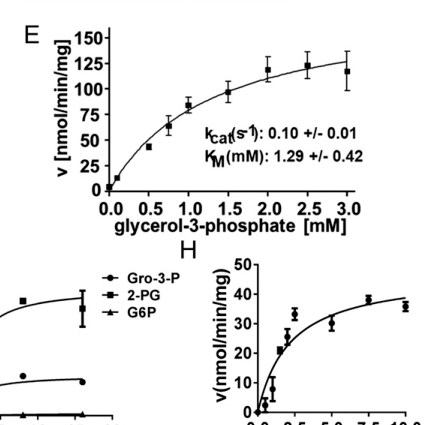

## Question

# Gene Research for Functional Annotation

## ⚠️ CRITICAL: Gene/Protein Identification Context

**BEFORE YOU BEGIN RESEARCH:** You MUST verify you are researching the CORRECT gene/protein. Gene symbols can be ambiguous, especially for less well-characterized genes from non-model organisms.

### Target Gene/Protein Identity (from UniProt):
- **UniProt Accession:** D3ZDK7
- **Protein Description:** RecName: Full=Glycerol-3-phosphate phosphatase {ECO:0000305}; Short=G3PP {ECO:0000303|PubMed:26755581}; EC=3.1.3.21 {ECO:0000269|PubMed:26755581}; AltName: Full=Aspartate-based ubiquitous Mg(2+)-dependent phosphatase {ECO:0000303|PubMed:26755581}; Short=AUM {ECO:0000303|PubMed:26755581}; EC=3.1.3.48 {ECO:0000250|UniProtKB:Q8CHP8}; AltName: Full=Phosphoglycolate phosphatase {ECO:0000303|PubMed:26755581}; Short=PGP {ECO:0000303|PubMed:26755581};
- **Gene Information:** Name=Pgp {ECO:0000312|RGD:1307773};
- **Organism (full):** Rattus norvegicus (Rat).
- **Protein Family:** Belongs to the HAD-like hydrolase superfamily.
- **Key Domains:** HAD-like_sf. (IPR036412); HAD-SF_hydro_IIA. (IPR006357); HAD_sf. (IPR023214); PGP_euk. (IPR006349); Hydrolase_6 (PF13344)

### MANDATORY VERIFICATION STEPS:

1. **Check if the gene symbol "Pgp" matches the protein description above**
2. **Verify the organism is correct:** Rattus norvegicus (Rat).
3. **Check if protein family/domains align with what you find in literature**
4. **If you find literature for a DIFFERENT gene with the same or similar symbol, STOP**

### If Gene Symbol is Ambiguous or You Cannot Find Relevant Literature:

**DO NOT PROCEED WITH RESEARCH ON A DIFFERENT GENE.** Instead:
- State clearly: "The gene symbol 'Pgp' is ambiguous or literature is limited for this specific protein"
- Explain what you found (e.g., "Found extensive literature on a different gene with the same symbol in a different organism")
- Describe the protein based ONLY on the UniProt information provided above
- Suggest that the protein function can be inferred from domain/family information

### Research Target:

Please provide a comprehensive research report on the gene **Pgp** (gene ID: Pgp, UniProt: D3ZDK7) in rat.

The research report should be a detailed narrative explaining the function, biological processes, and localization of the gene product. Citations should be given for all claims.

You should prioritize authoritative reviews and primary scientific literature when conducting research. You can supplement
this with annotations you find in gene/protein databases, but these can be outdated or inaccurate.

We are specifically interested in the primary function of the gene - for enzymes, what reaction is catalyzed, and what is the substrate specificity? For transporters, what is the substrate? For structural proteins or adapters, what is the broader structural role? For signaling molecules, what is the role in the pathway.

We are interested in where in or outside the cell the gene product carries out its function.

We are also interested in the signaling or biochemical pathways in which the gene functions. We are less interested in broad pleiotropic effects, except where these elucidate the precise role.

Include evidence where possible. We are interested in both experimental evidence as well as inference from structure, evolution, or bioinformatic analysis. Precise studies should be prioritized over high-throughput, where available.

## Output

Question: You are an expert researcher providing comprehensive, well-cited information.

Provide detailed information focusing on:
1. Key concepts and definitions with current understanding
2. Recent developments and latest research (prioritize 2023-2024 sources)
3. Current applications and real-world implementations
4. Expert opinions and analysis from authoritative sources
5. Relevant statistics and data from recent studies

Format as a comprehensive research report with proper citations. Include URLs and publication dates where available.
Always prioritize recent, authoritative sources and provide specific citations for all major claims.

# Gene Research for Functional Annotation

## ⚠️ CRITICAL: Gene/Protein Identification Context

**BEFORE YOU BEGIN RESEARCH:** You MUST verify you are researching the CORRECT gene/protein. Gene symbols can be ambiguous, especially for less well-characterized genes from non-model organisms.

### Target Gene/Protein Identity (from UniProt):
- **UniProt Accession:** D3ZDK7
- **Protein Description:** RecName: Full=Glycerol-3-phosphate phosphatase {ECO:0000305}; Short=G3PP {ECO:0000303|PubMed:26755581}; EC=3.1.3.21 {ECO:0000269|PubMed:26755581}; AltName: Full=Aspartate-based ubiquitous Mg(2+)-dependent phosphatase {ECO:0000303|PubMed:26755581}; Short=AUM {ECO:0000303|PubMed:26755581}; EC=3.1.3.48 {ECO:0000250|UniProtKB:Q8CHP8}; AltName: Full=Phosphoglycolate phosphatase {ECO:0000303|PubMed:26755581}; Short=PGP {ECO:0000303|PubMed:26755581};
- **Gene Information:** Name=Pgp {ECO:0000312|RGD:1307773};
- **Organism (full):** Rattus norvegicus (Rat).
- **Protein Family:** Belongs to the HAD-like hydrolase superfamily.
- **Key Domains:** HAD-like_sf. (IPR036412); HAD-SF_hydro_IIA. (IPR006357); HAD_sf. (IPR023214); PGP_euk. (IPR006349); Hydrolase_6 (PF13344)

### MANDATORY VERIFICATION STEPS:

1. **Check if the gene symbol "Pgp" matches the protein description above**
2. **Verify the organism is correct:** Rattus norvegicus (Rat).
3. **Check if protein family/domains align with what you find in literature**
4. **If you find literature for a DIFFERENT gene with the same or similar symbol, STOP**

### If Gene Symbol is Ambiguous or You Cannot Find Relevant Literature:

**DO NOT PROCEED WITH RESEARCH ON A DIFFERENT GENE.** Instead:
- State clearly: "The gene symbol 'Pgp' is ambiguous or literature is limited for this specific protein"
- Explain what you found (e.g., "Found extensive literature on a different gene with the same symbol in a different organism")
- Describe the protein based ONLY on the UniProt information provided above
- Suggest that the protein function can be inferred from domain/family information

### Research Target:

Please provide a comprehensive research report on the gene **Pgp** (gene ID: Pgp, UniProt: D3ZDK7) in rat.

The research report should be a detailed narrative explaining the function, biological processes, and localization of the gene product. Citations should be given for all claims.

You should prioritize authoritative reviews and primary scientific literature when conducting research. You can supplement
this with annotations you find in gene/protein databases, but these can be outdated or inaccurate.

We are specifically interested in the primary function of the gene - for enzymes, what reaction is catalyzed, and what is the substrate specificity? For transporters, what is the substrate? For structural proteins or adapters, what is the broader structural role? For signaling molecules, what is the role in the pathway.

We are interested in where in or outside the cell the gene product carries out its function.

We are also interested in the signaling or biochemical pathways in which the gene functions. We are less interested in broad pleiotropic effects, except where these elucidate the precise role.

Include evidence where possible. We are interested in both experimental evidence as well as inference from structure, evolution, or bioinformatic analysis. Precise studies should be prioritized over high-throughput, where available.

## Research Report: Functional Annotation of Rat **Pgp** (UniProt **D3ZDK7**) – Glycerol-3-phosphate phosphatase (G3PP/PGP/AUM)

### Executive summary
Rat **Pgp** (UniProt D3ZDK7) encodes a **haloacid dehalogenase (HAD)-like Mg2+-dependent phosphatase** whose best-supported physiological function in mammalian systems is as **glycerol-3-phosphate phosphatase (G3PP)**, catalyzing **glycerol-3-phosphate (Gro3P) → glycerol + inorganic phosphate** and thereby operating a **“glycerol shunt”** that diverts excess glucose carbon away from glycolysis-driven redox/ATP production and from glycerolipid synthesis. This activity has direct functional consequences in **pancreatic β-cells/islets** (modulating glucose-stimulated insulin secretion and protection from glucotoxicity) and in **hepatocytes/liver** (modulating gluconeogenesis from glycerol and systemic lipid/glucose phenotypes in rats). The most direct rat evidence is from rat β-cell/islet and hepatocyte experiments and in vivo rat liver overexpression in the primary discovery paper. (mugabo2016identificationofa pages 2-3, mugabo2016identificationofa pages 7-8, mugabo2016identificationofa pages 5-6)

---

### 1) Identity verification (critical gene/protein disambiguation)

**Confirmed target:** UniProt **D3ZDK7** (Rattus norvegicus) annotated as **Glycerol-3-phosphate phosphatase** (short: **G3PP**), also known as **phosphoglycolate phosphatase (PGP)** and **AUM** (aspartate-based ubiquitous Mg2+-dependent phosphatase). The key primary mammalian study explicitly uses the combined nomenclature **PGP/G3PP/AUM**, establishing that mammalian PGP/AUM corresponds to the enzyme that hydrolyzes Gro3P. (mugabo2016identificationofa pages 3-5, mugabo2016identificationofa pages 2-3)

**Important ambiguity avoided:** “Pgp” is often used for **P-glycoprotein (ABCB1/MDR1)** in pharmacology. None of the cited evidence here relates to ABC transporters; all evidence pertains to the **HAD-like phosphatase** enzyme consistent with UniProt’s domain/family description. (mugabo2016identificationofa pages 3-5, mugabo2016identificationofa pages 2-3)

Primary reference: Mugabo et al., *PNAS* (Jan 2016), DOI: **10.1073/pnas.1514375113**, URL: https://doi.org/10.1073/pnas.1514375113. (mugabo2016identificationofa pages 3-5)

---

### 2) Key concepts and current definitions

#### 2.1 Enzymatic function and reaction
**G3PP/PGP catalyzes hydrolysis of glycerol-3-phosphate (Gro3P) to glycerol and phosphate**, forming a mammalian **glycerol shunt** that can remove Gro3P produced from glucose metabolism. (mugabo2016identificationofa pages 2-3, mugabo2016identificationofa pages 7-8)

A key conceptual point from the primary work is that Gro3P is at the intersection of:
- **Glycolysis / redox shuttling** (Gro3P ↔ DHAP and the Gro3P shuttle),
- **Glycerolipid synthesis** (Gro3P as a backbone precursor for TAG/phospholipids), and
- **Gluconeogenesis from glycerol** (especially in liver).
By degrading Gro3P, G3PP can re-route carbon flow and influence redox and energy metabolism. (mugabo2016identificationofa pages 7-8, mugabo2016identificationofa media a9f8215f)

#### 2.2 Substrate specificity in current understanding
Although the protein historically carried the name **phosphoglycolate phosphatase**, the 2016 data argue that **Gro3P is the dominant physiological substrate** in the tested mammalian contexts because cellular Gro3P levels are in the low-mM range (near the enzyme Km), while measured **2-phosphoglycolate** levels were orders of magnitude lower. (mugabo2016identificationofa pages 6-7, mugabo2016identificationofa pages 3-5)

---

### 3) Primary biochemical evidence (reaction, kinetics, substrate profile)

#### 3.1 Kinetics for Gro3P hydrolysis
Purified mammalian enzyme shows **mM-range affinity for Gro3P**:
- Purified **murine** PGP/G3PP: **Km ≈ 1.29 ± 0.42 mM** for Gro3P, with reported **kcat ≈ 0.1 s−1** and **specific activity ≈ 100 nmol·min−1·mg−1** at saturating Gro3P. (mugabo2016identificationofa pages 3-5, mugabo2016identificationofa media 9d8000a4)
- Native **rat** G3PP activity was also measured in β-cell line (INS832/13) extracts (figure evidence). (mugabo2016identificationofa media 9d8000a4)

These kinetic measurements are visually supported by the figure panels extracted from the primary paper (kinetic curves and summary values). (mugabo2016identificationofa media 9d8000a4, mugabo2016identificationofa media ad2f7d91)

#### 3.2 Substrate specificity
A substrate panel shows markedly higher activity for Gro3P relative to several other phosphorylated metabolites (e.g., DHAP, glyceraldehyde-3-phosphate, 3-phosphoglycerate, glucose-6-phosphate), supporting functional specificity for Gro3P. (mugabo2016identificationofa pages 3-5, mugabo2016identificationofa media ad2f7d91)

#### 3.3 Physiological substrate argument using metabolite abundance
In primary rat hepatocytes (and related systems), Gro3P concentrations were estimated at **~2–4.5 mM**, while **2-phosphoglycolate** was reported as extremely low (**<0.02 mM**)—far below the enzyme Km—supporting the conclusion that **2-phosphoglycolate is unlikely to be the main physiological substrate** in these settings, even if it can be hydrolyzed in vitro at high concentrations. (mugabo2016identificationofa pages 6-7)

---

### 4) Biological roles supported by rat and mammalian experiments

#### 4.1 Pancreatic β-cells/islets (rat-relevant systems)
Key functional findings:
- **Non-lipolytic glycerol production:** G3PP provides a mechanistic explanation for **glucose-stimulated glycerol release** that is resistant to lipase inhibition (i.e., glycerol can be produced from Gro3P directly, not only from TAG lipolysis). (mugabo2016identificationofa pages 2-3)
- **Insulin secretion control:** In β-cells, **G3PP knockdown increases glucose-stimulated insulin secretion (GSIS)**, while **overexpression decreases GSIS** (with basal secretion relatively unaffected in the extracted evidence). (mugabo2016identificationofa pages 2-3, mugabo2016identificationofa pages 5-6)
- **Protection from glucotoxicity/glucolipotoxicity:** Altering G3PP affects glycerolipid intermediates and apoptosis; knockdown increases stress-related lipid accumulation and apoptosis, whereas overexpression reduces glucotoxicity and mitigates harmful effects. (mugabo2016identificationofa pages 3-5)

These results collectively support a model where G3PP limits Gro3P availability for glycerolipid synthesis and associated lipid signaling, thereby influencing β-cell stimulus–secretion coupling and stress resilience. (mugabo2016identificationofa pages 3-5, mugabo2016identificationofa pages 5-6)

#### 4.2 Hepatocytes and in vivo rat liver physiology
Key functional findings in rat hepatocytes/liver:
- **Redox/energy modulation:** Overexpression decreases DHAP and NADH-related metrics and reduces ATP formation and lactate production; knockdown has opposite effects (including increased ATP). (mugabo2016identificationofa pages 6-7)
- **Gluconeogenesis regulation:** In primary rat hepatocytes, **G3PP knockdown greatly increased gluconeogenesis** (from glycerol and from pyruvate+lactate), while **hG3PP overexpression virtually abolished gluconeogenesis** in the reported conditions. (mugabo2016identificationofa pages 5-6)
- **In vivo outcomes (rats):** **Liver overexpression** increased plasma glycerol, reduced hepatic glucose production from glycerol during a glycerol load, reduced plasma triglycerides, and reduced body weight/body weight gain (and one excerpt notes increased plasma HDL). (mugabo2016identificationofa pages 7-8, mugabo2016identificationofa pages 1-2)

These in vivo rat phenotypes support G3PP as an experimentally validated lever on systemic glucose and lipid homeostasis through the Gro3P node. (mugabo2016identificationofa pages 7-8, mugabo2016identificationofa pages 1-2)

---

### 5) Cellular localization and where the enzyme acts

**Direct localization evidence limitation:** In the retrieved evidence, explicit subcellular localization experiments (e.g., immunofluorescence, fractionation, organelle targeting sequences) were not captured. However, the demonstrated control of cytosolic metabolites (Gro3P, DHAP, lactate/pyruvate, NADH/NAD+) and direct coupling to cytosolic-facing pathways (glycolysis interface and glycerol release) strongly supports an **intracellular soluble (likely cytosolic) site of action** in the studied cells. This is an inference from pathway logic rather than a definitive localization experiment in the excerpts. (mugabo2016identificationofa pages 6-7, mugabo2016identificationofa pages 7-8)

---

### 6) Current applications and real-world implementations

#### 6.1 Translational rationale: cardiometabolic disease target concept
The rat liver overexpression experiments demonstrate that manipulating G3PP can:
- lower hepatic glucose output from glycerol,
- lower circulating triglycerides,
- reduce body weight gain,
which together provide a mechanistic basis for considering the **G3PP/Gro3P node as a cardiometabolic intervention point** (conceptually similar to targeting hepatic gluconeogenesis and lipid flux). (mugabo2016identificationofa pages 7-8, mugabo2016identificationofa pages 1-2)

#### 6.2 Cell stress modulation and “senomorphic” strategies (emerging)
A 2024 senescence study (human fibroblast systems) proposes that **scavenging G3P** via a **G3P phosphatase** can act in a **senomorphic** manner by reducing G3P/pEtN accumulation and associated lipid rewiring. While not rat Pgp-specific, it suggests an emerging application space for manipulating G3P-handling enzymes (including G3PP) in age-associated pathophysiology. (tighanimine2024ahomoeostaticswitch pages 1-2)

---

### 7) Recent developments (prioritizing 2023–2024)

#### 7.1 2024: G3P accumulation as a driver of senescence programs (indirect link to Pgp/G3PP)
Tighanimine et al. (*Nature Metabolism*, Feb 2024; DOI: **10.1038/s42255-023-00972-y**; URL: https://doi.org/10.1038/s42255-023-00972-y) describe a metabolic switch in senescence where **G3P and phosphoethanolamine (pEtN)** accumulation promotes lipid droplet/TAG accumulation and senescence-associated transcriptional changes, driven by **p53-dependent glycerol kinase activation** and **post-translational inactivation of PCYT2**. The study explicitly frames **G3P phosphatase activity** as a countermeasure that can reduce G3P accumulation and act “senomorphically.” (tighanimine2024ahomoeostaticswitch pages 1-2, tighanimine2024ahomoeostaticswitch pages 13-14)

Quantitative/statistical detail captured from the excerpt includes multiple highly significant P values (e.g., **P = 4.53×10−5**, **9.88×10−5**, **8.53×10−6**, **0.0007**) across senescence-associated readouts under PCYT2 perturbation, indicating strong experimental signal in that model. (tighanimine2024ahomoeostaticswitch pages 12-13)

#### 7.2 2023: G3PP ortholog promotes stress resistance and healthy aging via AMPK–TFEB/autophagy axis (evolutionary support)
Possik et al. (*Nature Communications*, Aug 2023; DOI: **10.1038/s41467-023-40857-y**; URL: https://doi.org/10.1038/s41467-023-40857-y) show in **C. elegans** that overexpressing the G3PP ortholog **PGPH-2** protects against glucotoxicity and extends healthspan/lifespan through a **glycogen-sensing AMPK → HLH-30/TFEB → autophagy** pathway. The excerpt reports that canonical energy ratios **AMP:ATP and ADP:ATP were not elevated**, consistent with AMPK activation via glycogen sensing rather than energy depletion. (possik2023glycerol3phosphatephosphatasepgph2 pages 7-8, possik2023glycerol3phosphatephosphatasepgph2 pages 9-9)

Although this is not rat biology, it is a high-authority 2023 mechanistic development that supports a broader view of G3P phosphatase activity as a conserved stress-buffering node. (possik2023glycerol3phosphatephosphatasepgph2 pages 8-9)

---

### 8) Expert interpretation and integrated mechanistic model

Based on the strongest rat-relevant evidence, **Pgp/PGP/G3PP is best interpreted as a metabolic “overflow valve” for Gro3P**:
1. When glucose supply is high, glycolytic flux increases DHAP and Gro3P pools.
2. **G3PP hydrolyzes Gro3P to glycerol**, which can be exported, thereby:
   - limiting Gro3P availability for **glycerolipid synthesis** (TAG/phospholipids),
   - modulating the **Gro3P shuttle** and thus cytosolic redox/ATP formation,
   - reducing substrate flow into **hepatic gluconeogenesis from glycerol**,
   - tuning β-cell signaling that couples metabolism to **insulin secretion**.
This conceptual integration is explicitly represented in the pathway schematic figure from the primary study and is consistent with the metabolomics and physiological readouts. (mugabo2016identificationofa pages 7-8, mugabo2016identificationofa media a9f8215f)

A key “expert-level” nuance from the primary mammalian data is the substrate debate: despite historical naming, the study argues that **cellular metabolite concentrations relative to enzyme Km** make Gro3P the most plausible physiological substrate in liver/β-cell contexts (Gro3P in mM range vs 2-PG in µM-to-low-mM range). (mugabo2016identificationofa pages 6-7)

---

### 9) Data highlights and statistics (from retrieved studies)

**Biochemical and metabolite values (mammalian/rat contexts):**
- Km for Gro3P (purified mammalian enzyme): **~1.29 ± 0.42 mM**. (mugabo2016identificationofa media 9d8000a4)
- Gro3P in hepatocytes: **~2–4.5 mM** (reported across glucose conditions), placing it near Km. (mugabo2016identificationofa pages 5-6)
- 2-phosphoglycolate in hepatocytes: **<0.02 mM**, far below Gro3P and below Km. (mugabo2016identificationofa pages 6-7)
- Native rat G3PP activity Vmax in INS832/13 extracts: **~47 nmol·min−1·mg−1**. (mugabo2016identificationofa pages 2-3)

**Physiology (rat):**
- In vivo rat liver overexpression: decreased **hepatic glucose production from glycerol** during a glycerol load and decreased **plasma triglycerides** and **body weight**, while increasing **plasma glycerol**. (mugabo2016identificationofa pages 7-8, mugabo2016identificationofa pages 1-2)

**2024 senescence model (human cells; indirect):** multiple senescence-related readouts with strong statistical significance (P values down to ~10−6). (tighanimine2024ahomoeostaticswitch pages 12-13)

---

### 10) Consolidated evidence table
The following table consolidates identity, enzymology, physiology, in vivo rat phenotypes, and recent (2023–2024) mechanistic developments (clearly labeled for species relevance).

| Topic | Rat Pgp/PGP/G3PP summary | Species / evidence scope | Year | DOI / URL | Citations |
|---|---|---|---|---|---|
| Verified identity / synonyms | **Target verified as rat `Pgp` (UniProt D3ZDK7)** encoding a **HAD-like hydrolase** identified in the literature as **phosphoglycolate phosphatase (PGP)**, **glycerol-3-phosphate phosphatase (G3PP)**, and **AUM**. Literature indicates mammalian PGP/AUM is the enzyme later functionally established as G3PP; this matches the UniProt description and distinguishes it from unrelated uses of “PGP/Pgp”. | Rat-focused, supported by mammalian biochemical/functional studies including rat cells and in vivo rat liver work | 2016 | 10.1073/pnas.1514375113; https://doi.org/10.1073/pnas.1514375113 | (mugabo2016identificationofa pages 3-5, mugabo2016identificationofa pages 2-3, mugabo2016identificationofa pages 7-8) |
| Catalytic reaction | **Glycerol-3-phosphate + H2O -> glycerol + phosphate**. The 2016 study describes this as a direct, effectively irreversible hydrolysis that creates a mammalian **glycerol shunt** diverting glucose-derived Gro3P away from glycerolipid synthesis and redox/energy-producing pathways. | Mammalian enzyme; rat native activity shown in INS832/13 extracts and rat hepatocyte/islet systems | 2016 | 10.1073/pnas.1514375113; https://doi.org/10.1073/pnas.1514375113 | (mugabo2016identificationofa pages 2-3, mugabo2016identificationofa pages 7-8, mugabo2016identificationofa media 9d8000a4) |
| Key kinetic parameters | Purified **murine** PGP/G3PP: **Km ~1.29 ± 0.42 mM** for Gro3P; **kcat ~0.1 s^-1**; **specific activity ~100 nmol·min^-1·mg^-1** at saturating Gro3P; reported **Vmax ~150 nmol·min^-1·mg^-1** in purified murine enzyme preparations. **Human** overexpressed PGP in extracts showed similar **Km ~1.4 mM** for Gro3P. **Native rat G3PP** activity in INS832/13 extracts reported **Vmax ~47 nmol·min^-1·mg^-1**. | Mixed mammalian systems; note species/source differences in assay format | 2016 | 10.1073/pnas.1514375113; https://doi.org/10.1073/pnas.1514375113 | (mugabo2016identificationofa pages 3-5, mugabo2016identificationofa pages 2-3, mugabo2016identificationofa media 9d8000a4) |
| Substrate specificity | Strongest physiological evidence supports **Gro3P as the primary in-cell substrate**. Activity toward **DHAP, glyceraldehyde-3-phosphate, 3-phosphoglycerate, creatine phosphate, glucose-6-phosphate, ribulose-5-phosphate** is much lower. Although mammalian PGP can hydrolyze **2-phosphoglycolate (2-PG)** in some assays and human enzyme showed affinity near **~1.5 mM**, measured cellular 2-PG in hepatocytes was **<0.02 mM**, far below Gro3P (**~2–4.5 mM**) and below enzyme Km, arguing that 2-PG is unlikely the main physiological substrate in these settings. | Mammalian biochemical and metabolomic inference; directly relevant to rat hepatocytes/beta-cell models | 2016 | 10.1073/pnas.1514375113; https://doi.org/10.1073/pnas.1514375113 | (mugabo2016identificationofa pages 6-7, mugabo2016identificationofa pages 3-5, mugabo2016identificationofa pages 2-3) |
| Pathway placement / localization inference | Functions in **intermediary carbon and glycerolipid metabolism**, controlling the **Gro3P/DHAP node**, glycerol release, glycolysis/lactate production, NADH/NAD+ balance, ATP production, lipogenesis/re-esterification, and gluconeogenesis from glycerol. The available evidence in the retrieved sources supports a **soluble intracellular/cytosolic metabolic role**; no firm subcellular localization experiment was reported in the extracted passages. | Rat and mammalian functional inference; localization evidence limited in retrieved texts | 2016 | 10.1073/pnas.1514375113; https://doi.org/10.1073/pnas.1514375113 | (mugabo2016identificationofa pages 6-7, mugabo2016identificationofa pages 7-8, mugabo2016identificationofa media 9d8000a4) |
| Beta-cell roles | In pancreatic beta cells/islets, G3PP explains **glucose-stimulated glycerol release** that is resistant to lipase inhibition, because glycerol can arise directly from Gro3P hydrolysis rather than lipolysis. **Knockdown** lowers glucose-induced glycerol release, increases Gro3P-derived glycerolipid synthesis, raises ATP/O2 consumption, and **enhances GSIS**; **overexpression** increases glycerol release, lowers GSIS, and protects against **glucotoxicity / glucolipotoxicity** and apoptosis. | Rat islets and INS832/13 beta-cell models | 2016 | 10.1073/pnas.1514375113; https://doi.org/10.1073/pnas.1514375113 | (mugabo2016identificationofa pages 3-5, mugabo2016identificationofa pages 2-3, mugabo2016identificationofa pages 5-6) |
| Hepatocyte roles | In hepatocytes, G3PP lowers Gro3P and shifts flux away from glycolysis-linked NADH generation and glycerolipid synthesis. **Overexpression** decreases DHAP, ATP formation, lactate production, and cellular NADH/NAD+ pools; **knockdown** has opposite effects and increases ATP. In primary rat hepatocytes, knockdown markedly **increases gluconeogenesis** from glycerol and from pyruvate+lactate, whereas hG3PP overexpression can **virtually abolish gluconeogenesis** in the reported experiments. | Primary rat hepatocytes and in vivo rat liver overexpression | 2016 | 10.1073/pnas.1514375113; https://doi.org/10.1073/pnas.1514375113 | (mugabo2016identificationofa pages 6-7, mugabo2016identificationofa pages 7-8, mugabo2016identificationofa pages 5-6) |
| Tissue expression highlights | Reported as **widely expressed** with relatively **high expression in testis, heart, skeletal muscle, and islets**, and **lower expression in liver, kidney, intestine, and visceral white adipose tissue**. Expression is nutritionally regulated, with differences across adipose depots and feeding states. | Mammalian expression profiling, including rat-relevant physiology context | 2016 | 10.1073/pnas.1514375113; https://doi.org/10.1073/pnas.1514375113 | (mugabo2016identificationofa pages 3-5, mugabo2016identificationofa pages 1-2) |
| In vivo rat phenotypes after liver overexpression | Adenoviral liver overexpression in rats increased **plasma glycerol**, reduced **hepatic glucose production from glycerol** during glycerol load testing, lowered **plasma triglycerides**, reduced **body weight gain/body weight**, and one excerpt also notes increased **plasma HDL**. These findings support G3PP as a modulator of whole-body glucose and lipid homeostasis. | **Direct rat in vivo evidence** | 2016 | 10.1073/pnas.1514375113; https://doi.org/10.1073/pnas.1514375113 | (mugabo2016identificationofa pages 6-7, mugabo2016identificationofa pages 7-8, mugabo2016identificationofa pages 1-2) |
| Figure-derived highlights | Key figure panels reported in the retrieved image context: **Fig. 1E** shows Gro3P kinetics with **Km 1.29 ± 0.42 mM** for purified murine PGP; **Fig. 1F** shows higher activity for Gro3P than related phosphometabolites; **Fig. 1G** compares Gro3P, 2-PG, and G-6-P kinetics for human G3PP; **Fig. 2H** schematizes the glycerol shunt and its integration with glycerolipid/fatty-acid cycles. | Figure/image extraction from primary paper | 2016 | 10.1073/pnas.1514375113; https://doi.org/10.1073/pnas.1514375113 | (mugabo2016identificationofa media 9d8000a4, mugabo2016identificationofa media ad2f7d91, mugabo2016identificationofa media a9f8215f) |
| 2024 contextual development: senescence link (**indirect / not rat-specific**) | A 2024 **Nature Metabolism** study linked **G3P accumulation** to a senescence program in human fibroblasts. The paper states that a **G3P phosphatase** can act **senomorphically** by scavenging G3P, reducing accumulation of G3P/pEtN and associated lipid rewiring. This supports the concept that mammalian G3PP may buffer excessive G3P beyond classic beta-cell/hepatocyte physiology, but this is **not direct rat Pgp evidence**. | Human-cell mechanistic context, indirect for rat Pgp | 2024 | 10.1038/s42255-023-00972-y; https://doi.org/10.1038/s42255-023-00972-y | (tighanimine2024ahomoeostaticswitch pages 13-14, tighanimine2024ahomoeostaticswitch pages 12-13, tighanimine2024ahomoeostaticswitch pages 1-2) |
| 2023 contextual development: aging/metabolic-stress axis (**indirect / non-rat**) | In **C. elegans**, overexpression of the G3PP ortholog **PGPH-2** lowered Gro3P/glycogen/fat and promoted healthy aging through an **AMPK -> HLH-30/TFEB -> autophagy** axis. Benefits required AMPK, HLH-30, and autophagy genes, and occurred without increased AMP:ATP, suggesting glycogen-sensing rather than energy depletion. This is **evolutionary/contextual support**, not direct evidence for rat Pgp. | Worm ortholog study, indirect for rat | 2023 | 10.1038/s41467-023-40857-y; https://doi.org/10.1038/s41467-023-40857-y | (possik2023glycerol3phosphatephosphatasepgph2 pages 8-9, possik2023glycerol3phosphatephosphatasepgph2 pages 7-8, possik2023glycerol3phosphatephosphatasepgph2 pages 9-9, possik2023glycerol3phosphatephosphatasepgph2 pages 10-11) |

*Table: This table consolidates verified identity, enzymology, physiological roles, expression, and in vivo rat phenotypes for UniProt D3ZDK7 (Pgp/PGP/G3PP). It also flags 2023-2024 developments that are mechanistically relevant but indirect or non-rat-specific.*

---

### 11) Visual evidence (key extracted figure panels)
- Enzyme kinetics and substrate specificity panels for mammalian PGP/G3PP (including Gro3P Km) and a pathway schematic integrating the glycerol shunt are captured from the primary 2016 study figures. (mugabo2016identificationofa media 9d8000a4, mugabo2016identificationofa media ad2f7d91, mugabo2016identificationofa media a9f8215f)

---

### 12) Limitations of the current evidence base (for this tool run)
- **Subcellular localization:** No direct localization experiment (e.g., microscopy/fractionation) was retrieved in the evidence excerpts; localization is inferred from metabolic function and should be verified with targeted localization studies. (mugabo2016identificationofa pages 6-7, mugabo2016identificationofa pages 7-8)
- **2023–2024 mammalian rat-specific updates:** The most recent retrieved mechanistic work is in human senescence models and C. elegans aging biology; these provide high-confidence conceptual links but are not direct rat Pgp experiments. (tighanimine2024ahomoeostaticswitch pages 1-2, possik2023glycerol3phosphatephosphatasepgph2 pages 7-8)

---

### Key sources (publication date, URL)
- Mugabo Y. et al. **(Jan 2016)**. *PNAS*. “Identification of a mammalian glycerol-3-phosphate phosphatase: Role in metabolism and signaling in pancreatic β-cells and hepatocytes.” https://doi.org/10.1073/pnas.1514375113 (mugabo2016identificationofa pages 3-5)
- Tighanimine K. et al. **(Feb 2024)**. *Nature Metabolism*. “A homoeostatic switch causing glycerol-3-phosphate and phosphoethanolamine accumulation triggers senescence by rewiring lipid metabolism.” https://doi.org/10.1038/s42255-023-00972-y (tighanimine2024ahomoeostaticswitch pages 1-2)
- Possik E. et al. **(Aug 2023)**. *Nature Communications*. “Glycerol 3-phosphate phosphatase/PGPH-2 counters metabolic stress and promotes healthy aging…” https://doi.org/10.1038/s41467-023-40857-y (possik2023glycerol3phosphatephosphatasepgph2 pages 8-9)

References

1. (mugabo2016identificationofa pages 2-3): Yves Mugabo, Shangang Zhao, Annegrit Seifried, Sari Gezzar, Anfal Al-Mass, Dongwei Zhang, Julien Lamontagne, Camille Attane, Pegah Poursharifi, José Iglesias, Erik Joly, Marie-Line Peyot, Antje Gohla, S. R. Murthy Madiraju, and Marc Prentki. Identification of a mammalian glycerol-3-phosphate phosphatase: role in metabolism and signaling in pancreatic β-cells and hepatocytes. Proceedings of the National Academy of Sciences, 113:E430-E439, Jan 2016. URL: https://doi.org/10.1073/pnas.1514375113, doi:10.1073/pnas.1514375113. This article has 160 citations and is from a highest quality peer-reviewed journal.

2. (mugabo2016identificationofa pages 7-8): Yves Mugabo, Shangang Zhao, Annegrit Seifried, Sari Gezzar, Anfal Al-Mass, Dongwei Zhang, Julien Lamontagne, Camille Attane, Pegah Poursharifi, José Iglesias, Erik Joly, Marie-Line Peyot, Antje Gohla, S. R. Murthy Madiraju, and Marc Prentki. Identification of a mammalian glycerol-3-phosphate phosphatase: role in metabolism and signaling in pancreatic β-cells and hepatocytes. Proceedings of the National Academy of Sciences, 113:E430-E439, Jan 2016. URL: https://doi.org/10.1073/pnas.1514375113, doi:10.1073/pnas.1514375113. This article has 160 citations and is from a highest quality peer-reviewed journal.

3. (mugabo2016identificationofa pages 5-6): Yves Mugabo, Shangang Zhao, Annegrit Seifried, Sari Gezzar, Anfal Al-Mass, Dongwei Zhang, Julien Lamontagne, Camille Attane, Pegah Poursharifi, José Iglesias, Erik Joly, Marie-Line Peyot, Antje Gohla, S. R. Murthy Madiraju, and Marc Prentki. Identification of a mammalian glycerol-3-phosphate phosphatase: role in metabolism and signaling in pancreatic β-cells and hepatocytes. Proceedings of the National Academy of Sciences, 113:E430-E439, Jan 2016. URL: https://doi.org/10.1073/pnas.1514375113, doi:10.1073/pnas.1514375113. This article has 160 citations and is from a highest quality peer-reviewed journal.

4. (mugabo2016identificationofa pages 3-5): Yves Mugabo, Shangang Zhao, Annegrit Seifried, Sari Gezzar, Anfal Al-Mass, Dongwei Zhang, Julien Lamontagne, Camille Attane, Pegah Poursharifi, José Iglesias, Erik Joly, Marie-Line Peyot, Antje Gohla, S. R. Murthy Madiraju, and Marc Prentki. Identification of a mammalian glycerol-3-phosphate phosphatase: role in metabolism and signaling in pancreatic β-cells and hepatocytes. Proceedings of the National Academy of Sciences, 113:E430-E439, Jan 2016. URL: https://doi.org/10.1073/pnas.1514375113, doi:10.1073/pnas.1514375113. This article has 160 citations and is from a highest quality peer-reviewed journal.

5. (mugabo2016identificationofa media a9f8215f): Yves Mugabo, Shangang Zhao, Annegrit Seifried, Sari Gezzar, Anfal Al-Mass, Dongwei Zhang, Julien Lamontagne, Camille Attane, Pegah Poursharifi, José Iglesias, Erik Joly, Marie-Line Peyot, Antje Gohla, S. R. Murthy Madiraju, and Marc Prentki. Identification of a mammalian glycerol-3-phosphate phosphatase: role in metabolism and signaling in pancreatic β-cells and hepatocytes. Proceedings of the National Academy of Sciences, 113:E430-E439, Jan 2016. URL: https://doi.org/10.1073/pnas.1514375113, doi:10.1073/pnas.1514375113. This article has 160 citations and is from a highest quality peer-reviewed journal.

6. (mugabo2016identificationofa pages 6-7): Yves Mugabo, Shangang Zhao, Annegrit Seifried, Sari Gezzar, Anfal Al-Mass, Dongwei Zhang, Julien Lamontagne, Camille Attane, Pegah Poursharifi, José Iglesias, Erik Joly, Marie-Line Peyot, Antje Gohla, S. R. Murthy Madiraju, and Marc Prentki. Identification of a mammalian glycerol-3-phosphate phosphatase: role in metabolism and signaling in pancreatic β-cells and hepatocytes. Proceedings of the National Academy of Sciences, 113:E430-E439, Jan 2016. URL: https://doi.org/10.1073/pnas.1514375113, doi:10.1073/pnas.1514375113. This article has 160 citations and is from a highest quality peer-reviewed journal.

7. (mugabo2016identificationofa media 9d8000a4): Yves Mugabo, Shangang Zhao, Annegrit Seifried, Sari Gezzar, Anfal Al-Mass, Dongwei Zhang, Julien Lamontagne, Camille Attane, Pegah Poursharifi, José Iglesias, Erik Joly, Marie-Line Peyot, Antje Gohla, S. R. Murthy Madiraju, and Marc Prentki. Identification of a mammalian glycerol-3-phosphate phosphatase: role in metabolism and signaling in pancreatic β-cells and hepatocytes. Proceedings of the National Academy of Sciences, 113:E430-E439, Jan 2016. URL: https://doi.org/10.1073/pnas.1514375113, doi:10.1073/pnas.1514375113. This article has 160 citations and is from a highest quality peer-reviewed journal.

8. (mugabo2016identificationofa media ad2f7d91): Yves Mugabo, Shangang Zhao, Annegrit Seifried, Sari Gezzar, Anfal Al-Mass, Dongwei Zhang, Julien Lamontagne, Camille Attane, Pegah Poursharifi, José Iglesias, Erik Joly, Marie-Line Peyot, Antje Gohla, S. R. Murthy Madiraju, and Marc Prentki. Identification of a mammalian glycerol-3-phosphate phosphatase: role in metabolism and signaling in pancreatic β-cells and hepatocytes. Proceedings of the National Academy of Sciences, 113:E430-E439, Jan 2016. URL: https://doi.org/10.1073/pnas.1514375113, doi:10.1073/pnas.1514375113. This article has 160 citations and is from a highest quality peer-reviewed journal.

9. (mugabo2016identificationofa pages 1-2): Yves Mugabo, Shangang Zhao, Annegrit Seifried, Sari Gezzar, Anfal Al-Mass, Dongwei Zhang, Julien Lamontagne, Camille Attane, Pegah Poursharifi, José Iglesias, Erik Joly, Marie-Line Peyot, Antje Gohla, S. R. Murthy Madiraju, and Marc Prentki. Identification of a mammalian glycerol-3-phosphate phosphatase: role in metabolism and signaling in pancreatic β-cells and hepatocytes. Proceedings of the National Academy of Sciences, 113:E430-E439, Jan 2016. URL: https://doi.org/10.1073/pnas.1514375113, doi:10.1073/pnas.1514375113. This article has 160 citations and is from a highest quality peer-reviewed journal.

10. (tighanimine2024ahomoeostaticswitch pages 1-2): Khaled Tighanimine, José Américo Nabuco Leva Ferreira Freitas, Ivan Nemazanyy, Alexia Bankolé, Delphine Benarroch-Popivker, Susanne Brodesser, Gregory Doré, Lucas Robinson, Paule Benit, Sophia Ladraa, Yara Bou Saada, Bertrand Friguet, Philippe Bertolino, David Bernard, Guillaume Canaud, Pierre Rustin, Eric Gilson, Oliver Bischof, Stefano Fumagalli, and Mario Pende. A homoeostatic switch causing glycerol-3-phosphate and phosphoethanolamine accumulation triggers senescence by rewiring lipid metabolism. Nature Metabolism, 6:323-342, Feb 2024. URL: https://doi.org/10.1038/s42255-023-00972-y, doi:10.1038/s42255-023-00972-y. This article has 68 citations and is from a domain leading peer-reviewed journal.

11. (tighanimine2024ahomoeostaticswitch pages 13-14): Khaled Tighanimine, José Américo Nabuco Leva Ferreira Freitas, Ivan Nemazanyy, Alexia Bankolé, Delphine Benarroch-Popivker, Susanne Brodesser, Gregory Doré, Lucas Robinson, Paule Benit, Sophia Ladraa, Yara Bou Saada, Bertrand Friguet, Philippe Bertolino, David Bernard, Guillaume Canaud, Pierre Rustin, Eric Gilson, Oliver Bischof, Stefano Fumagalli, and Mario Pende. A homoeostatic switch causing glycerol-3-phosphate and phosphoethanolamine accumulation triggers senescence by rewiring lipid metabolism. Nature Metabolism, 6:323-342, Feb 2024. URL: https://doi.org/10.1038/s42255-023-00972-y, doi:10.1038/s42255-023-00972-y. This article has 68 citations and is from a domain leading peer-reviewed journal.

12. (tighanimine2024ahomoeostaticswitch pages 12-13): Khaled Tighanimine, José Américo Nabuco Leva Ferreira Freitas, Ivan Nemazanyy, Alexia Bankolé, Delphine Benarroch-Popivker, Susanne Brodesser, Gregory Doré, Lucas Robinson, Paule Benit, Sophia Ladraa, Yara Bou Saada, Bertrand Friguet, Philippe Bertolino, David Bernard, Guillaume Canaud, Pierre Rustin, Eric Gilson, Oliver Bischof, Stefano Fumagalli, and Mario Pende. A homoeostatic switch causing glycerol-3-phosphate and phosphoethanolamine accumulation triggers senescence by rewiring lipid metabolism. Nature Metabolism, 6:323-342, Feb 2024. URL: https://doi.org/10.1038/s42255-023-00972-y, doi:10.1038/s42255-023-00972-y. This article has 68 citations and is from a domain leading peer-reviewed journal.

13. (possik2023glycerol3phosphatephosphatasepgph2 pages 7-8): Elite Possik, Laura-Lee Klein, Perla Sanjab, Ruyuan Zhu, Laurence Côté, Ying Bai, Dongwei Zhang, Howard Sun, Anfal Al-Mass, Abel Oppong, Rasheed Ahmad, Alex Parker, S.R. Murthy Madiraju, Fahd Al-Mulla, and Marc Prentki. Glycerol 3-phosphate phosphatase/pgph-2 counters metabolic stress and promotes healthy aging via a glycogen sensing-ampk-hlh-30-autophagy axis in c. elegans. Nature Communications, Aug 2023. URL: https://doi.org/10.1038/s41467-023-40857-y, doi:10.1038/s41467-023-40857-y. This article has 30 citations and is from a highest quality peer-reviewed journal.

14. (possik2023glycerol3phosphatephosphatasepgph2 pages 9-9): Elite Possik, Laura-Lee Klein, Perla Sanjab, Ruyuan Zhu, Laurence Côté, Ying Bai, Dongwei Zhang, Howard Sun, Anfal Al-Mass, Abel Oppong, Rasheed Ahmad, Alex Parker, S.R. Murthy Madiraju, Fahd Al-Mulla, and Marc Prentki. Glycerol 3-phosphate phosphatase/pgph-2 counters metabolic stress and promotes healthy aging via a glycogen sensing-ampk-hlh-30-autophagy axis in c. elegans. Nature Communications, Aug 2023. URL: https://doi.org/10.1038/s41467-023-40857-y, doi:10.1038/s41467-023-40857-y. This article has 30 citations and is from a highest quality peer-reviewed journal.

15. (possik2023glycerol3phosphatephosphatasepgph2 pages 8-9): Elite Possik, Laura-Lee Klein, Perla Sanjab, Ruyuan Zhu, Laurence Côté, Ying Bai, Dongwei Zhang, Howard Sun, Anfal Al-Mass, Abel Oppong, Rasheed Ahmad, Alex Parker, S.R. Murthy Madiraju, Fahd Al-Mulla, and Marc Prentki. Glycerol 3-phosphate phosphatase/pgph-2 counters metabolic stress and promotes healthy aging via a glycogen sensing-ampk-hlh-30-autophagy axis in c. elegans. Nature Communications, Aug 2023. URL: https://doi.org/10.1038/s41467-023-40857-y, doi:10.1038/s41467-023-40857-y. This article has 30 citations and is from a highest quality peer-reviewed journal.

16. (possik2023glycerol3phosphatephosphatasepgph2 pages 10-11): Elite Possik, Laura-Lee Klein, Perla Sanjab, Ruyuan Zhu, Laurence Côté, Ying Bai, Dongwei Zhang, Howard Sun, Anfal Al-Mass, Abel Oppong, Rasheed Ahmad, Alex Parker, S.R. Murthy Madiraju, Fahd Al-Mulla, and Marc Prentki. Glycerol 3-phosphate phosphatase/pgph-2 counters metabolic stress and promotes healthy aging via a glycogen sensing-ampk-hlh-30-autophagy axis in c. elegans. Nature Communications, Aug 2023. URL: https://doi.org/10.1038/s41467-023-40857-y, doi:10.1038/s41467-023-40857-y. This article has 30 citations and is from a highest quality peer-reviewed journal.

## Artifacts

- [Edison artifact artifact-00](Pgp-deep-research-falcon_artifacts/artifact-00.md)

## Citations

1. mugabo2016identificationofa pages 3-5
2. mugabo2016identificationofa pages 6-7
3. mugabo2016identificationofa pages 2-3
4. mugabo2016identificationofa pages 5-6
5. tighanimine2024ahomoeostaticswitch pages 1-2
6. tighanimine2024ahomoeostaticswitch pages 12-13
7. mugabo2016identificationofa pages 7-8
8. mugabo2016identificationofa pages 1-2
9. tighanimine2024ahomoeostaticswitch pages 13-14
10. https://doi.org/10.1073/pnas.1514375113.
11. https://doi.org/10.1038/s42255-023-00972-y
12. https://doi.org/10.1038/s41467-023-40857-y
13. https://doi.org/10.1073/pnas.1514375113
14. https://doi.org/10.1073/pnas.1514375113,
15. https://doi.org/10.1038/s42255-023-00972-y,
16. https://doi.org/10.1038/s41467-023-40857-y,