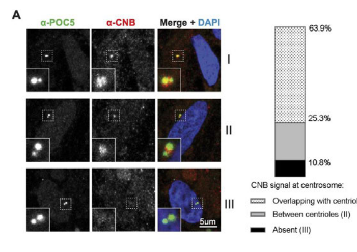

## Question

# Gene Research for Functional Annotation

## ⚠️ CRITICAL: Gene/Protein Identification Context

**BEFORE YOU BEGIN RESEARCH:** You MUST verify you are researching the CORRECT gene/protein. Gene symbols can be ambiguous, especially for less well-characterized genes from non-model organisms.

### Target Gene/Protein Identity (from UniProt):
- **UniProt Accession:** P63100
- **Protein Description:** RecName: Full=Calcineurin subunit B type 1; AltName: Full=Protein phosphatase 2B regulatory subunit 1; AltName: Full=Protein phosphatase 3 regulatory subunit B alpha isoform 1;
- **Gene Information:** Name=Ppp3r1; Synonyms=Cna2, Cnb;
- **Organism (full):** Rattus norvegicus (Rat).
- **Protein Family:** Belongs to the calcineurin regulatory subunit family.
- **Key Domains:** EF-hand-dom_pair. (IPR011992); EF_Hand_1_Ca_BS. (IPR018247); EF_hand_dom. (IPR002048); EF-hand_7 (PF13499)

### MANDATORY VERIFICATION STEPS:

1. **Check if the gene symbol "Ppp3r1" matches the protein description above**
2. **Verify the organism is correct:** Rattus norvegicus (Rat).
3. **Check if protein family/domains align with what you find in literature**
4. **If you find literature for a DIFFERENT gene with the same or similar symbol, STOP**

### If Gene Symbol is Ambiguous or You Cannot Find Relevant Literature:

**DO NOT PROCEED WITH RESEARCH ON A DIFFERENT GENE.** Instead:
- State clearly: "The gene symbol 'Ppp3r1' is ambiguous or literature is limited for this specific protein"
- Explain what you found (e.g., "Found extensive literature on a different gene with the same symbol in a different organism")
- Describe the protein based ONLY on the UniProt information provided above
- Suggest that the protein function can be inferred from domain/family information

### Research Target:

Please provide a comprehensive research report on the gene **Ppp3r1** (gene ID: Ppp3r1, UniProt: P63100) in rat.

The research report should be a detailed narrative explaining the function, biological processes, and localization of the gene product. Citations should be given for all claims.

You should prioritize authoritative reviews and primary scientific literature when conducting research. You can supplement
this with annotations you find in gene/protein databases, but these can be outdated or inaccurate.

We are specifically interested in the primary function of the gene - for enzymes, what reaction is catalyzed, and what is the substrate specificity? For transporters, what is the substrate? For structural proteins or adapters, what is the broader structural role? For signaling molecules, what is the role in the pathway.

We are interested in where in or outside the cell the gene product carries out its function.

We are also interested in the signaling or biochemical pathways in which the gene functions. We are less interested in broad pleiotropic effects, except where these elucidate the precise role.

Include evidence where possible. We are interested in both experimental evidence as well as inference from structure, evolution, or bioinformatic analysis. Precise studies should be prioritized over high-throughput, where available.

## Output

Question: You are an expert researcher providing comprehensive, well-cited information.

Provide detailed information focusing on:
1. Key concepts and definitions with current understanding
2. Recent developments and latest research (prioritize 2023-2024 sources)
3. Current applications and real-world implementations
4. Expert opinions and analysis from authoritative sources
5. Relevant statistics and data from recent studies

Format as a comprehensive research report with proper citations. Include URLs and publication dates where available.
Always prioritize recent, authoritative sources and provide specific citations for all major claims.

# Gene Research for Functional Annotation

## ⚠️ CRITICAL: Gene/Protein Identification Context

**BEFORE YOU BEGIN RESEARCH:** You MUST verify you are researching the CORRECT gene/protein. Gene symbols can be ambiguous, especially for less well-characterized genes from non-model organisms.

### Target Gene/Protein Identity (from UniProt):
- **UniProt Accession:** P63100
- **Protein Description:** RecName: Full=Calcineurin subunit B type 1; AltName: Full=Protein phosphatase 2B regulatory subunit 1; AltName: Full=Protein phosphatase 3 regulatory subunit B alpha isoform 1;
- **Gene Information:** Name=Ppp3r1; Synonyms=Cna2, Cnb;
- **Organism (full):** Rattus norvegicus (Rat).
- **Protein Family:** Belongs to the calcineurin regulatory subunit family.
- **Key Domains:** EF-hand-dom_pair. (IPR011992); EF_Hand_1_Ca_BS. (IPR018247); EF_hand_dom. (IPR002048); EF-hand_7 (PF13499)

### MANDATORY VERIFICATION STEPS:

1. **Check if the gene symbol "Ppp3r1" matches the protein description above**
2. **Verify the organism is correct:** Rattus norvegicus (Rat).
3. **Check if protein family/domains align with what you find in literature**
4. **If you find literature for a DIFFERENT gene with the same or similar symbol, STOP**

### If Gene Symbol is Ambiguous or You Cannot Find Relevant Literature:

**DO NOT PROCEED WITH RESEARCH ON A DIFFERENT GENE.** Instead:
- State clearly: "The gene symbol 'Ppp3r1' is ambiguous or literature is limited for this specific protein"
- Explain what you found (e.g., "Found extensive literature on a different gene with the same symbol in a different organism")
- Describe the protein based ONLY on the UniProt information provided above
- Suggest that the protein function can be inferred from domain/family information

### Research Target:

Please provide a comprehensive research report on the gene **Ppp3r1** (gene ID: Ppp3r1, UniProt: P63100) in rat.

The research report should be a detailed narrative explaining the function, biological processes, and localization of the gene product. Citations should be given for all claims.

You should prioritize authoritative reviews and primary scientific literature when conducting research. You can supplement
this with annotations you find in gene/protein databases, but these can be outdated or inaccurate.

We are specifically interested in the primary function of the gene - for enzymes, what reaction is catalyzed, and what is the substrate specificity? For transporters, what is the substrate? For structural proteins or adapters, what is the broader structural role? For signaling molecules, what is the role in the pathway.

We are interested in where in or outside the cell the gene product carries out its function.

We are also interested in the signaling or biochemical pathways in which the gene functions. We are less interested in broad pleiotropic effects, except where these elucidate the precise role.

Include evidence where possible. We are interested in both experimental evidence as well as inference from structure, evolution, or bioinformatic analysis. Precise studies should be prioritized over high-throughput, where available.

## Research report: Rat **Ppp3r1** (UniProt **P63100**) — calcineurin subunit B type 1 (CnB1/CNB1)

### 0) Mandatory identity verification (gene/protein disambiguation)
The UniProt target provided (P63100; *Rattus norvegicus*) corresponds to **calcineurin subunit B type 1**, also called **protein phosphatase 3 regulatory subunit B alpha isoform 1** and encoded by **Ppp3r1** (synonyms **Cnb, Cna2**). In the broader calcineurin system, **PPP3R1 encodes the ubiquitous regulatory B subunit (CnB1/CNB1)**, whereas **PPP3R2 encodes a testis-enriched regulatory B isoform (CnB2/CNB2)**; both are Ca2+-binding EF-hand proteins that assemble with calcineurin catalytic subunits (PPP3C) to form active holoenzymes. This literature-defined identity matches the UniProt description (calcineurin regulatory subunit family; EF-hand motifs). (nolze2023calcineurinisa pages 1-3, fonodi2024roleofprotein pages 15-16, pfuhlmann2018calcineurinabeta pages 1-2)

### 1) Key concepts and definitions (current understanding)

#### 1.1 Calcineurin/PPP3 as the parent complex
Calcineurin (also called **PP2B** or **PPP3**) is a **Ca2+/calmodulin-activated serine/threonine phosphatase** that functions as a **heterodimer** of a catalytic subunit (**PPP3CA/PPP3CB/PPP3CC**) and a regulatory subunit (**PPP3R1 or PPP3R2**). The regulatory subunit is commonly ~**19 kDa** and serves as a Ca2+-binding component that helps determine holoenzyme behavior and substrate handling. (nolze2023calcineurinisa pages 1-3, fonodi2024roleofprotein pages 15-16, pfuhlmann2018calcineurinabeta pages 1-2)

#### 1.2 What PPP3R1/CNB1 is (structure/domains)
Authoritative 2023–2024 reviews describe the **PPP3R1-encoded CnB1** as **calmodulin-like** and containing **four EF-hand motifs** (Ca2+-binding sites) arranged as paired lobes with different Ca2+ affinities; these EF-hands are central to Ca2+-dependent control of the holoenzyme. (nolze2023calcineurinisa pages 1-3, fonodi2024roleofprotein pages 15-16)

#### 1.3 Activation mechanism (Ca2+ sensing + relief of autoinhibition)
Current mechanistic consensus is that calcineurin is inactive at low Ca2+. Rising intracellular Ca2+ binds EF-hands in CnB (PPP3R1/PPP3R2) and also promotes binding of Ca2+/calmodulin to a regulatory region of catalytic CnA, which **displaces the CnA autoinhibitory domain (AID)** from the catalytic site and activates phosphatase activity. Some contexts can produce irreversible activation through **calpain-mediated proteolysis** of the AID. (nolze2023calcineurinisa pages 1-3, fonodi2024roleofprotein pages 15-16)

#### 1.4 Substrate specificity and docking motifs (PxIxIT, LxVP)
A major contemporary concept in calcineurin signaling is that substrate/regulator targeting depends on **short linear motifs (SLiMs)**:
- **PxIxIT** motifs primarily act as docking/anchoring interactions.
- **LxVP** motifs engage an A/CnB interface and are associated with active dephosphorylation; the “LxVP pocket” is also exploited by classical inhibitors. (fonodi2024roleofprotein pages 15-16, tsekitsidou2023calcineurinassociateswith pages 1-3)

These motif-based interactions provide a mechanistic explanation for how a widely used phosphatase achieves selective signaling outputs despite broad expression.

### 2) Recent developments and latest research (prioritizing 2023–2024)

#### 2.1 Centrosome/centriole/cilia pool of calcineurin containing CNB (2023)
A 2023 *Journal of Cell Science* study used rapid proximity labeling plus microscopy to map calcineurin spatial organization and identified a **centriolar pool** of the holoenzyme, explicitly visualizing the **CNB regulatory subunit** at centrioles. CNB localization patterns were quantified: **63.9%** of cells showed CNB surrounding centrioles, **25.3%** showed CNB between centrioles, and **10.8%** showed no centriole-associated CNB. (tsekitsidou2023calcineurinassociateswith pages 3-6, tsekitsidou2023calcineurinassociateswith media 723451bd)

Mechanistically, the same study supports motif-based recruitment at centrosomes: **41** CNAα-proximal proteins were identified, **35/41** were PxIxIT-dependent, and centrosome/cilium categories were enriched, including the centriolar protein **POC5**, which binds calcineurin via a PxIxIT motif. (tsekitsidou2023calcineurinassociateswith pages 3-6)

Functionally, inhibition of calcineurin increased primary cilia length without preventing ciliogenesis (a “length maintenance” role): at 24 h, median cilia length increased from **6.27 μm** (control) to **7.23 μm** (FK506), and at 48 h FK506-treated cells had a median of **8.59 μm**; after 48 h, ~**50%** of control or inhibitor-treated cells were ciliated (indicating assembly not blocked). (tsekitsidou2023calcineurinassociateswith pages 6-8, tsekitsidou2023calcineurinassociateswith media 1a05becb)

#### 2.2 CnB1–NFATC4 pathway in endocrine physiology (aldosterone) (2023)
A 2023 *JCI Insight* paper established that calcineurin regulates aldosterone synthesis through NFAT signaling, using genetic deletion of the **regulatory subunit CnB1 (PPP3R1)** in adrenal zona glomerulosa. Zona glomerulosa-specific deletion of CnB1 diminished **Cyp11b2 (aldosterone synthase)** expression and disrupted **K+-stimulated aldosterone** synthesis, and phosphoproteomics implicated **NFATC4** as a calcineurin dephosphorylation target mediating this effect. (mesut2023calcineurinregulatesaldosterone pages 1-2)

This provides a clear, recent example of how PPP3R1-containing calcineurin converts an ionic stimulus (K+-dependent depolarization/Ca2+ entry) into transcriptional control via NFAT.

#### 2.3 PPP3R1-calcineurin signaling node at lysosomes via SMURF1 (2024)
A 2024 *Autophagy* study reports that lysosomal damage can recruit a **calcineurin apparatus** to lysosomes through a **Gal3–SMURF1–calcineurin** complex and that SMURF1 can promote calcineurin activation by facilitating dissociation of the autoinhibitory domain on the catalytic subunit. Although the excerpted pages emphasize PPP3CB (catalytic) rather than PPP3R1 directly, this work represents a 2023–2024 development in understanding organelle-localized calcineurin signaling that would, in vivo, involve a regulatory subunit partner such as PPP3R1 in many tissues. (xia2024smurf1controlsthe pages 1-4)

#### 2.4 Mammalian sleep regulation linked to PPP3R1 (2023 preprint)
A 2023 bioRxiv study reported profound sleep phenotypes following **PPP3R1 knockdown** in mouse brain, linking calcineurin to site-specific dephosphorylation (including SIK3 sites) and sleep homeostasis. PPP3R1 knockdown reduced total sleep to **236.4±24.5 min/24 h**, with NREM reduced to **183.6±18.3 min** and large losses versus controls (hundreds of minutes). (yu2023biochemicalandchemical pages 20-24)

### 3) Core functional annotation for Ppp3r1/CNB1

#### 3.1 Primary molecular function (what it “does”)
PPP3R1 does not catalyze a reaction itself; rather, it encodes the **Ca2+-binding regulatory B subunit** required for normal operation of **calcineurin**, a serine/threonine phosphatase. CnB1 contributes to Ca2+ sensing via its EF-hands and, per reviews, helps determine substrate specificity/targeting of the catalytic subunit, enabling Ca2+-dependent dephosphorylation programs (notably NFAT). (nolze2023calcineurinisa pages 1-3)

#### 3.2 Substrate specificity principles (motif-based targeting)
Although calcineurin can dephosphorylate diverse proteins, contemporary models emphasize that specificity is encoded by **PxIxIT** and **LxVP** docking motifs in substrates/regulators. This is experimentally supported in the centrosome study where most proximal interactions were PxIxIT-dependent and a centriolar protein (POC5) bound calcineurin through a PxIxIT motif. (tsekitsidou2023calcineurinassociateswith pages 1-3, tsekitsidou2023calcineurinassociateswith pages 3-6)

#### 3.3 Key downstream pathways
- **Canonical Ca2+/calcineurin/NFAT pathway:** calcineurin dephosphorylates NFAT family transcription factors, promoting their nuclear translocation and transcriptional activation. (nolze2023calcineurinisa pages 1-3, mesut2023calcineurinregulatesaldosterone pages 1-2)
- **Endocrine aldosterone production via NFATC4:** in zona glomerulosa, CnB1-dependent calcineurin activity controls CYP11B2 expression and aldosterone synthesis, with NFATC4 as an essential downstream effector. (mesut2023calcineurinregulatesaldosterone pages 1-2)
- **Organelle-associated signaling:** centrosome/cilia (length maintenance) and lysosome (TFEB/lysosomal biogenesis) represent emerging loci of calcineurin action. (tsekitsidou2023calcineurinassociateswith pages 6-8, xia2024smurf1controlsthe pages 1-4)

### 4) Subcellular localization (where it acts)
Evidence supports multiple calcineurin pools:
- **Cytoplasmic (and partly nuclear) localization** consistent with transcription factor control. (haba2025calcineurinincancer pages 1-3)
- A **centrosome/centriole-associated pool** containing CNB, quantified by microscopy and shown in a figure retrieved here. (tsekitsidou2023calcineurinassociateswith pages 3-6, tsekitsidou2023calcineurinassociateswith media 723451bd)
- **Cilia-associated functional output:** calcineurin inhibition lengthens primary cilia without preventing ciliogenesis. (tsekitsidou2023calcineurinassociateswith pages 6-8, tsekitsidou2023calcineurinassociateswith media 1a05becb)
- **Lysosomal recruitment** during lysosomal damage responses (calcineurin apparatus). (xia2024smurf1controlsthe pages 1-4)

### 5) Current applications and real-world implementations

#### 5.1 Calcineurin inhibitors in clinical practice
A 2023 *Cells* review summarizes that calcineurin is a major drug target: **cyclosporine A**, **tacrolimus (FK506)**, **pimecrolimus**, and **voclosporine** are used clinically for immunosuppression (e.g., allograft rejection prevention) and autoimmune/inflammatory diseases. Their primary mechanism is to form complexes with immunophilins (cyclophilins or FK-binding proteins) that inhibit calcineurin activity and thereby block NFAT dephosphorylation. (nolze2023calcineurinisa pages 3-4)

#### 5.2 Recognized adverse effects that illuminate PPP3R1-linked physiology
Nonselective calcineurin inhibition has important systemic effects. The same 2023 review highlights adverse cardiovascular/renal consequences (e.g., hypertension) that likely arise from broad calcineurin pathway perturbation and lack of isoform selectivity. (nolze2023calcineurinisa pages 3-4)

In endocrine physiology, a 2023 *JCI Insight* paper notes that calcineurin inhibitor therapy can cause **fludrocortisone-correctable hyperkalemia in up to 45% of patients**, and then provides mechanistic evidence linking tacrolimus to impaired K+-stimulated aldosterone synthesis via the Cn/NFATC4 axis. (mesut2023calcineurinregulatesaldosterone pages 1-2)

#### 5.3 Toward more selective pathway modulation
A 2023 expert review discusses the **VIVIT peptide** strategy to selectively block calcineurin–NFAT docking (rather than shutting down all calcineurin functions), as a conceptual route to reduce side effects of broad inhibitors. (nolze2023calcineurinisa pages 3-4)

#### 5.4 2024 pharmacogenetic development involving PPP3R1
A 2024 translational study identifies a **PPP3R1 promoter variant (rs4519508 C>T)** that increases PPP3R1 promoter activity by weakening binding of the repressor E2F6, and presents functional evidence that PPP3R1 levels can modulate tacrolimus immunosuppressive cytokine responses (IL-2, GM-CSF; reported with p-value significance). This supports PPP3R1 as a candidate pharmacodynamic biomarker axis in tacrolimus therapy. (zheng2024ppp3r1promoterpolymorphism pages 9-11)

### 6) Statistics and quantitative evidence (selected)
Key quantitative results relevant to PPP3R1/CNB1 and calcineurin function include:
- **Centriolar localization of CNB:** 63.9% surrounding, 25.3% between, 10.8% absent. (tsekitsidou2023calcineurinassociateswith pages 3-6, tsekitsidou2023calcineurinassociateswith media 723451bd)
- **Motif dependence:** 41 CNAα-proximal proteins; 35/41 PxIxIT-dependent. (tsekitsidou2023calcineurinassociateswith pages 3-6)
- **Cilia length:** median 6.27 μm (control, 24 h) vs 7.23 μm (FK506, 24 h) and 8.59 μm (FK506, 48 h); ~50% ciliation after 48 h. (tsekitsidou2023calcineurinassociateswith pages 6-8, tsekitsidou2023calcineurinassociateswith media 1a05becb)
- **Sleep phenotype (PPP3R1 knockdown):** total sleep 236.4±24.5 min/24 h; NREM 183.6±18.3 min. (yu2023biochemicalandchemical pages 20-24)
- **Clinical frequency:** calcineurin inhibitor-associated fludrocortisone-correctable hyperkalemia reported in up to 45% of patients. (mesut2023calcineurinregulatesaldosterone pages 1-2)

### 7) Evidence map (quick reference)
| Topic | Key points | Best supporting sources |
|---|---|---|
| Identity / structure | • **Ppp3r1** encodes the ubiquitous **calcineurin regulatory subunit B type 1 (CnB1/CNB1)**, a ~19 kDa Ca²⁺-binding subunit of the calcineurin/PPP3 phosphatase holoenzyme. • CnB1 contains **four EF-hand motifs** arranged as paired Ca²⁺-binding lobes with different affinities; it is structurally calmodulin-like. • This matches the rat UniProt target **P63100** description and distinguishes it from **PPP3R2/CnB2**, which is testis-enriched rather than ubiquitous. (nolze2023calcineurinisa pages 1-3, fonodi2024roleofprotein pages 15-16, pfuhlmann2018calcineurinabeta pages 1-2) | Nolze et al., *Cells* (Sep 2023), https://doi.org/10.3390/cells12182269; Fonódi et al., *Int J Mol Sci* (Jun 2024), https://doi.org/10.3390/ijms25136868 |
| Activation mechanism | • Calcineurin is a constitutive **CnA–CnB heterodimer**; rising intracellular Ca²⁺ binds CnB1 and promotes **Ca²⁺/calmodulin** binding to CnA. • This displaces the **autoinhibitory domain** on CnA and activates serine/threonine phosphatase activity. • Alternative irreversible activation can occur via **calpain-mediated** removal of the autoinhibitory domain. (fonodi2024roleofprotein pages 15-16, nolze2023calcineurinisa pages 1-3) | Fonódi et al., *Int J Mol Sci* (Jun 2024), https://doi.org/10.3390/ijms25136868; Nolze et al., *Cells* (Sep 2023), https://doi.org/10.3390/cells12182269 |
| Substrate recognition motifs | • Calcineurin recognizes client proteins through short linear motifs, especially **PxIxIT** and **LxVP**. • **PxIxIT** motifs help anchor substrates/scaffolds; **LxVP** interactions are linked to active dephosphorylation and are targeted by classical inhibitors. • In a 2023 centrosome study, many calcineurin-proximal proteins were **PxIxIT-dependent**, supporting motif-driven specificity. (fonodi2024roleofprotein pages 15-16, tsekitsidou2023calcineurinassociateswith pages 3-6, tsekitsidou2023calcineurinassociateswith pages 1-3) | Fonódi et al., *Int J Mol Sci* (Jun 2024), https://doi.org/10.3390/ijms25136868; Tsekitsidou et al., *J Cell Sci* (Jun 2023), https://doi.org/10.1242/jcs.260353 |
| Subcellular localization | • Calcineurin is mainly **cytoplasmic** with some **nuclear** activity, consistent with NFAT dephosphorylation and nuclear translocation programs. • A distinct pool containing **CNB** localizes to **centrioles/centrosomes**, co-localizing near **POC5** and polyglutamylated tubulin. • Recent work also supports recruitment of the calcineurin apparatus to **lysosomes** during lysosomal damage responses. (haba2025calcineurinincancer pages 1-3, tsekitsidou2023calcineurinassociateswith pages 3-6, xia2024smurf1controlsthe pages 1-4) | Haba et al., *Nagoya J Med Sci* (May 2025), https://doi.org/10.18999/nagjms.87.2.182; Tsekitsidou et al., *J Cell Sci* (Jun 2023), https://doi.org/10.1242/jcs.260353; Xia et al., *Autophagy* (Nov 2024), https://doi.org/10.1080/15548627.2023.2267413 |
| Key pathways | • Canonical pathway: **Ca²⁺ → calcineurin (CnA/CnB1) → NFAT dephosphorylation → NFAT nuclear translocation** and transcriptional activation. • In adrenal zona glomerulosa, **CnB1 is required for K⁺-stimulated aldosterone synthesis** through **NFATC4** and **CYP11B2** regulation. • Calcineurin also regulates non-NFAT outputs, including **TFEB/lysosomal biogenesis** and organelle-associated signaling. (mesut2023calcineurinregulatesaldosterone pages 1-2, xia2024smurf1controlsthe pages 1-4) | Berber et al., *JCI Insight* (Jun 2023), https://doi.org/10.1172/jci.insight.157027; Xia et al., *Autophagy* (Nov 2024), https://doi.org/10.1080/15548627.2023.2267413 |
| Phenotypes upon manipulation | • **PPP3R1 knockdown** in mouse brain caused a profound reduction in sleep, especially NREM sleep, indicating an essential role in sleep homeostasis. • **Zona glomerulosa-specific CnB1 deletion** impaired **K⁺-stimulated aldosterone synthesis** and reduced **Cyp11b2** expression. • **Astrocyte-specific CaNB1 deletion** lowered astroglial Na⁺/K⁺-ATPase activity and impaired neuronal excitability; calcineurin inhibition also promoted **primary cilia elongation** without blocking ciliogenesis. (mesut2023calcineurinregulatesaldosterone pages 1-2, tapella2020deletionofcalcineurin pages 1-4, yu2023biochemicalandchemical pages 20-24, tsekitsidou2023calcineurinassociateswith pages 6-8) | Berber et al., *JCI Insight* (Jun 2023), https://doi.org/10.1172/jci.insight.157027; Tapella et al., *Glia* (Oct 2020), https://doi.org/10.1002/glia.23737; Yu et al., *bioRxiv* (Jun 2023), https://doi.org/10.1101/2023.06.19.545643; Tsekitsidou et al., *J Cell Sci* (Jun 2023), https://doi.org/10.1242/jcs.260353 |
| Clinical / translational relevance | • Calcineurin is the target of major immunosuppressants: **tacrolimus/FK506, cyclosporine A, pimecrolimus, voclosporin**; they act through immunophilin complexes that block calcineurin signaling. • Clinically, calcineurin inhibition is linked to adverse effects including **hypertension** and **hyperkalemia/hypoaldosteronism**. • A **2024 PPP3R1 promoter polymorphism** study suggests PPP3R1 expression level may modulate **tacrolimus pharmacodynamic response**, supporting biomarker development. (mesut2023calcineurinregulatesaldosterone pages 1-2, nolze2023calcineurinisa pages 3-4, zheng2024ppp3r1promoterpolymorphism pages 1-2, zheng2024ppp3r1promoterpolymorphism pages 9-11) | Berber et al., *JCI Insight* (Jun 2023), https://doi.org/10.1172/jci.insight.157027; Nolze et al., *Cells* (Sep 2023), https://doi.org/10.3390/cells12182269; Zheng et al., *Biomedicines* (Dec 2024), https://doi.org/10.3390/biomedicines12122896 |
| Quantitative statistics | • In the centrosome study, **CNB** localized **surrounding centrioles in 63.9% of cells**, **between centrioles in 25.3%**, and was **not centriole-associated in 10.8%**; **41** CNAα-proximal proteins were identified, **35/41** PxIxIT-dependent. • Calcineurin inhibition increased cilia length from a control median of **6.27 μm** to **7.23 μm** at 24 h and **8.59 μm** at 48 h, with ~**50%** of cells ciliated after 48 h. • PPP3R1 knockdown reduced total daily sleep to **236.4 ± 24.5 min**, with NREM reduced to **183.6 ± 18.3 min**; tacrolimus-associated fludrocortisone-correctable hyperkalemia has been reported in **up to 45%** of patients. (yu2023biochemicalandchemical pages 20-24, mesut2023calcineurinregulatesaldosterone pages 1-2, tsekitsidou2023calcineurinassociateswith pages 3-6, tsekitsidou2023calcineurinassociateswith pages 6-8) | Tsekitsidou et al., *J Cell Sci* (Jun 2023), https://doi.org/10.1242/jcs.260353; Yu et al., *bioRxiv* (Jun 2023), https://doi.org/10.1101/2023.06.19.545643; Berber et al., *JCI Insight* (Jun 2023), https://doi.org/10.1172/jci.insight.157027 |

*Table: This table condenses the strongest evidence on rat Ppp3r1/CnB1 identity, mechanism, localization, pathways, phenotypes, and translational relevance. It is designed as a quick-reference evidence map for a functional annotation report.*

### 8) Notes on rat-specific evidence and limitations
The mechanistic and phenotypic evidence retrieved here is largely from **mouse models** and **mammalian cell lines**, with the expectation of strong conservation of calcineurin/CnB1 biology across mammals. Direct rat-specific experimental studies explicitly naming **Ppp3r1** were limited in the retrieved corpus; accordingly, rat functional annotation is inferred from (i) the rat UniProt identity provided, and (ii) conserved holoenzyme biology and mammalian genetic evidence directly manipulating **PPP3R1/CnB1**.

References

1. (nolze2023calcineurinisa pages 1-3): Alexander Nolze, Sebastian Matern, and Claudia Grossmann. Calcineurin is a universal regulator of vessel function—focus on vascular smooth muscle cells. Cells, 12:2269, Sep 2023. URL: https://doi.org/10.3390/cells12182269, doi:10.3390/cells12182269. This article has 20 citations.

2. (fonodi2024roleofprotein pages 15-16): Márton Fonódi, Lilla Nagy, and Anita Boratkó. Role of protein phosphatases in tumor angiogenesis: assessing pp1, pp2a, pp2b and ptps activity. International Journal of Molecular Sciences, 25:6868, Jun 2024. URL: https://doi.org/10.3390/ijms25136868, doi:10.3390/ijms25136868. This article has 11 citations.

3. (pfuhlmann2018calcineurinabeta pages 1-2): Katrin Pfuhlmann, Sonja C. Schriever, Beata Legutko, Peter Baumann, Luke Harrison, Dhiraj G. Kabra, Emily Violette Baumgart, Matthias H. Tschöp, Cristina Garcia-Caceres, and Paul T. Pfluger. Calcineurin a beta deficiency ameliorates hfd-induced hypothalamic astrocytosis in mice. Journal of Neuroinflammation, Feb 2018. URL: https://doi.org/10.1186/s12974-018-1076-x, doi:10.1186/s12974-018-1076-x. This article has 9 citations and is from a peer-reviewed journal.

4. (tsekitsidou2023calcineurinassociateswith pages 1-3): Eirini Tsekitsidou, Jennifer T. Wang, Cassandra J. Wong, Idil Ulengin-Talkish, Tim Stearns, Anne-Claude Gingras, and Martha S. Cyert. Calcineurin associates with centrosomes and regulates cilia length maintenance. Journal of Cell Science, Jun 2023. URL: https://doi.org/10.1242/jcs.260353, doi:10.1242/jcs.260353. This article has 14 citations and is from a domain leading peer-reviewed journal.

5. (tsekitsidou2023calcineurinassociateswith pages 3-6): Eirini Tsekitsidou, Jennifer T. Wang, Cassandra J. Wong, Idil Ulengin-Talkish, Tim Stearns, Anne-Claude Gingras, and Martha S. Cyert. Calcineurin associates with centrosomes and regulates cilia length maintenance. Journal of Cell Science, Jun 2023. URL: https://doi.org/10.1242/jcs.260353, doi:10.1242/jcs.260353. This article has 14 citations and is from a domain leading peer-reviewed journal.

6. (tsekitsidou2023calcineurinassociateswith media 723451bd): Eirini Tsekitsidou, Jennifer T. Wang, Cassandra J. Wong, Idil Ulengin-Talkish, Tim Stearns, Anne-Claude Gingras, and Martha S. Cyert. Calcineurin associates with centrosomes and regulates cilia length maintenance. Journal of Cell Science, Jun 2023. URL: https://doi.org/10.1242/jcs.260353, doi:10.1242/jcs.260353. This article has 14 citations and is from a domain leading peer-reviewed journal.

7. (tsekitsidou2023calcineurinassociateswith pages 6-8): Eirini Tsekitsidou, Jennifer T. Wang, Cassandra J. Wong, Idil Ulengin-Talkish, Tim Stearns, Anne-Claude Gingras, and Martha S. Cyert. Calcineurin associates with centrosomes and regulates cilia length maintenance. Journal of Cell Science, Jun 2023. URL: https://doi.org/10.1242/jcs.260353, doi:10.1242/jcs.260353. This article has 14 citations and is from a domain leading peer-reviewed journal.

8. (tsekitsidou2023calcineurinassociateswith media 1a05becb): Eirini Tsekitsidou, Jennifer T. Wang, Cassandra J. Wong, Idil Ulengin-Talkish, Tim Stearns, Anne-Claude Gingras, and Martha S. Cyert. Calcineurin associates with centrosomes and regulates cilia length maintenance. Journal of Cell Science, Jun 2023. URL: https://doi.org/10.1242/jcs.260353, doi:10.1242/jcs.260353. This article has 14 citations and is from a domain leading peer-reviewed journal.

9. (mesut2023calcineurinregulatesaldosterone pages 1-2): Mesut Berber, Sining Leng, Agnieszka Wengi, Denise V Winter, Alex Odermatt, Felix Beuschlein, Johannes Loffing, David T Breault, and David Penton. Calcineurin regulates aldosterone production via dephosphorylation of nfatc4. JCI Insight, Jun 2023. URL: https://doi.org/10.1172/jci.insight.157027, doi:10.1172/jci.insight.157027. This article has 15 citations and is from a domain leading peer-reviewed journal.

10. (xia2024smurf1controlsthe pages 1-4): Qin Xia, Hanfei Zheng, Yang Li, Wanting Xu, Chengwei Wu, Jiachen Xu, Shanhu Li, Lingqiang Zhang, and Lei Dong. Smurf1 controls the ppp3/calcineurin complex and tfeb at a regulatory node for lysosomal biogenesis. Autophagy, 20:735-751, Nov 2024. URL: https://doi.org/10.1080/15548627.2023.2267413, doi:10.1080/15548627.2023.2267413. This article has 28 citations and is from a domain leading peer-reviewed journal.

11. (yu2023biochemicalandchemical pages 20-24): Jianjun Yu, Tao V. Wang, Rui Gao, Chenggang Li, Huijie Liu, Lu Yang, Yuxiang Liu, Yunfeng Cui, Peng R. Chen, and Yi Rao. Biochemical and chemical biological approaches to mammalian sleep: roles of calcineurin in site-specific dephosphorylation and sleep regulation. bioRxiv, Jun 2023. URL: https://doi.org/10.1101/2023.06.19.545643, doi:10.1101/2023.06.19.545643. This article has 2 citations.

12. (haba2025calcineurinincancer pages 1-3): Honoka Haba, Shoma Tsubota, and M. Shimada. Calcineurin in cancer signaling networks. Nagoya Journal of Medical Science, 87:182-195, May 2025. URL: https://doi.org/10.18999/nagjms.87.2.182, doi:10.18999/nagjms.87.2.182. This article has 1 citations.

13. (nolze2023calcineurinisa pages 3-4): Alexander Nolze, Sebastian Matern, and Claudia Grossmann. Calcineurin is a universal regulator of vessel function—focus on vascular smooth muscle cells. Cells, 12:2269, Sep 2023. URL: https://doi.org/10.3390/cells12182269, doi:10.3390/cells12182269. This article has 20 citations.

14. (zheng2024ppp3r1promoterpolymorphism pages 9-11): Xinyi Zheng, Shengying Qin, Mingkang Zhong, Qinxia Xu, Cong Huai, and Xiaoyan Qiu. Ppp3r1 promoter polymorphism (allelic variation) affects tacrolimus treatment efficacy by modulating e2f6 binding affinity. Biomedicines, 12:2896, Dec 2024. URL: https://doi.org/10.3390/biomedicines12122896, doi:10.3390/biomedicines12122896. This article has 0 citations.

15. (tapella2020deletionofcalcineurin pages 1-4): Laura Tapella, Teresa Soda, Lisa Mapelli, Valeria Bortolotto, Heather Bondi, Federico A. Ruffinatti, Giulia Dematteis, Alessio Stevano, Marianna Dionisi, Simone Ummarino, Annalisa Di Ruscio, Carla Distasi, Mariagrazia Grilli, Armando A. Genazzani, Egidio D'Angelo, Francesco Moccia, and Dmitry Lim. Deletion of calcineurin from gfap‐expressing astrocytes impairs excitability of cerebellar and hippocampal neurons through astroglial na+/k+ atpase. Glia, 68:543-560, Oct 2020. URL: https://doi.org/10.1002/glia.23737, doi:10.1002/glia.23737. This article has 38 citations and is from a domain leading peer-reviewed journal.

16. (zheng2024ppp3r1promoterpolymorphism pages 1-2): Xinyi Zheng, Shengying Qin, Mingkang Zhong, Qinxia Xu, Cong Huai, and Xiaoyan Qiu. Ppp3r1 promoter polymorphism (allelic variation) affects tacrolimus treatment efficacy by modulating e2f6 binding affinity. Biomedicines, 12:2896, Dec 2024. URL: https://doi.org/10.3390/biomedicines12122896, doi:10.3390/biomedicines12122896. This article has 0 citations.

## Artifacts

- [Edison artifact artifact-00](Ppp3r1-deep-research-falcon_artifacts/artifact-00.md)

## Citations

1. tsekitsidou2023calcineurinassociateswith pages 3-6
2. mesut2023calcineurinregulatesaldosterone pages 1-2
3. yu2023biochemicalandchemical pages 20-24
4. nolze2023calcineurinisa pages 1-3
5. haba2025calcineurinincancer pages 1-3
6. nolze2023calcineurinisa pages 3-4
7. fonodi2024roleofprotein pages 15-16
8. pfuhlmann2018calcineurinabeta pages 1-2
9. tsekitsidou2023calcineurinassociateswith pages 1-3
10. tsekitsidou2023calcineurinassociateswith pages 6-8
11. tapella2020deletionofcalcineurin pages 1-4
12. https://doi.org/10.3390/cells12182269;
13. https://doi.org/10.3390/ijms25136868
14. https://doi.org/10.3390/ijms25136868;
15. https://doi.org/10.3390/cells12182269
16. https://doi.org/10.1242/jcs.260353
17. https://doi.org/10.18999/nagjms.87.2.182;
18. https://doi.org/10.1242/jcs.260353;
19. https://doi.org/10.1080/15548627.2023.2267413
20. https://doi.org/10.1172/jci.insight.157027;
21. https://doi.org/10.1002/glia.23737;
22. https://doi.org/10.1101/2023.06.19.545643;
23. https://doi.org/10.3390/biomedicines12122896
24. https://doi.org/10.1172/jci.insight.157027
25. https://doi.org/10.3390/cells12182269,
26. https://doi.org/10.3390/ijms25136868,
27. https://doi.org/10.1186/s12974-018-1076-x,
28. https://doi.org/10.1242/jcs.260353,
29. https://doi.org/10.1172/jci.insight.157027,
30. https://doi.org/10.1080/15548627.2023.2267413,
31. https://doi.org/10.1101/2023.06.19.545643,
32. https://doi.org/10.18999/nagjms.87.2.182,
33. https://doi.org/10.3390/biomedicines12122896,
34. https://doi.org/10.1002/glia.23737,