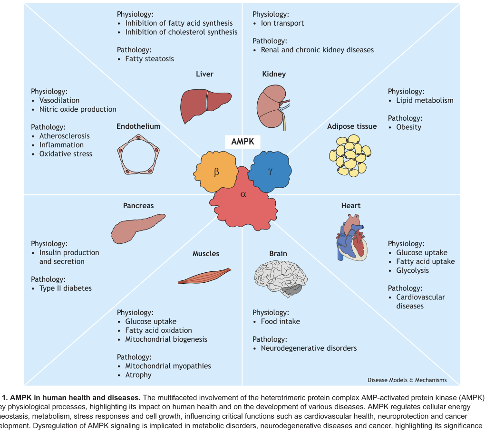

## Question

# Gene Research for Functional Annotation

## ⚠️ CRITICAL: Gene/Protein Identification Context

**BEFORE YOU BEGIN RESEARCH:** You MUST verify you are researching the CORRECT gene/protein. Gene symbols can be ambiguous, especially for less well-characterized genes from non-model organisms.

### Target Gene/Protein Identity (from UniProt):
- **UniProt Accession:** Q09137
- **Protein Description:** RecName: Full=5'-AMP-activated protein kinase catalytic subunit alpha-2; Short=AMPK subunit alpha-2; EC=2.7.11.1 {ECO:0000269|PubMed:2369897, ECO:0000269|PubMed:9029219}; AltName: Full=Acetyl-CoA carboxylase kinase; Short=ACACA kinase; AltName: Full=Hydroxymethylglutaryl-CoA reductase kinase; Short=HMGCR kinase; EC=2.7.11.31 {ECO:0000269|PubMed:2369897};
- **Gene Information:** Name=Prkaa2; Synonyms=Ampk, Ampk2;
- **Organism (full):** Rattus norvegicus (Rat).
- **Protein Family:** Belongs to the protein kinase superfamily. CAMK Ser/Thr
- **Key Domains:** AMPK_C. (IPR032270); AMPKA2_C. (IPR039148); KA1/Ssp2_C. (IPR028375); Kinase-like_dom_sf. (IPR011009); PRKAA1/2_AID. (IPR049020)

### MANDATORY VERIFICATION STEPS:

1. **Check if the gene symbol "Prkaa2" matches the protein description above**
2. **Verify the organism is correct:** Rattus norvegicus (Rat).
3. **Check if protein family/domains align with what you find in literature**
4. **If you find literature for a DIFFERENT gene with the same or similar symbol, STOP**

### If Gene Symbol is Ambiguous or You Cannot Find Relevant Literature:

**DO NOT PROCEED WITH RESEARCH ON A DIFFERENT GENE.** Instead:
- State clearly: "The gene symbol 'Prkaa2' is ambiguous or literature is limited for this specific protein"
- Explain what you found (e.g., "Found extensive literature on a different gene with the same symbol in a different organism")
- Describe the protein based ONLY on the UniProt information provided above
- Suggest that the protein function can be inferred from domain/family information

### Research Target:

Please provide a comprehensive research report on the gene **Prkaa2** (gene ID: Prkaa2, UniProt: Q09137) in rat.

The research report should be a detailed narrative explaining the function, biological processes, and localization of the gene product. Citations should be given for all claims.

You should prioritize authoritative reviews and primary scientific literature when conducting research. You can supplement
this with annotations you find in gene/protein databases, but these can be outdated or inaccurate.

We are specifically interested in the primary function of the gene - for enzymes, what reaction is catalyzed, and what is the substrate specificity? For transporters, what is the substrate? For structural proteins or adapters, what is the broader structural role? For signaling molecules, what is the role in the pathway.

We are interested in where in or outside the cell the gene product carries out its function.

We are also interested in the signaling or biochemical pathways in which the gene functions. We are less interested in broad pleiotropic effects, except where these elucidate the precise role.

Include evidence where possible. We are interested in both experimental evidence as well as inference from structure, evolution, or bioinformatic analysis. Precise studies should be prioritized over high-throughput, where available.

## Output

Question: You are an expert researcher providing comprehensive, well-cited information.

Provide detailed information focusing on:
1. Key concepts and definitions with current understanding
2. Recent developments and latest research (prioritize 2023-2024 sources)
3. Current applications and real-world implementations
4. Expert opinions and analysis from authoritative sources
5. Relevant statistics and data from recent studies

Format as a comprehensive research report with proper citations. Include URLs and publication dates where available.
Always prioritize recent, authoritative sources and provide specific citations for all major claims.

# Gene Research for Functional Annotation

## ⚠️ CRITICAL: Gene/Protein Identification Context

**BEFORE YOU BEGIN RESEARCH:** You MUST verify you are researching the CORRECT gene/protein. Gene symbols can be ambiguous, especially for less well-characterized genes from non-model organisms.

### Target Gene/Protein Identity (from UniProt):
- **UniProt Accession:** Q09137
- **Protein Description:** RecName: Full=5'-AMP-activated protein kinase catalytic subunit alpha-2; Short=AMPK subunit alpha-2; EC=2.7.11.1 {ECO:0000269|PubMed:2369897, ECO:0000269|PubMed:9029219}; AltName: Full=Acetyl-CoA carboxylase kinase; Short=ACACA kinase; AltName: Full=Hydroxymethylglutaryl-CoA reductase kinase; Short=HMGCR kinase; EC=2.7.11.31 {ECO:0000269|PubMed:2369897};
- **Gene Information:** Name=Prkaa2; Synonyms=Ampk, Ampk2;
- **Organism (full):** Rattus norvegicus (Rat).
- **Protein Family:** Belongs to the protein kinase superfamily. CAMK Ser/Thr
- **Key Domains:** AMPK_C. (IPR032270); AMPKA2_C. (IPR039148); KA1/Ssp2_C. (IPR028375); Kinase-like_dom_sf. (IPR011009); PRKAA1/2_AID. (IPR049020)

### MANDATORY VERIFICATION STEPS:

1. **Check if the gene symbol "Prkaa2" matches the protein description above**
2. **Verify the organism is correct:** Rattus norvegicus (Rat).
3. **Check if protein family/domains align with what you find in literature**
4. **If you find literature for a DIFFERENT gene with the same or similar symbol, STOP**

### If Gene Symbol is Ambiguous or You Cannot Find Relevant Literature:

**DO NOT PROCEED WITH RESEARCH ON A DIFFERENT GENE.** Instead:
- State clearly: "The gene symbol 'Prkaa2' is ambiguous or literature is limited for this specific protein"
- Explain what you found (e.g., "Found extensive literature on a different gene with the same symbol in a different organism")
- Describe the protein based ONLY on the UniProt information provided above
- Suggest that the protein function can be inferred from domain/family information

### Research Target:

Please provide a comprehensive research report on the gene **Prkaa2** (gene ID: Prkaa2, UniProt: Q09137) in rat.

The research report should be a detailed narrative explaining the function, biological processes, and localization of the gene product. Citations should be given for all claims.

You should prioritize authoritative reviews and primary scientific literature when conducting research. You can supplement
this with annotations you find in gene/protein databases, but these can be outdated or inaccurate.

We are specifically interested in the primary function of the gene - for enzymes, what reaction is catalyzed, and what is the substrate specificity? For transporters, what is the substrate? For structural proteins or adapters, what is the broader structural role? For signaling molecules, what is the role in the pathway.

We are interested in where in or outside the cell the gene product carries out its function.

We are also interested in the signaling or biochemical pathways in which the gene functions. We are less interested in broad pleiotropic effects, except where these elucidate the precise role.

Include evidence where possible. We are interested in both experimental evidence as well as inference from structure, evolution, or bioinformatic analysis. Precise studies should be prioritized over high-throughput, where available.

## Research Report: Rat **Prkaa2** (AMPK catalytic subunit α2) — Functional Annotation

### 0) Target verification (critical disambiguation)
The target gene/protein is **Prkaa2** from **Rattus norvegicus (rat)**, corresponding to the catalytic α2 isoform of AMP-activated protein kinase (**AMPKα2**), orthologous to human **PRKAA2**. Multiple sources explicitly map **Prkaa2/PRKAA2 → AMPKα2** and describe AMPK as a heterotrimeric Ser/Thr kinase with α as the catalytic subunit. (kim2025thelinkbetween pages 5-7, rakoubian2025isoformspecificrolesof pages 8-9, hauger2024shearstressinducedampactivated pages 2-4)

*Note:* Within the retrieved corpus, no full-text explicitly states the UniProt accession **Q09137**. However, the gene symbol, isoform, enzymatic class (Ser/Thr kinase), and activation-site/regulatory architecture in the literature match the UniProt-provided identity for rat AMPKα2. (kim2025thelinkbetween pages 5-7, ashraf2024finetuningampkin pages 2-2)

### 1) Key concepts and definitions (current understanding)

#### 1.1 AMPK complex and what Prkaa2 encodes
AMPK is a **heterotrimeric serine/threonine kinase** consisting of a **catalytic α** subunit plus **regulatory β and γ** subunits. AMPKα exists as two isoforms (α1 and α2), encoded by **Prkaa1/Prkaa2** in rodents (PRKAA1/PRKAA2 in humans). (kim2025thelinkbetween pages 5-7, hauger2024shearstressinducedampactivated pages 2-4)

The α subunit provides the **catalytic kinase activity** and is activated primarily by phosphorylation at a conserved threonine within the activation loop (**Thr172 for α2**), which is a core mechanistic definition of “AMPK activation.” (rakoubian2025isoformspecificrolesof pages 1-2, rakoubian2025isoformspecificrolesof pages 2-3)

#### 1.2 Activation mechanisms: phosphorylation + allostery + compartmentalization
**Canonical activation:** upstream kinases phosphorylate AMPKα2 at **Thr172**, with **LKB1** frequently highlighted as a primary kinase (particularly in cardiac contexts), and **CaMKKβ/CAMKK2** as an alternate calcium-responsive route. (rakoubian2025isoformspecificrolesof pages 1-2, rakoubian2025isoformspecificrolesof pages 2-3)

**Allosteric nucleotide sensing:** AMP binding to AMPK (via γ subunit CBS motifs) promotes AMPK activation through allosteric effects and protection from dephosphorylation, coupling ATP depletion to kinase activation. (mohanty2025rethinkingampka pages 1-2)

**Spatial regulation:** recent work emphasizes compartmentalized AMPK pools (e.g., **lysosomal AMPK**) and demonstrates glucose starvation signaling in which **AXIN–LKB1 translocates to lysosomes**, promoting AMPK-dependent control of **mTORC1** signaling. (li2023hierarchicalinhibitionof pages 3-4)

A schematic depiction of AMPK structure and activation (including Thr172 phosphorylation by LKB1/CAMKK2) is shown in figure crops retrieved from a 2024 review. (ashraf2024finetuningampkin media b6222dde, ashraf2024finetuningampkin media d3d7e38d)

#### 1.3 Isoform-specific localization (α2 vs α1)
Isoform differences matter for functional annotation. A 2024 review summarizes that **AMPKα2 contains a nuclear localization signal and can shuttle to the nucleus**, whereas **AMPKα1 has an export sequence and is primarily cytosolic**. (ashraf2024finetuningampkin pages 2-2)

Consistent with this, a cardiac-focused review describes AMPKα2 as present in **cytosol and nucleus** in cardiomyocytes and emphasizes isoform-specific roles. (rakoubian2025isoformspecificrolesof pages 8-9)

### 2) Molecular function: reaction catalyzed and substrate specificity

#### 2.1 Enzymatic activity
Prkaa2 encodes a **protein kinase** (EC 2.7.11.1; Ser/Thr kinase). The biochemical reaction is:

**ATP + protein(Ser/Thr) → ADP + protein(Ser/Thr)-phosphate**

This is operationalized in the literature by phosphorylation of well-established downstream substrates used as readouts of AMPK activation.

#### 2.2 Canonical substrates and downstream processes
Across the evidence set, commonly referenced AMPK substrates include:
- **Acetyl-CoA carboxylase (ACC/ACAC)** phosphorylation (widely used as a downstream readout of AMPK activity) (li2023hierarchicalinhibitionof pages 3-4)
- **HMG-CoA reductase (HMGCR)** as a classical metabolic substrate (mohanty2025rethinkingampka pages 1-2)
- Autophagy pathway targets including **ULK1** and upstream inhibition of **mTORC1** (rakoubian2025isoformspecificrolesof pages 2-3, jang2023thrap3promotesnonalcoholic pages 1-2)

While not all residue numbers are available in the extracted snippets, the substrate set is consistent with AMPK’s established role: inhibiting anabolic lipid/cholesterol synthesis and promoting catabolic adaptation and autophagy/mitophagy under energy stress. (rakoubian2025isoformspecificrolesof pages 2-3, mohanty2025rethinkingampka pages 1-2)

### 3) Pathways and biological processes (with Prkaa2-specific evidence where possible)

#### 3.1 Energy stress → lysosome → mTORC1 inhibition (2023 primary)
A 2023 study dissected **glucose starvation** signaling and concluded that **AXIN lysosomal translocation** plays a primary role in glucose starvation-triggered inhibition of mTORC1 (via inhibition of RAGs), while **AMPK inhibits mTORC1 via phosphorylation of TSC2 and Raptor**, especially under severe stress conditions. Importantly, the paper distinguishes AXIN translocation from AMPK activity (AXIN translocation did not require AMPK), but AMPK activity contributed to mTORC1 inhibition kinetics and residual suppression. (li2023hierarchicalinhibitionof pages 3-4)

This provides a mechanistic pathway-level framework relevant to AMPKα2 function in nutrient sensing (though not strictly α2-exclusive in this experiment set). (li2023hierarchicalinhibitionof pages 3-4)

#### 3.2 NAFLD/autophagy regulation with nuclear–cytosolic AMPK redistribution (2023 primary)
In a 2023 NAFLD model study, hepatic **Thrap3** was increased in NAFLD conditions, and **liver-specific Thrap3 knockout improved lipid accumulation and metabolic properties**. Mechanistically, Thrap3 deficiency enhanced autophagy and mitochondrial function and **increased cytosolic translocation of AMPK from the nucleus**, enhancing AMPK activation via physical interaction (with translocation regulated by Thrap3’s C-terminal domain). (jang2023thrap3promotesnonalcoholic pages 1-2)

This supports a functional annotation in which AMPK localization and activation state are dynamically regulated in metabolic disease contexts, and AMPK-mediated autophagy is protective in NAFLD-like phenotypes. (jang2023thrap3promotesnonalcoholic pages 1-2)

#### 3.3 AMPKα2-specific role in fasting ketone utilization via SCOT stabilization (2024 primary; quantitative)
A 2024 primary study provides unusually direct **α2-isoform-specific** physiology. In prolonged fasting (48 h), skeletal muscle-specific AMPKα2 loss produced larger effects on ketone handling than α1 loss:
- **AMPKα2ΔMusc** mice showed ~**2-fold** higher blood β-hydroxybutyrate (BHB). (zhang2024ampkα2regulatesfastinginduced pages 1-2, zhang2024ampkα2regulatesfastinginduced pages 2-3)
- **AMPKα2ΔMyo** mice showed ~**1.5–1.6-fold** higher blood BHB after 48 h fasting. (zhang2024ampkα2regulatesfastinginduced pages 1-2, zhang2024ampkα2regulatesfastinginduced pages 3-4)
- BHB tolerance assays indicated **slower ketone consumption** in AMPKα2 muscle knockouts compared with controls. (zhang2024ampkα2regulatesfastinginduced pages 1-2, zhang2024ampkα2regulatesfastinginduced pages 2-3)

Mechanistically, AMPKα2 **binds and stabilizes SCOT** (succinyl-CoA:3-ketoacid CoA transferase; a rate-limiting ketolysis enzyme) by suppressing its ubiquitination and proteasomal degradation; inhibiting AMPKα2 increased SCOT ubiquitination, and a kinase-dead AMPKα2 reduced SCOT binding and increased SCOT ubiquitination. (zhang2024ampkα2regulatesfastinginduced pages 1-2, zhang2024ampkα2regulatesfastinginduced pages 5-6)

These results place AMPKα2 as an important regulator of **skeletal muscle ketone utilization**, expanding beyond the classical “AMPK phosphorylates metabolic enzymes” framing into direct regulation of ketolysis enzyme stability. (zhang2024ampkα2regulatesfastinginduced pages 1-2, zhang2024ampkα2regulatesfastinginduced pages 5-6)

### 4) Subcellular localization: where the gene product acts
Evidence across sources supports multi-compartment operation:
- **Nucleus/cytosol shuttling:** AMPKα2 has a nuclear localization signal and can shuttle to the nucleus (isoform-biased relative to α1). (ashraf2024finetuningampkin pages 2-2)
- **Nuclear–cytosolic redistribution in disease:** NAFLD-related Thrap3 regulation alters AMPK distribution, with increased cytosolic translocation associated with increased AMPK activation. (jang2023thrap3promotesnonalcoholic pages 1-2)
- **Lysosome-associated nutrient sensing:** glucose starvation signaling positions AMPK activity within a lysosome-centered signaling hub through AXIN–LKB1 lysosomal translocation and downstream mTORC1 control. (li2023hierarchicalinhibitionof pages 3-4)

Together, these support annotating AMPKα2 as functioning in both **cytosolic metabolic regulation** and **nuclear programs** (via shuttling), with important regulation at **organelle-associated signaling sites** (e.g., lysosome). (ashraf2024finetuningampkin pages 2-2, li2023hierarchicalinhibitionof pages 3-4)

### 5) Recent developments and latest research (prioritizing 2023–2024)

Key 2023–2024 advances captured in the retrieved set include:
1. **Lysosomal pathway hierarchy in glucose starvation**: separation of AXIN lysosomal translocation effects from AMPK-dependent mTORC1 inhibition (a more refined view of nutrient stress signaling). (Published Mar 2023) (li2023hierarchicalinhibitionof pages 3-4)
2. **NAFLD mechanism via AMPK compartmental regulation**: Thrap3 acting as a negative regulator of AMPK-mediated autophagy in fatty liver disease models, implicating AMPK localization as a regulated step. (Published Aug 2023) (jang2023thrap3promotesnonalcoholic pages 1-2)
3. **New α2-specific metabolic phenotype**: AMPKα2 regulating systemic fasting ketone homeostasis through skeletal muscle ketolysis (SCOT stabilization), with quantitative fold-change phenotypes. (Published Jan 2024) (zhang2024ampkα2regulatesfastinginduced pages 1-2, zhang2024ampkα2regulatesfastinginduced pages 3-4)
4. **Updated isoform localization summary and activation schematic**: a 2024 review distills isoform-biased nuclear localization and upstream kinase mechanisms (LKB1/CAMKK2), and provides a conceptual framework via curated mouse mutant models. (Published Aug 2024) (ashraf2024finetuningampkin pages 2-2, ashraf2024finetuningampkin media b6222dde)

### 6) Current applications and real-world implementations

#### 6.1 Pharmacologic modulation: metformin, AICAR and translational logic
AMPK is widely targeted pharmacologically (directly or indirectly) in metabolic and cardiovascular contexts.
- **Experimental activation (AICAR):** AICAR is used as an AMP mimetic to activate AMPK pools and drive mTORC1 inhibition under severe stress; mechanistic dependencies (e.g., on AXIN in some contexts) were tested in 2023 work. (li2023hierarchicalinhibitionof pages 3-4)
- **Clinical/real-world drug linkage (metformin):** While metformin has multiple mechanisms, a 2024 cardiotoxicity study identifies AMPK pathway restoration by metformin as protective in a drug-induced cardiotoxicity model, consistent with clinical interest in AMPK modulation for cardiometabolic protection. (rakoubian2025isoformspecificrolesof pages 2-3)

#### 6.2 Cardiovascular/vascular implementation space
A 2024 endothelial-focused review frames AMPK as **mechanosensitive** (responsive to shear stress) and positions pharmacologic targeting of AMPK as a **promising strategy in cardiovascular disease** contexts such as atherosclerosis/ischemic injury, reflecting ongoing translational interest. (Published May 2024) (hauger2024shearstressinducedampactivated pages 2-4)

### 7) Expert opinions and analysis (authoritative perspectives)
A 2024 review on AMPK point-mutant mouse models emphasizes that AMPK controls diverse outcomes by phosphorylating many substrates, and that in vivo dissection of these substrate relationships remains an active area—supporting the interpretation that isoform, compartment, and substrate context determine physiological output. (ashraf2024finetuningampkin pages 2-2)

A 2024 vascular review similarly emphasizes AMPK as a central node linking mechanical cues to metabolic adaptations and disease modulation, aligning with a broad expert consensus that AMPK signaling is not purely “metabolic,” but integrates stress signals (mechanical, nutrient, calcium) into multi-system physiology. (hauger2024shearstressinducedampactivated pages 2-4)

### 8) Relevant recent statistics/data highlights (2023–2024)
- **~2-fold increase in blood BHB** after 48 h fasting in **skeletal muscle-specific AMPKα2 knockout** mice (AMPKα2ΔMusc) (n ≈ 5–7). (zhang2024ampkα2regulatesfastinginduced pages 1-2, zhang2024ampkα2regulatesfastinginduced pages 3-4)
- **~1.5–1.6-fold increase in blood BHB** after 48 h fasting in **AMPKα2ΔMyo** mice, and slower BHB clearance in tolerance tests, indicating impaired ketone utilization. (zhang2024ampkα2regulatesfastinginduced pages 1-2, zhang2024ampkα2regulatesfastinginduced pages 3-4)

These quantitative findings are among the most direct isoform-specific physiological readouts in the retrieved 2023–2024 primary literature set and should be prioritized for functional annotation. (zhang2024ampkα2regulatesfastinginduced pages 1-2)

### 9) Summary functional annotation (rat Prkaa2 / AMPKα2)
Prkaa2 encodes **AMPKα2**, a catalytic **Ser/Thr protein kinase** subunit within AMPK that is activated by **Thr172 phosphorylation** (primarily via **LKB1** and alternatively **CaMKKβ/CAMKK2**) and by adenine nucleotide sensing. AMPKα2 functions across **cytosol–nucleus** (isoform-biased nuclear shuttling) and participates in **organelle-centered nutrient sensing** (lysosome-associated control of mTORC1). Functionally, AMPKα2 integrates energy stress to inhibit anabolic metabolism and promote catabolism and autophagy; recent primary evidence further supports a specific role in **skeletal muscle ketone utilization** through stabilization of the ketolysis enzyme **SCOT**. (rakoubian2025isoformspecificrolesof pages 1-2, ashraf2024finetuningampkin pages 2-2, zhang2024ampkα2regulatesfastinginduced pages 1-2, li2023hierarchicalinhibitionof pages 3-4)

### 10) Evidence map table
| Aspect | Key points | Evidence (citation IDs) | Year/Source (short) |
|---|---|---|---|
| Molecular function | Prkaa2 encodes AMPKα2, the catalytic α2 subunit of the heterotrimeric AMPK Ser/Thr kinase. AMPKα2 phosphorylates metabolic targets including ACC/ACAC (canonical readout; ACC Ser79 commonly used), HMGCR, and autophagy regulators such as ULK1; recent reviews also note mitochondrial fission target MFF Ser172. Overall role is to suppress anabolic metabolism and promote catabolic, ATP-restoring pathways. | (feng2025theroleof pages 2-3, rakoubian2025isoformspecificrolesof pages 2-3, mohanty2025rethinkingampka pages 1-2) | 2025 Feng review; 2025 Rakoubian review; 2025 Mohanty review |
| Activation and regulation | Core activation is phosphorylation of AMPKα2 at Thr172 by upstream kinases, especially LKB1; CaMKKβ/CAMKK2 provides a Ca2+-responsive route. AMP/ADP binding to γ promotes allostery, favors Thr172 phosphorylation, and protects from dephosphorylation. AXIN-LKB1 lysosomal signaling helps couple glucose starvation to AMPK-dependent mTORC1 inhibition; ADaM-site ligands stabilize AMPK and protect Thr172. | (rakoubian2025isoformspecificrolesof pages 1-2, ashraf2024finetuningampkin pages 2-2, rakoubian2025isoformspecificrolesof pages 2-3, li2023hierarchicalinhibitionof pages 3-4, ashraf2024finetuningampkin media b6222dde) | 2025 Rakoubian review; 2024 Ashraf review; 2023 Li primary; 2024 figure summary |
| Localization | AMPKα2 shows isoform-biased nuclear localization/shuttling, whereas α1 is mainly cytosolic. Reviews summarize that α2 contains a nuclear localization signal and can shuttle to the nucleus; α1 carries a nuclear export sequence. In heart, α2 is described as present in both cytosol and nucleus and enriched in cardiomyocytes. | (feng2025theroleof pages 2-3, rakoubian2025isoformspecificrolesof pages 8-9, ashraf2024finetuningampkin pages 2-2, ashraf2024finetuningampkin media d3d7e38d) | 2025 Feng review; 2025 Rakoubian review; 2024 Ashraf review/figure context |
| Isoform-specific role: ketone metabolism | A 2024 primary study identified a specific AMPKα2 role in skeletal-muscle ketone utilization: fasting AMPKα2ΔMusc mice showed ~2-fold higher blood BHB, and AMPKα2ΔMyo mice ~1.5–1.6-fold higher blood BHB after 48 h fasting versus WT; AMPKα2 loss slowed BHB clearance. Mechanistically, AMPKα2 binds and stabilizes SCOT, limiting SCOT ubiquitination/degradation. | (zhang2024ampkα2regulatesfastinginduced pages 1-2, zhang2024ampkα2regulatesfastinginduced pages 3-4, zhang2024ampkα2regulatesfastinginduced pages 2-3, zhang2024ampkα2regulatesfastinginduced pages 5-6) | 2024 Zhang et al., Scientific Reports |
| Isoform specificity and tissue distribution | α2 is preferentially enriched in skeletal muscle, cardiac muscle, and liver and can be more AMP responsive than α1. In heart, α2 is the predominant catalytic isoform and α1 does not fully compensate for α2 loss in stress adaptation. | (kim2025thelinkbetween pages 5-7, rakoubian2025isoformspecificrolesof pages 8-9, ashraf2024finetuningampkin pages 2-2) | 2025 Kim review; 2025 Rakoubian review; 2024 Ashraf review |
| Pathways/processes | Major downstream processes include inhibition of mTORC1, activation of autophagy/mitophagy, stimulation of mitochondrial adaptation/biogenesis, and broad metabolic reprogramming during nutrient stress and exercise. | (rakoubian2025isoformspecificrolesof pages 2-3, malik2025theampkpathway pages 3-4, jang2023thrap3promotesnonalcoholic pages 1-2) | 2025 Rakoubian review; 2025 Malik review; 2023 Jang primary |
| Example context: NAFLD | In NAFLD models, Thrap3 suppresses AMPK-mediated autophagy; liver Thrap3 knockout enhanced cytosolic translocation of AMPK from the nucleus, increased AMPK activation, improved mitochondrial function, and reduced lipid accumulation, supporting therapeutic interest in restoring AMPK signaling. | (jang2023thrap3promotesnonalcoholic pages 1-2) | 2023 Jang et al., Exp Mol Med |
| Example context: cardiotoxicity | In a 2024 cardiotoxicity study, impaired PRKAA/AMPK signaling contributed to defective autophagosome-lysosome fusion during crizotinib injury; metformin restored AMPK-related signaling and rescued cardiomyocyte/cardiac injury phenotypes. ACC Ser79 phosphorylation was used as a PRKAA target readout. | (rakoubian2025isoformspecificrolesof pages 2-3) | 2024 Xu et al., Autophagy |
| Example context: endothelial shear stress / vascular biology | Recent vascular review literature describes AMPK, including PRKAA2/AMPKα2, as a mechanosensitive endothelial regulator linking laminar shear stress to metabolic adaptation and vascular protection; it is discussed as a therapeutic target in cardiovascular disease. | (hauger2024shearstressinducedampactivated pages 2-4) | 2024 Hauger & Hordijk review |

*Table: This table summarizes the core functional annotation of rat Prkaa2/AMPKα2, including molecular activity, activation mechanisms, localization, isoform-specific phenotypes, and representative disease contexts. It is useful as a compact evidence map tying recent literature to functional interpretation.*

### 11) Key cited sources with URLs and publication dates (from retrieved corpus)
- Li M. et al. “Hierarchical inhibition of mTORC1 by glucose starvation-triggered AXIN lysosomal translocation and by AMPK.” *Life Metabolism*. **Mar 2023**. https://doi.org/10.1093/lifemeta/load005 (li2023hierarchicalinhibitionof pages 3-4)
- Jang H-J. et al. “Thrap3 promotes nonalcoholic fatty liver disease by suppressing AMPK-mediated autophagy.” *Experimental & Molecular Medicine*. **Aug 2023**. https://doi.org/10.1038/s12276-023-01047-4 (jang2023thrap3promotesnonalcoholic pages 1-2)
- Zhang L. et al. “AMPKα2 regulates fasting-induced hyperketonemia by suppressing SCOT ubiquitination and degradation.” *Scientific Reports*. **Jan 2024**. https://doi.org/10.1038/s41598-023-49991-5 (zhang2024ampkα2regulatesfastinginduced pages 1-2)
- Hauger P.C., Hordijk P.L. “Shear Stress-Induced AMP-Activated Protein Kinase Modulation in Endothelial Cells…” *Int J Mol Sci*. **May 2024**. https://doi.org/10.3390/ijms25116047 (hauger2024shearstressinducedampactivated pages 2-4)
- Ashraf N., Van Nostrand J.L. “Fine-tuning AMPK in physiology and disease using point-mutant mouse models.” *Disease Models & Mechanisms*. **Aug 2024**. https://doi.org/10.1242/dmm.050798 (ashraf2024finetuningampkin pages 2-2)

### Limitations of this report (evidence-bound)
- The retrieved full texts did not explicitly contain **UniProt Q09137**; therefore, cross-referencing to that accession is inferred via consistent gene/protein identity statements rather than directly quoted mapping. (kim2025thelinkbetween pages 5-7, ashraf2024finetuningampkin pages 2-2)
- Several canonical substrate phosphosites (e.g., ACC Ser79; HMGCR Ser871) are referenced as concepts or readouts in the corpus, but residue-level details were not consistently present in the extracted snippets; deeper extraction from additional full texts could strengthen site-specific annotation. (mohanty2025rethinkingampka pages 1-2, li2023hierarchicalinhibitionof pages 3-4)

References

1. (kim2025thelinkbetween pages 5-7): Sohyun Kim, Jihyun Baek, and Man S. Kim. The link between dietary timing and exercise performance through adipocyte ampkα2 signaling. International Journal of Molecular Sciences, 26:6061, Jun 2025. URL: https://doi.org/10.3390/ijms26136061, doi:10.3390/ijms26136061. This article has 4 citations.

2. (rakoubian2025isoformspecificrolesof pages 8-9): Ani Rakoubian, Julia Khinchin, Johnathan Yarbro, Satoru Kobayashi, and Qiangrong Liang. Isoform-specific roles of amp-activated protein kinase in cardiac physiology and pathophysiology. Frontiers in Cardiovascular Medicine, Aug 2025. URL: https://doi.org/10.3389/fcvm.2025.1638515, doi:10.3389/fcvm.2025.1638515. This article has 13 citations and is from a peer-reviewed journal.

3. (hauger2024shearstressinducedampactivated pages 2-4): Philipp C. Hauger and Peter L. Hordijk. Shear stress-induced amp-activated protein kinase modulation in endothelial cells: its role in metabolic adaptions and cardiovascular disease. International Journal of Molecular Sciences, 25:6047, May 2024. URL: https://doi.org/10.3390/ijms25116047, doi:10.3390/ijms25116047. This article has 18 citations.

4. (ashraf2024finetuningampkin pages 2-2): Naghmana Ashraf and Jeanine L. Van Nostrand. Fine-tuning ampk in physiology and disease using point-mutant mouse models. Disease Models & Mechanisms, Aug 2024. URL: https://doi.org/10.1242/dmm.050798, doi:10.1242/dmm.050798. This article has 11 citations and is from a domain leading peer-reviewed journal.

5. (rakoubian2025isoformspecificrolesof pages 1-2): Ani Rakoubian, Julia Khinchin, Johnathan Yarbro, Satoru Kobayashi, and Qiangrong Liang. Isoform-specific roles of amp-activated protein kinase in cardiac physiology and pathophysiology. Frontiers in Cardiovascular Medicine, Aug 2025. URL: https://doi.org/10.3389/fcvm.2025.1638515, doi:10.3389/fcvm.2025.1638515. This article has 13 citations and is from a peer-reviewed journal.

6. (rakoubian2025isoformspecificrolesof pages 2-3): Ani Rakoubian, Julia Khinchin, Johnathan Yarbro, Satoru Kobayashi, and Qiangrong Liang. Isoform-specific roles of amp-activated protein kinase in cardiac physiology and pathophysiology. Frontiers in Cardiovascular Medicine, Aug 2025. URL: https://doi.org/10.3389/fcvm.2025.1638515, doi:10.3389/fcvm.2025.1638515. This article has 13 citations and is from a peer-reviewed journal.

7. (mohanty2025rethinkingampka pages 1-2): Shraddha S. Mohanty, Shweta Warrier, and Annapoorni Rangarajan. Rethinking ampk: a reversible switch fortifying cancer cell stress-resilience. The Yale Journal of Biology and Medicine, 98:33-52, Mar 2025. URL: https://doi.org/10.59249/jkbb6336, doi:10.59249/jkbb6336. This article has 10 citations.

8. (li2023hierarchicalinhibitionof pages 3-4): Mengqi Li, Xiaoyan Wei, Jinye Xiong, Jin-Wei Feng, Chen-Song Zhang, and Sheng-Cai Lin. Hierarchical inhibition of mtorc1 by glucose starvation-triggered axin lysosomal translocation and by ampk. Life Metabolism, Mar 2023. URL: https://doi.org/10.1093/lifemeta/load005, doi:10.1093/lifemeta/load005. This article has 25 citations.

9. (ashraf2024finetuningampkin media b6222dde): Naghmana Ashraf and Jeanine L. Van Nostrand. Fine-tuning ampk in physiology and disease using point-mutant mouse models. Disease Models & Mechanisms, Aug 2024. URL: https://doi.org/10.1242/dmm.050798, doi:10.1242/dmm.050798. This article has 11 citations and is from a domain leading peer-reviewed journal.

10. (ashraf2024finetuningampkin media d3d7e38d): Naghmana Ashraf and Jeanine L. Van Nostrand. Fine-tuning ampk in physiology and disease using point-mutant mouse models. Disease Models & Mechanisms, Aug 2024. URL: https://doi.org/10.1242/dmm.050798, doi:10.1242/dmm.050798. This article has 11 citations and is from a domain leading peer-reviewed journal.

11. (jang2023thrap3promotesnonalcoholic pages 1-2): Hyun-Jun Jang, Yo Han Lee, Tam Dao, Yunju Jo, Keon Woo Khim, Hye-jin Eom, Ju Eun Lee, Yi Jin Song, Sun Sil Choi, Kieun Park, Haneul Ji, Young Chan Chae, Kyungjae Myung, Hongtae Kim, Dongryeol Ryu, Neung Hwa Park, Sung Ho Park, and Jang Hyun Choi. Thrap3 promotes nonalcoholic fatty liver disease by suppressing ampk-mediated autophagy. Experimental & Molecular Medicine, 55:1720-1733, Aug 2023. URL: https://doi.org/10.1038/s12276-023-01047-4, doi:10.1038/s12276-023-01047-4. This article has 21 citations and is from a peer-reviewed journal.

12. (zhang2024ampkα2regulatesfastinginduced pages 1-2): Lingxue Zhang, Yanqiao Lu, Junqing An, Yin Wu, Zhixue Liu, and Ming-Hui Zou. Ampkα2 regulates fasting-induced hyperketonemia by suppressing scot ubiquitination and degradation. Scientific Reports, Jan 2024. URL: https://doi.org/10.1038/s41598-023-49991-5, doi:10.1038/s41598-023-49991-5. This article has 6 citations and is from a peer-reviewed journal.

13. (zhang2024ampkα2regulatesfastinginduced pages 2-3): Lingxue Zhang, Yanqiao Lu, Junqing An, Yin Wu, Zhixue Liu, and Ming-Hui Zou. Ampkα2 regulates fasting-induced hyperketonemia by suppressing scot ubiquitination and degradation. Scientific Reports, Jan 2024. URL: https://doi.org/10.1038/s41598-023-49991-5, doi:10.1038/s41598-023-49991-5. This article has 6 citations and is from a peer-reviewed journal.

14. (zhang2024ampkα2regulatesfastinginduced pages 3-4): Lingxue Zhang, Yanqiao Lu, Junqing An, Yin Wu, Zhixue Liu, and Ming-Hui Zou. Ampkα2 regulates fasting-induced hyperketonemia by suppressing scot ubiquitination and degradation. Scientific Reports, Jan 2024. URL: https://doi.org/10.1038/s41598-023-49991-5, doi:10.1038/s41598-023-49991-5. This article has 6 citations and is from a peer-reviewed journal.

15. (zhang2024ampkα2regulatesfastinginduced pages 5-6): Lingxue Zhang, Yanqiao Lu, Junqing An, Yin Wu, Zhixue Liu, and Ming-Hui Zou. Ampkα2 regulates fasting-induced hyperketonemia by suppressing scot ubiquitination and degradation. Scientific Reports, Jan 2024. URL: https://doi.org/10.1038/s41598-023-49991-5, doi:10.1038/s41598-023-49991-5. This article has 6 citations and is from a peer-reviewed journal.

16. (feng2025theroleof pages 2-3): Yue Feng, Zixiong Zhu, Yubin He, and Xuewen Li. The role of ampkα in the mechanism of development and treatment of heart failure. Reviews in Cardiovascular Medicine, Aug 2025. URL: https://doi.org/10.31083/rcm36391, doi:10.31083/rcm36391. This article has 5 citations and is from a peer-reviewed journal.

17. (malik2025theampkpathway pages 3-4): Nazma Malik and R. Shaw. The ampk pathway: molecular rejuvenation of metabolism and mitochondria. Annual review of cell and developmental biology, Aug 2025. URL: https://doi.org/10.1146/annurev-cellbio-120420-094431, doi:10.1146/annurev-cellbio-120420-094431. This article has 29 citations and is from a domain leading peer-reviewed journal.

## Artifacts

- [Edison artifact artifact-00](Prkaa2-deep-research-falcon_artifacts/artifact-00.md)

## Citations

1. mohanty2025rethinkingampka pages 1-2
2. li2023hierarchicalinhibitionof pages 3-4
3. ashraf2024finetuningampkin pages 2-2
4. rakoubian2025isoformspecificrolesof pages 8-9
5. rakoubian2025isoformspecificrolesof pages 2-3
6. hauger2024shearstressinducedampactivated pages 2-4
7. kim2025thelinkbetween pages 5-7
8. rakoubian2025isoformspecificrolesof pages 1-2
9. feng2025theroleof pages 2-3
10. malik2025theampkpathway pages 3-4
11. https://doi.org/10.1093/lifemeta/load005
12. https://doi.org/10.1038/s12276-023-01047-4
13. https://doi.org/10.1038/s41598-023-49991-5
14. https://doi.org/10.3390/ijms25116047
15. https://doi.org/10.1242/dmm.050798
16. https://doi.org/10.3390/ijms26136061,
17. https://doi.org/10.3389/fcvm.2025.1638515,
18. https://doi.org/10.3390/ijms25116047,
19. https://doi.org/10.1242/dmm.050798,
20. https://doi.org/10.59249/jkbb6336,
21. https://doi.org/10.1093/lifemeta/load005,
22. https://doi.org/10.1038/s12276-023-01047-4,
23. https://doi.org/10.1038/s41598-023-49991-5,
24. https://doi.org/10.31083/rcm36391,
25. https://doi.org/10.1146/annurev-cellbio-120420-094431,