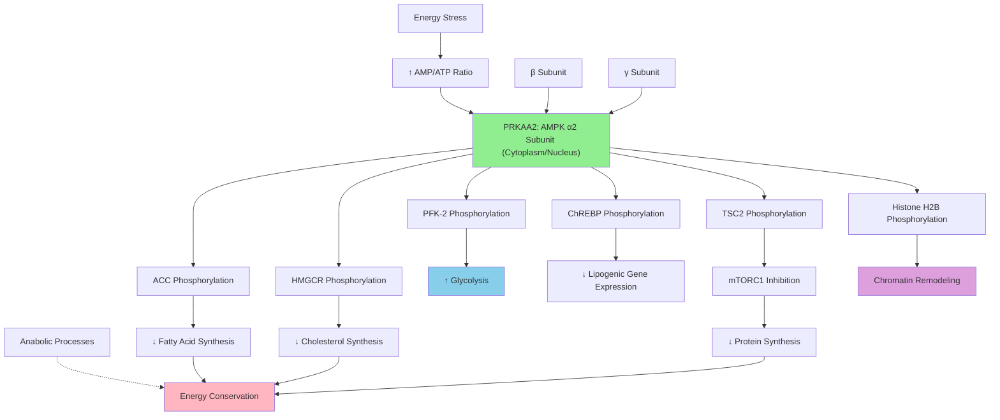

# Pathway Summary for Prkaa2

## Overview
PRKAA2 encodes the alpha-2 catalytic subunit of AMP-activated protein kinase (AMPK), a central cellular energy sensor that maintains energy homeostasis [Q09137]. As a serine/threonine kinase, PRKAA2 is activated when cellular AMP/ATP ratios rise, triggering phosphorylation of metabolic enzymes to suppress anabolic processes while promoting catabolic processes [Q09137]. The protein forms heterotrimeric complexes with regulatory beta and gamma subunits and phosphorylates key substrates including ACC, HMGCR, PFK-2, and ChREBP.

## Energy Sensing and Metabolic Switching
PRKAA2 functions as the catalytic component of AMPK, the master regulator of cellular energy homeostasis [Q09137]. When cellular energy levels drop (increased AMP/ATP ratio), the gamma regulatory subunit undergoes conformational changes that activate the alpha-2 kinase domain. This activation triggers a coordinated metabolic response that switches the cell from energy-consuming anabolic processes to energy-generating catabolic processes, ensuring cellular survival under energy stress conditions.

## Fatty Acid Metabolism Regulation
PRKAA2 directly regulates fatty acid metabolism by phosphorylating acetyl-CoA carboxylase (ACC), the rate-limiting enzyme in fatty acid synthesis [Q09137]. Phosphorylation of ACC by PRKAA2 inhibits the enzyme, effectively shutting down fatty acid synthesis during energy stress. Simultaneously, AMPK activation promotes fatty acid oxidation through phosphorylation of other metabolic enzymes, creating a coordinated shift toward energy production rather than storage.

## Cholesterol Biosynthesis Control
The protein regulates cholesterol homeostasis by phosphorylating and inhibiting HMG-CoA reductase (HMGCR), the rate-limiting enzyme in cholesterol biosynthesis [Q09137]. This phosphorylation-dependent inhibition prevents energy-expensive cholesterol synthesis when cellular energy is limited, redirecting metabolic resources toward essential survival processes. This regulatory mechanism links cellular energy status with lipid homeostasis.

## Glycolytic Pathway Enhancement
PRKAA2 promotes glycolysis during energy stress by phosphorylating 6-phosphofructo-2-kinase/fructose-2,6-bisphosphatase (PFK-2), stimulating its kinase activity and increasing fructose-2,6-bisphosphate levels [Q09137]. This allosteric activator enhances glycolytic flux, promoting glucose utilization for rapid ATP generation. The coordinate regulation of glycolysis represents a key mechanism for immediate energy production during metabolic stress.

## Pathway Diagram

## mTORC1 Signaling and Protein Synthesis
PRKAA2 regulates protein synthesis through phosphorylation of TSC2 and Raptor, leading to mTORC1 inhibition [file:rat/Prkaa2/Prkaa2-deep-research.md]. This regulatory mechanism reduces energy-expensive protein synthesis during metabolic stress, conserving cellular resources for essential processes. The AMPK-mTORC1 axis represents a fundamental regulatory network that coordinates cell growth with energy availability.

## Transcriptional Regulation and Gene Expression
The protein regulates metabolic gene expression by phosphorylating transcriptional regulators such as ChREBP (carbohydrate-responsive element-binding protein) [Q09137]. Phosphorylation of ChREBP by PRKAA2 inhibits its nuclear translocation and transcriptional activity, reducing expression of lipogenic genes during energy stress. This transcriptional control provides longer-term metabolic adaptations beyond immediate enzymatic regulation.

## Chromatin Remodeling and Epigenetic Regulation
Recent discoveries highlight PRKAA2's direct role in chromatin remodeling through phosphorylation of histone H2B under stress conditions [Q09137]. This epigenetic modification alters chromatin structure and gene accessibility, providing a mechanism for stress-responsive transcriptional changes. The coupling of energy sensing with chromatin dynamics represents an emerging area of AMPK function beyond traditional metabolic regulation.

## Autophagy and Cellular Quality Control
PRKAA2 promotes autophagy during energy stress by phosphorylating multiple autophagy regulators, including ULK1 and Beclin-1 [file:rat/Prkaa2/Prkaa2-deep-research.md]. This activation of autophagy provides an alternative energy source through degradation and recycling of cellular components, while also maintaining cellular quality control by removing damaged organelles and protein aggregates.

## Therapeutic Implications and Drug Development
PRKAA2 and AMPK represent important therapeutic targets for metabolic diseases including diabetes, obesity, and cancer [file:rat/Prkaa2/Prkaa2-deep-research.md]. Metformin, a widely used diabetes medication, works partly through AMPK activation. Understanding PRKAA2 function informs development of AMPK activators and modulators for treating metabolic disorders and age-related diseases.

## Tissue-Specific Functions and Isoform Differences
While PRKAA1 and PRKAA2 share similar enzymatic activities, they exhibit tissue-specific expression patterns and potentially distinct physiological roles [Q09137]. PRKAA2 is particularly important in liver and muscle tissues where it regulates systemic glucose and lipid homeostasis. Understanding isoform-specific functions may inform targeted therapeutic approaches for tissue-specific metabolic regulation.