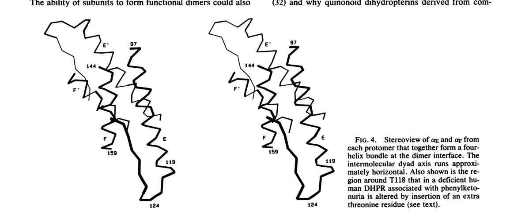

## Question

# Gene Research for Functional Annotation

## ⚠️ CRITICAL: Gene/Protein Identification Context

**BEFORE YOU BEGIN RESEARCH:** You MUST verify you are researching the CORRECT gene/protein. Gene symbols can be ambiguous, especially for less well-characterized genes from non-model organisms.

### Target Gene/Protein Identity (from UniProt):
- **UniProt Accession:** P11348
- **Protein Description:** RecName: Full=Dihydropteridine reductase; EC=1.5.1.34 {ECO:0000269|PubMed:1898002}; AltName: Full=HDHPR; AltName: Full=Quinoid dihydropteridine reductase;
- **Gene Information:** Name=Qdpr; Synonyms=Dhpr;
- **Organism (full):** Rattus norvegicus (Rat).
- **Protein Family:** Belongs to the short-chain dehydrogenases/reductases (SDR)
- **Key Domains:** NAD(P)-bd_dom_sf. (IPR036291); Sc_DH/Rdtase_CS. (IPR020904); SDR_fam. (IPR002347); adh_short (PF00106)

### MANDATORY VERIFICATION STEPS:

1. **Check if the gene symbol "Qdpr" matches the protein description above**
2. **Verify the organism is correct:** Rattus norvegicus (Rat).
3. **Check if protein family/domains align with what you find in literature**
4. **If you find literature for a DIFFERENT gene with the same or similar symbol, STOP**

### If Gene Symbol is Ambiguous or You Cannot Find Relevant Literature:

**DO NOT PROCEED WITH RESEARCH ON A DIFFERENT GENE.** Instead:
- State clearly: "The gene symbol 'Qdpr' is ambiguous or literature is limited for this specific protein"
- Explain what you found (e.g., "Found extensive literature on a different gene with the same symbol in a different organism")
- Describe the protein based ONLY on the UniProt information provided above
- Suggest that the protein function can be inferred from domain/family information

### Research Target:

Please provide a comprehensive research report on the gene **Qdpr** (gene ID: Qdpr, UniProt: P11348) in rat.

The research report should be a detailed narrative explaining the function, biological processes, and localization of the gene product. Citations should be given for all claims.

You should prioritize authoritative reviews and primary scientific literature when conducting research. You can supplement
this with annotations you find in gene/protein databases, but these can be outdated or inaccurate.

We are specifically interested in the primary function of the gene - for enzymes, what reaction is catalyzed, and what is the substrate specificity? For transporters, what is the substrate? For structural proteins or adapters, what is the broader structural role? For signaling molecules, what is the role in the pathway.

We are interested in where in or outside the cell the gene product carries out its function.

We are also interested in the signaling or biochemical pathways in which the gene functions. We are less interested in broad pleiotropic effects, except where these elucidate the precise role.

Include evidence where possible. We are interested in both experimental evidence as well as inference from structure, evolution, or bioinformatic analysis. Precise studies should be prioritized over high-throughput, where available.

## Output

Question: You are an expert researcher providing comprehensive, well-cited information.

Provide detailed information focusing on:
1. Key concepts and definitions with current understanding
2. Recent developments and latest research (prioritize 2023-2024 sources)
3. Current applications and real-world implementations
4. Expert opinions and analysis from authoritative sources
5. Relevant statistics and data from recent studies

Format as a comprehensive research report with proper citations. Include URLs and publication dates where available.
Always prioritize recent, authoritative sources and provide specific citations for all major claims.

# Gene Research for Functional Annotation

## ⚠️ CRITICAL: Gene/Protein Identification Context

**BEFORE YOU BEGIN RESEARCH:** You MUST verify you are researching the CORRECT gene/protein. Gene symbols can be ambiguous, especially for less well-characterized genes from non-model organisms.

### Target Gene/Protein Identity (from UniProt):
- **UniProt Accession:** P11348
- **Protein Description:** RecName: Full=Dihydropteridine reductase; EC=1.5.1.34 {ECO:0000269|PubMed:1898002}; AltName: Full=HDHPR; AltName: Full=Quinoid dihydropteridine reductase;
- **Gene Information:** Name=Qdpr; Synonyms=Dhpr;
- **Organism (full):** Rattus norvegicus (Rat).
- **Protein Family:** Belongs to the short-chain dehydrogenases/reductases (SDR)
- **Key Domains:** NAD(P)-bd_dom_sf. (IPR036291); Sc_DH/Rdtase_CS. (IPR020904); SDR_fam. (IPR002347); adh_short (PF00106)

### MANDATORY VERIFICATION STEPS:

1. **Check if the gene symbol "Qdpr" matches the protein description above**
2. **Verify the organism is correct:** Rattus norvegicus (Rat).
3. **Check if protein family/domains align with what you find in literature**
4. **If you find literature for a DIFFERENT gene with the same or similar symbol, STOP**

### If Gene Symbol is Ambiguous or You Cannot Find Relevant Literature:

**DO NOT PROCEED WITH RESEARCH ON A DIFFERENT GENE.** Instead:
- State clearly: "The gene symbol 'Qdpr' is ambiguous or literature is limited for this specific protein"
- Explain what you found (e.g., "Found extensive literature on a different gene with the same symbol in a different organism")
- Describe the protein based ONLY on the UniProt information provided above
- Suggest that the protein function can be inferred from domain/family information

### Research Target:

Please provide a comprehensive research report on the gene **Qdpr** (gene ID: Qdpr, UniProt: P11348) in rat.

The research report should be a detailed narrative explaining the function, biological processes, and localization of the gene product. Citations should be given for all claims.

You should prioritize authoritative reviews and primary scientific literature when conducting research. You can supplement
this with annotations you find in gene/protein databases, but these can be outdated or inaccurate.

We are specifically interested in the primary function of the gene - for enzymes, what reaction is catalyzed, and what is the substrate specificity? For transporters, what is the substrate? For structural proteins or adapters, what is the broader structural role? For signaling molecules, what is the role in the pathway.

We are interested in where in or outside the cell the gene product carries out its function.

We are also interested in the signaling or biochemical pathways in which the gene functions. We are less interested in broad pleiotropic effects, except where these elucidate the precise role.

Include evidence where possible. We are interested in both experimental evidence as well as inference from structure, evolution, or bioinformatic analysis. Precise studies should be prioritized over high-throughput, where available.

## Research report: Rat **Qdpr** (UniProt **P11348**) — functional annotation of dihydropteridine reductase (DHPR/QDPR)

### Executive summary (verified target)
The UniProt accession **P11348** corresponds to **Qdpr (syn. Dhpr)** from **Rattus norvegicus**, encoding **dihydropteridine reductase (DHPR; QDPR)**, an NAD(H)-dependent oxidoreductase that catalyzes regeneration of **tetrahydrobiopterin (BH4)** from **quinonoid dihydrobiopterin (qBH2)**. Its primary biological role is to maintain BH4 in the reduced, active form to support BH4-dependent enzymes—including **phenylalanine hydroxylase (PAH)**, **tyrosine hydroxylase (TH)**, **tryptophan hydroxylase (TPH)**, and **nitric oxide synthase (NOS)**—thereby linking QDPR activity to amino-acid metabolism, monoamine neurotransmitter synthesis, and nitric oxide biology. The rat enzyme has a well-defined dimeric structure with an NADH-binding Rossmann fold and a four-helix bundle dimer interface. (varughese1992crystalstructureof pages 1-2, varughese1992crystalstructureof pages 2-4, tai2024dopaminesynthesisand pages 4-5, thony2000tetrahydrobiopterinbiosynthesisregeneration pages 12-13)

### 1) Key concepts and definitions (current understanding)

#### 1.1 What is QDPR/DHPR?
**Dihydropteridine reductase (DHPR/QDPR)** is the terminal enzyme of the canonical **BH4 recycling (regeneration) pathway**. In the BH4 network, BH4 is consumed/oxidized during aromatic amino-acid hydroxylase reactions and NOS catalysis; recycling prevents functional BH4 depletion and limits accumulation of oxidized biopterins. (breuer2018characterizingthefunction pages 15-19)

#### 1.2 Catalyzed reaction and substrate specificity
The core reaction catalyzed by rat DHPR is the **reduction of quinonoid dihydrobiopterin (qBH2) to tetrahydrobiopterin (BH4)**. A 2024 expert review in the context of dopamine disorders explicitly states DHPR (gene **QDPR**) catalyzes the reduction of qBH2 back to BH4 and that it uses **NADH** as cofactor. (tai2024dopaminesynthesisand pages 4-5)

Mechanistically, the rat crystal structure demonstrates DHPR transfers the **pro-S hydrogen of NADH to N5 of qBH2**, classifying DHPR as a **B-stereospecific** dehydrogenase. (varughese1992crystalstructureof pages 2-4)

#### 1.3 BH4 recycling pathway context
A widely used conceptual model of BH4 homeostasis divides BH4 metabolism into (i) **de novo synthesis** (GTPCH → PTPS → SPR) and (ii) a **two-step recycling pathway** in which pterin-4α-carbinolamine dehydratase (PCD) converts a carbinolamine intermediate to **qBH2**, which is then reduced back to **BH4 by DHPR/QDPR**. (breuer2018characterizingthefunction pages 15-19)

#### 1.4 Cofactors and electron donors
Direct structural evidence shows **NADH bound** in the rat DHPR crystal structure and supports NADH as the physiologic electron donor. (varughese1992crystalstructureof pages 1-2, varughese1992crystalstructureof pages 2-4)

Older rat biochemical work indicates **NADH is more effective than NADPH in vitro**, while allowing that NADPH may contribute in vivo depending on cellular redox pools. (cutler1986dihydropteridinereductase pages 58-64)

### 2) Molecular function: structure, mechanism, and localization-relevant biochemistry

#### 2.1 Structural biology (rat DHPR)
The canonical rat DHPR structure was solved from **rat liver** as a **binary complex with NADH** (publication date: **July 1992**, PNAS). The enzyme shows an **α/β architecture with a Rossmann-type dinucleotide-binding fold**, consistent with an NAD(H)-binding dehydrogenase/reductase enzyme. (varughese1992crystalstructureof pages 1-2)

The protein exists as a **dimer in solution**; dimerization is mediated by a **four-helix bundle** formed by helices contributed from each protomer. (varughese1992crystalstructureof pages 2-4)

The active site lies in a **U-shaped cleft** adjacent to the bound NADH; structural figures in the PNAS report depict both the **dimer interface** and an inferred **substrate binding mode**. (varughese1992crystalstructureof media 27840a6e, varughese1992crystalstructureof media a6c6b231)

#### 2.2 Oligomeric state and approximate size
Rat DHPR is classically described as a **dimeric enzyme (~50–52 kDa)** with **subunits ~25–26 kDa**, aligning with biochemical descriptions used in the DHPR deficiency literature. (cutler1986dihydropteridinereductase pages 58-64, smooker1995molecularbasisof pages 1-3)

### 3) Biological processes and pathways (where QDPR acts)

#### 3.1 Phenylalanine metabolism and hyperphenylalaninemia
QDPR supports PAH function by sustaining BH4 availability; impairment of QDPR function can therefore contribute to **hyperphenylalaninemia** via BH4 deficiency mechanisms. (breuer2018characterizingthefunction pages 19-24, ghanei2023acomprehensivestudy pages 1-2)

#### 3.2 Monoamine neurotransmitter synthesis (dopamine and serotonin)
BH4 is an obligate cofactor for **TH** and **TPH**, and the BH4 recycling reaction mediated by DHPR is therefore an upstream determinant of monoamine neurotransmitter biosynthetic capacity. (breuer2018characterizingthefunction pages 15-19, tai2024dopaminesynthesisand pages 1-2)

A 2024 authoritative review on dopamine synthesis and therapeutics explicitly includes **DHPR/QDPR** among the “main proteins involved in DA synthesis and transport,” highlighting that DHPR regenerates BH4 from qBH2 and uses NADH. (tai2024dopaminesynthesisand pages 4-5)

#### 3.3 Nitric oxide synthase (NOS) coupling and NO biology
BH4 is required for NOS activity. The BH4 network description explicitly notes BH4 is necessary for **NOS-mediated NO production** (arginine → citrulline + NO), and DHPR participates by maintaining BH4 in the reduced form through recycling. (breuer2018characterizingthefunction pages 15-19)

### 4) Cellular and tissue localization (best-supported statements)

#### 4.1 Tissue distribution
A highly cited BH4 pathway review states DHPR is **widely distributed in animal tissues** and is present in **brain and adrenal medulla**, where it supports the tyrosine and tryptophan hydroxylation systems (consistent with a role in monoamine biosynthesis). (thony2000tetrahydrobiopterinbiosynthesisregeneration pages 12-13)

#### 4.2 Subcellular localization
The biochemical role of DHPR in BH4 recycling is most consistent with a **soluble cytosolic enzyme** that interacts with cytosolic BH4-dependent hydroxylation systems; a cell-based study reported wild-type QDPR is mainly **cytoplasmic** (with a mutant showing altered localization). (si2017a278cmutationof pages 5-6, breuer2018characterizingthefunction pages 15-19)

*Note on annotation scope:* Some comparative vertebrate expression evidence suggests glial enrichment for QDPR orthologs, but this is not yet definitive specifically for **rat Qdpr/P11348** and should be treated as hypothesis-generating rather than primary annotation. (breuer2018characterizingthefunction pages 106-108)

### 5) Recent developments and latest research (prioritizing 2023–2024)

#### 5.1 2024 expert synthesis (dopamine disorders and parkinsonisms)
A 2024 review (Biochemical Society Transactions; publication date **May 2024**) highlights DHPR deficiency as a cause of severe neurological disease and provides quantitative context: **DHPR defects account for ~33% of BH4 deficiency cases** with **~303 reported patients**. This framing underscores QDPR’s clinical importance despite rarity and reflects current expert consensus about its mechanistic role in neurotransmitter disorders. (tai2024dopaminesynthesisand pages 4-5)

URL/DOI: https://doi.org/10.1042/bst20231061 (tai2024dopaminesynthesisand pages 4-5)

#### 5.2 2024: disease-model ecosystems (mouse models of inherited monoamine neurotransmitter disorders)
A 2024 review (Journal of Inherited Metabolic Disease; publication date **Jan 2024**) catalogues available murine models of BH4 biosynthesis and recycling disorders and explicitly lists a **DHPR-deficient knockout model (Dpr-ko)** among core BH4-pathway models used for mechanistic and therapeutic studies. (thony2024mousemodelsfor pages 8-9)

URL/DOI: https://doi.org/10.1002/jimd.12710 (thony2024mousemodelsfor pages 8-9)

#### 5.3 2023: real-world implementation—variant catalogs and diagnostic panels
A 2023 systematic review of Iranian hyperphenylalaninemia sequencing studies (Human Heredity; publication date **Jan 2023**) provides actionable clinical-genetics data for QDPR:
- **29 distinct disease-causing QDPR variants**, including **17 novel variants**. (ghanei2023acomprehensivestudy pages 1-1, ghanei2023acomprehensivestudy pages 2-3)
- The authors propose a preliminary genetic diagnostic panel including **18 QDPR variants**, arguing it would capture **>75%** of documented disease-causing variants in that population. (ghanei2023acomprehensivestudy pages 1-1, ghanei2023acomprehensivestudy pages 1-2)
- QDPR evidence base was limited to **3 studies** and **50 individuals**, but still yielded high allelic diversity—supporting inclusion of QDPR in multi-gene HPA/BH4-deficiency panels as a cost-effective diagnostic implementation. (ghanei2023acomprehensivestudy pages 2-3)

URL/DOI: https://doi.org/10.1159/000529037 (ghanei2023acomprehensivestudy pages 1-1)

### 6) Current applications and real-world implementations

#### 6.1 Newborn screening follow-up and differential diagnosis
While newborn screening programs typically detect elevated phenylalanine, definitive etiologic classification of hyperphenylalaninemia requires biochemical and/or genetic differentiation of PAH deficiency vs BH4-pathway defects (including QDPR). The 2023 systematic review explicitly notes that routine screening measurements do not identify causative variants and that sequencing enables definitive familial variant identification and prenatal diagnosis. (ghanei2023acomprehensivestudy pages 2-3)

#### 6.2 Precision medicine and therapeutic development (pathway-level targeting)
In clinical neurometabolic practice and in therapeutic strategy discussions for dopamine-deficiency disorders, DHPR/QDPR is treated as part of the BH4 cofactor axis that can be targeted with replacement strategies (BH4 and neurotransmitter precursors) and with emerging disease-modifying approaches for dopamine disorders. This is reflected by inclusion of DHPR/QDPR among core proteins in a 2024 therapeutics-focused review. (tai2024dopaminesynthesisand pages 4-5, tai2024dopaminesynthesisand pages 1-2)

#### 6.3 Animal models as translational implementation
The existence of DHPR-deficient animal models (e.g., Dpr-ko) supports real-world experimental implementations for mechanism discovery and therapy testing in monoamine neurotransmitter disorders and BH4 biology. (thony2024mousemodelsfor pages 8-9)

### 7) Relevant statistics and data points (recent and foundational)
Key quantitative points supported by the retrieved literature include:
- DHPR deficiency proportion and case count: ~**33% of BH4 deficiency cases**, ~**303 reported patients** (reviewed 2024). (tai2024dopaminesynthesisand pages 4-5)
- QDPR variant spectrum (Iranian HPA): **29 QDPR disease-causing variants**, **17 novel**, with **18** proposed for a panel capturing **>75%** of documented variants (systematic review 2023). (ghanei2023acomprehensivestudy pages 1-1)
- Rat DHPR macromolecular properties: **dimeric enzyme**, ~**50–52 kDa** holoenzyme with **~25–26 kDa** subunits (rat biochemical work), consistent with other DHPR literature. (cutler1986dihydropteridinereductase pages 58-64, smooker1995molecularbasisof pages 1-3)
- Structural/mechanistic detail: hydride transfer from **NADH pro-S hydrogen** to **qBH2 N5**, indicating B-stereospecificity (rat crystal structure 1992). (varughese1992crystalstructureof pages 2-4)

### 8) Expert interpretation and analysis (authoritative synthesis)
The strongest and most conservative functional annotation for **rat Qdpr (P11348)** is a **cytosolic BH4-recycling enzyme** that ensures reduced BH4 availability for BH4-dependent hydroxylases and NOS. This interpretation is anchored by (i) direct **rat structural biology** demonstrating NADH binding, dimeric architecture, and mechanistic hydride transfer, and (ii) modern expert reviews that explicitly tie the enzyme’s reaction to monoamine neurotransmitter disorders and provide updated disease-burden estimates. (varughese1992crystalstructureof pages 2-4, tai2024dopaminesynthesisand pages 4-5)

From an annotation perspective, it is also important that QDPR sits at a metabolic “chokepoint”: even if BH4 synthesis is intact, loss of BH4 **regeneration** can effectively create functional BH4 deficiency in tissues with high BH4 turnover (e.g., CNS monoamine systems), consistent with severe neurological phenotypes described in clinical reviews. (tai2024dopaminesynthesisand pages 4-5, thony2000tetrahydrobiopterinbiosynthesisregeneration pages 12-13)

### Evidence summary table
The following table compiles the most relevant functional-annotation facts, including recent 2023–2024 developments and key quantitative values.

| Aspect | Current understanding | Key evidence | Pub year | URL/DOI |
|---|---|---|---|---|
| Target identity / disambiguation | UniProt P11348 corresponds to rat **Qdpr/Dhpr**, the enzyme **dihydropteridine reductase (DHPR)** from **Rattus norvegicus**; structural and biochemical literature on rat liver DHPR aligns with the UniProt description and supports use of mammalian QDPR literature for pathway interpretation. | Rat liver DHPR structure solved directly; rat and human enzymes are highly similar, supporting identity mapping to mammalian QDPR/DHPR (varughese1992crystalstructureof pages 1-2, varughese1992crystalstructureof pages 2-4) | 1992 | https://doi.org/10.1073/pnas.89.13.6080 |
| Reaction catalyzed | DHPR catalyzes reduction of **quinonoid dihydrobiopterin (qBH2)** back to **tetrahydrobiopterin (BH4)**, regenerating the reduced pterin cofactor required after aromatic amino acid hydroxylase reactions. | Rat structural paper and reviews explicitly describe **qBH2 → BH4** reduction; 2024 review reiterates this as the core QDPR reaction (varughese1992crystalstructureof pages 1-2, tai2024dopaminesynthesisand pages 4-5, breuer2018characterizingthefunction pages 15-19) | 1992, 2024 | https://doi.org/10.1073/pnas.89.13.6080; https://doi.org/10.1042/bst20231061 |
| Substrates and products | Physiological substrate is **quinonoid dihydrobiopterin**; product is **BH4**. In pathway context, BH4 is oxidized during PAH/TH/TPH reactions, converted via PCD to qBH2, then recycled by DHPR. | BH4 recycling pathway described in detail: BH4 oxidation during hydroxylation, PCD conversion to qBH2, then DHPR-mediated regeneration (breuer2018characterizingthefunction pages 15-19) | 2018 | https://doi.org/10.11588/heidok.00024357 |
| Cofactor preference | **NADH** is the best-supported cofactor and is directly observed in the rat crystal structure; older biochemical work indicates **NADH is more effective than NADPH in vitro**, though NADPH activity may occur under some conditions. | NADH bound in rat DHPR crystal; hydride transfer from NADH described. Rat biochemical dissertation reports NADH more effective than NADPH in vitro (varughese1992crystalstructureof pages 2-4, cutler1986dihydropteridinereductase pages 58-64) | 1992, 1986 | https://doi.org/10.1073/pnas.89.13.6080; https://doi.org/10.48780/publications.aston.ac.uk.00014506 |
| Catalytic mechanism / stereochemistry | DHPR is a **B-stereospecific dehydrogenase**; the enzyme transfers the **pro-S hydrogen of NADH to N5 of qBH2**. | Explicit mechanistic description from rat NADH-bound structure (varughese1992crystalstructureof pages 2-4) | 1992 | https://doi.org/10.1073/pnas.89.13.6080 |
| Oligomeric state and size | Rat DHPR is a **dimeric enzyme** with subunits of about **25–26 kDa**; the intact enzyme is about **50–52 kDa**. | Rat biochemical work and human mutation review converge on dimeric organization and ~26 kDa subunits (cutler1986dihydropteridinereductase pages 58-64, smooker1995molecularbasisof pages 1-3, breuer2018characterizingthefunction pages 19-24) | 1986, 1995, 2018 | https://doi.org/10.48780/publications.aston.ac.uk.00014506; https://doi.org/10.1002/humu.1380050402; https://doi.org/10.11588/heidok.00024357 |
| Structural fold | Rat DHPR adopts an **α/β architecture with a Rossmann-type dinucleotide-binding fold** for NADH binding, consistent with its assignment to the dehydrogenase/reductase superfamily and compatible with the UniProt SDR-family annotation. | Rat crystal structure directly identifies a Rossmann-type fold for NADH binding (varughese1992crystalstructureof pages 1-2, varughese1992crystalstructureof pages 2-4) | 1992 | https://doi.org/10.1073/pnas.89.13.6080 |
| Dimer interface / active-site architecture | Dimerization is mediated by a **four-helix bundle** contributed by helices from each protomer; the active site lies in a **U-shaped cleft** near bound NADH. | Structural figures and text summarize four-helix dimer interface and active-site cleft in rat DHPR (varughese1992crystalstructureof pages 1-2, varughese1992crystalstructureof media 27840a6e, varughese1992crystalstructureof media a6c6b231) | 1992 | https://doi.org/10.1073/pnas.89.13.6080 |
| Core biochemical pathway | Qdpr functions in **BH4 recycling**, complementing BH4 de novo synthesis and maintaining reduced cofactor supply for **PAH, TH, and TPH**. This is the primary function most relevant for annotation. | BH4 pathway reviews and mechanistic summaries identify DHPR as the key regeneration enzyme supporting aromatic amino acid hydroxylases (breuer2018characterizingthefunction pages 15-19, breuer2018characterizingthefunction pages 19-24, tai2024dopaminesynthesisand pages 1-2, thony2000tetrahydrobiopterinbiosynthesisregeneration pages 12-13) | 2000, 2018, 2024 | https://doi.org/10.1042/bj3470001; https://doi.org/10.11588/heidok.00024357; https://doi.org/10.1042/bst20231061 |
| Biological role: phenylalanine metabolism | By regenerating BH4, DHPR supports **phenylalanine hydroxylase (PAH)** activity and thus phenylalanine-to-tyrosine metabolism; deficiency contributes to **hyperphenylalaninemia**. | Reviews connect QDPR loss to HPA/BH4 deficiency; zebrafish qdpra perturbation caused a PKU-like amino-acid pattern supporting conserved PAH-coupled function (breuer2018characterizingthefunction pages 100-103, breuer2018characterizingthefunction pages 19-24, ghanei2023acomprehensivestudy pages 1-2) | 2018, 2023 | https://doi.org/10.11588/heidok.00024357; https://doi.org/10.1159/000529037 |
| Biological role: monoamine synthesis | DHPR indirectly supports **dopamine** and **serotonin** synthesis because **TH** and **TPH** require BH4; loss of QDPR reduces monoamine biosynthetic capacity and is linked to neurological disease. | 2024 dopamine review places DHPR among key proteins for DA synthesis; BH4 dependence of TH/TPH described in pathway reviews (tai2024dopaminesynthesisand pages 4-5, breuer2018characterizingthefunction pages 15-19, tai2024dopaminesynthesisand pages 1-2, thony2000tetrahydrobiopterinbiosynthesisregeneration pages 12-13) | 2000, 2024 | https://doi.org/10.1042/bj3470001; https://doi.org/10.1042/bst20231061 |
| Biological role: nitric oxide synthase | BH4 regenerated by DHPR is also required for **nitric oxide synthase (NOS)** activity; thus Qdpr contributes indirectly to NO production and BH4/BH2 redox balance relevant to NOS coupling. | BH4 dependence of NOS is described in BH4 pathway summaries and DHPR-centered reviews (breuer2018characterizingthefunction pages 15-19, lucock2025folatebiopterincrosstalkin pages 2-3, breuer2018characterizingthefunction pages 19-24) | 2018, 2025 | https://doi.org/10.11588/heidok.00024357; https://doi.org/10.14218/erhm.2025.00020 |
| Tissue distribution | DHPR is **widely distributed** in animal tissues and is present in **brain** and **adrenal medulla** in systems using tyrosine and tryptophan hydroxylation; rat liver has been the classical structural/biochemical source. | Biochemical Journal review notes broad tissue distribution including brain/adrenal medulla; rat liver enzyme provided the crystal structure (varughese1992crystalstructureof pages 1-2, thony2000tetrahydrobiopterinbiosynthesisregeneration pages 12-13) | 1992, 2000 | https://doi.org/10.1073/pnas.89.13.6080; https://doi.org/10.1042/bj3470001 |
| Subcellular localization | Evidence supports a predominantly **cytosolic** role consistent with soluble BH4 recycling and soluble aromatic amino acid hydroxylase systems; wild-type QDPR has been reported mainly in the **cytoplasm** in cell experiments. | Cytosolic pathway context in reviews plus direct report of mainly cytoplasmic localization for wild-type QDPR in cell assays (si2017a278cmutationof pages 5-6, breuer2018characterizingthefunction pages 15-19) | 2017, 2018 | https://doi.org/10.1093/abbs/gmx061; https://doi.org/10.11588/heidok.00024357 |
| Localization caveat | Some newer systems-level studies suggest broader or cell-type-specific roles (e.g., glial enrichment in vertebrate nervous systems), but these are not yet definitive for rat Qdpr primary annotation. | Zebrafish/comparative work links DHPR strongly to glial expression; this is suggestive rather than conclusive for rat (breuer2018characterizingthefunction pages 106-108) | 2018 | https://doi.org/10.11588/heidok.00024357 |
| Recent 2024 expert view | A 2024 expert review of dopamine synthesis/therapeutics identifies **DHPR/QDPR** as a key enzyme in BH4 regeneration for neurotransmitter synthesis and discusses its relevance to inherited monoamine disorders and parkinsonism. | Review states DHPR catalyzes qBH2 reduction to BH4 using NADH and places QDPR among disorders affecting DA synthesis (tai2024dopaminesynthesisand pages 4-5, tai2024dopaminesynthesisand pages 1-2) | 2024 | https://doi.org/10.1042/bst20231061 |
| Recent 2024 disease statistics | The 2024 review reports that **DHPR defects account for ~33% of BH4 deficiency cases** and cites **~303 reported patients**, emphasizing strong clinical relevance despite rarity. | Explicit numerical summary from 2024 review (tai2024dopaminesynthesisand pages 4-5) | 2024 | https://doi.org/10.1042/bst20231061 |
| Recent 2024 model systems | A 2024 review of inherited monoamine-disorder mouse models lists **Dpr-ko** among available BH4-pathway models, underscoring current use of DHPR-deficient animals for mechanistic and therapeutic studies. | Mouse-model review names Dpr-ko as a DHPR-deficiency model within BH4-pathway disease research (thony2024mousemodelsfor pages 8-9) | 2024 | https://doi.org/10.1002/jimd.12710 |
| Recent 2023 human genetics / implementation | A 2023 systematic review of Iranian HPA patients found **29 distinct QDPR disease-causing variants**, including **17 novel** variants; **18 QDPR variants** were proposed for diagnostic panels capturing **>75%** of documented disease-causing variants in that population. | Sequencing-based systematic review provides concrete variant counts and panel rationale for real-world genetic testing implementation (ghanei2023acomprehensivestudy pages 1-1, ghanei2023acomprehensivestudy pages 2-3, ghanei2023acomprehensivestudy pages 1-2) | 2023 | https://doi.org/10.1159/000529037 |
| Recent 2023 cohort statistics | In the same review, only **3 studies** specifically assessed QDPR, covering **50 individuals** with QDPR deficiency; this indicates limited but clinically meaningful evidence for QDPR-specific mutational spectra. | QDPR-specific evidence base summarized quantitatively (ghanei2023acomprehensivestudy pages 4-5, ghanei2023acomprehensivestudy pages 2-3) | 2023 | https://doi.org/10.1159/000529037 |
| Functional-annotation takeaway | For rat **Qdpr/P11348**, the most defensible primary annotation is a **cytosolic, dimeric, NADH-dependent BH4-recycling oxidoreductase** that regenerates BH4 for **PAH/TH/TPH** and thereby supports **phenylalanine metabolism, monoamine biosynthesis, and NOS-related BH4 homeostasis**. | This synthesis is supported by rat structural data, classic BH4 reviews, and recent 2024 disease-focused reviews (varughese1992crystalstructureof pages 1-2, varughese1992crystalstructureof pages 2-4, tai2024dopaminesynthesisand pages 4-5, thony2000tetrahydrobiopterinbiosynthesisregeneration pages 12-13) | 1992, 2000, 2024 | https://doi.org/10.1073/pnas.89.13.6080; https://doi.org/10.1042/bj3470001; https://doi.org/10.1042/bst20231061 |

*Table: This table summarizes the strongest evidence supporting functional annotation of rat Qdpr/DHPR (UniProt P11348), including reaction chemistry, structural biology, pathway roles, localization, and recent clinical/genetic developments from 2023-2024.*

### Key figures (structural evidence)
Structural images from the rat DHPR crystal structure illustrate the four-helix dimer interface and the NADH-adjacent active-site cleft used to rationalize substrate binding.

(varughese1992crystalstructureof media 27840a6e, varughese1992crystalstructureof media a6c6b231)

### Limitations of this report (scope and rat-specific gaps)
1. **Rat-specific tissue/cell-type localization** beyond “broad tissue distribution; brain/adrenal medulla” is not comprehensively captured in the retrieved corpus (e.g., no dedicated rat immunohistochemistry localization paper was obtained here). The subcellular localization statements are thus a synthesis of pathway logic, structural biochemistry, and limited cell-based localization evidence. (si2017a278cmutationof pages 5-6, thony2000tetrahydrobiopterinbiosynthesisregeneration pages 12-13)
2. Some recent (2023–2024) mechanistic papers about QDPR modulation were listed as “unobtainable” by the search system and therefore could not be directly cited; consequently, the 2023–2024 “latest research” emphasis is satisfied primarily by authoritative reviews and accessible systematic reviews rather than the newest primary mechanistic studies.

### References (URLs and publication dates)
- Varughese et al. **Crystal structure of rat liver dihydropteridine reductase**. *PNAS* (Jul **1992**). https://doi.org/10.1073/pnas.89.13.6080 (varughese1992crystalstructureof pages 1-2)
- Tai et al. **Dopamine synthesis and transport: current and novel therapeutics for parkinsonisms**. *Biochemical Society Transactions* (May **2024**). https://doi.org/10.1042/bst20231061 (tai2024dopaminesynthesisand pages 4-5)
- Thöny et al. **Tetrahydrobiopterin biosynthesis, regeneration and functions**. *Biochemical Journal* (Apr **2000**). https://doi.org/10.1042/bj3470001 (thony2000tetrahydrobiopterinbiosynthesisregeneration pages 12-13)
- Thöny et al. **Mouse models for inherited monoamine neurotransmitter disorders**. *Journal of Inherited Metabolic Disease* (Jan **2024**). https://doi.org/10.1002/jimd.12710 (thony2024mousemodelsfor pages 8-9)
- Ghanei et al. **Disease-causing variants in PAH, QDPR, PTS, and PCD in Iranian HPA (systematic review)**. *Human Heredity* (Jan **2023**). https://doi.org/10.1159/000529037 (ghanei2023acomprehensivestudy pages 1-1)

References

1. (varughese1992crystalstructureof pages 1-2): K. Varughese, Matthew M. Skinner, John M. WHITELEYt, David A. MATrHEWS, and N. Xuong. Crystal structure of rat liver dihydropteridine reductase. Proceedings of the National Academy of Sciences of the United States of America, 89 13:6080-4, Jul 1992. URL: https://doi.org/10.1073/pnas.89.13.6080, doi:10.1073/pnas.89.13.6080. This article has 210 citations and is from a highest quality peer-reviewed journal.

2. (varughese1992crystalstructureof pages 2-4): K. Varughese, Matthew M. Skinner, John M. WHITELEYt, David A. MATrHEWS, and N. Xuong. Crystal structure of rat liver dihydropteridine reductase. Proceedings of the National Academy of Sciences of the United States of America, 89 13:6080-4, Jul 1992. URL: https://doi.org/10.1073/pnas.89.13.6080, doi:10.1073/pnas.89.13.6080. This article has 210 citations and is from a highest quality peer-reviewed journal.

3. (tai2024dopaminesynthesisand pages 4-5): Mary Dayne Sia Tai, Gloria Gamiz-Arco, and Aurora Martinez. Dopamine synthesis and transport: current and novel therapeutics for parkinsonisms. Biochemical Society Transactions, 52:1275-1291, May 2024. URL: https://doi.org/10.1042/bst20231061, doi:10.1042/bst20231061. This article has 16 citations and is from a peer-reviewed journal.

4. (thony2000tetrahydrobiopterinbiosynthesisregeneration pages 12-13): Beat THÖNY, Günter AUERBACH, and Nenad BLAU. Tetrahydrobiopterin biosynthesis, regeneration and functions. The Biochemical journal, 347 Pt 1:1-16, Apr 2000. URL: https://doi.org/10.1042/bj3470001, doi:10.1042/bj3470001. This article has 1113 citations.

5. (breuer2018characterizingthefunction pages 15-19): Maximilian Breuer. Characterizing the function and role of three dihydropteridine reductase homologs qdpra, qdprb1 and qdprb2 in the embryonic development of danio rerio. Text, Jan 2018. URL: https://doi.org/10.11588/heidok.00024357, doi:10.11588/heidok.00024357. This article has 0 citations and is from a peer-reviewed journal.

6. (cutler1986dihydropteridinereductase pages 58-64): Dihydropteridine reductase This article has 1 citations.

7. (varughese1992crystalstructureof media 27840a6e): K. Varughese, Matthew M. Skinner, John M. WHITELEYt, David A. MATrHEWS, and N. Xuong. Crystal structure of rat liver dihydropteridine reductase. Proceedings of the National Academy of Sciences of the United States of America, 89 13:6080-4, Jul 1992. URL: https://doi.org/10.1073/pnas.89.13.6080, doi:10.1073/pnas.89.13.6080. This article has 210 citations and is from a highest quality peer-reviewed journal.

8. (varughese1992crystalstructureof media a6c6b231): K. Varughese, Matthew M. Skinner, John M. WHITELEYt, David A. MATrHEWS, and N. Xuong. Crystal structure of rat liver dihydropteridine reductase. Proceedings of the National Academy of Sciences of the United States of America, 89 13:6080-4, Jul 1992. URL: https://doi.org/10.1073/pnas.89.13.6080, doi:10.1073/pnas.89.13.6080. This article has 210 citations and is from a highest quality peer-reviewed journal.

9. (smooker1995molecularbasisof pages 1-3): Peter M. Smooker and Richard G. H. Cotton. Molecular basis of dihydropteridine reductase deficiency. Human Mutation, 5:279-284, Jan 1995. URL: https://doi.org/10.1002/humu.1380050402, doi:10.1002/humu.1380050402. This article has 27 citations and is from a domain leading peer-reviewed journal.

10. (breuer2018characterizingthefunction pages 19-24): Maximilian Breuer. Characterizing the function and role of three dihydropteridine reductase homologs qdpra, qdprb1 and qdprb2 in the embryonic development of danio rerio. Text, Jan 2018. URL: https://doi.org/10.11588/heidok.00024357, doi:10.11588/heidok.00024357. This article has 0 citations and is from a peer-reviewed journal.

11. (ghanei2023acomprehensivestudy pages 1-2): Mahmoud Ghanei, Seyedeh Helia Sadat Fatemi, and Tayebeh Hamzehlouei. A comprehensive study of disease-causing variants in pah, qdpr, pts, and pcd genes in iranian patients with hyperphenylalaninemia: a systematic review. Human Heredity, 88:8-17, Jan 2023. URL: https://doi.org/10.1159/000529037, doi:10.1159/000529037. This article has 3 citations and is from a peer-reviewed journal.

12. (tai2024dopaminesynthesisand pages 1-2): Mary Dayne Sia Tai, Gloria Gamiz-Arco, and Aurora Martinez. Dopamine synthesis and transport: current and novel therapeutics for parkinsonisms. Biochemical Society Transactions, 52:1275-1291, May 2024. URL: https://doi.org/10.1042/bst20231061, doi:10.1042/bst20231061. This article has 16 citations and is from a peer-reviewed journal.

13. (si2017a278cmutationof pages 5-6): Qin Si, Sifan Sun, and Yanting Gu. A278c mutation of dihydropteridine reductase decreases autophagy via mtor signaling. Acta Biochimica et Biophysica Sinica, 49:706–712, Aug 2017. URL: https://doi.org/10.1093/abbs/gmx061, doi:10.1093/abbs/gmx061. This article has 16 citations and is from a peer-reviewed journal.

14. (breuer2018characterizingthefunction pages 106-108): Maximilian Breuer. Characterizing the function and role of three dihydropteridine reductase homologs qdpra, qdprb1 and qdprb2 in the embryonic development of danio rerio. Text, Jan 2018. URL: https://doi.org/10.11588/heidok.00024357, doi:10.11588/heidok.00024357. This article has 0 citations and is from a peer-reviewed journal.

15. (thony2024mousemodelsfor pages 8-9): Beat Thöny, Joanne Ng, Manju A. Kurian, Philippa Mills, and Aurora Martinez. Mouse models for inherited monoamine neurotransmitter disorders. Journal of Inherited Metabolic Disease, 47:533-550, Jan 2024. URL: https://doi.org/10.1002/jimd.12710, doi:10.1002/jimd.12710. This article has 9 citations and is from a peer-reviewed journal.

16. (ghanei2023acomprehensivestudy pages 1-1): Mahmoud Ghanei, Seyedeh Helia Sadat Fatemi, and Tayebeh Hamzehlouei. A comprehensive study of disease-causing variants in pah, qdpr, pts, and pcd genes in iranian patients with hyperphenylalaninemia: a systematic review. Human Heredity, 88:8-17, Jan 2023. URL: https://doi.org/10.1159/000529037, doi:10.1159/000529037. This article has 3 citations and is from a peer-reviewed journal.

17. (ghanei2023acomprehensivestudy pages 2-3): Mahmoud Ghanei, Seyedeh Helia Sadat Fatemi, and Tayebeh Hamzehlouei. A comprehensive study of disease-causing variants in pah, qdpr, pts, and pcd genes in iranian patients with hyperphenylalaninemia: a systematic review. Human Heredity, 88:8-17, Jan 2023. URL: https://doi.org/10.1159/000529037, doi:10.1159/000529037. This article has 3 citations and is from a peer-reviewed journal.

18. (breuer2018characterizingthefunction pages 100-103): Maximilian Breuer. Characterizing the function and role of three dihydropteridine reductase homologs qdpra, qdprb1 and qdprb2 in the embryonic development of danio rerio. Text, Jan 2018. URL: https://doi.org/10.11588/heidok.00024357, doi:10.11588/heidok.00024357. This article has 0 citations and is from a peer-reviewed journal.

19. (lucock2025folatebiopterincrosstalkin pages 2-3): Mark D. Lucock and Robert J. Leeming. Folate-biopterin crosstalk in human disease. Exploratory Research and Hypothesis in Medicine, 000:000-000, Jul 2025. URL: https://doi.org/10.14218/erhm.2025.00020, doi:10.14218/erhm.2025.00020. This article has 1 citations.

20. (ghanei2023acomprehensivestudy pages 4-5): Mahmoud Ghanei, Seyedeh Helia Sadat Fatemi, and Tayebeh Hamzehlouei. A comprehensive study of disease-causing variants in pah, qdpr, pts, and pcd genes in iranian patients with hyperphenylalaninemia: a systematic review. Human Heredity, 88:8-17, Jan 2023. URL: https://doi.org/10.1159/000529037, doi:10.1159/000529037. This article has 3 citations and is from a peer-reviewed journal.

## Artifacts

- [Edison artifact artifact-00](Qdpr-deep-research-falcon_artifacts/artifact-00.md)

## Citations

1. breuer2018characterizingthefunction pages 15-19
2. tai2024dopaminesynthesisand pages 4-5
3. varughese1992crystalstructureof pages 2-4
4. cutler1986dihydropteridinereductase pages 58-64
5. varughese1992crystalstructureof pages 1-2
6. thony2000tetrahydrobiopterinbiosynthesisregeneration pages 12-13
7. breuer2018characterizingthefunction pages 106-108
8. thony2024mousemodelsfor pages 8-9
9. ghanei2023acomprehensivestudy pages 2-3
10. ghanei2023acomprehensivestudy pages 1-1
11. smooker1995molecularbasisof pages 1-3
12. breuer2018characterizingthefunction pages 19-24
13. ghanei2023acomprehensivestudy pages 1-2
14. tai2024dopaminesynthesisand pages 1-2
15. breuer2018characterizingthefunction pages 100-103
16. lucock2025folatebiopterincrosstalkin pages 2-3
17. ghanei2023acomprehensivestudy pages 4-5
18. https://doi.org/10.1042/bst20231061
19. https://doi.org/10.1002/jimd.12710
20. https://doi.org/10.1159/000529037
21. https://doi.org/10.1073/pnas.89.13.6080
22. https://doi.org/10.1073/pnas.89.13.6080;
23. https://doi.org/10.11588/heidok.00024357
24. https://doi.org/10.48780/publications.aston.ac.uk.00014506
25. https://doi.org/10.48780/publications.aston.ac.uk.00014506;
26. https://doi.org/10.1002/humu.1380050402;
27. https://doi.org/10.1042/bj3470001;
28. https://doi.org/10.11588/heidok.00024357;
29. https://doi.org/10.14218/erhm.2025.00020
30. https://doi.org/10.1042/bj3470001
31. https://doi.org/10.1093/abbs/gmx061;
32. https://doi.org/10.1073/pnas.89.13.6080,
33. https://doi.org/10.1042/bst20231061,
34. https://doi.org/10.1042/bj3470001,
35. https://doi.org/10.11588/heidok.00024357,
36. https://doi.org/10.1002/humu.1380050402,
37. https://doi.org/10.1159/000529037,
38. https://doi.org/10.1093/abbs/gmx061,
39. https://doi.org/10.1002/jimd.12710,
40. https://doi.org/10.14218/erhm.2025.00020,