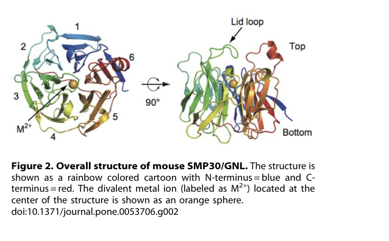

## Question

# Gene Research for Functional Annotation

## ⚠️ CRITICAL: Gene/Protein Identification Context

**BEFORE YOU BEGIN RESEARCH:** You MUST verify you are researching the CORRECT gene/protein. Gene symbols can be ambiguous, especially for less well-characterized genes from non-model organisms.

### Target Gene/Protein Identity (from UniProt):
- **UniProt Accession:** Q03336
- **Protein Description:** RecName: Full=Regucalcin; Short=RC; AltName: Full=Gluconolactonase; Short=GNL; EC=3.1.1.17; AltName: Full=Senescence marker protein 30; Short=SMP-30;
- **Gene Information:** Name=Rgn; Synonyms=Smp30;
- **Organism (full):** Rattus norvegicus (Rat).
- **Protein Family:** Belongs to the SMP-30/CGR1 family. .
- **Key Domains:** 6-blade_b-propeller_TolB-like. (IPR011042); Regucalcin. (IPR008367); SGL. (IPR013658); SMP-30. (IPR005511); SGL (PF08450)

### MANDATORY VERIFICATION STEPS:

1. **Check if the gene symbol "Rgn" matches the protein description above**
2. **Verify the organism is correct:** Rattus norvegicus (Rat).
3. **Check if protein family/domains align with what you find in literature**
4. **If you find literature for a DIFFERENT gene with the same or similar symbol, STOP**

### If Gene Symbol is Ambiguous or You Cannot Find Relevant Literature:

**DO NOT PROCEED WITH RESEARCH ON A DIFFERENT GENE.** Instead:
- State clearly: "The gene symbol 'Rgn' is ambiguous or literature is limited for this specific protein"
- Explain what you found (e.g., "Found extensive literature on a different gene with the same symbol in a different organism")
- Describe the protein based ONLY on the UniProt information provided above
- Suggest that the protein function can be inferred from domain/family information

### Research Target:

Please provide a comprehensive research report on the gene **Rgn** (gene ID: Rgn, UniProt: Q03336) in rat.

The research report should be a detailed narrative explaining the function, biological processes, and localization of the gene product. Citations should be given for all claims.

You should prioritize authoritative reviews and primary scientific literature when conducting research. You can supplement
this with annotations you find in gene/protein databases, but these can be outdated or inaccurate.

We are specifically interested in the primary function of the gene - for enzymes, what reaction is catalyzed, and what is the substrate specificity? For transporters, what is the substrate? For structural proteins or adapters, what is the broader structural role? For signaling molecules, what is the role in the pathway.

We are interested in where in or outside the cell the gene product carries out its function.

We are also interested in the signaling or biochemical pathways in which the gene functions. We are less interested in broad pleiotropic effects, except where these elucidate the precise role.

Include evidence where possible. We are interested in both experimental evidence as well as inference from structure, evolution, or bioinformatic analysis. Precise studies should be prioritized over high-throughput, where available.

## Output

Question: You are an expert researcher providing comprehensive, well-cited information.

Provide detailed information focusing on:
1. Key concepts and definitions with current understanding
2. Recent developments and latest research (prioritize 2023-2024 sources)
3. Current applications and real-world implementations
4. Expert opinions and analysis from authoritative sources
5. Relevant statistics and data from recent studies

Format as a comprehensive research report with proper citations. Include URLs and publication dates where available.
Always prioritize recent, authoritative sources and provide specific citations for all major claims.

# Gene Research for Functional Annotation

## ⚠️ CRITICAL: Gene/Protein Identification Context

**BEFORE YOU BEGIN RESEARCH:** You MUST verify you are researching the CORRECT gene/protein. Gene symbols can be ambiguous, especially for less well-characterized genes from non-model organisms.

### Target Gene/Protein Identity (from UniProt):
- **UniProt Accession:** Q03336
- **Protein Description:** RecName: Full=Regucalcin; Short=RC; AltName: Full=Gluconolactonase; Short=GNL; EC=3.1.1.17; AltName: Full=Senescence marker protein 30; Short=SMP-30;
- **Gene Information:** Name=Rgn; Synonyms=Smp30;
- **Organism (full):** Rattus norvegicus (Rat).
- **Protein Family:** Belongs to the SMP-30/CGR1 family. .
- **Key Domains:** 6-blade_b-propeller_TolB-like. (IPR011042); Regucalcin. (IPR008367); SGL. (IPR013658); SMP-30. (IPR005511); SGL (PF08450)

### MANDATORY VERIFICATION STEPS:

1. **Check if the gene symbol "Rgn" matches the protein description above**
2. **Verify the organism is correct:** Rattus norvegicus (Rat).
3. **Check if protein family/domains align with what you find in literature**
4. **If you find literature for a DIFFERENT gene with the same or similar symbol, STOP**

### If Gene Symbol is Ambiguous or You Cannot Find Relevant Literature:

**DO NOT PROCEED WITH RESEARCH ON A DIFFERENT GENE.** Instead:
- State clearly: "The gene symbol 'Rgn' is ambiguous or literature is limited for this specific protein"
- Explain what you found (e.g., "Found extensive literature on a different gene with the same symbol in a different organism")
- Describe the protein based ONLY on the UniProt information provided above
- Suggest that the protein function can be inferred from domain/family information

### Research Target:

Please provide a comprehensive research report on the gene **Rgn** (gene ID: Rgn, UniProt: Q03336) in rat.

The research report should be a detailed narrative explaining the function, biological processes, and localization of the gene product. Citations should be given for all claims.

You should prioritize authoritative reviews and primary scientific literature when conducting research. You can supplement
this with annotations you find in gene/protein databases, but these can be outdated or inaccurate.

We are specifically interested in the primary function of the gene - for enzymes, what reaction is catalyzed, and what is the substrate specificity? For transporters, what is the substrate? For structural proteins or adapters, what is the broader structural role? For signaling molecules, what is the role in the pathway.

We are interested in where in or outside the cell the gene product carries out its function.

We are also interested in the signaling or biochemical pathways in which the gene functions. We are less interested in broad pleiotropic effects, except where these elucidate the precise role.

Include evidence where possible. We are interested in both experimental evidence as well as inference from structure, evolution, or bioinformatic analysis. Precise studies should be prioritized over high-throughput, where available.

# Research Report: Rat **Rgn** (Regucalcin / SMP-30 / Gluconolactonase; UniProt **Q03336**)

## 0. Target verification (critical disambiguation)
The rat gene symbol **Rgn** referenced here corresponds to **regucalcin**, also known as **senescence marker protein-30 (SMP30)** and annotated as **gluconolactonase (GNL; EC 3.1.1.17)**—the identity explicitly supported by sequence/annotation history and functional studies, including structural work that uses the synonymous SMP30/GNL nomenclature. (aizawa2013structuralbasisof pages 1-2, aizawa2013structuralbasisof pages 4-5)

## 1. Key concepts and definitions (current understanding)

### 1.1 Protein identity and family/domain concepts
Regucalcin/SMP30 is a ~34 kDa protein originally purified from **rat liver** and initially described as a Ca2+-binding protein. (aizawa2013structuralbasisof pages 4-5)

At the structural level, SMP30/GNL adopts a **six‑bladed β‑propeller** fold with a **central cavity** that contains a **divalent metal ion** at the active site. This architecture places it within the broader “six‑bladed β‑propeller” / strictosidine synthase‑like (SGL) superfamily context used for functional inference. (aizawa2013structuralbasisof pages 2-3, aizawa2013structuralbasisof pages 4-5, hicks2011analysisofthe pages 31-37)

**Visual evidence (structure):** Aizawa et al. provide figures showing (i) the overall β‑propeller fold with the metal at the center and (ii) detailed active-site views with bound substrate/product analogs and the “lid loop” that shapes substrate access. (aizawa2013structuralbasisof media cbd075c9, aizawa2013structuralbasisof media c285dae9, aizawa2013structuralbasisof media f36be898)

### 1.2 Primary biochemical function: metal‑dependent lactonase / gluconolactonase
A central, experimentally supported biochemical activity of regucalcin/SMP30 is **gluconolactonase (EC 3.1.1.17)** activity, requiring a **divalent metal ion** (e.g., **Zn2+** and **Mn2+** are cited as activators) and showing activity on multiple **aldonolactones** in vitro (e.g., D/L‑glucono‑γ‑lactone, D/L‑gulono‑γ‑lactone, D/L‑galactono‑γ‑lactone). (aizawa2013structuralbasisof pages 1-2)

**Ascorbate/vitamin C pathway role (in non‑primates):** SMP30/GNL is implicated in the ascorbic acid biosynthesis pathway by catalyzing formation of the **γ‑lactone ring** from **L‑gulonate** (i.e., producing **L‑gulono‑γ‑lactone**, which is then converted to ascorbic acid by downstream enzymes). Genetic/physiological support includes **SMP30/GNL knockout mice** developing **scurvy** on vitamin C‑deficient diets. (aizawa2013structuralbasisof pages 1-2, aizawa2013structuralbasisof pages 2-3)

### 1.3 Active site chemistry and substrate recognition (mechanistic definition)
Structural and biochemical data indicate:
- The active site metal is coordinated by **Glu18, Asn154, Asp204** (three protein ligands) plus waters, with **Asn103** positioned near the metal and important for catalysis via substrate interactions rather than direct metal coordination. (aizawa2013structuralbasisof pages 6-8, aizawa2013structuralbasisof pages 5-5)
- The binding cavity is lined by polar residues that hydrogen bond to substrate hydroxyl groups, supporting a preference for **monosaccharide-like polyols**; crystallographic complexes include **xylitol**, **D‑glucose**, and **1,5‑anhydro‑D‑glucitol (1,5‑AG)** as substrate/product analogues. (aizawa2013structuralbasisof pages 6-8, aizawa2013structuralbasisof pages 2-3, aizawa2013structuralbasisof pages 5-5)
- A **lid loop** partially covers the cavity (notably in the mouse structure), shaping substrate conformation (folded L‑gulonate model) and likely facilitating γ‑lactone formation; **Asp204** is proposed as a catalytic base in the γ‑lactone formation mechanism. (aizawa2013structuralbasisof pages 8-9)

### 1.4 Cellular roles beyond enzymology (definitions used in modern literature)
Regucalcin is also widely described as a **multifunctional Ca2+-signaling regulator** (not an EF‑hand protein), acting as a cytoplasmic regulator and capable of **nuclear translocation**, with inhibitory effects on multiple kinases/phosphatases and on DNA/RNA/protein synthesis, thereby influencing cell-cycle progression and apoptosis sensitivity in various rat cell systems. (yamaguchi2023regucalcinisa pages 2-4, yamaguchi2023regucalcinisa pages 4-5)

## 2. Recent developments and latest research (prioritizing 2023–2024)

### 2.1 Nutritional/anti‑oxidative signaling regulation of SMP30 in rat liver cells (2023)
**Inoue et al. (Oct 2023; Journal of Nutritional Science and Vitaminology; https://doi.org/10.3177/jnsv.69.388)** report that **resveratrol** increases SMP30 expression in **FAO rat liver cells** and that this induction depends on **AMPK/Sirt1** and downstream **Foxo1** signaling (pharmacologic inhibitors Compound C, EX‑527, and AS1842527 block the effect). Resveratrol also mitigates **H2O2‑induced** cellular damage, including reduced LDH release, consistent with an oxidative‑stress protective context for SMP30 regulation. (inoue2023resveratrolupregulatessenescence pages 1-2, inoue2023resveratrolupregulatessenescence pages 4-5)

### 2.2 Ascorbate deficiency drives extracellular-vesicle (EV) release of SMP30 in a rat model (2023)
**Arakawa et al. (Dec 2023; Journal of Nutritional Science and Vitaminology; https://doi.org/10.3177/jnsv.69.420)** used **ODS rats** (a hereditary ascorbate-biosynthesis defect model) to show that **ascorbic acid deficiency** decreases **hepatic SMP30 protein** while increasing **SMP30 in serum extracellular vesicles**, with associated activation of **STAT3** and acute-phase/inflammatory readouts. (arakawa2023releaseofsmp30 pages 1-2, arakawa2023releaseofsmp30 pages 4-5)

Key quantitative results reported in the retrieved text include (AsA-sufficient vs AsA-deficient):
- **Liver AsA:** 0.836 ± 0.041 vs 0.086 ± 0.004 mmol/g
- **Serum AsA:** 25.10 ± 1.395 vs 1.62 ± 0.059 mM
- **AST:** 94.06 ± 6.675 vs 119.56 ± 0.750 IU/L
- **ALT:** 26.26 ± 1.968 vs 23.86 ± 0.702 IU/L
- **AST/ALT ratio:** 3.63 ± 0.248 vs 4.79 ± 0.261
- **Serum CINC‑1:** 89.36 ± 4.487 vs 110.26 ± 4.293 pg/mL
Design details: male ODS rats, 4 weeks old, **n=5/group**, **14 days**, with the sufficient group receiving **0.1% ascorbate in drinking water**. (arakawa2023releaseofsmp30 pages 4-5, arakawa2023releaseofsmp30 pages 2-4)

### 2.3 Rgn as a kidney injury/toxicity-associated marker in rat cortex proteomics (2023)
**Schreurs et al. (Oct 2023; Scientific Reports; https://doi.org/10.1038/s41598-023-43567-z)** performed iTRAQ-based kidney cortex proteomics in male Wistar rats and report **Rgn/regucalcin downregulation** in **cyclosporine-treated** rats relative to dehydrated animals, linking Rgn to renal Ca2+ regulation and anti-apoptotic pathways and interpreting its reduction as part of a toxin-associated proximal tubule injury signature. (schreurs2023chronicdehydrationinduces pages 8-10, schreurs2023chronicdehydrationinduces pages 10-11)

Design details: control **n=6**, dehydration **n=8** (water deprivation 10 h/day, 5 d/week for 4 weeks with heat exposure), cyclosporine **n=8** (oral gavage **40 mg/kg** for 4 weeks). (schreurs2023chronicdehydrationinduces pages 10-11)

## 3. Current applications and real-world implementations

### 3.1 Experimental models and biomarkers
- **Ascorbate biology models:** ODS rats provide a practical in vivo platform to study SMP30 behavior under **ascorbate deficiency**, including EV-associated release of hepatic proteins and acute-phase signaling (STAT3 activation), highlighting SMP30 as a candidate **EV cargo biomarker** for hepatic stress under vitamin C deficiency contexts. (arakawa2023releaseofsmp30 pages 1-2, arakawa2023releaseofsmp30 pages 4-5)
- **Toxicology/kidney injury profiling:** In quantitative proteomics signatures of kidney injury, Rgn appears as a candidate component of a **toxicity-associated** renal cortical response (down in cyclosporine). This supports its use as a **molecular readout** in renal injury mechanism studies rather than as a clinical assay at present. (schreurs2023chronicdehydrationinduces pages 8-10, schreurs2023chronicdehydrationinduces pages 10-11)

### 3.2 Nutritional and signaling interventions
The FAO-cell work supports a real-world translational concept that dietary polyphenols (here, **resveratrol**) can modulate SMP30 expression through conserved energy/redox signaling nodes (**AMPK/Sirt1/Foxo1**). While this remains preclinical, it aligns with broader nutraceutical strategies aimed at mitigating oxidative stress and age-associated decline in protective pathways. (inoue2023resveratrolupregulatessenescence pages 1-2)

## 4. Expert opinions and authoritative synthesis (with critical appraisal)

### 4.1 Regucalcin as a multifunctional suppressor of proliferative signaling
A 2023 authoritative review in **Cancers** (Masayoshi Yamaguchi; Nov 2023; https://doi.org/10.3390/cancers15225489) synthesizes extensive prior rat mechanistic literature, emphasizing that regucalcin acts as a **suppressor of cell proliferation** and modulator of **Ca2+ homeostasis**, acting in the cytoplasm and translocating to the nucleus where it can suppress DNA/RNA synthesis and regulate kinase/phosphatase networks. (yamaguchi2023regucalcinisa pages 2-4, yamaguchi2023regucalcinisa pages 4-5)

**Interpretation:** This review frames Rgn as a “homeostatic brake” on signaling and growth, which is consistent with its recurrent downregulation in injury/disease omics contexts; however, much of the mechanistic detail compiled is derived from earlier targeted studies, and the review excerpts retrieved here provide limited quantitative effect sizes. (yamaguchi2023regucalcinisa pages 2-4, yamaguchi2023regucalcinisa pages 4-5)

### 4.2 Structure–function inference from superfamily analysis
Computational/structural family analyses emphasize that SMP30/regucalcin belongs to a metal-dependent β‑propeller enzyme subgroup with conserved active-site ligands, supporting enzyme functional annotation by **active-site motif and fold**, and also suggesting **catalytic promiscuity** (e.g., lactonase vs organophosphate hydrolysis in related enzymes). (hicks2011analysisofthe pages 31-37, aizawa2013structuralbasisof pages 6-8)

**Interpretation:** For functional annotation, this strengthens confidence that Q03336’s core biochemical role is metal-dependent lactone chemistry, while also cautioning that “secondary activities” may be context-dependent and not necessarily primary physiological functions in rat. (hicks2011analysisofthe pages 31-37, aizawa2013structuralbasisof pages 1-2)

## 5. Relevant statistics and data highlights

### 5.1 Enzymatic activity and metal binding (biochemistry)
Aizawa et al. (Jan 2013; PLoS ONE; https://doi.org/10.1371/journal.pone.0053706) report measured gluconolactonase activity (25°C) for recombinant SMP30/GNL:
- **Mouse:** (1.30 ± 0.03) × 10^3 mmol·min−1·mg−1
- **Human:** 799 ± 60 mmol·min−1·mg−1
and show by ICP‑MS that purified protein can contain **Zn2+**, **Mn2+**, **Mg2+**, and **Ca2+** (with Ca2+ abundant in purified preparations), consistent with flexible divalent-metal usage. (aizawa2013structuralbasisof pages 4-5, aizawa2013structuralbasisof pages 5-5)

### 5.2 Rat in vivo biomarker changes under ascorbate deficiency (ODS rats)
As described above, ODS rats under 14-day ascorbate deficiency exhibit large reductions in liver/serum ascorbate and increases in liver injury/inflammation-associated serum markers (AST elevation, higher AST/ALT ratio, and higher CINC‑1), concurrent with altered distribution of SMP30 protein (decreased hepatic SMP30 protein and increased SMP30 in serum EVs). (arakawa2023releaseofsmp30 pages 4-5, arakawa2023releaseofsmp30 pages 1-2)

### 5.3 Rat kidney injury proteomics (cyclosporine vs dehydration)
In Wistar rats, cyclosporine produces a kidney cortical proteomic signature with **Rgn downregulation** compared with dehydration; study design and exposure parameters are clearly specified (n and dosing), but the retrieved text does not provide fold-change values for Rgn itself. (schreurs2023chronicdehydrationinduces pages 8-10, schreurs2023chronicdehydrationinduces pages 10-11)

## 6. Subcellular localization and site of action (rat-focused synthesis)
Based on the rat-centered synthesis and recent rat studies:
- **Intracellular localization:** Regucalcin is described as **cytoplasmic** with capability for **nuclear transport**, enabling regulation of nuclear processes (DNA/RNA synthesis; kinase/phosphatase activities). (yamaguchi2023regucalcinisa pages 2-4, yamaguchi2023regucalcinisa pages 4-5)
- **Tissue enrichment:** Liver is a prominent site of expression and functional study; ODS rat work directly implicates the liver as a source of EV-associated SMP30 under ascorbate deficiency. (arakawa2023releaseofsmp30 pages 1-2, arakawa2023releaseofsmp30 pages 4-5)
- **Extracellular presence in vesicles:** Ascorbate deficiency increases SMP30 in serum EVs, indicating an extracellular/secreted-vesicular compartment for SMP30 under stress conditions. (arakawa2023releaseofsmp30 pages 1-2, arakawa2023releaseofsmp30 pages 4-5)

## 7. Conclusions for functional annotation of rat Rgn (Q03336)
1. **Primary biochemical function:** Rat Rgn encodes regucalcin/SMP30, a **metal-dependent gluconolactonase/lactonase (EC 3.1.1.17)** with a **six-bladed β‑propeller** active site coordinating a divalent metal (Glu18/Asn154/Asp204; Asn103 important for catalysis). (aizawa2013structuralbasisof pages 4-5, aizawa2013structuralbasisof pages 5-5, aizawa2013structuralbasisof pages 6-8)
2. **Physiological pathway linkage:** In non-primate mammals, SMP30/GNL supports **ascorbic acid biosynthesis** via γ-lactone ring formation from L‑gulonate; vitamin C deficiency states can alter SMP30 abundance/distribution in vivo. (aizawa2013structuralbasisof pages 1-2, arakawa2023releaseofsmp30 pages 4-5, arakawa2023releaseofsmp30 pages 1-2)
3. **Cellular regulatory roles:** Beyond enzymology, regucalcin is consistently described as a **Ca2+ homeostasis/signaling regulator** that can act in cytoplasm and nucleus to restrain proliferative signaling and macromolecular synthesis, aligning with its frequent association with stress, injury, and aging-related biology. (yamaguchi2023regucalcinisa pages 2-4, yamaguchi2023regucalcinisa pages 4-5)

## Evidence summary table
The following table compiles the most directly relevant sources, models, findings, and quantitative data for rat Rgn functional annotation.

| Source | Publication date | URL / DOI | Model / organism | Main finding relevant to function / localization / pathway | Quantitative / statistical data reported |
|---|---|---|---|---|---|
| Aizawa 2013 | Jan 2013 | https://doi.org/10.1371/journal.pone.0053706 ; DOI: 10.1371/journal.pone.0053706 | Mouse and human SMP30/GNL structural/biochemical study; directly relevant to rat ortholog Q03336 because regucalcin/SMP30 identity and family/function are conserved | Confirms regucalcin = SMP30 = gluconolactonase (EC 3.1.1.17); enzyme catalyzes formation of L-gulono-γ-lactone in the ascorbate pathway; adopts a six-bladed β-propeller fold with a divalent-metal active site; substrate-binding cavity and lid loop support folded L-gulonate binding; active-site residues include Glu18, Asn154, Asp204, with Asn103 important for catalysis; broad in vitro activity toward multiple aldonolactones; original SMP30 purification/history linked to rat liver (aizawa2013structuralbasisof pages 1-2, aizawa2013structuralbasisof pages 2-3, aizawa2013structuralbasisof pages 8-9, aizawa2013structuralbasisof pages 4-5) | Reported GNL activity at 25°C: mouse SMP30/GNL (1.30 ± 0.03) × 10^3 mmol·min^-1·mg^-1; human SMP30/GNL 799 ± 60 mmol·min^-1·mg^-1. ICP-MS detected Zn2+, Mn2+, Mg2+, and Ca2+; ~half of purified protein contained Ca2+ before dialysis; mouse and human proteins are 89% identical (aizawa2013structuralbasisof pages 5-5, aizawa2013structuralbasisof pages 4-5) |
| Inoue 2023 | Oct 2023 | https://doi.org/10.3177/jnsv.69.388 ; DOI: 10.3177/jnsv.69.388 | FAO rat liver cells | In rat hepatocyte-derived cells, resveratrol upregulates SMP30/regucalcin through AMPK/Sirt1-Foxo1 signaling; SMP30 is framed as a liver-enriched, age-declining gluconolactonase linked to antioxidant protection and hepatic ascorbate biology; supports a pathway role in oxidative-stress resistance rather than only a passive senescence marker (inoue2023resveratrolupregulatessenescence pages 1-2, inoue2023resveratrolupregulatessenescence pages 4-5) | Resveratrol treatment for 24 h increased SMP30 expression; resveratrol was noncytotoxic up to 50 mM, with 30 mM used as the maximum tested concentration. AMPK inhibitor Compound C, Sirt1 inhibitor EX-527, and Foxo1 inhibitor AS1842527 abolished/decreased the SMP30 induction. The excerpt reports qualitative reduction in H2O2-induced LDH release but no fold-change values for SMP30 are given in the retrieved text (inoue2023resveratrolupregulatessenescence pages 1-2, inoue2023resveratrolupregulatessenescence pages 4-5) |
| Arakawa 2023 | Dec 2023 | https://doi.org/10.3177/jnsv.69.420 ; DOI: 10.3177/jnsv.69.420 | ODS rat (male, 4 weeks old) | In vitamin C-defective ODS rats, ascorbate deficiency decreases hepatic SMP30 protein without changing hepatic/renal SMP30 mRNA, while SMP30 increases in serum extracellular vesicles (EVs); this links SMP30/regucalcin to liver injury signaling, EV release, and STAT3-associated acute-phase responses under ascorbate deficiency (arakawa2023releaseofsmp30 pages 4-5, arakawa2023releaseofsmp30 pages 1-2, arakawa2023releaseofsmp30 pages 5-7, arakawa2023releaseofsmp30 pages 2-4) | Design: n=5/group; pair-fed for 14 d; AsA-sufficient rats received 0.1% ascorbic acid in drinking water. Liver AsA: 0.836 ± 0.041 vs 0.086 ± 0.004 mmol/g; serum AsA: 25.10 ± 1.395 vs 1.62 ± 0.059 mM (sufficient vs deficient). AST: 94.06 ± 6.675 vs 119.56 ± 0.750 IU/L; ALT: 26.26 ± 1.968 vs 23.86 ± 0.702 IU/L; AST/ALT ratio: 3.63 ± 0.248 vs 4.79 ± 0.261. Serum CINC-1: 89.36 ± 4.487 vs 110.26 ± 4.293 pg/mL. Final body weight: ~142.0 vs 140.3 g; water consumption 16.47 ± 0.523 vs 18.61 ± 0.980 g/d (arakawa2023releaseofsmp30 pages 4-5, arakawa2023releaseofsmp30 pages 2-4) |
| Schreurs 2023 | Oct 2023 | https://doi.org/10.1038/s41598-023-43567-z ; DOI: 10.1038/s41598-023-43567-z | Male Wistar rats, kidney cortex proteomics | In rat kidney cortex, Rgn/regucalcin is downregulated in cyclosporine-treated animals relative to dehydrated rats; authors interpret Rgn as a renal calcium-regulatory, anti-apoptotic factor, and its downregulation as part of a toxin-associated proximal tubular injury/senescence signature rather than simple dehydration injury (schreurs2023chronicdehydrationinduces pages 8-10, schreurs2023chronicdehydrationinduces pages 10-11) | Design: control n=6; dehydration n=8; cyclosporine n=8. Dehydration: water deprivation 10 h/24 h, 5 d/week for 4 weeks with heat exposure during deprivation. Cyclosporine: oral gavage 40 mg/kg for 4 weeks. No numeric fold-change or p-value for Rgn was given in the retrieved excerpt; result is directional from iTRAQ-based cortical proteomics and pathway analysis (schreurs2023chronicdehydrationinduces pages 8-10, schreurs2023chronicdehydrationinduces pages 10-11) |
| Yamaguchi 2023 (review) | Nov 2023 | https://doi.org/10.3390/cancers15225489 ; DOI: 10.3390/cancers15225489 | Review emphasizing human cancer, but synthesizes extensive rat cell and rat in vivo data | Positions regucalcin as a multifunctional suppressor that localizes in cytoplasm and nucleus; maintains intracellular Ca2+ homeostasis by activating Ca2+ pumps in plasma membrane, mitochondria, and ER; inhibits kinases, phosphatases, nitric oxide synthase, cysteinyl protease, aminoacyl-tRNA synthetase, DNA/RNA synthesis, and cell-cycle progression; summarizes rat liver, kidney, prostate, and hepatoma studies showing anti-proliferative and homeostatic roles (yamaguchi2023regucalcinisa pages 2-4, yamaguchi2023regucalcinisa pages 4-5) | Quantitative values are sparse in the retrieved review excerpts; most findings are qualitative. The review notes rat liver regucalcin induction after partial hepatectomy and changes in Ca2+-ATPase activities, but no fold-changes are provided in the retrieved text (yamaguchi2023regucalcinisa pages 2-4, yamaguchi2023regucalcinisa pages 4-5) |
| Hicks 2011 | Nov 2011 | https://doi.org/10.1002/prot.23135 ; DOI: 10.1002/prot.23135 | Comparative protein superfamily / computational-mechanistic context | Places SMP30/regucalcin in the strictosidine synthase-like / SGL subgroup of six-bladed β-propeller enzymes with conserved metal-binding ligands; supports identity of SMP30 with regucalcin and interprets it as a metal-dependent lactonase involved in L-ascorbic acid biosynthesis in non-primate mammals, while also noting catalytic promiscuity (e.g., organophosphate hydrolysis) (hicks2011analysisofthe pages 31-37) | No rat-specific quantitative expression values in the retrieved excerpt; mechanistic context is qualitative, emphasizing conserved active-site metal ligands and family-level functional inference rather than kinetics (hicks2011analysisofthe pages 31-37) |

*Table: This table compiles the most relevant structural, mechanistic, and recent rat-focused evidence for Rgn/regucalcin/SMP30 (UniProt Q03336). It highlights how the literature supports its identity as a metal-dependent gluconolactonase and a broader regulator of calcium homeostasis, oxidative stress, and injury responses.*

References

1. (aizawa2013structuralbasisof pages 1-2): Shingo Aizawa, Miki Senda, Ayaka Harada, Naoki Maruyama, Tetsuo Ishida, Toshiro Aigaki, Akihito Ishigami, and Toshiya Senda. Structural basis of the γ-lactone-ring formation in ascorbic acid biosynthesis by the senescence marker protein-30/gluconolactonase. PLoS ONE, 8:e53706, Jan 2013. URL: https://doi.org/10.1371/journal.pone.0053706, doi:10.1371/journal.pone.0053706. This article has 32 citations and is from a peer-reviewed journal.

2. (aizawa2013structuralbasisof pages 4-5): Shingo Aizawa, Miki Senda, Ayaka Harada, Naoki Maruyama, Tetsuo Ishida, Toshiro Aigaki, Akihito Ishigami, and Toshiya Senda. Structural basis of the γ-lactone-ring formation in ascorbic acid biosynthesis by the senescence marker protein-30/gluconolactonase. PLoS ONE, 8:e53706, Jan 2013. URL: https://doi.org/10.1371/journal.pone.0053706, doi:10.1371/journal.pone.0053706. This article has 32 citations and is from a peer-reviewed journal.

3. (aizawa2013structuralbasisof pages 2-3): Shingo Aizawa, Miki Senda, Ayaka Harada, Naoki Maruyama, Tetsuo Ishida, Toshiro Aigaki, Akihito Ishigami, and Toshiya Senda. Structural basis of the γ-lactone-ring formation in ascorbic acid biosynthesis by the senescence marker protein-30/gluconolactonase. PLoS ONE, 8:e53706, Jan 2013. URL: https://doi.org/10.1371/journal.pone.0053706, doi:10.1371/journal.pone.0053706. This article has 32 citations and is from a peer-reviewed journal.

4. (hicks2011analysisofthe pages 31-37): MA Hicks. Analysis of the nucleophilic attack 6-bladed β-propeller superfamily provides insight into the evolution of function in strictosidine synthase-like proteins. Unknown journal, 2011.

5. (aizawa2013structuralbasisof media cbd075c9): Shingo Aizawa, Miki Senda, Ayaka Harada, Naoki Maruyama, Tetsuo Ishida, Toshiro Aigaki, Akihito Ishigami, and Toshiya Senda. Structural basis of the γ-lactone-ring formation in ascorbic acid biosynthesis by the senescence marker protein-30/gluconolactonase. PLoS ONE, 8:e53706, Jan 2013. URL: https://doi.org/10.1371/journal.pone.0053706, doi:10.1371/journal.pone.0053706. This article has 32 citations and is from a peer-reviewed journal.

6. (aizawa2013structuralbasisof media c285dae9): Shingo Aizawa, Miki Senda, Ayaka Harada, Naoki Maruyama, Tetsuo Ishida, Toshiro Aigaki, Akihito Ishigami, and Toshiya Senda. Structural basis of the γ-lactone-ring formation in ascorbic acid biosynthesis by the senescence marker protein-30/gluconolactonase. PLoS ONE, 8:e53706, Jan 2013. URL: https://doi.org/10.1371/journal.pone.0053706, doi:10.1371/journal.pone.0053706. This article has 32 citations and is from a peer-reviewed journal.

7. (aizawa2013structuralbasisof media f36be898): Shingo Aizawa, Miki Senda, Ayaka Harada, Naoki Maruyama, Tetsuo Ishida, Toshiro Aigaki, Akihito Ishigami, and Toshiya Senda. Structural basis of the γ-lactone-ring formation in ascorbic acid biosynthesis by the senescence marker protein-30/gluconolactonase. PLoS ONE, 8:e53706, Jan 2013. URL: https://doi.org/10.1371/journal.pone.0053706, doi:10.1371/journal.pone.0053706. This article has 32 citations and is from a peer-reviewed journal.

8. (aizawa2013structuralbasisof pages 6-8): Shingo Aizawa, Miki Senda, Ayaka Harada, Naoki Maruyama, Tetsuo Ishida, Toshiro Aigaki, Akihito Ishigami, and Toshiya Senda. Structural basis of the γ-lactone-ring formation in ascorbic acid biosynthesis by the senescence marker protein-30/gluconolactonase. PLoS ONE, 8:e53706, Jan 2013. URL: https://doi.org/10.1371/journal.pone.0053706, doi:10.1371/journal.pone.0053706. This article has 32 citations and is from a peer-reviewed journal.

9. (aizawa2013structuralbasisof pages 5-5): Shingo Aizawa, Miki Senda, Ayaka Harada, Naoki Maruyama, Tetsuo Ishida, Toshiro Aigaki, Akihito Ishigami, and Toshiya Senda. Structural basis of the γ-lactone-ring formation in ascorbic acid biosynthesis by the senescence marker protein-30/gluconolactonase. PLoS ONE, 8:e53706, Jan 2013. URL: https://doi.org/10.1371/journal.pone.0053706, doi:10.1371/journal.pone.0053706. This article has 32 citations and is from a peer-reviewed journal.

10. (aizawa2013structuralbasisof pages 8-9): Shingo Aizawa, Miki Senda, Ayaka Harada, Naoki Maruyama, Tetsuo Ishida, Toshiro Aigaki, Akihito Ishigami, and Toshiya Senda. Structural basis of the γ-lactone-ring formation in ascorbic acid biosynthesis by the senescence marker protein-30/gluconolactonase. PLoS ONE, 8:e53706, Jan 2013. URL: https://doi.org/10.1371/journal.pone.0053706, doi:10.1371/journal.pone.0053706. This article has 32 citations and is from a peer-reviewed journal.

11. (yamaguchi2023regucalcinisa pages 2-4): Masayoshi Yamaguchi. Regucalcin is a potential regulator in human cancer: aiming to expand into cancer therapy. Cancers, 15:5489, Nov 2023. URL: https://doi.org/10.3390/cancers15225489, doi:10.3390/cancers15225489. This article has 9 citations.

12. (yamaguchi2023regucalcinisa pages 4-5): Masayoshi Yamaguchi. Regucalcin is a potential regulator in human cancer: aiming to expand into cancer therapy. Cancers, 15:5489, Nov 2023. URL: https://doi.org/10.3390/cancers15225489, doi:10.3390/cancers15225489. This article has 9 citations.

13. (inoue2023resveratrolupregulatessenescence pages 1-2): Hirofumi Inoue, Yusaku Shimizu, Hiroto Yoshikawa, Kohta Arakawa, Miori Tanaka, Hiromu Morimoto, Ayami Sato, Yuka Takino, Akihito Ishigami, Nobuyuki Takahashi, and Mariko Uehara. Resveratrol upregulates senescence marker protein 30 by activating ampk/sirt1-foxo1 signals and attenuating h2o2-induced damage in fao rat liver cells. Journal of nutritional science and vitaminology, 69 5:388-393, Oct 2023. URL: https://doi.org/10.3177/jnsv.69.388, doi:10.3177/jnsv.69.388. This article has 8 citations and is from a peer-reviewed journal.

14. (inoue2023resveratrolupregulatessenescence pages 4-5): Hirofumi Inoue, Yusaku Shimizu, Hiroto Yoshikawa, Kohta Arakawa, Miori Tanaka, Hiromu Morimoto, Ayami Sato, Yuka Takino, Akihito Ishigami, Nobuyuki Takahashi, and Mariko Uehara. Resveratrol upregulates senescence marker protein 30 by activating ampk/sirt1-foxo1 signals and attenuating h2o2-induced damage in fao rat liver cells. Journal of nutritional science and vitaminology, 69 5:388-393, Oct 2023. URL: https://doi.org/10.3177/jnsv.69.388, doi:10.3177/jnsv.69.388. This article has 8 citations and is from a peer-reviewed journal.

15. (arakawa2023releaseofsmp30 pages 1-2): Kohta ARAKAWA, Hirofumi INOUE, Akihito ISHIGAMI, Ayami SATO, Yuka TAKINO, Miori TANAKA, Hiromu MORIMOTO, Nobuyuki TAKAHASHI, and Mariko UEHARA. Release of smp30 in extracellular vesicles under conditions of ascorbic acid deficiency is involved with acute phase response in ods rat. Journal of nutritional science and vitaminology, 69 6:420-427, Dec 2023. URL: https://doi.org/10.3177/jnsv.69.420, doi:10.3177/jnsv.69.420. This article has 3 citations and is from a peer-reviewed journal.

16. (arakawa2023releaseofsmp30 pages 4-5): Kohta ARAKAWA, Hirofumi INOUE, Akihito ISHIGAMI, Ayami SATO, Yuka TAKINO, Miori TANAKA, Hiromu MORIMOTO, Nobuyuki TAKAHASHI, and Mariko UEHARA. Release of smp30 in extracellular vesicles under conditions of ascorbic acid deficiency is involved with acute phase response in ods rat. Journal of nutritional science and vitaminology, 69 6:420-427, Dec 2023. URL: https://doi.org/10.3177/jnsv.69.420, doi:10.3177/jnsv.69.420. This article has 3 citations and is from a peer-reviewed journal.

17. (arakawa2023releaseofsmp30 pages 2-4): Kohta ARAKAWA, Hirofumi INOUE, Akihito ISHIGAMI, Ayami SATO, Yuka TAKINO, Miori TANAKA, Hiromu MORIMOTO, Nobuyuki TAKAHASHI, and Mariko UEHARA. Release of smp30 in extracellular vesicles under conditions of ascorbic acid deficiency is involved with acute phase response in ods rat. Journal of nutritional science and vitaminology, 69 6:420-427, Dec 2023. URL: https://doi.org/10.3177/jnsv.69.420, doi:10.3177/jnsv.69.420. This article has 3 citations and is from a peer-reviewed journal.

18. (schreurs2023chronicdehydrationinduces pages 8-10): Gerd Schreurs, Stuart Maudsley, Cynthia Nast, Marleen Praet, Sylvina Da Silva Fernandes, Peter Boor, Patrick D’Haese, Marc E. De Broe, and Benjamin A. Vervaet. Chronic dehydration induces injury pathways in rats, but does not mimic histopathology of chronic interstitial nephritis in agricultural communities. Scientific Reports, Oct 2023. URL: https://doi.org/10.1038/s41598-023-43567-z, doi:10.1038/s41598-023-43567-z. This article has 4 citations and is from a peer-reviewed journal.

19. (schreurs2023chronicdehydrationinduces pages 10-11): Gerd Schreurs, Stuart Maudsley, Cynthia Nast, Marleen Praet, Sylvina Da Silva Fernandes, Peter Boor, Patrick D’Haese, Marc E. De Broe, and Benjamin A. Vervaet. Chronic dehydration induces injury pathways in rats, but does not mimic histopathology of chronic interstitial nephritis in agricultural communities. Scientific Reports, Oct 2023. URL: https://doi.org/10.1038/s41598-023-43567-z, doi:10.1038/s41598-023-43567-z. This article has 4 citations and is from a peer-reviewed journal.

20. (arakawa2023releaseofsmp30 pages 5-7): Kohta ARAKAWA, Hirofumi INOUE, Akihito ISHIGAMI, Ayami SATO, Yuka TAKINO, Miori TANAKA, Hiromu MORIMOTO, Nobuyuki TAKAHASHI, and Mariko UEHARA. Release of smp30 in extracellular vesicles under conditions of ascorbic acid deficiency is involved with acute phase response in ods rat. Journal of nutritional science and vitaminology, 69 6:420-427, Dec 2023. URL: https://doi.org/10.3177/jnsv.69.420, doi:10.3177/jnsv.69.420. This article has 3 citations and is from a peer-reviewed journal.

## Artifacts

- [Edison artifact artifact-00](Rgn-deep-research-falcon_artifacts/artifact-00.md)

## Citations

1. aizawa2013structuralbasisof pages 4-5
2. aizawa2013structuralbasisof pages 1-2
3. aizawa2013structuralbasisof pages 8-9
4. schreurs2023chronicdehydrationinduces pages 10-11
5. inoue2023resveratrolupregulatessenescence pages 1-2
6. hicks2011analysisofthe pages 31-37
7. aizawa2013structuralbasisof pages 2-3
8. aizawa2013structuralbasisof pages 6-8
9. aizawa2013structuralbasisof pages 5-5
10. yamaguchi2023regucalcinisa pages 2-4
11. yamaguchi2023regucalcinisa pages 4-5
12. inoue2023resveratrolupregulatessenescence pages 4-5
13. schreurs2023chronicdehydrationinduces pages 8-10
14. https://doi.org/10.3177/jnsv.69.388
15. https://doi.org/10.3177/jnsv.69.420
16. https://doi.org/10.1038/s41598-023-43567-z
17. https://doi.org/10.3390/cancers15225489
18. https://doi.org/10.1371/journal.pone.0053706
19. https://doi.org/10.1002/prot.23135
20. https://doi.org/10.1371/journal.pone.0053706,
21. https://doi.org/10.3390/cancers15225489,
22. https://doi.org/10.3177/jnsv.69.388,
23. https://doi.org/10.3177/jnsv.69.420,
24. https://doi.org/10.1038/s41598-023-43567-z,