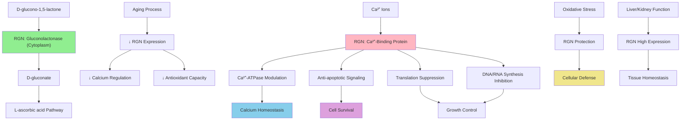

# Pathway Summary for Rgn

## Overview
Regucalcin (RGN), also known as Senescence Marker Protein 30 (SMP30), is a multifunctional calcium-binding protein and gluconolactonase enzyme that catalyzes the penultimate step in vitamin C biosynthesis [Q03336]. The protein regulates intracellular calcium homeostasis by modulating Ca2+-ATPase activity, suppresses protein translation as well as DNA and RNA synthesis, and has anti-apoptotic effects [Q03336]. Expression decreases with aging, making it a valuable biomarker of senescence.

## Vitamin C Biosynthesis Pathway
RGN functions as gluconolactonase, catalyzing the conversion of D-glucono-1,5-lactone to D-gluconate in the penultimate step of vitamin C biosynthesis [PMID:16585534]. This enzymatic activity is essential for L-ascorbic acid production in species capable of vitamin C synthesis. While humans lack this biosynthetic capacity due to pseudogenization of L-gulono-γ-lactone oxidase, understanding RGN's role provides insights into vitamin C metabolism and antioxidant systems.

## Calcium Homeostasis Regulation
RGN regulates intracellular calcium levels through multiple mechanisms, including modulation of Ca2+-ATPase activity and calcium transport processes [Q03336]. The protein's calcium-binding capacity allows it to buffer intracellular calcium concentrations and influence calcium-dependent cellular processes. This regulatory function is particularly important in maintaining calcium homeostasis in liver and kidney tissues where RGN is highly expressed.

## Cellular Senescence and Aging Pathways
As SMP30, RGN serves as a biomarker of cellular senescence with expression declining dramatically with age across multiple tissues [Q03336]. The protein's anti-aging properties include suppression of apoptosis, maintenance of cellular function, and protection against oxidative stress. Loss of RGN expression contributes to age-related cellular dysfunction and increased susceptibility to stress-induced damage.

## Protein Synthesis and Gene Expression Regulation
RGN suppresses protein translation through unknown mechanisms, potentially involving calcium-dependent regulation of translational machinery [Q03336]. The protein also inhibits DNA and RNA synthesis, suggesting roles in cell cycle regulation and gene expression control. These regulatory functions may contribute to RGN's anti-proliferative effects and its role in maintaining cellular homeostasis.

## Pathway Diagram

## Anti-Apoptotic and Cell Survival Functions
RGN exhibits anti-apoptotic properties through calcium-dependent mechanisms that protect cells from stress-induced death [file:rat/Rgn/Rgn-deep-research.md]. The protein's ability to maintain calcium homeostasis prevents calcium overload-induced apoptosis, while its antioxidant properties protect against oxidative damage. These cytoprotective functions make RGN important for maintaining tissue integrity, particularly in metabolically active organs.

## Liver and Kidney Function
RGN is highly expressed in liver and kidney tissues where it plays crucial roles in metabolic homeostasis and detoxification processes [Q03336]. In the liver, the protein supports hepatocyte function and protects against oxidative damage, while in the kidney, it contributes to calcium handling and cellular protection. The age-related decline in RGN expression may contribute to hepatic and renal dysfunction in elderly individuals.

## Oxidative Stress Response and Antioxidant Defense
Through its role in vitamin C biosynthesis and calcium homeostasis regulation, RGN contributes to cellular antioxidant defense systems [file:rat/Rgn/Rgn-deep-research.md]. The protein helps maintain reducing environments and protects against reactive oxygen species-induced damage. This antioxidant function is particularly important in tissues exposed to high oxidative stress, such as liver and kidney.

## Age-Related Disease and Longevity
RGN's dramatic decline with aging makes it both a biomarker of senescence and a potential therapeutic target for age-related diseases [Q03336]. Research suggests that maintaining RGN expression or function could protect against age-related calcium dysregulation, oxidative damage, and cellular dysfunction. Understanding RGN's role in aging may inform interventions for healthy aging and longevity.

## Metabolic Integration and Tissue Homeostasis
RGN integrates multiple cellular processes including calcium signaling, antioxidant defense, and growth control to maintain tissue homeostasis [file:rat/Rgn/Rgn-deep-research.md]. The protein's multifunctional nature allows it to coordinate cellular responses to metabolic stress and aging-related changes. This integrative function makes RGN a critical component of cellular maintenance systems.

## Therapeutic Implications and Clinical Applications
RGN represents a potential therapeutic target for age-related diseases, calcium disorders, and conditions involving oxidative stress [file:rat/Rgn/Rgn-deep-research.md]. Strategies to maintain or restore RGN function could benefit aging-related pathologies, while RGN levels serve as biomarkers for assessing cellular aging and stress. The protein's multiple functions make it an attractive target for interventions aimed at promoting healthy aging.

## Species Differences and Evolutionary Significance
While RGN's calcium-binding and regulatory functions are conserved across species, its gluconolactonase activity varies depending on species' vitamin C biosynthetic capacity [Q03336]. Understanding these species differences provides insights into vitamin C evolution and the relationship between antioxidant systems and aging. The conservation of RGN's calcium regulatory functions highlights its fundamental importance in cellular homeostasis.