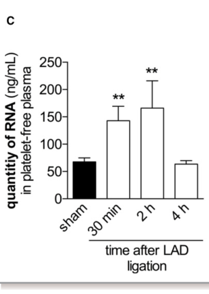

## Question

# Gene Research for Functional Annotation

## ⚠️ CRITICAL: Gene/Protein Identification Context

**BEFORE YOU BEGIN RESEARCH:** You MUST verify you are researching the CORRECT gene/protein. Gene symbols can be ambiguous, especially for less well-characterized genes from non-model organisms.

### Target Gene/Protein Identity (from UniProt):
- **UniProt Accession:** P00684
- **Protein Description:** RecName: Full=Ribonuclease pancreatic beta-type; EC=4.6.1.18; AltName: Full=RL1; AltName: Full=RNase 1 gamma; AltName: Full=RNase A; Flags: Precursor;
- **Gene Information:** Name=Rnase1; Synonyms=Rib-1, Rib1, Rns1;
- **Organism (full):** Rattus norvegicus (Rat).
- **Protein Family:** Belongs to the pancreatic ribonuclease family.
- **Key Domains:** RNaseA. (IPR001427); RNaseA-like_dom_sf. (IPR036816); RNaseA_AS. (IPR023411); RNaseA_domain. (IPR023412); RnaseA (PF00074)

### MANDATORY VERIFICATION STEPS:

1. **Check if the gene symbol "Rnase1" matches the protein description above**
2. **Verify the organism is correct:** Rattus norvegicus (Rat).
3. **Check if protein family/domains align with what you find in literature**
4. **If you find literature for a DIFFERENT gene with the same or similar symbol, STOP**

### If Gene Symbol is Ambiguous or You Cannot Find Relevant Literature:

**DO NOT PROCEED WITH RESEARCH ON A DIFFERENT GENE.** Instead:
- State clearly: "The gene symbol 'Rnase1' is ambiguous or literature is limited for this specific protein"
- Explain what you found (e.g., "Found extensive literature on a different gene with the same symbol in a different organism")
- Describe the protein based ONLY on the UniProt information provided above
- Suggest that the protein function can be inferred from domain/family information

### Research Target:

Please provide a comprehensive research report on the gene **Rnase1** (gene ID: Rnase1, UniProt: P00684) in rat.

The research report should be a detailed narrative explaining the function, biological processes, and localization of the gene product. Citations should be given for all claims.

You should prioritize authoritative reviews and primary scientific literature when conducting research. You can supplement
this with annotations you find in gene/protein databases, but these can be outdated or inaccurate.

We are specifically interested in the primary function of the gene - for enzymes, what reaction is catalyzed, and what is the substrate specificity? For transporters, what is the substrate? For structural proteins or adapters, what is the broader structural role? For signaling molecules, what is the role in the pathway.

We are interested in where in or outside the cell the gene product carries out its function.

We are also interested in the signaling or biochemical pathways in which the gene functions. We are less interested in broad pleiotropic effects, except where these elucidate the precise role.

Include evidence where possible. We are interested in both experimental evidence as well as inference from structure, evolution, or bioinformatic analysis. Precise studies should be prioritized over high-throughput, where available.

## Output

Question: You are an expert researcher providing comprehensive, well-cited information.

Provide detailed information focusing on:
1. Key concepts and definitions with current understanding
2. Recent developments and latest research (prioritize 2023-2024 sources)
3. Current applications and real-world implementations
4. Expert opinions and analysis from authoritative sources
5. Relevant statistics and data from recent studies

Format as a comprehensive research report with proper citations. Include URLs and publication dates where available.
Always prioritize recent, authoritative sources and provide specific citations for all major claims.

# Gene Research for Functional Annotation

## ⚠️ CRITICAL: Gene/Protein Identification Context

**BEFORE YOU BEGIN RESEARCH:** You MUST verify you are researching the CORRECT gene/protein. Gene symbols can be ambiguous, especially for less well-characterized genes from non-model organisms.

### Target Gene/Protein Identity (from UniProt):
- **UniProt Accession:** P00684
- **Protein Description:** RecName: Full=Ribonuclease pancreatic beta-type; EC=4.6.1.18; AltName: Full=RL1; AltName: Full=RNase 1 gamma; AltName: Full=RNase A; Flags: Precursor;
- **Gene Information:** Name=Rnase1; Synonyms=Rib-1, Rib1, Rns1;
- **Organism (full):** Rattus norvegicus (Rat).
- **Protein Family:** Belongs to the pancreatic ribonuclease family.
- **Key Domains:** RNaseA. (IPR001427); RNaseA-like_dom_sf. (IPR036816); RNaseA_AS. (IPR023411); RNaseA_domain. (IPR023412); RnaseA (PF00074)

### MANDATORY VERIFICATION STEPS:

1. **Check if the gene symbol "Rnase1" matches the protein description above**
2. **Verify the organism is correct:** Rattus norvegicus (Rat).
3. **Check if protein family/domains align with what you find in literature**
4. **If you find literature for a DIFFERENT gene with the same or similar symbol, STOP**

### If Gene Symbol is Ambiguous or You Cannot Find Relevant Literature:

**DO NOT PROCEED WITH RESEARCH ON A DIFFERENT GENE.** Instead:
- State clearly: "The gene symbol 'Rnase1' is ambiguous or literature is limited for this specific protein"
- Explain what you found (e.g., "Found extensive literature on a different gene with the same symbol in a different organism")
- Describe the protein based ONLY on the UniProt information provided above
- Suggest that the protein function can be inferred from domain/family information

### Research Target:

Please provide a comprehensive research report on the gene **Rnase1** (gene ID: Rnase1, UniProt: P00684) in rat.

The research report should be a detailed narrative explaining the function, biological processes, and localization of the gene product. Citations should be given for all claims.

You should prioritize authoritative reviews and primary scientific literature when conducting research. You can supplement
this with annotations you find in gene/protein databases, but these can be outdated or inaccurate.

We are specifically interested in the primary function of the gene - for enzymes, what reaction is catalyzed, and what is the substrate specificity? For transporters, what is the substrate? For structural proteins or adapters, what is the broader structural role? For signaling molecules, what is the role in the pathway.

We are interested in where in or outside the cell the gene product carries out its function.

We are also interested in the signaling or biochemical pathways in which the gene functions. We are less interested in broad pleiotropic effects, except where these elucidate the precise role.

Include evidence where possible. We are interested in both experimental evidence as well as inference from structure, evolution, or bioinformatic analysis. Precise studies should be prioritized over high-throughput, where available.

## Research report: rat **Rnase1** (UniProt **P00684**) — functional annotation and translational context

### 0) Target verification (critical disambiguation)
The target gene/protein is **Rnase1** from **Rattus norvegicus** (rat), encoding a **pancreatic-type ribonuclease (ptRNase/RNase A family)**. An authoritative review explicitly lists the UniProt accessions for RNase 1 homologs across species and identifies **rat RNase 1 as UniProtKB P00684**, alongside human P07998 and mouse P00683, confirming that P00684 corresponds to **rat RNase1** and not a different RNase family member (e.g., angiogenin/RNASE5). (garnett2022emergingbiologicalfunctions pages 24-30)

### 1) Key concepts and definitions (current understanding)

#### 1.1 Pancreatic-type ribonucleases (ptRNases) / RNase A family
ptRNases are **vertebrate secreted endoribonucleases**. A defining feature is a **signal peptide** that routes these proteins through the secretory pathway, consistent with their predominant activity in extracellular compartments. (garnett2022emergingbiologicalfunctions pages 1-3)

#### 1.2 Enzymatic function: reaction and catalytic mechanism
RNase 1 is a **catalytic endoribonuclease** that cleaves RNA phosphodiester bonds. Mechanistically, ptRNases share a highly conserved active site in which **His12, Lys41, and His119** mediate catalysis; cleavage proceeds via formation of a **2′,3′-cyclic phosphodiester intermediate**, followed by hydrolysis in a second step. (garnett2022emergingbiologicalfunctions pages 24-30)

The ptRNase catalytic triad (two histidines and a lysine) enables cleavage of the **P–O5′ bond on the 3′ side of pyrimidine residues**, a canonical chemical signature of RNase A-family catalysis. (garnett2022emergingbiologicalfunctions pages 1-3)

#### 1.3 Substrate specificity
Direct rat-specific kinetics were not retrieved in the current evidence set; however, RNase 1 is widely described as a **nonspecific ribonuclease** with a characteristic preference for **single-stranded RNA** and, in humans, a substrate bias **poly(C) > poly(U) >> poly(A)**. RNase 1 can also cleave **double-stranded RNA** and **RNA:DNA hybrids**. (garnett2022emergingbiologicalfunctions pages 3-4)

Comparative enzymology across vertebrate RNase 1 homologs indicates substantial **species-to-species variation** in double-stranded RNA (dsRNA) cleavage capacity and pH optima, while the **core catalytic residues** and **ribonuclease-inhibitor interaction determinants** remain conserved—supporting cautious inference that rat RNase1 shares the same fundamental catalytic chemistry even where its substrate-range parameters are not explicitly measured in the retrieved rat literature. (lomax2017comparativefunctionalanalysis pages 14-18, lomax2017comparativefunctionalanalysis pages 9-14)

#### 1.4 Regulation: ribonuclease inhibitor (RI)
A major regulatory concept for ptRNases is inhibition by the **cytosolic ribonuclease inhibitor (RI)**, which forms a **1:1 complex** with ptRNases and binds extremely tightly (**Kd ~10−15 M**), sterically blocking access to the active site. This helps explain why RNase 1 is often framed as acting primarily in **extracellular** contexts (where RI is less dominant) rather than as a broadly acting intracellular RNase. (garnett2022emergingbiologicalfunctions pages 1-3, garnett2022emergingbiologicalfunctions pages 4-6)

### 2) Localization and expression (rat-focused, with explicit evidence gaps)

#### 2.1 Secreted/extracellular localization is high-confidence
ptRNases are secreted proteins by definition (signal peptide–driven secretion). (garnett2022emergingbiologicalfunctions pages 1-3)

For **rat**, direct tissue-expression atlases were not retrieved in the current corpus. Nonetheless, **rat functional evidence** supports extracellular activity: in the **Langendorff-perfused rat heart**, exogenous RNase1 applied in perfusate protected tissue during ischemia/reperfusion (I/R), which is consistent with an extracellular enzyme acting on released extracellular RNA (eRNA) during injury. (cabrerafuentes2014rnase1preventsthe pages 21-27, cabrerafuentes2014rnase1preventsthe pages 10-14)

#### 2.2 Endothelial source and vascular storage (evidence primarily human/mouse)
In humans, RNase 1 is described as produced predominantly by **vascular endothelial cells**, circulating in serum, and accumulating in endothelial **Weibel–Palade bodies** (a regulated secretory organelle), supporting both constitutive secretion and stimulus-coupled release. These points are important for interpreting RNase 1 as a vascular homeostasis factor, but they are derived from non-rat evidence in the current dataset and should be treated as **likely but not directly proven here** for rat Rnase1. (garnett2022emergingbiologicalfunctions pages 3-4)

### 3) Biological roles and pathways (mechanistic context)

#### 3.1 Extracellular RNA (eRNA) as a damage signal and RNase1 as a counter-regulator
A key modern conceptual framework is that extracellular RNAs (often ribosomal RNA released from damaged cells) can act as **damage-associated molecular patterns (DAMPs)** that promote inflammation, endothelial barrier disruption, and coagulation-related signaling. RNase1 is positioned as a high-activity extracellular RNase that **degrades eRNA**, thereby limiting these downstream pathologies. (garnett2022emergingbiologicalfunctions pages 24-30, garnett2022emergingbiologicalfunctions pages 4-6)

In myocardial infarction (MI) models, plasma eRNA increases rapidly after coronary occlusion; RNase-1 treatment reduces myocardial edema and preserves microvascular perfusion (visual evidence in the source figures). (stieger2017targetingofextracellular pages 4-5, stieger2017targetingofextracellular media 63471491)

#### 3.2 Innate immune signaling nodes observed in recent studies
Recent experimental and translational work links RNase1/eRNA to innate immune receptor pathways:
- In a hepatocyte lipotoxicity/NASH context, eRNA signaling is consistent with activation of **TLR3** and downstream **NF-κB** and **stress kinase pathways (JNK, p38 MAPK)**; exogenous RNase1 blunts these signals by degrading eRNA. (tewari2023targetingextracellularrna pages 4-5, tewari2023targetingextracellularrna pages 5-8)
- In an endothelial infection/inflammation context relevant to sepsis, gram-negative bacterial extracellular vesicles repress endothelial RNASE1 via **LPS-dependent TLR4 signaling** with a **p38-dependent** mechanism for RNase1 mRNA regulation, providing a plausible route by which severe inflammation reduces this vascular-protective RNase. (laakmann2023bacterialextracellularvesicles pages 1-2)

### 4) Evidence for function in rat models (direct experimental evidence)

#### 4.1 Rat heart ischemia/reperfusion: RNase1 reduces inflammatory injury
A high-citation study examined cardiac I/R injury in both mice and an **isolated Langendorff-perfused rat heart** preparation (Wistar rat, 45 min ischemia/120 min reperfusion). Key rat-relevant findings include:
- A major “washout” peak of eRNA occurred early in reperfusion (15–60 min) and accounted for **>60%** of recovered eRNA, with RT-PCR evidence suggesting cardiomyocytes as the main source. (cabrerafuentes2014rnase1preventsthe pages 6-10)
- RNase1 in perfusate (reported in the study as **10 µg/mL**) reduced early reperfusion TNF-α release, reduced ROS accumulation, reduced LDH release, and reduced infarct size in the ex vivo rat heart. (cabrerafuentes2014rnase1preventsthe pages 21-27, cabrerafuentes2014rnase1preventsthe pages 10-14)
- Quantitatively, ROS levels in isolated rat hearts were reduced from **209 ± 11** to **70 ± 12** (arbitrary units per µm²) with RNase1 (P<0.001). (cabrerafuentes2014rnase1preventsthe pages 6-10)

These findings support a conserved rat-relevant role for RNase1 as an extracellular enzyme that degrades injury-released eRNA and reduces inflammatory amplification during reperfusion. (cabrerafuentes2014rnase1preventsthe pages 21-27, cabrerafuentes2014rnase1preventsthe pages 10-14)

### 5) Recent developments (prioritizing 2023–2024)

#### 5.1 2023: Sepsis-relevant endothelial repression of RNASE1
In human lung microvascular endothelial cells, extracellular vesicles from sepsis-associated gram-negative bacteria (E. coli, K. pneumoniae, Salmonella Typhimurium) **reduced RNase1 mRNA and protein**. The effect was **LPS-dependent** (blocked by polymyxin B; absent with LPS-free ClearColi™) and mediated via **TLR4** signaling, with **p38-dependent** RNase1 mRNA regulation. This study provides a mechanistic explanation for how persistent inflammation could suppress a vascular-protective RNase1–eRNA homeostasis axis in sepsis. Publication date: **May 2023**. URL: https://doi.org/10.1186/s12964-023-01131-2 (laakmann2023bacterialextracellularvesicles pages 1-2)

#### 5.2 2023: Therapeutic RNase1 targeting eRNA in NASH models
A 2023 study showed that exogenous RNase1 degraded eRNA released by palmitate-injured hepatocytes and mitigated lipotoxicity by suppressing **NF-κB nuclear translocation** and reducing activation of **JNK/c-JUN** and **p38 MAPK**; a TLR3 inhibitor phenocopied protection, supporting an eRNA→TLR3 inflammatory axis. In vivo, RNase1 was administered **50 µg/kg i.p. every other day** in an HFMCD diet NASH mouse model, improving liver injury markers (ALT), hepatic triglycerides, inflammatory cytokines/chemokines, macrophage infiltration, and histologic NAFLD activity score. Publication date: **July 2023**. URL: https://doi.org/10.3390/cells12141845 (tewari2023targetingextracellularrna pages 5-8, tewari2023targetingextracellularrna pages 8-10, tewari2023targetingextracellularrna pages 1-2)

#### 5.3 2023: RNase effects on RNA-containing immune complexes (implications for RNase-based interventions)
A 2023 JCI Insight study provides a cautionary translational point: RNase-mediated degradation of RNA associated with autoantigens can **increase** Fcγ receptor–stimulating activity for certain antigen/autoantibody combinations. RNase treatment degraded RNA associated with Ro60/La and increased autoantibody binding, which increased FcγRIIIA reporter activation in a **dose-dependent** manner (blocked by RNase inhibitor), while RNase decreased binding to U1RNP, indicating context-dependent effects on immune complex biology. Publication date: **Aug 2023**. URL: https://doi.org/10.1172/jci.insight.167799 (naito2023positiveandnegative pages 4-6)

#### 5.4 2024: RNase1 as a tumor-secreted immunomodulator and biomarker/target in HCC
A 2024 Nature Communications study reports that secreted RNase1 is associated with **anti-PD-1 (nivolumab) non-response** in a small HCC cohort: RNase1 was upregulated in **5/5 non-responders** in their secretome analysis. Plasma RNase1 in HCC patients was reported around **~0.4 µg/mL** and correlated with tumor RNase1 levels (R=0.60). Mechanistically, RNase1 promoted immunosuppression by inducing macrophage polarization through **ALK signaling**, and combined targeting of the RNase1/ALK axis with anti-PD-1 improved antitumor outcomes in models. Publication date: **Feb 2024**. URL: https://doi.org/10.1038/s41467-024-45215-0 (liu2024targetingalkaverts pages 1-2, liu2024targetingalkaverts pages 2-3)

### 6) Current applications and real-world implementations

1) **Preclinical biologic therapy concept (RNase-1 as an eRNA-targeting biologic):** Multiple rodent cardiovascular studies demonstrate that systemic RNase-1 dosing can reduce MI-associated edema and preserve perfusion, and rat heart perfusion data show protection during I/R. These studies operationalize RNase1 as an enzyme drug to degrade pathological eRNA. (cabrerafuentes2014rnase1preventsthe pages 10-14, stieger2017targetingofextracellular pages 4-5, cabrerafuentes2014rnase1preventsthe pages 21-27)

2) **Inflammation/metabolic disease intervention:** Exogenous RNase1 is used experimentally to block eRNA-driven inflammation in hepatocyte lipotoxicity and NASH models, representing a plausible therapeutic modality for sterile inflammation scenarios where eRNA acts as a DAMP. (tewari2023targetingextracellularrna pages 5-8, tewari2023targetingextracellularrna pages 8-10)

3) **Oncology biomarker/targeting:** RNase1 is being positioned as a tumor-secreted factor and plasma biomarker relevant to immunotherapy response (HCC) and as a therapeutic target via an RNase1/ALK axis. (liu2024targetingalkaverts pages 1-2, liu2024targetingalkaverts pages 10-12)

4) **Diagnostic/biomarker context for vascular disease:** In MI, measurable plasma eRNA dynamics and RNase-1 responsiveness provide a biomarker-plus-intervention framing, although direct rat Rnase1 biomarker studies were not retrieved here. (stieger2017targetingofextracellular pages 4-5, stieger2017targetingofextracellular media 63471491)

### 7) Quantitative statistics and data highlights

- **Plasma eRNA after MI (mouse):** increased from **67.64 ± 7.23** to **142.8 ± 26.61 ng/mL** at 30 min, peaking at **166.1 ± 49.93 ng/mL** at 2 h post-ligation. (stieger2017targetingofextracellular pages 4-5)
- **RNase-1 dosing (mouse MI):** IV **50 µg/kg** at 30 min, 3 h, 6 h after LAD ligation reduced myocardial edema (wet/dry ratio **4.14 ± 0.88 → 3.56 ± 0.44**, P=0.039) and improved microvascular perfusion metrics. (stieger2017targetingofextracellular pages 1-2, stieger2017targetingofextracellular pages 4-5)
- **Rat heart I/R (Langendorff):** RNase1 in perfusate (**10 µg/mL**) reduced TNF-α/ROS/LDH and infarct size; ROS decreased **209 ± 11 → 70 ± 12** AU/µm² in isolated rat hearts. (cabrerafuentes2014rnase1preventsthe pages 10-14, cabrerafuentes2014rnase1preventsthe pages 6-10)
- **Circulating RNase 1 (human, healthy):** reported ~**250 ng/mL** in serum; broader summary reports ~**0.5 µg/mL** in human and mouse plasma. (garnett2022emergingbiologicalfunctions pages 3-4, shlyakhovenko2024roleofribonucleases pages 1-3)
- **HCC plasma RNase1:** reported around **~0.4 µg/mL** in patients and correlated with tumor RNase1 (R=0.60). (liu2024targetingalkaverts pages 2-3)

### 8) Expert synthesis and limitations (what is well-supported vs. missing)

**Most strongly supported for rat Rnase1 (P00684):**
- Identity as a ptRNase/RNase A family enzyme (UniProt P00684 explicitly mapped to rat RNase1). (garnett2022emergingbiologicalfunctions pages 24-30)
- Secreted/extracellular RNase chemistry with conserved catalytic residues and cyclic phosphate intermediate mechanism (high-confidence by family conservation). (garnett2022emergingbiologicalfunctions pages 24-30, garnett2022emergingbiologicalfunctions pages 1-3)
- Functional extracellular role in rat cardiac injury contexts, where exogenous RNase1 reduces eRNA-driven inflammation and injury in the perfused rat heart. (cabrerafuentes2014rnase1preventsthe pages 21-27, cabrerafuentes2014rnase1preventsthe pages 10-14)

**Evidence gaps (explicit):**
- The current retrieved corpus did not provide direct, modern rat-specific tissue expression maps (e.g., pancreas vs endothelium) or rat-specific subcellular storage (e.g., Weibel–Palade body localization). Vascular endothelial source and Weibel–Palade storage are well-supported in human evidence and may be conserved, but are not directly demonstrated here for rat. (garnett2022emergingbiologicalfunctions pages 3-4)

---

### Summary table

| Aspect | Key points | Species/evidence scope | Key citations | Publication and URL/DOI |
|---|---|---|---|---|
| Identity | • UniProt P00684 is explicitly listed as the rat RNase 1 homolog • Target belongs to the pancreatic-type ribonuclease (ptRNase/RNase A) family • Distinct from other RNase A-family members such as angiogenin/RNASE5 | Rat identity verified; family context mixed vertebrate | (garnett2022emergingbiologicalfunctions pages 24-30) | Garnett 2022, *Critical Reviews in Biochemistry and Molecular Biology*; https://doi.org/10.1080/10409238.2021.2004577 |
| Family/domains | • ptRNases are vertebrate secreted endoribonucleases with signal peptides • Catalytic core is conserved across RNase 1 homologs • UniProt/domain context for P00684 is consistent with RNaseA-family membership | Mixed vertebrate; rat assignment inferred from homologous family architecture plus UniProt-linked identity | (garnett2022emergingbiologicalfunctions pages 24-30, garnett2022emergingbiologicalfunctions pages 1-3, lomax2017comparativefunctionalanalysis pages 1-5) | Garnett 2022, *Crit Rev Biochem Mol Biol*; https://doi.org/10.1080/10409238.2021.2004577. Lomax 2017, *Biochemical Journal*; https://doi.org/10.1042/bcj20170173 |
| Catalytic reaction/mechanism | • Conserved catalytic residues are His12, Lys41, His119 • ptRNases cleave the P–O5′ bond on the 3′ side of pyrimidines • Reaction proceeds via a 2′,3′-cyclic phosphodiester intermediate followed by hydrolysis | Mixed vertebrate mechanism; applicable to rat by close homology and explicit rat RNase1 placement in same family | (garnett2022emergingbiologicalfunctions pages 24-30, garnett2022emergingbiologicalfunctions pages 1-3, lomax2017comparativefunctionalanalysis pages 14-18) | Garnett 2022, *Crit Rev Biochem Mol Biol*; https://doi.org/10.1080/10409238.2021.2004577. Lomax 2017, *Biochemical Journal*; https://doi.org/10.1042/bcj20170173 |
| Substrate specificity | • RNase 1 is a nonspecific endoribonuclease with preference poly(C) > poly(U) >> poly(A) • Also degrades dsRNA and RNA:DNA hybrids • Human and some mammalian homologs show strong activity toward poly(A:U) and poly(I:C) | Mostly human/mixed homolog data; rat-specific kinetics limited | (garnett2022emergingbiologicalfunctions pages 3-4, lomax2017comparativefunctionalanalysis pages 9-14) | Garnett 2022, *Crit Rev Biochem Mol Biol*; https://doi.org/10.1080/10409238.2021.2004577. Lomax 2017, *Biochemical Journal*; https://doi.org/10.1042/bcj20170173 |
| Regulation/inhibition | • Cytosolic ribonuclease inhibitor (RI) binds ptRNases extremely tightly (Kd ~10^-15 M) and blocks active-site access • RNase 1 acts mainly extracellularly where it is less constrained by RI • N-glycosylation at Asn34/Asn76/Asn88 reduces catalytic activity but improves stability/protease resistance | Mixed vertebrate/human | (garnett2022emergingbiologicalfunctions pages 4-6, garnett2022emergingbiologicalfunctions pages 1-3, garnett2022emergingbiologicalfunctions pages 3-4) | Garnett 2022, *Crit Rev Biochem Mol Biol*; https://doi.org/10.1080/10409238.2021.2004577 |
| Localization | • Secreted protein routed through the secretory pathway • In humans, produced predominantly by vascular endothelial cells and stored in Weibel–Palade bodies • Circulates in blood and is abundant in extracellular fluids | Human/mouse direct evidence; rat extracellular activity supported in heart perfusion studies | (garnett2022emergingbiologicalfunctions pages 3-4, shlyakhovenko2024roleofribonucleases pages 1-3, garnett2022emergingbiologicalfunctions pages 17-18) | Garnett 2022, *Crit Rev Biochem Mol Biol*; https://doi.org/10.1080/10409238.2021.2004577. Shlyakhovenko 2024, *Experimental Oncology*; https://doi.org/10.15407/exp-oncology.2024.03.192 |
| Physiological roles | • Degrades extracellular RNA (eRNA), limiting inflammatory and coagulation signaling • Supports vascular homeostasis and endothelial barrier function • Rat ex vivo heart data support a protective extracellular role during ischemia/reperfusion | Mixed, with direct rat functional evidence in cardiac models | (garnett2022emergingbiologicalfunctions pages 24-30, garnett2022emergingbiologicalfunctions pages 4-6, cabrerafuentes2014rnase1preventsthe pages 21-27, cabrerafuentes2014rnase1preventsthe pages 6-10, cabrerafuentes2014rnase1preventsthe pages 1-6) | Garnett 2022, *Crit Rev Biochem Mol Biol*; https://doi.org/10.1080/10409238.2021.2004577. Cabrera-Fuentes 2014, *Thrombosis and Haemostasis*; https://doi.org/10.1160/th14-08-0703 |
| Disease/therapeutic applications | • In rat Langendorff hearts, RNase1 reduced TNF-α release, ROS, LDH release, and infarct size during I/R injury • In mice, RNase-1 reduced MI-associated edema, improved collateral perfusion, preserved LV function, and improved 8-week survival • Recent human studies link RNASE1 to sepsis-associated endothelial dysfunction, HCC immunotherapy resistance, and biomarker models in atherosclerosis | Rat + mouse preclinical; 2023-2024 human/translational extensions | (cabrerafuentes2014rnase1preventsthe pages 21-27, cabrerafuentes2014rnase1preventsthe pages 10-14, stieger2017targetingofextracellular pages 1-2, stieger2017targetingofextracellular pages 4-5, liu2024targetingalkaverts pages 1-2, liu2024targetingalkaverts pages 2-3, liu2024targetingalkaverts pages 10-12) | Cabrera-Fuentes 2014, *Thrombosis and Haemostasis*; https://doi.org/10.1160/th14-08-0703. Stieger 2017, *J Am Heart Assoc*; https://doi.org/10.1161/jaha.116.004541. Liu 2024, *Nature Communications*; https://doi.org/10.1038/s41467-024-45215-0 |
| Key quantitative data | • Human serum RNase 1 reported at ~250 ng/mL; plasma in humans/mice reported around ~0.5 µg/mL • Rat heart perfusion study used RNase1 at 10 µg/mL; mouse I/R studies used 100 µg/mouse, and MI studies used 50 µg/kg IV at 30 min, 3 h, and 6 h • After MI, plasma eRNA rose from 67.64 ± 7.23 to 142.8 ± 26.61 ng/mL at 30 min and 166.1 ± 49.93 ng/mL at 2 h; RNase-1 lowered wet/dry ratio from 4.14 ± 0.88 to 3.56 ± 0.44 | Mixed human/mouse/rat | (garnett2022emergingbiologicalfunctions pages 3-4, cabrerafuentes2014rnase1preventsthe pages 21-27, stieger2017targetingofextracellular pages 1-2, stieger2017targetingofextracellular pages 4-5, shlyakhovenko2024roleofribonucleases pages 1-3) | Garnett 2022, *Crit Rev Biochem Mol Biol*; https://doi.org/10.1080/10409238.2021.2004577. Cabrera-Fuentes 2014, *Thrombosis and Haemostasis*; https://doi.org/10.1160/th14-08-0703. Stieger 2017, *J Am Heart Assoc*; https://doi.org/10.1161/jaha.116.004541 |

*Table: This table summarizes the functional annotation of rat Rnase1 (UniProt P00684) using direct rat evidence where available and closely related human/mouse RNase 1 data otherwise. It is useful for quickly separating verified rat identity and function from broader RNase 1 family evidence and recent translational findings.*

### Key visual evidence (MI eRNA kinetics and RNase-1 effects)
Figures in the MI study visually show plasma eRNA elevation after LAD ligation and RNase-1 reduction of myocardial edema and preservation of perfusion metrics. (stieger2017targetingofextracellular media 63471491, stieger2017targetingofextracellular media 1d286298, stieger2017targetingofextracellular media efe44557)

References

1. (garnett2022emergingbiologicalfunctions pages 24-30): Emily R. Garnett and Ronald T. Raines. Emerging biological functions of ribonuclease 1 and angiogenin. Critical Reviews in Biochemistry and Molecular Biology, 57:244-260, Dec 2022. URL: https://doi.org/10.1080/10409238.2021.2004577, doi:10.1080/10409238.2021.2004577. This article has 40 citations and is from a peer-reviewed journal.

2. (garnett2022emergingbiologicalfunctions pages 1-3): Emily R. Garnett and Ronald T. Raines. Emerging biological functions of ribonuclease 1 and angiogenin. Critical Reviews in Biochemistry and Molecular Biology, 57:244-260, Dec 2022. URL: https://doi.org/10.1080/10409238.2021.2004577, doi:10.1080/10409238.2021.2004577. This article has 40 citations and is from a peer-reviewed journal.

3. (garnett2022emergingbiologicalfunctions pages 3-4): Emily R. Garnett and Ronald T. Raines. Emerging biological functions of ribonuclease 1 and angiogenin. Critical Reviews in Biochemistry and Molecular Biology, 57:244-260, Dec 2022. URL: https://doi.org/10.1080/10409238.2021.2004577, doi:10.1080/10409238.2021.2004577. This article has 40 citations and is from a peer-reviewed journal.

4. (lomax2017comparativefunctionalanalysis pages 14-18): Jo E. Lomax, Chelcie H. Eller, and Ronald T. Raines. Comparative functional analysis of ribonuclease 1 homologs: molecular insights into evolving vertebrate physiology. The Biochemical journal, 474 13:2219-2233, Jun 2017. URL: https://doi.org/10.1042/bcj20170173, doi:10.1042/bcj20170173. This article has 43 citations.

5. (lomax2017comparativefunctionalanalysis pages 9-14): Jo E. Lomax, Chelcie H. Eller, and Ronald T. Raines. Comparative functional analysis of ribonuclease 1 homologs: molecular insights into evolving vertebrate physiology. The Biochemical journal, 474 13:2219-2233, Jun 2017. URL: https://doi.org/10.1042/bcj20170173, doi:10.1042/bcj20170173. This article has 43 citations.

6. (garnett2022emergingbiologicalfunctions pages 4-6): Emily R. Garnett and Ronald T. Raines. Emerging biological functions of ribonuclease 1 and angiogenin. Critical Reviews in Biochemistry and Molecular Biology, 57:244-260, Dec 2022. URL: https://doi.org/10.1080/10409238.2021.2004577, doi:10.1080/10409238.2021.2004577. This article has 40 citations and is from a peer-reviewed journal.

7. (cabrerafuentes2014rnase1preventsthe pages 21-27): Hector Cabrera-Fuentes, Javier Inserte, Mona Saffarzadeh, Sebastian Galuska, Vijith Vijayan, Ignasi Barba, Guillermo Barreto, Silvia Fischer, Günter Lochnit, Olga Ilinskaya, Eveline Baumgart-Vogt, Andreas Böning, Sandrine Lecour, Derek Hausenloy, Elisa Liehn, David Garcia-Dorado, Klaus-Dieter Schlüter, Marisol Ruiz-Meana, Sakine Simsekyilmaz, Sawa Kostin, and Klaus Preissner. Rnase1 prevents the damaging interplay between extracellular rna and tumour necrosis factor-α in cardiac ischaemia/reperfusion injury. Thrombosis and Haemostasis, 112:1110-1119, Oct 2014. URL: https://doi.org/10.1160/th14-08-0703, doi:10.1160/th14-08-0703. This article has 121 citations and is from a domain leading peer-reviewed journal.

8. (cabrerafuentes2014rnase1preventsthe pages 10-14): Hector Cabrera-Fuentes, Javier Inserte, Mona Saffarzadeh, Sebastian Galuska, Vijith Vijayan, Ignasi Barba, Guillermo Barreto, Silvia Fischer, Günter Lochnit, Olga Ilinskaya, Eveline Baumgart-Vogt, Andreas Böning, Sandrine Lecour, Derek Hausenloy, Elisa Liehn, David Garcia-Dorado, Klaus-Dieter Schlüter, Marisol Ruiz-Meana, Sakine Simsekyilmaz, Sawa Kostin, and Klaus Preissner. Rnase1 prevents the damaging interplay between extracellular rna and tumour necrosis factor-α in cardiac ischaemia/reperfusion injury. Thrombosis and Haemostasis, 112:1110-1119, Oct 2014. URL: https://doi.org/10.1160/th14-08-0703, doi:10.1160/th14-08-0703. This article has 121 citations and is from a domain leading peer-reviewed journal.

9. (stieger2017targetingofextracellular pages 4-5): Philipp Stieger, Jan‐Marcus Daniel, Christiane Thölen, Jochen Dutzmann, Kai Knöpp, Dursun Gündüz, Muhammad Aslam, Marian Kampschulte, Alexander Langheinrich, Silvia Fischer, Hector Cabrera‐Fuentes, Yong Wang, Kai C. Wollert, Johann Bauersachs, Rüdiger Braun‐Dullaeus, Klaus T. Preissner, and Daniel G. Sedding. Targeting of extracellular rna reduces edema formation and infarct size and improves survival after myocardial infarction in mice. Journal of the American Heart Association, Nov 2017. URL: https://doi.org/10.1161/jaha.116.004541, doi:10.1161/jaha.116.004541. This article has 47 citations.

10. (stieger2017targetingofextracellular media 63471491): Philipp Stieger, Jan‐Marcus Daniel, Christiane Thölen, Jochen Dutzmann, Kai Knöpp, Dursun Gündüz, Muhammad Aslam, Marian Kampschulte, Alexander Langheinrich, Silvia Fischer, Hector Cabrera‐Fuentes, Yong Wang, Kai C. Wollert, Johann Bauersachs, Rüdiger Braun‐Dullaeus, Klaus T. Preissner, and Daniel G. Sedding. Targeting of extracellular rna reduces edema formation and infarct size and improves survival after myocardial infarction in mice. Journal of the American Heart Association, Nov 2017. URL: https://doi.org/10.1161/jaha.116.004541, doi:10.1161/jaha.116.004541. This article has 47 citations.

11. (tewari2023targetingextracellularrna pages 4-5): Archana Tewari, Sangam Rajak, Sana Raza, Pratima Gupta, Bandana Chakravarti, Jyotika Srivastava, Chandra P. Chaturvedi, and Rohit A. Sinha. Targeting extracellular rna mitigates hepatic lipotoxicity and liver injury in nash. Cells, 12:1845-1845, Jul 2023. URL: https://doi.org/10.3390/cells12141845, doi:10.3390/cells12141845. This article has 6 citations.

12. (tewari2023targetingextracellularrna pages 5-8): Archana Tewari, Sangam Rajak, Sana Raza, Pratima Gupta, Bandana Chakravarti, Jyotika Srivastava, Chandra P. Chaturvedi, and Rohit A. Sinha. Targeting extracellular rna mitigates hepatic lipotoxicity and liver injury in nash. Cells, 12:1845-1845, Jul 2023. URL: https://doi.org/10.3390/cells12141845, doi:10.3390/cells12141845. This article has 6 citations.

13. (laakmann2023bacterialextracellularvesicles pages 1-2): Katrin Laakmann, Jorina Mona Eckersberg, Moritz Hapke, Marie Wiegand, Jeff Bierwagen, Isabell Beinborn, Christian Preußer, Elke Pogge von Strandmann, Thomas Heimerl, Bernd Schmeck, and Anna Lena Jung. Bacterial extracellular vesicles repress the vascular protective factor rnase1 in human lung endothelial cells. Cell Communication and Signaling : CCS, May 2023. URL: https://doi.org/10.1186/s12964-023-01131-2, doi:10.1186/s12964-023-01131-2. This article has 24 citations.

14. (cabrerafuentes2014rnase1preventsthe pages 6-10): Hector Cabrera-Fuentes, Javier Inserte, Mona Saffarzadeh, Sebastian Galuska, Vijith Vijayan, Ignasi Barba, Guillermo Barreto, Silvia Fischer, Günter Lochnit, Olga Ilinskaya, Eveline Baumgart-Vogt, Andreas Böning, Sandrine Lecour, Derek Hausenloy, Elisa Liehn, David Garcia-Dorado, Klaus-Dieter Schlüter, Marisol Ruiz-Meana, Sakine Simsekyilmaz, Sawa Kostin, and Klaus Preissner. Rnase1 prevents the damaging interplay between extracellular rna and tumour necrosis factor-α in cardiac ischaemia/reperfusion injury. Thrombosis and Haemostasis, 112:1110-1119, Oct 2014. URL: https://doi.org/10.1160/th14-08-0703, doi:10.1160/th14-08-0703. This article has 121 citations and is from a domain leading peer-reviewed journal.

15. (tewari2023targetingextracellularrna pages 8-10): Archana Tewari, Sangam Rajak, Sana Raza, Pratima Gupta, Bandana Chakravarti, Jyotika Srivastava, Chandra P. Chaturvedi, and Rohit A. Sinha. Targeting extracellular rna mitigates hepatic lipotoxicity and liver injury in nash. Cells, 12:1845-1845, Jul 2023. URL: https://doi.org/10.3390/cells12141845, doi:10.3390/cells12141845. This article has 6 citations.

16. (tewari2023targetingextracellularrna pages 1-2): Archana Tewari, Sangam Rajak, Sana Raza, Pratima Gupta, Bandana Chakravarti, Jyotika Srivastava, Chandra P. Chaturvedi, and Rohit A. Sinha. Targeting extracellular rna mitigates hepatic lipotoxicity and liver injury in nash. Cells, 12:1845-1845, Jul 2023. URL: https://doi.org/10.3390/cells12141845, doi:10.3390/cells12141845. This article has 6 citations.

17. (naito2023positiveandnegative pages 4-6): Ryota Naito, Koichiro Ohmura, Shuhei Higuchi, Wataru Nakai, Masako Kohyama, Tsuneyo Mimori, Akio Morinobu, and Hisashi Arase. Positive and negative regulation of the fcγ receptor–stimulating activity of rna-containing immune complexes by rnase. JCI Insight, Aug 2023. URL: https://doi.org/10.1172/jci.insight.167799, doi:10.1172/jci.insight.167799. This article has 5 citations and is from a domain leading peer-reviewed journal.

18. (liu2024targetingalkaverts pages 1-2): Chunxiao Liu, Chenhao Zhou, Weiya Xia, Yifan Zhou, Yufan Qiu, Jialei Weng, Qiang Zhou, Wanyong Chen, Ying-Nai Wang, Heng-Huan Lee, Shao-Chun Wang, Ming Kuang, Dihua Yu, Ning Ren, and Mien-Chie Hung. Targeting alk averts ribonuclease 1-induced immunosuppression and enhances antitumor immunity in hepatocellular carcinoma. Nature Communications, Feb 2024. URL: https://doi.org/10.1038/s41467-024-45215-0, doi:10.1038/s41467-024-45215-0. This article has 25 citations and is from a highest quality peer-reviewed journal.

19. (liu2024targetingalkaverts pages 2-3): Chunxiao Liu, Chenhao Zhou, Weiya Xia, Yifan Zhou, Yufan Qiu, Jialei Weng, Qiang Zhou, Wanyong Chen, Ying-Nai Wang, Heng-Huan Lee, Shao-Chun Wang, Ming Kuang, Dihua Yu, Ning Ren, and Mien-Chie Hung. Targeting alk averts ribonuclease 1-induced immunosuppression and enhances antitumor immunity in hepatocellular carcinoma. Nature Communications, Feb 2024. URL: https://doi.org/10.1038/s41467-024-45215-0, doi:10.1038/s41467-024-45215-0. This article has 25 citations and is from a highest quality peer-reviewed journal.

20. (liu2024targetingalkaverts pages 10-12): Chunxiao Liu, Chenhao Zhou, Weiya Xia, Yifan Zhou, Yufan Qiu, Jialei Weng, Qiang Zhou, Wanyong Chen, Ying-Nai Wang, Heng-Huan Lee, Shao-Chun Wang, Ming Kuang, Dihua Yu, Ning Ren, and Mien-Chie Hung. Targeting alk averts ribonuclease 1-induced immunosuppression and enhances antitumor immunity in hepatocellular carcinoma. Nature Communications, Feb 2024. URL: https://doi.org/10.1038/s41467-024-45215-0, doi:10.1038/s41467-024-45215-0. This article has 25 citations and is from a highest quality peer-reviewed journal.

21. (stieger2017targetingofextracellular pages 1-2): Philipp Stieger, Jan‐Marcus Daniel, Christiane Thölen, Jochen Dutzmann, Kai Knöpp, Dursun Gündüz, Muhammad Aslam, Marian Kampschulte, Alexander Langheinrich, Silvia Fischer, Hector Cabrera‐Fuentes, Yong Wang, Kai C. Wollert, Johann Bauersachs, Rüdiger Braun‐Dullaeus, Klaus T. Preissner, and Daniel G. Sedding. Targeting of extracellular rna reduces edema formation and infarct size and improves survival after myocardial infarction in mice. Journal of the American Heart Association, Nov 2017. URL: https://doi.org/10.1161/jaha.116.004541, doi:10.1161/jaha.116.004541. This article has 47 citations.

22. (shlyakhovenko2024roleofribonucleases pages 1-3): V. SHLYAKHOVENKO, O. SAMOYLENKO, A. VERBINENKO, and I. GANUSEVICH. Role of ribonucleases in the regulation of immune response. Experimental oncology, 46 3:192-201, Dec 2024. URL: https://doi.org/10.15407/exp-oncology.2024.03.192, doi:10.15407/exp-oncology.2024.03.192. This article has 1 citations and is from a peer-reviewed journal.

23. (lomax2017comparativefunctionalanalysis pages 1-5): Jo E. Lomax, Chelcie H. Eller, and Ronald T. Raines. Comparative functional analysis of ribonuclease 1 homologs: molecular insights into evolving vertebrate physiology. The Biochemical journal, 474 13:2219-2233, Jun 2017. URL: https://doi.org/10.1042/bcj20170173, doi:10.1042/bcj20170173. This article has 43 citations.

24. (garnett2022emergingbiologicalfunctions pages 17-18): Emily R. Garnett and Ronald T. Raines. Emerging biological functions of ribonuclease 1 and angiogenin. Critical Reviews in Biochemistry and Molecular Biology, 57:244-260, Dec 2022. URL: https://doi.org/10.1080/10409238.2021.2004577, doi:10.1080/10409238.2021.2004577. This article has 40 citations and is from a peer-reviewed journal.

25. (cabrerafuentes2014rnase1preventsthe pages 1-6): Hector Cabrera-Fuentes, Javier Inserte, Mona Saffarzadeh, Sebastian Galuska, Vijith Vijayan, Ignasi Barba, Guillermo Barreto, Silvia Fischer, Günter Lochnit, Olga Ilinskaya, Eveline Baumgart-Vogt, Andreas Böning, Sandrine Lecour, Derek Hausenloy, Elisa Liehn, David Garcia-Dorado, Klaus-Dieter Schlüter, Marisol Ruiz-Meana, Sakine Simsekyilmaz, Sawa Kostin, and Klaus Preissner. Rnase1 prevents the damaging interplay between extracellular rna and tumour necrosis factor-α in cardiac ischaemia/reperfusion injury. Thrombosis and Haemostasis, 112:1110-1119, Oct 2014. URL: https://doi.org/10.1160/th14-08-0703, doi:10.1160/th14-08-0703. This article has 121 citations and is from a domain leading peer-reviewed journal.

26. (stieger2017targetingofextracellular media 1d286298): Philipp Stieger, Jan‐Marcus Daniel, Christiane Thölen, Jochen Dutzmann, Kai Knöpp, Dursun Gündüz, Muhammad Aslam, Marian Kampschulte, Alexander Langheinrich, Silvia Fischer, Hector Cabrera‐Fuentes, Yong Wang, Kai C. Wollert, Johann Bauersachs, Rüdiger Braun‐Dullaeus, Klaus T. Preissner, and Daniel G. Sedding. Targeting of extracellular rna reduces edema formation and infarct size and improves survival after myocardial infarction in mice. Journal of the American Heart Association, Nov 2017. URL: https://doi.org/10.1161/jaha.116.004541, doi:10.1161/jaha.116.004541. This article has 47 citations.

27. (stieger2017targetingofextracellular media efe44557): Philipp Stieger, Jan‐Marcus Daniel, Christiane Thölen, Jochen Dutzmann, Kai Knöpp, Dursun Gündüz, Muhammad Aslam, Marian Kampschulte, Alexander Langheinrich, Silvia Fischer, Hector Cabrera‐Fuentes, Yong Wang, Kai C. Wollert, Johann Bauersachs, Rüdiger Braun‐Dullaeus, Klaus T. Preissner, and Daniel G. Sedding. Targeting of extracellular rna reduces edema formation and infarct size and improves survival after myocardial infarction in mice. Journal of the American Heart Association, Nov 2017. URL: https://doi.org/10.1161/jaha.116.004541, doi:10.1161/jaha.116.004541. This article has 47 citations.

## Artifacts

- [Edison artifact artifact-00](Rnase1-deep-research-falcon_artifacts/artifact-00.md)

## Citations

1. garnett2022emergingbiologicalfunctions pages 24-30
2. garnett2022emergingbiologicalfunctions pages 1-3
3. garnett2022emergingbiologicalfunctions pages 3-4
4. laakmann2023bacterialextracellularvesicles pages 1-2
5. naito2023positiveandnegative pages 4-6
6. stieger2017targetingofextracellular pages 4-5
7. liu2024targetingalkaverts pages 2-3
8. lomax2017comparativefunctionalanalysis pages 14-18
9. lomax2017comparativefunctionalanalysis pages 9-14
10. garnett2022emergingbiologicalfunctions pages 4-6
11. tewari2023targetingextracellularrna pages 4-5
12. tewari2023targetingextracellularrna pages 5-8
13. tewari2023targetingextracellularrna pages 8-10
14. tewari2023targetingextracellularrna pages 1-2
15. liu2024targetingalkaverts pages 1-2
16. liu2024targetingalkaverts pages 10-12
17. stieger2017targetingofextracellular pages 1-2
18. shlyakhovenko2024roleofribonucleases pages 1-3
19. lomax2017comparativefunctionalanalysis pages 1-5
20. garnett2022emergingbiologicalfunctions pages 17-18
21. https://doi.org/10.1186/s12964-023-01131-2
22. https://doi.org/10.3390/cells12141845
23. https://doi.org/10.1172/jci.insight.167799
24. https://doi.org/10.1038/s41467-024-45215-0
25. https://doi.org/10.1080/10409238.2021.2004577
26. https://doi.org/10.1080/10409238.2021.2004577.
27. https://doi.org/10.1042/bcj20170173
28. https://doi.org/10.15407/exp-oncology.2024.03.192
29. https://doi.org/10.1160/th14-08-0703
30. https://doi.org/10.1160/th14-08-0703.
31. https://doi.org/10.1161/jaha.116.004541.
32. https://doi.org/10.1161/jaha.116.004541
33. https://doi.org/10.1080/10409238.2021.2004577,
34. https://doi.org/10.1042/bcj20170173,
35. https://doi.org/10.1160/th14-08-0703,
36. https://doi.org/10.1161/jaha.116.004541,
37. https://doi.org/10.3390/cells12141845,
38. https://doi.org/10.1186/s12964-023-01131-2,
39. https://doi.org/10.1172/jci.insight.167799,
40. https://doi.org/10.1038/s41467-024-45215-0,
41. https://doi.org/10.15407/exp-oncology.2024.03.192,