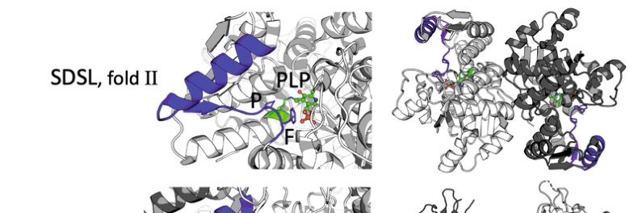

## Question

# Gene Research for Functional Annotation

## ⚠️ CRITICAL: Gene/Protein Identification Context

**BEFORE YOU BEGIN RESEARCH:** You MUST verify you are researching the CORRECT gene/protein. Gene symbols can be ambiguous, especially for less well-characterized genes from non-model organisms.

### Target Gene/Protein Identity (from UniProt):
- **UniProt Accession:** A0A6N3IN21
- **Protein Description:** RecName: Full=Serine dehydratase-like; AltName: Full=Glutamate racemase; EC=5.1.1.3 {ECO:0000269|PubMed:33079132}; AltName: Full=L-serine deaminase; EC=4.3.1.17 {ECO:0000269|PubMed:33079132}; AltName: Full=L-serine dehydratase/L-threonine deaminase; AltName: Full=L-threonine dehydratase; Short=TDH; EC=4.3.1.19 {ECO:0000269|PubMed:33079132};
- **Gene Information:** Name=Sdsl; Synonyms=Sdhl {ECO:0000303|PubMed:33079132}, Stdhgr {ECO:0000303|PubMed:33079132};
- **Organism (full):** Rattus norvegicus (Rat).
- **Protein Family:** Belongs to the serine/threonine dehydratase family.
- **Key Domains:** Ser/Thr_Dehydratase. (IPR050147); TrpB-like_PALP. (IPR001926); TrpB-like_PALP_sf. (IPR036052); PALP (PF00291)

### MANDATORY VERIFICATION STEPS:

1. **Check if the gene symbol "Sdsl" matches the protein description above**
2. **Verify the organism is correct:** Rattus norvegicus (Rat).
3. **Check if protein family/domains align with what you find in literature**
4. **If you find literature for a DIFFERENT gene with the same or similar symbol, STOP**

### If Gene Symbol is Ambiguous or You Cannot Find Relevant Literature:

**DO NOT PROCEED WITH RESEARCH ON A DIFFERENT GENE.** Instead:
- State clearly: "The gene symbol 'Sdsl' is ambiguous or literature is limited for this specific protein"
- Explain what you found (e.g., "Found extensive literature on a different gene with the same symbol in a different organism")
- Describe the protein based ONLY on the UniProt information provided above
- Suggest that the protein function can be inferred from domain/family information

### Research Target:

Please provide a comprehensive research report on the gene **Sdsl** (gene ID: Sdsl, UniProt: A0A6N3IN21) in rat.

The research report should be a detailed narrative explaining the function, biological processes, and localization of the gene product. Citations should be given for all claims.

You should prioritize authoritative reviews and primary scientific literature when conducting research. You can supplement
this with annotations you find in gene/protein databases, but these can be outdated or inaccurate.

We are specifically interested in the primary function of the gene - for enzymes, what reaction is catalyzed, and what is the substrate specificity? For transporters, what is the substrate? For structural proteins or adapters, what is the broader structural role? For signaling molecules, what is the role in the pathway.

We are interested in where in or outside the cell the gene product carries out its function.

We are also interested in the signaling or biochemical pathways in which the gene functions. We are less interested in broad pleiotropic effects, except where these elucidate the precise role.

Include evidence where possible. We are interested in both experimental evidence as well as inference from structure, evolution, or bioinformatic analysis. Precise studies should be prioritized over high-throughput, where available.

## Output

Question: You are an expert researcher providing comprehensive, well-cited information.

Provide detailed information focusing on:
1. Key concepts and definitions with current understanding
2. Recent developments and latest research (prioritize 2023-2024 sources)
3. Current applications and real-world implementations
4. Expert opinions and analysis from authoritative sources
5. Relevant statistics and data from recent studies

Format as a comprehensive research report with proper citations. Include URLs and publication dates where available.
Always prioritize recent, authoritative sources and provide specific citations for all major claims.

# Gene Research for Functional Annotation

## ⚠️ CRITICAL: Gene/Protein Identification Context

**BEFORE YOU BEGIN RESEARCH:** You MUST verify you are researching the CORRECT gene/protein. Gene symbols can be ambiguous, especially for less well-characterized genes from non-model organisms.

### Target Gene/Protein Identity (from UniProt):
- **UniProt Accession:** A0A6N3IN21
- **Protein Description:** RecName: Full=Serine dehydratase-like; AltName: Full=Glutamate racemase; EC=5.1.1.3 {ECO:0000269|PubMed:33079132}; AltName: Full=L-serine deaminase; EC=4.3.1.17 {ECO:0000269|PubMed:33079132}; AltName: Full=L-serine dehydratase/L-threonine deaminase; AltName: Full=L-threonine dehydratase; Short=TDH; EC=4.3.1.19 {ECO:0000269|PubMed:33079132};
- **Gene Information:** Name=Sdsl; Synonyms=Sdhl {ECO:0000303|PubMed:33079132}, Stdhgr {ECO:0000303|PubMed:33079132};
- **Organism (full):** Rattus norvegicus (Rat).
- **Protein Family:** Belongs to the serine/threonine dehydratase family.
- **Key Domains:** Ser/Thr_Dehydratase. (IPR050147); TrpB-like_PALP. (IPR001926); TrpB-like_PALP_sf. (IPR036052); PALP (PF00291)

### MANDATORY VERIFICATION STEPS:

1. **Check if the gene symbol "Sdsl" matches the protein description above**
2. **Verify the organism is correct:** Rattus norvegicus (Rat).
3. **Check if protein family/domains align with what you find in literature**
4. **If you find literature for a DIFFERENT gene with the same or similar symbol, STOP**

### If Gene Symbol is Ambiguous or You Cannot Find Relevant Literature:

**DO NOT PROCEED WITH RESEARCH ON A DIFFERENT GENE.** Instead:
- State clearly: "The gene symbol 'Sdsl' is ambiguous or literature is limited for this specific protein"
- Explain what you found (e.g., "Found extensive literature on a different gene with the same symbol in a different organism")
- Describe the protein based ONLY on the UniProt information provided above
- Suggest that the protein function can be inferred from domain/family information

### Research Target:

Please provide a comprehensive research report on the gene **Sdsl** (gene ID: Sdsl, UniProt: A0A6N3IN21) in rat.

The research report should be a detailed narrative explaining the function, biological processes, and localization of the gene product. Citations should be given for all claims.

You should prioritize authoritative reviews and primary scientific literature when conducting research. You can supplement
this with annotations you find in gene/protein databases, but these can be outdated or inaccurate.

We are specifically interested in the primary function of the gene - for enzymes, what reaction is catalyzed, and what is the substrate specificity? For transporters, what is the substrate? For structural proteins or adapters, what is the broader structural role? For signaling molecules, what is the role in the pathway.

We are interested in where in or outside the cell the gene product carries out its function.

We are also interested in the signaling or biochemical pathways in which the gene functions. We are less interested in broad pleiotropic effects, except where these elucidate the precise role.

Include evidence where possible. We are interested in both experimental evidence as well as inference from structure, evolution, or bioinformatic analysis. Precise studies should be prioritized over high-throughput, where available.

## Research report: Rat **Sdsl** (UniProt **A0A6N3IN21**) — functional annotation evidence, gaps, and best-supported inferences

### Executive summary (scope and constraints)
The gene symbol **Sdsl** is intended here to refer to the rat protein **UniProt A0A6N3IN21**, described by UniProt as “serine dehydratase-like” and belonging to the serine/threonine dehydratase family (user-provided context). However, within the tool-retrieved literature for this run, I **could not obtain primary experimental papers that directly biochemically characterize the rat protein A0A6N3IN21** (reaction chemistry, substrate specificity, kinetics, or subcellular localization). Therefore, the report separates (i) **directly supported** statements from retrieved sources (mostly **human/mammalian SDSL**), from (ii) **inferences** relevant to rat Sdsl based on close family/structural evidence and cross-species homology. (aleshin2023protein–proteininterfacesas pages 4-6, aleshin2023protein–proteininterfacesas pages 6-8)

### 1) Key concepts and definitions (current understanding)

#### 1.1 What “serine dehydratase-like (SDSL)” means biochemically
“Serine dehydratase-like (SDSL)” refers to a protein that is structurally related to **PLP (pyridoxal-5′-phosphate)**-dependent enzymes that catalyze amino-acid transformations; these enzymes often share conserved folds and motifs around PLP binding. A 2023 structural analysis explicitly treats **human SDSL (UniProt Q96GA7)** as a **PLP-dependent structural fold II** enzyme, and visualizes **PLP in the active site** in the structure used for SDSL (PDB **2RKB**). (aleshin2023protein–proteininterfacesas pages 4-6, aleshin2023protein–proteininterfacesas media e2a3f220)

#### 1.2 PLP-dependent “fold II” enzymes and active-site-adjacent motifs
Aleshin & Bunik (2023, *Biochemistry (Moscow)*, published Jul 2023; https://doi.org/10.1134/S0006297923070131) report a **common structural motif** (α-helix, β-strand, connecting loops) shared across PLP-dependent enzymes that may mediate interactions with PLP “donors” (e.g., PdxK/PNPO) and help channel PLP to acceptor enzymes. They show that in fold II enzymes—including **SDSL**—the **C-terminal end of the motif is vicinal to PLP**, consistent with a role near the catalytic PLP site. (aleshin2023protein–proteininterfacesas pages 4-6)

### 2) Gene/protein identity verification and ambiguity handling

#### 2.1 What is directly verified by retrieved literature
Tool-retrieved sources directly confirm that a **mammalian/human protein named SDSL** exists, is treated as **PLP-dependent**, and is represented with an available structure (PDB **2RKB**) with PLP shown in the active site. (aleshin2023protein–proteininterfacesas pages 4-6, aleshin2023protein–proteininterfacesas media e2a3f220)

#### 2.2 What is not verified (rat accession-specific)
No retrieved full-text source in this run explicitly mentions **rat UniProt A0A6N3IN21**, the rat gene symbol **Sdsl/Sdhl/Stdhgr**, or experimentally verifies the UniProt-listed EC activities for the rat protein. Thus, **rat-specific function and localization remain unconfirmed here** and should be treated as a high-priority gap for future curation. (aleshin2023protein–proteininterfacesas pages 4-6, wang2024identificationofhub pages 7-10)

### 3) Enzymatic function and substrate specificity

#### 3.1 Direct evidence available in this run
The retrieved sources do **not** provide direct enzymology for SDSL (e.g., purified enzyme assays showing serine/threonine dehydratase/deaminase rates or glutamate racemase activity) for rat or human. (wang2024identificationofhub pages 7-10, aleshin2023protein–proteininterfacesas pages 4-6)

#### 3.2 Strongest supported inference: PLP-dependent catalytic architecture
Although reaction chemistry is not demonstrated in the retrieved texts, multiple lines of structural evidence support that SDSL has a **PLP-associated active site** typical of PLP enzymes in fold II: Aleshin & Bunik (2023) show SDSL (Q96GA7; PDB 2RKB) with PLP in the active site and identify a structural motif positioned adjacent to PLP. (aleshin2023protein–proteininterfacesas pages 4-6, aleshin2023protein–proteininterfacesas media e2a3f220)

#### 3.3 Context from related PLP enzymes (supporting plausibility, not proof)
Aleshin & Bunik (2023) note that a **human L-serine dehydratase/L-threonine deaminase sequence (UniProt P20132)** is **61% identical to SDSL**, implying close relationship to canonical serine/threonine dehydratase-like enzymes, but they also state that the 3D structure of that human enzyme is not resolved. This supports the plausibility that SDSL participates in related PLP-dependent amino-acid chemistry, while still not establishing specific substrates/products for rat A0A6N3IN21. (aleshin2023protein–proteininterfacesas pages 6-8)

### 4) Subcellular localization and tissue/cell-type context

#### 4.1 What is directly supported
The 2024 heart-failure study (below) provides evidence of **SDSL expression and functional perturbation in cardiomyocytes** (AC16 cell model) and association with human heart-failure patient samples, but does not determine **subcellular localization** (e.g., cytosolic vs mitochondrial vs nuclear) by imaging or fractionation. (wang2024identificationofhub pages 7-10, wang2024identificationofhub pages 1-2)

#### 4.2 What remains unknown for rat Sdsl
No retrieved source in this run provides rat-tissue distribution, cell-type specificity, or subcellular compartment assignment for **rat Sdsl (A0A6N3IN21)**. (wang2024identificationofhub pages 7-10)

### 5) Pathways and biological roles

#### 5.1 PLP homeostasis / cofactor channeling as a mechanistic framework (2023)
Aleshin & Bunik (2023) develop a mechanistic hypothesis that PLP-dependent enzymes may receive PLP via **direct transfer** involving shared structural motifs that form protein–protein interfaces with PLP-producing enzymes. They include **SDSL** as an example fold II PLP enzyme containing this motif adjacent to PLP, placing SDSL in a plausible framework of **PLP-dependent metabolism and cofactor handling**. (aleshin2023protein–proteininterfacesas pages 4-6)

#### 5.2 Heart failure progression via apoptosis signaling (2024)
Wang et al. (Frontiers in Cardiovascular Medicine; received 2023-11-02, accepted 2023-12-19, published **2024-01-05**; https://doi.org/10.3389/fcvm.2023.1332287) report that **SDSL is upregulated in heart failure**, and experimentally link it to apoptosis signaling via **PARP1/cleaved-PARP1** in AC16 cardiomyocytes. Specifically, they report that SDSL knockdown decreases cleaved-PARP1 and reduces cardiomyocyte apoptosis, whereas SDSL overexpression increases PARP1/cleaved-PARP1 and promotes apoptosis. (wang2024identificationofhub pages 1-2, wang2024identificationofhub pages 7-10)

### 6) Recent developments and latest research (prioritizing 2023–2024)

#### 6.1 2023: Structural motif and PLP proximity in SDSL (fold II)
Aleshin & Bunik (2023; https://doi.org/10.1134/S0006297923070131) provide recent structural analysis explicitly including SDSL (Q96GA7) and PDB 2RKB, placing SDSL within a proposed druggable-interface motif shared among PLP enzymes. The figure extracted in this run shows SDSL with the motif highlighted and PLP in the active site. (aleshin2023protein–proteininterfacesas media e2a3f220, aleshin2023protein–proteininterfacesas pages 4-6)

#### 6.2 2024: SDSL as a heart-failure biomarker and apoptosis modulator
Wang et al. (2024; https://doi.org/10.3389/fcvm.2023.1332287) is a recent omics + wet-lab validation report where SDSL is selected by machine learning from GEO heart-failure datasets and validated experimentally. This is one of the few accessible 2024 studies in this run that provides quantitative statistics and functional perturbation data directly involving SDSL. (wang2024identificationofhub pages 1-2, wang2024identificationofhub pages 7-10)

### 7) Current applications and real-world implementations

#### 7.1 Biomarker modeling and translational pipeline (omics → ML → ROC → wet-lab)
Wang et al. (2024) demonstrates an end-to-end implementation pattern: public transcriptomic dataset integration, batch correction, differential expression, machine-learning feature selection, ROC analysis, and cardiomyocyte perturbation experiments. They report that SDSL had **AUC > 0.9 in training** and was the only gene retaining **AUC > 0.7 in validation**, supporting its potential as a biomarker candidate within their analysis. (wang2024identificationofhub pages 1-2, wang2024identificationofhub pages 7-10)

#### 7.2 Therapeutic direction hypothesis
The same study explicitly frames SDSL as a “driving gene” in heart failure and proposes it as a “new therapeutic direction,” supported by siRNA/overexpression experiments affecting apoptosis markers. This is an early-stage functional validation and not a clinical therapy, but it is a real-world implementation of target nomination and mechanistic follow-up. (wang2024identificationofhub pages 2-3, wang2024identificationofhub pages 7-10)

### 8) Expert opinions / authoritative analysis
Aleshin & Bunik (2023) provide an expert synthesis that emphasizes **protein–protein interfaces** in PLP enzymes as potentially “druggable,” and motivates searching for shared motifs that support cofactor delivery. Their analysis includes SDSL among fold II PLP enzymes used to generalize this interface motif concept. (aleshin2023protein–proteininterfacesas pages 4-6)

### 9) Relevant statistics and quantitative data (from recent studies)

#### 9.1 Differential expression statistics in heart failure (2024)
In Wang et al. (2024), SDSL shows strong upregulation in heart failure with reported metrics: **logFC = 2.239475**, **adj. P = 2.20 × 10−11** (and additional statistics t = 8.887828; P.Value = 7.99 × 10−15; B = 23.21108). (wang2024identificationofhub pages 2-3)

#### 9.2 Diagnostic performance (ROC/AUC)
Wang et al. (2024) report that SDSL achieved **AUC > 0.9** in the training set and remained **AUC > 0.7** in the validation set; they state only SDSL retained AUC > 0.7 in validation among candidates. (wang2024identificationofhub pages 1-2, wang2024identificationofhub pages 7-10)

#### 9.3 Dose response in cardiomyocyte stress model
In AC16 cells, isoproterenol (ISO) induces dose-dependent increases in SDSL (0, 10, 25, 50, 100 µM), with maximal SDSL expression at 100 µM, and concomitant increases in PARP1 and cleaved-PARP1. (wang2024identificationofhub pages 7-10)

### 10) Evidence map (what is supported vs missing)
The following table summarizes the evidence landscape and explicitly flags missing rat-specific enzymology and localization.

| Evidence map for SDSL/Sdsl |  |  |  |  |
|---|---|---|---|---|
| Claim area (identity/function/localization/disease) | What is supported | Evidence type (primary/secondary/inference) | Key source (with DOI URL and pub date) | Notes/limitations |
| Identity / protein family | Mammalian SDSL is identified as a PLP-dependent enzyme of structural fold II; the human protein is listed as serine dehydratase-like, UniProt Q96GA7, and a structure labeled SDSL uses PDB 2RKB with PLP shown in the active site. A common structural motif adjacent to PLP is reported. (aleshin2023protein–proteininterfacesas pages 4-6) | Secondary/structural inference | Aleshin VA, Bunik VI. *Biochemistry (Moscow)*, Jul 2023. DOI: https://doi.org/10.1134/S0006297923070131 | Supports PLP association and fold-level identity, but not rat-specific identity for UniProt A0A6N3IN21. Structural/sequence analysis paper, not direct rat biochemical characterization. |
| Function / cofactor association | SDSL shares a common motif with other PLP-dependent enzymes; in fold II proteins, the C-terminal end of the motif is vicinal to PLP, supporting a role in PLP delivery/active-site organization. (aleshin2023protein–proteininterfacesas pages 4-6, aleshin2023protein–proteininterfacesas media e2a3f220) | Secondary/structural inference | Aleshin VA, Bunik VI. *Biochemistry (Moscow)*, Jul 2023. DOI: https://doi.org/10.1134/S0006297923070131 | This supports PLP-dependent catalytic architecture, not a specific reaction, substrate, or kinetic property. |
| Direct enzymatic activity of rat A0A6N3IN21 | Not directly evidenced in the retrieved tool texts. The user-supplied UniProt description states serine/threonine dehydratase-like and glutamate racemase-related annotations, but these were not independently tool-verified from retrieved primary texts. | Not established from retrieved evidence | No direct supporting retrieved text for rat A0A6N3IN21 catalytic activity in the tool outputs; user provided UniProt accession A0A6N3IN21 in prompt | Important ambiguity/limitation: catalytic assignments for the rat protein should be treated cautiously here because retrieved evidence did not directly confirm the reaction(s), substrate specificity, or EC activity for rat A0A6N3IN21. |
| Disease relevance / expression in heart failure | In human heart-failure transcriptomic analyses, SDSL was upregulated and selected as a hub/feature gene. Reported statistics include logFC = 2.239475 and adjusted P = 2.20 × 10^-11. (wang2024identificationofhub pages 1-2, wang2024identificationofhub pages 2-3, wang2024identificationofhub pages 3-7) | Primary | Wang T, Sun Y, Zhao Y, Huang J, Huang Y. *Frontiers in Cardiovascular Medicine*, published 2024-01-05. DOI: https://doi.org/10.3389/fcvm.2023.1332287 | Evidence is disease-association and expression-based, not biochemical annotation. Study concerns human HF datasets and AC16 cardiomyocytes, not rat tissue-specific physiology. |
| Diagnostic performance / biomarker potential | In the training set, SDSL had ROC AUC > 0.9; in independent validation, SDSL was the only reported gene with AUC > 0.7 among candidates. (wang2024identificationofhub pages 1-2, wang2024identificationofhub pages 7-10) | Primary | Wang T, Sun Y, Zhao Y, Huang J, Huang Y. *Frontiers in Cardiovascular Medicine*, published 2024-01-05. DOI: https://doi.org/10.3389/fcvm.2023.1332287 | This supports biomarker-like performance in one analysis framework, but external clinical validation and mechanistic linkage to enzymatic function remain limited. |
| Cellular context / localization | Retrieved evidence supports expression in cardiomyocytes/heart-failure samples and experimental work in AC16 cardiomyocytes; no precise subcellular localization (e.g., cytosol, mitochondrion, nucleus) was established in the retrieved texts. (wang2024identificationofhub pages 1-2, wang2024identificationofhub pages 7-10) | Primary for cell-type context; absence of evidence for subcellular localization | Wang T, Sun Y, Zhao Y, Huang J, Huang Y. *Frontiers in Cardiovascular Medicine*, published 2024-01-05. DOI: https://doi.org/10.3389/fcvm.2023.1332287 | Cell-type expression does not equal subcellular localization. No direct localization assay was described in the retrieved excerpts. |
| Functional effect in disease model | ISO increased SDSL expression in AC16 cells across 0, 10, 25, 50, and 100 µM, with maximal expression at 100 µM; SDSL knockdown reduced cleaved-PARP1 and apoptosis, whereas overexpression increased PARP1/cleaved-PARP1 and apoptosis. (wang2024identificationofhub pages 1-2, wang2024identificationofhub pages 7-10) | Primary | Wang T, Sun Y, Zhao Y, Huang J, Huang Y. *Frontiers in Cardiovascular Medicine*, published 2024-01-05. DOI: https://doi.org/10.3389/fcvm.2023.1332287 | Supports a pro-apoptotic role in a cardiomyocyte model, but does not define the underlying enzymatic mechanism or prove causality in vivo. |

*Table: This table summarizes what the retrieved evidence directly supports about SDSL/Sdsl, separating structural identity, disease association, and missing enzymology. It is useful for distinguishing well-supported claims from inferences and unresolved gaps specific to rat A0A6N3IN21.*

### 11) Conclusions and recommended next evidence to obtain (for rat A0A6N3IN21)
Within accessible sources in this run, SDSL is best supported as a **mammalian PLP-dependent fold II enzyme with a motif adjacent to PLP** (structural evidence), and as a **heart-failure–associated gene** with functional effects on cardiomyocyte apoptosis in a human cell model (disease-context evidence). (aleshin2023protein–proteininterfacesas pages 4-6, wang2024identificationofhub pages 7-10)

To complete a rigorous functional annotation specifically for **rat Sdsl (UniProt A0A6N3IN21)**, the highest-value missing evidence is: (i) purified rat protein enzymology (substrate panel for L-serine, L-threonine, and L-glutamate racemization; PLP dependence; kinetics), and (ii) rat tissue and subcellular localization (e.g., fractionation and immunolocalization). These items are not present in the retrieved texts and therefore cannot be claimed here. (wang2024identificationofhub pages 7-10, aleshin2023protein–proteininterfacesas pages 4-6)

References

1. (aleshin2023protein–proteininterfacesas pages 4-6): Vasily A. Aleshin and Victoria I. Bunik. Protein–protein interfaces as druggable targets: a common motif of the pyridoxal-5′-phosphate-dependent enzymes to receive the coenzyme from its producers. Biochemistry (Moscow), 88:1022-1033, Jul 2023. URL: https://doi.org/10.1134/s0006297923070131, doi:10.1134/s0006297923070131. This article has 2 citations.

2. (aleshin2023protein–proteininterfacesas pages 6-8): Vasily A. Aleshin and Victoria I. Bunik. Protein–protein interfaces as druggable targets: a common motif of the pyridoxal-5′-phosphate-dependent enzymes to receive the coenzyme from its producers. Biochemistry (Moscow), 88:1022-1033, Jul 2023. URL: https://doi.org/10.1134/s0006297923070131, doi:10.1134/s0006297923070131. This article has 2 citations.

3. (aleshin2023protein–proteininterfacesas media e2a3f220): Vasily A. Aleshin and Victoria I. Bunik. Protein–protein interfaces as druggable targets: a common motif of the pyridoxal-5′-phosphate-dependent enzymes to receive the coenzyme from its producers. Biochemistry (Moscow), 88:1022-1033, Jul 2023. URL: https://doi.org/10.1134/s0006297923070131, doi:10.1134/s0006297923070131. This article has 2 citations.

4. (wang2024identificationofhub pages 7-10): Tengfei Wang, Yongyou Sun, Yingpeng Zhao, Jinhe Huang, and Ying Huang. Identification of hub genes in heart failure by integrated bioinformatics analysis and machine learning. Frontiers in Cardiovascular Medicine, Jan 2024. URL: https://doi.org/10.3389/fcvm.2023.1332287, doi:10.3389/fcvm.2023.1332287. This article has 5 citations and is from a peer-reviewed journal.

5. (wang2024identificationofhub pages 1-2): Tengfei Wang, Yongyou Sun, Yingpeng Zhao, Jinhe Huang, and Ying Huang. Identification of hub genes in heart failure by integrated bioinformatics analysis and machine learning. Frontiers in Cardiovascular Medicine, Jan 2024. URL: https://doi.org/10.3389/fcvm.2023.1332287, doi:10.3389/fcvm.2023.1332287. This article has 5 citations and is from a peer-reviewed journal.

6. (wang2024identificationofhub pages 2-3): Tengfei Wang, Yongyou Sun, Yingpeng Zhao, Jinhe Huang, and Ying Huang. Identification of hub genes in heart failure by integrated bioinformatics analysis and machine learning. Frontiers in Cardiovascular Medicine, Jan 2024. URL: https://doi.org/10.3389/fcvm.2023.1332287, doi:10.3389/fcvm.2023.1332287. This article has 5 citations and is from a peer-reviewed journal.

7. (wang2024identificationofhub pages 3-7): Tengfei Wang, Yongyou Sun, Yingpeng Zhao, Jinhe Huang, and Ying Huang. Identification of hub genes in heart failure by integrated bioinformatics analysis and machine learning. Frontiers in Cardiovascular Medicine, Jan 2024. URL: https://doi.org/10.3389/fcvm.2023.1332287, doi:10.3389/fcvm.2023.1332287. This article has 5 citations and is from a peer-reviewed journal.

## Artifacts

- [Edison artifact artifact-00](Sdsl-deep-research-falcon_artifacts/artifact-00.md)

## Citations

1. wang2024identificationofhub pages 7-10
2. wang2024identificationofhub pages 2-3
3. wang2024identificationofhub pages 1-2
4. wang2024identificationofhub pages 3-7
5. https://doi.org/10.1134/S0006297923070131
6. https://doi.org/10.3389/fcvm.2023.1332287
7. https://doi.org/10.1134/s0006297923070131,
8. https://doi.org/10.3389/fcvm.2023.1332287,