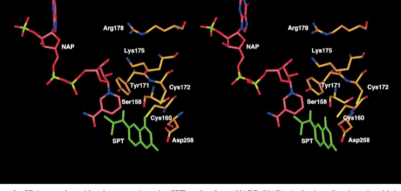

## Question

# Gene Research for Functional Annotation

## ⚠️ CRITICAL: Gene/Protein Identification Context

**BEFORE YOU BEGIN RESEARCH:** You MUST verify you are researching the CORRECT gene/protein. Gene symbols can be ambiguous, especially for less well-characterized genes from non-model organisms.

### Target Gene/Protein Identity (from UniProt):
- **UniProt Accession:** P18297
- **Protein Description:** RecName: Full=Sepiapterin reductase; Short=SPR; EC=1.1.1.153 {ECO:0000269|PubMed:10350607};
- **Gene Information:** Name=Spr;
- **Organism (full):** Rattus norvegicus (Rat).
- **Protein Family:** Belongs to the sepiapterin reductase family. .
- **Key Domains:** Biopterin_syn/organic_redct. (IPR051721); NAD(P)-bd_dom_sf. (IPR036291); SDR_fam. (IPR002347); Sepiapterin_red. (IPR006393); adh_short (PF00106)

### MANDATORY VERIFICATION STEPS:

1. **Check if the gene symbol "Spr" matches the protein description above**
2. **Verify the organism is correct:** Rattus norvegicus (Rat).
3. **Check if protein family/domains align with what you find in literature**
4. **If you find literature for a DIFFERENT gene with the same or similar symbol, STOP**

### If Gene Symbol is Ambiguous or You Cannot Find Relevant Literature:

**DO NOT PROCEED WITH RESEARCH ON A DIFFERENT GENE.** Instead:
- State clearly: "The gene symbol 'Spr' is ambiguous or literature is limited for this specific protein"
- Explain what you found (e.g., "Found extensive literature on a different gene with the same symbol in a different organism")
- Describe the protein based ONLY on the UniProt information provided above
- Suggest that the protein function can be inferred from domain/family information

### Research Target:

Please provide a comprehensive research report on the gene **Spr** (gene ID: Spr, UniProt: P18297) in rat.

The research report should be a detailed narrative explaining the function, biological processes, and localization of the gene product. Citations should be given for all claims.

You should prioritize authoritative reviews and primary scientific literature when conducting research. You can supplement
this with annotations you find in gene/protein databases, but these can be outdated or inaccurate.

We are specifically interested in the primary function of the gene - for enzymes, what reaction is catalyzed, and what is the substrate specificity? For transporters, what is the substrate? For structural proteins or adapters, what is the broader structural role? For signaling molecules, what is the role in the pathway.

We are interested in where in or outside the cell the gene product carries out its function.

We are also interested in the signaling or biochemical pathways in which the gene functions. We are less interested in broad pleiotropic effects, except where these elucidate the precise role.

Include evidence where possible. We are interested in both experimental evidence as well as inference from structure, evolution, or bioinformatic analysis. Precise studies should be prioritized over high-throughput, where available.

## Output

Question: You are an expert researcher providing comprehensive, well-cited information.

Provide detailed information focusing on:
1. Key concepts and definitions with current understanding
2. Recent developments and latest research (prioritize 2023-2024 sources)
3. Current applications and real-world implementations
4. Expert opinions and analysis from authoritative sources
5. Relevant statistics and data from recent studies

Format as a comprehensive research report with proper citations. Include URLs and publication dates where available.
Always prioritize recent, authoritative sources and provide specific citations for all major claims.

# Gene Research for Functional Annotation

## ⚠️ CRITICAL: Gene/Protein Identification Context

**BEFORE YOU BEGIN RESEARCH:** You MUST verify you are researching the CORRECT gene/protein. Gene symbols can be ambiguous, especially for less well-characterized genes from non-model organisms.

### Target Gene/Protein Identity (from UniProt):
- **UniProt Accession:** P18297
- **Protein Description:** RecName: Full=Sepiapterin reductase; Short=SPR; EC=1.1.1.153 {ECO:0000269|PubMed:10350607};
- **Gene Information:** Name=Spr;
- **Organism (full):** Rattus norvegicus (Rat).
- **Protein Family:** Belongs to the sepiapterin reductase family. .
- **Key Domains:** Biopterin_syn/organic_redct. (IPR051721); NAD(P)-bd_dom_sf. (IPR036291); SDR_fam. (IPR002347); Sepiapterin_red. (IPR006393); adh_short (PF00106)

### MANDATORY VERIFICATION STEPS:

1. **Check if the gene symbol "Spr" matches the protein description above**
2. **Verify the organism is correct:** Rattus norvegicus (Rat).
3. **Check if protein family/domains align with what you find in literature**
4. **If you find literature for a DIFFERENT gene with the same or similar symbol, STOP**

### If Gene Symbol is Ambiguous or You Cannot Find Relevant Literature:

**DO NOT PROCEED WITH RESEARCH ON A DIFFERENT GENE.** Instead:
- State clearly: "The gene symbol 'Spr' is ambiguous or literature is limited for this specific protein"
- Explain what you found (e.g., "Found extensive literature on a different gene with the same symbol in a different organism")
- Describe the protein based ONLY on the UniProt information provided above
- Suggest that the protein function can be inferred from domain/family information

### Research Target:

Please provide a comprehensive research report on the gene **Spr** (gene ID: Spr, UniProt: P18297) in rat.

The research report should be a detailed narrative explaining the function, biological processes, and localization of the gene product. Citations should be given for all claims.

You should prioritize authoritative reviews and primary scientific literature when conducting research. You can supplement
this with annotations you find in gene/protein databases, but these can be outdated or inaccurate.

We are specifically interested in the primary function of the gene - for enzymes, what reaction is catalyzed, and what is the substrate specificity? For transporters, what is the substrate? For structural proteins or adapters, what is the broader structural role? For signaling molecules, what is the role in the pathway.

We are interested in where in or outside the cell the gene product carries out its function.

We are also interested in the signaling or biochemical pathways in which the gene functions. We are less interested in broad pleiotropic effects, except where these elucidate the precise role.

Include evidence where possible. We are interested in both experimental evidence as well as inference from structure, evolution, or bioinformatic analysis. Precise studies should be prioritized over high-throughput, where available.

## Research report: Rat **Spr** (UniProt P18297) — Sepiapterin reductase (SPR; EC 1.1.1.153)

### 1) Target verification (critical identity check)
The UniProt accession **P18297** corresponds to **Rattus norvegicus Spr**, encoding **sepiapterin reductase (SPR)**, an NAD(P)H-dependent short-chain dehydrogenase/reductase (SDR) family enzyme involved in **tetrahydrobiopterin (BH4)** biosynthesis and salvage. The retrieved literature explicitly concerns mammalian SPR in BH4 metabolism and is consistent with the SDR/Rossmann-fold enzyme class and the EC activity described in UniProt; no evidence used here pertains to an unrelated “SPR” symbol from other gene families. Structural analysis of mouse SPR reports high sequence identity to rat, supporting mechanistic transfer of active-site residues and fold-level conclusions to rat SPR. (auerbach1997the1.25å pages 2-6, auerbach1997the1.25å pages 1-2)

### 2) Key concepts, definitions, and current understanding

#### 2.1 What SPR does in BH4 biology
**BH4** is an essential redox cofactor required by several enzyme classes, including aromatic amino-acid hydroxylases (phenylalanine hydroxylase, tyrosine hydroxylase, tryptophan hydroxylase) and nitric oxide synthases. A central concept for functional annotation is that **SPR catalyzes terminal reduction steps that complete BH4 production**, and it also participates in a **BH4 salvage route**.

In the **de novo BH4 pathway**, SPR acts downstream of PTPS on **6-pyruvoyl-tetrahydropterin (6-PTP)** and is described as producing intermediates **2′ox-PH4** and **1′ox-PH4**, including an isomerization step, before final reduction to **BH4**. A recent expert review emphasizes that the 1′ox/2′ox interconversion appears uniquely catalyzed by SPR, while parallel “bypass” reductions can be carried out by other carbonyl reductases/aldo-keto reductases depending on tissue. (cronin2023peripheralizedsepiapterinreductase pages 3-4, cronin2023peripheralizedsepiapterinreductase pages 4-6)

In the **salvage pathway**, SPR catalyzes **NADPH-dependent reduction of sepiapterin to 7,8-dihydrobiopterin (BH2)**, which can then be reduced further to BH4 by other cellular reductases. A key practical implication is that SPR has strong affinity for sepiapterin, so **sepiapterin accumulation is used as a biomarker of SPR inhibition or deficiency**. (yang2015sulfadrugsinhibit pages 2-3, cronin2023peripheralizedsepiapterinreductase pages 4-6)

#### 2.2 Reaction chemistry, cofactors, and substrate specificity
Canonical SPR catalysis for sepiapterin reduction is **strictly NADPH-dependent** in experimental assays (NADH does not support the sepiapterin→BH2 reaction in a detailed enzymology study). (yang2013sepiapterinreductasemediates pages 4-5)

In addition to pterin reduction, SPR has been shown to catalyze **chemical redox cycling** of certain xenobiotics/quinones and bipyridinium compounds, generating reactive oxygen species, via a mechanism that can be distinct from its physiological sepiapterin reduction function. This non-canonical activity is relevant when considering pharmacology/toxicology of SPR inhibitors and environmental exposures. (yang2013sepiapterinreductasemediates pages 1-2, yang2015sulfadrugsinhibit pages 1-2)

#### 2.3 Structure and catalytic mechanism (domain-informed function)
A high-resolution (1.25 Å) crystal structure of mammalian SPR shows a **homodimeric SDR enzyme** in which substrate pterins and the NADP(H) cofactor bind from opposite sides into a deep active-site pocket. Key mechanistic residues highlighted include:
- **Asp258**: anchors/positions the pterin substrate. (auerbach1997the1.25å pages 2-6, auerbach1997the1.25å pages 1-2)
- **Tyr171**: central catalytic residue for proton transfer during hydride transfer from NADPH. (auerbach1997the1.25å pages 2-6, auerbach1997the1.25å pages 1-2)
- **Lys175 and Arg178**: described as important for catalysis/stabilization in the active site. (auerbach1997the1.25å pages 2-6)

The figure evidence from this structural work directly visualizes binding of **sepiapterin and NADP** in proximity to **Tyr171 and Asp258**, as well as a schematic comparison between sepiapterin and an inhibitor (N-acetylserotonin) in the binding pocket. (auerbach1997the1.25å media 0c854ef3, auerbach1997the1.25å media 9dffd0ab)

### 3) Cellular and tissue localization (where SPR acts)

#### 3.1 Subcellular localization
Direct experimental fractionation in lung epithelial cells detected SPR activity in **cytosolic fractions** (post-microsomal supernatant/cytosol), supporting a primarily **cytosolic** localization for SPR enzymatic activity in that context. (yang2013sepiapterinreductasemediates pages 4-5, yang2013sepiapterinreductasemediates pages 2-3)

#### 3.2 Tissue distribution
SPR is described as **widely distributed** across tissues (including lung, liver, kidney, and brain) in a pharmacology-focused study contextualizing SPR inhibition. (yang2015sulfadrugsinhibit pages 1-2)

### 4) Quantitative functional evidence (kinetics and inhibition)

#### 4.1 Enzyme kinetics (reference values for mammalian SPR)
Using HPLC-based quantification of BH2 formation from sepiapterin, a detailed enzymology analysis reported:
- **Human SPR**: **Km(sepiapterin) = 25.4 µM**, **kcat = 97.0 min⁻1**, **kcat/Km = 3.8 min⁻1 µM⁻1**.
- **Mouse SPR**: **Km(sepiapterin) = 44.2 µM**, **kcat = 48.4 min⁻1**, **kcat/Km = 1.1 min⁻1 µM⁻1**.
These values provide a useful quantitative baseline for annotating rat SPR when rat-specific kinetics are not available in the retrieved set, especially given the high sequence similarity across rodents. (yang2013sepiapterinreductasemediates pages 4-5)

#### 4.2 Inhibitor potency and mechanistic selectivity
A pharmacology study reported that multiple **sulfa drugs** are potent inhibitors of SPR-mediated sepiapterin reduction with **IC50 values ~31–180 nM**, including **sulfasalazine, sulfathiazole, sulfapyridine, sulfamethoxazole, and chlorpropamide**. In contrast, inhibition of SPR’s redox-cycling activity required much higher concentrations (**IC50 0.37–19.4 mM**), suggesting distinct mechanistic requirements. (yang2015sulfadrugsinhibit pages 1-2)

Structural/docking analysis identified active-site interactions for heteroaromatic inhibitors involving residues such as **Ser157 and Tyr170** and hydrophobic/π-stacking contacts in the ligand pocket, consistent with competitive/stacking-based inhibition near the nicotinamide cofactor. (yang2015sulfadrugsinhibit pages 9-11)

A translationally oriented 2023 review summarizes additional potency examples for repurposed and designed inhibitors, including **sulfasalazine IC50 ~23 nM** (vs N-acetylserotonin 3,100 nM), sulfapyridine IC50 480 nM, and mesalamine IC50 370 µM, and discusses designed inhibitors (e.g., SPRi3, QM385) as pain-relevant pharmacology leads. (cronin2023peripheralizedsepiapterinreductase pages 7-9)

### 5) Pathways and biological processes involving rat Spr/SPR

#### 5.1 BH4-dependent neurotransmitter and NO biology
By controlling BH4 availability, SPR indirectly supports the activity of BH4-dependent enzymes central to:
- **dopamine and serotonin synthesis** (via tyrosine hydroxylase and tryptophan hydroxylase)
- **nitric oxide synthesis** (NOS)
These pathway links are emphasized when discussing clinical consequences of SPR deficiency and the potential side effects of pharmacological inhibition. (cronin2023peripheralizedsepiapterinreductase pages 1-2, yang2015sulfadrugsinhibit pages 1-2)

#### 5.2 Tissue-specific BH4 “salvage” capacity and compensation
A key contemporary concept is that **SPR is targetable in the periphery** because alternative enzymes (carbonyl reductases/aldo-keto reductases and downstream reductases such as DHFR) can partially preserve BH4 in several tissues, whereas **brain salvage capacity is more limited**. A quantitative estimate in a 2023 review states that **~35% of 6-PTP may be reduced to 1′ox-PH4 by carbonyl reductases before SPR completes conversion to BH4**, supporting partial bypass capacity. (cronin2023peripheralizedsepiapterinreductase pages 4-6)

### 6) Recent developments (prioritizing 2023–2024)

#### 6.1 2023: Peripheralized SPR inhibition as an analgesic strategy
A 2023 expert review argues that **peripherally restricted SPR inhibition** could be a practical, non-opioid approach to treating **chronic pain**, motivated by genetic (BH4/GCH1) and cellular evidence implicating peripheral BH4 overproduction in pain hypersensitivity. The review emphasizes: 
- multiple peripheral cell types (sensory neurons and immune cells) contribute to BH4-driven pain,
- the need to avoid CNS BH4 depletion,
- and the utility of **sepiapterin as a sensitive biomarker** of SPR engagement/brain penetrance.
It also highlights translational challenges from species differences in salvage pathways, including a reported observation that **SPR knockout mice retain ~20% of normal brain BH4**, implying alternate production routes in rodents. (cronin2023peripheralizedsepiapterinreductase pages 1-2, cronin2023peripheralizedsepiapterinreductase pages 6-7)

#### 6.2 2024 context: Dopamine/parkinsonism and therapeutic framework
A 2024 review on dopamine synthesis/transport discusses SPR as the enzyme catalyzing the **final two-step reduction** in BH4 biosynthesis and highlights the clinical phenotype of SPR deficiency as a dopa-responsive disorder with motor and speech delays, framing SPR within therapeutics for parkinsonism-like syndromes and dopamine deficiency disorders. (cronin2023peripheralizedsepiapterinreductase pages 4-6)

*Note:* Within the retrieved evidence set, 2024 primary data directly measuring rat Spr regulation in vivo were limited; the strongest 2023–2024 content was expert synthesis and translational strategy proposals rather than new rat-specific mechanistic experiments.

### 7) Current applications and real-world implementations

#### 7.1 Biomarkers for target engagement
Because SPR inhibition causes **sepiapterin accumulation**, sepiapterin measurement in accessible biofluids (e.g., CSF/urine in deficiency contexts) is highlighted as an “excellent” and sensitive **biomarker for SPR engagement/inhibition**, and as a way to assess CNS penetration indirectly. (cronin2023peripheralizedsepiapterinreductase pages 4-6, cronin2023peripheralizedsepiapterinreductase pages 6-7)

#### 7.2 Drug repurposing and safety signals
Existing drugs (notably **sulfasalazine**) have potent in vitro SPR inhibition. A pharmacology study provides a mechanistic warning: in catecholaminergic PC12 cells, **sulfathiazole (200 µM)** suppressed production of dopamine and serotonin pathway metabolites, and this suppression was reversible by BH4—supporting the notion that SPR inhibition can substantially perturb neurotransmitter synthesis in BH4-dependent contexts. (yang2015sulfadrugsinhibit pages 1-2)

#### 7.3 Analgesic development pipelines (preclinical)
The 2023 review describes **structure-guided inhibitor development** and peripheral-restriction strategies (e.g., nanoparticle approaches, PROTACs), and proposes screening infrastructures (Spr-GFP reporter mice) to accelerate discovery of peripheralized SPR inhibitors. (cronin2023peripheralizedsepiapterinreductase pages 14-15)

### 8) Expert opinion and analysis (authoritative synthesis)
A consistent expert view in 2023 is that the therapeutic problem is not simply to reduce BH4, but to **reduce pathological BH4 overproduction** while maintaining sufficient BH4 for essential metabolic and CNS functions. The review argues SPR is particularly attractive because peripheral tissues may preserve BH4 via salvage routes, while target engagement can be monitored via sepiapterin. (cronin2023peripheralizedsepiapterinreductase pages 1-2, cronin2023peripheralizedsepiapterinreductase pages 4-6)

### 9) Evidence summary table
The following table consolidates key functional facts, quantitative parameters, and translational points with direct citations.

| Topic | Key fact for rat Spr / mammalian SPR | Evidence & citation |
|---|---|---|
| Verified target identity | Rat **Spr** encodes **sepiapterin reductase (SPR; EC 1.1.1.153)**, the terminal enzyme of tetrahydrobiopterin (BH4) biosynthesis and a salvage-pathway enzyme that reduces sepiapterin to BH2. Structural work cited for mouse/human SPR is applicable because mouse and rat SPR are highly similar. | Rat/mammalian identity and pathway role are described in structural and review sources; mouse–rat sequence similarity is noted in the crystal-structure study (auerbach1997the1.25å pages 2-6, auerbach1997the1.25å pages 1-2) |
| De novo BH4-pathway reaction | In de novo BH4 synthesis, SPR acts on **6-pyruvoyl-tetrahydropterin (6-PTP)** through sequential reductions/isomerization steps, generating **2′-oxo-PH4**, then **1′-oxo-PH4**, and finally **BH4**. The 1′ox/2′ox interconversion is highlighted as an SPR-specific step in recent review literature. | Mechanistic pathway summary from 2023 review and older structural background (cronin2023peripheralizedsepiapterinreductase pages 4-6, cronin2023peripheralizedsepiapterinreductase pages 3-4, auerbach1997the1.25å pages 1-2) |
| Salvage-pathway reaction | In the BH4 salvage pathway, SPR catalyzes **NADPH-dependent reduction of sepiapterin to 7,8-dihydrobiopterin (BH2)**, which can then be converted to BH4 by other reductases. SPR shows strong affinity for sepiapterin, making sepiapterin accumulation a practical biomarker of SPR blockade. | Salvage reaction and biomarker concept (cronin2023peripheralizedsepiapterinreductase pages 4-6, yang2015sulfadrugsinhibit pages 2-3, yang2015sulfadrugsinhibit pages 1-2) |
| Cofactor usage | Canonical sepiapterin reduction is **strictly NADPH-dependent**; in the Yang 2013 enzymology study, **NADH did not support sepiapterin reduction**. SPR also supports non-canonical redox cycling of xenobiotics, but that activity is mechanistically distinct from physiological sepiapterin reduction. | Cofactor dependence and mechanistic distinction (yang2013sepiapterinreductasemediates pages 4-5, yang2013sepiapterinreductasemediates pages 1-2) |
| Key catalytic/structural determinants | SPR is a **homodimeric short-chain dehydrogenase/reductase (SDR)** with a Rossmann-like NADPH-binding fold. Key active-site determinants include **Asp258** (substrate anchoring), **Tyr171** (central catalytic proton donor), and **Lys175/Arg178** (catalysis/stabilization). Mutating the C-terminal substrate-binding region disrupts sepiapterin reduction. | High-resolution structural analysis and mutational support (auerbach1997the1.25å pages 2-6, auerbach1997the1.25å pages 1-2, yang2015sulfadrugsinhibit pages 9-11, yang2013sepiapterinreductasemediates pages 1-2) |
| Subcellular localization | Available mammalian experimental evidence supports SPR as primarily **cytosolic**. Yang et al. detected SPR activity in **cytosolic fractions** of mouse lung epithelial cells; older review evidence broadly places BH4 enzymes in the cytosol, although strong nuclear-localization evidence for SPR itself is not established here. | Cytosolic fractionation evidence and review context (yang2013sepiapterinreductasemediates pages 4-5, yang2013sepiapterinreductasemediates pages 2-3) |
| Representative kinetics | In Yang et al. 2013, recombinant **human SPR** showed **Km = 25.4 µM** for sepiapterin and **kcat = 97.0 min^-1**; **mouse SPR** showed **Km = 44.2 µM** and **kcat = 48.4 min^-1**. These values are useful mammalian reference points for annotating rat Spr in the absence of rat-specific kinetics in the retrieved set. | Quantitative kinetic parameters from HPLC-based assays (yang2013sepiapterinreductasemediates pages 4-5, yang2013sepiapterinreductasemediates pages 3-4) |
| Inhibitors and potency | Sulfa drugs can potently inhibit SPR-mediated sepiapterin reduction: **IC50 values ~31–180 nM** were reported for **sulfasalazine, sulfathiazole, sulfapyridine, sulfamethoxazole, and chlorpropamide**. Inhibitor binding involves contacts with residues such as **Ser157, Tyr170, Leu158, Trp167, Met205, and Ala209** in human/mouse structures. | Quantitative inhibitor potencies and structural interaction data (yang2015sulfadrugsinhibit pages 1-2, yang2015sulfadrugsinhibit pages 9-11) |
| Recent 2023–2024 functional/therapeutic interpretation | Recent reviews argue that **peripherally restricted SPR inhibition** could reduce pathological BH4 overproduction while limiting CNS toxicity, especially for **chronic pain**. The 2023 review notes that about **~35% of 6-PTP may be reduced to 1′ox-PH4 by carbonyl reductases** before SPR completes conversion to BH4, underscoring tissue-specific bypass capacity. | 2023 therapeutic review and quantitative salvage-pathway estimate (cronin2023peripheralizedsepiapterinreductase pages 4-6, cronin2023peripheralizedsepiapterinreductase pages 3-4, cronin2023peripheralizedsepiapterinreductase pages 6-7) |

*Table: This table compiles key mammalian evidence relevant to annotating rat Spr/sepiapterin reductase, including pathway reactions, cofactors, catalytic residues, localization, kinetics, inhibitors, and recent translational interpretation. It is useful as a concise evidence map linking functional claims to specific citation IDs.*

### 10) Key gaps and recommended next steps for rat-specific annotation
Within the retrieved corpus, the most detailed mechanistic and quantitative work was performed with mouse/human SPR proteins or non-rat cell types, though rodent conservation supports inference. For a fully rat-specific functional annotation, the highest-value additional data to retrieve would be: (i) rat SPR tissue-specific expression maps and subcellular localization in brain and liver; (ii) rat SPR kinetic constants (Km for NADPH and additional substrates) and structural validation; and (iii) rat in vivo pharmacology studies testing peripheralized SPR inhibition with sepiapterin/BH4 biomarkers.

### Primary sources used (URLs and publication months/years)
- Auerbach G. et al. **The EMBO Journal** (Dec 1997). https://doi.org/10.1093/emboj/16.24.7219 (auerbach1997the1.25å pages 2-6, auerbach1997the1.25å pages 1-2, auerbach1997the1.25å media 0c854ef3, auerbach1997the1.25å media 9dffd0ab)
- Yang S. et al. **J. Biol. Chem.** (Jun 2013). https://doi.org/10.1074/jbc.m112.402164 (yang2013sepiapterinreductasemediates pages 4-5, yang2013sepiapterinreductasemediates pages 1-2)
- Yang S. et al. **J. Pharmacol. Exp. Ther.** (Mar 2015). https://doi.org/10.1124/jpet.114.221572 (yang2015sulfadrugsinhibit pages 1-2)
- Cronin SJF et al. **Frontiers in Pharmacology** (May 2023). https://doi.org/10.3389/fphar.2023.1173599 (cronin2023peripheralizedsepiapterinreductase pages 4-6, cronin2023peripheralizedsepiapterinreductase pages 1-2, cronin2023peripheralizedsepiapterinreductase pages 6-7, cronin2023peripheralizedsepiapterinreductase pages 7-9)

References

1. (auerbach1997the1.25å pages 2-6): G. Auerbach, A. Herrmann, M. Gütlich, M. Fischer, U. Jacob, A. Bacher, and R. Huber. The 1.25 å crystal structure of sepiapterin reductase reveals its binding mode to pterins and brain neurotransmitters. The EMBO Journal, 16:7219-7230, Dec 1997. URL: https://doi.org/10.1093/emboj/16.24.7219, doi:10.1093/emboj/16.24.7219. This article has 107 citations.

2. (auerbach1997the1.25å pages 1-2): G. Auerbach, A. Herrmann, M. Gütlich, M. Fischer, U. Jacob, A. Bacher, and R. Huber. The 1.25 å crystal structure of sepiapterin reductase reveals its binding mode to pterins and brain neurotransmitters. The EMBO Journal, 16:7219-7230, Dec 1997. URL: https://doi.org/10.1093/emboj/16.24.7219, doi:10.1093/emboj/16.24.7219. This article has 107 citations.

3. (cronin2023peripheralizedsepiapterinreductase pages 3-4): Shane J. F. Cronin, Nick A. Andrews, and Alban Latremoliere. Peripheralized sepiapterin reductase inhibition as a safe analgesic therapy. Frontiers in Pharmacology, May 2023. URL: https://doi.org/10.3389/fphar.2023.1173599, doi:10.3389/fphar.2023.1173599. This article has 6 citations.

4. (cronin2023peripheralizedsepiapterinreductase pages 4-6): Shane J. F. Cronin, Nick A. Andrews, and Alban Latremoliere. Peripheralized sepiapterin reductase inhibition as a safe analgesic therapy. Frontiers in Pharmacology, May 2023. URL: https://doi.org/10.3389/fphar.2023.1173599, doi:10.3389/fphar.2023.1173599. This article has 6 citations.

5. (yang2015sulfadrugsinhibit pages 2-3): Shaojun Yang, Yi-Hua Jan, Vladimir Mishin, Jason R. Richardson, Muhammad M. Hossain, Ned D. Heindel, Diane E. Heck, Debra L. Laskin, and Jeffrey D. Laskin. Sulfa drugs inhibit sepiapterin reduction and chemical redox cycling by sepiapterin reductase. The Journal of Pharmacology and Experimental Therapeutics, 352:529-540, Mar 2015. URL: https://doi.org/10.1124/jpet.114.221572, doi:10.1124/jpet.114.221572. This article has 31 citations.

6. (yang2013sepiapterinreductasemediates pages 4-5): Shaojun Yang, Yi-Hua Jan, Joshua P. Gray, Vladimir Mishin, Diane E. Heck, Debra L. Laskin, and Jeffrey D. Laskin. Sepiapterin reductase mediates chemical redox cycling in lung epithelial cells. Journal of Biological Chemistry, 288:19221-19237, Jun 2013. URL: https://doi.org/10.1074/jbc.m112.402164, doi:10.1074/jbc.m112.402164. This article has 30 citations and is from a domain leading peer-reviewed journal.

7. (yang2013sepiapterinreductasemediates pages 1-2): Shaojun Yang, Yi-Hua Jan, Joshua P. Gray, Vladimir Mishin, Diane E. Heck, Debra L. Laskin, and Jeffrey D. Laskin. Sepiapterin reductase mediates chemical redox cycling in lung epithelial cells. Journal of Biological Chemistry, 288:19221-19237, Jun 2013. URL: https://doi.org/10.1074/jbc.m112.402164, doi:10.1074/jbc.m112.402164. This article has 30 citations and is from a domain leading peer-reviewed journal.

8. (yang2015sulfadrugsinhibit pages 1-2): Shaojun Yang, Yi-Hua Jan, Vladimir Mishin, Jason R. Richardson, Muhammad M. Hossain, Ned D. Heindel, Diane E. Heck, Debra L. Laskin, and Jeffrey D. Laskin. Sulfa drugs inhibit sepiapterin reduction and chemical redox cycling by sepiapterin reductase. The Journal of Pharmacology and Experimental Therapeutics, 352:529-540, Mar 2015. URL: https://doi.org/10.1124/jpet.114.221572, doi:10.1124/jpet.114.221572. This article has 31 citations.

9. (auerbach1997the1.25å media 0c854ef3): G. Auerbach, A. Herrmann, M. Gütlich, M. Fischer, U. Jacob, A. Bacher, and R. Huber. The 1.25 å crystal structure of sepiapterin reductase reveals its binding mode to pterins and brain neurotransmitters. The EMBO Journal, 16:7219-7230, Dec 1997. URL: https://doi.org/10.1093/emboj/16.24.7219, doi:10.1093/emboj/16.24.7219. This article has 107 citations.

10. (auerbach1997the1.25å media 9dffd0ab): G. Auerbach, A. Herrmann, M. Gütlich, M. Fischer, U. Jacob, A. Bacher, and R. Huber. The 1.25 å crystal structure of sepiapterin reductase reveals its binding mode to pterins and brain neurotransmitters. The EMBO Journal, 16:7219-7230, Dec 1997. URL: https://doi.org/10.1093/emboj/16.24.7219, doi:10.1093/emboj/16.24.7219. This article has 107 citations.

11. (yang2013sepiapterinreductasemediates pages 2-3): Shaojun Yang, Yi-Hua Jan, Joshua P. Gray, Vladimir Mishin, Diane E. Heck, Debra L. Laskin, and Jeffrey D. Laskin. Sepiapterin reductase mediates chemical redox cycling in lung epithelial cells. Journal of Biological Chemistry, 288:19221-19237, Jun 2013. URL: https://doi.org/10.1074/jbc.m112.402164, doi:10.1074/jbc.m112.402164. This article has 30 citations and is from a domain leading peer-reviewed journal.

12. (yang2015sulfadrugsinhibit pages 9-11): Shaojun Yang, Yi-Hua Jan, Vladimir Mishin, Jason R. Richardson, Muhammad M. Hossain, Ned D. Heindel, Diane E. Heck, Debra L. Laskin, and Jeffrey D. Laskin. Sulfa drugs inhibit sepiapterin reduction and chemical redox cycling by sepiapterin reductase. The Journal of Pharmacology and Experimental Therapeutics, 352:529-540, Mar 2015. URL: https://doi.org/10.1124/jpet.114.221572, doi:10.1124/jpet.114.221572. This article has 31 citations.

13. (cronin2023peripheralizedsepiapterinreductase pages 7-9): Shane J. F. Cronin, Nick A. Andrews, and Alban Latremoliere. Peripheralized sepiapterin reductase inhibition as a safe analgesic therapy. Frontiers in Pharmacology, May 2023. URL: https://doi.org/10.3389/fphar.2023.1173599, doi:10.3389/fphar.2023.1173599. This article has 6 citations.

14. (cronin2023peripheralizedsepiapterinreductase pages 1-2): Shane J. F. Cronin, Nick A. Andrews, and Alban Latremoliere. Peripheralized sepiapterin reductase inhibition as a safe analgesic therapy. Frontiers in Pharmacology, May 2023. URL: https://doi.org/10.3389/fphar.2023.1173599, doi:10.3389/fphar.2023.1173599. This article has 6 citations.

15. (cronin2023peripheralizedsepiapterinreductase pages 6-7): Shane J. F. Cronin, Nick A. Andrews, and Alban Latremoliere. Peripheralized sepiapterin reductase inhibition as a safe analgesic therapy. Frontiers in Pharmacology, May 2023. URL: https://doi.org/10.3389/fphar.2023.1173599, doi:10.3389/fphar.2023.1173599. This article has 6 citations.

16. (cronin2023peripheralizedsepiapterinreductase pages 14-15): Shane J. F. Cronin, Nick A. Andrews, and Alban Latremoliere. Peripheralized sepiapterin reductase inhibition as a safe analgesic therapy. Frontiers in Pharmacology, May 2023. URL: https://doi.org/10.3389/fphar.2023.1173599, doi:10.3389/fphar.2023.1173599. This article has 6 citations.

17. (yang2013sepiapterinreductasemediates pages 3-4): Shaojun Yang, Yi-Hua Jan, Joshua P. Gray, Vladimir Mishin, Diane E. Heck, Debra L. Laskin, and Jeffrey D. Laskin. Sepiapterin reductase mediates chemical redox cycling in lung epithelial cells. Journal of Biological Chemistry, 288:19221-19237, Jun 2013. URL: https://doi.org/10.1074/jbc.m112.402164, doi:10.1074/jbc.m112.402164. This article has 30 citations and is from a domain leading peer-reviewed journal.

## Artifacts

- [Edison artifact artifact-00](Spr-deep-research-falcon_artifacts/artifact-00.md)

## Citations

1. yang2013sepiapterinreductasemediates pages 4-5
2. yang2015sulfadrugsinhibit pages 1-2
3. yang2015sulfadrugsinhibit pages 9-11
4. cronin2023peripheralizedsepiapterinreductase pages 7-9
5. cronin2023peripheralizedsepiapterinreductase pages 4-6
6. cronin2023peripheralizedsepiapterinreductase pages 14-15
7. cronin2023peripheralizedsepiapterinreductase pages 3-4
8. yang2015sulfadrugsinhibit pages 2-3
9. yang2013sepiapterinreductasemediates pages 1-2
10. yang2013sepiapterinreductasemediates pages 2-3
11. cronin2023peripheralizedsepiapterinreductase pages 1-2
12. cronin2023peripheralizedsepiapterinreductase pages 6-7
13. yang2013sepiapterinreductasemediates pages 3-4
14. https://doi.org/10.1093/emboj/16.24.7219
15. https://doi.org/10.1074/jbc.m112.402164
16. https://doi.org/10.1124/jpet.114.221572
17. https://doi.org/10.3389/fphar.2023.1173599
18. https://doi.org/10.1093/emboj/16.24.7219,
19. https://doi.org/10.3389/fphar.2023.1173599,
20. https://doi.org/10.1124/jpet.114.221572,
21. https://doi.org/10.1074/jbc.m112.402164,