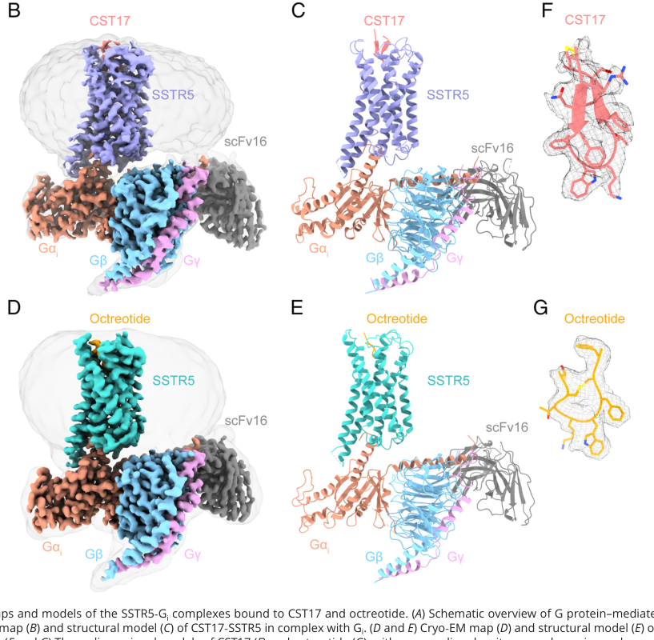

## Question

# Gene Research for Functional Annotation

## ⚠️ CRITICAL: Gene/Protein Identification Context

**BEFORE YOU BEGIN RESEARCH:** You MUST verify you are researching the CORRECT gene/protein. Gene symbols can be ambiguous, especially for less well-characterized genes from non-model organisms.

### Target Gene/Protein Identity (from UniProt):
- **UniProt Accession:** P30938
- **Protein Description:** RecName: Full=Somatostatin receptor type 5; Short=SS-5-R; Short=SS5-R; Short=SS5R;
- **Gene Information:** Name=Sstr5;
- **Organism (full):** Rattus norvegicus (Rat).
- **Protein Family:** Belongs to the G-protein coupled receptor 1 family.
- **Key Domains:** GPCR_Rhodpsn. (IPR000276); GPCR_Rhodpsn_7TM. (IPR017452); Somatstn_rcpt. (IPR000586); Somatstn_rcpt_5. (IPR001184); 7tm_1 (PF00001)

### MANDATORY VERIFICATION STEPS:

1. **Check if the gene symbol "Sstr5" matches the protein description above**
2. **Verify the organism is correct:** Rattus norvegicus (Rat).
3. **Check if protein family/domains align with what you find in literature**
4. **If you find literature for a DIFFERENT gene with the same or similar symbol, STOP**

### If Gene Symbol is Ambiguous or You Cannot Find Relevant Literature:

**DO NOT PROCEED WITH RESEARCH ON A DIFFERENT GENE.** Instead:
- State clearly: "The gene symbol 'Sstr5' is ambiguous or literature is limited for this specific protein"
- Explain what you found (e.g., "Found extensive literature on a different gene with the same symbol in a different organism")
- Describe the protein based ONLY on the UniProt information provided above
- Suggest that the protein function can be inferred from domain/family information

### Research Target:

Please provide a comprehensive research report on the gene **Sstr5** (gene ID: Sstr5, UniProt: P30938) in rat.

The research report should be a detailed narrative explaining the function, biological processes, and localization of the gene product. Citations should be given for all claims.

You should prioritize authoritative reviews and primary scientific literature when conducting research. You can supplement
this with annotations you find in gene/protein databases, but these can be outdated or inaccurate.

We are specifically interested in the primary function of the gene - for enzymes, what reaction is catalyzed, and what is the substrate specificity? For transporters, what is the substrate? For structural proteins or adapters, what is the broader structural role? For signaling molecules, what is the role in the pathway.

We are interested in where in or outside the cell the gene product carries out its function.

We are also interested in the signaling or biochemical pathways in which the gene functions. We are less interested in broad pleiotropic effects, except where these elucidate the precise role.

Include evidence where possible. We are interested in both experimental evidence as well as inference from structure, evolution, or bioinformatic analysis. Precise studies should be prioritized over high-throughput, where available.

## Output

Question: You are an expert researcher providing comprehensive, well-cited information.

Provide detailed information focusing on:
1. Key concepts and definitions with current understanding
2. Recent developments and latest research (prioritize 2023-2024 sources)
3. Current applications and real-world implementations
4. Expert opinions and analysis from authoritative sources
5. Relevant statistics and data from recent studies

Format as a comprehensive research report with proper citations. Include URLs and publication dates where available.
Always prioritize recent, authoritative sources and provide specific citations for all major claims.

# Gene Research for Functional Annotation

## ⚠️ CRITICAL: Gene/Protein Identification Context

**BEFORE YOU BEGIN RESEARCH:** You MUST verify you are researching the CORRECT gene/protein. Gene symbols can be ambiguous, especially for less well-characterized genes from non-model organisms.

### Target Gene/Protein Identity (from UniProt):
- **UniProt Accession:** P30938
- **Protein Description:** RecName: Full=Somatostatin receptor type 5; Short=SS-5-R; Short=SS5-R; Short=SS5R;
- **Gene Information:** Name=Sstr5;
- **Organism (full):** Rattus norvegicus (Rat).
- **Protein Family:** Belongs to the G-protein coupled receptor 1 family.
- **Key Domains:** GPCR_Rhodpsn. (IPR000276); GPCR_Rhodpsn_7TM. (IPR017452); Somatstn_rcpt. (IPR000586); Somatstn_rcpt_5. (IPR001184); 7tm_1 (PF00001)

### MANDATORY VERIFICATION STEPS:

1. **Check if the gene symbol "Sstr5" matches the protein description above**
2. **Verify the organism is correct:** Rattus norvegicus (Rat).
3. **Check if protein family/domains align with what you find in literature**
4. **If you find literature for a DIFFERENT gene with the same or similar symbol, STOP**

### If Gene Symbol is Ambiguous or You Cannot Find Relevant Literature:

**DO NOT PROCEED WITH RESEARCH ON A DIFFERENT GENE.** Instead:
- State clearly: "The gene symbol 'Sstr5' is ambiguous or literature is limited for this specific protein"
- Explain what you found (e.g., "Found extensive literature on a different gene with the same symbol in a different organism")
- Describe the protein based ONLY on the UniProt information provided above
- Suggest that the protein function can be inferred from domain/family information

### Research Target:

Please provide a comprehensive research report on the gene **Sstr5** (gene ID: Sstr5, UniProt: P30938) in rat.

The research report should be a detailed narrative explaining the function, biological processes, and localization of the gene product. Citations should be given for all claims.

You should prioritize authoritative reviews and primary scientific literature when conducting research. You can supplement
this with annotations you find in gene/protein databases, but these can be outdated or inaccurate.

We are specifically interested in the primary function of the gene - for enzymes, what reaction is catalyzed, and what is the substrate specificity? For transporters, what is the substrate? For structural proteins or adapters, what is the broader structural role? For signaling molecules, what is the role in the pathway.

We are interested in where in or outside the cell the gene product carries out its function.

We are also interested in the signaling or biochemical pathways in which the gene functions. We are less interested in broad pleiotropic effects, except where these elucidate the precise role.

Include evidence where possible. We are interested in both experimental evidence as well as inference from structure, evolution, or bioinformatic analysis. Precise studies should be prioritized over high-throughput, where available.

## Research report: Rat **Sstr5** (UniProt **P30938**) — functional annotation and translational context

### 0) Target verification (critical identity check)
The UniProt accession **P30938** corresponds to **somatostatin receptor type 5** (gene **Sstr5**) in **Rattus norvegicus**, belonging to the rhodopsin-like/class A seven-transmembrane (7TM) GPCR superfamily and canonically coupling to inhibitory G proteins (Gi/Go). This matches the literature description of SSTRs as class A/rhodopsin-like 7TM GPCRs with inhibitory signaling via adenylyl cyclase/cAMP. (periferakis2024agonistsantagonistsand pages 2-3, yue2012somatostatinreceptortype pages 51-55, kasprzak2021somatostatinandits pages 5-6)

### 1) Key concepts and definitions (current understanding)

#### 1.1 Somatostatin receptor family and receptor subtype 5 (SSTR5/Sstr5)
Somatostatin receptors (SSTR1–5) are **class A/rhodopsin-like GPCRs** with a **canonical 7TM topology**. They mediate the inhibitory endocrine and neuromodulatory actions of the peptide hormone **somatostatin** (SST). (kasprzak2021somatostatinandits pages 5-6, yue2012somatostatinreceptortype pages 51-55)

SSTR5 is one of the receptor subtypes through which SST suppresses secretion of multiple hormones and modulates cellular growth responses. A synthesis of subtype biology describes SSTR5 as ~**364 aa** and ~**39 kDa**, with broad tissue distribution including **CNS, pancreas, and GI tract**, consistent with UniProt-level annotation. (periferakis2024agonistsantagonistsand pages 2-3, kasprzak2021somatostatinandits pages 6-7)

#### 1.2 Ligands: endogenous SST peptides and clinical analogs
Endogenous somatostatin is produced as a precursor that is proteolytically processed into **SST-14** and **SST-28**, both of which bind SSTRs. (kasprzak2021somatostatinandits pages 5-6)

SSTR5 has been reported to bind both SST forms, with **~10-fold higher affinity for SST-28 than SST-14**, a property often invoked to explain subtype-selective physiological regulation. (kasprzak2021somatostatinandits pages 6-7, tamura2023selectivesomatostatinreceptor pages 1-2)

Clinically used somatostatin analogs exhibit subtype-selective affinities. In a recent authoritative review, **octreotide** is summarized as having **high affinity for SSTR2 and SSTR5**, whereas **pasireotide** is described as having the **greatest affinity for SSTR5** among common analogs. (milewskakranc2023theroleof pages 6-7)

#### 1.3 Canonical signaling and pathway placement
Across subtypes, SSTR activation is canonically **Gi/Go-coupled** (pertussis-toxin-sensitive), producing **inhibition of adenylyl cyclase** and decreased intracellular **cAMP**, often accompanied by reduced Ca2+ signaling and suppression of secretion. (farb2017regulationofendogenous pages 1-2, periferakis2024agonistsantagonistsand pages 2-3)

Additional intracellular mechanisms commonly reported for SSTR signaling include modulation of **K+ and Ca2+ channels** (including inward rectifier K+ channel effects and reduced voltage-gated Ca2+ entry), activation of **protein tyrosine phosphatases**, and engagement of **PLC and MAPK pathways**. A table-based summary for SSTR5 specifically lists **inhibition of cAMP** and activation of **PLC** and **MAPK** as downstream pathways. (periferakis2024agonistsantagonistsand pages 3-5, milewskakranc2023theroleof pages 3-4, kasprzak2021somatostatinandits pages 5-6)

**Functional role in pathways (annotation view):** Sstr5 acts as an inhibitory GPCR node in paracrine/endocrine circuits where SST restrains secretion (e.g., pancreatic islet hormone release, pituitary hormone output) and can modulate growth-related signaling via phosphatases and MAPK branches. (yue2012somatostatinreceptortype pages 55-59, milewskakranc2023theroleof pages 3-4)

### 2) Expression and localization (with rat emphasis)

#### 2.1 Tissue and cell-type expression (rat-relevant statements)
Rat-relevant synthesis indicates that SSTR5 is expressed in the **pituitary**, and is described as a **predominant pituitary subtype** in rat. (yue2012somatostatinreceptortype pages 55-59)

In pancreatic islets, subtype usage differs by endocrine cell type. A rat/rodent-focused synthesis reports that in rodents **β-cells more exclusively express SSTR5**, and that in rats **α-cells** and **δ-cells** show predominant subtype expression patterns (SSTR2 vs SSTR5) consistent with intra-islet paracrine control. (yue2012somatostatinreceptortype pages 55-59)

In the nervous system, SSTR5 is described as **moderately expressed throughout the brain**, and brain SSTR5 expression is stated to be **higher in rats than humans**, supporting biological relevance for rat neuroendocrine regulation. (yue2012somatostatinreceptortype pages 55-59, yue2012somatostatinreceptortype pages 51-55)

#### 2.2 Subcellular localization (general GPCR behavior; evidence limitations for rat Sstr5)
The provided evidence base primarily supports **plasma membrane localization** as a classical GPCR and notes family-wide processes such as phosphorylation-dependent desensitization and internalization (general SSTR biology). (periferakis2024agonistsantagonistsand pages 3-5)

Within the retrieved evidence, explicit rat-specific subcellular microdomain localization (e.g., cilia vs non-cilia) for **Sstr5** was not directly documented; therefore, subcellular localization beyond membrane GPCR behavior is best treated as an inference from GPCR family biology rather than a rat-specific demonstrated annotation in the included texts. (periferakis2024agonistsantagonistsand pages 3-5)

### 3) Recent developments (prioritizing 2023–2024)

#### 3.1 2024: High-resolution structures reveal activation determinants for SSTR5
A major 2024 advance is the **cryo-EM solution of SSTR5–Gi complexes** bound to cyclic peptide agonists **cortistatin-17** and **octreotide** at **2.7–2.9 Å resolution**, enabling residue-level mapping of agonist recognition and activation. (li2024structuralbasisfor pages 2-4, li2024structuralbasisfor pages 1-2)

Mechanistically, these structures identify key conserved pocket anchors and a ligand-dependent network of **hydrophobic interactions between TM3 and TM6** (“hydrophobic lock”) that undergoes rotameric rearrangement upon agonist binding. The work also highlights extracellular loop contributions (ECL2/ECL3) to octreotide recognition and canonical GPCR activation rearrangements including TM6 outward movement and changes in conserved motifs (e.g., DRY, NPxxY), explaining how ligand binding enables **Gαi engagement** and downstream inhibition of cAMP. (li2024structuralbasisfor pages 5-8, li2024structuralbasisfor pages 2-4)

**Visual evidence:** The cryo-EM overall maps/models and the hydrophobic-lock concept are shown in the extracted figure panels from the paper. (li2024structuralbasisfor media 0750b218, li2024structuralbasisfor media ffff0b9b)

#### 3.2 2023: Selective SSTR5 antagonism as a metabolic lever (preclinical)
A 2023 pharmacology study demonstrated that **selective SSTR5 inhibition** can improve insulin sensitivity, with clamp and signaling evidence pointing to a substantial **hepatic component**. In this work, genetic SSTR5 deletion and an orally delivered selective antagonist (compound-1) lowered glycemic markers and improved insulin sensitivity indices. (tamura2023selectivesomatostatinreceptor pages 1-2)

Importantly, the study reports a mechanistic link to insulin signaling: compound-1 reversed **octreotide-induced suppression of insulin-stimulated Akt phosphorylation** in mouse liver, consistent with restoration of hepatic insulin action when SSTR5 signaling is blocked. (tamura2023selectivesomatostatinreceptor pages 1-2)

### 4) Current applications and real-world implementations

#### 4.1 Endocrine/neuroendocrine pharmacotherapy where SSTR5 affinity matters
Authoritative synthesis indicates that subtype affinities shape clinical use: **octreotide** (high affinity SSTR2/SSTR5) and **pasireotide** (SSTR5-preferring, but multi-subtype) are used for neuroendocrine and pituitary-related conditions; efficacy can depend on receptor expression patterns across lesions. (milewskakranc2023theroleof pages 6-7, milewskakranc2023theroleof pages 11-12)

A ClinicalTrials.gov Phase 3 randomized trial record documents real-world implementation of **oral octreotide capsules (MYCAPSSA)** for **acromegaly**, enrolling **56** patients and using biochemical maintenance of IGF-1 control as a primary endpoint (NCT03252353). While receptor subtype is not specified in the record, the pharmacologic rationale is consistent with octreotide’s reported SSTR2/SSTR5 affinity. (NCT03252353 chunk 1, milewskakranc2023theroleof pages 6-7)

A ClinicalTrials.gov Phase 2 crossover study tested **subcutaneous pasireotide** (explicitly described as an **sst1/2/3/5 agonist**) in **postoperative dumping syndrome** (n=9; NCT01895296), reflecting clinical translation of broad-subtype SST receptor activation to modulate GI hormone release and hyperinsulinemic responses. (NCT01895296 chunk 1)

A terminated Phase 2 trial investigated pasireotide (SOM230) for recurrent/progressive **meningioma** (NCT00813592; enrollment 2), and the record explicitly notes pasireotide’s binding to subtypes **1,2,3,5** and provides subtype-expression frequencies in meningioma tissues, illustrating how receptor subtype expression can be used as a selection/biomarker concept. (NCT00813592 chunk 1)

#### 4.2 Molecular imaging/theranostics using radiolabeled octreotide analogs
Somatostatin receptor imaging is widely used in neuroendocrine tumors, and a synthesis notes that octreotide-based imaging can be used to assess **SST2/SST5 status**, while also emphasizing that many imaging agents correlate most strongly with SST2 rather than SST5, a key practical limitation for SSTR5-specific inference from standard tracers. (kasprzak2021somatostatinandits pages 20-22)

Two ClinicalTrials.gov records provide trial-level evidence for radiotracer deployment:
* **NCT03883776 (Phase 1, completed; n=12)**: first-in-human evaluation of **Al18F-NOTA-octreotide (18F-AlF-NOTA-octreotide)** PET/CT imaging in NET patients and healthy volunteers, including dosimetry and lesion comparison to routine 68Ga-DOTA-peptide PET. (NCT03883776 chunk 1)
* **NCT04552847 (Phase 2/3, completed; n=85)**: evaluation of Al18F-NOTA-octreotide PET compared with routine 68Ga-DOTA-SSA PET, including lesion detection metrics and SUV-based comparisons. (NCT04552847 chunk 1)

#### 4.3 Emerging metabolic application: selective SSTR5 antagonism
Preclinical evidence supports an emerging concept of **SSTR5 antagonism** as a potential therapeutic approach for metabolic disease by relieving SST-mediated inhibitory tone affecting insulin/incretin biology and hepatic insulin action. (tamura2023selectivesomatostatinreceptor pages 1-2, periferakis2024agonistsantagonistsand pages 14-15)

### 5) Quantitative statistics and data highlights (recent)

#### 5.1 Structural biology (2024)
* Cryo-EM structures of agonist-bound SSTR5–Gi complexes were solved at **2.7 Å and 2.9 Å**. (li2024structuralbasisfor pages 1-2, li2024structuralbasisfor pages 2-4)

#### 5.2 Pharmacology and metabolic physiology (2023)
* Compound-1 (selective SSTR5 antagonist) potency: **IC50 = 9.8 nM (human)** and **31 nM (mouse)**, with reported **>1000-fold selectivity** versus SSTR1–4 in profiling. (tamura2023selectivesomatostatinreceptor pages 5-6)
* In HFD-fed mice, SSTR5 knockout vs WT showed reductions in fasting markers: glucose **228.3 ± 70.6 vs 190.2 ± 30.1 mg/dL**, insulin **87.5 ± 95.3 vs 32.5 ± 47.8 ng/mL**, and GHb **4.8 ± 0.7% vs 4.0 ± 0.4%**. (tamura2023selectivesomatostatinreceptor pages 4-5)

#### 5.3 Imaging protocol parameters (trial records)
* Al18F-NOTA-octreotide PET trials used single IV dosing around **4 MBq/kg** with imaging around **~120 minutes** post-injection in the Phase 2/3 record, with detailed lesion detection and SUV-based endpoints. (NCT04552847 chunk 1, NCT03883776 chunk 1)

### 6) Expert opinions and analysis (authoritative perspectives)

1. **Subtype selectivity as a key driver of efficacy and side effects:** Recent reviews emphasize that limited subtype selectivity of older analogs can constrain efficacy and contribute to side effects, motivating development of receptor-subtype–tailored ligands and improved understanding of receptor–ligand structural determinants. (milewskakranc2023theroleof pages 6-7, li2024structuralbasisfor pages 1-2)
2. **SSTR5 as a designable GPCR target:** The 2024 structural work explicitly frames SSTR5 as a promising target in endocrine/metabolic and pituitary disorders and positions atomic-level structures as templates for rational ligand optimization. (li2024structuralbasisfor pages 1-2, li2024structuralbasisfor pages 5-8)
3. **Species considerations for rat functional annotation:** While receptor family mechanisms (class A 7TM, Gi coupling) are well conserved, rat-specific tissue distribution and cellular partitioning can differ from humans; where possible, rat-focused expression statements (pituitary predominance; islet cell-type patterns; relatively higher brain expression) should be prioritized for rat annotation. (yue2012somatostatinreceptortype pages 55-59)

### 7) Consolidated functional annotation statement (rat Sstr5; UniProt P30938)
**Sstr5 encodes an inhibitory class A 7TM GPCR that binds somatostatin peptides—preferentially SST-28 relative to SST-14—and signals primarily via Gi/Go to inhibit adenylyl cyclase, reduce cAMP, and suppress secretion, with additional coupling to phosphatases and PLC/MAPK pathways. In rats, SSTR5 is relevant to pituitary and pancreatic endocrine regulation and is expressed in brain; pharmacologic and structural advances in 2023–2024 clarify ligand recognition/activation and highlight translational applications (somatostatin analog therapy, receptor imaging/theranostics, and emerging metabolic antagonism strategies).** (yue2012somatostatinreceptortype pages 55-59, kasprzak2021somatostatinandits pages 6-7, periferakis2024agonistsantagonistsand pages 2-3, milewskakranc2023theroleof pages 3-4, li2024structuralbasisfor pages 1-2, tamura2023selectivesomatostatinreceptor pages 1-2)

---

### Summary table
| Category | Key points (1-2 bullets) | Representative sources (first author year, journal) | URL (if available) |
|---|---|---|---|
| Identity/Structure | • Rat **Sstr5** matches UniProt **P30938**: somatostatin receptor type 5, a **class A/rhodopsin-like 7-transmembrane GPCR** in the somatostatin receptor family. • Canonically couples to **Gi/Go**, consistent with inhibition of adenylyl cyclase/cAMP signaling. (periferakis2024agonistsantagonistsand pages 2-3, yue2012somatostatinreceptortype pages 51-55, kasprzak2021somatostatinandits pages 5-6) | Periferakis 2024, *Current Issues in Molecular Biology*; Yue 2012; Kasprzak 2021, *Biomedicines* | https://doi.org/10.3390/cimb46090578; https://doi.org/10.3390/biomedicines9111743 |
| Ligands/Pharmacology | • SSTR5 binds both SST peptides, with **~10-fold higher affinity for SST-28 than SST-14**. • **Octreotide** shows high affinity for **SSTR2/SSTR5**; **pasireotide** shows the **highest affinity for SSTR5** among common clinical analogs. (kasprzak2021somatostatinandits pages 6-7, milewskakranc2023theroleof pages 6-7, tamura2023selectivesomatostatinreceptor pages 1-2) | Kasprzak 2021, *Biomedicines*; Milewska-Kranc 2023, *Cancers*; Tamura 2023, *Pharmacology Research & Perspectives* | https://doi.org/10.3390/biomedicines9111743; https://doi.org/10.3390/cancers16010116; https://doi.org/10.1002/prp2.1043 |
| Signaling | • Main signaling is **Gi/Go-mediated inhibition of adenylyl cyclase**, lowering intracellular **cAMP** and often **Ca2+**. • Additional reported outputs include modulation of **K+/Ca2+ channels**, activation of **protein tyrosine phosphatases**, and engagement of **PLC/MAPK** pathways. (farb2017regulationofendogenous pages 1-2, periferakis2024agonistsantagonistsand pages 3-5, milewskakranc2023theroleof pages 3-4, periferakis2024agonistsantagonistsand pages 2-3, kasprzak2021somatostatinandits pages 5-6) | Farb 2017, *Endocrinology*; Periferakis 2024, *Current Issues in Molecular Biology*; Milewska-Kranc 2023, *Cancers* | https://doi.org/10.1210/en.2017-00639; https://doi.org/10.3390/cimb46090578; https://doi.org/10.3390/cancers16010116 |
| Expression/Localization | • Rat-relevant evidence indicates SSTR5 is expressed in **pituitary** and **pancreatic islets**; in rodents, **β-cells** are described as more exclusively expressing SSTR5, while rat **δ-cells** also show predominant SSTR5 expression in some studies. • Brain SSTR5 expression is reported as **higher in rats than humans**; broader tissue distribution includes CNS, pancreas, and GI tract. (yue2012somatostatinreceptortype pages 55-59, periferakis2024agonistsantagonistsand pages 2-3) | Yue 2012; Periferakis 2024, *Current Issues in Molecular Biology* | https://doi.org/10.3390/cimb46090578 |
| Recent 2023-2024 advances | • **Cryo-EM structures** of agonist-bound **SSTR5-Gi** complexes (CST17 and octreotide) resolved the orthosteric pocket, extracellular loop contributions, and a TM3/TM6 **“hydrophobic lock”** linked to activation. • 2024 work also reinforced SSTR5 as a therapeutic design target for more selective agonists. (li2024structuralbasisfor pages 5-8, li2024structuralbasisfor pages 2-4, li2024structuralbasisfor pages 1-2, li2024structuralbasisfor media 0750b218) | Li 2024, *PNAS* | https://doi.org/10.1073/pnas.2321710121 |
| Applications/Clinical | • SSTR5 is relevant to **somatostatin analog therapy** in endocrine/neuroendocrine disease because octreotide and especially pasireotide engage this subtype. • Real-world implementations include **oral octreotide** for acromegaly, **pasireotide** trials, and **radiolabeled octreotide PET** for somatostatin receptor imaging in NETs. (NCT00813592 chunk 1, NCT03252353 chunk 1, NCT01895296 chunk 1, NCT04552847 chunk 1, NCT03883776 chunk 1, kasprzak2021somatostatinandits pages 20-22) | ClinicalTrials.gov NCT03252353; NCT01895296; NCT00813592; NCT04552847; NCT03883776; Kasprzak 2021, *Biomedicines* | https://clinicaltrials.gov/study/NCT03252353; https://clinicaltrials.gov/study/NCT01895296; https://clinicaltrials.gov/study/NCT00813592; https://clinicaltrials.gov/study/NCT04552847; https://clinicaltrials.gov/study/NCT03883776; https://doi.org/10.3390/biomedicines9111743 |
| Quantitative data | • Selective SSTR5 antagonist **compound-1**: **IC50 9.8 nM (human)** and **31 nM (mouse)**, with **>1000-fold selectivity** over SSTR1-4 in reported profiling. • In HFD-fed mice, SSTR5 deletion lowered fasting glucose (**228.3 ± 70.6 vs 190.2 ± 30.1 mg/dL**), insulin (**87.5 ± 95.3 vs 32.5 ± 47.8 ng/mL**), and GHb (**4.8 ± 0.7% vs 4.0 ± 0.4%**); SSTR5 cryo-EM structures were solved at **2.7 Å and 2.9 Å**. (tamura2023selectivesomatostatinreceptor pages 5-6, tamura2023selectivesomatostatinreceptor pages 4-5, li2024structuralbasisfor pages 1-2) | Tamura 2023, *Pharmacology Research & Perspectives*; Li 2024, *PNAS* | https://doi.org/10.1002/prp2.1043; https://doi.org/10.1073/pnas.2321710121 |

*Table: This table summarizes the core functional annotation of rat Sstr5 (UniProt P30938), including identity, ligands, signaling, localization, recent advances, clinical relevance, and quantitative findings. It is useful as a compact evidence-backed reference for the receptor’s biology and translational significance.*

### Key URLs (with publication dates from retrieved sources)
* Li et al., *PNAS* (Jun **2024**): Structural basis for SSTR5 activation by cyclic neuropeptide agonists. https://doi.org/10.1073/pnas.2321710121 (li2024structuralbasisfor pages 1-2)
* Tamura et al., *Pharmacology Research & Perspectives* (Dec **2023**): Selective SSTR5 inhibition improves hepatic insulin sensitivity. https://doi.org/10.1002/prp2.1043 (tamura2023selectivesomatostatinreceptor pages 1-2)
* Milewska-Kranc et al., *Cancers* (Dec **2023**): Review of receptor–ligand interactions and subtype selectivity (octreotide SSTR2/5; pasireotide SSTR5). https://doi.org/10.3390/cancers16010116 (milewskakranc2023theroleof pages 6-7)
* Periferakis et al., *Current Issues in Molecular Biology* (Sep **2024**): Review of SSTR biology and translational implications. https://doi.org/10.3390/cimb46090578 (periferakis2024agonistsantagonistsand pages 2-3)
* Kasprzak, *Biomedicines* (Nov **2021**): Review including SST2/SST5 imaging/theranostic context. https://doi.org/10.3390/biomedicines9111743 (kasprzak2021somatostatinandits pages 20-22)
* ClinicalTrials.gov NCT03883776 (registered **2019**): https://clinicaltrials.gov/study/NCT03883776 (NCT03883776 chunk 1)
* ClinicalTrials.gov NCT04552847 (registered **2020**): https://clinicaltrials.gov/study/NCT04552847 (NCT04552847 chunk 1)
* ClinicalTrials.gov NCT03252353 (registered **2017**): https://clinicaltrials.gov/study/NCT03252353 (NCT03252353 chunk 1)
* ClinicalTrials.gov NCT01895296 (registered **2008**): https://clinicaltrials.gov/study/NCT01895296 (NCT01895296 chunk 1)

### Notes on evidence scope and remaining gaps
The retrieved evidence strongly supports receptor class, ligand selectivity, signaling, and translational applications. However, within the retrieved texts, **direct rat-specific subcellular localization** (beyond generic GPCR membrane localization and family internalization behavior) and **rat Sstr5 protein-level localization maps** were limited; additional rat-focused histology/autoradiography studies or rat tissue atlases would further strengthen that specific aspect of annotation. (periferakis2024agonistsantagonistsand pages 3-5, yue2012somatostatinreceptortype pages 55-59)

References

1. (periferakis2024agonistsantagonistsand pages 2-3): Argyrios Periferakis, Georgios Tsigas, Aristodemos-Theodoros Periferakis, Carla Mihaela Tone, Daria Alexandra Hemes, Konstantinos Periferakis, Lamprini Troumpata, I. Bădărău, C. Scheau, A. Căruntu, I. Săvulescu-Fiedler, Constantin Căruntu, and A. Scheau. Agonists, antagonists and receptors of somatostatin: pathophysiological and therapeutical implications in neoplasias. Current Issues in Molecular Biology, 46:9721-9759, Sep 2024. URL: https://doi.org/10.3390/cimb46090578, doi:10.3390/cimb46090578. This article has 22 citations.

2. (yue2012somatostatinreceptortype pages 51-55): J Yue. Somatostatin receptor type 2 (sstr2) antagonism and hypoglycemia in diabetes. Unknown journal, 2012.

3. (kasprzak2021somatostatinandits pages 5-6): Aldona Kasprzak. Somatostatin and its receptor system in colorectal cancer. Biomedicines, 9:1743, Nov 2021. URL: https://doi.org/10.3390/biomedicines9111743, doi:10.3390/biomedicines9111743. This article has 18 citations.

4. (kasprzak2021somatostatinandits pages 6-7): Aldona Kasprzak. Somatostatin and its receptor system in colorectal cancer. Biomedicines, 9:1743, Nov 2021. URL: https://doi.org/10.3390/biomedicines9111743, doi:10.3390/biomedicines9111743. This article has 18 citations.

5. (tamura2023selectivesomatostatinreceptor pages 1-2): Yumiko Okano Tamura, Jun Sugama, Shin‐ichi Abe, Yuji Shimizu, Hideki Hirose, and Masanori Watanabe. Selective somatostatin receptor 5 inhibition improves hepatic insulin sensitivity. Pharmacology Research & Perspectives, Dec 2023. URL: https://doi.org/10.1002/prp2.1043, doi:10.1002/prp2.1043. This article has 4 citations and is from a peer-reviewed journal.

6. (milewskakranc2023theroleof pages 6-7): Agnieszka Milewska-Kranc, Jarosław B. Ćwikła, and Agnieszka Kolasinska-Ćwikła. The role of receptor–ligand interaction in somatostatin signaling pathways: implications for neuroendocrine tumors. Cancers, 16:116, Dec 2023. URL: https://doi.org/10.3390/cancers16010116, doi:10.3390/cancers16010116. This article has 26 citations.

7. (farb2017regulationofendogenous pages 1-2): Thomas B Farb, Marta Adeva, Thomas J Beauchamp, Over Cabrera, David A Coates, Tamika DeShea Meredith, Brian A Droz, Alexander Efanov, James V Ficorilli, Susan L Gackenheimer, Maria A Martinez-Grau, Victoriano Molero, Gema Ruano, Michael A Statnick, Todd M Suter, Samreen K Syed, Miguel A Toledo, Francis S Willard, Xin Zhou, Krister B Bokvist, and David G Barrett. Regulation of endogenous (male) rodent glp-1 secretion and human islet insulin secretion by antagonism of somatostatin receptor 5. Endocrinology, 158:3859–3873, Nov 2017. URL: https://doi.org/10.1210/en.2017-00639, doi:10.1210/en.2017-00639. This article has 26 citations and is from a domain leading peer-reviewed journal.

8. (periferakis2024agonistsantagonistsand pages 3-5): Argyrios Periferakis, Georgios Tsigas, Aristodemos-Theodoros Periferakis, Carla Mihaela Tone, Daria Alexandra Hemes, Konstantinos Periferakis, Lamprini Troumpata, I. Bădărău, C. Scheau, A. Căruntu, I. Săvulescu-Fiedler, Constantin Căruntu, and A. Scheau. Agonists, antagonists and receptors of somatostatin: pathophysiological and therapeutical implications in neoplasias. Current Issues in Molecular Biology, 46:9721-9759, Sep 2024. URL: https://doi.org/10.3390/cimb46090578, doi:10.3390/cimb46090578. This article has 22 citations.

9. (milewskakranc2023theroleof pages 3-4): Agnieszka Milewska-Kranc, Jarosław B. Ćwikła, and Agnieszka Kolasinska-Ćwikła. The role of receptor–ligand interaction in somatostatin signaling pathways: implications for neuroendocrine tumors. Cancers, 16:116, Dec 2023. URL: https://doi.org/10.3390/cancers16010116, doi:10.3390/cancers16010116. This article has 26 citations.

10. (yue2012somatostatinreceptortype pages 55-59): J Yue. Somatostatin receptor type 2 (sstr2) antagonism and hypoglycemia in diabetes. Unknown journal, 2012.

11. (li2024structuralbasisfor pages 2-4): Jingru Li, Chongzhao You, Yang Li, Changyao Li, Wenjia Fan, Zecai Chen, Wen Hu, Kai Wu, H. Eric Xu, and Li-Hua Zhao. Structural basis for activation of somatostatin receptor 5 by cyclic neuropeptide agonists. Proceedings of the National Academy of Sciences of the United States of America, Jun 2024. URL: https://doi.org/10.1073/pnas.2321710121, doi:10.1073/pnas.2321710121. This article has 5 citations and is from a highest quality peer-reviewed journal.

12. (li2024structuralbasisfor pages 1-2): Jingru Li, Chongzhao You, Yang Li, Changyao Li, Wenjia Fan, Zecai Chen, Wen Hu, Kai Wu, H. Eric Xu, and Li-Hua Zhao. Structural basis for activation of somatostatin receptor 5 by cyclic neuropeptide agonists. Proceedings of the National Academy of Sciences of the United States of America, Jun 2024. URL: https://doi.org/10.1073/pnas.2321710121, doi:10.1073/pnas.2321710121. This article has 5 citations and is from a highest quality peer-reviewed journal.

13. (li2024structuralbasisfor pages 5-8): Jingru Li, Chongzhao You, Yang Li, Changyao Li, Wenjia Fan, Zecai Chen, Wen Hu, Kai Wu, H. Eric Xu, and Li-Hua Zhao. Structural basis for activation of somatostatin receptor 5 by cyclic neuropeptide agonists. Proceedings of the National Academy of Sciences of the United States of America, Jun 2024. URL: https://doi.org/10.1073/pnas.2321710121, doi:10.1073/pnas.2321710121. This article has 5 citations and is from a highest quality peer-reviewed journal.

14. (li2024structuralbasisfor media 0750b218): Jingru Li, Chongzhao You, Yang Li, Changyao Li, Wenjia Fan, Zecai Chen, Wen Hu, Kai Wu, H. Eric Xu, and Li-Hua Zhao. Structural basis for activation of somatostatin receptor 5 by cyclic neuropeptide agonists. Proceedings of the National Academy of Sciences of the United States of America, Jun 2024. URL: https://doi.org/10.1073/pnas.2321710121, doi:10.1073/pnas.2321710121. This article has 5 citations and is from a highest quality peer-reviewed journal.

15. (li2024structuralbasisfor media ffff0b9b): Jingru Li, Chongzhao You, Yang Li, Changyao Li, Wenjia Fan, Zecai Chen, Wen Hu, Kai Wu, H. Eric Xu, and Li-Hua Zhao. Structural basis for activation of somatostatin receptor 5 by cyclic neuropeptide agonists. Proceedings of the National Academy of Sciences of the United States of America, Jun 2024. URL: https://doi.org/10.1073/pnas.2321710121, doi:10.1073/pnas.2321710121. This article has 5 citations and is from a highest quality peer-reviewed journal.

16. (milewskakranc2023theroleof pages 11-12): Agnieszka Milewska-Kranc, Jarosław B. Ćwikła, and Agnieszka Kolasinska-Ćwikła. The role of receptor–ligand interaction in somatostatin signaling pathways: implications for neuroendocrine tumors. Cancers, 16:116, Dec 2023. URL: https://doi.org/10.3390/cancers16010116, doi:10.3390/cancers16010116. This article has 26 citations.

17. (NCT03252353 chunk 1):  Efficacy and Safety of Octreotide Capsules (MYCAPSSA) in Acromegaly. Chiasma, Inc.. 2017. ClinicalTrials.gov Identifier: NCT03252353

18. (NCT01895296 chunk 1): Prof Dr Jan Tack. Study to Assess Safety and Efficacy of sc Pasireotide in Patients With Dumping Syndrome. Universitaire Ziekenhuizen KU Leuven. 2008. ClinicalTrials.gov Identifier: NCT01895296

19. (NCT00813592 chunk 1):  Phase II Study of SOM230 in Patients With Recurrent or Progressive Meningioma. University of Utah. 2008. ClinicalTrials.gov Identifier: NCT00813592

20. (kasprzak2021somatostatinandits pages 20-22): Aldona Kasprzak. Somatostatin and its receptor system in colorectal cancer. Biomedicines, 9:1743, Nov 2021. URL: https://doi.org/10.3390/biomedicines9111743, doi:10.3390/biomedicines9111743. This article has 18 citations.

21. (NCT03883776 chunk 1):  Al18F-NOTA-octreotide PET Imaging of the Somatostatin Receptor in Neuroendocrine Tumors. Universitaire Ziekenhuizen KU Leuven. 2019. ClinicalTrials.gov Identifier: NCT03883776

22. (NCT04552847 chunk 1):  Al18F-NOTA-octreotide PET Imaging in Neuroendocrine Tumors. Universitaire Ziekenhuizen KU Leuven. 2020. ClinicalTrials.gov Identifier: NCT04552847

23. (periferakis2024agonistsantagonistsand pages 14-15): Argyrios Periferakis, Georgios Tsigas, Aristodemos-Theodoros Periferakis, Carla Mihaela Tone, Daria Alexandra Hemes, Konstantinos Periferakis, Lamprini Troumpata, I. Bădărău, C. Scheau, A. Căruntu, I. Săvulescu-Fiedler, Constantin Căruntu, and A. Scheau. Agonists, antagonists and receptors of somatostatin: pathophysiological and therapeutical implications in neoplasias. Current Issues in Molecular Biology, 46:9721-9759, Sep 2024. URL: https://doi.org/10.3390/cimb46090578, doi:10.3390/cimb46090578. This article has 22 citations.

24. (tamura2023selectivesomatostatinreceptor pages 5-6): Yumiko Okano Tamura, Jun Sugama, Shin‐ichi Abe, Yuji Shimizu, Hideki Hirose, and Masanori Watanabe. Selective somatostatin receptor 5 inhibition improves hepatic insulin sensitivity. Pharmacology Research & Perspectives, Dec 2023. URL: https://doi.org/10.1002/prp2.1043, doi:10.1002/prp2.1043. This article has 4 citations and is from a peer-reviewed journal.

25. (tamura2023selectivesomatostatinreceptor pages 4-5): Yumiko Okano Tamura, Jun Sugama, Shin‐ichi Abe, Yuji Shimizu, Hideki Hirose, and Masanori Watanabe. Selective somatostatin receptor 5 inhibition improves hepatic insulin sensitivity. Pharmacology Research & Perspectives, Dec 2023. URL: https://doi.org/10.1002/prp2.1043, doi:10.1002/prp2.1043. This article has 4 citations and is from a peer-reviewed journal.

## Artifacts

- [Edison artifact artifact-00](Sstr5-deep-research-falcon_artifacts/artifact-00.md)

## Citations

1. kasprzak2021somatostatinandits pages 5-6
2. milewskakranc2023theroleof pages 6-7
3. yue2012somatostatinreceptortype pages 55-59
4. periferakis2024agonistsantagonistsand pages 3-5
5. tamura2023selectivesomatostatinreceptor pages 1-2
6. kasprzak2021somatostatinandits pages 20-22
7. tamura2023selectivesomatostatinreceptor pages 5-6
8. tamura2023selectivesomatostatinreceptor pages 4-5
9. li2024structuralbasisfor pages 1-2
10. periferakis2024agonistsantagonistsand pages 2-3
11. yue2012somatostatinreceptortype pages 51-55
12. kasprzak2021somatostatinandits pages 6-7
13. farb2017regulationofendogenous pages 1-2
14. milewskakranc2023theroleof pages 3-4
15. li2024structuralbasisfor pages 2-4
16. li2024structuralbasisfor pages 5-8
17. milewskakranc2023theroleof pages 11-12
18. periferakis2024agonistsantagonistsand pages 14-15
19. https://doi.org/10.3390/cimb46090578;
20. https://doi.org/10.3390/biomedicines9111743
21. https://doi.org/10.3390/biomedicines9111743;
22. https://doi.org/10.3390/cancers16010116;
23. https://doi.org/10.1002/prp2.1043
24. https://doi.org/10.1210/en.2017-00639;
25. https://doi.org/10.3390/cancers16010116
26. https://doi.org/10.3390/cimb46090578
27. https://doi.org/10.1073/pnas.2321710121
28. https://clinicaltrials.gov/study/NCT03252353;
29. https://clinicaltrials.gov/study/NCT01895296;
30. https://clinicaltrials.gov/study/NCT00813592;
31. https://clinicaltrials.gov/study/NCT04552847;
32. https://clinicaltrials.gov/study/NCT03883776;
33. https://doi.org/10.1002/prp2.1043;
34. https://clinicaltrials.gov/study/NCT03883776
35. https://clinicaltrials.gov/study/NCT04552847
36. https://clinicaltrials.gov/study/NCT03252353
37. https://clinicaltrials.gov/study/NCT01895296
38. https://doi.org/10.3390/cimb46090578,
39. https://doi.org/10.3390/biomedicines9111743,
40. https://doi.org/10.1002/prp2.1043,
41. https://doi.org/10.3390/cancers16010116,
42. https://doi.org/10.1210/en.2017-00639,
43. https://doi.org/10.1073/pnas.2321710121,