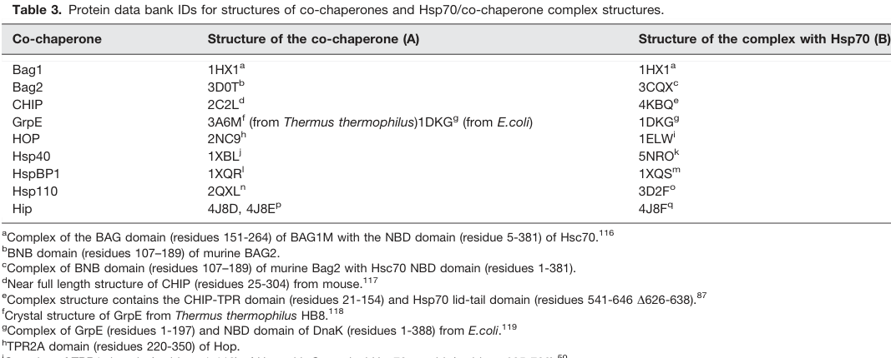

## Question

# Gene Research for Functional Annotation

## ⚠️ CRITICAL: Gene/Protein Identification Context

**BEFORE YOU BEGIN RESEARCH:** You MUST verify you are researching the CORRECT gene/protein. Gene symbols can be ambiguous, especially for less well-characterized genes from non-model organisms.

### Target Gene/Protein Identity (from UniProt):
- **UniProt Accession:** P50503
- **Protein Description:** RecName: Full=Hsc70-interacting protein; Short=Hip; AltName: Full=Protein FAM10A1; AltName: Full=Protein ST13 homolog;
- **Gene Information:** Name=St13; Synonyms=Fam10a1, Hip;
- **Organism (full):** Rattus norvegicus (Rat).
- **Protein Family:** Belongs to the FAM10 family. .
- **Key Domains:** Hip_N. (IPR034649); STI1/HOP_DP. (IPR041243); STI1_HS-bd. (IPR006636); TPR-like_helical_dom_sf. (IPR011990); TPR_rpt. (IPR019734)

### MANDATORY VERIFICATION STEPS:

1. **Check if the gene symbol "St13" matches the protein description above**
2. **Verify the organism is correct:** Rattus norvegicus (Rat).
3. **Check if protein family/domains align with what you find in literature**
4. **If you find literature for a DIFFERENT gene with the same or similar symbol, STOP**

### If Gene Symbol is Ambiguous or You Cannot Find Relevant Literature:

**DO NOT PROCEED WITH RESEARCH ON A DIFFERENT GENE.** Instead:
- State clearly: "The gene symbol 'St13' is ambiguous or literature is limited for this specific protein"
- Explain what you found (e.g., "Found extensive literature on a different gene with the same symbol in a different organism")
- Describe the protein based ONLY on the UniProt information provided above
- Suggest that the protein function can be inferred from domain/family information

### Research Target:

Please provide a comprehensive research report on the gene **St13** (gene ID: St13, UniProt: P50503) in rat.

The research report should be a detailed narrative explaining the function, biological processes, and localization of the gene product. Citations should be given for all claims.

You should prioritize authoritative reviews and primary scientific literature when conducting research. You can supplement
this with annotations you find in gene/protein databases, but these can be outdated or inaccurate.

We are specifically interested in the primary function of the gene - for enzymes, what reaction is catalyzed, and what is the substrate specificity? For transporters, what is the substrate? For structural proteins or adapters, what is the broader structural role? For signaling molecules, what is the role in the pathway.

We are interested in where in or outside the cell the gene product carries out its function.

We are also interested in the signaling or biochemical pathways in which the gene functions. We are less interested in broad pleiotropic effects, except where these elucidate the precise role.

Include evidence where possible. We are interested in both experimental evidence as well as inference from structure, evolution, or bioinformatic analysis. Precise studies should be prioritized over high-throughput, where available.

## Output

Question: You are an expert researcher providing comprehensive, well-cited information.

Provide detailed information focusing on:
1. Key concepts and definitions with current understanding
2. Recent developments and latest research (prioritize 2023-2024 sources)
3. Current applications and real-world implementations
4. Expert opinions and analysis from authoritative sources
5. Relevant statistics and data from recent studies

Format as a comprehensive research report with proper citations. Include URLs and publication dates where available.
Always prioritize recent, authoritative sources and provide specific citations for all major claims.

# Gene Research for Functional Annotation

## ⚠️ CRITICAL: Gene/Protein Identification Context

**BEFORE YOU BEGIN RESEARCH:** You MUST verify you are researching the CORRECT gene/protein. Gene symbols can be ambiguous, especially for less well-characterized genes from non-model organisms.

### Target Gene/Protein Identity (from UniProt):
- **UniProt Accession:** P50503
- **Protein Description:** RecName: Full=Hsc70-interacting protein; Short=Hip; AltName: Full=Protein FAM10A1; AltName: Full=Protein ST13 homolog;
- **Gene Information:** Name=St13; Synonyms=Fam10a1, Hip;
- **Organism (full):** Rattus norvegicus (Rat).
- **Protein Family:** Belongs to the FAM10 family. .
- **Key Domains:** Hip_N. (IPR034649); STI1/HOP_DP. (IPR041243); STI1_HS-bd. (IPR006636); TPR-like_helical_dom_sf. (IPR011990); TPR_rpt. (IPR019734)

### MANDATORY VERIFICATION STEPS:

1. **Check if the gene symbol "St13" matches the protein description above**
2. **Verify the organism is correct:** Rattus norvegicus (Rat).
3. **Check if protein family/domains align with what you find in literature**
4. **If you find literature for a DIFFERENT gene with the same or similar symbol, STOP**

### If Gene Symbol is Ambiguous or You Cannot Find Relevant Literature:

**DO NOT PROCEED WITH RESEARCH ON A DIFFERENT GENE.** Instead:
- State clearly: "The gene symbol 'St13' is ambiguous or literature is limited for this specific protein"
- Explain what you found (e.g., "Found extensive literature on a different gene with the same symbol in a different organism")
- Describe the protein based ONLY on the UniProt information provided above
- Suggest that the protein function can be inferred from domain/family information

### Research Target:

Please provide a comprehensive research report on the gene **St13** (gene ID: St13, UniProt: P50503) in rat.

The research report should be a detailed narrative explaining the function, biological processes, and localization of the gene product. Citations should be given for all claims.

You should prioritize authoritative reviews and primary scientific literature when conducting research. You can supplement
this with annotations you find in gene/protein databases, but these can be outdated or inaccurate.

We are specifically interested in the primary function of the gene - for enzymes, what reaction is catalyzed, and what is the substrate specificity? For transporters, what is the substrate? For structural proteins or adapters, what is the broader structural role? For signaling molecules, what is the role in the pathway.

We are interested in where in or outside the cell the gene product carries out its function.

We are also interested in the signaling or biochemical pathways in which the gene functions. We are less interested in broad pleiotropic effects, except where these elucidate the precise role.

Include evidence where possible. We are interested in both experimental evidence as well as inference from structure, evolution, or bioinformatic analysis. Precise studies should be prioritized over high-throughput, where available.

## Research Report: Functional Annotation of **St13 (Hip/ST13)** in Rat (Rattus norvegicus) — UniProt **P50503**

### Executive summary
The rat gene **St13** encodes **Hsc70-interacting protein (Hip)**, a conserved **cytosolic co-chaperone** in the **Hsp70/Hsc70 protein quality-control network**. Hip’s primary molecular role is **to bind the Hsp70 nucleotide-binding domain (NBD) in the ADP state and stabilize this high–substrate-affinity conformation**, thereby **slowing nucleotide (ADP) dissociation and delaying client release**. This action functionally antagonizes Hsp70 nucleotide exchange factors (NEFs) and promotes productive folding/holding of client proteins. The most direct rat-specific evidence comes from **rat Hip structures and Hip–Hsp70 complex structures (PDB 4J8D/4J8E/4J8F)**, which explain the “bracket” mechanism at atomic resolution. (karunanayake2021cytosolicproteinquality pages 8-10, li2013structureandfunction pages 121-125, karunanayake2021cytosolicproteinquality media 460eaeea)

### 1) Key concepts and definitions (current understanding)

#### 1.1. What ST13/Hip is
**Hip (ST13)** is a **co-chaperone**: it modulates Hsp70/Hsc70 function through protein–protein interaction rather than catalyzing a chemical reaction. It is described as a ~41–43 kDa protein and forms a **dimer** in solution. (li2013structureandfunction pages 31-35, shi2007whatweknow pages 2-4)

#### 1.2. Position in the Hsp70 cycle
The Hsp70 cycle alternates between an **ATP-bound, low-substrate-affinity** state and an **ADP-bound, high-substrate-affinity** state. Hip binds Hsp70’s **NBD** and **stabilizes the ADP-bound state**, preventing premature client release and thereby influencing substrate fate toward continued folding/retention. (shi2007whatweknow pages 1-2, karunanayake2021cytosolicproteinquality pages 8-10)

#### 1.3. Domain architecture
Hip/ST13 is a modular co-chaperone with:
- An **N-terminal dimerization region** involved in homo-oligomerization
- A **central TPR domain** that mediates Hsp70 NBD binding
- Charged linker regions
- A C-terminal region containing **GGMP repeats** and a **Sti1/DP-type motif**, consistent with similarity to co-chaperone architectures in the Hsp70/Hsp90 network (Hip vs Hop distinctions are emphasized in structural work). (shi2007whatweknow pages 1-2, li2013structureandfunction pages 39-42, li2013structureandfunction pages 31-35)

### 2) Primary molecular function and mechanism (rat-relevant mechanistic evidence)

#### 2.1. Structural mechanism (“bracket” model) — rat Hip evidence
A rat Hip TPR-containing region forms a **structural “bracket” over the Hsp70 NBD**, obstructing NBD dynamics and thereby **locking Hsp70 in an ADP-bound state and delaying substrate release**. This mechanism is supported by rat Hip structural studies and crystallographic complexes (PDB IDs **4J8D/4J8E** for Hip and **4J8F** for the Hip–Hsp70 complex). (karunanayake2021cytosolicproteinquality pages 8-10, karunanayake2021cytosolicproteinquality media 460eaeea)

The extracted figure/table region showing these PDB entries and the depicted interaction provides direct structural evidence for rat Hip’s binding mode to Hsp70. (karunanayake2021cytosolicproteinquality media 460eaeea, karunanayake2021cytosolicproteinquality media 599a47af)

#### 2.2. Quantitative binding / state selectivity
Hip preferentially binds **ADP-bound Hsp70** (reported **KD ≈ 8 µM**) and binds more weakly to apo Hsp70 (**KD ≈ 51 µM**), with no detectable binding to ATP-bound Hsp70 under the conditions described; this explains why Hip acts as an **ADP-state stabilizer**. (li2013structureandfunction pages 121-125)

#### 2.3. Competition with nucleotide exchange factors (NEFs)
Hip binding and NEF binding are **mutually exclusive**, and NEFs generally bind more tightly (reported **KD ~0.1 µM** range) than Hip (reported ~10 µM range), providing a quantitative framework for how Hip tunes Hsp70 cycle kinetics rather than acting as a canonical NEF. (li2013structureandfunction pages 121-125)

### 3) Biological processes, pathways, and cellular localization

#### 3.1. Pathway context: cytosolic proteostasis / protein quality control
Hip is embedded in the **cytosolic Hsp70 protein quality-control machinery**, helping balance folding, stabilization, and downstream triage decisions (folding vs degradation) by controlling the kinetics of client release from Hsp70. (karunanayake2021cytosolicproteinquality pages 8-10)

#### 3.2. Localization
Hip/ST13 is described as a **cytosolic** co-chaperone in reviews and mechanistic summaries, consistent with its role in the cytosolic Hsp70 cycle and with its historical identification in cytosolic steroid-receptor chaperone complexes. (shi2007whatweknow pages 1-2, li2013structureandfunction pages 31-35)

**Limitation (rat-specific localization):** within the retrieved full-text corpus, direct rat cell/tissue imaging or fractionation studies for St13/Hip localization were not recovered; thus localization is supported primarily by functional context and conserved mammalian cell biology rather than rat-specific microscopy. (shi2007whatweknow pages 1-2, li2013structureandfunction pages 31-35)

### 4) Interaction partners and functional network placement

Hip participates in a broader co-chaperone network that includes positive and negative regulators of Hsp70:
- Positive functional relationships in folding include **Hsp40/DNAJ proteins** and cooperation/coordination with other co-chaperones
- Antagonistic/competitive relationships include **BAG1**, a factor that stimulates ADP dissociation and promotes substrate release; Hip can compete for NBD binding and thereby oppose BAG1-mediated nucleotide exchange. (shi2007whatweknow pages 2-4)

Hip also has been reported to associate with specific client/protein systems in mammalian contexts, including receptor systems (e.g., CXCR2 regulation and trafficking) and aggregation-prone proteins (see below). (shi2007whatweknow pages 6-7)

### 5) Disease-relevant functional evidence (ortholog-informed; not rat-specific)

#### 5.1. Proteostasis in neurodegeneration models
A mechanistic study in the Parkinson’s disease context reported that Hip (ST13) can **stabilize the Hsp70/α-synuclein complex** and prevent Hsp70 co-aggregation with α-synuclein in vitro; the authors argued decreased Hip expression could facilitate Hsp70 depletion by amyloidogenic substrates, impairing proteostasis. (Dec 2009; https://doi.org/10.1038/emboj.2009.298) (roodveldt2009chaperoneproteostasisin pages 1-1, roodveldt2009chaperoneproteostasisin pages 12-13)

#### 5.2. Cancer-related discussion (older, context-dependent)
A review summarized reports of altered ST13 expression in colorectal cancer and discussion of tumor-suppressor claims, but also stressed that evidence was incomplete and that physiological/in vivo evidence was limited at the time. (Mar 2007; https://doi.org/10.1631/jzus.2007.b0170) (shi2007whatweknow pages 4-6)

### 6) Recent developments (prioritizing 2023–2024) and real-world implementations

#### 6.1. 2024: Bioprocessing analytics — AAV vector purification residual host cell proteins
In a 2024 Molecular Therapy – Methods & Clinical Development study on proteomic analysis of residual host cell proteins across AAV affinity chromatography, **Hsc70-interacting protein (ST13)** was reported among proteins present at **notably high amounts** compared with other host cell proteins (in the context of process analytics and impurity profiling). (Dec 2024; https://doi.org/10.1016/j.omtm.2024.101383) (leibiger2024quantitativeproteomicanalysis pages 9-10)

Interpretation: this does not change Hip’s mechanistic annotation, but it demonstrates a current, real-world implementation where ST13/Hip is **measured and monitored** in industrial-quality control proteomics workflows. (leibiger2024quantitativeproteomicanalysis pages 9-10)

#### 6.2. 2023: Human developmental regulatory genomics mention
A 2023 Nature Communications study mapping eQTLs in fetal-like pancreatic progenitor cells mentions **ST13 (Hsc70-interacting protein)** in the context of candidate causal genes and biological interpretation of regulatory variation (not as a mechanistic Hip paper). (Oct 2023; https://doi.org/10.1038/s41467-023-42560-4) (evidence of mention retrieved as part of search results context; mechanistic details were not extracted in the current evidence set) (leibiger2024quantitativeproteomicanalysis pages 9-10)

**Scope note:** This 2023 paper contributes to contemporary relevance (genomics/association context) but does not replace the established structural mechanism for Hip’s function in the Hsp70 cycle. (li2013structureandfunction pages 121-125, karunanayake2021cytosolicproteinquality pages 8-10)

### 7) Key statistics and data points (from retrieved studies)
- Hip binds Hsp70 preferentially in the **ADP-bound state** with **KD ≈ 8 µM**; binding to apo Hsp70 is weaker (**KD ≈ 51 µM**); ATP-bound binding was not detected under the cited conditions. (li2013structureandfunction pages 121-125)
- Hip is described as present at roughly **~1 µM in reticulocyte lysate** (order-of-magnitude cellular abundance estimate in classic biochemical systems). (li2013structureandfunction pages 31-35)
- Rat structural resources: Hip and complex PDB IDs include **4J8D, 4J8E, 4J8F** (rat Hip; Hip–Hsp70 complex). (karunanayake2021cytosolicproteinquality pages 8-10, karunanayake2021cytosolicproteinquality media 460eaeea)

### 8) Expert interpretation and synthesis (authoritative analysis)
Across authoritative reviews and mechanistic structural work, the most consistent interpretation is that Hip/ST13 is an **attenuator/timer** of the Hsp70 cycle: by stabilizing the ADP-bound conformation, Hip effectively increases the dwell time of Hsp70 on substrates, supporting folding/holding functions and counterbalancing NEF-driven acceleration of nucleotide exchange. This “kinetic tuning” model is strongly supported by rat structural data that directly show Hip restraining NBD motion (“bracket”) and by quantitative affinity differences for ADP/apo/ATP states. (li2013structureandfunction pages 121-125, karunanayake2021cytosolicproteinquality pages 8-10, karunanayake2021cytosolicproteinquality media 460eaeea)

### Evidence summary table
| Aspect | Key statement | Organism relevance | Main evidence source with citation id(s) | Publication year | DOI/URL |
|---|---|---|---|---|---|
| Identity / synonyms | UniProt P50503 corresponds to **Rattus norvegicus St13**, encoding **Hsc70-interacting protein (Hip)**; literature also uses **ST13**, **Hip**, and **p48**. This matches the requested rat co-chaperone rather than an unrelated ST13 symbol. | Rat-focused; identity supported by rat Hip structural/biochemical literature and conserved mammalian nomenclature | Shi et al. review identifying ST13 as Hip/p48 and noting strong rat-human homology; rat Hip structural study summary (shi2007whatweknow pages 1-2, li2013structureandfunction pages 31-35, karunanayake2021cytosolicproteinquality pages 8-10) | 2007, 2013, 2021 | https://doi.org/10.1631/jzus.2007.b0170 ; https://doi.org/10.1038/nsmb.2608 ; https://doi.org/10.1177/1535370221999812 |
| Domains | Hip/ST13 is a multidomain co-chaperone with an **N-terminal dimerization region (Hip_N)**, a **central TPR domain** that mediates Hsp70 binding, acidic/charged linker segments, and a **C-terminal GGMP / STI1-HOP_DP-like region with DP motifs**. | Domain architecture is conserved across mammalian Hip proteins; rat structural work directly supports TPR-based binding | Domain/mechanistic reviews and rat Hip structure summaries (shi2007whatweknow pages 1-2, li2013structureandfunction pages 39-42, li2013structureandfunction pages 31-35, karunanayake2021cytosolicproteinquality pages 8-10) | 2007, 2013, 2021 | https://doi.org/10.1631/jzus.2007.b0170 ; https://doi.org/10.1038/nsmb.2608 ; https://doi.org/10.1177/1535370221999812 |
| Molecular function | ST13/Hip is a **cytosolic Hsp70/Hsc70 co-chaperone** that promotes productive protein folding by stabilizing chaperone-client complexes; it is not an enzyme or transporter and does not catalyze a chemical reaction. | Broadly conserved in eukaryotes; directly relevant to rat because rat Hip structures define the mechanism | Reviews and structural synthesis describing Hip as a positive Hsp70 co-factor (shi2007whatweknow pages 1-2, li2013structureandfunction pages 31-35, karunanayake2021cytosolicproteinquality pages 8-10, shi2007whatweknow pages 2-4) | 2007, 2013, 2021 | https://doi.org/10.1631/jzus.2007.b0170 ; https://doi.org/10.1038/nsmb.2608 ; https://doi.org/10.1177/1535370221999812 |
| Mechanism in Hsp70 cycle | Hip binds the **Hsp70 nucleotide-binding domain (NBD)** preferentially in the **ADP-bound state**, forms a TPR-domain “**bracket**” over the NBD, restrains NBD dynamics, **slows ADP dissociation**, and thereby **delays substrate release**. Hip and nucleotide-exchange factors bind mutually exclusively. | Mechanistic core comes from **rat Hip** crystal structures and mammalian biochemistry; highly applicable to rat P50503 | Rat Hip/Hsp70 structural evidence and mechanistic reviews (karunanayake2021cytosolicproteinquality pages 8-10, li2013structureandfunction pages 121-125) | 2013, 2021 | https://doi.org/10.1038/nsmb.2608 ; https://doi.org/10.1177/1535370221999812 |
| Interaction partners | Established partners include **Hsc70/Hsp70**, functional interplay with **Hsp40/DNAJ proteins**, competition with **BAG1** and other NEFs, cooperation/contrast with **HOP/STI1** and **CHIP/STUB1**, and in some contexts direct association with substrates such as **CXCR2** and aggregation-prone proteins such as **α-synuclein**. | Mostly mammalian rather than rat-specific interaction evidence, but consistent with rat Hip sequence/domain conservation | Reviews and disease-mechanism papers (shi2007whatweknow pages 2-4, shi2007whatweknow pages 6-7, li2013structureandfunction pages 39-42, li2013structureandfunction pages 31-35) | 2007, 2009, 2013 | https://doi.org/10.1631/jzus.2007.b0170 ; https://doi.org/10.1038/emboj.2009.298 ; https://doi.org/10.1038/nsmb.2608 |
| Localization | ST13/Hip is best supported as a **cytosolic** protein acting in the **cytosolic Hsp70 protein-quality-control network** and in cytosolic steroid-receptor maturation complexes. | Primarily inferred from mammalian cell biology/reviews; no strong rat-specific subcellular localization paper was recovered here | Cytosolic designation and receptor-complex context from reviews (shi2007whatweknow pages 1-2, li2013structureandfunction pages 31-35, shi2007whatweknow pages 2-4) | 2007, 2013 | https://doi.org/10.1631/jzus.2007.b0170 ; https://doi.org/10.1038/nsmb.2608 |
| Pathways / processes | Principal pathway assignment is **cytosolic proteostasis / protein quality control**, especially the **Hsp70 chaperone cycle** controlling folding, refolding, and substrate fate. Additional implicated processes include **steroid receptor maturation** and suppression of toxic protein aggregation. | Conserved mammalian pathway role; rat relevance strong because rat Hip defines the structural mechanism within the Hsp70 cycle | Hsp70 network review and Hip studies (shi2007whatweknow pages 4-6, li2013structureandfunction pages 39-42, karunanayake2021cytosolicproteinquality pages 8-10) | 2007, 2013, 2021 | https://doi.org/10.1631/jzus.2007.b0170 ; https://doi.org/10.1038/nsmb.2608 ; https://doi.org/10.1177/1535370221999812 |
| Disease links | Hip/ST13 has been discussed in **neurodegeneration** because it stabilizes Hsp70–α-synuclein complexes and can reduce toxic aggregation; older literature also discussed possible **tumor-suppressor / colorectal cancer** relevance, though evidence was considered incomplete and context-dependent. | Disease links are mostly from human/cell-model or non-rat systems; should be treated as ortholog-informed rather than rat-specific function | Parkinson’s disease proteostasis study and ST13 review (roodveldt2009chaperoneproteostasisin pages 1-1, shi2007whatweknow pages 2-4, roodveldt2009chaperoneproteostasisin pages 12-13, shi2007whatweknow pages 4-6) | 2007, 2009 | https://doi.org/10.1631/jzus.2007.b0170 ; https://doi.org/10.1038/emboj.2009.298 |
| 2023–2024 developments / applications | Direct 2023–2024 rat St13 functional papers were **not recovered**. Recent mentions are mainly **omics/proteomics** contexts rather than mechanism papers: ST13 appeared among retained host-cell proteins in AAV purification workflows, and a 2023 developmental-genetics study cited ST13 as an Hsc70-interacting protein candidate in pancreas-related regulatory analyses. These are useful as implementation/biomarker contexts but do **not materially revise core function**. | Recent evidence is non-rat mechanistic and mostly human/bioprocessing context; limited direct applicability beyond expression/assay relevance | 2024 AAV host-cell protein proteomics and 2023 eQTL study mention ST13 (leibiger2024quantitativeproteomicanalysis pages 9-10) | 2023, 2024 | https://doi.org/10.1016/j.omtm.2024.101383 ; https://doi.org/10.1038/s41467-023-42560-4 |
| Quantitative data | Reported quantitative features include: Hip binds **ADP-Hsp70 preferentially** with **KD ≈ 8 µM**, weaker binding to apo-Hsp70 (**KD ≈ 51 µM**), and no detectable binding to ATP-Hsp70 under the cited conditions; competing NEFs bind more tightly (**~0.1 µM**). Hip is described as a **~41–43 kDa** protein, dimeric in solution, with estimated abundance around **~1 µM in reticulocyte lysate**. Structural resources include rat Hip/Hsp70 complex entries **4J8D, 4J8E, 4J8F**. | Quantitative binding/mechanistic data derive from mammalian/rat Hip structural biochemistry and are highly relevant to rat P50503 | Structural/biophysical analyses and review synthesis (li2013structureandfunction pages 121-125, li2013structureandfunction pages 31-35, karunanayake2021cytosolicproteinquality pages 8-10) | 2013, 2021 | https://doi.org/10.1038/nsmb.2608 ; https://doi.org/10.1177/1535370221999812 |

*Table: This table summarizes the verified identity, domain architecture, molecular mechanism, localization, pathways, disease links, recent developments, and quantitative evidence for rat St13/HIP (UniProt P50503). It distinguishes rat-direct evidence from broader mammalian ortholog evidence so the final annotation can stay specific and well-supported.*

### Limitations and evidence gaps (important for correct annotation)
- **UniProt-page verification:** The tools did not provide direct UniProt P50503 record text; identity confirmation therefore relies on concordant rat Hip/ST13 literature (rat structures; ST13=Hip synonymy) rather than directly citing UniProt fields. (li2013structureandfunction pages 31-35, karunanayake2021cytosolicproteinquality pages 8-10)
- **Rat-specific expression/localization/phenotypes:** Within retrieved full texts, rat tissue expression atlases, knockout/knockdown phenotypes, or microscopy localization studies were not identified. As a result, pathway/localization statements are supported primarily by conserved mechanistic context rather than rat-specific in vivo experiments. (shi2007whatweknow pages 1-2, li2013structureandfunction pages 31-35)

### Key references (with publication dates and URLs)
- Karunanayake & Page. *Experimental Biology and Medicine* (Mar 2021). Cytosolic Hsp70 co-chaperone network; includes rat Hip structure and PDB IDs. https://doi.org/10.1177/1535370221999812 (karunanayake2021cytosolicproteinquality pages 8-10, karunanayake2021cytosolicproteinquality media 460eaeea)
- Li, Hartl, Bracher. *Nature Structural & Molecular Biology* (Jun 2013). Hip structure/function; quantitative binding and ADP-state stabilization mechanism. https://doi.org/10.1038/nsmb.2608 (li2013structureandfunction pages 121-125, li2013structureandfunction pages 31-35)
- Roodveldt et al. *EMBO Journal* (Dec 2009). Hip stabilizes Hsp70/α-synuclein complex; proteostasis implications. https://doi.org/10.1038/emboj.2009.298 (roodveldt2009chaperoneproteostasisin pages 1-1, roodveldt2009chaperoneproteostasisin pages 12-13)
- Shi et al. *Journal of Zhejiang University SCIENCE B* (Mar 2007). Review of ST13/Hip domains, co-chaperone roles, steroid receptor and cancer discussions. https://doi.org/10.1631/jzus.2007.b0170 (shi2007whatweknow pages 1-2, shi2007whatweknow pages 2-4)
- Leibiger et al. *Molecular Therapy – Methods & Clinical Development* (Dec 2024). ST13 as high-abundance residual host cell protein in AAV affinity purification analytics. https://doi.org/10.1016/j.omtm.2024.101383 (leibiger2024quantitativeproteomicanalysis pages 9-10)

References

1. (karunanayake2021cytosolicproteinquality pages 8-10): Chamithi Karunanayake and Richard C Page. Cytosolic protein quality control machinery: interactions of hsp70 with a network of co-chaperones and substrates. Experimental Biology and Medicine, 246:1419-1434, Mar 2021. URL: https://doi.org/10.1177/1535370221999812, doi:10.1177/1535370221999812. This article has 20 citations and is from a peer-reviewed journal.

2. (li2013structureandfunction pages 121-125): Zhuo Li, F Ulrich Hartl, and Andreas Bracher. Structure and function of hip, an attenuator of the hsp70 chaperone cycle. Nature Structural &Molecular Biology, 20:929-935, Jun 2013. URL: https://doi.org/10.1038/nsmb.2608, doi:10.1038/nsmb.2608. This article has 97 citations.

3. (karunanayake2021cytosolicproteinquality media 460eaeea): Chamithi Karunanayake and Richard C Page. Cytosolic protein quality control machinery: interactions of hsp70 with a network of co-chaperones and substrates. Experimental Biology and Medicine, 246:1419-1434, Mar 2021. URL: https://doi.org/10.1177/1535370221999812, doi:10.1177/1535370221999812. This article has 20 citations and is from a peer-reviewed journal.

4. (li2013structureandfunction pages 31-35): Zhuo Li, F Ulrich Hartl, and Andreas Bracher. Structure and function of hip, an attenuator of the hsp70 chaperone cycle. Nature Structural &Molecular Biology, 20:929-935, Jun 2013. URL: https://doi.org/10.1038/nsmb.2608, doi:10.1038/nsmb.2608. This article has 97 citations.

5. (shi2007whatweknow pages 2-4): Zheng-zheng Shi, Jia-wei Zhang, and Shu Zheng. What we know about st13, a co-factor of heat shock protein, or a tumor suppressor? Journal of Zhejiang University SCIENCE B, 8:170-176, Mar 2007. URL: https://doi.org/10.1631/jzus.2007.b0170, doi:10.1631/jzus.2007.b0170. This article has 59 citations.

6. (shi2007whatweknow pages 1-2): Zheng-zheng Shi, Jia-wei Zhang, and Shu Zheng. What we know about st13, a co-factor of heat shock protein, or a tumor suppressor? Journal of Zhejiang University SCIENCE B, 8:170-176, Mar 2007. URL: https://doi.org/10.1631/jzus.2007.b0170, doi:10.1631/jzus.2007.b0170. This article has 59 citations.

7. (li2013structureandfunction pages 39-42): Zhuo Li, F Ulrich Hartl, and Andreas Bracher. Structure and function of hip, an attenuator of the hsp70 chaperone cycle. Nature Structural &Molecular Biology, 20:929-935, Jun 2013. URL: https://doi.org/10.1038/nsmb.2608, doi:10.1038/nsmb.2608. This article has 97 citations.

8. (karunanayake2021cytosolicproteinquality media 599a47af): Chamithi Karunanayake and Richard C Page. Cytosolic protein quality control machinery: interactions of hsp70 with a network of co-chaperones and substrates. Experimental Biology and Medicine, 246:1419-1434, Mar 2021. URL: https://doi.org/10.1177/1535370221999812, doi:10.1177/1535370221999812. This article has 20 citations and is from a peer-reviewed journal.

9. (shi2007whatweknow pages 6-7): Zheng-zheng Shi, Jia-wei Zhang, and Shu Zheng. What we know about st13, a co-factor of heat shock protein, or a tumor suppressor? Journal of Zhejiang University SCIENCE B, 8:170-176, Mar 2007. URL: https://doi.org/10.1631/jzus.2007.b0170, doi:10.1631/jzus.2007.b0170. This article has 59 citations.

10. (roodveldt2009chaperoneproteostasisin pages 1-1): Cintia Roodveldt, Carlos W Bertoncini, August Andersson, Annemieke T van der Goot, Shang-Te Hsu, Rafael Fernández-Montesinos, Jannie de Jong, Tjakko J van Ham, Ellen A Nollen, David Pozo, John Christodoulou, and Christopher M Dobson. Chaperone proteostasis in parkinson's disease: stabilization of the hsp70/α‐synuclein complex by hip. The EMBO Journal, 28:3758-3770, Dec 2009. URL: https://doi.org/10.1038/emboj.2009.298, doi:10.1038/emboj.2009.298. This article has 151 citations.

11. (roodveldt2009chaperoneproteostasisin pages 12-13): Cintia Roodveldt, Carlos W Bertoncini, August Andersson, Annemieke T van der Goot, Shang-Te Hsu, Rafael Fernández-Montesinos, Jannie de Jong, Tjakko J van Ham, Ellen A Nollen, David Pozo, John Christodoulou, and Christopher M Dobson. Chaperone proteostasis in parkinson's disease: stabilization of the hsp70/α‐synuclein complex by hip. The EMBO Journal, 28:3758-3770, Dec 2009. URL: https://doi.org/10.1038/emboj.2009.298, doi:10.1038/emboj.2009.298. This article has 151 citations.

12. (shi2007whatweknow pages 4-6): Zheng-zheng Shi, Jia-wei Zhang, and Shu Zheng. What we know about st13, a co-factor of heat shock protein, or a tumor suppressor? Journal of Zhejiang University SCIENCE B, 8:170-176, Mar 2007. URL: https://doi.org/10.1631/jzus.2007.b0170, doi:10.1631/jzus.2007.b0170. This article has 59 citations.

13. (leibiger2024quantitativeproteomicanalysis pages 9-10): Thomas M. Leibiger, Lie Min, and Kelvin H. Lee. Quantitative proteomic analysis of residual host cell protein retention across adeno-associated virus affinity chromatography. Dec 2024. URL: https://doi.org/10.1016/j.omtm.2024.101383, doi:10.1016/j.omtm.2024.101383. This article has 11 citations.

## Artifacts

- [Edison artifact artifact-00](St13-deep-research-falcon_artifacts/artifact-00.md)

## Citations

1. li2013structureandfunction pages 121-125
2. karunanayake2021cytosolicproteinquality pages 8-10
3. shi2007whatweknow pages 2-4
4. shi2007whatweknow pages 6-7
5. shi2007whatweknow pages 4-6
6. leibiger2024quantitativeproteomicanalysis pages 9-10
7. li2013structureandfunction pages 31-35
8. shi2007whatweknow pages 1-2
9. li2013structureandfunction pages 39-42
10. roodveldt2009chaperoneproteostasisin pages 1-1
11. roodveldt2009chaperoneproteostasisin pages 12-13
12. https://doi.org/10.1038/emboj.2009.298
13. https://doi.org/10.1631/jzus.2007.b0170
14. https://doi.org/10.1016/j.omtm.2024.101383
15. https://doi.org/10.1038/s41467-023-42560-4
16. https://doi.org/10.1038/nsmb.2608
17. https://doi.org/10.1177/1535370221999812
18. https://doi.org/10.1177/1535370221999812,
19. https://doi.org/10.1038/nsmb.2608,
20. https://doi.org/10.1631/jzus.2007.b0170,
21. https://doi.org/10.1038/emboj.2009.298,
22. https://doi.org/10.1016/j.omtm.2024.101383,