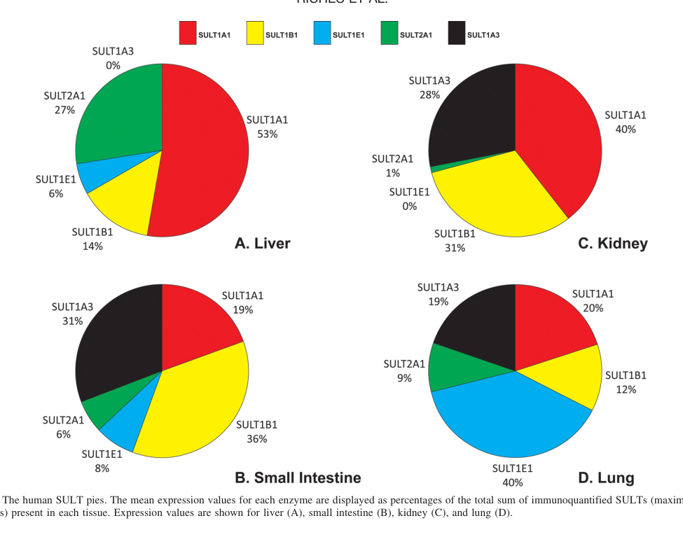

## Question

# Gene Research for Functional Annotation

## ⚠️ CRITICAL: Gene/Protein Identification Context

**BEFORE YOU BEGIN RESEARCH:** You MUST verify you are researching the CORRECT gene/protein. Gene symbols can be ambiguous, especially for less well-characterized genes from non-model organisms.

### Target Gene/Protein Identity (from UniProt):
- **UniProt Accession:** P52847
- **Protein Description:** RecName: Full=Sulfotransferase 1B1; Short=ST1B1; EC=2.8.2.1 {ECO:0000269|PubMed:12773305, ECO:0000269|PubMed:8530477}; AltName: Full=DOPA/tyrosine sulfotransferase {ECO:0000303|PubMed:8530477}; AltName: Full=Sulfotransferase family cytosolic 1B member 1;
- **Gene Information:** Name=Sult1b1 {ECO:0000312|RGD:708534}; Synonyms=St1b1;
- **Organism (full):** Rattus norvegicus (Rat).
- **Protein Family:** Belongs to the sulfotransferase 1 family. .
- **Key Domains:** P-loop_NTPase. (IPR027417); Sulfotransferase_dom. (IPR000863); Sulfotransfer_1 (PF00685)

### MANDATORY VERIFICATION STEPS:

1. **Check if the gene symbol "Sult1b1" matches the protein description above**
2. **Verify the organism is correct:** Rattus norvegicus (Rat).
3. **Check if protein family/domains align with what you find in literature**
4. **If you find literature for a DIFFERENT gene with the same or similar symbol, STOP**

### If Gene Symbol is Ambiguous or You Cannot Find Relevant Literature:

**DO NOT PROCEED WITH RESEARCH ON A DIFFERENT GENE.** Instead:
- State clearly: "The gene symbol 'Sult1b1' is ambiguous or literature is limited for this specific protein"
- Explain what you found (e.g., "Found extensive literature on a different gene with the same symbol in a different organism")
- Describe the protein based ONLY on the UniProt information provided above
- Suggest that the protein function can be inferred from domain/family information

### Research Target:

Please provide a comprehensive research report on the gene **Sult1b1** (gene ID: Sult1b1, UniProt: P52847) in rat.

The research report should be a detailed narrative explaining the function, biological processes, and localization of the gene product. Citations should be given for all claims.

You should prioritize authoritative reviews and primary scientific literature when conducting research. You can supplement
this with annotations you find in gene/protein databases, but these can be outdated or inaccurate.

We are specifically interested in the primary function of the gene - for enzymes, what reaction is catalyzed, and what is the substrate specificity? For transporters, what is the substrate? For structural proteins or adapters, what is the broader structural role? For signaling molecules, what is the role in the pathway.

We are interested in where in or outside the cell the gene product carries out its function.

We are also interested in the signaling or biochemical pathways in which the gene functions. We are less interested in broad pleiotropic effects, except where these elucidate the precise role.

Include evidence where possible. We are interested in both experimental evidence as well as inference from structure, evolution, or bioinformatic analysis. Precise studies should be prioritized over high-throughput, where available.

## Output

Question: You are an expert researcher providing comprehensive, well-cited information.

Provide detailed information focusing on:
1. Key concepts and definitions with current understanding
2. Recent developments and latest research (prioritize 2023-2024 sources)
3. Current applications and real-world implementations
4. Expert opinions and analysis from authoritative sources
5. Relevant statistics and data from recent studies

Format as a comprehensive research report with proper citations. Include URLs and publication dates where available.
Always prioritize recent, authoritative sources and provide specific citations for all major claims.

# Gene Research for Functional Annotation

## ⚠️ CRITICAL: Gene/Protein Identification Context

**BEFORE YOU BEGIN RESEARCH:** You MUST verify you are researching the CORRECT gene/protein. Gene symbols can be ambiguous, especially for less well-characterized genes from non-model organisms.

### Target Gene/Protein Identity (from UniProt):
- **UniProt Accession:** P52847
- **Protein Description:** RecName: Full=Sulfotransferase 1B1; Short=ST1B1; EC=2.8.2.1 {ECO:0000269|PubMed:12773305, ECO:0000269|PubMed:8530477}; AltName: Full=DOPA/tyrosine sulfotransferase {ECO:0000303|PubMed:8530477}; AltName: Full=Sulfotransferase family cytosolic 1B member 1;
- **Gene Information:** Name=Sult1b1 {ECO:0000312|RGD:708534}; Synonyms=St1b1;
- **Organism (full):** Rattus norvegicus (Rat).
- **Protein Family:** Belongs to the sulfotransferase 1 family. .
- **Key Domains:** P-loop_NTPase. (IPR027417); Sulfotransferase_dom. (IPR000863); Sulfotransfer_1 (PF00685)

### MANDATORY VERIFICATION STEPS:

1. **Check if the gene symbol "Sult1b1" matches the protein description above**
2. **Verify the organism is correct:** Rattus norvegicus (Rat).
3. **Check if protein family/domains align with what you find in literature**
4. **If you find literature for a DIFFERENT gene with the same or similar symbol, STOP**

### If Gene Symbol is Ambiguous or You Cannot Find Relevant Literature:

**DO NOT PROCEED WITH RESEARCH ON A DIFFERENT GENE.** Instead:
- State clearly: "The gene symbol 'Sult1b1' is ambiguous or literature is limited for this specific protein"
- Explain what you found (e.g., "Found extensive literature on a different gene with the same symbol in a different organism")
- Describe the protein based ONLY on the UniProt information provided above
- Suggest that the protein function can be inferred from domain/family information

### Research Target:

Please provide a comprehensive research report on the gene **Sult1b1** (gene ID: Sult1b1, UniProt: P52847) in rat.

The research report should be a detailed narrative explaining the function, biological processes, and localization of the gene product. Citations should be given for all claims.

You should prioritize authoritative reviews and primary scientific literature when conducting research. You can supplement
this with annotations you find in gene/protein databases, but these can be outdated or inaccurate.

We are specifically interested in the primary function of the gene - for enzymes, what reaction is catalyzed, and what is the substrate specificity? For transporters, what is the substrate? For structural proteins or adapters, what is the broader structural role? For signaling molecules, what is the role in the pathway.

We are interested in where in or outside the cell the gene product carries out its function.

We are also interested in the signaling or biochemical pathways in which the gene functions. We are less interested in broad pleiotropic effects, except where these elucidate the precise role.

Include evidence where possible. We are interested in both experimental evidence as well as inference from structure, evolution, or bioinformatic analysis. Precise studies should be prioritized over high-throughput, where available.

# Research Report: Functional Annotation of **rat Sult1b1** (UniProt **P52847**, ST1B1)

## Executive summary
Rat **Sult1b1** encodes a **cytosolic sulfotransferase 1 family enzyme** (SULT1B1/ST1B1) that catalyzes **sulfate conjugation (sulfonation/sulfation)** of small molecules by transferring **SO3−** from the universal donor **PAPS** to nucleophilic atoms (commonly oxygen on hydroxyl groups), generating **sulfate esters** and **PAP**. This reaction generally increases compound polarity and supports excretion, but in some cases can create **reactive sulfate esters** that contribute to **bioactivation/toxification**. Rat-specific biochemical characterization (older) indicates Sult1b1 has high activity toward **L-DOPA and tyrosine**, and can also sulfate **p-nitrophenol** and **thyroid hormones**. Recent (2023–2024) literature more often provides disease/regulation context (e.g., NAFLD-associated up-regulation) and broader SULT toxicology frameworks rather than new rat-specific kinetics for UniProt P52847. (bairam2018functionalgenomicstudies pages 27-32, bairam2018functionalgenomicstudies pages 23-27, glatt2024sulphotransferasemediatedtoxificationof pages 1-2)

## 1) Target identity verification (critical disambiguation)
### 1.1 UniProt target match
The requested target is **UniProt P52847**, described as **Sulfotransferase 1B1 (ST1B1)** from **Rattus norvegicus**. The evidence retrieved is consistent with a **SULT1B1/ST1b1** cytosolic sulfotransferase:
- A rat Sult1b1 cDNA was first cloned from a **rat liver library** (1995), and the purified enzyme showed substrate specificity consistent with the SULT1B subfamily (notably **L‑DOPA/tyrosine**). (bairam2018functionalgenomicstudies pages 27-32)
- A 2023 comparative genomics/phylogeny study includes **rat ST1b1 (sult1b1)** with accession **D89375.1**, clustering in the rodent SULT1B1 clade, supporting orthology and helping distinguish it from other SULT1 isoforms. (kondo2023sulfotransferases(sults)enzymatic pages 36-44)

**Conclusion:** The collected evidence supports that “Sult1b1” here refers to the canonical **rat cytosolic SULT1B1/ST1B1** enzyme (target UniProt P52847), not an unrelated gene. (kondo2023sulfotransferases(sults)enzymatic pages 36-44, bairam2018functionalgenomicstudies pages 27-32)

## 2) Key concepts and definitions (current understanding)
### 2.1 What sulfotransferases do
Cytosolic sulfotransferases (SULTs) are **phase II conjugation enzymes** that transfer a sulfonate group from **PAPS (3′-phosphoadenosine-5′-phosphosulfate)** to acceptor substrates, producing sulfated metabolites and **PAP**. (sun2020functionalexpressionof pages 6-11, bairam2018functionalgenomicstudies pages 23-27)

A 2024 expert review emphasizes the chemistry and physiological consequence: transfer of **SO3−** from PAPS to a nucleophilic atom (O, N, S) forms sulfate conjugates (often **sulfuric acid esters**) that are ionized under physiological conditions, increasing water solubility and enabling transporter-mediated excretion. (glatt2024sulphotransferasemediatedtoxificationof pages 1-2)

### 2.2 Cytosolic localization and enzyme architecture
SULTs are described as **soluble cytosolic enzymes** acting on relatively small molecules. (bairam2018functionalgenomicstudies pages 23-27, sadibolova2024biotransformationofplanta pages 21-23)

Mechanistically, human SULT isoforms—including SULT1B1—are described as **homodimers** with conserved dimer interfaces, and their activity depends critically on efficient binding/release of PAPS and PAP. (tibbs2015dimerichumansulfotransferase pages 1-2)

## 3) Core functional annotation of rat Sult1b1
### 3.1 Enzymatic reaction and cofactor
Rat Sult1b1 is a cytosolic sulfotransferase that, by SULT family mechanism, catalyzes:
- **Sulfate (SO3−) transfer from PAPS → substrate (often hydroxyl/amine) → sulfated product + PAP**. (sun2020functionalexpressionof pages 6-11, bairam2018functionalgenomicstudies pages 23-27, glatt2024sulphotransferasemediatedtoxificationof pages 1-2)

### 3.2 Substrate specificity (rat-relevant evidence prioritized)
Rat Sult1b1 was reported (in rat enzyme purification/characterization context summarized in the retrieved source) to show:
- **High substrate specificity for L‑DOPA and tyrosine**
- Additional sulfating activity toward **p-nitrophenol** and **thyroid hormones**. (bairam2018functionalgenomicstudies pages 27-32)

A 2023 transcriptomic/drug-metabolism gene study provides a broader list of reported SULT1B1 substrates (compiled from prior literature), including **4-nitrophenol, silymarin, daphnetin, 6-gingerol, dotinurad, curcuminoids, brivanib, and 6‑O‑desmethylnaproxen**. (chen2023transcriptomicprofilingof pages 10-13)

**Interpretation:** The rat-specific evidence supports a role for Sult1b1 in sulfation of **catechol/phenolic amino acid derivatives** (L‑DOPA/tyrosine) and other phenolic substrates; the broader substrate compilation supports involvement in xenobiotic/drug sulfation but should be interpreted cautiously because it is not rat-isoform-specific in the cited excerpt. (chen2023transcriptomicprofilingof pages 10-13, bairam2018functionalgenomicstudies pages 27-32)

### 3.3 Biological processes
Across authoritative SULT sources, sulfation is positioned as a key process in:
- **Xenobiotic biotransformation and elimination** (increasing polarity for excretion). (riches2009quantitativeevaluationof pages 1-2, glatt2024sulphotransferasemediatedtoxificationof pages 1-2)
- **Regulation of endogenous signaling molecules** (notably hormones), consistent with the mention of **thyroid hormones/iodothyronines** as SULT1B1 substrates. (bairam2018functionalgenomicstudies pages 27-32, bairam2018functionalgenomicstudies pages 23-27)

## 4) Expression and localization (tissue and cellular)
### 4.1 Cellular compartment
Sult1b1/SULT1B1 is a **cytosolic enzyme** (soluble cytosolic SULT). (bairam2018functionalgenomicstudies pages 23-27, sadibolova2024biotransformationofplanta pages 21-23)

### 4.2 Tissue distribution (quantitative comparator evidence)
Direct quantitative rat tissue abundance for Sult1b1 was not retrieved in the available full texts. However, authoritative human data (often used to frame intestinal vs hepatic sulfation potential) show that:
- SULT1B1 accounts for **36% of total SULT in human small intestine** and **14% in human liver**, with low levels in kidney and lung. (riches2009quantitativeevaluationof media 744bce0b)

These proportions are visualized in Riches et al. 2009 (“SULT pies”). (riches2009quantitativeevaluationof media 744bce0b)

**Relevance to rat annotation:** While species differences can be substantial, these human quantitative data support a general conceptual model in which SULT1B1 can be a major contributor to **intestinal first-pass metabolism** for relevant substrates. (riches2009quantitativeevaluationof pages 1-2, riches2009quantitativeevaluationof media 744bce0b)

## 5) Recent developments (2023–2024 prioritized)
### 5.1 Disease-state regulation: NAFLD
A 2023 study analyzing drug-metabolism gene expression in NAFLD reports that **SULT1B1 was up-regulated** both in **high-fat diet mice** and in **patients with NAFLD**, and that the identified set of genes (including SULT1B1) was validated by qRT-PCR in human liver tissues (the excerpt does not provide fold-changes). (chen2023transcriptomicprofilingof pages 10-13)

**Implication:** In metabolic liver disease, SULT1B1 expression changes may contribute to altered phase II metabolism and therefore potentially altered drug/xenobiotic disposition. (chen2023transcriptomicprofilingof pages 10-13)

### 5.2 Orthology and evolutionary context
A 2023 comparative study of SULT gene variation across Carnivora includes rodent reference sequences and places rat **ST1b1/sult1b1 (D89375.1)** within the rodent SULT1B1 clade. This supports correct mapping and helps interpret cross-species activity differences. (kondo2023sulfotransferases(sults)enzymatic pages 36-44)

### 5.3 Toxicology and bioactivation frameworks (expert review)
A 2024 expert review highlights that cytosolic SULTs can not only detoxify compounds but also **toxify/bioactivate** certain substrates via formation of electrophilic reactive intermediates (reactive sulfate esters), with tissue-specific consequences. (glatt2024sulphotransferasemediatedtoxificationof pages 1-2)

The same review reports large quantitative effects when SULT status is genetically manipulated in mouse models used for toxicology, including **up to 99.2% decreases** in DNA adduct levels in knockouts and **83-fold increases** in transgenic humanized SULT1A1/2 models for certain chemicals (values refer to SULT-system manipulation broadly, not uniquely SULT1B1). (glatt2024sulphotransferasemediatedtoxificationof pages 1-2)

### 5.4 Natural products and modulatory effects on SULTs
A 2024 review/thesis on plant secondary metabolite biotransformation emphasizes that SULTs (including SULT1A1 and SULT1B1) have broad and overlapping xenobiotic substrate specificity and that O-sulfonation can bioactivate certain procarcinogens; it also notes that SULTs are estimated to be the **second-most frequent carcinogen-converting enzyme family after CYPs** (statement presented as expert synthesis). (sadibolova2024biotransformationofplanta pages 21-23)

## 6) Current applications and real-world implementations
### 6.1 ADME and drug discovery (phase II metabolism)
SULT enzymes are central to **phase II metabolism** and are used in:
- **In vitro metabolism phenotyping** to identify which conjugation enzymes generate sulfate metabolites and to anticipate clearance/exposure.
- **Preclinical-to-clinical translation**, since sulfation capacity and isoform expression differ between organs and species. (riches2009quantitativeevaluationof pages 1-2, glatt2024sulphotransferasemediatedtoxificationof pages 1-2)

### 6.2 Toxicology risk assessment
The 2024 toxicology review provides direct evidence that manipulating SULT expression profoundly changes **DNA adduct formation** for some chemicals, reinforcing the role of sulfation in **chemical risk assessment** and the importance of knowing which tissues express the relevant SULT. (glatt2024sulphotransferasemediatedtoxificationof pages 1-2, glatt2024sulphotransferasemediatedtoxificationof pages 8-9)

### 6.3 Intestinal first-pass metabolism perspective
Quantitative human data that SULT1B1 is a major intestinal SULT (36%) motivates inclusion of SULT1B1 in **intestinal metabolism models** and PBPK/IVIVE frameworks when compounds are plausible SULT substrates. (riches2009quantitativeevaluationof media 744bce0b)

## 7) Expert opinion and mechanistic analysis (authoritative sources)
### 7.1 Cofactor-dependent dynamics and dimerization
Tibbs & Falany (2015) propose that SULT dimerization relates to cofactor binding/release efficiency. Their molecular dynamics simulations of **human SULT1B1** support **cofactor-dependent inter-subunit communication**, with PAP/PAPS binding altering backbone flexibility in both subunits and potentially explaining half-site reactivity and substrate inhibition. (tibbs2015dimerichumansulfotransferase pages 1-2)

### 7.2 Toxification vs detoxification balance
Glatt & Meinl (2024) emphasize that while sulfation often supports excretion by increasing polarity, sulfate esters can also behave as reactive intermediates, making the net outcome substrate- and tissue-dependent. (glatt2024sulphotransferasemediatedtoxificationof pages 1-2)

## 8) Key statistics and quantitative data (from retrieved evidence)
- **Human tissue distribution (relative):** SULT1B1 = **36%** of total SULT in **small intestine** and **14%** in **liver** (pie-chart quantification). (riches2009quantitativeevaluationof media 744bce0b)
- **Magnitude of SULT-system effects in toxicology models:** up to **99.2% decreases** (knockouts) and **83-fold increases** (SULT1A1/2 transgenics) in DNA adduct formation for some chemicals (system-level SULT perturbations; not uniquely SULT1B1). (glatt2024sulphotransferasemediatedtoxificationof pages 1-2)
- **NAFLD association:** SULT1B1 reported as **up-regulated** in high-fat diet mice and NAFLD patients (no fold change in excerpt). (chen2023transcriptomicprofilingof pages 10-13)

## 9) Evidence gaps and how to interpret them (rat P52847-specific)
- The retrieved corpus contained **limited modern (2023–2024) primary biochemical characterization directly on rat UniProt P52847** (e.g., rat-specific kinetic constants, tissue proteomics abundance, or subcellular localization experiments). Where needed, this report uses (clearly labeled) **general SULT mechanistic evidence** and **human ortholog data** to contextualize likely roles, while keeping the rat-specific substrate specificity statements tied to rat-focused evidence. (sun2020functionalexpressionof pages 6-11, bairam2018functionalgenomicstudies pages 27-32, riches2009quantitativeevaluationof media 744bce0b)

---

## Evidence synthesis table

| Topic | Evidence summary | Species/context (rat vs human) | Best supporting citation IDs | Publication (author year, venue) and URL/DOI |
|---|---|---|---|---|
| Identity | The target matches a cytosolic sulfotransferase in the SULT1 family/SULT1B subfamily. Rat **Sult1b1/ST1b1** was cloned from a rat liver library, and a 2023 comparative/phylogenetic study lists rat **ST1b1 (sult1b1)** with accession **D89375.1** in the rodent SULT1B1 clade, distinguishing it from other SULT1 isoforms. | Rat-specific identity with cross-species phylogenetic support | (bairam2018functionalgenomicstudies pages 27-32, kondo2023sulfotransferases(sults)enzymatic pages 36-44) | Bairam 2018, thesis/monograph excerpt; Kondo et al. 2023, *Comp. Biochem. Physiol. C*. https://doi.org/10.1016/j.cbpc.2022.109476 |
| Reaction / cofactor | Cytosolic SULTs catalyze transfer of a sulfonate/sulfuryl group from **PAPS (3'-phosphoadenosine 5'-phosphosulfate)** to nucleophilic groups on substrates, generating sulfate conjugates and **PAP**. This is the core chemistry applicable to SULT1B1. | General SULT mechanism, applicable to SULT1B1; not rat-exclusive in cited sources | (sun2020functionalexpressionof pages 6-11, riches2009quantitativeevaluationof pages 1-2, bairam2018functionalgenomicstudies pages 23-27, glatt2024sulphotransferasemediatedtoxificationof pages 1-2) | Sun et al. 2020, *Biomolecules*. https://doi.org/10.3390/biom10111517; Riches et al. 2009, *Drug Metab. Dispos.* https://doi.org/10.1124/dmd.109.028399; Glatt & Meinl 2024, *Essays Biochem.* https://doi.org/10.1042/EBC20240030 |
| Subcellular location | SULTs are described as **soluble cytosolic enzymes**; SULT1B1 is therefore a cytosolic phase II sulfotransferase rather than a membrane transporter or secreted protein. | General SULT property used for SULT1B1 annotation | (bairam2018functionalgenomicstudies pages 23-27, tibbs2015dimerichumansulfotransferase pages 1-2, sadibolova2024biotransformationofplanta pages 21-23) | Bairam 2018, thesis/monograph excerpt; Tibbs & Falany 2015, *Pharmacol. Res. Perspect.* https://doi.org/10.1002/prp2.147; Šadibolová 2024, thesis/review excerpt |
| Key substrates / specificity | Rat Sult1b1 was reported to show high substrate specificity for **L-DOPA** and **tyrosine**, with additional sulfating activity toward **p-nitrophenol (pNP)** and **thyroid hormones**. Other sources list SULT1B1-associated substrates including **iodothyronines** and several xenobiotics/drug-like compounds such as **4-nitrophenol, silymarin, daphnetin, 6-gingerol, dotinurad, curcuminoids, brivanib, and 6-O-desmethylnaproxen**. | Rat-specific substrate preference from early characterization; broader human/compiled substrate information from later reviews/transcriptomic annotation | (bairam2018functionalgenomicstudies pages 27-32, chen2023transcriptomicprofilingof pages 10-13, bairam2018functionalgenomicstudies pages 23-27) | Bairam 2018, thesis/monograph excerpt; Chen et al. 2023, *Front. Endocrinol.* https://doi.org/10.3389/fendo.2022.1034494 |
| Tissue expression | Human quantitative data place SULT1B1 in liver, but especially in **small intestine**, where it is the **major SULT (36% of total intestinal SULT)**; in liver it accounts for **14%** of total SULT, with low levels in kidney and lung. These data support a strong intestinal role and are commonly used for cross-species ADME context, although they are not rat-specific. | Human tissue proteomics; useful comparator for rat functional interpretation | (riches2009quantitativeevaluationof pages 1-2, riches2009quantitativeevaluationof media 744bce0b) | Riches et al. 2009, *Drug Metab. Dispos.* https://doi.org/10.1124/dmd.109.028399 |
| Regulation / disease links | A 2023 transcriptomic study identified **SULT1B1** among **nine** common drug-metabolism genes dysregulated across NAFLD-related datasets and reported that **SULT1B1 was up-regulated in high-fat diet mice and in patients with NAFLD**; qRT-PCR validation was performed, but fold-change values were not provided in the cited excerpt. | Mouse/human disease-associated regulation, not rat-specific | (chen2023transcriptomicprofilingof pages 10-13) | Chen et al. 2023, *Front. Endocrinol.* https://doi.org/10.3389/fendo.2022.1034494 |
| Functional role in xenobiotic metabolism / toxification | Expert reviews emphasize that SULT enzymes contribute to xenobiotic elimination by increasing polarity and supporting excretion, but can also **bioactivate** some substrates into reactive sulfuric acid esters. SULT-mediated toxicology in genetically modified mouse models can be dramatic, with reported changes up to **99.2% decreases** in knockouts and **83-fold increases** in transgenics for DNA adduct formation across compounds/tissues; the review does not assign these values specifically to SULT1B1. | General SULT toxicology framework; relevant to interpreting Sult1b1 in xenobiotic metabolism | (sadibolova2024biotransformationofplanta pages 21-23, glatt2024sulphotransferasemediatedtoxificationof pages 1-2) | Šadibolová 2024, thesis/review excerpt; Glatt & Meinl 2024, *Essays Biochem.* https://doi.org/10.1042/EBC20240030 |
| Mechanistic features | Human SULT1B1 is described as a **physiological homodimer**. Molecular dynamics work indicates **cofactor-dependent subunit communication**: binding of PAP or PAPS to one subunit reduces backbone flexibility in both subunits, while mixed PAP/PAPS occupancy increases flexibility in the PAP-bound subunit. These observations were proposed to help explain **half-site reactivity** and **substrate inhibition**. | Human mechanistic/structural analysis, informative for ortholog interpretation | (tibbs2015dimerichumansulfotransferase pages 1-2) | Tibbs & Falany 2015, *Pharmacol. Res. Perspect.* https://doi.org/10.1002/prp2.147 |
| Practical annotation note | Direct recent rat-specific primary literature for **P52847/Sult1b1** appears limited in the gathered evidence. The strongest rat-specific functional annotation comes from older cloning/biochemical characterization, while recent studies more often provide cross-species phylogeny, toxicology context, or human/mouse regulation data. | Rat-focused evidence base is limited; some annotation relies on ortholog/general SULT evidence | (bairam2018functionalgenomicstudies pages 27-32, kondo2023sulfotransferases(sults)enzymatic pages 36-44, chen2023transcriptomicprofilingof pages 10-13) | Bairam 2018 excerpt; Kondo et al. 2023, *Comp. Biochem. Physiol. C*; Chen et al. 2023, *Front. Endocrinol.* |

*Table: This table summarizes the strongest evidence gathered for rat Sult1b1 (UniProt P52847), including rat-specific findings and carefully labeled supporting information from human or broader SULT literature. It is useful for distinguishing direct evidence from cross-species inference in functional annotation.*

## Key sources (with URLs and dates)
- **Glatt H, Meinl W.** *Essays in Biochemistry* (Version of Record published **04 Dec 2024**). “Sulphotransferase-mediated toxification of chemicals in mouse models…” https://doi.org/10.1042/EBC20240030 (glatt2024sulphotransferasemediatedtoxificationof pages 1-2)
- **Chen L et al.** *Frontiers in Endocrinology* (**2023-01**, article year 2023; DOI indicates 2022 submission). “Transcriptomic profiling… NAFLD…” https://doi.org/10.3389/fendo.2022.1034494 (chen2023transcriptomicprofilingof pages 10-13)
- **Kondo M et al.** *Comparative Biochemistry and Physiology Part C* (**Jan 2023**). https://doi.org/10.1016/j.cbpc.2022.109476 (kondo2023sulfotransferases(sults)enzymatic pages 36-44)
- **Tibbs ZE, Falany CN.** *Pharmacology Research & Perspectives* (**May 2015**). https://doi.org/10.1002/prp2.147 (tibbs2015dimerichumansulfotransferase pages 1-2)
- **Riches Z et al.** *Drug Metabolism and Disposition* (**Nov 2009**). https://doi.org/10.1124/dmd.109.028399 (riches2009quantitativeevaluationof pages 1-2, riches2009quantitativeevaluationof media 744bce0b)

References

1. (bairam2018functionalgenomicstudies pages 27-32): AFH Bairam. Functional genomic studies on the genetic polymorphisms of the human cytosolic sulfotransferase 1a3 (sult1a3). Unknown journal, 2018.

2. (bairam2018functionalgenomicstudies pages 23-27): AFH Bairam. Functional genomic studies on the genetic polymorphisms of the human cytosolic sulfotransferase 1a3 (sult1a3). Unknown journal, 2018.

3. (glatt2024sulphotransferasemediatedtoxificationof pages 1-2): Hansruedi Glatt and Walter Meinl. Sulphotransferase-mediated toxification of chemicals in mouse models: effect of knockout or humanisation of sult genes. Essays in Biochemistry, 68:523-539, Dec 2024. URL: https://doi.org/10.1042/ebc20240030, doi:10.1042/ebc20240030. This article has 3 citations and is from a peer-reviewed journal.

4. (kondo2023sulfotransferases(sults)enzymatic pages 36-44): Mitsuki Kondo, Yoshinori Ikenaka, Shouta M.M. Nakayama, Yusuke K. Kawai, Hazuki Mizukawa, Yoko Mitani, Kei Nomyama, Shinsuke Tanabe, and Mayumi Ishizuka. Sulfotransferases (sults), enzymatic and genetic variation in carnivora: limited sulfation capacity in pinnipeds. Comparative Biochemistry and Physiology Part C: Toxicology &amp; Pharmacology, 263:109476, Jan 2023. URL: https://doi.org/10.1016/j.cbpc.2022.109476, doi:10.1016/j.cbpc.2022.109476. This article has 6 citations.

5. (sun2020functionalexpressionof pages 6-11): Yanan Sun, David Machalz, Gerhard Wolber, Maria Kristina Parr, and Matthias Bureik. Functional expression of all human sulfotransferases in fission yeast, assay development, and structural models for isoforms sult4a1 and sult6b1. Biomolecules, 10:1517, Nov 2020. URL: https://doi.org/10.3390/biom10111517, doi:10.3390/biom10111517. This article has 23 citations.

6. (sadibolova2024biotransformationofplanta pages 21-23): M Šadibolová. Biotransformation of plant secondary metabolites and their modulatory effects on drug-metabolizing enzymes. Unknown journal, 2024.

7. (tibbs2015dimerichumansulfotransferase pages 1-2): Zachary E. Tibbs and Charles N. Falany. Dimeric human sulfotransferase 1b1 displays cofactor-dependent subunit communication. Pharmacology Research & Perspectives, May 2015. URL: https://doi.org/10.1002/prp2.147, doi:10.1002/prp2.147. This article has 10 citations and is from a peer-reviewed journal.

8. (chen2023transcriptomicprofilingof pages 10-13): Li Chen, Lu Chen, Xu Li, Lin Qin, Yan Zhu, Qianru Zhang, Daopeng Tan, Yuqi He, and Yu-He Wang. Transcriptomic profiling of hepatic tissues for drug metabolism genes in nonalcoholic fatty liver disease: a study of human and animals. Frontiers in Endocrinology, Jan 2023. URL: https://doi.org/10.3389/fendo.2022.1034494, doi:10.3389/fendo.2022.1034494. This article has 11 citations.

9. (riches2009quantitativeevaluationof pages 1-2): Zoe Riches, Emma L. Stanley, Jackie C. Bloomer, and Michael W.H. Coughtrie. Quantitative evaluation of the expression and activity of five major sulfotransferases (sults) in human tissues: the sult “pie”. Drug Metabolism and Disposition, 37:2255-2261, Nov 2009. URL: https://doi.org/10.1124/dmd.109.028399, doi:10.1124/dmd.109.028399. This article has 459 citations and is from a domain leading peer-reviewed journal.

10. (riches2009quantitativeevaluationof media 744bce0b): Zoe Riches, Emma L. Stanley, Jackie C. Bloomer, and Michael W.H. Coughtrie. Quantitative evaluation of the expression and activity of five major sulfotransferases (sults) in human tissues: the sult “pie”. Drug Metabolism and Disposition, 37:2255-2261, Nov 2009. URL: https://doi.org/10.1124/dmd.109.028399, doi:10.1124/dmd.109.028399. This article has 459 citations and is from a domain leading peer-reviewed journal.

11. (glatt2024sulphotransferasemediatedtoxificationof pages 8-9): Hansruedi Glatt and Walter Meinl. Sulphotransferase-mediated toxification of chemicals in mouse models: effect of knockout or humanisation of sult genes. Essays in Biochemistry, 68:523-539, Dec 2024. URL: https://doi.org/10.1042/ebc20240030, doi:10.1042/ebc20240030. This article has 3 citations and is from a peer-reviewed journal.

## Artifacts

- [Edison artifact artifact-00](Sult1b1-deep-research-falcon_artifacts/artifact-00.md)

## Citations

1. bairam2018functionalgenomicstudies pages 27-32
2. glatt2024sulphotransferasemediatedtoxificationof pages 1-2
3. tibbs2015dimerichumansulfotransferase pages 1-2
4. chen2023transcriptomicprofilingof pages 10-13
5. sadibolova2024biotransformationofplanta pages 21-23
6. bairam2018functionalgenomicstudies pages 23-27
7. sun2020functionalexpressionof pages 6-11
8. riches2009quantitativeevaluationof pages 1-2
9. glatt2024sulphotransferasemediatedtoxificationof pages 8-9
10. https://doi.org/10.1016/j.cbpc.2022.109476
11. https://doi.org/10.3390/biom10111517;
12. https://doi.org/10.1124/dmd.109.028399;
13. https://doi.org/10.1042/EBC20240030
14. https://doi.org/10.1002/prp2.147;
15. https://doi.org/10.3389/fendo.2022.1034494
16. https://doi.org/10.1124/dmd.109.028399
17. https://doi.org/10.1002/prp2.147
18. https://doi.org/10.1042/ebc20240030,
19. https://doi.org/10.1016/j.cbpc.2022.109476,
20. https://doi.org/10.3390/biom10111517,
21. https://doi.org/10.1002/prp2.147,
22. https://doi.org/10.3389/fendo.2022.1034494,
23. https://doi.org/10.1124/dmd.109.028399,