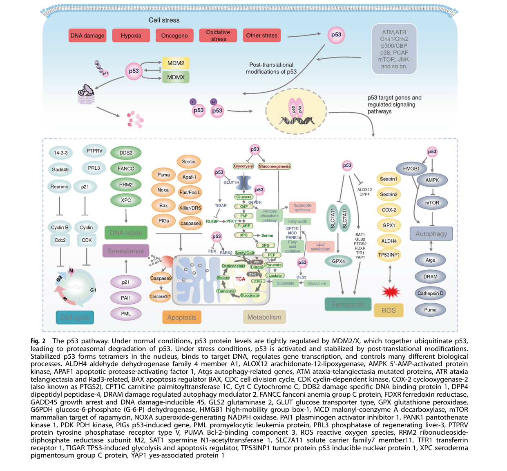

## Question

# Gene Research for Functional Annotation

## ⚠️ CRITICAL: Gene/Protein Identification Context

**BEFORE YOU BEGIN RESEARCH:** You MUST verify you are researching the CORRECT gene/protein. Gene symbols can be ambiguous, especially for less well-characterized genes from non-model organisms.

### Target Gene/Protein Identity (from UniProt):
- **UniProt Accession:** P10361
- **Protein Description:** RecName: Full=Cellular tumor antigen p53; AltName: Full=Tumor suppressor p53;
- **Gene Information:** Name=Tp53; Synonyms=P53;
- **Organism (full):** Rattus norvegicus (Rat).
- **Protein Family:** Belongs to the p53 family. .
- **Key Domains:** p53-like_TF_DNA-bd_sf. (IPR008967); p53/RUNT-type_TF_DNA-bd_sf. (IPR012346); P53_central_site. (IPR057064); p53_DNA-bd. (IPR011615); p53_tetramer_sf. (IPR036674)

### MANDATORY VERIFICATION STEPS:

1. **Check if the gene symbol "Tp53" matches the protein description above**
2. **Verify the organism is correct:** Rattus norvegicus (Rat).
3. **Check if protein family/domains align with what you find in literature**
4. **If you find literature for a DIFFERENT gene with the same or similar symbol, STOP**

### If Gene Symbol is Ambiguous or You Cannot Find Relevant Literature:

**DO NOT PROCEED WITH RESEARCH ON A DIFFERENT GENE.** Instead:
- State clearly: "The gene symbol 'Tp53' is ambiguous or literature is limited for this specific protein"
- Explain what you found (e.g., "Found extensive literature on a different gene with the same symbol in a different organism")
- Describe the protein based ONLY on the UniProt information provided above
- Suggest that the protein function can be inferred from domain/family information

### Research Target:

Please provide a comprehensive research report on the gene **Tp53** (gene ID: Tp53, UniProt: P10361) in rat.

The research report should be a detailed narrative explaining the function, biological processes, and localization of the gene product. Citations should be given for all claims.

You should prioritize authoritative reviews and primary scientific literature when conducting research. You can supplement
this with annotations you find in gene/protein databases, but these can be outdated or inaccurate.

We are specifically interested in the primary function of the gene - for enzymes, what reaction is catalyzed, and what is the substrate specificity? For transporters, what is the substrate? For structural proteins or adapters, what is the broader structural role? For signaling molecules, what is the role in the pathway.

We are interested in where in or outside the cell the gene product carries out its function.

We are also interested in the signaling or biochemical pathways in which the gene functions. We are less interested in broad pleiotropic effects, except where these elucidate the precise role.

Include evidence where possible. We are interested in both experimental evidence as well as inference from structure, evolution, or bioinformatic analysis. Precise studies should be prioritized over high-throughput, where available.

## Output

Question: You are an expert researcher providing comprehensive, well-cited information.

Provide detailed information focusing on:
1. Key concepts and definitions with current understanding
2. Recent developments and latest research (prioritize 2023-2024 sources)
3. Current applications and real-world implementations
4. Expert opinions and analysis from authoritative sources
5. Relevant statistics and data from recent studies

Format as a comprehensive research report with proper citations. Include URLs and publication dates where available.
Always prioritize recent, authoritative sources and provide specific citations for all major claims.

# Gene Research for Functional Annotation

## ⚠️ CRITICAL: Gene/Protein Identification Context

**BEFORE YOU BEGIN RESEARCH:** You MUST verify you are researching the CORRECT gene/protein. Gene symbols can be ambiguous, especially for less well-characterized genes from non-model organisms.

### Target Gene/Protein Identity (from UniProt):
- **UniProt Accession:** P10361
- **Protein Description:** RecName: Full=Cellular tumor antigen p53; AltName: Full=Tumor suppressor p53;
- **Gene Information:** Name=Tp53; Synonyms=P53;
- **Organism (full):** Rattus norvegicus (Rat).
- **Protein Family:** Belongs to the p53 family. .
- **Key Domains:** p53-like_TF_DNA-bd_sf. (IPR008967); p53/RUNT-type_TF_DNA-bd_sf. (IPR012346); P53_central_site. (IPR057064); p53_DNA-bd. (IPR011615); p53_tetramer_sf. (IPR036674)

### MANDATORY VERIFICATION STEPS:

1. **Check if the gene symbol "Tp53" matches the protein description above**
2. **Verify the organism is correct:** Rattus norvegicus (Rat).
3. **Check if protein family/domains align with what you find in literature**
4. **If you find literature for a DIFFERENT gene with the same or similar symbol, STOP**

### If Gene Symbol is Ambiguous or You Cannot Find Relevant Literature:

**DO NOT PROCEED WITH RESEARCH ON A DIFFERENT GENE.** Instead:
- State clearly: "The gene symbol 'Tp53' is ambiguous or literature is limited for this specific protein"
- Explain what you found (e.g., "Found extensive literature on a different gene with the same symbol in a different organism")
- Describe the protein based ONLY on the UniProt information provided above
- Suggest that the protein function can be inferred from domain/family information

### Research Target:

Please provide a comprehensive research report on the gene **Tp53** (gene ID: Tp53, UniProt: P10361) in rat.

The research report should be a detailed narrative explaining the function, biological processes, and localization of the gene product. Citations should be given for all claims.

You should prioritize authoritative reviews and primary scientific literature when conducting research. You can supplement
this with annotations you find in gene/protein databases, but these can be outdated or inaccurate.

We are specifically interested in the primary function of the gene - for enzymes, what reaction is catalyzed, and what is the substrate specificity? For transporters, what is the substrate? For structural proteins or adapters, what is the broader structural role? For signaling molecules, what is the role in the pathway.

We are interested in where in or outside the cell the gene product carries out its function.

We are also interested in the signaling or biochemical pathways in which the gene functions. We are less interested in broad pleiotropic effects, except where these elucidate the precise role.

Include evidence where possible. We are interested in both experimental evidence as well as inference from structure, evolution, or bioinformatic analysis. Precise studies should be prioritized over high-throughput, where available.

# Research report: rat **Tp53** (UniProt **P10361**) — functional annotation of cellular tumor antigen p53

## 0) Mandatory target verification (gene/protein identity)

**Target per user-provided UniProt context:** UniProt accession **P10361**, protein name **cellular tumor antigen p53** (tumor suppressor p53), gene **Tp53** in **Rattus norvegicus**.

**Verification against current literature:** The retrieved literature consistently describes p53 as a conserved p53-family transcription factor with the expected domain architecture (transactivation regions, central sequence-specific DNA-binding domain, tetramerization/oligomerization domain, C-terminal regulatory region) and a stress-responsive tumor-suppressor role, matching the UniProt domain/family context (p53 family; p53 DNA-binding and tetramerization superfamily) (liu2024understandingthecomplexity pages 1-3, shen2023targetingthep53 pages 1-2, benitez2024p53geneticsand pages 3-4). Rat-relevant evidence explicitly refers to **Rattus norvegicus** and demonstrates Tp53-dependent regulation in rat-derived endothelial cells, anchoring that we are not conflating Tp53 with an unrelated gene symbol in another organism (bhagwani2023ap53tlr3axis pages 4-7).

## 1) Key concepts and definitions (current understanding)

### 1.1 What Tp53 encodes and what p53 “does”

**Tp53 encodes p53, a sequence-specific DNA-binding transcription factor** that acts as a central stress-response node and tumor suppressor (“guardian of the genome”) (wang2023targetingp53pathways pages 2-4, wang2023targetingp53pathways pages 1-2, shen2023targetingthep53 pages 1-2). Functionally, p53 binds p53 response elements in the genome and transcriptionally regulates gene programs that determine cell fate under stress, prominently including **cell-cycle arrest, DNA repair, apoptosis, and senescence** (wang2023targetingp53pathways pages 2-4, wang2023targetingp53pathways pages 1-2, shen2023targetingthep53 pages 1-2).

Because p53 is *not* an enzyme or transporter, its “primary function” in a functional-annotation sense is best defined as:

* **DNA-binding transcription factor activity** (sequence-specific) coupled to **stress-induced transcriptional regulation** of target genes to preserve genomic integrity and constrain oncogenic transformation (wang2023targetingp53pathways pages 2-4, shen2023targetingthep53 pages 1-2, grigoreva2024p53themultifaceted pages 1-2).

### 1.2 Domain architecture and functional assembly

Recent expert reviews describe canonical p53 domain organization, which matches the expected family/domain context in UniProt:

* **N-terminal transactivation domains** and **proline-rich region**: major regulatory and post-translational modification (PTM) hotspots, crucial for cofactor recruitment and upstream signaling integration (liu2024understandingthecomplexity pages 1-3, shen2023targetingthep53 pages 1-2).
* **Central DNA-binding domain (DBD)**: mediates sequence-specific recognition of response elements; this region is structurally characterized and highly conserved across vertebrates (liu2024understandingthecomplexity pages 1-3, pasadas2024exploringtheimpact pages 42-46).
* **Oligomerization/tetramerization domain**: activated p53 forms tetramers; tetramerization is required for efficient DNA binding and full transactivation (shen2023targetingthep53 pages 1-2, grigoreva2024p53themultifaceted pages 2-4).

A structurally explicit domain map (with residue boundaries, described for human p53 but used broadly for conserved p53 annotation) is provided by a 2023 review, including TAD-1 (1–39), TAD-2 (40–60), PRD (61–93), DBD (94–292), and the tetramerization region (OD, 323–355) (shen2023targetingthep53 pages 1-2).

### 1.3 Canonical p53 pathway logic (conceptual definition)

The p53 pathway is often summarized as a **stress → p53 stabilization/activation → transcriptional program → cell fate** cascade, with negative feedback through MDM2.

* Under basal conditions, p53 is kept at low levels by negative regulators **MDM2 and MDMX/MDM4**, which promote p53 ubiquitination and proteasomal turnover; MDM2 can also promote nuclear export of p53 (wang2023targetingp53pathways pages 2-4, grigoreva2024p53themultifaceted pages 1-2).
* Diverse cellular stresses (notably DNA damage) inhibit p53 ubiquitination, stabilize p53, and promote tetramer formation and DNA binding (wang2023targetingp53pathways pages 2-4, wang2023targetingp53pathways pages 1-2).

A recent schematic of this pathway (kinases, MDM2/MDMX, and downstream outputs) is shown in Wang et al. 2023 (Figure 2) (wang2023targetingp53pathways media 8f681ea1).

## 2) Molecular function, biological processes, and pathways (rat Tp53 functional annotation)

### 2.1 Molecular function

**Primary molecular function:**

* **Sequence-specific DNA-binding transcription factor** activity driving stress-response gene expression programs (grigoreva2024p53themultifaceted pages 1-2, wang2023targetingp53pathways pages 2-4, shen2023targetingthep53 pages 1-2).

**Representative downstream targets and outputs (canonical):**

* **Cell-cycle arrest:** p53 transcriptionally activates CDKN1A/p21 and additional checkpoint mediators (wang2023targetingp53pathways pages 2-4, pawlicka2024proteogenomicplatformsestablishing pages 25-29).
* **Apoptosis:** p53 activates pro-apoptotic genes including **PUMA, BAX, NOXA** and can also contribute through non-transcriptional mitochondrial mechanisms (wang2023targetingp53pathways pages 2-4, wang2023targetingp53pathways pages 1-2, tornesello2024tp53mutationsin pages 1-2).
* **Senescence and DNA repair:** p53 coordinates programs that enforce durable arrest and facilitate genomic maintenance (wang2023targetingp53pathways pages 2-4, grigoreva2024p53themultifaceted pages 1-2).

### 2.2 Regulation (how p53 activity is controlled)

Recent reviews emphasize multi-layer regulation:

* **MDM2/MDMX ubiquitin control:** MDM2 ubiquitinylates p53, inhibiting transactivation and promoting nuclear export and degradation; stress disrupts this interaction, stabilizing p53 (grigoreva2024p53themultifaceted pages 1-2, wang2023targetingp53pathways pages 2-4).
* **PTMs define output:** phosphorylation, acetylation, methylation and other PTMs affect p53 stability, localization, cofactor recruitment, and target selectivity (grigoreva2024p53themultifaceted pages 1-2, liu2024understandingthecomplexity pages 3-4).
* **Feedback control:** p53 transcriptionally induces MDM2, yielding an autoregulatory negative feedback loop that shapes dynamics after DNA damage (pant2023tissuespecificityand pages 2-3).

### 2.3 Localization (where Tp53/p53 acts)

p53 functions predominantly as a **nuclear transcription factor**, with key non-nuclear roles:

* **Nuclear:** stabilized p53 forms tetramers in the nucleus and binds DNA response elements to regulate transcription (wang2023targetingp53pathways pages 1-2, wang2023targetingp53pathways pages 2-4).
* **Cytoplasmic/mitochondrial:** p53 can trigger apoptosis through direct interactions with anti-apoptotic BCL-2 family members at mitochondria (wang2023targetingp53pathways pages 2-4, grigoreva2024p53themultifaceted pages 1-2).

### 2.4 Pathways/processes beyond “classic” tumor suppression

Modern syntheses emphasize that p53 outputs are broader than the classic triad (arrest/apoptosis/senescence):

* p53 also regulates **metabolism, redox, autophagy, ferroptosis, and tumor microenvironment interactions** (wang2023targetingp53pathways pages 2-4, liu2024understandingthecomplexity pages 6-8).
* p53 target programs and outcomes are **context-dependent** (tissue, cell type, stress type and magnitude), and can involve both transcriptional activation and repression (liu2024understandingthecomplexity pages 16-18, pant2023tissuespecificityand pages 1-2).

## 3) Rat-specific functional evidence (Rattus norvegicus Tp53)

While many mechanistic reviews are species-general, direct rat evidence is available and is important for avoiding symbol ambiguity.

### 3.1 A p53–TLR3 axis in pulmonary vascular biology

A 2023 iScience study provides explicit rat evidence in a pulmonary vascular context:

* The authors report **multiple p53 consensus elements** in the **TLR3** gene across species including **Rattus norvegicus**, supporting conservation of p53 response elements in rat (bhagwani2023ap53tlr3axis pages 4-7).
* In **rat lung CD117+ endothelial cells**, multi-generation clonal expansion reduced p53 expression; pharmacologic stabilization of p53 with **Nutlin-3a** abolished clonogenic potential (bhagwani2023ap53tlr3axis pages 4-7, bhagwani2023ap53tlr3axis pages 1-2).
* **siRNA-mediated Tp53 silencing** in rat lung CD117+ endothelial cells reduced **Tlr3** and **Id1** mRNA and increased angiogenic behavior, indicating a Tp53-dependent regulatory role (bhagwani2023ap53tlr3axis pages 4-7).

This rat evidence supports a functional annotation for rat Tp53 that includes not only canonical DNA-damage responses but also regulation of endothelial programs relevant to pulmonary vascular remodeling.

## 4) Recent developments and latest research (prioritizing 2023–2024)

### 4.1 Spatio-temporal and tissue-specific p53 programs

Two authoritative 2023–2024 reviews emphasize that p53 is best annotated as a **context- and tissue-dependent transcriptional regulator**, not a single fixed program:

* p53 transcriptional outputs are **spatio-temporally regulated** and often **tissue-restricted**, with p53 showing pulsatile/oscillatory dynamics after DNA damage influenced by the p53→Mdm2 feedback loop (pant2023tissuespecificityand pages 1-2).
* p53 regulation is multi-layered across PTMs, cofactors, chromatin state, and RNA-level tuning; PTM patterns can bias outcomes (e.g., stronger apoptotic bias under severe damage) and knock-in models reveal separable tumor-suppressive functions (liu2024understandingthecomplexity pages 3-4).
* The 2024 Cancer Cell review stresses that basal p53 may “prime” enhancers/promoters for rapid response and that p53 stabilization/canonical conformations may not be strictly required for all tumor-suppressive effects—highlighting nuances relevant to functional annotation (liu2024understandingthecomplexity pages 16-18).

### 4.2 Covalent modifications and regulation of tetramerization/stability

A 2024 review focused on covalent modifications reiterates p53 activity as being heavily regulated via PTMs that affect tetramer assembly on DNA, stability (proteolysis vs accumulation), and transcriptional competence (grigoreva2024p53themultifaceted pages 2-4, grigoreva2024p53themultifaceted pages 1-2).

### 4.3 Mutation mechanisms and mechanistic statistics

A 2024 mutation-focused review consolidates mechanistic categories useful for annotation (loss-of-function, dominant-negative, gain-of-function) and provides quantitative mutation patterns (see Section 6) (tornesello2024tp53mutationsin pages 1-2, tornesello2024tp53mutationsin pages 2-3).

## 5) Current applications and real-world implementations

### 5.1 Clinical strategy: Reactivating p53 via MDM2 antagonism (TP53-wild-type tumors)

Because many tumors inactivate p53 by mutation or by overactive negative regulators, a major clinical strategy for **TP53-wild-type** disease is to inhibit the p53–MDM2 interaction and thereby restore endogenous p53 activity (wang2023targetingp53pathways pages 2-4, gollner2024discoveryandcharacterization pages 1-2).

#### 5.1.1 Example: Alrizomadlin (APG-115) first-in-human phase I trial (2024)

In a 2024 ESMO Open phase I study of **alrizomadlin/APG-115** in advanced solid tumors:

* **MTD** was **150 mg** and **RP2D** was **100 mg** (zhang2024afirstinhumanphase pages 1-2).
* Common grade 3–4 treatment-related AEs included **thrombocytopenia (33.3%)**, **lymphocytopenia (33.3%)**, **neutropenia (23.8%)**, and **anemia (23.8%)**; a DLT occurred at 200 mg (thrombocytopenia and febrile neutropenia) (zhang2024afirstinhumanphase pages 1-2).
* Among 20 evaluable patients, **ORR was 10%** (2 partial responses) and **stable disease 50%**; median **PFS 6.1 months** (95% CI 1.7–10.4) (zhang2024afirstinhumanphase pages 1-2).
* PFS was longer in **TP53 wild-type vs mutant** tumors (**7.9 vs 2.2 months; P < 0.001**) and the MDM2-amplified/TP53-wild-type subset had **ORR 25% (2/8)** and **DCR 100% (8/8)** (zhang2024afirstinhumanphase pages 1-2).

These results exemplify both the promise and the on-target hematologic toxicity profile common to MDM2–p53 antagonists.

#### 5.1.2 Ongoing trial landscape (clinical implementation)

ClinicalTrials.gov records show continuing development and deployment of MDM2 inhibitors:

* **APG-115** in advanced solid tumors/lymphomas (Phase 1, **NCT02935907**, completed; oral every-other-day dosing in 28-day cycles; MTD primary endpoint) (NCT02935907 chunk 1).
* **Brigimadlin/BI 907828** first-in-human dose escalation/expansion in advanced solid tumors (Phase 1, **NCT03449381**, completed 2025-11-13; schedules include one day every 3 weeks or two days every 4 weeks; expansion cohorts enriched for **TP53 wild-type and MDM2-amplified** tumors) (NCT03449381 chunk 1).

### 5.2 Translational / preclinical use in rat models

Rat models can also be used to test p53 activation as a mechanism-based intervention. In the rat endothelial clonal-expansion context described above, **Nutlin-3a** (MDM2 inhibitor) suppressed clonogenic expansion and modulated downstream gene expression, showing a mechanistic bridge between pathway pharmacology and in vivo vascular pathology models (bhagwani2023ap53tlr3axis pages 4-7, bhagwani2023ap53tlr3axis pages 1-2).

## 6) Expert opinions and analysis (authoritative perspectives)

A consistent theme in 2023–2024 expert syntheses is that p53 should be annotated as a **multi-layer regulated, context-specific transcriptional system**:

* **Tissue and time matter:** p53 target genes are not universally engaged; temporal dynamics (pulses/oscillations) and tissue restriction shape outputs (pant2023tissuespecificityand pages 1-2, pant2023tissuespecificityand pages 2-3).
* **Regulation is multi-layered:** PTM codes, cofactors, chromatin state, RNA modifications and isoform expression collectively determine which genes are activated or repressed and what phenotype emerges (liu2024understandingthecomplexity pages 3-4, liu2024understandingthecomplexity pages 16-18).
* **Therapeutic complexity:** even wild-type p53 activation can be attenuated or repurposed depending on network context; diagnostic readouts and allele status matter for interpretation and intervention design (liu2024understandingthecomplexity pages 11-13).

## 7) Statistics and data from recent studies (selected)

### 7.1 Cancer genetics statistics relevant to p53

A 2024 review provides several widely used quantitative anchors:

* **TP53 is the most frequently mutated gene in human cancer**, with mutation frequencies exceeding **50%** in at least 20 tumor types (tornesello2024tp53mutationsin pages 1-2).
* **>80%** of TP53 alterations are **missense mutations**, concentrated in the DNA-binding domain (tornesello2024tp53mutationsin pages 1-2).
* ~**30%** of TP53 missense mutations cluster at six hotspot codons producing eight common mutant proteins (tornesello2024tp53mutationsin pages 2-3).
* In tumors carrying a mutant TP53 allele, **>90%** reportedly lose the second allele via LOH/deletion/mutation (tornesello2024tp53mutationsin pages 2-3).

These statistics contextualize why p53 pathway biology is central to functional annotation and therapeutic development.

### 7.2 Clinical trial efficacy and safety statistics (MDM2–p53 antagonism)

From the 2024 APG-115 phase I study (see above): ORR **10%** overall; stable disease **50%**; median PFS **6.1 months**; and improved PFS in TP53 wild-type vs mutant (**P < 0.001**) (zhang2024afirstinhumanphase pages 1-2). These data represent real-world quantitative outcomes for p53 pathway reactivation.

## 8) Visual evidence (pathway schematic)

A pathway schematic summarizing upstream stresses (ATM/ATR/Chk signaling), negative regulation (MDM2/MDMX), and downstream p53-mediated outcomes (cell-cycle arrest, DNA repair, apoptosis, metabolism, autophagy) is available from Wang et al. 2023 (Figure 2) (wang2023targetingp53pathways media 8f681ea1).

## 9) Summary for functional annotation (rat Tp53; UniProt P10361)

**Tp53 (rat; UniProt P10361) encodes p53**, a conserved p53-family, sequence-specific DNA-binding transcription factor that forms tetramers and integrates diverse cellular stress signals to regulate transcriptional programs governing cell-cycle arrest, DNA repair, apoptosis, senescence, and additional processes such as metabolism, autophagy and ferroptosis-related pathways. p53’s activity is primarily controlled by MDM2/MDMX-mediated ubiquitination and extensive PTMs that tune stability, localization, and promoter/enhancer selectivity. p53 acts mainly in the nucleus but also exerts cytoplasmic/mitochondrial pro-apoptotic functions. In **Rattus norvegicus**, Tp53 has direct experimental support in endothelial biology, including conserved p53 response elements in the rat TLR3 gene and Tp53-dependent regulation of Tlr3/Id1 and angiogenic behavior in rat lung endothelial clones.

---

## Embedded evidence table

| Category | Key points | Key recent sources |
|---|---|---|
| Identity/Domain | • Verified target context: rat **Tp53** encodes cellular tumor antigen **p53**, a conserved p53-family transcription factor consistent with UniProt P10361. • Conserved domain architecture includes N-terminal transactivation regions, proline-rich region, central DNA-binding domain, oligomerization/tetramerization domain, and C-terminal regulatory region. • Functional p53 acts as a **tetramer**; tetramerization is required for efficient DNA binding and full transactivation. | • Liu et al., 2024, *Cancer Cell* — https://doi.org/10.1016/j.ccell.2024.04.009 (liu2024understandingthecomplexity pages 1-3) • Shen et al., 2023, *MedComm* — https://doi.org/10.1002/mco2.288 (shen2023targetingthep53 pages 1-2) • Benitez et al., 2024, *Biomedicines* — https://doi.org/10.3390/biomedicines12071453 (benitez2024p53geneticsand pages 3-4) |
| Molecular function | • Primary function is **sequence-specific DNA-binding transcription factor** activity, activating or repressing stress-response genes. • Canonical outputs include **cell-cycle arrest**, **DNA repair**, **apoptosis**, and **senescence**. • Representative downstream effectors include **CDKN1A/p21**, **BAX**, **PUMA**, and **NOXA**; p53 can also promote apoptosis through non-transcriptional mitochondrial actions. | • Wang et al., 2023, *Signal Transduction and Targeted Therapy* — https://doi.org/10.1038/s41392-023-01347-1 (wang2023targetingp53pathways pages 2-4, wang2023targetingp53pathways pages 1-2) • Grigoreva et al., 2024, *Pharmaceuticals* — https://doi.org/10.3390/ph17121682 (grigoreva2024p53themultifaceted pages 2-4, grigoreva2024p53themultifaceted pages 1-2) • Tornesello, 2024, *Int J Mol Med* — https://doi.org/10.3892/ijmm.2024.5448 (tornesello2024tp53mutationsin pages 2-3, tornesello2024tp53mutationsin pages 1-2) |
| Regulation | • Under basal conditions, p53 abundance is kept low mainly by **MDM2/MDMX-mediated ubiquitination** and proteasomal turnover. • Stress signals such as DNA damage activate **ATM/ATR/Chk** pathways, promoting post-translational modifications that stabilize and activate p53. • p53 induces **MDM2** transcription, creating a classic negative-feedback loop; PTMs also influence tetramer assembly and promoter selectivity. | • Wang et al., 2023 — https://doi.org/10.1038/s41392-023-01347-1 (wang2023targetingp53pathways pages 2-4, wang2023targetingp53pathways pages 1-2) • Grigoreva et al., 2024 — https://doi.org/10.3390/ph17121682 (grigoreva2024p53themultifaceted pages 2-4, grigoreva2024p53themultifaceted pages 1-2) • Pasadas, 2024 — https://doi.org/10.5821/dissertation-2117-422069 (pasadas2024exploringtheimpact pages 42-46) |
| Localization | • p53 functions predominantly in the **nucleus**, where stress-stabilized tetramers bind p53 response elements in promoters/enhancers. • It is also present in the **cytoplasm** and can relocalize to **mitochondria** for transcription-independent apoptotic signaling. • MDM2-mediated ubiquitination contributes to nuclear export and degradation. | • Wang et al., 2023 — https://doi.org/10.1038/s41392-023-01347-1 (wang2023targetingp53pathways pages 1-2) • Pasadas, 2024 — https://doi.org/10.5821/dissertation-2117-422069 (pasadas2024exploringtheimpact pages 42-46) • Grigoreva et al., 2024 — https://doi.org/10.3390/ph17121682 (grigoreva2024p53themultifaceted pages 1-2) |
| Pathways/Processes | • Core pathway role: **DNA damage response** linking genotoxic or oncogenic stress to transcriptional reprogramming. • Major biological processes include **G1/G2 checkpoint control**, DNA repair facilitation, apoptosis, senescence, metabolism, autophagy, and ferroptosis-related regulation. • p53 pathway logic is summarized in recent pathway schematics integrating ATM/ATR, MDM2/MDMX, and downstream targets. | • Wang et al., 2023 — https://doi.org/10.1038/s41392-023-01347-1 (wang2023targetingp53pathways pages 2-4, wang2023targetingp53pathways pages 1-2, wang2023targetingp53pathways media 8f681ea1) • Pant et al., 2023, *Cell Death Differ* — https://doi.org/10.1038/s41418-023-01123-2 (benitez2024p53geneticsand pages 3-4) • Liu et al., 2024 — https://doi.org/10.1016/j.ccell.2024.04.009 (liu2024understandingthecomplexity pages 1-3) |
| Rat-specific evidence | • Direct rat-relevant evidence exists for a **p53–TLR3 axis**: multiple p53 consensus elements were identified in the **TLR3** gene across species including **Rattus norvegicus**. • In rat lung **CD117+ endothelial cells**, clonal expansion reduced **Tp53** and **Tlr3** expression; **Nutlin-3a** blocked clonogenic expansion. • Rat Tp53 silencing lowered **Tlr3** and **Id1** mRNA and increased angiogenic behavior, linking rat Tp53 to pulmonary vascular homeostasis. | • Bhagwani et al., 2023, *iScience* — https://doi.org/10.1016/j.isci.2023.105935 (bhagwani2023ap53tlr3axis pages 4-7, bhagwani2023ap53tlr3axis pages 21-22, bhagwani2023ap53tlr3axis pages 1-2, bhagwani2023ap53tlr3axis pages 22-24) |
| Disease relevance/statistics | • **TP53 is the most frequently mutated gene in human cancer**; mutation/inactivation occurs in **~50%** of cancers, with frequencies >50% in at least 20 tumor types. • **>80%** of TP53 alterations are missense mutations, concentrated in the DNA-binding domain; ~30% of missense mutations cluster at hotspot codons. • In tumors with one mutant TP53 allele, **>90%** reportedly lose the second allele by LOH/deletion/mutation, underscoring tumor-suppressor function. | • Tornesello, 2024 — https://doi.org/10.3892/ijmm.2024.5448 (tornesello2024tp53mutationsin pages 2-3, tornesello2024tp53mutationsin pages 1-2) • Wang et al., 2023 — https://doi.org/10.1038/s41392-023-01347-1 (wang2023targetingp53pathways pages 1-2) • Pasadas, 2024 — https://doi.org/10.5821/dissertation-2117-422069 (pasadas2024exploringtheimpact pages 42-46, pasadas2024exploringtheimpact pages 38-42) |
| Therapies/applications | • Current translational strategy for **TP53-wild-type** tumors is pharmacologic **MDM2–p53 inhibition** to reactivate endogenous p53. • In the 2024 first-in-human **alrizomadlin (APG-115)** trial, **MTD 150 mg**, **RP2D 100 mg**; grade 3–4 TRAEs included thrombocytopenia and neutropenia, with pharmacodynamic evidence of p53 activation. • Among 20 evaluable patients, **ORR 10%**, **stable disease 50%**, median **PFS 6.1 months**; in **MDM2-amplified/TP53-wild-type** tumors, **ORR 25% (2/8)** and **DCR 100% (8/8)**; several ongoing APG-115 and brigimadlin trials support real-world clinical implementation. | • Zhang et al., 2024, *ESMO Open* — https://doi.org/10.1016/j.esmoop.2024.103636 (zhang2024afirstinhumanphase pages 2-3, zhang2024afirstinhumanphase pages 1-2) • Gollner et al., 2024, *Mol Cancer Ther* — https://doi.org/10.1158/1535-7163.mct-23-0783 (gollner2024discoveryandcharacterization pages 1-2, gollner2024discoveryandcharacterization pages 14-14) • Clinical trials: NCT02935907, NCT03611868, NCT03449381, NCT05218499 |

*Table: This table condenses the most relevant functional-annotation evidence for rat Tp53 (UniProt P10361), spanning identity, molecular function, regulation, localization, pathways, rat-specific experiments, disease statistics, and therapeutic applications. It is designed to support a comprehensive narrative report with recent, citable sources.*

References

1. (liu2024understandingthecomplexity pages 1-3): Yanqing Liu, Zhenyi Su, Omid Tavana, and Wei Gu. Understanding the complexity of p53 in a new era of tumor suppression. Cancer Cell, 42:946-967, Jun 2024. URL: https://doi.org/10.1016/j.ccell.2024.04.009, doi:10.1016/j.ccell.2024.04.009. This article has 501 citations and is from a highest quality peer-reviewed journal.

2. (shen2023targetingthep53 pages 1-2): Jinze Shen, Qurui Wang, Yunan Mao, Wei Gao, and Shiwei Duan. Targeting the p53 signaling pathway in cancers: molecular mechanisms and clinical studies. MedComm, May 2023. URL: https://doi.org/10.1002/mco2.288, doi:10.1002/mco2.288. This article has 64 citations.

3. (benitez2024p53geneticsand pages 3-4): Dixan A. Benitez, Guadalupe Cumplido-Laso, Marcos Olivera-Gómez, Nuria Del Valle-Del Pino, Alba Díaz-Pizarro, Sonia Mulero-Navarro, Angel Román-García, and Jose Maria Carvajal-Gonzalez. P53 genetics and biology in lung carcinomas: insights, implications and clinical applications. Biomedicines, 12:1453, Jun 2024. URL: https://doi.org/10.3390/biomedicines12071453, doi:10.3390/biomedicines12071453. This article has 9 citations.

4. (bhagwani2023ap53tlr3axis pages 4-7): Aneel R. Bhagwani, Mehboob Ali, Bryce Piper, Mingjun Liu, Jaylen Hudson, Neil Kelly, Srimathi Bogamuwa, Hu Yang, James D. Londino, Joseph S. Bednash, Daniela Farkas, Rama K. Mallampalli, Mark R. Nicolls, John J. Ryan, A.A. Roger Thompson, Stephen Y. Chan, Delphine Gomez, Elena A. Goncharova, and Laszlo Farkas. A p53-tlr3 axis ameliorates pulmonary hypertension by inducing bmpr2 via irf3. iScience, 26:105935, Feb 2023. URL: https://doi.org/10.1016/j.isci.2023.105935, doi:10.1016/j.isci.2023.105935. This article has 17 citations and is from a peer-reviewed journal.

5. (wang2023targetingp53pathways pages 2-4): Haolan Wang, M. Guo, Hudie Wei, and Yongheng Chen. Targeting p53 pathways: mechanisms, structures and advances in therapy. Signal Transduction and Targeted Therapy, Mar 2023. URL: https://doi.org/10.1038/s41392-023-01347-1, doi:10.1038/s41392-023-01347-1. This article has 1111 citations and is from a peer-reviewed journal.

6. (wang2023targetingp53pathways pages 1-2): Haolan Wang, M. Guo, Hudie Wei, and Yongheng Chen. Targeting p53 pathways: mechanisms, structures and advances in therapy. Signal Transduction and Targeted Therapy, Mar 2023. URL: https://doi.org/10.1038/s41392-023-01347-1, doi:10.1038/s41392-023-01347-1. This article has 1111 citations and is from a peer-reviewed journal.

7. (grigoreva2024p53themultifaceted pages 1-2): Tatiana A. Grigoreva, Angelina A. Romanova, Vyacheslav G. Tribulovich, Nikolay B. Pestov, Ruslan A. Oganov, Diana K. Kovaleva, Tatyana V. Korneenko, and Nickolai A. Barlev. P53: the multifaceted roles of covalent modifications in cancer. Pharmaceuticals, 17:1682, Dec 2024. URL: https://doi.org/10.3390/ph17121682, doi:10.3390/ph17121682. This article has 13 citations.

8. (pasadas2024exploringtheimpact pages 42-46): Mónica Cabrera Pasadas. Exploring the impact of p53 activation on spatio-temporal genome topology. ArXiv, 2024. URL: https://doi.org/10.5821/dissertation-2117-422069, doi:10.5821/dissertation-2117-422069. This article has 0 citations.

9. (grigoreva2024p53themultifaceted pages 2-4): Tatiana A. Grigoreva, Angelina A. Romanova, Vyacheslav G. Tribulovich, Nikolay B. Pestov, Ruslan A. Oganov, Diana K. Kovaleva, Tatyana V. Korneenko, and Nickolai A. Barlev. P53: the multifaceted roles of covalent modifications in cancer. Pharmaceuticals, 17:1682, Dec 2024. URL: https://doi.org/10.3390/ph17121682, doi:10.3390/ph17121682. This article has 13 citations.

10. (wang2023targetingp53pathways media 8f681ea1): Haolan Wang, M. Guo, Hudie Wei, and Yongheng Chen. Targeting p53 pathways: mechanisms, structures and advances in therapy. Signal Transduction and Targeted Therapy, Mar 2023. URL: https://doi.org/10.1038/s41392-023-01347-1, doi:10.1038/s41392-023-01347-1. This article has 1111 citations and is from a peer-reviewed journal.

11. (pawlicka2024proteogenomicplatformsestablishing pages 25-29): Kamila Pawlicka. Proteogenomic platforms establishing personalized and precision neoantigen therapeutics in cancer. Jul 2024. URL: https://doi.org/10.7488/era/4721, doi:10.7488/era/4721. This article has 0 citations.

12. (tornesello2024tp53mutationsin pages 1-2): Maria Tornesello. Tp53 mutations in cancer: molecular features and therapeutic opportunities (review). International Journal of Molecular Medicine, Oct 2024. URL: https://doi.org/10.3892/ijmm.2024.5448, doi:10.3892/ijmm.2024.5448. This article has 83 citations and is from a peer-reviewed journal.

13. (liu2024understandingthecomplexity pages 3-4): Yanqing Liu, Zhenyi Su, Omid Tavana, and Wei Gu. Understanding the complexity of p53 in a new era of tumor suppression. Cancer Cell, 42:946-967, Jun 2024. URL: https://doi.org/10.1016/j.ccell.2024.04.009, doi:10.1016/j.ccell.2024.04.009. This article has 501 citations and is from a highest quality peer-reviewed journal.

14. (pant2023tissuespecificityand pages 2-3): Vinod Pant, Chang Sun, and Guillermina Lozano. Tissue specificity and spatio-temporal dynamics of the p53 transcriptional program. Cell Death & Differentiation, 30:897-905, Feb 2023. URL: https://doi.org/10.1038/s41418-023-01123-2, doi:10.1038/s41418-023-01123-2. This article has 24 citations and is from a domain leading peer-reviewed journal.

15. (liu2024understandingthecomplexity pages 6-8): Yanqing Liu, Zhenyi Su, Omid Tavana, and Wei Gu. Understanding the complexity of p53 in a new era of tumor suppression. Cancer Cell, 42:946-967, Jun 2024. URL: https://doi.org/10.1016/j.ccell.2024.04.009, doi:10.1016/j.ccell.2024.04.009. This article has 501 citations and is from a highest quality peer-reviewed journal.

16. (liu2024understandingthecomplexity pages 16-18): Yanqing Liu, Zhenyi Su, Omid Tavana, and Wei Gu. Understanding the complexity of p53 in a new era of tumor suppression. Cancer Cell, 42:946-967, Jun 2024. URL: https://doi.org/10.1016/j.ccell.2024.04.009, doi:10.1016/j.ccell.2024.04.009. This article has 501 citations and is from a highest quality peer-reviewed journal.

17. (pant2023tissuespecificityand pages 1-2): Vinod Pant, Chang Sun, and Guillermina Lozano. Tissue specificity and spatio-temporal dynamics of the p53 transcriptional program. Cell Death & Differentiation, 30:897-905, Feb 2023. URL: https://doi.org/10.1038/s41418-023-01123-2, doi:10.1038/s41418-023-01123-2. This article has 24 citations and is from a domain leading peer-reviewed journal.

18. (bhagwani2023ap53tlr3axis pages 1-2): Aneel R. Bhagwani, Mehboob Ali, Bryce Piper, Mingjun Liu, Jaylen Hudson, Neil Kelly, Srimathi Bogamuwa, Hu Yang, James D. Londino, Joseph S. Bednash, Daniela Farkas, Rama K. Mallampalli, Mark R. Nicolls, John J. Ryan, A.A. Roger Thompson, Stephen Y. Chan, Delphine Gomez, Elena A. Goncharova, and Laszlo Farkas. A p53-tlr3 axis ameliorates pulmonary hypertension by inducing bmpr2 via irf3. iScience, 26:105935, Feb 2023. URL: https://doi.org/10.1016/j.isci.2023.105935, doi:10.1016/j.isci.2023.105935. This article has 17 citations and is from a peer-reviewed journal.

19. (tornesello2024tp53mutationsin pages 2-3): Maria Tornesello. Tp53 mutations in cancer: molecular features and therapeutic opportunities (review). International Journal of Molecular Medicine, Oct 2024. URL: https://doi.org/10.3892/ijmm.2024.5448, doi:10.3892/ijmm.2024.5448. This article has 83 citations and is from a peer-reviewed journal.

20. (gollner2024discoveryandcharacterization pages 1-2): Andreas Gollner, Dorothea Rudolph, Ulrike Weyer-Czernilofsky, Rosa Baumgartinger, Peter Jung, Harald Weinstabl, Jürgen Ramharter, Rolf Grempler, Jens Quant, Jörg Rinnenthal, Alejandro Pérez Pitarch, Bojana Golubovic, Daniel Gerlach, Gerd Bader, Kristiane Wetzel, Sebastian Otto, Christian Mandl, Guido Boehmelt, Darryl B. McConnell, Norbert Kraut, and Patrizia Sini. Discovery and characterization of brigimadlin, a novel and highly potent mdm2–p53 antagonist suitable for intermittent dose schedules. Molecular Cancer Therapeutics, 23:1689-1702, Sep 2024. URL: https://doi.org/10.1158/1535-7163.mct-23-0783, doi:10.1158/1535-7163.mct-23-0783. This article has 14 citations and is from a peer-reviewed journal.

21. (zhang2024afirstinhumanphase pages 1-2): X. Zhang, X. Wen, R. Peng, Q. Pan, D. Weng, Y. Ma, Y. Zhang, J. Yang, L. Men, H. Wang, E. Liang, C. Wang, D. Yang, L. Zhang, Y. Zhai, Prof. Xing Zhang, and Prof. Li Zhang. A first-in-human phase i study of a novel mdm2/p53 inhibitor alrizomadlin in advanced solid tumors. ESMO Open, 9:103636, Aug 2024. URL: https://doi.org/10.1016/j.esmoop.2024.103636, doi:10.1016/j.esmoop.2024.103636. This article has 34 citations and is from a domain leading peer-reviewed journal.

22. (NCT02935907 chunk 1):  APG-115 in Patients With Advanced Solid Tumors or Lymphomas. Ascentage Pharma Group Inc.. 2016. ClinicalTrials.gov Identifier: NCT02935907

23. (NCT03449381 chunk 1):  This Study Aims to Find the Best Dose of BI 907828 (Brigimadlin) in Patients With Different Types of Advanced Cancer (Solid Tumors). Boehringer Ingelheim. 2018. ClinicalTrials.gov Identifier: NCT03449381

24. (liu2024understandingthecomplexity pages 11-13): Yanqing Liu, Zhenyi Su, Omid Tavana, and Wei Gu. Understanding the complexity of p53 in a new era of tumor suppression. Cancer Cell, 42:946-967, Jun 2024. URL: https://doi.org/10.1016/j.ccell.2024.04.009, doi:10.1016/j.ccell.2024.04.009. This article has 501 citations and is from a highest quality peer-reviewed journal.

25. (bhagwani2023ap53tlr3axis pages 21-22): Aneel R. Bhagwani, Mehboob Ali, Bryce Piper, Mingjun Liu, Jaylen Hudson, Neil Kelly, Srimathi Bogamuwa, Hu Yang, James D. Londino, Joseph S. Bednash, Daniela Farkas, Rama K. Mallampalli, Mark R. Nicolls, John J. Ryan, A.A. Roger Thompson, Stephen Y. Chan, Delphine Gomez, Elena A. Goncharova, and Laszlo Farkas. A p53-tlr3 axis ameliorates pulmonary hypertension by inducing bmpr2 via irf3. iScience, 26:105935, Feb 2023. URL: https://doi.org/10.1016/j.isci.2023.105935, doi:10.1016/j.isci.2023.105935. This article has 17 citations and is from a peer-reviewed journal.

26. (bhagwani2023ap53tlr3axis pages 22-24): Aneel R. Bhagwani, Mehboob Ali, Bryce Piper, Mingjun Liu, Jaylen Hudson, Neil Kelly, Srimathi Bogamuwa, Hu Yang, James D. Londino, Joseph S. Bednash, Daniela Farkas, Rama K. Mallampalli, Mark R. Nicolls, John J. Ryan, A.A. Roger Thompson, Stephen Y. Chan, Delphine Gomez, Elena A. Goncharova, and Laszlo Farkas. A p53-tlr3 axis ameliorates pulmonary hypertension by inducing bmpr2 via irf3. iScience, 26:105935, Feb 2023. URL: https://doi.org/10.1016/j.isci.2023.105935, doi:10.1016/j.isci.2023.105935. This article has 17 citations and is from a peer-reviewed journal.

27. (pasadas2024exploringtheimpact pages 38-42): Mónica Cabrera Pasadas. Exploring the impact of p53 activation on spatio-temporal genome topology. ArXiv, 2024. URL: https://doi.org/10.5821/dissertation-2117-422069, doi:10.5821/dissertation-2117-422069. This article has 0 citations.

28. (zhang2024afirstinhumanphase pages 2-3): X. Zhang, X. Wen, R. Peng, Q. Pan, D. Weng, Y. Ma, Y. Zhang, J. Yang, L. Men, H. Wang, E. Liang, C. Wang, D. Yang, L. Zhang, Y. Zhai, Prof. Xing Zhang, and Prof. Li Zhang. A first-in-human phase i study of a novel mdm2/p53 inhibitor alrizomadlin in advanced solid tumors. ESMO Open, 9:103636, Aug 2024. URL: https://doi.org/10.1016/j.esmoop.2024.103636, doi:10.1016/j.esmoop.2024.103636. This article has 34 citations and is from a domain leading peer-reviewed journal.

29. (gollner2024discoveryandcharacterization pages 14-14): Andreas Gollner, Dorothea Rudolph, Ulrike Weyer-Czernilofsky, Rosa Baumgartinger, Peter Jung, Harald Weinstabl, Jürgen Ramharter, Rolf Grempler, Jens Quant, Jörg Rinnenthal, Alejandro Pérez Pitarch, Bojana Golubovic, Daniel Gerlach, Gerd Bader, Kristiane Wetzel, Sebastian Otto, Christian Mandl, Guido Boehmelt, Darryl B. McConnell, Norbert Kraut, and Patrizia Sini. Discovery and characterization of brigimadlin, a novel and highly potent mdm2–p53 antagonist suitable for intermittent dose schedules. Molecular Cancer Therapeutics, 23:1689-1702, Sep 2024. URL: https://doi.org/10.1158/1535-7163.mct-23-0783, doi:10.1158/1535-7163.mct-23-0783. This article has 14 citations and is from a peer-reviewed journal.

## Artifacts

- [Edison artifact artifact-00](Tp53-deep-research-falcon_artifacts/artifact-00.md)

## Citations

1. pant2023tissuespecificityand pages 2-3
2. pant2023tissuespecificityand pages 1-2
3. liu2024understandingthecomplexity pages 3-4
4. liu2024understandingthecomplexity pages 16-18
5. zhang2024afirstinhumanphase pages 1-2
6. liu2024understandingthecomplexity pages 11-13
7. liu2024understandingthecomplexity pages 1-3
8. pasadas2024exploringtheimpact pages 42-46
9. pawlicka2024proteogenomicplatformsestablishing pages 25-29
10. liu2024understandingthecomplexity pages 6-8
11. gollner2024discoveryandcharacterization pages 1-2
12. pasadas2024exploringtheimpact pages 38-42
13. zhang2024afirstinhumanphase pages 2-3
14. gollner2024discoveryandcharacterization pages 14-14
15. https://doi.org/10.1016/j.ccell.2024.04.009
16. https://doi.org/10.1002/mco2.288
17. https://doi.org/10.3390/biomedicines12071453
18. https://doi.org/10.1038/s41392-023-01347-1
19. https://doi.org/10.3390/ph17121682
20. https://doi.org/10.3892/ijmm.2024.5448
21. https://doi.org/10.5821/dissertation-2117-422069
22. https://doi.org/10.1038/s41418-023-01123-2
23. https://doi.org/10.1016/j.isci.2023.105935
24. https://doi.org/10.1016/j.esmoop.2024.103636
25. https://doi.org/10.1158/1535-7163.mct-23-0783
26. https://doi.org/10.1016/j.ccell.2024.04.009,
27. https://doi.org/10.1002/mco2.288,
28. https://doi.org/10.3390/biomedicines12071453,
29. https://doi.org/10.1016/j.isci.2023.105935,
30. https://doi.org/10.1038/s41392-023-01347-1,
31. https://doi.org/10.3390/ph17121682,
32. https://doi.org/10.5821/dissertation-2117-422069,
33. https://doi.org/10.7488/era/4721,
34. https://doi.org/10.3892/ijmm.2024.5448,
35. https://doi.org/10.1038/s41418-023-01123-2,
36. https://doi.org/10.1158/1535-7163.mct-23-0783,
37. https://doi.org/10.1016/j.esmoop.2024.103636,