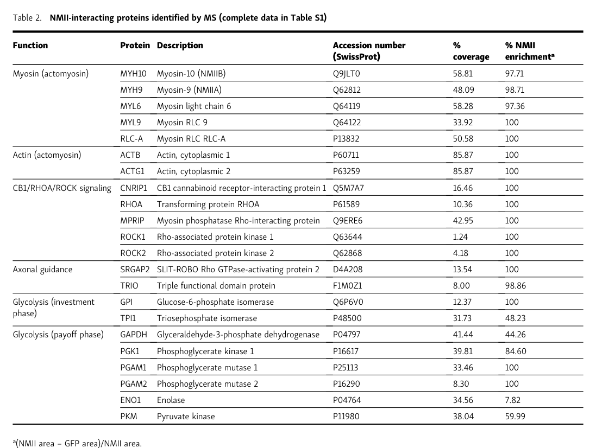

## Question

# Gene Research for Functional Annotation

## ⚠️ CRITICAL: Gene/Protein Identification Context

**BEFORE YOU BEGIN RESEARCH:** You MUST verify you are researching the CORRECT gene/protein. Gene symbols can be ambiguous, especially for less well-characterized genes from non-model organisms.

### Target Gene/Protein Identity (from UniProt):
- **UniProt Accession:** P48500
- **Protein Description:** RecName: Full=Triosephosphate isomerase; Short=TIM; EC=5.3.1.1 {ECO:0000255|PROSITE-ProRule:PRU10127}; AltName: Full=Methylglyoxal synthase {ECO:0000250|UniProtKB:P00939}; EC=4.2.3.3 {ECO:0000250|UniProtKB:P00939}; AltName: Full=Triose-phosphate isomerase;
- **Gene Information:** Name=Tpi1 {ECO:0000312|RGD:3896};
- **Organism (full):** Rattus norvegicus (Rat).
- **Protein Family:** Belongs to the triosephosphate isomerase family.
- **Key Domains:** Aldolase_TIM. (IPR013785); TIM_sf. (IPR035990); TrioseP_Isoase_bac/euk. (IPR022896); Triosephosphate_isomerase. (IPR000652); Triosephosphate_isomerase_AS. (IPR020861)

### MANDATORY VERIFICATION STEPS:

1. **Check if the gene symbol "Tpi1" matches the protein description above**
2. **Verify the organism is correct:** Rattus norvegicus (Rat).
3. **Check if protein family/domains align with what you find in literature**
4. **If you find literature for a DIFFERENT gene with the same or similar symbol, STOP**

### If Gene Symbol is Ambiguous or You Cannot Find Relevant Literature:

**DO NOT PROCEED WITH RESEARCH ON A DIFFERENT GENE.** Instead:
- State clearly: "The gene symbol 'Tpi1' is ambiguous or literature is limited for this specific protein"
- Explain what you found (e.g., "Found extensive literature on a different gene with the same symbol in a different organism")
- Describe the protein based ONLY on the UniProt information provided above
- Suggest that the protein function can be inferred from domain/family information

### Research Target:

Please provide a comprehensive research report on the gene **Tpi1** (gene ID: Tpi1, UniProt: P48500) in rat.

The research report should be a detailed narrative explaining the function, biological processes, and localization of the gene product. Citations should be given for all claims.

You should prioritize authoritative reviews and primary scientific literature when conducting research. You can supplement
this with annotations you find in gene/protein databases, but these can be outdated or inaccurate.

We are specifically interested in the primary function of the gene - for enzymes, what reaction is catalyzed, and what is the substrate specificity? For transporters, what is the substrate? For structural proteins or adapters, what is the broader structural role? For signaling molecules, what is the role in the pathway.

We are interested in where in or outside the cell the gene product carries out its function.

We are also interested in the signaling or biochemical pathways in which the gene functions. We are less interested in broad pleiotropic effects, except where these elucidate the precise role.

Include evidence where possible. We are interested in both experimental evidence as well as inference from structure, evolution, or bioinformatic analysis. Precise studies should be prioritized over high-throughput, where available.

## Output

Question: You are an expert researcher providing comprehensive, well-cited information.

Provide detailed information focusing on:
1. Key concepts and definitions with current understanding
2. Recent developments and latest research (prioritize 2023-2024 sources)
3. Current applications and real-world implementations
4. Expert opinions and analysis from authoritative sources
5. Relevant statistics and data from recent studies

Format as a comprehensive research report with proper citations. Include URLs and publication dates where available.
Always prioritize recent, authoritative sources and provide specific citations for all major claims.

# Gene Research for Functional Annotation

## ⚠️ CRITICAL: Gene/Protein Identification Context

**BEFORE YOU BEGIN RESEARCH:** You MUST verify you are researching the CORRECT gene/protein. Gene symbols can be ambiguous, especially for less well-characterized genes from non-model organisms.

### Target Gene/Protein Identity (from UniProt):
- **UniProt Accession:** P48500
- **Protein Description:** RecName: Full=Triosephosphate isomerase; Short=TIM; EC=5.3.1.1 {ECO:0000255|PROSITE-ProRule:PRU10127}; AltName: Full=Methylglyoxal synthase {ECO:0000250|UniProtKB:P00939}; EC=4.2.3.3 {ECO:0000250|UniProtKB:P00939}; AltName: Full=Triose-phosphate isomerase;
- **Gene Information:** Name=Tpi1 {ECO:0000312|RGD:3896};
- **Organism (full):** Rattus norvegicus (Rat).
- **Protein Family:** Belongs to the triosephosphate isomerase family.
- **Key Domains:** Aldolase_TIM. (IPR013785); TIM_sf. (IPR035990); TrioseP_Isoase_bac/euk. (IPR022896); Triosephosphate_isomerase. (IPR000652); Triosephosphate_isomerase_AS. (IPR020861)

### MANDATORY VERIFICATION STEPS:

1. **Check if the gene symbol "Tpi1" matches the protein description above**
2. **Verify the organism is correct:** Rattus norvegicus (Rat).
3. **Check if protein family/domains align with what you find in literature**
4. **If you find literature for a DIFFERENT gene with the same or similar symbol, STOP**

### If Gene Symbol is Ambiguous or You Cannot Find Relevant Literature:

**DO NOT PROCEED WITH RESEARCH ON A DIFFERENT GENE.** Instead:
- State clearly: "The gene symbol 'Tpi1' is ambiguous or literature is limited for this specific protein"
- Explain what you found (e.g., "Found extensive literature on a different gene with the same symbol in a different organism")
- Describe the protein based ONLY on the UniProt information provided above
- Suggest that the protein function can be inferred from domain/family information

### Research Target:

Please provide a comprehensive research report on the gene **Tpi1** (gene ID: Tpi1, UniProt: P48500) in rat.

The research report should be a detailed narrative explaining the function, biological processes, and localization of the gene product. Citations should be given for all claims.

You should prioritize authoritative reviews and primary scientific literature when conducting research. You can supplement
this with annotations you find in gene/protein databases, but these can be outdated or inaccurate.

We are specifically interested in the primary function of the gene - for enzymes, what reaction is catalyzed, and what is the substrate specificity? For transporters, what is the substrate? For structural proteins or adapters, what is the broader structural role? For signaling molecules, what is the role in the pathway.

We are interested in where in or outside the cell the gene product carries out its function.

We are also interested in the signaling or biochemical pathways in which the gene functions. We are less interested in broad pleiotropic effects, except where these elucidate the precise role.

Include evidence where possible. We are interested in both experimental evidence as well as inference from structure, evolution, or bioinformatic analysis. Precise studies should be prioritized over high-throughput, where available.

## Comprehensive Research Report: Rat **Tpi1** (UniProt **P48500**) — Functional Annotation

### 0) Target verification (critical identity check)

**Target:** *Rattus norvegicus* (rat) **Tpi1** / **TPI1**, UniProt accession **P48500**.

**Verification outcome:** The retrieved literature consistently uses **TPI/TPI1** to denote **triosephosphate isomerase** (TIM; EC 5.3.1.1), the glycolytic enzyme catalyzing DHAP ⇌ G3P, including in contexts explicitly involving mammalian systems and rat experimental datasets. No evidence in the retrieved sources supports that rat Tpi1/P48500 is primarily a methylglyoxal synthase enzyme; instead, methylglyoxal appears in the context of **dicarbonyl stress and post-translational/non-enzymatic modifications** affecting TPI or downstream consequences of triose-phosphate imbalance. (myers2023newlydiscoveredroles pages 1-2, mora2024methylglyoxalinducedmodificationsin pages 26-28)

---

### 1) Key concepts and definitions (current understanding)

#### 1.1 Canonical biochemical function (primary enzymatic role)

**Triosephosphate isomerase 1 (TPI1)** catalyzes the **reversible interconversion** of the triose phosphates:

- **Dihydroxyacetone phosphate (DHAP) ⇌ glyceraldehyde-3-phosphate (G3P)**

This step is central to glycolysis because it channels carbon from DHAP into G3P, enabling continuation through the “payoff phase” and efficient production of ATP/NADH. (myers2023newlydiscoveredroles pages 1-2, rodriguezbolanos2025theremarkablerole pages 2-4)

#### 1.2 Catalytic mechanism and substrate specificity

TPI/TIM is generally described as a **cofactor-independent homodimeric enzyme**; each monomer contributes a catalytic site but **dimerization is required for activity**. Mechanistically, TIM catalysis involves a proton-transfer mechanism proceeding through a **cis-enediol intermediate**, with active-site loop closure helping protect intermediates from solvent. Key catalytic residues highlighted in recent synthesis include **Lys13/Lys14**, **His95/His96**, and **Glu165/Glu166** (numbering differences reflect species conventions), which stabilize and shuttle protons during isomerization. (rodriguezbolanos2025theremarkablerole pages 2-4, myers2023newlydiscoveredroles pages 1-2)

**Substrate specificity (functional):** In the glycolytic context, the physiologic substrates are DHAP and G3P; the biological requirement is rapid conversion of DHAP to G3P to sustain flux. (myers2023newlydiscoveredroles pages 1-2, rodriguezbolanos2025theremarkablerole pages 2-4)

#### 1.3 “Moonlighting” concept for TPI1

A key contemporary concept is that TPI1 is a **moonlighting (gene-sharing) protein**, meaning that beyond its canonical metabolic enzymatic role, it can participate in other cellular processes (e.g., nuclear functions) that may not strictly depend on its catalytic activity. (myers2023newlydiscoveredroles pages 1-2, myers2023newlydiscoveredroles pages 2-4, myers2023newlydiscoveredroles pages 4-6)

---

### 2) Subcellular localization and where the gene product acts

#### 2.1 Canonical localization

As a glycolytic enzyme, TPI1 is typically considered a **cytosolic enzyme**, consistent with glycolysis being largely cytosolic. (myers2023newlydiscoveredroles pages 1-2)

#### 2.2 Nuclear localization (recent focus)

A 2023 peer-reviewed review highlights growing evidence that TPI1 can also localize to the **nucleus** under some conditions, and that this nuclear localization can be regulated by post-translational modifications. Specifically, **phosphorylation at Ser80 (S80)** is discussed as influencing nuclear localization. The review further notes that oxidative stress and chemotherapeutic administration can increase nuclear TPI localization, with links to chemotherapy resistance and cancer pathogenesis. (myers2023newlydiscoveredroles pages 1-2, myers2023newlydiscoveredroles pages 2-4)

---

### 3) Pathways and biological processes involving rat Tpi1

#### 3.1 Core pathway role: glycolysis/gluconeogenesis

TPI1 is a core enzyme in **glycolysis/gluconeogenesis**, mediating the DHAP/G3P interconversion step and thereby contributing to carbon flow through central carbon metabolism. (myers2023newlydiscoveredroles pages 1-2, rodriguezbolanos2025theremarkablerole pages 2-4, moreno2024influenceofthe pages 10-11)

#### 3.2 Integration into broader metabolic and signaling contexts

Recent literature synthesizes evidence that TPI1 can connect metabolism to signaling and gene regulation. The 2023 review summarizes links between TPI1/DHAP and signaling axes (including **mTORC1**, and cancer-associated **PI3K→Akt→mTORC1** contexts), and frames nuclear TPI1 as potentially influencing transcriptional programs via metabolite balance (e.g., altered DHAP levels associating with altered acetate and histone acetylation). (myers2023newlydiscoveredroles pages 2-4, myers2023newlydiscoveredroles pages 4-6)

In rat disease-model multi-omics, TPI1 appears among differentially identified proteins/genes within enriched pathways including **carbon metabolism**, **pyruvate metabolism**, **PI3K-Akt signaling**, and **HIF-1α signaling** (noting that this evidence is pathway-level and does not itself assign TPI1 as a signaling enzyme, but as part of metabolic remodeling programs). (yongzhong2024mechanismofjianxin pages 8-12, yongzhong2024mechanismofjianxin pages 1-2)

---

### 4) Recent developments (prioritizing 2023–2024)

#### 4.1 2023: Expanded functional landscape including nuclear roles

Myers & Palladino (2023; *Molecular Medicine*, published Jan 2023; https://doi.org/10.1186/s10020-023-00612-x) synthesizes emerging work on non-canonical TPI1 functions, especially **nuclear TPI1**, and emphasizes that disease phenotypes and cellular roles may not be explained solely by catalytic impairment (e.g., stability/protein-level effects vs catalytic changes). This review is currently one of the most direct 2023 sources framing TPI1 as a moonlighting protein and discussing regulated nuclear localization (S80). (myers2023newlydiscoveredroles pages 1-2, myers2023newlydiscoveredroles pages 2-4)

#### 4.2 2024: Quantitative rat brain oxidative PTM evidence (carbonylation)

Moreno et al. (2024; *Antioxidants*, published Nov 2024; https://doi.org/10.3390/antiox13111408) quantified Tpi1 as a **carbonylated protein** in healthy rat brain regions (cerebral cortex and cerebellum), and placed the carbonylated-protein set in enriched pathways including **glycolysis/gluconeogenesis**.

**Quantitative values reported for Tpi1:**
- **Cortex:** relative protein amount **1.38 ± 0.15**; carbonylation index **2.78 ± 0.41**
- **Cerebellum:** relative protein amount **1.20 ± 0.25**; carbonylation index **1.61 ± 0.45**

These values provide recent, rat-specific quantitative evidence of oxidative modification affecting (or at least marking) Tpi1 in brain tissue. (moreno2024influenceofthe pages 10-11)

#### 4.3 2024: Rat heart failure multi-omics flags TPI1 as differential

Yongzhong et al. (2024; *Chinese Medicine*, published Nov 2024; https://doi.org/10.1186/s13020-024-01009-6) used integrated proteomics and metabolomics in a rat myocardial infarction–induced heart failure model treated with Jianxin granules and reports TPI1 among “key differential genes/proteins,” with pathway enrichment emphasizing metabolic remodeling (carbon metabolism, pyruvate metabolism, PI3K-Akt, HIF-1α). However, in the retrieved excerpts, **TPI1 directionality and per-protein quantitative fold-changes were not reported**, so this should be interpreted as **membership in a differential set** rather than a quantified effect size for TPI1 itself. (yongzhong2024mechanismofjianxin pages 14-15, yongzhong2024mechanismofjianxin pages 8-12, yongzhong2024mechanismofjianxin pages 1-2)

---

### 5) Current applications and real-world implementations

#### 5.1 TPI1 as an experimental readout in rat physiology/pathology

Recent rat-focused proteomics work uses Tpi1 as part of the **metabolic/oxidative stress–responsive proteome**, including quantification of oxidative PTMs (protein carbonylation) in brain tissues. This supports its practical use as an informative node for metabolic state and oxidative damage assessment in vivo. (moreno2024influenceofthe pages 10-11)

#### 5.2 Subcellular metabolic organization (local glycolysis)

A 2023 cell-biology study provides evidence that glycolytic enzymes—including TPI1—can associate with cytoskeletal motor assemblies to support localized energetic demands. In NMII immunoprecipitation mass spectrometry interactomes, **TPI1** appears as an NMII-associated protein with **31.73% sequence coverage** and **48.23% NMII enrichment** (nearly half of the measured signal in NMII-enriched regions by the study’s metric). This supports real-world implementation of TPI1 annotation beyond “diffuse cytosol,” i.e., **localized glycolytic complexes** near actomyosin machinery. (santos2023localglycolysisfuels pages 10-12, santos2023localglycolysisfuels pages 6-8, santos2023localglycolysisfuels media acac7492)

---

### 6) Expert opinions and analysis (authoritative synthesis)

A notable expert-level theme in recent synthesis is that TPI1 is both:

1) A canonical, central-carbon metabolism enzyme; and
2) A protein with **context-dependent non-canonical roles**, including regulated nuclear localization.

Myers & Palladino (2023) explicitly argue that interpreting phenotypes solely through changes in catalytic activity is incomplete, because many TPI1 disease-associated alleles strongly affect protein stability/abundance, and because experimental systems show that catalytically compromised alleles can have unexpected phenotypic rescue or discordance. They also highlight the need for experimental strategies separating catalytic versus structural/moonlighting functions (e.g., stable catalytically-dead mutants). (myers2023newlydiscoveredroles pages 2-4, myers2023newlydiscoveredroles pages 4-6)

---

### 7) Statistics and data highlights (recent studies)

1) **Rat brain Tpi1 oxidative carbonylation (2024):**
   - Cortex: relative protein amount **1.38 ± 0.15**, carbonylation index **2.78 ± 0.41**
   - Cerebellum: relative protein amount **1.20 ± 0.25**, carbonylation index **1.61 ± 0.45** (moreno2024influenceofthe pages 10-11)

2) **TPI1 NMII-association metric in local glycolysis context (2023):**
   - **48.23% NMII enrichment**; **31.73% sequence coverage** in NMII IP-MS table (santos2023localglycolysisfuels pages 10-12, santos2023localglycolysisfuels media acac7492)

3) **Heart failure multi-omics (2024):**
   - TPI1 listed among key differential proteins/genes; pathway enrichment includes carbon metabolism and pyruvate metabolism, but per-protein fold-change for TPI1 not available in retrieved text (yongzhong2024mechanismofjianxin pages 8-12, yongzhong2024mechanismofjianxin pages 1-2)

---

### 8) Evidence map (condensed)

| Topic | Key points | Species/model (rat vs other) | Evidence type | Citation IDs |
|---|---|---|---|---|
| Identity | The target is rat **Tpi1 / TPI1**, the canonical **triosephosphate isomerase** family enzyme. Gathered literature consistently discusses TPI/TPI1 as the glycolytic triosephosphate isomerase; no retrieved evidence supports rat P48500 being a bona fide methylglyoxal synthase, so the methylglyoxal-related literature is best interpreted as modification/stress biology affecting TPI rather than a different primary enzyme function. | Rat target; supporting literature includes human/animal comparative reviews | Review + literature cross-check | (mora2024methylglyoxalinducedmodificationsin pages 26-28, myers2023newlydiscoveredroles pages 1-2) |
| Enzymatic reaction | TPI1 catalyzes the reversible interconversion **DHAP ⇌ G3P** and is essential for DHAP catabolism and efficient ATP yield from glycolysis/anaerobic glucose metabolism. | Conserved across species; applied to rat Tpi1 by homology/family conservation | Review / biochemical definition | (myers2023newlydiscoveredroles pages 1-2) |
| Mechanism | TIM is a cofactor-independent homodimeric enzyme; active-site residues highlighted in recent reviews include **K14, H96, E166**. Mechanistic descriptions emphasize loop closure over the active site and proton transfer via a cis-enediol intermediate, explaining the enzyme’s very high catalytic efficiency. | Mostly human/general TIM literature, mechanistically applicable to rat ortholog | Mechanistic review / structural biochemistry | (rodriguezbolanos2025theremarkablerole pages 2-4, myers2023newlydiscoveredroles pages 1-2) |
| Localization | Canonically cytosolic glycolytic enzyme, but recent literature also supports regulated **nuclear localization**; **S80 phosphorylation** is linked to nuclear import, and oxidative stress/chemotherapy can promote nuclear TPI accumulation. | Mostly non-rat systems for nuclear role; relevant to conserved TPI1 biology | Review | (myers2023newlydiscoveredroles pages 1-2, myers2023newlydiscoveredroles pages 2-4) |
| Pathway role | Core role in **glycolysis/gluconeogenesis** and broader carbon metabolism. In rat systems, TPI1-associated datasets map to **glycolysis/gluconeogenesis**, **carbon metabolism**, **pyruvate metabolism**, **PI3K-Akt**, and **HIF-1α**-linked metabolic remodeling. | Rat heart failure and rat brain proteomics; broader conserved metabolism | Proteomics + pathway analysis + review | (moreno2024influenceofthe pages 10-11, yongzhong2024mechanismofjianxin pages 8-12, yongzhong2024mechanismofjianxin pages 1-2) |
| Moonlighting roles | Recent reviews describe TPI1 as a **moonlighting protein** with non-canonical functions in the nucleus, histone acetylation-linked regulation via DHAP/acetate balance, signaling interactions (e.g., mTORC1/PI3K-Akt context), and interaction-based roles beyond catalysis. | Mostly human, mouse, fly, and mixed-species evidence; concept likely relevant to rat ortholog | Review / functional synthesis | (myers2023newlydiscoveredroles pages 6-6, myers2023newlydiscoveredroles pages 2-4, myers2023newlydiscoveredroles pages 4-6) |
| Rat-specific quantitative findings | In healthy rat brain, Tpi1 was identified as a carbonylated protein. **Cortex:** relative protein amount **1.38 ± 0.15**, carbonylation index **2.78 ± 0.41**. **Cerebellum:** relative protein amount **1.20 ± 0.25**, carbonylation index **1.61 ± 0.45**. Authors place Tpi1 among proteins in energy-production pathways, including glycolysis/gluconeogenesis. | Rat (Rattus norvegicus) cortex and cerebellum | Quantitative proteomics / oxidative PTM profiling | (moreno2024influenceofthe pages 10-11) |
| Rat-specific subcellular implementation | In a neuronal subcellular proteomics context, TPI1 was detected in **NMII-enriched complexes** during axonal retraction. Table 2 reports **31.73% sequence coverage** and **48.23% NMII enrichment** for TPI1, supporting participation in localized glycolytic machinery near actomyosin, although direct TPI1 imaging validation was not shown in the provided pages. | Non-rat neuronal cell biology context for local glycolysis; useful for subcellular functional inference | Proteomics + image-derived table evidence | (santos2023localglycolysisfuels pages 10-12, santos2023localglycolysisfuels pages 6-8, santos2023localglycolysisfuels media acac7492) |
| Real-world applications | Current practical use is mainly as a **metabolic/pathophysiology readout** rather than a rat-specific therapeutic target: rat studies use Tpi1 in proteomic panels of oxidative stress and heart failure remodeling, while broader literature highlights TPI1 as a candidate biomarker/therapeutic node in cancer, metabolic disease, and chemotherapy resistance due to its central metabolic and moonlighting roles. | Rat disease models plus broader non-rat translational literature | Review + applied omics | (myers2023newlydiscoveredroles pages 2-4, moreno2024influenceofthe pages 10-11, yongzhong2024mechanismofjianxin pages 14-15) |

*Table: This table summarizes the main lines of evidence gathered for rat Tpi1/TPI1, covering identity, enzymatic function, localization, pathway placement, moonlighting biology, and quantitative findings. It is useful as a compact evidence map for functional annotation of UniProt P48500.*

---

### 9) Key references (recent, with URLs and publication dates)

- Myers TD, Palladino MJ. **Newly discovered roles of triosephosphate isomerase including functions within the nucleus.** *Molecular Medicine.* **Jan 2023.** https://doi.org/10.1186/s10020-023-00612-x (myers2023newlydiscoveredroles pages 1-2, myers2023newlydiscoveredroles pages 2-4)

- Santos R, Lokmane L, Ozdemir D, et al. **Local glycolysis fuels actomyosin contraction during axonal retraction.** *J Cell Biol.* **Oct 2023.** https://doi.org/10.1083/jcb.202206133 (santos2023localglycolysisfuels pages 10-12, santos2023localglycolysisfuels media acac7492)

- Moreno F, Méndez L, Fernández I, et al. **Influence of the Degree of Unsaturation in Fish Oil Supplements on Oxidative Stress and Protein Carbonylation in the Cerebral Cortex and Cerebellum of Healthy Rats.** *Antioxidants.* **Nov 2024.** https://doi.org/10.3390/antiox13111408 (moreno2024influenceofthe pages 10-11)

- Yongzhong C, Hui C, Luting Z, et al. **Mechanism of jianxin granules in the treatment of heart failure based on proteomics and metabolomics.** *Chinese Medicine.* **Nov 2024.** https://doi.org/10.1186/s13020-024-01009-6 (yongzhong2024mechanismofjianxin pages 8-12, yongzhong2024mechanismofjianxin pages 1-2)

---

### 10) Scope notes and limitations

- Several high-confidence mechanistic statements (active-site residues, enediol intermediate, loop closure) are derived from synthesis literature focused on TIM generally and/or human TIM; these are nevertheless appropriate for rat TPI1 annotation given strong conservation and the rat gene/protein identity match, but they are not presented here as rat-only experimental measurements. (rodriguezbolanos2025theremarkablerole pages 2-4, myers2023newlydiscoveredroles pages 1-2)
- The 2024 heart failure multi-omics paper flags TPI1 as differential but, in the retrieved excerpts, does not provide TPI1-specific quantitative fold change or direction; additional reading of supplementary tables would be required for those exact values. (yongzhong2024mechanismofjianxin pages 14-15, yongzhong2024mechanismofjianxin pages 8-12)

References

1. (myers2023newlydiscoveredroles pages 1-2): Tracey D. Myers and Michael J. Palladino. Newly discovered roles of triosephosphate isomerase including functions within the nucleus. Molecular Medicine, Jan 2023. URL: https://doi.org/10.1186/s10020-023-00612-x, doi:10.1186/s10020-023-00612-x. This article has 50 citations and is from a peer-reviewed journal.

2. (mora2024methylglyoxalinducedmodificationsin pages 26-28): Ignacio de la Mora-de la Mora, Itzhel García-Torres, Luis Antonio Flores-López, Gabriel López-Velázquez, Gloria Hernández-Alcántara, Saúl Gómez-Manzo, and Sergio Enríquez-Flores. Methylglyoxal-induced modifications in human triosephosphate isomerase: structural and functional repercussions of specific mutations. Molecules, 29:5047, Oct 2024. URL: https://doi.org/10.3390/molecules29215047, doi:10.3390/molecules29215047. This article has 9 citations.

3. (rodriguezbolanos2025theremarkablerole pages 2-4): Mónica Rodríguez-Bolaños and Ruy Perez-Montfort. The remarkable role of triosephosphate isomerase in diabetes pathophysiology. International Journal of Molecular Sciences, 26:8809, Sep 2025. URL: https://doi.org/10.3390/ijms26188809, doi:10.3390/ijms26188809. This article has 1 citations.

4. (myers2023newlydiscoveredroles pages 2-4): Tracey D. Myers and Michael J. Palladino. Newly discovered roles of triosephosphate isomerase including functions within the nucleus. Molecular Medicine, Jan 2023. URL: https://doi.org/10.1186/s10020-023-00612-x, doi:10.1186/s10020-023-00612-x. This article has 50 citations and is from a peer-reviewed journal.

5. (myers2023newlydiscoveredroles pages 4-6): Tracey D. Myers and Michael J. Palladino. Newly discovered roles of triosephosphate isomerase including functions within the nucleus. Molecular Medicine, Jan 2023. URL: https://doi.org/10.1186/s10020-023-00612-x, doi:10.1186/s10020-023-00612-x. This article has 50 citations and is from a peer-reviewed journal.

6. (moreno2024influenceofthe pages 10-11): Francisco Moreno, Lucía Méndez, Ingrid Fernández, Bernat Miralles-Pérez, Montserrat Giralt, Marta Romeu, Sara Ramos-Romero, Josep Lluís Torres, and Isabel Medina. Influence of the degree of unsaturation in fish oil supplements on oxidative stress and protein carbonylation in the cerebral cortex and cerebellum of healthy rats. Antioxidants, 13:1408, Nov 2024. URL: https://doi.org/10.3390/antiox13111408, doi:10.3390/antiox13111408. This article has 3 citations.

7. (yongzhong2024mechanismofjianxin pages 8-12): Chen Yongzhong, Chen Hui, Zhang Luting, Guo Wei, Huang Yiqing, Guo Yiru, Su Linqiu, Xu Rong, Li Xi, and Ouyang Qiufang. Mechanism of jianxin granules in the treatment of heart failure based on proteomics and metabolomics. Chinese Medicine, Nov 2024. URL: https://doi.org/10.1186/s13020-024-01009-6, doi:10.1186/s13020-024-01009-6. This article has 4 citations.

8. (yongzhong2024mechanismofjianxin pages 1-2): Chen Yongzhong, Chen Hui, Zhang Luting, Guo Wei, Huang Yiqing, Guo Yiru, Su Linqiu, Xu Rong, Li Xi, and Ouyang Qiufang. Mechanism of jianxin granules in the treatment of heart failure based on proteomics and metabolomics. Chinese Medicine, Nov 2024. URL: https://doi.org/10.1186/s13020-024-01009-6, doi:10.1186/s13020-024-01009-6. This article has 4 citations.

9. (yongzhong2024mechanismofjianxin pages 14-15): Chen Yongzhong, Chen Hui, Zhang Luting, Guo Wei, Huang Yiqing, Guo Yiru, Su Linqiu, Xu Rong, Li Xi, and Ouyang Qiufang. Mechanism of jianxin granules in the treatment of heart failure based on proteomics and metabolomics. Chinese Medicine, Nov 2024. URL: https://doi.org/10.1186/s13020-024-01009-6, doi:10.1186/s13020-024-01009-6. This article has 4 citations.

10. (santos2023localglycolysisfuels pages 10-12): Renata Santos, Ludmilla Lokmane, Dersu Ozdemir, Clément Traoré, Annabelle Agesilas, Coralie Hakibilen, Zsolt Lenkei, and Diana Zala. Local glycolysis fuels actomyosin contraction during axonal retraction. The Journal of Cell Biology, Oct 2023. URL: https://doi.org/10.1083/jcb.202206133, doi:10.1083/jcb.202206133. This article has 16 citations.

11. (santos2023localglycolysisfuels pages 6-8): Renata Santos, Ludmilla Lokmane, Dersu Ozdemir, Clément Traoré, Annabelle Agesilas, Coralie Hakibilen, Zsolt Lenkei, and Diana Zala. Local glycolysis fuels actomyosin contraction during axonal retraction. The Journal of Cell Biology, Oct 2023. URL: https://doi.org/10.1083/jcb.202206133, doi:10.1083/jcb.202206133. This article has 16 citations.

12. (santos2023localglycolysisfuels media acac7492): Renata Santos, Ludmilla Lokmane, Dersu Ozdemir, Clément Traoré, Annabelle Agesilas, Coralie Hakibilen, Zsolt Lenkei, and Diana Zala. Local glycolysis fuels actomyosin contraction during axonal retraction. The Journal of Cell Biology, Oct 2023. URL: https://doi.org/10.1083/jcb.202206133, doi:10.1083/jcb.202206133. This article has 16 citations.

13. (myers2023newlydiscoveredroles pages 6-6): Tracey D. Myers and Michael J. Palladino. Newly discovered roles of triosephosphate isomerase including functions within the nucleus. Molecular Medicine, Jan 2023. URL: https://doi.org/10.1186/s10020-023-00612-x, doi:10.1186/s10020-023-00612-x. This article has 50 citations and is from a peer-reviewed journal.

## Artifacts

- [Edison artifact artifact-00](Tpi1-deep-research-falcon_artifacts/artifact-00.md)

## Citations

1. myers2023newlydiscoveredroles pages 1-2
2. moreno2024influenceofthe pages 10-11
3. mora2024methylglyoxalinducedmodificationsin pages 26-28
4. rodriguezbolanos2025theremarkablerole pages 2-4
5. myers2023newlydiscoveredroles pages 2-4
6. myers2023newlydiscoveredroles pages 4-6
7. yongzhong2024mechanismofjianxin pages 8-12
8. yongzhong2024mechanismofjianxin pages 1-2
9. yongzhong2024mechanismofjianxin pages 14-15
10. santos2023localglycolysisfuels pages 10-12
11. santos2023localglycolysisfuels pages 6-8
12. myers2023newlydiscoveredroles pages 6-6
13. https://doi.org/10.1186/s10020-023-00612-x
14. https://doi.org/10.3390/antiox13111408
15. https://doi.org/10.1186/s13020-024-01009-6
16. https://doi.org/10.1083/jcb.202206133
17. https://doi.org/10.1186/s10020-023-00612-x,
18. https://doi.org/10.3390/molecules29215047,
19. https://doi.org/10.3390/ijms26188809,
20. https://doi.org/10.3390/antiox13111408,
21. https://doi.org/10.1186/s13020-024-01009-6,
22. https://doi.org/10.1083/jcb.202206133,