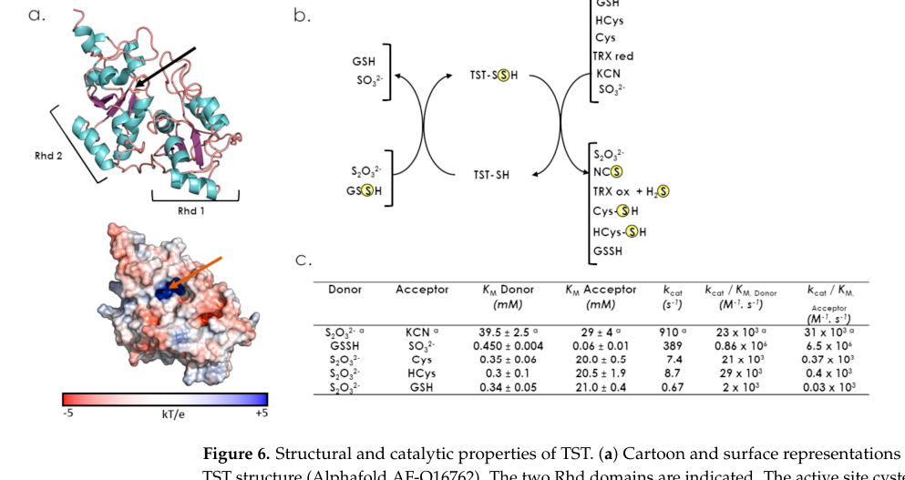

## Question

# Gene Research for Functional Annotation

## ⚠️ CRITICAL: Gene/Protein Identification Context

**BEFORE YOU BEGIN RESEARCH:** You MUST verify you are researching the CORRECT gene/protein. Gene symbols can be ambiguous, especially for less well-characterized genes from non-model organisms.

### Target Gene/Protein Identity (from UniProt):
- **UniProt Accession:** P24329
- **Protein Description:** RecName: Full=Thiosulfate sulfurtransferase; EC=2.8.1.1; AltName: Full=Rhodanese;
- **Gene Information:** Name=Tst;
- **Organism (full):** Rattus norvegicus (Rat).
- **Protein Family:** Not specified in UniProt
- **Key Domains:** Rhodanese-like_dom. (IPR001763); Rhodanese-like_dom_sf. (IPR036873); Thiosulphate_STrfase_CS. (IPR001307); TST/MPST-like. (IPR045078); Rhodanese (PF00581)

### MANDATORY VERIFICATION STEPS:

1. **Check if the gene symbol "Tst" matches the protein description above**
2. **Verify the organism is correct:** Rattus norvegicus (Rat).
3. **Check if protein family/domains align with what you find in literature**
4. **If you find literature for a DIFFERENT gene with the same or similar symbol, STOP**

### If Gene Symbol is Ambiguous or You Cannot Find Relevant Literature:

**DO NOT PROCEED WITH RESEARCH ON A DIFFERENT GENE.** Instead:
- State clearly: "The gene symbol 'Tst' is ambiguous or literature is limited for this specific protein"
- Explain what you found (e.g., "Found extensive literature on a different gene with the same symbol in a different organism")
- Describe the protein based ONLY on the UniProt information provided above
- Suggest that the protein function can be inferred from domain/family information

### Research Target:

Please provide a comprehensive research report on the gene **Tst** (gene ID: Tst, UniProt: P24329) in rat.

The research report should be a detailed narrative explaining the function, biological processes, and localization of the gene product. Citations should be given for all claims.

You should prioritize authoritative reviews and primary scientific literature when conducting research. You can supplement
this with annotations you find in gene/protein databases, but these can be outdated or inaccurate.

We are specifically interested in the primary function of the gene - for enzymes, what reaction is catalyzed, and what is the substrate specificity? For transporters, what is the substrate? For structural proteins or adapters, what is the broader structural role? For signaling molecules, what is the role in the pathway.

We are interested in where in or outside the cell the gene product carries out its function.

We are also interested in the signaling or biochemical pathways in which the gene functions. We are less interested in broad pleiotropic effects, except where these elucidate the precise role.

Include evidence where possible. We are interested in both experimental evidence as well as inference from structure, evolution, or bioinformatic analysis. Precise studies should be prioritized over high-throughput, where available.

## Output

Question: You are an expert researcher providing comprehensive, well-cited information.

Provide detailed information focusing on:
1. Key concepts and definitions with current understanding
2. Recent developments and latest research (prioritize 2023-2024 sources)
3. Current applications and real-world implementations
4. Expert opinions and analysis from authoritative sources
5. Relevant statistics and data from recent studies

Format as a comprehensive research report with proper citations. Include URLs and publication dates where available.
Always prioritize recent, authoritative sources and provide specific citations for all major claims.

# Gene Research for Functional Annotation

## ⚠️ CRITICAL: Gene/Protein Identification Context

**BEFORE YOU BEGIN RESEARCH:** You MUST verify you are researching the CORRECT gene/protein. Gene symbols can be ambiguous, especially for less well-characterized genes from non-model organisms.

### Target Gene/Protein Identity (from UniProt):
- **UniProt Accession:** P24329
- **Protein Description:** RecName: Full=Thiosulfate sulfurtransferase; EC=2.8.1.1; AltName: Full=Rhodanese;
- **Gene Information:** Name=Tst;
- **Organism (full):** Rattus norvegicus (Rat).
- **Protein Family:** Not specified in UniProt
- **Key Domains:** Rhodanese-like_dom. (IPR001763); Rhodanese-like_dom_sf. (IPR036873); Thiosulphate_STrfase_CS. (IPR001307); TST/MPST-like. (IPR045078); Rhodanese (PF00581)

### MANDATORY VERIFICATION STEPS:

1. **Check if the gene symbol "Tst" matches the protein description above**
2. **Verify the organism is correct:** Rattus norvegicus (Rat).
3. **Check if protein family/domains align with what you find in literature**
4. **If you find literature for a DIFFERENT gene with the same or similar symbol, STOP**

### If Gene Symbol is Ambiguous or You Cannot Find Relevant Literature:

**DO NOT PROCEED WITH RESEARCH ON A DIFFERENT GENE.** Instead:
- State clearly: "The gene symbol 'Tst' is ambiguous or literature is limited for this specific protein"
- Explain what you found (e.g., "Found extensive literature on a different gene with the same symbol in a different organism")
- Describe the protein based ONLY on the UniProt information provided above
- Suggest that the protein function can be inferred from domain/family information

### Research Target:

Please provide a comprehensive research report on the gene **Tst** (gene ID: Tst, UniProt: P24329) in rat.

The research report should be a detailed narrative explaining the function, biological processes, and localization of the gene product. Citations should be given for all claims.

You should prioritize authoritative reviews and primary scientific literature when conducting research. You can supplement
this with annotations you find in gene/protein databases, but these can be outdated or inaccurate.

We are specifically interested in the primary function of the gene - for enzymes, what reaction is catalyzed, and what is the substrate specificity? For transporters, what is the substrate? For structural proteins or adapters, what is the broader structural role? For signaling molecules, what is the role in the pathway.

We are interested in where in or outside the cell the gene product carries out its function.

We are also interested in the signaling or biochemical pathways in which the gene functions. We are less interested in broad pleiotropic effects, except where these elucidate the precise role.

Include evidence where possible. We are interested in both experimental evidence as well as inference from structure, evolution, or bioinformatic analysis. Precise studies should be prioritized over high-throughput, where available.

## Research report: Rat **Tst** (UniProt **P24329**) — thiosulfate sulfurtransferase (TST; rhodanese; EC 2.8.1.1)

### 1) Identity verification (critical disambiguation)
The target gene **Tst** in **Rattus norvegicus** (rat) corresponds to the enzyme **thiosulfate sulfurtransferase** (commonly called **rhodanese**) with canonical EC activity **thiosulfate:cyanide sulfurtransferase (EC 2.8.1.1)**. Mammalian/rodent TST is described as a ~33 kDa, ~320 aa, two-rhodanese-domain protein with a single catalytic cysteine in the C-terminal rhodanese domain, consistent with the UniProt identity provided (P24329) and rhodanese-like domain annotations (melhem2025impactofthiosulfatec pages 43-46, melhem2025impactofthiosulfate pages 43-46).

**Distinguishing from related proteins:** In the rhodanese-fold family, **MPST/3-MST** (mercaptopyruvate sulfurtransferase) and **TSTD1** (thiosulfate sulfurtransferase-like domain-containing 1) are discussed as distinct enzymes with overlapping sulfurtransferase chemistry but different domain architectures and cellular contexts; the sources explicitly differentiate TST from these paralogs (alsohaibani2023rhodanesefoldcontainingproteins pages 5-7, kaleta2024bridgingthegap pages 11-13).

### 2) Key concepts and definitions (current understanding)

#### Rhodanese / sulfurtransferase chemistry
Rhodanese-family sulfurtransferases operate via formation of an **enzyme persulfide intermediate** on the **active-site cysteine**, enabling transfer of “sulfane sulfur” from a donor to a nucleophilic acceptor (kruithof2020unravelingtherole pages 3-4, cheng2003characterizationofpspe pages 26-29). In the historical and most widely cited assay reaction for TST, the enzyme catalyzes detoxification of cyanide:

**Thiosulfate + CN− ⇄ sulfite + thiocyanate**

This reaction is repeatedly emphasized as the canonical TST/rhodanese reaction and the basis for its classical cyanide-detoxification function (melhem2025impactofthiosulfatea pages 43-46, melhem2025impactofthiosulfatec pages 43-46).

#### Substrate specificity: from thiosulfate to persulfides
Modern mitochondrial sulfur biology has shifted emphasis from thiosulfate as the sole sulfur donor to **persulfide/polysulfide species** as central intermediates (“reactive sulfur species”). A recent rhodanese-fold review highlights that TST can act efficiently on **glutathione persulfide (GSSH)** and that, at least for the human enzyme, sulfite + GSSH → thiosulfate is strongly favored; however, TST shows **kinetic cooperativity/hysteresis**, complicating strict steady-state comparisons of substrate preference (alsohaibani2023rhodanesefoldcontainingproteins pages 5-7, alsohaibani2023rhodanesefoldcontainingproteins pages 7-9). 

### 3) Molecular features and structural determinants
TST is described as a **two-domain rhodanese-fold** protein with one catalytically active cysteine located in the C-terminal domain. Active-site determinants include the catalytic cysteine (reported as Cys247/Cys248 depending on numbering) and nearby basic residues (e.g., Arg186, Lys249) implicated in binding negatively charged sulfur substrates (melhem2025impactofthiosulfate pages 43-46, melhem2025impactofthiosulfatec pages 43-46). A 2023 review provides a domain schematic and sulfur-transfer reaction scheme for TST/rhodanese (alsohaibani2023rhodanesefoldcontainingproteins media 07ae694f).

### 4) Subcellular localization and tissue context
TST is consistently described as **mitochondrial** in mammalian cells—often discussed in the context of **mitochondrial matrix sulfur metabolism**—even though mechanistic details of import can be atypical (e.g., mitochondrial targeting despite lacking a classical N-terminal targeting sequence in the human enzyme) (alsohaibani2023rhodanesefoldcontainingproteins pages 7-9, kruithof2020unravelingtherole pages 3-4). 

At the tissue level, mammalian TST is described as abundant in **liver, kidney, and colon**, aligning with roles in detoxification and handling of sulfur species derived from diet and microbiota (alsohaibani2023rhodanesefoldcontainingproteins pages 7-9).

### 5) Pathways and biological processes

#### 5.1 Mitochondrial sulfide oxidation unit (SOU) and H2S detoxification
A prominent current model places TST in the mitochondrial **sulfide oxidation pathway/unit**, commonly described as:

**SQOR → ETHE1/PDO → TST**

In this framework, SQOR generates persulfide equivalents (notably via GSH to form **GSSH**), and TST participates downstream, converting sulfane sulfur/persulfide chemistry into **thiosulfate** and related products, thereby contributing to control of mitochondrial H2S/reactive sulfur species (alsohaibani2023rhodanesefoldcontainingproteins pages 7-9, kruithof2020unravelingtherole pages 4-5). Cancer-focused sulfur metabolism reviews also describe rhodanese/TST as part of this SOU ensemble (alsohaibani2023rhodanesefoldcontainingproteins pages 7-9).

#### 5.2 Iron–sulfur (Fe–S) cluster homeostasis and mitochondrial bioenergetics (expert synthesis)
A metabolic disease-focused review (BBA—Molecular Basis of Disease, 2020) proposes that TST interacts functionally with **iron–sulfur centers** in mitochondrial redox proteins and can form enzyme persulfides by extracting labile sulfur from Fe–S centers. The same review advances a model in which TST phosphorylation state may determine whether TST mobilizes sulfur in ways that modulate electron transport and ATP production (e.g., removing sulfur from Fe–S centers vs supporting repair/formation of Fe–S clusters) (kruithof2020unravelingtherole pages 3-4).

#### 5.3 Antioxidant/redox integration
TST is discussed as interfacing with mitochondrial antioxidant systems (glutathione/thioredoxin pathways), with the 2020 review arguing that increased sulfurtransferase activity can enhance ROS-scavenging capacity (kruithof2020unravelingtherole pages 3-4). The precise molecular coupling steps remain incompletely resolved (kruithof2020unravelingtherole pages 4-5).

### 6) Recent developments (prioritizing 2023–2024)

#### 6.1 Updated mechanistic framing: “rhodanese fold” proteins as multifunctional sulfur hubs (2023)
A 2023 Antioxidants review reframes TST as one member of a broader rhodanese-fold toolkit supporting sulfur trafficking, H2S metabolism, and sulfide oxidation; it emphasizes (i) mitochondrial targeting, (ii) the SQOR→ETHE1/PDO→TST model, and (iii) modern substrate concepts centered on persulfides such as GSSH (alsohaibani2023rhodanesefoldcontainingproteins pages 7-9, alsohaibani2023rhodanesefoldcontainingproteins pages 5-7).

#### 6.2 Cancer metabolism integration (2024)
A 2024 leukemia-focused review notes that TST (with other sulfur enzymes) is implicated broadly in cellular sulfur metabolism and reports variability of TST expression across leukemia types/cell lines, while emphasizing that direct mechanistic studies on TST in leukemic cells remain limited (kaleta2024bridgingthegap pages 11-13). A 2024 Redox Report review similarly situates rhodanese/TST within the SOU as part of H2S metabolism reprogramming in cancer contexts (alsohaibani2023rhodanesefoldcontainingproteins pages 7-9).

### 7) Current applications and real-world implementations

#### 7.1 Cyanide antidote biology and sulfur donor pharmacology
Because TST catalyzes conversion of cyanide to thiocyanate using thiosulfate as sulfur donor, **thiosulfate-based cyanide antidote strategies** depend on sulfurtransferase activity (kruithof2020unravelingtherole pages 6-7). 

#### 7.2 Sodium thiosulfate (STS) in medicine and proposed repurposing
The 2020 metabolic disease review notes clinical uses of thiosulfate including its role as a cyanide antidote and off-label use in calciphylaxis, and describes broader protective effects of thiosulfate in experimental cardio-renal settings (kruithof2020unravelingtherole pages 6-7). A 2024 Pharmaceuticals narrative review discusses **sodium thiosulfate** as a multi-target candidate in late-onset Alzheimer’s disease and explicitly mentions mitochondrial rhodanese/TST as relevant to thiosulfate/H2S chemistry (kaleta2024bridgingthegap pages 4-6).

### 8) Expert opinions and analysis (authoritative synthesis)
Multiple authoritative reviews converge on the view that TST is best understood not only as a cyanide detoxification enzyme but also as a **mitochondrial sulfur-species processing enzyme** central to maintaining an appropriate window of reactive sulfur species (persulfides/polysulfides) and limiting toxic H2S accumulation. In this framing, TST is a component of mitochondrial H2S catabolism (SQOR/ETHE1/TST) and a node that can couple sulfur flux to respiratory function and redox homeostasis (alsohaibani2023rhodanesefoldcontainingproteins pages 7-9, kruithof2020unravelingtherole pages 3-4, kruithof2020unravelingtherole pages 4-5).

### 9) Statistics and quantitative data (recent studies)
**Limitation (rat-specific 2023–2024):** In the retrieved evidence set, explicit quantitative enzyme kinetics or tissue activity measurements for *rat* TST in 2023–2024 primary papers were not available. As a result, the quantitative evidence summarized below comes from recent reviews and expression compendia (mouse/human), which are informative but not rat-specific.

#### 9.1 Quantitative expression differences reported in 2024 leukemia/immune analyses
A 2024 Biomolecules review compiling database analyses reports:
- In GENT2 leukemia datasets, **TST expression differs across leukemia types**, including a reported comparison **Acute Lymphoblastic Leukemia vs Chronic Lymphocytic Leukemia** with **p < 0.001** and **Log2FC = −3.421** (kaleta2024bridgingthegap pages 11-13).
- In mouse immune-cell atlas values (ImmGen-derived), **Tst** expression is elevated in certain activated/innate populations, including **thioglycollate-elicited peritoneal macrophages (Tst 319.041)** and **bone marrow neutrophils (Tst 599.476)** (kaleta2024bridgingthegap pages 4-6).

These values support the idea that sulfurtransferase expression can be dynamically regulated in immune contexts, but they are not direct measurements in rat tissues (kaleta2024bridgingthegap pages 4-6).

### 10) Summary table of functional annotation
| Category | Evidence-based details | Key sources (with year, DOI URL) |
|---|---|---|
| Identity / verification | Rat **Tst** (UniProt **P24329**) corresponds to **thiosulfate sulfurtransferase / rhodanese**, a mitochondrial rhodanese-fold sulfurtransferase. Rodent TST is reported as ~320 aa and ~33 kDa, with a catalytic Cys in the C-terminal rhodanese domain; this matches the UniProt description and rhodanese-family domain architecture (melhem2025impactofthiosulfatec pages 43-46, melhem2025impactofthiosulfate pages 43-46). | Alsohaibani et al., 2023, https://doi.org/10.3390/antiox12040843; Kruithof et al., 2020, https://doi.org/10.1016/j.bbadis.2020.165716 |
| Primary reaction / catalytic function | Canonical reaction: **thiosulfate + cyanide ⇄ sulfite + thiocyanate**, the classical assay reaction underlying its historical role in cyanide detoxification. More broadly, TST transfers a sulfane sulfur atom from sulfane-containing donors to nucleophilic acceptors, forming enzyme-bound persulfide intermediates (melhem2025impactofthiosulfatec pages 43-46, melhem2025impactofthiosulfatea pages 43-46, cheng2003characterizationofpspe pages 26-29). | Kruithof et al., 2020, https://doi.org/10.1016/j.bbadis.2020.165716; Alsohaibani et al., 2023, https://doi.org/10.3390/antiox12040843 |
| Substrate specificity / current understanding | Recent review evidence indicates TST is not limited to thiosulfate: **GSSH (glutathione persulfide)** is a strong physiological substrate candidate in mitochondria, and human TST shows substantially higher catalytic efficiency with GSSH than with thiosulfate; sulfite + GSSH → thiosulfate is strongly favored. Kinetic cooperativity/hysteresis complicates strict substrate ranking, so “physiological specificity” is still being refined (alsohaibani2023rhodanesefoldcontainingproteins pages 5-7, kruithof2020unravelingtherole pages 4-5, alsohaibani2023rhodanesefoldcontainingproteins pages 7-9). | Alsohaibani et al., 2023, https://doi.org/10.3390/antiox12040843; Kruithof et al., 2020, https://doi.org/10.1016/j.bbadis.2020.165716 |
| Subcellular localization | TST is consistently described as **mitochondrial**, including in the **mitochondrial matrix** / mitochondrial sulfur oxidation machinery. Human-focused mechanistic reviews note mitochondrial targeting despite lack of a classical N-terminal targeting sequence; this is commonly extrapolated to mammalian TST including rat orthologs (alsohaibani2023rhodanesefoldcontainingproteins pages 7-9, kruithof2020unravelingtherole pages 3-4). | Alsohaibani et al., 2023, https://doi.org/10.3390/antiox12040843; Kruithof et al., 2020, https://doi.org/10.1016/j.bbadis.2020.165716 |
| Pathway placement | TST functions in the **mitochondrial sulfide oxidation unit/pathway**, downstream of **SQOR** and **ETHE1/PDO**, helping convert sulfane sulfur/persulfide equivalents into **thiosulfate** and supporting detoxification of mitochondrial H2S/reactive sulfur species. Reviews describe the pathway as **SQOR → ETHE1/PDO → TST**, with SQOR-generated GSSH feeding TST chemistry (alsohaibani2023rhodanesefoldcontainingproteins pages 7-9, kruithof2020unravelingtherole pages 4-5). | Alsohaibani et al., 2023, https://doi.org/10.3390/antiox12040843; Dawoud et al., 2024, https://doi.org/10.1080/13510002.2024.2437338; Kruithof et al., 2020, https://doi.org/10.1016/j.bbadis.2020.165716 |
| Biological roles | Supported roles include **cyanide detoxification**, **mitochondrial H2S disposal**, **sulfane sulfur / persulfide trafficking**, **selenium metabolism**, and contribution to **iron–sulfur cluster restoration/maintenance** in mitochondrial proteins. TST also interfaces with antioxidant systems and can influence ROS handling through sulfurtransferase activity (kruithof2020unravelingtherole pages 3-4, kruithof2020unravelingtherole pages 4-5, kaleta2024bridgingthegap pages 11-13). | Kruithof et al., 2020, https://doi.org/10.1016/j.bbadis.2020.165716; Kaleta et al., 2024, https://doi.org/10.3390/biom14070746 |
| Structural features | TST has a **two-domain rhodanese fold** with a single catalytic cysteine in the C-terminal domain; active-site residues reported to contribute to catalysis/substrate interaction include **Cys247/Cys248**, **Arg186**, and **Lys249**. Figure evidence from a 2023 review shows domain organization and sulfur-transfer reaction scheme (alsohaibani2023rhodanesefoldcontainingproteins media 07ae694f, melhem2025impactofthiosulfatec pages 43-46, melhem2025impactofthiosulfate pages 43-46). | Alsohaibani et al., 2023, https://doi.org/10.3390/antiox12040843; Kruithof et al., 2020, https://doi.org/10.1016/j.bbadis.2020.165716 |
| Regulation | TST activity appears **post-translationally regulated**, especially by **phosphorylation**; reviews cite predicted/observed phosphosites and propose phosphorylation-dependent switching of sulfur transfer directionality, iron–sulfur cluster mobilization/repair, and respiratory output. **S-nitrosylation** can inhibit catalytic activity. These mechanisms are plausible for rat TST but remain incompletely resolved experimentally (kruithof2020unravelingtherole pages 3-4, kruithof2020unravelingtherole pages 6-7, melhem2025impactofthiosulfatec pages 43-46). | Kruithof et al., 2020, https://doi.org/10.1016/j.bbadis.2020.165716; Alsohaibani et al., 2023, https://doi.org/10.3390/antiox12040843 |
| Expression / tissue context | Mammalian TST is described as abundant in **liver, kidney, and colon**, consistent with detoxification and sulfide-handling roles. In immune-cell atlases, Tst is detectable across leukocyte populations and can be elevated in activated macrophages/neutrophils, though these data are mouse/human rather than rat-specific (alsohaibani2023rhodanesefoldcontainingproteins pages 7-9, kaleta2024bridgingthegap pages 4-6). | Alsohaibani et al., 2023, https://doi.org/10.3390/antiox12040843; Kaleta et al., 2024, https://doi.org/10.3390/biom14070746 |
| Phenotypes / metabolic disease links | A 2020 review synthesizes evidence that TST is a **positive predictor of metabolic health**, with adipose TST expression negatively associated with adiposity/BMI and positively associated with insulin sensitivity markers. TST has been linked genetically to **“healthy leanness”** in mice, and thiosulfate treatment improved glucose uptake/insulin-resistance phenotypes in cited experimental systems (kruithof2020unravelingtherole pages 4-5, melhem2025impactofthiosulfate pages 43-46). | Kruithof et al., 2020, https://doi.org/10.1016/j.bbadis.2020.165716; Šimon et al., 2024, https://doi.org/10.1007/s13258-024-01507-9 |
| Kidney / liver relevance | Gathered evidence supports TST as relevant to **hepatic and renal mitochondrial sulfur metabolism**. Reviews note thiosulfate protection in experimental **cardiac and renal disease**, and more recent literature summarized in search results points to TST deficiency worsening tubular mitochondrial fatty-acid oxidation in diabetic kidney disease, though detailed extraction was not available in-chat; therefore kidney/liver claims should be treated as review-supported rather than fully resolved here (kruithof2020unravelingtherole pages 6-7, kruithof2020unravelingtherole pages 3-4). | Kruithof et al., 2020, https://doi.org/10.1016/j.bbadis.2020.165716 |
| Cancer links | 2024 reviews place TST within cancer sulfur-metabolism networks, especially as part of **H2S catabolism**. In leukemia datasets/cell lines, TST expression varies by lineage: one review reports higher TST in **acute lymphoblastic leukemia vs chronic lymphocytic leukemia** and relatively high expression in **K562** cells, but emphasizes that direct functional studies on TST in cancer remain limited (kaleta2024bridgingthegap pages 11-13). | Kaleta et al., 2024, https://doi.org/10.3390/biom14070746; Dawoud et al., 2024, https://doi.org/10.1080/13510002.2024.2437338 |
| Quantitative recent data | Recent quantitative values available in the gathered evidence are mostly from non-rat systems: immune-cell atlas values show **mouse Tst** expression of **319.041** in thioglycollate-elicited peritoneal macrophages and **599.476** in bone marrow neutrophils; leukemia analysis reported **ALL vs CLL p < 0.001, Log2FC = -3.421** for TST. No 2023-2024 rat-specific catalytic constants or expression/activity measurements were retrieved in-chat (kaleta2024bridgingthegap pages 4-6, kaleta2024bridgingthegap pages 11-13). | Kaleta et al., 2024, https://doi.org/10.3390/biom14070746 |
| Real-world applications | TST biology is relevant to **cyanide antidote pharmacology** (thiosulfate-to-thiocyanate conversion), **thiosulfate therapeutics** (e.g., calciphylaxis via sulfurtransferase-dependent metabolism), and potentially **metabolic disease biomarker/target** development. Expert reviews highlight TST and thiosulfate metabolism as translationally important but still mechanistically incomplete (kruithof2020unravelingtherole pages 6-7, kruithof2020unravelingtherole pages 4-5). | Kruithof et al., 2020, https://doi.org/10.1016/j.bbadis.2020.165716; Hayden & Tyagi, 2024, https://doi.org/10.3390/ph17121741 |

*Table: This table compacts the evidence gathered for rat Tst/Thiosulfate sulfurtransferase (UniProt P24329), covering reaction chemistry, mitochondrial localization, pathway role, regulation, and disease relevance. It emphasizes recent 2023-2024 reviews while retaining foundational mechanistic context where needed.*

### 11) Visual evidence (domain architecture and reaction scheme)
A key figure from a 2023 authoritative review depicts the **two-rhodanese-domain structure** and **sulfur transfer reaction scheme** for TST/rhodanese, supporting claims about domain architecture and catalytic mechanism (alsohaibani2023rhodanesefoldcontainingproteins media 07ae694f).

### 12) Key gaps and recommended evidence to close them (rat-specific)
The major gap for functional annotation of **rat** Tst (UniProt P24329) is the lack of rat-specific primary literature retrieved here that reports (i) kinetic parameters (kcat/KM) for physiologically relevant sulfur donors/acceptors (e.g., GSSH, thioredoxin), and (ii) direct rat tissue localization/abundance via immunodetection or activity assays in 2023–2024 studies. The 2023–2024 reviews suggest these are active areas, especially to resolve physiological substrate specificity under mitochondrial conditions (alsohaibani2023rhodanesefoldcontainingproteins pages 5-7, alsohaibani2023rhodanesefoldcontainingproteins pages 7-9, kruithof2020unravelingtherole pages 4-5).

References

1. (melhem2025impactofthiosulfatec pages 43-46): S Melhem. Impact of thiosulfate sulfurtransferase (tst) on metabolic dysfunction-associated steatotic liver disease (masld) and the metabolic benefits of calorie restriction. Unknown journal, 2025.

2. (melhem2025impactofthiosulfate pages 43-46): S Melhem. Impact of thiosulfate sulfurtransferase (tst) on metabolic dysfunction-associated steatotic liver disease (masld) and the metabolic benefits of calorie restriction. Unknown journal, 2025.

3. (alsohaibani2023rhodanesefoldcontainingproteins pages 5-7): Razan Alsohaibani, Anne-Lise Claudel, Romain Perchat-Varlet, Séverine Boutserin, François Talfournier, Sandrine Boschi-Muller, and Benjamin Selles. Rhodanese-fold containing proteins in humans: not just key players in sulfur trafficking. Antioxidants, 12:843, Mar 2023. URL: https://doi.org/10.3390/antiox12040843, doi:10.3390/antiox12040843. This article has 18 citations.

4. (kaleta2024bridgingthegap pages 11-13): Konrad Kaleta, Klaudia Janik, Leszek Rydz, Maria Wróbel, and Halina Jurkowska. Bridging the gap in cancer research: sulfur metabolism of leukemic cells with a focus on l-cysteine metabolism and hydrogen sulfide-producing enzymes. Biomolecules, 14:746, Jun 2024. URL: https://doi.org/10.3390/biom14070746, doi:10.3390/biom14070746. This article has 10 citations.

5. (kruithof2020unravelingtherole pages 3-4): Paul D. Kruithof, Sergey Lunev, Sheila P. Aguilar Lozano, Fernando de Assis Batista, Zayana M. Al-dahmani, Jaap A. Joles, Amalia M. Dolga, Matthew R. Groves, and Harry van Goor. Unraveling the role of thiosulfate sulfurtransferase in metabolic diseases. Jun 2020. URL: https://doi.org/10.1016/j.bbadis.2020.165716, doi:10.1016/j.bbadis.2020.165716. This article has 87 citations and is from a peer-reviewed journal.

6. (cheng2003characterizationofpspe pages 26-29): H Cheng. Characterization of pspe, a secreted sulfurtransferase of escherichia coli. Unknown journal, 2003.

7. (melhem2025impactofthiosulfatea pages 43-46): S Melhem. Impact of thiosulfate sulfurtransferase (tst) on metabolic dysfunction-associated steatotic liver disease (masld) and the metabolic benefits of calorie restriction. Unknown journal, 2025.

8. (alsohaibani2023rhodanesefoldcontainingproteins pages 7-9): Razan Alsohaibani, Anne-Lise Claudel, Romain Perchat-Varlet, Séverine Boutserin, François Talfournier, Sandrine Boschi-Muller, and Benjamin Selles. Rhodanese-fold containing proteins in humans: not just key players in sulfur trafficking. Antioxidants, 12:843, Mar 2023. URL: https://doi.org/10.3390/antiox12040843, doi:10.3390/antiox12040843. This article has 18 citations.

9. (alsohaibani2023rhodanesefoldcontainingproteins media 07ae694f): Razan Alsohaibani, Anne-Lise Claudel, Romain Perchat-Varlet, Séverine Boutserin, François Talfournier, Sandrine Boschi-Muller, and Benjamin Selles. Rhodanese-fold containing proteins in humans: not just key players in sulfur trafficking. Antioxidants, 12:843, Mar 2023. URL: https://doi.org/10.3390/antiox12040843, doi:10.3390/antiox12040843. This article has 18 citations.

10. (kruithof2020unravelingtherole pages 4-5): Paul D. Kruithof, Sergey Lunev, Sheila P. Aguilar Lozano, Fernando de Assis Batista, Zayana M. Al-dahmani, Jaap A. Joles, Amalia M. Dolga, Matthew R. Groves, and Harry van Goor. Unraveling the role of thiosulfate sulfurtransferase in metabolic diseases. Jun 2020. URL: https://doi.org/10.1016/j.bbadis.2020.165716, doi:10.1016/j.bbadis.2020.165716. This article has 87 citations and is from a peer-reviewed journal.

11. (kruithof2020unravelingtherole pages 6-7): Paul D. Kruithof, Sergey Lunev, Sheila P. Aguilar Lozano, Fernando de Assis Batista, Zayana M. Al-dahmani, Jaap A. Joles, Amalia M. Dolga, Matthew R. Groves, and Harry van Goor. Unraveling the role of thiosulfate sulfurtransferase in metabolic diseases. Jun 2020. URL: https://doi.org/10.1016/j.bbadis.2020.165716, doi:10.1016/j.bbadis.2020.165716. This article has 87 citations and is from a peer-reviewed journal.

12. (kaleta2024bridgingthegap pages 4-6): Konrad Kaleta, Klaudia Janik, Leszek Rydz, Maria Wróbel, and Halina Jurkowska. Bridging the gap in cancer research: sulfur metabolism of leukemic cells with a focus on l-cysteine metabolism and hydrogen sulfide-producing enzymes. Biomolecules, 14:746, Jun 2024. URL: https://doi.org/10.3390/biom14070746, doi:10.3390/biom14070746. This article has 10 citations.

## Artifacts

- [Edison artifact artifact-00](Tst-deep-research-falcon_artifacts/artifact-00.md)

## Citations

1. alsohaibani2023rhodanesefoldcontainingproteins pages 7-9
2. kruithof2020unravelingtherole pages 3-4
3. kruithof2020unravelingtherole pages 4-5
4. kaleta2024bridgingthegap pages 11-13
5. kruithof2020unravelingtherole pages 6-7
6. kaleta2024bridgingthegap pages 4-6
7. melhem2025impactofthiosulfatec pages 43-46
8. melhem2025impactofthiosulfate pages 43-46
9. alsohaibani2023rhodanesefoldcontainingproteins pages 5-7
10. cheng2003characterizationofpspe pages 26-29
11. melhem2025impactofthiosulfatea pages 43-46
12. https://doi.org/10.3390/antiox12040843;
13. https://doi.org/10.1016/j.bbadis.2020.165716
14. https://doi.org/10.1016/j.bbadis.2020.165716;
15. https://doi.org/10.3390/antiox12040843
16. https://doi.org/10.1080/13510002.2024.2437338;
17. https://doi.org/10.3390/biom14070746
18. https://doi.org/10.1007/s13258-024-01507-9
19. https://doi.org/10.3390/biom14070746;
20. https://doi.org/10.1080/13510002.2024.2437338
21. https://doi.org/10.3390/ph17121741
22. https://doi.org/10.3390/antiox12040843,
23. https://doi.org/10.3390/biom14070746,
24. https://doi.org/10.1016/j.bbadis.2020.165716,