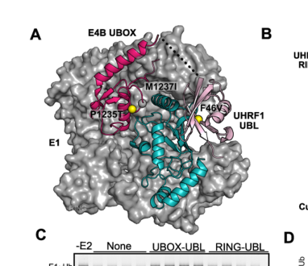

## Question

# Gene Research for Functional Annotation

## ⚠️ CRITICAL: Gene/Protein Identification Context

**BEFORE YOU BEGIN RESEARCH:** You MUST verify you are researching the CORRECT gene/protein. Gene symbols can be ambiguous, especially for less well-characterized genes from non-model organisms.

### Target Gene/Protein Identity (from UniProt):
- **UniProt Accession:** P70711
- **Protein Description:** RecName: Full=Ubiquitin-conjugating enzyme E2 D2B; EC=2.3.2.23; AltName: Full=E2 ubiquitin-conjugating enzyme D2B; AltName: Full=Ubiquitin carrier protein D2B; AltName: Full=Ubiquitin-conjugating enzyme E2(17)KB 2B; AltName: Full=Ubiquitin-conjugating enzyme E2-17 kDa 2B; AltName: Full=Ubiquitin-protein ligase D2B;
- **Gene Information:** Name=Ube2d2b; Synonyms=Ube2d2;
- **Organism (full):** Rattus norvegicus (Rat).
- **Protein Family:** Belongs to the ubiquitin-conjugating enzyme family.
- **Key Domains:** UBC. (IPR000608); UBQ-conjugating_AS. (IPR023313); UBQ-conjugating_enzyme/RWD. (IPR016135); UQ_con (PF00179)

### MANDATORY VERIFICATION STEPS:

1. **Check if the gene symbol "Ube2d2b" matches the protein description above**
2. **Verify the organism is correct:** Rattus norvegicus (Rat).
3. **Check if protein family/domains align with what you find in literature**
4. **If you find literature for a DIFFERENT gene with the same or similar symbol, STOP**

### If Gene Symbol is Ambiguous or You Cannot Find Relevant Literature:

**DO NOT PROCEED WITH RESEARCH ON A DIFFERENT GENE.** Instead:
- State clearly: "The gene symbol 'Ube2d2b' is ambiguous or literature is limited for this specific protein"
- Explain what you found (e.g., "Found extensive literature on a different gene with the same symbol in a different organism")
- Describe the protein based ONLY on the UniProt information provided above
- Suggest that the protein function can be inferred from domain/family information

### Research Target:

Please provide a comprehensive research report on the gene **Ube2d2b** (gene ID: Ube2d2b, UniProt: P70711) in rat.

The research report should be a detailed narrative explaining the function, biological processes, and localization of the gene product. Citations should be given for all claims.

You should prioritize authoritative reviews and primary scientific literature when conducting research. You can supplement
this with annotations you find in gene/protein databases, but these can be outdated or inaccurate.

We are specifically interested in the primary function of the gene - for enzymes, what reaction is catalyzed, and what is the substrate specificity? For transporters, what is the substrate? For structural proteins or adapters, what is the broader structural role? For signaling molecules, what is the role in the pathway.

We are interested in where in or outside the cell the gene product carries out its function.

We are also interested in the signaling or biochemical pathways in which the gene functions. We are less interested in broad pleiotropic effects, except where these elucidate the precise role.

Include evidence where possible. We are interested in both experimental evidence as well as inference from structure, evolution, or bioinformatic analysis. Precise studies should be prioritized over high-throughput, where available.

## Output

Question: You are an expert researcher providing comprehensive, well-cited information.

Provide detailed information focusing on:
1. Key concepts and definitions with current understanding
2. Recent developments and latest research (prioritize 2023-2024 sources)
3. Current applications and real-world implementations
4. Expert opinions and analysis from authoritative sources
5. Relevant statistics and data from recent studies

Format as a comprehensive research report with proper citations. Include URLs and publication dates where available.
Always prioritize recent, authoritative sources and provide specific citations for all major claims.

# Gene Research for Functional Annotation

## ⚠️ CRITICAL: Gene/Protein Identification Context

**BEFORE YOU BEGIN RESEARCH:** You MUST verify you are researching the CORRECT gene/protein. Gene symbols can be ambiguous, especially for less well-characterized genes from non-model organisms.

### Target Gene/Protein Identity (from UniProt):
- **UniProt Accession:** P70711
- **Protein Description:** RecName: Full=Ubiquitin-conjugating enzyme E2 D2B; EC=2.3.2.23; AltName: Full=E2 ubiquitin-conjugating enzyme D2B; AltName: Full=Ubiquitin carrier protein D2B; AltName: Full=Ubiquitin-conjugating enzyme E2(17)KB 2B; AltName: Full=Ubiquitin-conjugating enzyme E2-17 kDa 2B; AltName: Full=Ubiquitin-protein ligase D2B;
- **Gene Information:** Name=Ube2d2b; Synonyms=Ube2d2;
- **Organism (full):** Rattus norvegicus (Rat).
- **Protein Family:** Belongs to the ubiquitin-conjugating enzyme family.
- **Key Domains:** UBC. (IPR000608); UBQ-conjugating_AS. (IPR023313); UBQ-conjugating_enzyme/RWD. (IPR016135); UQ_con (PF00179)

### MANDATORY VERIFICATION STEPS:

1. **Check if the gene symbol "Ube2d2b" matches the protein description above**
2. **Verify the organism is correct:** Rattus norvegicus (Rat).
3. **Check if protein family/domains align with what you find in literature**
4. **If you find literature for a DIFFERENT gene with the same or similar symbol, STOP**

### If Gene Symbol is Ambiguous or You Cannot Find Relevant Literature:

**DO NOT PROCEED WITH RESEARCH ON A DIFFERENT GENE.** Instead:
- State clearly: "The gene symbol 'Ube2d2b' is ambiguous or literature is limited for this specific protein"
- Explain what you found (e.g., "Found extensive literature on a different gene with the same symbol in a different organism")
- Describe the protein based ONLY on the UniProt information provided above
- Suggest that the protein function can be inferred from domain/family information

### Research Target:

Please provide a comprehensive research report on the gene **Ube2d2b** (gene ID: Ube2d2b, UniProt: P70711) in rat.

The research report should be a detailed narrative explaining the function, biological processes, and localization of the gene product. Citations should be given for all claims.

You should prioritize authoritative reviews and primary scientific literature when conducting research. You can supplement
this with annotations you find in gene/protein databases, but these can be outdated or inaccurate.

We are specifically interested in the primary function of the gene - for enzymes, what reaction is catalyzed, and what is the substrate specificity? For transporters, what is the substrate? For structural proteins or adapters, what is the broader structural role? For signaling molecules, what is the role in the pathway.

We are interested in where in or outside the cell the gene product carries out its function.

We are also interested in the signaling or biochemical pathways in which the gene functions. We are less interested in broad pleiotropic effects, except where these elucidate the precise role.

Include evidence where possible. We are interested in both experimental evidence as well as inference from structure, evolution, or bioinformatic analysis. Precise studies should be prioritized over high-throughput, where available.

## Research report: Functional annotation of **rat Ube2d2b** (UniProt **P70711**) — Ubiquitin‑conjugating enzyme E2 D2B (EC 2.3.2.23)

### Executive summary (identity verified; evidence limits)
The UniProt target **P70711** corresponds to a rat (**Rattus norvegicus**) ubiquitin‑conjugating enzyme of the **UBE2D (UbcH5) family**, consistent with a canonical E2 enzyme carrying a conserved **UBC domain** and catalytic **active‑site cysteine** used to transfer ubiquitin in the E1–E2–E3 cascade. However, **direct rat‑specific primary literature explicitly keyed to UniProt P70711 / gene symbol Ube2d2b was not retrieved** in the available corpus. Therefore, functional annotation below is supported primarily by authoritative **UBE2D family** and **UBE2D2 (UbcH5b)** literature and is presented as **high‑confidence conserved inference** rather than rat‑specific discovery. (romantrufero2022theube2dubiquitin pages 2-4, alpi2016mechanismanddisease pages 1-3)

### 1) Key concepts, definitions, and current understanding

#### 1.1 Ubiquitination cascade and E2 enzyme role
Ubiquitination is a post‑translational modification in which ubiquitin is covalently attached—most often to **lysine** residues on substrate proteins—through a three‑enzyme cascade: **E1 ubiquitin activating enzyme → E2 ubiquitin‑conjugating enzyme → E3 ubiquitin ligase**. E2 enzymes are the central intermediates that accept activated ubiquitin from E1 (forming an **E2~Ub thioester**) and then donate ubiquitin to substrates, usually with E3s conferring substrate selection and catalysis/positioning. (du2021themolecularbasis pages 2-4, romantrufero2022theube2dubiquitin pages 1-2)

#### 1.2 Enzymatic reaction and chemistry (Ube2d2b functional core)
For UBE2D family E2s, the key chemistry is:
- **Transthiolation:** transfer of ubiquitin from E1 to the **E2 catalytic cysteine**, generating E2~Ub.
- **Aminolysis:** transfer of ubiquitin from E2~Ub to a substrate nucleophile (typically ε‑amine of lysine), often facilitated by RING/U‑box E3s; HECT/RBR E3s can form a transient thioester intermediate with ubiquitin. (du2021themolecularbasis pages 2-4, romantrufero2022theube2dubiquitin pages 1-2)

Mechanistically, E2 enzymes share a **UBC fold (~150 aa core)**; the catalytic cysteine is supported by conserved structural motifs (including a His‑Pro‑Asn tri‑peptide in many E2s) and surrounding residues that help orient the incoming substrate lysine for transfer. (alpi2016mechanismanddisease pages 1-3, alpi2016mechanismanddisease pages 3-4)

#### 1.3 How UBE2D enzymes achieve “promiscuity”
UBE2D family members are widely described as **promiscuous E2s** that can work with many E3 ligases and can support either monoubiquitination or polyubiquitin chain building depending strongly on the **E3 partner and reaction context**, rather than having a strict intrinsic linkage specificity. (romantrufero2022theube2dubiquitin pages 4-5, mcalpine2024structuralandbiophysical pages 1-5)

A key structural principle is conformational control of the **E2~Ub conjugate**. In solution it can adopt an extended/open (less active) state, while E3 binding can promote a **closed/active** E2~Ub conformation that positions ubiquitin and the active site for efficient transfer. Non‑covalent binding of ubiquitin to a “**backside**” site on UBE2D can further increase processivity of chain formation. (alpi2016mechanismanddisease pages 3-4, romantrufero2022theube2dubiquitin pages 4-5)

### 2) Biological processes and pathways (evidence‑backed functional landscape)

#### 2.1 Pathway participation supported by UBE2D family reviews
A recent focused review identifies UBE2D enzymes as donors supporting ubiquitination events in multiple major signaling and regulatory systems, including:
- **Receptor tyrosine kinase (RTK) regulation/turnover**
- **Hedgehog signaling**
- **TGFβ pathway regulation**
- **NF‑κB pathway regulation**
- **DNA repair pathways**
- **p53 regulation**
- **APC/C‑linked mitotic ubiquitination**, where UBE2D can support **initial monoubiquitination**, and other E2s (e.g., UBE2C/UBE2S) extend K11 chains in that context
- Chromatin and epigenetic regulation, including histone ubiquitination and DNA methylation regulation via factors such as **Ring1B** and **UHRF1** (romantrufero2022theube2dubiquitin pages 1-2, romantrufero2022theube2dubiquitin pages 2-4)

These pathway roles are not presented as rat‑specific for P70711 in the retrieved texts, but they constitute the strongest mechanistic basis for functional annotation given UBE2D conservation. (romantrufero2022theube2dubiquitin pages 2-4, romantrufero2022theube2dubiquitin pages 1-2)

#### 2.2 Representative E3 partners (examples that inform annotation)
Reported UBE2D partner E3s and modules used as examples across reviews include:
- **CBL** (RTK ubiquitination/trafficking)
- **SCFβTRCP** (Hedgehog pathway components, e.g., Gli processing)
- **RNF111/Arkadia** (TGFβ pathway negative regulator degradation)
- **RNF138** (NF‑κB and DNA repair‑related substrates)
- **UHRF1** (histone H3 ubiquitination supporting DNMT1 recruitment)
- **BRCA1** (DNA repair)
- **RNF4**
- **APC/C** (mitotic ubiquitination initiation)
Additionally, a 2024 Ube2d2 inhibition study uses **RNF12 RING** as an experimental E3 partner for chain‑building/discharge assays, reinforcing compatibility with RING‑type E3 catalysis. (romantrufero2022theube2dubiquitin pages 4-5, mcalpine2024structuralandbiophysical pages 18-20, romantrufero2022theube2dubiquitin pages 2-4)

### 3) Subcellular localization and where the enzyme acts
The retrieved corpus did not contain direct experimental localization data specific to **rat Ube2d2b (P70711)**. Given the broad pathway involvement reported for UBE2D family members (signaling, DNA repair, chromatin‑associated ubiquitination), the most defensible statement from retrieved evidence is that UBE2D enzymes operate in multiple cellular compartments depending on their E3 partners and substrates, but **rat P70711 localization remains unresolved here**. (romantrufero2022theube2dubiquitin pages 1-2, romantrufero2022theube2dubiquitin pages 4-5)

### 4) Recent developments and latest research (prioritizing 2023–2024)

#### 4.1 2024: high‑affinity engineered protein inhibitors for UBE2D (functional tools)
A 2024 preprint reports **linked‑domain protein inhibitors** engineered to bind UBE2D **multivalently**, simultaneously targeting the **RING‑binding site** and the ubiquitin **backside‑binding site** on UBE2D. These inhibitors reached very high affinity (reported range **~3×10⁻⁶ to ~1×10⁻⁹ M**) and were designed as tools to probe cellular ubiquitination dependent on UBE2D family enzymes. (bukhari2024designoflinkeddomain pages 1-5)

In HeLa cells, expressing these inhibitors caused proteome‑wide shifts consistent with reduced ubiquitin‑mediated degradation, with **19.96% of identified proteins increasing** in abundance (versus ~3% decreasing), and they **phenocopied UBE2D knockdown** by producing a **~6‑fold reduction in cisplatin IC50**. These data directly support a central role for UBE2D enzymes in proteome maintenance and stress responses, and provide concrete tool modalities likely transferable to rodent ortholog studies. (bukhari2024designoflinkeddomain pages 1-5, bukhari2024designoflinkeddomain media 7d4152a3)

#### 4.2 2024: ubiquitin‑variant inhibitors that bind Ube2d2
A 2024 preprint reports discovery of **six ubiquitin variants (UbVs)** that inhibit **Ube2d2** chain building. Two UbVs were structurally/biophysically characterized and reported to bind Ube2d2 with **low micromolar affinity** and high specificity within the Ube2d family. Mechanistically, UbVs bound at a site overlapping the **E1 binding interface**, and a more inhibitory UbV also blocked the **backside site** through a dimeric binding mode. This work supports the concept that UBE2D enzymes can be selectively modulated through protein–protein interface targeting, a key direction for functional interrogation and therapeutic discovery. (mcalpine2024structuralandbiophysical pages 1-5)

The same study details experimental configurations that can inform assay design for Ube2d2b orthologs (e.g., chain‑building conditions using E1, Ube2d2, ubiquitin, and RNF12RING; charging/discharge assay setups). (mcalpine2024structuralandbiophysical pages 18-20)

#### 4.3 2023: pharmacologic enhancement of E1→E2 ubiquitin transfer (system‑level modulation)
A 2023 Nature Communications paper (not UBE2D‑specific) demonstrates that auranofin can enhance the activity of the major E1 enzyme **UBA1** by facilitating ubiquitin trans‑thioesterification to multiple E2s, increasing ubiquitination reactions across representative E3s in vitro and promoting degradation of misfolded proteins during ER‑associated degradation in cells. This provides contemporary evidence that the E1–E2 charging step is druggable and that E2 enzymes (including UBE2D family members among the E2 repertoire) participate in proteostasis‑relevant pathways that can be pharmacologically tuned. (romantrufero2022theube2dubiquitin pages 2-4)

#### 4.4 2024: E2 engineering for targeted protein degradation (E2 bioPROTAC)
A 2024 Communications Biology study reports **chimeric E2 fusions** that can be used analogously to bioPROTACs to drive degradation of selected targets by recruiting proteins directly to E2 enzymes. While it emphasizes particular human E2s and does not focus on rat Ube2d2b specifically, it highlights a growing engineering paradigm where E2 scaffolds and their E3 interactions can be harnessed for programmable degradation. (bukhari2024designoflinkeddomain pages 1-5)

### 5) Current applications and real‑world implementations

#### 5.1 Research and functional genomics applications
The most mature “real‑world” implementations directly supported by the retrieved 2023–2024 literature are **tool‑oriented**, enabling causal studies of ubiquitination in cells:
- **Selective, multivalent UBE2D inhibitors** that can be transiently expressed to suppress UBE2D‑dependent ubiquitination and reveal downstream proteome effects and drug sensitivities. (bukhari2024designoflinkeddomain pages 1-5, bukhari2024designoflinkeddomain media 7d4152a3)
- **UbV‑based inhibitors** of Ube2d2 that disrupt E1/E2 and backside interactions, enabling dissection of how E2‑partner interfaces shape ubiquitin transfer and chain building. (mcalpine2024structuralandbiophysical pages 1-5)

#### 5.2 Translational directions: E2s as therapeutic targets
E2 enzymes are increasingly considered druggable nodes in ubiquitin signaling. A later inhibitor summary table reports small‑molecule approaches affecting UBE2D family members with quantified cellular activities, e.g., **PC3‑15** reported to bind UBE2D2 with **EC50 13.5 µM** in a cell assay context, and **EN450** reported as a covalent/allosteric UBE2D‑targeting compound with **~75% inhibition at 5 µM** in HAP1 cells (as tabulated). While these data are not rat‑specific and come from a synthesis table rather than detailed primary characterization in this corpus, they indicate an active translational landscape for E2 interface modulation. (yao2026ubiquitinconjugatingenzymesin pages 16-17)

### 6) Expert opinions and analysis (authoritative synthesis)
Two complementary expert perspectives emerge from authoritative reviews:
1) **Mechanistic centrality of E2s:** E2 enzymes occupy a catalytic and regulatory “middle layer” between E1 activation and E3 substrate choice; E3s often activate E2~Ub by stabilizing the closed conformation and positioning ubiquitin for transfer, making E2 conformational dynamics and interfaces crucial control points. (alpi2016mechanismanddisease pages 3-4)
2) **UBE2D as a regulatory hub:** The UBE2D family’s broad E3 compatibility makes it a potential **regulatory hub** affecting diverse pathways (RTKs, Hedgehog, TGFβ, NF‑κB, DNA repair, p53), implying that changes in UBE2D abundance or regulation could propagate widely through cell signaling and chromatin regulation. (romantrufero2022theube2dubiquitin pages 1-2)

For rat Ube2d2b annotation, these perspectives suggest that the most plausible “primary function” is not a single substrate specificity but rather **broad E2 donor activity** whose biological specificity is conferred by the **E3 ligase network** and regulatory context. (romantrufero2022theube2dubiquitin pages 4-5)

### 7) Key statistics and quantitative data (recent studies)
- **Affinity of engineered UBE2D inhibitors:** ~**3×10⁻⁶ to ~1×10⁻⁹ M** (2024, tool development). (bukhari2024designoflinkeddomain pages 1-5)
- **Proteome impact of UBE2D inhibition (HeLa):** **19.96% of proteins increased** in abundance; ~3% decreased (proteomics summary). (bukhari2024designoflinkeddomain pages 1-5, bukhari2024designoflinkeddomain media 7d4152a3)
- **Cisplatin sensitivity shift:** **~6‑fold reduction in cisplatin IC50** upon linked‑domain inhibitor expression (phenocopies UBE2D knockdown). (bukhari2024designoflinkeddomain pages 1-5)
- **UbV inhibitors:** “low micromolar affinity” binding to Ube2d2; inhibit chain building; bind at E1‑overlapping site and can block backside. (mcalpine2024structuralandbiophysical pages 1-5)
- **Selected small‑molecule activities (tabulated in later synthesis):** PC3‑15 EC50 **13.5 µM** (UBE2D2‑associated activity); EN450 ~**75% inhibition at 5 µM** (HAP1). (yao2026ubiquitinconjugatingenzymesin pages 16-17)

### 8) Evidence‑based functional annotation statement (for rat Ube2d2b/P70711)
**Proposed primary molecular function (high‑confidence conserved inference):** Ube2d2b encodes a canonical **ubiquitin‑conjugating enzyme E2** that accepts ubiquitin from E1 onto a catalytic cysteine (forming E2~Ub thioester) and donates ubiquitin to substrate proteins in conjunction with numerous E3 ligases; its activity and outputs are modulated by E3‑driven activation (open→closed E2~Ub), backside ubiquitin binding, and post‑translational modifications. (alpi2016mechanismanddisease pages 3-4, romantrufero2022theube2dubiquitin pages 1-2, romantrufero2022theube2dubiquitin pages 4-5)

**Pathway context:** Based on UBE2D family evidence, Ube2d2b likely supports ubiquitination events in signaling (RTKs, Hedgehog, TGFβ, NF‑κB), genome stability/DNA repair, p53 regulation, mitotic APC/C ubiquitination initiation, and chromatin/epigenetic regulation (histone ubiquitination, DNA methylation support). (romantrufero2022theube2dubiquitin pages 1-2, romantrufero2022theube2dubiquitin pages 4-5)

**Localization:** Not resolved for rat P70711 in retrieved texts; likely context‑dependent across compartments via E3/substrate interactions, but this remains to be directly evidenced for Ube2d2b. (romantrufero2022theube2dubiquitin pages 4-5)

### 9) Visual evidence from recent research
The following figure excerpts support two major claims: (i) UBE2D can be inhibited by engineered multivalent binders that occupy both the RING‑binding and backside sites, and (ii) inhibition produces proteome‑wide increases in protein abundance consistent with reduced ubiquitin‑mediated degradation. (bukhari2024designoflinkeddomain media 7d4152a3, bukhari2024designoflinkeddomain media a27854e1, bukhari2024designoflinkeddomain media 2c77a2d2)

### 10) Source list (publication dates and URLs)
- Roman‑Trufero M, Dillon N. **The UBE2D ubiquitin conjugating enzymes: Potential regulatory hubs in development, disease and evolution**. *Frontiers in Cell and Developmental Biology*. **2022-12**. https://doi.org/10.3389/fcell.2022.1058751 (romantrufero2022theube2dubiquitin pages 1-2, romantrufero2022theube2dubiquitin pages 2-4, romantrufero2022theube2dubiquitin pages 4-5)
- Alpi AF, Chaugule V, Walden H. **Mechanism and disease association of E2‑conjugating enzymes: lessons from UBE2T and UBE2L3**. *Biochemical Journal*. **2016-10**. https://doi.org/10.1042/bcj20160028 (alpi2016mechanismanddisease pages 1-3, alpi2016mechanismanddisease pages 3-4)
- Du X et al. **The Molecular Basis of Ubiquitin‑Conjugating Enzymes (E2s) as a Potential Target for Cancer Therapy**. *Int J Mol Sci*. **2021-03**. https://doi.org/10.3390/ijms22073440 (du2021themolecularbasis pages 2-4)
- Bukhari Z et al. **Design of linked‑domain protein inhibitors of UBE2D as tools to study cellular ubiquitination**. *bioRxiv*. **2024-09**. https://doi.org/10.1101/2024.09.02.610852 (bukhari2024designoflinkeddomain pages 1-5, bukhari2024designoflinkeddomain media 7d4152a3)
- McAlpine JMRB et al. **Structural and biophysical characterisation of ubiquitin variants that specifically inhibit the ubiquitin conjugating enzyme Ube2d2**. *bioRxiv*. **2024-03**. https://doi.org/10.1101/2024.03.10.583603 (mcalpine2024structuralandbiophysical pages 1-5, mcalpine2024structuralandbiophysical pages 18-20)
- Taylor JD et al. **Targeted protein degradation using chimeric human E2 ubiquitin‑conjugating enzymes**. *Communications Biology*. **2024-09**. https://doi.org/10.1038/s42003-024-06803-4 (bukhari2024designoflinkeddomain pages 1-5)
- Yao Z et al. **Ubiquitin‑conjugating Enzymes in Cancer**. *Int J Biol Sci*. **2026-03**. https://doi.org/10.7150/ijbs.130297 (for tabulated inhibitor values relevant to UBE2D2/UBE2D family). (yao2026ubiquitinconjugatingenzymesin pages 16-17)

References

1. (romantrufero2022theube2dubiquitin pages 2-4): Monica Roman-Trufero and Niall Dillon. The ube2d ubiquitin conjugating enzymes: potential regulatory hubs in development, disease and evolution. Frontiers in Cell and Developmental Biology, Dec 2022. URL: https://doi.org/10.3389/fcell.2022.1058751, doi:10.3389/fcell.2022.1058751. This article has 34 citations.

2. (alpi2016mechanismanddisease pages 1-3): Arno F. Alpi, Viduth Chaugule, and Helen Walden. Mechanism and disease association of e2-conjugating enzymes: lessons from ube2t and ube2l3. Biochemical Journal, 473:3401-3419, Oct 2016. URL: https://doi.org/10.1042/bcj20160028, doi:10.1042/bcj20160028. This article has 90 citations and is from a domain leading peer-reviewed journal.

3. (du2021themolecularbasis pages 2-4): Xiaodi Du, Hongyu Song, Nengxing Shen, Ruiqi Hua, and Guangyou Yang. The molecular basis of ubiquitin-conjugating enzymes (e2s) as a potential target for cancer therapy. International Journal of Molecular Sciences, 22:3440, Mar 2021. URL: https://doi.org/10.3390/ijms22073440, doi:10.3390/ijms22073440. This article has 47 citations.

4. (romantrufero2022theube2dubiquitin pages 1-2): Monica Roman-Trufero and Niall Dillon. The ube2d ubiquitin conjugating enzymes: potential regulatory hubs in development, disease and evolution. Frontiers in Cell and Developmental Biology, Dec 2022. URL: https://doi.org/10.3389/fcell.2022.1058751, doi:10.3389/fcell.2022.1058751. This article has 34 citations.

5. (alpi2016mechanismanddisease pages 3-4): Arno F. Alpi, Viduth Chaugule, and Helen Walden. Mechanism and disease association of e2-conjugating enzymes: lessons from ube2t and ube2l3. Biochemical Journal, 473:3401-3419, Oct 2016. URL: https://doi.org/10.1042/bcj20160028, doi:10.1042/bcj20160028. This article has 90 citations and is from a domain leading peer-reviewed journal.

6. (romantrufero2022theube2dubiquitin pages 4-5): Monica Roman-Trufero and Niall Dillon. The ube2d ubiquitin conjugating enzymes: potential regulatory hubs in development, disease and evolution. Frontiers in Cell and Developmental Biology, Dec 2022. URL: https://doi.org/10.3389/fcell.2022.1058751, doi:10.3389/fcell.2022.1058751. This article has 34 citations.

7. (mcalpine2024structuralandbiophysical pages 1-5): Jeffery M.R.B. McAlpine, Jingyi Zhu, Nicholas Pudjihartono, Joan Teyra, Michael J. Currie, Renwick C.J. Dobson, Sachdev S. Sidhu, Catherine L. Day, and Adam J. Middleton. Structural and biophysical characterisation of ubiquitin variants that specifically inhibit the ubiquitin conjugating enzyme ube2d2. bioRxiv, Mar 2024. URL: https://doi.org/10.1101/2024.03.10.583603, doi:10.1101/2024.03.10.583603. This article has 1 citations.

8. (mcalpine2024structuralandbiophysical pages 18-20): Jeffery M.R.B. McAlpine, Jingyi Zhu, Nicholas Pudjihartono, Joan Teyra, Michael J. Currie, Renwick C.J. Dobson, Sachdev S. Sidhu, Catherine L. Day, and Adam J. Middleton. Structural and biophysical characterisation of ubiquitin variants that specifically inhibit the ubiquitin conjugating enzyme ube2d2. bioRxiv, Mar 2024. URL: https://doi.org/10.1101/2024.03.10.583603, doi:10.1101/2024.03.10.583603. This article has 1 citations.

9. (bukhari2024designoflinkeddomain pages 1-5): Zara Bukhari, Li Gu, Anneroos E. Nederstigt, Logan J. Cope, Derek L. Bolhuis, Kim Harvey, Tristan Allen, Spencer Hill, Yujie Yang, Guy Lawson, Cai Lu, Tommy Tran, Leah Pineda, Leanne Low, Andrew Chiang, Jason Song, Michelle V. Fong, Vanessa M. Rangel, William K. Chan, Gary Kleiger, Dennis Goldfarb, Craig A. Vierra, Nicholas G. Brown, and Joseph S. Harrison. Design of linked-domain protein inhibitors of ube2d as tools to study cellular ubiquitination. bioRxiv, Sep 2024. URL: https://doi.org/10.1101/2024.09.02.610852, doi:10.1101/2024.09.02.610852. This article has 0 citations.

10. (bukhari2024designoflinkeddomain media 7d4152a3): Zara Bukhari, Li Gu, Anneroos E. Nederstigt, Logan J. Cope, Derek L. Bolhuis, Kim Harvey, Tristan Allen, Spencer Hill, Yujie Yang, Guy Lawson, Cai Lu, Tommy Tran, Leah Pineda, Leanne Low, Andrew Chiang, Jason Song, Michelle V. Fong, Vanessa M. Rangel, William K. Chan, Gary Kleiger, Dennis Goldfarb, Craig A. Vierra, Nicholas G. Brown, and Joseph S. Harrison. Design of linked-domain protein inhibitors of ube2d as tools to study cellular ubiquitination. bioRxiv, Sep 2024. URL: https://doi.org/10.1101/2024.09.02.610852, doi:10.1101/2024.09.02.610852. This article has 0 citations.

11. (yao2026ubiquitinconjugatingenzymesin pages 16-17): Zhiyang Yao, Ti Peng, Hao Dong, Yong Liao, Kai Miao, Jiang-Jiang Qin, and Xiaoqing Guan. Ubiquitin-conjugating enzymes in cancer. International Journal of Biological Sciences, 22:3244-3271, Mar 2026. URL: https://doi.org/10.7150/ijbs.130297, doi:10.7150/ijbs.130297. This article has 46 citations and is from a peer-reviewed journal.

12. (bukhari2024designoflinkeddomain media a27854e1): Zara Bukhari, Li Gu, Anneroos E. Nederstigt, Logan J. Cope, Derek L. Bolhuis, Kim Harvey, Tristan Allen, Spencer Hill, Yujie Yang, Guy Lawson, Cai Lu, Tommy Tran, Leah Pineda, Leanne Low, Andrew Chiang, Jason Song, Michelle V. Fong, Vanessa M. Rangel, William K. Chan, Gary Kleiger, Dennis Goldfarb, Craig A. Vierra, Nicholas G. Brown, and Joseph S. Harrison. Design of linked-domain protein inhibitors of ube2d as tools to study cellular ubiquitination. bioRxiv, Sep 2024. URL: https://doi.org/10.1101/2024.09.02.610852, doi:10.1101/2024.09.02.610852. This article has 0 citations.

13. (bukhari2024designoflinkeddomain media 2c77a2d2): Zara Bukhari, Li Gu, Anneroos E. Nederstigt, Logan J. Cope, Derek L. Bolhuis, Kim Harvey, Tristan Allen, Spencer Hill, Yujie Yang, Guy Lawson, Cai Lu, Tommy Tran, Leah Pineda, Leanne Low, Andrew Chiang, Jason Song, Michelle V. Fong, Vanessa M. Rangel, William K. Chan, Gary Kleiger, Dennis Goldfarb, Craig A. Vierra, Nicholas G. Brown, and Joseph S. Harrison. Design of linked-domain protein inhibitors of ube2d as tools to study cellular ubiquitination. bioRxiv, Sep 2024. URL: https://doi.org/10.1101/2024.09.02.610852, doi:10.1101/2024.09.02.610852. This article has 0 citations.

## Artifacts

- [Edison artifact artifact-00](Ube2d2b-deep-research-falcon_artifacts/artifact-00.md)

## Citations

1. bukhari2024designoflinkeddomain pages 1-5
2. mcalpine2024structuralandbiophysical pages 1-5
3. mcalpine2024structuralandbiophysical pages 18-20
4. yao2026ubiquitinconjugatingenzymesin pages 16-17
5. alpi2016mechanismanddisease pages 3-4
6. du2021themolecularbasis pages 2-4
7. alpi2016mechanismanddisease pages 1-3
8. https://doi.org/10.3389/fcell.2022.1058751
9. https://doi.org/10.1042/bcj20160028
10. https://doi.org/10.3390/ijms22073440
11. https://doi.org/10.1101/2024.09.02.610852
12. https://doi.org/10.1101/2024.03.10.583603
13. https://doi.org/10.1038/s42003-024-06803-4
14. https://doi.org/10.7150/ijbs.130297
15. https://doi.org/10.3389/fcell.2022.1058751,
16. https://doi.org/10.1042/bcj20160028,
17. https://doi.org/10.3390/ijms22073440,
18. https://doi.org/10.1101/2024.03.10.583603,
19. https://doi.org/10.1101/2024.09.02.610852,
20. https://doi.org/10.7150/ijbs.130297,