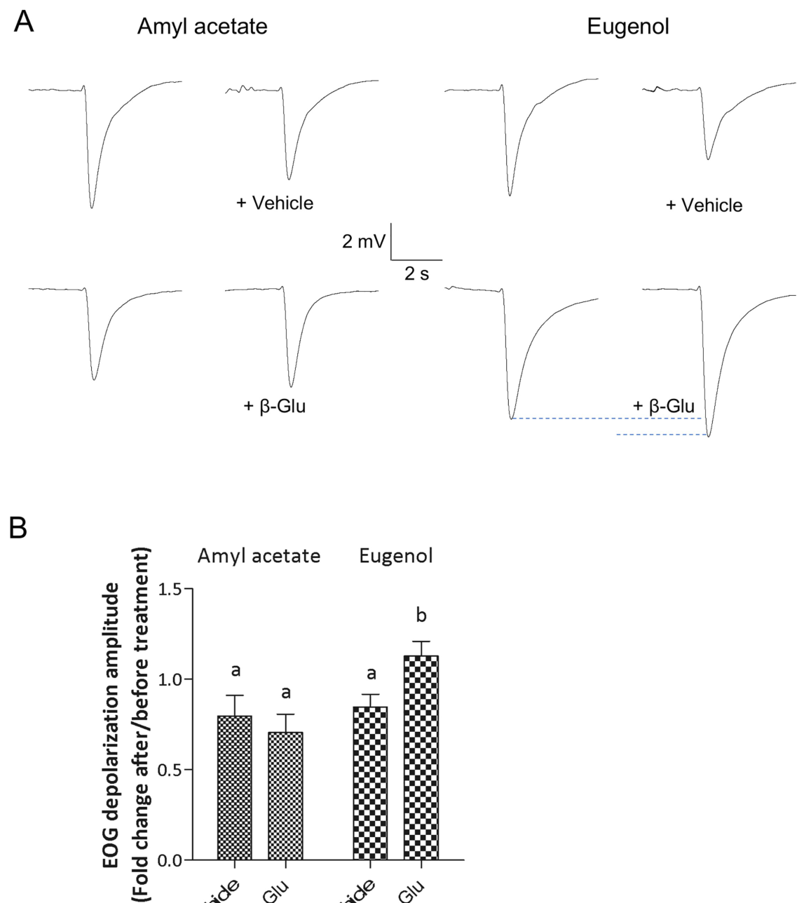

## Question

# Gene Research for Functional Annotation

## ⚠️ CRITICAL: Gene/Protein Identification Context

**BEFORE YOU BEGIN RESEARCH:** You MUST verify you are researching the CORRECT gene/protein. Gene symbols can be ambiguous, especially for less well-characterized genes from non-model organisms.

### Target Gene/Protein Identity (from UniProt):
- **UniProt Accession:** P36510
- **Protein Description:** RecName: Full=UDP-glucuronosyltransferase 2A1 {ECO:0000305}; Short=UDPGT 2A1; Short=UGT2A1; EC=2.4.1.17 {ECO:0000250|UniProtKB:P0DTE4}; AltName: Full=UGT-OLF; Flags: Precursor;
- **Gene Information:** Name=Ugt2a1 {ECO:0000312|RGD:69432}; Synonyms=Ugt2a-1;
- **Organism (full):** Rattus norvegicus (Rat).
- **Protein Family:** Belongs to the UDP-glycosyltransferase family.
- **Key Domains:** UDP-glycosyltransferase. (IPR050271); UDP_glucos_trans. (IPR002213); UDP_glycos_trans_CS. (IPR035595); UDPGT (PF00201)

### MANDATORY VERIFICATION STEPS:

1. **Check if the gene symbol "Ugt2a1" matches the protein description above**
2. **Verify the organism is correct:** Rattus norvegicus (Rat).
3. **Check if protein family/domains align with what you find in literature**
4. **If you find literature for a DIFFERENT gene with the same or similar symbol, STOP**

### If Gene Symbol is Ambiguous or You Cannot Find Relevant Literature:

**DO NOT PROCEED WITH RESEARCH ON A DIFFERENT GENE.** Instead:
- State clearly: "The gene symbol 'Ugt2a1' is ambiguous or literature is limited for this specific protein"
- Explain what you found (e.g., "Found extensive literature on a different gene with the same symbol in a different organism")
- Describe the protein based ONLY on the UniProt information provided above
- Suggest that the protein function can be inferred from domain/family information

### Research Target:

Please provide a comprehensive research report on the gene **Ugt2a1** (gene ID: Ugt2a1, UniProt: P36510) in rat.

The research report should be a detailed narrative explaining the function, biological processes, and localization of the gene product. Citations should be given for all claims.

You should prioritize authoritative reviews and primary scientific literature when conducting research. You can supplement
this with annotations you find in gene/protein databases, but these can be outdated or inaccurate.

We are specifically interested in the primary function of the gene - for enzymes, what reaction is catalyzed, and what is the substrate specificity? For transporters, what is the substrate? For structural proteins or adapters, what is the broader structural role? For signaling molecules, what is the role in the pathway.

We are interested in where in or outside the cell the gene product carries out its function.

We are also interested in the signaling or biochemical pathways in which the gene functions. We are less interested in broad pleiotropic effects, except where these elucidate the precise role.

Include evidence where possible. We are interested in both experimental evidence as well as inference from structure, evolution, or bioinformatic analysis. Precise studies should be prioritized over high-throughput, where available.

## Output

Question: You are an expert researcher providing comprehensive, well-cited information.

Provide detailed information focusing on:
1. Key concepts and definitions with current understanding
2. Recent developments and latest research (prioritize 2023-2024 sources)
3. Current applications and real-world implementations
4. Expert opinions and analysis from authoritative sources
5. Relevant statistics and data from recent studies

Format as a comprehensive research report with proper citations. Include URLs and publication dates where available.
Always prioritize recent, authoritative sources and provide specific citations for all major claims.

# Gene Research for Functional Annotation

## ⚠️ CRITICAL: Gene/Protein Identification Context

**BEFORE YOU BEGIN RESEARCH:** You MUST verify you are researching the CORRECT gene/protein. Gene symbols can be ambiguous, especially for less well-characterized genes from non-model organisms.

### Target Gene/Protein Identity (from UniProt):
- **UniProt Accession:** P36510
- **Protein Description:** RecName: Full=UDP-glucuronosyltransferase 2A1 {ECO:0000305}; Short=UDPGT 2A1; Short=UGT2A1; EC=2.4.1.17 {ECO:0000250|UniProtKB:P0DTE4}; AltName: Full=UGT-OLF; Flags: Precursor;
- **Gene Information:** Name=Ugt2a1 {ECO:0000312|RGD:69432}; Synonyms=Ugt2a-1;
- **Organism (full):** Rattus norvegicus (Rat).
- **Protein Family:** Belongs to the UDP-glycosyltransferase family.
- **Key Domains:** UDP-glycosyltransferase. (IPR050271); UDP_glucos_trans. (IPR002213); UDP_glycos_trans_CS. (IPR035595); UDPGT (PF00201)

### MANDATORY VERIFICATION STEPS:

1. **Check if the gene symbol "Ugt2a1" matches the protein description above**
2. **Verify the organism is correct:** Rattus norvegicus (Rat).
3. **Check if protein family/domains align with what you find in literature**
4. **If you find literature for a DIFFERENT gene with the same or similar symbol, STOP**

### If Gene Symbol is Ambiguous or You Cannot Find Relevant Literature:

**DO NOT PROCEED WITH RESEARCH ON A DIFFERENT GENE.** Instead:
- State clearly: "The gene symbol 'Ugt2a1' is ambiguous or literature is limited for this specific protein"
- Explain what you found (e.g., "Found extensive literature on a different gene with the same symbol in a different organism")
- Describe the protein based ONLY on the UniProt information provided above
- Suggest that the protein function can be inferred from domain/family information

### Research Target:

Please provide a comprehensive research report on the gene **Ugt2a1** (gene ID: Ugt2a1, UniProt: P36510) in rat.

The research report should be a detailed narrative explaining the function, biological processes, and localization of the gene product. Citations should be given for all claims.

You should prioritize authoritative reviews and primary scientific literature when conducting research. You can supplement
this with annotations you find in gene/protein databases, but these can be outdated or inaccurate.

We are specifically interested in the primary function of the gene - for enzymes, what reaction is catalyzed, and what is the substrate specificity? For transporters, what is the substrate? For structural proteins or adapters, what is the broader structural role? For signaling molecules, what is the role in the pathway.

We are interested in where in or outside the cell the gene product carries out its function.

We are also interested in the signaling or biochemical pathways in which the gene functions. We are less interested in broad pleiotropic effects, except where these elucidate the precise role.

Include evidence where possible. We are interested in both experimental evidence as well as inference from structure, evolution, or bioinformatic analysis. Precise studies should be prioritized over high-throughput, where available.

## Research report: Rat **Ugt2a1** (UniProt **P36510**) — functional annotation of UDP-glucuronosyltransferase 2A1 (UGT2A1/UGT-olf)

### Scope and identity verification
The target protein is **rat (Rattus norvegicus) UDP-glucuronosyltransferase 2A1 (UGT2A1)**, historically termed **UGT-olf/UGTolf**, a member of the UGT2A subfamily enriched in neuro‑olfactory tissues. Its identity as an olfactory UGT is supported by (i) quantitative mRNA enrichment in rat olfactory epithelium relative to olfactory bulb and (ii) proteomic detection in olfactory sensory cilia, and by direct experimental studies on rat olfactory epithelium that immunolocalize UGT2A1 and test its functional impact on odor responses (heydel2010udpglucuronosyltransferases(ugts)in pages 2-3, heydel2010udpglucuronosyltransferases(ugts)in pages 3-5, neiers2021theodorantmetabolizing pages 6-8).

### 1) Key concepts and definitions (current understanding)

#### 1.1 UDP-glucuronosyltransferases and the glucuronidation reaction
UGT2A1 is a **phase II xenobiotic‑metabolizing enzyme** that catalyzes **glucuronidation**: transfer of glucuronic acid from **UDP‑glucuronic acid (UDPGA)** to small molecules bearing suitable nucleophilic groups (e.g., hydroxyl groups), producing **more hydrophilic glucuronides** that tend to be eliminated more readily. In the olfactory system, such glucuronidation is part of the **perireceptor process**, i.e., local metabolism in the mucus/epithelium that shapes the concentration-time profile of odorants reaching olfactory receptors and can thereby contribute to **signal termination** (neiers2021theodorantmetabolizing pages 2-4, heydel2010udpglucuronosyltransferases(ugts)in pages 18-19).

#### 1.2 “Perireceptor” odorant metabolism and functional logic
A central mechanistic idea in the olfactory field is that enzymes expressed in the olfactory epithelium (including UGTs) can **rapidly biotransform odorants**, which can (a) **clear** odorants and shorten receptor activation or (b) generate metabolites that may become new stimuli. Importantly, olfactory cilia preparations show that **glucuronidated odorant metabolites fail to stimulate canonical cAMP signaling**, consistent with a mechanism by which glucuronidation reduces receptor activation and promotes signal termination (neiers2021theodorantmetabolizing pages 2-4, heydel2010udpglucuronosyltransferases(ugts)in pages 18-19).

### 2) Gene product localization and expression (rat-specific)

#### 2.1 Tissue distribution in rat neuro‑olfactory tissues
Quantitative RT‑PCR evidence summarized in a neuro‑olfactory UGT review reports **absolute Ugt2a1 mRNA abundance** of approximately **9.8 attomoles/µg total RNA** in rat **olfactory epithelium** and **1.6 attomoles/µg** in rat **olfactory bulb**, consistent with strong enrichment in the peripheral olfactory mucosa (heydel2010udpglucuronosyltransferases(ugts)in pages 2-3). Proteomics has detected UGT2A1 in **rat olfactory sensory cilia**, supporting presence in the odor-detection compartment (heydel2010udpglucuronosyltransferases(ugts)in pages 3-5).

#### 2.2 Cell type and subcellular localization within olfactory epithelium
Direct rat tissue experiments (immunohistochemistry + immunogold electron microscopy) localize UGT2A1 broadly within the olfactory epithelium and especially in the apical region, including **sustentacular cells** and **Bowman’s glands/ducts** (neiers2021theodorantmetabolizing pages 6-8, neiers2021theodorantmetabolizing pages 4-6). Critically, immunogold EM supports localization of UGT2A1 at the **plasma membrane of olfactory cilia**—a location that is unusually proximal to odorant receptors and supports rapid metabolism in the perireceptor space (neiers2021theodorantmetabolizing media 64d5c307, neiers2021theodorantmetabolizing media e8c32847, neiers2021theodorantmetabolizing media cd8ac3e6).

### 3) Primary biochemical function: reaction catalyzed and substrate specificity

#### 3.1 Reaction catalyzed
UGT2A1 catalyzes **UDPGA-dependent glucuronidation** of diverse substrates, including odorants and other xenobiotics/endobiotics encountered by the nasal epithelium (neiers2021theodorantmetabolizing pages 2-4, neiers2021theodorantmetabolizing pages 1-2).

#### 3.2 Substrate scope (odorants and beyond)
An authoritative review of neuro‑olfactory UGTs compiles experimental evidence (from olfactory tissue microsomes and recombinant systems including rat UGT2A1 cDNA expression) indicating UGT2A1 can glucuronidate multiple substrate classes relevant to olfaction and detoxification. Odorant/phenolic substrates glucuronidated in olfactory contexts include **eugenol**, **vanillin**, **carvacrol**, and **1‑naphthol**, among others (heydel2010udpglucuronosyltransferases(ugts)in pages 13-14, heydel2010udpglucuronosyltransferases(ugts)in pages 12-13). The same review summarizes additional substrate classes including **monoterpenoid alcohols** (e.g., geraniol, linalool, borneol, menthol), **coumarins** (e.g., umbelliferone derivatives), **drugs/xenobiotics** (e.g., ibuprofen, valproic acid), and **steroids** (e.g., estradiol/testosterone), supporting a role that extends beyond “odorant-only” metabolism and into broader nasal detoxification and local steroid handling (heydel2010udpglucuronosyltransferases(ugts)in pages 13-14, heydel2010udpglucuronosyltransferases(ugts)in pages 12-13).

#### 3.3 Rat functional evidence for substrate selectivity in situ (odor responses)
A rat ex vivo electroolfactogram (EOG) study used odorants selected for contrasting glucuronidation susceptibility: **amyl acetate** (not considered a UGT substrate in this context) versus **eugenol** (described as highly glucuronoconjugated). In this preparation, counteracting UGT activity with topical **β‑glucuronidase** increased the EOG response amplitude to **eugenol** but not to **amyl acetate**, consistent with the interpretation that glucuronidation reduces effective eugenol concentration at receptors (neiers2021theodorantmetabolizing pages 6-8, neiers2021theodorantmetabolizing pages 4-6). Quantitatively, vehicle application reduced response amplitudes (reported as −20.3 ± 0.17% for amyl acetate and −15.4 ± 0.12% for eugenol), whereas β‑glucuronidase increased eugenol amplitude by **+13 ± 0.14% (p = 0.037)** while producing **no significant change** for amyl acetate (neiers2021theodorantmetabolizing pages 6-8). The corresponding figure evidence is shown in the retrieved EOG plot (neiers2021theodorantmetabolizing media 64d5c307).

#### 3.4 Enzyme kinetics: available quantitative benchmarks (primarily human recombinant UGT2A1)
Direct rat UGT2A1 **Km/Vmax** values were not available in the retrieved full texts. However, detailed kinetic constants exist for **human** UGT2A1 expressed heterologously. For example, a biochemical characterization of human olfactory UGT2A1 reported apparent kinetic parameters for representative substrates, including odorant-like alcohols and testosterone (e.g., testosterone apparent **Km ~56 µM** and **Vmax ~0.25 nmol/mg/min** in the cited system), supporting broad, quantitatively measurable catalytic activity toward odorant-like chemicals and steroids (jedlitschky1999cloningandcharacterization pages 5-6). In another comparative kinetic study of human UGT2A isoforms, UGT2A1 showed much higher affinity (lower Km) than UGT2A2 for several phenolic/coumarin-like probes, illustrating that even within the UGT2A subfamily, **substrate affinity can differ substantially by isoform** (sneitz2009humanudpglucuronosyltransferaseugt2a2 pages 9-10).

### 4) Biological processes and pathways

#### 4.1 Peripheral olfactory processing (signal termination and odorant clearance)
UGT2A1’s localization at the apical olfactory epithelium and olfactory cilia, together with substrate-selective EOG modulation by β‑glucuronidase, supports a functional role in **odorant clearance and modulation/termination of olfactory signaling** in the peripheral olfactory mucosa (neiers2021theodorantmetabolizing pages 6-8, neiers2021theodorantmetabolizing pages 2-4, neiers2021theodorantmetabolizing media 64d5c307). This is consistent with a broader conceptual framework in which xenobiotic-metabolizing enzymes in the olfactory mucosa shape odorant availability near olfactory receptors (heydel2010udpglucuronosyltransferases(ugts)in pages 18-19, heydel2010udpglucuronosyltransferases(ugts)in pages 17-18).

#### 4.2 Barrier and detoxification function in nasal-to-brain exposure pathways
A neuro‑olfactory UGT review explicitly frames nasal UGTs (including UGT2A1 expressed in olfactory epithelium) as part of a protective barrier that can reduce local toxicity and potentially limit delivery of xenobiotics to the brain via the nasal route (heydel2010udpglucuronosyltransferases(ugts)in pages 16-17). This “metabolic barrier” perspective also implies relevance for intranasal drug delivery and toxicology.

### 5) Recent developments (prioritizing 2023–2024) and clinical relevance

#### 5.1 2023: UGT2A1/UGT2A2 locus and COVID-19-related smell loss (human genetic/epidemiologic evidence)
A 2023 systematic review/meta-analysis of omicron-associated olfactory dysfunction highlights a genome-wide association signal at the **UGT2A1/UGT2A2 locus**, described as encoding an odorant‑metabolizing UDP glycosyltransferase expressed in sustentacular cells. The analysis reports ancestry-stratified prevalence estimates (e.g., **11.6%** in populations of European ancestry vs **2.9–5.4%** in other major groups) and a global adult prevalence estimate of **~5.2%**, projecting **~222.3 million** affected adults; the authors argue these prevalence patterns mirror population differences in a UGT2A1 risk-allele frequency and are consistent with UGT2A1 involvement in susceptibility to COVID-related smell loss (bartheld2023prevalenceofolfactory pages 11-15, bartheld2023prevalenceofolfactory pages 1-6). While not rat data, these 2023 findings underscore ongoing biomedical interest in UGT2A-mediated perireceptor metabolism in olfactory function.

#### 5.2 2024: broader detoxification relevance (human bile-acid glucuronidation review)
A 2024 review focused on bile-acid glucuronidation and therapeutic targets cites human studies in which UGT2A1 is described as **highly active in bile-acid glucuronidation**, and it notes characterization of UGT2A1 variants and disease connections (human context) (gallucci2024pparmediatedbileacid pages 10-11). This supports the interpretation that UGT2A1 can participate in broader detoxification chemistry beyond odorants (though this evidence is not olfaction- or rat-specific).

### 6) Current applications and real-world implementations

#### 6.1 Intranasal drug delivery and “metabolic barrier” considerations
The nasal route is widely explored for CNS delivery because it can bypass the blood–brain barrier (BBB). In this context, a neuro‑olfactory metabolism review notes that **>98% of new CNS-targeted drug candidates do not cross the BBB**, motivating intranasal delivery strategies, but it emphasizes that xenobiotic-metabolizing enzymes in nasal epithelium—including UGTs present in olfactory epithelium—can act as a **biochemical barrier against nasally administered drugs**, potentially lowering bioavailability or altering toxicity profiles (heydel2010udpglucuronosyltransferases(ugts)in pages 17-18, heydel2010udpglucuronosyltransferases(ugts)in pages 16-17). This is a direct, real-world implication of UGT2A1-mediated glucuronidation in the nasal mucosa.

#### 6.2 Toxicology and inhaled chemical/fragrance exposure
UGT2A1’s broad substrate scope (including phenolic odorants like eugenol/vanillin and other volatile compounds) and its strategic localization in the olfactory mucosa support a role in the detoxification of inhaled chemicals and odorants. The same review explicitly frames olfactory epithelial XMEs (including UGTs) as protective against toxicants arriving via systemic circulation and inhalation exposures (heydel2010udpglucuronosyltransferases(ugts)in pages 16-17, heydel2010udpglucuronosyltransferases(ugts)in pages 13-14). Although the retrieved excerpts did not include quantitative regulatory/toxicology performance metrics, UGT2A1 genetic variation has been discussed in the context of tobacco-related cancer susceptibility in the cited literature lists (neiers2021theodorantmetabolizing pages 13-13).

### 7) Expert interpretation and critical assessment (authoritative analysis)

1. **Localization supports fast, local control of odorant availability.** The presence of UGT2A1 at the **plasma membrane of olfactory cilia** suggests an optimized architecture for rapid odorant metabolism near receptors, rather than exclusively in intracellular ER typical of many UGTs (neiers2021theodorantmetabolizing media 64d5c307, neiers2021theodorantmetabolizing media cd8ac3e6).

2. **Functional evidence in rat is strong for “odorant modulation,” but not a full flux map.** The ex vivo EOG experiment provides causal evidence that enzymatic counteraction of glucuronidation changes electrophysiological odor responses in a substrate-dependent manner (neiers2021theodorantmetabolizing pages 6-8, neiers2021theodorantmetabolizing media 64d5c307). However, the available evidence does not provide a complete in vivo quantification of odorant → glucuronide conversion rates in mucus or full substrate panels for rat UGT2A1 under physiological conditions.

3. **Rat-specific kinetic parameters remain a gap in accessible full text.** While human recombinant UGT2A1 kinetics demonstrate broad catalytic capability and facilitate isoform comparisons (jedlitschky1999cloningandcharacterization pages 5-6, sneitz2009humanudpglucuronosyltransferaseugt2a2 pages 9-10), equivalent rat UGT2A1 Km/Vmax values were not retrieved here; functional annotation for rat thus currently rests more on localization, expression, and physiological modulation than on enzyme-kinetic constants.

### Summary of key evidence (table)
The table below consolidates the major findings, quantitative data, and study contexts.

| Evidence type | Finding | Quantitative detail | Species/tissue | Source (with DOI/URL and year) |
|---|---|---|---|---|
| Gene/protein identity and expression | Rat **Ugt2a1/UGT2A1** corresponds to the olfactory UDP-glucuronosyltransferase historically termed **UGT-olf/UGTolf**; highly expressed in olfactory tissues and detected in olfactory sensory cilia (heydel2010udpglucuronosyltransferases(ugts)in pages 2-3, heydel2010udpglucuronosyltransferases(ugts)in pages 3-5) | Absolute expression reported as **~9.8 attomoles/µg total RNA** in rat olfactory epithelium and **~1.6 attomoles/µg total RNA** in rat olfactory bulb; one other isoform reported as **>1,000-fold lower** than UGT2A1 (heydel2010udpglucuronosyltransferases(ugts)in pages 2-3, heydel2010udpglucuronosyltransferases(ugts)in pages 3-5) | **Rattus norvegicus**; olfactory epithelium, olfactory bulb, olfactory sensory cilia | Heydel et al., *Drug Metab Rev* (2010), DOI: 10.3109/03602530903208363, https://doi.org/10.3109/03602530903208363 (heydel2010udpglucuronosyltransferases(ugts)in pages 2-3, heydel2010udpglucuronosyltransferases(ugts)in pages 3-5) |
| Enzymatic reaction | UGT2A1 is a **phase II UDP-glucuronosyltransferase** that conjugates **UDP-glucuronic acid** to odorants/xenobiotics, generating more hydrophilic glucuronides for elimination; this reaction is implicated in olfactory perireceptor metabolism and signal termination (neiers2021theodorantmetabolizing pages 2-4, neiers2021theodorantmetabolizing pages 1-2) | Reaction class stated; rapid metabolite formation in olfactory tissue reported on the order of **hundreds of milliseconds** in the 2021 study background, but no rat-specific Km/Vmax values were provided in the retrieved evidence (neiers2021theodorantmetabolizing pages 1-2) | Rat olfactory epithelium / vertebrate olfactory tissues | Neiers et al., *PLOS ONE* (2021), DOI: 10.1371/journal.pone.0249029, https://doi.org/10.1371/journal.pone.0249029; Heydel et al., *Drug Metab Rev* (2010), DOI: 10.3109/03602530903208363, https://doi.org/10.3109/03602530903208363 (neiers2021theodorantmetabolizing pages 2-4, neiers2021theodorantmetabolizing pages 1-2) |
| Tissue/cellular localization | UGT2A1 immunolocalizes throughout the olfactory epithelium, especially the **apical region**; present in **sustentacular cells**, **Bowman glands**, and **Bowman gland ducts** (neiers2021theodorantmetabolizing pages 6-8, neiers2021theodorantmetabolizing pages 4-6) | Qualitative localization by immunohistochemistry; no abundance values at the cell-type level reported in retrieved evidence (neiers2021theodorantmetabolizing pages 6-8, neiers2021theodorantmetabolizing pages 4-6) | Rat olfactory epithelium | Neiers et al., *PLOS ONE* (2021), DOI: 10.1371/journal.pone.0249029, https://doi.org/10.1371/journal.pone.0249029 (neiers2021theodorantmetabolizing pages 6-8, neiers2021theodorantmetabolizing pages 4-6) |
| Subcellular localization | UGT2A1 is localized not only in sustentacular-cell endoplasmic reticulum but also at the **plasma membrane of olfactory cilia** of olfactory sensory neurons, placing the enzyme close to odorant receptors (neiers2021theodorantmetabolizing pages 6-8, neiers2021theodorantmetabolizing media 64d5c307, neiers2021theodorantmetabolizing media e8c32847, neiers2021theodorantmetabolizing media cd8ac3e6) | Localization supported by immunogold EM micrographs (Fig. 2E/F in cited paper); no numerical membrane-density values reported in retrieved evidence (neiers2021theodorantmetabolizing media 64d5c307, neiers2021theodorantmetabolizing media e8c32847, neiers2021theodorantmetabolizing media cd8ac3e6) | Rat olfactory cilia / olfactory sensory neurons and sustentacular cells | Neiers et al., *PLOS ONE* (2021), DOI: 10.1371/journal.pone.0249029, https://doi.org/10.1371/journal.pone.0249029 (neiers2021theodorantmetabolizing pages 6-8, neiers2021theodorantmetabolizing media 64d5c307, neiers2021theodorantmetabolizing media e8c32847, neiers2021theodorantmetabolizing media cd8ac3e6) |
| Substrate specificity: positive exemplar | **Eugenol** is described as a strong/highly glucuronidated odorant substrate of olfactory UGTs/UGT2A1, used as the positive functional probe in rat olfactory epithelium (neiers2021theodorantmetabolizing pages 1-2, neiers2021theodorantmetabolizing pages 4-6) | EOG experiments used **10^-2 M eugenol**; β-glucuronidase treatment increased response amplitude by **+13 ± 0.14%**, with **p = 0.037** versus vehicle condition summarized in the evidence (neiers2021theodorantmetabolizing pages 6-8) | Rat olfactory epithelium | Neiers et al., *PLOS ONE* (2021), DOI: 10.1371/journal.pone.0249029, https://doi.org/10.1371/journal.pone.0249029 (neiers2021theodorantmetabolizing pages 6-8, neiers2021theodorantmetabolizing pages 1-2, neiers2021theodorantmetabolizing pages 4-6) |
| Substrate specificity: negative comparator | **Amyl acetate** was used as a comparator because it is **not considered a UGT substrate** in this rat olfactory assay framework (neiers2021theodorantmetabolizing pages 4-6) | EOG experiments used **10^-3 M amyl acetate**; β-glucuronidase produced **no significant change** in the response to amyl acetate, supporting substrate selectivity of the observed effect (neiers2021theodorantmetabolizing pages 6-8) | Rat olfactory epithelium | Neiers et al., *PLOS ONE* (2021), DOI: 10.1371/journal.pone.0249029, https://doi.org/10.1371/journal.pone.0249029 (neiers2021theodorantmetabolizing pages 6-8, neiers2021theodorantmetabolizing pages 4-6) |
| Functional modulation assay | Counteracting glucuronidation in situ with **β-glucuronidase** altered odor responses in a substrate-dependent manner, supporting UGT2A1-mediated odorant clearance in the perireceptor space (neiers2021theodorantmetabolizing pages 6-8, neiers2021theodorantmetabolizing pages 4-6) | Vehicle alone reduced EOG amplitudes by **-20.3 ± 0.17%** for amyl acetate and **-15.4 ± 0.12%** for eugenol; β-glucuronidase caused **no significant change** for amyl acetate but increased eugenol responses (**+13 ± 0.14%**, **p = 0.037**) (neiers2021theodorantmetabolizing pages 6-8) | Rat olfactory mucosa / olfactory epithelium | Neiers et al., *PLOS ONE* (2021), DOI: 10.1371/journal.pone.0249029, https://doi.org/10.1371/journal.pone.0249029 (neiers2021theodorantmetabolizing pages 6-8, neiers2021theodorantmetabolizing pages 4-6) |
| Experimental conditions | Functional evidence came from ex vivo EOG recordings after topical enzyme delivery onto endoturbinates, directly testing whether deconjugation of glucuronides modifies odor responses (neiers2021theodorantmetabolizing pages 4-6) | **Twenty rats** were used; β-glucuronidase from *Helix pomatia* at **10 mg/mL**; topical droplets **~1 µL** via **~5 µm** pipettes; odor puff **200 ms** at **200 mL/min** within **1000 mL/min** airflow (neiers2021theodorantmetabolizing pages 4-6) | Rat olfactory epithelium / endoturbinates IIb and III | Neiers et al., *PLOS ONE* (2021), DOI: 10.1371/journal.pone.0249029, https://doi.org/10.1371/journal.pone.0249029 (neiers2021theodorantmetabolizing pages 4-6) |
| Physiological role | UGT2A1 is considered a major **odorant-metabolizing enzyme** in the olfactory perireceptor process, contributing to **odorant elimination/clearance**, limiting receptor activation, and promoting **signal termination**; glucuronidated odorants reportedly fail to stimulate cAMP production in olfactory cilia preparations (neiers2021theodorantmetabolizing pages 2-4, heydel2010udpglucuronosyltransferases(ugts)in pages 18-19, neiers2021theodorantmetabolizing pages 1-2) | Functional relationship is supported qualitatively and by substrate-dependent EOG modulation; no direct in vivo rat kinetic flux measurements were reported in retrieved evidence (neiers2021theodorantmetabolizing pages 6-8, heydel2010udpglucuronosyltransferases(ugts)in pages 18-19, neiers2021theodorantmetabolizing pages 1-2) | Rat and broader vertebrate olfactory tissues | Neiers et al., *PLOS ONE* (2021), DOI: 10.1371/journal.pone.0249029, https://doi.org/10.1371/journal.pone.0249029; Heydel et al., *Drug Metab Rev* (2010), DOI: 10.3109/03602530903208363, https://doi.org/10.3109/03602530903208363 (neiers2021theodorantmetabolizing pages 2-4, heydel2010udpglucuronosyltransferases(ugts)in pages 18-19, neiers2021theodorantmetabolizing pages 1-2) |
| Recent relevance (2023–2024) | Although not rat-specific functional work, recent human-focused literature implicates the **UGT2A1/UGT2A2 locus** in susceptibility to COVID-19-related olfactory dysfunction, consistent with an important role for this odorant-metabolizing pathway in the olfactory epithelium (bartheld2023prevalenceofolfactory pages 11-15, bartheld2023prevalenceofolfactory pages 1-6) | Meta-analysis estimated omicron-related olfactory dysfunction prevalence of **11.6%** in European-ancestry populations vs **2.9–5.4%** in other major groups, with global adult prevalence **~5.2%** and **~222.3 million** affected adults; prevalence pattern mirrored UGT2A1 risk-allele frequency differences (bartheld2023prevalenceofolfactory pages 11-15, bartheld2023prevalenceofolfactory pages 1-6) | Human olfactory epithelium / clinical genetics context | von Bartheld & Wang, *medRxiv* (2023), DOI: 10.1101/2022.12.16.22283582, https://doi.org/10.1101/2022.12.16.22283582 (bartheld2023prevalenceofolfactory pages 11-15, bartheld2023prevalenceofolfactory pages 1-6) |

*Table: This table summarizes the key functional-annotation evidence for rat Ugt2a1/UGT2A1, including reaction type, substrate examples, localization, physiological role in olfaction, and the main quantitative findings available from the cited sources.*

### Key cited sources (with publication date and URL)
- Neiers et al. **2021-03**. *PLOS ONE*. “The odorant metabolizing enzyme UGT2A1: Immunolocalization and impact of the modulation of its activity on the olfactory response.” https://doi.org/10.1371/journal.pone.0249029 (neiers2021theodorantmetabolizing pages 6-8, neiers2021theodorantmetabolizing pages 4-6, neiers2021theodorantmetabolizing media 64d5c307)
- Heydel et al. **2010-01**. *Drug Metabolism Reviews*. “UDP-glucuronosyltransferases (UGTs) in neuro-olfactory tissues: expression, regulation, and function.” https://doi.org/10.3109/03602530903208363 (heydel2010udpglucuronosyltransferases(ugts)in pages 2-3, heydel2010udpglucuronosyltransferases(ugts)in pages 16-17, heydel2010udpglucuronosyltransferases(ugts)in pages 17-18)
- von Bartheld & Wang **2023-12**. *medRxiv* (preprint). “Prevalence of Olfactory Dysfunction with the Omicron Variant of SARS-CoV-2: A Systematic Review and Meta-analysis.” https://doi.org/10.1101/2022.12.16.22283582 (bartheld2023prevalenceofolfactory pages 11-15, bartheld2023prevalenceofolfactory pages 1-6)
- Gallucci et al. **2024-08**. *Cells*. “PPAR-Mediated Bile Acid Glucuronidation: Therapeutic Targets for the Treatment of Cholestatic Liver Diseases.” https://doi.org/10.3390/cells13151296 (gallucci2024pparmediatedbileacid pages 10-11)
- Jedlitschky et al. **1999-06**. *Biochemical Journal*. “Cloning and characterization of a novel human olfactory UDP-glucuronosyltransferase.” https://doi.org/10.1042/bj3400837 (jedlitschky1999cloningandcharacterization pages 5-6)
- Sneitz et al. **2009-12**. *Pharmacogenetics and Genomics*. “Human UGT2A2 … in comparison with UGT2A1 and UGT2A3.” https://doi.org/10.1097/FPC.0b013e3283330767 (sneitz2009humanudpglucuronosyltransferaseugt2a2 pages 9-10)

References

1. (heydel2010udpglucuronosyltransferases(ugts)in pages 2-3): Jean-Marie Heydel, Elzbieta J Holsztynska, Arièle Legendre, Nicolas Thiebaud, Yves Artur, and Anne-Marie Le Bon. Udp-glucuronosyltransferases (ugts) in neuro-olfactory tissues: expression, regulation, and function. Drug Metabolism Reviews, 42:74-97, Jan 2010. URL: https://doi.org/10.3109/03602530903208363, doi:10.3109/03602530903208363. This article has 69 citations and is from a peer-reviewed journal.

2. (heydel2010udpglucuronosyltransferases(ugts)in pages 3-5): Jean-Marie Heydel, Elzbieta J Holsztynska, Arièle Legendre, Nicolas Thiebaud, Yves Artur, and Anne-Marie Le Bon. Udp-glucuronosyltransferases (ugts) in neuro-olfactory tissues: expression, regulation, and function. Drug Metabolism Reviews, 42:74-97, Jan 2010. URL: https://doi.org/10.3109/03602530903208363, doi:10.3109/03602530903208363. This article has 69 citations and is from a peer-reviewed journal.

3. (neiers2021theodorantmetabolizing pages 6-8): Fabrice Neiers, David Jarriault, Franck Menetrier, Philippe Faure, Loïc Briand, and Jean-Marie Heydel. The odorant metabolizing enzyme ugt2a1: immunolocalization and impact of the modulation of its activity on the olfactory response. PLOS ONE, 16:e0249029, Mar 2021. URL: https://doi.org/10.1371/journal.pone.0249029, doi:10.1371/journal.pone.0249029. This article has 44 citations and is from a peer-reviewed journal.

4. (neiers2021theodorantmetabolizing pages 2-4): Fabrice Neiers, David Jarriault, Franck Menetrier, Philippe Faure, Loïc Briand, and Jean-Marie Heydel. The odorant metabolizing enzyme ugt2a1: immunolocalization and impact of the modulation of its activity on the olfactory response. PLOS ONE, 16:e0249029, Mar 2021. URL: https://doi.org/10.1371/journal.pone.0249029, doi:10.1371/journal.pone.0249029. This article has 44 citations and is from a peer-reviewed journal.

5. (heydel2010udpglucuronosyltransferases(ugts)in pages 18-19): Jean-Marie Heydel, Elzbieta J Holsztynska, Arièle Legendre, Nicolas Thiebaud, Yves Artur, and Anne-Marie Le Bon. Udp-glucuronosyltransferases (ugts) in neuro-olfactory tissues: expression, regulation, and function. Drug Metabolism Reviews, 42:74-97, Jan 2010. URL: https://doi.org/10.3109/03602530903208363, doi:10.3109/03602530903208363. This article has 69 citations and is from a peer-reviewed journal.

6. (neiers2021theodorantmetabolizing pages 4-6): Fabrice Neiers, David Jarriault, Franck Menetrier, Philippe Faure, Loïc Briand, and Jean-Marie Heydel. The odorant metabolizing enzyme ugt2a1: immunolocalization and impact of the modulation of its activity on the olfactory response. PLOS ONE, 16:e0249029, Mar 2021. URL: https://doi.org/10.1371/journal.pone.0249029, doi:10.1371/journal.pone.0249029. This article has 44 citations and is from a peer-reviewed journal.

7. (neiers2021theodorantmetabolizing media 64d5c307): Fabrice Neiers, David Jarriault, Franck Menetrier, Philippe Faure, Loïc Briand, and Jean-Marie Heydel. The odorant metabolizing enzyme ugt2a1: immunolocalization and impact of the modulation of its activity on the olfactory response. PLOS ONE, 16:e0249029, Mar 2021. URL: https://doi.org/10.1371/journal.pone.0249029, doi:10.1371/journal.pone.0249029. This article has 44 citations and is from a peer-reviewed journal.

8. (neiers2021theodorantmetabolizing media e8c32847): Fabrice Neiers, David Jarriault, Franck Menetrier, Philippe Faure, Loïc Briand, and Jean-Marie Heydel. The odorant metabolizing enzyme ugt2a1: immunolocalization and impact of the modulation of its activity on the olfactory response. PLOS ONE, 16:e0249029, Mar 2021. URL: https://doi.org/10.1371/journal.pone.0249029, doi:10.1371/journal.pone.0249029. This article has 44 citations and is from a peer-reviewed journal.

9. (neiers2021theodorantmetabolizing media cd8ac3e6): Fabrice Neiers, David Jarriault, Franck Menetrier, Philippe Faure, Loïc Briand, and Jean-Marie Heydel. The odorant metabolizing enzyme ugt2a1: immunolocalization and impact of the modulation of its activity on the olfactory response. PLOS ONE, 16:e0249029, Mar 2021. URL: https://doi.org/10.1371/journal.pone.0249029, doi:10.1371/journal.pone.0249029. This article has 44 citations and is from a peer-reviewed journal.

10. (neiers2021theodorantmetabolizing pages 1-2): Fabrice Neiers, David Jarriault, Franck Menetrier, Philippe Faure, Loïc Briand, and Jean-Marie Heydel. The odorant metabolizing enzyme ugt2a1: immunolocalization and impact of the modulation of its activity on the olfactory response. PLOS ONE, 16:e0249029, Mar 2021. URL: https://doi.org/10.1371/journal.pone.0249029, doi:10.1371/journal.pone.0249029. This article has 44 citations and is from a peer-reviewed journal.

11. (heydel2010udpglucuronosyltransferases(ugts)in pages 13-14): Jean-Marie Heydel, Elzbieta J Holsztynska, Arièle Legendre, Nicolas Thiebaud, Yves Artur, and Anne-Marie Le Bon. Udp-glucuronosyltransferases (ugts) in neuro-olfactory tissues: expression, regulation, and function. Drug Metabolism Reviews, 42:74-97, Jan 2010. URL: https://doi.org/10.3109/03602530903208363, doi:10.3109/03602530903208363. This article has 69 citations and is from a peer-reviewed journal.

12. (heydel2010udpglucuronosyltransferases(ugts)in pages 12-13): Jean-Marie Heydel, Elzbieta J Holsztynska, Arièle Legendre, Nicolas Thiebaud, Yves Artur, and Anne-Marie Le Bon. Udp-glucuronosyltransferases (ugts) in neuro-olfactory tissues: expression, regulation, and function. Drug Metabolism Reviews, 42:74-97, Jan 2010. URL: https://doi.org/10.3109/03602530903208363, doi:10.3109/03602530903208363. This article has 69 citations and is from a peer-reviewed journal.

13. (jedlitschky1999cloningandcharacterization pages 5-6): Gabriele JEDLITSCHKY, Andrew J. CASSIDY, Mark SALES, Norman PRATT, and Brian BURCHELL. Cloning and characterization of a novel human olfactory udp-glucuronosyltransferase. The Biochemical journal, 340 ( Pt 3):837-43, Jun 1999. URL: https://doi.org/10.1042/bj3400837, doi:10.1042/bj3400837. This article has 84 citations.

14. (sneitz2009humanudpglucuronosyltransferaseugt2a2 pages 9-10): Nina Sneitz, Michael H. Court, Xiuling Zhang, Kaisa Laajanen, Karen K. Yee, Pamela Dalton, Xinxin Ding, and Moshe Finel. Human udp-glucuronosyltransferase ugt2a2: cdna construction, expression, and functional characterization in comparison with ugt2a1 and ugt2a3. Pharmacogenetics and Genomics, 19:923-934, Dec 2009. URL: https://doi.org/10.1097/fpc.0b013e3283330767, doi:10.1097/fpc.0b013e3283330767. This article has 78 citations and is from a peer-reviewed journal.

15. (heydel2010udpglucuronosyltransferases(ugts)in pages 17-18): Jean-Marie Heydel, Elzbieta J Holsztynska, Arièle Legendre, Nicolas Thiebaud, Yves Artur, and Anne-Marie Le Bon. Udp-glucuronosyltransferases (ugts) in neuro-olfactory tissues: expression, regulation, and function. Drug Metabolism Reviews, 42:74-97, Jan 2010. URL: https://doi.org/10.3109/03602530903208363, doi:10.3109/03602530903208363. This article has 69 citations and is from a peer-reviewed journal.

16. (heydel2010udpglucuronosyltransferases(ugts)in pages 16-17): Jean-Marie Heydel, Elzbieta J Holsztynska, Arièle Legendre, Nicolas Thiebaud, Yves Artur, and Anne-Marie Le Bon. Udp-glucuronosyltransferases (ugts) in neuro-olfactory tissues: expression, regulation, and function. Drug Metabolism Reviews, 42:74-97, Jan 2010. URL: https://doi.org/10.3109/03602530903208363, doi:10.3109/03602530903208363. This article has 69 citations and is from a peer-reviewed journal.

17. (bartheld2023prevalenceofolfactory pages 11-15): CHRISTOPHER S VON BARTHELD and Lingchen Wang. Prevalence of olfactory dysfunction with the omicron variant of sars-cov-2: a systematic review and meta-analysis. medRxiv, Dec 2023. URL: https://doi.org/10.1101/2022.12.16.22283582, doi:10.1101/2022.12.16.22283582. This article has 83 citations.

18. (bartheld2023prevalenceofolfactory pages 1-6): CHRISTOPHER S VON BARTHELD and Lingchen Wang. Prevalence of olfactory dysfunction with the omicron variant of sars-cov-2: a systematic review and meta-analysis. medRxiv, Dec 2023. URL: https://doi.org/10.1101/2022.12.16.22283582, doi:10.1101/2022.12.16.22283582. This article has 83 citations.

19. (gallucci2024pparmediatedbileacid pages 10-11): Gina M. Gallucci, Colleen M. Hayes, James L. Boyer, Olivier Barbier, David N. Assis, and Nisanne S. Ghonem. Ppar-mediated bile acid glucuronidation: therapeutic targets for the treatment of cholestatic liver diseases. Cells, 13:1296, Aug 2024. URL: https://doi.org/10.3390/cells13151296, doi:10.3390/cells13151296. This article has 31 citations.

20. (neiers2021theodorantmetabolizing pages 13-13): Fabrice Neiers, David Jarriault, Franck Menetrier, Philippe Faure, Loïc Briand, and Jean-Marie Heydel. The odorant metabolizing enzyme ugt2a1: immunolocalization and impact of the modulation of its activity on the olfactory response. PLOS ONE, 16:e0249029, Mar 2021. URL: https://doi.org/10.1371/journal.pone.0249029, doi:10.1371/journal.pone.0249029. This article has 44 citations and is from a peer-reviewed journal.

## Artifacts

- [Edison artifact artifact-00](Ugt2a1-deep-research-falcon_artifacts/artifact-00.md)

## Citations

1. neiers2021theodorantmetabolizing pages 6-8
2. jedlitschky1999cloningandcharacterization pages 5-6
3. gallucci2024pparmediatedbileacid pages 10-11
4. neiers2021theodorantmetabolizing pages 13-13
5. neiers2021theodorantmetabolizing pages 1-2
6. neiers2021theodorantmetabolizing pages 4-6
7. neiers2021theodorantmetabolizing pages 2-4
8. bartheld2023prevalenceofolfactory pages 11-15
9. bartheld2023prevalenceofolfactory pages 1-6
10. https://doi.org/10.3109/03602530903208363
11. https://doi.org/10.1371/journal.pone.0249029;
12. https://doi.org/10.1371/journal.pone.0249029
13. https://doi.org/10.1101/2022.12.16.22283582
14. https://doi.org/10.3390/cells13151296
15. https://doi.org/10.1042/bj3400837
16. https://doi.org/10.1097/FPC.0b013e3283330767
17. https://doi.org/10.3109/03602530903208363,
18. https://doi.org/10.1371/journal.pone.0249029,
19. https://doi.org/10.1042/bj3400837,
20. https://doi.org/10.1097/fpc.0b013e3283330767,
21. https://doi.org/10.1101/2022.12.16.22283582,
22. https://doi.org/10.3390/cells13151296,