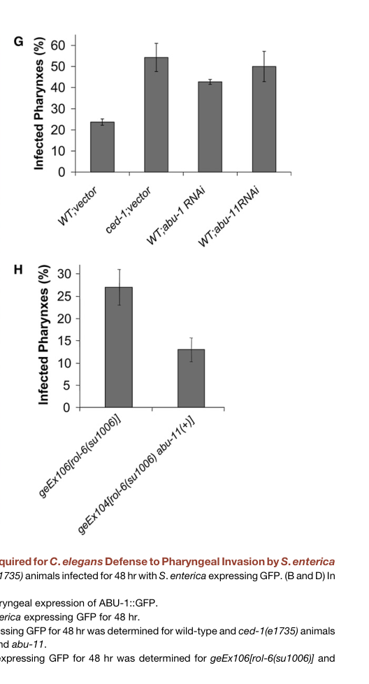

## Question

# Gene Research for Functional Annotation

## ⚠️ CRITICAL: Gene/Protein Identification Context

**BEFORE YOU BEGIN RESEARCH:** You MUST verify you are researching the CORRECT gene/protein. Gene symbols can be ambiguous, especially for less well-characterized genes from non-model organisms.

### Target Gene/Protein Identity (from UniProt):
- **UniProt Accession:** Q17400
- **Protein Description:** SubName: Full=Activated in Blocked Unfolded protein response {ECO:0000313|EMBL:CAA94867.1};
- **Gene Information:** Name=abu-1 {ECO:0000313|EMBL:CAA94867.1, ECO:0000313|WormBase:AC3.3}; ORFNames=AC3.3 {ECO:0000313|WormBase:AC3.3}, CELE_AC3.3 {ECO:0000313|EMBL:CAA94867.1};
- **Organism (full):** Caenorhabditis elegans.
- **Protein Family:** Not specified in UniProt
- **Key Domains:** Not specified in UniProt

### MANDATORY VERIFICATION STEPS:

1. **Check if the gene symbol "abu-1" matches the protein description above**
2. **Verify the organism is correct:** Caenorhabditis elegans.
3. **Check if protein family/domains align with what you find in literature**
4. **If you find literature for a DIFFERENT gene with the same or similar symbol, STOP**

### If Gene Symbol is Ambiguous or You Cannot Find Relevant Literature:

**DO NOT PROCEED WITH RESEARCH ON A DIFFERENT GENE.** Instead:
- State clearly: "The gene symbol 'abu-1' is ambiguous or literature is limited for this specific protein"
- Explain what you found (e.g., "Found extensive literature on a different gene with the same symbol in a different organism")
- Describe the protein based ONLY on the UniProt information provided above
- Suggest that the protein function can be inferred from domain/family information

### Research Target:

Please provide a comprehensive research report on the gene **abu-1** (gene ID: abu-1, UniProt: Q17400) in worm.

The research report should be a detailed narrative explaining the function, biological processes, and localization of the gene product. Citations should be given for all claims.

You should prioritize authoritative reviews and primary scientific literature when conducting research. You can supplement
this with annotations you find in gene/protein databases, but these can be outdated or inaccurate.

We are specifically interested in the primary function of the gene - for enzymes, what reaction is catalyzed, and what is the substrate specificity? For transporters, what is the substrate? For structural proteins or adapters, what is the broader structural role? For signaling molecules, what is the role in the pathway.

We are interested in where in or outside the cell the gene product carries out its function.

We are also interested in the signaling or biochemical pathways in which the gene functions. We are less interested in broad pleiotropic effects, except where these elucidate the precise role.

Include evidence where possible. We are interested in both experimental evidence as well as inference from structure, evolution, or bioinformatic analysis. Precise studies should be prioritized over high-throughput, where available.

## Output

Question: You are an expert researcher providing comprehensive, well-cited information.

Provide detailed information focusing on:
1. Key concepts and definitions with current understanding
2. Recent developments and latest research (prioritize 2023-2024 sources)
3. Current applications and real-world implementations
4. Expert opinions and analysis from authoritative sources
5. Relevant statistics and data from recent studies

Format as a comprehensive research report with proper citations. Include URLs and publication dates where available.
Always prioritize recent, authoritative sources and provide specific citations for all major claims.

# Gene Research for Functional Annotation

## ⚠️ CRITICAL: Gene/Protein Identification Context

**BEFORE YOU BEGIN RESEARCH:** You MUST verify you are researching the CORRECT gene/protein. Gene symbols can be ambiguous, especially for less well-characterized genes from non-model organisms.

### Target Gene/Protein Identity (from UniProt):
- **UniProt Accession:** Q17400
- **Protein Description:** SubName: Full=Activated in Blocked Unfolded protein response {ECO:0000313|EMBL:CAA94867.1};
- **Gene Information:** Name=abu-1 {ECO:0000313|EMBL:CAA94867.1, ECO:0000313|WormBase:AC3.3}; ORFNames=AC3.3 {ECO:0000313|WormBase:AC3.3}, CELE_AC3.3 {ECO:0000313|EMBL:CAA94867.1};
- **Organism (full):** Caenorhabditis elegans.
- **Protein Family:** Not specified in UniProt
- **Key Domains:** Not specified in UniProt

### MANDATORY VERIFICATION STEPS:

1. **Check if the gene symbol "abu-1" matches the protein description above**
2. **Verify the organism is correct:** Caenorhabditis elegans.
3. **Check if protein family/domains align with what you find in literature**
4. **If you find literature for a DIFFERENT gene with the same or similar symbol, STOP**

### If Gene Symbol is Ambiguous or You Cannot Find Relevant Literature:

**DO NOT PROCEED WITH RESEARCH ON A DIFFERENT GENE.** Instead:
- State clearly: "The gene symbol 'abu-1' is ambiguous or literature is limited for this specific protein"
- Explain what you found (e.g., "Found extensive literature on a different gene with the same symbol in a different organism")
- Describe the protein based ONLY on the UniProt information provided above
- Suggest that the protein function can be inferred from domain/family information

### Research Target:

Please provide a comprehensive research report on the gene **abu-1** (gene ID: abu-1, UniProt: Q17400) in worm.

The research report should be a detailed narrative explaining the function, biological processes, and localization of the gene product. Citations should be given for all claims.

You should prioritize authoritative reviews and primary scientific literature when conducting research. You can supplement
this with annotations you find in gene/protein databases, but these can be outdated or inaccurate.

We are specifically interested in the primary function of the gene - for enzymes, what reaction is catalyzed, and what is the substrate specificity? For transporters, what is the substrate? For structural proteins or adapters, what is the broader structural role? For signaling molecules, what is the role in the pathway.

We are interested in where in or outside the cell the gene product carries out its function.

We are also interested in the signaling or biochemical pathways in which the gene functions. We are less interested in broad pleiotropic effects, except where these elucidate the precise role.

Include evidence where possible. We are interested in both experimental evidence as well as inference from structure, evolution, or bioinformatic analysis. Precise studies should be prioritized over high-throughput, where available.

# Research Report: *Caenorhabditis elegans* **abu-1** (UniProt Q17400; ORF **AC3.3**) — Functional Annotation

## 1) Target verification (critical identity check)
The target gene **abu-1** in this report refers specifically to the *C. elegans* gene **abu-1**, also described in the primary literature as ORF **AC3.3** and encoding the protein **ABU-1** (“Activated in Blocked Unfolded protein response”). This identity matches the UniProt accession provided (**Q17400**) and the description “Activated in Blocked Unfolded protein response” (urano2002asurvivalpathway pages 2-4).

No evidence in the retrieved corpus indicates that the symbol **abu-1** is being used for a different gene/protein in another organism in a way that would confound interpretation here.

## 2) Key concepts and definitions (current understanding)

### 2.1 Canonical UPRER versus the ABU (activated-in-blocked-UPR) program
In *C. elegans*, the canonical endoplasmic reticulum unfolded protein response (**UPRER**) includes an **IRE-1 → XBP-1** signaling branch that transcriptionally induces many ER proteostasis genes during ER stress. Urano et al. discovered that when this canonical pathway is genetically blocked (e.g., **xbp-1** mutants), a distinct set of genes is induced by ER stress; these were termed **abu** genes (“activated in blocked UPR”), with **abu-1/AC3.3** used as a representative family member (urano2002asurvivalpathway pages 2-4).

### 2.2 ABU genes as an ER/endomembrane proteostasis module
ABU genes encode highly related membrane proteins proposed to help handle abnormal/misfolded ER client proteins when canonical UPR capacity is impaired; genetic evidence supports ABU proteins as a compensatory ER-protective system that becomes essential under UPR compromise (urano2002asurvivalpathway pages 1-2, urano2002asurvivalpathway pages 6-7).

## 3) Gene/protein features: structure, domains, and localization

### 3.1 Protein architecture (what is ABU-1?)
ABU-1 is described as a **type I single-pass membrane protein** family member, with an **N-terminal signal sequence**, a **luminal domain**, a **transmembrane segment**, and a short **C-terminal cytosolic tail** (urano2002asurvivalpathway pages 2-4).

In heterologous expression experiments, ABU-1 behaved as an **integral membrane protein** that remained in the pellet unless detergent-extracted; deletion of the predicted transmembrane region caused secretion, supporting that the transmembrane domain mediates membrane association/retention (urano2002asurvivalpathway pages 4-5).

### 3.2 Subcellular localization (where does ABU-1 act?)
A **ges-1::abu-1::gfp** fusion showed **punctate vesicular/endomembrane localization** in intestinal cells (with clustering near the apical surface), while mammalian-cell expression suggested ER retention and colocalization with an ER marker (ribophorin I), consistent with ABU-1 acting within the **endomembrane/ER system** rather than the plasma membrane (urano2002asurvivalpathway pages 4-5, urano2002asurvivalpathway pages 2-4).

A key caveat noted by Urano et al. is that the authors could not detect endogenous ABU-1 protein directly, so localization inferences are derived from tagged constructs/reporters (urano2002asurvivalpathway pages 4-5).

### 3.3 Basal expression pattern
Reporter analyses indicate strong basal **pharynx/head expression** from late larval stages to young adult, with low basal intestinal expression that becomes stress inducible (urano2002asurvivalpathway pages 5-6, urano2002asurvivalpathway pages 6-7).

## 4) Primary function and pathway placement

### 4.1 Primary functional interpretation
No enzymatic reaction, transporter substrate, or ligand-binding specificity has been established for ABU-1 in the retrieved evidence. Instead, the strongest data support ABU-1 as an **ER/endomembrane proteostasis factor** that protects cells/animals from ER stress, especially when canonical UPR signaling is defective (urano2002asurvivalpathway pages 1-2, urano2002asurvivalpathway pages 6-7).

### 4.2 Regulation by ER stress and “blocked UPR”
Urano et al. demonstrated that **abu-1** is preferentially induced by ER stress (tunicamycin) in **xbp-1 mutants** compared with wild type. Quantitatively, Table II reports **abu-1/AC3.3** tunicamycin induction (tunicamycin vs untreated; mean ± SEM, n=3) as base-2 log fold-change **1.45 ± 0.29 (xbp-1)** versus **0.16 ± 0.46 (N2)** (urano2002asurvivalpathway pages 2-4).

Chemical ER stressors (tunicamycin, cadmium) induce **abu-1::gfp** in the intestine, particularly in UPR-impaired backgrounds (urano2002asurvivalpathway pages 5-6, urano2002asurvivalpathway pages 4-5).

### 4.3 Genetic/phenotypic evidence for function in ER proteostasis
**Loss of ABU function triggers ER stress markers:** abu-1 RNAi induced the ER stress reporter **hsp-4::gfp** in the intestine, indicating that reducing ABU activity is sufficient to perturb ER proteostasis (urano2002asurvivalpathway pages 5-6, urano2002asurvivalpathway pages 6-7).

**Synthetic vulnerability when canonical UPR is compromised:** abu-1 RNAi caused approximately **50% lethality** in ER-stressed **ire-1** and **xbp-1** mutant animals, with comparatively minimal effects in wild type under the described conditions—supporting a model in which ABU proteins are partially redundant with the canonical UPR and become critical when UPR capacity is reduced (urano2002asurvivalpathway pages 1-2, urano2002asurvivalpathway pages 6-7).

**Interaction with ER-associated degradation (ERAD):** abu-1 inactivation enhanced perturbation of **sel-1** (an ERAD-related gene), consistent with partial functional redundancy or coordination between ABU-dependent proteostasis and ERAD pathways (urano2002asurvivalpathway pages 5-6).

## 5) Role in innate immunity and host defense (real-world experimental implementations)

### 5.1 CED-1-dependent immune defense in the pharynx
Haskins et al. (2008) connected pqn/abu genes—including **abu-1**—to innate immunity in *C. elegans*, particularly in **pharyngeal defense** against *Salmonella enterica*. They report that pqn/abu genes are strongly expressed in the pharynx (a barrier tissue) and that **ced-1 mutants** exhibit high levels of pharyngeal infection; by **48 hours**, **>50%** of ced-1 animals showed infected pharynges (haskins2008unfoldedproteinresponse pages 5-7).

The same work provides functional evidence that **ABU-1 contributes to resistance to live-pathogen challenge**: abu-1 RNAi increases *Salmonella* pharyngeal invasion, and ABU-1 overexpression can rescue the increased susceptibility of **ced-1(e1735)** mutants (haskins2008unfoldedproteinresponse pages 5-7, haskins2008unfoldedproteinresponse media 3a2e5c4e, haskins2008unfoldedproteinresponse media a5255cf7).

### 5.2 Neuronal control of peripheral immunity via non-canonical UPR genes
Sun et al. (2011) described a neuro-immune regulatory mechanism in which the neuronal GPCR **OCTR-1** suppresses peripheral innate immunity partly by down-regulating noncanonical UPR genes described as **pqn/abu**. In this model, the pqn/abu cohort sits at the interface of ER-stress/proteostasis gene regulation and innate immune outcomes, under neuronal control (sun2011neuronalgpcrcontrols pages 1-2).

## 6) Recent developments (prioritizing 2023–2024) and current research directions

### 6.1 2023: abu genes used as readouts of non-canonical ER stress/proteostasis states
Although 2023–2024 literature in the retrieved corpus contains limited **abu-1-specific mechanistic dissection**, a high-impact 2023 study on dietary restriction and lipid metabolism (ACS-20/FATP4) reports that **abu-family genes** are significantly upregulated in a context interpreted as ER proteostasis stress, and explicitly frames abu genes as endomembrane proteins induced when the canonical IRE-1–XBP-1 UPRER pathway is inactivated (Wang et al., 2023; published Nov 2023; https://doi.org/10.1038/s41467-023-43613-4). The study reports **138 upregulated genes** (fold change >2, adjusted p < 0.01) in the relevant comparison and validates abu-family induction by RT-qPCR (Fig. 3d) (wang2023acs20fatp4mediatesthe pages 3-6).

This indicates that, in modern *C. elegans* systems biology and stress-physiology work, **abu-family induction remains a practical marker** of perturbed ER proteostasis and/or noncanonical UPR-like responses (wang2023acs20fatp4mediatesthe pages 3-6).

### 6.2 Evidence gap (2024): paucity of direct abu-1 biochemical mechanism papers
Searches constrained to 2023–2024 did not yield additional accessible primary studies that directly define ABU-1 biochemical activity, binding partners, or high-resolution localization mechanisms beyond the foundational genetics and reporter work. Thus, the “latest research” component for **abu-1** is best represented by (i) continued use of **abu genes as pathway markers** in contemporary studies, and (ii) integration into broader ER proteostasis/innate immunity frameworks rather than abu-1-specific molecular mechanism expansions (wang2023acs20fatp4mediatesthe pages 3-6, sun2011neuronalgpcrcontrols pages 1-2).

## 7) Expert interpretation and synthesis (authoritative sources)

### 7.1 Mechanistic model supported by genetics
The most consistent model across primary studies is:
1) ABU-1 (and related ABU proteins) function within the **ER/endomembrane system**.
2) ABU activity contributes to **baseline ER proteostasis**; when reduced, ER stress signatures rise (hsp-4::gfp induction).
3) When canonical UPR signaling (IRE-1/XBP-1) is compromised, ABU activity becomes crucial for survival under ER stress (synthetic stress lethality) (urano2002asurvivalpathway pages 6-7, urano2002asurvivalpathway pages 1-2).

### 7.2 Integration with immunity
Independent evidence places pqn/abu genes into pathogen defense (CED-1-dependent pharyngeal immunity) and neuronal regulation (OCTR-1-dependent suppression), suggesting that a subset of immune protection in *C. elegans* depends on ER/endomembrane proteostasis capacity in barrier tissues (pharynx/intestine) (haskins2008unfoldedproteinresponse pages 5-7, sun2011neuronalgpcrcontrols pages 1-2).

## 8) Statistics and quantitative data highlights (from cited studies)
- **ER-stress induction (tunicamycin):** abu-1/AC3.3 base-2 log fold-change **1.45 ± 0.29** in **xbp-1** mutants vs **0.16 ± 0.46** in wild type (N2), n=3 (Urano et al., 2002; https://doi.org/10.1083/jcb.200203086) (urano2002asurvivalpathway pages 2-4).
- **Stress survival:** abu-1 RNAi caused ~**50% lethality** in ER-stressed **ire-1** and **xbp-1** mutants (Urano et al., 2002; https://doi.org/10.1083/jcb.200203086) (urano2002asurvivalpathway pages 1-2).
- **Infection phenotype:** in **ced-1** mutants, by **48 h** **>50%** of animals showed infected pharynges during *Salmonella* exposure (Haskins et al., 2008; https://doi.org/10.1016/j.devcel.2008.05.006) (haskins2008unfoldedproteinresponse pages 5-7).
- **2023 transcriptomics framing:** Wang et al. (2023) report **138 upregulated genes** (FC >2; adj. p < 0.01) in eat-2;acs-20 vs eat-2, with ERUPR GO enrichment and RT-qPCR validation of abu-family induction (https://doi.org/10.1038/s41467-023-43613-4) (wang2023acs20fatp4mediatesthe pages 3-6).

## 9) Applications and real-world implementations

### 9.1 Experimental usage as a pathway component and readout
Across *C. elegans* research, abu-1 and the abu family are used in:
- **Genetic interaction mapping** of ER proteostasis (e.g., with **ire-1/xbp-1** UPR components and **sel-1** ERAD components) (urano2002asurvivalpathway pages 5-6).
- **In vivo reporters** (abu-1::gfp; hsp-4::gfp) to separate canonical UPRER outputs from noncanonical/compensatory ER stress programs (urano2002asurvivalpathway pages 5-6, urano2002asurvivalpathway pages 6-7).
- **Host–pathogen infection assays** (e.g., *Salmonella* pharyngeal invasion) to connect ER/endomembrane proteostasis and immune barrier function (haskins2008unfoldedproteinresponse pages 5-7, haskins2008unfoldedproteinresponse media 3a2e5c4e).

### 9.2 Translational relevance (conceptual)
While ABU-1 itself is a nematode-specific family member, the broader conceptual application is that **ER proteostasis capacity and compensatory ER stress programs influence barrier immunity and survival under proteotoxic stress**—an idea often explored in higher organisms through analogous ER quality-control modules. In *C. elegans*, ABU genes provide a genetically tractable example of such compensation under canonical UPR compromise (urano2002asurvivalpathway pages 6-7, sun2011neuronalgpcrcontrols pages 1-2).

## Evidence summary table
The following table consolidates core claims, evidence types, quantitative values, experimental contexts, and source DOI URLs.

| Claim/Observation | Evidence type | Key quantitative data | Experimental context | Source (paper, year, DOI URL) |
|---|---|---|---|---|
| **Target identity verified:** **abu-1** corresponds to **AC3.3 / ABU-1** in *C. elegans* and is a representative member of the **ABU (Activated in Blocked UPR)** family | Gene/protein identification from primary paper and reporter studies | ABU family initially described as **9 highly related genes** with shared sequence identity sufficient for cross-targeting by RNAi in conserved 3' regions | *C. elegans* ER-stress genetics; abu-1 used as representative family member | Urano et al., 2002, *J Cell Biol*, https://doi.org/10.1083/jcb.200203086 (urano2002asurvivalpathway pages 2-4, urano2002asurvivalpathway pages 1-2) |
| **Protein architecture:** ABU-1 is a predicted **type I single-pass membrane protein** with **N-terminal signal peptide**, **luminal domain**, **one transmembrane segment**, and **short C-terminal cytosolic tail** | Sequence analysis; heterologous expression with TM-deletion test | TM deletion caused **secretion** of ABU-1, whereas full-length protein stayed membrane-associated and required detergent extraction | Structural/biochemical characterization in mammalian COS1 cells plus *C. elegans* sequence analysis | Urano et al., 2002, *J Cell Biol*, https://doi.org/10.1083/jcb.200203086 (urano2002asurvivalpathway pages 4-5, urano2002asurvivalpathway pages 2-4) |
| **Family relationship:** ABU proteins are related to the broader **pqn/prion-like Q/N-rich** family and are considered a non-canonical ER-stress/proteostasis module | Family-level review/microarray interpretation | ABU1–9 predicted TM proteins; ABU-10/11 predicted luminal in one later family analysis | ER stress/longevity literature synthesis in *C. elegans* | Viswanathan et al., 2005, *Dev Cell*, https://doi.org/10.1016/j.devcel.2005.09.017 (viswanathan2005arolefor pages 3-4) |
| **Subcellular localization:** ABU-1 localizes to the **endomembrane system/ER** rather than the plasma membrane | GFP fusion reporter; colocalization with ER marker; biochemical fractionation | ges-1::abu-1::gfp showed **punctate vesicular pattern** in intestine, tending to cluster near the **apical** surface; FLAG-ABU-1 colocalized with **ribophorin I** | Transgenic *C. elegans* intestine reporter and COS1 cell expression | Urano et al., 2002, *J Cell Biol*, https://doi.org/10.1083/jcb.200203086 (urano2002asurvivalpathway pages 4-5, urano2002asurvivalpathway pages 2-4) |
| **Basal expression pattern:** abu-1 is constitutively expressed in the **pharynx/head** and at low basal levels in intestine | Promoter/reporter assay | Strong pharyngeal/head expression from **L3–L4 to young adult**; low intestinal baseline that becomes stress inducible | abu-1::gfp reporter in living worms | Urano et al., 2002, *J Cell Biol*, https://doi.org/10.1083/jcb.200203086 (urano2002asurvivalpathway pages 5-6, urano2002asurvivalpathway pages 6-7) |
| **ER-stress regulation:** abu-1 is preferentially induced when the canonical **IRE-1/XBP-1 UPR** is blocked | Microarray; Northern blot; stress reporters | **abu-1/AC3.3 base-2 log fold induction** after tunicamycin: **1.45 ± 0.29 in xbp-1 mutants vs 0.16 ± 0.46 in N2** | Tunicamycin-treated worms comparing wild type and **xbp-1** mutants | Urano et al., 2002, *J Cell Biol*, https://doi.org/10.1083/jcb.200203086 (urano2002asurvivalpathway pages 2-4) |
| **Stress-inducible tissue response:** ER stress induces abu-1 expression in intestine | GFP reporter under chemical stress | abu-1::gfp induced by **tunicamycin** and **cadmium** in intestine, especially in **xbp-1** mutants | Chemical ER stress in transgenic worms | Urano et al., 2002, *J Cell Biol*, https://doi.org/10.1083/jcb.200203086 (urano2002asurvivalpathway pages 4-5, urano2002asurvivalpathway pages 5-6) |
| **Loss of abu-1 function causes ER stress:** ABU-1 normally helps maintain ER proteostasis | RNAi knockdown with ER-stress reporter | **abu-1(RNAi)** induced the ER stress reporter **hsp-4::gfp** in otherwise normal animals | Feeding RNAi in worms carrying hsp-4::gfp | Urano et al., 2002, *J Cell Biol*, https://doi.org/10.1083/jcb.200203086 (urano2002asurvivalpathway pages 1-2, urano2002asurvivalpathway pages 5-6, urano2002asurvivalpathway pages 6-7, urano2002asurvivalpathway pages 4-5) |
| **Functional placement:** ABU-1 protects animals specifically when the canonical UPR is impaired | RNAi + survival assay | abu-1(RNAi) killed about **50%** of ER-stressed **ire-1** and **xbp-1** mutant animals | ER stress induced in UPR-defective backgrounds | Urano et al., 2002, *J Cell Biol*, https://doi.org/10.1083/jcb.200203086 (urano2002asurvivalpathway pages 1-2) |
| **Genetic interaction with ERAD:** abu-1 acts partly redundantly with **sel-1** | Double perturbation genetics; phenotypic analysis | Combined **abu-1 RNAi + sel-1 inactivation** increased lethality and caused prominent dark intestinal granules/vesicles | ER quality-control stress in worms | Urano et al., 2002, *J Cell Biol*, https://doi.org/10.1083/jcb.200203086 (urano2002asurvivalpathway pages 5-6, urano2002asurvivalpathway pages 6-7) |
| **Recent pathway placement (2023):** abu-family genes remain markers/effectors of **non-canonical ER proteostasis stress** | RNA-seq/RT-qPCR in aging/dietary restriction study | In **eat-2; acs-20 vs eat-2**, **138 genes** were upregulated using **FC >2, adjusted p <0.01**; ERUPR was top GO term and **abu genes** were among validated induced transcripts | Dietary restriction/epidermal lipid metabolism perturbation linked to ER proteostasis | Wang et al., 2023, *Nat Commun*, https://doi.org/10.1038/s41467-023-43613-4 (wang2023acs20fatp4mediatesthe pages 3-6) |
| **Innate immunity role:** pqn/abu genes, including **abu-1**, act in a **CED-1-dependent** host-defense pathway | Genetics, overexpression, RNAi, infection assays | In **ced-1** mutants, by **48 h** more than **50%** of animals showed infected pharynges; abu-1 overexpression rescued susceptibility to live *Salmonella* | *S. enterica* infection; pharyngeal invasion and survival assays | Haskins et al., 2008, *Dev Cell*, https://doi.org/10.1016/j.devcel.2008.05.006 (haskins2008unfoldedproteinresponse pages 5-7, haskins2008unfoldedproteinresponse media 3a2e5c4e, haskins2008unfoldedproteinresponse media a5255cf7) |
| **abu-1 is functionally protective in infection:** reducing abu-1 increases pathogen invasion; increasing ABU-1 improves defense | RNAi knockdown and transgenic overexpression | Figure-based evidence shows **abu-1 RNAi increased Salmonella pharyngeal invasion**; **ABU-1 overexpression** rescued **ced-1(e1735)** susceptibility | Live bacterial infection, confocal and survival assays | Haskins et al., 2008, *Dev Cell*, https://doi.org/10.1016/j.devcel.2008.05.006 (haskins2008unfoldedproteinresponse pages 5-7, haskins2008unfoldedproteinresponse media 3a2e5c4e, haskins2008unfoldedproteinresponse media a5255cf7) |
| **Neuronal immune regulation:** noncanonical **pqn/abu** genes are negatively regulated by neuronal **OCTR-1** signaling | Genetic analysis; genome-wide expression profiling | octr-1 mutants showed enhanced resistance to *P. aeruginosa* and increased expression of noncanonical UPR/immune genes including pqn/abu cohort (gene-set level rather than abu-1-specific value in excerpt) | Sensory-neuron control of peripheral immunity | Sun et al., 2011, *Science*, https://doi.org/10.1126/science.1203411 (sun2011neuronalgpcrcontrols pages 1-2) |
| **Current best functional interpretation:** ABU-1 is not an enzyme or transporter with known substrate; instead it is best supported as an **ER/endomembrane membrane protein involved in proteostasis quality control**, especially under **blocked canonical UPR** and during **infection-associated stress** | Synthesis of localization, induction, and genetic interaction evidence | No catalytic activity or transported substrate demonstrated; strongest evidence is from localization, reporter induction, synthetic sickness/lethality, and infection phenotypes | Integrative conclusion from primary studies | Supported collectively by Urano et al., 2002; Haskins et al., 2008; Sun et al., 2011; Wang et al., 2023 (urano2002asurvivalpathway pages 1-2, haskins2008unfoldedproteinresponse pages 5-7, sun2011neuronalgpcrcontrols pages 1-2, wang2023acs20fatp4mediatesthe pages 3-6) |

*Table: This table compiles the strongest primary evidence for the identity, structure, localization, stress regulation, genetic interactions, and immunity-related roles of C. elegans ABU-1/AC3.3. It is designed to support a precise functional annotation centered on ER/endoplasmic membrane proteostasis rather than an enzymatic or transporter activity.*

## Key figure evidence (immunity)
Cropped figure panels from Haskins et al. (2008) directly show *Salmonella* pharyngeal invasion and survival outcomes for **abu-1/abu-11 RNAi** and **ABU overexpression/rescue**, supporting ABU-1’s role in host defense (haskins2008unfoldedproteinresponse media 3a2e5c4e, haskins2008unfoldedproteinresponse media a5255cf7).

## References (publication date and URL)
- Urano F. et al. **Aug 2002**. *J Cell Biol.* “A survival pathway for *C. elegans* with a blocked unfolded protein response.” https://doi.org/10.1083/jcb.200203086 (urano2002asurvivalpathway pages 2-4)
- Haskins K.A. et al. **Jul 2008**. *Dev Cell.* “Unfolded protein response genes regulated by CED-1 are required for *C. elegans* innate immunity.” https://doi.org/10.1016/j.devcel.2008.05.006 (haskins2008unfoldedproteinresponse pages 5-7)
- Sun J. et al. **May 2011**. *Science.* “Neuronal GPCR controls innate immunity by regulating noncanonical unfolded protein response genes.” https://doi.org/10.1126/science.1203411 (sun2011neuronalgpcrcontrols pages 1-2)
- Wang Z. et al. **Nov 2023**. *Nat Commun.* “ACS-20/FATP4 mediates the anti-ageing effect of dietary restriction in *C. elegans*.” https://doi.org/10.1038/s41467-023-43613-4 (wang2023acs20fatp4mediatesthe pages 3-6)

References

1. (urano2002asurvivalpathway pages 2-4): Fumihiko Urano, Marcella Calfon, Takunari Yoneda, Chi Yun, Moni Kiraly, Scott G. Clark, and David Ron. A survival pathway for caenorhabditis elegans with a blocked unfolded protein response. The Journal of Cell Biology, 158:639-646, Aug 2002. URL: https://doi.org/10.1083/jcb.200203086, doi:10.1083/jcb.200203086. This article has 274 citations.

2. (urano2002asurvivalpathway pages 1-2): Fumihiko Urano, Marcella Calfon, Takunari Yoneda, Chi Yun, Moni Kiraly, Scott G. Clark, and David Ron. A survival pathway for caenorhabditis elegans with a blocked unfolded protein response. The Journal of Cell Biology, 158:639-646, Aug 2002. URL: https://doi.org/10.1083/jcb.200203086, doi:10.1083/jcb.200203086. This article has 274 citations.

3. (urano2002asurvivalpathway pages 6-7): Fumihiko Urano, Marcella Calfon, Takunari Yoneda, Chi Yun, Moni Kiraly, Scott G. Clark, and David Ron. A survival pathway for caenorhabditis elegans with a blocked unfolded protein response. The Journal of Cell Biology, 158:639-646, Aug 2002. URL: https://doi.org/10.1083/jcb.200203086, doi:10.1083/jcb.200203086. This article has 274 citations.

4. (urano2002asurvivalpathway pages 4-5): Fumihiko Urano, Marcella Calfon, Takunari Yoneda, Chi Yun, Moni Kiraly, Scott G. Clark, and David Ron. A survival pathway for caenorhabditis elegans with a blocked unfolded protein response. The Journal of Cell Biology, 158:639-646, Aug 2002. URL: https://doi.org/10.1083/jcb.200203086, doi:10.1083/jcb.200203086. This article has 274 citations.

5. (urano2002asurvivalpathway pages 5-6): Fumihiko Urano, Marcella Calfon, Takunari Yoneda, Chi Yun, Moni Kiraly, Scott G. Clark, and David Ron. A survival pathway for caenorhabditis elegans with a blocked unfolded protein response. The Journal of Cell Biology, 158:639-646, Aug 2002. URL: https://doi.org/10.1083/jcb.200203086, doi:10.1083/jcb.200203086. This article has 274 citations.

6. (haskins2008unfoldedproteinresponse pages 5-7): Kylie A. Haskins, Jonathan F. Russell, Nathan Gaddis, Holly K. Dressman, and Alejandro Aballay. Unfolded protein response genes regulated by ced-1 are required for caenorhabditis elegans innate immunity. Developmental cell, 15 1:87-97, Jul 2008. URL: https://doi.org/10.1016/j.devcel.2008.05.006, doi:10.1016/j.devcel.2008.05.006. This article has 123 citations and is from a highest quality peer-reviewed journal.

7. (haskins2008unfoldedproteinresponse media 3a2e5c4e): Kylie A. Haskins, Jonathan F. Russell, Nathan Gaddis, Holly K. Dressman, and Alejandro Aballay. Unfolded protein response genes regulated by ced-1 are required for caenorhabditis elegans innate immunity. Developmental cell, 15 1:87-97, Jul 2008. URL: https://doi.org/10.1016/j.devcel.2008.05.006, doi:10.1016/j.devcel.2008.05.006. This article has 123 citations and is from a highest quality peer-reviewed journal.

8. (haskins2008unfoldedproteinresponse media a5255cf7): Kylie A. Haskins, Jonathan F. Russell, Nathan Gaddis, Holly K. Dressman, and Alejandro Aballay. Unfolded protein response genes regulated by ced-1 are required for caenorhabditis elegans innate immunity. Developmental cell, 15 1:87-97, Jul 2008. URL: https://doi.org/10.1016/j.devcel.2008.05.006, doi:10.1016/j.devcel.2008.05.006. This article has 123 citations and is from a highest quality peer-reviewed journal.

9. (sun2011neuronalgpcrcontrols pages 1-2): Jingru Sun, Varsha Singh, Rie Kajino-Sakamoto, and Alejandro Aballay. Neuronal gpcr controls innate immunity by regulating noncanonical unfolded protein response genes. Science, 332:729-732, May 2011. URL: https://doi.org/10.1126/science.1203411, doi:10.1126/science.1203411. This article has 299 citations and is from a highest quality peer-reviewed journal.

10. (wang2023acs20fatp4mediatesthe pages 3-6): Zi Wang, Lina Zou, Yiyan Zhang, Mengnan Zhu, Shuxian Zhang, Di Wu, Jianfeng Lan, Xiao Zang, Qi Wang, Hanxin Zhang, Zixing Wu, Huanhu Zhu, and Di Chen. Acs-20/fatp4 mediates the anti-ageing effect of dietary restriction in c. elegans. Nature Communications, Nov 2023. URL: https://doi.org/10.1038/s41467-023-43613-4, doi:10.1038/s41467-023-43613-4. This article has 17 citations and is from a highest quality peer-reviewed journal.

11. (viswanathan2005arolefor pages 3-4): Mohan Viswanathan, Stuart K. Kim, Ala Berdichevsky, and Leonard Guarente. A role for sir-2.1 regulation of er stress response genes in determining c. elegans life span. Developmental cell, 9 5:605-15, Nov 2005. URL: https://doi.org/10.1016/j.devcel.2005.09.017, doi:10.1016/j.devcel.2005.09.017. This article has 550 citations and is from a highest quality peer-reviewed journal.

## Artifacts

- [Edison artifact artifact-00](abu-1-deep-research-falcon_artifacts/artifact-00.md)

## Citations

1. urano2002asurvivalpathway pages 2-4
2. urano2002asurvivalpathway pages 4-5
3. urano2002asurvivalpathway pages 5-6
4. haskins2008unfoldedproteinresponse pages 5-7
5. sun2011neuronalgpcrcontrols pages 1-2
6. urano2002asurvivalpathway pages 1-2
7. viswanathan2005arolefor pages 3-4
8. urano2002asurvivalpathway pages 6-7
9. https://doi.org/10.1038/s41467-023-43613-4
10. https://doi.org/10.1083/jcb.200203086
11. https://doi.org/10.1016/j.devcel.2008.05.006
12. https://doi.org/10.1016/j.devcel.2005.09.017
13. https://doi.org/10.1126/science.1203411
14. https://doi.org/10.1083/jcb.200203086,
15. https://doi.org/10.1016/j.devcel.2008.05.006,
16. https://doi.org/10.1126/science.1203411,
17. https://doi.org/10.1038/s41467-023-43613-4,
18. https://doi.org/10.1016/j.devcel.2005.09.017,