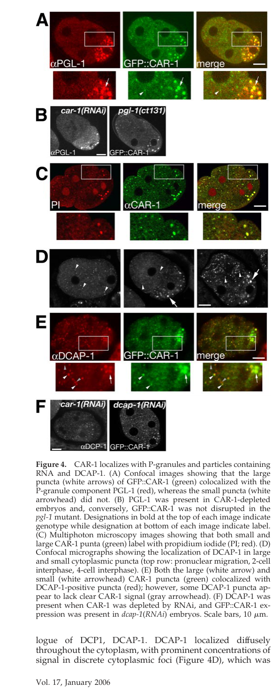

## Question

# Gene Research for Functional Annotation

## ⚠️ CRITICAL: Gene/Protein Identification Context

**BEFORE YOU BEGIN RESEARCH:** You MUST verify you are researching the CORRECT gene/protein. Gene symbols can be ambiguous, especially for less well-characterized genes from non-model organisms.

### Target Gene/Protein Identity (from UniProt):
- **UniProt Accession:** Q9XW17
- **Protein Description:** RecName: Full=Protein LSM14 homolog car-1 {ECO:0000303|PubMed:29510985}; AltName: Full=Cytokinesis, apoptosis, RNA-associated protein car-1 {ECO:0000312|WormBase:Y18D10A.17};
- **Gene Information:** Name=car-1 {ECO:0000312|WormBase:Y18D10A.17}; ORFNames=Y18D10A.17 {ECO:0000312|WormBase:Y18D10A.17};
- **Organism (full):** Caenorhabditis elegans.
- **Protein Family:** Belongs to the LSM14 family. .
- **Key Domains:** DFDF. (IPR025762); FDF_dom. (IPR019050); FFD_box. (IPR025761); Lsm14-like_N. (IPR025609); LSM_dom_sf. (IPR010920)

### MANDATORY VERIFICATION STEPS:

1. **Check if the gene symbol "car-1" matches the protein description above**
2. **Verify the organism is correct:** Caenorhabditis elegans.
3. **Check if protein family/domains align with what you find in literature**
4. **If you find literature for a DIFFERENT gene with the same or similar symbol, STOP**

### If Gene Symbol is Ambiguous or You Cannot Find Relevant Literature:

**DO NOT PROCEED WITH RESEARCH ON A DIFFERENT GENE.** Instead:
- State clearly: "The gene symbol 'car-1' is ambiguous or literature is limited for this specific protein"
- Explain what you found (e.g., "Found extensive literature on a different gene with the same symbol in a different organism")
- Describe the protein based ONLY on the UniProt information provided above
- Suggest that the protein function can be inferred from domain/family information

### Research Target:

Please provide a comprehensive research report on the gene **car-1** (gene ID: car-1, UniProt: Q9XW17) in worm.

The research report should be a detailed narrative explaining the function, biological processes, and localization of the gene product. Citations should be given for all claims.

You should prioritize authoritative reviews and primary scientific literature when conducting research. You can supplement
this with annotations you find in gene/protein databases, but these can be outdated or inaccurate.

We are specifically interested in the primary function of the gene - for enzymes, what reaction is catalyzed, and what is the substrate specificity? For transporters, what is the substrate? For structural proteins or adapters, what is the broader structural role? For signaling molecules, what is the role in the pathway.

We are interested in where in or outside the cell the gene product carries out its function.

We are also interested in the signaling or biochemical pathways in which the gene functions. We are less interested in broad pleiotropic effects, except where these elucidate the precise role.

Include evidence where possible. We are interested in both experimental evidence as well as inference from structure, evolution, or bioinformatic analysis. Precise studies should be prioritized over high-throughput, where available.

## Output

Question: You are an expert researcher providing comprehensive, well-cited information.

Provide detailed information focusing on:
1. Key concepts and definitions with current understanding
2. Recent developments and latest research (prioritize 2023-2024 sources)
3. Current applications and real-world implementations
4. Expert opinions and analysis from authoritative sources
5. Relevant statistics and data from recent studies

Format as a comprehensive research report with proper citations. Include URLs and publication dates where available.
Always prioritize recent, authoritative sources and provide specific citations for all major claims.

# Gene Research for Functional Annotation

## ⚠️ CRITICAL: Gene/Protein Identification Context

**BEFORE YOU BEGIN RESEARCH:** You MUST verify you are researching the CORRECT gene/protein. Gene symbols can be ambiguous, especially for less well-characterized genes from non-model organisms.

### Target Gene/Protein Identity (from UniProt):
- **UniProt Accession:** Q9XW17
- **Protein Description:** RecName: Full=Protein LSM14 homolog car-1 {ECO:0000303|PubMed:29510985}; AltName: Full=Cytokinesis, apoptosis, RNA-associated protein car-1 {ECO:0000312|WormBase:Y18D10A.17};
- **Gene Information:** Name=car-1 {ECO:0000312|WormBase:Y18D10A.17}; ORFNames=Y18D10A.17 {ECO:0000312|WormBase:Y18D10A.17};
- **Organism (full):** Caenorhabditis elegans.
- **Protein Family:** Belongs to the LSM14 family. .
- **Key Domains:** DFDF. (IPR025762); FDF_dom. (IPR019050); FFD_box. (IPR025761); Lsm14-like_N. (IPR025609); LSM_dom_sf. (IPR010920)

### MANDATORY VERIFICATION STEPS:

1. **Check if the gene symbol "car-1" matches the protein description above**
2. **Verify the organism is correct:** Caenorhabditis elegans.
3. **Check if protein family/domains align with what you find in literature**
4. **If you find literature for a DIFFERENT gene with the same or similar symbol, STOP**

### If Gene Symbol is Ambiguous or You Cannot Find Relevant Literature:

**DO NOT PROCEED WITH RESEARCH ON A DIFFERENT GENE.** Instead:
- State clearly: "The gene symbol 'car-1' is ambiguous or literature is limited for this specific protein"
- Explain what you found (e.g., "Found extensive literature on a different gene with the same symbol in a different organism")
- Describe the protein based ONLY on the UniProt information provided above
- Suggest that the protein function can be inferred from domain/family information

### Research Target:

Please provide a comprehensive research report on the gene **car-1** (gene ID: car-1, UniProt: Q9XW17) in worm.

The research report should be a detailed narrative explaining the function, biological processes, and localization of the gene product. Citations should be given for all claims.

You should prioritize authoritative reviews and primary scientific literature when conducting research. You can supplement
this with annotations you find in gene/protein databases, but these can be outdated or inaccurate.

We are specifically interested in the primary function of the gene - for enzymes, what reaction is catalyzed, and what is the substrate specificity? For transporters, what is the substrate? For structural proteins or adapters, what is the broader structural role? For signaling molecules, what is the role in the pathway.

We are interested in where in or outside the cell the gene product carries out its function.

We are also interested in the signaling or biochemical pathways in which the gene functions. We are less interested in broad pleiotropic effects, except where these elucidate the precise role.

Include evidence where possible. We are interested in both experimental evidence as well as inference from structure, evolution, or bioinformatic analysis. Precise studies should be prioritized over high-throughput, where available.

## Research Report: Functional Annotation of *C. elegans* **car-1** (UniProt Q9XW17; ORF Y18D10A.17)

### Executive summary
*car-1* encodes a conserved LSM14/Scd6/Rap55-family RNA-binding protein that partitions into cytoplasmic ribonucleoprotein (RNP) condensates (P-bodies/P-body-like foci and germ granules) and coordinates post-transcriptional control of specific mRNAs. Rather than catalyzing a biochemical reaction, CAR-1 acts as an adaptor/scaffold that (i) promotes translational repression and mRNP granule association, (ii) interfaces with mRNA decapping/decay factors in a context-dependent manner, and (iii) couples RNA regulation to membrane/ER organization and developmental programs including embryonic cytokinesis, oogenesis, neuronal axon regeneration, and germline small-RNA inheritance. Foundational cell-biological evidence established CAR-1 colocalization with the decapping cofactor DCAP-1 and requirements for cytokinesis and ER organization in embryos, while recent work (2023–2024) positions CAR-1 as a key organizer at the P-body–germ-granule interface in piRNA-dependent transgenerational silencing and as a regulated target/participant of embryonic mRNA clearance pathways that specialize decapping condensates. (squirrell2006car1aprotein pages 1-2, decker2006car1andtrailer pages 3-4, du2023condensatecooperativityunderlies pages 5-6, vidya2024edc3andedc4 pages 9-12, vidya2024edc3andedc4 pages 5-9)

### Gene/protein identity verification (mandatory)
Multiple independent sources explicitly match the requested target: **C. elegans** CAR-1 is a member of the **LSM14/Scd6/Rap55** family of Sm-like RNA-binding proteins. Squirrell et al. reported a predicted ~340-aa glycine-rich protein with clustered **RGG motifs (RGG box)** and clear homologs (Xenopus RAP55, yeast Scd6p/Lsm13p, Drosophila Trailer Hitch), consistent with UniProt Q9XW17 family assignment. (squirrell2006car1aprotein pages 1-2) Decker & Parker classified CAR-1 as the *C. elegans* **Scd6 ortholog**, noting an N-terminal Lsm domain (family feature) and **poly(U) binding** by the RGG region. (decker2006car1andtrailer pages 2-3, decker2006car1andtrailer pages 1-2) Later work explicitly referred to CAR-1 as **CAR-1/LSM14**. (tang2020themrnadecay pages 1-3, vidya2024edc3andedc4 pages 1-5)

### 1) Key concepts and definitions (current understanding)

#### 1.1 LSM14/Scd6/Rap55 proteins (CAR-1)
LSM14-family proteins are conserved RNA-associated factors enriched in cytoplasmic mRNP granules. Mechanistically, they are frequently discussed as components of translation repression complexes and P-bodies, with conserved low-complexity/RGG regions enabling RNA binding and assembly into higher-order RNPs. (decker2006car1andtrailer pages 2-3, decker2006car1andtrailer pages 1-2)

#### 1.2 Processing bodies (P-bodies) and germ granules
P-bodies are cytoplasmic condensates enriched in translationally repressed mRNAs and factors for mRNA turnover (decapping and 5′→3′ decay). A key expert framing is that P-bodies can act as sites where mRNAs are held in a repressed state and later returned to translation or routed to decay, and that granule aggregation may support mRNA transport and maintenance of translational repression. (decker2006car1andtrailer pages 1-2, decker2006car1andtrailer pages 4-4)
In *C. elegans*, CAR-1 localizes both to **P granules (germ granules)** and to **DCAP-1-positive cytoplasmic foci** interpreted as P-body-like structures. (squirrell2006car1aprotein pages 6-7)

#### 1.3 Condensate “specialization” and inter-condensate coupling
Recent *C. elegans* work emphasizes that multiple condensate types (P-bodies, germ granules, stress granules) can coexist and interact, and that developmentally regulated clearance of mRNAs encoding condensate scaffolds helps shape condensate composition across embryogenesis. (vidya2024edc3andedc4 pages 1-5, vidya2024edc3andedc4 pages 19-23)

### 2) Functional annotation: molecular function, localization, and pathways

#### 2.1 Molecular function (what CAR-1 does)
CAR-1 is not an enzyme; it is best annotated as an **RNA-binding mRNP assembly/adaptor protein** that promotes **translational repression** and can channel mRNAs toward, or away from, decapping/decay depending on developmental context.

**Direct/functional evidence for RNA-binding and repression:** CAR-1’s RGG region binds poly(U) in vitro, supporting direct RNA-binding capacity. (decker2006car1andtrailer pages 1-2) In the germline/oogenesis, CAR-1 promotes PUF-dependent repression of the Notch-like receptor mRNA **glp-1**, and car-1 depletion elevates GLP-1 protein while glp-1 mRNA levels remain similar, consistent with primary control at the translation level. (noble2008maternalmrnasare pages 8-9)

**Context-dependent relationship to decapping/decay:** CAR-1 colocalizes with decapping machinery and can be described as an mRNA decay-associated factor in neurons; in other settings CAR-1 participates in complexes that repress translation and can *prevent* decapping/decay. (tang2020themrnadecay pages 3-4, vidya2024edc3andedc4 pages 1-5)

#### 2.2 Subcellular localization (where CAR-1 acts)
CAR-1 localizes broadly in cytoplasm but concentrates in at least two granule populations: (i) **PGL-1-positive P granules** and (ii) smaller **DCAP-1-positive cytoplasmic foci**; figure evidence from Squirrell et al. captures CAR-1 colocalization with both PGL-1 and DCAP-1. (squirrell2006car1aprotein pages 6-7, squirrell2006car1aprotein media 35d21d13)
CAR-1 is also functionally coupled to the **endoplasmic reticulum (ER)** in embryos, where depletion disrupts ER reticulation and spindle/midzone-associated ER, consistent with an ER-linked mRNP/granule function. (decker2006car1andtrailer pages 3-4)
In neurons, CAR-1 forms cytoplasmic puncta in cell bodies that fully colocalize with CGH-1/DDX6 and partially with DCAP-1, suggesting heterogeneous CAR-1 granules with variable decapping factor content. (tang2020themrnadecay pages 3-4)

#### 2.3 Biological processes and pathways

**Embryogenesis: cytokinesis and ER organization.** CAR-1 is required for late cytokinesis/scission; depletion causes cleavage furrows to ingress then regress and disrupts membrane accumulation and spindle midzone organization, accompanied by ER morphology defects. (squirrell2006car1aprotein pages 1-2, decker2006car1andtrailer pages 3-4, squirrell2006car1aprotein media cc00f993)

**Germline/oogenesis: maternal mRNA control.** CAR-1 contributes to stage-specific translational repression of maternal mRNAs, including **glp-1**, and genetically interacts with PUF proteins, supporting a model where CAR-1 acts with sequence-specific RBPs to enforce developmental timing of translation. (noble2008maternalmrnasare pages 7-8, noble2008maternalmrnasare pages 8-9)

**Neurons: axon regeneration via mitochondrial Ca2+ regulation.** Tang et al. describe CAR-1/LSM14 as a translational repressor/mRNA decay factor that represses neuronal **micu-1**, thereby modulating mitochondrial Ca2+ uptake dynamics after axotomy and acting as a cell-intrinsic inhibitor of PLM axon regrowth. (tang2020themrnadecay pages 1-3, tang2020themrnadecay pages 3-4)

**Germline inheritance: piRNA-dependent transgenerational silencing.** Du et al. (2023) identify CAR-1 as a P-body component required for proper CGH-1/DDX6 perinuclear condensates and for robust interaction of CGH-1 with piRNA pathway factors (e.g., PRG-1, WAGO-1); car-1 RNAi disperses CGH-1 and reduces these interactions, impairing piRNA reporter silencing readouts. (du2023condensatecooperativityunderlies pages 5-6, du2023condensatecooperativityunderlies pages 24-29)

### 3) Recent developments and latest research (prioritizing 2023–2024)

#### 3.1 2023: condensate cooperativity in transgenerational gene silencing
A central 2023 advance is that CAR-1 is implicated in organizing **condensate–condensate interactions** at the cytoplasmic face of perinuclear germ granules: CAR-1 promotes CGH-1 perinuclear localization/condensate formation, and CAR-1 depletion reduces CGH-1 binding to PRG-1 and WAGO-1 and perturbs perinuclear localization of PRG-1/WAGO-4, linking CAR-1 to piRNA pathway architecture. (du2023condensatecooperativityunderlies pages 5-6, du2023condensatecooperativityunderlies pages 24-29)

#### 3.2 2024: embryonic mRNA clearance and P-body specialization (EDC-3/EDC-4)
Vidya et al. (bioRxiv, 2024-03-04) report that decapping scaffolds EDC-3 and EDC-4 shape DCAP-2 condensates in embryos and promote timed clearance of mRNAs including **car-1**. (vidya2024edc3andedc4 pages 1-5, vidya2024edc3andedc4 pages 19-23)
Quantitatively, the authors show the DCAP-2 interactome changes markedly in *edc-3(0);edc-4(0)* embryos, with increased association to IFET-1, CAR-1, and CGH-1, and that car-1 RNAi (64% knockdown) in this background reduces DCAP-2 foci 2–4.5-fold, supporting a scaffold role for CAR-1 in alternative condensate frameworks when canonical scaffolds are absent. (vidya2024edc3andedc4 pages 9-12)

#### 3.3 2024: oogenesis—ER morphology, phase transitions, and translational repression
Elaswad et al. (MBoC, 2024-10) identify CCT chaperonin and actin as inhibitors of ectopic RNA-binding protein condensation during oogenesis and connect ER sheet expansion to induction of condensates containing CAR-1. (elaswad2024thecctchaperonin pages 1-2, elaswad2024thecctchaperonin pages 11-13) They further link ectopic condensation of regulators including CAR-1 to translational derepression of a maternal mRNA readout (spn-4), with quantitative imaging of SPN-4::GFP increases upon cct-2 depletion. (elaswad2024thecctchaperonin pages 10-11)

### 4) Current applications and real-world implementations

#### 4.1 CAR-1 as an experimental handle for mRNP granule biology in vivo
CAR-1’s robust granule localization across germline, embryo, and neurons makes it a practical marker and perturbation target to study: (i) condensate material properties and stress responses, (ii) coupling between RNA regulation and organelle organization (ER), and (iii) inter-condensate organization supporting small-RNA inheritance. Imaging work operationalized CAR-1 “condensation” by cortex granule counts, showing time-dependent increases under imaging stress (40% condensed at 11–20 min; 60–100% after >30 min), highlighting methodological implications for live imaging of condensates. (elaswad2022imagingassociatedstresscauses pages 7-8)

#### 4.2 Translational relevance via conserved LSM14-family biology
The CAR-1 family is conserved (LSM14A/LSM14B in mammals), and expert framing posits Scd6/LSM14 proteins as conserved integrators of translational repression and mRNA storage/decay in P-bodies, sometimes associated with ER-linked local translation. (decker2006car1andtrailer pages 1-2, decker2006car1andtrailer pages 4-4)
In disease-relevant cell biology, a 2024 Nature Cell Biology paper isolated **LSM14A-GFP+ P-bodies** from leukemia cell lysates by particle sorting and performed RNA-seq, providing a real-world example where LSM14-family proteins enable biochemical purification of P-bodies to define disease-associated RNA sequestration programs. (squirrell2006car1aprotein media 35d21d13)

### 5) Expert opinions and analysis
A widely cited expert perspective is that aggregation of mRNPs into granules can facilitate mRNA transport and help maintain translational repression, and that P-bodies are dynamic sites where mRNAs can be stored for reactivation or routed to decay. This conceptual framework supports interpreting CAR-1 phenotypes (translation control, developmental timing, and context-dependent links to decapping) through a granule-centric model rather than a single linear decay pathway. (decker2006car1andtrailer pages 1-2)

### 6) Quantitative statistics and data highlights
Key quantitative findings supporting functional annotation include:

* **Embryogenesis/oogenesis genetic interaction penetrance:** In combined *car-1; puf-5* perturbations, high penetrance defects were reported (e.g., small oocytes 86% (n=36), yolk accumulation 84% (n=37), eggshell defects 90% (n=49), cytokinesis defects 98% (n=203)). (noble2008maternalmrnasare pages 7-8)
* **Neuronal regeneration statistics:** CAR-1 loss enhances PLM axon regrowth with statistical significance (tests include Fisher’s exact and ANOVA; p-values reported as **p<0.01/***p<0.001; n on the order of ≥100). (tang2020themrnadecay pages 3-4)
* **Embryonic P-body formation and CAR-1 scaffold contribution:** Wild-type embryos reach ~250 DCAP-2 foci at 4–6-cell and up to ~1,000 by ~100-cell; in *edc-3(0);edc-4(0)* embryos, DCAP-2 association with CAR-1 increases (~2.0-fold), and car-1 RNAi reduces DCAP-2 foci 2–4.5-fold in that background. (vidya2024edc3andedc4 pages 5-9, vidya2024edc3andedc4 pages 9-12)
* **Stress/condensation frequency:** CAR-1 condensation under imaging-associated stress was observed in 40% of worms by 11–20 min and 60–100% beyond 30 min. (elaswad2022imagingassociatedstresscauses pages 7-8)
* **Longevity/proteostasis via SUMOylation switch:** CAR-1 is SUMOylated and IIS reduction lowers SUMOylated CAR-1 (~3-fold by MS); car-1 loss shortened lifespan (14.81±0.41 d vs 17.56±0.52 d), while SUMOylation-resistant CAR-1 K185R extended lifespan (22.51±0.60 d vs 14.70±0.59 d; ~53% increase; p<0.001). (moll2018theinsulinigfsignaling pages 2-3, moll2018theinsulinigfsignaling pages 6-8, moll2018theinsulinigfsignaling pages 3-6)

### Evidence summary table
| Aspect | Key findings (1-3 bullets) | Evidence | URL/DOI | Pub date |
|---|---|---|---|---|
| identity/domains | • **car-1** in **C. elegans** encodes an **LSM14/Rap55/Scd6-family** Sm-like RNA-binding protein.  • Protein features reported in primary literature include a **glycine-rich C-terminus with clustered RGG motifs/RGG box**; review literature notes **N-terminal Lsm domain** and RNA binding/poly(U) binding, consistent with UniProt family/domain assignment.  • Homology links CAR-1 to **RAP55, Trailer Hitch, Scd6** family proteins. | **Squirrell 2006** showed CAR-1 is a predicted 340-aa protein with clustered RGG motifs and homologs including RAP55, Scd6p/Lsm13p and Trailer Hitch; **Decker & Parker 2006** classified CAR-1 as a Scd6-family/Lsm protein with RNA-binding properties; **Tang 2020** explicitly identified CAR-1 as **CAR-1/LSM14**; **Vidya 2024** listed CAR-1 as **LSm14** (squirrell2006car1aprotein pages 1-2, decker2006car1andtrailer pages 2-3, tang2020themrnadecay pages 1-3, vidya2024edc3andedc4 pages 1-5). | https://doi.org/10.1091/mbc.e05-09-0874; https://doi.org/10.1083/jcb.200601153; https://doi.org/10.1016/j.cub.2019.12.061; https://doi.org/10.1101/2024.03.04.583404 | Jan 2006; Apr 2006; Mar 2020; Mar 2024 |
| molecular function | • Functions primarily as an **RNA-associated translational repressor / mRNP assembly factor** rather than an enzyme.  • Acts with **CGH-1/DDX6** and can interface with **mRNA decapping machinery** (**DCAP-1/DCAP-2**), with context-dependent roles in either repressing translation and protecting mRNAs or promoting entry into decay pathways.  • Regulates specific targets, including **glp-1 mRNA** in oogenesis and **micu-1** in neurons. | **Noble 2008** showed CAR-1 promotes repression of **glp-1** during late oogenesis and that glp-1 mRNA levels can remain unchanged while GLP-1 protein rises after car-1 perturbation, supporting translational control; **Tang 2020** showed CAR-1 binds mature mRNAs with CGH-1, colocalizes with decapping factors, and represses neuronal **micu-1**; **Vidya 2024** reported CAR-1/CGH-1/IFET-1 complexes can repress translation and prevent decapping/decay in some developmental contexts while CAR-1 is also linked to higher-order decapping assemblies (noble2008maternalmrnasare pages 7-8, noble2008maternalmrnasare pages 8-9, tang2020themrnadecay pages 3-4, vidya2024edc3andedc4 pages 1-5). | https://doi.org/10.1083/jcb.200802128; https://doi.org/10.1016/j.cub.2019.12.061; https://doi.org/10.1101/2024.03.04.583404 | Aug 2008; Mar 2020; Mar 2024 |
| localization | • Localizes to **cytoplasmic RNA granules**, including **P-granules/germ granules** and **smaller DCAP-1-positive cytoplasmic foci/P-body-like granules**.  • Has functional/physical links to the **ER** in embryos; neuronal CAR-1 forms **cytoplasmic puncta** with CGH-1 and partly with DCAP-1.  • Recent imaging work supports CAR-1 as a regulated **condensate component** whose condensation increases under stress or oocyte arrest. | **Squirrell 2006** showed GFP::CAR-1 colocalizes with **PGL-1** in P-granules and with **DCAP-1** in cytoplasmic foci, and linked CAR-1 depletion to ER disorganization; figure evidence confirms CAR-1/DCAP-1 foci and ER defects (squirrell2006car1aprotein pages 6-7, squirrell2006car1aprotein media 35d21d13). **Tang 2020** found neuronal CAR-1 puncta fully colocalize with CGH-1 and partially with DCAP-1 (tang2020themrnadecay pages 3-4, tang2020themrnadecay pages 1-3). **Elaswad 2022** quantified stress-induced CAR-1 condensation in germline/oocyte contexts (elaswad2022imagingassociatedstresscauses pages 7-8). | https://doi.org/10.1091/mbc.e05-09-0874; https://doi.org/10.1016/j.cub.2019.12.061; https://doi.org/10.1093/g3journal/jkac172 | Jan 2006; Mar 2020; Jul 2022 |
| biological processes | • Required for **late cytokinesis** and normal **ER organization** in embryos.  • Contributes to **maternal mRNA regulation/oogenesis**, including repression of **glp-1** and proper oocyte/embryo development.  • Also functions in **axon regeneration control** via mitochondrial calcium regulation and in **piRNA/transgenerational gene silencing** through condensate organization. | **Squirrell 2006** showed car-1 loss causes furrow regression, absent spindle midzone, and ER defects in embryos (squirrell2006car1aprotein pages 1-2, decker2006car1andtrailer pages 3-4). **Noble 2008** linked CAR-1 to late-oogenesis repression of **glp-1** and strong genetic interactions with **puf-5** affecting oogenesis/embryogenesis (noble2008maternalmrnasare pages 7-8, noble2008maternalmrnasare pages 8-9). **Tang 2020** identified CAR-1 as a cell-intrinsic inhibitor of axon regrowth through repression of **micu-1** and modulation of mitochondrial Ca2+ dynamics (tang2020themrnadecay pages 3-4, tang2020themrnadecay pages 1-3). **Du 2023** showed CAR-1 promotes CGH-1 interactions with piRNA factors and supports transgenerational silencing-related condensate organization (du2023condensatecooperativityunderlies pages 5-6, du2023condensatecooperativityunderlies pages 24-29). | https://doi.org/10.1091/mbc.e05-09-0874; https://doi.org/10.1083/jcb.200802128; https://doi.org/10.1016/j.cub.2019.12.061; https://doi.org/10.1016/j.celrep.2023.112859 | Jan 2006; Aug 2008; Mar 2020; Aug 2023 |
| recent developments 2023-2024 | • **2023:** CAR-1 emerged as a key **P-body factor** organizing interactions between P-bodies and perinuclear germ granules to support **piRNA-dependent transgenerational silencing**.  • **2024:** CAR-1 was implicated in **embryonic mRNA clearance / P-body specialization** via interactions with **EDC-3/EDC-4** and the **IFET-1/CAR-1/CGH-1** complex.  • **2024:** Oogenesis work connected CAR-1 condensation to **ER morphology**, **CCT/actin**, and maintenance of translational repression/oocyte quality. | **Du 2023** showed car-1 RNAi disperses CGH-1 from perinuclear P bodies, reduces CGH-1 interactions with **PRG-1/WAGO-1**, and impairs piRNA reporter silencing (du2023condensatecooperativityunderlies pages 5-6, du2023condensatecooperativityunderlies pages 24-29). **Vidya 2024** showed EDC-3 promotes clearance of **car-1 mRNA** and that CAR-1 helps scaffold DCAP-2 condensates when EDC-3/EDC-4 are absent (vidya2024edc3andedc4 pages 9-12, vidya2024edc3andedc4 pages 16-19, vidya2024edc3andedc4 pages 1-5). **Elaswad 2024** linked CAR-1 ectopic condensation to CCT/actin depletion and expanded ER sheets during oogenesis (elaswad2024thecctchaperonin pages 11-13, elaswad2024thecctchaperonin pages 7-8, elaswad2024thecctchaperonin pages 1-2). | https://doi.org/10.1016/j.celrep.2023.112859; https://doi.org/10.1101/2024.03.04.583404; https://doi.org/10.1091/mbc.e24-05-0216 | Aug 2023; Mar 2024; Oct 2024 |
| quantitative stats/data | • **Axon regeneration:** car-1(0) increased PLM axon regrowth/growth-cone formation; analyses used **n ≳100**, with **p < 0.01 to p < 0.001** depending on comparison.  • **Oogenesis/embryogenesis:** in **car-1; puf-5** perturbation, phenotype penetrance was high: **small oocytes 86% (n=36), yolk accumulation 84% (n=37), eggshell defects 90% (n=49), cytokinesis defects 98% (n=203)**.  • **Recent datasets:** car-1 RNAi reduced DCAP-2 foci **2- to 4.5-fold** in **edc-3(0);edc-4(0)** embryos; car-1/car-1 mRNA increased **~1.4-fold** in **edc-3(0)** and **~1.6-fold** in **edc-3(0);edc-4(0)**; imaging stress induced CAR-1 condensation in **40%** of worms at 11-20 min and **60-100%** after >30 min; CAR-1 K185R extended lifespan to **22.51 ± 0.60 d vs 14.70 ± 0.59 d** WT and car-1 loss shortened lifespan to **14.81 ± 0.41 d vs 17.56 ± 0.52 d** WT. | **Tang 2020** reported significant regeneration phenotypes with Fisher’s exact test / ANOVA and large sample sizes (tang2020themrnadecay pages 3-4). **Noble 2008** provided penetrance/sample-size values for combined car-1/puf-5 phenotypes (noble2008maternalmrnasare pages 7-8). **Vidya 2024** quantified CAR-1-dependent DCAP-2 foci reduction and car-1 mRNA increases in edc mutants (vidya2024edc3andedc4 pages 9-12, vidya2024edc3andedc4 pages 16-19). **Elaswad 2022** quantified stress-induced CAR-1 condensation frequencies (elaswad2022imagingassociatedstresscauses pages 7-8). **Moll 2018** quantified lifespan and SUMOylation-linked CAR-1 effects (moll2018theinsulinigfsignaling pages 6-8, moll2018theinsulinigfsignaling pages 3-6). | https://doi.org/10.1016/j.cub.2019.12.061; https://doi.org/10.1083/jcb.200802128; https://doi.org/10.1101/2024.03.04.583404; https://doi.org/10.1093/g3journal/jkac172; https://doi.org/10.7554/eLife.38635 | Mar 2020; Aug 2008; Mar 2024; Jul 2022; Nov 2018 |

*Table: This table summarizes evidence-based functional annotation for C. elegans car-1/LSM14 (UniProt Q9XW17), covering identity, molecular function, localization, biology, recent 2023-2024 developments, and quantitative findings. It is limited to claims directly supported by the provided context IDs.*

### Notes on limitations
Despite targeted retrieval, directly accessible 2023–2024 **review** articles focusing specifically on *C. elegans* CAR-1 (as opposed to broader condensate/P-body reviews) were limited in the acquired corpus; therefore, expert commentary is primarily drawn from a classic mini-review (2006) and integrated with 2023–2024 primary studies. Claims in this report are restricted to those supported by the cited evidence.

### Key primary sources (URLs + publication dates)
* Squirrell JM et al. **2006-01**. *Molecular Biology of the Cell*. “CAR-1 … required for cytokinesis and ER organization…” https://doi.org/10.1091/mbc.e05-09-0874 (squirrell2006car1aprotein pages 1-2)
* Decker CJ & Parker R. **2006-04**. *J Cell Biol*. “CAR-1 and Trailer hitch…” https://doi.org/10.1083/jcb.200601153 (decker2006car1andtrailer pages 2-3)
* Noble SL et al. **2008-08**. *J Cell Biol*. “Maternal mRNAs are regulated…” https://doi.org/10.1083/jcb.200802128 (noble2008maternalmrnasare pages 7-8)
* Tang NH et al. **2020-03**. *Current Biology*. “CAR-1/LSM14 regulates axon regeneration…” https://doi.org/10.1016/j.cub.2019.12.061 (tang2020themrnadecay pages 3-4)
* Du Z et al. **2023-08**. *Cell Reports*. “Condensate cooperativity underlies transgenerational gene silencing.” https://doi.org/10.1016/j.celrep.2023.112859 (du2023condensatecooperativityunderlies pages 5-6)
* Vidya E et al. **2024-03**. *bioRxiv*. “EDC-3 and EDC-4 regulate embryonic mRNA clearance…” https://doi.org/10.1101/2024.03.04.583404 (vidya2024edc3andedc4 pages 9-12)
* Elaswad MT et al. **2024-10**. *Molecular Biology of the Cell*. “CCT chaperonin and actin modulate the ER and RBP condensation…” https://doi.org/10.1091/mbc.e24-05-0216 (elaswad2024thecctchaperonin pages 11-13)
* Moll L et al. **2018-11**. *eLife*. “IIS modulates SUMOylation to regulate aging…” https://doi.org/10.7554/eLife.38635 (moll2018theinsulinigfsignaling pages 6-8)

References

1. (squirrell2006car1aprotein pages 1-2): Jayne M. Squirrell, Zachary T. Eggers, Nancy Luedke, Bonnie Saari, Andrew Grimson, Gary E. Lyons, Philip Anderson, and John G. White. Car-1, a protein that localizes with the mrna decapping component dcap-1, is required for cytokinesis and er organization in<i>caenorhabditis elegans</i>embryos. Jan 2006. URL: https://doi.org/10.1091/mbc.e05-09-0874, doi:10.1091/mbc.e05-09-0874. This article has 104 citations and is from a domain leading peer-reviewed journal.

2. (decker2006car1andtrailer pages 3-4): Carolyn J. Decker and Roy Parker. Car-1 and trailer hitch: driving mrnp granule function at the er? The Journal of Cell Biology, 173:159-163, Apr 2006. URL: https://doi.org/10.1083/jcb.200601153, doi:10.1083/jcb.200601153. This article has 52 citations.

3. (du2023condensatecooperativityunderlies pages 5-6): Zhenzhen Du, Kun Shi, Jordan S. Brown, Tao He, Wei-Sheng Wu, Ying Zhang, Heng-Chi Lee, and Donglei Zhang. Condensate cooperativity underlies transgenerational gene silencing. Cell Reports, 42:112859, Aug 2023. URL: https://doi.org/10.1016/j.celrep.2023.112859, doi:10.1016/j.celrep.2023.112859. This article has 27 citations and is from a highest quality peer-reviewed journal.

4. (vidya2024edc3andedc4 pages 9-12): Elva Vidya, Yasaman Jami-Alahmadi, Adarsh K. Mayank, Javeria Rizwan, Jia Ming Stella Xu, Tianhao Cheng, Rania Leventis, Nahum Sonenberg, James A. Wohlschlegel, Maria Vera, and Thomas F. Duchaine. Edc-3 and edc-4 regulate embryonic mrna clearance and biomolecular condensate specialization. bioRxiv, Mar 2024. URL: https://doi.org/10.1101/2024.03.04.583404, doi:10.1101/2024.03.04.583404. This article has 8 citations.

5. (vidya2024edc3andedc4 pages 5-9): Elva Vidya, Yasaman Jami-Alahmadi, Adarsh K. Mayank, Javeria Rizwan, Jia Ming Stella Xu, Tianhao Cheng, Rania Leventis, Nahum Sonenberg, James A. Wohlschlegel, Maria Vera, and Thomas F. Duchaine. Edc-3 and edc-4 regulate embryonic mrna clearance and biomolecular condensate specialization. bioRxiv, Mar 2024. URL: https://doi.org/10.1101/2024.03.04.583404, doi:10.1101/2024.03.04.583404. This article has 8 citations.

6. (decker2006car1andtrailer pages 2-3): Carolyn J. Decker and Roy Parker. Car-1 and trailer hitch: driving mrnp granule function at the er? The Journal of Cell Biology, 173:159-163, Apr 2006. URL: https://doi.org/10.1083/jcb.200601153, doi:10.1083/jcb.200601153. This article has 52 citations.

7. (decker2006car1andtrailer pages 1-2): Carolyn J. Decker and Roy Parker. Car-1 and trailer hitch: driving mrnp granule function at the er? The Journal of Cell Biology, 173:159-163, Apr 2006. URL: https://doi.org/10.1083/jcb.200601153, doi:10.1083/jcb.200601153. This article has 52 citations.

8. (tang2020themrnadecay pages 1-3): Ngang Heok Tang, Kyung Won Kim, Suhong Xu, Stephen M. Blazie, Brian A. Yee, Gene W. Yeo, Yishi Jin, and Andrew D. Chisholm. The mrna decay factor car-1/lsm14 regulates axon regeneration via mitochondrial calcium dynamics. Current Biology, 30:865-876.e7, Mar 2020. URL: https://doi.org/10.1016/j.cub.2019.12.061, doi:10.1016/j.cub.2019.12.061. This article has 34 citations and is from a highest quality peer-reviewed journal.

9. (vidya2024edc3andedc4 pages 1-5): Elva Vidya, Yasaman Jami-Alahmadi, Adarsh K. Mayank, Javeria Rizwan, Jia Ming Stella Xu, Tianhao Cheng, Rania Leventis, Nahum Sonenberg, James A. Wohlschlegel, Maria Vera, and Thomas F. Duchaine. Edc-3 and edc-4 regulate embryonic mrna clearance and biomolecular condensate specialization. bioRxiv, Mar 2024. URL: https://doi.org/10.1101/2024.03.04.583404, doi:10.1101/2024.03.04.583404. This article has 8 citations.

10. (decker2006car1andtrailer pages 4-4): Carolyn J. Decker and Roy Parker. Car-1 and trailer hitch: driving mrnp granule function at the er? The Journal of Cell Biology, 173:159-163, Apr 2006. URL: https://doi.org/10.1083/jcb.200601153, doi:10.1083/jcb.200601153. This article has 52 citations.

11. (squirrell2006car1aprotein pages 6-7): Jayne M. Squirrell, Zachary T. Eggers, Nancy Luedke, Bonnie Saari, Andrew Grimson, Gary E. Lyons, Philip Anderson, and John G. White. Car-1, a protein that localizes with the mrna decapping component dcap-1, is required for cytokinesis and er organization in<i>caenorhabditis elegans</i>embryos. Jan 2006. URL: https://doi.org/10.1091/mbc.e05-09-0874, doi:10.1091/mbc.e05-09-0874. This article has 104 citations and is from a domain leading peer-reviewed journal.

12. (vidya2024edc3andedc4 pages 19-23): Elva Vidya, Yasaman Jami-Alahmadi, Adarsh K. Mayank, Javeria Rizwan, Jia Ming Stella Xu, Tianhao Cheng, Rania Leventis, Nahum Sonenberg, James A. Wohlschlegel, Maria Vera, and Thomas F. Duchaine. Edc-3 and edc-4 regulate embryonic mrna clearance and biomolecular condensate specialization. bioRxiv, Mar 2024. URL: https://doi.org/10.1101/2024.03.04.583404, doi:10.1101/2024.03.04.583404. This article has 8 citations.

13. (noble2008maternalmrnasare pages 8-9): Scott L. Noble, Brittany L. Allen, Lai Kuan Goh, Kristen Nordick, and Thomas C. Evans. Maternal mrnas are regulated by diverse p body–related mrnp granules during early caenorhabditis elegans development. The Journal of Cell Biology, 182:559-572, Aug 2008. URL: https://doi.org/10.1083/jcb.200802128, doi:10.1083/jcb.200802128. This article has 148 citations.

14. (tang2020themrnadecay pages 3-4): Ngang Heok Tang, Kyung Won Kim, Suhong Xu, Stephen M. Blazie, Brian A. Yee, Gene W. Yeo, Yishi Jin, and Andrew D. Chisholm. The mrna decay factor car-1/lsm14 regulates axon regeneration via mitochondrial calcium dynamics. Current Biology, 30:865-876.e7, Mar 2020. URL: https://doi.org/10.1016/j.cub.2019.12.061, doi:10.1016/j.cub.2019.12.061. This article has 34 citations and is from a highest quality peer-reviewed journal.

15. (squirrell2006car1aprotein media 35d21d13): Jayne M. Squirrell, Zachary T. Eggers, Nancy Luedke, Bonnie Saari, Andrew Grimson, Gary E. Lyons, Philip Anderson, and John G. White. Car-1, a protein that localizes with the mrna decapping component dcap-1, is required for cytokinesis and er organization in<i>caenorhabditis elegans</i>embryos. Jan 2006. URL: https://doi.org/10.1091/mbc.e05-09-0874, doi:10.1091/mbc.e05-09-0874. This article has 104 citations and is from a domain leading peer-reviewed journal.

16. (squirrell2006car1aprotein media cc00f993): Jayne M. Squirrell, Zachary T. Eggers, Nancy Luedke, Bonnie Saari, Andrew Grimson, Gary E. Lyons, Philip Anderson, and John G. White. Car-1, a protein that localizes with the mrna decapping component dcap-1, is required for cytokinesis and er organization in<i>caenorhabditis elegans</i>embryos. Jan 2006. URL: https://doi.org/10.1091/mbc.e05-09-0874, doi:10.1091/mbc.e05-09-0874. This article has 104 citations and is from a domain leading peer-reviewed journal.

17. (noble2008maternalmrnasare pages 7-8): Scott L. Noble, Brittany L. Allen, Lai Kuan Goh, Kristen Nordick, and Thomas C. Evans. Maternal mrnas are regulated by diverse p body–related mrnp granules during early caenorhabditis elegans development. The Journal of Cell Biology, 182:559-572, Aug 2008. URL: https://doi.org/10.1083/jcb.200802128, doi:10.1083/jcb.200802128. This article has 148 citations.

18. (du2023condensatecooperativityunderlies pages 24-29): Zhenzhen Du, Kun Shi, Jordan S. Brown, Tao He, Wei-Sheng Wu, Ying Zhang, Heng-Chi Lee, and Donglei Zhang. Condensate cooperativity underlies transgenerational gene silencing. Cell Reports, 42:112859, Aug 2023. URL: https://doi.org/10.1016/j.celrep.2023.112859, doi:10.1016/j.celrep.2023.112859. This article has 27 citations and is from a highest quality peer-reviewed journal.

19. (elaswad2024thecctchaperonin pages 1-2): Mohamed T. Elaswad, Mingze Gao, Victoria E. Tice, Cora G. Bright, Grace M. Thomas, Chloe Munderloh, Nicholas J. Trombley, Christya N. Haddad, Ulysses G. Johnson, Ashley N. Cichon, and Jennifer A. Schisa. The cct chaperonin and actin modulate the er and rna-binding protein condensation during oogenesis and maintain translational repression of maternal mrna and oocyte quality. Molecular Biology of the Cell, Oct 2024. URL: https://doi.org/10.1091/mbc.e24-05-0216, doi:10.1091/mbc.e24-05-0216. This article has 4 citations and is from a domain leading peer-reviewed journal.

20. (elaswad2024thecctchaperonin pages 11-13): Mohamed T. Elaswad, Mingze Gao, Victoria E. Tice, Cora G. Bright, Grace M. Thomas, Chloe Munderloh, Nicholas J. Trombley, Christya N. Haddad, Ulysses G. Johnson, Ashley N. Cichon, and Jennifer A. Schisa. The cct chaperonin and actin modulate the er and rna-binding protein condensation during oogenesis and maintain translational repression of maternal mrna and oocyte quality. Molecular Biology of the Cell, Oct 2024. URL: https://doi.org/10.1091/mbc.e24-05-0216, doi:10.1091/mbc.e24-05-0216. This article has 4 citations and is from a domain leading peer-reviewed journal.

21. (elaswad2024thecctchaperonin pages 10-11): Mohamed T. Elaswad, Mingze Gao, Victoria E. Tice, Cora G. Bright, Grace M. Thomas, Chloe Munderloh, Nicholas J. Trombley, Christya N. Haddad, Ulysses G. Johnson, Ashley N. Cichon, and Jennifer A. Schisa. The cct chaperonin and actin modulate the er and rna-binding protein condensation during oogenesis and maintain translational repression of maternal mrna and oocyte quality. Molecular Biology of the Cell, Oct 2024. URL: https://doi.org/10.1091/mbc.e24-05-0216, doi:10.1091/mbc.e24-05-0216. This article has 4 citations and is from a domain leading peer-reviewed journal.

22. (elaswad2022imagingassociatedstresscauses pages 7-8): Mohamed T Elaswad, Chloe Munderloh, Brooklynne M Watkins, Katherine G Sharp, Elizabeth Breton, and Jennifer A Schisa. Imaging-associated stress causes divergent phase transitions of rna-binding proteins in the caenorhabditis elegans germ line. G3: Genes|Genomes|Genetics, Jul 2022. URL: https://doi.org/10.1093/g3journal/jkac172, doi:10.1093/g3journal/jkac172. This article has 11 citations.

23. (moll2018theinsulinigfsignaling pages 2-3): Lorna Moll, Noa Roitenberg, Michal Bejerano-Sagie, Hana Boocholez, Filipa Carvalhal Marques, Yuli Volovik, Tayir Elami, Atif Ahmed Siddiqui, Danielle Grushko, Adi Biram, Bar Lampert, Hana Achache, Tommer Ravid, Yonatan B Tzur, and Ehud Cohen. The insulin/igf signaling cascade modulates sumoylation to regulate aging and proteostasis in caenorhabditis elegans. eLife, Nov 2018. URL: https://doi.org/10.7554/elife.38635, doi:10.7554/elife.38635. This article has 26 citations and is from a domain leading peer-reviewed journal.

24. (moll2018theinsulinigfsignaling pages 6-8): Lorna Moll, Noa Roitenberg, Michal Bejerano-Sagie, Hana Boocholez, Filipa Carvalhal Marques, Yuli Volovik, Tayir Elami, Atif Ahmed Siddiqui, Danielle Grushko, Adi Biram, Bar Lampert, Hana Achache, Tommer Ravid, Yonatan B Tzur, and Ehud Cohen. The insulin/igf signaling cascade modulates sumoylation to regulate aging and proteostasis in caenorhabditis elegans. eLife, Nov 2018. URL: https://doi.org/10.7554/elife.38635, doi:10.7554/elife.38635. This article has 26 citations and is from a domain leading peer-reviewed journal.

25. (moll2018theinsulinigfsignaling pages 3-6): Lorna Moll, Noa Roitenberg, Michal Bejerano-Sagie, Hana Boocholez, Filipa Carvalhal Marques, Yuli Volovik, Tayir Elami, Atif Ahmed Siddiqui, Danielle Grushko, Adi Biram, Bar Lampert, Hana Achache, Tommer Ravid, Yonatan B Tzur, and Ehud Cohen. The insulin/igf signaling cascade modulates sumoylation to regulate aging and proteostasis in caenorhabditis elegans. eLife, Nov 2018. URL: https://doi.org/10.7554/elife.38635, doi:10.7554/elife.38635. This article has 26 citations and is from a domain leading peer-reviewed journal.

26. (vidya2024edc3andedc4 pages 16-19): Elva Vidya, Yasaman Jami-Alahmadi, Adarsh K. Mayank, Javeria Rizwan, Jia Ming Stella Xu, Tianhao Cheng, Rania Leventis, Nahum Sonenberg, James A. Wohlschlegel, Maria Vera, and Thomas F. Duchaine. Edc-3 and edc-4 regulate embryonic mrna clearance and biomolecular condensate specialization. bioRxiv, Mar 2024. URL: https://doi.org/10.1101/2024.03.04.583404, doi:10.1101/2024.03.04.583404. This article has 8 citations.

27. (elaswad2024thecctchaperonin pages 7-8): Mohamed T. Elaswad, Mingze Gao, Victoria E. Tice, Cora G. Bright, Grace M. Thomas, Chloe Munderloh, Nicholas J. Trombley, Christya N. Haddad, Ulysses G. Johnson, Ashley N. Cichon, and Jennifer A. Schisa. The cct chaperonin and actin modulate the er and rna-binding protein condensation during oogenesis and maintain translational repression of maternal mrna and oocyte quality. Molecular Biology of the Cell, Oct 2024. URL: https://doi.org/10.1091/mbc.e24-05-0216, doi:10.1091/mbc.e24-05-0216. This article has 4 citations and is from a domain leading peer-reviewed journal.

## Artifacts

- [Edison artifact artifact-00](car-1-deep-research-falcon_artifacts/artifact-00.md)

## Citations

1. noble2008maternalmrnasare pages 8-9
2. tang2020themrnadecay pages 3-4
3. elaswad2024thecctchaperonin pages 10-11
4. elaswad2022imagingassociatedstresscauses pages 7-8
5. noble2008maternalmrnasare pages 7-8
6. du2023condensatecooperativityunderlies pages 5-6
7. elaswad2024thecctchaperonin pages 11-13
8. moll2018theinsulinigfsignaling pages 6-8
9. tang2020themrnadecay pages 1-3
10. du2023condensatecooperativityunderlies pages 24-29
11. elaswad2024thecctchaperonin pages 1-2
12. moll2018theinsulinigfsignaling pages 2-3
13. moll2018theinsulinigfsignaling pages 3-6
14. elaswad2024thecctchaperonin pages 7-8
15. https://doi.org/10.1091/mbc.e05-09-0874;
16. https://doi.org/10.1083/jcb.200601153;
17. https://doi.org/10.1016/j.cub.2019.12.061;
18. https://doi.org/10.1101/2024.03.04.583404
19. https://doi.org/10.1083/jcb.200802128;
20. https://doi.org/10.1093/g3journal/jkac172
21. https://doi.org/10.1016/j.celrep.2023.112859
22. https://doi.org/10.1016/j.celrep.2023.112859;
23. https://doi.org/10.1101/2024.03.04.583404;
24. https://doi.org/10.1091/mbc.e24-05-0216
25. https://doi.org/10.1093/g3journal/jkac172;
26. https://doi.org/10.7554/eLife.38635
27. https://doi.org/10.1091/mbc.e05-09-0874
28. https://doi.org/10.1083/jcb.200601153
29. https://doi.org/10.1083/jcb.200802128
30. https://doi.org/10.1016/j.cub.2019.12.061
31. https://doi.org/10.1091/mbc.e05-09-0874,
32. https://doi.org/10.1083/jcb.200601153,
33. https://doi.org/10.1016/j.celrep.2023.112859,
34. https://doi.org/10.1101/2024.03.04.583404,
35. https://doi.org/10.1016/j.cub.2019.12.061,
36. https://doi.org/10.1083/jcb.200802128,
37. https://doi.org/10.1091/mbc.e24-05-0216,
38. https://doi.org/10.1093/g3journal/jkac172,
39. https://doi.org/10.7554/elife.38635,